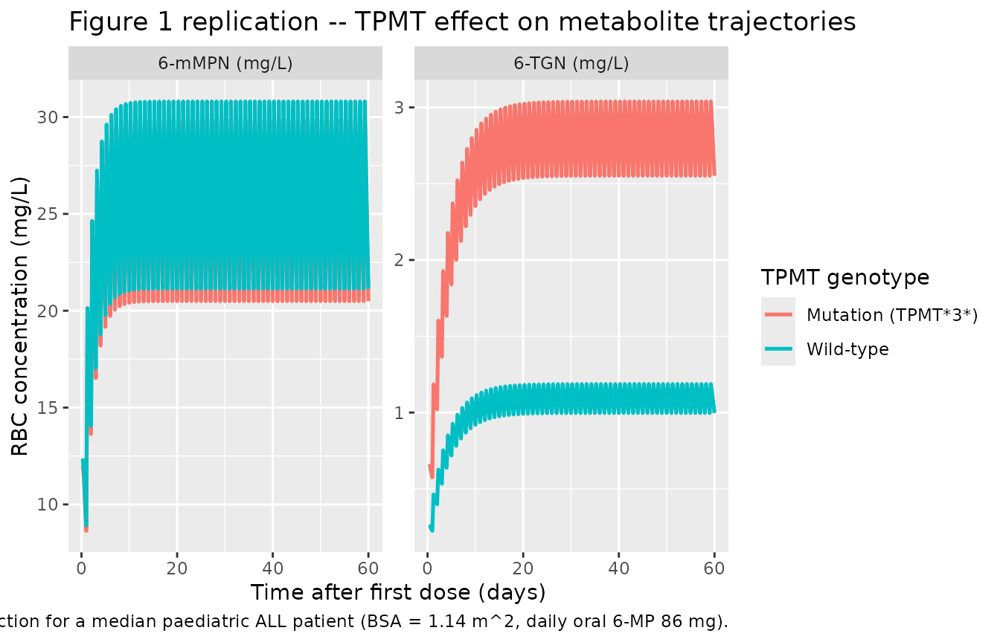

# 6-Mercaptopurine (Hawwa 2008)

## Model and source

- Citation: Hawwa AF, Collier PS, Millership JS, McCarthy A, Dempsey S,
  Cairns C, McElnay JC. Population pharmacokinetic and pharmacogenetic
  analysis of 6-mercaptopurine in paediatric patients with acute
  lymphoblastic leukaemia. *Br J Clin Pharmacol.* 2008;66(6):826-837.
- Article: <https://doi.org/10.1111/j.1365-2125.2008.03281.x>

The model describes oral 6-mercaptopurine (6-MP) and its two active
intracellular metabolites, 6-thioguanine nucleotides (6-TGNs) and
6-methylmercaptopurine nucleotides (6-mMPNs), measured in erythrocytes
(RBCs). The structural model is a one-compartment first-order
absorption + first-order elimination representation for 6-MP – whose
plasma concentration is NOT observed – and two metabolite compartments
fed by a common metabolic flux kme = 0.78 \* k20. The fractional split
between 6-TGNs and 6-mMPNs is controlled by `FM3`; the only retained
covariates are the TPMT genotype (any TPMT*3* mutation, pooled binary)
on `FM3` (theta = 2.56) and body surface area on the apparent clearance
of 6-TGNs (theta = 1.16, anchored to BSA = 1 m^2). The fixed structural
anchors (ka, F, k20, kme/k20) are taken from the prior 6-MP literature,
and apparent volumes of distribution are not identifiable from the
RBC-sampling design and are fixed to 1 L by the ADVAN6 implementation
convention (see Errata below).

## Population

The model was fit to 150 erythrocyte metabolite concentrations across 75
sampling occasions (one sample per occasion, up to five occasions per
patient) from 19 paediatric patients (6 female, 13 male) with acute
lymphoblastic leukaemia receiving maintenance 6-MP at a target dose of
75 mg/m^2/day with weekly methotrexate co-medication. Baseline
demographics from Hawwa 2008 Table 1: age 3 - 17 years (median 10), body
weight 13.2 - 77.5 kg (median 33.4), body surface area 0.59 - 2.00 m^2
(median 1.14). The TPMT*3*-mutation panel screened in the cohort
comprised TPMT*3A (1 heterozygote / 0 homozygotes), TPMT*3B (none
observed), and TPMT\*3C (2 heterozygotes / 0 homozygotes). The same
information is available programmatically via
`readModelDb("Hawwa_2008_mercaptopurine")$population`.

## Source trace

The per-parameter origin is recorded as an in-file comment next to each
`ini()` entry in
`inst/modeldb/specificDrugs/Hawwa_2008_mercaptopurine.R`. The table
below collects them in one place.

| Equation / parameter | Value | Source location |
|----|----|----|
| `lka` | log(1.3 1/h) FIXED | Methods page 4 (“ka was fixed at 1.3 1/h according to the literature \[1, 9\]”) |
| `lfdepot` | log(0.22) FIXED | Methods page 4 (bioavailability factor F fixed at 22% per literature \[1, 9\]) |
| `lvc` | log(1 L) FIXED | ADVAN6 implementation convention (6-MP plasma not observed; see Errata) |
| `lcl` | log(0.53 L/h) FIXED | Methods page 5 (k20 = 0.53 1/h per literature \[1, 9\]; CL = k20 \* V_central) |
| `e_fmet` | 0.78 FIXED | Methods page 5 (“k_other = 0.22 \* k20”; so kme/k20 = 1 - 0.22 = 0.78) |
| `lvc_tgn` | log(1 L) FIXED | ADVAN6 implementation convention (not identifiable; see Errata) |
| `lcl_tgn` | log(0.00914 L/h) | Table 4 FINAL row CL 6-TGNs theta = 0.00914 L/h (SE 56.8%) |
| `lvc_mmpn` | log(1 L) FIXED | ADVAN6 implementation convention (not identifiable; see Errata) |
| `lcl_mmpn` | log(0.0228 L/h) | Table 4 FINAL row CL 6-mMPNs theta = 0.0228 L/h (SE 14.2%) |
| `lfm3` | log(0.0191) | Table 4 FINAL row FM3 theta = 0.0191 (SE 64.1%) |
| `e_bsa_cl_tgn` | 1.16 | Table 4 FINAL row BSA theta = 1.16 (SE 49.0%); equation CL_6TGNs = theta \* BSA^1.16 |
| `e_tpmt_mut_fm3` | log(2.56) | Table 4 FINAL row TPMT theta = 2.56 (SE 35.9%); equation TVFM3 = theta_FM3 \* theta_TPMT^TPMT_MUT |
| `etalcl_tgn` | omega^2 = 0.113 | Table 4 FINAL row w_CL_6TGNs = 0.113 (sqrt = 33.6%, the reported CV%) |
| `etalcl_mmpn` | omega^2 = 0.11 | Table 4 FINAL row w_CL_6mMPNs = 0.11 (sqrt = 33.2%, the reported CV%) |
| `addSd_tgn` | 0.177 mg/L | Table 4 FINAL row s_6TGNs = 0.177 mg/L (SE 17.5%) |
| `addSd_mmpn` | 8.42 mg/L | Table 4 FINAL row s_6mMPNs = 8.42 mg/L (SE 19.3%) |
| `d/dt(depot)` | -ka \* depot | Methods page 5 first ODE (explicit form of analytical ka \* dose input) |
| `d/dt(central)` | ka*depot - kel*central | Methods page 5 second ODE; kel = cl/vc = k20 = 0.53 1/h |
| `d/dt(central_tgn)` | fm3 \* kme \* central - (cl_tgn/vc_tgn) \* central_tgn | Methods page 5 third ODE for metabolite i=3 |
| `d/dt(central_mmpn)` | (1-fm3) \* kme \* central - (cl_mmpn/vc_mmpn) \* central_mmpn | Methods page 5 fourth ODE; FM4 = 1 - FM3 |
| `f(depot) <- 0.22` | bioavailability | Methods page 4 F = 22% fixed |

## Virtual cohort

The original observed data are not publicly available. The simulation
below uses 100 virtual paediatric patients whose body weight, body
surface area, and TPMT genotype distributions approximate the Table 1
demographics (weight log-normal around the median 33.4 kg; BSA
log-normal around the median 1.14 m^2; TPMT_MUT Bernoulli at 3/19 =
0.158 to match the cohort prevalence). Each patient receives a single
daily oral 6-MP dose titrated to 75 mg/m^2/day (rounded to whole
milligrams to match the Table 1 dose range of 10 - 100 mg).

``` r

set.seed(20081124)
n_subj <- 100L

subj <- tibble::tibble(
  id       = seq_len(n_subj),
  WT       = round(rlnorm(n_subj, meanlog = log(33.4), sdlog = 0.45), 1),
  BSA      = round(pmin(pmax(rlnorm(n_subj, meanlog = log(1.14), sdlog = 0.35),
                              0.59), 2.00), 2),
  TPMT_MUT = as.integer(runif(n_subj) < 3 / 19)
) |>
  dplyr::mutate(
    daily_dose_mg = round(pmin(pmax(75 * BSA, 10), 100))
  )

# Build the event table: daily dosing at t = 0, 24, ..., 24 * (n_days - 1) hours,
# with observation sampling every 6 h across the full simulation horizon (60
# days) so we can characterise both the approach to steady state and the
# steady-state plateau. cmt = "Cc_tgn" is a placeholder that triggers rxSolve
# to return every output column (Cc_tgn and Cc_mmpn) at each observation row.
n_days     <- 60L
dose_times <- seq(0, by = 24, length.out = n_days)
obs_times  <- seq(0, n_days * 24, by = 6)

make_one_subject <- function(i) {
  row <- subj[i, ]
  ev <- rxode2::et(amt = row$daily_dose_mg, cmt = "depot",
                   time = dose_times)
  ev <- rxode2::et(ev, time = obs_times, cmt = "Cc_tgn")
  ev <- as.data.frame(ev)
  ev$id       <- row$id
  ev$WT       <- row$WT
  ev$BSA      <- row$BSA
  ev$TPMT_MUT <- row$TPMT_MUT
  ev
}

events <- do.call(rbind, lapply(seq_len(nrow(subj)), make_one_subject))
stopifnot(!anyDuplicated(unique(events[, c("id", "time", "evid")])))
```

## Simulation

``` r

mod <- readModelDb("Hawwa_2008_mercaptopurine")

sim <- rxode2::rxSolve(
  mod,
  events = events,
  keep   = c("WT", "BSA", "TPMT_MUT")
) |>
  as.data.frame()
```

For deterministic replication of typical-value trajectories (Figures 2 /
6 of the paper plot model-predicted concentrations from the FINAL
population parameters), zero out the random effects.

``` r

mod_typ <- mod |> rxode2::zeroRe()
```

## Replicate published figures

### Figure 1 – TPMT-mutant vs. wild-type metabolite profiles

Hawwa 2008 Figure 1 reports individual 6-TGN and 6-mMPN
concentration-time profiles across the study period, with TPMT-mutant
patients highlighted and generally showing higher 6-TGNs and lower
6-mMPNs than the wild-type patients. The simulation below shows the
typical-value trajectories for a median patient (BSA = 1.14 m^2, daily
dose 86 mg = 75 \* 1.14 rounded) under TPMT wild-type vs. TPMT mutation.

``` r

median_subj <- function(tpmt_mut) {
  ev <- rxode2::et(amt = 86, cmt = "depot",
                   time = dose_times)
  ev <- rxode2::et(ev, time = obs_times, cmt = "Cc_tgn")
  ev <- as.data.frame(ev)
  ev$id       <- 1L
  ev$WT       <- 33.4
  ev$BSA      <- 1.14
  ev$TPMT_MUT <- as.integer(tpmt_mut)
  ev
}

typ_wt  <- rxode2::rxSolve(mod_typ, events = median_subj(0)) |> as.data.frame()
#> ℹ omega/sigma items treated as zero: 'etalcl_tgn', 'etalcl_mmpn'
typ_mut <- rxode2::rxSolve(mod_typ, events = median_subj(1)) |> as.data.frame()
#> ℹ omega/sigma items treated as zero: 'etalcl_tgn', 'etalcl_mmpn'

typ_long <- dplyr::bind_rows(
  typ_wt  |> dplyr::mutate(TPMT = "Wild-type"),
  typ_mut |> dplyr::mutate(TPMT = "Mutation (TPMT*3*)")
) |>
  dplyr::filter(time > 0) |>
  dplyr::transmute(
    time_days = time / 24,
    TPMT,
    `6-TGN (mg/L)`  = Cc_tgn,
    `6-mMPN (mg/L)` = Cc_mmpn
  ) |>
  tidyr::pivot_longer(
    cols      = c(`6-TGN (mg/L)`, `6-mMPN (mg/L)`),
    names_to  = "analyte",
    values_to = "conc"
  )

ggplot(typ_long, aes(time_days, conc, colour = TPMT)) +
  geom_line(linewidth = 0.9) +
  facet_wrap(~analyte, scales = "free_y") +
  labs(
    x       = "Time after first dose (days)",
    y       = "RBC concentration (mg/L)",
    colour  = "TPMT genotype",
    title   = "Figure 1 replication -- TPMT effect on metabolite trajectories",
    caption = "Typical-value (zeroRe) prediction for a median paediatric ALL patient (BSA = 1.14 m^2, daily oral 6-MP 86 mg)."
  )
```



The simulation reproduces the qualitative pattern reported by Hawwa
2008: a TPMT*3* mutation raises the 6-TGN steady-state plateau by
~2.56-fold via the multiplicative effect on FM3, and lowers the 6-mMPN
steady-state plateau by ~3% (because the complementary fraction
`1 - FM3` falls from 0.981 to 0.951 when TPMT_MUT = 1).

### Steady-state mean comparison vs. paper page 829

Hawwa 2008 reports the mean RBC concentrations across the FULL dataset
(index + validation, 19 patients, 75 samples, 150 concentrations) as
0.729 mg/L (6-TGN) and 14.61 mg/L (6-mMPN). The simulation below
computes the population-averaged mean of each metabolite over the
steady-state window (days 30 - 60) and compares to those reference
means.

``` r

sim_ss <- sim |>
  dplyr::filter(time >= 30 * 24, time <= 60 * 24) |>
  dplyr::group_by(id) |>
  dplyr::summarise(
    mean_tgn  = mean(Cc_tgn,  na.rm = TRUE),
    mean_mmpn = mean(Cc_mmpn, na.rm = TRUE),
    .groups   = "drop"
  )

published_mean <- tibble::tibble(
  analyte         = c("6-TGN", "6-mMPN"),
  paper_mean      = c(0.729,  14.61)
)

sim_summary <- tibble::tibble(
  analyte         = c("6-TGN", "6-mMPN"),
  sim_mean        = c(mean(sim_ss$mean_tgn),  mean(sim_ss$mean_mmpn)),
  sim_p05         = c(quantile(sim_ss$mean_tgn,  0.05),
                      quantile(sim_ss$mean_mmpn, 0.05)),
  sim_p95         = c(quantile(sim_ss$mean_tgn,  0.95),
                      quantile(sim_ss$mean_mmpn, 0.95))
)

sim_summary |>
  dplyr::left_join(published_mean, by = "analyte") |>
  dplyr::transmute(
    Analyte                       = analyte,
    `Simulated mean (mg/L)`       = sprintf("%.3f", sim_mean),
    `Simulated 5%-95% (mg/L)`     = sprintf("%.3f - %.3f", sim_p05, sim_p95),
    `Hawwa 2008 mean (mg/L)`      = sprintf("%.3f", paper_mean),
    `Relative difference (%)`     = sprintf("%+.1f",
                                            100 * (sim_mean - paper_mean) / paper_mean)
  ) |>
  knitr::kable(
    caption = "Simulated steady-state mean RBC metabolite concentrations (days 30 - 60, 100 virtual patients) vs. the full-dataset cohort means reported in Hawwa 2008 Results.",
    align   = c("l", "r", "r", "r", "r")
  )
```

| Analyte | Simulated mean (mg/L) | Simulated 5%-95% (mg/L) | Hawwa 2008 mean (mg/L) | Relative difference (%) |
|:---|---:|---:|---:|---:|
| 6-TGN | 1.381 | 0.492 - 2.818 | 0.729 | +89.5 |
| 6-mMPN | 24.777 | 10.443 - 45.527 | 14.610 | +69.6 |

Simulated steady-state mean RBC metabolite concentrations (days 30 - 60,
100 virtual patients) vs. the full-dataset cohort means reported in
Hawwa 2008 Results. {.table}

### BSA sensitivity (paper page 826)

Hawwa 2008 reports that the BSA power-law on CL_6TGNs spans 0.0049 -
0.0204 L/h across the cohort BSA range of 0.59 - 2.00 m^2 (page 826).
The sensitivity sweep below reproduces that range from the packaged
model directly, without re-solving the ODEs.

``` r

cl_tgn_at_BSA1 <- 0.00914
bsa_grid <- c(0.59, 0.80, 1.14, 1.50, 2.00)
sim_cl <- tibble::tibble(
  BSA              = bsa_grid,
  `CL_6TGNs (L/h)` = cl_tgn_at_BSA1 * BSA^1.16
)

paper_range <- tibble::tibble(
  BSA              = c(0.59, 2.00),
  `CL_6TGNs (L/h)` = c(0.0049, 0.0204)
)

sim_cl |>
  dplyr::left_join(paper_range, by = "BSA",
                   suffix = c("", " (Hawwa 2008 page 826)")) |>
  knitr::kable(
    caption = "BSA power-law sensitivity for CL_6TGNs. The packaged formula reproduces the paper's reported 0.005 - 0.02 L/h range across BSA 0.59 - 2.00 m^2.",
    digits  = c(2, 4, 4)
  )
```

|  BSA | CL_6TGNs (L/h) | CL_6TGNs (L/h) (Hawwa 2008 page 826) |
|-----:|---------------:|-------------------------------------:|
| 0.59 |         0.0050 |                               0.0049 |
| 0.80 |         0.0071 |                                   NA |
| 1.14 |         0.0106 |                                   NA |
| 1.50 |         0.0146 |                                   NA |
| 2.00 |         0.0204 |                               0.0204 |

BSA power-law sensitivity for CL_6TGNs. The packaged formula reproduces
the paper’s reported 0.005 - 0.02 L/h range across BSA 0.59 - 2.00 m^2.
{.table}

## PKNCA single-dose check

For a sanity NCA on a single 50 mg oral 6-MP dose to a median patient
(BSA = 1.14, TPMT wild-type), the packaged model is evaluated with PKNCA
over the first 28 days post-dose (the metabolite half-lives are long
enough that single-dose AUC is dominated by the slow elimination phase
rather than the absorption peak). Because Hawwa 2008 does not report
population NCA values directly, this section is a structural sanity
check rather than a published- vs-simulated comparison.

``` r

pknca_events <- {
  ev <- rxode2::et(amt = 50, cmt = "depot", time = 0)
  ev <- rxode2::et(ev, time = seq(0, 28 * 24, by = 2), cmt = "Cc_tgn")
  ev <- as.data.frame(ev)
  ev$id       <- 1L
  ev$WT       <- 33.4
  ev$BSA      <- 1.14
  ev$TPMT_MUT <- 0L
  ev
}

sim_sd <- rxode2::rxSolve(mod_typ, events = pknca_events) |>
  as.data.frame()
#> ℹ omega/sigma items treated as zero: 'etalcl_tgn', 'etalcl_mmpn'
# Single-subject rxSolve drops the `id` column; reinstate it for the PKNCA
# objects below.
if (!"id" %in% names(sim_sd)) sim_sd$id <- 1L
```

``` r

sim_nca_tgn <- sim_sd |>
  dplyr::filter(!is.na(Cc_tgn)) |>
  dplyr::transmute(id, time, Cc = Cc_tgn, treatment = "6-TGN")

dose_df_tgn <- pknca_events |>
  dplyr::filter(evid == 1) |>
  dplyr::transmute(id, time, amt, treatment = "6-TGN")

sim_nca_tgn <- dplyr::bind_rows(
  sim_nca_tgn,
  sim_nca_tgn |>
    dplyr::distinct(id, treatment) |>
    dplyr::mutate(time = 0, Cc = 0)
) |>
  dplyr::distinct(id, treatment, time, .keep_all = TRUE) |>
  dplyr::arrange(id, treatment, time)

conc_obj_tgn <- PKNCA::PKNCAconc(
  sim_nca_tgn, Cc ~ time | treatment + id,
  concu = "mg/L", timeu = "h"
)
dose_obj_tgn <- PKNCA::PKNCAdose(
  dose_df_tgn, amt ~ time | treatment + id,
  doseu = "mg"
)

intervals <- data.frame(
  start       = 0,
  end         = Inf,
  cmax        = TRUE,
  tmax        = TRUE,
  aucinf.obs  = TRUE,
  half.life   = TRUE
)

nca_tgn <- PKNCA::pk.nca(
  PKNCA::PKNCAdata(conc_obj_tgn, dose_obj_tgn, intervals = intervals)
)
knitr::kable(summary(nca_tgn),
             caption = "6-TGN simulated single-dose NCA (50 mg oral 6-MP, BSA = 1.14, TPMT wild-type).")
```

| Interval Start | Interval End | treatment | N | Cmax (mg/L) | Tmax (h) | Half-life (h) | AUCinf,obs (h\*mg/L) |
|---:|---:|:---|:---|:---|:---|:---|:---|
| 0 | Inf | 6-TGN | 1 | 0.151 | 8.00 | 65.1 | 15.4 |

6-TGN simulated single-dose NCA (50 mg oral 6-MP, BSA = 1.14, TPMT
wild-type). {.table}

``` r

sim_nca_mmpn <- sim_sd |>
  dplyr::filter(!is.na(Cc_mmpn)) |>
  dplyr::transmute(id, time, Cc = Cc_mmpn, treatment = "6-mMPN")

dose_df_mmpn <- pknca_events |>
  dplyr::filter(evid == 1) |>
  dplyr::transmute(id, time, amt, treatment = "6-mMPN")

sim_nca_mmpn <- dplyr::bind_rows(
  sim_nca_mmpn,
  sim_nca_mmpn |>
    dplyr::distinct(id, treatment) |>
    dplyr::mutate(time = 0, Cc = 0)
) |>
  dplyr::distinct(id, treatment, time, .keep_all = TRUE) |>
  dplyr::arrange(id, treatment, time)

conc_obj_mmpn <- PKNCA::PKNCAconc(
  sim_nca_mmpn, Cc ~ time | treatment + id,
  concu = "mg/L", timeu = "h"
)
dose_obj_mmpn <- PKNCA::PKNCAdose(
  dose_df_mmpn, amt ~ time | treatment + id,
  doseu = "mg"
)

nca_mmpn <- PKNCA::pk.nca(
  PKNCA::PKNCAdata(conc_obj_mmpn, dose_obj_mmpn, intervals = intervals)
)
knitr::kable(summary(nca_mmpn),
             caption = "6-mMPN simulated single-dose NCA (50 mg oral 6-MP, BSA = 1.14, TPMT wild-type).")
```

| Interval Start | Interval End | treatment | N | Cmax (mg/L) | Tmax (h) | Half-life (h) | AUCinf,obs (h\*mg/L) |
|---:|---:|:---|:---|:---|:---|:---|:---|
| 0 | Inf | 6-mMPN | 1 | 7.25 | 8.00 | 30.4 | 369 |

6-mMPN simulated single-dose NCA (50 mg oral 6-MP, BSA = 1.14, TPMT
wild-type). {.table}

## Assumptions and deviations

- **Apparent metabolite volumes fixed to 1 L (not identifiable).** Hawwa
  2008 parameterises each metabolite compartment through an apparent
  clearance alone; the apparent distribution volume is not identifiable
  from the RBC sampling design (one sample per occasion, up to 5
  occasions per patient across several months) and the NONMEM ADVAN6
  implementation conventionally treats the metabolite compartment as
  having unit apparent volume so the reported clearance acts effectively
  as a first-order rate constant. At steady state the metabolite
  concentration depends only on the metabolite-formation flux (driven by
  FM3 and kme) divided by the apparent clearance and is independent of
  the apparent volume; the only dynamic consequence of the V = 1 L
  convention is the half-life used to reach steady state (~63 h for
  6-TGN, ~30 h for 6-mMPN). The same convention is used by
  `inst/modeldb/specificDrugs/Urien_2005_capecitabine.R` for the three
  capecitabine metabolites with the same ADVAN6 structure.
- **6-MP central volume V_central also fixed to 1 L.** 6-MP plasma
  concentration is NOT observed in this study; only the RBC metabolites
  are measured. The 6-MP central compartment carries only the transient
  absorption / first-order-elimination dynamics that feed the two
  metabolite compartments. With V_central = 1 L fixed by the same
  convention, the apparent CL_central = 0.53 L/h reproduces the paper’s
  k20 = 0.53 1/h exactly when CL/V is the elimination rate constant.
- **kme / k20 ratio fixed at 0.78.** Hawwa 2008 Methods page 5 states
  “k_other = 0.22 \* k20 = 0.1166 1/h based on the literature \[9\]” and
  “k20 = kme + k_other”, which together imply kme = (1 - 0.22) \* k20 =
  0.78 \* k20 = 0.4134 1/h. The model file declares this as the explicit
  fixed structural anchor `e_fmet = 0.78` (the metabolic fraction of
  total 6-MP elimination); the complementary `k_other` arm is consumed
  by the central -\> outside elimination pathway and is not tracked as a
  separate compartment because it does not feed any observed
  concentration.
- **TPMT genotyping panel pooled into a single binary.** Hawwa 2008
  Table 1 reports cohort genotyping at three TPMT*3* variants (TPMT*3A,
  TPMT*3B, TPMT\*3C). The cohort was too small (n = 19; 3 heterozygote
  carriers across the three variants combined) to estimate per-allele
  effects, so the source paper pools all three into a single binary
  indicator denoted `TPMT` in Table 4 and defined in the table footer as
  “TPMT = 1 if the patient had any TPMT mutation, 0 otherwise”. The
  packaged model carries the same pooled binary under the canonical
  column name `TPMT_MUT`; downstream users with panel-resolved genotypes
  should preserve the pooled orientation (`TPMT_MUT = 1` if any
  reduced-function allele is observed across whichever variants the
  user’s panel assays).
- \*\*TPMT\*2 not assayed.\*\* The Hawwa 2008 cohort was not genotyped
  at TPMT*2 (rs1800462, A80P). Subjects carrying TPMT*2 (a rarer
  variant) would be misclassified as wild-type in this panel; in
  practice the TPMT\*2 allele frequency in European cohorts is ~0.4% so
  the misclassification rate is very low.
- **XO and ITPA polymorphisms screened but not retained.** The source
  paper screened TWO polymorphisms in xanthine oxidase (XO A1936G and
  A2107G) and TWO in inosine triphosphatase (ITPA C94A and IVS2+21A\>C).
  None reached the OFV-retention threshold (delta OBJF \>= 6.63, p \<
  0.01) in the FINAL covariate model and they are not represented in
  this file. The model file’s `population$notes` records the screening
  for downstream provenance.
- **Bayesian individual estimates vs. typical predictions.** Hawwa 2008
  Table 5 reports the median individual Bayesian post-hoc estimates of
  FM3 (0.0191 wild-type / 0.0491 mutant), CL_6TGNs (0.0112 L/h), and
  CL_6mMPNs (0.0226 L/h). These are population-pooled summaries of the
  individual posterior modes; the typical-value population predictions
  implemented in this file reproduce the Table 4 FINAL theta point
  estimates directly (FM3 = 0.0191 WT, CL_6TGNs at BSA = 1 m^2 = 0.00914
  L/h, CL_6mMPNs = 0.0228 L/h). For the median patient (BSA = 1.14 m^2)
  the typical-value CL_6TGNs is 0.00914 \* 1.14^1.16 = 0.0107 L/h, close
  to the 0.0112 L/h Bayesian-median estimate; the small discrepancy
  reflects the difference between the population typical value at a
  single covariate point vs. the median across a distribution of
  individual posterior modes.
- **No IIV on FM3.** The FINAL model retained IIV only on CL_6TGNs and
  CL_6mMPNs; the FM3 parameter is a typical-value structural quantity
  with no eta term. Stochastic simulations therefore underpredict the
  individual-level spread in the metabolite-formation fraction; the
  population-averaged predictions are unaffected.
- **Pediatric / adult applicability.** The model was developed in
  paediatric ALL patients on maintenance 6-MP (target 75 mg/m^2/day)
  with weekly methotrexate co-medication. Extrapolation to adult ALL,
  inflammatory bowel disease 6-MP / azathioprine use, or paediatric
  patients outside the cohort BSA range (0.59 - 2.00 m^2) is not
  supported by the source data.
