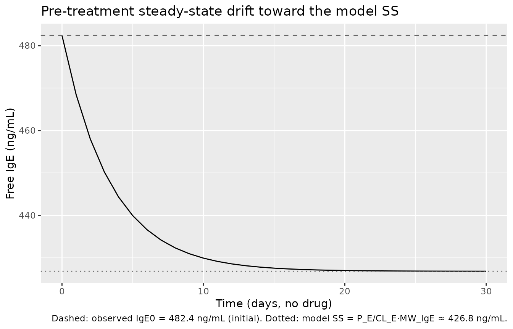

# Omalizumab (Hayashi 2007)

``` r

library(nlmixr2lib)
library(rxode2)
#> rxode2 5.0.2 using 2 threads (see ?getRxThreads)
#>   no cache: create with `rxCreateCache()`
library(dplyr)
#> 
#> Attaching package: 'dplyr'
#> The following objects are masked from 'package:stats':
#> 
#>     filter, lag
#> The following objects are masked from 'package:base':
#> 
#>     intersect, setdiff, setequal, union
library(tidyr)
library(ggplot2)
library(PKNCA)
#> 
#> Attaching package: 'PKNCA'
#> The following object is masked from 'package:stats':
#> 
#>     filter
```

## Omalizumab–IgE binding population PK/PD model

Omalizumab is a humanized anti-IgE IgG1 monoclonal antibody used in
moderate-to-severe atopic asthma. It interrupts the allergic cascade by
binding free serum IgE, lowering its concentration, and downmodulating
FcεRI on basophils and mast cells. Hayashi et al. (2007) developed a
mechanism-based population PK/PD model in 202 Japanese subjects (single-
and multiple-dose studies 1101 and 1305) that describes three serum
entities — free omalizumab, free IgE, and the omalizumab–IgE complex —
each with their own clearance and volume of distribution, coupled by an
instantaneous-equilibrium binding step (law of mass action) with a
concentration-dependent dissociation constant. Body weight modifies
omalizumab CL and Vd; baseline IgE modifies IgE CL and IgE production
rate. The model was externally validated against 531 White patients
(studies 007/008/009).

- Citation: Hayashi N, Tsukamoto Y, Sallas WM, Lowe PJ. A
  mechanism-based binding model for the population pharmacokinetics and
  pharmacodynamics of omalizumab. Br J Clin Pharmacol.
  2007;63(5):548-561. <doi:10.1111/j.1365-2125.2006.02803.x> (PMID
  17096680).
- Article: <https://doi.org/10.1111/j.1365-2125.2006.02803.x>
- PMID: 17096680

## Population

The model-building dataset comprises 202 Japanese subjects from two
clinical studies (Hayashi 2007 Table 1):

| Study | Indication | n (used) | Design | Body weight (kg) | Baseline IgE (ng/mL) |
|----|----|---:|----|----|----|
| 1101 | Healthy atopic volunteers | 48 | Single SC dose 75–375 mg | 62.5 ± 6.4 (51–79) | 811 ± 473 (204–2143) |
| 1305 | Seasonal allergic rhinitis (Japan) | 154 | Multiple SC dosing per the body-weight × IgE table (Table 2) | 60.5 ± 10.2 (42–101) | 373 ± 317 (53–1316) |

A total of 3192 observation records (1037 omalizumab, 1191 total IgE,
964 free IgE) were included; 275 free-IgE values above the 150 ng/mL
upper limit of quantification were excluded. The same metadata is
available programmatically through
`readModelDb("Hayashi_2007_omalizumab")$population`.

## Source trace

Per-parameter origin is recorded as in-file comments next to each
[`ini()`](https://nlmixr2.github.io/rxode2/reference/ini.html) entry in
`inst/modeldb/specificDrugs/Hayashi_2007_omalizumab.R`. The table
collects them for review.

| Equation / parameter | Value (paper) | Value (file) | Source |
|----|----|----|----|
| `lka` (SC absorption rate) | 0.0200 1/h | log(0.0200·24) 1/d | Table 3 |
| `lcl` (apparent CL of free omalizumab at 61.1 kg) | 7.32 mL/h | log(0.00732·24) L/d | Table 3 |
| `ldcl_complex` (apparent excess CL of complex) | 5.86 mL/h | log(0.00586·24) L/d | Table 3 |
| `lcl_ige` (apparent CL of free IgE at 482.4 ng/mL) | 71.0 mL/h | log(0.071·24) L/d | Table 3 |
| `lvc` (apparent V of omalizumab and IgE at 61.1 kg) | 5900 mL | log(5.9) L | Table 3 (V_E/f = V_X/f, footnote ‡) |
| `lvc_complex` (apparent V of complex) | 3630 mL | log(3.63) L | Table 3 |
| `lp_ige` (apparent IgE production rate at 482.4 ng/mL) | 30.3 µg/h (= 0.1595 nmol/h) | log(0.1595·24) nmol/d | Table 3, footnote † |
| `lkd0` (Kd at X_TX = X_TE) | 1.07 nM | log(1.07) nM | Table 3 |
| `e_wt_cl` (BW exponent on CL_X) | 0.911 | 0.911 | Table 3 |
| `e_wt_vc` (BW exponent on V_X) | 0.658 | 0.658 | Table 3 |
| `e_ige_cl_ige` (IgE0 exponent on CL_E) | −0.281 | −0.281 | Table 3 |
| `e_ige_p_ige` (IgE0 exponent on P_E) | 0.657 | 0.657 | Table 3 |
| `alpha` (concentration dependence on Kd) | 0.157 | 0.157 | Table 3 |
| `etalka` | CV 39.9% | ω² = 0.14773 | Table 3 |
| `etalcl` | CV 20.3% | ω² = 0.04042 | Table 3 |
| `etaldcl_complex` | CV 34.9% | ω² = 0.11488 | Table 3 |
| `etalvc` (shared by V_X and V_E) | CV 13.0% | ω² = 0.01679 | Table 3 |
| `etalvc_complex` | CV 25.0% | ω² = 0.06062 | Table 3 |
| `etalcl_ige + etalp_ige` (block; r = 0.968) | CV 25.3% / 23.1% | ω² = 0.06205, cov 0.05496, ω² = 0.05197 | Table 3 |
| `propSd` / `propSd_totalIgE` / `propSd_freeIgE` (Y = F·exp(ε)) | σ ≈ 16.7% / 21.1% / 21.8% | 0.167 / 0.211 / 0.218 | Table 3 |
| Eq. dX_SC/dt = −ka·X_SC + f·D·δ(t−tD) | n/a | n/a | Methods, page 552 |
| Eq. dX_TX/dt = ka·X_SC − CL_X·C_fX − CL_C·C_C | n/a | n/a | Methods, page 552 |
| Eq. dX_TE/dt = P_E − CL_E·C_fE − CL_C·C_C | n/a | n/a | Methods, page 552 |
| Quadratic X_C = ½{S − √(S² − 4·X_TX·X_TE)}, S = X_TX + X_TE + Kd·V_X·V_E/V_C | n/a | n/a | Methods, page 552 |
| Concentration-dependent Kd = Kd0·(X_TX/X_TE)^α | n/a | n/a | “The dissociation constant”, page 552 |
| Power covariates: CL_X, V_X on (WT/61.1); CL_E, P_E on (IgE0/482.4) | n/a | n/a | Page 555 equations |
| MW(omalizumab) = 150 kDa; MW(IgE) = 190 kDa | 150 / 190 kDa | 150 / 190 kDa | Methods, page 552 |
| Subcutaneous bioavailability used to translate apparent values to absolute | f = 0.62 (ref \[28\]) | not encoded; CL/f and V/f in [`ini()`](https://nlmixr2.github.io/rxode2/reference/ini.html) | Discussion, page 559 |

## Virtual cohort

Original observed data are not publicly available. The cohort below
reproduces the four single-dose groups of study 1101 (75, 150, 300, and
375 mg SC) — the only design with a dense sampling schedule (Hayashi
2007 Methods, page 549). Body weight and baseline IgE are sampled from
the study-1101 distribution (mean 62.5 kg ± 6.4 kg; mean 811 ng/mL ± 473
ng/mL, log-normal).

``` r

set.seed(20070501L) # paper publication month YYYYMM01

study_1101_doses <- c(75, 150, 300, 375)
n_per_dose       <- 12L

make_cohort <- function(n, dose_mg, id_offset = 0L) {
  data.frame(
    id    = id_offset + seq_len(n),
    dose  = dose_mg,
    WT    = pmax(45, pmin(80, rnorm(n, mean = 62.5, sd = 6.4))),
    IGE   = pmax(200, pmin(2200,
              exp(rnorm(n, mean = log(811) - 0.5 * log(1 + (473 / 811)^2),
                          sd = sqrt(log(1 + (473 / 811)^2))))))
  )
}

cohorts <- bind_rows(lapply(seq_along(study_1101_doses), function(i) {
  make_cohort(n_per_dose, study_1101_doses[i],
              id_offset = (i - 1L) * n_per_dose)
}))

obs_times <- c(0, 0.5, 1, 2, 4, 7, 10, 14, 28, 42, 56, 70, 84) # days, study 1101 schedule

events <- cohorts |>
  rowwise() |>
  do({
    row <- .
    et_obj <- rxode2::et(time = 0, amt = row$dose, cmt = "depot") |>
      rxode2::et(obs_times, cmt = "Cc")
    et_obj$id    <- row$id
    et_obj$WT    <- row$WT
    et_obj$IGE   <- row$IGE
    et_obj$dose  <- row$dose
    et_obj
  }) |>
  ungroup() |>
  as.data.frame()

stopifnot(!anyDuplicated(unique(events[, c("id", "time", "evid")])))
```

## Simulation

``` r

mod <- readModelDb("Hayashi_2007_omalizumab")
sim <- rxode2::rxSolve(mod, events = events,
                       keep = c("dose", "WT", "IGE"),
                       returnType = "data.frame", addDosing = FALSE)
#> ℹ parameter labels from comments will be replaced by 'label()'
sim$dose_label <- factor(paste0(sim$dose, " mg"),
                         levels = paste0(study_1101_doses, " mg"))
```

## Replicate published Figure 3 — single-dose profiles by dose level

Hayashi 2007 Figure 3 shows individual observed serum concentrations of
omalizumab, total IgE, and free IgE in study 1101 over 84 days, with 80%
prediction intervals. We reproduce the cohort means with 80% prediction
intervals from the simulated population.

``` r

sim |>
  group_by(time, dose_label) |>
  summarise(
    Q10 = quantile(Cc, 0.10, na.rm = TRUE),
    Q50 = quantile(Cc, 0.50, na.rm = TRUE),
    Q90 = quantile(Cc, 0.90, na.rm = TRUE),
    .groups = "drop"
  ) |>
  ggplot(aes(time, Q50)) +
  geom_ribbon(aes(ymin = Q10, ymax = Q90), alpha = 0.25) +
  geom_line() +
  facet_wrap(~ dose_label, scales = "free_y") +
  labs(x = "Time (days)", y = "Total omalizumab (µg/mL)",
       title = "Hayashi 2007 Figure 3, omalizumab panel",
       caption = "Lines: median; ribbon: 10th–90th percentile from 12 simulated subjects per dose.")
```


Replicates Figure 3 of Hayashi 2007 (top row, omalizumab vs time by
single-dose group, study 1101).

``` r

sim |>
  group_by(time, dose_label) |>
  summarise(
    Q10 = quantile(freeIgE, 0.10, na.rm = TRUE),
    Q50 = quantile(freeIgE, 0.50, na.rm = TRUE),
    Q90 = quantile(freeIgE, 0.90, na.rm = TRUE),
    .groups = "drop"
  ) |>
  ggplot(aes(time, Q50)) +
  geom_ribbon(aes(ymin = Q10, ymax = Q90), alpha = 0.25) +
  geom_line() +
  facet_wrap(~ dose_label) +
  scale_y_log10() +
  geom_hline(yintercept = 12, lty = 2, colour = "grey40") +
  geom_hline(yintercept = 21, lty = 2, colour = "grey40") +
  labs(x = "Time (days)", y = "Free IgE (ng/mL, log scale)",
       title = "Hayashi 2007 Figure 3, free-IgE panel",
       caption = "Dashed grey lines indicate the 12–21 ng/mL clinical-efficacy band cited in Hayashi 2007.")
```


Replicates Figure 3 of Hayashi 2007 (free IgE vs time by single-dose
group, study 1101).

``` r

sim |>
  group_by(time, dose_label) |>
  summarise(
    Q10 = quantile(totalIgE, 0.10, na.rm = TRUE),
    Q50 = quantile(totalIgE, 0.50, na.rm = TRUE),
    Q90 = quantile(totalIgE, 0.90, na.rm = TRUE),
    .groups = "drop"
  ) |>
  ggplot(aes(time, Q50)) +
  geom_ribbon(aes(ymin = Q10, ymax = Q90), alpha = 0.25) +
  geom_line() +
  facet_wrap(~ dose_label) +
  labs(x = "Time (days)", y = "Total IgE (ng/mL)",
       title = "Hayashi 2007 Figure 3, total-IgE panel")
```


Replicates Figure 3 of Hayashi 2007 (total IgE vs time by single-dose
group, study 1101).

## PKNCA validation — omalizumab

PKNCA computes Cmax, Tmax, AUC(0,∞), and terminal half-life on the
simulated total-omalizumab profile. Hayashi 2007 reports a
noncompartmental terminal half-life of 18.2 days for total omalizumab in
study 1101 (Discussion, page 558) and a model-derived half-life of 23
days for free omalizumab. The compartmental Cc output is total
omalizumab (free + complex), so the NCA t½ is expected to land between
those two values.

``` r

sim_nca <- sim |>
  filter(!is.na(Cc)) |>
  select(id, time, Cc, dose_label)

dose_df <- events |>
  filter(evid == 1) |>
  mutate(dose_label = factor(paste0(amt, " mg"),
                             levels = paste0(study_1101_doses, " mg"))) |>
  select(id, time, amt, dose_label)

conc_obj <- PKNCA::PKNCAconc(sim_nca, Cc ~ time | dose_label + id)
dose_obj <- PKNCA::PKNCAdose(dose_df, amt ~ time | dose_label + id)

intervals <- data.frame(
  start      = 0,
  end        = Inf,
  cmax       = TRUE,
  tmax       = TRUE,
  aucinf.obs = TRUE,
  half.life  = TRUE
)

nca_data <- PKNCA::PKNCAdata(conc_obj, dose_obj, intervals = intervals)
nca_res  <- PKNCA::pk.nca(nca_data)
nca_summary <- summary(nca_res)
knitr::kable(nca_summary, caption = "Simulated NCA parameters by single-dose group (study 1101).")
```

| start | end | dose_label | N | cmax | tmax | half.life | aucinf.obs |
|---:|---:|:---|:---|:---|:---|:---|:---|
| 0 | Inf | 75 mg | 12 | 11.1 \[15.5\] | 7.00 \[4.00, 7.00\] | 11.0 \[3.89\] | 320 \[21.6\] |
| 0 | Inf | 150 mg | 12 | 21.3 \[9.88\] | 7.00 \[4.00, 7.00\] | 12.8 \[2.63\] | 715 \[14.4\] |
| 0 | Inf | 300 mg | 12 | 42.3 \[15.6\] | 7.00 \[4.00, 10.0\] | 18.3 \[6.68\] | 1610 \[16.6\] |
| 0 | Inf | 375 mg | 12 | 49.7 \[13.3\] | 7.00 \[4.00, 10.0\] | 17.3 \[5.71\] | 1770 \[25.6\] |

Simulated NCA parameters by single-dose group (study 1101). {.table}

### Comparison against published values

Hayashi 2007 reports only a single global noncompartmental t½ for total
omalizumab in study 1101 (18.2 days; Discussion, page 558) and the
model-derived half-lives of free omalizumab (23 days) and IgE (2.4
days). The simulated terminal t½ for total omalizumab in the typical
patient should sit between the two model-derived bounds (23 days for
free omalizumab; faster for the complex due to ΔCL_C = 5.86 mL/h on top
of CL_X = 7.32 mL/h). No per-dose NCA table is published, so a fully
quantitative side-by-side comparison is not possible.

## Mechanism check — typical-value pre-treatment steady state

Without drug, X_TE evolves under `dX_TE/dt = P_E − CL_E·C_fE`. The
model’s typical-value pre-treatment steady-state free-IgE concentration
is `(P_E / CL_E) · MW_IgE` = 426.8 ng/mL. The covariate reference value
is 482.4 ng/mL — a small (~12%) intentional offset because P_E and CL_E
are independently estimated and not constrained to reproduce IgE0 at
steady state. With the model’s initial condition
`X_TE(0) = (IGE / MW_IgE)·V_E`, free IgE starts at the observed baseline
and drifts toward the model SS over the first few days when there is no
drug; once dosing begins the binding kinetics dominate this small drift.

``` r

mod_typ <- rxode2::zeroRe(mod)
#> ℹ parameter labels from comments will be replaced by 'label()'
ev_nodose <- rxode2::et(seq(0, 30, by = 1), cmt = "Cc")
sim_nodose <- rxode2::rxSolve(mod_typ, events = ev_nodose,
                              params = c(WT = 61.1, IGE = 482.4),
                              returnType = "data.frame", addDosing = FALSE)
#> ℹ omega/sigma items treated as zero: 'etalka', 'etalcl', 'etaldcl_complex', 'etalvc', 'etalvc_complex', 'etalcl_ige', 'etalp_ige'
ggplot(sim_nodose, aes(time, freeIgE)) +
  geom_line() +
  geom_hline(yintercept = 482.4, lty = 2, colour = "grey40") +
  geom_hline(yintercept = (0.1595 / 0.071) * 190, lty = 3, colour = "grey40") +
  labs(x = "Time (days, no drug)", y = "Free IgE (ng/mL)",
       title = "Pre-treatment steady-state drift toward the model SS",
       caption = "Dashed: observed IgE0 = 482.4 ng/mL (initial). Dotted: model SS = P_E/CL_E·MW_IgE ≈ 426.8 ng/mL.")
```



## Assumptions and deviations

- **Bioavailability not encoded explicitly.** The paper reports apparent
  parameters (CL_X/f, V_X/f, etc.) and notes f = 0.62 from a separate
  source (Discussion, page 559). The model file uses the apparent values
  directly with no f scaling on the dose, which faithfully reproduces
  the predicted measured concentrations in the original NONMEM fit.
  Absolute clearances and volumes can be recovered by multiplying the
  apparent values by 0.62.
- **Time unit conversion h → d.** The paper reports CL and ka in 1/h,
  consistent with NONMEM convention. The model file converts to 1/day by
  multiplying each rate by 24, with the conversion shown in the
  [`ini()`](https://nlmixr2.github.io/rxode2/reference/ini.html)
  source-trace comment for every rate parameter. Half-lives derived from
  the converted values match the paper (23 days for free omalizumab, 2.4
  days for IgE).
- **Residual error written as proportional rather than exact
  log-normal.** Hayashi 2007 uses Y = F · exp(ε); for σ in the 0.17–0.22
  range encountered here, Y ≈ F·(1 + ε), so a proportional error model
  with `propSd = σ` is faithful to within third-order ε terms. nlmixr2’s
  `prop()` keyword maps to this approximation; the alternative `lnorm()`
  parameterization could be used in future revisions.
- **V_E/f shared with V_X/f.** Footnote ‡ of Table 3 states V_E/f was
  fixed equal to V_X/f because separate estimation did not converge. The
  model file enforces this by setting `v_ige <- vc` (same individual
  parameter, including the same `etalvc` IIV).
- **Concentration-dependent Kd at t = 0.** With `central` (paper X_TX) =
  0 at t = 0, Kd = Kd0·(0/total_target)^α = 0 for α \> 0, S =
  total_target, and the negative root yields X_C = 0. This matches the
  physical expectation (no drug, no complex). After dosing begins
  `central` becomes strictly positive and the expression evaluates
  without numerical issues.
- **Compartment names.** The paper’s X_TX (total omalizumab amount in
  serum, free + complex) maps to the canonical `central` compartment;
  X_TE (total IgE amount, free + complex) maps to `total_target`. This
  follows the canonical TMDD compartment names registered in
  `references/naming-conventions.md` for QSS-style total-amount
  parameterizations (Gibiansky 2008). The `complex` species is
  algebraically derived from the equilibrium relation rather than
  carried as a separate ODE state.
- **External validation cohort not modelled.** The paper validates
  predictions against 531 White patients in studies 007/008/009 using
  the model fit to Japanese subjects only. The packaged model contains
  the Japanese-fit parameters; it does not encode separate White-cohort
  estimates because none were estimated by the authors.
- **Race recorded as Asian = 100%.** Hayashi 2007 Table 1 enumerates 202
  Japanese subjects in studies 1101 and 1305 with no other race groups
  in the model-building cohort; the population metadata records the
  cohort as 100% Asian (Japanese) accordingly.
- **Initial total_target uses observed IGE0, not the model SS.** As
  described in the Mechanism-check section, initialising at IGE causes a
  small pre-treatment drift before binding dominates. Users wanting a
  steady-state initialisation can override
  `inits = c(total_target = p_ige / cl_ige * v_ige)` after computing
  `p_ige`, `cl_ige`, and `v_ige` for the cohort of interest.

## Reproducibility

``` r

sessionInfo()
#> R version 4.6.0 (2026-04-24)
#> Platform: x86_64-pc-linux-gnu
#> Running under: Ubuntu 24.04.4 LTS
#> 
#> Matrix products: default
#> BLAS:   /usr/lib/x86_64-linux-gnu/openblas-pthread/libblas.so.3 
#> LAPACK: /usr/lib/x86_64-linux-gnu/openblas-pthread/libopenblasp-r0.3.26.so;  LAPACK version 3.12.0
#> 
#> locale:
#>  [1] LC_CTYPE=C.UTF-8       LC_NUMERIC=C           LC_TIME=C.UTF-8       
#>  [4] LC_COLLATE=C.UTF-8     LC_MONETARY=C.UTF-8    LC_MESSAGES=C.UTF-8   
#>  [7] LC_PAPER=C.UTF-8       LC_NAME=C              LC_ADDRESS=C          
#> [10] LC_TELEPHONE=C         LC_MEASUREMENT=C.UTF-8 LC_IDENTIFICATION=C   
#> 
#> time zone: UTC
#> tzcode source: system (glibc)
#> 
#> attached base packages:
#> [1] stats     graphics  grDevices utils     datasets  methods   base     
#> 
#> other attached packages:
#> [1] PKNCA_0.12.1          ggplot2_4.0.3         tidyr_1.3.2          
#> [4] dplyr_1.2.1           rxode2_5.0.2          nlmixr2lib_0.3.2.9000
#> 
#> loaded via a namespace (and not attached):
#>  [1] sass_0.4.10           generics_0.1.4        lattice_0.22-9       
#>  [4] digest_0.6.39         magrittr_2.0.5        evaluate_1.0.5       
#>  [7] grid_4.6.0            RColorBrewer_1.1-3    fastmap_1.2.0        
#> [10] lotri_1.0.4           qs2_0.2.1             jsonlite_2.0.0       
#> [13] rxode2ll_2.0.14       backports_1.5.1       purrr_1.2.2          
#> [16] scales_1.4.0          textshaping_1.0.5     jquerylib_0.1.4      
#> [19] cli_3.6.6             crayon_1.5.3          rlang_1.2.0          
#> [22] withr_3.0.2           cachem_1.1.0          yaml_2.3.12          
#> [25] tools_4.6.0           memoise_2.0.1         checkmate_2.3.4      
#> [28] vctrs_0.7.3           R6_2.6.1              lifecycle_1.0.5      
#> [31] fs_2.1.0              stringfish_0.19.0     ragg_1.5.2           
#> [34] PreciseSums_0.7       pkgconfig_2.0.3       desc_1.4.3           
#> [37] rex_1.2.2             pkgdown_2.2.0         RcppParallel_5.1.11-2
#> [40] pillar_1.11.1         bslib_0.10.0          gtable_0.3.6         
#> [43] data.table_1.18.4     glue_1.8.1            Rcpp_1.1.1-1.1       
#> [46] systemfonts_1.3.2     xfun_0.57             tibble_3.3.1         
#> [49] tidyselect_1.2.1      sys_3.4.3             knitr_1.51           
#> [52] farver_2.1.2          dparser_1.3.1-13      htmltools_0.5.9      
#> [55] nlme_3.1-169          labeling_0.4.3        rmarkdown_2.31       
#> [58] compiler_4.6.0        S7_0.2.2
```
