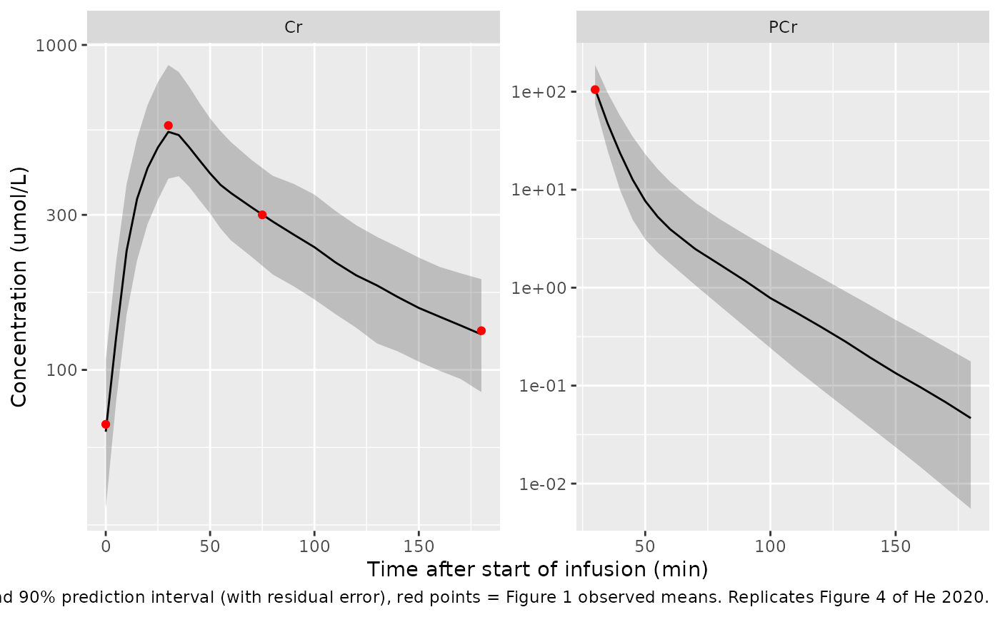
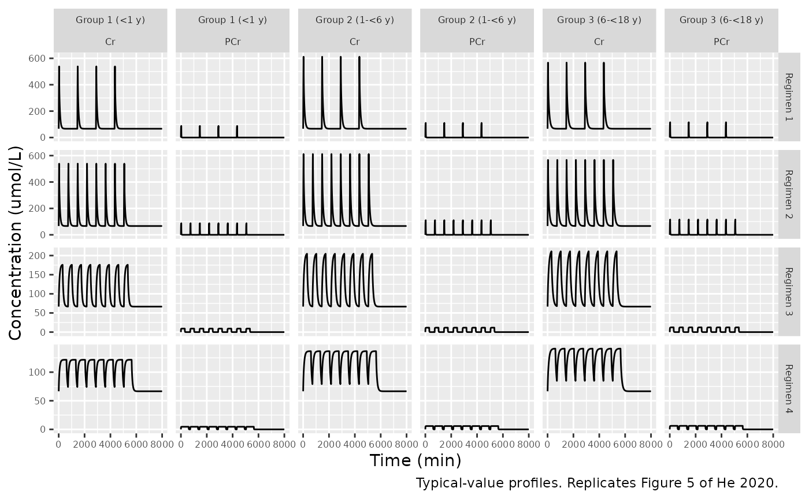

# Phosphocreatine and creatine (He 2020)

## Model and source

- Citation: He H, Zhang M, Zhao LB, Sun N, Zhang Y, Yuan Y, Wang XL.
  Population Pharmacokinetics of Phosphocreatine and Its Metabolite
  Creatine in Children With Myocarditis. Front Pharmacol.
  2020;11:574141. <doi:10.3389/fphar.2020.574141>.
- Description: Joint parent-metabolite population PK model for
  intravenous phosphocreatine (PCr) and its metabolite creatine (Cr) in
  children with acute myocarditis (He 2020). Four-compartment chain:
  two-compartment disposition for PCr (central + peripheral), of which a
  fixed fraction Fm = 0.75 of the PCr elimination flux forms Cr, and
  two-compartment disposition for Cr, with first-order elimination from
  both central compartments. Observed Cr is the exogenous (PCr-derived)
  Cr concentration plus an estimated constant endogenous baseline (66.6
  umol/L). Body weight scales every clearance (exponent 0.75, fixed) and
  every volume (exponent 1, fixed), referenced to 20 kg;
  bedside-Schwartz eGFR enters Cr clearance as a power function
  (exponent 0.311, reference 127.78 mL/min/1.73 m^2). Amounts are in
  umol and time in minutes; doses in grams of phosphocreatine sodium
  must be converted to umol of PCr before use.
- Article: <https://doi.org/10.3389/fphar.2020.574141> (open access)

## Population

He et al. enrolled 100 children (56 male, 44 female) with acute-stage
myocarditis at Beijing Children’s Hospital. Median age was 5.78 years
(range 0.38-16.45) and median body weight 20.4 kg (range 7.9-86; Table
1). Children with renal insufficiency were excluded; bedside-Schwartz
eGFR had a median of 127.78 mL/min/1.73 m^2 (range 66.33-224.01). Each
child received a single IV infusion of phosphocreatine sodium over 30
+/- 2 min, dosed by age band: 0.5 g (28 days to under 1 year), 1 g (1 to
under 6 years) or 2 g (6 to under 18 years). Plasma PCr and creatine
(Cr) were sampled before dosing and about 30, 40 or 50, 75 and 180 min
after the start of the infusion. The 997 concentrations (498 PCr, 499
Cr) were fitted in Phoenix NLME 8.2 (FOCE-ELS). 48.7% of the PCr samples
were below the 1.96 umol/L LLOQ and were handled with the M3 method.

The same information is available programmatically:

``` r

str(rxode2::rxode(readModelDb("He_2020_phosphocreatine"))$population)
#> ℹ parameter labels from comments will be replaced by 'label()'
#> List of 13
#>  $ species       : chr "human"
#>  $ n_subjects    : int 100
#>  $ n_studies     : int 1
#>  $ age_range     : chr "0.38-16.45 years (median 5.78 years)"
#>  $ weight_range  : chr "7.9-86 kg (median 20.4 kg)"
#>  $ sex_female_pct: num 44
#>  $ race_ethnicity: chr "Chinese (single centre in Beijing; race not tabulated)"
#>  $ disease_state : chr "Children (under 18 years) with clinically diagnosed acute-stage myocarditis (onset within about half a year); r"| __truncated__
#>  $ dose_range    : chr "Single 30 +/- 2 min IV infusion of phosphocreatine sodium by age band: 0.5 g (28 days to under 1 year), 1 g (1 "| __truncated__
#>  $ regions       : chr "China (Beijing Children's Hospital, Capital Medical University)"
#>  $ renal_function: chr "Bedside-Schwartz eGFR median 127.78 mL/min/1.73 m^2 (range 66.33-224.01)"
#>  $ n_observations: chr "997 plasma concentrations (498 PCr, 499 Cr); 48.7% of PCr concentrations were below the LLOQ of 1.96 umol/L and"| __truncated__
#>  $ notes         : chr "56 males and 44 females. Samples at baseline and approximately 30, 40 or 50, 75 and 180 min after the start of "| __truncated__
```

## Source trace

| Equation / parameter | Value | Source location |
|----|----|----|
| Structure: PCr 2-cmt -\> Fm -\> Cr 2-cmt, first-order elimination | – | Results Eqs. 11-14, Figure 2 |
| `Cc = central / vc` | – | Results Eq. 15 |
| `Cc_creatine = central_creatine / vc_creatine + rbase_creatine` | – | Results Eq. 16 |
| Allometry `(WT/20)^0.75` on CL/Q, `(WT/20)^1` on V | fixed | Methods Eqs. 3-4 and text |
| `lvc` (Vc PCr) | 8.22 L | Table 2 |
| `lvp` (Vp PCr) | 3.07 L | Table 2 |
| `lcl` (CL PCr) | 1.33 L/min | Table 2 |
| `lq` (Q PCr) | 0.136 L/min | Table 2 |
| `fm` | 0.75 (fixed) | Methods (Population PK model development); Results |
| `lvc_creatine` (Vc Cr) | 2.39 L | Table 2 |
| `lvp_creatine` (Vp Cr) | 2.9 L | Table 2 |
| `lcl_creatine` (CL Cr) | 0.0825 L/min | Table 2; Eq. 17 |
| `lq_creatine` (Q Cr) | 0.146 L/min | Table 2 |
| `lrbase_creatine` (baseCr) | 66.6 umol/L | Table 2 |
| `e_crcl_cl_creatine` | 0.311, reference 127.78 mL/min/1.73 m^2 | Table 2; Eq. 17 |
| `etalcl`, `etalvc_creatine`, `etalvp_creatine`, `etalcl_creatine`, `etalrbase_creatine` | 0.0378, 0.0882, 0.0354, 0.0233, 0.121 | Table 2 (omega^2) |
| `propSd`, `propSd_creatine` | 0.244, 0.0519 | Table 2 (sigma); Methods Eq. 7 |

## Dose units

The model works in umol of PCr, and the paper states its doses in grams
of “phosphocreatine sodium”. The paper does not give the molar
conversion it used. The marketed product’s gram strength is
conventionally the anhydrous disodium salt, creatine phosphate disodium
(C4H8N3Na2O5P, MW 255.08 g/mol), and that reading best reproduces the
observed mean concentrations in Figure 1 (see [Replicating Figure
1](#replicating-figure-1) below). This vignette therefore converts grams
of phosphocreatine sodium to umol with MW 255.08. The model parameters
themselves do not depend on this choice. PCr forms Cr mole for mole, so
both analytes share the umol amount unit.

``` r

mw_pcr_na2 <- 255.08 # g/mol, creatine phosphate disodium (anhydrous)
mw_cr <- 131.13 # g/mol, creatine
g_to_umol <- function(g, mw = mw_pcr_na2) g * 1e6 / mw
```

## Typical-value checks against the paper’s own numbers

``` r

mod <- rxode2::rxode(readModelDb("He_2020_phosphocreatine"))
#> ℹ parameter labels from comments will be replaced by 'label()'
mod_typ <- rxode2::zeroRe(mod)

# Build an event table for one or more subjects with a zero-order infusion into
# the PCr central compartment. Two endpoints are declared (Cc, Cc_creatine), so
# observation rows name an endpoint with dvid; both observables come back as
# columns at every observation row.
make_events <- function(subj, dose_times, dur, obs_times) {
  bind_rows(lapply(seq_len(nrow(subj)), function(i) {
    amt <- g_to_umol(subj$dose_g[i])
    bind_rows(
      data.frame(
        id = subj$id[i], time = dose_times, amt = amt, rate = amt / dur,
        evid = 1L, cmt = "central", dvid = NA_integer_
      ),
      data.frame(
        id = subj$id[i], time = obs_times, amt = 0, rate = 0,
        evid = 0L, cmt = NA_character_, dvid = 1L
      )
    ) |>
      mutate(WT = subj$WT[i], CRCL = subj$CRCL[i])
  })) |>
    arrange(id, time, desc(evid))
}

ref_subj <- data.frame(id = 1:2, WT = c(20, 70), CRCL = 127.78, dose_g = 1)
typ <- rxode2::rxSolve(
  mod_typ,
  make_events(ref_subj, 0, 30, c(0, 30)),
  returnType = "data.frame"
) |>
  filter(time == 30)
#> ℹ omega/sigma items treated as zero: 'etalcl', 'etalvc_creatine', 'etalvp_creatine', 'etalcl_creatine', 'etalrbase_creatine'
#> Warning: multi-subject simulation without without 'omega'

checks <- data.frame(
  Quantity = c(
    "PCr total volume at 20 kg (L)",
    "PCr total volume at 70 kg (L)",
    "PCr clearance at 70 kg (L/min)",
    "CL_Cr change for a 100% eGFR increase",
    "baseCr in mg/L"
  ),
  Paper = c(11.29, 39.5, 3.40, 0.24, 8.73),
  Model = c(
    typ$vc[1] + typ$vp[1],
    typ$vc[2] + typ$vp[2],
    typ$cl[2],
    2^0.311 - 1,
    typ$rbase_creatine[1] * mw_cr / 1000
  ),
  Source = c(
    "Discussion", "Discussion", "Discussion", "Discussion", "Discussion"
  )
) |>
  mutate(`Difference (%)` = round(100 * (Model - Paper) / Paper, 2))
knitr::kable(checks, digits = 3)
```

| Quantity                              | Paper |  Model | Source     | Difference (%) |
|:--------------------------------------|------:|-------:|:-----------|---------------:|
| PCr total volume at 20 kg (L)         | 11.29 | 11.290 | Discussion |           0.00 |
| PCr total volume at 70 kg (L)         | 39.50 | 39.515 | Discussion |           0.04 |
| PCr clearance at 70 kg (L/min)        |  3.40 |  3.403 | Discussion |           0.10 |
| CL_Cr change for a 100% eGFR increase |  0.24 |  0.241 | Discussion |           0.24 |
| baseCr in mg/L                        |  8.73 |  8.733 | Discussion |           0.04 |

``` r


stopifnot(all(abs(checks$`Difference (%)`) < 1))
```

All five numbers the Discussion derives from the final model are
reproduced to within rounding. These include the 70-kg adult
extrapolations, which test the 0.75 / 1 allometric exponents and the
20-kg reference weight.

### Mass balance

Every mole of PCr is cleared through `CL_PCr`, and a fraction `Fm` of it
reappears as creatine that is cleared through `CL_Cr`. Over a complete
single-dose profile, `CL_PCr x AUC_PCr = Dose` and
`CL_Cr x AUC_Cr,exogenous = Fm x Dose`. The check below integrates a
single 30-min infusion in a 20 kg child out to 48 h.

``` r

grid <- sort(unique(c(seq(0, 60, by = 0.25), seq(61, 2880, by = 1))))
mb <- rxode2::rxSolve(
  mod_typ,
  make_events(ref_subj[1, ], 0, 30, grid),
  returnType = "data.frame"
)
#> ℹ omega/sigma items treated as zero: 'etalcl', 'etalvc_creatine', 'etalvp_creatine', 'etalcl_creatine', 'etalrbase_creatine'
trap <- function(x, y) sum(diff(x) * (head(y, -1) + tail(y, -1)) / 2)
dose_umol <- g_to_umol(1)
auc_pcr <- trap(mb$time, mb$Cc)
auc_cr_exo <- trap(mb$time, mb$Cc_creatine - mb$rbase_creatine)
mass <- data.frame(
  Check = c("CL_PCr x AUC_PCr / Dose", "CL_Cr x AUC_Cr,exo / (Fm x Dose)"),
  Ratio = c(mb$cl[1] * auc_pcr / dose_umol, mb$cl_creatine[1] * auc_cr_exo / (0.75 * dose_umol))
)
knitr::kable(mass, digits = 4)
```

| Check                            | Ratio |
|:---------------------------------|------:|
| CL_PCr x AUC_PCr / Dose          |     1 |
| CL_Cr x AUC_Cr,exo / (Fm x Dose) |     1 |

``` r

stopifnot(all(abs(mass$Ratio - 1) < 0.01))
```

## Virtual cohort

Table 1 reports only overall medians and ranges, so the virtual cohort
is built to match them. Ages are drawn uniformly within the three dosing
age bands, using 12 / 40 / 48 children per band so that the median age
falls near 5.8 years. Body weight is drawn from a standard paediatric
weight-for-age approximation (0.5 x age in months + 4 kg under 1 year; 2
x age + 8 kg for 1-5 years; 3 x age + 7 kg from 6 years) with 15%
log-normal scatter. eGFR is log-normal around the 127.78 mL/min/1.73 m^2
median with 22% CV. Draws outside the observed weight (7.9-86 kg) or
eGFR (66.33-224.01) ranges are rejected and redrawn rather than clamped.
Base-R [`set.seed()`](https://rdrr.io/r/base/Random.html) makes the
covariates reproducible across rxode2 versions.

``` r

set.seed(20201116)
draw_in_range <- function(n, sampler, lo, hi) {
  out <- sampler(n)
  bad <- out < lo | out > hi
  while (any(bad)) {
    out[bad] <- sampler(sum(bad))
    bad <- out < lo | out > hi
  }
  out
}
wt_for_age <- function(age) {
  ifelse(age < 1, 0.5 * age * 12 + 4, ifelse(age < 6, 2 * age + 8, 3 * age + 7))
}
groups <- data.frame(
  group = c("Group 1 (<1 y)", "Group 2 (1-<6 y)", "Group 3 (6-<18 y)"),
  n = c(12L, 40L, 48L),
  age_lo = c(0.38, 1, 6),
  age_hi = c(1, 6, 16.45),
  dose_g = c(0.5, 1, 2)
)
cohort <- bind_rows(lapply(seq_len(nrow(groups)), function(g) {
  data.frame(
    group = groups$group[g],
    AGE = runif(groups$n[g], groups$age_lo[g], groups$age_hi[g]),
    dose_g = groups$dose_g[g]
  )
}))
cohort$WT <- vapply(cohort$AGE, function(a) {
  draw_in_range(1, function(n) wt_for_age(a) * exp(rnorm(n, 0, 0.15)), 7.9, 86)
}, numeric(1))
cohort$CRCL <- draw_in_range(
  nrow(cohort), function(n) 127.78 * exp(rnorm(n, 0, 0.22)), 66.33, 224.01
)
cohort$id <- seq_len(nrow(cohort))
cohort |>
  group_by(group) |>
  summarise(
    n = n(), dose_g = first(dose_g),
    median_age = median(AGE), median_WT = median(WT), median_CRCL = median(CRCL)
  ) |>
  knitr::kable(digits = 1)
```

| group              |   n | dose_g | median_age | median_WT | median_CRCL |
|:-------------------|----:|-------:|-----------:|----------:|------------:|
| Group 1 (\<1 y)    |  12 |    0.5 |        0.8 |       8.8 |       123.2 |
| Group 2 (1-\<6 y)  |  40 |    1.0 |        3.4 |      16.0 |       115.6 |
| Group 3 (6-\<18 y) |  48 |    2.0 |       10.9 |      37.2 |       129.2 |

``` r

c(median_age = median(cohort$AGE), median_WT = median(cohort$WT))
#> median_age  median_WT 
#>   5.737363  21.749338
```

## Replicating Figure 1

Figure 1 plots the observed concentrations with the arithmetic mean at
each nominal time. The means below were digitised by the maintainers
from the figure’s log-scale raster. Only the 30-min PCr mean is used,
because 48.7% of PCr samples were below the LLOQ and are missing from
the later means, which biases them upward. The 40- and 50-min Cr means
are also omitted because the observation circles overprint the line
there. The comparison uses the typical-value (`zeroRe`) cohort, so it is
deterministic.

``` r

fig1_obs <- data.frame(
  analyte = c("PCr", "Cr", "Cr", "Cr", "Cr"),
  time = c(30, 0, 30, 75, 180),
  observed_mean = c(105, 68, 565, 300, 132)
)
cohort_mean <- function(mw) {
  ev <- make_events(cohort, 0, 30, c(0, 30, 75, 180))
  ev$amt[ev$evid == 1] <- ev$amt[ev$evid == 1] * mw_pcr_na2 / mw
  ev$rate[ev$evid == 1] <- ev$amt[ev$evid == 1] / 30
  rxode2::rxSolve(mod_typ, ev, returnType = "data.frame") |>
    group_by(time) |>
    summarise(PCr = mean(Cc), Cr = mean(Cc_creatine)) |>
    pivot_longer(c(PCr, Cr), names_to = "analyte", values_to = "sim_mean") |>
    mutate(mw = mw)
}
fig1_cmp <- bind_rows(lapply(c(211.10, 255.08, 327.14), cohort_mean)) |>
  inner_join(fig1_obs, by = c("analyte", "time")) |>
  mutate(pct_diff = 100 * (sim_mean - observed_mean) / observed_mean)
#> ℹ omega/sigma items treated as zero: 'etalcl', 'etalvc_creatine', 'etalvp_creatine', 'etalcl_creatine', 'etalrbase_creatine'
#> Warning: multi-subject simulation without without 'omega'
#> ℹ omega/sigma items treated as zero: 'etalcl', 'etalvc_creatine', 'etalvp_creatine', 'etalcl_creatine', 'etalrbase_creatine'
#> Warning: multi-subject simulation without without 'omega'
#> ℹ omega/sigma items treated as zero: 'etalcl', 'etalvc_creatine', 'etalvp_creatine', 'etalcl_creatine', 'etalrbase_creatine'
#> Warning: multi-subject simulation without without 'omega'
fig1_cmp |>
  mutate(salt = recode(
    as.character(mw),
    "211.1" = "free acid (211.10)",
    "255.08" = "disodium, anhydrous (255.08)",
    "327.14" = "disodium tetrahydrate (327.14)"
  )) |>
  select(salt, analyte, time, observed_mean, sim_mean, pct_diff) |>
  rename(
    "Assumed MW (g/mol)" = salt, "Analyte" = analyte, "Time (min)" = time,
    "Figure 1 mean (umol/L)" = observed_mean, "Model mean (umol/L)" = sim_mean,
    "Difference (%)" = pct_diff
  ) |>
  knitr::kable(digits = 1)
```

| Assumed MW (g/mol) | Analyte | Time (min) | Figure 1 mean (umol/L) | Model mean (umol/L) | Difference (%) |
|:---|:---|---:|---:|---:|---:|
| free acid (211.10) | Cr | 0 | 68 | 66.6 | -2.1 |
| free acid (211.10) | PCr | 30 | 105 | 135.0 | 28.6 |
| free acid (211.10) | Cr | 30 | 565 | 690.3 | 22.2 |
| free acid (211.10) | Cr | 75 | 300 | 356.5 | 18.8 |
| free acid (211.10) | Cr | 180 | 132 | 144.6 | 9.5 |
| disodium, anhydrous (255.08) | Cr | 0 | 68 | 66.6 | -2.1 |
| disodium, anhydrous (255.08) | PCr | 30 | 105 | 111.7 | 6.4 |
| disodium, anhydrous (255.08) | Cr | 30 | 565 | 582.8 | 3.1 |
| disodium, anhydrous (255.08) | Cr | 75 | 300 | 306.5 | 2.2 |
| disodium, anhydrous (255.08) | Cr | 180 | 132 | 131.1 | -0.7 |
| disodium tetrahydrate (327.14) | Cr | 0 | 68 | 66.6 | -2.1 |
| disodium tetrahydrate (327.14) | PCr | 30 | 105 | 87.1 | -17.0 |
| disodium tetrahydrate (327.14) | Cr | 30 | 565 | 469.1 | -17.0 |
| disodium tetrahydrate (327.14) | Cr | 75 | 300 | 253.6 | -15.5 |
| disodium tetrahydrate (327.14) | Cr | 180 | 132 | 116.9 | -11.4 |

``` r


rmse <- fig1_cmp |>
  group_by(mw) |>
  summarise(rms_pct = sqrt(mean(pct_diff^2)))
rmse |>
  rename("Assumed MW (g/mol)" = mw, "RMS difference (%)" = rms_pct) |>
  knitr::kable(digits = 1)
```

| Assumed MW (g/mol) | RMS difference (%) |
|-------------------:|-------------------:|
|              211.1 |               18.7 |
|              255.1 |                3.5 |
|              327.1 |               13.8 |

``` r

chosen <- filter(fig1_cmp, mw == 255.08)
stopifnot(
  rmse$mw[which.min(rmse$rms_pct)] == 255.08,
  all(abs(chosen$pct_diff) < 20)
)
```

The anhydrous disodium salt (MW 255.08) reproduces every usable Figure 1
mean within 20%, and it has the smallest RMS error of the three
candidate molecular weights. The free-acid reading overshoots the Cr
peak, and the tetrahydrate reading undershoots it.

### Visual predictive check (Figure 4)

``` r

rxode2::rxSetSeed(574141)
obs_grid <- c(0, seq(5, 60, by = 5), seq(70, 180, by = 10))
vpc <- rxode2::rxSolve(
  mod, make_events(cohort, 0, 30, obs_grid),
  returnType = "data.frame"
) |>
  select(id, time, PCr = Cc, Cr = Cc_creatine) |>
  pivot_longer(c(PCr, Cr), names_to = "analyte", values_to = "conc") |>
  filter(!(analyte == "PCr" & time < 30)) |>
  group_by(analyte, time) |>
  summarise(
    p05 = quantile(conc, 0.05), p50 = median(conc), p95 = quantile(conc, 0.95),
    .groups = "drop"
  )
ggplot(vpc, aes(time, p50)) +
  geom_ribbon(aes(ymin = p05, ymax = p95), alpha = 0.25) +
  geom_line() +
  geom_point(
    data = fig1_obs, aes(time, observed_mean), colour = "red", inherit.aes = FALSE
  ) +
  facet_wrap(~analyte, scales = "free") +
  scale_y_log10() +
  labs(
    x = "Time after start of infusion (min)", y = "Concentration (umol/L)",
    caption = paste(
      "Simulated median and 90% prediction interval (with residual error),",
      "red points = Figure 1 observed means. Replicates Figure 4 of He 2020."
    )
  )
```



## Replicating Figure 5 (multiple-dose regimens)

Figure 5 shows the median of 1,000 simulated profiles per age group for
four 4-day regimens: 30-min infusions q24h (regimen 1) or q12h (regimen
2), and 300-min (regimen 3) or 600-min (regimen 4) infusions q12h. The
group weights used for the published simulation are not reported. Here
each group is represented by a typical child at that group’s median
weight in the virtual cohort, with eGFR at the reference value.

``` r

reg <- data.frame(
  regimen = paste("Regimen", 1:4),
  tau = c(1440, 720, 720, 720),
  dur = c(30, 30, 300, 600)
)
grp_typ <- cohort |>
  group_by(group) |>
  summarise(WT = median(WT), dose_g = first(dose_g)) |>
  mutate(CRCL = 127.78)
f5_grid <- seq(0, 8000, by = 2)
fig5 <- bind_rows(lapply(seq_len(nrow(reg)), function(r) {
  n_dose <- 4 * 1440 / reg$tau[r]
  subj <- grp_typ |> mutate(id = seq_len(n()))
  rxode2::rxSolve(
    mod_typ,
    make_events(subj, (seq_len(n_dose) - 1) * reg$tau[r], reg$dur[r], f5_grid),
    returnType = "data.frame"
  ) |>
    mutate(group = subj$group[id], regimen = reg$regimen[r])
}))
#> ℹ omega/sigma items treated as zero: 'etalcl', 'etalvc_creatine', 'etalvp_creatine', 'etalcl_creatine', 'etalrbase_creatine'
#> Warning: multi-subject simulation without without 'omega'
#> ℹ omega/sigma items treated as zero: 'etalcl', 'etalvc_creatine', 'etalvp_creatine', 'etalcl_creatine', 'etalrbase_creatine'
#> Warning: multi-subject simulation without without 'omega'
#> ℹ omega/sigma items treated as zero: 'etalcl', 'etalvc_creatine', 'etalvp_creatine', 'etalcl_creatine', 'etalrbase_creatine'
#> Warning: multi-subject simulation without without 'omega'
#> ℹ omega/sigma items treated as zero: 'etalcl', 'etalvc_creatine', 'etalvp_creatine', 'etalcl_creatine', 'etalrbase_creatine'
#> Warning: multi-subject simulation without without 'omega'
fig5 |>
  select(time, group, regimen, PCr = Cc, Cr = Cc_creatine) |>
  pivot_longer(c(PCr, Cr), names_to = "analyte", values_to = "conc") |>
  ggplot(aes(time, conc)) +
  geom_line() +
  facet_grid(regimen ~ group + analyte, scales = "free_y") +
  labs(
    x = "Time (min)", y = "Concentration (umol/L)",
    caption = "Typical-value profiles. Replicates Figure 5 of He 2020."
  ) +
  theme(strip.text = element_text(size = 6), axis.text = element_text(size = 6))
```



The paper’s text reports two things about these simulations. Under
regimens 1 and 2, PCr is essentially gone within 3 h of the start of an
infusion (median below 0.1 umol/L). Cr returns to its baseline of about
67 umol/L within 12 h.

``` r

f5_text <- fig5 |>
  filter(regimen %in% c("Regimen 1", "Regimen 2"), time %in% c(180, 720)) |>
  select(regimen, group, time, PCr = Cc, Cr = Cc_creatine, rbase = rbase_creatine)
knitr::kable(f5_text, digits = 3)
```

| regimen   | group              | time |   PCr |      Cr | rbase |
|:----------|:-------------------|-----:|------:|--------:|------:|
| Regimen 1 | Group 1 (\<1 y)    |  180 | 0.008 | 102.021 |  66.6 |
| Regimen 1 | Group 1 (\<1 y)    |  720 | 0.000 |  66.606 |  66.6 |
| Regimen 1 | Group 2 (1-\<6 y)  |  180 | 0.026 | 122.627 |  66.6 |
| Regimen 1 | Group 2 (1-\<6 y)  |  720 | 0.000 |  66.632 |  66.6 |
| Regimen 1 | Group 3 (6-\<18 y) |  180 | 0.078 | 140.827 |  66.6 |
| Regimen 1 | Group 3 (6-\<18 y) |  720 | 0.000 |  66.776 |  66.6 |
| Regimen 2 | Group 1 (\<1 y)    |  180 | 0.008 | 102.021 |  66.6 |
| Regimen 2 | Group 1 (\<1 y)    |  720 | 0.000 |  66.606 |  66.6 |
| Regimen 2 | Group 2 (1-\<6 y)  |  180 | 0.026 | 122.627 |  66.6 |
| Regimen 2 | Group 2 (1-\<6 y)  |  720 | 0.000 |  66.632 |  66.6 |
| Regimen 2 | Group 3 (6-\<18 y) |  180 | 0.078 | 140.827 |  66.6 |
| Regimen 2 | Group 3 (6-\<18 y) |  720 | 0.000 |  66.776 |  66.6 |

``` r

stopifnot(
  all(f5_text$PCr[f5_text$time == 180] < 0.1),
  all(abs(f5_text$Cr[f5_text$time == 720] - f5_text$rbase[f5_text$time == 720]) < 1)
)
```

During the long infusions of regimens 3 and 4, both analytes approach a
plateau. At that plateau, the exogenous Cr to PCr ratio equals
`Fm x CL_PCr / CL_Cr`. This ratio is independent of weight and dose,
because both clearances carry the same allometric exponent, so it can be
checked against Figure 5 without knowing the group weights. The Figure 5
plateaus were digitised by the maintainers from the regimen 4 panels.

``` r

plateau <- fig5 |>
  filter(regimen == "Regimen 4", time == 590) |>
  mutate(ratio = (Cc_creatine - rbase_creatine) / Cc)
fig5_digitised <- data.frame(
  group = grp_typ$group,
  PCr_plateau = c(4.85, 5.35, 7.3),
  Cr_plateau = c(127, 137, 157)
) |>
  mutate(fig5_ratio = (Cr_plateau - 67) / PCr_plateau)
cmp5 <- inner_join(select(plateau, group, PCr = Cc, Cr = Cc_creatine, ratio),
  fig5_digitised,
  by = "group"
)
knitr::kable(cmp5, digits = 2)
```

| group              |  PCr |     Cr | ratio | PCr_plateau | Cr_plateau | fig5_ratio |
|:-------------------|-----:|-------:|------:|------------:|-----------:|-----------:|
| Group 1 (\<1 y)    | 4.55 | 121.65 | 12.09 |        4.85 |        127 |      12.37 |
| Group 2 (1-\<6 y)  | 5.80 | 136.68 | 12.09 |        5.35 |        137 |      13.08 |
| Group 3 (6-\<18 y) | 6.17 | 141.15 | 12.08 |        7.30 |        157 |      12.33 |

``` r

stopifnot(
  abs(median(cmp5$ratio) - 0.75 * 1.33 / 0.0825) / (0.75 * 1.33 / 0.0825) < 0.05,
  abs(median(cmp5$fig5_ratio) / median(cmp5$ratio) - 1) < 0.10
)
```

The simulated plateau ratio is 12.1. The ratio read from the Figure 5
regimen 4 panels is 12.4. Agreement within 10% confirms the
mole-for-mole `Fm` coupling and the relative PCr and Cr clearances. The
absolute plateau heights also depend on the unreported group weights.

## PKNCA

The paper reports no NCA parameters, so the single-dose NCA below serves
as a reference for users. It covers the stochastic cohort, one 30-min
infusion per age group, for PCr and for baseline-subtracted (exogenous)
Cr.

``` r

rxode2::rxSetSeed(20201116)
nca_grid <- c(0, 2, 5, 10, 15, 20, 25, 30, 32, 35, 40, 45, 50, 60, 75, 90, 120, 180, 240, 360, 480, 720)
nca_sim <- rxode2::rxSolve(
  mod, make_events(cohort, 0, 30, nca_grid),
  returnType = "data.frame"
) |>
  left_join(select(cohort, id, treatment = group), by = "id") |>
  mutate(Cr_exo = Cc_creatine - rbase_creatine)

dose_df <- cohort |>
  transmute(id, treatment = group, time = 0, amt = g_to_umol(dose_g))

run_nca <- function(conc_col) {
  conc_df <- nca_sim |>
    transmute(id, treatment, time, conc = .data[[conc_col]]) |>
    filter(!is.na(conc))
  conc_obj <- PKNCA::PKNCAconc(conc_df, conc ~ time | treatment + id)
  dose_obj <- PKNCA::PKNCAdose(dose_df, amt ~ time | treatment + id)
  intervals <- data.frame(
    start = 0, end = Inf, cmax = TRUE, tmax = TRUE,
    aucinf.obs = TRUE, half.life = TRUE
  )
  res <- PKNCA::pk.nca(PKNCA::PKNCAdata(conc_obj, dose_obj, intervals = intervals))
  as.data.frame(summary(res)) |> mutate(analyte = conc_col)
}
nca_pcr <- run_nca("Cc")
#> Warning in assert_conc(conc, any_missing_conc = any_missing_conc): Negative
#> concentrations found
#> Warning in assert_conc(conc = conc): Negative concentrations found
#> Warning in assert_conc(conc, any_missing_conc = any_missing_conc): Negative
#> concentrations found
#> Warning in assert_conc(conc, any_missing_conc = any_missing_conc): Negative
#> concentrations found
#> Warning in assert_conc(conc, any_missing_conc = any_missing_conc): Negative
#> concentrations found
#> Warning in assert_conc(conc, any_missing_conc = any_missing_conc): Negative
#> concentrations found
#> Warning in assert_conc(conc, any_missing_conc = any_missing_conc): Negative
#> concentrations found
#> Warning in log(data$conc): NaNs produced
#> Warning in assert_conc(conc, any_missing_conc = any_missing_conc): Negative
#> concentrations found
#> Warning in log(conc.2/conc.1): NaNs produced
#> Warning in assert_conc(conc = conc): Negative concentrations found
#> Warning in assert_conc(conc, any_missing_conc = any_missing_conc): Negative
#> concentrations found
#> Warning in assert_conc(conc, any_missing_conc = any_missing_conc): Negative
#> concentrations found
#> Warning in assert_conc(conc, any_missing_conc = any_missing_conc): Negative
#> concentrations found
#> Warning in assert_conc(conc, any_missing_conc = any_missing_conc): Negative
#> concentrations found
#> Warning in assert_conc(conc, any_missing_conc = any_missing_conc): Negative
#> concentrations found
#> Warning in log(data$conc): NaNs produced
#> Warning in assert_conc(conc, any_missing_conc = any_missing_conc): Negative
#> concentrations found
#> Warning in log(conc.2/conc.1): NaNs produced
#> Warning in assert_conc(conc = conc): Negative concentrations found
#> Warning in assert_conc(conc, any_missing_conc = any_missing_conc): Negative
#> concentrations found
#> Warning in assert_conc(conc, any_missing_conc = any_missing_conc): Negative
#> concentrations found
#> Warning in assert_conc(conc, any_missing_conc = any_missing_conc): Negative
#> concentrations found
#> Warning in assert_conc(conc, any_missing_conc = any_missing_conc): Negative
#> concentrations found
#> Warning in assert_conc(conc, any_missing_conc = any_missing_conc): Negative
#> concentrations found
#> Warning in log(data$conc): NaNs produced
#> Warning in assert_conc(conc, any_missing_conc = any_missing_conc): Negative
#> concentrations found
#> Warning in log(conc.2/conc.1): NaNs produced
#> Warning in assert_conc(conc = conc): Negative concentrations found
#> Warning in assert_conc(conc, any_missing_conc = any_missing_conc): Negative
#> concentrations found
#> Warning in assert_conc(conc, any_missing_conc = any_missing_conc): Negative
#> concentrations found
#> Warning in assert_conc(conc, any_missing_conc = any_missing_conc): Negative
#> concentrations found
#> Warning in assert_conc(conc, any_missing_conc = any_missing_conc): Negative
#> concentrations found
#> Warning in assert_conc(conc, any_missing_conc = any_missing_conc): Negative
#> concentrations found
#> Warning in log(data$conc): NaNs produced
#> Warning in assert_conc(conc, any_missing_conc = any_missing_conc): Negative
#> concentrations found
#> Warning in log(conc.2/conc.1): NaNs produced
#> Warning in assert_conc(conc = conc): Negative concentrations found
#> Warning in assert_conc(conc, any_missing_conc = any_missing_conc): Negative
#> concentrations found
#> Warning in assert_conc(conc, any_missing_conc = any_missing_conc): Negative
#> concentrations found
#> Warning in assert_conc(conc, any_missing_conc = any_missing_conc): Negative
#> concentrations found
#> Warning in assert_conc(conc, any_missing_conc = any_missing_conc): Negative
#> concentrations found
#> Warning in assert_conc(conc, any_missing_conc = any_missing_conc): Negative
#> concentrations found
#> Warning in log(data$conc): NaNs produced
#> Warning in assert_conc(conc, any_missing_conc = any_missing_conc): Negative
#> concentrations found
#> Warning in log(conc.2/conc.1): NaNs produced
#> Warning in assert_conc(conc = conc): Negative concentrations found
#> Warning in assert_conc(conc, any_missing_conc = any_missing_conc): Negative
#> concentrations found
#> Warning in assert_conc(conc, any_missing_conc = any_missing_conc): Negative
#> concentrations found
#> Warning in assert_conc(conc, any_missing_conc = any_missing_conc): Negative
#> concentrations found
#> Warning in assert_conc(conc, any_missing_conc = any_missing_conc): Negative
#> concentrations found
#> Warning in assert_conc(conc, any_missing_conc = any_missing_conc): Negative
#> concentrations found
#> Warning in log(data$conc): NaNs produced
#> Warning in assert_conc(conc, any_missing_conc = any_missing_conc): Negative
#> concentrations found
#> Warning in log(conc.2/conc.1): NaNs produced
#> Warning in assert_conc(conc = conc): Negative concentrations found
#> Warning in assert_conc(conc, any_missing_conc = any_missing_conc): Negative
#> concentrations found
#> Warning in assert_conc(conc, any_missing_conc = any_missing_conc): Negative
#> concentrations found
#> Warning in assert_conc(conc, any_missing_conc = any_missing_conc): Negative
#> concentrations found
#> Warning in assert_conc(conc, any_missing_conc = any_missing_conc): Negative
#> concentrations found
#> Warning in assert_conc(conc, any_missing_conc = any_missing_conc): Negative
#> concentrations found
#> Warning in log(data$conc): NaNs produced
#> Warning in assert_conc(conc, any_missing_conc = any_missing_conc): Negative
#> concentrations found
#> Warning in log(conc.2/conc.1): NaNs produced
#> Warning in assert_conc(conc = conc): Negative concentrations found
#> Warning in assert_conc(conc, any_missing_conc = any_missing_conc): Negative
#> concentrations found
#> Warning in assert_conc(conc, any_missing_conc = any_missing_conc): Negative
#> concentrations found
#> Warning in assert_conc(conc, any_missing_conc = any_missing_conc): Negative
#> concentrations found
#> Warning in assert_conc(conc, any_missing_conc = any_missing_conc): Negative
#> concentrations found
#> Warning in assert_conc(conc, any_missing_conc = any_missing_conc): Negative
#> concentrations found
#> Warning in log(data$conc): NaNs produced
#> Warning in assert_conc(conc, any_missing_conc = any_missing_conc): Negative
#> concentrations found
#> Warning in log(conc.2/conc.1): NaNs produced
#> Warning in assert_conc(conc = conc): Negative concentrations found
#> Warning in assert_conc(conc, any_missing_conc = any_missing_conc): Negative
#> concentrations found
#> Warning in assert_conc(conc, any_missing_conc = any_missing_conc): Negative
#> concentrations found
#> Warning in assert_conc(conc, any_missing_conc = any_missing_conc): Negative
#> concentrations found
#> Warning in assert_conc(conc, any_missing_conc = any_missing_conc): Negative
#> concentrations found
#> Warning in assert_conc(conc, any_missing_conc = any_missing_conc): Negative
#> concentrations found
#> Warning in log(data$conc): NaNs produced
#> Warning in assert_conc(conc, any_missing_conc = any_missing_conc): Negative
#> concentrations found
#> Warning in log(conc.2/conc.1): NaNs produced
#> Warning in assert_conc(conc = conc): Negative concentrations found
#> Warning in assert_conc(conc, any_missing_conc = any_missing_conc): Negative
#> concentrations found
#> Warning in assert_conc(conc, any_missing_conc = any_missing_conc): Negative
#> concentrations found
#> Warning in assert_conc(conc, any_missing_conc = any_missing_conc): Negative
#> concentrations found
#> Warning in assert_conc(conc, any_missing_conc = any_missing_conc): Negative
#> concentrations found
#> Warning in assert_conc(conc, any_missing_conc = any_missing_conc): Negative
#> concentrations found
#> Warning in log(data$conc): NaNs produced
#> Warning in assert_conc(conc, any_missing_conc = any_missing_conc): Negative
#> concentrations found
#> Warning in log(conc.2/conc.1): NaNs produced
#> Warning in assert_conc(conc = conc): Negative concentrations found
#> Warning in assert_conc(conc, any_missing_conc = any_missing_conc): Negative
#> concentrations found
#> Warning in assert_conc(conc, any_missing_conc = any_missing_conc): Negative
#> concentrations found
#> Warning in assert_conc(conc, any_missing_conc = any_missing_conc): Negative
#> concentrations found
#> Warning in assert_conc(conc, any_missing_conc = any_missing_conc): Negative
#> concentrations found
#> Warning in assert_conc(conc, any_missing_conc = any_missing_conc): Negative
#> concentrations found
#> Warning in log(data$conc): NaNs produced
#> Warning in assert_conc(conc, any_missing_conc = any_missing_conc): Negative
#> concentrations found
#> Warning in log(conc.2/conc.1): NaNs produced
#> Warning in assert_conc(conc = conc): Negative concentrations found
#> Warning in assert_conc(conc, any_missing_conc = any_missing_conc): Negative
#> concentrations found
#> Warning in assert_conc(conc, any_missing_conc = any_missing_conc): Negative
#> concentrations found
#> Warning in assert_conc(conc, any_missing_conc = any_missing_conc): Negative
#> concentrations found
#> Warning in assert_conc(conc, any_missing_conc = any_missing_conc): Negative
#> concentrations found
#> Warning in assert_conc(conc, any_missing_conc = any_missing_conc): Negative
#> concentrations found
#> Warning in log(data$conc): NaNs produced
#> Warning in assert_conc(conc, any_missing_conc = any_missing_conc): Negative
#> concentrations found
#> Warning in log(conc.2/conc.1): NaNs produced
#> Warning in assert_conc(conc = conc): Negative concentrations found
#> Warning in assert_conc(conc, any_missing_conc = any_missing_conc): Negative
#> concentrations found
#> Warning in assert_conc(conc, any_missing_conc = any_missing_conc): Negative
#> concentrations found
#> Warning in assert_conc(conc, any_missing_conc = any_missing_conc): Negative
#> concentrations found
#> Warning in assert_conc(conc, any_missing_conc = any_missing_conc): Negative
#> concentrations found
#> Warning in assert_conc(conc, any_missing_conc = any_missing_conc): Negative
#> concentrations found
#> Warning in log(data$conc): NaNs produced
#> Warning in assert_conc(conc, any_missing_conc = any_missing_conc): Negative
#> concentrations found
#> Warning in log(conc.2/conc.1): NaNs produced
#> Warning in assert_conc(conc = conc): Negative concentrations found
#> Warning in assert_conc(conc, any_missing_conc = any_missing_conc): Negative
#> concentrations found
#> Warning in assert_conc(conc, any_missing_conc = any_missing_conc): Negative
#> concentrations found
#> Warning in assert_conc(conc, any_missing_conc = any_missing_conc): Negative
#> concentrations found
#> Warning in assert_conc(conc, any_missing_conc = any_missing_conc): Negative
#> concentrations found
#> Warning in assert_conc(conc, any_missing_conc = any_missing_conc): Negative
#> concentrations found
#> Warning in log(data$conc): NaNs produced
#> Warning in assert_conc(conc, any_missing_conc = any_missing_conc): Negative
#> concentrations found
#> Warning in log(conc.2/conc.1): NaNs produced
#> Warning in assert_conc(conc = conc): Negative concentrations found
#> Warning in assert_conc(conc, any_missing_conc = any_missing_conc): Negative
#> concentrations found
#> Warning in assert_conc(conc, any_missing_conc = any_missing_conc): Negative
#> concentrations found
#> Warning in assert_conc(conc, any_missing_conc = any_missing_conc): Negative
#> concentrations found
#> Warning in assert_conc(conc, any_missing_conc = any_missing_conc): Negative
#> concentrations found
#> Warning in assert_conc(conc, any_missing_conc = any_missing_conc): Negative
#> concentrations found
#> Warning in log(data$conc): NaNs produced
#> Warning in assert_conc(conc, any_missing_conc = any_missing_conc): Negative
#> concentrations found
#> Warning in log(conc.2/conc.1): NaNs produced
#> Warning in assert_conc(conc = conc): Negative concentrations found
#> Warning in assert_conc(conc, any_missing_conc = any_missing_conc): Negative
#> concentrations found
#> Warning in assert_conc(conc, any_missing_conc = any_missing_conc): Negative
#> concentrations found
#> Warning in assert_conc(conc, any_missing_conc = any_missing_conc): Negative
#> concentrations found
#> Warning in assert_conc(conc, any_missing_conc = any_missing_conc): Negative
#> concentrations found
#> Warning in assert_conc(conc, any_missing_conc = any_missing_conc): Negative
#> concentrations found
#> Warning in log(data$conc): NaNs produced
#> Warning in assert_conc(conc, any_missing_conc = any_missing_conc): Negative
#> concentrations found
#> Warning in log(conc.2/conc.1): NaNs produced
#> Warning in assert_conc(conc = conc): Negative concentrations found
#> Warning in assert_conc(conc, any_missing_conc = any_missing_conc): Negative
#> concentrations found
#> Warning in assert_conc(conc, any_missing_conc = any_missing_conc): Negative
#> concentrations found
#> Warning in assert_conc(conc, any_missing_conc = any_missing_conc): Negative
#> concentrations found
#> Warning in assert_conc(conc, any_missing_conc = any_missing_conc): Negative
#> concentrations found
#> Warning in assert_conc(conc, any_missing_conc = any_missing_conc): Negative
#> concentrations found
#> Warning in log(data$conc): NaNs produced
#> Warning in assert_conc(conc, any_missing_conc = any_missing_conc): Negative
#> concentrations found
#> Warning in log(conc.2/conc.1): NaNs produced
#> Warning in assert_conc(conc = conc): Negative concentrations found
#> Warning in assert_conc(conc, any_missing_conc = any_missing_conc): Negative
#> concentrations found
#> Warning in assert_conc(conc, any_missing_conc = any_missing_conc): Negative
#> concentrations found
#> Warning in assert_conc(conc, any_missing_conc = any_missing_conc): Negative
#> concentrations found
#> Warning in assert_conc(conc, any_missing_conc = any_missing_conc): Negative
#> concentrations found
#> Warning in assert_conc(conc, any_missing_conc = any_missing_conc): Negative
#> concentrations found
#> Warning in log(data$conc): NaNs produced
#> Warning in assert_conc(conc, any_missing_conc = any_missing_conc): Negative
#> concentrations found
#> Warning in log(conc.2/conc.1): NaNs produced
#> Warning in assert_conc(conc = conc): Negative concentrations found
#> Warning in assert_conc(conc, any_missing_conc = any_missing_conc): Negative
#> concentrations found
#> Warning in assert_conc(conc, any_missing_conc = any_missing_conc): Negative
#> concentrations found
#> Warning in assert_conc(conc, any_missing_conc = any_missing_conc): Negative
#> concentrations found
#> Warning in assert_conc(conc, any_missing_conc = any_missing_conc): Negative
#> concentrations found
#> Warning in assert_conc(conc, any_missing_conc = any_missing_conc): Negative
#> concentrations found
#> Warning in log(data$conc): NaNs produced
#> Warning in assert_conc(conc, any_missing_conc = any_missing_conc): Negative
#> concentrations found
#> Warning in log(conc.2/conc.1): NaNs produced
nca_cr <- run_nca("Cr_exo")
bind_rows(nca_pcr, nca_cr) |>
  mutate(analyte = recode(analyte, Cc = "PCr", Cr_exo = "Cr (exogenous)")) |>
  select(analyte, treatment, N, cmax, tmax, half.life, aucinf.obs) |>
  rename(
    "Analyte" = analyte, "Age group" = treatment,
    "Cmax (umol/L)" = cmax, "Tmax (min)" = tmax, "t1/2 (min)" = half.life,
    "AUC0-inf (umol*min/L)" = aucinf.obs
  ) |>
  knitr::kable(caption = "Single-dose NCA (geometric mean [CV]; Tmax median [range]).")
```

| Analyte | Age group | N | Cmax (umol/L) | Tmax (min) | t1/2 (min) | AUC0-inf (umol\*min/L) |
|:---|:---|:---|:---|:---|:---|:---|
| PCr | Group 1 (\<1 y) | 12 | 77.9 \[19.2\] | 30.0 \[30.0, 30.0\] | 15.2 \[1.01\] | 2500 \[20.2\], n=8 |
| PCr | Group 2 (1-\<6 y) | 40 | 114 \[22.9\] | 30.0 \[30.0, 30.0\] | 17.1 \[1.22\] | 3540 \[23.4\], n=27 |
| PCr | Group 3 (6-\<18 y) | 48 | 111 \[26.9\] | 30.0 \[30.0, 30.0\] | 20.9 \[1.72\] | 3550 \[28.4\], n=46 |
| Cr (exogenous) | Group 1 (\<1 y) | 12 | 445 \[15.5\] | 32.0 \[30.0, 35.0\] | 46.8 \[10.6\] | 32400 \[17.3\] |
| Cr (exogenous) | Group 2 (1-\<6 y) | 40 | 553 \[26.6\] | 32.0 \[30.0, 35.0\] | 53.9 \[11.3\] | 44500 \[22.8\] |
| Cr (exogenous) | Group 3 (6-\<18 y) | 48 | 476 \[32.4\] | 32.0 \[32.0, 40.0\] | 65.8 \[14.5\] | 44500 \[29.4\] |

Single-dose NCA (geometric mean \[CV\]; Tmax median \[range\]). {.table}

The PCr AUC0-inf is missing for some children because PKNCA could not
fit an acceptable terminal slope to the very low concentrations of PCr’s
slow peripheral-return phase. The Cr columns are baseline-subtracted.

## Assumptions and deviations

- **Dose molar conversion.** The paper states doses in grams of
  phosphocreatine sodium and concentrations in umol/L without giving the
  molecular weight used. This vignette uses the anhydrous disodium salt
  (255.08 g/mol). That is the conventional labelled strength, and it is
  the only one of the three candidate salt forms that reproduces the
  Figure 1 means within 20%. The model itself is in umol and does not
  depend on the choice.
- **Figure 1 and Figure 5 values** are the maintainers’ digitisations of
  the published raster figures.
- **Virtual cohort.** Table 1 gives only overall medians and ranges. The
  age-band sizes, weight-for-age curve, weight scatter and eGFR CV are
  assumptions chosen to match the reported medians. Race is not
  reported.
- **PCr below the LLOQ** was handled with the M3 method in the fit. The
  model simulates the underlying concentration and has no censoring.
- **Maturation** (Methods Eq. 5) was tested and rejected by the authors,
  so it is not part of the model. Age is recorded under
  `covariatesDataExcluded`.
- **PCr baseline.** Endogenous plasma PCr was below the LLOQ before
  dosing in every child and was fixed to 0, as in the paper. The
  endogenous Cr baseline is a constant added to the drug-derived Cr
  concentration (Eq. 16). The model has no endogenous synthesis or
  turnover term.
- **Fm = 0.75** is an assumption the authors carried from animal data
  (Xu et al., 2014). They report that fixing it at 0.5 or 1 barely
  changed the PCr parameters, but it scales the Cr volumes and
  clearances.
