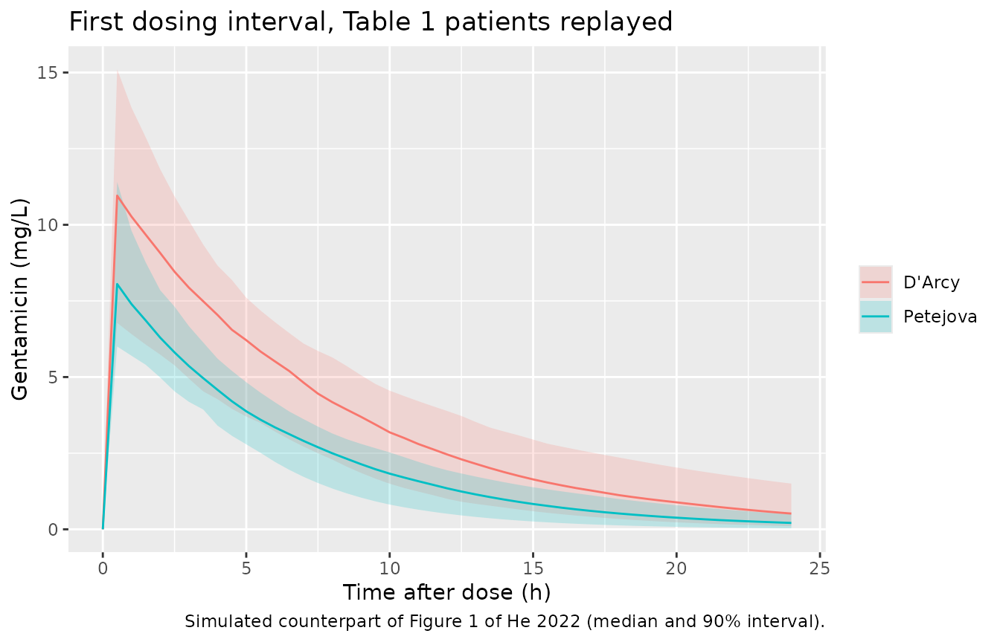

# Gentamicin (He 2022)

## Model and source

- Citation: He S, Cheng Z, Xie F. Population pharmacokinetics and dosing
  optimization of gentamicin in critically ill patients undergoing
  continuous renal replacement therapy. Drug Des Devel Ther.
  2022;16:13-22. <doi:10.2147/DDDT.S343385>
- Description: One-compartment IV population PK model for gentamicin in
  14 critically ill adults on continuous renal replacement therapy (CVVH
  or CVVHDF), pooled from two published studies (He 2022). Total
  clearance is the sum of an estimated endogenous (body) clearance of
  1.20 L/h, with log-normal IIV, and the individually calculated CRRT
  clearance supplied as the data column QEFF; volume of distribution
  27.6 L with log-normal IIV; combined additive and proportional
  residual error. Body weight, age, sex and CRRT modality were screened
  but not retained.
- Article: [Drug Des Devel Ther.
  2022;16:13-22](https://doi.org/10.2147/DDDT.S343385)

## Population

He 2022 did not collect new data. A PubMed search (to 14 May 2021) found
four gentamicin PK studies in patients on continuous renal replacement
therapy (CRRT); two reported individual concentrations together with
complete dosing and CRRT settings and were pooled: Petejova et al (7
patients on continuous venovenous hemofiltration, CVVH) and D’Arcy et al
(7 patients on continuous venovenous hemodiafiltration, CVVHDF). The 14
patients contributed 151 gentamicin concentrations. All were critically
ill with acute kidney injury and septic shock; 9 were male, median age
68.5 years (range 34-79), median weight 72 kg (range 48-102), median
APACHE II 28.5 (Table 1).

Gentamicin was given q24h as a 30-minute infusion: 2.4-3.3 mg/kg in the
Petejova patients and 5 mg/kg in the D’Arcy patients. Blood flow was 200
mL/min throughout; the CRRT dose ranged 36.6-67.7 mL/kg/h (median 45)
and the calculated CRRT clearance 1.6-3.5 L/h (median 2.6).

The same information is available programmatically via the model’s
`population` metadata
(`readModelDb("He_2022_gentamicin")()$population`).

## Source trace

The per-parameter origin is recorded as an in-file comment next to each
`ini()` entry in `inst/modeldb/specificDrugs/He_2022_gentamicin.R`. The
table below collects them in one place.

| Equation / parameter | Value | Source location |
|----|----|----|
| `CL_total = CL_body * exp(eta) + CL_CRRT` | n/a | Equation 1; Methods, “Population PK Model Development” |
| `CL_CRRT` from CRRT settings (`QE * Sc` or `QE * Sd`, / 1000) | n/a | Equations 2-8 |
| One-compartment, linear elimination | n/a | Results, “Population PK” |
| `lcl` (CL_body) | 1.20 L/h (RSE 20.3%) | Table 2 |
| `lvc` (V_d) | 27.60 L (RSE 5.8%) | Table 2 |
| `etalcl` | 69.3 %CV -\> omega^2 = log(0.693^2 + 1) = 0.392211 | Table 2 and its CV footnote |
| `etalvc` | 22.1 %CV -\> omega^2 = log(0.221^2 + 1) = 0.047686 | Table 2 and its CV footnote |
| `addSd` | 0.156 mg/L | Table 2; Results, “Population PK” |
| `propSd` | 0.080 (8.0%) | Table 2; Results, “Population PK” |
| Simulation `QEFF` | `0.77 * CRRT dose * WT / 1000` L/h | Methods, “Simulation-Based Treatment Optimization” |
| Peak time for Cmax | 30 min after the end of the 30-min infusion | Methods, “Simulation-Based Treatment Optimization” |

## The CRRT clearance covariate

`QEFF` is not estimated: the authors calculated a CRRT clearance for
each patient from the circuit settings (Equations 2-8) and added it to
the estimated endogenous clearance. Every value in the Table 1 “CRRT
Clearance” column is reproduced to its printed precision by the
post-dilution form
`CRRT dose [mL/kg/h] * weight [kg] * coefficient / 1000`, using the
per-patient sieving coefficient for the Petejova (CVVH) patients and the
imputed saturation coefficient 0.77 for the D’Arcy (CVVHDF) patients.
The table below transcribes Table 1 and checks it; the same formula,
with the coefficient fixed at 0.77, is the one the paper’s own dosing
simulations use.

``` r

table1 <- tibble::tribble(
  ~patient, ~study,     ~modality, ~wt, ~dose_mgkg, ~crrt_dose, ~coef, ~clcrrt_pub,
   1L,      "Petejova", "CVVH",     80,  3.0,       45.0,       0.75,  2.7,
   2L,      "Petejova", "CVVH",     94,  2.5,       45.0,       0.82,  3.5,
   3L,      "Petejova", "CVVH",     72,  3.3,       45.0,       0.87,  2.8,
   4L,      "Petejova", "CVVH",     90,  2.7,       45.0,       0.76,  3.1,
   5L,      "Petejova", "CVVH",     90,  2.7,       45.0,       0.78,  3.2,
   6L,      "Petejova", "CVVH",     90,  2.7,       45.0,       0.76,  3.1,
   7L,      "Petejova", "CVVH",    102,  2.4,       45.0,       0.77,  3.5,
   8L,      "D'Arcy",   "CVVHDF",   48,  5.0,       67.7,       0.77,  2.5,
   9L,      "D'Arcy",   "CVVHDF",   68,  5.0,       41.3,       0.77,  2.2,
  10L,      "D'Arcy",   "CVVHDF",   64,  5.0,       47.0,       0.77,  2.3,
  11L,      "D'Arcy",   "CVVHDF",   72,  5.0,       38.6,       0.77,  2.1,
  12L,      "D'Arcy",   "CVVHDF",   56,  5.0,       42.1,       0.77,  1.8,
  13L,      "D'Arcy",   "CVVHDF",   56,  5.0,       36.6,       0.77,  1.6,
  14L,      "D'Arcy",   "CVVHDF",   64,  5.0,       47.2,       0.77,  2.3
) |>
  dplyr::mutate(QEFF = crrt_dose * wt * coef / 1000)

table1 |>
  dplyr::mutate(QEFF = round(QEFF, 3)) |>
  dplyr::select(patient, study, modality, wt, crrt_dose, coef, QEFF, clcrrt_pub) |>
  dplyr::rename(
    "Patient"                  = patient,
    "Study"                    = study,
    "CRRT"                     = modality,
    "Weight (kg)"              = wt,
    "CRRT dose (mL/kg/h)"      = crrt_dose,
    "Sc / Sd"                  = coef,
    "QEFF, recomputed (L/h)"   = QEFF,
    "Table 1 CL_CRRT (L/h)"    = clcrrt_pub
  ) |>
  knitr::kable(caption = "Table 1 of He 2022 and the recomputed CRRT clearance.")
```

| Patient | Study | CRRT | Weight (kg) | CRRT dose (mL/kg/h) | Sc / Sd | QEFF, recomputed (L/h) | Table 1 CL_CRRT (L/h) |
|---:|:---|:---|---:|---:|---:|---:|---:|
| 1 | Petejova | CVVH | 80 | 45.0 | 0.75 | 2.700 | 2.7 |
| 2 | Petejova | CVVH | 94 | 45.0 | 0.82 | 3.469 | 3.5 |
| 3 | Petejova | CVVH | 72 | 45.0 | 0.87 | 2.819 | 2.8 |
| 4 | Petejova | CVVH | 90 | 45.0 | 0.76 | 3.078 | 3.1 |
| 5 | Petejova | CVVH | 90 | 45.0 | 0.78 | 3.159 | 3.2 |
| 6 | Petejova | CVVH | 90 | 45.0 | 0.76 | 3.078 | 3.1 |
| 7 | Petejova | CVVH | 102 | 45.0 | 0.77 | 3.534 | 3.5 |
| 8 | D’Arcy | CVVHDF | 48 | 67.7 | 0.77 | 2.502 | 2.5 |
| 9 | D’Arcy | CVVHDF | 68 | 41.3 | 0.77 | 2.162 | 2.2 |
| 10 | D’Arcy | CVVHDF | 64 | 47.0 | 0.77 | 2.316 | 2.3 |
| 11 | D’Arcy | CVVHDF | 72 | 38.6 | 0.77 | 2.140 | 2.1 |
| 12 | D’Arcy | CVVHDF | 56 | 42.1 | 0.77 | 1.815 | 1.8 |
| 13 | D’Arcy | CVVHDF | 56 | 36.6 | 0.77 | 1.578 | 1.6 |
| 14 | D’Arcy | CVVHDF | 64 | 47.2 | 0.77 | 2.326 | 2.3 |

Table 1 of He 2022 and the recomputed CRRT clearance. {.table}

``` r


# Table 1 prints one decimal place, so a correct formula lands within 0.05.
stopifnot(max(abs(table1$QEFF - table1$clcrrt_pub)) <= 0.05 + 1e-9)
```

The Discussion quotes a typical total clearance of 63.3 mL/min, which is
the estimated endogenous clearance plus the median CRRT clearance:

``` r

ini_df  <- readModelDb("He_2022_gentamicin")()$iniDf
theta   <- stats::setNames(ini_df$est, ini_df$name)
cl_body <- exp(theta[["lcl"]])
vd      <- exp(theta[["lvc"]])
cl_tot  <- cl_body + stats::median(table1$clcrrt_pub)
c(cl_body_mL_min = cl_body * 1000 / 60, cl_total_mL_min = cl_tot * 1000 / 60)
#>  cl_body_mL_min cl_total_mL_min 
#>        20.00000        63.33333
stopifnot(round(cl_body * 1000 / 60) == 20,        # "only 20 mL/min"
          round(cl_tot * 1000 / 60, 1) == 63.3)    # "typical total clearance of 63.3 mL/min"
```

## Virtual cohort

Observed data are not publicly available. The first simulation replays
the 14 Table 1 patients (their weight, mg/kg dose and CRRT clearance),
14 replicates each, over five q24h doses given as 30-minute infusions,
so that each study arm holds 98 virtual patients.

``` r

# rxode2's simulation RNG is partitioned per solver thread, so the drawn
# cohort is not reproducible across machines with different thread counts.
# Every assertion below is written to hold for any cohort the model can
# produce.
rxode2::rxSetSeed(2022)

N_REP   <- 14L
INF_DUR <- 0.5   # h, Table 1 / Methods
TAU     <- 24    # h
N_DOSE  <- 5L

obs_times <- sort(unique(round(c(
  seq(0, N_DOSE * TAU, by = 0.5),
  (0:(N_DOSE - 1)) * TAU + 1      # the 30-min post-infusion peak
), 6)))

events <- table1 |>
  tidyr::crossing(rep = seq_len(N_REP)) |>
  dplyr::mutate(id = dplyr::row_number()) |>
  dplyr::group_by(id) |>
  dplyr::group_modify(function(d, key) {
    ev <- rxode2::et(amt = d$dose_mgkg * d$wt, dur = INF_DUR, ii = TAU,
                     addl = N_DOSE - 1L, cmt = "central") |>
      rxode2::et(obs_times, cmt = "central")
    as.data.frame(ev) |>
      dplyr::select(-dplyr::any_of("id")) |>
      dplyr::mutate(QEFF = d$QEFF, study = d$study, WT = d$wt,
                    dose_mg = d$dose_mgkg * d$wt)
  }) |>
  dplyr::ungroup() |>
  as.data.frame()

stopifnot(!anyDuplicated(unique(events[, c("id", "time", "evid")])),
          max(table(unique(events[, c("id", "study")])$study)) <= 200)
dplyr::count(dplyr::distinct(events, id, study), study)
#>      study  n
#> 1   D'Arcy 98
#> 2 Petejova 98
```

## Simulation

``` r

mod <- readModelDb("He_2022_gentamicin")

sim <- rxode2::rxSolve(
  mod, events = events,
  keep = c("study", "QEFF", "dose_mg"),
  # Tight tolerances: the closed-form gate below compares the ODE solve with
  # the analytic infusion solution on the same drawn parameters.
  rtol = 1e-10, atol = 1e-12
) |>
  as.data.frame() |>
  dplyr::mutate(time = round(time, 6))
#> ℹ parameter labels from comments will be replaced by 'label()'
```

### The ODE solve reproduces the closed-form solution

For a one-compartment model with a 30-minute infusion repeated every 24
h, the concentration is a superposition of single-infusion curves. Both
sides of this comparison use the same drawn clearance and volume, so the
only difference is solver error. It also shows that `QEFF` reaches the
solve: the CRRT arm is roughly two-thirds of the total clearance, so
dropping it would change concentrations by far more than the bound.

``` r

# Written with pmin()/pmax() rather than ifelse(): ifelse() takes its length
# from the test, so a scalar time with vectors of clearances would silently
# return a single value.
c_single <- function(s, dose, cl, v) {
  k <- cl / v
  rate <- dose / INF_DUR
  t_in  <- pmin(pmax(s, 0), INF_DUR)   # time spent infusing so far
  t_out <- pmax(s - INF_DUR, 0)        # time since the end of the infusion
  rate / cl * (1 - exp(-k * t_in)) * exp(-k * t_out)
}
c_multi <- function(t, dose, cl, v, n = N_DOSE, tau = TAU) {
  out <- 0
  for (j in 0:(n - 1)) out <- out + c_single(t - j * tau, dose, cl, v)
  out
}

cf <- sim |>
  dplyr::filter(!is.na(Cc)) |>
  dplyr::mutate(closed = c_multi(time, dose_mg, cl, vc)) |>
  dplyr::filter(closed > 0)

stopifnot(nrow(cf) > 0, all(abs(cf$cl - (cf$cl_body + cf$QEFF)) < 1e-10))
max(abs(cf$Cc / cf$closed - 1))
#> [1] 2.657541e-09
stopifnot(max(abs(cf$Cc / cf$closed - 1)) < 1e-6)
```

## Replicate published figures

### Simulated counterpart of Figure 1

Figure 1 of He 2022 is a scatter plot of the observed concentrations
after the dose for the 14 patients. The plot below shows the simulated
median and 5th-95th percentiles of the first dosing interval for each
study, with the same regimens and CRRT clearances. The D’Arcy patients
received about twice the mg/kg dose (5 versus about 2.7 mg/kg) but were
lighter, and the volume of distribution is not weight-scaled, so their
absolute doses, and hence their peaks, are only about a third higher
(checked on the NCA below).

``` r

sim |>
  dplyr::filter(time <= TAU, !is.na(Cc)) |>
  dplyr::group_by(study, time) |>
  dplyr::summarise(
    q05 = stats::quantile(Cc, 0.05), q50 = stats::median(Cc),
    q95 = stats::quantile(Cc, 0.95), .groups = "drop"
  ) |>
  ggplot(aes(time, q50, colour = study, fill = study)) +
  geom_ribbon(aes(ymin = q05, ymax = q95), alpha = 0.2, colour = NA) +
  geom_line() +
  labs(x = "Time after dose (h)", y = "Gentamicin (mg/L)", colour = NULL, fill = NULL,
       title = "First dosing interval, Table 1 patients replayed",
       caption = "Simulated counterpart of Figure 1 of He 2022 (median and 90% interval).")
```



## PKNCA validation

PKNCA on the first dosing interval of the stochastic simulation, grouped
by study, followed by a typical-value check: for a single dose,
`AUC0-inf * CL = Dose` exactly, and the terminal half-life is
`log(2) * V / CL`.

``` r

conc_first <- sim |>
  dplyr::filter(!is.na(Cc), time <= TAU) |>
  dplyr::select(id, time, Cc, study)
dose_first <- events |>
  dplyr::filter(evid != 0, time == 0) |>
  dplyr::select(id, time, amt, study)

o_conc <- PKNCA::PKNCAconc(conc_first, Cc ~ time | study + id)
o_dose <- PKNCA::PKNCAdose(dose_first, amt ~ time | study + id)
o_data <- PKNCA::PKNCAdata(
  o_conc, o_dose,
  intervals = data.frame(start = 0, end = TAU, cmax = TRUE, tmax = TRUE,
                         auclast = TRUE, cmin = TRUE)
)
nca_first <- PKNCA::pk.nca(o_data)
summary(nca_first)
#>  start end    study  N     auclast        cmax cmin                 tmax
#>      0  24   D'Arcy 98 81.4 [27.4] 10.7 [25.6]   NC 0.500 [0.500, 0.500]
#>      0  24 Petejova 98 50.7 [18.5] 8.19 [18.5]   NC 0.500 [0.500, 0.500]
#> 
#> Caption: auclast, cmax, cmin: geometric mean and geometric coefficient of variation; tmax: median and range; N: number of subjects

# Peak ratio between the studies follows the ratio of mean absolute doses.
cmax_by_study <- as.data.frame(nca_first$result) |>
  dplyr::filter(PPTESTCD == "cmax") |>
  dplyr::group_by(study) |>
  dplyr::summarise(cmax = stats::median(PPORRES))
dose_ratio <- with(table1, mean((dose_mgkg * wt)[study == "D'Arcy"]) /
                             mean((dose_mgkg * wt)[study == "Petejova"]))
cmax_ratio <- cmax_by_study$cmax[cmax_by_study$study == "D'Arcy"] /
  cmax_by_study$cmax[cmax_by_study$study == "Petejova"]
c(dose_ratio = dose_ratio, cmax_ratio = cmax_ratio)
#> dose_ratio cmax_ratio 
#>   1.268975   1.360440
# The medians of 98 subjects per study carry a few percent of sampling noise
# (22% CV on the volume), and the higher CRRT clearance of the Petejova
# patients lowers their peak slightly more; 25% still fails on a twofold
# dose or unit error.
stopifnot(abs(cmax_ratio / dose_ratio - 1) < 0.25)
```

``` r

# Typical patient: 72 kg (Table 1 median), 5 mg/kg single dose, CRRT
# clearance at the Table 1 median of 2.6 L/h.
ev_tv <- rxode2::et(amt = 5 * 72, dur = INF_DUR, cmt = "central") |>
  rxode2::et(round(c(0, 0.25, 0.5, 1, seq(2, 96, by = 2)), 6), cmt = "central") |>
  as.data.frame() |>
  dplyr::mutate(QEFF = 2.6, id = 1L, treatment = "5 mg/kg, typical")

sim_tv <- rxode2::rxSolve(rxode2::zeroRe(mod), events = ev_tv,
                          keep = "treatment", rtol = 1e-10, atol = 1e-12) |>
  as.data.frame()
#> ℹ parameter labels from comments will be replaced by 'label()'
#> ℹ omega/sigma items treated as zero: 'etalcl', 'etalvc'

conc_tv <- sim_tv |>
  dplyr::filter(!is.na(Cc)) |>
  dplyr::mutate(id = 1L) |>
  dplyr::select(id, time, Cc, treatment)
dose_tv <- ev_tv |>
  dplyr::filter(evid != 0) |>
  dplyr::select(id, time, amt, treatment)

nca_tv <- PKNCA::pk.nca(PKNCA::PKNCAdata(
  PKNCA::PKNCAconc(conc_tv, Cc ~ time | treatment + id),
  PKNCA::PKNCAdose(dose_tv, amt ~ time | treatment + id),
  intervals = data.frame(start = 0, end = Inf, cmax = TRUE,
                         aucinf.obs = TRUE, half.life = TRUE)
))
res_tv <- as.data.frame(nca_tv$result)
res_tv[, c("PPTESTCD", "PPORRES")]
#>               PPTESTCD      PPORRES
#> 1                 cmax 1.260465e+01
#> 2                 tmax 5.000000e-01
#> 3                tlast 9.600000e+01
#> 4            clast.obs 2.455770e-05
#> 5             lambda.z 1.376812e-01
#> 6            r.squared 1.000000e+00
#> 7        adj.r.squared 1.000000e+00
#> 8  lambda.z.time.first 1.000000e+00
#> 9   lambda.z.time.last 9.600000e+01
#> 10   lambda.z.n.points 4.900000e+01
#> 11          clast.pred 2.455770e-05
#> 12           half.life 5.034437e+00
#> 13          span.ratio 1.887003e+01
#> 14          aucinf.obs 9.472780e+01

auc_inf <- res_tv$PPORRES[res_tv$PPTESTCD == "aucinf.obs"]
thalf   <- res_tv$PPORRES[res_tv$PPTESTCD == "half.life"]
cl_tv   <- cl_body + 2.6
c(auc_x_cl = auc_inf * cl_tv, dose = 5 * 72,
  half_life = thalf, closed_half_life = log(2) * vd / cl_tv)
#>         auc_x_cl             dose        half_life closed_half_life 
#>       359.965654       360.000000         5.034437         5.034437
# Trapezoidal NCA on a 2-h grid: 1% agreement is well above the discretisation
# error and well below what a mis-transcribed CL, V or QEFF would produce.
stopifnot(abs(auc_inf * cl_tv / (5 * 72) - 1) < 0.01,
          abs(thalf / (log(2) * vd / cl_tv) - 1) < 0.01)
```

He 2022 reports no NCA table, so there is no published NCA to compare
against. The half-life of about 5 h and the volume of 0.38 L/kg at the
72 kg median weight follow directly from Table 2 (the Discussion quotes
0.39 L/kg).

## Tables 3-5: target attainment and toxicity at steady state

The paper simulated 15 scenarios (3-7 mg/kg q24h as a 30-minute
infusion, crossed with CRRT doses of 30, 40 and 50 mL/kg/h) in 10,000
MIMIC-III patients with weight restricted to 48-102 kg, each patient’s
CRRT clearance being `0.77 * CRRT dose * weight / 1000`. It reports,
after the fifth dose, the percentage of patients with AUC0-24h/MIC \>
100, Cmax/MIC \> 10 (Cmax 30 min after the end of infusion) and Cmin
below 1 or 2 mg/L.

### Cells that the model structure forces to zero

At steady state `AUC0-24h = Dose / CL`. With the dose in mg/kg and the
CRRT clearance proportional to weight, `AUC0-24h / MIC > 100` needs

`CL_body * exp(eta) < WT * (dose_mg_per_kg / (100 * MIC) - 0.77 * CRRT_dose / 1000)`.

Whenever the bracket is zero or negative, no patient of any weight, and
no draw of the random effect, can reach the target. That set of cells is
fixed by the model structure and the simulation design alone, and must
be exactly the set of cells the paper prints as `0`.

``` r

published <- tibble::tribble(
  ~crrt, ~dose, ~auc_mic1, ~auc_mic2, ~cmax_mic1, ~cmax_mic2, ~cmin_lt1, ~cmin_lt2,
  30, 3,  9.85, 0,    26.2, 0.03, 71.1, 98.3,
  30, 4, 53.1,  0,    72.4, 0.88, 55.3, 90.3,
  30, 5, 78.5,  0.08, 93.5, 7.70, 44.3, 80.8,
  30, 6, 89.5,  9.85, 98.9, 26.2, 37.2, 71.1,
  30, 7, 94.9, 32.1,  99.8, 51.7, 31.4, 62.3,
  40, 3,  0,    0,    21.6, 0.02, 92.6, 99.9,
  40, 4, 19.9,  0,    65.6, 0.7,  81.9, 99.5,
  40, 5, 60.7,  0,    90.4, 6.07, 71.6, 97.2,
  40, 6, 81.9,  0,    98.2, 21.6, 61.9, 92.6,
  40, 7, 91.1,  1.96, 99.7, 44.3, 54.3, 87.5,
  50, 3,  0,    0,    19.2, 0.04, 99.3, 100,
  50, 4,  0.02, 0,    61.0, 0.61, 95.8, 99.9,
  50, 5, 30.4,  0,    87.9, 5.37, 90.3, 99.8,
  50, 6, 67.4,  0,    97.4, 19.2, 84.0, 99.3,
  50, 7, 84.8,  0,    99.6, 40.1, 78.0, 98.1
)

auc_cells <- published |>
  dplyr::select(crrt, dose, auc_mic1, auc_mic2) |>
  tidyr::pivot_longer(c(auc_mic1, auc_mic2), names_to = "cell", values_to = "pub") |>
  dplyr::mutate(
    mic        = ifelse(cell == "auc_mic1", 1, 2),
    bracket    = dose / (100 * mic) - 0.77 * crrt / 1000,
    impossible = bracket <= 0
  )

auc_cells |>
  dplyr::filter(impossible | pub == 0) |>
  dplyr::select(crrt, dose, mic, bracket, pub)
#> # A tibble: 13 × 5
#>     crrt  dose   mic   bracket   pub
#>    <dbl> <dbl> <dbl>     <dbl> <dbl>
#>  1    30     3     2 -0.0081       0
#>  2    30     4     2 -0.00310      0
#>  3    40     3     1 -0.000800     0
#>  4    40     3     2 -0.0158       0
#>  5    40     4     2 -0.0108       0
#>  6    40     5     2 -0.0058       0
#>  7    40     6     2 -0.000800     0
#>  8    50     3     1 -0.0085       0
#>  9    50     3     2 -0.0235       0
#> 10    50     4     2 -0.0185       0
#> 11    50     5     2 -0.0135       0
#> 12    50     6     2 -0.0085       0
#> 13    50     7     2 -0.00350      0

stopifnot(identical(auc_cells$impossible, auc_cells$pub == 0))

# The three smallest non-zero published cells are the three cells with the
# smallest positive bracket.
possible <- dplyr::filter(auc_cells, !impossible)
stopifnot(identical(order(possible$bracket)[1:3], order(possible$pub)[1:3]))
```

Every printed zero in the two AUC columns (13 of the 30 cells) is a
structurally impossible cell, and every structurally impossible cell is
printed as zero. This pins the simulated CRRT clearance to
`0.77 * CRRT dose * weight / 1000`, without the pre-dilution factor. The
smallest positive cells (0.02%, 0.08%, 1.96%) sit exactly where the
bracket is just above zero.

### All 90 cells

The non-zero cells depend on the weight distribution of the MIMIC-III
subset, which the paper does not report. The maintainers assumed a
normal distribution with mean 80 kg and SD 20 kg, truncated to 48-102 kg
by rejection. Because the model is one-compartment with a single IV
infusion route, each patient’s concentrations have the closed form above
(confirmed against the ODE solve), so the cells are evaluated on 20,000
draws per scenario with R’s own generator. Unlike the rxode2 generator,
this one reproduces across machines and thread counts. The same random
numbers are reused across scenarios, as in any common-random-numbers
design.

``` r

set.seed(20220105)
N_MC <- 20000L
draw_wt <- function(n) {
  w <- numeric(0)
  while (length(w) < n) {
    x <- stats::rnorm(n, 80, 20)
    w <- c(w, x[x >= 48 & x <= 102])
  }
  w[seq_len(n)]
}
wt_mc  <- draw_wt(N_MC)
eta_cl <- stats::rnorm(N_MC, 0, sqrt(theta[["etalcl"]]))
eta_v  <- stats::rnorm(N_MC, 0, sqrt(theta[["etalvc"]]))

# Fifth dose: t in [96, 120] h. AUC over that interval from the mass balance
# (amount in - amount out) / CL.
scenario <- function(crrt, dose, t_peak = 1) {
  cl   <- cl_body * exp(eta_cl) + 0.77 * crrt * wt_mc / 1000
  v    <- vd * exp(eta_v)
  amt  <- dose * wt_mc
  t0   <- (N_DOSE - 1) * TAU
  cmax <- c_multi(t0 + t_peak, amt, cl, v)
  cmin <- c_multi(t0 + TAU, amt, cl, v)
  a0   <- v * c_multi(t0, amt, cl, v)
  auc  <- (amt - v * cmin + a0) / cl
  tibble::tibble(
    auc_mic1  = 100 * mean(auc > 100),  auc_mic2  = 100 * mean(auc / 2 > 100),
    cmax_mic1 = 100 * mean(cmax > 10),  cmax_mic2 = 100 * mean(cmax / 2 > 10),
    cmin_lt1  = 100 * mean(cmin < 1),   cmin_lt2  = 100 * mean(cmin < 2)
  )
}

simulated <- published |>
  dplyr::select(crrt, dose) |>
  dplyr::rowwise() |>
  dplyr::mutate(scenario(crrt, dose)) |>
  dplyr::ungroup()

cmp <- dplyr::inner_join(
  tidyr::pivot_longer(simulated, -c(crrt, dose), values_to = "model"),
  tidyr::pivot_longer(published, -c(crrt, dose), values_to = "paper"),
  by = c("crrt", "dose", "name")
) |>
  dplyr::mutate(diff = model - paper)

cmp |>
  dplyr::mutate(dplyr::across(c(model, paper, diff), \(x) round(x, 1)),
                name = factor(name, levels = names(published)[-(1:2)])) |>
  dplyr::arrange(name, crrt, dose) |>
  dplyr::rename(
    "CRRT dose (mL/kg/h)"   = crrt,
    "Gentamicin (mg/kg q24h)" = dose,
    "Index"                 = name,
    "This model (%)"        = model,
    "He 2022 (%)"           = paper,
    "Difference (pp)"       = diff
  ) |>
  knitr::kable(caption = "Replicates Tables 3, 4 and 5 of He 2022 (steady state, after the fifth dose).")
```

| CRRT dose (mL/kg/h) | Gentamicin (mg/kg q24h) | Index | This model (%) | He 2022 (%) | Difference (pp) |
|---:|---:|:---|---:|---:|---:|
| 30 | 3 | auc_mic1 | 10.5 | 9.8 | 0.6 |
| 30 | 4 | auc_mic1 | 54.1 | 53.1 | 1.0 |
| 30 | 5 | auc_mic1 | 79.3 | 78.5 | 0.8 |
| 30 | 6 | auc_mic1 | 90.3 | 89.5 | 0.8 |
| 30 | 7 | auc_mic1 | 95.1 | 94.9 | 0.2 |
| 40 | 3 | auc_mic1 | 0.0 | 0.0 | 0.0 |
| 40 | 4 | auc_mic1 | 20.8 | 19.9 | 0.9 |
| 40 | 5 | auc_mic1 | 61.2 | 60.7 | 0.5 |
| 40 | 6 | auc_mic1 | 82.8 | 81.9 | 0.9 |
| 40 | 7 | auc_mic1 | 91.7 | 91.1 | 0.6 |
| 50 | 3 | auc_mic1 | 0.0 | 0.0 | 0.0 |
| 50 | 4 | auc_mic1 | 0.0 | 0.0 | 0.0 |
| 50 | 5 | auc_mic1 | 31.7 | 30.4 | 1.3 |
| 50 | 6 | auc_mic1 | 67.7 | 67.4 | 0.3 |
| 50 | 7 | auc_mic1 | 85.5 | 84.8 | 0.7 |
| 30 | 3 | auc_mic2 | 0.0 | 0.0 | 0.0 |
| 30 | 4 | auc_mic2 | 0.0 | 0.0 | 0.0 |
| 30 | 5 | auc_mic2 | 0.1 | 0.1 | 0.0 |
| 30 | 6 | auc_mic2 | 10.5 | 9.8 | 0.6 |
| 30 | 7 | auc_mic2 | 33.5 | 32.1 | 1.4 |
| 40 | 3 | auc_mic2 | 0.0 | 0.0 | 0.0 |
| 40 | 4 | auc_mic2 | 0.0 | 0.0 | 0.0 |
| 40 | 5 | auc_mic2 | 0.0 | 0.0 | 0.0 |
| 40 | 6 | auc_mic2 | 0.0 | 0.0 | 0.0 |
| 40 | 7 | auc_mic2 | 2.2 | 2.0 | 0.2 |
| 50 | 3 | auc_mic2 | 0.0 | 0.0 | 0.0 |
| 50 | 4 | auc_mic2 | 0.0 | 0.0 | 0.0 |
| 50 | 5 | auc_mic2 | 0.0 | 0.0 | 0.0 |
| 50 | 6 | auc_mic2 | 0.0 | 0.0 | 0.0 |
| 50 | 7 | auc_mic2 | 0.0 | 0.0 | 0.0 |
| 30 | 3 | cmax_mic1 | 20.9 | 26.2 | -5.3 |
| 30 | 4 | cmax_mic1 | 68.0 | 72.4 | -4.4 |
| 30 | 5 | cmax_mic1 | 91.7 | 93.5 | -1.8 |
| 30 | 6 | cmax_mic1 | 98.3 | 98.9 | -0.6 |
| 30 | 7 | cmax_mic1 | 99.7 | 99.8 | -0.1 |
| 40 | 3 | cmax_mic1 | 14.9 | 21.6 | -6.7 |
| 40 | 4 | cmax_mic1 | 59.3 | 65.6 | -6.3 |
| 40 | 5 | cmax_mic1 | 87.9 | 90.4 | -2.5 |
| 40 | 6 | cmax_mic1 | 97.2 | 98.2 | -1.0 |
| 40 | 7 | cmax_mic1 | 99.5 | 99.7 | -0.2 |
| 50 | 3 | cmax_mic1 | 11.7 | 19.2 | -7.5 |
| 50 | 4 | cmax_mic1 | 53.1 | 61.0 | -7.9 |
| 50 | 5 | cmax_mic1 | 84.1 | 87.9 | -3.8 |
| 50 | 6 | cmax_mic1 | 96.0 | 97.4 | -1.4 |
| 50 | 7 | cmax_mic1 | 99.2 | 99.6 | -0.3 |
| 30 | 3 | cmax_mic2 | 0.0 | 0.0 | 0.0 |
| 30 | 4 | cmax_mic2 | 0.2 | 0.9 | -0.6 |
| 30 | 5 | cmax_mic2 | 4.3 | 7.7 | -3.4 |
| 30 | 6 | cmax_mic2 | 20.9 | 26.2 | -5.3 |
| 30 | 7 | cmax_mic2 | 45.8 | 51.7 | -5.9 |
| 40 | 3 | cmax_mic2 | 0.0 | 0.0 | 0.0 |
| 40 | 4 | cmax_mic2 | 0.1 | 0.7 | -0.6 |
| 40 | 5 | cmax_mic2 | 2.8 | 6.1 | -3.3 |
| 40 | 6 | cmax_mic2 | 14.9 | 21.6 | -6.7 |
| 40 | 7 | cmax_mic2 | 36.8 | 44.3 | -7.5 |
| 50 | 3 | cmax_mic2 | 0.0 | 0.0 | 0.0 |
| 50 | 4 | cmax_mic2 | 0.1 | 0.6 | -0.5 |
| 50 | 5 | cmax_mic2 | 1.9 | 5.4 | -3.5 |
| 50 | 6 | cmax_mic2 | 11.7 | 19.2 | -7.5 |
| 50 | 7 | cmax_mic2 | 31.0 | 40.1 | -9.1 |
| 30 | 3 | cmin_lt1 | 72.3 | 71.1 | 1.2 |
| 30 | 4 | cmin_lt1 | 56.6 | 55.3 | 1.3 |
| 30 | 5 | cmin_lt1 | 46.1 | 44.3 | 1.8 |
| 30 | 6 | cmin_lt1 | 38.2 | 37.2 | 1.0 |
| 30 | 7 | cmin_lt1 | 32.4 | 31.4 | 1.0 |
| 40 | 3 | cmin_lt1 | 93.7 | 92.6 | 1.1 |
| 40 | 4 | cmin_lt1 | 83.3 | 81.9 | 1.4 |
| 40 | 5 | cmin_lt1 | 73.0 | 71.6 | 1.4 |
| 40 | 6 | cmin_lt1 | 63.8 | 61.9 | 1.9 |
| 40 | 7 | cmin_lt1 | 56.1 | 54.3 | 1.8 |
| 50 | 3 | cmin_lt1 | 99.5 | 99.3 | 0.2 |
| 50 | 4 | cmin_lt1 | 96.4 | 95.8 | 0.7 |
| 50 | 5 | cmin_lt1 | 91.4 | 90.3 | 1.1 |
| 50 | 6 | cmin_lt1 | 85.6 | 84.0 | 1.6 |
| 50 | 7 | cmin_lt1 | 79.9 | 78.0 | 1.9 |
| 30 | 3 | cmin_lt2 | 98.6 | 98.3 | 0.3 |
| 30 | 4 | cmin_lt2 | 91.5 | 90.3 | 1.2 |
| 30 | 5 | cmin_lt2 | 81.6 | 80.8 | 0.8 |
| 30 | 6 | cmin_lt2 | 72.3 | 71.1 | 1.2 |
| 30 | 7 | cmin_lt2 | 63.6 | 62.3 | 1.3 |
| 40 | 3 | cmin_lt2 | 100.0 | 99.9 | 0.1 |
| 40 | 4 | cmin_lt2 | 99.6 | 99.5 | 0.1 |
| 40 | 5 | cmin_lt2 | 97.6 | 97.2 | 0.4 |
| 40 | 6 | cmin_lt2 | 93.7 | 92.6 | 1.1 |
| 40 | 7 | cmin_lt2 | 88.7 | 87.5 | 1.2 |
| 50 | 3 | cmin_lt2 | 100.0 | 100.0 | 0.0 |
| 50 | 4 | cmin_lt2 | 100.0 | 99.9 | 0.1 |
| 50 | 5 | cmin_lt2 | 99.9 | 99.8 | 0.1 |
| 50 | 6 | cmin_lt2 | 99.5 | 99.3 | 0.2 |
| 50 | 7 | cmin_lt2 | 98.3 | 98.1 | 0.2 |

Replicates Tables 3, 4 and 5 of He 2022 (steady state, after the fifth
dose). {.table}

``` r

by_index <- cmp |>
  dplyr::mutate(kind = sub("_.*", "", name)) |>
  dplyr::group_by(kind) |>
  dplyr::summarise(median_abs = stats::median(abs(diff)),
                   max_abs = max(abs(diff)), median_signed = stats::median(diff))
by_index
#> # A tibble: 3 × 4
#>   kind  median_abs max_abs median_signed
#>   <chr>      <dbl>   <dbl>         <dbl>
#> 1 auc        0.125    1.39         0.117
#> 2 cmax       3.32     9.10        -3.32 
#> 3 cmin       1.13     1.93         1.13

auc_cmin <- cmp |> dplyr::filter(!grepl("^cmax", name))
cmax     <- cmp |> dplyr::filter(grepl("^cmax", name))
stopifnot(
  # AUC and trough cells are within a few points of the paper despite the
  # assumed weight distribution (observed maximum about 2 points).
  max(abs(auc_cmin$diff)) < 5,
  # Peak cells: see the deviations section. The shortfall is systematic but
  # bounded; a mis-transcribed volume would move these by tens of points.
  stats::median(abs(cmax$diff)) < 6,
  max(abs(cmax$diff)) < 15
)

# The same peak cells read at the END of the infusion (t = 0.5 h) instead.
cmax_eoi <- published |>
  dplyr::select(crrt, dose) |>
  dplyr::rowwise() |>
  dplyr::mutate(scenario(crrt, dose, t_peak = INF_DUR)) |>
  dplyr::ungroup() |>
  dplyr::select(crrt, dose, cmax_mic1, cmax_mic2) |>
  tidyr::pivot_longer(-c(crrt, dose), values_to = "model_eoi") |>
  dplyr::inner_join(cmax, by = c("crrt", "dose", "name")) |>
  dplyr::mutate(diff_eoi = model_eoi - paper)
c(median_signed_30min = stats::median(cmax$diff),
  median_signed_end_of_infusion = stats::median(cmax_eoi$diff_eoi))
#>           median_signed_30min median_signed_end_of_infusion 
#>                       -3.3200                        1.3625
# The paper's peak cells lie between the two sampling times.
stopifnot(stats::median(cmax$diff) < 0, stats::median(cmax_eoi$diff_eoi) > 0)
```

The AUC and trough cells agree with the paper to within about two
percentage points. The Cmax cells run systematically low by up to about
nine points (median about three), with the largest gaps in the steep
middle of the attainment curve. The model’s peak is read exactly 30
minutes after the end of the infusion, as the Methods define it. Reading
it at the end of the infusion instead moves the simulated cells to a few
points *above* the paper, so the paper’s peak sits between the two.
Heavier patients receive a larger absolute dose into a volume that is
not weight-scaled, so the peak cells are also the ones most sensitive to
the unreported weight distribution.

## Assumptions and deviations

- **CRRT clearance as data.** `QEFF` is the per-patient CRRT clearance
  in L/h, supplied as a covariate and not estimated, exactly as in the
  source model. Users must compute it from the CRRT prescription
  (Equations 2-8 of He 2022; for the paper’s simulations
  `0.77 * CRRT dose [mL/kg/h] * weight [kg] / 1000`).
- **Four patients with CL_body set to zero.** For four patients (1, 6,
  13 and 14 in Table 1) the non-compartmental ratio `CL_body / CL_total`
  was below 0.05 and the authors “assumed \[CL_total\] to be equal to
  CL_CRRT” during model development. The paper does not say how this was
  coded in NONMEM. It is a property of the fitting data, not of the
  final model, and is not represented in the model file. Every simulated
  patient carries the estimated endogenous clearance with its random
  effect, as in the paper’s own simulations.
- **Weight distribution for Tables 3-5.** The MIMIC-III weight
  distribution after truncation to 48-102 kg is not reported. The
  maintainers assumed a normal distribution (mean 80 kg, SD 20 kg)
  truncated by rejection. The AUC-zero identity above does not depend on
  this choice.
- **Steady state.** “Steady state” is taken as the fifth dosing interval
  (96-120 h), following the Methods (“after the fifth dosing”).
- **Residual error.** Additive 0.156 mg/L plus proportional 8.0%,
  encoded as nlmixr2’s `add() + prop()`. The paper does not state
  whether the two components combine on the SD or the variance scale.
  The PTA tables use predicted concentrations without residual error;
  the exact equalities in the published tables (for example, 3 mg/kg at
  MIC 1 and 6 mg/kg at MIC 2 both give 9.85% for AUC and 26.2% for Cmax
  at 30 mL/kg/h) hold only without an additive error.
- **Supplement.** The first-day tables (Tables S1-S3), the pcVPC (Figure
  S1) and the accumulation profiles (Figure S2) are in the online
  supplement and were not used; they carry no model parameters.
- **Screened covariates.** Body weight, age, sex and CRRT modality were
  tested and not retained. They are recorded in
  `covariatesDataExcluded`.
