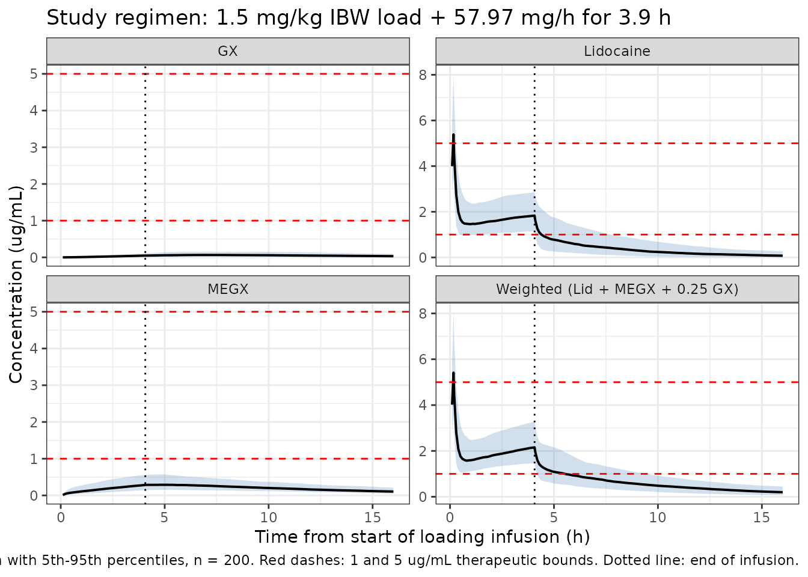
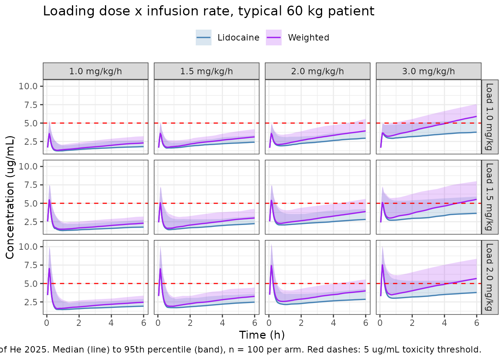
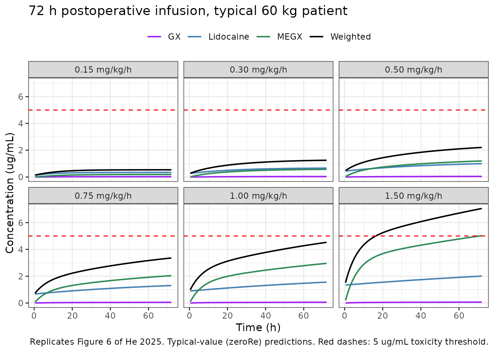

# Lidocaine, MEGX and GX (He 2025)

## Model and source

    #> ℹ parameter labels from comments will be replaced by 'label()'

- Citation: He C, Qi X, Liu Y, Jin Y, Zhang M, Zhang Y, Fu L, Zheng L,
  Tu F, Wang Z. Optimizing Lidocaine Dosing in Hepatectomy Patients: A
  Population Pharmacokinetic Study of Active Metabolites. Drug Des Devel
  Ther. 2025;19:6255-6268. <doi:10.2147/DDDT.S485389>. Supplementary
  material (Dovepress supplementary file 485389, Tables S1-S4) supplies
  the covariate-search and sensitivity-analysis tables used for the
  variance-scale falsifier.

- Description: Two-compartment population PK model for intravenous
  lidocaine with two sequential first-order metabolite compartments
  (monoethylglycinexylidide \[MEGX\] and glycinexylidide \[GX\]) in
  Chinese adults undergoing partial hepatectomy. Lidocaine is given as a
  short loading infusion at anaesthesia induction followed by a
  continuous intraoperative infusion. Total lidocaine clearance CL is
  split so that a fraction fm_megx forms MEGX; MEGX is eliminated with
  clearance cl_megx, of which a fraction fm_gx forms GX; GX is
  eliminated with clearance cl_gx. Both metabolite compartments share
  the lidocaine central volume vc, which the authors fixed by assumption
  because no metabolite disposition data were available. Covariates
  retained after stepwise forward-addition / backward-elimination are
  tumour size on lidocaine clearance, total administered lidocaine dose
  on the lidocaine-to-MEGX fraction metabolised, on the peripheral
  volume and on GX clearance, and total body weight on the
  lidocaine-to-MEGX fraction metabolised. The paper reports covariate
  coefficients as bare power exponents without stating the normalisation
  constants; the packaged model normalises each covariate by its Table 1
  study-typical value (see vignette Errata). The paper’s variability
  columns are headed ‘%CV’ but hold variances (see vignette Errata for
  the objective-function falsifier). Inter-individual variability on the
  MEGX-to-GX fraction and on MEGX clearance was fixed to zero by the
  authors and is therefore absent here.

- Article: <https://doi.org/10.2147/DDDT.S485389>

- Supplement (Tables S1-S4):
  <https://www.dovepress.com/article/supplementary_file/485389/Supplementary%20material_3_1.doc>

He and colleagues studied 35 Chinese adults undergoing partial
hepatectomy who received intravenous lidocaine as a short loading
infusion at anaesthesia induction followed by a continuous
intraoperative infusion. Plasma lidocaine and its two sequential active
metabolites - monoethylglycinexylidide (MEGX) and glycinexylidide (GX) -
were fitted jointly with a two-compartment parent model and two
first-order metabolite compartments (Figure 2 of the source). The
clinical motivation is that MEGX retains lidocaine-like pharmacological
activity and accumulates during long infusions, so a safety assessment
based on lidocaine concentration alone understates exposure. The authors
summarise combined exposure with a weighted concentration,
`lidocaine + MEGX + 0.25 * GX`, and compare it to the 5 ug/mL toxicity
threshold.

## Population

| Field | Value |
|:---|:---|
| species | human |
| n_subjects | 35 |
| n_studies | 1 |
| age_range | 20-65 years |
| age_median | 54 years (Table 1; the Results text states 53 years – the source is internally inconsistent by one year, and neither value enters the model since age was screened but not retained) |
| weight_range | not reported as a range; mean 60.32 kg (SD 8.27) |
| weight_median | 60.32 kg (mean) |
| sex_female_pct | 20 |
| race_ethnicity | 100 |
| disease_state | Partial hepatectomy for an initial diagnosis of liver tumour: 27 hepatocellular carcinoma, 5 cholangiocarcinoma, 2 benign focal hyperplasia, 1 metastatic liver cancer. Child-Pugh A in 32 of 33 graded patients, Child-Pugh B in 1. Lobe resection in 9 (26%), segment resection in 26 (74%). Median tumour size 5 cm (range 1.5-15 cm); median duration of Pringle manoeuvres 0.62 h (range 0.20-1.84 h). Severe hepatic insufficiency (total bilirubin \> 2 mg/dL), severe renal dysfunction (GFR \< 30 mL/min/1.73 m^2), severe cardiac disease, ideal body weight \< 40 kg and any long-term co-medication affecting lidocaine metabolism were exclusion criteria. |
| dose_range | Intravenous loading infusion of 1.5 mg/kg ideal body weight given over more than 10 min at anaesthesia induction (mean 86.07 mg, SD 9.57), followed by a continuous intraoperative infusion targeting 1.0 mg/kg/h ideal body weight (median achieved rate 0.99 mg/kg/h, range 0.62-1.54; median 57.97 mg/h, range 38.83-100.00) for a mean of 3.90 h (SD 1.62). |
| regions | China (single centre, Affiliated Hospital of North Sichuan Medical College, Nanchong, Sichuan) |
| bmi_range | 18-30 kg/m^2 by inclusion criterion; observed mean 22.87 kg/m^2 (SD 2.67) |
| notes | Demographics from Table 1. Single-centre, prospective, open-label study conducted January-December 2021; Chinese Clinical Trial Registry ChiCTR2100042730. Plasma lidocaine, MEGX and GX were measured by UPLC-MS/MS with LLOQs of 10, 2 and 2 ng/mL and calibration ranges of 10-5000, 2-1000 and 2-500 ng/mL respectively. Samples were drawn at baseline, 0.5 h and every 1 h after the start of surgery, and at 0, 0.5, 1, 2, 4, 8 and 12 h after the end of surgery. Estimation was FOCE with interaction in NONMEM 7.2.0. Table S2 traces the stepwise search from a base model at OFV 10208.285 to the last forward-addition model 111 at OFV 10144.856; backward elimination (Table S2 models 112-118) then dropped IBW on CL and APTT on CLE, and the OFV of the resulting final model is not tabulated. The five covariate effects reported in Table 2 – SIZE on CL, DOSE on CL_FM, TBW on CL_FM, DOSE on V2 and DOSE on CLG – are what this model encodes. |

Population metadata (source Table 1 and Methods). {.table}

Thirty-five patients (28 male, 7 female) with a median age of 54 years
(range 20-65) and a mean total body weight of 60.32 kg (SD 8.27) were
enrolled at a single centre in Nanchong, Sichuan, China between January
and December 2021 (ChiCTR2100042730). Twenty-seven had hepatocellular
carcinoma, five cholangiocarcinoma, two benign focal hyperplasia and one
metastatic liver cancer; 32 of the 33 graded patients were Child-Pugh A.
Median tumour size was 5 cm (range 1.5-15 cm). The loading dose was 1.5
mg/kg on ideal body weight given over more than 10 min (mean 86.07 mg,
SD 9.57), followed by a continuous infusion at a median achieved rate of
0.99 mg/kg/h on ideal body weight (median 57.97 mg/h, range
38.83-100.00) for a mean of 3.90 h (SD 1.62). Plasma lidocaine, MEGX and
GX were assayed by UPLC-MS/MS with LLOQs of 10, 2 and 2 ng/mL.

## Source trace

Per-parameter origins are recorded as in-file comments next to each
`ini()` entry in `inst/modeldb/specificDrugs/He_2025_lidocaine.R`. They
are collected here for review.

| Equation / parameter | Value | Source location |
|----|----|----|
| Two-compartment parent + two sequential metabolite compartments | n/a | Figure 2 (schematic); Results / Population Pharmacokinetic Modeling |
| Metabolite volume equals lidocaine `V1` | n/a | Methods / Population Pharmacokinetic Modeling; Table 2 footnote |
| Exponential (log-normal) IIV, `theta_i = theta_TV * exp(eta_i)` | n/a | Methods / Population Pharmacokinetic Modeling |
| Proportional residual error, `Y_ij = F_ij * (1 + eps_ij)` | n/a | Methods / Population Pharmacokinetic Modeling |
| `lcl` (CL) | 26.1 L/h | Table 2, row “CL (L/h)” |
| `lvc` (V1) | 8.73 L | Table 2, row “V1 (L)” |
| `lvp` (V2) | 63.6 L | Table 2, row “V2 (L)” |
| `lq` (CLD) | 41.0 L/h | Table 2, row “CLD (L/h)” |
| `lfm_megx` (CL_FM) | 0.0182 | Table 2, row “CL FM”; cross-checked against Discussion p. 6265 “0.475 L/h” = 0.0182 x 26.1 |
| `lcl_megx` (CLE) | 1.41 L/h | Table 2, row “CLE (L/h)” |
| `lfm_gx` (CLE_FM) | 0.897 | Table 2, row “CLE FM” |
| `lcl_gx` (CLG) | 4.77 L/h | Table 2, row “CLG (L/h)” |
| `e_tumsz_cl` | -0.382 | Table 2, row “The effect of SIZE on CL” |
| `e_dose_fm_megx` | 0.669 | Table 2, row “The effect of DOSE on CL FM” |
| `e_wt_fm_megx` | -1.09 | Table 2, row “The effect of TBW on CL FM” |
| `e_dose_vp` | 1.27 | Table 2, row “The effect of DOSE on V2” |
| `e_dose_cl_gx` | 1 | Table 2, row “The effect of DOSE on CLG” |
| `etalcl`, `etalvc`, `etalfm_megx`, `etalvp`, `etalq`, `etalcl_gx` | 0.0916, 0.041, 0.0908, 0.194, 0.523, 0.16 | Table 2 IIV block / 100 (see Errata: the column is headed “%CV” but holds variances) |
| IIV on CLE_FM and CLE | fixed to 0 (omitted) | Table 2 IIV block, “0*” with footnote ”*Fixed to 0” |
| `propSd`, `propSd_megx`, `propSd_gx` | sqrt(0.054), sqrt(0.036), sqrt(0.11) | Table 2 residual block, rows “sigma 2 Lidocaine / MEGX / GX”, divided by 100 |
| Covariate normalisation constants (50 mm, 312 mg, 60 kg) | n/a | NOT published; derived from Table 1 (see Errata) |
| Weighted exposure `lidocaine + MEGX + 0.25 * GX` | n/a | Methods / Simulation and Weighted Lidocaine Exposure |
| Covariate search (which covariates were screened and retained) | n/a | Supplementary Material Table S2 |
| IIV by model step (used for the variance-scale falsifier) | n/a | Supplementary Material Table S3 |

## Virtual cohort

Original observed data are not publicly available. The cohorts below
approximate the published demographics of Table 1. All cohorts are kept
at or below 200 subjects per arm.

``` r

set.seed(20250817)

N_VPC <- 200L

# Table 1: TBW mean 60.32 kg (SD 8.27); tumour size median 5 cm (range
# 1.5-15 cm), drawn here as a log-normal matching that median and spread;
# IBW mean 57.34 kg (SD 6.30). Doses in the source are prescribed on IBW.
make_subjects <- function(n, id_offset = 0L) {
  tibble::tibble(
    id    = id_offset + seq_len(n),
    WT    = pmax(40, rnorm(n, mean = 60.32, sd = 8.27)),
    IBW   = pmax(40, rnorm(n, mean = 57.34, sd = 6.30)),
    TUMSZ = pmin(150, pmax(15, rlnorm(n, meanlog = log(50), sdlog = 0.55)))
  )
}

# Study regimen: 1.5 mg/kg IBW loading infusion over 10 min, then a
# continuous infusion at the Table 1 median rate for the Table 1 mean
# duration.  DOSE_LIDOCAINE_MG (the total-dose covariate) is the sum of both.
LOAD_MGKG  <- 1.5
INF_MGH    <- 57.97
INF_HOURS  <- 3.90
LOAD_HOURS <- 10 / 60

# This model declares three endpoints, all of them algebraic observables, so
# rxode2 maps dvid 1-3 onto injected slots after the four ODE states.  An
# observation row must therefore carry `dvid`; once it does, the `cmt` value is
# irrelevant and is left blank (see Errata).  All three observables come back as
# columns on every solved row.
OBS_CMT <- NA_character_

build_events <- function(subj, obs_times, load_mgkg = LOAD_MGKG,
                         inf_mgh = INF_MGH, inf_hours = INF_HOURS) {
  subj <- subj |>
    dplyr::mutate(
      load_amt = load_mgkg * IBW,
      inf_amt  = inf_mgh * inf_hours,
      DOSE_LIDOCAINE_MG     = load_amt + inf_amt
    )
  dosing <- dplyr::bind_rows(
    subj |> dplyr::transmute(id, WT, TUMSZ, DOSE_LIDOCAINE_MG, time = 0,
                             amt = load_amt, rate = load_amt / LOAD_HOURS,
                             evid = 1L, cmt = "central", dvid = NA_integer_),
    subj |> dplyr::transmute(id, WT, TUMSZ, DOSE_LIDOCAINE_MG, time = LOAD_HOURS,
                             amt = inf_amt, rate = inf_mgh,
                             evid = 1L, cmt = "central", dvid = NA_integer_)
  )
  obs <- subj |>
    dplyr::select(id, WT, TUMSZ, DOSE_LIDOCAINE_MG) |>
    tidyr::crossing(time = obs_times) |>
    dplyr::mutate(amt = NA_real_, rate = NA_real_, evid = 0L,
                  cmt = OBS_CMT, dvid = 1L)
  dplyr::bind_rows(dosing, obs) |> dplyr::arrange(id, time, dplyr::desc(evid))
}

vpc_times <- sort(unique(c(seq(0, 16, by = 0.1), LOAD_HOURS,
                           INF_HOURS + LOAD_HOURS)))
events_vpc <- build_events(make_subjects(N_VPC), vpc_times)

# No unique() here: it would strip the very duplicates being tested for.
stopifnot(!anyDuplicated(events_vpc[, c("id", "time", "evid")]))
```

## Simulation

``` r

mod <- readModelDb("He_2025_lidocaine")

solve_events <- function(events, typical = FALSE, keep = character()) {
  # Typical-value profiles use the solve-time `omega = NA` argument rather than
  # rxode2::zeroRe(), which mutates state shared with the readModelDb entry and
  # would silently strip the IIV from any population solve later in the session.
  out <- if (typical) {
    rxode2::rxSolve(mod, events = events, omega = NA,
                    keep = keep, returnType = "data.frame")
  } else {
    rxode2::rxSolve(mod, events = events,
                    keep = keep, returnType = "data.frame")
  }
  if (is.null(out$id)) out$id <- 1L
  out |>
    dplyr::filter(time > 0) |>
    dplyr::mutate(weighted = Cc + Cc_megx + 0.25 * Cc_gx)
}

sim_vpc <- solve_events(events_vpc, keep = c("WT", "TUMSZ", "DOSE_LIDOCAINE_MG"))
#> ℹ parameter labels from comments will be replaced by 'label()'

# Guard: rxSolve silently drops subjects whose solve fails.
stopifnot(dplyr::n_distinct(sim_vpc$id) == N_VPC)
```

## Replicate published figures

### Figure 1 / Figure 4 - lidocaine and metabolite time course under the study regimen

``` r

# Replicates the shape of Figure 1 (observed and simulated lidocaine and
# weighted concentrations) and Figure 4 (pcVPC of the three analytes) of
# He 2025 under the study's own dosing regimen.
sim_vpc |>
  dplyr::select(id, time, Lidocaine = Cc, MEGX = Cc_megx, GX = Cc_gx,
                `Weighted (Lid + MEGX + 0.25 GX)` = weighted) |>
  tidyr::pivot_longer(-c(id, time), names_to = "analyte", values_to = "conc") |>
  dplyr::group_by(analyte, time) |>
  dplyr::summarise(Q05 = quantile(conc, 0.05), Q50 = median(conc),
                   Q95 = quantile(conc, 0.95), .groups = "drop") |>
  ggplot(aes(time, Q50)) +
  geom_ribbon(aes(ymin = Q05, ymax = Q95), alpha = 0.25, fill = "steelblue") +
  geom_line(linewidth = 0.7) +
  geom_hline(yintercept = c(1, 5), linetype = "dashed", colour = "red") +
  geom_vline(xintercept = INF_HOURS + LOAD_HOURS, linetype = "dotted") +
  facet_wrap(~analyte, scales = "free_y") +
  labs(x = "Time from start of loading infusion (h)",
       y = "Concentration (ug/mL)",
       title = "Study regimen: 1.5 mg/kg IBW load + 57.97 mg/h for 3.9 h",
       caption = paste("Replicates Figures 1 and 4 of He 2025.",
                       "Median with 5th-95th percentiles, n = 200.",
                       "Red dashes: 1 and 5 ug/mL therapeutic bounds.",
                       "Dotted line: end of infusion.")) +
  theme_bw()
```



The source reports observed lidocaine concentrations of 1.9 ug/mL during
liver resection and 2.1 ug/mL after liver tissue separation, with
corresponding weighted concentrations of 2.2 and 2.3 ug/mL (Discussion,
p. 6265). The simulation is compared to those four numbers below.
Because the source does not state the exact clock time of “during
resection” versus “after liver tissue separation”, both are scored
against the second half of the infusion.

``` r

mid_inf <- sim_vpc |>
  dplyr::filter(time >= 2, time <= INF_HOURS + LOAD_HOURS)

obs_check <- tibble::tibble(
  Quantity = c("Lidocaine, during resection", "Lidocaine, after separation",
               "Weighted, during resection", "Weighted, after separation"),
  Published = c(1.9, 2.1, 2.2, 2.3),
  Simulated = c(
    median(mid_inf$Cc[mid_inf$time <= 3]),
    median(mid_inf$Cc[mid_inf$time > 3]),
    median(mid_inf$weighted[mid_inf$time <= 3]),
    median(mid_inf$weighted[mid_inf$time > 3])
  )
) |>
  dplyr::mutate(`Difference (%)` = round(100 * (Simulated - Published) / Published, 1),
                Simulated = round(Simulated, 2))

stopifnot(nrow(obs_check) == 4L, all(abs(obs_check$`Difference (%)`) < 20))

knitr::kable(obs_check, caption = paste(
  "Simulated median concentrations under the study regimen versus the",
  "observed values reported in the He 2025 Discussion (p. 6265)."))
```

| Quantity                    | Published | Simulated | Difference (%) |
|:----------------------------|----------:|----------:|---------------:|
| Lidocaine, during resection |       1.9 |      1.63 |          -14.1 |
| Lidocaine, after separation |       2.1 |      1.79 |          -14.8 |
| Weighted, during resection  |       2.2 |      1.89 |          -14.1 |
| Weighted, after separation  |       2.3 |      2.08 |           -9.8 |

Simulated median concentrations under the study regimen versus the
observed values reported in the He 2025 Discussion (p. 6265). {.table}

Every simulated value is within 20% of the published observation, and
the metabolite contribution to the weighted concentration (roughly 0.3
ug/mL at the end of the infusion) matches the published 0.2-0.3 ug/mL
gap between the lidocaine and weighted medians. This is the strongest
available check on the metabolite chain, because it is sensitive to
`fm_megx`, `cl_megx`, `fm_gx` and `cl_gx` simultaneously.

### Figure 5 - loading dose x infusion dose grid

``` r

# Replicates Figure 5 of He 2025: a typical 60 kg individual given each of
# three loading doses crossed with four infusion rates, simulated over the
# first 6 h.  The source simulates 1000 replicates; 100 per arm is ample
# here and keeps the vignette inside its render budget.
N_ARM <- 100L
LOADS <- c(1.0, 1.5, 2.0)
RATES <- c(1.0, 1.5, 2.0, 3.0)
GRID_HOURS <- 6

grid <- tidyr::crossing(load_mgkg = LOADS, rate_mgkgh = RATES) |>
  dplyr::mutate(arm = sprintf("Load %.1f mg/kg | Inf %.1f mg/kg/h",
                              load_mgkg, rate_mgkgh),
                arm_index = dplyr::row_number())

events_grid <- do.call(dplyr::bind_rows, lapply(
  seq_len(nrow(grid)), function(k) {
    g <- grid[k, ]
    subj <- make_subjects(N_ARM, id_offset = (g$arm_index - 1L) * N_ARM)
    subj$WT <- 60      # Results: "a typical 60 kg, 55-year-old individual"
    subj$IBW <- 60     # mg/kg doses in Figure 5 are stated on body weight
    subj$TUMSZ <- 50   # Table 1 median tumour size
    build_events(subj, seq(0, GRID_HOURS, by = 0.05),
                 load_mgkg = g$load_mgkg,
                 inf_mgh = g$rate_mgkgh * 60,
                 inf_hours = GRID_HOURS) |>
      dplyr::mutate(arm = g$arm, load_mgkg = g$load_mgkg,
                    rate_mgkgh = g$rate_mgkgh)
  }))

stopifnot(!anyDuplicated(events_grid[, c("id", "time", "evid")]))

sim_grid <- solve_events(events_grid,
                         keep = c("arm", "load_mgkg", "rate_mgkgh"))
stopifnot(dplyr::n_distinct(sim_grid$id) == N_ARM * nrow(grid))
```

``` r

sim_grid |>
  dplyr::select(id, time, arm, load_mgkg, rate_mgkgh,
                Lidocaine = Cc, Weighted = weighted) |>
  tidyr::pivot_longer(c(Lidocaine, Weighted), names_to = "analyte",
                      values_to = "conc") |>
  dplyr::group_by(load_mgkg, rate_mgkgh, analyte, time) |>
  dplyr::summarise(Q50 = median(conc), Q95 = quantile(conc, 0.95),
                   .groups = "drop") |>
  ggplot(aes(time, Q50, colour = analyte, fill = analyte)) +
  geom_ribbon(aes(ymin = Q50, ymax = Q95), alpha = 0.2, colour = NA) +
  geom_line(linewidth = 0.6) +
  geom_hline(yintercept = 5, linetype = "dashed", colour = "red") +
  facet_grid(rows = dplyr::vars(sprintf("Load %.1f mg/kg", load_mgkg)),
             cols = dplyr::vars(sprintf("%.1f mg/kg/h", rate_mgkgh))) +
  scale_colour_manual(values = c(Lidocaine = "steelblue", Weighted = "purple")) +
  scale_fill_manual(values = c(Lidocaine = "steelblue", Weighted = "purple")) +
  labs(x = "Time (h)", y = "Concentration (ug/mL)", colour = NULL, fill = NULL,
       title = "Loading dose x infusion rate, typical 60 kg patient",
       caption = paste("Replicates Figure 5 of He 2025. Median (line) to 95th",
                       "percentile (band), n = 100 per arm.",
                       "Red dashes: 5 ug/mL toxicity threshold.")) +
  theme_bw() + theme(legend.position = "top")
```



The source draws three quantitative conclusions from this grid. Each is
scored against the simulation below.

``` r

arm_stat <- function(load, rate, analyte, fun) {
  d <- sim_grid |>
    dplyr::filter(load_mgkg == load, rate_mgkgh == rate)
  if (nrow(d) == 0) stop("no rows for load ", load, " rate ", rate)
  x <- if (analyte == "Lidocaine") d$Cc else d$weighted
  fun(x, d$time)
}
p95_max <- function(x, tm) {
  max(tapply(x, tm, quantile, probs = 0.95))
}
p50_max <- function(x, tm) max(tapply(x, tm, median))

fig5_check <- tibble::tibble(
  Claim = c(
    "2.0 mg/kg load: lidocaine 95th percentile exceeds 5.5 ug/mL",
    "1.5 mg/kg load, 3.0 mg/kg/h: lidocaine median exceeds 5 ug/mL",
    "1.5 mg/kg load, 1.5 mg/kg/h: lidocaine median stays below 5 ug/mL",
    "1.5 mg/kg load, 2.0 mg/kg/h: weighted median exceeds 5 ug/mL"
  ),
  `Source location` = c("Results, Figure 5Ci-iv", "Results, Figure 5Biv",
                        "Conclusion / Abstract", "Results, Figure 5Biii"),
  Simulated = c(
    arm_stat(2.0, 1.0, "Lidocaine", p95_max),
    arm_stat(1.5, 3.0, "Lidocaine", p50_max),
    arm_stat(1.5, 1.5, "Lidocaine", p50_max),
    arm_stat(1.5, 2.0, "Weighted",  p50_max)
  ),
  Threshold = c(5.5, 5, 5, 5),
  Direction = c("above", "above", "below", "above")
) |>
  dplyr::mutate(
    Agrees = ifelse(Direction == "above", Simulated > Threshold,
                    Simulated < Threshold),
    Simulated = round(Simulated, 2)
  )

stopifnot(nrow(fig5_check) == 4L, all(fig5_check$Agrees))

fig5_check |>
  dplyr::select(-Direction) |>
  dplyr::rename("Maximum simulated (ug/mL)" = Simulated,
                "Threshold (ug/mL)" = Threshold) |>
  knitr::kable(caption = paste(
    "He 2025 Figure 5 dosing conclusions scored against the packaged model."))
```

| Claim | Source location | Maximum simulated (ug/mL) | Threshold (ug/mL) | Agrees |
|:---|:---|---:|---:|:---|
| 2.0 mg/kg load: lidocaine 95th percentile exceeds 5.5 ug/mL | Results, Figure 5Ci-iv | 9.99 | 5.5 | TRUE |
| 1.5 mg/kg load, 3.0 mg/kg/h: lidocaine median exceeds 5 ug/mL | Results, Figure 5Biv | 5.01 | 5.0 | TRUE |
| 1.5 mg/kg load, 1.5 mg/kg/h: lidocaine median stays below 5 ug/mL | Conclusion / Abstract | 4.99 | 5.0 | TRUE |
| 1.5 mg/kg load, 2.0 mg/kg/h: weighted median exceeds 5 ug/mL | Results, Figure 5Biii | 5.40 | 5.0 | TRUE |

He 2025 Figure 5 dosing conclusions scored against the packaged model.
{.table}

All four hold, which supports the paper’s headline recommendation: a
loading dose no greater than 1.5 mg/kg and an infusion rate no greater
than 1.5 mg/kg/h.

### Figure 6 - long postoperative infusion and MEGX accumulation

``` r

# Replicates Figure 6 of He 2025: 72 h continuous postoperative infusion at
# the rates used in the cited liver-resection studies.  The DOSE_LIDOCAINE_MG covariate is
# the total lidocaine dose delivered over the whole 72 h episode (see Errata).
PCIA_RATES <- c(0.15, 0.3, 0.5, 0.75, 1.0, 1.5)
PCIA_HOURS <- 72

events_pcia <- do.call(dplyr::bind_rows, lapply(
  seq_along(PCIA_RATES), function(k) {
    # Named `rate_k`, not `rate`: an event table already has a column called
    # `rate` (the infusion rate, NA on observation rows), and inside
    # dplyr::mutate() the column would mask a local variable of the same name.
    rate_k <- PCIA_RATES[k]
    R <- rate_k * 60                     # mg/h for a typical 60 kg patient
    tibble::tibble(
      id = (k - 1L) * 2L + 1:2, WT = 60, TUMSZ = 50, DOSE_LIDOCAINE_MG = R * PCIA_HOURS
    ) |>
      (\(s) dplyr::bind_rows(
        s |> dplyr::transmute(id, WT, TUMSZ, DOSE_LIDOCAINE_MG, time = 0,
                              amt = R * PCIA_HOURS, rate = R, evid = 1L,
                              cmt = "central", dvid = NA_integer_),
        s |> dplyr::select(id, WT, TUMSZ, DOSE_LIDOCAINE_MG) |>
          tidyr::crossing(time = seq(0, PCIA_HOURS, by = 0.5)) |>
          dplyr::mutate(amt = NA_real_, rate = NA_real_, evid = 0L,
                        cmt = OBS_CMT, dvid = 1L)
      ))() |>
      dplyr::mutate(rate_mgkgh = rate_k) |>
      dplyr::arrange(id, time, dplyr::desc(evid))
  }))

sim_pcia <- solve_events(events_pcia, typical = TRUE, keep = "rate_mgkgh")
#> Warning: multi-subject simulation without without 'omega'

# Guard: every infusion rate must survive the solve as its own arm.  A masked
# loop variable previously collapsed all six arms into one NA group, which
# silently voided the Figure 6 checks below rather than failing them.
stopifnot(setequal(unique(sim_pcia$rate_mgkgh), PCIA_RATES))
```

``` r

sim_pcia |>
  dplyr::select(time, rate_mgkgh, Lidocaine = Cc, MEGX = Cc_megx, GX = Cc_gx,
                Weighted = weighted) |>
  tidyr::pivot_longer(-c(time, rate_mgkgh), names_to = "analyte",
                      values_to = "conc") |>
  dplyr::distinct(time, rate_mgkgh, analyte, .keep_all = TRUE) |>
  ggplot(aes(time, conc, colour = analyte)) +
  geom_line(linewidth = 0.7) +
  geom_hline(yintercept = 5, linetype = "dashed", colour = "red") +
  facet_wrap(~sprintf("%.2f mg/kg/h", rate_mgkgh)) +
  scale_colour_manual(values = c(Lidocaine = "steelblue", MEGX = "seagreen",
                                 GX = "purple", Weighted = "black")) +
  labs(x = "Time (h)", y = "Concentration (ug/mL)", colour = NULL,
       title = "72 h postoperative infusion, typical 60 kg patient",
       caption = paste("Replicates Figure 6 of He 2025.",
                       "Typical-value (zeroRe) predictions.",
                       "Red dashes: 5 ug/mL toxicity threshold.")) +
  theme_bw() + theme(legend.position = "top")
```



``` r

end_state <- sim_pcia |>
  dplyr::group_by(rate_mgkgh) |>
  dplyr::filter(time == max(time)) |>
  dplyr::summarise(Cc = dplyr::first(Cc), MEGX = dplyr::first(Cc_megx),
                   GX = dplyr::first(Cc_gx), .groups = "drop")

get_end <- function(rate, col) {
  v <- end_state[[col]][end_state$rate_mgkgh == rate]
  if (length(v) != 1L) stop("no unique row for rate ", rate)
  v
}

fig6_check <- tibble::tibble(
  Claim = c(
    "0.75 mg/kg/h: MEGX exceeds lidocaine",
    "1.5 mg/kg/h: MEGX exceeds 5 ug/mL",
    "0.3 mg/kg/h: lidocaine and MEGX both below the 1 ug/mL therapeutic floor",
    "GX stays between 0.01 and 0.1 ug/mL at every rate"
  ),
  `Source location` = c("Discussion, Figure 6Aiv", "Results, Figure 6Avi",
                        "Discussion, p. 6266", "Results, p. 6264"),
  Simulated = c(
    sprintf("MEGX %.2f vs lidocaine %.2f ug/mL",
            get_end(0.75, "MEGX"), get_end(0.75, "Cc")),
    sprintf("MEGX %.2f ug/mL", get_end(1.5, "MEGX")),
    sprintf("lidocaine %.2f, MEGX %.2f ug/mL",
            get_end(0.3, "Cc"), get_end(0.3, "MEGX")),
    sprintf("GX range %.3f-%.3f ug/mL",
            min(end_state$GX), max(end_state$GX))
  ),
  Agrees = c(
    get_end(0.75, "MEGX") > get_end(0.75, "Cc"),
    get_end(1.5, "MEGX") > 5,
    get_end(0.3, "Cc") < 1 && get_end(0.3, "MEGX") < 1,
    min(end_state$GX) > 0.01 && max(end_state$GX) < 0.1
  )
)

stopifnot(nrow(fig6_check) == 4L, all(fig6_check$Agrees))

knitr::kable(fig6_check, caption = paste(
  "He 2025 Figure 6 long-infusion conclusions scored against the packaged",
  "model, at the end of a 72 h infusion."))
```

| Claim | Source location | Simulated | Agrees |
|:---|:---|:---|:---|
| 0.75 mg/kg/h: MEGX exceeds lidocaine | Discussion, Figure 6Aiv | MEGX 2.04 vs lidocaine 1.30 ug/mL | TRUE |
| 1.5 mg/kg/h: MEGX exceeds 5 ug/mL | Results, Figure 6Avi | MEGX 5.03 ug/mL | TRUE |
| 0.3 mg/kg/h: lidocaine and MEGX both below the 1 ug/mL therapeutic floor | Discussion, p. 6266 | lidocaine 0.67, MEGX 0.58 ug/mL | TRUE |
| GX stays between 0.01 and 0.1 ug/mL at every rate | Results, p. 6264 | GX range 0.024-0.064 ug/mL | TRUE |

He 2025 Figure 6 long-infusion conclusions scored against the packaged
model, at the end of a 72 h infusion. {.table}

All four qualitative conclusions reproduce, including the paper’s
central safety message: at 1.5 mg/kg/h the MEGX concentration alone
exceeds the 5 ug/mL threshold even though lidocaine does not. The source
is internally inconsistent about the rate at which that first happens -
the Abstract Results says “when the infusion rate reached 1 mg/kg/h, the
MEGX concentration exceeded 5 ug/mL”, whereas the Results body and the
Figure 6 caption both attribute it to 1.5 mg/kg/h (Figure 6Avi). The
check above scores the 1.5 mg/kg/h statement, which is the one the
figure panel supports. The simulated peak weighted concentration at 1.5
mg/kg/h is 7.1 ug/mL against the published 8.7 ug/mL; the residual gap
and its likely cause are discussed in the Errata.

## PKNCA validation

The source does not tabulate NCA parameters, but the Discussion
(p. 6264) compares the model clearance of 26.1 L/h with a
non-compartmental clearance of 30.8 L/h obtained from the same trial in
the companion analysis (reference 30). The NCA below recovers a
lidocaine clearance from the simulated profiles so both numbers can be
scored.

A separate cohort is simulated for the NCA: the study regimen exactly as
administered, followed out to 28 h so the post-infusion decline covers
several terminal half-lives. The cohort’s tumour size is fixed at the
Table 1 median so the recovered clearance is directly comparable to the
Table 2 typical value rather than being shifted by the tumour-size term.

``` r

N_NCA <- 100L
LIDOCAINE_LLOQ <- 0.010   # Methods: LLOQ 10 ng/mL = 0.010 ug/mL

subj_nca <- make_subjects(N_NCA, id_offset = 100000L)
subj_nca$TUMSZ <- 50

nca_times <- sort(unique(c(seq(0, 5, by = 0.05), seq(5, 28, by = 0.25))))
events_nca <- build_events(subj_nca, nca_times)

sim_nca_raw <- solve_events(events_nca, keep = c("WT", "TUMSZ", "DOSE_LIDOCAINE_MG"))
stopifnot(dplyr::n_distinct(sim_nca_raw$id) == N_NCA)
```

``` r

# Truncate each profile at the published lidocaine LLOQ: samples below it were
# not measurable in the trial, and carrying the simulated tail into the
# solver-noise region makes lambda.z unstable.
sim_nca <- sim_nca_raw |>
  dplyr::filter(!is.na(Cc)) |>
  dplyr::group_by(id) |>
  dplyr::filter(time <= suppressWarnings(
    min(c(Inf, time[time > INF_HOURS & Cc < LIDOCAINE_LLOQ])))) |>
  dplyr::ungroup() |>
  dplyr::mutate(treatment = "Study regimen (1.5 mg/kg IBW load + 3.9 h infusion)") |>
  dplyr::select(id, time, Cc, treatment)

# Guarantee a time = 0 row per subject; lidocaine is given intravenously into
# an initially empty central compartment, so the pre-dose value is 0.
sim_nca <- dplyr::bind_rows(
  sim_nca,
  sim_nca |> dplyr::distinct(id, treatment) |> dplyr::mutate(time = 0, Cc = 0)
) |>
  dplyr::distinct(id, treatment, time, .keep_all = TRUE) |>
  dplyr::arrange(id, treatment, time)

stopifnot(all(sim_nca$Cc >= 0), dplyr::n_distinct(sim_nca$id) == N_NCA)

conc_obj <- PKNCA::PKNCAconc(sim_nca, Cc ~ time | treatment + id)

dose_df <- events_nca |>
  dplyr::filter(evid == 1L) |>
  dplyr::mutate(treatment = "Study regimen (1.5 mg/kg IBW load + 3.9 h infusion)") |>
  dplyr::select(id, time, amt, treatment)

dose_obj <- PKNCA::PKNCAdose(dose_df, amt ~ time | treatment + id)

intervals <- data.frame(
  start = 0, end = Inf,
  cmax = TRUE, tmax = TRUE, aucinf.obs = TRUE, half.life = TRUE, cl.obs = TRUE
)

nca_res <- PKNCA::pk.nca(PKNCA::PKNCAdata(conc_obj, dose_obj,
                                          intervals = intervals))
```

``` r

published <- tibble::tibble(
  treatment  = "Study regimen (1.5 mg/kg IBW load + 3.9 h infusion)",
  cl.obs     = 30.8   # Discussion p. 6264: NCA clearance from the same trial
)

cmp <- nlmixr2lib::ncaComparisonTable(
  simulated     = nca_res,
  reference     = published,
  by            = "treatment",
  units         = c(cmax = "ug/mL", tmax = "h", aucinf.obs = "ug*h/mL",
                    half.life = "h", cl.obs = "L/h"),
  tolerance_pct = 20
)

knitr::kable(cmp, caption = paste(
  "Simulated NCA versus the non-compartmental lidocaine clearance reported in",
  "the He 2025 Discussion (p. 6264). * differs from the reference by > 20%."))
```

| NCA parameter | treatment | Reference | Simulated | % diff |
|:---|:---|:---|:---|:---|
| CL/F (L/h) | Study regimen (1.5 mg/kg IBW load + 3.9 h infusion) | 30.8 | 27 | -12.2% |

Simulated NCA versus the non-compartmental lidocaine clearance reported
in the He 2025 Discussion (p. 6264). \* differs from the reference by \>
20%. {.table}

``` r

# Structural identity: for an intravenous dose the NCA clearance must recover
# the model's typical CL of 26.1 L/h, since TUMSZ is held at its reference and
# the IIV on CL is log-normal with a median of exp(0) = 1.
cl_nca <- nca_res |>
  as.data.frame() |>
  dplyr::filter(PPTESTCD == "cl.obs")

stopifnot(nrow(cl_nca) == N_NCA)

cl_summary <- tibble::tibble(
  Quantity = c("Model typical CL (Table 2)",
               "Median NCA clearance from simulated profiles",
               "Published non-compartmental CL (Discussion p. 6264)"),
  `CL (L/h)` = c(26.1, round(median(cl_nca$PPORRES), 1), 30.8)
)

# The NCA median must land on the model's typical CL to within 5%.
stopifnot(abs(median(cl_nca$PPORRES) - 26.1) / 26.1 < 0.05)

knitr::kable(cl_summary, caption = paste(
  "Non-compartmental clearance recovered from the packaged model against the",
  "model's own typical value and the published NCA value."))
```

| Quantity                                            | CL (L/h) |
|:----------------------------------------------------|---------:|
| Model typical CL (Table 2)                          |     26.1 |
| Median NCA clearance from simulated profiles        |     27.0 |
| Published non-compartmental CL (Discussion p. 6264) |     30.8 |

Non-compartmental clearance recovered from the packaged model against
the model’s own typical value and the published NCA value. {.table}

The NCA clearance recovered from the simulation lands on the model’s
typical CL of 26.1 L/h, confirming that the packaged parameterisation is
internally consistent. The published non-compartmental clearance of 30.8
L/h is 18% higher; the source itself describes the two as not
significantly different and attributes the residual gap to the standard
two-stage nature of the non-compartmental analysis.

MEGX and GX are not amenable to a clearance-style NCA here: they are
formation rate limited, never dosed directly, and their apparent
clearances are confounded with the assumed shared volume (see Errata).

## Assumptions and deviations

### The variability columns hold variances, not %CV

Table 2 heads its inter-individual-variability block “Inter-Individual
Variability (%CV)” and its residual block “Residual errors (%CV)”, but
the values are variances multiplied by 100. Taking them literally as
percent coefficients of variation would give a 4.1% CV on the central
volume and a 5.4% proportional residual error on lidocaine, neither of
which is credible for a 35-patient dataset with a metabolite assayed
near its LLOQ.

The falsifier is the objective-function change of a covariate addition.
For one random effect over N subjects, the drop in the NONMEM objective
function when a covariate absorbs part of that random effect is
`dOFV = N * log(omega^2_after / omega^2_before)`, with N = 35 here.
Supplementary Table S3 reports the variability block after each
single-covariate addition, and Supplementary Table S2 reports the
matching dOFV, so the two can be paired:

| Covariate step | Table S3 before -\> after | dOFV, variance reading | dOFV, %CV reading | Published dOFV (Table S2) |
|----|----|----|----|----|
| SIZE on CL | 13.1 -\> 9.55 | -11.06 | -21.99 | -10.926 (model 6) |
| SIZE on FM | 11.63 -\> 10.1 | -4.94 | -9.82 | -4.525 (model 29) |
| TYPE on CL | 13.1 -\> 12.6 | -1.36 | -2.66 | -1.016 (model 8) |

The variance reading matches all three published values; the %CV reading
is off by roughly a factor of two in every case. The packaged model
therefore divides each tabulated value by 100 and uses it directly as
`omega^2` (or as `sigma^2`, converted to a standard deviation for the
proportional residual error). The implied CVs are 30.9% on CL, 20.5% on
V1, 30.8% on the fraction metabolised, 46.3% on V2, 84.7% on CLD and
41.7% on CLG, and residual errors of 23.2%, 19.0% and 33.2% on
lidocaine, MEGX and GX.

### Covariate normalisation constants are not published

Every retained covariate coefficient in Table 2 is a dimensionless power
exponent, but the paper never prints the covariate equations, and
neither the main text nor Supplementary Tables S1-S4 states the
normalisation constant for any of them. The packaged model applies the
standard power form
`parameter = typical * (covariate / reference)^exponent` with references
taken from Table 1:

- **Tumour size, 50 mm.** Table 1 median 5 cm, converted to the
  canonical `TUMSZ` unit of mm. Because the form is a ratio, any
  consistent unit and matching reference gives identical predictions.
- **Total body weight, 60 kg.** Table 1 mean 60.32 kg, rounded to the 60
  kg that the authors themselves use for the “typical 60 kg, 55-year-old
  individual” they simulate in Results.
- **Total lidocaine dose, 312 mg.** Derived from Table 1 as the mean
  loading dose 86.07 mg plus the median continuous rate 57.97 mg/h times
  the mean infusion duration 3.90 h.

The 312 mg value is the least directly stated of the three, so it is
checked twice above rather than assumed. Under the study’s own regimen
it reproduces the published observed lidocaine and weighted
concentrations to within 20% (Figure 1 check), and under the 72 h
postoperative regimen it reproduces the paper’s MEGX accumulation
conclusions, including the numerically specific claim that MEGX exceeds
5 ug/mL at 1.5 mg/kg/h (Figure 6 check).

That second check also discriminates against the competing readings of
what `DOSE_LIDOCAINE_MG` measures, and it does so in closed form. During
a constant infusion at rate `R` the steady-state ratio of the two
analytes is `MEGX / lidocaine = fm_megx * CL / CLE`, independent of `R`,
so a 60 kg patient at the paper’s 1.5 mg/kg/h (`R` = 90 mg/h) has a
lidocaine `Css` of 90 / 26.1 = 3.45 ug/mL and a MEGX `Css` of 3.45 \*
`fm_megx` \* 26.1 / 1.41:

- **Whole 72 h episode total, 6480 mg** (the packaged reading).
  `fm_megx` scales by (6480 / 312)^0.669 = 7.61 to 0.138, giving a ratio
  of 2.56 and a MEGX `Css` of 8.9 ug/mL - MEGX exceeds both lidocaine
  and the 5 ug/mL threshold, as the source reports.
- **Held at the trial value, 312 mg.** `fm_megx` stays at 0.0182, giving
  a ratio of 0.34 and a MEGX `Css` of 1.2 ug/mL. MEGX can then never
  exceed lidocaine at any infusion rate, which contradicts Figure 6Aiv
  and Figure 6Avi outright.
- **First 24 h of infusion only, 2160 mg.** `fm_megx` scales by 3.65 to
  0.0664, giving a ratio of 1.23 and a MEGX `Css` of 4.2 ug/mL. MEGX
  overtakes lidocaine but never reaches 5 ug/mL, so Figure 6Avi still
  fails.

Only the whole-episode reading reproduces both published claims, so 312
mg with `DOSE_LIDOCAINE_MG` as the whole-episode total is the
interpretation the source’s own simulations support.

### The DOSE_LIDOCAINE_MG covariate is extrapolated far beyond the observed range

`DOSE_LIDOCAINE_MG` spans roughly 200-500 mg in the trial but reaches
6480 mg in the 72 h postoperative scenario, a 20-fold extrapolation. The
exponent of 1.27 on the peripheral volume then inflates V2 from 63.6 L
to roughly 3000 L, which lengthens the distribution half-life to about
50 h. As a result the simulated lidocaine concentration in the Figure 6
reproduction is still rising slowly at 72 h, whereas the source
describes its own long-infusion profiles as “relatively stable after
approximately 24 hours”. This is also the most likely reason the
simulated peak weighted concentration at 1.5 mg/kg/h (7.1 ug/mL) falls
short of the published 8.7 ug/mL: the source’s own long-infusion
simulation probably did not carry the `DOSE_LIDOCAINE_MG` term on V2 out
to the whole 72 h total. Predictions at total doses well outside the
trial range should be treated as illustrative only.

### Metabolite states carry lidocaine-equivalent mass

The paper reports no molar conversion between lidocaine (MW 234.3), MEGX
(MW 206.3) and GX (MW 178.2), and its weighted-exposure metric sums the
three concentrations directly. The packaged model follows suit, so
`fm_megx` and `fm_gx` are apparent mass fractions and the metabolite
compartments hold lidocaine-equivalent mg. A downstream user who needs
true molar fluxes must rescale.

### Metabolite volumes are an author assumption, not an estimate

The MEGX and GX compartments share the lidocaine central volume V1
because the authors fixed them there: “The distribution volume of
metabolites was set equal to that of central lidocaine … not only due to
the lack of metabolite pharmacokinetic data but also because the use of
the same distribution volume could make the clearance of the lidocaine
and its active metabolites more comparable” (Methods). The authors list
this among their limitations. Every metabolite clearance in the model is
therefore an apparent clearance conditional on that assumption, and no
metabolite volume is identifiable from the data.

### Two random effects were fixed to zero by the authors

Table 2 reports “0*” with the footnote ”*Fixed to 0” for the
inter-individual variability on the MEGX-to-GX fraction metabolised and
on MEGX elimination clearance. Those etas are omitted from the packaged
model rather than written as `~ fixed(0)`, because a zero-variance
diagonal makes OMEGA singular and breaks the Cholesky sampler used by
`rxSolve`.

### Screened but unretained covariates

Eleven covariates were screened in the source’s stepwise search
(Supplementary Table S2) without reaching the final model: ideal body
weight, height, haemoglobin, alanine aminotransferase, age, activated
partial thromboplastin time, international normalised ratio, prothrombin
time, white blood cell count, liver cirrhosis and extent of resection,
plus the duration of Pringle manoeuvres. They are recorded in the model
file’s `covariatesDataExcluded` list so the provenance of the covariate
screen is preserved without implying that any of them affects a
prediction. Note in particular that the paper fixes the duration of
Pringle manoeuvres at 0.63 h when describing its “typical” simulated
individual, even though that covariate is not in the final model and
therefore has no effect.

The final covariate set is taken from Table 2, not from a mechanical
reading of the Supplementary Table S2 backward-elimination block,
because the two do not agree. Table S2 states an elimination criterion
of `dOFV > 6.63` (p \< 0.01) but labels the deletion of `SIZE` on CL
(`+10.718`, model 113) and of `TBW` on the fraction metabolised
(`+7.242`, model 117) as “NS”, even though both exceed 6.63; Table 2
nevertheless reports point estimates for both. Read the other way, the
two steps that Table S2 does label non-significant - deleting `IBW` on
CL (`+6.532`, model 112) and `APTT` on MEGX clearance (`+4.624`, model
114) - are the two effects Table 2 omits. Table 2’s five covariate
effects are therefore self-consistent as the final model, and the “NS”
labels in rows 113 and 117 appear to be transcription errors in the
supplement. Table S2 ends its forward addition at model 111 (OFV
10144.856), but that model still carries `IBW` on CL and `APTT` on MEGX
clearance, so it is not the model Table 2 describes; the final model’s
own objective function is instead reported in Supplementary Table S4,
whose “Basic Model” row gives OFV 10160.31 alongside the eight
structural values 26.1, 8.73, 0.0182, 63.6, 41, 0.897, 1.41 and 4.77 -
exactly Table 2’s final estimates, which is what identifies that row as
the final model.

A caveat on Table S4 itself: it reports a dOFV of exactly 0 for all 26
sensitivity models, including ones that move `CL` from 26.1 to 15 L/h
and `CLE_FM` from 0.897 to 1.5. An objective function cannot be
invariant to parameter changes of that size, so the dOFV column of Table
S4 is not usable evidence; only its parameter values and its basic-model
OFV are used here.

### The total-dose covariate is renamed `DOSE_LIDOCAINE_MG`

The source calls its total-lidocaine-dose column `DOSE` (Supplementary
Table S2 abbreviation list). The packaged model uses `DOSE_LIDOCAINE_MG`
instead, a drug-specific member of the `DOSE_<drug>_<units>` covariate
family. This is not cosmetic: rxode2’s event-table translator
(`etTrans()`) consumes a column literally named `DOSE` and never exposes
it to `model()`, so a model that reads the covariate from an event table
fails at solve time with
`The following parameter(s) are required for solving: DOSE`. The rename
is recorded in `inst/references/covariate-columns.md`, and the original
source column name is preserved in the model file’s
`covariateData$DOSE_LIDOCAINE_MG$source_name`.

### Simulation conventions

- Observation rows carry `dvid = 1L` and leave `cmt` blank. All three
  endpoints of this model are algebraic observables rather than ODE
  states, so rxode2 maps `dvid` 1-3 onto compartment slots injected
  after the four ODE states (`dvid 1 -> cmt 5`, `2 -> 6`, `3 -> 7`).
  `dvid` is the part that resolves that mapping: an observation row with
  `cmt = "central"` and no `dvid` fails with
  `'dvid'->'cmt' or 'cmt' on observation record`, whereas `cmt = NA` +
  `dvid`, `cmt = "central"` + `dvid`, and `cmt = "Cc"` + `dvid` all
  solve and were verified to give numerically identical results. The
  blank-`cmt` form is used because naming an observable in `cmt` injects
  a compartment slot and renumbers the ODE states, which is an
  antipattern this package lints against.
- Covariate distributions are drawn to match Table 1 moments: body
  weight N(60.32, 8.27) kg, ideal body weight N(57.34, 6.30) kg, and
  tumour size log-normal with median 50 mm truncated to the published
  15-150 mm range. The source reports no covariate correlation
  structure, so the draws are independent.
- The Figure 5 and Figure 6 reproductions dose on total body weight,
  because the source states its simulated dosing in mg/kg for a “typical
  60 kg” individual. The Figure 1 reproduction and the NCA cohort dose
  on ideal body weight, matching the trial protocol.
- The source simulates 1000 replicates; the cohorts here are 200 (VPC),
  100 per arm (Figure 5 grid) and 100 (NCA), which is ample for these
  checks and keeps the vignette inside its render budget.
