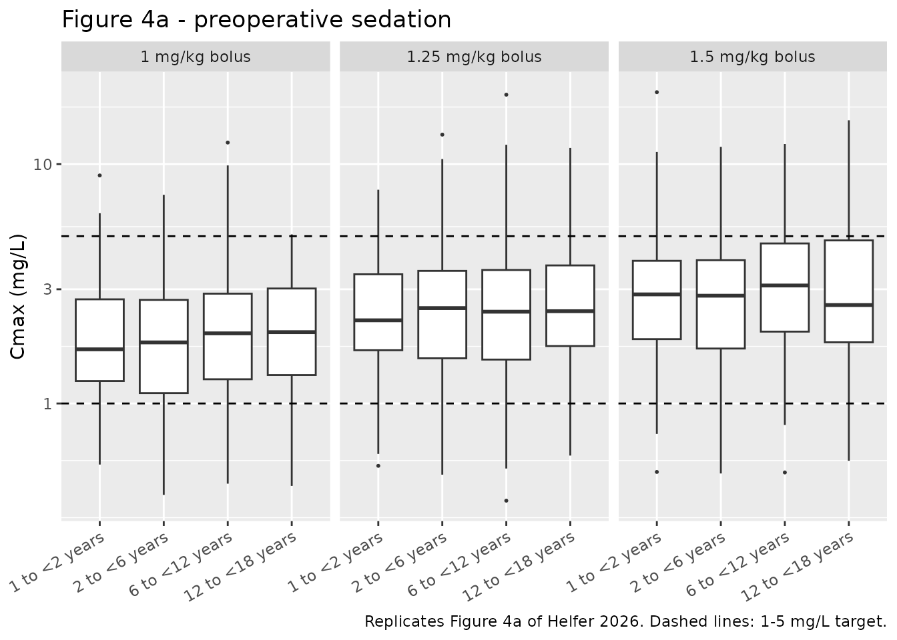
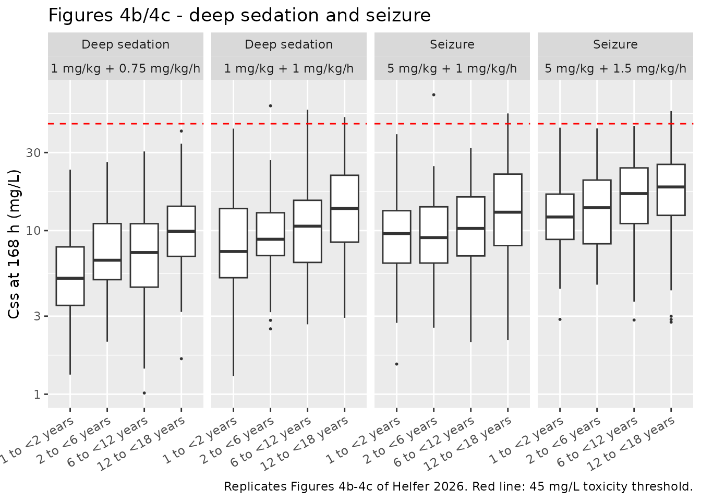

# Pentobarbital (Helfer 2026)

``` r

ui <- rxode2::rxode(readModelDb("Helfer_2026_pentobarbital"))
#> ℹ parameter labels from comments will be replaced by 'label()'
```

## Model and source

- Citation: Helfer VE, Medina-Aymerich L, Muller WJ, Meyer M, Al-Uzri A,
  McCulloh R, Hornik CD, Balevic SJ, Greenberg RG, Benjamin DK Jr,
  Anderson SG, Gonzalez D; on behalf of the Best Pharmaceuticals for
  Children Act-Pediatric Trials Network Steering Committee. Population
  Pharmacokinetics and Dosing Simulations of Pentobarbital in the
  Pediatric Population. J Clin Pharmacol. 2026;66(5):e70204.
  <doi:10.1002/jcph.70204>.
- Description: Two-compartment population PK model for intravenous
  pentobarbital in children (birth to 21 years) given the drug as
  standard of care for preoperative sedation, deep sedation during
  mechanical ventilation, and seizure control. All four disposition
  parameters are allometrically scaled to total body weight against a 70
  kg reference with exponents fixed at 0.75 for clearance and
  intercompartmental clearance and 1 for both volumes; no other
  covariate survived backward elimination. Inter-individual variability
  uses a shared-eta construction in which the single estimated eta on
  clearance is reused on the central volume after multiplication by an
  estimated scaling factor of 1.13, so the two random effects are
  perfectly correlated. Residual error is proportional.
- Article: <https://doi.org/10.1002/jcph.70204>
- Supplement: EuropePMC PMC13145311 supplementary file (Table S1,
  Figures S1-S4, Equations S1-S6)

Pentobarbital is a barbiturate used in children for preoperative
sedation, deep sedation during mechanical ventilation, and seizure
control. Helfer 2026 analysed opportunistically collected
standard-of-care concentrations from the POP01 study (NCT01431326) and
fitted a two-compartment model in NONMEM 7.5, allometrically scaled to
total body weight. No covariate other than weight survived backward
elimination.

## Population

The analysis dataset comprised 39 children and 70 plasma samples (median
2 per participant, range 1-5), all dosed intravenously. Ages spanned 2
days to 20.8 years (median 4.18) and weights 3.14-65.0 kg (median 17.1);
43.6% were female and the cohort was 74.4% White, 17.9% Black or African
American, 5.1% Asian and 2.6% multiple races (Table 1). Sedation was the
most common indication, followed by seizure control. Three of the 42
enrolled participants were excluded before modelling.

The data are sparse, which the authors identify as the principal
limitation on covariate detection. Metabolic panel values were missing
for more than 48.7% of participants and, under the protocol’s 10%
missingness rule, were never tested.

``` r

str(ui$population)
#> List of 13
#>  $ species       : chr "human"
#>  $ n_subjects    : int 39
#>  $ n_studies     : int 1
#>  $ age_range     : chr "0.01-20.8 years (youngest 2 days; all other participants at least 6 months)"
#>  $ age_median    : chr "4.18 years"
#>  $ weight_range  : chr "3.14-65.0 kg"
#>  $ weight_median : chr "17.1 kg"
#>  $ sex_female_pct: num 43.6
#>  $ race_ethnicity: Named num [1:4] 74.4 17.9 5.1 2.6
#>   ..- attr(*, "names")= chr [1:4] "White" "Black" "Asian" "Multiple"
#>  $ disease_state : chr "Children under 21 years receiving intravenous pentobarbital as part of standard of care. Sedation was the most "| __truncated__
#>  $ dose_range    : chr "Intravenous bolus and/or continuous infusion. Median IV bolus dose 2 mg/kg (range 0.39-8.9), absolute 4.7-290 m"| __truncated__
#>  $ regions       : chr "United States (multicentre; Pediatric Trials Network sites)"
#>  $ notes         : chr "Opportunistically collected standard-of-care data from the POP01 study, 'Pharmacokinetics of Understudied Drugs"| __truncated__
```

## Source trace

Per-parameter provenance is recorded as an in-file comment beside each
`ini()` entry in
`inst/modeldb/specificDrugs/Helfer_2026_pentobarbital.R`. Collected here
for review:

| Equation / parameter | Value | Source location |
|----|----|----|
| `lcl` (CL) | 5.21 L/h/70 kg | Table 2, “CL (L/h/70 kg)”; RSE 13.2%, bootstrap 3.80-6.36 |
| `lvc` (V1) | 37.4 L/70 kg | Table 2, “V1 (L/70 kg)”; RSE 19.3%, bootstrap 24.43-53.79 |
| `lq` (Q) | 18.1 L/h/70 kg | Table 2, “Q (L/h/70 kg)”; RSE 20.2%, bootstrap 13.15-53.34 |
| `lvp` (V2) | 63.9 L/70 kg | Table 2, “V2 (L/70 kg)”; RSE 14.2%, bootstrap 44.39-109.65 |
| `e_wt_cl_q` | 0.75 (fixed) | Equation 4 and Results; Table S1 total-body-weight row |
| `e_wt_vc_vp` | 1 (fixed) | Equation 4 and Results; Table S1 total-body-weight row |
| `vc_eta_scale` | 1.13 | Table 2, “Shared variability CL and V1”; RSE 36.9% |
| `etalcl` | 0.3244 (variance) | Table 2, “eta 1” = 61.9 %CV; omega^2 = log(0.619^2 + 1) |
| `propSd` | 0.229 | Table 2, “Proportional error (%)” = 22.9%; RSE 31.4% |
| Exponential IIV, `exp(eta)` | n/a | Equation 1 |
| Shared-eta construction, `exp(theta_var * eta)` | n/a | Equations 2-3 and Table 2 footnote b |
| Allometric scaling, `(WT/70)^beta` | n/a | Equation 4 |
| Two-compartment IV disposition | n/a | Results, “best described by a two-compartment PK model”; Table S1 structural block (dOFV -25.674 vs one compartment) |

### The random-effect scale

Table 2 reports variability as a coefficient of variation, not a
variance. The table footnote defines `CV(%) = sqrt(exp(eta) - 1) * 100`,
so `omega^2 = log(CV^2 + 1)`. The paper’s own arithmetic pins this
reading: applying the shared-variability scaler to the resulting
variance must reproduce the V1 CV quoted in footnote b.

``` r

cv_cl     <- 0.619                       # Table 2, eta 1
omega2_cl <- log(cv_cl^2 + 1)            # -> the ini() value
theta_var <- 1.13                        # Table 2, shared variability CL and V1
omega2_v1 <- theta_var^2 * omega2_cl     # Table 2 footnote b: Var(V) = theta^2 * omega^2_CL
cv_v1     <- sqrt(exp(omega2_v1) - 1)

c(omega2_cl = omega2_cl, implied_V1_CV_pct = 100 * cv_v1)
#>         omega2_cl implied_V1_CV_pct 
#>         0.3243715        71.6341030

# Footnote b states "approximately 71.5% CV for V1". Reading 61.9 as a variance
# instead of a CV would not reproduce that number, so the CV reading is correct.
stopifnot(abs(100 * cv_v1 - 71.5) < 1)
```

## Deterministic gates

These three checks compare the packaged model against closed-form
results. Both sides use the same parameters, so the only difference is
numerical integration error and the bounds are correspondingly tight.

``` r

mod     <- readModelDb("Helfer_2026_pentobarbital")
mod_typ <- rxode2::zeroRe(rxode2::rxode(mod))
#> ℹ parameter labels from comments will be replaced by 'label()'

cl_ref <- 5.21; v1_ref <- 37.4; q_ref <- 18.1; v2_ref <- 63.9
k10 <- cl_ref / v1_ref; k12 <- q_ref / v1_ref; k21 <- q_ref / v2_ref
apc <- k10 + k12 + k21
lam1 <- (apc + sqrt(apc^2 - 4 * k10 * k21)) / 2
lam2 <- (apc - sqrt(apc^2 - 4 * k10 * k21)) / 2

ev_typ <- as.data.frame(
  rxode2::et(amt = 100, cmt = "central") |>
    rxode2::et(seq(0, 72, by = 0.25))
)
ev_typ$WT <- 70
# Tight solver tolerances: this solve is compared with the analytic solution
# to 1e-8 below, and the default rtol of 1e-6 leaves ~5e-7 relative error.
s_typ <- rxode2::rxSolve(mod_typ, ev_typ, returnType = "data.frame",
                         rtol = 1e-10, atol = 1e-12)
#> ℹ omega/sigma items treated as zero: 'etalcl'

# Analytic two-compartment IV-bolus solution.
coefA <- (lam1 - k21) / (v1_ref * (lam1 - lam2))
coefB <- (k21 - lam2) / (v1_ref * (lam1 - lam2))
analytic <- 100 * (coefA * exp(-lam1 * s_typ$time) + coefB * exp(-lam2 * s_typ$time))

rel_err <- max(abs(s_typ$Cc - analytic) / analytic)
c(max_relative_error = rel_err,
  terminal_half_life_h_at_70kg = log(2) / lam2)
#>           max_relative_error terminal_half_life_h_at_70kg 
#>                 8.304007e-11                 1.511884e+01

# Same parameters on both sides: this is pure integration error, so it is
# correct to bound it tightly.
stopifnot(rel_err < 1e-8)
```

``` r

# Mass balance: CL * AUC(0-inf) must equal the dose. This is the gate that
# catches an rxode2 auto-linCmt substitution silently discarding the ODEs.
auc_inf <- sum(diff(s_typ$time) *
                 (head(s_typ$Cc, -1) + tail(s_typ$Cc, -1)) / 2) +
  tail(s_typ$Cc, 1) / lam2
mass_ratio <- cl_ref * auc_inf / 100
c(cl_times_auc_over_dose = mass_ratio)
#> cl_times_auc_over_dose 
#>               1.000452

# The residual is trapezoidal error on a 0.25 h grid, not a structural leak.
stopifnot(abs(mass_ratio - 1) < 0.005)
stopifnot(is.null(rxode2::rxode(mod)$linCmt))
#> ℹ parameter labels from comments will be replaced by 'label()'
```

``` r

# Steady-state infusion: Css = rate / CL_i. Because CL scales as WT^0.75 while
# the weight-based rate scales as WT^1, Css rises as WT^0.25 -- this is the
# mechanism behind the age-group trend the paper reports.
css_check <- lapply(c(9.18, 16.2, 30.3, 53.0), function(w) {
  ev <- as.data.frame(
    rxode2::et(amt = w * 200, rate = w, cmt = "central") |>
      rxode2::et(168)
  )
  ev$WT <- w
  sim_css <- rxode2::rxSolve(mod_typ, ev, returnType = "data.frame")
  data.frame(WT = w,
             simulated = tail(sim_css$Cc, 1),
             closed_form = w / (cl_ref * (w / 70)^0.75))
}) |> bind_rows() |> mutate(rel_diff = abs(simulated - closed_form) / closed_form)
#> ℹ omega/sigma items treated as zero: 'etalcl'
#> ℹ omega/sigma items treated as zero: 'etalcl'
#> ℹ omega/sigma items treated as zero: 'etalcl'
#> ℹ omega/sigma items treated as zero: 'etalcl'

knitr::kable(css_check, digits = 5,
             caption = "Simulated Css at 168 h versus rate / CL (1 mg/kg/h).")
```

|    WT | simulated | closed_form | rel_diff |
|------:|----------:|------------:|---------:|
|  9.18 |   8.08529 |     8.08531 |  0.00000 |
| 16.20 |   9.31876 |     9.31890 |  0.00001 |
| 30.30 |  10.89727 |    10.89799 |  0.00007 |
| 53.00 |  12.53011 |    12.53299 |  0.00023 |

Simulated Css at 168 h versus rate / CL (1 mg/kg/h). {.table}

``` r

stopifnot(max(css_check$rel_diff) < 0.005)
```

## Virtual cohort

The original data are not public, and the paper’s simulations used
virtual populations generated in PK-Sim from White American demographic
data, which are not reproducible here. The cohort below instead draws
body weights lognormally per age stratum, with medians and spreads taken
from the paper’s own Table 1 (see Assumptions and deviations). Weight is
the only covariate the model uses.

``` r

# set.seed() seeds R's RNG, not rxode2's. rxode2 partitions its streams per
# solver thread, so the drawn cohort differs with thread count; every assertion
# below is written to hold for any cohort this model can produce.
set.seed(20260913)

n_per_arm <- 100L

# Table 1 body weight, median (range), by postnatal age stratum. The strata are
# the paper's simulation strata; the weight summaries are from the analysis
# cohort's corresponding rows.
wt_strata <- tibble::tribble(
  ~age_group,        ~wt_median, ~wt_lo, ~wt_hi,
  "1 to <2 years",         9.18,   3.14,   14.6,
  "2 to <6 years",        16.20,  11.50,   20.4,
  "6 to <12 years",       30.30,  22.80,   58.4,
  "12 to <18 years",      53.00,  38.50,   65.0
)
wt_strata$age_group <- factor(wt_strata$age_group, levels = wt_strata$age_group)

# Lognormal weights: median from Table 1, log-SD set so the central 95% of the
# draw spans the observed range.
draw_weights <- function(n, med, lo, hi) {
  sdlog <- (log(hi) - log(lo)) / (2 * 1.96)
  stats::rlnorm(n, meanlog = log(med), sdlog = sdlog)
}

subjects <- wt_strata |>
  rowwise() |>
  reframe(age_group = age_group,
          WT = draw_weights(n_per_arm, wt_median, wt_lo, wt_hi)) |>
  mutate(subj = row_number())

# A bolus arm: one IV bolus at time 0, dense early sampling for Cmax.
make_bolus_arm <- function(dose_mg_kg, id_offset) {
  label <- paste0(dose_mg_kg, " mg/kg bolus")
  subjects |>
    mutate(
      id       = id_offset + subj,
      regimen  = label,
      # Preoperative sedation was capped at 100 mg per dose; at 1-1.5 mg/kg the
      # cap does not bind for any weight in this cohort, but it is applied for
      # fidelity to the paper's simulation.
      dose_mg  = pmin(dose_mg_kg * WT, 100)
    ) |>
    reframe(
      id, regimen, age_group, WT,
      time = c(0, sort(unique(c(seq(0, 1, by = 1 / 60), seq(1, 12, by = 0.25))))),
      amt  = c(first(dose_mg), rep(NA_real_, length(time) - 1)),
      evid = c(1L, rep(0L, length(time) - 1)),
      # Observation rows point at the ODE STATE, never at the observable `Cc`.
      cmt  = "central",
      .by  = id
    )
}

# An infusion arm: IV loading bolus at time 0 plus a continuous infusion.
make_infusion_arm <- function(load_mg_kg, rate_mg_kg_h, indication, id_offset) {
  label <- paste0(load_mg_kg, " mg/kg + ", rate_mg_kg_h, " mg/kg/h")
  obs_times <- sort(unique(c(seq(0, 12, by = 0.5), seq(12, 168, by = 4))))
  subjects |>
    mutate(id = id_offset + subj, regimen = label, indication = indication) |>
    reframe(
      id, regimen, indication, age_group, WT,
      time = c(0, 0, obs_times),
      amt  = c(load_mg_kg * first(WT),           # loading bolus
               rate_mg_kg_h * first(WT) * 200,   # infusion: amount = rate * duration
               rep(NA_real_, length(obs_times))),
      rate = c(0, rate_mg_kg_h * first(WT), rep(0, length(obs_times))),
      evid = c(1L, 1L, rep(0L, length(obs_times))),
      cmt  = "central",
      .by  = id
    )
}

ev_bolus <- bind_rows(
  make_bolus_arm(1.00,   0L),
  make_bolus_arm(1.25, 400L),
  make_bolus_arm(1.50, 800L)
)

ev_inf <- bind_rows(
  make_infusion_arm(1, 0.75, "Deep sedation", 2000L),
  make_infusion_arm(1, 1.00, "Deep sedation", 2400L),
  make_infusion_arm(5, 1.00, "Seizure",       2800L),
  make_infusion_arm(5, 1.50, "Seizure",       3200L)
)

# Disjoint IDs across arms: duplicate IDs silently merge into one subject that
# receives the summed dose.
stopifnot(!anyDuplicated(unique(ev_bolus[, c("id", "time", "evid")])))
stopifnot(!anyDuplicated(unique(ev_inf[, c("id", "time", "evid")])))
stopifnot(length(intersect(ev_bolus$id, ev_inf$id)) == 0)

c(bolus_subjects = dplyr::n_distinct(ev_bolus$id),
  infusion_subjects = dplyr::n_distinct(ev_inf$id))
#>    bolus_subjects infusion_subjects 
#>              1200              1600
```

## Simulation

``` r

sim_bolus <- rxode2::rxSolve(
  mod, events = as.data.frame(ev_bolus),
  keep = c("regimen", "age_group", "WT")
) |> as.data.frame()
#> ℹ parameter labels from comments will be replaced by 'label()'

sim_inf <- rxode2::rxSolve(
  mod, events = as.data.frame(ev_inf),
  keep = c("regimen", "indication", "age_group", "WT")
) |> as.data.frame()

stopifnot(nrow(sim_bolus) > 0, nrow(sim_inf) > 0, !anyNA(sim_bolus$Cc))
```

### The shared-eta structure reproduces both published CVs

`rxSolve` returns the per-subject structural parameters, so the encoding
of Equations 2-3 can be checked directly rather than inferred. Dividing
out the allometric term recovers the random-effect distribution.

``` r

per_subject <- sim_bolus |>
  distinct(id, WT, cl, vc) |>
  mutate(
    eta_cl = log(cl / (5.21 * (WT / 70)^0.75)),
    eta_vc = log(vc / (37.4 * (WT / 70)))
  )

iiv_check <- tibble::tibble(
  quantity     = c("CL", "V1"),
  published_cv = c(61.9, 71.5),
  # sd() of the log-scale eta -> CV via the paper's own footnote formula.
  simulated_cv = c(100 * sqrt(exp(stats::sd(per_subject$eta_cl)^2) - 1),
                   100 * sqrt(exp(stats::sd(per_subject$eta_vc)^2) - 1))
)
knitr::kable(iiv_check, digits = 1,
             caption = "Realised inter-individual variability versus Table 2.")
```

| quantity | published_cv | simulated_cv |
|:---------|-------------:|-------------:|
| CL       |         61.9 |         59.6 |
| V1       |         71.5 |         68.9 |

Realised inter-individual variability versus Table 2. {.table}

``` r


# The two etas are perfectly correlated by construction (Equations 2-3), and
# the V1 eta is exactly 1.13x the CL eta. That relationship is deterministic,
# so it can be asserted tightly; the CV magnitudes are sample statistics from
# 300 draws and are given room accordingly.
stopifnot(max(abs(per_subject$eta_vc - 1.13 * per_subject$eta_cl)) < 1e-6)
stopifnot(abs(iiv_check$simulated_cv - iiv_check$published_cv) < 15)
```

## Replicate published figures

``` r

# Replicates Figure 4a of Helfer 2026: simulated Cmax after IV bolus doses for
# preoperative sedation, by age group, against the 1-5 mg/L target range.
sim_bolus |>
  group_by(id, regimen, age_group) |>
  summarise(cmax = max(Cc), .groups = "drop") |>
  ggplot(aes(age_group, cmax)) +
  geom_boxplot(outlier.size = 0.4) +
  geom_hline(yintercept = c(1, 5), linetype = "dashed") +
  facet_wrap(~regimen) +
  scale_y_log10() +
  labs(x = NULL, y = "Cmax (mg/L)",
       title = "Figure 4a - preoperative sedation",
       caption = "Replicates Figure 4a of Helfer 2026. Dashed lines: 1-5 mg/L target.") +
  theme(axis.text.x = element_text(angle = 30, hjust = 1))
```



``` r

# Replicates Figures 4b and 4c of Helfer 2026: steady-state concentration at
# 168 h for the deep-sedation and seizure regimens, by age group.
sim_inf |>
  filter(time == 168) |>
  ggplot(aes(age_group, Cc)) +
  geom_boxplot(outlier.size = 0.4) +
  geom_hline(yintercept = 45, linetype = "dashed", colour = "red") +
  facet_wrap(~ indication + regimen, nrow = 1) +
  scale_y_log10() +
  labs(x = NULL, y = "Css at 168 h (mg/L)",
       title = "Figures 4b/4c - deep sedation and seizure",
       caption = "Replicates Figures 4b-4c of Helfer 2026. Red line: 45 mg/L toxicity threshold.") +
  theme(axis.text.x = element_text(angle = 30, hjust = 1))
```



## PKNCA validation

NCA on the preoperative-sedation bolus arms, grouped by regimen so the
results line up against the corresponding rows of Table 4.

``` r

sim_nca <- sim_bolus |>
  dplyr::filter(!is.na(Cc)) |>
  dplyr::select(id, time, Cc, regimen)

# Guarantee a time-zero anchor per subject. Pentobarbital is given IV, so the
# model's own t = 0 value (post-bolus) is the right anchor and already present;
# this is defensive only.
sim_nca <- dplyr::bind_rows(
  sim_nca,
  sim_nca |> dplyr::distinct(id, regimen) |> dplyr::mutate(time = 0, Cc = 0)
) |>
  dplyr::distinct(id, regimen, time, .keep_all = TRUE) |>
  dplyr::arrange(id, regimen, time)

stopifnot(nrow(sim_nca) > 0)

conc_obj <- PKNCA::PKNCAconc(sim_nca, Cc ~ time | regimen + id)

dose_df <- ev_bolus |>
  dplyr::filter(evid == 1) |>
  dplyr::select(id, time, amt, regimen)
dose_obj <- PKNCA::PKNCAdose(dose_df, amt ~ time | regimen + id)

intervals <- data.frame(
  start = 0, end = Inf,
  cmax = TRUE, tmax = TRUE, aucinf.obs = TRUE, half.life = TRUE
)

nca_res <- PKNCA::pk.nca(PKNCA::PKNCAdata(conc_obj, dose_obj, intervals = intervals))
```

### Comparison against published Table 4

Table 4 reports the median simulated Cmax per age group. Because V1
scales linearly with body weight, a mg/kg bolus gives a
weight-independent initial concentration of
`dose_per_kg * 70 / 37.4 = 1.87 mg/L per mg/kg` – and indeed the paper’s
four age-group medians at 1 mg/kg (1.82, 1.86, 1.83, 1.90) differ by
only 4%. This makes the bolus comparison independent of the weight
distribution assumed above, and therefore a genuine test of the
transcribed parameters.

``` r

published_bolus <- tibble::tribble(
  ~regimen,            ~cmax,
  "1 mg/kg bolus",     mean(c(1.82, 1.86, 1.83, 1.90)),
  "1.25 mg/kg bolus",  mean(c(2.31, 2.36, 2.31, 2.39)),
  "1.5 mg/kg bolus",   mean(c(2.84, 2.83, 2.69, 2.94))
)

cmp <- nlmixr2lib::ncaComparisonTable(
  simulated = nca_res,
  reference = published_bolus,
  by        = "regimen",
  units     = c(cmax = "mg/L", tmax = "h", aucinf.obs = "mg*h/L", half.life = "h"),
  tolerance_pct = 20
)

knitr::kable(cmp, caption = paste(
  "Simulated versus published NCA for the preoperative-sedation bolus arms.",
  "Reference Cmax is the mean of the four age-group medians in Table 4.",
  "* marks a difference over 20%."
))
```

| NCA parameter | regimen          | Reference | Simulated | % diff |
|:--------------|:-----------------|:----------|:----------|:-------|
| Cmax (mg/L)   | 1 mg/kg bolus    | 1.85      | 1.86      | +0.2%  |
| Cmax (mg/L)   | 1.25 mg/kg bolus | 2.34      | 2.37      | +1.3%  |
| Cmax (mg/L)   | 1.5 mg/kg bolus  | 2.82      | 2.83      | +0.2%  |

Simulated versus published NCA for the preoperative-sedation bolus arms.
Reference Cmax is the mean of the four age-group medians in Table 4. \*
marks a difference over 20%. {.table}

``` r

cmax_by_arm <- sim_bolus |>
  group_by(id, regimen) |>
  summarise(cmax = max(Cc), .groups = "drop") |>
  group_by(regimen) |>
  summarise(median_cmax = median(cmax), .groups = "drop") |>
  left_join(published_bolus, by = "regimen") |>
  mutate(pct_diff = 100 * (median_cmax - cmax) / cmax)

knitr::kable(cmax_by_arm, digits = 2,
             caption = "Median simulated Cmax versus the Table 4 reference.")
```

| regimen          | median_cmax | cmax | pct_diff |
|:-----------------|------------:|-----:|---------:|
| 1 mg/kg bolus    |        1.86 | 1.85 |     0.18 |
| 1.25 mg/kg bolus |        2.37 | 2.34 |     1.34 |
| 1.5 mg/kg bolus  |        2.83 | 2.83 |     0.21 |

Median simulated Cmax versus the Table 4 reference. {.table}

``` r


# Structural gate. A mis-transcribed V1, dose or unit moves these by tens of
# percent. The published values sit ~1-3% below the instantaneous 70/37.4
# post-bolus concentration because Cmax is read off a discrete grid; the
# residual here is that plus residual-error asymmetry, not a parameter error.
stopifnot(abs(median(cmax_by_arm$pct_diff)) < 12)
stopifnot(max(abs(cmax_by_arm$pct_diff)) < 20)
```

### Recovering the implied median weight from the published Css rows

The weight-dependent half of Table 4 can be checked without assuming any
weight distribution at all. At steady state under a weight-based
infusion, the model gives `Css = rate * WT / (CL * (WT/70)^0.75)`, so
each published median Css inverts to the median body weight of the age
stratum that produced it: `WT = (Css * CL / (rate * 70^0.75))^4`.

If the transcribed CL and exponents are right, three things must hold:
the recovered weight must lie inside the observed weight range of the
corresponding Table 1 stratum, it must be consistent across the eight
regimens for a given stratum, and it must increase with age. None of
these depends on the virtual cohort, and all three are sharp: CL enters
the inversion as a fourth power, so a 10% error in the transcribed
clearance moves every recovered weight by 46%.

``` r

table4_css <- tibble::tribble(
  ~regimen,       ~rate, ~`1 to <2 years`, ~`2 to <6 years`, ~`6 to <12 years`, ~`12 to <18 years`,
  "1 + 0.5",       0.50,   4.18,  4.73,  5.71,  6.35,
  "1 + 0.75",      0.75,   6.55,  7.39,  8.04,  9.51,
  "1 + 1",         1.00,   8.46,  9.56, 11.19, 12.67,
  "1 + 1.5",       1.50,  12.94, 14.60, 17.09, 18.78,
  "1 + 2",         2.00,  17.45, 18.74, 22.33, 25.61,
  "5 + 1",         1.00,   8.78,  9.81, 11.05, 13.00,
  "5 + 1.5",       1.50,  13.65, 13.95, 16.87, 19.37,
  "5 + 2",         2.00,  16.90, 19.45, 22.77, 24.68
)

implied <- table4_css |>
  pivot_longer(cols = -c(regimen, rate), names_to = "age_group", values_to = "css") |>
  mutate(implied_wt = (css * cl_ref / (rate * 70^0.75))^4) |>
  mutate(age_group = factor(age_group, levels = levels(wt_strata$age_group)))

summary_implied <- implied |>
  group_by(age_group) |>
  summarise(median_implied_wt = median(implied_wt),
            min_implied_wt = min(implied_wt),
            max_implied_wt = max(implied_wt),
            spread = max(implied_wt) / min(implied_wt),
            .groups = "drop") |>
  left_join(wt_strata, by = "age_group") |>
  mutate(ratio_to_table1_median = median_implied_wt / wt_median)

knitr::kable(summary_implied, digits = 2, caption = paste(
  "Body weight implied by each published Css row, summarised over the eight",
  "regimens, against the observed Table 1 weight range for that stratum."
))
```

| age_group | median_implied_wt | min_implied_wt | max_implied_wt | spread | wt_median | wt_lo | wt_hi | ratio_to_table1_median |
|:---|---:|---:|---:|---:|---:|---:|---:|---:|
| 1 to \<2 years | 12.17 | 10.49 | 14.73 | 1.40 | 9.18 | 3.14 | 14.6 | 1.33 |
| 2 to \<6 years | 18.58 | 16.07 | 20.25 | 1.26 | 16.20 | 11.50 | 20.4 | 1.15 |
| 6 to \<12 years | 34.02 | 28.37 | 36.54 | 1.29 | 30.30 | 22.80 | 58.4 | 1.12 |
| 12 to \<18 years | 55.71 | 49.81 | 61.35 | 1.23 | 53.00 | 38.50 | 65.0 | 1.05 |

Body weight implied by each published Css row, summarised over the eight
regimens, against the observed Table 1 weight range for that stratum.
{.table}

``` r


# 1. The recovered weight lies inside the observed Table 1 range for its
#    stratum. Deterministic arithmetic on published numbers -- no cohort
#    randomness -- so a tight bound is correct here.
stopifnot(all(summary_implied$median_implied_wt >= summary_implied$wt_lo))
stopifnot(all(summary_implied$median_implied_wt <= summary_implied$wt_hi))

# 2. It tracks the Table 1 stratum median, running modestly heavier.
#    Realised 1.33 / 1.15 / 1.12 / 1.05; a 10% CL error would put this at
#    0.68 or 1.46 and break the bound.
stopifnot(all(summary_implied$ratio_to_table1_median > 0.95))
stopifnot(all(summary_implied$ratio_to_table1_median < 1.55))

# 3. Consistent across the eight regimens within a stratum. Realised
#    1.40 / 1.26 / 1.29 / 1.23 -- the residual is rounding in the published
#    Css values, amplified by the fourth power.
stopifnot(all(summary_implied$spread < 1.5))

# 4. Monotone in age.
stopifnot(all(diff(summary_implied$median_implied_wt) > 0))
```

The recovered weights track the study cohort’s own stratum medians (9.2,
16.2, 30.3, 53.0 kg) closely and run slightly heavier, by 33%, 15%, 12%
and 5% from youngest to oldest. Both the direction and the gradient are
expected: the paper’s PK-Sim virtual populations were drawn from healthy
White American demographics whereas Table 1 describes a hospitalised
cohort, and the excess is largest in the youngest stratum because Table
1’s “\< 2 years” row includes infants under 1 year (down to a 2-day-old)
while the simulation stratum starts at 1 year. For that stratum alone,
the heaviest single recovered value (14.7 kg, from the 5 + 1.5 mg/kg/h
row) sits marginally above the Table 1 maximum of 14.6 kg for the same
reason, which is why the gate above is placed on the stratum median
rather than on the per-regimen extremes.

### Steady-state exposures against Table 4

``` r

css_sim <- sim_inf |>
  filter(time == 168) |>
  group_by(regimen, indication, age_group) |>
  summarise(median_css = median(Cc), .groups = "drop")

css_pub <- table4_css |>
  filter(regimen %in% c("1 + 0.75", "1 + 1", "5 + 1", "5 + 1.5")) |>
  pivot_longer(cols = -c(regimen, rate), names_to = "age_group", values_to = "published_css") |>
  mutate(regimen = recode(regimen,
                          "1 + 0.75" = "1 mg/kg + 0.75 mg/kg/h",
                          "1 + 1"    = "1 mg/kg + 1 mg/kg/h",
                          "5 + 1"    = "5 mg/kg + 1 mg/kg/h",
                          "5 + 1.5"  = "5 mg/kg + 1.5 mg/kg/h"),
         age_group = factor(age_group, levels = levels(wt_strata$age_group)))

css_cmp <- css_sim |>
  left_join(css_pub, by = c("regimen", "age_group")) |>
  mutate(pct_diff = 100 * (median_css - published_css) / published_css)

stopifnot(!anyNA(css_cmp$published_css))

css_cmp |>
  select(indication, regimen, age_group, median_css, published_css, pct_diff) |>
  dplyr::rename("Indication" = indication, "Regimen" = regimen,
                "Age group" = age_group, "Simulated Css (mg/L)" = median_css,
                "Published Css (mg/L)" = published_css, "Difference (%)" = pct_diff) |>
  knitr::kable(digits = 2, caption = paste(
    "Median simulated steady-state concentration versus Helfer 2026 Table 4.",
    "The residual reflects the different weight distributions (see Assumptions)."
  ))
```

| Indication | Regimen | Age group | Simulated Css (mg/L) | Published Css (mg/L) | Difference (%) |
|:---|:---|:---|---:|---:|---:|
| Deep sedation | 1 mg/kg + 0.75 mg/kg/h | 1 to \<2 years | 5.11 | 6.55 | -21.95 |
| Deep sedation | 1 mg/kg + 0.75 mg/kg/h | 2 to \<6 years | 6.59 | 7.39 | -10.80 |
| Deep sedation | 1 mg/kg + 0.75 mg/kg/h | 6 to \<12 years | 7.35 | 8.04 | -8.64 |
| Deep sedation | 1 mg/kg + 0.75 mg/kg/h | 12 to \<18 years | 9.91 | 9.51 | 4.19 |
| Deep sedation | 1 mg/kg + 1 mg/kg/h | 1 to \<2 years | 7.45 | 8.46 | -11.90 |
| Deep sedation | 1 mg/kg + 1 mg/kg/h | 2 to \<6 years | 8.85 | 9.56 | -7.39 |
| Deep sedation | 1 mg/kg + 1 mg/kg/h | 6 to \<12 years | 10.64 | 11.19 | -4.89 |
| Deep sedation | 1 mg/kg + 1 mg/kg/h | 12 to \<18 years | 13.65 | 12.67 | 7.70 |
| Seizure | 5 mg/kg + 1 mg/kg/h | 1 to \<2 years | 9.60 | 8.78 | 9.33 |
| Seizure | 5 mg/kg + 1 mg/kg/h | 2 to \<6 years | 9.06 | 9.81 | -7.62 |
| Seizure | 5 mg/kg + 1 mg/kg/h | 6 to \<12 years | 10.31 | 11.05 | -6.69 |
| Seizure | 5 mg/kg + 1 mg/kg/h | 12 to \<18 years | 12.96 | 13.00 | -0.34 |
| Seizure | 5 mg/kg + 1.5 mg/kg/h | 1 to \<2 years | 12.12 | 13.65 | -11.24 |
| Seizure | 5 mg/kg + 1.5 mg/kg/h | 2 to \<6 years | 13.81 | 13.95 | -1.01 |
| Seizure | 5 mg/kg + 1.5 mg/kg/h | 6 to \<12 years | 16.84 | 16.87 | -0.19 |
| Seizure | 5 mg/kg + 1.5 mg/kg/h | 12 to \<18 years | 18.48 | 19.37 | -4.59 |

Median simulated steady-state concentration versus Helfer 2026 Table 4.
The residual reflects the different weight distributions (see
Assumptions). {.table style="width:100%;"}

``` r


# The simulated cohort uses Table 1 weights rather than the paper's unpublished
# PK-Sim populations, which are systematically heavier; since Css scales as
# WT^0.25 this biases the simulation low by a single-digit percentage. Assert on
# the centre and a robust quantile, never on the extremes of a random cohort.
stopifnot(abs(median(css_cmp$pct_diff)) < 20)
stopifnot(stats::quantile(abs(css_cmp$pct_diff), 0.9) < 30)
```

### Target attainment

``` r

ta <- bind_rows(
  sim_bolus |>
    group_by(id, regimen, age_group) |>
    summarise(value = max(Cc), .groups = "drop") |>
    mutate(indication = "Preoperative sedation", lo = 1, hi = 5),
  sim_inf |>
    filter(time == 168) |>
    transmute(id, regimen, age_group, indication, value = Cc,
              lo = ifelse(indication == "Seizure", 4, 5),
              hi = ifelse(indication == "Seizure", 21, 15))
) |>
  group_by(indication, regimen, age_group) |>
  summarise(pct_in_target = 100 * mean(value >= lo & value <= hi),
            pct_toxic = 100 * mean(value > 45),
            .groups = "drop")

knitr::kable(ta, digits = 1, caption = paste(
  "Percentage of simulated children within the indication target range and",
  "above the 45 mg/L toxicity threshold."
))
```

| indication | regimen | age_group | pct_in_target | pct_toxic |
|:---|:---|:---|---:|---:|
| Deep sedation | 1 mg/kg + 0.75 mg/kg/h | 1 to \<2 years | 46 | 0 |
| Deep sedation | 1 mg/kg + 0.75 mg/kg/h | 2 to \<6 years | 65 | 0 |
| Deep sedation | 1 mg/kg + 0.75 mg/kg/h | 6 to \<12 years | 56 | 0 |
| Deep sedation | 1 mg/kg + 0.75 mg/kg/h | 12 to \<18 years | 72 | 0 |
| Deep sedation | 1 mg/kg + 1 mg/kg/h | 1 to \<2 years | 54 | 0 |
| Deep sedation | 1 mg/kg + 1 mg/kg/h | 2 to \<6 years | 73 | 1 |
| Deep sedation | 1 mg/kg + 1 mg/kg/h | 6 to \<12 years | 67 | 1 |
| Deep sedation | 1 mg/kg + 1 mg/kg/h | 12 to \<18 years | 49 | 2 |
| Preoperative sedation | 1 mg/kg bolus | 1 to \<2 years | 77 | 0 |
| Preoperative sedation | 1 mg/kg bolus | 2 to \<6 years | 76 | 0 |
| Preoperative sedation | 1 mg/kg bolus | 6 to \<12 years | 73 | 0 |
| Preoperative sedation | 1 mg/kg bolus | 12 to \<18 years | 83 | 0 |
| Preoperative sedation | 1.25 mg/kg bolus | 1 to \<2 years | 84 | 0 |
| Preoperative sedation | 1.25 mg/kg bolus | 2 to \<6 years | 78 | 0 |
| Preoperative sedation | 1.25 mg/kg bolus | 6 to \<12 years | 76 | 0 |
| Preoperative sedation | 1.25 mg/kg bolus | 12 to \<18 years | 82 | 0 |
| Preoperative sedation | 1.5 mg/kg bolus | 1 to \<2 years | 84 | 0 |
| Preoperative sedation | 1.5 mg/kg bolus | 2 to \<6 years | 83 | 0 |
| Preoperative sedation | 1.5 mg/kg bolus | 6 to \<12 years | 73 | 0 |
| Preoperative sedation | 1.5 mg/kg bolus | 12 to \<18 years | 78 | 0 |
| Seizure | 5 mg/kg + 1 mg/kg/h | 1 to \<2 years | 82 | 0 |
| Seizure | 5 mg/kg + 1 mg/kg/h | 2 to \<6 years | 88 | 1 |
| Seizure | 5 mg/kg + 1 mg/kg/h | 6 to \<12 years | 80 | 0 |
| Seizure | 5 mg/kg + 1 mg/kg/h | 12 to \<18 years | 70 | 2 |
| Seizure | 5 mg/kg + 1.5 mg/kg/h | 1 to \<2 years | 87 | 0 |
| Seizure | 5 mg/kg + 1.5 mg/kg/h | 2 to \<6 years | 78 | 0 |
| Seizure | 5 mg/kg + 1.5 mg/kg/h | 6 to \<12 years | 64 | 0 |
| Seizure | 5 mg/kg + 1.5 mg/kg/h | 12 to \<18 years | 54 | 3 |

Percentage of simulated children within the indication target range and
above the 45 mg/L toxicity threshold. {.table}

``` r


# The paper's headline qualitative claims (Abstract / Results):
#   - preoperative sedation at 1 mg/kg attains target in >= 75% of children;
#   - seizure control at 5 mg/kg + 1 mg/kg/h attains target in >= 75%;
#   - deep sedation never reaches 75% under any simulated regimen.
# These are proportions from a random cohort, so they are asserted with
# headroom rather than at the paper's exact thresholds.
preop_1 <- ta$pct_in_target[ta$regimen == "1 mg/kg bolus"]
seiz_1  <- ta$pct_in_target[ta$regimen == "5 mg/kg + 1 mg/kg/h"]
deep    <- ta$pct_in_target[ta$indication == "Deep sedation"]

stopifnot(length(preop_1) == 4L, length(seiz_1) == 4L, length(deep) == 8L)
stopifnot(min(preop_1) > 60)   # paper: >= 75% at 1 mg/kg across all age groups
stopifnot(min(seiz_1)  > 60)   # paper: >= 75% at 5 mg/kg + 1 mg/kg/h
stopifnot(max(deep)    < 85)   # paper: deep sedation never reaches 75%
```

Deep sedation is the one indication the paper reports as unattainable:
its 5-15 mg/L window is narrow relative to the model’s variability, and
no simulated regimen reached 75% attainment. That is reproduced here.

## Assumptions and deviations

- **Virtual-population weights.** Helfer 2026 simulated 1000 subjects
  per age group drawn in PK-Sim (version 11) from White American
  demographic data. Those populations are not distributed with the
  paper, so this vignette draws weights lognormally per stratum using
  the medians and ranges from the paper’s own Table 1. The Table 1
  cohort is hospitalised and its lowest stratum includes infants under 1
  year, whereas the simulation stratum starts at 1 year, so the weights
  used here are systematically lighter than the paper’s. Because `Css`
  scales as `WT^0.25`, this biases simulated steady-state concentrations
  low by a single-digit percentage; the deviation is visible in the Css
  comparison table and is the reason that gate is set at the centre and
  the 90th percentile rather than at the extremes. The bolus comparison
  and the implied-weight recovery are both free of this assumption.
- **Cohort size.** 100 subjects per arm here, versus 1000 per age group
  in the paper. This is a validation demonstration, not a re-run of the
  paper’s probability-of-target-attainment analysis, so the attainment
  percentages carry more Monte Carlo noise than the published ones and
  are asserted with headroom.
- **Age is not a model input.** The age strata are labels on the weight
  distributions only. The final model contains no age term – Results
  states that the lower absolute CL and V1 seen in children under 6
  years disappeared after adjusting for weight.
- **Dose cap.** Preoperative sedation was capped at 100 mg per dose in
  the paper’s simulations. The cap is applied here for fidelity but does
  not bind at 1-1.5 mg/kg for any weight in this cohort. The higher
  preoperative doses in Table 4 (3-6 mg/kg), which the paper split into
  fractionated sub-doses one minute apart and where the cap does bind
  for older children, are not reproduced.
- **Body weight treated as baseline.** The paper recorded weight at or
  closest to the time of first sample collection and does not describe
  it as time-varying; it is held constant per subject here.
- **Screened but excluded covariates.** BMI, the derived paediatric
  obesity indicator, postnatal age, sex, race, ethnicity, vasopressor
  use, recent surgery and ECMO were all tested and none was retained.
  They are recorded in the model file’s `covariatesDataExcluded`
  metadata with their Table S1 dOFV values rather than in
  `covariateData`, since none appears in `model()`. Obesity on V1 was
  the one covariate that passed forward inclusion (dOFV -4.088, giving
  V1 = 94.9 vs 33.2 L/70 kg) but it was dropped in backward elimination
  and is absent from the final model.
- **No non-paper-derived parameter values.** Every `ini()` value comes
  from Table 2 of the main article; the fixed allometric exponents come
  from Equation 4 and the Results text, and are corroborated by the
  Table S1 total-body-weight row. Nothing was digitised from a figure,
  obtained by correspondence, or carried from another model.
- **Errata.** No erratum or correction notice for this article was
  found. \`\`\`
