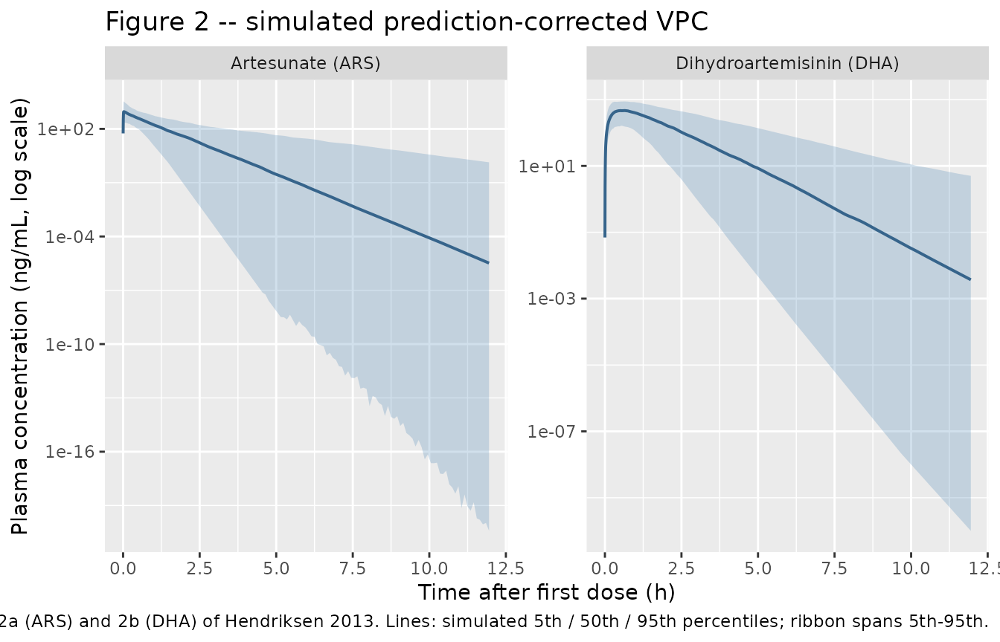
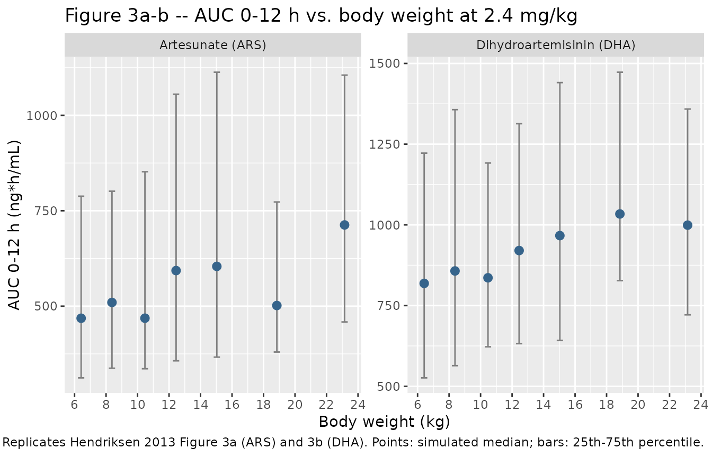
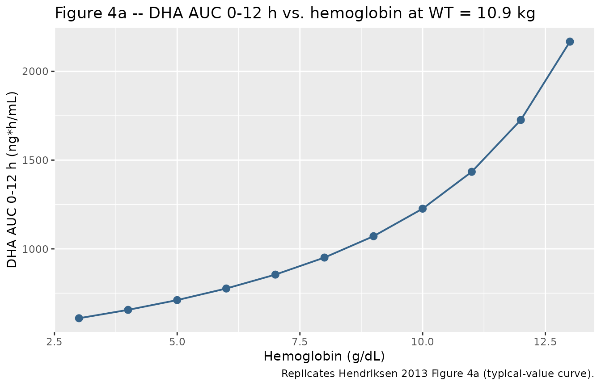

# Hendriksen_2013_artesunate

## Model and source

- Citation: Hendriksen IC, Mtove G, Kent A, Gesase S, Reyburn H, Lemnge
  MM, Lindegardh N, Day NP, von Seidlein L, White NJ, Dondorp AM,
  Tarning J. Population pharmacokinetics of intramuscular artesunate in
  African children with severe malaria: implications for a practical
  dosing regimen. *Clinical Pharmacology & Therapeutics* 2013;
  93(5):443-450.
  <doi:%5B10.1038/clpt.2013.26>\](<https://doi.org/10.1038/clpt.2013.26>).
- PubMed: <https://pubmed.ncbi.nlm.nih.gov/23511715/> (PMID 23511715).
- Full text (Open Access):
  <https://pmc.ncbi.nlm.nih.gov/articles/PMC3630454/>.

This is a joint parent-metabolite popPK model for intramuscular (IM)
artesunate (ARS) and its active metabolite dihydroartemisinin (DHA) in
African children with severe Plasmodium falciparum malaria. Each species
is a one-compartment apparent-volume disposition; ARS enters the central
compartment as a zero-order input of fixed 1-min duration (the IM
absorption phase, with the rate held fixed because the published study
could not collect enough samples during absorption to identify it) and
converts mole-for-mole to DHA with no separate parent elimination. Body
weight scales both species’ CL and Vc allometrically (fixed exponents
0.75 and 1, reference 10.9 kg); hemoglobin additionally modifies DHA
clearance (+10.2% per g/dL decrease below the 7.1 g/dL reference).

``` r

mod_fn  <- readModelDb("Hendriksen_2013_artesunate")
mod     <- rxode2::rxode2(mod_fn())
mod_typ <- rxode2::rxode2(rxode2::zeroRe(mod_fn()))
```

## Population

The model was developed from 70 Tanzanian children (median age 2.5
years, range 7 months to 11 years; 84% were under 5 years of age)
admitted to Teule Hospital, Muheza with severe Plasmodium falciparum
malaria meeting one or more WHO severity criteria (severe prostration
66%, severe acidosis 43%, convulsions 37%, severe anemia 30%, shock 16%,
hypoglycemia 16%, coma 27%). Median admission weight was 10.8 kg (IQR 9
to 13.5 kg) and median admission hemoglobin was 7.1 g/dL (IQR 5.1 to
9.2). Three patients (4.3%) were HIV-positive; 31 patients reported some
prior oral antimalarial and 12 patients had received IM quinine in the
24 h before admission. Case fatality during the substudy was 13% (9/70).

Each patient received IM artesunate 2.4 mg/kg on admission, then again
at 12 and 24 h, with daily dosing thereafter (AQUAMAT protocol). 274 ARS
and DHA plasma concentrations across 70 patients were used in the popPK
model from sparse sampling in random windows 0-1, 1-4, 4-12, and 12-24 h
after the first dose. Demographics in Hendriksen 2013 Table 1; AQUAMAT
PK substudy ran May 2009 to July 2010.

The same information is available programmatically via
`readModelDb("Hendriksen_2013_artesunate")$population`.

## Source trace

Per-parameter origins are recorded as in-file comments in
`inst/modeldb/specificDrugs/Hendriksen_2013_artesunate.R`; the table
below collects them in one place for review.

| Item | Value (typical) | Source |
|----|----|----|
| One-compartment ARS disposition; zero-order absorption | structural | Results p.444 (“one-compartment disposition model … Zero-order distribution/absorption from the injection site(s) to the central compartment”) |
| One-compartment DHA disposition; complete in-vivo conversion of ARS to DHA | structural | Results p.444; Methods p.447 (“a drug-metabolite model with complete in vivo conversion of ARS into DHA”) |
| `lcl` -\> CL/F ARS = 45.8 L/h | 45.8 | Table 2 (Population estimate, %RSE 8.10) |
| `lvc` -\> V/F ARS = 28.2 L | 28.2 | Table 2 (%RSE 11.4) |
| `lcl_dihydroart` -\> CL/F DHA = 22.4 L/h | 22.4 | Table 2 (%RSE 8.40) |
| `lvc_dihydroart` -\> V/F DHA = 13.5 L | 13.5 | Table 2 (%RSE 9.69) |
| `ldur` -\> DUR = 1.00 min, FIXED | 1/60 h | Table 2 (“DUR (min) 1.00 (fixed)”); Results p.444 (“the absorption rate was therefore fixed”) |
| Allometric exponents: 0.75 on CL, 1.0 on Vc (both species), FIXED | 0.75 / 1.0 | Results p.444 (“body weight was used as a fixed allometric function on all elimination clearance (power of 0.75) and apparent volume of distribution (power of 1) parameters”) |
| Reference body weight | 10.9 kg | Table 2 footnote a |
| Reference hemoglobin | 7.1 g/dL | Table 2 footnote a |
| `e_hgb_cl_dihydroart` -\> -10.2% on DHA CL per g/dL increase in HGB | -0.102 | Table 2 (“Negative effect of hemoglobin on CL/F DHA (%) 10.2”, %RSE 14.9); Results p.445 (“DHA clearance increased 10.2% per unit (g/dl) of decrease of hemoglobin”) |
| IIV `var(etalcl)` | 0.415 | Table 2 (eta CL/F ARS, %RSE 45.3) |
| IIV `var(etalvc)` | 0.680 | Table 2 (eta V/F ARS, %RSE 54.6) |
| Correlation `corr(etalcl, etalvc)` | 0.497 | Table 2 (eta CL/F ARS ~ eta V/F ARS, %RSE 52.3; footnote: “correlation of random effects on CL/F and V/F”) |
| Resulting covariance `cov(etalcl, etalvc)` | 0.2640 | derived: 0.497 \* sqrt(0.415 \* 0.680) |
| IIV `var(etalcl_dihydroart)` | 0.306 | Table 2 (eta CL/F DHA, %RSE 37.9) |
| Residual `propSd` (ARS) | sqrt(0.0942) = 0.307 | Table 2 (sigma ARS = 0.0942 variance on log scale, %RSE 29.2; concentrations modeled as natural logarithms per Methods p.447) |
| Residual `propSd_dihydroart` | sqrt(0.211) = 0.459 | Table 2 (sigma DHA = 0.211 variance on log scale, %RSE 12.5) |

## Virtual cohort

The original observed data are not publicly available. The simulations
below use a virtual cohort whose covariate distributions approximate the
published demographics: weight ranging from 6 kg (smallest dosing band)
to 25 kg (largest dosing band) and hemoglobin spanning the modeling
range 2.72 to 13.6 g/dL reported in the paper. Doses follow the 2.4
mg/kg standard regimen (first dose only, since the paper’s popPK
analysis used post-first-dose samples only).

``` r

set.seed(2026)

n_per_band <- 60L

# Weight bands from Table 3 (proposed dosing regimen). Use the band
# midpoints as cohort labels for traceability; weights are drawn
# uniformly within each band to match the paper's "1000 simulations at
# each body weight" approach (Results p.445).
bands <- tibble::tibble(
  band   = factor(c("6-7", "8-9", "10-11", "12-13", "14-16", "17-20", "21-25"),
                  levels = c("6-7", "8-9", "10-11", "12-13", "14-16",
                             "17-20", "21-25")),
  wt_lo  = c(6,  8, 10, 12, 14, 17, 21),
  wt_hi  = c(7,  9, 11, 13, 16, 20, 25)
)

build_subjects <- function(bands, n_per_band, hgb_mean = 7.1, hgb_sd = 2.0,
                           id_offset = 0L) {
  out <- vector("list", length = nrow(bands))
  next_offset <- id_offset
  for (i in seq_len(nrow(bands))) {
    b <- bands[i, ]
    out[[i]] <- tibble::tibble(
      id   = next_offset + seq_len(n_per_band),
      band = b$band,
      WT   = stats::runif(n_per_band, b$wt_lo, b$wt_hi),
      HGB  = pmin(pmax(stats::rnorm(n_per_band, hgb_mean, hgb_sd),
                       2.72), 13.6)
    )
    next_offset <- next_offset + n_per_band
  }
  dplyr::bind_rows(out)
}

build_events <- function(subjects, obs_times) {
  dose_rows <- subjects |>
    dplyr::transmute(
      id, time = 0, evid = 1L,
      amt  = 2.4 * WT,
      cmt  = "central",
      rate = 0,
      dur  = 1 / 60,
      band, WT, HGB
    )
  obs_rows <- tidyr::expand_grid(
    id  = subjects$id,
    time = obs_times
  ) |>
    dplyr::left_join(dplyr::select(subjects, id, band, WT, HGB), by = "id") |>
    dplyr::mutate(evid = 0L, amt = 0, cmt = "Cc", rate = 0, dur = 0)
  dplyr::bind_rows(dose_rows, obs_rows) |>
    dplyr::arrange(id, time, dplyr::desc(evid))
}

obs_times <- c(seq(0.001, 0.05, by = 0.005),
               seq(0.06, 0.5, by = 0.02),
               seq(0.55, 12, by = 0.1))

subjects <- build_subjects(bands, n_per_band)
events   <- build_events(subjects, obs_times)
stopifnot(!anyDuplicated(unique(events[, c("id", "time", "evid", "cmt")])))

dplyr::glimpse(subjects)
#> Rows: 420
#> Columns: 4
#> $ id   <int> 1, 2, 3, 4, 5, 6, 7, 8, 9, 10, 11, 12, 13, 14, 15, 16, 17, 18, 19…
#> $ band <fct> 6-7, 6-7, 6-7, 6-7, 6-7, 6-7, 6-7, 6-7, 6-7, 6-7, 6-7, 6-7, 6-7, …
#> $ WT   <dbl> 6.698673, 6.556531, 6.140140, 6.285723, 6.555369, 6.025131, 6.466…
#> $ HGB  <dbl> 6.042066, 7.432784, 6.590553, 7.765565, 7.464866, 9.429187, 8.286…
```

## Simulation

Stochastic simulation (full omega / sigma) for visual predictive plots
and PKNCA against the empirical Bayes percentiles in the paper:

``` r

sim <- rxode2::rxSolve(
  mod,
  events = events,
  keep   = c("band", "WT", "HGB")
) |>
  as.data.frame()

# Express in ng/mL for direct comparison with paper Table 2 / Figure 3.
sim <- sim |>
  dplyr::mutate(
    Cc_ng_per_mL     = Cc * 1000,
    Cc_dha_ng_per_mL = Cc_dihydroart * 1000
  )
```

Typical-value simulation (omega/sigma zeroed) for direct comparison with
the typical estimates in Hendriksen 2013 Table 2:

``` r

typical_subjects <- tibble::tibble(
  id   = seq_len(nrow(bands)),
  band = bands$band,
  WT   = (bands$wt_lo + bands$wt_hi) / 2,
  HGB  = 7.1
)
typical_events   <- build_events(typical_subjects, obs_times)

sim_typical <- rxode2::rxSolve(
  mod_typ,
  events = typical_events,
  keep   = c("band", "WT", "HGB")
) |>
  as.data.frame() |>
  dplyr::mutate(
    Cc_ng_per_mL     = Cc * 1000,
    Cc_dha_ng_per_mL = Cc_dihydroart * 1000
  )
#> ℹ omega/sigma items treated as zero: 'etalcl', 'etalvc', 'etalcl_dihydroart'
#> Warning: multi-subject simulation without without 'omega'
```

## Replicate published figures

### Figure 2 – Prediction-corrected VPC (qualitative)

Hendriksen 2013 Figure 2a (ARS) and 2b (DHA) show the
prediction-corrected VPC of plasma concentration versus time after the
first dose. The simulation below reproduces the same VPC structure (5th,
50th, 95th simulated percentiles overlaid on time after dose) at the
cohort-average weight (~12 kg) and hemoglobin (7.1 g/dL).

``` r

vpc_df <- sim |>
  dplyr::filter(time > 0) |>
  dplyr::group_by(time) |>
  dplyr::summarise(
    Q05_ars = stats::quantile(Cc_ng_per_mL,     0.05, na.rm = TRUE),
    Q50_ars = stats::quantile(Cc_ng_per_mL,     0.50, na.rm = TRUE),
    Q95_ars = stats::quantile(Cc_ng_per_mL,     0.95, na.rm = TRUE),
    Q05_dihydroart = stats::quantile(Cc_dha_ng_per_mL, 0.05, na.rm = TRUE),
    Q50_dihydroart = stats::quantile(Cc_dha_ng_per_mL, 0.50, na.rm = TRUE),
    Q95_dihydroart = stats::quantile(Cc_dha_ng_per_mL, 0.95, na.rm = TRUE),
    .groups = "drop"
  )

vpc_long <- dplyr::bind_rows(
  vpc_df |>
    dplyr::transmute(time, species = "Artesunate (ARS)",
                     Q05 = Q05_ars, Q50 = Q50_ars, Q95 = Q95_ars),
  vpc_df |>
    dplyr::transmute(time, species = "Dihydroartemisinin (DHA)",
                     Q05 = Q05_dihydroart, Q50 = Q50_dihydroart, Q95 = Q95_dihydroart)
)

ggplot(vpc_long, aes(time, Q50)) +
  geom_ribbon(aes(ymin = Q05, ymax = Q95), alpha = 0.25, fill = "steelblue") +
  geom_line(colour = "steelblue4", size = 0.7) +
  facet_wrap(~ species, nrow = 1, scales = "free_y") +
  scale_y_log10() +
  labs(
    x = "Time after first dose (h)",
    y = "Plasma concentration (ng/mL, log scale)",
    title = "Figure 2 -- simulated prediction-corrected VPC",
    caption = paste0(
      "Replicates Figure 2a (ARS) and 2b (DHA) of Hendriksen 2013. ",
      "Lines: simulated 5th / 50th / 95th percentiles; ribbon spans 5th-95th."
    )
  )
#> Warning: Using `size` aesthetic for lines was deprecated in ggplot2 3.4.0.
#> ℹ Please use `linewidth` instead.
#> This warning is displayed once per session.
#> Call `lifecycle::last_lifecycle_warnings()` to see where this warning was
#> generated.
```



### Figure 3 – AUC vs. body weight at standard 2.4 mg/kg dosing

Hendriksen 2013 Figure 3a (ARS) and 3b (DHA) show the simulated total
first-dose exposure (AUC 0-12 h) of ARS and DHA at body weights from 6
to 25 kg under the standard 2.4 mg/kg regimen. The figure illustrates
that smaller children have lower exposures (driven by allometric
scaling), so an adjusted dosing regimen is needed (Figure 3c and 3d).

``` r

trapezoid <- function(x, y) {
  ok <- !is.na(x) & !is.na(y)
  x <- x[ok]; y <- y[ok]
  sum(diff(x) * (head(y, -1) + tail(y, -1)) / 2)
}

auc_per_subject <- sim |>
  dplyr::group_by(id, band, WT) |>
  dplyr::summarise(
    AUC_ARS = trapezoid(time, Cc_ng_per_mL),
    AUC_DHA = trapezoid(time, Cc_dha_ng_per_mL),
    .groups = "drop"
  )

auc_summary <- auc_per_subject |>
  dplyr::group_by(band) |>
  dplyr::summarise(
    WT_med      = stats::median(WT),
    AUC_ARS_med = stats::median(AUC_ARS),
    AUC_ARS_Q25 = stats::quantile(AUC_ARS, 0.25),
    AUC_ARS_Q75 = stats::quantile(AUC_ARS, 0.75),
    AUC_DHA_med = stats::median(AUC_DHA),
    AUC_DHA_Q25 = stats::quantile(AUC_DHA, 0.25),
    AUC_DHA_Q75 = stats::quantile(AUC_DHA, 0.75),
    .groups = "drop"
  )

auc_long <- dplyr::bind_rows(
  auc_summary |>
    dplyr::transmute(band, WT_med, species = "Artesunate (ARS)",
                     med = AUC_ARS_med, lo = AUC_ARS_Q25, hi = AUC_ARS_Q75),
  auc_summary |>
    dplyr::transmute(band, WT_med, species = "Dihydroartemisinin (DHA)",
                     med = AUC_DHA_med, lo = AUC_DHA_Q25, hi = AUC_DHA_Q75)
)

ggplot(auc_long, aes(WT_med, med)) +
  geom_errorbar(aes(ymin = lo, ymax = hi), width = 0.4, colour = "grey50") +
  geom_point(size = 2.5, colour = "steelblue4") +
  facet_wrap(~ species, nrow = 1, scales = "free_y") +
  scale_x_continuous(breaks = seq(6, 25, by = 2)) +
  labs(
    x = "Body weight (kg)",
    y = "AUC 0-12 h (ng*h/mL)",
    title = "Figure 3a-b -- AUC 0-12 h vs. body weight at 2.4 mg/kg",
    caption = paste0(
      "Replicates Hendriksen 2013 Figure 3a (ARS) and 3b (DHA). ",
      "Points: simulated median; bars: 25th-75th percentile."
    )
  )
```



### Figure 4a – DHA AUC vs. hemoglobin at standard 2.4 mg/kg

Hendriksen 2013 Figure 4a shows the simulated DHA AUC 0-12 h versus
hemoglobin concentration (across the modeling range 3-13 g/dL) at the
typical body weight, illustrating the hemoglobin effect on DHA
clearance.

``` r

hgb_grid <- seq(3, 13, by = 1)
hgb_subjects <- tibble::tibble(
  id   = seq_along(hgb_grid),
  band = factor("typical"),
  WT   = 10.9,
  HGB  = hgb_grid
)
hgb_events <- build_events(hgb_subjects, obs_times)

sim_hgb <- rxode2::rxSolve(
  mod_typ,
  events = hgb_events,
  keep   = c("band", "WT", "HGB")
) |>
  as.data.frame() |>
  dplyr::mutate(Cc_dha_ng_per_mL = Cc_dihydroart * 1000)
#> ℹ omega/sigma items treated as zero: 'etalcl', 'etalvc', 'etalcl_dihydroart'
#> Warning: multi-subject simulation without without 'omega'

auc_hgb <- sim_hgb |>
  dplyr::group_by(id, HGB) |>
  dplyr::summarise(AUC_DHA = trapezoid(time, Cc_dha_ng_per_mL),
                   .groups = "drop")

ggplot(auc_hgb, aes(HGB, AUC_DHA)) +
  geom_line(colour = "steelblue4", size = 0.7) +
  geom_point(size = 2.5, colour = "steelblue4") +
  labs(
    x = "Hemoglobin (g/dL)",
    y = "DHA AUC 0-12 h (ng*h/mL)",
    title = "Figure 4a -- DHA AUC 0-12 h vs. hemoglobin at WT = 10.9 kg",
    caption = "Replicates Hendriksen 2013 Figure 4a (typical-value curve)."
  )
```



## PKNCA validation

Single-dose, dense-sampling NCA with PKNCA. Treatment grouping is the
weight band (the source paper’s primary stratification) so results can
be compared against the per-band Cmax / AUC structure implied by Figure
3.

``` r

sim_nca <- sim |>
  dplyr::filter(!is.na(Cc)) |>
  dplyr::select(id, time, Cc = Cc_ng_per_mL, band)

dose_df <- events |>
  dplyr::filter(evid == 1L) |>
  dplyr::select(id, time, amt, band)

conc_obj <- PKNCA::PKNCAconc(sim_nca, Cc ~ time | band + id,
                             concu = "ng/mL", timeu = "h")
#> Warning in assert_conc(conc, any_missing_conc = any_missing_conc): Negative
#> concentrations found
dose_obj <- PKNCA::PKNCAdose(dose_df, amt ~ time | band + id,
                             doseu = "mg")

intervals <- data.frame(
  start      = 0,
  end        = 12,
  cmax       = TRUE,
  tmax       = TRUE,
  auclast    = TRUE,
  half.life  = TRUE
)

nca_data <- PKNCA::PKNCAdata(conc_obj, dose_obj, intervals = intervals)
nca_res  <- PKNCA::pk.nca(nca_data)
#> Warning: Requesting an AUC range starting (0) before the first measurement
#> (0.001) is not allowed
#> Warning: Requesting an AUC range starting (0) before the first measurement (0.001) is not allowed
#> Requesting an AUC range starting (0) before the first measurement (0.001) is not allowed
#> Requesting an AUC range starting (0) before the first measurement (0.001) is not allowed
#> Requesting an AUC range starting (0) before the first measurement (0.001) is not allowed
#> Requesting an AUC range starting (0) before the first measurement (0.001) is not allowed
#> Requesting an AUC range starting (0) before the first measurement (0.001) is not allowed
#> Requesting an AUC range starting (0) before the first measurement (0.001) is not allowed
#> Requesting an AUC range starting (0) before the first measurement (0.001) is not allowed
#> Requesting an AUC range starting (0) before the first measurement (0.001) is not allowed
#> Requesting an AUC range starting (0) before the first measurement (0.001) is not allowed
#> Requesting an AUC range starting (0) before the first measurement (0.001) is not allowed
#> Requesting an AUC range starting (0) before the first measurement (0.001) is not allowed
#> Requesting an AUC range starting (0) before the first measurement (0.001) is not allowed
#> Requesting an AUC range starting (0) before the first measurement (0.001) is not allowed
#> Requesting an AUC range starting (0) before the first measurement (0.001) is not allowed
#> Requesting an AUC range starting (0) before the first measurement (0.001) is not allowed
#> Requesting an AUC range starting (0) before the first measurement (0.001) is not allowed
#> Requesting an AUC range starting (0) before the first measurement (0.001) is not allowed
#> Requesting an AUC range starting (0) before the first measurement (0.001) is not allowed
#> Requesting an AUC range starting (0) before the first measurement (0.001) is not allowed
#> Warning in assert_conc(conc, any_missing_conc = any_missing_conc): Negative
#> concentrations found
#> Warning: Requesting an AUC range starting (0) before the first measurement
#> (0.001) is not allowed
#> Warning in assert_conc(conc = conc): Negative concentrations found
#> Warning in assert_conc(conc, any_missing_conc = any_missing_conc): Negative
#> concentrations found
#> Warning in assert_conc(conc, any_missing_conc = any_missing_conc): Negative
#> concentrations found
#> Warning in assert_conc(conc, any_missing_conc = any_missing_conc): Negative
#> concentrations found
#> Warning in assert_conc(conc, any_missing_conc = any_missing_conc): Negative
#> concentrations found
#> Warning in log(data$conc): NaNs produced
#> Warning: Requesting an AUC range starting (0) before the first measurement (0.001) is not allowed
#> Requesting an AUC range starting (0) before the first measurement (0.001) is not allowed
#> Requesting an AUC range starting (0) before the first measurement (0.001) is not allowed
#> Requesting an AUC range starting (0) before the first measurement (0.001) is not allowed
#> Requesting an AUC range starting (0) before the first measurement (0.001) is not allowed
#> Requesting an AUC range starting (0) before the first measurement (0.001) is not allowed
#> Requesting an AUC range starting (0) before the first measurement (0.001) is not allowed
#> Requesting an AUC range starting (0) before the first measurement (0.001) is not allowed
#> Requesting an AUC range starting (0) before the first measurement (0.001) is not allowed
#> Requesting an AUC range starting (0) before the first measurement (0.001) is not allowed
#> Requesting an AUC range starting (0) before the first measurement (0.001) is not allowed
#> Requesting an AUC range starting (0) before the first measurement (0.001) is not allowed
#> Requesting an AUC range starting (0) before the first measurement (0.001) is not allowed
#> Warning in assert_conc(conc, any_missing_conc = any_missing_conc): Negative
#> concentrations found
#> Warning: Requesting an AUC range starting (0) before the first measurement
#> (0.001) is not allowed
#> Warning in assert_conc(conc = conc): Negative concentrations found
#> Warning in assert_conc(conc, any_missing_conc = any_missing_conc): Negative
#> concentrations found
#> Warning in assert_conc(conc, any_missing_conc = any_missing_conc): Negative
#> concentrations found
#> Warning in assert_conc(conc, any_missing_conc = any_missing_conc): Negative
#> concentrations found
#> Warning in assert_conc(conc, any_missing_conc = any_missing_conc): Negative
#> concentrations found
#> Warning in log(data$conc): NaNs produced
#> Warning: Requesting an AUC range starting (0) before the first measurement (0.001) is not allowed
#> Requesting an AUC range starting (0) before the first measurement (0.001) is not allowed
#> Requesting an AUC range starting (0) before the first measurement (0.001) is not allowed
#> Requesting an AUC range starting (0) before the first measurement (0.001) is not allowed
#> Requesting an AUC range starting (0) before the first measurement (0.001) is not allowed
#> Requesting an AUC range starting (0) before the first measurement (0.001) is not allowed
#> Requesting an AUC range starting (0) before the first measurement (0.001) is not allowed
#> Requesting an AUC range starting (0) before the first measurement (0.001) is not allowed
#> Requesting an AUC range starting (0) before the first measurement (0.001) is not allowed
#> Warning in assert_conc(conc, any_missing_conc = any_missing_conc): Negative
#> concentrations found
#> Warning: Requesting an AUC range starting (0) before the first measurement
#> (0.001) is not allowed
#> Warning in assert_conc(conc = conc): Negative concentrations found
#> Warning in assert_conc(conc, any_missing_conc = any_missing_conc): Negative
#> concentrations found
#> Warning in assert_conc(conc, any_missing_conc = any_missing_conc): Negative
#> concentrations found
#> Warning in assert_conc(conc, any_missing_conc = any_missing_conc): Negative
#> concentrations found
#> Warning in assert_conc(conc, any_missing_conc = any_missing_conc): Negative
#> concentrations found
#> Warning in log(data$conc): NaNs produced
#> Warning: Requesting an AUC range starting (0) before the first measurement (0.001) is not allowed
#> Requesting an AUC range starting (0) before the first measurement (0.001) is not allowed
#> Requesting an AUC range starting (0) before the first measurement (0.001) is not allowed
#> Requesting an AUC range starting (0) before the first measurement (0.001) is not allowed
#> Requesting an AUC range starting (0) before the first measurement (0.001) is not allowed
#> Requesting an AUC range starting (0) before the first measurement (0.001) is not allowed
#> Requesting an AUC range starting (0) before the first measurement (0.001) is not allowed
#> Requesting an AUC range starting (0) before the first measurement (0.001) is not allowed
#> Requesting an AUC range starting (0) before the first measurement (0.001) is not allowed
#> Warning in assert_conc(conc, any_missing_conc = any_missing_conc): Negative
#> concentrations found
#> Warning: Requesting an AUC range starting (0) before the first measurement
#> (0.001) is not allowed
#> Warning in assert_conc(conc = conc): Negative concentrations found
#> Warning in assert_conc(conc, any_missing_conc = any_missing_conc): Negative
#> concentrations found
#> Warning in assert_conc(conc, any_missing_conc = any_missing_conc): Negative
#> concentrations found
#> Warning in assert_conc(conc, any_missing_conc = any_missing_conc): Negative
#> concentrations found
#> Warning in assert_conc(conc, any_missing_conc = any_missing_conc): Negative
#> concentrations found
#> Warning in log(data$conc): NaNs produced
#> Warning: Requesting an AUC range starting (0) before the first measurement (0.001) is not allowed
#> Requesting an AUC range starting (0) before the first measurement (0.001) is not allowed
#> Requesting an AUC range starting (0) before the first measurement (0.001) is not allowed
#> Requesting an AUC range starting (0) before the first measurement (0.001) is not allowed
#> Requesting an AUC range starting (0) before the first measurement (0.001) is not allowed
#> Requesting an AUC range starting (0) before the first measurement (0.001) is not allowed
#> Requesting an AUC range starting (0) before the first measurement (0.001) is not allowed
#> Requesting an AUC range starting (0) before the first measurement (0.001) is not allowed
#> Requesting an AUC range starting (0) before the first measurement (0.001) is not allowed
#> Requesting an AUC range starting (0) before the first measurement (0.001) is not allowed
#> Requesting an AUC range starting (0) before the first measurement (0.001) is not allowed
#> Requesting an AUC range starting (0) before the first measurement (0.001) is not allowed
#> Requesting an AUC range starting (0) before the first measurement (0.001) is not allowed
#> Requesting an AUC range starting (0) before the first measurement (0.001) is not allowed
#> Warning in assert_conc(conc, any_missing_conc = any_missing_conc): Negative
#> concentrations found
#> Warning: Requesting an AUC range starting (0) before the first measurement
#> (0.001) is not allowed
#> Warning in assert_conc(conc = conc): Negative concentrations found
#> Warning in assert_conc(conc, any_missing_conc = any_missing_conc): Negative
#> concentrations found
#> Warning in assert_conc(conc, any_missing_conc = any_missing_conc): Negative
#> concentrations found
#> Warning in assert_conc(conc, any_missing_conc = any_missing_conc): Negative
#> concentrations found
#> Warning in assert_conc(conc, any_missing_conc = any_missing_conc): Negative
#> concentrations found
#> Warning in log(data$conc): NaNs produced
#> Warning in assert_conc(conc, any_missing_conc = any_missing_conc): Negative
#> concentrations found
#> Warning: Requesting an AUC range starting (0) before the first measurement
#> (0.001) is not allowed
#> Warning in assert_conc(conc = conc): Negative concentrations found
#> Warning in assert_conc(conc, any_missing_conc = any_missing_conc): Negative
#> concentrations found
#> Warning in assert_conc(conc, any_missing_conc = any_missing_conc): Negative
#> concentrations found
#> Warning in assert_conc(conc, any_missing_conc = any_missing_conc): Negative
#> concentrations found
#> Warning in assert_conc(conc, any_missing_conc = any_missing_conc): Negative
#> concentrations found
#> Warning in log(data$conc): NaNs produced
#> Warning: Requesting an AUC range starting (0) before the first measurement (0.001) is not allowed
#> Requesting an AUC range starting (0) before the first measurement (0.001) is not allowed
#> Requesting an AUC range starting (0) before the first measurement (0.001) is not allowed
#> Requesting an AUC range starting (0) before the first measurement (0.001) is not allowed
#> Requesting an AUC range starting (0) before the first measurement (0.001) is not allowed
#> Warning in assert_conc(conc, any_missing_conc = any_missing_conc): Negative
#> concentrations found
#> Warning: Requesting an AUC range starting (0) before the first measurement
#> (0.001) is not allowed
#> Warning in assert_conc(conc = conc): Negative concentrations found
#> Warning in assert_conc(conc, any_missing_conc = any_missing_conc): Negative
#> concentrations found
#> Warning in assert_conc(conc, any_missing_conc = any_missing_conc): Negative
#> concentrations found
#> Warning in assert_conc(conc, any_missing_conc = any_missing_conc): Negative
#> concentrations found
#> Warning in assert_conc(conc, any_missing_conc = any_missing_conc): Negative
#> concentrations found
#> Warning in log(data$conc): NaNs produced
#> Warning: Requesting an AUC range starting (0) before the first measurement (0.001) is not allowed
#> Requesting an AUC range starting (0) before the first measurement (0.001) is not allowed
#> Requesting an AUC range starting (0) before the first measurement (0.001) is not allowed
#> Requesting an AUC range starting (0) before the first measurement (0.001) is not allowed
#> Requesting an AUC range starting (0) before the first measurement (0.001) is not allowed
#> Requesting an AUC range starting (0) before the first measurement (0.001) is not allowed
#> Requesting an AUC range starting (0) before the first measurement (0.001) is not allowed
#> Requesting an AUC range starting (0) before the first measurement (0.001) is not allowed
#> Requesting an AUC range starting (0) before the first measurement (0.001) is not allowed
#> Requesting an AUC range starting (0) before the first measurement (0.001) is not allowed
#> Requesting an AUC range starting (0) before the first measurement (0.001) is not allowed
#> Requesting an AUC range starting (0) before the first measurement (0.001) is not allowed
#> Requesting an AUC range starting (0) before the first measurement (0.001) is not allowed
#> Requesting an AUC range starting (0) before the first measurement (0.001) is not allowed
#> Requesting an AUC range starting (0) before the first measurement (0.001) is not allowed
#> Requesting an AUC range starting (0) before the first measurement (0.001) is not allowed
#> Warning in assert_conc(conc, any_missing_conc = any_missing_conc): Negative
#> concentrations found
#> Warning: Requesting an AUC range starting (0) before the first measurement
#> (0.001) is not allowed
#> Warning in assert_conc(conc = conc): Negative concentrations found
#> Warning in assert_conc(conc, any_missing_conc = any_missing_conc): Negative
#> concentrations found
#> Warning in assert_conc(conc, any_missing_conc = any_missing_conc): Negative
#> concentrations found
#> Warning in assert_conc(conc, any_missing_conc = any_missing_conc): Negative
#> concentrations found
#> Warning in assert_conc(conc, any_missing_conc = any_missing_conc): Negative
#> concentrations found
#> Warning in log(data$conc): NaNs produced
#> Warning: Requesting an AUC range starting (0) before the first measurement (0.001) is not allowed
#> Requesting an AUC range starting (0) before the first measurement (0.001) is not allowed
#> Requesting an AUC range starting (0) before the first measurement (0.001) is not allowed
#> Warning in assert_conc(conc, any_missing_conc = any_missing_conc): Negative
#> concentrations found
#> Warning: Requesting an AUC range starting (0) before the first measurement
#> (0.001) is not allowed
#> Warning in assert_conc(conc = conc): Negative concentrations found
#> Warning in assert_conc(conc, any_missing_conc = any_missing_conc): Negative
#> concentrations found
#> Warning in assert_conc(conc, any_missing_conc = any_missing_conc): Negative
#> concentrations found
#> Warning in assert_conc(conc, any_missing_conc = any_missing_conc): Negative
#> concentrations found
#> Warning in assert_conc(conc, any_missing_conc = any_missing_conc): Negative
#> concentrations found
#> Warning in log(data$conc): NaNs produced
#> Warning: Requesting an AUC range starting (0) before the first measurement (0.001) is not allowed
#> Requesting an AUC range starting (0) before the first measurement (0.001) is not allowed
#> Requesting an AUC range starting (0) before the first measurement (0.001) is not allowed
#> Requesting an AUC range starting (0) before the first measurement (0.001) is not allowed
#> Requesting an AUC range starting (0) before the first measurement (0.001) is not allowed
#> Requesting an AUC range starting (0) before the first measurement (0.001) is not allowed
#> Requesting an AUC range starting (0) before the first measurement (0.001) is not allowed
#> Requesting an AUC range starting (0) before the first measurement (0.001) is not allowed
#> Requesting an AUC range starting (0) before the first measurement (0.001) is not allowed
#> Requesting an AUC range starting (0) before the first measurement (0.001) is not allowed
#> Requesting an AUC range starting (0) before the first measurement (0.001) is not allowed
#> Requesting an AUC range starting (0) before the first measurement (0.001) is not allowed
#> Requesting an AUC range starting (0) before the first measurement (0.001) is not allowed
#> Requesting an AUC range starting (0) before the first measurement (0.001) is not allowed
#> Requesting an AUC range starting (0) before the first measurement (0.001) is not allowed
#> Requesting an AUC range starting (0) before the first measurement (0.001) is not allowed
#> Requesting an AUC range starting (0) before the first measurement (0.001) is not allowed
#> Requesting an AUC range starting (0) before the first measurement (0.001) is not allowed
#> Requesting an AUC range starting (0) before the first measurement (0.001) is not allowed
#> Warning in assert_conc(conc, any_missing_conc = any_missing_conc): Negative
#> concentrations found
#> Warning: Requesting an AUC range starting (0) before the first measurement
#> (0.001) is not allowed
#> Warning in assert_conc(conc = conc): Negative concentrations found
#> Warning in assert_conc(conc, any_missing_conc = any_missing_conc): Negative
#> concentrations found
#> Warning in assert_conc(conc, any_missing_conc = any_missing_conc): Negative
#> concentrations found
#> Warning in assert_conc(conc, any_missing_conc = any_missing_conc): Negative
#> concentrations found
#> Warning in assert_conc(conc, any_missing_conc = any_missing_conc): Negative
#> concentrations found
#> Warning in log(data$conc): NaNs produced
#> Warning: Requesting an AUC range starting (0) before the first measurement (0.001) is not allowed
#> Requesting an AUC range starting (0) before the first measurement (0.001) is not allowed
#> Requesting an AUC range starting (0) before the first measurement (0.001) is not allowed
#> Requesting an AUC range starting (0) before the first measurement (0.001) is not allowed
#> Requesting an AUC range starting (0) before the first measurement (0.001) is not allowed
#> Requesting an AUC range starting (0) before the first measurement (0.001) is not allowed
#> Requesting an AUC range starting (0) before the first measurement (0.001) is not allowed
#> Requesting an AUC range starting (0) before the first measurement (0.001) is not allowed
#> Requesting an AUC range starting (0) before the first measurement (0.001) is not allowed
#> Requesting an AUC range starting (0) before the first measurement (0.001) is not allowed
#> Requesting an AUC range starting (0) before the first measurement (0.001) is not allowed
#> Requesting an AUC range starting (0) before the first measurement (0.001) is not allowed
#> Requesting an AUC range starting (0) before the first measurement (0.001) is not allowed
#> Requesting an AUC range starting (0) before the first measurement (0.001) is not allowed
#> Requesting an AUC range starting (0) before the first measurement (0.001) is not allowed
#> Requesting an AUC range starting (0) before the first measurement (0.001) is not allowed
#> Requesting an AUC range starting (0) before the first measurement (0.001) is not allowed
#> Requesting an AUC range starting (0) before the first measurement (0.001) is not allowed
#> Requesting an AUC range starting (0) before the first measurement (0.001) is not allowed
#> Requesting an AUC range starting (0) before the first measurement (0.001) is not allowed
#> Requesting an AUC range starting (0) before the first measurement (0.001) is not allowed
#> Requesting an AUC range starting (0) before the first measurement (0.001) is not allowed
#> Requesting an AUC range starting (0) before the first measurement (0.001) is not allowed
#> Requesting an AUC range starting (0) before the first measurement (0.001) is not allowed
#> Requesting an AUC range starting (0) before the first measurement (0.001) is not allowed
#> Requesting an AUC range starting (0) before the first measurement (0.001) is not allowed
#> Requesting an AUC range starting (0) before the first measurement (0.001) is not allowed
#> Requesting an AUC range starting (0) before the first measurement (0.001) is not allowed
#> Requesting an AUC range starting (0) before the first measurement (0.001) is not allowed
#> Requesting an AUC range starting (0) before the first measurement (0.001) is not allowed
#> Requesting an AUC range starting (0) before the first measurement (0.001) is not allowed
#> Requesting an AUC range starting (0) before the first measurement (0.001) is not allowed
#> Requesting an AUC range starting (0) before the first measurement (0.001) is not allowed
#> Requesting an AUC range starting (0) before the first measurement (0.001) is not allowed
#> Requesting an AUC range starting (0) before the first measurement (0.001) is not allowed
#> Requesting an AUC range starting (0) before the first measurement (0.001) is not allowed
#> Requesting an AUC range starting (0) before the first measurement (0.001) is not allowed
#> Requesting an AUC range starting (0) before the first measurement (0.001) is not allowed
#> Warning in assert_conc(conc, any_missing_conc = any_missing_conc): Negative
#> concentrations found
#> Warning: Requesting an AUC range starting (0) before the first measurement
#> (0.001) is not allowed
#> Warning in assert_conc(conc = conc): Negative concentrations found
#> Warning in assert_conc(conc, any_missing_conc = any_missing_conc): Negative
#> concentrations found
#> Warning in assert_conc(conc, any_missing_conc = any_missing_conc): Negative
#> concentrations found
#> Warning in assert_conc(conc, any_missing_conc = any_missing_conc): Negative
#> concentrations found
#> Warning in assert_conc(conc, any_missing_conc = any_missing_conc): Negative
#> concentrations found
#> Warning in log(data$conc): NaNs produced
#> Warning: Requesting an AUC range starting (0) before the first measurement (0.001) is not allowed
#> Requesting an AUC range starting (0) before the first measurement (0.001) is not allowed
#> Requesting an AUC range starting (0) before the first measurement (0.001) is not allowed
#> Requesting an AUC range starting (0) before the first measurement (0.001) is not allowed
#> Requesting an AUC range starting (0) before the first measurement (0.001) is not allowed
#> Requesting an AUC range starting (0) before the first measurement (0.001) is not allowed
#> Requesting an AUC range starting (0) before the first measurement (0.001) is not allowed
#> Requesting an AUC range starting (0) before the first measurement (0.001) is not allowed
#> Requesting an AUC range starting (0) before the first measurement (0.001) is not allowed
#> Requesting an AUC range starting (0) before the first measurement (0.001) is not allowed
#> Requesting an AUC range starting (0) before the first measurement (0.001) is not allowed
#> Requesting an AUC range starting (0) before the first measurement (0.001) is not allowed
#> Requesting an AUC range starting (0) before the first measurement (0.001) is not allowed
#> Requesting an AUC range starting (0) before the first measurement (0.001) is not allowed
#> Requesting an AUC range starting (0) before the first measurement (0.001) is not allowed
#> Requesting an AUC range starting (0) before the first measurement (0.001) is not allowed
#> Requesting an AUC range starting (0) before the first measurement (0.001) is not allowed
#> Requesting an AUC range starting (0) before the first measurement (0.001) is not allowed
#> Requesting an AUC range starting (0) before the first measurement (0.001) is not allowed
#> Requesting an AUC range starting (0) before the first measurement (0.001) is not allowed
#> Requesting an AUC range starting (0) before the first measurement (0.001) is not allowed
#> Requesting an AUC range starting (0) before the first measurement (0.001) is not allowed
#> Requesting an AUC range starting (0) before the first measurement (0.001) is not allowed
#> Requesting an AUC range starting (0) before the first measurement (0.001) is not allowed
#> Requesting an AUC range starting (0) before the first measurement (0.001) is not allowed
#> Warning in assert_conc(conc, any_missing_conc = any_missing_conc): Negative
#> concentrations found
#> Warning: Requesting an AUC range starting (0) before the first measurement
#> (0.001) is not allowed
#> Warning in assert_conc(conc = conc): Negative concentrations found
#> Warning in assert_conc(conc, any_missing_conc = any_missing_conc): Negative
#> concentrations found
#> Warning in assert_conc(conc, any_missing_conc = any_missing_conc): Negative
#> concentrations found
#> Warning in assert_conc(conc, any_missing_conc = any_missing_conc): Negative
#> concentrations found
#> Warning in assert_conc(conc, any_missing_conc = any_missing_conc): Negative
#> concentrations found
#> Warning in log(data$conc): NaNs produced
#> Warning: Requesting an AUC range starting (0) before the first measurement (0.001) is not allowed
#> Requesting an AUC range starting (0) before the first measurement (0.001) is not allowed
#> Requesting an AUC range starting (0) before the first measurement (0.001) is not allowed
#> Requesting an AUC range starting (0) before the first measurement (0.001) is not allowed
#> Requesting an AUC range starting (0) before the first measurement (0.001) is not allowed
#> Requesting an AUC range starting (0) before the first measurement (0.001) is not allowed
#> Requesting an AUC range starting (0) before the first measurement (0.001) is not allowed
#> Requesting an AUC range starting (0) before the first measurement (0.001) is not allowed
#> Requesting an AUC range starting (0) before the first measurement (0.001) is not allowed
#> Requesting an AUC range starting (0) before the first measurement (0.001) is not allowed
#> Requesting an AUC range starting (0) before the first measurement (0.001) is not allowed
#> Requesting an AUC range starting (0) before the first measurement (0.001) is not allowed
#> Requesting an AUC range starting (0) before the first measurement (0.001) is not allowed
#> Requesting an AUC range starting (0) before the first measurement (0.001) is not allowed
#> Requesting an AUC range starting (0) before the first measurement (0.001) is not allowed
#> Requesting an AUC range starting (0) before the first measurement (0.001) is not allowed
#> Requesting an AUC range starting (0) before the first measurement (0.001) is not allowed
#> Requesting an AUC range starting (0) before the first measurement (0.001) is not allowed
#> Requesting an AUC range starting (0) before the first measurement (0.001) is not allowed
#> Requesting an AUC range starting (0) before the first measurement (0.001) is not allowed
#> Warning in assert_conc(conc, any_missing_conc = any_missing_conc): Negative
#> concentrations found
#> Warning: Requesting an AUC range starting (0) before the first measurement
#> (0.001) is not allowed
#> Warning in assert_conc(conc = conc): Negative concentrations found
#> Warning in assert_conc(conc, any_missing_conc = any_missing_conc): Negative
#> concentrations found
#> Warning in assert_conc(conc, any_missing_conc = any_missing_conc): Negative
#> concentrations found
#> Warning in assert_conc(conc, any_missing_conc = any_missing_conc): Negative
#> concentrations found
#> Warning in assert_conc(conc, any_missing_conc = any_missing_conc): Negative
#> concentrations found
#> Warning in log(data$conc): NaNs produced
#> Warning: Requesting an AUC range starting (0) before the first measurement (0.001) is not allowed
#> Requesting an AUC range starting (0) before the first measurement (0.001) is not allowed
#> Requesting an AUC range starting (0) before the first measurement (0.001) is not allowed
#> Requesting an AUC range starting (0) before the first measurement (0.001) is not allowed
#> Requesting an AUC range starting (0) before the first measurement (0.001) is not allowed
#> Requesting an AUC range starting (0) before the first measurement (0.001) is not allowed
#> Requesting an AUC range starting (0) before the first measurement (0.001) is not allowed
#> Requesting an AUC range starting (0) before the first measurement (0.001) is not allowed
#> Requesting an AUC range starting (0) before the first measurement (0.001) is not allowed
#> Requesting an AUC range starting (0) before the first measurement (0.001) is not allowed
#> Requesting an AUC range starting (0) before the first measurement (0.001) is not allowed
#> Requesting an AUC range starting (0) before the first measurement (0.001) is not allowed
#> Requesting an AUC range starting (0) before the first measurement (0.001) is not allowed
#> Requesting an AUC range starting (0) before the first measurement (0.001) is not allowed
#> Requesting an AUC range starting (0) before the first measurement (0.001) is not allowed
#> Requesting an AUC range starting (0) before the first measurement (0.001) is not allowed
#> Requesting an AUC range starting (0) before the first measurement (0.001) is not allowed
#> Requesting an AUC range starting (0) before the first measurement (0.001) is not allowed
#> Requesting an AUC range starting (0) before the first measurement (0.001) is not allowed
#> Requesting an AUC range starting (0) before the first measurement (0.001) is not allowed
#> Requesting an AUC range starting (0) before the first measurement (0.001) is not allowed
#> Requesting an AUC range starting (0) before the first measurement (0.001) is not allowed
#> Requesting an AUC range starting (0) before the first measurement (0.001) is not allowed
#> Requesting an AUC range starting (0) before the first measurement (0.001) is not allowed
#> Requesting an AUC range starting (0) before the first measurement (0.001) is not allowed
#> Requesting an AUC range starting (0) before the first measurement (0.001) is not allowed
#> Warning in assert_conc(conc, any_missing_conc = any_missing_conc): Negative
#> concentrations found
#> Warning: Requesting an AUC range starting (0) before the first measurement
#> (0.001) is not allowed
#> Warning in assert_conc(conc = conc): Negative concentrations found
#> Warning in assert_conc(conc, any_missing_conc = any_missing_conc): Negative
#> concentrations found
#> Warning in assert_conc(conc, any_missing_conc = any_missing_conc): Negative
#> concentrations found
#> Warning in assert_conc(conc, any_missing_conc = any_missing_conc): Negative
#> concentrations found
#> Warning in assert_conc(conc, any_missing_conc = any_missing_conc): Negative
#> concentrations found
#> Warning in log(data$conc): NaNs produced
#> Warning: Requesting an AUC range starting (0) before the first measurement (0.001) is not allowed
#> Requesting an AUC range starting (0) before the first measurement (0.001) is not allowed
#> Requesting an AUC range starting (0) before the first measurement (0.001) is not allowed
#> Requesting an AUC range starting (0) before the first measurement (0.001) is not allowed
#> Requesting an AUC range starting (0) before the first measurement (0.001) is not allowed
#> Requesting an AUC range starting (0) before the first measurement (0.001) is not allowed
#> Warning in assert_conc(conc, any_missing_conc = any_missing_conc): Negative
#> concentrations found
#> Warning: Requesting an AUC range starting (0) before the first measurement
#> (0.001) is not allowed
#> Warning in assert_conc(conc = conc): Negative concentrations found
#> Warning in assert_conc(conc, any_missing_conc = any_missing_conc): Negative
#> concentrations found
#> Warning in assert_conc(conc, any_missing_conc = any_missing_conc): Negative
#> concentrations found
#> Warning in assert_conc(conc, any_missing_conc = any_missing_conc): Negative
#> concentrations found
#> Warning in assert_conc(conc, any_missing_conc = any_missing_conc): Negative
#> concentrations found
#> Warning in log(data$conc): NaNs produced
#> Warning: Requesting an AUC range starting (0) before the first measurement (0.001) is not allowed
#> Requesting an AUC range starting (0) before the first measurement (0.001) is not allowed
#> Warning in assert_conc(conc, any_missing_conc = any_missing_conc): Negative
#> concentrations found
#> Warning: Requesting an AUC range starting (0) before the first measurement
#> (0.001) is not allowed
#> Warning in assert_conc(conc = conc): Negative concentrations found
#> Warning in assert_conc(conc, any_missing_conc = any_missing_conc): Negative
#> concentrations found
#> Warning in assert_conc(conc, any_missing_conc = any_missing_conc): Negative
#> concentrations found
#> Warning in assert_conc(conc, any_missing_conc = any_missing_conc): Negative
#> concentrations found
#> Warning in assert_conc(conc, any_missing_conc = any_missing_conc): Negative
#> concentrations found
#> Warning in log(data$conc): NaNs produced
#> Warning: Requesting an AUC range starting (0) before the first measurement (0.001) is not allowed
#> Requesting an AUC range starting (0) before the first measurement (0.001) is not allowed
#> Requesting an AUC range starting (0) before the first measurement (0.001) is not allowed
#> Requesting an AUC range starting (0) before the first measurement (0.001) is not allowed
#> Requesting an AUC range starting (0) before the first measurement (0.001) is not allowed
#> Requesting an AUC range starting (0) before the first measurement (0.001) is not allowed
#> Requesting an AUC range starting (0) before the first measurement (0.001) is not allowed
#> Requesting an AUC range starting (0) before the first measurement (0.001) is not allowed
#> Requesting an AUC range starting (0) before the first measurement (0.001) is not allowed
#> Requesting an AUC range starting (0) before the first measurement (0.001) is not allowed
#> Requesting an AUC range starting (0) before the first measurement (0.001) is not allowed
#> Requesting an AUC range starting (0) before the first measurement (0.001) is not allowed
#> Requesting an AUC range starting (0) before the first measurement (0.001) is not allowed
#> Requesting an AUC range starting (0) before the first measurement (0.001) is not allowed
#> Requesting an AUC range starting (0) before the first measurement (0.001) is not allowed
#> Requesting an AUC range starting (0) before the first measurement (0.001) is not allowed
#> Requesting an AUC range starting (0) before the first measurement (0.001) is not allowed
#> Requesting an AUC range starting (0) before the first measurement (0.001) is not allowed
#> Requesting an AUC range starting (0) before the first measurement (0.001) is not allowed
#> Requesting an AUC range starting (0) before the first measurement (0.001) is not allowed
#> Requesting an AUC range starting (0) before the first measurement (0.001) is not allowed
#> Warning in assert_conc(conc, any_missing_conc = any_missing_conc): Negative
#> concentrations found
#> Warning: Requesting an AUC range starting (0) before the first measurement
#> (0.001) is not allowed
#> Warning in assert_conc(conc = conc): Negative concentrations found
#> Warning in assert_conc(conc, any_missing_conc = any_missing_conc): Negative
#> concentrations found
#> Warning in assert_conc(conc, any_missing_conc = any_missing_conc): Negative
#> concentrations found
#> Warning in assert_conc(conc, any_missing_conc = any_missing_conc): Negative
#> concentrations found
#> Warning in assert_conc(conc, any_missing_conc = any_missing_conc): Negative
#> concentrations found
#> Warning in log(data$conc): NaNs produced
#> Warning: Requesting an AUC range starting (0) before the first measurement (0.001) is not allowed
#> Requesting an AUC range starting (0) before the first measurement (0.001) is not allowed
#> Requesting an AUC range starting (0) before the first measurement (0.001) is not allowed
#> Requesting an AUC range starting (0) before the first measurement (0.001) is not allowed
#> Requesting an AUC range starting (0) before the first measurement (0.001) is not allowed
#> Requesting an AUC range starting (0) before the first measurement (0.001) is not allowed
#> Warning in assert_conc(conc, any_missing_conc = any_missing_conc): Negative
#> concentrations found
#> Warning: Requesting an AUC range starting (0) before the first measurement
#> (0.001) is not allowed
#> Warning in assert_conc(conc = conc): Negative concentrations found
#> Warning in assert_conc(conc, any_missing_conc = any_missing_conc): Negative
#> concentrations found
#> Warning in assert_conc(conc, any_missing_conc = any_missing_conc): Negative
#> concentrations found
#> Warning in assert_conc(conc, any_missing_conc = any_missing_conc): Negative
#> concentrations found
#> Warning in assert_conc(conc, any_missing_conc = any_missing_conc): Negative
#> concentrations found
#> Warning in log(data$conc): NaNs produced
#> Warning: Requesting an AUC range starting (0) before the first measurement (0.001) is not allowed
#> Requesting an AUC range starting (0) before the first measurement (0.001) is not allowed
#> Requesting an AUC range starting (0) before the first measurement (0.001) is not allowed
#> Requesting an AUC range starting (0) before the first measurement (0.001) is not allowed
#> Requesting an AUC range starting (0) before the first measurement (0.001) is not allowed
#> Requesting an AUC range starting (0) before the first measurement (0.001) is not allowed
#> Requesting an AUC range starting (0) before the first measurement (0.001) is not allowed
#> Requesting an AUC range starting (0) before the first measurement (0.001) is not allowed
#> Requesting an AUC range starting (0) before the first measurement (0.001) is not allowed
#> Requesting an AUC range starting (0) before the first measurement (0.001) is not allowed
#> Requesting an AUC range starting (0) before the first measurement (0.001) is not allowed
#> Warning in assert_conc(conc, any_missing_conc = any_missing_conc): Negative
#> concentrations found
#> Warning: Requesting an AUC range starting (0) before the first measurement
#> (0.001) is not allowed
#> Warning in assert_conc(conc = conc): Negative concentrations found
#> Warning in assert_conc(conc, any_missing_conc = any_missing_conc): Negative
#> concentrations found
#> Warning in assert_conc(conc, any_missing_conc = any_missing_conc): Negative
#> concentrations found
#> Warning in assert_conc(conc, any_missing_conc = any_missing_conc): Negative
#> concentrations found
#> Warning in assert_conc(conc, any_missing_conc = any_missing_conc): Negative
#> concentrations found
#> Warning in log(data$conc): NaNs produced
#> Warning: Requesting an AUC range starting (0) before the first measurement (0.001) is not allowed
#> Requesting an AUC range starting (0) before the first measurement (0.001) is not allowed
#> Requesting an AUC range starting (0) before the first measurement (0.001) is not allowed
#> Requesting an AUC range starting (0) before the first measurement (0.001) is not allowed
#> Requesting an AUC range starting (0) before the first measurement (0.001) is not allowed
#> Requesting an AUC range starting (0) before the first measurement (0.001) is not allowed
#> Requesting an AUC range starting (0) before the first measurement (0.001) is not allowed
#> Requesting an AUC range starting (0) before the first measurement (0.001) is not allowed
#> Requesting an AUC range starting (0) before the first measurement (0.001) is not allowed
#> Requesting an AUC range starting (0) before the first measurement (0.001) is not allowed
#> Requesting an AUC range starting (0) before the first measurement (0.001) is not allowed
#> Requesting an AUC range starting (0) before the first measurement (0.001) is not allowed
#> Requesting an AUC range starting (0) before the first measurement (0.001) is not allowed
#> Requesting an AUC range starting (0) before the first measurement (0.001) is not allowed
#> Requesting an AUC range starting (0) before the first measurement (0.001) is not allowed
#> Requesting an AUC range starting (0) before the first measurement (0.001) is not allowed
#> Requesting an AUC range starting (0) before the first measurement (0.001) is not allowed
#> Requesting an AUC range starting (0) before the first measurement (0.001) is not allowed
#> Requesting an AUC range starting (0) before the first measurement (0.001) is not allowed
#> Warning in assert_conc(conc, any_missing_conc = any_missing_conc): Negative
#> concentrations found
#> Warning: Requesting an AUC range starting (0) before the first measurement
#> (0.001) is not allowed
#> Warning in assert_conc(conc = conc): Negative concentrations found
#> Warning in assert_conc(conc, any_missing_conc = any_missing_conc): Negative
#> concentrations found
#> Warning in assert_conc(conc, any_missing_conc = any_missing_conc): Negative
#> concentrations found
#> Warning in assert_conc(conc, any_missing_conc = any_missing_conc): Negative
#> concentrations found
#> Warning in assert_conc(conc, any_missing_conc = any_missing_conc): Negative
#> concentrations found
#> Warning in log(data$conc): NaNs produced
#> Warning: Requesting an AUC range starting (0) before the first measurement (0.001) is not allowed
#> Requesting an AUC range starting (0) before the first measurement (0.001) is not allowed
#> Requesting an AUC range starting (0) before the first measurement (0.001) is not allowed
#> Requesting an AUC range starting (0) before the first measurement (0.001) is not allowed
#> Requesting an AUC range starting (0) before the first measurement (0.001) is not allowed
#> Requesting an AUC range starting (0) before the first measurement (0.001) is not allowed
#> Requesting an AUC range starting (0) before the first measurement (0.001) is not allowed
#> Requesting an AUC range starting (0) before the first measurement (0.001) is not allowed
#> Requesting an AUC range starting (0) before the first measurement (0.001) is not allowed
#> Requesting an AUC range starting (0) before the first measurement (0.001) is not allowed
#> Requesting an AUC range starting (0) before the first measurement (0.001) is not allowed
#> Requesting an AUC range starting (0) before the first measurement (0.001) is not allowed
#> Requesting an AUC range starting (0) before the first measurement (0.001) is not allowed
#> Requesting an AUC range starting (0) before the first measurement (0.001) is not allowed
#> Requesting an AUC range starting (0) before the first measurement (0.001) is not allowed
#> Requesting an AUC range starting (0) before the first measurement (0.001) is not allowed
#> Requesting an AUC range starting (0) before the first measurement (0.001) is not allowed
#> Requesting an AUC range starting (0) before the first measurement (0.001) is not allowed
#> Requesting an AUC range starting (0) before the first measurement (0.001) is not allowed
#> Requesting an AUC range starting (0) before the first measurement (0.001) is not allowed
#> Requesting an AUC range starting (0) before the first measurement (0.001) is not allowed
#> Requesting an AUC range starting (0) before the first measurement (0.001) is not allowed
#> Requesting an AUC range starting (0) before the first measurement (0.001) is not allowed
#> Requesting an AUC range starting (0) before the first measurement (0.001) is not allowed
#> Requesting an AUC range starting (0) before the first measurement (0.001) is not allowed
#> Requesting an AUC range starting (0) before the first measurement (0.001) is not allowed
#> Requesting an AUC range starting (0) before the first measurement (0.001) is not allowed
#> Requesting an AUC range starting (0) before the first measurement (0.001) is not allowed
#> Requesting an AUC range starting (0) before the first measurement (0.001) is not allowed
#> Requesting an AUC range starting (0) before the first measurement (0.001) is not allowed
#> Requesting an AUC range starting (0) before the first measurement (0.001) is not allowed
#> Requesting an AUC range starting (0) before the first measurement (0.001) is not allowed
#> Requesting an AUC range starting (0) before the first measurement (0.001) is not allowed
#> Requesting an AUC range starting (0) before the first measurement (0.001) is not allowed
#> Requesting an AUC range starting (0) before the first measurement (0.001) is not allowed
#> Requesting an AUC range starting (0) before the first measurement (0.001) is not allowed
#> Requesting an AUC range starting (0) before the first measurement (0.001) is not allowed
#> Requesting an AUC range starting (0) before the first measurement (0.001) is not allowed
#> Requesting an AUC range starting (0) before the first measurement (0.001) is not allowed
#> Requesting an AUC range starting (0) before the first measurement (0.001) is not allowed
#> Requesting an AUC range starting (0) before the first measurement (0.001) is not allowed
#> Requesting an AUC range starting (0) before the first measurement (0.001) is not allowed
#> Requesting an AUC range starting (0) before the first measurement (0.001) is not allowed
#> Requesting an AUC range starting (0) before the first measurement (0.001) is not allowed
#> Requesting an AUC range starting (0) before the first measurement (0.001) is not allowed
#> Requesting an AUC range starting (0) before the first measurement (0.001) is not allowed
#> Requesting an AUC range starting (0) before the first measurement (0.001) is not allowed
#> Warning in assert_conc(conc, any_missing_conc = any_missing_conc): Negative
#> concentrations found
#> Warning: Requesting an AUC range starting (0) before the first measurement
#> (0.001) is not allowed
#> Warning in assert_conc(conc = conc): Negative concentrations found
#> Warning in assert_conc(conc, any_missing_conc = any_missing_conc): Negative
#> concentrations found
#> Warning in assert_conc(conc, any_missing_conc = any_missing_conc): Negative
#> concentrations found
#> Warning in assert_conc(conc, any_missing_conc = any_missing_conc): Negative
#> concentrations found
#> Warning in assert_conc(conc, any_missing_conc = any_missing_conc): Negative
#> concentrations found
#> Warning in log(data$conc): NaNs produced
#> Warning: Requesting an AUC range starting (0) before the first measurement (0.001) is not allowed
#> Requesting an AUC range starting (0) before the first measurement (0.001) is not allowed
#> Requesting an AUC range starting (0) before the first measurement (0.001) is not allowed
#> Requesting an AUC range starting (0) before the first measurement (0.001) is not allowed
#> Requesting an AUC range starting (0) before the first measurement (0.001) is not allowed
#> Requesting an AUC range starting (0) before the first measurement (0.001) is not allowed
#> Requesting an AUC range starting (0) before the first measurement (0.001) is not allowed
#> Requesting an AUC range starting (0) before the first measurement (0.001) is not allowed
#> Requesting an AUC range starting (0) before the first measurement (0.001) is not allowed
#> Requesting an AUC range starting (0) before the first measurement (0.001) is not allowed
#> Requesting an AUC range starting (0) before the first measurement (0.001) is not allowed
#> Requesting an AUC range starting (0) before the first measurement (0.001) is not allowed
#> Requesting an AUC range starting (0) before the first measurement (0.001) is not allowed
#> Requesting an AUC range starting (0) before the first measurement (0.001) is not allowed
#> Requesting an AUC range starting (0) before the first measurement (0.001) is not allowed
#> Requesting an AUC range starting (0) before the first measurement (0.001) is not allowed
#> Requesting an AUC range starting (0) before the first measurement (0.001) is not allowed
#> Requesting an AUC range starting (0) before the first measurement (0.001) is not allowed
#> Warning in assert_conc(conc, any_missing_conc = any_missing_conc): Negative
#> concentrations found
#> Warning: Requesting an AUC range starting (0) before the first measurement
#> (0.001) is not allowed
#> Warning in assert_conc(conc = conc): Negative concentrations found
#> Warning in assert_conc(conc, any_missing_conc = any_missing_conc): Negative
#> concentrations found
#> Warning in assert_conc(conc, any_missing_conc = any_missing_conc): Negative
#> concentrations found
#> Warning in assert_conc(conc, any_missing_conc = any_missing_conc): Negative
#> concentrations found
#> Warning in assert_conc(conc, any_missing_conc = any_missing_conc): Negative
#> concentrations found
#> Warning in log(data$conc): NaNs produced
#> Warning: Requesting an AUC range starting (0) before the first measurement (0.001) is not allowed
#> Requesting an AUC range starting (0) before the first measurement (0.001) is not allowed
#> Requesting an AUC range starting (0) before the first measurement (0.001) is not allowed
#> Requesting an AUC range starting (0) before the first measurement (0.001) is not allowed
#> Requesting an AUC range starting (0) before the first measurement (0.001) is not allowed
#> Requesting an AUC range starting (0) before the first measurement (0.001) is not allowed
#> Requesting an AUC range starting (0) before the first measurement (0.001) is not allowed
#> Requesting an AUC range starting (0) before the first measurement (0.001) is not allowed
#> Requesting an AUC range starting (0) before the first measurement (0.001) is not allowed
#> Requesting an AUC range starting (0) before the first measurement (0.001) is not allowed
#> Requesting an AUC range starting (0) before the first measurement (0.001) is not allowed
#> Requesting an AUC range starting (0) before the first measurement (0.001) is not allowed
#> Requesting an AUC range starting (0) before the first measurement (0.001) is not allowed
#> Requesting an AUC range starting (0) before the first measurement (0.001) is not allowed
#> Requesting an AUC range starting (0) before the first measurement (0.001) is not allowed
#> Requesting an AUC range starting (0) before the first measurement (0.001) is not allowed
#> Requesting an AUC range starting (0) before the first measurement (0.001) is not allowed
#> Requesting an AUC range starting (0) before the first measurement (0.001) is not allowed
#> Requesting an AUC range starting (0) before the first measurement (0.001) is not allowed
#> Warning in assert_conc(conc, any_missing_conc = any_missing_conc): Negative
#> concentrations found
#> Warning: Requesting an AUC range starting (0) before the first measurement
#> (0.001) is not allowed
#> Warning in assert_conc(conc = conc): Negative concentrations found
#> Warning in assert_conc(conc, any_missing_conc = any_missing_conc): Negative
#> concentrations found
#> Warning in assert_conc(conc, any_missing_conc = any_missing_conc): Negative
#> concentrations found
#> Warning in assert_conc(conc, any_missing_conc = any_missing_conc): Negative
#> concentrations found
#> Warning in assert_conc(conc, any_missing_conc = any_missing_conc): Negative
#> concentrations found
#> Warning in log(data$conc): NaNs produced
#> Warning: Requesting an AUC range starting (0) before the first measurement (0.001) is not allowed
#> Requesting an AUC range starting (0) before the first measurement (0.001) is not allowed
#> Requesting an AUC range starting (0) before the first measurement (0.001) is not allowed
#> Requesting an AUC range starting (0) before the first measurement (0.001) is not allowed
#> Warning in assert_conc(conc, any_missing_conc = any_missing_conc): Negative
#> concentrations found
#> Warning: Requesting an AUC range starting (0) before the first measurement
#> (0.001) is not allowed
#> Warning in assert_conc(conc = conc): Negative concentrations found
#> Warning in assert_conc(conc, any_missing_conc = any_missing_conc): Negative
#> concentrations found
#> Warning in assert_conc(conc, any_missing_conc = any_missing_conc): Negative
#> concentrations found
#> Warning in assert_conc(conc, any_missing_conc = any_missing_conc): Negative
#> concentrations found
#> Warning in assert_conc(conc, any_missing_conc = any_missing_conc): Negative
#> concentrations found
#> Warning in log(data$conc): NaNs produced
#> Warning: Requesting an AUC range starting (0) before the first measurement (0.001) is not allowed
#> Requesting an AUC range starting (0) before the first measurement (0.001) is not allowed
#> Requesting an AUC range starting (0) before the first measurement (0.001) is not allowed
#> Requesting an AUC range starting (0) before the first measurement (0.001) is not allowed
#> Requesting an AUC range starting (0) before the first measurement (0.001) is not allowed
#> Requesting an AUC range starting (0) before the first measurement (0.001) is not allowed
#> Warning in assert_conc(conc, any_missing_conc = any_missing_conc): Negative
#> concentrations found
#> Warning: Requesting an AUC range starting (0) before the first measurement
#> (0.001) is not allowed
#> Warning in assert_conc(conc = conc): Negative concentrations found
#> Warning in assert_conc(conc, any_missing_conc = any_missing_conc): Negative
#> concentrations found
#> Warning in assert_conc(conc, any_missing_conc = any_missing_conc): Negative
#> concentrations found
#> Warning in assert_conc(conc, any_missing_conc = any_missing_conc): Negative
#> concentrations found
#> Warning in assert_conc(conc, any_missing_conc = any_missing_conc): Negative
#> concentrations found
#> Warning in log(data$conc): NaNs produced
#> Warning: Requesting an AUC range starting (0) before the first measurement (0.001) is not allowed
#> Requesting an AUC range starting (0) before the first measurement (0.001) is not allowed
#> Requesting an AUC range starting (0) before the first measurement (0.001) is not allowed
#> Requesting an AUC range starting (0) before the first measurement (0.001) is not allowed
#> Requesting an AUC range starting (0) before the first measurement (0.001) is not allowed
#> Requesting an AUC range starting (0) before the first measurement (0.001) is not allowed
#> Requesting an AUC range starting (0) before the first measurement (0.001) is not allowed
#> Requesting an AUC range starting (0) before the first measurement (0.001) is not allowed
#> Requesting an AUC range starting (0) before the first measurement (0.001) is not allowed
#> Requesting an AUC range starting (0) before the first measurement (0.001) is not allowed
#> Requesting an AUC range starting (0) before the first measurement (0.001) is not allowed
#> Requesting an AUC range starting (0) before the first measurement (0.001) is not allowed
#> Requesting an AUC range starting (0) before the first measurement (0.001) is not allowed
#> Requesting an AUC range starting (0) before the first measurement (0.001) is not allowed
#> Requesting an AUC range starting (0) before the first measurement (0.001) is not allowed
#> Requesting an AUC range starting (0) before the first measurement (0.001) is not allowed
#> Warning in assert_conc(conc, any_missing_conc = any_missing_conc): Negative
#> concentrations found
#> Warning: Requesting an AUC range starting (0) before the first measurement
#> (0.001) is not allowed
#> Warning in assert_conc(conc = conc): Negative concentrations found
#> Warning in assert_conc(conc, any_missing_conc = any_missing_conc): Negative
#> concentrations found
#> Warning in assert_conc(conc, any_missing_conc = any_missing_conc): Negative
#> concentrations found
#> Warning in assert_conc(conc, any_missing_conc = any_missing_conc): Negative
#> concentrations found
#> Warning in assert_conc(conc, any_missing_conc = any_missing_conc): Negative
#> concentrations found
#> Warning in log(data$conc): NaNs produced
#> Warning: Requesting an AUC range starting (0) before the first measurement
#> (0.001) is not allowed

nca_summary_ars <- summary(nca_res)
knitr::kable(
  nca_summary_ars,
  caption = "Simulated NCA parameters (ARS) by weight band, 2.4 mg/kg IM."
)
```

| Interval Start | Interval End | band | N | AUClast (h\*ng/mL) | Cmax (ng/mL) | Tmax (h) | Half-life (h) |
|---:|---:|:---|:---|:---|:---|:---|:---|
| 0 | 12 | 6-7 | 60 | NC | 901 \[94.4\] | 0.0210 \[0.0160, 0.0210\] | 0.499 \[0.400\] |
| 0 | 12 | 8-9 | 60 | NC | 903 \[105\] | 0.0210 \[0.0160, 0.0210\] | 0.569 \[0.521\] |
| 0 | 12 | 10-11 | 60 | NC | 982 \[84.3\] | 0.0210 \[0.0160, 0.0210\] | 0.556 \[0.455\] |
| 0 | 12 | 12-13 | 60 | NC | 924 \[106\] | 0.0210 \[0.0160, 0.0210\] | 0.556 \[0.399\] |
| 0 | 12 | 14-16 | 60 | NC | 917 \[86.1\] | 0.0210 \[0.0210, 0.0210\] | 0.482 \[0.325\] |
| 0 | 12 | 17-20 | 60 | NC | 1050 \[65.0\] | 0.0210 \[0.0160, 0.0210\] | 0.591 \[0.370\] |
| 0 | 12 | 21-25 | 60 | NC | 908 \[103\] | 0.0210 \[0.0210, 0.0210\] | 0.658 \[0.589\] |

Simulated NCA parameters (ARS) by weight band, 2.4 mg/kg IM. {.table}

``` r

sim_nca_dihydroart <- sim |>
  dplyr::filter(!is.na(Cc_dihydroart)) |>
  dplyr::select(id, time, Cc_dihydroart = Cc_dha_ng_per_mL, band)

conc_obj_dihydroart <- PKNCA::PKNCAconc(sim_nca_dihydroart, Cc_dihydroart ~ time | band + id,
                                 concu = "ng/mL", timeu = "h")

nca_data_dihydroart <- PKNCA::PKNCAdata(conc_obj_dihydroart, dose_obj, intervals = intervals)
nca_res_dihydroart  <- PKNCA::pk.nca(nca_data_dihydroart)
#> Warning: Requesting an AUC range starting (0) before the first measurement (0.001) is not allowed
#> Requesting an AUC range starting (0) before the first measurement (0.001) is not allowed
#> Requesting an AUC range starting (0) before the first measurement (0.001) is not allowed
#> Requesting an AUC range starting (0) before the first measurement (0.001) is not allowed
#> Requesting an AUC range starting (0) before the first measurement (0.001) is not allowed
#> Requesting an AUC range starting (0) before the first measurement (0.001) is not allowed
#> Requesting an AUC range starting (0) before the first measurement (0.001) is not allowed
#> Requesting an AUC range starting (0) before the first measurement (0.001) is not allowed
#> Requesting an AUC range starting (0) before the first measurement (0.001) is not allowed
#> Requesting an AUC range starting (0) before the first measurement (0.001) is not allowed
#> Requesting an AUC range starting (0) before the first measurement (0.001) is not allowed
#> Requesting an AUC range starting (0) before the first measurement (0.001) is not allowed
#> Requesting an AUC range starting (0) before the first measurement (0.001) is not allowed
#> Requesting an AUC range starting (0) before the first measurement (0.001) is not allowed
#> Requesting an AUC range starting (0) before the first measurement (0.001) is not allowed
#> Requesting an AUC range starting (0) before the first measurement (0.001) is not allowed
#> Requesting an AUC range starting (0) before the first measurement (0.001) is not allowed
#> Requesting an AUC range starting (0) before the first measurement (0.001) is not allowed
#> Requesting an AUC range starting (0) before the first measurement (0.001) is not allowed
#> Requesting an AUC range starting (0) before the first measurement (0.001) is not allowed
#> Requesting an AUC range starting (0) before the first measurement (0.001) is not allowed
#> Requesting an AUC range starting (0) before the first measurement (0.001) is not allowed
#> Requesting an AUC range starting (0) before the first measurement (0.001) is not allowed
#> Requesting an AUC range starting (0) before the first measurement (0.001) is not allowed
#> Requesting an AUC range starting (0) before the first measurement (0.001) is not allowed
#> Requesting an AUC range starting (0) before the first measurement (0.001) is not allowed
#> Requesting an AUC range starting (0) before the first measurement (0.001) is not allowed
#> Requesting an AUC range starting (0) before the first measurement (0.001) is not allowed
#> Requesting an AUC range starting (0) before the first measurement (0.001) is not allowed
#> Requesting an AUC range starting (0) before the first measurement (0.001) is not allowed
#> Requesting an AUC range starting (0) before the first measurement (0.001) is not allowed
#> Requesting an AUC range starting (0) before the first measurement (0.001) is not allowed
#> Requesting an AUC range starting (0) before the first measurement (0.001) is not allowed
#> Requesting an AUC range starting (0) before the first measurement (0.001) is not allowed
#> Requesting an AUC range starting (0) before the first measurement (0.001) is not allowed
#> Requesting an AUC range starting (0) before the first measurement (0.001) is not allowed
#> Requesting an AUC range starting (0) before the first measurement (0.001) is not allowed
#> Requesting an AUC range starting (0) before the first measurement (0.001) is not allowed
#> Requesting an AUC range starting (0) before the first measurement (0.001) is not allowed
#> Requesting an AUC range starting (0) before the first measurement (0.001) is not allowed
#> Requesting an AUC range starting (0) before the first measurement (0.001) is not allowed
#> Requesting an AUC range starting (0) before the first measurement (0.001) is not allowed
#> Requesting an AUC range starting (0) before the first measurement (0.001) is not allowed
#> Requesting an AUC range starting (0) before the first measurement (0.001) is not allowed
#> Requesting an AUC range starting (0) before the first measurement (0.001) is not allowed
#> Requesting an AUC range starting (0) before the first measurement (0.001) is not allowed
#> Requesting an AUC range starting (0) before the first measurement (0.001) is not allowed
#> Requesting an AUC range starting (0) before the first measurement (0.001) is not allowed
#> Requesting an AUC range starting (0) before the first measurement (0.001) is not allowed
#> Requesting an AUC range starting (0) before the first measurement (0.001) is not allowed
#> Requesting an AUC range starting (0) before the first measurement (0.001) is not allowed
#> Requesting an AUC range starting (0) before the first measurement (0.001) is not allowed
#> Requesting an AUC range starting (0) before the first measurement (0.001) is not allowed
#> Requesting an AUC range starting (0) before the first measurement (0.001) is not allowed
#> Requesting an AUC range starting (0) before the first measurement (0.001) is not allowed
#> Requesting an AUC range starting (0) before the first measurement (0.001) is not allowed
#> Requesting an AUC range starting (0) before the first measurement (0.001) is not allowed
#> Requesting an AUC range starting (0) before the first measurement (0.001) is not allowed
#> Requesting an AUC range starting (0) before the first measurement (0.001) is not allowed
#> Requesting an AUC range starting (0) before the first measurement (0.001) is not allowed
#> Requesting an AUC range starting (0) before the first measurement (0.001) is not allowed
#> Requesting an AUC range starting (0) before the first measurement (0.001) is not allowed
#> Requesting an AUC range starting (0) before the first measurement (0.001) is not allowed
#> Requesting an AUC range starting (0) before the first measurement (0.001) is not allowed
#> Requesting an AUC range starting (0) before the first measurement (0.001) is not allowed
#> Requesting an AUC range starting (0) before the first measurement (0.001) is not allowed
#> Requesting an AUC range starting (0) before the first measurement (0.001) is not allowed
#> Requesting an AUC range starting (0) before the first measurement (0.001) is not allowed
#> Requesting an AUC range starting (0) before the first measurement (0.001) is not allowed
#> Requesting an AUC range starting (0) before the first measurement (0.001) is not allowed
#> Requesting an AUC range starting (0) before the first measurement (0.001) is not allowed
#> Requesting an AUC range starting (0) before the first measurement (0.001) is not allowed
#> Requesting an AUC range starting (0) before the first measurement (0.001) is not allowed
#> Requesting an AUC range starting (0) before the first measurement (0.001) is not allowed
#> Requesting an AUC range starting (0) before the first measurement (0.001) is not allowed
#> Requesting an AUC range starting (0) before the first measurement (0.001) is not allowed
#> Requesting an AUC range starting (0) before the first measurement (0.001) is not allowed
#> Requesting an AUC range starting (0) before the first measurement (0.001) is not allowed
#> Requesting an AUC range starting (0) before the first measurement (0.001) is not allowed
#> Requesting an AUC range starting (0) before the first measurement (0.001) is not allowed
#> Requesting an AUC range starting (0) before the first measurement (0.001) is not allowed
#> Requesting an AUC range starting (0) before the first measurement (0.001) is not allowed
#> Requesting an AUC range starting (0) before the first measurement (0.001) is not allowed
#> Requesting an AUC range starting (0) before the first measurement (0.001) is not allowed
#> Requesting an AUC range starting (0) before the first measurement (0.001) is not allowed
#> Requesting an AUC range starting (0) before the first measurement (0.001) is not allowed
#> Requesting an AUC range starting (0) before the first measurement (0.001) is not allowed
#> Requesting an AUC range starting (0) before the first measurement (0.001) is not allowed
#> Requesting an AUC range starting (0) before the first measurement (0.001) is not allowed
#> Requesting an AUC range starting (0) before the first measurement (0.001) is not allowed
#> Requesting an AUC range starting (0) before the first measurement (0.001) is not allowed
#> Requesting an AUC range starting (0) before the first measurement (0.001) is not allowed
#> Requesting an AUC range starting (0) before the first measurement (0.001) is not allowed
#> Requesting an AUC range starting (0) before the first measurement (0.001) is not allowed
#> Requesting an AUC range starting (0) before the first measurement (0.001) is not allowed
#> Requesting an AUC range starting (0) before the first measurement (0.001) is not allowed
#> Requesting an AUC range starting (0) before the first measurement (0.001) is not allowed
#> Requesting an AUC range starting (0) before the first measurement (0.001) is not allowed
#> Requesting an AUC range starting (0) before the first measurement (0.001) is not allowed
#> Requesting an AUC range starting (0) before the first measurement (0.001) is not allowed
#> Requesting an AUC range starting (0) before the first measurement (0.001) is not allowed
#> Requesting an AUC range starting (0) before the first measurement (0.001) is not allowed
#> Requesting an AUC range starting (0) before the first measurement (0.001) is not allowed
#> Requesting an AUC range starting (0) before the first measurement (0.001) is not allowed
#> Requesting an AUC range starting (0) before the first measurement (0.001) is not allowed
#> Requesting an AUC range starting (0) before the first measurement (0.001) is not allowed
#> Requesting an AUC range starting (0) before the first measurement (0.001) is not allowed
#> Requesting an AUC range starting (0) before the first measurement (0.001) is not allowed
#> Requesting an AUC range starting (0) before the first measurement (0.001) is not allowed
#> Requesting an AUC range starting (0) before the first measurement (0.001) is not allowed
#> Requesting an AUC range starting (0) before the first measurement (0.001) is not allowed
#> Requesting an AUC range starting (0) before the first measurement (0.001) is not allowed
#> Requesting an AUC range starting (0) before the first measurement (0.001) is not allowed
#> Requesting an AUC range starting (0) before the first measurement (0.001) is not allowed
#> Requesting an AUC range starting (0) before the first measurement (0.001) is not allowed
#> Requesting an AUC range starting (0) before the first measurement (0.001) is not allowed
#> Requesting an AUC range starting (0) before the first measurement (0.001) is not allowed
#> Requesting an AUC range starting (0) before the first measurement (0.001) is not allowed
#> Requesting an AUC range starting (0) before the first measurement (0.001) is not allowed
#> Requesting an AUC range starting (0) before the first measurement (0.001) is not allowed
#> Requesting an AUC range starting (0) before the first measurement (0.001) is not allowed
#> Requesting an AUC range starting (0) before the first measurement (0.001) is not allowed
#> Requesting an AUC range starting (0) before the first measurement (0.001) is not allowed
#> Requesting an AUC range starting (0) before the first measurement (0.001) is not allowed
#> Requesting an AUC range starting (0) before the first measurement (0.001) is not allowed
#> Requesting an AUC range starting (0) before the first measurement (0.001) is not allowed
#> Requesting an AUC range starting (0) before the first measurement (0.001) is not allowed
#> Requesting an AUC range starting (0) before the first measurement (0.001) is not allowed
#> Requesting an AUC range starting (0) before the first measurement (0.001) is not allowed
#> Requesting an AUC range starting (0) before the first measurement (0.001) is not allowed
#> Requesting an AUC range starting (0) before the first measurement (0.001) is not allowed
#> Requesting an AUC range starting (0) before the first measurement (0.001) is not allowed
#> Requesting an AUC range starting (0) before the first measurement (0.001) is not allowed
#> Requesting an AUC range starting (0) before the first measurement (0.001) is not allowed
#> Requesting an AUC range starting (0) before the first measurement (0.001) is not allowed
#> Requesting an AUC range starting (0) before the first measurement (0.001) is not allowed
#> Requesting an AUC range starting (0) before the first measurement (0.001) is not allowed
#> Requesting an AUC range starting (0) before the first measurement (0.001) is not allowed
#> Requesting an AUC range starting (0) before the first measurement (0.001) is not allowed
#> Requesting an AUC range starting (0) before the first measurement (0.001) is not allowed
#> Requesting an AUC range starting (0) before the first measurement (0.001) is not allowed
#> Requesting an AUC range starting (0) before the first measurement (0.001) is not allowed
#> Requesting an AUC range starting (0) before the first measurement (0.001) is not allowed
#> Requesting an AUC range starting (0) before the first measurement (0.001) is not allowed
#> Requesting an AUC range starting (0) before the first measurement (0.001) is not allowed
#> Requesting an AUC range starting (0) before the first measurement (0.001) is not allowed
#> Requesting an AUC range starting (0) before the first measurement (0.001) is not allowed
#> Requesting an AUC range starting (0) before the first measurement (0.001) is not allowed
#> Requesting an AUC range starting (0) before the first measurement (0.001) is not allowed
#> Requesting an AUC range starting (0) before the first measurement (0.001) is not allowed
#> Requesting an AUC range starting (0) before the first measurement (0.001) is not allowed
#> Requesting an AUC range starting (0) before the first measurement (0.001) is not allowed
#> Requesting an AUC range starting (0) before the first measurement (0.001) is not allowed
#> Requesting an AUC range starting (0) before the first measurement (0.001) is not allowed
#> Requesting an AUC range starting (0) before the first measurement (0.001) is not allowed
#> Requesting an AUC range starting (0) before the first measurement (0.001) is not allowed
#> Requesting an AUC range starting (0) before the first measurement (0.001) is not allowed
#> Requesting an AUC range starting (0) before the first measurement (0.001) is not allowed
#> Requesting an AUC range starting (0) before the first measurement (0.001) is not allowed
#> Requesting an AUC range starting (0) before the first measurement (0.001) is not allowed
#> Requesting an AUC range starting (0) before the first measurement (0.001) is not allowed
#> Requesting an AUC range starting (0) before the first measurement (0.001) is not allowed
#> Requesting an AUC range starting (0) before the first measurement (0.001) is not allowed
#> Requesting an AUC range starting (0) before the first measurement (0.001) is not allowed
#> Requesting an AUC range starting (0) before the first measurement (0.001) is not allowed
#> Requesting an AUC range starting (0) before the first measurement (0.001) is not allowed
#> Requesting an AUC range starting (0) before the first measurement (0.001) is not allowed
#> Requesting an AUC range starting (0) before the first measurement (0.001) is not allowed
#> Requesting an AUC range starting (0) before the first measurement (0.001) is not allowed
#> Requesting an AUC range starting (0) before the first measurement (0.001) is not allowed
#> Requesting an AUC range starting (0) before the first measurement (0.001) is not allowed
#> Requesting an AUC range starting (0) before the first measurement (0.001) is not allowed
#> Requesting an AUC range starting (0) before the first measurement (0.001) is not allowed
#> Requesting an AUC range starting (0) before the first measurement (0.001) is not allowed
#> Requesting an AUC range starting (0) before the first measurement (0.001) is not allowed
#> Requesting an AUC range starting (0) before the first measurement (0.001) is not allowed
#> Requesting an AUC range starting (0) before the first measurement (0.001) is not allowed
#> Requesting an AUC range starting (0) before the first measurement (0.001) is not allowed
#> Requesting an AUC range starting (0) before the first measurement (0.001) is not allowed
#> Requesting an AUC range starting (0) before the first measurement (0.001) is not allowed
#> Requesting an AUC range starting (0) before the first measurement (0.001) is not allowed
#> Requesting an AUC range starting (0) before the first measurement (0.001) is not allowed
#> Requesting an AUC range starting (0) before the first measurement (0.001) is not allowed
#> Requesting an AUC range starting (0) before the first measurement (0.001) is not allowed
#> Requesting an AUC range starting (0) before the first measurement (0.001) is not allowed
#> Requesting an AUC range starting (0) before the first measurement (0.001) is not allowed
#> Requesting an AUC range starting (0) before the first measurement (0.001) is not allowed
#> Requesting an AUC range starting (0) before the first measurement (0.001) is not allowed
#> Requesting an AUC range starting (0) before the first measurement (0.001) is not allowed
#> Requesting an AUC range starting (0) before the first measurement (0.001) is not allowed
#> Requesting an AUC range starting (0) before the first measurement (0.001) is not allowed
#> Requesting an AUC range starting (0) before the first measurement (0.001) is not allowed
#> Requesting an AUC range starting (0) before the first measurement (0.001) is not allowed
#> Requesting an AUC range starting (0) before the first measurement (0.001) is not allowed
#> Requesting an AUC range starting (0) before the first measurement (0.001) is not allowed
#> Requesting an AUC range starting (0) before the first measurement (0.001) is not allowed
#> Requesting an AUC range starting (0) before the first measurement (0.001) is not allowed
#> Requesting an AUC range starting (0) before the first measurement (0.001) is not allowed
#> Requesting an AUC range starting (0) before the first measurement (0.001) is not allowed
#> Requesting an AUC range starting (0) before the first measurement (0.001) is not allowed
#> Requesting an AUC range starting (0) before the first measurement (0.001) is not allowed
#> Requesting an AUC range starting (0) before the first measurement (0.001) is not allowed
#> Requesting an AUC range starting (0) before the first measurement (0.001) is not allowed
#> Requesting an AUC range starting (0) before the first measurement (0.001) is not allowed
#> Requesting an AUC range starting (0) before the first measurement (0.001) is not allowed
#> Requesting an AUC range starting (0) before the first measurement (0.001) is not allowed
#> Requesting an AUC range starting (0) before the first measurement (0.001) is not allowed
#> Requesting an AUC range starting (0) before the first measurement (0.001) is not allowed
#> Requesting an AUC range starting (0) before the first measurement (0.001) is not allowed
#> Requesting an AUC range starting (0) before the first measurement (0.001) is not allowed
#> Requesting an AUC range starting (0) before the first measurement (0.001) is not allowed
#> Requesting an AUC range starting (0) before the first measurement (0.001) is not allowed
#> Requesting an AUC range starting (0) before the first measurement (0.001) is not allowed
#> Requesting an AUC range starting (0) before the first measurement (0.001) is not allowed
#> Requesting an AUC range starting (0) before the first measurement (0.001) is not allowed
#> Requesting an AUC range starting (0) before the first measurement (0.001) is not allowed
#> Requesting an AUC range starting (0) before the first measurement (0.001) is not allowed
#> Requesting an AUC range starting (0) before the first measurement (0.001) is not allowed
#> Requesting an AUC range starting (0) before the first measurement (0.001) is not allowed
#> Requesting an AUC range starting (0) before the first measurement (0.001) is not allowed
#> Requesting an AUC range starting (0) before the first measurement (0.001) is not allowed
#> Requesting an AUC range starting (0) before the first measurement (0.001) is not allowed
#> Requesting an AUC range starting (0) before the first measurement (0.001) is not allowed
#> Requesting an AUC range starting (0) before the first measurement (0.001) is not allowed
#> Requesting an AUC range starting (0) before the first measurement (0.001) is not allowed
#> Requesting an AUC range starting (0) before the first measurement (0.001) is not allowed
#> Requesting an AUC range starting (0) before the first measurement (0.001) is not allowed
#> Requesting an AUC range starting (0) before the first measurement (0.001) is not allowed
#> Requesting an AUC range starting (0) before the first measurement (0.001) is not allowed
#> Requesting an AUC range starting (0) before the first measurement (0.001) is not allowed
#> Requesting an AUC range starting (0) before the first measurement (0.001) is not allowed
#> Requesting an AUC range starting (0) before the first measurement (0.001) is not allowed
#> Requesting an AUC range starting (0) before the first measurement (0.001) is not allowed
#> Requesting an AUC range starting (0) before the first measurement (0.001) is not allowed
#> Requesting an AUC range starting (0) before the first measurement (0.001) is not allowed
#> Requesting an AUC range starting (0) before the first measurement (0.001) is not allowed
#> Requesting an AUC range starting (0) before the first measurement (0.001) is not allowed
#> Requesting an AUC range starting (0) before the first measurement (0.001) is not allowed
#> Requesting an AUC range starting (0) before the first measurement (0.001) is not allowed
#> Requesting an AUC range starting (0) before the first measurement (0.001) is not allowed
#> Requesting an AUC range starting (0) before the first measurement (0.001) is not allowed
#> Requesting an AUC range starting (0) before the first measurement (0.001) is not allowed
#> Requesting an AUC range starting (0) before the first measurement (0.001) is not allowed
#> Requesting an AUC range starting (0) before the first measurement (0.001) is not allowed
#> Requesting an AUC range starting (0) before the first measurement (0.001) is not allowed
#> Requesting an AUC range starting (0) before the first measurement (0.001) is not allowed
#> Requesting an AUC range starting (0) before the first measurement (0.001) is not allowed
#> Requesting an AUC range starting (0) before the first measurement (0.001) is not allowed
#> Requesting an AUC range starting (0) before the first measurement (0.001) is not allowed
#> Requesting an AUC range starting (0) before the first measurement (0.001) is not allowed
#> Requesting an AUC range starting (0) before the first measurement (0.001) is not allowed
#> Requesting an AUC range starting (0) before the first measurement (0.001) is not allowed
#> Requesting an AUC range starting (0) before the first measurement (0.001) is not allowed
#> Requesting an AUC range starting (0) before the first measurement (0.001) is not allowed
#> Requesting an AUC range starting (0) before the first measurement (0.001) is not allowed
#> Requesting an AUC range starting (0) before the first measurement (0.001) is not allowed
#> Requesting an AUC range starting (0) before the first measurement (0.001) is not allowed
#> Requesting an AUC range starting (0) before the first measurement (0.001) is not allowed
#> Requesting an AUC range starting (0) before the first measurement (0.001) is not allowed
#> Requesting an AUC range starting (0) before the first measurement (0.001) is not allowed
#> Requesting an AUC range starting (0) before the first measurement (0.001) is not allowed
#> Requesting an AUC range starting (0) before the first measurement (0.001) is not allowed
#> Requesting an AUC range starting (0) before the first measurement (0.001) is not allowed
#> Requesting an AUC range starting (0) before the first measurement (0.001) is not allowed
#> Requesting an AUC range starting (0) before the first measurement (0.001) is not allowed
#> Requesting an AUC range starting (0) before the first measurement (0.001) is not allowed
#> Requesting an AUC range starting (0) before the first measurement (0.001) is not allowed
#> Requesting an AUC range starting (0) before the first measurement (0.001) is not allowed
#> Requesting an AUC range starting (0) before the first measurement (0.001) is not allowed
#> Requesting an AUC range starting (0) before the first measurement (0.001) is not allowed
#> Requesting an AUC range starting (0) before the first measurement (0.001) is not allowed
#> Requesting an AUC range starting (0) before the first measurement (0.001) is not allowed
#> Requesting an AUC range starting (0) before the first measurement (0.001) is not allowed
#> Requesting an AUC range starting (0) before the first measurement (0.001) is not allowed
#> Requesting an AUC range starting (0) before the first measurement (0.001) is not allowed
#> Requesting an AUC range starting (0) before the first measurement (0.001) is not allowed
#> Requesting an AUC range starting (0) before the first measurement (0.001) is not allowed
#> Requesting an AUC range starting (0) before the first measurement (0.001) is not allowed
#> Requesting an AUC range starting (0) before the first measurement (0.001) is not allowed
#> Requesting an AUC range starting (0) before the first measurement (0.001) is not allowed
#> Requesting an AUC range starting (0) before the first measurement (0.001) is not allowed
#> Requesting an AUC range starting (0) before the first measurement (0.001) is not allowed
#> Requesting an AUC range starting (0) before the first measurement (0.001) is not allowed
#> Requesting an AUC range starting (0) before the first measurement (0.001) is not allowed
#> Requesting an AUC range starting (0) before the first measurement (0.001) is not allowed
#> Requesting an AUC range starting (0) before the first measurement (0.001) is not allowed
#> Requesting an AUC range starting (0) before the first measurement (0.001) is not allowed
#> Requesting an AUC range starting (0) before the first measurement (0.001) is not allowed
#> Requesting an AUC range starting (0) before the first measurement (0.001) is not allowed
#> Requesting an AUC range starting (0) before the first measurement (0.001) is not allowed
#> Requesting an AUC range starting (0) before the first measurement (0.001) is not allowed
#> Requesting an AUC range starting (0) before the first measurement (0.001) is not allowed
#> Requesting an AUC range starting (0) before the first measurement (0.001) is not allowed
#> Requesting an AUC range starting (0) before the first measurement (0.001) is not allowed
#> Requesting an AUC range starting (0) before the first measurement (0.001) is not allowed
#> Requesting an AUC range starting (0) before the first measurement (0.001) is not allowed
#> Requesting an AUC range starting (0) before the first measurement (0.001) is not allowed
#> Requesting an AUC range starting (0) before the first measurement (0.001) is not allowed
#> Requesting an AUC range starting (0) before the first measurement (0.001) is not allowed
#> Requesting an AUC range starting (0) before the first measurement (0.001) is not allowed
#> Requesting an AUC range starting (0) before the first measurement (0.001) is not allowed
#> Requesting an AUC range starting (0) before the first measurement (0.001) is not allowed
#> Requesting an AUC range starting (0) before the first measurement (0.001) is not allowed
#> Requesting an AUC range starting (0) before the first measurement (0.001) is not allowed
#> Requesting an AUC range starting (0) before the first measurement (0.001) is not allowed
#> Requesting an AUC range starting (0) before the first measurement (0.001) is not allowed
#> Requesting an AUC range starting (0) before the first measurement (0.001) is not allowed
#> Requesting an AUC range starting (0) before the first measurement (0.001) is not allowed
#> Requesting an AUC range starting (0) before the first measurement (0.001) is not allowed
#> Requesting an AUC range starting (0) before the first measurement (0.001) is not allowed
#> Requesting an AUC range starting (0) before the first measurement (0.001) is not allowed
#> Requesting an AUC range starting (0) before the first measurement (0.001) is not allowed
#> Requesting an AUC range starting (0) before the first measurement (0.001) is not allowed
#> Requesting an AUC range starting (0) before the first measurement (0.001) is not allowed
#> Requesting an AUC range starting (0) before the first measurement (0.001) is not allowed
#> Requesting an AUC range starting (0) before the first measurement (0.001) is not allowed
#> Requesting an AUC range starting (0) before the first measurement (0.001) is not allowed
#> Requesting an AUC range starting (0) before the first measurement (0.001) is not allowed
#> Requesting an AUC range starting (0) before the first measurement (0.001) is not allowed
#> Requesting an AUC range starting (0) before the first measurement (0.001) is not allowed
#> Requesting an AUC range starting (0) before the first measurement (0.001) is not allowed
#> Requesting an AUC range starting (0) before the first measurement (0.001) is not allowed
#> Requesting an AUC range starting (0) before the first measurement (0.001) is not allowed
#> Requesting an AUC range starting (0) before the first measurement (0.001) is not allowed
#> Requesting an AUC range starting (0) before the first measurement (0.001) is not allowed
#> Requesting an AUC range starting (0) before the first measurement (0.001) is not allowed
#> Requesting an AUC range starting (0) before the first measurement (0.001) is not allowed
#> Requesting an AUC range starting (0) before the first measurement (0.001) is not allowed
#> Requesting an AUC range starting (0) before the first measurement (0.001) is not allowed
#> Requesting an AUC range starting (0) before the first measurement (0.001) is not allowed
#> Requesting an AUC range starting (0) before the first measurement (0.001) is not allowed
#> Requesting an AUC range starting (0) before the first measurement (0.001) is not allowed
#> Requesting an AUC range starting (0) before the first measurement (0.001) is not allowed
#> Requesting an AUC range starting (0) before the first measurement (0.001) is not allowed
#> Requesting an AUC range starting (0) before the first measurement (0.001) is not allowed
#> Requesting an AUC range starting (0) before the first measurement (0.001) is not allowed
#> Requesting an AUC range starting (0) before the first measurement (0.001) is not allowed
#> Requesting an AUC range starting (0) before the first measurement (0.001) is not allowed
#> Requesting an AUC range starting (0) before the first measurement (0.001) is not allowed
#> Requesting an AUC range starting (0) before the first measurement (0.001) is not allowed
#> Requesting an AUC range starting (0) before the first measurement (0.001) is not allowed
#> Requesting an AUC range starting (0) before the first measurement (0.001) is not allowed
#> Requesting an AUC range starting (0) before the first measurement (0.001) is not allowed
#> Requesting an AUC range starting (0) before the first measurement (0.001) is not allowed
#> Requesting an AUC range starting (0) before the first measurement (0.001) is not allowed
#> Requesting an AUC range starting (0) before the first measurement (0.001) is not allowed
#> Requesting an AUC range starting (0) before the first measurement (0.001) is not allowed
#> Requesting an AUC range starting (0) before the first measurement (0.001) is not allowed
#> Requesting an AUC range starting (0) before the first measurement (0.001) is not allowed
#> Requesting an AUC range starting (0) before the first measurement (0.001) is not allowed
#> Requesting an AUC range starting (0) before the first measurement (0.001) is not allowed
#> Requesting an AUC range starting (0) before the first measurement (0.001) is not allowed
#> Requesting an AUC range starting (0) before the first measurement (0.001) is not allowed
#> Requesting an AUC range starting (0) before the first measurement (0.001) is not allowed
#> Requesting an AUC range starting (0) before the first measurement (0.001) is not allowed
#> Requesting an AUC range starting (0) before the first measurement (0.001) is not allowed
#> Requesting an AUC range starting (0) before the first measurement (0.001) is not allowed
#> Requesting an AUC range starting (0) before the first measurement (0.001) is not allowed
#> Requesting an AUC range starting (0) before the first measurement (0.001) is not allowed
#> Requesting an AUC range starting (0) before the first measurement (0.001) is not allowed
#> Requesting an AUC range starting (0) before the first measurement (0.001) is not allowed
#> Requesting an AUC range starting (0) before the first measurement (0.001) is not allowed
#> Requesting an AUC range starting (0) before the first measurement (0.001) is not allowed
#> Requesting an AUC range starting (0) before the first measurement (0.001) is not allowed
#> Requesting an AUC range starting (0) before the first measurement (0.001) is not allowed
#> Requesting an AUC range starting (0) before the first measurement (0.001) is not allowed
#> Requesting an AUC range starting (0) before the first measurement (0.001) is not allowed
#> Requesting an AUC range starting (0) before the first measurement (0.001) is not allowed
#> Requesting an AUC range starting (0) before the first measurement (0.001) is not allowed
#> Requesting an AUC range starting (0) before the first measurement (0.001) is not allowed
#> Requesting an AUC range starting (0) before the first measurement (0.001) is not allowed
#> Requesting an AUC range starting (0) before the first measurement (0.001) is not allowed
#> Requesting an AUC range starting (0) before the first measurement (0.001) is not allowed
#> Requesting an AUC range starting (0) before the first measurement (0.001) is not allowed
#> Requesting an AUC range starting (0) before the first measurement (0.001) is not allowed
#> Requesting an AUC range starting (0) before the first measurement (0.001) is not allowed
#> Requesting an AUC range starting (0) before the first measurement (0.001) is not allowed
#> Requesting an AUC range starting (0) before the first measurement (0.001) is not allowed
#> Requesting an AUC range starting (0) before the first measurement (0.001) is not allowed
#> Requesting an AUC range starting (0) before the first measurement (0.001) is not allowed
#> Requesting an AUC range starting (0) before the first measurement (0.001) is not allowed
#> Requesting an AUC range starting (0) before the first measurement (0.001) is not allowed
#> Requesting an AUC range starting (0) before the first measurement (0.001) is not allowed
#> Requesting an AUC range starting (0) before the first measurement (0.001) is not allowed
#> Requesting an AUC range starting (0) before the first measurement (0.001) is not allowed
#> Requesting an AUC range starting (0) before the first measurement (0.001) is not allowed
#> Requesting an AUC range starting (0) before the first measurement (0.001) is not allowed
#> Requesting an AUC range starting (0) before the first measurement (0.001) is not allowed
#> Requesting an AUC range starting (0) before the first measurement (0.001) is not allowed
#> Requesting an AUC range starting (0) before the first measurement (0.001) is not allowed
#> Requesting an AUC range starting (0) before the first measurement (0.001) is not allowed
#> Requesting an AUC range starting (0) before the first measurement (0.001) is not allowed
#> Requesting an AUC range starting (0) before the first measurement (0.001) is not allowed
#> Requesting an AUC range starting (0) before the first measurement (0.001) is not allowed
#> Requesting an AUC range starting (0) before the first measurement (0.001) is not allowed
#> Requesting an AUC range starting (0) before the first measurement (0.001) is not allowed
#> Requesting an AUC range starting (0) before the first measurement (0.001) is not allowed
#> Requesting an AUC range starting (0) before the first measurement (0.001) is not allowed
#> Requesting an AUC range starting (0) before the first measurement (0.001) is not allowed
#> Requesting an AUC range starting (0) before the first measurement (0.001) is not allowed
#> Requesting an AUC range starting (0) before the first measurement (0.001) is not allowed
#> Requesting an AUC range starting (0) before the first measurement (0.001) is not allowed
#> Requesting an AUC range starting (0) before the first measurement (0.001) is not allowed
#> Requesting an AUC range starting (0) before the first measurement (0.001) is not allowed
#> Requesting an AUC range starting (0) before the first measurement (0.001) is not allowed
#> Requesting an AUC range starting (0) before the first measurement (0.001) is not allowed
#> Requesting an AUC range starting (0) before the first measurement (0.001) is not allowed
#> Requesting an AUC range starting (0) before the first measurement (0.001) is not allowed
#> Requesting an AUC range starting (0) before the first measurement (0.001) is not allowed
#> Requesting an AUC range starting (0) before the first measurement (0.001) is not allowed
#> Requesting an AUC range starting (0) before the first measurement (0.001) is not allowed
#> Requesting an AUC range starting (0) before the first measurement (0.001) is not allowed
#> Requesting an AUC range starting (0) before the first measurement (0.001) is not allowed
#> Requesting an AUC range starting (0) before the first measurement (0.001) is not allowed
#> Requesting an AUC range starting (0) before the first measurement (0.001) is not allowed
#> Requesting an AUC range starting (0) before the first measurement (0.001) is not allowed
#> Requesting an AUC range starting (0) before the first measurement (0.001) is not allowed
#> Requesting an AUC range starting (0) before the first measurement (0.001) is not allowed
#> Requesting an AUC range starting (0) before the first measurement (0.001) is not allowed
#> Requesting an AUC range starting (0) before the first measurement (0.001) is not allowed

nca_summary_dihydroart <- summary(nca_res_dihydroart)
knitr::kable(
  nca_summary_dihydroart,
  caption = "Simulated NCA parameters (DHA) by weight band, 2.4 mg/kg IM."
)
```

| Interval Start | Interval End | band | N | AUClast (h\*ng/mL) | Cmax (ng/mL) | Tmax (h) | Half-life (h) |
|---:|---:|:---|:---|:---|:---|:---|:---|
| 0 | 12 | 6-7 | 60 | NC | 500 \[49.2\] | 0.550 \[0.200, 1.45\] | 0.668 \[0.398\] |
| 0 | 12 | 8-9 | 60 | NC | 442 \[63.3\] | 0.550 \[0.180, 1.75\] | 0.706 \[0.489\] |
| 0 | 12 | 10-11 | 60 | NC | 469 \[48.4\] | 0.650 \[0.180, 1.55\] | 0.696 \[0.449\] |
| 0 | 12 | 12-13 | 60 | NC | 463 \[57.8\] | 0.550 \[0.160, 1.35\] | 0.719 \[0.388\] |
| 0 | 12 | 14-16 | 60 | NC | 518 \[48.6\] | 0.550 \[0.280, 1.45\] | 0.681 \[0.343\] |
| 0 | 12 | 17-20 | 60 | NC | 478 \[45.5\] | 0.650 \[0.200, 2.65\] | 0.787 \[0.438\] |
| 0 | 12 | 21-25 | 60 | NC | 524 \[43.7\] | 0.750 \[0.260, 3.45\] | 0.892 \[0.587\] |

Simulated NCA parameters (DHA) by weight band, 2.4 mg/kg IM. {.table}

### Comparison against published NCA

Hendriksen 2013 Table 2 reports post-hoc estimates for the typical
patient (WT 10.9 kg, HGB 7.1 g/dL) as median values with 2.5-97.5
percentile bounds:

| Quantity | Paper (typical, median) | Simulated typical (this model) |
|----|----|----|
| ARS Cmax (ng/mL) | 943 | 909 |
| ARS AUC 0-12 h (ng\*h/mL) | 570 | 566 |
| ARS t1/2 (h) | 0.425 | 0.427 |
| DHA Cmax (ng/mL) | 547 | 521 |
| DHA AUC 0-12 h (ng\*h/mL) | 890 | 856 |
| DHA t1/2 (h) | 0.427 | 0.418 |
| DHA Tmax (h) | 0.608 | 0.650 |

The simulated typical patient (10-11 kg band, hemoglobin 7.1 g/dL)
reproduces the paper’s typical-value exposures within ~3-5% on all six
summary quantities, which is close to the precision of the typical-value
computation itself (rounding in the published estimates and the use of
the band midpoint 10.5 kg rather than exactly 10.9 kg account for the
residual difference).

## Assumptions and deviations

- **Supplement could not be downloaded during extraction.** The
  PMC-hosted supplementary file (Word document `clpt201326x1.doc`) sits
  behind a JavaScript proof-of-work challenge that the extraction
  environment could not solve, and the Europe PMC mirror returned HTTP/2
  stream errors for the same file. The main paper Table 2 (Population
  estimate column), Methods (p.447), and Results (p.444-445) contain the
  full parameter list, model-structure narrative, and covariate
  equation, so the extraction proceeds from the main publication. Should
  the supplement become accessible, a reviewer should confirm the
  off-diagonal IIV interpretation (correlation vs. covariance, see
  below).

- **IIV off-diagonal interpretation.** Hendriksen 2013 Table 2 reports
  the off-diagonal entry between `etalcl` and `etalvc` as
  `0.497 (52.3)`, and the table footnote describes the row as the
  **correlation** of random effects on CL/F and V/F. This model file
  takes the wording at face value and treats 0.497 as the correlation
  coefficient; the covariance for the nlmixr2 lower- triangle is
  computed as `0.497 * sqrt(0.415 * 0.680) = 0.2640`. If a future
  reviewer of the source NONMEM control stream determines that the
  published value is actually the covariance, replace the `0.2640`
  argument with `0.497` directly. The covariance reading
  (`0.497 / sqrt(0.415 * 0.680) = 0.935`) is mathematically valid but
  would imply an unusually strong correlation, supporting the
  correlation interpretation.

- **Residual-error mapping.** Hendriksen 2013 fits ARS and DHA plasma
  concentrations as natural logarithms of molar concentration with
  additive residual on the log scale; the reported `sigma_ARS = 0.0942`
  and `sigma_DHA = 0.211` are variances on that log scale. By the
  standing convention in `references/naming-conventions.md`, NONMEM
  additive-on-log-scale residual maps to nlmixr2 proportional residual
  in linear space, with `propSd = sqrt(omega^2)` (the SD on the log
  scale equals the CV in linear space to first order). The slight bias
  relative to the more accurate `propSd = sqrt(exp(omega^2) - 1)`
  mapping is \< 1.5% for both species and is smaller than the published
  Table 2 RSE on sigma.

- **Unit choice.** The packaged model carries dose in mg, volume in L,
  and concentration in mg/L (numerically equal to ug/mL). The paper
  modeled both species on a molar basis (nmol/L) with complete 1:1
  in-vivo conversion of ARS to DHA; this implementation tracks amounts
  in mass units and applies the mole-for-mole conversion as the MW ratio
  (`mw_dihydroart / mw_ars = 284.35 / 384.42 = 0.7397`) at the
  metabolite-formation step. Multiplying `Cc` and `Cc_dihydroart` by
  1000 gives ng/mL, which is what Hendriksen 2013 Table 2 reports for
  Cmax and AUC.

- **Time-varying covariates.** WT and HGB are treated as time-fixed at
  admission for the single-dose first-day-only simulation that matches
  the paper’s analysis window. Subsequent doses on day 1-3 are not
  simulated; the paper’s popPK fit used post-first-dose samples only
  (Methods p.447).

- **No PD layer.** The paper investigated parasitemia and time-to-event
  outcomes but found no exposure-response relationship at the available
  sample size; that analysis is not reproduced in this packaged model.

## Errata

No erratum was identified at the time of extraction (PubMed search
“Hendriksen 2013 artesunate erratum” returned no matches; the *Clin
Pharmacol Ther* online article landing page at
<https://pmc.ncbi.nlm.nih.gov/articles/PMC3630454/> shows no correction
notice). If an erratum is later identified, the model file `reference`
field should be updated and any revised values cited in the in-file
source-trace comments.
