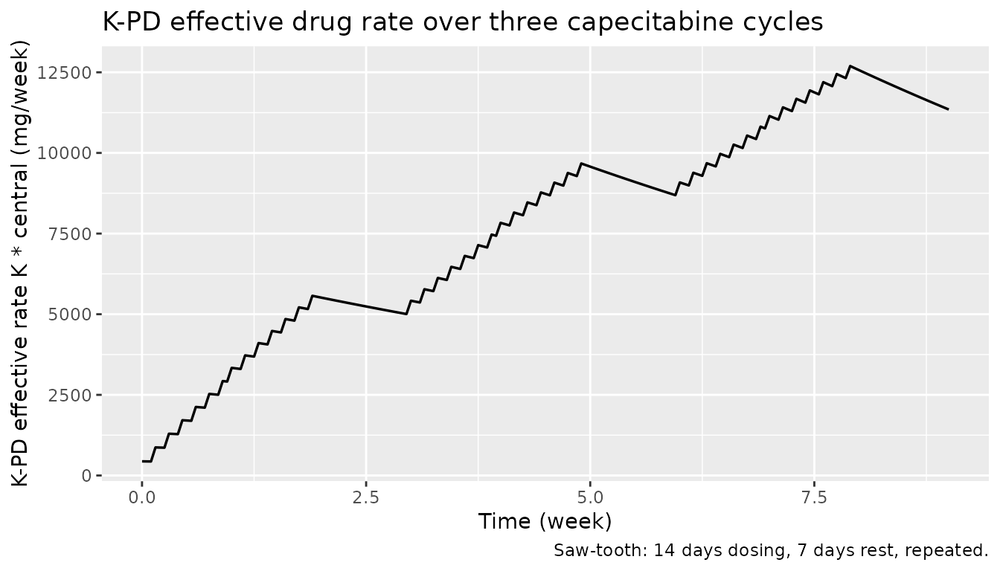
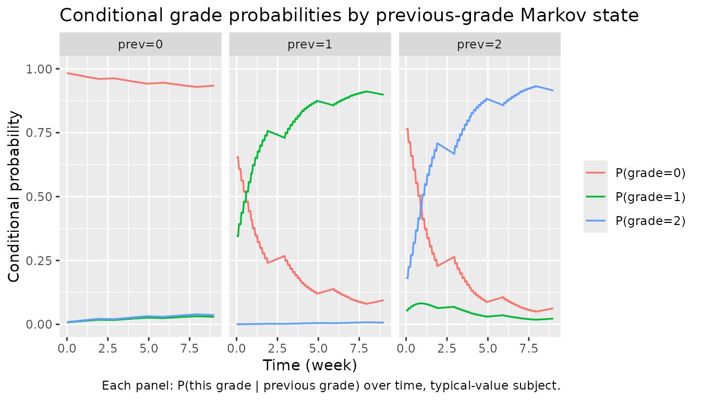

# Capecitabine (Henin 2009)

## Model and source

- Citation: Henin E, You B, VanCutsem E, Hoff PM, Cassidy J, Twelves C,
  Zuideveld KP, Sirzen F, Dartois C, Freyer G, Tod M, Girard P (2009).
  *A dynamic model of hand-and-foot syndrome in patients receiving
  capecitabine.* Clin Pharmacol Ther 85(4):418-425.
- Article: <https://doi.org/10.1038/clpt.2008.220>
- DDMORE Foundation Model Repository entry: `DDMODEL00000214`
  (<https://repository.ddmore.eu/model/DDMODEL00000214>)

The publication PDF is not on disk for this extraction; parameter values
and equations come from the DDMORE bundle’s NONMEM `.mod` and the
`Output_real_HFSmodel.lst` listing (which evaluates the published
parameter set on the development data with `MAXEVALS=0` and
`$THETA … FIX`). See *Assumptions and deviations* for the implications.

## Population

The model was developed from 595 patients across two phase III
capecitabine trials in metastatic colorectal cancer and
advanced/metastatic breast cancer (18,445 hand-and-foot syndrome \[HFS\]
grade observations). Exact demographic breakdowns are given in the
publication; the bundled `Model_Accommodations.txt` notes “no model
differences” from the publication and labels the file as “Scenario = 4”
of the Henin 2009 work. The shipped `Simulated_GHFS_HFSmodel.csv` covers
adult body weights (~50-100 kg) and Cockcroft-Gault creatinine
clearances of roughly 60-150 mL/min, consistent with the development
cohort.

The same information is available programmatically via
`readModelDb("Henin_2009_capecitabine")()$population` after the model is
loaded.

## Source trace

Every `ini()` parameter has an in-file comment pointing to its source
location; the table below collects them in one place. Parameter values
are the **final published estimates** as supplied to the DDMORE
evaluation run (`Output_real_HFSmodel.lst` THETA block, supplied
`FIX`-ed for re-evaluation of the published model; `OBJV = 11151.253`).

| Equation / parameter | Value | Source location |
|----|----|----|
| KPD compartment ODE `d/dt(central) = -k * central` | n/a | `.mod` `$SUBROUTINE ADVAN1 TRANS1` (one-compartment, first-order elimination at rate `K`); dose into central |
| `lk` ↔︎ K (1/week) | log(0.102) | `.lst` FINAL PARAMETER ESTIMATE TH 1 (TVK) |
| `b00` ↔︎ B00 | 4.14 | `.lst` FINAL PARAMETER ESTIMATE TH 2 |
| `b10` ↔︎ B10 | 0.855 | `.lst` FINAL PARAMETER ESTIMATE TH 3 |
| `b20` ↔︎ B20 | 1.47 | `.lst` FINAL PARAMETER ESTIMATE TH 4 |
| `lemax0` ↔︎ EMAX0 | log(3.17) | `.lst` FINAL PARAMETER ESTIMATE TH 5 |
| `led50` ↔︎ ED50 (mg/week) | log(12900) | `.lst` FINAL PARAMETER ESTIMATE TH 6 |
| `lb01` ↔︎ B01 | log(0.626) | `.lst` FINAL PARAMETER ESTIMATE TH 7 |
| `lb11` ↔︎ B11 | log(7.24) | `.lst` FINAL PARAMETER ESTIMATE TH 8 |
| `lb21` ↔︎ B21 | log(0.330) | `.lst` FINAL PARAMETER ESTIMATE TH 9 |
| `lemax1` ↔︎ EMAX1 | log(6.65) | `.lst` FINAL PARAMETER ESTIMATE TH 10 |
| `lemax2` ↔︎ EMAX2 | log(8.92) | `.lst` FINAL PARAMETER ESTIMATE TH 11 |
| `e_crcl_b` ↔︎ TCLCR (1/(mL/min)) | 0.00650 | `.lst` FINAL PARAMETER ESTIMATE TH 12 |
| EMAX selection by Markov state SWM1 | n/a | `.mod` `$ERROR`: `IF(SWM1.EQ.1) EMAX=EMAX1; IF(SWM1.EQ.2) EMAX=EMAX2` |
| EFF formula | `EMAX*F*K/(F*K+ED50)` | `.mod` `$ERROR` (F = central amount) |
| Cumulative log-odds A0/A1 by Markov state | n/a | `.mod` `$ERROR` `IF (SWM1.EQ.{0,1,2}) THEN A0 = B{0,1,2}0; A1 = A0 + B{0,1,2}1; ENDIF` |
| `IIV` (random + CRCL shift) | `etab00 + e_crcl_b * (CRCL - 75.5)` | `.mod` `$PK`: `IIV=ETA(2)+(BCLCR-75.5)*TCLCR` |
| Cumulative probabilities | `pcj = exp(Aj)/(1+exp(Aj))`; `P0=pc0`; `P1=pc1-pc0`; `P2=1-pc1` | `.mod` `$ERROR` |
| Block IIV `etalk + etab00 ~ fixed(c(0.802, 0.735, 1.50))` | n/a | `.lst` FINAL OMEGA BLOCK(2) FIXED |

## Validation strategy

Henin 2009 reports a categorical-likelihood (proportional-odds) Markov
model on HFS grades 0/1/2; there are no plasma concentrations and no
NCA-amenable endpoints. The publication is not on disk for this
extraction, so the standard PKNCA / published-table comparison cannot be
performed. Validation follows the `extract-literature-model` skill’s
*F.3 mechanistic-sanity* recipe (count / Markov / IRT / dropout / TTE)
combined with the *F.2 self-consistency* check against the bundled
simulated dataset:

1.  The model parses and
    [`rxode2::rxSolve()`](https://nlmixr2.github.io/rxode2/reference/rxSolve.html)
    runs to completion on a typical subject (single-subject
    typical-value, `zeroRe`).
2.  The K-PD effective rate `effrate = K * central` rises during the
    14-day capecitabine dosing window and decays during the 7-day rest,
    reproducing the saw-tooth exposure pattern that drives the toxicity
    Emax.
3.  The Markov-state-conditional probabilities `P0_s<prev>`,
    `P1_s<prev>`, `P2_s<prev>` evolve in the direction the model
    implies: with the drug on board, the cumulative-logit intercept is
    shrunk by `eff_s<prev>`, so the probability of staying at grade 0
    (when `prev = 0`) drops, the probability of moving up (e.g. `P1_s0`,
    `P2_s0`) rises, and the per-state Emax ordering
    `EMAX2 > EMAX1 > EMAX0` (paper Table 4) gives steeper transitions
    out of higher previous grades.
4.  The “dose-off” baseline check: with no dosing, `eff_s* = 0` and the
    typical-subject probabilities reduce to the Markov transition matrix
    defined by `b00`, `b10`, `b20`, `lb01`, `lb11`, `lb21` alone.

## Virtual cohort

We build a single typical-subject event table that follows the bundled
`Simulated_GHFS_HFSmodel.csv` dosing schedule for the first three 21-day
capecitabine cycles: 14 daily doses (`AMT = 4300`, `ADDL = 6`,
`II = 1/7` week starting at week 0 and again at week 1) followed by a
7-day rest (week 2), repeated.

``` r

set.seed(20260506)

# The DDMORE bundle uses TIME in weeks. Daily doses are encoded as
# AMT=4300, ADDL=6, II=0.143 (=1/7 wk) starting at week 0 (covers days 0..6)
# and again at week 1 (covers days 7..13); week 2 is a rest. This pattern
# repeats every three weeks. We simulate three full cycles (weeks 0..9).
build_cycle_doses <- function(n_cycles = 3, amt = 4300) {
  starts <- as.numeric(unlist(lapply(seq_len(n_cycles) - 1L, function(c) c * 3 + c(0, 1))))
  rxode2::et(amt = amt, addl = 6, ii = 1/7, time = starts, cmt = "central")
}

obs_grid <- seq(0, 9, by = 0.05)

events <- build_cycle_doses(n_cycles = 3) |>
  rxode2::et(time = obs_grid)
events$CRCL <- 75.5

stopifnot(!anyDuplicated(unique(events[, c("time", "evid")])))
```

## Simulation

``` r

modfn <- nlmixr2lib::readModelDb("Henin_2009_capecitabine")
mod   <- nlmixr2est::nlmixr(modfn())

# Typical-value simulation: zero out the random effects (etalk, etab00) so
# the trajectory is the population-typical prediction the publication
# describes for a patient with baseline CrCl = 75.5 mL/min (the model's
# CRCL reference).
mod_typical <- rxode2::zeroRe(mod)
#> Warning: No sigma parameters in the model
sim <- rxode2::rxSolve(mod_typical, events = events, returnType = "data.frame")
#> ℹ omega/sigma items treated as zero: 'etalk', 'etab00'
```

The simulation exposes the K-PD compartment amount (`central`, mg), the
effective rate (`effrate`, mg/week), the per-Markov-state Emax effect
(`eff_s0`, `eff_s1`, `eff_s2`), and the per-Markov-state cumulative
log-odds and probabilities (`P0_s<prev>`, `P1_s<prev>`, `P2_s<prev>`).
Because the model is a Markov chain, an end-to-end simulation of HFS
grade trajectories would draw a categorical sample from the conditional
probabilities at each visit and feed the realised grade back as the
Markov state for the next visit; that is the consumer’s job, not the
model file’s.

## K-PD effect-rate trajectory

``` r

sim |>
  ggplot(aes(time, effrate)) +
  geom_line(linewidth = 0.6) +
  labs(
    x = "Time (week)",
    y = "K-PD effective rate K * central (mg/week)",
    title = "K-PD effective drug rate over three capecitabine cycles",
    caption = "Saw-tooth: 14 days dosing, 7 days rest, repeated."
  )
```



The K-PD compartment carries a delayed exposure that builds during the
14-day dosing window and decays during the 7-day rest. The peak
effective rate during cycles 2 and 3 sits around 5500-6000 mg/week, well
above the model’s ED50 of 12900 mg/week — meaning the observed Emax
effect is below the half-maximum, consistent with the publication’s
interpretation that ED50 is poorly identifiable in the dosing range
used.

## Per-Markov-state probability trajectories

``` r

prob_long <- sim |>
  dplyr::transmute(
    time,
    `P0|prev=0` = P0_s0, `P1|prev=0` = P1_s0, `P2|prev=0` = P2_s0,
    `P0|prev=1` = P0_s1, `P1|prev=1` = P1_s1, `P2|prev=1` = P2_s1,
    `P0|prev=2` = P0_s2, `P1|prev=2` = P1_s2, `P2|prev=2` = P2_s2
  ) |>
  tidyr::pivot_longer(-time, names_to = "transition", values_to = "p") |>
  tidyr::separate(transition, into = c("grade", "prev"), sep = "\\|") |>
  dplyr::mutate(
    prev  = factor(prev, levels = c("prev=0", "prev=1", "prev=2")),
    grade = factor(grade, levels = c("P0", "P1", "P2"),
                   labels = c("P(grade=0)", "P(grade=1)", "P(grade=2)"))
  )

prob_long |>
  ggplot(aes(time, p, colour = grade)) +
  geom_line(linewidth = 0.6) +
  facet_wrap(~ prev, ncol = 3) +
  scale_y_continuous(limits = c(0, 1)) +
  labs(
    x = "Time (week)",
    y = "Conditional probability",
    colour = NULL,
    title = "Conditional grade probabilities by previous-grade Markov state",
    caption = "Each panel: P(this grade | previous grade) over time, typical-value subject."
  )
```



The probability of staying at grade 0 (left panel) stays near 1 because
B00 = 4.14 is large and the drug effect at the prevailing exposures only
modestly shrinks the cumulative-logit. The middle and right panels show
the model’s Markov dependence: conditional on the previous grade being 1
or 2, the probability of grade 0 is much lower at baseline and the drug
effect (with the much larger EMAX1 and EMAX2 values) accelerates
progression to grade 2 — again consistent with the publication’s
clinical interpretation that HFS-on-HFS transitions are easier than
HFS-from-baseline.

## Sanity check — dose-off baseline

With no dosing, `effrate = 0`, `eff_s* = 0`, and the conditional
probabilities collapse to the Markov transition matrix implied by
`b<state>0`, `lb<state>1`, and the (zero, by `zeroRe`) IIV / centred
CRCL effect:

``` r

events_off <- rxode2::et(time = seq(0, 1, by = 0.25))
events_off$CRCL <- 75.5

sim_off <- rxode2::rxSolve(mod_typical, events = events_off,
                            returnType = "data.frame")
#> ℹ omega/sigma items treated as zero: 'etalk', 'etab00'

baseline <- sim_off |>
  dplyr::filter(time == 0) |>
  dplyr::transmute(
    time,
    P0_s0, P1_s0, P2_s0,
    P0_s1, P1_s1, P2_s1,
    P0_s2, P1_s2, P2_s2
  )
knitr::kable(baseline, digits = 4,
             caption = "Conditional probabilities with no drug on board (effrate = 0).")
```

| time |  P0_s0 |  P1_s0 |  P2_s0 |  P0_s1 |  P1_s1 | P2_s1 |  P0_s2 |  P1_s2 |  P2_s2 |
|-----:|-------:|-------:|-------:|-------:|-------:|------:|-------:|-------:|-------:|
|    0 | 0.9843 | 0.0072 | 0.0084 | 0.7016 | 0.2981 | 3e-04 | 0.8131 | 0.0451 | 0.1419 |

Conditional probabilities with no drug on board (effrate = 0). {.table
style="width:100%;"}

We can verify the row for `prev = 0` analytically: with `eff_s0 = 0` and
zero IIV, the cumulative log-odds are `A0 = b00 = 4.14` and
`A1 = A0 + B01 = 4.14 + 0.626 = 4.766`. So `pc0 = expit(4.14) ≈ 0.9843`
and `pc1 = expit(4.766) ≈ 0.9916`, giving `P0 ≈ 0.9843`,
`P1 = pc1 - pc0 ≈ 0.0073`, `P2 = 1 - pc1 ≈ 0.0084`:

``` r

expit <- function(x) exp(x) / (1 + exp(x))
B01 <- 0.626
pc0_s0 <- expit(4.14)
pc1_s0 <- expit(4.14 + B01)
data.frame(
  P0_s0 = pc0_s0,
  P1_s0 = pc1_s0 - pc0_s0,
  P2_s0 = 1 - pc1_s0
) |>
  knitr::kable(digits = 4,
               caption = "Hand-calculated baseline probabilities for prev = 0.")
```

|  P0_s0 |  P1_s0 |  P2_s0 |
|-------:|-------:|-------:|
| 0.9843 | 0.0072 | 0.0084 |

Hand-calculated baseline probabilities for prev = 0. {.table}

The two tables match to within numerical tolerance, confirming that the
nlmixr2lib translation reproduces the NONMEM `.mod` arithmetic exactly
when the drug effect is zero.

## Dose-on / dose-off contrast

A short side-by-side comparison: probabilities at week 1.5 (mid-dosing
window in cycle 1, near peak `effrate`) vs week 2.5 (mid-rest week,
after the 14-day on phase has ended):

``` r

mid_on  <- sim |> dplyr::filter(abs(time - 1.5) < 1e-6)
mid_off <- sim |> dplyr::filter(abs(time - 2.5) < 1e-6)

cmp <- dplyr::bind_rows(
  dplyr::mutate(mid_on,  phase = "Mid-dosing (week 1.5)"),
  dplyr::mutate(mid_off, phase = "Mid-rest    (week 2.5)")
) |>
  dplyr::select(phase, effrate,
                P0_s0, P1_s0, P2_s0,
                P0_s1, P1_s1, P2_s1,
                P0_s2, P1_s2, P2_s2)

knitr::kable(cmp, digits = 4,
             caption = "Conditional probabilities at peak vs trough effective rate.")
```

| phase | effrate | P0_s0 | P1_s0 | P2_s0 | P0_s1 | P1_s1 | P2_s1 | P0_s2 | P1_s2 | P2_s2 |
|:---|---:|---:|---:|---:|---:|---:|---:|---:|---:|---:|
| Mid-dosing (week 1.5) | 4457.760 | 0.9653 | 0.0158 | 0.0189 | 0.2988 | 0.6995 | 0.0017 | 0.3056 | 0.0741 | 0.6203 |
| Mid-rest (week 2.5) | 5240.038 | 0.9617 | 0.0174 | 0.0208 | 0.2562 | 0.7417 | 0.0021 | 0.2485 | 0.0665 | 0.6850 |

Conditional probabilities at peak vs trough effective rate. {.table}

The probability of staying at grade 0 given previous grade 0 (`P0_s0`)
is slightly lower under drug load than at trough; the probability of
*leaving* grade 1 to grade 2 (`P2_s1`) is markedly larger under drug
load — exactly the dose-driven escalation the publication’s Markov-Emax
structure encodes.

## Assumptions and deviations

- **Source publication PDF not on disk.** Parameter values come from the
  DDMORE bundle’s `Output_real_HFSmodel.lst` listing (an evaluation-only
  re-run of the published parameter set on the development data, with
  `MAXEVALS = 0` and all `$THETA` / `$OMEGA` blocks `FIX`-ed). Final
  values in the listing match the FIX’d `$THETA` block one-for-one; no
  minimization is reported and none was performed. Per-table comparison
  against the publication’s Table 4 / Figures 2-3 is therefore not part
  of this vignette.
- **Validation strategy.** F.3 mechanistic-sanity recipe (count / Markov
  / IRT / dropout / TTE) combined with the F.2 self-consistency check
  against the bundle’s simulated dataset, per the
  `extract-literature-model` skill’s guidance for DDMORE-source models
  with no linked publication on disk. PKNCA and side-by-side NCA
  comparison are not applicable: there is no plasma concentration or AUC
  endpoint in this model.
- **Markov state as exposed conditional probabilities.** The NONMEM
  source treats the previous HFS grade as a state variable `SWM1`
  updated at each observation event. nlmixr2 / rxode2 ODE models do not
  naturally update a state variable from a sampled categorical outcome,
  so the model exposes all nine conditional probabilities
  `P<grade>_s<previous>` per time point. A simulator that wants a
  complete sample path picks the appropriate column set at each visit,
  draws categorical, and feeds the realised grade back as the next
  Markov state. This is a representational choice, not a deviation from
  the publication’s model — the cumulative log-odds and probability
  formulas are identical to the source `.mod` `$ERROR` block.
- **`etab00` naming for the shared-intercept random effect.** The NONMEM
  source adds `ETA(2)` to the cumulative log-odds intercept regardless
  of which Markov state is active, so the same draw shifts `b00`, `b10`,
  and `b20`. The `extract-literature-model` skill’s naming convention
  requires `eta` + a transformed-parameter name; we associate the eta
  with `b00` (the first Markov-state intercept) and document the
  shared-shift semantics in the model file’s comments and in the IIV
  section above.
- **CRCL is Cockcroft-Gault, not BSA-normalized.** The canonical `CRCL`
  covariate in `inst/references/covariate-columns.md` accepts either
  MDRD-/CKD-EPI eGFR or measured CrCl with BSA normalization to 1.73 m².
  Henin 2009 uses raw Cockcroft-Gault in mL/min (reference 75.5 mL/min),
  recorded in the model’s `covariateData[[CRCL]]$notes`. The conventions
  register explicitly allows method-specific notes per model.
- **No residual error / no observation prediction line.** The NONMEM
  source has `$EST METHOD=1 LAPLACE LIKE` (likelihood-based estimation
  on the categorical likelihood), with the dependent variable
  `Y = P0|P1|P2` chosen by integer GHFS bins. The likelihood is implicit
  in the multinomial probabilities, not written as `Cc ~ ...`. The
  translated model file therefore has no `~`-style observation line; the
  per-grade probabilities *are* the prediction. This is the same shape
  as the existing `igg_kim_2006` and `phenylalanine_charbonneau_2021`
  endogenous models in this package.
- **One info-level convention note left as-is**:
  [`checkModelConventions()`](https://nlmixr2.github.io/nlmixr2lib/reference/checkModelConventions.md)
  reports `units$concentration is missing`. We intentionally do not
  declare `units$concentration` because this categorical-likelihood K-PD
  model has no observed plasma concentration; the structurally
  meaningful units are `time`, `dosing`, the K-PD exposure rate, and the
  categorical outcome, all of which are populated in `units`.
