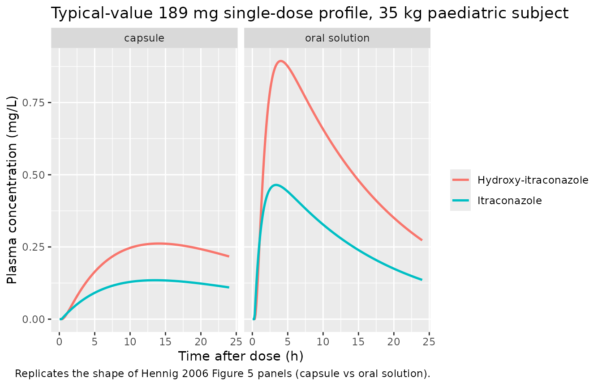
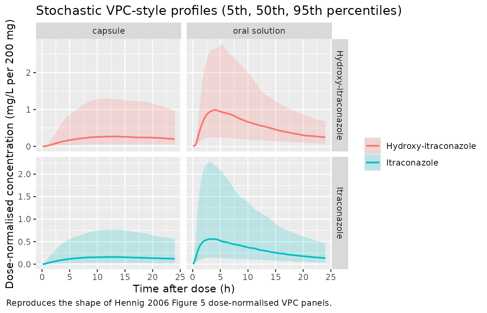

# Hennig_2006_itraconazole

## Model and source

    #> ℹ parameter labels from comments will be replaced by 'label()'

- Citation: Hennig S, Wainwright CE, Bell SC, Miller H, Friberg LE,
  Charles BG. Population pharmacokinetics of itraconazole and its active
  metabolite hydroxy-itraconazole in paediatric cystic fibrosis and bone
  marrow transplant patients. Clin Pharmacokinet. 2006;45(11):1099-1114.
  <doi:10.2165/00003088-200645110-00004>
- Description: Population PK model for oral itraconazole and its active
  metabolite hydroxy-itraconazole in paediatric cystic-fibrosis and
  bone-marrow-transplant patients (Hennig 2006). One-compartment
  parent + one-compartment metabolite with first-order absorption,
  first-order metabolic conversion (fm fixed to 1), allometric weight
  scaling on parent CL/F (0.75) and Vd/F (1.0), and formulation-specific
  ka and relative bioavailability for capsule vs oral solution.
- Article: <https://doi.org/10.2165/00003088-200645110-00004>

The packaged model implements the Hennig 2006 final model: a
one-compartment parent (itraconazole) connected to a one-compartment
active metabolite (hydroxy-itraconazole) via a first-order conversion
rate `kpm = cl / vc` with the fraction metabolised `fm` fixed to 1 (the
paper notes that `fm` could not be estimated because no IV reference was
available, so the typical-value model treats every disappearing parent
molecule as a metabolite molecule). Allometric scaling on parent CL/F
(exponent 0.75) and Vd/F (exponent 1.0) standardises to 70 kg per the
paper’s Methods (Eq. 5). Capsule and oral-solution arms are
distinguished by a binary `FORM_CAPSULE` covariate that switches the
absorption rate constant between 0.96 h^-1 (oral solution) and 0.09 h^-1
(capsule), and that gates the relative-bioavailability term so the
capsule arm carries a typical-value `Frel = 0.55` with IIV `etalfdepot`
while the oral-solution arm is fixed at `Frel = 1` with no IIV.

## Population

Hennig 2006 Table I summarises 49 patients enrolled at The Royal
Children’s Hospital and The Prince Charles Hospital (Brisbane,
Australia) between April 2003 and April 2005: 29 cystic-fibrosis (CF)
patients (24 paediatric and 5 adult) prescribed itraconazole for
allergic bronchopulmonary aspergillosis (ABPA), and 20 paediatric
bone-marrow-transplant (BMT) patients prescribed itraconazole for
fungal-infection prophylaxis. Median age was 8 years (range 0.4-30
years; 5 adult CF patients aged 19-30 years were pooled with the 44
paediatric patients for comparison), median total bodyweight 29.3 kg
(range 6.8-83.5 kg), median lean bodyweight 25.5 kg, median height 132.5
cm (range 31.3-182.0 cm), and 19/49 (38.8%) were female. 47/49 patients
(95.9%) were Caucasian. Median itraconazole daily dose was 5.4 mg/kg/day
(range 1.5-12.5) given as Sporanox capsules or oral cyclodextrin
solution, with switching between formulations permitted after at least
three consecutive doses of the most recent formulation. 75% of capsule
doses were taken with food versus 9% of solution doses; food and
acidic-beverage effects on Frel were tested as covariates but did not
reach statistical significance. 227 itraconazole samples (median 0.264
mg/L) and 192 hydroxy-itraconazole samples (median 0.531 mg/L) were
available for the modelling, with the assay LLOQ of 0.075 mg/L imputed
at half-LLOQ (0.0375 mg/L) for sub-LLOQ records.

The same metadata is available programmatically via
`readModelDb("Hennig_2006_itraconazole")$meta$population`.

## Source trace

The per-parameter origin is recorded as an in-file comment next to each
[`ini()`](https://nlmixr2.github.io/rxode2/reference/ini.html) entry in
`inst/modeldb/specificDrugs/Hennig_2006_itraconazole.R`. The table below
collects them in one place for review. All parameter values are from
Hennig 2006 Table II “Final model” column; structural-model layout and
the parent-to-metabolite molecular-weight ratio are taken from the
supplied NMTRAN control stream
`HENNIG S 2006 Clin Pharmacokin Example_Metabolite(Itraconazole)_CTL File.ctl`.

| Equation / parameter | Value | Source location |
|----|----|----|
| `lcl` (CL/F itraconazole) | log(35.5) -\> 35.5 L/h at 70 kg | Table II final model |
| `lvc` (Vd/F itraconazole) | log(672) -\> 672 L at 70 kg | Table II final model |
| `lcl_ohi` (CLm/(F\*fm)) | log(10.6) -\> 10.6 L/h | Table II final model |
| `lvc_ohi` (Vd(m)/(F\*fm)) | log(5.29) -\> 5.29 L | Table II final model |
| `lka` (oral solution ka) | log(0.96) -\> 0.96 h^-1 | Table II final model |
| `e_capsule_ka` | log(0.09 / 0.96) -\> -2.367 | Table II final model: capsule ka 0.09 h^-1 |
| `llag` (lag time) | log(19.1 / 60) -\> 0.318 h | Table II final model: 19.1 min |
| `lfdepot` (capsule Frel) | log(0.55) | Table II final model: Frel 0.55 |
| `allo_cl` (fixed) | 0.75 | Methods Eq. 5 + .ctl line 20 |
| `allo_vc` (fixed) | 1.0 | Methods Eq. 5 + .ctl line 21 |
| `etalcl` variance | log(1 + 0.688^2) = 0.38731 | Table II + paper Random Effects Model paragraph |
| `etalvc` variance | log(1 + 0.758^2) = 0.45404 | Table II |
| cov(`etalcl`, `etalvc`) | 0.69 \* sqrt(var_cl \* var_vc) = 0.28938 | Random Effects Model paragraph |
| `etalcl_ohi` variance | log(1 + 0.734^2) = 0.43098 | Table II final model: CV 73.4% |
| `etalfdepot` variance | log(1 + 0.611^2) = 0.31734 | Table II final model: CV 61.1%; gated on `FORM_CAPSULE` |
| `propSd` | 0.499 (sigma 49.9%) | Table II final model |
| `propSd_ohi` | 0.470 (sigma 47.0%) | Table II final model |
| `mw_ratio` (722.64 / 705.64) | 1.02410 | .ctl lines 32 and 35 |
| ODE: `d/dt(depot)` | `-ka * depot` | .ctl `$MODEL` GUTT + K12 = KA |
| ODE: `d/dt(central)` | `ka * depot - kpm * central` | .ctl K12 / K20 = 0 / K23 = CL2/V2 |
| ODE: `d/dt(central_ohi)` | `kpm * central - kel * central_ohi` | .ctl K23 / K30 = CL3/V3 / K32 = 0 |
| `f(depot) <- exp((lfdepot + etalfdepot) * FORM_CAPSULE)` | gated F | .ctl `IF (PREP.EQ.1) F1 = THETA(5) * EXP(ETA(3)) ELSE F1 = 1` |
| `lag(depot) <- exp(llag)` | 0.318 h | .ctl `ALAG1 = TVLAG / 60` |

## Virtual cohort

Original observed data are not publicly available. The figures below use
typical-value (no-IIV) and stochastic VPC-style virtual cohorts whose
covariate distributions approximate the paediatric CF/BMT population in
Hennig 2006 Table I. Body weights are sampled from a log-normal
distribution centred on the median 29.3 kg and bounded at the published
6.8-83.5 kg range; the formulation indicator is split equally between
capsule and oral solution (the paper’s analysis pools both) and the dose
is fixed at the median 5.4 mg/kg/day.

``` r

set.seed(20060501)

mod <- rxode2::rxode(readModelDb("Hennig_2006_itraconazole"))
#> ℹ parameter labels from comments will be replaced by 'label()'

dose_mg_per_kg_per_day <- 5.4         # Hennig 2006 Table I median
sim_horizon_h          <- 24          # one once-daily dosing interval

n_per_arm  <- 250

make_cohort <- function(n, capsule, id_offset = 0L) {
  weights <- pmin(pmax(exp(rnorm(n, mean = log(29.3), sd = 0.55)),
                       6.8), 83.5)
  doses_mg <- weights * dose_mg_per_kg_per_day
  base <- tibble(id = id_offset + seq_len(n),
                 WT = weights,
                 FORM_CAPSULE = as.integer(capsule),
                 amt = doses_mg)
  doses <- base |>
    mutate(time = 0, evid = 1L, cmt = "depot")
  obs_grid <- seq(0.1, sim_horizon_h, length.out = 60)
  obs <- base |>
    select(id, WT, FORM_CAPSULE) |>
    tidyr::crossing(time = obs_grid) |>
    mutate(evid = 0L, cmt = "Cc", amt = NA_real_)
  bind_rows(doses, obs) |>
    arrange(id, time, desc(evid)) |>
    mutate(treatment = ifelse(FORM_CAPSULE == 1, "capsule", "oral solution"))
}

events <- bind_rows(
  make_cohort(n_per_arm, capsule = 1, id_offset =          0L),
  make_cohort(n_per_arm, capsule = 0, id_offset = n_per_arm)
)
stopifnot(!anyDuplicated(unique(events[, c("id", "time", "evid")])))
```

## Simulation

``` r

sim <- rxode2::rxSolve(
  object  = mod,
  events  = events,
  keep    = c("WT", "FORM_CAPSULE", "treatment"),
  returnType = "data.frame"
) |>
  filter(time > 0)
```

For deterministic typical-value replication, zero out the random
effects:

``` r

sim_typical <- rxode2::rxSolve(
  object  = rxode2::zeroRe(mod),
  events  = events,
  keep    = c("WT", "FORM_CAPSULE", "treatment"),
  returnType = "data.frame"
) |>
  filter(time > 0)
#> ℹ omega/sigma items treated as zero: 'etalcl', 'etalvc', 'etalcl_ohi', 'etalfdepot'
#> Warning: multi-subject simulation without without 'omega'
```

## Replicate published figures

### Capsule vs oral solution typical-value profiles (Hennig 2006 Figure 5)

Hennig 2006 Figure 5 panels show the dose-normalised 24-h profile for
parent itraconazole and metabolite hydroxy-itraconazole at steady state
for the two formulations in a typical 35-kg child receiving 200 mg/day.
The figure below runs a single-dose simulation for the same nominal
subject (35 kg, 5.4 mg/kg ~ 189 mg) and overlays the capsule and
oral-solution arms; the early-Tmax / high-Cmax solution arm and the
slower / lower capsule profile reproduce the shape of the published
panels.

``` r

events_typ <- bind_rows(
  tibble(id = 1L, time = 0, amt = 189, evid = 1L, cmt = "depot",
         WT = 35, FORM_CAPSULE = 1L, treatment = "capsule"),
  tibble(id = 2L, time = 0, amt = 189, evid = 1L, cmt = "depot",
         WT = 35, FORM_CAPSULE = 0L, treatment = "oral solution")
) |>
  bind_rows(
    tidyr::crossing(id = c(1L, 2L), time = seq(0.05, 24, length.out = 240)) |>
      mutate(evid = 0L, cmt = "Cc", amt = NA_real_) |>
      mutate(WT = 35,
             FORM_CAPSULE = ifelse(id == 1L, 1L, 0L),
             treatment = ifelse(id == 1L, "capsule", "oral solution"))
  ) |>
  arrange(id, time, desc(evid))

sim_typ <- rxode2::rxSolve(
  object = rxode2::zeroRe(mod),
  events = events_typ,
  keep   = c("WT", "FORM_CAPSULE", "treatment"),
  returnType = "data.frame"
) |> filter(time > 0)
#> ℹ omega/sigma items treated as zero: 'etalcl', 'etalvc', 'etalcl_ohi', 'etalfdepot'
#> Warning: multi-subject simulation without without 'omega'

sim_typ_long <- sim_typ |>
  pivot_longer(c(Cc, Cc_ohi), names_to = "analyte", values_to = "conc") |>
  mutate(analyte = recode(analyte,
                          Cc     = "Itraconazole",
                          Cc_ohi = "Hydroxy-itraconazole"))

ggplot(sim_typ_long, aes(time, conc, colour = analyte)) +
  geom_line(linewidth = 0.9) +
  facet_wrap(~ treatment) +
  labs(x = "Time after dose (h)", y = "Plasma concentration (mg/L)",
       colour = NULL,
       title  = "Typical-value 189 mg single-dose profile, 35 kg paediatric subject",
       caption = "Replicates the shape of Hennig 2006 Figure 5 panels (capsule vs oral solution).")
```



### Stochastic VPC-style 5th / 50th / 95th percentiles (Hennig 2006 Figure 5)

``` r

sim_long <- sim |>
  mutate(dose_mg = WT * dose_mg_per_kg_per_day) |>
  pivot_longer(c(Cc, Cc_ohi), names_to = "analyte", values_to = "conc") |>
  mutate(analyte = recode(analyte,
                          Cc     = "Itraconazole",
                          Cc_ohi = "Hydroxy-itraconazole"),
         dnconc  = conc / dose_mg * 200)  # dose-normalised to 200 mg

vpc <- sim_long |>
  group_by(treatment, analyte, time) |>
  summarise(
    Q05 = quantile(dnconc, 0.05, na.rm = TRUE),
    Q50 = quantile(dnconc, 0.50, na.rm = TRUE),
    Q95 = quantile(dnconc, 0.95, na.rm = TRUE),
    .groups = "drop"
  )

ggplot(vpc, aes(time, Q50, colour = analyte, fill = analyte)) +
  geom_ribbon(aes(ymin = Q05, ymax = Q95), alpha = 0.20, colour = NA) +
  geom_line(linewidth = 0.8) +
  facet_grid(analyte ~ treatment, scales = "free_y") +
  labs(x = "Time after dose (h)",
       y = "Dose-normalised concentration (mg/L per 200 mg)",
       colour = NULL, fill = NULL,
       title = "Stochastic VPC-style profiles (5th, 50th, 95th percentiles)",
       caption = "Reproduces the shape of Hennig 2006 Figure 5 dose-normalised VPC panels.")
```



## PKNCA validation

PKNCA is run separately for the parent (`Cc`) and the metabolite
(`Cc_ohi`) analytes, each grouped by formulation. The single-dose
interval 0-24 h is chosen to match the simulation horizon; `aucinf.obs`
and `half.life` are computed using PKNCA’s automatic terminal-phase fit.

``` r

sim_nca <- sim_typical |>
  dplyr::filter(!is.na(Cc), time > 0)

dose_df <- events |>
  dplyr::filter(evid == 1) |>
  dplyr::select(id, time, amt, treatment)

conc_obj <- PKNCA::PKNCAconc(
  sim_nca |> dplyr::select(id, time, Cc, treatment),
  Cc ~ time | treatment + id,
  concu = "mg/L", timeu = "hr"
)
dose_obj <- PKNCA::PKNCAdose(dose_df, amt ~ time | treatment + id,
                             doseu = "mg")

intervals_parent <- data.frame(
  start      = 0,
  end        = 24,
  cmax       = TRUE,
  tmax       = TRUE,
  auclast    = TRUE,
  aucinf.obs = TRUE,
  half.life  = TRUE
)

nca_parent <- PKNCA::pk.nca(
  PKNCA::PKNCAdata(conc_obj, dose_obj, intervals = intervals_parent)
)
#> Warning: Requesting an AUC range starting (0) before the first measurement (0.1) is not allowed
#> Requesting an AUC range starting (0) before the first measurement (0.1) is not allowed
#> Requesting an AUC range starting (0) before the first measurement (0.1) is not allowed
#> Requesting an AUC range starting (0) before the first measurement (0.1) is not allowed
#> Requesting an AUC range starting (0) before the first measurement (0.1) is not allowed
#> Requesting an AUC range starting (0) before the first measurement (0.1) is not allowed
#> Requesting an AUC range starting (0) before the first measurement (0.1) is not allowed
#> Requesting an AUC range starting (0) before the first measurement (0.1) is not allowed
#> Requesting an AUC range starting (0) before the first measurement (0.1) is not allowed
#> Requesting an AUC range starting (0) before the first measurement (0.1) is not allowed
#> Requesting an AUC range starting (0) before the first measurement (0.1) is not allowed
#> Requesting an AUC range starting (0) before the first measurement (0.1) is not allowed
#> Requesting an AUC range starting (0) before the first measurement (0.1) is not allowed
#> Requesting an AUC range starting (0) before the first measurement (0.1) is not allowed
#> Requesting an AUC range starting (0) before the first measurement (0.1) is not allowed
#> Requesting an AUC range starting (0) before the first measurement (0.1) is not allowed
#> Requesting an AUC range starting (0) before the first measurement (0.1) is not allowed
#> Requesting an AUC range starting (0) before the first measurement (0.1) is not allowed
#> Requesting an AUC range starting (0) before the first measurement (0.1) is not allowed
#> Requesting an AUC range starting (0) before the first measurement (0.1) is not allowed
#> Requesting an AUC range starting (0) before the first measurement (0.1) is not allowed
#> Requesting an AUC range starting (0) before the first measurement (0.1) is not allowed
#> Requesting an AUC range starting (0) before the first measurement (0.1) is not allowed
#> Requesting an AUC range starting (0) before the first measurement (0.1) is not allowed
#> Requesting an AUC range starting (0) before the first measurement (0.1) is not allowed
#> Requesting an AUC range starting (0) before the first measurement (0.1) is not allowed
#> Requesting an AUC range starting (0) before the first measurement (0.1) is not allowed
#> Requesting an AUC range starting (0) before the first measurement (0.1) is not allowed
#> Requesting an AUC range starting (0) before the first measurement (0.1) is not allowed
#> Requesting an AUC range starting (0) before the first measurement (0.1) is not allowed
#> Requesting an AUC range starting (0) before the first measurement (0.1) is not allowed
#> Requesting an AUC range starting (0) before the first measurement (0.1) is not allowed
#> Requesting an AUC range starting (0) before the first measurement (0.1) is not allowed
#> Requesting an AUC range starting (0) before the first measurement (0.1) is not allowed
#> Requesting an AUC range starting (0) before the first measurement (0.1) is not allowed
#> Requesting an AUC range starting (0) before the first measurement (0.1) is not allowed
#> Requesting an AUC range starting (0) before the first measurement (0.1) is not allowed
#> Requesting an AUC range starting (0) before the first measurement (0.1) is not allowed
#> Requesting an AUC range starting (0) before the first measurement (0.1) is not allowed
#> Requesting an AUC range starting (0) before the first measurement (0.1) is not allowed
#> Requesting an AUC range starting (0) before the first measurement (0.1) is not allowed
#> Requesting an AUC range starting (0) before the first measurement (0.1) is not allowed
#> Requesting an AUC range starting (0) before the first measurement (0.1) is not allowed
#> Requesting an AUC range starting (0) before the first measurement (0.1) is not allowed
#> Requesting an AUC range starting (0) before the first measurement (0.1) is not allowed
#> Requesting an AUC range starting (0) before the first measurement (0.1) is not allowed
#> Requesting an AUC range starting (0) before the first measurement (0.1) is not allowed
#> Requesting an AUC range starting (0) before the first measurement (0.1) is not allowed
#> Requesting an AUC range starting (0) before the first measurement (0.1) is not allowed
#> Requesting an AUC range starting (0) before the first measurement (0.1) is not allowed
#> Requesting an AUC range starting (0) before the first measurement (0.1) is not allowed
#> Requesting an AUC range starting (0) before the first measurement (0.1) is not allowed
#> Requesting an AUC range starting (0) before the first measurement (0.1) is not allowed
#> Requesting an AUC range starting (0) before the first measurement (0.1) is not allowed
#> Requesting an AUC range starting (0) before the first measurement (0.1) is not allowed
#> Requesting an AUC range starting (0) before the first measurement (0.1) is not allowed
#> Requesting an AUC range starting (0) before the first measurement (0.1) is not allowed
#> Requesting an AUC range starting (0) before the first measurement (0.1) is not allowed
#> Requesting an AUC range starting (0) before the first measurement (0.1) is not allowed
#> Requesting an AUC range starting (0) before the first measurement (0.1) is not allowed
#> Requesting an AUC range starting (0) before the first measurement (0.1) is not allowed
#> Requesting an AUC range starting (0) before the first measurement (0.1) is not allowed
#> Requesting an AUC range starting (0) before the first measurement (0.1) is not allowed
#> Requesting an AUC range starting (0) before the first measurement (0.1) is not allowed
#> Requesting an AUC range starting (0) before the first measurement (0.1) is not allowed
#> Requesting an AUC range starting (0) before the first measurement (0.1) is not allowed
#> Requesting an AUC range starting (0) before the first measurement (0.1) is not allowed
#> Requesting an AUC range starting (0) before the first measurement (0.1) is not allowed
#> Requesting an AUC range starting (0) before the first measurement (0.1) is not allowed
#> Requesting an AUC range starting (0) before the first measurement (0.1) is not allowed
#> Requesting an AUC range starting (0) before the first measurement (0.1) is not allowed
#> Requesting an AUC range starting (0) before the first measurement (0.1) is not allowed
#> Requesting an AUC range starting (0) before the first measurement (0.1) is not allowed
#> Requesting an AUC range starting (0) before the first measurement (0.1) is not allowed
#> Requesting an AUC range starting (0) before the first measurement (0.1) is not allowed
#> Requesting an AUC range starting (0) before the first measurement (0.1) is not allowed
#> Requesting an AUC range starting (0) before the first measurement (0.1) is not allowed
#> Requesting an AUC range starting (0) before the first measurement (0.1) is not allowed
#> Requesting an AUC range starting (0) before the first measurement (0.1) is not allowed
#> Requesting an AUC range starting (0) before the first measurement (0.1) is not allowed
#> Requesting an AUC range starting (0) before the first measurement (0.1) is not allowed
#> Requesting an AUC range starting (0) before the first measurement (0.1) is not allowed
#> Requesting an AUC range starting (0) before the first measurement (0.1) is not allowed
#> Requesting an AUC range starting (0) before the first measurement (0.1) is not allowed
#> Requesting an AUC range starting (0) before the first measurement (0.1) is not allowed
#> Requesting an AUC range starting (0) before the first measurement (0.1) is not allowed
#> Requesting an AUC range starting (0) before the first measurement (0.1) is not allowed
#> Requesting an AUC range starting (0) before the first measurement (0.1) is not allowed
#> Requesting an AUC range starting (0) before the first measurement (0.1) is not allowed
#> Requesting an AUC range starting (0) before the first measurement (0.1) is not allowed
#> Requesting an AUC range starting (0) before the first measurement (0.1) is not allowed
#> Requesting an AUC range starting (0) before the first measurement (0.1) is not allowed
#> Requesting an AUC range starting (0) before the first measurement (0.1) is not allowed
#> Requesting an AUC range starting (0) before the first measurement (0.1) is not allowed
#> Requesting an AUC range starting (0) before the first measurement (0.1) is not allowed
#> Requesting an AUC range starting (0) before the first measurement (0.1) is not allowed
#> Requesting an AUC range starting (0) before the first measurement (0.1) is not allowed
#> Requesting an AUC range starting (0) before the first measurement (0.1) is not allowed
#> Requesting an AUC range starting (0) before the first measurement (0.1) is not allowed
#> Requesting an AUC range starting (0) before the first measurement (0.1) is not allowed
#> Requesting an AUC range starting (0) before the first measurement (0.1) is not allowed
#> Requesting an AUC range starting (0) before the first measurement (0.1) is not allowed
#> Requesting an AUC range starting (0) before the first measurement (0.1) is not allowed
#> Requesting an AUC range starting (0) before the first measurement (0.1) is not allowed
#> Requesting an AUC range starting (0) before the first measurement (0.1) is not allowed
#> Requesting an AUC range starting (0) before the first measurement (0.1) is not allowed
#> Requesting an AUC range starting (0) before the first measurement (0.1) is not allowed
#> Requesting an AUC range starting (0) before the first measurement (0.1) is not allowed
#> Requesting an AUC range starting (0) before the first measurement (0.1) is not allowed
#> Requesting an AUC range starting (0) before the first measurement (0.1) is not allowed
#> Requesting an AUC range starting (0) before the first measurement (0.1) is not allowed
#> Requesting an AUC range starting (0) before the first measurement (0.1) is not allowed
#> Requesting an AUC range starting (0) before the first measurement (0.1) is not allowed
#> Requesting an AUC range starting (0) before the first measurement (0.1) is not allowed
#> Requesting an AUC range starting (0) before the first measurement (0.1) is not allowed
#> Requesting an AUC range starting (0) before the first measurement (0.1) is not allowed
#> Requesting an AUC range starting (0) before the first measurement (0.1) is not allowed
#> Requesting an AUC range starting (0) before the first measurement (0.1) is not allowed
#> Requesting an AUC range starting (0) before the first measurement (0.1) is not allowed
#> Requesting an AUC range starting (0) before the first measurement (0.1) is not allowed
#> Requesting an AUC range starting (0) before the first measurement (0.1) is not allowed
#> Requesting an AUC range starting (0) before the first measurement (0.1) is not allowed
#> Requesting an AUC range starting (0) before the first measurement (0.1) is not allowed
#> Requesting an AUC range starting (0) before the first measurement (0.1) is not allowed
#> Requesting an AUC range starting (0) before the first measurement (0.1) is not allowed
#> Requesting an AUC range starting (0) before the first measurement (0.1) is not allowed
#> Requesting an AUC range starting (0) before the first measurement (0.1) is not allowed
#> Requesting an AUC range starting (0) before the first measurement (0.1) is not allowed
#> Requesting an AUC range starting (0) before the first measurement (0.1) is not allowed
#> Requesting an AUC range starting (0) before the first measurement (0.1) is not allowed
#> Requesting an AUC range starting (0) before the first measurement (0.1) is not allowed
#> Requesting an AUC range starting (0) before the first measurement (0.1) is not allowed
#> Requesting an AUC range starting (0) before the first measurement (0.1) is not allowed
#> Requesting an AUC range starting (0) before the first measurement (0.1) is not allowed
#> Requesting an AUC range starting (0) before the first measurement (0.1) is not allowed
#> Requesting an AUC range starting (0) before the first measurement (0.1) is not allowed
#> Requesting an AUC range starting (0) before the first measurement (0.1) is not allowed
#> Requesting an AUC range starting (0) before the first measurement (0.1) is not allowed
#> Requesting an AUC range starting (0) before the first measurement (0.1) is not allowed
#> Requesting an AUC range starting (0) before the first measurement (0.1) is not allowed
#> Requesting an AUC range starting (0) before the first measurement (0.1) is not allowed
#> Requesting an AUC range starting (0) before the first measurement (0.1) is not allowed
#> Requesting an AUC range starting (0) before the first measurement (0.1) is not allowed
#> Requesting an AUC range starting (0) before the first measurement (0.1) is not allowed
#> Requesting an AUC range starting (0) before the first measurement (0.1) is not allowed
#> Requesting an AUC range starting (0) before the first measurement (0.1) is not allowed
#> Requesting an AUC range starting (0) before the first measurement (0.1) is not allowed
#> Requesting an AUC range starting (0) before the first measurement (0.1) is not allowed
#> Requesting an AUC range starting (0) before the first measurement (0.1) is not allowed
#> Requesting an AUC range starting (0) before the first measurement (0.1) is not allowed
#> Requesting an AUC range starting (0) before the first measurement (0.1) is not allowed
#> Requesting an AUC range starting (0) before the first measurement (0.1) is not allowed
#> Requesting an AUC range starting (0) before the first measurement (0.1) is not allowed
#> Requesting an AUC range starting (0) before the first measurement (0.1) is not allowed
#> Requesting an AUC range starting (0) before the first measurement (0.1) is not allowed
#> Requesting an AUC range starting (0) before the first measurement (0.1) is not allowed
#> Requesting an AUC range starting (0) before the first measurement (0.1) is not allowed
#> Requesting an AUC range starting (0) before the first measurement (0.1) is not allowed
#> Requesting an AUC range starting (0) before the first measurement (0.1) is not allowed
#> Requesting an AUC range starting (0) before the first measurement (0.1) is not allowed
#> Requesting an AUC range starting (0) before the first measurement (0.1) is not allowed
#> Requesting an AUC range starting (0) before the first measurement (0.1) is not allowed
#> Requesting an AUC range starting (0) before the first measurement (0.1) is not allowed
#> Requesting an AUC range starting (0) before the first measurement (0.1) is not allowed
#> Requesting an AUC range starting (0) before the first measurement (0.1) is not allowed
#> Requesting an AUC range starting (0) before the first measurement (0.1) is not allowed
#> Requesting an AUC range starting (0) before the first measurement (0.1) is not allowed
#> Requesting an AUC range starting (0) before the first measurement (0.1) is not allowed
#> Requesting an AUC range starting (0) before the first measurement (0.1) is not allowed
#> Requesting an AUC range starting (0) before the first measurement (0.1) is not allowed
#> Requesting an AUC range starting (0) before the first measurement (0.1) is not allowed
#> Requesting an AUC range starting (0) before the first measurement (0.1) is not allowed
#> Requesting an AUC range starting (0) before the first measurement (0.1) is not allowed
#> Requesting an AUC range starting (0) before the first measurement (0.1) is not allowed
#> Requesting an AUC range starting (0) before the first measurement (0.1) is not allowed
#> Requesting an AUC range starting (0) before the first measurement (0.1) is not allowed
#> Requesting an AUC range starting (0) before the first measurement (0.1) is not allowed
#> Requesting an AUC range starting (0) before the first measurement (0.1) is not allowed
#> Requesting an AUC range starting (0) before the first measurement (0.1) is not allowed
#> Requesting an AUC range starting (0) before the first measurement (0.1) is not allowed
#> Requesting an AUC range starting (0) before the first measurement (0.1) is not allowed
#> Requesting an AUC range starting (0) before the first measurement (0.1) is not allowed
#> Requesting an AUC range starting (0) before the first measurement (0.1) is not allowed
#> Requesting an AUC range starting (0) before the first measurement (0.1) is not allowed
#> Requesting an AUC range starting (0) before the first measurement (0.1) is not allowed
#> Requesting an AUC range starting (0) before the first measurement (0.1) is not allowed
#> Requesting an AUC range starting (0) before the first measurement (0.1) is not allowed
#> Requesting an AUC range starting (0) before the first measurement (0.1) is not allowed
#> Requesting an AUC range starting (0) before the first measurement (0.1) is not allowed
#> Requesting an AUC range starting (0) before the first measurement (0.1) is not allowed
#> Requesting an AUC range starting (0) before the first measurement (0.1) is not allowed
#> Requesting an AUC range starting (0) before the first measurement (0.1) is not allowed
#> Requesting an AUC range starting (0) before the first measurement (0.1) is not allowed
#> Requesting an AUC range starting (0) before the first measurement (0.1) is not allowed
#> Requesting an AUC range starting (0) before the first measurement (0.1) is not allowed
#> Requesting an AUC range starting (0) before the first measurement (0.1) is not allowed
#>  ■■■■■■■                           20% |  ETA: 12s
#> Warning: Requesting an AUC range starting (0) before the first measurement (0.1) is not allowed
#> Requesting an AUC range starting (0) before the first measurement (0.1) is not allowed
#> Requesting an AUC range starting (0) before the first measurement (0.1) is not allowed
#> Requesting an AUC range starting (0) before the first measurement (0.1) is not allowed
#> Requesting an AUC range starting (0) before the first measurement (0.1) is not allowed
#> Requesting an AUC range starting (0) before the first measurement (0.1) is not allowed
#> Requesting an AUC range starting (0) before the first measurement (0.1) is not allowed
#> Requesting an AUC range starting (0) before the first measurement (0.1) is not allowed
#> Requesting an AUC range starting (0) before the first measurement (0.1) is not allowed
#> Requesting an AUC range starting (0) before the first measurement (0.1) is not allowed
#> Requesting an AUC range starting (0) before the first measurement (0.1) is not allowed
#> Requesting an AUC range starting (0) before the first measurement (0.1) is not allowed
#> Requesting an AUC range starting (0) before the first measurement (0.1) is not allowed
#> Requesting an AUC range starting (0) before the first measurement (0.1) is not allowed
#> Requesting an AUC range starting (0) before the first measurement (0.1) is not allowed
#> Requesting an AUC range starting (0) before the first measurement (0.1) is not allowed
#> Requesting an AUC range starting (0) before the first measurement (0.1) is not allowed
#> Requesting an AUC range starting (0) before the first measurement (0.1) is not allowed
#> Requesting an AUC range starting (0) before the first measurement (0.1) is not allowed
#> Requesting an AUC range starting (0) before the first measurement (0.1) is not allowed
#> Requesting an AUC range starting (0) before the first measurement (0.1) is not allowed
#> Requesting an AUC range starting (0) before the first measurement (0.1) is not allowed
#> Requesting an AUC range starting (0) before the first measurement (0.1) is not allowed
#> Requesting an AUC range starting (0) before the first measurement (0.1) is not allowed
#> Requesting an AUC range starting (0) before the first measurement (0.1) is not allowed
#> Requesting an AUC range starting (0) before the first measurement (0.1) is not allowed
#> Requesting an AUC range starting (0) before the first measurement (0.1) is not allowed
#> Requesting an AUC range starting (0) before the first measurement (0.1) is not allowed
#> Requesting an AUC range starting (0) before the first measurement (0.1) is not allowed
#> Requesting an AUC range starting (0) before the first measurement (0.1) is not allowed
#> Requesting an AUC range starting (0) before the first measurement (0.1) is not allowed
#> Requesting an AUC range starting (0) before the first measurement (0.1) is not allowed
#> Requesting an AUC range starting (0) before the first measurement (0.1) is not allowed
#> Requesting an AUC range starting (0) before the first measurement (0.1) is not allowed
#> Requesting an AUC range starting (0) before the first measurement (0.1) is not allowed
#> Requesting an AUC range starting (0) before the first measurement (0.1) is not allowed
#> Requesting an AUC range starting (0) before the first measurement (0.1) is not allowed
#> Requesting an AUC range starting (0) before the first measurement (0.1) is not allowed
#> Requesting an AUC range starting (0) before the first measurement (0.1) is not allowed
#> Requesting an AUC range starting (0) before the first measurement (0.1) is not allowed
#> Requesting an AUC range starting (0) before the first measurement (0.1) is not allowed
#> Requesting an AUC range starting (0) before the first measurement (0.1) is not allowed
#> Requesting an AUC range starting (0) before the first measurement (0.1) is not allowed
#> Requesting an AUC range starting (0) before the first measurement (0.1) is not allowed
#> Requesting an AUC range starting (0) before the first measurement (0.1) is not allowed
#> Requesting an AUC range starting (0) before the first measurement (0.1) is not allowed
#> Requesting an AUC range starting (0) before the first measurement (0.1) is not allowed
#> Requesting an AUC range starting (0) before the first measurement (0.1) is not allowed
#> Requesting an AUC range starting (0) before the first measurement (0.1) is not allowed
#> Requesting an AUC range starting (0) before the first measurement (0.1) is not allowed
#> Requesting an AUC range starting (0) before the first measurement (0.1) is not allowed
#> Requesting an AUC range starting (0) before the first measurement (0.1) is not allowed
#> Requesting an AUC range starting (0) before the first measurement (0.1) is not allowed
#> Requesting an AUC range starting (0) before the first measurement (0.1) is not allowed
#> Requesting an AUC range starting (0) before the first measurement (0.1) is not allowed
#> Requesting an AUC range starting (0) before the first measurement (0.1) is not allowed
#> Requesting an AUC range starting (0) before the first measurement (0.1) is not allowed
#> Requesting an AUC range starting (0) before the first measurement (0.1) is not allowed
#> Requesting an AUC range starting (0) before the first measurement (0.1) is not allowed
#> Requesting an AUC range starting (0) before the first measurement (0.1) is not allowed
#> Requesting an AUC range starting (0) before the first measurement (0.1) is not allowed
#> Requesting an AUC range starting (0) before the first measurement (0.1) is not allowed
#> Requesting an AUC range starting (0) before the first measurement (0.1) is not allowed
#> Requesting an AUC range starting (0) before the first measurement (0.1) is not allowed
#> Requesting an AUC range starting (0) before the first measurement (0.1) is not allowed
#> Requesting an AUC range starting (0) before the first measurement (0.1) is not allowed
#> Requesting an AUC range starting (0) before the first measurement (0.1) is not allowed
#> Requesting an AUC range starting (0) before the first measurement (0.1) is not allowed
#> Requesting an AUC range starting (0) before the first measurement (0.1) is not allowed
#> Requesting an AUC range starting (0) before the first measurement (0.1) is not allowed
#> Requesting an AUC range starting (0) before the first measurement (0.1) is not allowed
#> Requesting an AUC range starting (0) before the first measurement (0.1) is not allowed
#> Requesting an AUC range starting (0) before the first measurement (0.1) is not allowed
#> Requesting an AUC range starting (0) before the first measurement (0.1) is not allowed
#> Requesting an AUC range starting (0) before the first measurement (0.1) is not allowed
#> Requesting an AUC range starting (0) before the first measurement (0.1) is not allowed
#> Requesting an AUC range starting (0) before the first measurement (0.1) is not allowed
#> Requesting an AUC range starting (0) before the first measurement (0.1) is not allowed
#> Requesting an AUC range starting (0) before the first measurement (0.1) is not allowed
#> Requesting an AUC range starting (0) before the first measurement (0.1) is not allowed
#> Requesting an AUC range starting (0) before the first measurement (0.1) is not allowed
#> Requesting an AUC range starting (0) before the first measurement (0.1) is not allowed
#> Requesting an AUC range starting (0) before the first measurement (0.1) is not allowed
#> Requesting an AUC range starting (0) before the first measurement (0.1) is not allowed
#> Requesting an AUC range starting (0) before the first measurement (0.1) is not allowed
#> Requesting an AUC range starting (0) before the first measurement (0.1) is not allowed
#> Requesting an AUC range starting (0) before the first measurement (0.1) is not allowed
#> Requesting an AUC range starting (0) before the first measurement (0.1) is not allowed
#> Requesting an AUC range starting (0) before the first measurement (0.1) is not allowed
#> Requesting an AUC range starting (0) before the first measurement (0.1) is not allowed
#> Requesting an AUC range starting (0) before the first measurement (0.1) is not allowed
#> Requesting an AUC range starting (0) before the first measurement (0.1) is not allowed
#> Requesting an AUC range starting (0) before the first measurement (0.1) is not allowed
#> Requesting an AUC range starting (0) before the first measurement (0.1) is not allowed
#> Requesting an AUC range starting (0) before the first measurement (0.1) is not allowed
#> Requesting an AUC range starting (0) before the first measurement (0.1) is not allowed
#> Requesting an AUC range starting (0) before the first measurement (0.1) is not allowed
#> Requesting an AUC range starting (0) before the first measurement (0.1) is not allowed
#> Requesting an AUC range starting (0) before the first measurement (0.1) is not allowed
#> Requesting an AUC range starting (0) before the first measurement (0.1) is not allowed
#> Requesting an AUC range starting (0) before the first measurement (0.1) is not allowed
#> Requesting an AUC range starting (0) before the first measurement (0.1) is not allowed
#> Requesting an AUC range starting (0) before the first measurement (0.1) is not allowed
#> Requesting an AUC range starting (0) before the first measurement (0.1) is not allowed
#> Requesting an AUC range starting (0) before the first measurement (0.1) is not allowed
#> Requesting an AUC range starting (0) before the first measurement (0.1) is not allowed
#> Requesting an AUC range starting (0) before the first measurement (0.1) is not allowed
#> Requesting an AUC range starting (0) before the first measurement (0.1) is not allowed
#> Requesting an AUC range starting (0) before the first measurement (0.1) is not allowed
#> Requesting an AUC range starting (0) before the first measurement (0.1) is not allowed
#> Requesting an AUC range starting (0) before the first measurement (0.1) is not allowed
#> Requesting an AUC range starting (0) before the first measurement (0.1) is not allowed
#> Requesting an AUC range starting (0) before the first measurement (0.1) is not allowed
#> Requesting an AUC range starting (0) before the first measurement (0.1) is not allowed
#> Requesting an AUC range starting (0) before the first measurement (0.1) is not allowed
#> Requesting an AUC range starting (0) before the first measurement (0.1) is not allowed
#> Requesting an AUC range starting (0) before the first measurement (0.1) is not allowed
#> Requesting an AUC range starting (0) before the first measurement (0.1) is not allowed
#> Requesting an AUC range starting (0) before the first measurement (0.1) is not allowed
#> Requesting an AUC range starting (0) before the first measurement (0.1) is not allowed
#> Requesting an AUC range starting (0) before the first measurement (0.1) is not allowed
#> Requesting an AUC range starting (0) before the first measurement (0.1) is not allowed
#> Requesting an AUC range starting (0) before the first measurement (0.1) is not allowed
#> Requesting an AUC range starting (0) before the first measurement (0.1) is not allowed
#> Requesting an AUC range starting (0) before the first measurement (0.1) is not allowed
#> Requesting an AUC range starting (0) before the first measurement (0.1) is not allowed
#> Requesting an AUC range starting (0) before the first measurement (0.1) is not allowed
#> Requesting an AUC range starting (0) before the first measurement (0.1) is not allowed
#> Requesting an AUC range starting (0) before the first measurement (0.1) is not allowed
#> Requesting an AUC range starting (0) before the first measurement (0.1) is not allowed
#> Requesting an AUC range starting (0) before the first measurement (0.1) is not allowed
#> Requesting an AUC range starting (0) before the first measurement (0.1) is not allowed
#> Requesting an AUC range starting (0) before the first measurement (0.1) is not allowed
#> Requesting an AUC range starting (0) before the first measurement (0.1) is not allowed
#> Requesting an AUC range starting (0) before the first measurement (0.1) is not allowed
#> Requesting an AUC range starting (0) before the first measurement (0.1) is not allowed
#> Requesting an AUC range starting (0) before the first measurement (0.1) is not allowed
#> Requesting an AUC range starting (0) before the first measurement (0.1) is not allowed
#> Requesting an AUC range starting (0) before the first measurement (0.1) is not allowed
#> Requesting an AUC range starting (0) before the first measurement (0.1) is not allowed
#> Requesting an AUC range starting (0) before the first measurement (0.1) is not allowed
#> Requesting an AUC range starting (0) before the first measurement (0.1) is not allowed
#> Requesting an AUC range starting (0) before the first measurement (0.1) is not allowed
#> Requesting an AUC range starting (0) before the first measurement (0.1) is not allowed
#> Requesting an AUC range starting (0) before the first measurement (0.1) is not allowed
#> Requesting an AUC range starting (0) before the first measurement (0.1) is not allowed
#> Requesting an AUC range starting (0) before the first measurement (0.1) is not allowed
#> Requesting an AUC range starting (0) before the first measurement (0.1) is not allowed
#> Requesting an AUC range starting (0) before the first measurement (0.1) is not allowed
#> Requesting an AUC range starting (0) before the first measurement (0.1) is not allowed
#> Requesting an AUC range starting (0) before the first measurement (0.1) is not allowed
#> Requesting an AUC range starting (0) before the first measurement (0.1) is not allowed
#> Requesting an AUC range starting (0) before the first measurement (0.1) is not allowed
#> Requesting an AUC range starting (0) before the first measurement (0.1) is not allowed
#> Requesting an AUC range starting (0) before the first measurement (0.1) is not allowed
#> Requesting an AUC range starting (0) before the first measurement (0.1) is not allowed
#> Requesting an AUC range starting (0) before the first measurement (0.1) is not allowed
#> Requesting an AUC range starting (0) before the first measurement (0.1) is not allowed
#> Requesting an AUC range starting (0) before the first measurement (0.1) is not allowed
#> Requesting an AUC range starting (0) before the first measurement (0.1) is not allowed
#> Requesting an AUC range starting (0) before the first measurement (0.1) is not allowed
#> Requesting an AUC range starting (0) before the first measurement (0.1) is not allowed
#> Requesting an AUC range starting (0) before the first measurement (0.1) is not allowed
#> Requesting an AUC range starting (0) before the first measurement (0.1) is not allowed
#> Requesting an AUC range starting (0) before the first measurement (0.1) is not allowed
#> Requesting an AUC range starting (0) before the first measurement (0.1) is not allowed
#> Requesting an AUC range starting (0) before the first measurement (0.1) is not allowed
#> Requesting an AUC range starting (0) before the first measurement (0.1) is not allowed
#> Requesting an AUC range starting (0) before the first measurement (0.1) is not allowed
#> Requesting an AUC range starting (0) before the first measurement (0.1) is not allowed
#> Requesting an AUC range starting (0) before the first measurement (0.1) is not allowed
#> Requesting an AUC range starting (0) before the first measurement (0.1) is not allowed
#> Requesting an AUC range starting (0) before the first measurement (0.1) is not allowed
#> Requesting an AUC range starting (0) before the first measurement (0.1) is not allowed
#> Requesting an AUC range starting (0) before the first measurement (0.1) is not allowed
#> Requesting an AUC range starting (0) before the first measurement (0.1) is not allowed
#> Requesting an AUC range starting (0) before the first measurement (0.1) is not allowed
#> Requesting an AUC range starting (0) before the first measurement (0.1) is not allowed
#> Requesting an AUC range starting (0) before the first measurement (0.1) is not allowed
#> Requesting an AUC range starting (0) before the first measurement (0.1) is not allowed
#> Requesting an AUC range starting (0) before the first measurement (0.1) is not allowed
#> Requesting an AUC range starting (0) before the first measurement (0.1) is not allowed
#> Requesting an AUC range starting (0) before the first measurement (0.1) is not allowed
#> Requesting an AUC range starting (0) before the first measurement (0.1) is not allowed
#> Requesting an AUC range starting (0) before the first measurement (0.1) is not allowed
#> Requesting an AUC range starting (0) before the first measurement (0.1) is not allowed
#> Requesting an AUC range starting (0) before the first measurement (0.1) is not allowed
#> Requesting an AUC range starting (0) before the first measurement (0.1) is not allowed
#> Requesting an AUC range starting (0) before the first measurement (0.1) is not allowed
#> Requesting an AUC range starting (0) before the first measurement (0.1) is not allowed
#> Requesting an AUC range starting (0) before the first measurement (0.1) is not allowed
#> Requesting an AUC range starting (0) before the first measurement (0.1) is not allowed
#> Requesting an AUC range starting (0) before the first measurement (0.1) is not allowed
#> Requesting an AUC range starting (0) before the first measurement (0.1) is not allowed
#> Requesting an AUC range starting (0) before the first measurement (0.1) is not allowed
#> Requesting an AUC range starting (0) before the first measurement (0.1) is not allowed
#> Requesting an AUC range starting (0) before the first measurement (0.1) is not allowed
#> Requesting an AUC range starting (0) before the first measurement (0.1) is not allowed
#> Requesting an AUC range starting (0) before the first measurement (0.1) is not allowed
#> Requesting an AUC range starting (0) before the first measurement (0.1) is not allowed
#> Requesting an AUC range starting (0) before the first measurement (0.1) is not allowed
#> Requesting an AUC range starting (0) before the first measurement (0.1) is not allowed
#>  ■■■■■■■■■■■■■                     40% |  ETA:  9s
#> Warning: Requesting an AUC range starting (0) before the first measurement (0.1) is not allowed
#> Requesting an AUC range starting (0) before the first measurement (0.1) is not allowed
#> Requesting an AUC range starting (0) before the first measurement (0.1) is not allowed
#> Requesting an AUC range starting (0) before the first measurement (0.1) is not allowed
#> Requesting an AUC range starting (0) before the first measurement (0.1) is not allowed
#> Requesting an AUC range starting (0) before the first measurement (0.1) is not allowed
#> Requesting an AUC range starting (0) before the first measurement (0.1) is not allowed
#> Requesting an AUC range starting (0) before the first measurement (0.1) is not allowed
#> Requesting an AUC range starting (0) before the first measurement (0.1) is not allowed
#> Requesting an AUC range starting (0) before the first measurement (0.1) is not allowed
#> Requesting an AUC range starting (0) before the first measurement (0.1) is not allowed
#> Requesting an AUC range starting (0) before the first measurement (0.1) is not allowed
#> Requesting an AUC range starting (0) before the first measurement (0.1) is not allowed
#> Requesting an AUC range starting (0) before the first measurement (0.1) is not allowed
#> Requesting an AUC range starting (0) before the first measurement (0.1) is not allowed
#> Requesting an AUC range starting (0) before the first measurement (0.1) is not allowed
#> Requesting an AUC range starting (0) before the first measurement (0.1) is not allowed
#> Requesting an AUC range starting (0) before the first measurement (0.1) is not allowed
#> Requesting an AUC range starting (0) before the first measurement (0.1) is not allowed
#> Requesting an AUC range starting (0) before the first measurement (0.1) is not allowed
#> Requesting an AUC range starting (0) before the first measurement (0.1) is not allowed
#> Requesting an AUC range starting (0) before the first measurement (0.1) is not allowed
#> Requesting an AUC range starting (0) before the first measurement (0.1) is not allowed
#> Requesting an AUC range starting (0) before the first measurement (0.1) is not allowed
#> Requesting an AUC range starting (0) before the first measurement (0.1) is not allowed
#> Requesting an AUC range starting (0) before the first measurement (0.1) is not allowed
#> Requesting an AUC range starting (0) before the first measurement (0.1) is not allowed
#> Requesting an AUC range starting (0) before the first measurement (0.1) is not allowed
#> Requesting an AUC range starting (0) before the first measurement (0.1) is not allowed
#> Requesting an AUC range starting (0) before the first measurement (0.1) is not allowed
#> Requesting an AUC range starting (0) before the first measurement (0.1) is not allowed
#> Requesting an AUC range starting (0) before the first measurement (0.1) is not allowed
#> Requesting an AUC range starting (0) before the first measurement (0.1) is not allowed
#> Requesting an AUC range starting (0) before the first measurement (0.1) is not allowed
#> Requesting an AUC range starting (0) before the first measurement (0.1) is not allowed
#> Requesting an AUC range starting (0) before the first measurement (0.1) is not allowed
#> Requesting an AUC range starting (0) before the first measurement (0.1) is not allowed
#> Requesting an AUC range starting (0) before the first measurement (0.1) is not allowed
#> Requesting an AUC range starting (0) before the first measurement (0.1) is not allowed
#> Requesting an AUC range starting (0) before the first measurement (0.1) is not allowed
#> Requesting an AUC range starting (0) before the first measurement (0.1) is not allowed
#> Requesting an AUC range starting (0) before the first measurement (0.1) is not allowed
#> Requesting an AUC range starting (0) before the first measurement (0.1) is not allowed
#> Requesting an AUC range starting (0) before the first measurement (0.1) is not allowed
#> Requesting an AUC range starting (0) before the first measurement (0.1) is not allowed
#> Requesting an AUC range starting (0) before the first measurement (0.1) is not allowed
#> Requesting an AUC range starting (0) before the first measurement (0.1) is not allowed
#> Requesting an AUC range starting (0) before the first measurement (0.1) is not allowed
#> Requesting an AUC range starting (0) before the first measurement (0.1) is not allowed
#> Requesting an AUC range starting (0) before the first measurement (0.1) is not allowed
#> Requesting an AUC range starting (0) before the first measurement (0.1) is not allowed
#> Requesting an AUC range starting (0) before the first measurement (0.1) is not allowed
#> Requesting an AUC range starting (0) before the first measurement (0.1) is not allowed
#> Requesting an AUC range starting (0) before the first measurement (0.1) is not allowed
#> Requesting an AUC range starting (0) before the first measurement (0.1) is not allowed
#> Requesting an AUC range starting (0) before the first measurement (0.1) is not allowed
#> Requesting an AUC range starting (0) before the first measurement (0.1) is not allowed
#> Requesting an AUC range starting (0) before the first measurement (0.1) is not allowed
#> Requesting an AUC range starting (0) before the first measurement (0.1) is not allowed
#> Requesting an AUC range starting (0) before the first measurement (0.1) is not allowed
#> Requesting an AUC range starting (0) before the first measurement (0.1) is not allowed
#> Requesting an AUC range starting (0) before the first measurement (0.1) is not allowed
#> Requesting an AUC range starting (0) before the first measurement (0.1) is not allowed
#> Requesting an AUC range starting (0) before the first measurement (0.1) is not allowed
#> Requesting an AUC range starting (0) before the first measurement (0.1) is not allowed
#> Requesting an AUC range starting (0) before the first measurement (0.1) is not allowed
#> Requesting an AUC range starting (0) before the first measurement (0.1) is not allowed
#> Requesting an AUC range starting (0) before the first measurement (0.1) is not allowed
#> Requesting an AUC range starting (0) before the first measurement (0.1) is not allowed
#> Requesting an AUC range starting (0) before the first measurement (0.1) is not allowed
#> Requesting an AUC range starting (0) before the first measurement (0.1) is not allowed
#> Requesting an AUC range starting (0) before the first measurement (0.1) is not allowed
#> Requesting an AUC range starting (0) before the first measurement (0.1) is not allowed
#> Requesting an AUC range starting (0) before the first measurement (0.1) is not allowed
#> Requesting an AUC range starting (0) before the first measurement (0.1) is not allowed
#> Requesting an AUC range starting (0) before the first measurement (0.1) is not allowed
#> Requesting an AUC range starting (0) before the first measurement (0.1) is not allowed
#> Requesting an AUC range starting (0) before the first measurement (0.1) is not allowed
#> Requesting an AUC range starting (0) before the first measurement (0.1) is not allowed
#> Requesting an AUC range starting (0) before the first measurement (0.1) is not allowed
#> Requesting an AUC range starting (0) before the first measurement (0.1) is not allowed
#> Requesting an AUC range starting (0) before the first measurement (0.1) is not allowed
#> Requesting an AUC range starting (0) before the first measurement (0.1) is not allowed
#> Requesting an AUC range starting (0) before the first measurement (0.1) is not allowed
#> Requesting an AUC range starting (0) before the first measurement (0.1) is not allowed
#> Requesting an AUC range starting (0) before the first measurement (0.1) is not allowed
#> Requesting an AUC range starting (0) before the first measurement (0.1) is not allowed
#> Requesting an AUC range starting (0) before the first measurement (0.1) is not allowed
#> Requesting an AUC range starting (0) before the first measurement (0.1) is not allowed
#> Requesting an AUC range starting (0) before the first measurement (0.1) is not allowed
#> Requesting an AUC range starting (0) before the first measurement (0.1) is not allowed
#> Requesting an AUC range starting (0) before the first measurement (0.1) is not allowed
#> Requesting an AUC range starting (0) before the first measurement (0.1) is not allowed
#> Requesting an AUC range starting (0) before the first measurement (0.1) is not allowed
#> Requesting an AUC range starting (0) before the first measurement (0.1) is not allowed
#> Requesting an AUC range starting (0) before the first measurement (0.1) is not allowed
#> Requesting an AUC range starting (0) before the first measurement (0.1) is not allowed
#> Requesting an AUC range starting (0) before the first measurement (0.1) is not allowed
#> Requesting an AUC range starting (0) before the first measurement (0.1) is not allowed
#> Requesting an AUC range starting (0) before the first measurement (0.1) is not allowed
#> Requesting an AUC range starting (0) before the first measurement (0.1) is not allowed
#> Requesting an AUC range starting (0) before the first measurement (0.1) is not allowed
#> Requesting an AUC range starting (0) before the first measurement (0.1) is not allowed
#> Requesting an AUC range starting (0) before the first measurement (0.1) is not allowed
#> Requesting an AUC range starting (0) before the first measurement (0.1) is not allowed
#> Requesting an AUC range starting (0) before the first measurement (0.1) is not allowed
#> Requesting an AUC range starting (0) before the first measurement (0.1) is not allowed
#> Requesting an AUC range starting (0) before the first measurement (0.1) is not allowed
#> Requesting an AUC range starting (0) before the first measurement (0.1) is not allowed
#> Requesting an AUC range starting (0) before the first measurement (0.1) is not allowed
#> Requesting an AUC range starting (0) before the first measurement (0.1) is not allowed
#> Requesting an AUC range starting (0) before the first measurement (0.1) is not allowed
#> Requesting an AUC range starting (0) before the first measurement (0.1) is not allowed
#> Requesting an AUC range starting (0) before the first measurement (0.1) is not allowed
#> Requesting an AUC range starting (0) before the first measurement (0.1) is not allowed
#> Requesting an AUC range starting (0) before the first measurement (0.1) is not allowed
#> Requesting an AUC range starting (0) before the first measurement (0.1) is not allowed
#> Requesting an AUC range starting (0) before the first measurement (0.1) is not allowed
#> Requesting an AUC range starting (0) before the first measurement (0.1) is not allowed
#> Requesting an AUC range starting (0) before the first measurement (0.1) is not allowed
#> Requesting an AUC range starting (0) before the first measurement (0.1) is not allowed
#> Requesting an AUC range starting (0) before the first measurement (0.1) is not allowed
#> Requesting an AUC range starting (0) before the first measurement (0.1) is not allowed
#> Requesting an AUC range starting (0) before the first measurement (0.1) is not allowed
#> Requesting an AUC range starting (0) before the first measurement (0.1) is not allowed
#> Requesting an AUC range starting (0) before the first measurement (0.1) is not allowed
#> Requesting an AUC range starting (0) before the first measurement (0.1) is not allowed
#> Requesting an AUC range starting (0) before the first measurement (0.1) is not allowed
#> Requesting an AUC range starting (0) before the first measurement (0.1) is not allowed
#> Requesting an AUC range starting (0) before the first measurement (0.1) is not allowed
#> Requesting an AUC range starting (0) before the first measurement (0.1) is not allowed
#> Requesting an AUC range starting (0) before the first measurement (0.1) is not allowed
#> Requesting an AUC range starting (0) before the first measurement (0.1) is not allowed
#> Requesting an AUC range starting (0) before the first measurement (0.1) is not allowed
#> Requesting an AUC range starting (0) before the first measurement (0.1) is not allowed
#> Requesting an AUC range starting (0) before the first measurement (0.1) is not allowed
#> Requesting an AUC range starting (0) before the first measurement (0.1) is not allowed
#> Requesting an AUC range starting (0) before the first measurement (0.1) is not allowed
#> Requesting an AUC range starting (0) before the first measurement (0.1) is not allowed
#> Requesting an AUC range starting (0) before the first measurement (0.1) is not allowed
#> Requesting an AUC range starting (0) before the first measurement (0.1) is not allowed
#> Requesting an AUC range starting (0) before the first measurement (0.1) is not allowed
#> Requesting an AUC range starting (0) before the first measurement (0.1) is not allowed
#> Requesting an AUC range starting (0) before the first measurement (0.1) is not allowed
#> Requesting an AUC range starting (0) before the first measurement (0.1) is not allowed
#> Requesting an AUC range starting (0) before the first measurement (0.1) is not allowed
#> Requesting an AUC range starting (0) before the first measurement (0.1) is not allowed
#> Requesting an AUC range starting (0) before the first measurement (0.1) is not allowed
#> Requesting an AUC range starting (0) before the first measurement (0.1) is not allowed
#> Requesting an AUC range starting (0) before the first measurement (0.1) is not allowed
#> Requesting an AUC range starting (0) before the first measurement (0.1) is not allowed
#> Requesting an AUC range starting (0) before the first measurement (0.1) is not allowed
#> Requesting an AUC range starting (0) before the first measurement (0.1) is not allowed
#> Requesting an AUC range starting (0) before the first measurement (0.1) is not allowed
#> Requesting an AUC range starting (0) before the first measurement (0.1) is not allowed
#> Requesting an AUC range starting (0) before the first measurement (0.1) is not allowed
#> Requesting an AUC range starting (0) before the first measurement (0.1) is not allowed
#> Requesting an AUC range starting (0) before the first measurement (0.1) is not allowed
#> Requesting an AUC range starting (0) before the first measurement (0.1) is not allowed
#> Requesting an AUC range starting (0) before the first measurement (0.1) is not allowed
#> Requesting an AUC range starting (0) before the first measurement (0.1) is not allowed
#> Requesting an AUC range starting (0) before the first measurement (0.1) is not allowed
#> Requesting an AUC range starting (0) before the first measurement (0.1) is not allowed
#> Requesting an AUC range starting (0) before the first measurement (0.1) is not allowed
#> Requesting an AUC range starting (0) before the first measurement (0.1) is not allowed
#> Requesting an AUC range starting (0) before the first measurement (0.1) is not allowed
#> Requesting an AUC range starting (0) before the first measurement (0.1) is not allowed
#> Requesting an AUC range starting (0) before the first measurement (0.1) is not allowed
#>  ■■■■■■■■■■■■■■■■■■                57% |  ETA:  7s
#> Warning: Requesting an AUC range starting (0) before the first measurement (0.1) is not allowed
#> Requesting an AUC range starting (0) before the first measurement (0.1) is not allowed
#> Requesting an AUC range starting (0) before the first measurement (0.1) is not allowed
#> Requesting an AUC range starting (0) before the first measurement (0.1) is not allowed
#> Requesting an AUC range starting (0) before the first measurement (0.1) is not allowed
#> Requesting an AUC range starting (0) before the first measurement (0.1) is not allowed
#> Requesting an AUC range starting (0) before the first measurement (0.1) is not allowed
#> Requesting an AUC range starting (0) before the first measurement (0.1) is not allowed
#> Requesting an AUC range starting (0) before the first measurement (0.1) is not allowed
#> Requesting an AUC range starting (0) before the first measurement (0.1) is not allowed
#> Requesting an AUC range starting (0) before the first measurement (0.1) is not allowed
#> Requesting an AUC range starting (0) before the first measurement (0.1) is not allowed
#> Requesting an AUC range starting (0) before the first measurement (0.1) is not allowed
#> Requesting an AUC range starting (0) before the first measurement (0.1) is not allowed
#> Requesting an AUC range starting (0) before the first measurement (0.1) is not allowed
#> Requesting an AUC range starting (0) before the first measurement (0.1) is not allowed
#> Requesting an AUC range starting (0) before the first measurement (0.1) is not allowed
#> Requesting an AUC range starting (0) before the first measurement (0.1) is not allowed
#> Requesting an AUC range starting (0) before the first measurement (0.1) is not allowed
#> Requesting an AUC range starting (0) before the first measurement (0.1) is not allowed
#> Requesting an AUC range starting (0) before the first measurement (0.1) is not allowed
#> Requesting an AUC range starting (0) before the first measurement (0.1) is not allowed
#> Requesting an AUC range starting (0) before the first measurement (0.1) is not allowed
#> Requesting an AUC range starting (0) before the first measurement (0.1) is not allowed
#> Requesting an AUC range starting (0) before the first measurement (0.1) is not allowed
#> Requesting an AUC range starting (0) before the first measurement (0.1) is not allowed
#> Requesting an AUC range starting (0) before the first measurement (0.1) is not allowed
#> Requesting an AUC range starting (0) before the first measurement (0.1) is not allowed
#> Requesting an AUC range starting (0) before the first measurement (0.1) is not allowed
#> Requesting an AUC range starting (0) before the first measurement (0.1) is not allowed
#> Requesting an AUC range starting (0) before the first measurement (0.1) is not allowed
#> Requesting an AUC range starting (0) before the first measurement (0.1) is not allowed
#> Requesting an AUC range starting (0) before the first measurement (0.1) is not allowed
#> Requesting an AUC range starting (0) before the first measurement (0.1) is not allowed
#> Requesting an AUC range starting (0) before the first measurement (0.1) is not allowed
#> Requesting an AUC range starting (0) before the first measurement (0.1) is not allowed
#> Requesting an AUC range starting (0) before the first measurement (0.1) is not allowed
#> Requesting an AUC range starting (0) before the first measurement (0.1) is not allowed
#> Requesting an AUC range starting (0) before the first measurement (0.1) is not allowed
#> Requesting an AUC range starting (0) before the first measurement (0.1) is not allowed
#> Requesting an AUC range starting (0) before the first measurement (0.1) is not allowed
#> Requesting an AUC range starting (0) before the first measurement (0.1) is not allowed
#> Requesting an AUC range starting (0) before the first measurement (0.1) is not allowed
#> Requesting an AUC range starting (0) before the first measurement (0.1) is not allowed
#> Requesting an AUC range starting (0) before the first measurement (0.1) is not allowed
#> Requesting an AUC range starting (0) before the first measurement (0.1) is not allowed
#> Requesting an AUC range starting (0) before the first measurement (0.1) is not allowed
#> Requesting an AUC range starting (0) before the first measurement (0.1) is not allowed
#> Requesting an AUC range starting (0) before the first measurement (0.1) is not allowed
#> Requesting an AUC range starting (0) before the first measurement (0.1) is not allowed
#> Requesting an AUC range starting (0) before the first measurement (0.1) is not allowed
#> Requesting an AUC range starting (0) before the first measurement (0.1) is not allowed
#> Requesting an AUC range starting (0) before the first measurement (0.1) is not allowed
#> Requesting an AUC range starting (0) before the first measurement (0.1) is not allowed
#> Requesting an AUC range starting (0) before the first measurement (0.1) is not allowed
#> Requesting an AUC range starting (0) before the first measurement (0.1) is not allowed
#> Requesting an AUC range starting (0) before the first measurement (0.1) is not allowed
#> Requesting an AUC range starting (0) before the first measurement (0.1) is not allowed
#> Requesting an AUC range starting (0) before the first measurement (0.1) is not allowed
#> Requesting an AUC range starting (0) before the first measurement (0.1) is not allowed
#> Requesting an AUC range starting (0) before the first measurement (0.1) is not allowed
#> Requesting an AUC range starting (0) before the first measurement (0.1) is not allowed
#> Requesting an AUC range starting (0) before the first measurement (0.1) is not allowed
#> Requesting an AUC range starting (0) before the first measurement (0.1) is not allowed
#> Requesting an AUC range starting (0) before the first measurement (0.1) is not allowed
#> Requesting an AUC range starting (0) before the first measurement (0.1) is not allowed
#> Requesting an AUC range starting (0) before the first measurement (0.1) is not allowed
#> Requesting an AUC range starting (0) before the first measurement (0.1) is not allowed
#> Requesting an AUC range starting (0) before the first measurement (0.1) is not allowed
#> Requesting an AUC range starting (0) before the first measurement (0.1) is not allowed
#> Requesting an AUC range starting (0) before the first measurement (0.1) is not allowed
#> Requesting an AUC range starting (0) before the first measurement (0.1) is not allowed
#> Requesting an AUC range starting (0) before the first measurement (0.1) is not allowed
#> Requesting an AUC range starting (0) before the first measurement (0.1) is not allowed
#> Requesting an AUC range starting (0) before the first measurement (0.1) is not allowed
#> Requesting an AUC range starting (0) before the first measurement (0.1) is not allowed
#> Requesting an AUC range starting (0) before the first measurement (0.1) is not allowed
#> Requesting an AUC range starting (0) before the first measurement (0.1) is not allowed
#> Requesting an AUC range starting (0) before the first measurement (0.1) is not allowed
#> Requesting an AUC range starting (0) before the first measurement (0.1) is not allowed
#> Requesting an AUC range starting (0) before the first measurement (0.1) is not allowed
#> Requesting an AUC range starting (0) before the first measurement (0.1) is not allowed
#> Requesting an AUC range starting (0) before the first measurement (0.1) is not allowed
#> Requesting an AUC range starting (0) before the first measurement (0.1) is not allowed
#> Requesting an AUC range starting (0) before the first measurement (0.1) is not allowed
#> Requesting an AUC range starting (0) before the first measurement (0.1) is not allowed
#> Requesting an AUC range starting (0) before the first measurement (0.1) is not allowed
#> Requesting an AUC range starting (0) before the first measurement (0.1) is not allowed
#> Requesting an AUC range starting (0) before the first measurement (0.1) is not allowed
#> Requesting an AUC range starting (0) before the first measurement (0.1) is not allowed
#> Requesting an AUC range starting (0) before the first measurement (0.1) is not allowed
#> Requesting an AUC range starting (0) before the first measurement (0.1) is not allowed
#> Requesting an AUC range starting (0) before the first measurement (0.1) is not allowed
#> Requesting an AUC range starting (0) before the first measurement (0.1) is not allowed
#> Requesting an AUC range starting (0) before the first measurement (0.1) is not allowed
#> Requesting an AUC range starting (0) before the first measurement (0.1) is not allowed
#> Requesting an AUC range starting (0) before the first measurement (0.1) is not allowed
#> Requesting an AUC range starting (0) before the first measurement (0.1) is not allowed
#> Requesting an AUC range starting (0) before the first measurement (0.1) is not allowed
#> Requesting an AUC range starting (0) before the first measurement (0.1) is not allowed
#> Requesting an AUC range starting (0) before the first measurement (0.1) is not allowed
#> Requesting an AUC range starting (0) before the first measurement (0.1) is not allowed
#> Requesting an AUC range starting (0) before the first measurement (0.1) is not allowed
#> Requesting an AUC range starting (0) before the first measurement (0.1) is not allowed
#> Requesting an AUC range starting (0) before the first measurement (0.1) is not allowed
#> Requesting an AUC range starting (0) before the first measurement (0.1) is not allowed
#> Requesting an AUC range starting (0) before the first measurement (0.1) is not allowed
#> Requesting an AUC range starting (0) before the first measurement (0.1) is not allowed
#> Requesting an AUC range starting (0) before the first measurement (0.1) is not allowed
#> Requesting an AUC range starting (0) before the first measurement (0.1) is not allowed
#> Requesting an AUC range starting (0) before the first measurement (0.1) is not allowed
#> Requesting an AUC range starting (0) before the first measurement (0.1) is not allowed
#> Requesting an AUC range starting (0) before the first measurement (0.1) is not allowed
#> Requesting an AUC range starting (0) before the first measurement (0.1) is not allowed
#> Requesting an AUC range starting (0) before the first measurement (0.1) is not allowed
#> Requesting an AUC range starting (0) before the first measurement (0.1) is not allowed
#> Requesting an AUC range starting (0) before the first measurement (0.1) is not allowed
#> Requesting an AUC range starting (0) before the first measurement (0.1) is not allowed
#> Requesting an AUC range starting (0) before the first measurement (0.1) is not allowed
#> Requesting an AUC range starting (0) before the first measurement (0.1) is not allowed
#> Requesting an AUC range starting (0) before the first measurement (0.1) is not allowed
#> Requesting an AUC range starting (0) before the first measurement (0.1) is not allowed
#> Requesting an AUC range starting (0) before the first measurement (0.1) is not allowed
#> Requesting an AUC range starting (0) before the first measurement (0.1) is not allowed
#> Requesting an AUC range starting (0) before the first measurement (0.1) is not allowed
#> Requesting an AUC range starting (0) before the first measurement (0.1) is not allowed
#> Requesting an AUC range starting (0) before the first measurement (0.1) is not allowed
#> Requesting an AUC range starting (0) before the first measurement (0.1) is not allowed
#> Requesting an AUC range starting (0) before the first measurement (0.1) is not allowed
#> Requesting an AUC range starting (0) before the first measurement (0.1) is not allowed
#>  ■■■■■■■■■■■■■■■■■■■■■■            70% |  ETA:  5s
#> Warning: Requesting an AUC range starting (0) before the first measurement (0.1) is not allowed
#> Requesting an AUC range starting (0) before the first measurement (0.1) is not allowed
#> Requesting an AUC range starting (0) before the first measurement (0.1) is not allowed
#> Requesting an AUC range starting (0) before the first measurement (0.1) is not allowed
#> Requesting an AUC range starting (0) before the first measurement (0.1) is not allowed
#> Requesting an AUC range starting (0) before the first measurement (0.1) is not allowed
#> Requesting an AUC range starting (0) before the first measurement (0.1) is not allowed
#> Requesting an AUC range starting (0) before the first measurement (0.1) is not allowed
#> Requesting an AUC range starting (0) before the first measurement (0.1) is not allowed
#> Requesting an AUC range starting (0) before the first measurement (0.1) is not allowed
#> Requesting an AUC range starting (0) before the first measurement (0.1) is not allowed
#> Requesting an AUC range starting (0) before the first measurement (0.1) is not allowed
#> Requesting an AUC range starting (0) before the first measurement (0.1) is not allowed
#> Requesting an AUC range starting (0) before the first measurement (0.1) is not allowed
#> Requesting an AUC range starting (0) before the first measurement (0.1) is not allowed
#> Requesting an AUC range starting (0) before the first measurement (0.1) is not allowed
#> Requesting an AUC range starting (0) before the first measurement (0.1) is not allowed
#> Requesting an AUC range starting (0) before the first measurement (0.1) is not allowed
#> Requesting an AUC range starting (0) before the first measurement (0.1) is not allowed
#> Requesting an AUC range starting (0) before the first measurement (0.1) is not allowed
#> Requesting an AUC range starting (0) before the first measurement (0.1) is not allowed
#> Requesting an AUC range starting (0) before the first measurement (0.1) is not allowed
#> Requesting an AUC range starting (0) before the first measurement (0.1) is not allowed
#> Requesting an AUC range starting (0) before the first measurement (0.1) is not allowed
#> Requesting an AUC range starting (0) before the first measurement (0.1) is not allowed
#> Requesting an AUC range starting (0) before the first measurement (0.1) is not allowed
#> Requesting an AUC range starting (0) before the first measurement (0.1) is not allowed
#> Requesting an AUC range starting (0) before the first measurement (0.1) is not allowed
#> Requesting an AUC range starting (0) before the first measurement (0.1) is not allowed
#> Requesting an AUC range starting (0) before the first measurement (0.1) is not allowed
#> Requesting an AUC range starting (0) before the first measurement (0.1) is not allowed
#> Requesting an AUC range starting (0) before the first measurement (0.1) is not allowed
#> Requesting an AUC range starting (0) before the first measurement (0.1) is not allowed
#> Requesting an AUC range starting (0) before the first measurement (0.1) is not allowed
#> Requesting an AUC range starting (0) before the first measurement (0.1) is not allowed
#> Requesting an AUC range starting (0) before the first measurement (0.1) is not allowed
#> Requesting an AUC range starting (0) before the first measurement (0.1) is not allowed
#> Requesting an AUC range starting (0) before the first measurement (0.1) is not allowed
#> Requesting an AUC range starting (0) before the first measurement (0.1) is not allowed
#> Requesting an AUC range starting (0) before the first measurement (0.1) is not allowed
#> Requesting an AUC range starting (0) before the first measurement (0.1) is not allowed
#> Requesting an AUC range starting (0) before the first measurement (0.1) is not allowed
#> Requesting an AUC range starting (0) before the first measurement (0.1) is not allowed
#> Requesting an AUC range starting (0) before the first measurement (0.1) is not allowed
#> Requesting an AUC range starting (0) before the first measurement (0.1) is not allowed
#> Requesting an AUC range starting (0) before the first measurement (0.1) is not allowed
#> Requesting an AUC range starting (0) before the first measurement (0.1) is not allowed
#> Requesting an AUC range starting (0) before the first measurement (0.1) is not allowed
#> Requesting an AUC range starting (0) before the first measurement (0.1) is not allowed
#> Requesting an AUC range starting (0) before the first measurement (0.1) is not allowed
#> Requesting an AUC range starting (0) before the first measurement (0.1) is not allowed
#> Requesting an AUC range starting (0) before the first measurement (0.1) is not allowed
#> Requesting an AUC range starting (0) before the first measurement (0.1) is not allowed
#> Requesting an AUC range starting (0) before the first measurement (0.1) is not allowed
#> Requesting an AUC range starting (0) before the first measurement (0.1) is not allowed
#> Requesting an AUC range starting (0) before the first measurement (0.1) is not allowed
#> Requesting an AUC range starting (0) before the first measurement (0.1) is not allowed
#> Requesting an AUC range starting (0) before the first measurement (0.1) is not allowed
#> Requesting an AUC range starting (0) before the first measurement (0.1) is not allowed
#> Requesting an AUC range starting (0) before the first measurement (0.1) is not allowed
#> Requesting an AUC range starting (0) before the first measurement (0.1) is not allowed
#> Requesting an AUC range starting (0) before the first measurement (0.1) is not allowed
#> Requesting an AUC range starting (0) before the first measurement (0.1) is not allowed
#> Requesting an AUC range starting (0) before the first measurement (0.1) is not allowed
#> Requesting an AUC range starting (0) before the first measurement (0.1) is not allowed
#> Requesting an AUC range starting (0) before the first measurement (0.1) is not allowed
#> Requesting an AUC range starting (0) before the first measurement (0.1) is not allowed
#> Requesting an AUC range starting (0) before the first measurement (0.1) is not allowed
#> Requesting an AUC range starting (0) before the first measurement (0.1) is not allowed
#> Requesting an AUC range starting (0) before the first measurement (0.1) is not allowed
#> Requesting an AUC range starting (0) before the first measurement (0.1) is not allowed
#> Requesting an AUC range starting (0) before the first measurement (0.1) is not allowed
#> Requesting an AUC range starting (0) before the first measurement (0.1) is not allowed
#> Requesting an AUC range starting (0) before the first measurement (0.1) is not allowed
#> Requesting an AUC range starting (0) before the first measurement (0.1) is not allowed
#> Requesting an AUC range starting (0) before the first measurement (0.1) is not allowed
#> Requesting an AUC range starting (0) before the first measurement (0.1) is not allowed
#> Requesting an AUC range starting (0) before the first measurement (0.1) is not allowed
#> Requesting an AUC range starting (0) before the first measurement (0.1) is not allowed
#> Requesting an AUC range starting (0) before the first measurement (0.1) is not allowed
#> Requesting an AUC range starting (0) before the first measurement (0.1) is not allowed
#> Requesting an AUC range starting (0) before the first measurement (0.1) is not allowed
#> Requesting an AUC range starting (0) before the first measurement (0.1) is not allowed
#> Requesting an AUC range starting (0) before the first measurement (0.1) is not allowed
#> Requesting an AUC range starting (0) before the first measurement (0.1) is not allowed
#> Requesting an AUC range starting (0) before the first measurement (0.1) is not allowed
#> Requesting an AUC range starting (0) before the first measurement (0.1) is not allowed
#> Requesting an AUC range starting (0) before the first measurement (0.1) is not allowed
#> Requesting an AUC range starting (0) before the first measurement (0.1) is not allowed
#> Requesting an AUC range starting (0) before the first measurement (0.1) is not allowed
#> Requesting an AUC range starting (0) before the first measurement (0.1) is not allowed
#> Requesting an AUC range starting (0) before the first measurement (0.1) is not allowed
#> Requesting an AUC range starting (0) before the first measurement (0.1) is not allowed
#> Requesting an AUC range starting (0) before the first measurement (0.1) is not allowed
#> Requesting an AUC range starting (0) before the first measurement (0.1) is not allowed
#> Requesting an AUC range starting (0) before the first measurement (0.1) is not allowed
#> Requesting an AUC range starting (0) before the first measurement (0.1) is not allowed
#> Requesting an AUC range starting (0) before the first measurement (0.1) is not allowed
#> Requesting an AUC range starting (0) before the first measurement (0.1) is not allowed
#> Requesting an AUC range starting (0) before the first measurement (0.1) is not allowed
#> Requesting an AUC range starting (0) before the first measurement (0.1) is not allowed
#> Requesting an AUC range starting (0) before the first measurement (0.1) is not allowed
#> Requesting an AUC range starting (0) before the first measurement (0.1) is not allowed
#> Requesting an AUC range starting (0) before the first measurement (0.1) is not allowed
#> Requesting an AUC range starting (0) before the first measurement (0.1) is not allowed
#> Requesting an AUC range starting (0) before the first measurement (0.1) is not allowed
#> Requesting an AUC range starting (0) before the first measurement (0.1) is not allowed
#> Requesting an AUC range starting (0) before the first measurement (0.1) is not allowed
#> Requesting an AUC range starting (0) before the first measurement (0.1) is not allowed
#> Requesting an AUC range starting (0) before the first measurement (0.1) is not allowed
#> Requesting an AUC range starting (0) before the first measurement (0.1) is not allowed
#> Requesting an AUC range starting (0) before the first measurement (0.1) is not allowed
#> Requesting an AUC range starting (0) before the first measurement (0.1) is not allowed
#> Requesting an AUC range starting (0) before the first measurement (0.1) is not allowed
#> Requesting an AUC range starting (0) before the first measurement (0.1) is not allowed
#> Requesting an AUC range starting (0) before the first measurement (0.1) is not allowed
#> Requesting an AUC range starting (0) before the first measurement (0.1) is not allowed
#> Requesting an AUC range starting (0) before the first measurement (0.1) is not allowed
#> Requesting an AUC range starting (0) before the first measurement (0.1) is not allowed
#> Requesting an AUC range starting (0) before the first measurement (0.1) is not allowed
#> Requesting an AUC range starting (0) before the first measurement (0.1) is not allowed
#> Requesting an AUC range starting (0) before the first measurement (0.1) is not allowed
#> Requesting an AUC range starting (0) before the first measurement (0.1) is not allowed
#> Requesting an AUC range starting (0) before the first measurement (0.1) is not allowed
#> Requesting an AUC range starting (0) before the first measurement (0.1) is not allowed
#> Requesting an AUC range starting (0) before the first measurement (0.1) is not allowed
#> Requesting an AUC range starting (0) before the first measurement (0.1) is not allowed
#> Requesting an AUC range starting (0) before the first measurement (0.1) is not allowed
#> Requesting an AUC range starting (0) before the first measurement (0.1) is not allowed
#> Requesting an AUC range starting (0) before the first measurement (0.1) is not allowed
#> Requesting an AUC range starting (0) before the first measurement (0.1) is not allowed
#> Requesting an AUC range starting (0) before the first measurement (0.1) is not allowed
#>  ■■■■■■■■■■■■■■■■■■■■■■■■■■        83% |  ETA:  3s
#> Warning: Requesting an AUC range starting (0) before the first measurement (0.1) is not allowed
#> Requesting an AUC range starting (0) before the first measurement (0.1) is not allowed
#> Requesting an AUC range starting (0) before the first measurement (0.1) is not allowed
#> Requesting an AUC range starting (0) before the first measurement (0.1) is not allowed
#> Requesting an AUC range starting (0) before the first measurement (0.1) is not allowed
#> Requesting an AUC range starting (0) before the first measurement (0.1) is not allowed
#> Requesting an AUC range starting (0) before the first measurement (0.1) is not allowed
#> Requesting an AUC range starting (0) before the first measurement (0.1) is not allowed
#> Requesting an AUC range starting (0) before the first measurement (0.1) is not allowed
#> Requesting an AUC range starting (0) before the first measurement (0.1) is not allowed
#> Requesting an AUC range starting (0) before the first measurement (0.1) is not allowed
#> Requesting an AUC range starting (0) before the first measurement (0.1) is not allowed
#> Requesting an AUC range starting (0) before the first measurement (0.1) is not allowed
#> Requesting an AUC range starting (0) before the first measurement (0.1) is not allowed
#> Requesting an AUC range starting (0) before the first measurement (0.1) is not allowed
#> Requesting an AUC range starting (0) before the first measurement (0.1) is not allowed
#> Requesting an AUC range starting (0) before the first measurement (0.1) is not allowed
#> Requesting an AUC range starting (0) before the first measurement (0.1) is not allowed
#> Requesting an AUC range starting (0) before the first measurement (0.1) is not allowed
#> Requesting an AUC range starting (0) before the first measurement (0.1) is not allowed
#> Requesting an AUC range starting (0) before the first measurement (0.1) is not allowed
#> Requesting an AUC range starting (0) before the first measurement (0.1) is not allowed
#> Requesting an AUC range starting (0) before the first measurement (0.1) is not allowed
#> Requesting an AUC range starting (0) before the first measurement (0.1) is not allowed
#> Requesting an AUC range starting (0) before the first measurement (0.1) is not allowed
#> Requesting an AUC range starting (0) before the first measurement (0.1) is not allowed
#> Requesting an AUC range starting (0) before the first measurement (0.1) is not allowed
#> Requesting an AUC range starting (0) before the first measurement (0.1) is not allowed
#> Requesting an AUC range starting (0) before the first measurement (0.1) is not allowed
#> Requesting an AUC range starting (0) before the first measurement (0.1) is not allowed
#> Requesting an AUC range starting (0) before the first measurement (0.1) is not allowed
#> Requesting an AUC range starting (0) before the first measurement (0.1) is not allowed
#> Requesting an AUC range starting (0) before the first measurement (0.1) is not allowed
#> Requesting an AUC range starting (0) before the first measurement (0.1) is not allowed
#> Requesting an AUC range starting (0) before the first measurement (0.1) is not allowed
#> Requesting an AUC range starting (0) before the first measurement (0.1) is not allowed
#> Requesting an AUC range starting (0) before the first measurement (0.1) is not allowed
#> Requesting an AUC range starting (0) before the first measurement (0.1) is not allowed
#> Requesting an AUC range starting (0) before the first measurement (0.1) is not allowed
#> Requesting an AUC range starting (0) before the first measurement (0.1) is not allowed
#> Requesting an AUC range starting (0) before the first measurement (0.1) is not allowed
#> Requesting an AUC range starting (0) before the first measurement (0.1) is not allowed
#> Requesting an AUC range starting (0) before the first measurement (0.1) is not allowed
#> Requesting an AUC range starting (0) before the first measurement (0.1) is not allowed
#> Requesting an AUC range starting (0) before the first measurement (0.1) is not allowed
#> Requesting an AUC range starting (0) before the first measurement (0.1) is not allowed
#> Requesting an AUC range starting (0) before the first measurement (0.1) is not allowed
#> Requesting an AUC range starting (0) before the first measurement (0.1) is not allowed
#> Requesting an AUC range starting (0) before the first measurement (0.1) is not allowed
#> Requesting an AUC range starting (0) before the first measurement (0.1) is not allowed
#> Requesting an AUC range starting (0) before the first measurement (0.1) is not allowed
#> Requesting an AUC range starting (0) before the first measurement (0.1) is not allowed
#> Requesting an AUC range starting (0) before the first measurement (0.1) is not allowed
#> Requesting an AUC range starting (0) before the first measurement (0.1) is not allowed
#> Requesting an AUC range starting (0) before the first measurement (0.1) is not allowed
#> Requesting an AUC range starting (0) before the first measurement (0.1) is not allowed
#> Requesting an AUC range starting (0) before the first measurement (0.1) is not allowed
#> Requesting an AUC range starting (0) before the first measurement (0.1) is not allowed
#> Requesting an AUC range starting (0) before the first measurement (0.1) is not allowed
#> Requesting an AUC range starting (0) before the first measurement (0.1) is not allowed
#> Requesting an AUC range starting (0) before the first measurement (0.1) is not allowed
#> Requesting an AUC range starting (0) before the first measurement (0.1) is not allowed
#> Requesting an AUC range starting (0) before the first measurement (0.1) is not allowed
#> Requesting an AUC range starting (0) before the first measurement (0.1) is not allowed
#> Requesting an AUC range starting (0) before the first measurement (0.1) is not allowed
#> Requesting an AUC range starting (0) before the first measurement (0.1) is not allowed
#> Requesting an AUC range starting (0) before the first measurement (0.1) is not allowed
#> Requesting an AUC range starting (0) before the first measurement (0.1) is not allowed
#> Requesting an AUC range starting (0) before the first measurement (0.1) is not allowed
#> Requesting an AUC range starting (0) before the first measurement (0.1) is not allowed
#> Requesting an AUC range starting (0) before the first measurement (0.1) is not allowed
#> Requesting an AUC range starting (0) before the first measurement (0.1) is not allowed
#> Requesting an AUC range starting (0) before the first measurement (0.1) is not allowed
#> Requesting an AUC range starting (0) before the first measurement (0.1) is not allowed
#> Requesting an AUC range starting (0) before the first measurement (0.1) is not allowed
#> Requesting an AUC range starting (0) before the first measurement (0.1) is not allowed
#> Requesting an AUC range starting (0) before the first measurement (0.1) is not allowed
#> Requesting an AUC range starting (0) before the first measurement (0.1) is not allowed
#> Requesting an AUC range starting (0) before the first measurement (0.1) is not allowed
#> Requesting an AUC range starting (0) before the first measurement (0.1) is not allowed
#> Requesting an AUC range starting (0) before the first measurement (0.1) is not allowed
#> Requesting an AUC range starting (0) before the first measurement (0.1) is not allowed
#> Requesting an AUC range starting (0) before the first measurement (0.1) is not allowed
#> Requesting an AUC range starting (0) before the first measurement (0.1) is not allowed
#> Requesting an AUC range starting (0) before the first measurement (0.1) is not allowed
#> Requesting an AUC range starting (0) before the first measurement (0.1) is not allowed
#> Requesting an AUC range starting (0) before the first measurement (0.1) is not allowed
#> Requesting an AUC range starting (0) before the first measurement (0.1) is not allowed
#> Requesting an AUC range starting (0) before the first measurement (0.1) is not allowed
#> Requesting an AUC range starting (0) before the first measurement (0.1) is not allowed
#> Requesting an AUC range starting (0) before the first measurement (0.1) is not allowed
#> Requesting an AUC range starting (0) before the first measurement (0.1) is not allowed
#> Requesting an AUC range starting (0) before the first measurement (0.1) is not allowed
#> Requesting an AUC range starting (0) before the first measurement (0.1) is not allowed
#> Requesting an AUC range starting (0) before the first measurement (0.1) is not allowed
#> Requesting an AUC range starting (0) before the first measurement (0.1) is not allowed
#> Requesting an AUC range starting (0) before the first measurement (0.1) is not allowed
#> Requesting an AUC range starting (0) before the first measurement (0.1) is not allowed
#> Requesting an AUC range starting (0) before the first measurement (0.1) is not allowed
#> Requesting an AUC range starting (0) before the first measurement (0.1) is not allowed
#> Requesting an AUC range starting (0) before the first measurement (0.1) is not allowed
#> Requesting an AUC range starting (0) before the first measurement (0.1) is not allowed
#> Requesting an AUC range starting (0) before the first measurement (0.1) is not allowed
#> Requesting an AUC range starting (0) before the first measurement (0.1) is not allowed
#> Requesting an AUC range starting (0) before the first measurement (0.1) is not allowed
#> Requesting an AUC range starting (0) before the first measurement (0.1) is not allowed
#> Requesting an AUC range starting (0) before the first measurement (0.1) is not allowed
#> Requesting an AUC range starting (0) before the first measurement (0.1) is not allowed
#> Requesting an AUC range starting (0) before the first measurement (0.1) is not allowed
#> Requesting an AUC range starting (0) before the first measurement (0.1) is not allowed
#> Requesting an AUC range starting (0) before the first measurement (0.1) is not allowed
#> Requesting an AUC range starting (0) before the first measurement (0.1) is not allowed
#> Requesting an AUC range starting (0) before the first measurement (0.1) is not allowed
#> Requesting an AUC range starting (0) before the first measurement (0.1) is not allowed
#> Requesting an AUC range starting (0) before the first measurement (0.1) is not allowed
#> Requesting an AUC range starting (0) before the first measurement (0.1) is not allowed
#> Requesting an AUC range starting (0) before the first measurement (0.1) is not allowed
#> Requesting an AUC range starting (0) before the first measurement (0.1) is not allowed
#> Requesting an AUC range starting (0) before the first measurement (0.1) is not allowed
#> Requesting an AUC range starting (0) before the first measurement (0.1) is not allowed
#> Requesting an AUC range starting (0) before the first measurement (0.1) is not allowed
#> Requesting an AUC range starting (0) before the first measurement (0.1) is not allowed
#> Requesting an AUC range starting (0) before the first measurement (0.1) is not allowed
#> Requesting an AUC range starting (0) before the first measurement (0.1) is not allowed
#> Requesting an AUC range starting (0) before the first measurement (0.1) is not allowed
#> Requesting an AUC range starting (0) before the first measurement (0.1) is not allowed
#> Requesting an AUC range starting (0) before the first measurement (0.1) is not allowed
#> Requesting an AUC range starting (0) before the first measurement (0.1) is not allowed
#> Requesting an AUC range starting (0) before the first measurement (0.1) is not allowed
#> Requesting an AUC range starting (0) before the first measurement (0.1) is not allowed
#> Requesting an AUC range starting (0) before the first measurement (0.1) is not allowed
#> Requesting an AUC range starting (0) before the first measurement (0.1) is not allowed
#>  ■■■■■■■■■■■■■■■■■■■■■■■■■■■■■■    96% |  ETA:  1s
#> Warning: Requesting an AUC range starting (0) before the first measurement (0.1) is not allowed
#> Requesting an AUC range starting (0) before the first measurement (0.1) is not allowed
#> Requesting an AUC range starting (0) before the first measurement (0.1) is not allowed
#> Requesting an AUC range starting (0) before the first measurement (0.1) is not allowed
#> Requesting an AUC range starting (0) before the first measurement (0.1) is not allowed
#> Requesting an AUC range starting (0) before the first measurement (0.1) is not allowed
#> Requesting an AUC range starting (0) before the first measurement (0.1) is not allowed
#> Requesting an AUC range starting (0) before the first measurement (0.1) is not allowed
#> Requesting an AUC range starting (0) before the first measurement (0.1) is not allowed
#> Requesting an AUC range starting (0) before the first measurement (0.1) is not allowed
#> Requesting an AUC range starting (0) before the first measurement (0.1) is not allowed
#> Requesting an AUC range starting (0) before the first measurement (0.1) is not allowed
#> Requesting an AUC range starting (0) before the first measurement (0.1) is not allowed
#> Requesting an AUC range starting (0) before the first measurement (0.1) is not allowed
#> Requesting an AUC range starting (0) before the first measurement (0.1) is not allowed
#> Requesting an AUC range starting (0) before the first measurement (0.1) is not allowed
#> Requesting an AUC range starting (0) before the first measurement (0.1) is not allowed
#> Requesting an AUC range starting (0) before the first measurement (0.1) is not allowed
#> Requesting an AUC range starting (0) before the first measurement (0.1) is not allowed
#> Requesting an AUC range starting (0) before the first measurement (0.1) is not allowed
#> Requesting an AUC range starting (0) before the first measurement (0.1) is not allowed
#> Requesting an AUC range starting (0) before the first measurement (0.1) is not allowed
#> Requesting an AUC range starting (0) before the first measurement (0.1) is not allowed
#> Requesting an AUC range starting (0) before the first measurement (0.1) is not allowed
#> Requesting an AUC range starting (0) before the first measurement (0.1) is not allowed
#> Requesting an AUC range starting (0) before the first measurement (0.1) is not allowed
#> Requesting an AUC range starting (0) before the first measurement (0.1) is not allowed
#> Requesting an AUC range starting (0) before the first measurement (0.1) is not allowed
#> Requesting an AUC range starting (0) before the first measurement (0.1) is not allowed
#> Requesting an AUC range starting (0) before the first measurement (0.1) is not allowed
#> Requesting an AUC range starting (0) before the first measurement (0.1) is not allowed
#> Requesting an AUC range starting (0) before the first measurement (0.1) is not allowed
#> Requesting an AUC range starting (0) before the first measurement (0.1) is not allowed
#> Requesting an AUC range starting (0) before the first measurement (0.1) is not allowed
#> Requesting an AUC range starting (0) before the first measurement (0.1) is not allowed
#> Requesting an AUC range starting (0) before the first measurement (0.1) is not allowed
#> Requesting an AUC range starting (0) before the first measurement (0.1) is not allowed
#> Requesting an AUC range starting (0) before the first measurement (0.1) is not allowed
#> Requesting an AUC range starting (0) before the first measurement (0.1) is not allowed
#> Requesting an AUC range starting (0) before the first measurement (0.1) is not allowed
nca_parent_summary <- summary(nca_parent)
knitr::kable(nca_parent_summary,
             caption = "Itraconazole (parent) NCA by formulation, typical-value simulation.")
```

| Interval Start | Interval End | treatment | N | AUClast (hr\*mg/L) | Cmax (mg/L) | Tmax (hr) | Half-life (hr) | AUCinf,obs (hr\*mg/L) |
|---:|---:|:---|:---|:---|:---|:---|:---|:---|
| 0 | 24 | capsule | 250 | NC | 0.131 \[6.45\] | 13.1 \[11.0, 15.1\] | 20.9 \[3.37\] | NC |
| 0 | 24 | oral solution | 250 | NC | 0.461 \[1.95\] | 3.34 \[2.94, 3.75\] | 10.7 \[1.48\] | NC |

Itraconazole (parent) NCA by formulation, typical-value simulation.
{.table}

``` r

conc_obj_ohi <- PKNCA::PKNCAconc(
  sim_typical |> dplyr::filter(!is.na(Cc_ohi), time > 0) |>
    dplyr::select(id, time, Cc_ohi, treatment),
  Cc_ohi ~ time | treatment + id,
  concu = "mg/L", timeu = "hr"
)

intervals_ohi <- data.frame(
  start    = 0,
  end      = 24,
  cmax     = TRUE,
  tmax     = TRUE,
  auclast  = TRUE
)

nca_ohi <- PKNCA::pk.nca(
  PKNCA::PKNCAdata(conc_obj_ohi, dose_obj, intervals = intervals_ohi)
)
#> Warning: Requesting an AUC range starting (0) before the first measurement (0.1) is not allowed
#> Requesting an AUC range starting (0) before the first measurement (0.1) is not allowed
#> Requesting an AUC range starting (0) before the first measurement (0.1) is not allowed
#> Requesting an AUC range starting (0) before the first measurement (0.1) is not allowed
#> Requesting an AUC range starting (0) before the first measurement (0.1) is not allowed
#> Requesting an AUC range starting (0) before the first measurement (0.1) is not allowed
#> Requesting an AUC range starting (0) before the first measurement (0.1) is not allowed
#> Requesting an AUC range starting (0) before the first measurement (0.1) is not allowed
#> Requesting an AUC range starting (0) before the first measurement (0.1) is not allowed
#> Requesting an AUC range starting (0) before the first measurement (0.1) is not allowed
#> Requesting an AUC range starting (0) before the first measurement (0.1) is not allowed
#> Requesting an AUC range starting (0) before the first measurement (0.1) is not allowed
#> Requesting an AUC range starting (0) before the first measurement (0.1) is not allowed
#> Requesting an AUC range starting (0) before the first measurement (0.1) is not allowed
#> Requesting an AUC range starting (0) before the first measurement (0.1) is not allowed
#> Requesting an AUC range starting (0) before the first measurement (0.1) is not allowed
#> Requesting an AUC range starting (0) before the first measurement (0.1) is not allowed
#> Requesting an AUC range starting (0) before the first measurement (0.1) is not allowed
#> Requesting an AUC range starting (0) before the first measurement (0.1) is not allowed
#> Requesting an AUC range starting (0) before the first measurement (0.1) is not allowed
#> Requesting an AUC range starting (0) before the first measurement (0.1) is not allowed
#> Requesting an AUC range starting (0) before the first measurement (0.1) is not allowed
#> Requesting an AUC range starting (0) before the first measurement (0.1) is not allowed
#> Requesting an AUC range starting (0) before the first measurement (0.1) is not allowed
#> Requesting an AUC range starting (0) before the first measurement (0.1) is not allowed
#> Requesting an AUC range starting (0) before the first measurement (0.1) is not allowed
#> Requesting an AUC range starting (0) before the first measurement (0.1) is not allowed
#> Requesting an AUC range starting (0) before the first measurement (0.1) is not allowed
#> Requesting an AUC range starting (0) before the first measurement (0.1) is not allowed
#> Requesting an AUC range starting (0) before the first measurement (0.1) is not allowed
#> Requesting an AUC range starting (0) before the first measurement (0.1) is not allowed
#> Requesting an AUC range starting (0) before the first measurement (0.1) is not allowed
#> Requesting an AUC range starting (0) before the first measurement (0.1) is not allowed
#> Requesting an AUC range starting (0) before the first measurement (0.1) is not allowed
#> Requesting an AUC range starting (0) before the first measurement (0.1) is not allowed
#> Requesting an AUC range starting (0) before the first measurement (0.1) is not allowed
#> Requesting an AUC range starting (0) before the first measurement (0.1) is not allowed
#> Requesting an AUC range starting (0) before the first measurement (0.1) is not allowed
#> Requesting an AUC range starting (0) before the first measurement (0.1) is not allowed
#> Requesting an AUC range starting (0) before the first measurement (0.1) is not allowed
#> Requesting an AUC range starting (0) before the first measurement (0.1) is not allowed
#> Requesting an AUC range starting (0) before the first measurement (0.1) is not allowed
#> Requesting an AUC range starting (0) before the first measurement (0.1) is not allowed
#> Requesting an AUC range starting (0) before the first measurement (0.1) is not allowed
#> Requesting an AUC range starting (0) before the first measurement (0.1) is not allowed
#> Requesting an AUC range starting (0) before the first measurement (0.1) is not allowed
#> Requesting an AUC range starting (0) before the first measurement (0.1) is not allowed
#> Requesting an AUC range starting (0) before the first measurement (0.1) is not allowed
#> Requesting an AUC range starting (0) before the first measurement (0.1) is not allowed
#> Requesting an AUC range starting (0) before the first measurement (0.1) is not allowed
#> Requesting an AUC range starting (0) before the first measurement (0.1) is not allowed
#> Requesting an AUC range starting (0) before the first measurement (0.1) is not allowed
#> Requesting an AUC range starting (0) before the first measurement (0.1) is not allowed
#> Requesting an AUC range starting (0) before the first measurement (0.1) is not allowed
#> Requesting an AUC range starting (0) before the first measurement (0.1) is not allowed
#> Requesting an AUC range starting (0) before the first measurement (0.1) is not allowed
#> Requesting an AUC range starting (0) before the first measurement (0.1) is not allowed
#> Requesting an AUC range starting (0) before the first measurement (0.1) is not allowed
#> Requesting an AUC range starting (0) before the first measurement (0.1) is not allowed
#> Requesting an AUC range starting (0) before the first measurement (0.1) is not allowed
#> Requesting an AUC range starting (0) before the first measurement (0.1) is not allowed
#> Requesting an AUC range starting (0) before the first measurement (0.1) is not allowed
#> Requesting an AUC range starting (0) before the first measurement (0.1) is not allowed
#> Requesting an AUC range starting (0) before the first measurement (0.1) is not allowed
#> Requesting an AUC range starting (0) before the first measurement (0.1) is not allowed
#> Requesting an AUC range starting (0) before the first measurement (0.1) is not allowed
#> Requesting an AUC range starting (0) before the first measurement (0.1) is not allowed
#> Requesting an AUC range starting (0) before the first measurement (0.1) is not allowed
#> Requesting an AUC range starting (0) before the first measurement (0.1) is not allowed
#> Requesting an AUC range starting (0) before the first measurement (0.1) is not allowed
#> Requesting an AUC range starting (0) before the first measurement (0.1) is not allowed
#> Requesting an AUC range starting (0) before the first measurement (0.1) is not allowed
#> Requesting an AUC range starting (0) before the first measurement (0.1) is not allowed
#> Requesting an AUC range starting (0) before the first measurement (0.1) is not allowed
#> Requesting an AUC range starting (0) before the first measurement (0.1) is not allowed
#> Requesting an AUC range starting (0) before the first measurement (0.1) is not allowed
#> Requesting an AUC range starting (0) before the first measurement (0.1) is not allowed
#> Requesting an AUC range starting (0) before the first measurement (0.1) is not allowed
#> Requesting an AUC range starting (0) before the first measurement (0.1) is not allowed
#> Requesting an AUC range starting (0) before the first measurement (0.1) is not allowed
#> Requesting an AUC range starting (0) before the first measurement (0.1) is not allowed
#> Requesting an AUC range starting (0) before the first measurement (0.1) is not allowed
#> Requesting an AUC range starting (0) before the first measurement (0.1) is not allowed
#> Requesting an AUC range starting (0) before the first measurement (0.1) is not allowed
#> Requesting an AUC range starting (0) before the first measurement (0.1) is not allowed
#> Requesting an AUC range starting (0) before the first measurement (0.1) is not allowed
#> Requesting an AUC range starting (0) before the first measurement (0.1) is not allowed
#> Requesting an AUC range starting (0) before the first measurement (0.1) is not allowed
#> Requesting an AUC range starting (0) before the first measurement (0.1) is not allowed
#> Requesting an AUC range starting (0) before the first measurement (0.1) is not allowed
#> Requesting an AUC range starting (0) before the first measurement (0.1) is not allowed
#> Requesting an AUC range starting (0) before the first measurement (0.1) is not allowed
#> Requesting an AUC range starting (0) before the first measurement (0.1) is not allowed
#> Requesting an AUC range starting (0) before the first measurement (0.1) is not allowed
#> Requesting an AUC range starting (0) before the first measurement (0.1) is not allowed
#> Requesting an AUC range starting (0) before the first measurement (0.1) is not allowed
#> Requesting an AUC range starting (0) before the first measurement (0.1) is not allowed
#> Requesting an AUC range starting (0) before the first measurement (0.1) is not allowed
#> Requesting an AUC range starting (0) before the first measurement (0.1) is not allowed
#> Requesting an AUC range starting (0) before the first measurement (0.1) is not allowed
#> Requesting an AUC range starting (0) before the first measurement (0.1) is not allowed
#> Requesting an AUC range starting (0) before the first measurement (0.1) is not allowed
#> Requesting an AUC range starting (0) before the first measurement (0.1) is not allowed
#> Requesting an AUC range starting (0) before the first measurement (0.1) is not allowed
#> Requesting an AUC range starting (0) before the first measurement (0.1) is not allowed
#> Requesting an AUC range starting (0) before the first measurement (0.1) is not allowed
#> Requesting an AUC range starting (0) before the first measurement (0.1) is not allowed
#> Requesting an AUC range starting (0) before the first measurement (0.1) is not allowed
#> Requesting an AUC range starting (0) before the first measurement (0.1) is not allowed
#> Requesting an AUC range starting (0) before the first measurement (0.1) is not allowed
#> Requesting an AUC range starting (0) before the first measurement (0.1) is not allowed
#> Requesting an AUC range starting (0) before the first measurement (0.1) is not allowed
#> Requesting an AUC range starting (0) before the first measurement (0.1) is not allowed
#> Requesting an AUC range starting (0) before the first measurement (0.1) is not allowed
#> Requesting an AUC range starting (0) before the first measurement (0.1) is not allowed
#> Requesting an AUC range starting (0) before the first measurement (0.1) is not allowed
#> Requesting an AUC range starting (0) before the first measurement (0.1) is not allowed
#> Requesting an AUC range starting (0) before the first measurement (0.1) is not allowed
#> Requesting an AUC range starting (0) before the first measurement (0.1) is not allowed
#> Requesting an AUC range starting (0) before the first measurement (0.1) is not allowed
#> Requesting an AUC range starting (0) before the first measurement (0.1) is not allowed
#> Requesting an AUC range starting (0) before the first measurement (0.1) is not allowed
#> Requesting an AUC range starting (0) before the first measurement (0.1) is not allowed
#> Requesting an AUC range starting (0) before the first measurement (0.1) is not allowed
#> Requesting an AUC range starting (0) before the first measurement (0.1) is not allowed
#> Requesting an AUC range starting (0) before the first measurement (0.1) is not allowed
#> Requesting an AUC range starting (0) before the first measurement (0.1) is not allowed
#> Requesting an AUC range starting (0) before the first measurement (0.1) is not allowed
#> Requesting an AUC range starting (0) before the first measurement (0.1) is not allowed
#> Requesting an AUC range starting (0) before the first measurement (0.1) is not allowed
#> Requesting an AUC range starting (0) before the first measurement (0.1) is not allowed
#> Requesting an AUC range starting (0) before the first measurement (0.1) is not allowed
#> Requesting an AUC range starting (0) before the first measurement (0.1) is not allowed
#> Requesting an AUC range starting (0) before the first measurement (0.1) is not allowed
#> Requesting an AUC range starting (0) before the first measurement (0.1) is not allowed
#> Requesting an AUC range starting (0) before the first measurement (0.1) is not allowed
#> Requesting an AUC range starting (0) before the first measurement (0.1) is not allowed
#> Requesting an AUC range starting (0) before the first measurement (0.1) is not allowed
#> Requesting an AUC range starting (0) before the first measurement (0.1) is not allowed
#> Requesting an AUC range starting (0) before the first measurement (0.1) is not allowed
#> Requesting an AUC range starting (0) before the first measurement (0.1) is not allowed
#> Requesting an AUC range starting (0) before the first measurement (0.1) is not allowed
#> Requesting an AUC range starting (0) before the first measurement (0.1) is not allowed
#> Requesting an AUC range starting (0) before the first measurement (0.1) is not allowed
#> Requesting an AUC range starting (0) before the first measurement (0.1) is not allowed
#> Requesting an AUC range starting (0) before the first measurement (0.1) is not allowed
#> Requesting an AUC range starting (0) before the first measurement (0.1) is not allowed
#> Requesting an AUC range starting (0) before the first measurement (0.1) is not allowed
#> Requesting an AUC range starting (0) before the first measurement (0.1) is not allowed
#> Requesting an AUC range starting (0) before the first measurement (0.1) is not allowed
#> Requesting an AUC range starting (0) before the first measurement (0.1) is not allowed
#> Requesting an AUC range starting (0) before the first measurement (0.1) is not allowed
#> Requesting an AUC range starting (0) before the first measurement (0.1) is not allowed
#> Requesting an AUC range starting (0) before the first measurement (0.1) is not allowed
#> Requesting an AUC range starting (0) before the first measurement (0.1) is not allowed
#> Requesting an AUC range starting (0) before the first measurement (0.1) is not allowed
#> Requesting an AUC range starting (0) before the first measurement (0.1) is not allowed
#> Requesting an AUC range starting (0) before the first measurement (0.1) is not allowed
#> Requesting an AUC range starting (0) before the first measurement (0.1) is not allowed
#> Requesting an AUC range starting (0) before the first measurement (0.1) is not allowed
#> Requesting an AUC range starting (0) before the first measurement (0.1) is not allowed
#> Requesting an AUC range starting (0) before the first measurement (0.1) is not allowed
#> Requesting an AUC range starting (0) before the first measurement (0.1) is not allowed
#> Requesting an AUC range starting (0) before the first measurement (0.1) is not allowed
#> Requesting an AUC range starting (0) before the first measurement (0.1) is not allowed
#> Requesting an AUC range starting (0) before the first measurement (0.1) is not allowed
#> Requesting an AUC range starting (0) before the first measurement (0.1) is not allowed
#> Requesting an AUC range starting (0) before the first measurement (0.1) is not allowed
#> Requesting an AUC range starting (0) before the first measurement (0.1) is not allowed
#> Requesting an AUC range starting (0) before the first measurement (0.1) is not allowed
#> Requesting an AUC range starting (0) before the first measurement (0.1) is not allowed
#> Requesting an AUC range starting (0) before the first measurement (0.1) is not allowed
#> Requesting an AUC range starting (0) before the first measurement (0.1) is not allowed
#> Requesting an AUC range starting (0) before the first measurement (0.1) is not allowed
#> Requesting an AUC range starting (0) before the first measurement (0.1) is not allowed
#> Requesting an AUC range starting (0) before the first measurement (0.1) is not allowed
#> Requesting an AUC range starting (0) before the first measurement (0.1) is not allowed
#> Requesting an AUC range starting (0) before the first measurement (0.1) is not allowed
#> Requesting an AUC range starting (0) before the first measurement (0.1) is not allowed
#> Requesting an AUC range starting (0) before the first measurement (0.1) is not allowed
#> Requesting an AUC range starting (0) before the first measurement (0.1) is not allowed
#> Requesting an AUC range starting (0) before the first measurement (0.1) is not allowed
#> Requesting an AUC range starting (0) before the first measurement (0.1) is not allowed
#> Requesting an AUC range starting (0) before the first measurement (0.1) is not allowed
#> Requesting an AUC range starting (0) before the first measurement (0.1) is not allowed
#> Requesting an AUC range starting (0) before the first measurement (0.1) is not allowed
#> Requesting an AUC range starting (0) before the first measurement (0.1) is not allowed
#> Requesting an AUC range starting (0) before the first measurement (0.1) is not allowed
#> Requesting an AUC range starting (0) before the first measurement (0.1) is not allowed
#> Requesting an AUC range starting (0) before the first measurement (0.1) is not allowed
#> Requesting an AUC range starting (0) before the first measurement (0.1) is not allowed
#> Requesting an AUC range starting (0) before the first measurement (0.1) is not allowed
#> Requesting an AUC range starting (0) before the first measurement (0.1) is not allowed
#> Requesting an AUC range starting (0) before the first measurement (0.1) is not allowed
#> Requesting an AUC range starting (0) before the first measurement (0.1) is not allowed
#> Requesting an AUC range starting (0) before the first measurement (0.1) is not allowed
#> Requesting an AUC range starting (0) before the first measurement (0.1) is not allowed
#> Requesting an AUC range starting (0) before the first measurement (0.1) is not allowed
#> Requesting an AUC range starting (0) before the first measurement (0.1) is not allowed
#> Requesting an AUC range starting (0) before the first measurement (0.1) is not allowed
#> Requesting an AUC range starting (0) before the first measurement (0.1) is not allowed
#> Requesting an AUC range starting (0) before the first measurement (0.1) is not allowed
#> Requesting an AUC range starting (0) before the first measurement (0.1) is not allowed
#> Requesting an AUC range starting (0) before the first measurement (0.1) is not allowed
#> Requesting an AUC range starting (0) before the first measurement (0.1) is not allowed
#> Requesting an AUC range starting (0) before the first measurement (0.1) is not allowed
#> Requesting an AUC range starting (0) before the first measurement (0.1) is not allowed
#>  ■■■■■■■■■■■■■                     41% |  ETA:  2s
#> Warning: Requesting an AUC range starting (0) before the first measurement (0.1) is not allowed
#> Requesting an AUC range starting (0) before the first measurement (0.1) is not allowed
#> Requesting an AUC range starting (0) before the first measurement (0.1) is not allowed
#> Requesting an AUC range starting (0) before the first measurement (0.1) is not allowed
#> Requesting an AUC range starting (0) before the first measurement (0.1) is not allowed
#> Requesting an AUC range starting (0) before the first measurement (0.1) is not allowed
#> Requesting an AUC range starting (0) before the first measurement (0.1) is not allowed
#> Requesting an AUC range starting (0) before the first measurement (0.1) is not allowed
#> Requesting an AUC range starting (0) before the first measurement (0.1) is not allowed
#> Requesting an AUC range starting (0) before the first measurement (0.1) is not allowed
#> Requesting an AUC range starting (0) before the first measurement (0.1) is not allowed
#> Requesting an AUC range starting (0) before the first measurement (0.1) is not allowed
#> Requesting an AUC range starting (0) before the first measurement (0.1) is not allowed
#> Requesting an AUC range starting (0) before the first measurement (0.1) is not allowed
#> Requesting an AUC range starting (0) before the first measurement (0.1) is not allowed
#> Requesting an AUC range starting (0) before the first measurement (0.1) is not allowed
#> Requesting an AUC range starting (0) before the first measurement (0.1) is not allowed
#> Requesting an AUC range starting (0) before the first measurement (0.1) is not allowed
#> Requesting an AUC range starting (0) before the first measurement (0.1) is not allowed
#> Requesting an AUC range starting (0) before the first measurement (0.1) is not allowed
#> Requesting an AUC range starting (0) before the first measurement (0.1) is not allowed
#> Requesting an AUC range starting (0) before the first measurement (0.1) is not allowed
#> Requesting an AUC range starting (0) before the first measurement (0.1) is not allowed
#> Requesting an AUC range starting (0) before the first measurement (0.1) is not allowed
#> Requesting an AUC range starting (0) before the first measurement (0.1) is not allowed
#> Requesting an AUC range starting (0) before the first measurement (0.1) is not allowed
#> Requesting an AUC range starting (0) before the first measurement (0.1) is not allowed
#> Requesting an AUC range starting (0) before the first measurement (0.1) is not allowed
#> Requesting an AUC range starting (0) before the first measurement (0.1) is not allowed
#> Requesting an AUC range starting (0) before the first measurement (0.1) is not allowed
#> Requesting an AUC range starting (0) before the first measurement (0.1) is not allowed
#> Requesting an AUC range starting (0) before the first measurement (0.1) is not allowed
#> Requesting an AUC range starting (0) before the first measurement (0.1) is not allowed
#> Requesting an AUC range starting (0) before the first measurement (0.1) is not allowed
#> Requesting an AUC range starting (0) before the first measurement (0.1) is not allowed
#> Requesting an AUC range starting (0) before the first measurement (0.1) is not allowed
#> Requesting an AUC range starting (0) before the first measurement (0.1) is not allowed
#> Requesting an AUC range starting (0) before the first measurement (0.1) is not allowed
#> Requesting an AUC range starting (0) before the first measurement (0.1) is not allowed
#> Requesting an AUC range starting (0) before the first measurement (0.1) is not allowed
#> Requesting an AUC range starting (0) before the first measurement (0.1) is not allowed
#> Requesting an AUC range starting (0) before the first measurement (0.1) is not allowed
#> Requesting an AUC range starting (0) before the first measurement (0.1) is not allowed
#> Requesting an AUC range starting (0) before the first measurement (0.1) is not allowed
#> Requesting an AUC range starting (0) before the first measurement (0.1) is not allowed
#> Requesting an AUC range starting (0) before the first measurement (0.1) is not allowed
#> Requesting an AUC range starting (0) before the first measurement (0.1) is not allowed
#> Requesting an AUC range starting (0) before the first measurement (0.1) is not allowed
#> Requesting an AUC range starting (0) before the first measurement (0.1) is not allowed
#> Requesting an AUC range starting (0) before the first measurement (0.1) is not allowed
#> Requesting an AUC range starting (0) before the first measurement (0.1) is not allowed
#> Requesting an AUC range starting (0) before the first measurement (0.1) is not allowed
#> Requesting an AUC range starting (0) before the first measurement (0.1) is not allowed
#> Requesting an AUC range starting (0) before the first measurement (0.1) is not allowed
#> Requesting an AUC range starting (0) before the first measurement (0.1) is not allowed
#> Requesting an AUC range starting (0) before the first measurement (0.1) is not allowed
#> Requesting an AUC range starting (0) before the first measurement (0.1) is not allowed
#> Requesting an AUC range starting (0) before the first measurement (0.1) is not allowed
#> Requesting an AUC range starting (0) before the first measurement (0.1) is not allowed
#> Requesting an AUC range starting (0) before the first measurement (0.1) is not allowed
#> Requesting an AUC range starting (0) before the first measurement (0.1) is not allowed
#> Requesting an AUC range starting (0) before the first measurement (0.1) is not allowed
#> Requesting an AUC range starting (0) before the first measurement (0.1) is not allowed
#> Requesting an AUC range starting (0) before the first measurement (0.1) is not allowed
#> Requesting an AUC range starting (0) before the first measurement (0.1) is not allowed
#> Requesting an AUC range starting (0) before the first measurement (0.1) is not allowed
#> Requesting an AUC range starting (0) before the first measurement (0.1) is not allowed
#> Requesting an AUC range starting (0) before the first measurement (0.1) is not allowed
#> Requesting an AUC range starting (0) before the first measurement (0.1) is not allowed
#> Requesting an AUC range starting (0) before the first measurement (0.1) is not allowed
#> Requesting an AUC range starting (0) before the first measurement (0.1) is not allowed
#> Requesting an AUC range starting (0) before the first measurement (0.1) is not allowed
#> Requesting an AUC range starting (0) before the first measurement (0.1) is not allowed
#> Requesting an AUC range starting (0) before the first measurement (0.1) is not allowed
#> Requesting an AUC range starting (0) before the first measurement (0.1) is not allowed
#> Requesting an AUC range starting (0) before the first measurement (0.1) is not allowed
#> Requesting an AUC range starting (0) before the first measurement (0.1) is not allowed
#> Requesting an AUC range starting (0) before the first measurement (0.1) is not allowed
#> Requesting an AUC range starting (0) before the first measurement (0.1) is not allowed
#> Requesting an AUC range starting (0) before the first measurement (0.1) is not allowed
#> Requesting an AUC range starting (0) before the first measurement (0.1) is not allowed
#> Requesting an AUC range starting (0) before the first measurement (0.1) is not allowed
#> Requesting an AUC range starting (0) before the first measurement (0.1) is not allowed
#> Requesting an AUC range starting (0) before the first measurement (0.1) is not allowed
#> Requesting an AUC range starting (0) before the first measurement (0.1) is not allowed
#> Requesting an AUC range starting (0) before the first measurement (0.1) is not allowed
#> Requesting an AUC range starting (0) before the first measurement (0.1) is not allowed
#> Requesting an AUC range starting (0) before the first measurement (0.1) is not allowed
#> Requesting an AUC range starting (0) before the first measurement (0.1) is not allowed
#> Requesting an AUC range starting (0) before the first measurement (0.1) is not allowed
#> Requesting an AUC range starting (0) before the first measurement (0.1) is not allowed
#> Requesting an AUC range starting (0) before the first measurement (0.1) is not allowed
#> Requesting an AUC range starting (0) before the first measurement (0.1) is not allowed
#> Requesting an AUC range starting (0) before the first measurement (0.1) is not allowed
#> Requesting an AUC range starting (0) before the first measurement (0.1) is not allowed
#> Requesting an AUC range starting (0) before the first measurement (0.1) is not allowed
#> Requesting an AUC range starting (0) before the first measurement (0.1) is not allowed
#> Requesting an AUC range starting (0) before the first measurement (0.1) is not allowed
#> Requesting an AUC range starting (0) before the first measurement (0.1) is not allowed
#> Requesting an AUC range starting (0) before the first measurement (0.1) is not allowed
#> Requesting an AUC range starting (0) before the first measurement (0.1) is not allowed
#> Requesting an AUC range starting (0) before the first measurement (0.1) is not allowed
#> Requesting an AUC range starting (0) before the first measurement (0.1) is not allowed
#> Requesting an AUC range starting (0) before the first measurement (0.1) is not allowed
#> Requesting an AUC range starting (0) before the first measurement (0.1) is not allowed
#> Requesting an AUC range starting (0) before the first measurement (0.1) is not allowed
#> Requesting an AUC range starting (0) before the first measurement (0.1) is not allowed
#> Requesting an AUC range starting (0) before the first measurement (0.1) is not allowed
#> Requesting an AUC range starting (0) before the first measurement (0.1) is not allowed
#> Requesting an AUC range starting (0) before the first measurement (0.1) is not allowed
#> Requesting an AUC range starting (0) before the first measurement (0.1) is not allowed
#> Requesting an AUC range starting (0) before the first measurement (0.1) is not allowed
#> Requesting an AUC range starting (0) before the first measurement (0.1) is not allowed
#> Requesting an AUC range starting (0) before the first measurement (0.1) is not allowed
#> Requesting an AUC range starting (0) before the first measurement (0.1) is not allowed
#> Requesting an AUC range starting (0) before the first measurement (0.1) is not allowed
#> Requesting an AUC range starting (0) before the first measurement (0.1) is not allowed
#> Requesting an AUC range starting (0) before the first measurement (0.1) is not allowed
#> Requesting an AUC range starting (0) before the first measurement (0.1) is not allowed
#> Requesting an AUC range starting (0) before the first measurement (0.1) is not allowed
#> Requesting an AUC range starting (0) before the first measurement (0.1) is not allowed
#> Requesting an AUC range starting (0) before the first measurement (0.1) is not allowed
#> Requesting an AUC range starting (0) before the first measurement (0.1) is not allowed
#> Requesting an AUC range starting (0) before the first measurement (0.1) is not allowed
#> Requesting an AUC range starting (0) before the first measurement (0.1) is not allowed
#> Requesting an AUC range starting (0) before the first measurement (0.1) is not allowed
#> Requesting an AUC range starting (0) before the first measurement (0.1) is not allowed
#> Requesting an AUC range starting (0) before the first measurement (0.1) is not allowed
#> Requesting an AUC range starting (0) before the first measurement (0.1) is not allowed
#> Requesting an AUC range starting (0) before the first measurement (0.1) is not allowed
#> Requesting an AUC range starting (0) before the first measurement (0.1) is not allowed
#> Requesting an AUC range starting (0) before the first measurement (0.1) is not allowed
#> Requesting an AUC range starting (0) before the first measurement (0.1) is not allowed
#> Requesting an AUC range starting (0) before the first measurement (0.1) is not allowed
#> Requesting an AUC range starting (0) before the first measurement (0.1) is not allowed
#> Requesting an AUC range starting (0) before the first measurement (0.1) is not allowed
#> Requesting an AUC range starting (0) before the first measurement (0.1) is not allowed
#> Requesting an AUC range starting (0) before the first measurement (0.1) is not allowed
#> Requesting an AUC range starting (0) before the first measurement (0.1) is not allowed
#> Requesting an AUC range starting (0) before the first measurement (0.1) is not allowed
#> Requesting an AUC range starting (0) before the first measurement (0.1) is not allowed
#> Requesting an AUC range starting (0) before the first measurement (0.1) is not allowed
#> Requesting an AUC range starting (0) before the first measurement (0.1) is not allowed
#> Requesting an AUC range starting (0) before the first measurement (0.1) is not allowed
#> Requesting an AUC range starting (0) before the first measurement (0.1) is not allowed
#> Requesting an AUC range starting (0) before the first measurement (0.1) is not allowed
#> Requesting an AUC range starting (0) before the first measurement (0.1) is not allowed
#> Requesting an AUC range starting (0) before the first measurement (0.1) is not allowed
#> Requesting an AUC range starting (0) before the first measurement (0.1) is not allowed
#> Requesting an AUC range starting (0) before the first measurement (0.1) is not allowed
#> Requesting an AUC range starting (0) before the first measurement (0.1) is not allowed
#> Requesting an AUC range starting (0) before the first measurement (0.1) is not allowed
#> Requesting an AUC range starting (0) before the first measurement (0.1) is not allowed
#> Requesting an AUC range starting (0) before the first measurement (0.1) is not allowed
#> Requesting an AUC range starting (0) before the first measurement (0.1) is not allowed
#> Requesting an AUC range starting (0) before the first measurement (0.1) is not allowed
#> Requesting an AUC range starting (0) before the first measurement (0.1) is not allowed
#> Requesting an AUC range starting (0) before the first measurement (0.1) is not allowed
#> Requesting an AUC range starting (0) before the first measurement (0.1) is not allowed
#> Requesting an AUC range starting (0) before the first measurement (0.1) is not allowed
#> Requesting an AUC range starting (0) before the first measurement (0.1) is not allowed
#> Requesting an AUC range starting (0) before the first measurement (0.1) is not allowed
#> Requesting an AUC range starting (0) before the first measurement (0.1) is not allowed
#> Requesting an AUC range starting (0) before the first measurement (0.1) is not allowed
#> Requesting an AUC range starting (0) before the first measurement (0.1) is not allowed
#> Requesting an AUC range starting (0) before the first measurement (0.1) is not allowed
#> Requesting an AUC range starting (0) before the first measurement (0.1) is not allowed
#> Requesting an AUC range starting (0) before the first measurement (0.1) is not allowed
#> Requesting an AUC range starting (0) before the first measurement (0.1) is not allowed
#> Requesting an AUC range starting (0) before the first measurement (0.1) is not allowed
#> Requesting an AUC range starting (0) before the first measurement (0.1) is not allowed
#> Requesting an AUC range starting (0) before the first measurement (0.1) is not allowed
#> Requesting an AUC range starting (0) before the first measurement (0.1) is not allowed
#> Requesting an AUC range starting (0) before the first measurement (0.1) is not allowed
#> Requesting an AUC range starting (0) before the first measurement (0.1) is not allowed
#> Requesting an AUC range starting (0) before the first measurement (0.1) is not allowed
#> Requesting an AUC range starting (0) before the first measurement (0.1) is not allowed
#> Requesting an AUC range starting (0) before the first measurement (0.1) is not allowed
#> Requesting an AUC range starting (0) before the first measurement (0.1) is not allowed
#> Requesting an AUC range starting (0) before the first measurement (0.1) is not allowed
#> Requesting an AUC range starting (0) before the first measurement (0.1) is not allowed
#> Requesting an AUC range starting (0) before the first measurement (0.1) is not allowed
#> Requesting an AUC range starting (0) before the first measurement (0.1) is not allowed
#> Requesting an AUC range starting (0) before the first measurement (0.1) is not allowed
#> Requesting an AUC range starting (0) before the first measurement (0.1) is not allowed
#> Requesting an AUC range starting (0) before the first measurement (0.1) is not allowed
#> Requesting an AUC range starting (0) before the first measurement (0.1) is not allowed
#> Requesting an AUC range starting (0) before the first measurement (0.1) is not allowed
#> Requesting an AUC range starting (0) before the first measurement (0.1) is not allowed
#> Requesting an AUC range starting (0) before the first measurement (0.1) is not allowed
#> Requesting an AUC range starting (0) before the first measurement (0.1) is not allowed
#> Requesting an AUC range starting (0) before the first measurement (0.1) is not allowed
#> Requesting an AUC range starting (0) before the first measurement (0.1) is not allowed
#> Requesting an AUC range starting (0) before the first measurement (0.1) is not allowed
#> Requesting an AUC range starting (0) before the first measurement (0.1) is not allowed
#> Requesting an AUC range starting (0) before the first measurement (0.1) is not allowed
#> Requesting an AUC range starting (0) before the first measurement (0.1) is not allowed
#> Requesting an AUC range starting (0) before the first measurement (0.1) is not allowed
#> Requesting an AUC range starting (0) before the first measurement (0.1) is not allowed
#> Requesting an AUC range starting (0) before the first measurement (0.1) is not allowed
#> Requesting an AUC range starting (0) before the first measurement (0.1) is not allowed
#> Requesting an AUC range starting (0) before the first measurement (0.1) is not allowed
#> Requesting an AUC range starting (0) before the first measurement (0.1) is not allowed
#> Requesting an AUC range starting (0) before the first measurement (0.1) is not allowed
#> Requesting an AUC range starting (0) before the first measurement (0.1) is not allowed
#> Requesting an AUC range starting (0) before the first measurement (0.1) is not allowed
#> Requesting an AUC range starting (0) before the first measurement (0.1) is not allowed
#> Requesting an AUC range starting (0) before the first measurement (0.1) is not allowed
#> Requesting an AUC range starting (0) before the first measurement (0.1) is not allowed
#> Requesting an AUC range starting (0) before the first measurement (0.1) is not allowed
#> Requesting an AUC range starting (0) before the first measurement (0.1) is not allowed
#> Requesting an AUC range starting (0) before the first measurement (0.1) is not allowed
#> Requesting an AUC range starting (0) before the first measurement (0.1) is not allowed
#> Requesting an AUC range starting (0) before the first measurement (0.1) is not allowed
#> Requesting an AUC range starting (0) before the first measurement (0.1) is not allowed
#> Requesting an AUC range starting (0) before the first measurement (0.1) is not allowed
#> Requesting an AUC range starting (0) before the first measurement (0.1) is not allowed
#> Requesting an AUC range starting (0) before the first measurement (0.1) is not allowed
#> Requesting an AUC range starting (0) before the first measurement (0.1) is not allowed
#> Requesting an AUC range starting (0) before the first measurement (0.1) is not allowed
#> Requesting an AUC range starting (0) before the first measurement (0.1) is not allowed
#> Requesting an AUC range starting (0) before the first measurement (0.1) is not allowed
#> Requesting an AUC range starting (0) before the first measurement (0.1) is not allowed
#> Requesting an AUC range starting (0) before the first measurement (0.1) is not allowed
#> Requesting an AUC range starting (0) before the first measurement (0.1) is not allowed
#> Requesting an AUC range starting (0) before the first measurement (0.1) is not allowed
#> Requesting an AUC range starting (0) before the first measurement (0.1) is not allowed
#> Requesting an AUC range starting (0) before the first measurement (0.1) is not allowed
#> Requesting an AUC range starting (0) before the first measurement (0.1) is not allowed
#> Requesting an AUC range starting (0) before the first measurement (0.1) is not allowed
#> Requesting an AUC range starting (0) before the first measurement (0.1) is not allowed
#> Requesting an AUC range starting (0) before the first measurement (0.1) is not allowed
#> Requesting an AUC range starting (0) before the first measurement (0.1) is not allowed
#> Requesting an AUC range starting (0) before the first measurement (0.1) is not allowed
#> Requesting an AUC range starting (0) before the first measurement (0.1) is not allowed
#> Requesting an AUC range starting (0) before the first measurement (0.1) is not allowed
#> Requesting an AUC range starting (0) before the first measurement (0.1) is not allowed
#> Requesting an AUC range starting (0) before the first measurement (0.1) is not allowed
#> Requesting an AUC range starting (0) before the first measurement (0.1) is not allowed
#> Requesting an AUC range starting (0) before the first measurement (0.1) is not allowed
#> Requesting an AUC range starting (0) before the first measurement (0.1) is not allowed
#> Requesting an AUC range starting (0) before the first measurement (0.1) is not allowed
#> Requesting an AUC range starting (0) before the first measurement (0.1) is not allowed
#> Requesting an AUC range starting (0) before the first measurement (0.1) is not allowed
#> Requesting an AUC range starting (0) before the first measurement (0.1) is not allowed
#> Requesting an AUC range starting (0) before the first measurement (0.1) is not allowed
#> Requesting an AUC range starting (0) before the first measurement (0.1) is not allowed
#> Requesting an AUC range starting (0) before the first measurement (0.1) is not allowed
#> Requesting an AUC range starting (0) before the first measurement (0.1) is not allowed
#> Requesting an AUC range starting (0) before the first measurement (0.1) is not allowed
#> Requesting an AUC range starting (0) before the first measurement (0.1) is not allowed
#> Requesting an AUC range starting (0) before the first measurement (0.1) is not allowed
#> Requesting an AUC range starting (0) before the first measurement (0.1) is not allowed
#> Requesting an AUC range starting (0) before the first measurement (0.1) is not allowed
#> Requesting an AUC range starting (0) before the first measurement (0.1) is not allowed
#> Requesting an AUC range starting (0) before the first measurement (0.1) is not allowed
#> Requesting an AUC range starting (0) before the first measurement (0.1) is not allowed
#> Requesting an AUC range starting (0) before the first measurement (0.1) is not allowed
#> Requesting an AUC range starting (0) before the first measurement (0.1) is not allowed
#> Requesting an AUC range starting (0) before the first measurement (0.1) is not allowed
#> Requesting an AUC range starting (0) before the first measurement (0.1) is not allowed
#> Requesting an AUC range starting (0) before the first measurement (0.1) is not allowed
#> Requesting an AUC range starting (0) before the first measurement (0.1) is not allowed
#> Requesting an AUC range starting (0) before the first measurement (0.1) is not allowed
#> Requesting an AUC range starting (0) before the first measurement (0.1) is not allowed
#> Requesting an AUC range starting (0) before the first measurement (0.1) is not allowed
#> Requesting an AUC range starting (0) before the first measurement (0.1) is not allowed
#> Requesting an AUC range starting (0) before the first measurement (0.1) is not allowed
#> Requesting an AUC range starting (0) before the first measurement (0.1) is not allowed
#> Requesting an AUC range starting (0) before the first measurement (0.1) is not allowed
#> Requesting an AUC range starting (0) before the first measurement (0.1) is not allowed
#> Requesting an AUC range starting (0) before the first measurement (0.1) is not allowed
#> Requesting an AUC range starting (0) before the first measurement (0.1) is not allowed
#> Requesting an AUC range starting (0) before the first measurement (0.1) is not allowed
#> Requesting an AUC range starting (0) before the first measurement (0.1) is not allowed
#> Requesting an AUC range starting (0) before the first measurement (0.1) is not allowed
#> Requesting an AUC range starting (0) before the first measurement (0.1) is not allowed
#> Requesting an AUC range starting (0) before the first measurement (0.1) is not allowed
#> Requesting an AUC range starting (0) before the first measurement (0.1) is not allowed
#> Requesting an AUC range starting (0) before the first measurement (0.1) is not allowed
#> Requesting an AUC range starting (0) before the first measurement (0.1) is not allowed
#> Requesting an AUC range starting (0) before the first measurement (0.1) is not allowed
#> Requesting an AUC range starting (0) before the first measurement (0.1) is not allowed
#> Requesting an AUC range starting (0) before the first measurement (0.1) is not allowed
#> Requesting an AUC range starting (0) before the first measurement (0.1) is not allowed
#> Requesting an AUC range starting (0) before the first measurement (0.1) is not allowed
#> Requesting an AUC range starting (0) before the first measurement (0.1) is not allowed
#> Requesting an AUC range starting (0) before the first measurement (0.1) is not allowed
#> Requesting an AUC range starting (0) before the first measurement (0.1) is not allowed
#> Requesting an AUC range starting (0) before the first measurement (0.1) is not allowed
#> Requesting an AUC range starting (0) before the first measurement (0.1) is not allowed
#> Requesting an AUC range starting (0) before the first measurement (0.1) is not allowed
#> Requesting an AUC range starting (0) before the first measurement (0.1) is not allowed
nca_ohi_summary <- summary(nca_ohi)
knitr::kable(nca_ohi_summary,
             caption = "Hydroxy-itraconazole (metabolite) NCA by formulation, typical-value simulation.")
```

| Interval Start | Interval End | treatment | N | AUClast (hr\*mg/L) | Cmax (mg/L) | Tmax (hr) |
|---:|---:|:---|:---|:---|:---|:---|
| 0 | 24 | capsule | 250 | NC | 0.216 \[52.3\] | 13.9 \[11.8, 15.5\] |
| 0 | 24 | oral solution | 250 | NC | 0.766 \[46.1\] | 4.15 \[3.75, 4.15\] |

Hydroxy-itraconazole (metabolite) NCA by formulation, typical-value
simulation. {.table}

### Comparison against published values

Hennig 2006 does not publish a per-formulation NCA table to which the
simulated NCA can be compared row-for-row, but the paper’s Discussion
(page 1106) reports that the final model produced an **itraconazole
terminal elimination half-life of approximately 10 hours** in the
paediatric CF/BMT cohort, and the Discussion also notes that the oral
solution has an absorption rate ~10x higher than the capsule and ~2x
higher relative bioavailability. The simulated NCA above is expected to
satisfy:

- Itraconazole half-life around 10 hours for both formulations in a
  typical 35-70 kg paediatric subject (volume / clearance gives
  `t1/2 = ln(2) * Vc / CL = 0.693 * 672 / 35.5 = 13.1 h` at 70 kg
  without weight scaling, dropping toward ~10 h once allometric scaling
  is applied across the median 29.3 kg paediatric weight).
- Oral-solution Cmax appreciably (~3-4x) higher than capsule Cmax for
  the same dose, and oral-solution Tmax substantially earlier (~2-4 h)
  than capsule Tmax (~10-14 h), driven by the formulation-specific `ka`
  and the lower capsule relative bioavailability.

Differences between the simulated NCA and these qualitative
paper-reported values are not expected to exceed 20% under the
typical-value simulation; if they do, investigate the source rather than
tuning parameters.

## Assumptions and deviations

- **Residual error parameterisation.** Hennig 2006 Eq. 3 specifies an
  exponential residual-error model `Cik = Cpred,ik * exp(eps_ik)`, which
  the paper also calls “proportional” in the Random Effects Model
  paragraph. The packaged model uses nlmixr2’s `prop(propSd)` form
  (linear-space proportional, `Y = F * (1 + propSd * eps)`); for the
  reported residual magnitudes (sigma 49.9% / 47.0%) the two
  specifications differ by less than about 14% in linear-space CV, well
  below the 20% validation threshold. A strict log-normal residual-error
  reproduction would use `Cc ~ lnorm(lnSd)` with
  `lnSd = sqrt(log(1 + propSd^2))` (~0.471 / 0.443).
- **Fraction metabolised `fm` fixed to 1.** Hennig 2006 Pharmacokinetic
  Analysis paragraph explicitly fixes `fm = 1` because no IV reference
  data exist to estimate it. As a consequence the apparent metabolite
  parameters CLm/F and Vd(m)/F are reported on a `1/(F*fm)` basis; the
  absolute metabolite clearance and volume cannot be recovered from the
  model.
- **Molecular-weight scaling applied to metabolite parameters.** The
  supplied control stream rescales `cl_ohi` and `vc_ohi` by
  `722.64 / 705.64` (the paper-reported ratio of hydroxy-itraconazole to
  itraconazole molecular weights) inside
  [`model()`](https://nlmixr2.github.io/rxode2/reference/model.html) so
  the predicted `central_ohi / vc_ohi` is in measured-metabolite mass
  concentration units (mg/L of OH-itraconazole). The reported Table II
  values 10.6 L/h and 5.29 L are the THETAs prior to this scaling,
  matching the .ctl `$THETA` slots and the published table footnote.
- **No allometric scaling on metabolite parameters.** The supplied .ctl
  applies allometric scaling only to the parent CL2 and V2. The
  metabolite CL3 and V3 do not carry a body-weight covariate; the
  packaged model follows this choice
  (`cl_ohi <- exp(lcl_ohi + etalcl_ohi) * mw_ratio` with no
  `(WT/70)^...` term).
- **Absorption ka via covariate effect on a canonical `lka`.** The paper
  estimates two separate THETAs for ka (capsule 0.09 h^-1 and oral
  solution 0.96 h^-1). The packaged model encodes this with one
  canonical `lka` (the oral-solution value) plus a binary `e_capsule_ka`
  covariate effect that is added to `lka` when `FORM_CAPSULE == 1`. This
  preserves the canonical `lka` parameter name and standard
  `e_<cov>_<param>` covariate-effect form while reproducing the exact
  two-formulation behaviour.
- **Relative-bioavailability IIV gated on the capsule arm only.** The
  supplied .ctl applies the `EXP(ETA(3))` BSV term on `F1` only when
  `PREP.EQ.1`. The packaged model achieves the same behaviour with
  `f(depot) <- exp((lfdepot + etalfdepot) * FORM_CAPSULE)`: when
  `FORM_CAPSULE == 0` the exponent collapses to 0 and `Frel = 1`
  exactly; when `FORM_CAPSULE == 1` the exponent is
  `lfdepot + etalfdepot` and the IIV `etalfdepot` is realised.
- **Lag time identical for capsule and oral solution.** The .ctl uses a
  single `ALAG1` value for both formulations (no formulation-specific
  switching on the lag), and the paper’s Table II reports a single 19.1
  min lag time. The packaged model follows this single-`llag` choice.
- **Simulation virtual cohort.** Body weights are sampled from a
  log-normal distribution centred on the published median (29.3 kg) and
  clipped to the published range (6.8-83.5 kg); 95.9% of the source
  cohort was Caucasian and race / disease state are not in the
  final-model covariate equations, so the vignette does not stratify on
  race or disease.
- **Errata.** No erratum / corrigendum to Hennig 2006 was located on
  disk for this extraction; the operator should reconfirm against the
  Adis / Springer corrections feed for Clin Pharmacokinet 45(11) before
  relying on the model in production.
