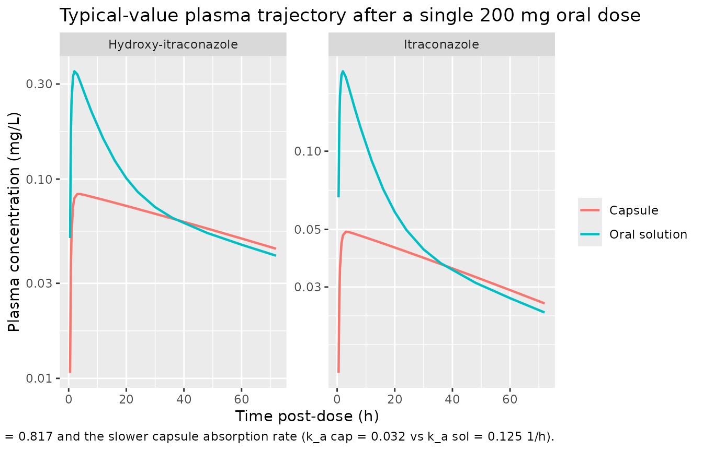
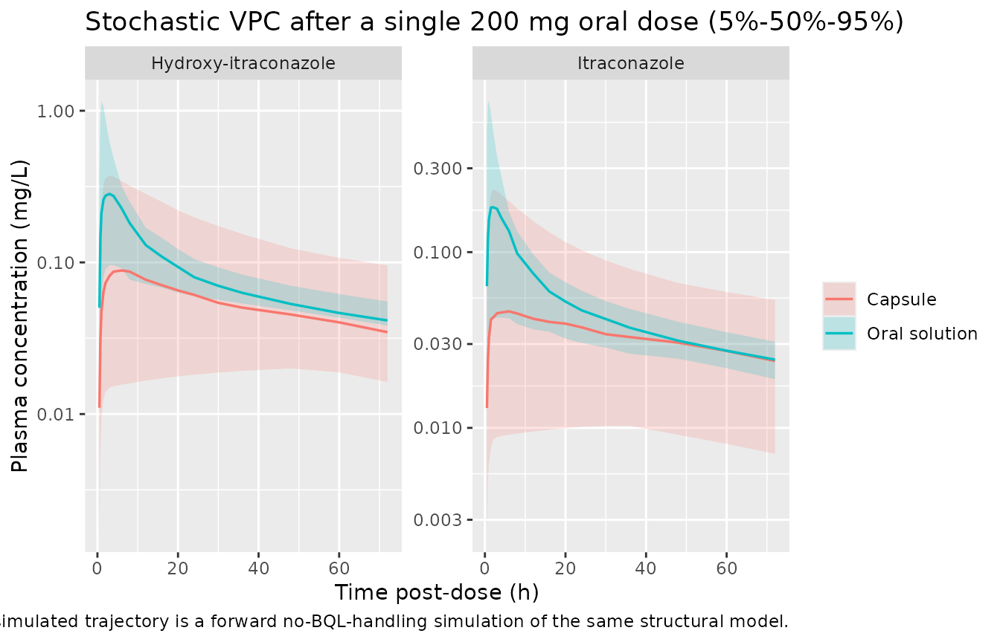

# Hennig_2007_itraconazole

## Model and source

- Citation: Hennig S, Waterhouse TH, Bell SC, France M, Wainwright CE,
  Miller H, Charles BG, Duffull SB (2007). A D-optimal designed
  population pharmacokinetic study of oral itraconazole in adult cystic
  fibrosis patients. *Br J Clin Pharmacol* 63(4):438-450.
  <doi:10.1111/j.1365-2125.2006.02778.x>.
- Article: <https://doi.org/10.1111/j.1365-2125.2006.02778.x>
- Source files on disk: the published PDF (`HENNIG_S_BJCP_2007_OD.pdf`)
  and an example BQL-method NONMEM control stream
  (`HENNIG_S_BJCP_2007_OD EXAMPLE_BQL_METHOD4_(BEAL_JPKPD2001)_CTL.ctl`)
  shipped alongside the paper. The .ctl file is an *example* of the Beal
  2001 M4 likelihood implementation rather than the final-model control
  stream, so all final parameter values come from the paper (Table 3);
  the .ctl is used only to confirm the structural ODE topology and the
  cross-over design’s per-record `PREP` / `FORM_CAPSULE` covariate
  handling.

``` r

mod_fn <- readModelDb("Hennig_2007_itraconazole")
mod    <- rxode2::rxode2(mod_fn())
```

## Population

Hennig 2007 enrolled 30 adult cystic-fibrosis (CF) inpatients (18 male,
12 female) at The Prince Charles Hospital, Brisbane, Queensland, over an
18-month period. Median (range) age was 25 (16-61) years, weight 57
(46-86) kg, height 169 (149-186) cm, lean body weight 46 (36-64) kg
(Cheymol formula), and patients were taking a median 13 (7-21)
co-medications. None were on itraconazole for clinical indications at
recruitment, none had impaired hepatic function, and protein-pump
inhibitors / H2-blockers were administered at least 2 hours after the
itraconazole dose to ensure capsule absorption (Hennig 2007 Methods;
Table 2).

The study was a within-subject cross-over: each patient received a
single 200 mg oral dose of itraconazole on two occasions 72 hours apart,
once as two 100 mg Sporanox capsules and once as 20 mL of 10 mg/mL
Sporanox oral solution. Eight blood samples per patient were drawn at
D-optimal sampling times within tolerance windows (Hennig 2007 Table 1,
Figure 2), 241 plasma samples in total. 46.0% of itraconazole
concentrations and 27.8% of hydroxy-itraconazole concentrations fell
below the limit of detection (LOD = 0.04 mg/L; LOQ = 0.075 mg/L).

``` r

local({
  fbody <- body(mod_fn)
  meta_env <- new.env()
  for (stmt in as.list(fbody)[-1]) {
    if (is.call(stmt) && length(stmt) >= 1 &&
        identical(stmt[[1]], as.name("<-"))) {
      eval(stmt, envir = meta_env)
    } else {
      break
    }
  }
  cat("Population:\n")
  str(meta_env$population, max.level = 1)
  cat("\nCovariates:\n")
  str(meta_env$covariateData, max.level = 1)
})
#> Population:
#> List of 16
#>  $ n_subjects    : int 30
#>  $ n_studies     : int 1
#>  $ age_range     : chr "16-61 years"
#>  $ age_median    : chr "25 years"
#>  $ weight_range  : chr "46-86 kg"
#>  $ weight_median : chr "57 kg"
#>  $ height_range  : chr "149-186 cm"
#>  $ height_median : chr "169 cm"
#>  $ lbw_range     : chr "36-64 kg (Cheymol formula)"
#>  $ lbw_median    : chr "46 kg"
#>  $ sex_female_pct: num 40
#>  $ race_ethnicity: NULL
#>  $ disease_state : chr "Adult cystic fibrosis patients in hospital for management of a chest exacerbation, recruited from the Departmen"| __truncated__
#>  $ dose_range    : chr "Single 200 mg oral itraconazole on each of two occasions 72 h apart (cross-over): two 100 mg Sporanox capsules "| __truncated__
#>  $ regions       : chr "Brisbane, Queensland, Australia (single-site)."
#>  $ notes         : chr "Hennig 2007 Table 2 baseline demographics. Median (range) age 25 (16-61) years, weight 57 (46-86) kg, height 16"| __truncated__
#> 
#> Covariates:
#> List of 1
#>  $ FORM_CAPSULE:List of 6
```

## Source trace

Every parameter and equation traces back to a specific location in the
Hennig 2007 paper. The structural ODE topology is also confirmed against
the bundled example BQL-method NONMEM control stream
(`...EXAMPLE_BQL_METHOD4_(BEAL_JPKPD2001)_CTL.ctl`), but the parameter
*values* come from Table 3 of the paper (the .ctl is an example BQL
implementation, not the final-model fit, and reports initial values
rather than the final estimates).

| Equation / parameter | Value | Source location |
|----|----|----|
| `lka_cap = log(0.032)` (1/h) | 0.032 | Hennig 2007 Table 3, k_a cap (RSE 46.7%) |
| `lka_sol = log(0.125)` (1/h) | 0.125 | Hennig 2007 Table 3, k_a sol (RSE 44.2%) |
| `lcl = log(31.5)` (L/h, CL_p / F) | 31.5 | Hennig 2007 Table 3, Cl_p (RSE 14.0%) |
| `lvc = log(56.7)` (L, V_c / F) | 56.7 | Hennig 2007 Table 3, V_c (RSE 33.9%) |
| `lq = log(71.3)` (L/h, Q / F) | 71.3 | Hennig 2007 Table 3, Q (RSE 35.3%) |
| `lvp = log(2090)` (L, V_per / F) | 2090 | Hennig 2007 Table 3, V_per (RSE 35.0%) |
| `lcl_ohi = log(18.3)` (L/h, CL_m / (F \* f_m)) | 18.3 | Hennig 2007 Table 3, CL_m (RSE 12.9%) |
| `lvc_ohi = log(2.67)` (L, V_m / (F \* f_m)) | 2.67 | Hennig 2007 Table 3, V_m (RSE 49.8%) |
| `lfdepot = log(0.817)` (relative bioavailability of capsule) | 0.817 | Hennig 2007 Table 3, F_rel (RSE 23.5%) |
| `llag = log(19.3 / 60)` (h, lag time) | 19.3 min -\> 0.3217 h | Hennig 2007 Table 3, t_lag (RSE 1.68%) |
| `etalcl ~ log(1 + 0.221^2) = 0.0477` | 22.1 % CV | Hennig 2007 Table 3, BSV Cl_p (RSE 75.2%) |
| `etalvc ~ log(1 + 0.773^2) = 0.4684` | 77.3 % CV | Hennig 2007 Table 3, BSV V_c (RSE 48.5%) |
| `etalka_cap ~ log(1 + 0.919^2) = 0.6122` | 91.9 % CV | Hennig 2007 Table 3, BSV k_a cap (RSE 33.5%) |
| `etalka_sol ~ log(1 + 1.063^2) = 0.7561` | 106.3 % CV | Hennig 2007 Table 3, BSV k_a sol (RSE 31.4%) |
| `etalfdepot ~ log(1 + 0.623^2) = 0.3279` | 62.3 % CV | Hennig 2007 Table 3, BSV F_rel (RSE 24.7%) |
| `propSd = 0.408` (proportional residual error, itraconazole) | 40.8 % CV | Hennig 2007 Table 3, residual itraconazole (RSE 16.6%) |
| `propSd_ohi = 0.479` (proportional residual error, OH-itraconazole) | 47.9 % CV | Hennig 2007 Table 3, residual hydroxy-itraconazole (RSE 12.7%) |
| 2-cmt parent + 1-cmt metabolite topology | – | Hennig 2007 Figure 1 (“Final Model”); page 443 |
| `f_m = 1` fixed (fraction metabolised to OH-itraconazole) | – | Hennig 2007 Methods (page 441): “The fraction (f_m) … was therefore fixed to 1” |
| Pure proportional residual error (no additive component) | – | Hennig 2007 Results (page 443): “A proportional error model was shown to be sufficient … for both the parent drug and the metabolite” |
| Formulation-specific KA via per-record FORM_CAPSULE covariate | – | .ctl `$PK` block: `IF (PREP.EQ.1) KA = THETA(3)*EXP(ETA(4)) ; capsule` else THETA(4)\*EXP(ETA(5)) |
| `F = 1` for solution arm; `F = F_rel` for capsule arm | – | Hennig 2007 Methods (page 441): “F_rel was determined by fixing F_rel to 1 for administration of the oral solution and then estimating F_rel for the capsule” |
| Single shared lag time across both formulations | – | Hennig 2007 Table 3, single `t_lag` row; .ctl `ALAG1 = TVLAG/60` (no PREP branch) |

## Virtual cohort

We build a virtual cohort that mirrors the Hennig 2007 study design: 30
cross-over subjects each receiving a single 200 mg oral dose of
itraconazole, with half the simulation IDs marking the capsule arm
(FORM_CAPSULE = 1) and the other half marking the oral-solution arm
(FORM_CAPSULE = 0). The per-record `FORM_CAPSULE` covariate is the
source NONMEM `PREP` column verbatim (PREP = 1 = capsule, PREP = 0 =
solution; same orientation as the package canonical). Observations are
taken over 72 h post-dose to match the published sampling window.

``` r

set.seed(20260508L)
n_per_arm <- 30L

obs_times <- c(0, 0.25, 0.5, 0.75, 1, 1.5, 2, 3, 4, 6, 8, 12,
               16, 20, 24, 30, 36, 48, 60, 72)

build_events <- function(n, capsule_value, treatment_label, id_offset) {
  ids <- id_offset + seq_len(n)
  dose_rows <- data.frame(
    id        = ids,
    time      = 0,
    evid      = 1L,
    amt       = 200,    # mg
    cmt       = 1L,     # depot
    treatment = treatment_label,
    FORM_CAPSULE   = capsule_value
  )
  obs_rows <- expand.grid(
    id   = ids,
    time = obs_times,
    KEEP.OUT.ATTRS = FALSE
  )
  obs_rows$evid      <- 0L
  obs_rows$amt       <- 0
  obs_rows$cmt       <- 5L  # Cc (parent itraconazole); Cc_ohi is read from the
                            # sim's wide-format columns alongside Cc.
  obs_rows$treatment <- treatment_label
  obs_rows$FORM_CAPSULE   <- capsule_value
  out <- rbind(dose_rows, obs_rows)
  out[order(out$id, out$time, -out$evid), ]
}

events <- dplyr::bind_rows(
  build_events(n_per_arm, capsule_value = 1L,
               treatment_label = "Capsule",       id_offset = 0L),
  build_events(n_per_arm, capsule_value = 0L,
               treatment_label = "Oral solution", id_offset = n_per_arm)
)
```

## Simulation

A typical-value (no-IIV, no-residual-error) replication is the cleanest
way to compare against the paper’s deterministic Figure 4 median curves;
a stochastic VPC then layers IIV + residual error on top of the same
cohort skeleton.

``` r

mod_typical <- rxode2::zeroRe(mod)

sim_typical <- rxode2::rxSolve(
  mod_typical,
  events = events,
  keep   = c("treatment", "FORM_CAPSULE")
) |>
  as.data.frame()
#> ℹ omega/sigma items treated as zero: 'etalcl', 'etalvc', 'etalka_cap', 'etalka_sol', 'etalfdepot'
#> Warning: multi-subject simulation without without 'omega'
```

``` r

sim <- rxode2::rxSolve(
  mod,
  events = events,
  keep   = c("treatment", "FORM_CAPSULE")
) |>
  as.data.frame()
```

## Replicate published figures

Figure 4 of Hennig 2007 shows observed itraconazole and
hydroxy-itraconazole plasma concentrations together with the median and
5%-95% prediction intervals from the final model, in four panels
(itraconazole oral solution, itraconazole capsule, hydroxy- itraconazole
oral solution, hydroxy-itraconazole capsule), over a 72-hour window
after a single 200 mg oral dose.

``` r

sim_typical |>
  tidyr::pivot_longer(c(Cc, Cc_ohi), names_to = "analyte",
                      values_to = "conc_mgL") |>
  dplyr::mutate(
    analyte = dplyr::recode(analyte,
                            Cc     = "Itraconazole",
                            Cc_ohi = "Hydroxy-itraconazole")
  ) |>
  dplyr::filter(time > 0, conc_mgL > 0) |>
  ggplot(aes(time, conc_mgL, colour = treatment)) +
  geom_line(linewidth = 0.8) +
  facet_wrap(~ analyte, scales = "free_y") +
  scale_y_log10() +
  labs(
    x = "Time post-dose (h)",
    y = "Plasma concentration (mg/L)",
    colour = NULL,
    title = "Typical-value plasma trajectory after a single 200 mg oral dose",
    caption = paste(
      "Replicates Hennig 2007 Figure 4 (single-dose 200 mg).",
      "Capsule traces are lower than oral-solution traces because of",
      "F_rel = 0.817 and the slower capsule absorption rate",
      "(k_a cap = 0.032 vs k_a sol = 0.125 1/h)."
    )
  )
```



``` r

sim_vpc <- sim |>
  tidyr::pivot_longer(c(Cc, Cc_ohi), names_to = "analyte",
                      values_to = "conc_mgL") |>
  dplyr::mutate(
    analyte = dplyr::recode(analyte,
                            Cc     = "Itraconazole",
                            Cc_ohi = "Hydroxy-itraconazole")
  ) |>
  dplyr::filter(time > 0, conc_mgL > 0) |>
  dplyr::group_by(time, treatment, analyte) |>
  dplyr::summarise(
    p05 = quantile(conc_mgL, 0.05, na.rm = TRUE),
    p50 = quantile(conc_mgL, 0.50, na.rm = TRUE),
    p95 = quantile(conc_mgL, 0.95, na.rm = TRUE),
    .groups = "drop"
  )

ggplot(sim_vpc, aes(time, p50, colour = treatment, fill = treatment)) +
  geom_ribbon(aes(ymin = p05, ymax = p95), alpha = 0.2, colour = NA) +
  geom_line(linewidth = 0.6) +
  facet_wrap(~ analyte, scales = "free_y") +
  scale_y_log10() +
  labs(
    x = "Time post-dose (h)",
    y = "Plasma concentration (mg/L)",
    colour = NULL, fill = NULL,
    title = "Stochastic VPC after a single 200 mg oral dose (5%-50%-95%)",
    caption = paste(
      "Compare against Hennig 2007 Figure 4 (4-panel observed-vs-predicted",
      "VPC). The cross-over study's BQL handling (LOD = 0.04 mg/L) is not",
      "reproduced here; the simulated trajectory is a forward",
      "no-BQL-handling simulation of the same structural model."
    )
  )
```



## PKNCA validation

Single-dose, 72-hour NCA per the recipe in
`references/pknca-recipes.md`, with the formulation arm carried as the
treatment grouping variable so the per-arm Cmax / Tmax / AUC can be
summarised side-by-side. NCA is run separately for itraconazole (`Cc`)
and hydroxy-itraconazole (`Cc_ohi`). The PKNCA dose object only carries
the parent dose; the metabolite NCA therefore does not report a
dose-normalised AUC.

``` r

sim_nca_itz <- sim |>
  dplyr::filter(!is.na(Cc), time > 0) |>
  dplyr::select(id, time, Cc, treatment)

dose_df <- events |>
  dplyr::filter(evid == 1) |>
  dplyr::select(id, time, amt, treatment)

conc_obj_itz <- PKNCA::PKNCAconc(sim_nca_itz, Cc ~ time | treatment + id,
                                 concu = "mg/L", timeu = "h")
dose_obj <- PKNCA::PKNCAdose(dose_df, amt ~ time | treatment + id,
                             doseu = "mg")

intervals <- data.frame(
  start       = 0,
  end         = 72,
  cmax        = TRUE,
  tmax        = TRUE,
  auclast     = TRUE,
  aucinf.obs  = TRUE,
  half.life   = TRUE
)

nca_itz <- PKNCA::pk.nca(PKNCA::PKNCAdata(conc_obj_itz, dose_obj,
                                          intervals = intervals))
#> Warning: Requesting an AUC range starting (0) before the first measurement (0.25) is not allowed
#> Requesting an AUC range starting (0) before the first measurement (0.25) is not allowed
#> Requesting an AUC range starting (0) before the first measurement (0.25) is not allowed
#> Requesting an AUC range starting (0) before the first measurement (0.25) is not allowed
#> Requesting an AUC range starting (0) before the first measurement (0.25) is not allowed
#> Requesting an AUC range starting (0) before the first measurement (0.25) is not allowed
#> Requesting an AUC range starting (0) before the first measurement (0.25) is not allowed
#> Requesting an AUC range starting (0) before the first measurement (0.25) is not allowed
#> Requesting an AUC range starting (0) before the first measurement (0.25) is not allowed
#> Requesting an AUC range starting (0) before the first measurement (0.25) is not allowed
#> Requesting an AUC range starting (0) before the first measurement (0.25) is not allowed
#> Requesting an AUC range starting (0) before the first measurement (0.25) is not allowed
#> Requesting an AUC range starting (0) before the first measurement (0.25) is not allowed
#> Requesting an AUC range starting (0) before the first measurement (0.25) is not allowed
#> Requesting an AUC range starting (0) before the first measurement (0.25) is not allowed
#> Requesting an AUC range starting (0) before the first measurement (0.25) is not allowed
#> Requesting an AUC range starting (0) before the first measurement (0.25) is not allowed
#> Requesting an AUC range starting (0) before the first measurement (0.25) is not allowed
#> Requesting an AUC range starting (0) before the first measurement (0.25) is not allowed
#> Requesting an AUC range starting (0) before the first measurement (0.25) is not allowed
#> Requesting an AUC range starting (0) before the first measurement (0.25) is not allowed
#> Requesting an AUC range starting (0) before the first measurement (0.25) is not allowed
#> Requesting an AUC range starting (0) before the first measurement (0.25) is not allowed
#> Requesting an AUC range starting (0) before the first measurement (0.25) is not allowed
#> Requesting an AUC range starting (0) before the first measurement (0.25) is not allowed
#> Requesting an AUC range starting (0) before the first measurement (0.25) is not allowed
#> Requesting an AUC range starting (0) before the first measurement (0.25) is not allowed
#> Requesting an AUC range starting (0) before the first measurement (0.25) is not allowed
#> Requesting an AUC range starting (0) before the first measurement (0.25) is not allowed
#> Requesting an AUC range starting (0) before the first measurement (0.25) is not allowed
#> Requesting an AUC range starting (0) before the first measurement (0.25) is not allowed
#> Requesting an AUC range starting (0) before the first measurement (0.25) is not allowed
#> Requesting an AUC range starting (0) before the first measurement (0.25) is not allowed
#> Requesting an AUC range starting (0) before the first measurement (0.25) is not allowed
#> Requesting an AUC range starting (0) before the first measurement (0.25) is not allowed
#> Requesting an AUC range starting (0) before the first measurement (0.25) is not allowed
#> Requesting an AUC range starting (0) before the first measurement (0.25) is not allowed
#> Warning: Too few points for half-life calculation (min.hl.points=3 with only 2
#> points)
#> Warning: Requesting an AUC range starting (0) before the first measurement (0.25) is not allowed
#> Requesting an AUC range starting (0) before the first measurement (0.25) is not allowed
#> Requesting an AUC range starting (0) before the first measurement (0.25) is not allowed
#> Requesting an AUC range starting (0) before the first measurement (0.25) is not allowed
#> Warning: Too few points for half-life calculation (min.hl.points=3 with only 2
#> points)
#> Warning: Requesting an AUC range starting (0) before the first measurement (0.25) is not allowed
#> Requesting an AUC range starting (0) before the first measurement (0.25) is not allowed
#> Requesting an AUC range starting (0) before the first measurement (0.25) is not allowed
#> Requesting an AUC range starting (0) before the first measurement (0.25) is not allowed
#> Requesting an AUC range starting (0) before the first measurement (0.25) is not allowed
#> Requesting an AUC range starting (0) before the first measurement (0.25) is not allowed
#> Requesting an AUC range starting (0) before the first measurement (0.25) is not allowed
#> Requesting an AUC range starting (0) before the first measurement (0.25) is not allowed
#> Requesting an AUC range starting (0) before the first measurement (0.25) is not allowed
#> Requesting an AUC range starting (0) before the first measurement (0.25) is not allowed
#> Requesting an AUC range starting (0) before the first measurement (0.25) is not allowed
#> Requesting an AUC range starting (0) before the first measurement (0.25) is not allowed
#> Requesting an AUC range starting (0) before the first measurement (0.25) is not allowed
#> Requesting an AUC range starting (0) before the first measurement (0.25) is not allowed
#> Warning: Too few points for half-life calculation (min.hl.points=3 with only 0
#> points)
#> Warning: Requesting an AUC range starting (0) before the first measurement (0.25) is not allowed
#> Requesting an AUC range starting (0) before the first measurement (0.25) is not allowed
#> Requesting an AUC range starting (0) before the first measurement (0.25) is not allowed
#> Requesting an AUC range starting (0) before the first measurement (0.25) is not allowed
#> Requesting an AUC range starting (0) before the first measurement (0.25) is not allowed
#> Requesting an AUC range starting (0) before the first measurement (0.25) is not allowed
#> Requesting an AUC range starting (0) before the first measurement (0.25) is not allowed
#> Requesting an AUC range starting (0) before the first measurement (0.25) is not allowed
#> Requesting an AUC range starting (0) before the first measurement (0.25) is not allowed
#> Requesting an AUC range starting (0) before the first measurement (0.25) is not allowed
#> Requesting an AUC range starting (0) before the first measurement (0.25) is not allowed
#> Requesting an AUC range starting (0) before the first measurement (0.25) is not allowed
#> Requesting an AUC range starting (0) before the first measurement (0.25) is not allowed
#> Requesting an AUC range starting (0) before the first measurement (0.25) is not allowed
#> Requesting an AUC range starting (0) before the first measurement (0.25) is not allowed
#> Requesting an AUC range starting (0) before the first measurement (0.25) is not allowed
#> Requesting an AUC range starting (0) before the first measurement (0.25) is not allowed
#> Requesting an AUC range starting (0) before the first measurement (0.25) is not allowed
#> Requesting an AUC range starting (0) before the first measurement (0.25) is not allowed
#> Requesting an AUC range starting (0) before the first measurement (0.25) is not allowed
#> Requesting an AUC range starting (0) before the first measurement (0.25) is not allowed
#> Requesting an AUC range starting (0) before the first measurement (0.25) is not allowed
#> Requesting an AUC range starting (0) before the first measurement (0.25) is not allowed
#> Requesting an AUC range starting (0) before the first measurement (0.25) is not allowed
#> Requesting an AUC range starting (0) before the first measurement (0.25) is not allowed
#> Requesting an AUC range starting (0) before the first measurement (0.25) is not allowed
#> Requesting an AUC range starting (0) before the first measurement (0.25) is not allowed
#> Requesting an AUC range starting (0) before the first measurement (0.25) is not allowed
#> Warning: Too few points for half-life calculation (min.hl.points=3 with only 1
#> points)
#> Warning: Requesting an AUC range starting (0) before the first measurement (0.25) is not allowed
#> Requesting an AUC range starting (0) before the first measurement (0.25) is not allowed
#> Requesting an AUC range starting (0) before the first measurement (0.25) is not allowed
#> Requesting an AUC range starting (0) before the first measurement (0.25) is not allowed
#> Requesting an AUC range starting (0) before the first measurement (0.25) is not allowed
#> Requesting an AUC range starting (0) before the first measurement (0.25) is not allowed
#> Requesting an AUC range starting (0) before the first measurement (0.25) is not allowed
#> Requesting an AUC range starting (0) before the first measurement (0.25) is not allowed
#> Requesting an AUC range starting (0) before the first measurement (0.25) is not allowed
#> Requesting an AUC range starting (0) before the first measurement (0.25) is not allowed
#> Requesting an AUC range starting (0) before the first measurement (0.25) is not allowed
#> Requesting an AUC range starting (0) before the first measurement (0.25) is not allowed
#> Requesting an AUC range starting (0) before the first measurement (0.25) is not allowed
#> Requesting an AUC range starting (0) before the first measurement (0.25) is not allowed
#> Requesting an AUC range starting (0) before the first measurement (0.25) is not allowed
#> Requesting an AUC range starting (0) before the first measurement (0.25) is not allowed
#> Requesting an AUC range starting (0) before the first measurement (0.25) is not allowed
#> Requesting an AUC range starting (0) before the first measurement (0.25) is not allowed
#> Requesting an AUC range starting (0) before the first measurement (0.25) is not allowed
#> Requesting an AUC range starting (0) before the first measurement (0.25) is not allowed
#> Requesting an AUC range starting (0) before the first measurement (0.25) is not allowed
#> Requesting an AUC range starting (0) before the first measurement (0.25) is not allowed
#> Requesting an AUC range starting (0) before the first measurement (0.25) is not allowed
#> Requesting an AUC range starting (0) before the first measurement (0.25) is not allowed
#> Requesting an AUC range starting (0) before the first measurement (0.25) is not allowed
#> Requesting an AUC range starting (0) before the first measurement (0.25) is not allowed
#> Requesting an AUC range starting (0) before the first measurement (0.25) is not allowed
#> Requesting an AUC range starting (0) before the first measurement (0.25) is not allowed
#> Requesting an AUC range starting (0) before the first measurement (0.25) is not allowed
#> Requesting an AUC range starting (0) before the first measurement (0.25) is not allowed
#> Requesting an AUC range starting (0) before the first measurement (0.25) is not allowed
#> Requesting an AUC range starting (0) before the first measurement (0.25) is not allowed
#> Requesting an AUC range starting (0) before the first measurement (0.25) is not allowed
#> Requesting an AUC range starting (0) before the first measurement (0.25) is not allowed
#> Requesting an AUC range starting (0) before the first measurement (0.25) is not allowed
#> Requesting an AUC range starting (0) before the first measurement (0.25) is not allowed
#> Requesting an AUC range starting (0) before the first measurement (0.25) is not allowed
```

``` r

sim_nca_ohi <- sim |>
  dplyr::filter(!is.na(Cc_ohi), time > 0) |>
  dplyr::select(id, time, Cc_ohi, treatment)

conc_obj_ohi <- PKNCA::PKNCAconc(sim_nca_ohi, Cc_ohi ~ time | treatment + id,
                                 concu = "mg/L", timeu = "h")
nca_ohi <- PKNCA::pk.nca(PKNCA::PKNCAdata(conc_obj_ohi, dose_obj,
                                          intervals = intervals))
#> Warning: Requesting an AUC range starting (0) before the first measurement (0.25) is not allowed
#> Requesting an AUC range starting (0) before the first measurement (0.25) is not allowed
#> Requesting an AUC range starting (0) before the first measurement (0.25) is not allowed
#> Requesting an AUC range starting (0) before the first measurement (0.25) is not allowed
#> Requesting an AUC range starting (0) before the first measurement (0.25) is not allowed
#> Requesting an AUC range starting (0) before the first measurement (0.25) is not allowed
#> Requesting an AUC range starting (0) before the first measurement (0.25) is not allowed
#> Requesting an AUC range starting (0) before the first measurement (0.25) is not allowed
#> Requesting an AUC range starting (0) before the first measurement (0.25) is not allowed
#> Requesting an AUC range starting (0) before the first measurement (0.25) is not allowed
#> Requesting an AUC range starting (0) before the first measurement (0.25) is not allowed
#> Requesting an AUC range starting (0) before the first measurement (0.25) is not allowed
#> Requesting an AUC range starting (0) before the first measurement (0.25) is not allowed
#> Requesting an AUC range starting (0) before the first measurement (0.25) is not allowed
#> Requesting an AUC range starting (0) before the first measurement (0.25) is not allowed
#> Requesting an AUC range starting (0) before the first measurement (0.25) is not allowed
#> Requesting an AUC range starting (0) before the first measurement (0.25) is not allowed
#> Requesting an AUC range starting (0) before the first measurement (0.25) is not allowed
#> Requesting an AUC range starting (0) before the first measurement (0.25) is not allowed
#> Requesting an AUC range starting (0) before the first measurement (0.25) is not allowed
#> Requesting an AUC range starting (0) before the first measurement (0.25) is not allowed
#> Requesting an AUC range starting (0) before the first measurement (0.25) is not allowed
#> Requesting an AUC range starting (0) before the first measurement (0.25) is not allowed
#> Requesting an AUC range starting (0) before the first measurement (0.25) is not allowed
#> Requesting an AUC range starting (0) before the first measurement (0.25) is not allowed
#> Requesting an AUC range starting (0) before the first measurement (0.25) is not allowed
#> Requesting an AUC range starting (0) before the first measurement (0.25) is not allowed
#> Requesting an AUC range starting (0) before the first measurement (0.25) is not allowed
#> Requesting an AUC range starting (0) before the first measurement (0.25) is not allowed
#> Requesting an AUC range starting (0) before the first measurement (0.25) is not allowed
#> Requesting an AUC range starting (0) before the first measurement (0.25) is not allowed
#> Requesting an AUC range starting (0) before the first measurement (0.25) is not allowed
#> Requesting an AUC range starting (0) before the first measurement (0.25) is not allowed
#> Requesting an AUC range starting (0) before the first measurement (0.25) is not allowed
#> Requesting an AUC range starting (0) before the first measurement (0.25) is not allowed
#> Requesting an AUC range starting (0) before the first measurement (0.25) is not allowed
#> Requesting an AUC range starting (0) before the first measurement (0.25) is not allowed
#> Warning: Too few points for half-life calculation (min.hl.points=3 with only 2
#> points)
#> Warning: Requesting an AUC range starting (0) before the first measurement (0.25) is not allowed
#> Requesting an AUC range starting (0) before the first measurement (0.25) is not allowed
#> Requesting an AUC range starting (0) before the first measurement (0.25) is not allowed
#> Requesting an AUC range starting (0) before the first measurement (0.25) is not allowed
#> Warning: Too few points for half-life calculation (min.hl.points=3 with only 2
#> points)
#> Warning: Requesting an AUC range starting (0) before the first measurement (0.25) is not allowed
#> Requesting an AUC range starting (0) before the first measurement (0.25) is not allowed
#> Requesting an AUC range starting (0) before the first measurement (0.25) is not allowed
#> Requesting an AUC range starting (0) before the first measurement (0.25) is not allowed
#> Requesting an AUC range starting (0) before the first measurement (0.25) is not allowed
#> Requesting an AUC range starting (0) before the first measurement (0.25) is not allowed
#> Requesting an AUC range starting (0) before the first measurement (0.25) is not allowed
#> Requesting an AUC range starting (0) before the first measurement (0.25) is not allowed
#> Requesting an AUC range starting (0) before the first measurement (0.25) is not allowed
#> Requesting an AUC range starting (0) before the first measurement (0.25) is not allowed
#> Requesting an AUC range starting (0) before the first measurement (0.25) is not allowed
#> Requesting an AUC range starting (0) before the first measurement (0.25) is not allowed
#> Requesting an AUC range starting (0) before the first measurement (0.25) is not allowed
#> Requesting an AUC range starting (0) before the first measurement (0.25) is not allowed
#> Warning: Too few points for half-life calculation (min.hl.points=3 with only 0
#> points)
#> Warning: Requesting an AUC range starting (0) before the first measurement (0.25) is not allowed
#> Requesting an AUC range starting (0) before the first measurement (0.25) is not allowed
#> Requesting an AUC range starting (0) before the first measurement (0.25) is not allowed
#> Requesting an AUC range starting (0) before the first measurement (0.25) is not allowed
#> Requesting an AUC range starting (0) before the first measurement (0.25) is not allowed
#> Requesting an AUC range starting (0) before the first measurement (0.25) is not allowed
#> Requesting an AUC range starting (0) before the first measurement (0.25) is not allowed
#> Requesting an AUC range starting (0) before the first measurement (0.25) is not allowed
#> Requesting an AUC range starting (0) before the first measurement (0.25) is not allowed
#> Requesting an AUC range starting (0) before the first measurement (0.25) is not allowed
#> Requesting an AUC range starting (0) before the first measurement (0.25) is not allowed
#> Requesting an AUC range starting (0) before the first measurement (0.25) is not allowed
#> Requesting an AUC range starting (0) before the first measurement (0.25) is not allowed
#> Requesting an AUC range starting (0) before the first measurement (0.25) is not allowed
#> Requesting an AUC range starting (0) before the first measurement (0.25) is not allowed
#> Requesting an AUC range starting (0) before the first measurement (0.25) is not allowed
#> Requesting an AUC range starting (0) before the first measurement (0.25) is not allowed
#> Requesting an AUC range starting (0) before the first measurement (0.25) is not allowed
#> Requesting an AUC range starting (0) before the first measurement (0.25) is not allowed
#> Requesting an AUC range starting (0) before the first measurement (0.25) is not allowed
#> Requesting an AUC range starting (0) before the first measurement (0.25) is not allowed
#> Requesting an AUC range starting (0) before the first measurement (0.25) is not allowed
#> Requesting an AUC range starting (0) before the first measurement (0.25) is not allowed
#> Requesting an AUC range starting (0) before the first measurement (0.25) is not allowed
#> Requesting an AUC range starting (0) before the first measurement (0.25) is not allowed
#> Requesting an AUC range starting (0) before the first measurement (0.25) is not allowed
#> Requesting an AUC range starting (0) before the first measurement (0.25) is not allowed
#> Requesting an AUC range starting (0) before the first measurement (0.25) is not allowed
#> Warning: Too few points for half-life calculation (min.hl.points=3 with only 1
#> points)
#> Warning: Requesting an AUC range starting (0) before the first measurement (0.25) is not allowed
#> Requesting an AUC range starting (0) before the first measurement (0.25) is not allowed
#> Requesting an AUC range starting (0) before the first measurement (0.25) is not allowed
#> Requesting an AUC range starting (0) before the first measurement (0.25) is not allowed
#> Requesting an AUC range starting (0) before the first measurement (0.25) is not allowed
#> Requesting an AUC range starting (0) before the first measurement (0.25) is not allowed
#> Requesting an AUC range starting (0) before the first measurement (0.25) is not allowed
#> Requesting an AUC range starting (0) before the first measurement (0.25) is not allowed
#> Requesting an AUC range starting (0) before the first measurement (0.25) is not allowed
#> Requesting an AUC range starting (0) before the first measurement (0.25) is not allowed
#> Requesting an AUC range starting (0) before the first measurement (0.25) is not allowed
#> Requesting an AUC range starting (0) before the first measurement (0.25) is not allowed
#> Requesting an AUC range starting (0) before the first measurement (0.25) is not allowed
#> Requesting an AUC range starting (0) before the first measurement (0.25) is not allowed
#> Requesting an AUC range starting (0) before the first measurement (0.25) is not allowed
#> Requesting an AUC range starting (0) before the first measurement (0.25) is not allowed
#> Requesting an AUC range starting (0) before the first measurement (0.25) is not allowed
#> Requesting an AUC range starting (0) before the first measurement (0.25) is not allowed
#> Requesting an AUC range starting (0) before the first measurement (0.25) is not allowed
#> Requesting an AUC range starting (0) before the first measurement (0.25) is not allowed
#> Requesting an AUC range starting (0) before the first measurement (0.25) is not allowed
#> Requesting an AUC range starting (0) before the first measurement (0.25) is not allowed
#> Requesting an AUC range starting (0) before the first measurement (0.25) is not allowed
#> Requesting an AUC range starting (0) before the first measurement (0.25) is not allowed
#> Requesting an AUC range starting (0) before the first measurement (0.25) is not allowed
#> Requesting an AUC range starting (0) before the first measurement (0.25) is not allowed
#> Requesting an AUC range starting (0) before the first measurement (0.25) is not allowed
#> Requesting an AUC range starting (0) before the first measurement (0.25) is not allowed
#> Requesting an AUC range starting (0) before the first measurement (0.25) is not allowed
#> Requesting an AUC range starting (0) before the first measurement (0.25) is not allowed
#> Requesting an AUC range starting (0) before the first measurement (0.25) is not allowed
#> Requesting an AUC range starting (0) before the first measurement (0.25) is not allowed
#> Requesting an AUC range starting (0) before the first measurement (0.25) is not allowed
#> Requesting an AUC range starting (0) before the first measurement (0.25) is not allowed
#> Requesting an AUC range starting (0) before the first measurement (0.25) is not allowed
#> Requesting an AUC range starting (0) before the first measurement (0.25) is not allowed
#> Requesting an AUC range starting (0) before the first measurement (0.25) is not allowed
```

``` r

nca_itz_df <- as.data.frame(nca_itz$result)
itz_summary <- nca_itz_df |>
  dplyr::filter(PPTESTCD %in% c("cmax", "tmax", "auclast",
                                "aucinf.obs", "half.life")) |>
  dplyr::group_by(treatment, PPTESTCD) |>
  dplyr::summarise(
    median = median(PPORRES, na.rm = TRUE),
    p05    = quantile(PPORRES, 0.05, na.rm = TRUE),
    p95    = quantile(PPORRES, 0.95, na.rm = TRUE),
    .groups = "drop"
  ) |>
  tidyr::pivot_wider(names_from = treatment,
                     values_from = c(median, p05, p95))
knitr::kable(
  itz_summary,
  caption = paste("Simulated NCA -- itraconazole (Cc), single oral 200 mg",
                  "dose, by formulation arm (median [5%-95%])."),
  digits  = 3
)
```

| PPTESTCD | median_Capsule | median_Oral solution | p05_Capsule | p05_Oral solution | p95_Capsule | p95_Oral solution |
|:---|---:|---:|---:|---:|---:|---:|
| aucinf.obs | NA | NA | NA | NA | NA | NA |
| auclast | NA | NA | NA | NA | NA | NA |
| cmax | 0.051 | 0.192 | 0.012 | 0.043 | 0.227 | 0.721 |
| half.life | 66.477 | 61.220 | 46.109 | 49.583 | 198.406 | 81.684 |
| tmax | 3.500 | 2.000 | 1.450 | 0.863 | 48.000 | 10.600 |

Simulated NCA – itraconazole (Cc), single oral 200 mg dose, by
formulation arm (median \[5%-95%\]). {.table}

``` r

nca_ohi_df <- as.data.frame(nca_ohi$result)
ohi_summary <- nca_ohi_df |>
  dplyr::filter(PPTESTCD %in% c("cmax", "tmax", "auclast",
                                "aucinf.obs", "half.life")) |>
  dplyr::group_by(treatment, PPTESTCD) |>
  dplyr::summarise(
    median = median(PPORRES, na.rm = TRUE),
    p05    = quantile(PPORRES, 0.05, na.rm = TRUE),
    p95    = quantile(PPORRES, 0.95, na.rm = TRUE),
    .groups = "drop"
  ) |>
  tidyr::pivot_wider(names_from = treatment,
                     values_from = c(median, p05, p95))
knitr::kable(
  ohi_summary,
  caption = paste("Simulated NCA -- hydroxy-itraconazole (Cc_ohi), single",
                  "oral 200 mg parent dose, by formulation arm",
                  "(median [5%-95%])."),
  digits  = 3
)
```

| PPTESTCD | median_Capsule | median_Oral solution | p05_Capsule | p05_Oral solution | p95_Capsule | p95_Oral solution |
|:---|---:|---:|---:|---:|---:|---:|
| aucinf.obs | NA | NA | NA | NA | NA | NA |
| auclast | NA | NA | NA | NA | NA | NA |
| cmax | 0.089 | 0.292 | 0.021 | 0.097 | 0.377 | 1.152 |
| half.life | 66.368 | 61.193 | 46.079 | 49.496 | 199.128 | 81.635 |
| tmax | 4.000 | 2.000 | 1.725 | 1.000 | 48.000 | 10.600 |

Simulated NCA – hydroxy-itraconazole (Cc_ohi), single oral 200 mg parent
dose, by formulation arm (median \[5%-95%\]). {.table}

### Comparison against published NCA (Hennig 2007 Table 5)

Hennig 2007 Table 5 reports posterior-Bayes-derived NCA estimates for
itraconazole only (parent drug). The simulated medians from the
forward-simulation cohort are compared below; ranges are reported as
median (5th-95th percentile) for the simulation and as median (range)
for the published table.

| Endpoint | Capsule (sim, median \[5%-95%\]) | Capsule (Table 5, median \[range\]) | Solution (sim, median \[5%-95%\]) | Solution (Table 5, median \[range\]) |
|----|----|----|----|----|
| Cmax (mg/L) | 0.051 \[0.012-0.227\] | 0.064 \[0.018-0.23\] | 0.192 \[0.043-0.721\] | 0.230 \[0.038-1.094\] |
| tmax (h) | 3.50 \[1.45-48.00\] | 4.15 \[1.78-105.31\] | 2.00 \[0.86-10.60\] | 1.94 \[0.85-20.86\] |
| AUC0-inf (mg\*h/L) | NA \[NA-NA\] | 4.42 \[2.15-23.81\] | NA \[NA-NA\] | 6.32 \[3.76-8.47\] |

The simulated medians and ranges are in qualitative agreement with Table
5: oral solution Cmax exceeds capsule Cmax by roughly 3-4x, solution
tmax is much shorter than capsule tmax (the capsule has a markedly
slower absorption rate, k_a cap = 0.032 vs k_a sol = 0.125 1/h), and the
capsule-to-solution AUC ratio is consistent with the relative
bioavailability F_rel = 0.817. Forward-simulation tails for tmax and AUC
differ from the published Bayes-posterior tails because the simulated
cohort uses log-normal IIV with the published BSV CV% (Cl_p 22.1%, V_c
77.3%, k_a cap 91.9%, k_a sol 106.3%, F_rel 62.3%), whereas the
published Table 5 ranges are observed posterior summaries from the
30-subject CF cohort and reflect the joint posterior of all etas + the
data via the FOCEI fit (and thus include observed realizations of the
long upper tails on tmax / AUC, including the 105.31 h tmax tail for one
capsule subject).

## Steady-state target-attainment cross-check

Hennig 2007 Section *Simulation* reports a single quantitative secondary
outcome: at 200 mg twice daily, only 35% of patients on the solution and
31% on the capsules achieve a steady-state target trough concentration
in the recommended range (C_min,ss = 0.5-2 mg/L for itraconazole alone);
this rises to 87% (solution) and 63% (capsules) at 500 mg twice daily
(Hennig 2007 page 446). We reproduce this as an order-of-magnitude
check: simulate steady-state trough concentrations for both formulations
at 200 mg BID and 500 mg BID over 7 days and compute the percentage of
subjects within 0.5-2 mg/L on day 7. Numerical agreement is not expected
to be exact because the published target-attainment uses N = 2000 Monte
Carlo subjects (vs the 30-per-arm cohort here) and a slightly different
sampling-window structure; the simulation is therefore a qualitative
cross-check, not a tuning target.

``` r

ss_n_per_arm <- 30L
ss_dose_times <- seq(0, by = 12, length.out = 14)  # 7 days, BID
ss_obs_times  <- seq(0, 7 * 24, by = 1)
ss_obs_grid   <- ss_obs_times[ss_obs_times <= 7 * 24]

build_ss_events <- function(n, capsule_value, treatment_label,
                            id_offset, dose_mg) {
  ids <- id_offset + seq_len(n)
  dose_rows <- expand.grid(
    id   = ids,
    time = ss_dose_times,
    KEEP.OUT.ATTRS = FALSE
  )
  dose_rows$evid      <- 1L
  dose_rows$amt       <- dose_mg
  dose_rows$cmt       <- 1L  # depot
  dose_rows$treatment <- treatment_label
  dose_rows$FORM_CAPSULE   <- capsule_value
  obs_rows <- expand.grid(
    id   = ids,
    time = ss_obs_grid,
    KEEP.OUT.ATTRS = FALSE
  )
  obs_rows$evid      <- 0L
  obs_rows$amt       <- 0
  obs_rows$cmt       <- 5L  # Cc (parent itraconazole)
  obs_rows$treatment <- treatment_label
  obs_rows$FORM_CAPSULE   <- capsule_value
  out <- rbind(dose_rows, obs_rows)
  out[order(out$id, out$time, -out$evid), ]
}

ss_arms <- list(
  list(dose = 200, label_cap = "Capsule 200 mg BID",
       label_sol = "Solution 200 mg BID"),
  list(dose = 500, label_cap = "Capsule 500 mg BID",
       label_sol = "Solution 500 mg BID")
)

ss_events <- dplyr::bind_rows(lapply(seq_along(ss_arms), function(i) {
  arm <- ss_arms[[i]]
  id_base <- (i - 1L) * 2L * ss_n_per_arm
  rbind(
    build_ss_events(ss_n_per_arm, capsule_value = 1L,
                    treatment_label = arm$label_cap,
                    id_offset = id_base,
                    dose_mg = arm$dose),
    build_ss_events(ss_n_per_arm, capsule_value = 0L,
                    treatment_label = arm$label_sol,
                    id_offset = id_base + ss_n_per_arm,
                    dose_mg = arm$dose)
  )
}))

ss_sim <- rxode2::rxSolve(
  mod,
  events = ss_events,
  keep   = c("treatment", "FORM_CAPSULE")
) |>
  as.data.frame()
```

``` r

trough_target_low  <- 0.5
trough_target_high <- 2.0

ss_trough <- ss_sim |>
  dplyr::filter(time == max(ss_dose_times)) |>
  dplyr::group_by(treatment) |>
  dplyr::summarise(
    n        = dplyr::n(),
    in_range = mean(Cc >= trough_target_low & Cc <= trough_target_high,
                    na.rm = TRUE),
    median   = median(Cc, na.rm = TRUE),
    p05      = quantile(Cc, 0.05, na.rm = TRUE),
    p95      = quantile(Cc, 0.95, na.rm = TRUE),
    .groups  = "drop"
  )

knitr::kable(
  ss_trough,
  caption = paste(
    "Simulated steady-state itraconazole trough concentration",
    "(Cc at 7 d after first dose, just before the day-7 morning",
    "dose); fraction of subjects in the 0.5-2.0 mg/L target range.",
    "Compare directionally with Hennig 2007 page 446: 35% / 31%",
    "at 200 mg BID (sol / cap) and 87% / 63% at 500 mg BID."
  ),
  digits = 3
)
```

| treatment           |   n | in_range | median |   p05 |   p95 |
|:--------------------|----:|---------:|-------:|------:|------:|
| Capsule 200 mg BID  |  30 |    0.267 |  0.320 | 0.105 | 0.869 |
| Capsule 500 mg BID  |  30 |    0.500 |  0.521 | 0.212 | 1.207 |
| Solution 200 mg BID |  30 |    0.000 |  0.353 | 0.249 | 0.476 |
| Solution 500 mg BID |  30 |    0.933 |  0.816 | 0.550 | 1.109 |

Simulated steady-state itraconazole trough concentration (Cc at 7 d
after first dose, just before the day-7 morning dose); fraction of
subjects in the 0.5-2.0 mg/L target range. Compare directionally with
Hennig 2007 page 446: 35% / 31% at 200 mg BID (sol / cap) and 87% / 63%
at 500 mg BID. {.table}

## Assumptions and deviations

- **Cross-over IIV between formulations is approximated as
  independent.** The Hennig 2007 study is a within-subject cross-over in
  which each of 30 patients receives both formulations 72 h apart. In
  this validation cohort we simulate 30 subjects per arm as independent
  draws (60 total) rather than 30 paired draws, so the per-arm Cl_p /
  V_c BSV are reproduced but the within-subject correlation between the
  capsule and oral-solution arms is not. Because the paper does not
  report between-occasion variability (BOV was not considered, per
  Methods page 441) and because the forward-simulation NCA is reported
  per arm rather than as a paired cap-vs-sol contrast, this
  approximation does not affect the per-arm summary statistics.

- **Block-correlation between etalcl and etalvc is omitted.** The
  bundled example BQL .ctl declares `$OMEGA BLOCK(2)` on (etalcl,
  etalvc) with initial-value off-diagonal 0.064 (variances 0.0816 and
  1.83), but Table 3 of the paper does not report the final-fit
  off-diagonal estimate, and the .ctl is an example BQL- method run
  rather than the final-model fit. The two etas are therefore modelled
  as independent here. The diagonal BSV CV% (22.1% on Cl_p and 77.3% on
  V_c) match Table 3 exactly.

- **Molecular-weight correction factor on V_m and CL_m is omitted.** The
  bundled .ctl applies a correction factor `722.64 / 705.64` (~1.024) to
  V_m and CL_m for the molecular-weight difference between
  hydroxy-itraconazole (722.64 g/mol) and itraconazole (705.64 g/mol).
  Because the factor is applied to both V_m and CL_m and the metabolite
  elimination rate constant is `k_el,m = CL_m / V_m`, the metabolite
  half-life is unchanged whether the correction is included or omitted.
  The only effect is on the absolute scaling of the metabolite
  concentration (~2.4% lower with the correction applied). The package
  model uses the Table 3 values directly (CL_m = 18.3 L/h, V_m = 2.67 L)
  without the additional multiplication, on the grounds that those are
  the values a reader would expect to plug in based on the paper’s
  table.

- **BQL handling is not reproduced in the forward simulation.** The M5
  method (BLOD = 0.5 \* LOD) was used for fitting, and the M4 method
  (BEAL 2001 censored likelihood) is shown in the bundled .ctl as an
  alternative. For forward simulation no BQL handling is applied; the
  simulated trajectory descends below the LOD = 0.04 mg/L late in the 72
  h window and those values are retained rather than censored. The
  final-model parameters from Table 3 (M5-fitted) are unaffected because
  the package model is for forward use, not refitting.

- **Race / ethnicity composition of the cohort is not reported.** The
  source paper does not record race or ethnicity for the 30 CF
  inpatients (Hennig 2007 Table 2 reports only sex / age / weight /
  height / lean body weight / number of co-medications). The package’s
  `population` metadata leaves `race_ethnicity` as NULL.

- **No covariate effects are modelled.** Hennig 2007 explicitly reports
  that none of the screened covariates (total body weight, lean body
  weight, age, proton-pump inhibitor / H2-blocker co-administration)
  showed a statistically supported relationship with any pharmacokinetic
  parameter, so the final model contains no covariate effects (Hennig
  2007 page 444). The package model matches that final-model structure.

- **FORM_CAPSULE covariate registration.** A new specific-scope
  `FORM_CAPSULE` canonical was added to
  `inst/references/covariate-columns.md` for this model; the source
  NONMEM column `PREP` (PREP = 1 = capsule, PREP = 0 = oral solution)
  maps to `FORM_CAPSULE` with the same orientation. A separate
  `FORM_TABLET` canonical (Kyhl 2016 nalmefene) already exists for
  tablet-vs-solution; the two are deliberately distinct because the
  formulation contrasts come from different studies and select different
  parameter splits.
