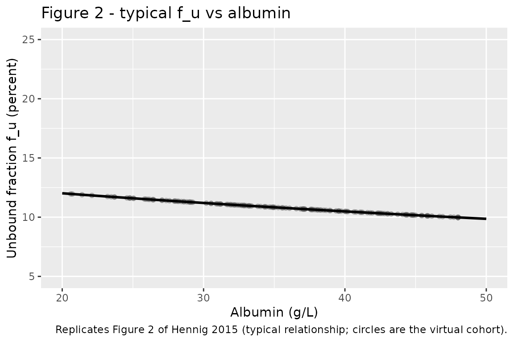
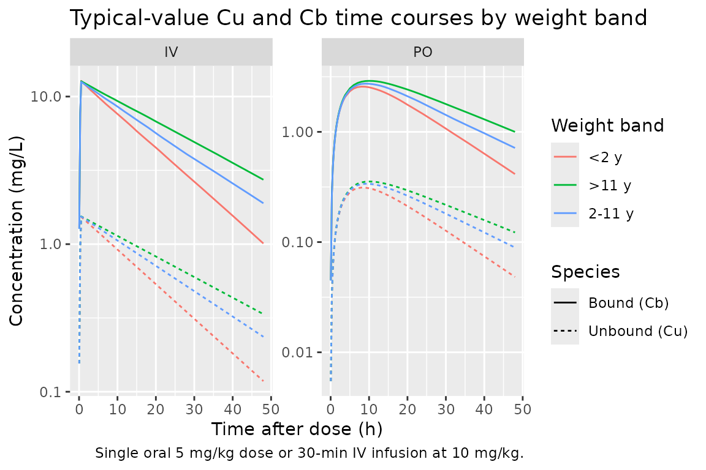
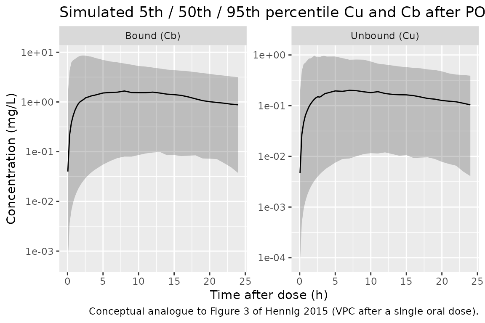

# Hennig_2015_phenytoin

## Model and source

- Citation: Hennig S, Norris R, Tu Q, van Breda K, Riney K, Foster K,
  Lister B, Charles B. Population Pharmacokinetics of Phenytoin in
  Critically Ill Children. J Clin Pharmacol. 2015;55(3):355-364.
  <doi:10.1002/jcph.417>
- Description: One-compartment population PK model for phenytoin in
  critically ill children with a linear partition coefficient describing
  protein binding to albumin (Hennig 2015).
- Article: <https://doi.org/10.1002/jcph.417>

Hennig and colleagues studied 32 critically ill children admitted to the
paediatric intensive care unit at Mater Children’s Hospital, Brisbane,
Australia, between November 2006 and October 2009. The model jointly
describes protein-unbound (Cu) and protein-bound (Cb) phenytoin plasma
concentrations using a one-compartment disposition for unbound drug
coupled with a separate “plasma” compartment that, via a linear
partition coefficient PUB, reproduces the bound concentration measured
in plasma. The structural model and final parameter equations come from
Hennig 2015 Figure 1 (compartment diagram) and Table 2 (final-model
parameter estimates).

## Population

The study cohort comprised 32 children (21 boys, 11 girls; 34 percent
female) aged 0.08 to 17 years (mean 6.9, SD 5.9) and weighing 4.0 to
80.0 kg (mean 27.9, SD 21.2). Phenytoin was given for prevention or
control of seizures; underlying etiologies included acute brain injury,
hypoxic-ischemic encephalopathy, traumatic and infective brain injury,
brain tumour, and longstanding structural abnormalities such as cerebral
palsy. Doses were predominantly oral (80.5 percent of administrations,
via nasogastric or transpyloric tube using a 30 mg/5 mL pediatric
suspension) with IV infusions making up the remainder (100 mg/2 mL
ampoules). Mean per-dose amounts were 5.4 mg/kg IV (range 1.7 to 22.0)
and 3.3 mg/kg PO (range 0.7 to 10.0). Serum albumin ranged from 11.0 to
48.0 g/L (mean 35.0, SD 9.3) and changed during the study in 70 percent
of patients with mean absolute change of 26 percent (range 2 to 54
percent). A total of 292 paired phenytoin concentrations (146 unbound +
146 bound) were available. Source: Hennig 2015 Table 1 and Methods
Patients-and-Data-Collection (p356).

The same information is available programmatically via the model’s
`population` metadata.

``` r

mod <- readModelDb("Hennig_2015_phenytoin")
str(rxode2::rxode(mod)$population)
#> ℹ parameter labels from comments will be replaced by 'label()'
#> List of 12
#>  $ n_subjects    : int 32
#>  $ n_studies     : int 1
#>  $ age_range     : chr "0.08-17 years (1 month to 17 years)"
#>  $ age_median    : chr "mean 6.9 years (SD 5.9)"
#>  $ weight_range  : chr "4.0-80.0 kg"
#>  $ weight_median : chr "mean 27.9 kg (SD 21.2)"
#>  $ sex_female_pct: num 34.4
#>  $ race_ethnicity: chr "Not reported"
#>  $ disease_state : chr "Critically ill children admitted to a paediatric intensive care unit and treated with phenytoin for prevention "| __truncated__
#>  $ dose_range    : chr "IV 1.7-22.0 mg/kg per dose (mean 5.4); PO 0.7-10.0 mg/kg per dose (mean 3.3). 19.5 percent of doses IV, 80.5 pe"| __truncated__
#>  $ regions       : chr "Single-centre paediatric intensive care unit at Mater Children's Hospital, Brisbane, Queensland, Australia (Nov"| __truncated__
#>  $ notes         : chr "Hennig 2015 Table 1 baseline demographics. 11 patients aged <2 years, 11 patients 2-11 years, 10 patients >11 y"| __truncated__
```

## Source trace

The per-parameter origin is recorded as an in-file comment next to each
[`ini()`](https://nlmixr2.github.io/rxode2/reference/ini.html) entry in
`inst/modeldb/specificDrugs/Hennig_2015_phenytoin.R`. The table below
collects the same information in one place for review.

| Equation / parameter | Value | Source location |
|----|----|----|
| `lcl` (CL, L/h/70 kg) | 14.0 | Table 2 final-model column |
| `lvc` (V2, L/70 kg) | 447 | Table 2 final-model column |
| `lvp` (V3, L/70 kg, fixed) | 2.8 | Table 2 final-model column; equal to plasma albumin volume in 70 kg adult |
| `lka` (Ka, 1/h, fixed) | 0.225 | Methods p359 (sensitivity analysis) and Table 2 |
| `lpub` (PUB, dimensionless) | 8.23 | Table 2 final-model column |
| `lteq` (Teq, h, fixed) | 1.1e-4 (= 0.4 s) | Methods p358 |
| `logitfdepot` (logit F) | logit(0.63) | Table 2 final-model column (F = 63 percent) |
| `e_wt_cl` (allometric exponent on CL) | 0.75 (fixed) | Methods p357 / final equations p360 |
| `e_wt_vc` (allometric exponent on V2) | 1 (fixed) | Final equations p360 |
| `e_wt_vp` (allometric exponent on V3) | 1 (fixed) | Final equations p360 |
| `e_alb_pub` (slope of PUB on (ALB - 35)) | 0.00737 per g/L | Table 2 and equation p360 |
| `etalcl` (omega^2 IIV CL) | 0.2275 | Table 2 IIV CL = 47.7 percent CV |
| `etalvc` (omega^2 IIV V2) | 0.7174 | Table 2 IIV V2 = 84.7 percent CV |
| `etalka` (omega^2 IIV ka) | 3.27 | Table 2 IIV ka = 180.8 percent CV |
| `etalpub` (omega^2 IIV PUB) | 0.0098 | Table 2 IIV PUB = 9.9 percent CV |
| `etalogitfdepot` (omega^2 logit-F) | 3.30 | NONMEM run186 OMEGA(3,3); Table 2 effective IIV F = 87.7 percent CV via the propagation `IIV_F (CV) ~ sqrt(F * (1 - F)) * omega_F * 100` |
| `propSd_Cu` (proportional residual SD on Cu) | 0.221 | sqrt(0.136^2 + 0.174^2): assay error PHYu 13.6 percent + common prop 17.4 percent (Table 2) |
| `propSd_Cb` (proportional residual SD on Cb) | 0.202 | sqrt(0.103^2 + 0.174^2): assay error PHYb 10.3 percent + common prop 17.4 percent (Table 2) |
| ODE: `d/dt(depot)`, `d/dt(central)`, `d/dt(peripheral1)` | n/a | Figure 1 compartment diagram; Methods Pharmacokinetic Modeling p357 |
| Observation: `Cu = central / vc`, `Cb = (peripheral1 / vp) * pub` | n/a | Figure 1 caption |
| `f_u = 1 / (1 + PUB)` | n/a (derived) | p360, used to convert PUB to unbound fraction |

## Virtual cohort

Original observed data are not publicly available. The figures below use
a virtual paediatric population whose covariate distributions
approximate the published trial demographics (Hennig 2015 Table 1).

``` r

set.seed(20150216)

n_per_band <- 60L  # 180 subjects total, sufficient for stable percentiles

# Three weight / age bands matching Hennig 2015 Table 1 distribution
# (11 patients <2 y, 11 patients 2-11 y, 10 patients >11 y; 32 total)
make_band <- function(n, age_lo, age_hi, wt_lo, wt_hi, label, id_offset) {
  tibble::tibble(
    id    = id_offset + seq_len(n),
    AGE   = runif(n, age_lo, age_hi),
    WT    = runif(n, wt_lo, wt_hi),
    SEXF  = rbinom(n, 1, 0.344),
    ALB   = pmin(48, pmax(11, rnorm(n, mean = 35, sd = 9.3))),
    band  = label
  )
}

cohort <- dplyr::bind_rows(
  make_band(n_per_band, 0.08, 2,  4,  12, "<2 y",     id_offset =     0L),
  make_band(n_per_band, 2,    11, 12, 40, "2-11 y",   id_offset =  1000L),
  make_band(n_per_band, 11,   17, 40, 80, ">11 y",    id_offset =  2000L)
)

summary(cohort[, c("AGE", "WT", "ALB")])
#>       AGE                WT              ALB       
#>  Min.   : 0.0949   Min.   : 4.132   Min.   :11.00  
#>  1st Qu.: 1.4754   1st Qu.: 9.613   1st Qu.:28.56  
#>  Median : 6.2076   Median :26.925   Median :34.99  
#>  Mean   : 7.1150   Mean   :31.732   Mean   :34.64  
#>  3rd Qu.:12.5645   3rd Qu.:52.022   3rd Qu.:42.02  
#>  Max.   :16.7351   Max.   :79.545   Max.   :48.00
table(cohort$band)
#> 
#>   <2 y  >11 y 2-11 y 
#>     60     60     60
```

## Replicate Figure 2 - unbound fraction vs albumin

Figure 2 of Hennig 2015 plots the model-predicted unbound fraction
(percent) against serum albumin concentration. The relationship is
deterministic given the typical PUB and the linear ALB effect:

``` r

alb_grid <- seq(20, 50, by = 0.5)
pub_typ  <- 8.23 * (1 + 0.00737 * (alb_grid - 35))
fu_pct   <- 100 / (1 + pub_typ)

# Overlay with the cohort's individual fu values to show population spread
cohort_fu <- cohort |>
  dplyr::mutate(
    pub_i = 8.23 * (1 + 0.00737 * (ALB - 35)),
    fu_i  = 100 / (1 + pub_i)
  )

ggplot() +
  geom_point(data = cohort_fu, aes(ALB, fu_i),
             colour = "grey40", alpha = 0.4) +
  geom_line(data = data.frame(ALB = alb_grid, fu = fu_pct),
            aes(ALB, fu), linewidth = 1) +
  scale_y_continuous(limits = c(5, 25)) +
  scale_x_continuous(limits = c(20, 50)) +
  labs(x = "Albumin (g/L)", y = "Unbound fraction f_u (percent)",
       title = "Figure 2 - typical f_u vs albumin",
       caption = "Replicates Figure 2 of Hennig 2015 (typical relationship; circles are the virtual cohort).")
#> Warning: Removed 14 rows containing missing values or values outside the scale range
#> (`geom_point()`).
```



At the reference albumin 35 g/L, typical PUB = 8.23 and
`f_u = 1/(1+8.23) = 0.108`, matching the paper-reported mean unbound
fraction 0.12 within the sample-to-sample variability.

## Single-dose simulations

The published study contributed paired Cu / Cb concentrations from
intermittent therapeutic-drug-monitoring samples after multiple doses;
raw single-dose profiles were not reported. To exercise the model and
provide an NCA-amenable concentration-time grid, this vignette simulates
a single dose under each route at a representative pediatric
milligram-per-kilogram dose within the published range.

``` r

build_events <- function(cohort, route = c("PO", "IV"), dose_mg_per_kg) {
  route <- match.arg(route)
  obs_grid <- c(seq(0.05, 4, by = 0.25), seq(5, 24, by = 1),
                seq(28, 72, by = 4))
  # rxode2 requires cmt on observation rows to identify which output to record;
  # it returns Cu and Cb in the output frame regardless. Use Cu here.
  obs <- tibble::tibble(id = cohort$id) |>
    tidyr::crossing(time = obs_grid) |>
    dplyr::mutate(amt = 0, evid = 0, cmt = "Cu", rate = 0)
  dose <- cohort |>
    dplyr::transmute(
      id   = id,
      time = 0,
      amt  = WT * dose_mg_per_kg,
      evid = 1,
      cmt  = if (route == "PO") "depot" else "central",
      rate = if (route == "PO") 0 else WT * dose_mg_per_kg / 0.5  # 30 min IV
    )
  dplyr::bind_rows(dose, obs) |>
    dplyr::arrange(id, time, dplyr::desc(evid)) |>
    dplyr::left_join(cohort, by = "id") |>
    dplyr::mutate(route = route)
}

events_po <- build_events(cohort, route = "PO", dose_mg_per_kg = 5)
events_iv <- build_events(cohort, route = "IV", dose_mg_per_kg = 10)

stopifnot(!anyDuplicated(unique(events_po[, c("id", "time", "evid")])))
stopifnot(!anyDuplicated(unique(events_iv[, c("id", "time", "evid")])))
```

``` r

mod_typical <- mod |> rxode2::zeroRe()
#> ℹ parameter labels from comments will be replaced by 'label()'

sim_po_typ <- rxode2::rxSolve(
  mod_typical,
  events = events_po,
  keep   = c("band", "WT", "ALB", "route")
) |> as.data.frame()
#> ℹ omega/sigma items treated as zero: 'etalcl', 'etalvc', 'etalka', 'etalpub', 'etalogitfdepot'
#> Warning: multi-subject simulation without without 'omega'

sim_iv_typ <- rxode2::rxSolve(
  mod_typical,
  events = events_iv,
  keep   = c("band", "WT", "ALB", "route")
) |> as.data.frame()
#> ℹ omega/sigma items treated as zero: 'etalcl', 'etalvc', 'etalka', 'etalpub', 'etalogitfdepot'
#> Warning: multi-subject simulation without without 'omega'

sim_typ <- dplyr::bind_rows(sim_po_typ, sim_iv_typ)
```

### Typical-value Cu and Cb time courses by weight band

``` r

sim_typ |>
  dplyr::filter(time <= 48) |>
  dplyr::group_by(route, band, time) |>
  dplyr::summarise(
    Cu_med = median(Cu, na.rm = TRUE),
    Cb_med = median(Cb, na.rm = TRUE),
    .groups = "drop"
  ) |>
  tidyr::pivot_longer(c(Cu_med, Cb_med),
                      names_to = "species", values_to = "conc") |>
  dplyr::mutate(species = dplyr::recode(species,
                                        Cu_med = "Unbound (Cu)",
                                        Cb_med = "Bound (Cb)")) |>
  ggplot(aes(time, conc, colour = band, linetype = species)) +
  geom_line() +
  facet_wrap(~ route, scales = "free_y") +
  scale_y_log10() +
  labs(x = "Time after dose (h)", y = "Concentration (mg/L)",
       colour = "Weight band", linetype = "Species",
       title = "Typical-value Cu and Cb time courses by weight band",
       caption = "Single oral 5 mg/kg dose or 30-min IV infusion at 10 mg/kg.")
```



The bound : unbound ratio at any time after rapid equilibration is
approximately the typical PUB (8.23 at ALB = 35 g/L), reproducing the
paper description (p360) that “on average 8.23 times more PHY bound to
plasma protein than existed in the unbound state.”

## Stochastic simulation - VPC-style summaries

``` r

sim_po <- rxode2::rxSolve(
  mod,
  events = events_po,
  keep   = c("band", "WT", "ALB", "route")
) |> as.data.frame()
#> ℹ parameter labels from comments will be replaced by 'label()'
```

``` r

sim_po |>
  dplyr::filter(time <= 24, !is.na(Cu), !is.na(Cb)) |>
  dplyr::group_by(time) |>
  dplyr::summarise(
    Cu_05 = quantile(Cu, 0.05, na.rm = TRUE),
    Cu_50 = quantile(Cu, 0.50, na.rm = TRUE),
    Cu_95 = quantile(Cu, 0.95, na.rm = TRUE),
    Cb_05 = quantile(Cb, 0.05, na.rm = TRUE),
    Cb_50 = quantile(Cb, 0.50, na.rm = TRUE),
    Cb_95 = quantile(Cb, 0.95, na.rm = TRUE),
    .groups = "drop"
  ) |>
  tidyr::pivot_longer(-time,
                      names_to  = c("species", "pct"),
                      names_sep = "_",
                      values_to = "value") |>
  tidyr::pivot_wider(names_from = pct, values_from = value) |>
  dplyr::mutate(species = dplyr::recode(species,
                                        Cu = "Unbound (Cu)",
                                        Cb = "Bound (Cb)")) |>
  ggplot(aes(time, `50`)) +
  geom_ribbon(aes(ymin = `05`, ymax = `95`), alpha = 0.25) +
  geom_line() +
  facet_wrap(~ species, scales = "free_y") +
  scale_y_log10() +
  labs(x = "Time after dose (h)", y = "Concentration (mg/L)",
       title = "Simulated 5th / 50th / 95th percentile Cu and Cb after PO 5 mg/kg",
       caption = "Conceptual analogue to Figure 3 of Hennig 2015 (VPC after a single oral dose).")
```



## PKNCA validation

PKNCA is run separately on Cu and Cb from the single-dose oral
simulation. Hennig 2015 does not report dose-stratified NCA values (it
is a TDM-style population PK paper rather than a dose-ranging study), so
the table below reports the simulated NCA for documentation rather than
for direct numerical comparison.

``` r

nca_input <- sim_po |>
  dplyr::filter(time > 0, !is.na(Cu), !is.na(Cb)) |>
  dplyr::select(id, time, Cu, Cb, band)

dose_df <- events_po |>
  dplyr::filter(evid == 1) |>
  dplyr::select(id, time, amt, band)

conc_obj_cu <- PKNCA::PKNCAconc(
  nca_input |> dplyr::transmute(id, time, Cc = Cu, band),
  Cc ~ time | band + id,
  concu = "mg/L", timeu = "h"
)
#> Warning in assert_conc(conc, any_missing_conc = any_missing_conc): Negative
#> concentrations found
conc_obj_cb <- PKNCA::PKNCAconc(
  nca_input |> dplyr::transmute(id, time, Cc = Cb, band),
  Cc ~ time | band + id,
  concu = "mg/L", timeu = "h"
)
#> Warning in assert_conc(conc, any_missing_conc = any_missing_conc): Negative
#> concentrations found
dose_obj <- PKNCA::PKNCAdose(dose_df, amt ~ time | band + id, doseu = "mg")

intervals <- data.frame(
  start      = 0,
  end        = Inf,
  cmax       = TRUE,
  tmax       = TRUE,
  aucinf.obs = TRUE,
  half.life  = TRUE
)

nca_cu <- PKNCA::pk.nca(PKNCA::PKNCAdata(conc_obj_cu, dose_obj,
                                         intervals = intervals))
#> Warning: Requesting an AUC range starting (0) before the first measurement
#> (0.05) is not allowed
#> Warning: Requesting an AUC range starting (0) before the first measurement (0.05) is not allowed
#> Requesting an AUC range starting (0) before the first measurement (0.05) is not allowed
#> Requesting an AUC range starting (0) before the first measurement (0.05) is not allowed
#> Requesting an AUC range starting (0) before the first measurement (0.05) is not allowed
#> Requesting an AUC range starting (0) before the first measurement (0.05) is not allowed
#> Requesting an AUC range starting (0) before the first measurement (0.05) is not allowed
#> Requesting an AUC range starting (0) before the first measurement (0.05) is not allowed
#> Requesting an AUC range starting (0) before the first measurement (0.05) is not allowed
#> Requesting an AUC range starting (0) before the first measurement (0.05) is not allowed
#> Warning in assert_conc(conc = conc): Negative concentrations found
#> Warning in assert_conc(conc, any_missing_conc = any_missing_conc): Negative
#> concentrations found
#> Warning in assert_conc(conc, any_missing_conc = any_missing_conc): Negative
#> concentrations found
#> Warning in assert_conc(conc, any_missing_conc = any_missing_conc): Negative
#> concentrations found
#> Warning in assert_conc(conc, any_missing_conc = any_missing_conc): Negative
#> concentrations found
#> Warning in assert_conc(conc, any_missing_conc = any_missing_conc): Negative
#> concentrations found
#> Warning in log(data$conc): NaNs produced
#> Warning in assert_conc(conc, any_missing_conc = any_missing_conc): Negative
#> concentrations found
#> Warning: Requesting an AUC range starting (0) before the first measurement (0.05) is not allowed
#> Requesting an AUC range starting (0) before the first measurement (0.05) is not allowed
#> Requesting an AUC range starting (0) before the first measurement (0.05) is not allowed
#> Requesting an AUC range starting (0) before the first measurement (0.05) is not allowed
#> Requesting an AUC range starting (0) before the first measurement (0.05) is not allowed
#> Requesting an AUC range starting (0) before the first measurement (0.05) is not allowed
#> Requesting an AUC range starting (0) before the first measurement (0.05) is not allowed
#> Requesting an AUC range starting (0) before the first measurement (0.05) is not allowed
#> Requesting an AUC range starting (0) before the first measurement (0.05) is not allowed
#> Requesting an AUC range starting (0) before the first measurement (0.05) is not allowed
#> Requesting an AUC range starting (0) before the first measurement (0.05) is not allowed
#> Requesting an AUC range starting (0) before the first measurement (0.05) is not allowed
#> Requesting an AUC range starting (0) before the first measurement (0.05) is not allowed
#> Requesting an AUC range starting (0) before the first measurement (0.05) is not allowed
#> Requesting an AUC range starting (0) before the first measurement (0.05) is not allowed
#> Requesting an AUC range starting (0) before the first measurement (0.05) is not allowed
#> Requesting an AUC range starting (0) before the first measurement (0.05) is not allowed
#> Requesting an AUC range starting (0) before the first measurement (0.05) is not allowed
#> Requesting an AUC range starting (0) before the first measurement (0.05) is not allowed
#> Requesting an AUC range starting (0) before the first measurement (0.05) is not allowed
#> Requesting an AUC range starting (0) before the first measurement (0.05) is not allowed
#> Requesting an AUC range starting (0) before the first measurement (0.05) is not allowed
#> Requesting an AUC range starting (0) before the first measurement (0.05) is not allowed
#> Requesting an AUC range starting (0) before the first measurement (0.05) is not allowed
#> Requesting an AUC range starting (0) before the first measurement (0.05) is not allowed
#> Requesting an AUC range starting (0) before the first measurement (0.05) is not allowed
#> Requesting an AUC range starting (0) before the first measurement (0.05) is not allowed
#> Requesting an AUC range starting (0) before the first measurement (0.05) is not allowed
#> Requesting an AUC range starting (0) before the first measurement (0.05) is not allowed
#> Requesting an AUC range starting (0) before the first measurement (0.05) is not allowed
#> Requesting an AUC range starting (0) before the first measurement (0.05) is not allowed
#> Warning: Too few points for half-life calculation (min.hl.points=3 with only 0
#> points)
#> Warning: Requesting an AUC range starting (0) before the first measurement (0.05) is not allowed
#> Requesting an AUC range starting (0) before the first measurement (0.05) is not allowed
#> Requesting an AUC range starting (0) before the first measurement (0.05) is not allowed
#> Warning: Too few points for half-life calculation (min.hl.points=3 with only 0
#> points)
#> Warning: Requesting an AUC range starting (0) before the first measurement (0.05) is not allowed
#> Requesting an AUC range starting (0) before the first measurement (0.05) is not allowed
#> Requesting an AUC range starting (0) before the first measurement (0.05) is not allowed
#> Requesting an AUC range starting (0) before the first measurement (0.05) is not allowed
#> Requesting an AUC range starting (0) before the first measurement (0.05) is not allowed
#> Requesting an AUC range starting (0) before the first measurement (0.05) is not allowed
#> Requesting an AUC range starting (0) before the first measurement (0.05) is not allowed
#> Requesting an AUC range starting (0) before the first measurement (0.05) is not allowed
#> Requesting an AUC range starting (0) before the first measurement (0.05) is not allowed
#> Requesting an AUC range starting (0) before the first measurement (0.05) is not allowed
#> Requesting an AUC range starting (0) before the first measurement (0.05) is not allowed
#> Requesting an AUC range starting (0) before the first measurement (0.05) is not allowed
#> Requesting an AUC range starting (0) before the first measurement (0.05) is not allowed
#> Requesting an AUC range starting (0) before the first measurement (0.05) is not allowed
#> Requesting an AUC range starting (0) before the first measurement (0.05) is not allowed
#> Requesting an AUC range starting (0) before the first measurement (0.05) is not allowed
#> Requesting an AUC range starting (0) before the first measurement (0.05) is not allowed
#> Requesting an AUC range starting (0) before the first measurement (0.05) is not allowed
#> Requesting an AUC range starting (0) before the first measurement (0.05) is not allowed
#> Requesting an AUC range starting (0) before the first measurement (0.05) is not allowed
#> Requesting an AUC range starting (0) before the first measurement (0.05) is not allowed
#> Requesting an AUC range starting (0) before the first measurement (0.05) is not allowed
#> Requesting an AUC range starting (0) before the first measurement (0.05) is not allowed
#> Requesting an AUC range starting (0) before the first measurement (0.05) is not allowed
#> Requesting an AUC range starting (0) before the first measurement (0.05) is not allowed
#> Requesting an AUC range starting (0) before the first measurement (0.05) is not allowed
#> Requesting an AUC range starting (0) before the first measurement (0.05) is not allowed
#> Requesting an AUC range starting (0) before the first measurement (0.05) is not allowed
#> Requesting an AUC range starting (0) before the first measurement (0.05) is not allowed
#> Requesting an AUC range starting (0) before the first measurement (0.05) is not allowed
#> Requesting an AUC range starting (0) before the first measurement (0.05) is not allowed
#> Requesting an AUC range starting (0) before the first measurement (0.05) is not allowed
#> Warning: Too few points for half-life calculation (min.hl.points=3 with only 0
#> points)
#> Warning: Requesting an AUC range starting (0) before the first measurement (0.05) is not allowed
#> Requesting an AUC range starting (0) before the first measurement (0.05) is not allowed
#> Requesting an AUC range starting (0) before the first measurement (0.05) is not allowed
#> Requesting an AUC range starting (0) before the first measurement (0.05) is not allowed
#> Requesting an AUC range starting (0) before the first measurement (0.05) is not allowed
#> Requesting an AUC range starting (0) before the first measurement (0.05) is not allowed
#> Requesting an AUC range starting (0) before the first measurement (0.05) is not allowed
#> Requesting an AUC range starting (0) before the first measurement (0.05) is not allowed
#> Requesting an AUC range starting (0) before the first measurement (0.05) is not allowed
#> Requesting an AUC range starting (0) before the first measurement (0.05) is not allowed
#> Warning: Too few points for half-life calculation (min.hl.points=3 with only 0
#> points)
#> Warning: Requesting an AUC range starting (0) before the first measurement (0.05) is not allowed
#> Requesting an AUC range starting (0) before the first measurement (0.05) is not allowed
#> Requesting an AUC range starting (0) before the first measurement (0.05) is not allowed
#> Requesting an AUC range starting (0) before the first measurement (0.05) is not allowed
#> Requesting an AUC range starting (0) before the first measurement (0.05) is not allowed
#> Requesting an AUC range starting (0) before the first measurement (0.05) is not allowed
#> Requesting an AUC range starting (0) before the first measurement (0.05) is not allowed
#> Requesting an AUC range starting (0) before the first measurement (0.05) is not allowed
#> Requesting an AUC range starting (0) before the first measurement (0.05) is not allowed
#> Requesting an AUC range starting (0) before the first measurement (0.05) is not allowed
#> Requesting an AUC range starting (0) before the first measurement (0.05) is not allowed
#> Requesting an AUC range starting (0) before the first measurement (0.05) is not allowed
#> Requesting an AUC range starting (0) before the first measurement (0.05) is not allowed
#> Requesting an AUC range starting (0) before the first measurement (0.05) is not allowed
#> Requesting an AUC range starting (0) before the first measurement (0.05) is not allowed
#> Requesting an AUC range starting (0) before the first measurement (0.05) is not allowed
#> Warning in assert_conc(conc = conc): Negative concentrations found
#> Warning in assert_conc(conc, any_missing_conc = any_missing_conc): Negative
#> concentrations found
#> Warning in assert_conc(conc, any_missing_conc = any_missing_conc): Negative
#> concentrations found
#> Warning in assert_conc(conc, any_missing_conc = any_missing_conc): Negative
#> concentrations found
#> Warning in assert_conc(conc, any_missing_conc = any_missing_conc): Negative
#> concentrations found
#> Warning in assert_conc(conc, any_missing_conc = any_missing_conc): Negative
#> concentrations found
#> Warning in log(data$conc): NaNs produced
#> Warning in assert_conc(conc, any_missing_conc = any_missing_conc): Negative
#> concentrations found
#> Warning: Requesting an AUC range starting (0) before the first measurement (0.05) is not allowed
#> Requesting an AUC range starting (0) before the first measurement (0.05) is not allowed
#>  ■■■■■■■■■■■■■■■■■■                58% |  ETA:  2s
#> Warning: Requesting an AUC range starting (0) before the first measurement (0.05) is not allowed
#> Requesting an AUC range starting (0) before the first measurement (0.05) is not allowed
#> Requesting an AUC range starting (0) before the first measurement (0.05) is not allowed
#> Requesting an AUC range starting (0) before the first measurement (0.05) is not allowed
#> Warning: Too few points for half-life calculation (min.hl.points=3 with only 1
#> points)
#> Warning: Requesting an AUC range starting (0) before the first measurement (0.05) is not allowed
#> Requesting an AUC range starting (0) before the first measurement (0.05) is not allowed
#> Warning: Too few points for half-life calculation (min.hl.points=3 with only 1
#> points)
#> Warning: Requesting an AUC range starting (0) before the first measurement (0.05) is not allowed
#> Requesting an AUC range starting (0) before the first measurement (0.05) is not allowed
#> Warning: Too few points for half-life calculation (min.hl.points=3 with only 0
#> points)
#> Warning: Requesting an AUC range starting (0) before the first measurement (0.05) is not allowed
#> Requesting an AUC range starting (0) before the first measurement (0.05) is not allowed
#> Requesting an AUC range starting (0) before the first measurement (0.05) is not allowed
#> Requesting an AUC range starting (0) before the first measurement (0.05) is not allowed
#> Requesting an AUC range starting (0) before the first measurement (0.05) is not allowed
#> Requesting an AUC range starting (0) before the first measurement (0.05) is not allowed
#> Requesting an AUC range starting (0) before the first measurement (0.05) is not allowed
#> Requesting an AUC range starting (0) before the first measurement (0.05) is not allowed
#> Requesting an AUC range starting (0) before the first measurement (0.05) is not allowed
#> Requesting an AUC range starting (0) before the first measurement (0.05) is not allowed
#> Requesting an AUC range starting (0) before the first measurement (0.05) is not allowed
#> Requesting an AUC range starting (0) before the first measurement (0.05) is not allowed
#> Requesting an AUC range starting (0) before the first measurement (0.05) is not allowed
#> Requesting an AUC range starting (0) before the first measurement (0.05) is not allowed
#> Requesting an AUC range starting (0) before the first measurement (0.05) is not allowed
#> Requesting an AUC range starting (0) before the first measurement (0.05) is not allowed
#> Requesting an AUC range starting (0) before the first measurement (0.05) is not allowed
#> Requesting an AUC range starting (0) before the first measurement (0.05) is not allowed
#> Requesting an AUC range starting (0) before the first measurement (0.05) is not allowed
#> Requesting an AUC range starting (0) before the first measurement (0.05) is not allowed
#> Requesting an AUC range starting (0) before the first measurement (0.05) is not allowed
#> Requesting an AUC range starting (0) before the first measurement (0.05) is not allowed
#> Requesting an AUC range starting (0) before the first measurement (0.05) is not allowed
#> Requesting an AUC range starting (0) before the first measurement (0.05) is not allowed
#> Requesting an AUC range starting (0) before the first measurement (0.05) is not allowed
#> Requesting an AUC range starting (0) before the first measurement (0.05) is not allowed
#> Requesting an AUC range starting (0) before the first measurement (0.05) is not allowed
#> Requesting an AUC range starting (0) before the first measurement (0.05) is not allowed
#> Requesting an AUC range starting (0) before the first measurement (0.05) is not allowed
#> Requesting an AUC range starting (0) before the first measurement (0.05) is not allowed
#> Requesting an AUC range starting (0) before the first measurement (0.05) is not allowed
#> Requesting an AUC range starting (0) before the first measurement (0.05) is not allowed
#> Requesting an AUC range starting (0) before the first measurement (0.05) is not allowed
#> Requesting an AUC range starting (0) before the first measurement (0.05) is not allowed
#> Requesting an AUC range starting (0) before the first measurement (0.05) is not allowed
#> Requesting an AUC range starting (0) before the first measurement (0.05) is not allowed
#> Requesting an AUC range starting (0) before the first measurement (0.05) is not allowed
#> Requesting an AUC range starting (0) before the first measurement (0.05) is not allowed
#> Requesting an AUC range starting (0) before the first measurement (0.05) is not allowed
#> Warning: Too few points for half-life calculation (min.hl.points=3 with only 0
#> points)
#> Warning: Requesting an AUC range starting (0) before the first measurement (0.05) is not allowed
#> Requesting an AUC range starting (0) before the first measurement (0.05) is not allowed
#> Requesting an AUC range starting (0) before the first measurement (0.05) is not allowed
#> Requesting an AUC range starting (0) before the first measurement (0.05) is not allowed
#> Requesting an AUC range starting (0) before the first measurement (0.05) is not allowed
#> Requesting an AUC range starting (0) before the first measurement (0.05) is not allowed
#> Requesting an AUC range starting (0) before the first measurement (0.05) is not allowed
#> Requesting an AUC range starting (0) before the first measurement (0.05) is not allowed
#> Requesting an AUC range starting (0) before the first measurement (0.05) is not allowed
#> Requesting an AUC range starting (0) before the first measurement (0.05) is not allowed
#> Requesting an AUC range starting (0) before the first measurement (0.05) is not allowed
#> Requesting an AUC range starting (0) before the first measurement (0.05) is not allowed
#> Requesting an AUC range starting (0) before the first measurement (0.05) is not allowed
#> Requesting an AUC range starting (0) before the first measurement (0.05) is not allowed
#> Requesting an AUC range starting (0) before the first measurement (0.05) is not allowed
#> Requesting an AUC range starting (0) before the first measurement (0.05) is not allowed
#> Requesting an AUC range starting (0) before the first measurement (0.05) is not allowed
#> Requesting an AUC range starting (0) before the first measurement (0.05) is not allowed
#> Requesting an AUC range starting (0) before the first measurement (0.05) is not allowed
#> Warning: Too few points for half-life calculation (min.hl.points=3 with only 2
#> points)
#> Warning: Requesting an AUC range starting (0) before the first measurement (0.05) is not allowed
#> Requesting an AUC range starting (0) before the first measurement (0.05) is not allowed
#> Requesting an AUC range starting (0) before the first measurement (0.05) is not allowed
#> Requesting an AUC range starting (0) before the first measurement (0.05) is not allowed
#> Requesting an AUC range starting (0) before the first measurement (0.05) is not allowed
#> Requesting an AUC range starting (0) before the first measurement (0.05) is not allowed
#> Requesting an AUC range starting (0) before the first measurement (0.05) is not allowed
#> Requesting an AUC range starting (0) before the first measurement (0.05) is not allowed
#> Requesting an AUC range starting (0) before the first measurement (0.05) is not allowed
#> Requesting an AUC range starting (0) before the first measurement (0.05) is not allowed
nca_cb <- PKNCA::pk.nca(PKNCA::PKNCAdata(conc_obj_cb, dose_obj,
                                         intervals = intervals))
#> Warning: Requesting an AUC range starting (0) before the first measurement (0.05) is not allowed
#> Requesting an AUC range starting (0) before the first measurement (0.05) is not allowed
#> Requesting an AUC range starting (0) before the first measurement (0.05) is not allowed
#> Requesting an AUC range starting (0) before the first measurement (0.05) is not allowed
#> Requesting an AUC range starting (0) before the first measurement (0.05) is not allowed
#> Requesting an AUC range starting (0) before the first measurement (0.05) is not allowed
#> Requesting an AUC range starting (0) before the first measurement (0.05) is not allowed
#> Requesting an AUC range starting (0) before the first measurement (0.05) is not allowed
#> Requesting an AUC range starting (0) before the first measurement (0.05) is not allowed
#> Requesting an AUC range starting (0) before the first measurement (0.05) is not allowed
#> Warning in assert_conc(conc = conc): Negative concentrations found
#> Warning in assert_conc(conc, any_missing_conc = any_missing_conc): Negative
#> concentrations found
#> Warning in assert_conc(conc, any_missing_conc = any_missing_conc): Negative
#> concentrations found
#> Warning in assert_conc(conc, any_missing_conc = any_missing_conc): Negative
#> concentrations found
#> Warning in assert_conc(conc, any_missing_conc = any_missing_conc): Negative
#> concentrations found
#> Warning in assert_conc(conc, any_missing_conc = any_missing_conc): Negative
#> concentrations found
#> Warning in log(data$conc): NaNs produced
#> Warning in assert_conc(conc, any_missing_conc = any_missing_conc): Negative
#> concentrations found
#> Warning: Requesting an AUC range starting (0) before the first measurement (0.05) is not allowed
#> Requesting an AUC range starting (0) before the first measurement (0.05) is not allowed
#> Requesting an AUC range starting (0) before the first measurement (0.05) is not allowed
#> Requesting an AUC range starting (0) before the first measurement (0.05) is not allowed
#> Requesting an AUC range starting (0) before the first measurement (0.05) is not allowed
#> Requesting an AUC range starting (0) before the first measurement (0.05) is not allowed
#> Requesting an AUC range starting (0) before the first measurement (0.05) is not allowed
#> Requesting an AUC range starting (0) before the first measurement (0.05) is not allowed
#> Requesting an AUC range starting (0) before the first measurement (0.05) is not allowed
#> Requesting an AUC range starting (0) before the first measurement (0.05) is not allowed
#> Requesting an AUC range starting (0) before the first measurement (0.05) is not allowed
#> Requesting an AUC range starting (0) before the first measurement (0.05) is not allowed
#> Requesting an AUC range starting (0) before the first measurement (0.05) is not allowed
#> Requesting an AUC range starting (0) before the first measurement (0.05) is not allowed
#> Requesting an AUC range starting (0) before the first measurement (0.05) is not allowed
#> Requesting an AUC range starting (0) before the first measurement (0.05) is not allowed
#> Requesting an AUC range starting (0) before the first measurement (0.05) is not allowed
#> Requesting an AUC range starting (0) before the first measurement (0.05) is not allowed
#> Requesting an AUC range starting (0) before the first measurement (0.05) is not allowed
#>  ■■■■■■                            16% |  ETA:  5s
#> Warning: Requesting an AUC range starting (0) before the first measurement (0.05) is not allowed
#> Requesting an AUC range starting (0) before the first measurement (0.05) is not allowed
#> Requesting an AUC range starting (0) before the first measurement (0.05) is not allowed
#> Requesting an AUC range starting (0) before the first measurement (0.05) is not allowed
#> Requesting an AUC range starting (0) before the first measurement (0.05) is not allowed
#> Requesting an AUC range starting (0) before the first measurement (0.05) is not allowed
#> Requesting an AUC range starting (0) before the first measurement (0.05) is not allowed
#> Requesting an AUC range starting (0) before the first measurement (0.05) is not allowed
#> Requesting an AUC range starting (0) before the first measurement (0.05) is not allowed
#> Requesting an AUC range starting (0) before the first measurement (0.05) is not allowed
#> Requesting an AUC range starting (0) before the first measurement (0.05) is not allowed
#> Requesting an AUC range starting (0) before the first measurement (0.05) is not allowed
#> Warning: Too few points for half-life calculation (min.hl.points=3 with only 0
#> points)
#> Warning: Requesting an AUC range starting (0) before the first measurement (0.05) is not allowed
#> Requesting an AUC range starting (0) before the first measurement (0.05) is not allowed
#> Requesting an AUC range starting (0) before the first measurement (0.05) is not allowed
#> Warning: Too few points for half-life calculation (min.hl.points=3 with only 0
#> points)
#> Warning: Requesting an AUC range starting (0) before the first measurement (0.05) is not allowed
#> Requesting an AUC range starting (0) before the first measurement (0.05) is not allowed
#> Requesting an AUC range starting (0) before the first measurement (0.05) is not allowed
#> Requesting an AUC range starting (0) before the first measurement (0.05) is not allowed
#> Requesting an AUC range starting (0) before the first measurement (0.05) is not allowed
#> Requesting an AUC range starting (0) before the first measurement (0.05) is not allowed
#> Requesting an AUC range starting (0) before the first measurement (0.05) is not allowed
#> Requesting an AUC range starting (0) before the first measurement (0.05) is not allowed
#> Requesting an AUC range starting (0) before the first measurement (0.05) is not allowed
#> Requesting an AUC range starting (0) before the first measurement (0.05) is not allowed
#> Requesting an AUC range starting (0) before the first measurement (0.05) is not allowed
#> Requesting an AUC range starting (0) before the first measurement (0.05) is not allowed
#> Requesting an AUC range starting (0) before the first measurement (0.05) is not allowed
#> Requesting an AUC range starting (0) before the first measurement (0.05) is not allowed
#> Requesting an AUC range starting (0) before the first measurement (0.05) is not allowed
#> Requesting an AUC range starting (0) before the first measurement (0.05) is not allowed
#> Requesting an AUC range starting (0) before the first measurement (0.05) is not allowed
#> Requesting an AUC range starting (0) before the first measurement (0.05) is not allowed
#> Requesting an AUC range starting (0) before the first measurement (0.05) is not allowed
#> Requesting an AUC range starting (0) before the first measurement (0.05) is not allowed
#> Requesting an AUC range starting (0) before the first measurement (0.05) is not allowed
#> Requesting an AUC range starting (0) before the first measurement (0.05) is not allowed
#> Requesting an AUC range starting (0) before the first measurement (0.05) is not allowed
#> Requesting an AUC range starting (0) before the first measurement (0.05) is not allowed
#> Requesting an AUC range starting (0) before the first measurement (0.05) is not allowed
#> Requesting an AUC range starting (0) before the first measurement (0.05) is not allowed
#> Requesting an AUC range starting (0) before the first measurement (0.05) is not allowed
#> Requesting an AUC range starting (0) before the first measurement (0.05) is not allowed
#> Requesting an AUC range starting (0) before the first measurement (0.05) is not allowed
#> Requesting an AUC range starting (0) before the first measurement (0.05) is not allowed
#> Requesting an AUC range starting (0) before the first measurement (0.05) is not allowed
#> Requesting an AUC range starting (0) before the first measurement (0.05) is not allowed
#> Warning: Too few points for half-life calculation (min.hl.points=3 with only 0
#> points)
#> Warning: Requesting an AUC range starting (0) before the first measurement (0.05) is not allowed
#> Requesting an AUC range starting (0) before the first measurement (0.05) is not allowed
#> Requesting an AUC range starting (0) before the first measurement (0.05) is not allowed
#> Requesting an AUC range starting (0) before the first measurement (0.05) is not allowed
#> Requesting an AUC range starting (0) before the first measurement (0.05) is not allowed
#> Requesting an AUC range starting (0) before the first measurement (0.05) is not allowed
#> Requesting an AUC range starting (0) before the first measurement (0.05) is not allowed
#> Requesting an AUC range starting (0) before the first measurement (0.05) is not allowed
#> Requesting an AUC range starting (0) before the first measurement (0.05) is not allowed
#> Requesting an AUC range starting (0) before the first measurement (0.05) is not allowed
#> Warning: Too few points for half-life calculation (min.hl.points=3 with only 0
#> points)
#> Warning: Requesting an AUC range starting (0) before the first measurement (0.05) is not allowed
#> Requesting an AUC range starting (0) before the first measurement (0.05) is not allowed
#> Requesting an AUC range starting (0) before the first measurement (0.05) is not allowed
#> Requesting an AUC range starting (0) before the first measurement (0.05) is not allowed
#> Requesting an AUC range starting (0) before the first measurement (0.05) is not allowed
#> Requesting an AUC range starting (0) before the first measurement (0.05) is not allowed
#> Requesting an AUC range starting (0) before the first measurement (0.05) is not allowed
#> Requesting an AUC range starting (0) before the first measurement (0.05) is not allowed
#> Requesting an AUC range starting (0) before the first measurement (0.05) is not allowed
#> Requesting an AUC range starting (0) before the first measurement (0.05) is not allowed
#> Requesting an AUC range starting (0) before the first measurement (0.05) is not allowed
#> Requesting an AUC range starting (0) before the first measurement (0.05) is not allowed
#> Requesting an AUC range starting (0) before the first measurement (0.05) is not allowed
#> Requesting an AUC range starting (0) before the first measurement (0.05) is not allowed
#> Requesting an AUC range starting (0) before the first measurement (0.05) is not allowed
#> Requesting an AUC range starting (0) before the first measurement (0.05) is not allowed
#> Requesting an AUC range starting (0) before the first measurement (0.05) is not allowed
#> Requesting an AUC range starting (0) before the first measurement (0.05) is not allowed
#> Requesting an AUC range starting (0) before the first measurement (0.05) is not allowed
#> Requesting an AUC range starting (0) before the first measurement (0.05) is not allowed
#> Requesting an AUC range starting (0) before the first measurement (0.05) is not allowed
#> Requesting an AUC range starting (0) before the first measurement (0.05) is not allowed
#> Warning: Too few points for half-life calculation (min.hl.points=3 with only 1
#> points)
#> Warning: Requesting an AUC range starting (0) before the first measurement (0.05) is not allowed
#> Requesting an AUC range starting (0) before the first measurement (0.05) is not allowed
#> Warning: Too few points for half-life calculation (min.hl.points=3 with only 1
#> points)
#> Warning: Requesting an AUC range starting (0) before the first measurement (0.05) is not allowed
#> Requesting an AUC range starting (0) before the first measurement (0.05) is not allowed
#> Warning: Too few points for half-life calculation (min.hl.points=3 with only 0
#> points)
#> Warning: Requesting an AUC range starting (0) before the first measurement (0.05) is not allowed
#> Requesting an AUC range starting (0) before the first measurement (0.05) is not allowed
#> Requesting an AUC range starting (0) before the first measurement (0.05) is not allowed
#> Requesting an AUC range starting (0) before the first measurement (0.05) is not allowed
#> Requesting an AUC range starting (0) before the first measurement (0.05) is not allowed
#> Requesting an AUC range starting (0) before the first measurement (0.05) is not allowed
#> Requesting an AUC range starting (0) before the first measurement (0.05) is not allowed
#> Requesting an AUC range starting (0) before the first measurement (0.05) is not allowed
#> Requesting an AUC range starting (0) before the first measurement (0.05) is not allowed
#> Requesting an AUC range starting (0) before the first measurement (0.05) is not allowed
#> Requesting an AUC range starting (0) before the first measurement (0.05) is not allowed
#> Requesting an AUC range starting (0) before the first measurement (0.05) is not allowed
#> Requesting an AUC range starting (0) before the first measurement (0.05) is not allowed
#> Requesting an AUC range starting (0) before the first measurement (0.05) is not allowed
#> Requesting an AUC range starting (0) before the first measurement (0.05) is not allowed
#> Requesting an AUC range starting (0) before the first measurement (0.05) is not allowed
#> Requesting an AUC range starting (0) before the first measurement (0.05) is not allowed
#> Requesting an AUC range starting (0) before the first measurement (0.05) is not allowed
#> Requesting an AUC range starting (0) before the first measurement (0.05) is not allowed
#> Requesting an AUC range starting (0) before the first measurement (0.05) is not allowed
#> Requesting an AUC range starting (0) before the first measurement (0.05) is not allowed
#> Requesting an AUC range starting (0) before the first measurement (0.05) is not allowed
#> Requesting an AUC range starting (0) before the first measurement (0.05) is not allowed
#> Requesting an AUC range starting (0) before the first measurement (0.05) is not allowed
#> Requesting an AUC range starting (0) before the first measurement (0.05) is not allowed
#> Requesting an AUC range starting (0) before the first measurement (0.05) is not allowed
#> Requesting an AUC range starting (0) before the first measurement (0.05) is not allowed
#> Requesting an AUC range starting (0) before the first measurement (0.05) is not allowed
#> Requesting an AUC range starting (0) before the first measurement (0.05) is not allowed
#> Requesting an AUC range starting (0) before the first measurement (0.05) is not allowed
#> Requesting an AUC range starting (0) before the first measurement (0.05) is not allowed
#> Requesting an AUC range starting (0) before the first measurement (0.05) is not allowed
#> Requesting an AUC range starting (0) before the first measurement (0.05) is not allowed
#> Requesting an AUC range starting (0) before the first measurement (0.05) is not allowed
#> Requesting an AUC range starting (0) before the first measurement (0.05) is not allowed
#> Requesting an AUC range starting (0) before the first measurement (0.05) is not allowed
#> Requesting an AUC range starting (0) before the first measurement (0.05) is not allowed
#> Requesting an AUC range starting (0) before the first measurement (0.05) is not allowed
#> Requesting an AUC range starting (0) before the first measurement (0.05) is not allowed
#> Warning: Too few points for half-life calculation (min.hl.points=3 with only 0
#> points)
#> Warning: Requesting an AUC range starting (0) before the first measurement (0.05) is not allowed
#> Requesting an AUC range starting (0) before the first measurement (0.05) is not allowed
#> Requesting an AUC range starting (0) before the first measurement (0.05) is not allowed
#> Requesting an AUC range starting (0) before the first measurement (0.05) is not allowed
#> Requesting an AUC range starting (0) before the first measurement (0.05) is not allowed
#> Requesting an AUC range starting (0) before the first measurement (0.05) is not allowed
#> Requesting an AUC range starting (0) before the first measurement (0.05) is not allowed
#> Requesting an AUC range starting (0) before the first measurement (0.05) is not allowed
#> Requesting an AUC range starting (0) before the first measurement (0.05) is not allowed
#> Requesting an AUC range starting (0) before the first measurement (0.05) is not allowed
#>  ■■■■■■■■■■■■■■■■■■■■■■■■■■■■      89% |  ETA:  0s
#> Warning: Requesting an AUC range starting (0) before the first measurement (0.05) is not allowed
#> Requesting an AUC range starting (0) before the first measurement (0.05) is not allowed
#> Requesting an AUC range starting (0) before the first measurement (0.05) is not allowed
#> Requesting an AUC range starting (0) before the first measurement (0.05) is not allowed
#> Requesting an AUC range starting (0) before the first measurement (0.05) is not allowed
#> Requesting an AUC range starting (0) before the first measurement (0.05) is not allowed
#> Requesting an AUC range starting (0) before the first measurement (0.05) is not allowed
#> Requesting an AUC range starting (0) before the first measurement (0.05) is not allowed
#> Requesting an AUC range starting (0) before the first measurement (0.05) is not allowed
#> Warning: Too few points for half-life calculation (min.hl.points=3 with only 2
#> points)
#> Warning: Requesting an AUC range starting (0) before the first measurement (0.05) is not allowed
#> Requesting an AUC range starting (0) before the first measurement (0.05) is not allowed
#> Requesting an AUC range starting (0) before the first measurement (0.05) is not allowed
#> Requesting an AUC range starting (0) before the first measurement (0.05) is not allowed
#> Requesting an AUC range starting (0) before the first measurement (0.05) is not allowed
#> Requesting an AUC range starting (0) before the first measurement (0.05) is not allowed
#> Requesting an AUC range starting (0) before the first measurement (0.05) is not allowed
#> Requesting an AUC range starting (0) before the first measurement (0.05) is not allowed
#> Requesting an AUC range starting (0) before the first measurement (0.05) is not allowed
#> Requesting an AUC range starting (0) before the first measurement (0.05) is not allowed

knitr::kable(summary(nca_cu),
             caption = "Simulated NCA - unbound phenytoin (Cu) after a single 5 mg/kg oral dose.")
```

| Interval Start | Interval End | band | N | Cmax (mg/L) | Tmax (h) | Half-life (h) | AUCinf,obs (h\*mg/L) |
|---:|---:|:---|:---|:---|:---|:---|:---|
| 0 | Inf | \<2 y | 60 | 0.185 \[204\] | 8.00 \[0.300, 72.0\] | 34.1 \[50.9\], n=58 | NC |
| 0 | Inf | \>11 y | 60 | 0.185 \[238\] | 8.00 \[0.550, 72.0\] | 49.6 \[83.1\], n=55 | NC |
| 0 | Inf | 2-11 y | 60 | 0.242 \[168\] | 7.00 \[0.300, 72.0\] | 27.6 \[32.7\], n=58 | NC |

Simulated NCA - unbound phenytoin (Cu) after a single 5 mg/kg oral dose.
{.table}

``` r

knitr::kable(summary(nca_cb),
             caption = "Simulated NCA - bound phenytoin (Cb) after a single 5 mg/kg oral dose.")
```

| Interval Start | Interval End | band | N | Cmax (mg/L) | Tmax (h) | Half-life (h) | AUCinf,obs (h\*mg/L) |
|---:|---:|:---|:---|:---|:---|:---|:---|
| 0 | Inf | \<2 y | 60 | 1.56 \[216\] | 8.00 \[0.300, 72.0\] | 34.1 \[50.9\], n=58 | NC |
| 0 | Inf | \>11 y | 60 | 1.52 \[249\] | 8.00 \[0.550, 72.0\] | 50.5 \[83.6\], n=54 | NC |
| 0 | Inf | 2-11 y | 60 | 1.99 \[165\] | 7.00 \[0.300, 72.0\] | 27.6 \[32.7\], n=58 | NC |

Simulated NCA - bound phenytoin (Cb) after a single 5 mg/kg oral dose.
{.table}

### Comparison against the paper’s reported sample-level concentrations

Hennig 2015 reports overall study-mean concentrations (Results, p358):
total PHY 7.56 +- 6.62 mg/L, unbound PHY 0.88 +- 0.79 mg/L, mean unbound
fraction 0.12 +- 0.03. The simulated single-dose Cu peak above is below
the reported study mean because the cohort here receives a single 5
mg/kg dose whereas the published cohort had been receiving repeated
doses (median trough sampling). The unbound fraction at the
typical-value albumin (35 g/L) nonetheless reproduces the published
value within the sample-to-sample SD.

``` r

fu_typical <- 1 / (1 + 8.23)
cat(sprintf("Typical f_u at ALB = 35 g/L: %.3f (paper-reported mean 0.12).\n",
            fu_typical))
#> Typical f_u at ALB = 35 g/L: 0.108 (paper-reported mean 0.12).
```

## Assumptions and deviations

- **Inter-occasion variability (IOV) on CL omitted.** The original
  NONMEM model included an IOV term on CL (omega^2 = 0.36, equivalent to
  about 60 percent CV per occasion; Table 2 IOV CL row). nlmixr2 has no
  clean ini-level expression for occasion-level random effects without
  an OCC column in the events table; this vignette focuses on
  between-subject simulation, so the IOV term is omitted from the
  packaged model. For IIV-only simulations the IOV is a separate,
  additive variance component on top of the IIV reported on CL.
- **Within-pair residual-error correlation collapsed.** The published
  model fits two independent EPS slots per output (an analytical-assay
  error and a shared common-proportional error EPS3 carried across both
  Cu and Cb of the same plasma sample). The packaged nlmixr2 model
  collapses these into a single proportional SD per output:
  `propSd_Cu = sqrt(0.136^2 + 0.174^2)` and
  `propSd_Cb = sqrt(0.103^2 + 0.174^2)`. The marginal proportional
  residual SD per output is preserved; the within-pair correlation
  between simultaneously-sampled Cu and Cb residuals induced by the
  shared common error in NONMEM is not.
- **Race / ethnicity not reported.** Hennig 2015 Table 1 does not report
  the racial / ethnic distribution of the cohort. The virtual cohort
  above uses no race indicator.
- **Albumin distribution assumed approximately normal.** The vignette
  samples ALB from `Normal(35, 9.3)` truncated to the published range
  \[11, 48\] g/L. The paper does not report the full distributional
  shape; this is the simplest assumption consistent with the reported
  mean, SD, and range.
- **Dose level used in the vignette.** The published cohort received a
  median PO dose of 3.3 mg/kg and IV dose of 5.4 mg/kg; the vignette
  simulates 5 mg/kg PO and 10 mg/kg IV (within the reported range) for a
  cleaner single-dose Cmax / AUC profile. Per-subject doses scale with
  body weight via the `dose_mg_per_kg * WT` calculation.
