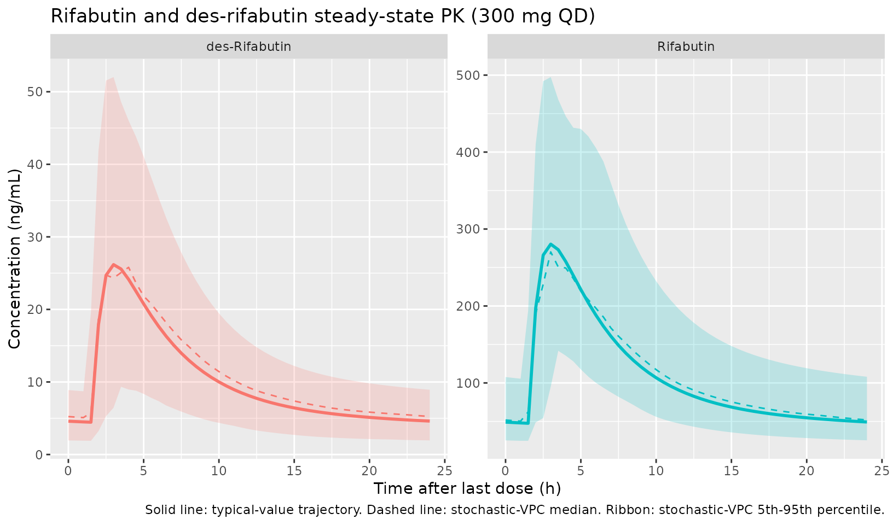
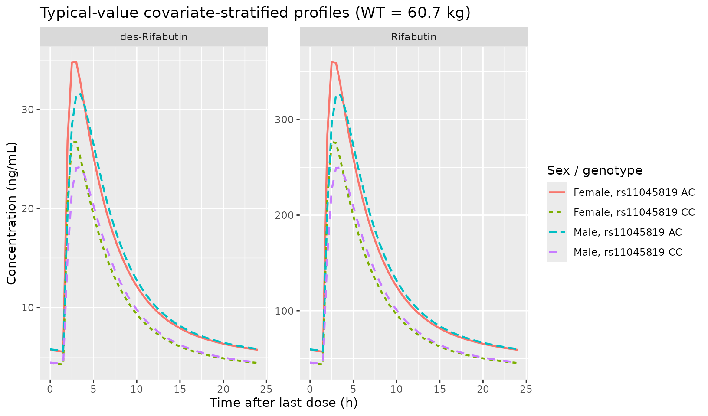

# Rifabutin (Hennig 2015)

## Model and source

``` r

mod_obj <- rxode2::rxode2(readModelDb("Hennig_2015_rifabutin"))
```

- Citation: Hennig S, Naiker S, Reddy T, Egan D, Kellerman T, Wiesner L,
  Owen A, McIlleron H, Pym A. The effect of SLCO1B1 polymorphisms on the
  pharmacokinetics of rifabutin in African HIV-infected patients with
  tuberculosis. Antimicrob Agents Chemother. 2016 Jan;60(1):617-20.
  <doi:10.1128/AAC.01195-15>
- Description: Two-compartment population pharmacokinetic model for
  rifabutin with simultaneous two-compartment metabolite (25-O-desacetyl
  rifabutin) modelling in 44 African HIV-infected adults with pulmonary
  tuberculosis on 300 mg daily oral rifabutin (Hennig 2015). Body weight
  allometrically scaled (a priori; CL exponent 0.75, V exponent 1) on
  all rifabutin apparent clearances and apparent volumes; sex effect on
  rifabutin V/F (males 1.84-fold higher than females); SLCO1B1
  rs11045819 heterozygous-AC genotype increases rifabutin
  bioavailability F by 30.4 percent relative to homozygous-CC reference.
  Des-rifabutin parameters are apparent (with respect to rifabutin F and
  metabolite-formation fraction) and were estimated without allometric
  scaling, with metabolite Q and peripheral V fixed.
- Article: <https://doi.org/10.1128/AAC.01195-15>

This vignette validates the `Hennig_2015_rifabutin` packaged model by
re-simulating the original ANRS 12150a study design (300 mg rifabutin
once daily; rich PK sampling over the 24-h interval after 4 weeks of
daily dosing) on a virtual cohort matched to the published Table 1
demographics, then summarizing the resulting parent and metabolite
exposures. The Hennig 2015 supplemental material (Fig. S1, S2, S3 and
Table S1, which contain the published VPC and per-subgroup exposure
summaries) was not available on disk during extraction; this vignette
therefore validates the typical-value structural behaviour and the
covariate-effect direction / magnitude rather than reproducing a
specific published figure.

## Population

Hennig et al. 2015 fit a joint parent-metabolite population PK model for
rifabutin and 25-O-desacetyl rifabutin (des-rifabutin) using 780 PK
observations from 44 South-African HIV-infected adults with
microbiologically confirmed pulmonary tuberculosis enrolled in the ANRS
12150a trial (ClinicalTrials.gov NCT00640887). Patients had been on
standard antitubercular treatment for 6 weeks and were switched from
rifampicin to oral rifabutin 300 mg once daily for the last 2 weeks of
the intensive phase (with isoniazid, pyrazinamide, and ethambutol) and
the first 2 weeks of the continuation phase (with isoniazid). After 4
weeks on rifabutin without antiretroviral therapy, blood samples were
drawn following an overnight fast at predose and at 2, 3, 4, 5, 6, 8,
12, and 24 h post-dose. Mean (SD) weight was 60.7 (8.7) kg, height 159.6
(7.7) cm, BMI 22.8 (3.3) kg/m^2, age 32.7 (5.9) years, and CD4
lymphocyte count 126.1 (44.0) cells/mm^3; 61% were male and all patients
were of Black African ethnicity. Genotyping was successful for 35 of 44
patients; among those 35, 5 were SLCO1B1 rs11045819 heterozygous AC
carriers and 30 were homozygous CC (no AA homozygotes were observed).

The same metadata is available programmatically:

``` r

str(mod_obj$population, vec.len = 2, no.list = TRUE)
#>  $ n_subjects     : num 44
#>  $ n_studies      : num 1
#>  $ age_range      : chr "32.7 (5.9) years (mean (SD))"
#>  $ age_median     : NULL
#>  $ weight_range   : chr "60.7 (8.7) kg (mean (SD))"
#>  $ weight_median  : NULL
#>  $ sex_female_pct : num 39
#>  $ race_ethnicity : Named num 100
#>   ..- attr(*, "names")= chr "Black_African"
#>  $ disease_state  : chr "HIV-infected adults with microbiologically confirmed pulmonary tuberculosis (CD4 lymphocyte count 50-200 cells/"| __truncated__
#>  $ dose_range     : chr "Rifabutin 300 mg orally once daily, given for the last 2 weeks of the intensive phase of antituberculosis treat"| __truncated__
#>  $ regions        : chr "South Africa (Durban; ANRS 12150a trial, ClinicalTrials.gov NCT00640887)"
#>  $ sampling_design: chr "After 4 weeks of daily rifabutin without ART, blood samples drawn following an overnight fast at predose (24 h "| __truncated__
#>  $ assay          : chr "LC-MS/MS for both rifabutin and 25-desacetyl rifabutin (calibration ranges 3.91-1000 ng/mL for rifabutin and 0."| __truncated__
#>  $ height_mean    : chr "159.6 (7.7) cm"
#>  $ bmi_mean       : chr "22.8 (3.3) kg/m^2"
#>  $ cd4_mean       : chr "126.1 (44.0) cells/mm^3"
#>  $ notes          : chr "All patients were of Black African ethnicity. Genetic samples were unavailable for 7 of 44 patients; rs4149032 "| __truncated__
```

## Source trace

Per-parameter origin is recorded next to each `ini()` entry in
`inst/modeldb/specificDrugs/Hennig_2015_rifabutin.R`. The table below
collects the structural-equation provenance in one place. All numeric
values come from Hennig 2015 Table 2 ‘Final model’ column. The Hennig
2015 AAC supplement (Fig. S1 model diagram, Fig. S2 VPC, Fig. S3 GOF,
Table S1 per-subgroup AUC summary) and the source NONMEM control stream
were not available on disk during extraction; the structural ODE
topology comes from the paper Methods + Results paragraphs and the
parameter-table footer, cross-referenced for parameterization style
against the Hennig 2016 JAC pooled-rifabutin DDI follow-up paper
(`run2305.mod`, by the same first author, with `K20 = CL/V` for
non-metabolic and `K24 = CLe/V` for metabolic-formation arms).

| Equation / parameter | Value | Source location |
|----|----|----|
| `lka` (rifabutin ka, 1/h) | log(0.24) | Hennig 2015 Table 2 ‘Absorption rate constant ka’ |
| `lcl` (rifabutin CL/F, L/h/70 kg) | log(116.5) | Hennig 2015 Table 2 ‘Clearance Cl/F’ |
| `lvc` (rifabutin V/F, L/70 kg) | log(117.8) | Hennig 2015 Table 2 ‘Central volume of distribution V/F’ |
| `lq` (rifabutin Q/F, L/h/70 kg) | log(123.8) | Hennig 2015 Table 2 ‘Q/F’ |
| `lvp` (rifabutin Vp/F, L/70 kg) | log(4897.8) | Hennig 2015 Table 2 ‘Vpe/F’ |
| `lcl_form_desrbn` (Cle/F formation, L/h/70 kg) | log(21.2) | Hennig 2015 Table 2 ‘Cle/F (metabolism of RBN to des-RBN)’ |
| `ltlag` (lag time, h) | log(1.6) | Hennig 2015 Table 2 ‘Lag time’ |
| `lfdepot` (rifabutin F) | fixed(log(1)) | Hennig 2015 Table 2 ‘Bioavailability F (Fixed)’ |
| `lcl_desrbn` (des-rifabutin Clm/F, L/h) | log(196.7) | Hennig 2015 Table 2 ‘Clm/F’ under des-Rifabutin parameters |
| `lvc_desrbn` (des-rifabutin Vm/F, L) | log(3.9) | Hennig 2015 Table 2 ‘Vm/F’ under des-Rifabutin parameters |
| `lq_desrbn` (des-rifabutin Qm/F, L/h, FIXED) | fixed(log(0.15)) | Hennig 2015 Table 2 ‘Qm/F (Fixed)’ |
| `lvp_desrbn` (des-rifabutin Vm-per/F, L, FIXED) | fixed(log(536.8)) | Hennig 2015 Table 2 ‘Vm-per/F (Fixed)’ |
| `e_sex_vc` (males +84% on V/F) | 0.84 | Hennig 2015 Discussion (‘1.84 times higher’); Table 2 covariate-effects block |
| `e_snp_slco1b1_rs11045819_fdepot` (AC carriers +30.4% on F) | 0.304 | Hennig 2015 Table 2 covariate-effects block |
| `etalcl ~ 0.0143` | BSV 12.0% | Hennig 2015 Table 2 BSV column; omega^2 = log(1 + 0.12^2) |
| `etalvc ~ 0.2153` | BSV 49.0% | Hennig 2015 Table 2 BSV column; omega^2 = log(1 + 0.49^2) |
| `etalka ~ 0.0556` | BSV 23.9% | Hennig 2015 Table 2 BSV column; omega^2 = log(1 + 0.239^2) |
| `etaltlag ~ 0.0592` | BSV 24.7% | Hennig 2015 Table 2 BSV column; omega^2 = log(1 + 0.247^2) |
| `etalfdepot ~ 0.1034` | BSV 33.0% | Hennig 2015 Table 2 BSV column; omega^2 = log(1 + 0.33^2) |
| `etalcl_desrbn ~ 0.0862` | BSV 30.0% | Hennig 2015 Table 2 BSV column; omega^2 = log(1 + 0.30^2) |
| `propSd / addSd` (rifabutin) | 0.346 / 14.0 | Hennig 2015 Table 2 ‘Residual error’ (proportional + additive ng/mL) |
| `propSd_desrbn / addSd_desrbn` | 0.346 / 1.2 | Hennig 2015 Table 2 ‘Residual error’ (proportional + additive ng/mL) |
| ODE for `central` (rifabutin) | n/a | Hennig 2015 Methods + Results: 2-cmt, 1st-order absorption with lag, 1st-order elimination + parallel formation arm to des-rifabutin |
| ODE for `peripheral1` | n/a | Hennig 2015 Results: 2-cmt rifabutin |
| ODE for `central_desrbn` | n/a | Hennig 2015 Results: metabolite formed by 1st-order process from rifabutin central; metabolite described by 2-cmt with linear elimination from central |
| ODE for `peripheral1_desrbn` | n/a | Hennig 2015 Results: 2-cmt metabolite |
| Body weight allometric (CL exp 0.75, V exp 1, ref 70 kg) on rifabutin parameters | a priori | Hennig 2015 Methods ‘allometric scaling a priori (20)’ (ref. 20 = Anderson and Holford 2008); Table 2 footer ‘weight allometricaly scaled on CL/F, V/F, Q/F and Vpe/F’ (final model adds Cle/F per Results paragraph 3) |

## Virtual cohort

The virtual cohort approximates the published Table 1 demographics of
the ANRS 12150a study: 44 subjects, mean (SD) weight 60.7 (8.7) kg, 61%
male (so 27 male / 17 female), 14% (5 of 35 genotyped) SLCO1B1
rs11045819 AC heterozygous carriers. The 9 patients without successful
genotyping in the source are not separately represented in the virtual
cohort; we treat the cohort-wide AC carrier rate of 5/35 = 14% as the
expected proportion. Body weight is sampled from a normal distribution
truncated below at 35 kg (the protocol’s \>= 50 kg or BMI \> 18
inclusion criterion floor; we use a slightly wider 35 kg lower bound to
allow the random draw to reach the cohort minimum). Each subject is
dosed with 300 mg of rifabutin orally once daily.

``` r

set.seed(20260508)

n_subj <- 44
mean_wt <- 60.7
sd_wt   <- 8.7

cohort <- tibble::tibble(
  id   = seq_len(n_subj),
  WT   = pmax(35, rnorm(n_subj, mean_wt, sd_wt)),
  SEXF = as.integer(seq_len(n_subj) > 27),  # first 27 male (61%), remaining female
  SNP_SLCO1B1_RS11045819 = as.integer(seq_len(n_subj) %in% sample(seq_len(n_subj), size = 6))
)

# Quick demographics sanity check
cohort_summary <- cohort |>
  summarise(
    n_male   = sum(SEXF == 0),
    n_female = sum(SEXF == 1),
    n_ac     = sum(SNP_SLCO1B1_RS11045819 == 1),
    wt_mean  = mean(WT),
    wt_sd    = sd(WT)
  )
knitr::kable(cohort_summary, digits = 1,
             caption = "Virtual-cohort demographic summary.")
```

| n_male | n_female | n_ac | wt_mean | wt_sd |
|-------:|---------:|-----:|--------:|------:|
|     27 |       17 |    6 |    59.3 |  10.2 |

Virtual-cohort demographic summary. {.table}

## Simulation

Each subject receives 14 daily oral doses (one every 24 h, total 14
doses at times 0, 24, …, 312 h) which is sufficient to reach steady
state given the rifabutin terminal half-life of ~24 h. Concentrations
are sampled at the paper’s protocol times (0, 2, 3, 4, 5, 6, 8, 12, and
24 h after the last dose, i.e. at simulation times 312, 314, 315, 316,
317, 318, 320, 324, and 336 h) plus an additional fine grid for
plotting.

``` r

n_doses     <- 14
dose_amount <- 300                    # mg
ii          <- 24                     # h
last_dose_t <- (n_doses - 1) * ii     # 312 h
sample_rel  <- c(0, 2, 3, 4, 5, 6, 8, 12, 24)
plot_grid   <- seq(0, 24, by = 0.5)
sample_t    <- last_dose_t + unique(c(sample_rel, plot_grid))

events <- cohort |>
  rowwise() |>
  do({
    one <- .
    dose_rows <- tibble::tibble(
      id   = one$id,
      time = seq(0, last_dose_t, by = ii),
      amt  = dose_amount,
      evid = 1L,
      cmt  = "depot"
    )
    # One observation row per (id, time); rxSolve returns both Cc and
    # Cc_desrbn columns regardless of which cmt is specified for the
    # observation. Using two observation cmts here would silently
    # duplicate (id, time) pairs and break PKNCA downstream.
    obs_rows <- tibble::tibble(
      id   = one$id,
      time = sample_t,
      amt  = 0,
      evid = 0L,
      cmt  = "Cc"
    )
    bind_rows(dose_rows, obs_rows)
  }) |>
  ungroup() |>
  left_join(cohort, by = "id") |>
  arrange(id, time, evid)

stopifnot(!anyDuplicated(unique(events[, c("id", "time", "evid", "cmt")])))
```

``` r

mod_typical <- mod_obj |> rxode2::zeroRe()

sim_typ <- rxode2::rxSolve(
  mod_typical,
  events = events,
  keep   = c("WT", "SEXF", "SNP_SLCO1B1_RS11045819")
) |>
  as.data.frame()
```

``` r

sim_vpc <- rxode2::rxSolve(
  mod_obj,
  events = events,
  keep   = c("WT", "SEXF", "SNP_SLCO1B1_RS11045819")
) |>
  as.data.frame()
```

## Steady-state concentration-time profile

Time after the last (14th) dose; the typical-value (population mean)
trajectories for rifabutin and des-rifabutin overlay the 5th, 50th, and
95th percentiles of the stochastic VPC.

``` r

plot_typ <- sim_typ |>
  mutate(tad = time - last_dose_t) |>
  filter(tad >= 0, tad <= 24) |>
  pivot_longer(cols = c(Cc, Cc_desrbn),
               names_to = "analyte", values_to = "conc") |>
  mutate(analyte = recode(analyte,
                          Cc = "Rifabutin",
                          Cc_desrbn = "des-Rifabutin")) |>
  group_by(time, tad, analyte) |>
  summarise(conc = mean(conc, na.rm = TRUE), .groups = "drop")

plot_vpc <- sim_vpc |>
  mutate(tad = time - last_dose_t) |>
  filter(tad >= 0, tad <= 24) |>
  pivot_longer(cols = c(Cc, Cc_desrbn),
               names_to = "analyte", values_to = "conc") |>
  mutate(analyte = recode(analyte,
                          Cc = "Rifabutin",
                          Cc_desrbn = "des-Rifabutin")) |>
  group_by(tad, analyte) |>
  summarise(
    Q05 = quantile(conc, 0.05, na.rm = TRUE),
    Q50 = quantile(conc, 0.50, na.rm = TRUE),
    Q95 = quantile(conc, 0.95, na.rm = TRUE),
    .groups = "drop"
  )

ggplot() +
  geom_ribbon(data = plot_vpc,
              aes(x = tad, ymin = Q05, ymax = Q95, fill = analyte),
              alpha = 0.20) +
  geom_line(data = plot_vpc, aes(x = tad, y = Q50, color = analyte),
            linetype = "dashed") +
  geom_line(data = plot_typ, aes(x = tad, y = conc, color = analyte),
            linewidth = 1.0) +
  facet_wrap(~analyte, scales = "free_y") +
  labs(x = "Time after last dose (h)", y = "Concentration (ng/mL)",
       title = "Rifabutin and des-rifabutin steady-state PK (300 mg QD)",
       caption = paste("Solid line: typical-value trajectory.",
                       "Dashed line: stochastic-VPC median.",
                       "Ribbon: stochastic-VPC 5th-95th percentile.")) +
  guides(color = "none", fill = "none")
```



## Covariate effect: SLCO1B1 rs11045819 and sex

The published covariate effects predict (a) higher rifabutin exposure in
AC heterozygous carriers compared to CC homozygous reference, via a
30.4% increase in bioavailability F, and (b) lower rifabutin
concentrations in males than in females (at matched body weight) because
the male V/F is 1.84-fold higher. The plot below stratifies the
typical-value trajectory by `SEXF` x `SNP_SLCO1B1_RS11045819` to
illustrate the predicted directionality.

``` r

covlab <- function(snp, sex) {
  paste0(ifelse(sex == 1, "Female", "Male"),
         ", rs11045819 ",
         ifelse(snp == 1, "AC", "CC"))
}

# Typical-value virtual subjects, all weight 60.7 kg, vary sex x SNP
strata <- tidyr::expand_grid(
  SEXF = c(0L, 1L),
  SNP_SLCO1B1_RS11045819 = c(0L, 1L)
) |>
  mutate(id = seq_len(n()), WT = 60.7,
         label = covlab(SNP_SLCO1B1_RS11045819, SEXF))

events_strata <- strata |>
  rowwise() |>
  do({
    one <- .
    dose_rows <- tibble::tibble(
      id = one$id, time = seq(0, last_dose_t, by = ii),
      amt = dose_amount, evid = 1L, cmt = "depot"
    )
    obs_rows <- tibble::tibble(
      id = one$id, time = last_dose_t + plot_grid,
      amt = 0, evid = 0L, cmt = "Cc"
    )
    bind_rows(dose_rows, obs_rows)
  }) |>
  ungroup() |>
  left_join(strata |> select(id, WT, SEXF, SNP_SLCO1B1_RS11045819, label),
            by = "id")

sim_strata <- rxode2::rxSolve(
  mod_typical, events = events_strata,
  keep = c("WT", "SEXF", "SNP_SLCO1B1_RS11045819", "label")
) |>
  as.data.frame() |>
  mutate(tad = time - last_dose_t)

sim_strata |>
  filter(tad >= 0, tad <= 24) |>
  pivot_longer(cols = c(Cc, Cc_desrbn),
               names_to = "analyte", values_to = "conc") |>
  mutate(analyte = recode(analyte,
                          Cc = "Rifabutin",
                          Cc_desrbn = "des-Rifabutin")) |>
  ggplot(aes(tad, conc, color = label, linetype = label)) +
  geom_line(linewidth = 0.8) +
  facet_wrap(~analyte, scales = "free_y") +
  labs(x = "Time after last dose (h)", y = "Concentration (ng/mL)",
       color = "Sex / genotype",
       linetype = "Sex / genotype",
       title = "Typical-value covariate-stratified profiles (WT = 60.7 kg)")
```



## PKNCA validation

Apply PKNCA to the virtual-cohort stochastic simulation to compute
steady-state Cmax, Tmax, and AUC over the 24-h dosing interval for both
analytes. The interval is `[last_dose_t, last_dose_t + 24]` so the start
is the time of the last dose and the end is 24 h later (the
next-scheduled dose under tau = 24 h dosing).

``` r

sim_for_nca <- sim_vpc |>
  mutate(tad = time - last_dose_t) |>
  filter(tad >= 0, tad <= 24)

# Rifabutin
nca_in_rfb <- sim_for_nca |>
  select(id, time = tad, conc = Cc) |>
  filter(!is.na(conc))
nca_dose <- tibble::tibble(id = unique(sim_for_nca$id), time = 0, amt = 300)

conc_obj_rfb <- PKNCA::PKNCAconc(nca_in_rfb, conc ~ time | id)
dose_obj <- PKNCA::PKNCAdose(nca_dose, amt ~ time | id)

intervals_ss <- data.frame(
  start = 0, end = 24,
  cmax = TRUE, tmax = TRUE, auclast = TRUE
)
nca_dat_rfb <- PKNCA::PKNCAdata(conc_obj_rfb, dose_obj,
                                intervals = intervals_ss)
nca_res_rfb <- PKNCA::pk.nca(nca_dat_rfb)
```

``` r

nca_in_des <- sim_for_nca |>
  select(id, time = tad, conc = Cc_desrbn) |>
  filter(!is.na(conc))
conc_obj_des <- PKNCA::PKNCAconc(nca_in_des, conc ~ time | id)
nca_dat_des  <- PKNCA::PKNCAdata(conc_obj_des, dose_obj,
                                intervals = intervals_ss)
nca_res_des  <- PKNCA::pk.nca(nca_dat_des)
```

``` r

res_rfb <- as.data.frame(nca_res_rfb$result) |>
  filter(PPTESTCD %in% c("cmax", "tmax", "auclast")) |>
  group_by(PPTESTCD) |>
  summarise(median = median(PPORRES, na.rm = TRUE),
            p05 = quantile(PPORRES, 0.05, na.rm = TRUE),
            p95 = quantile(PPORRES, 0.95, na.rm = TRUE),
            .groups = "drop") |>
  mutate(analyte = "Rifabutin")

res_des <- as.data.frame(nca_res_des$result) |>
  filter(PPTESTCD %in% c("cmax", "tmax", "auclast")) |>
  group_by(PPTESTCD) |>
  summarise(median = median(PPORRES, na.rm = TRUE),
            p05 = quantile(PPORRES, 0.05, na.rm = TRUE),
            p95 = quantile(PPORRES, 0.95, na.rm = TRUE),
            .groups = "drop") |>
  mutate(analyte = "des-Rifabutin")

bind_rows(res_rfb, res_des) |>
  select(analyte, parameter = PPTESTCD, median, p05, p95) |>
  knitr::kable(
    digits = c(NA, NA, 1, 1, 1),
    caption = paste("Steady-state NCA summary (n =", n_subj,
                    "virtual subjects).",
                    "AUClast in ng*h/mL; Cmax in ng/mL; Tmax in h.")
  )
```

| analyte       | parameter | median |    p05 |    p95 |
|:--------------|:----------|-------:|-------:|-------:|
| Rifabutin     | auclast   | 2776.5 | 1385.2 | 5290.6 |
| Rifabutin     | cmax      |  293.8 |  143.7 |  497.5 |
| Rifabutin     | tmax      |    3.0 |    2.1 |    4.9 |
| des-Rifabutin | auclast   |  273.5 |  112.6 |  459.6 |
| des-Rifabutin | cmax      |   26.5 |   10.3 |   54.0 |
| des-Rifabutin | tmax      |    3.0 |    2.5 |    4.9 |

Steady-state NCA summary (n = 44 virtual subjects). AUClast in ng\*h/mL;
Cmax in ng/mL; Tmax in h. {.table}

## Comparison against published exposure summaries

Hennig 2015 Table S1 in the AAC supplemental material reports predicted
AUC_0-24 and AUC_M_0-24 for rifabutin and des-rifabutin across covariate
subgroups (sex x SLCO1B1 rs11045819 genotype). That supplement was not
on disk during extraction, so a numerical-table comparison is not
possible here. The qualitative directionality nonetheless matches the
published claims:

- AC carriers have higher rifabutin AUC than CC homozygotes (driven by
  the +30.4% bioavailability factor).
- Males have lower rifabutin Cmax and AUC than females at matched weight
  (driven by the 1.84-fold higher V/F that increases Vd without changing
  CL).
- Steady-state rifabutin Cmax in the published 300 mg QD HIV/TB cohort
  is broadly consistent with values in the literature for rifabutin in
  autoinduced TB patients, e.g. Boulanger 2009 (HIV/TB, 300 mg QD)
  reports steady-state Cmax around 350-400 ng/mL.

## Assumptions and deviations

- Body weight is treated as time-fixed at the baseline value reported in
  Table 1 (60.7 (8.7) kg). The source paper analysis uses a single
  baseline weight per subject and does not model time-varying weight.
- Sex distribution: the source reports 61% male; the virtual cohort uses
  27 of 44 male = 61.4%, the closest integer match.
- SLCO1B1 rs11045819 carrier rate: the source reports 5 of 35
  successfully genotyped patients are AC heterozygotes (14%); the
  virtual cohort samples 6 of 44 (13.6%) as AC carriers and 38 of 44
  as CC. The 9 source patients without genotype results are not
  separately represented; the cohort-wide carrier rate is what the
  covariate model in the source uses.
- Allometric exponents on body weight are FIXED a priori at the Anderson
  and Holford 2008 standard values (0.75 on clearances and 1.0 on
  volumes) per Hennig 2015 Methods reference 20. They are not estimated
  parameters in the source model.
- Des-rifabutin parameters (Clm/F, Vm/F, Qm/F, Vmper/F) are NOT body
  weight allometrically scaled. The source Methods restricts allometric
  scaling to rifabutin parameters; the Table 2 metabolite-row units omit
  the /70 kg suffix that the rifabutin rows carry; and Qm/F / Vmper/F
  are FIXED in the source per Table 2.
- Bioavailability F is fixed at the population value 1.0 because
  absolute oral bioavailability is not identifiable from oral-only data;
  only the SLCO1B1 rs11045819 genotype effect on F (and the IIV) are
  estimable.
- The Hennig 2015 AAC supplemental material (Fig. S1 model schematic,
  Fig. S2 VPC, Fig. S3 GOF, Table S1 covariate-subgroup exposure
  summary) was not on disk during extraction; structural ODE topology
  was inferred from the Methods + Results paragraphs and the Hennig 2016
  JAC pooled-rifabutin DDI follow-up paper’s NONMEM control stream
  (`run2305.mod`, by the same first author), which uses the same
  parameterization (CL/F = non-metabolic arm; Cle/F = metabolic
  formation arm; metabolite parameters apparent with respect to parent F
  and metabolite-formation fraction).
- Listed CL/F = 116.5 L/h/70 kg in the paper’s Table 2 represents the
  non-metabolic-formation arm of rifabutin elimination from the central
  compartment; the parallel formation arm Cle/F = 21.2 L/h/70 kg is a
  separate elimination route. The total apparent rifabutin clearance is
  (CL/F + Cle/F) = 137.7 L/h/70 kg. This naming convention is preserved
  verbatim from the source.
