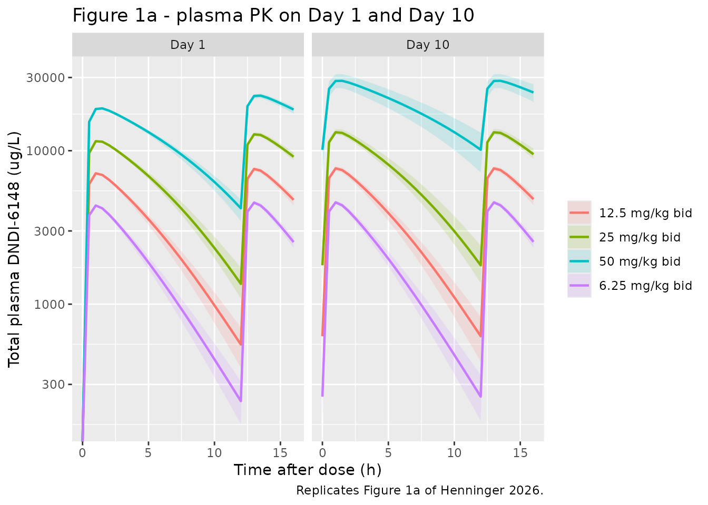
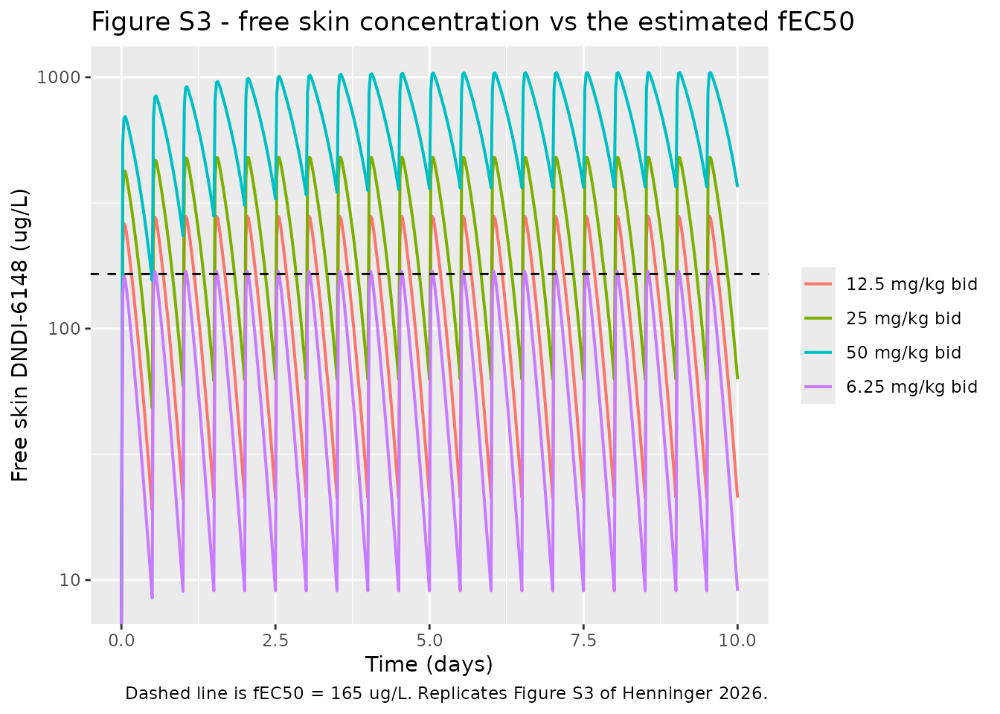
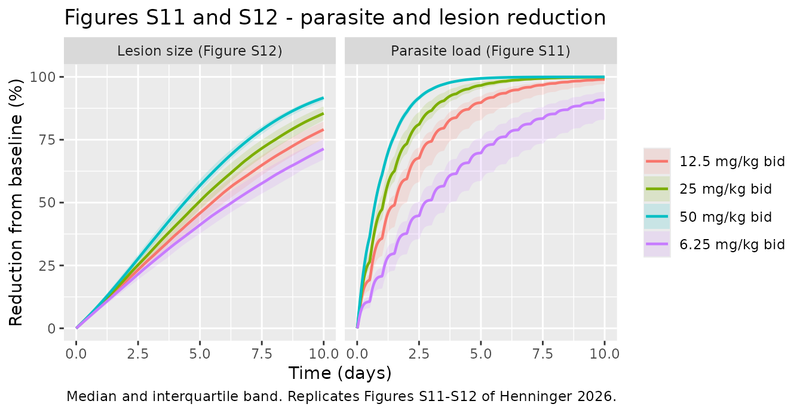
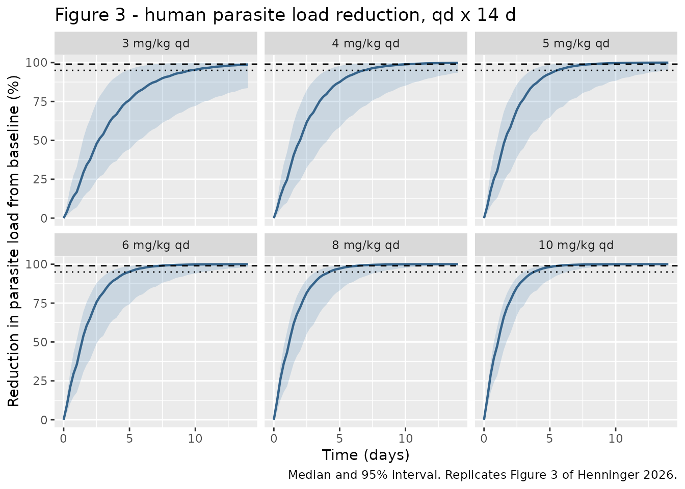

# DNDI-6148 murine and human translational PK/PD (Henninger 2026)

## Model and source

This paper contributes **two** model files: the murine fit and the
allometrically scaled human translation built from it.

``` r

mouse <- readModelDb("Henninger_2026_dndi6148_mouse")
human <- readModelDb("Henninger_2026_dndi6148_human")
mouse_ui <- rxode2::rxode(mouse)
#> ℹ parameter labels from comments will be replaced by 'label()'
human_ui <- rxode2::rxode(human)
#> ℹ parameter labels from comments will be replaced by 'label()'
```

- Citation: Henninger RH, Schouten WM, Arana B, Gillon JY, Mowbray CE,
  Kratz JM, Van Bocxlaer K, Dorlo TPC. (2026). Translational
  Pharmacokinetic-Pharmacodynamic Modeling and Efficacious Human Dose
  Prediction of DNDI-6148 for the Treatment of Cutaneous Leishmaniasis.
  Clin Transl Sci 19(4):e70535. <doi:10.1111/cts.70535>.
- Article: <https://doi.org/10.1111/cts.70535>
- Supplement: `CTS-19-e70535-s001.docx` (Supplementary methods S1,
  Figures S1-S13, Table S1), retrieved from the Europe PMC
  supplementary-files endpoint for PMC13077782.

DNDI-6148 is a benzoxaborole drug candidate for cutaneous leishmaniasis.
The paper characterises plasma and skin target-site PK together with
longitudinal parasite and lesion PD in *Leishmania major*-infected
BALB/c mice, then bridges the PD components to humans on allometrically
scaled PK in order to predict an efficacious oral dose.

## Population

Thirty mice contribute to the model: 24 treated with DNDI-6148 (6 per
dose level at 6.25, 12.5, 25 and 50 mg/kg twice daily for 10 days) plus
6 vehicle controls. Thirty-six female BALB/c mice were infected in total
(Supplementary methods S1); the sixth group received paromomycin as an
active comparator and is not part of the model. Animals were infected in
the rump with 4e7 stationary-phase *L. major* Friedlin REH promastigotes
and were randomised once they had reached a mean lesion diameter of 6.12
+/- 0.90 mm and a bioluminescence signal of 1.35e8 +/- 7.64e7 photons/s.
Data comprised 141 plasma, 43 skin, 23 liver and 23 spleen PK samples
with 207 parasite-bioluminescence and 325 lesion-size measurements
(Results 3.1). The allometric terms are normalised to the cohort median
weight of 22 g.

The human model is a **simulation** model: no human data were fitted.
Its three typical PK values are single-species allometric projections
for a 70 kg adult, and every parameter in that file is fixed.

``` r

str(mouse_ui$population, max.level = 1)
#> List of 8
#>  $ species       : chr "mouse (female BALB/c, Leishmania major Friedlin:Luc infected)"
#>  $ n_subjects    : int 30
#>  $ n_studies     : int 1
#>  $ weight_median : chr "22 g (0.022 kg), the median used to normalise the allometric terms"
#>  $ sex_female_pct: num 100
#>  $ disease_state : chr "Cutaneous leishmaniasis. Mice were infected in the rump with 4e7 stationary-phase L. major Friedlin REH promast"| __truncated__
#>  $ dose_range    : chr "6.25, 12.5, 25 and 50 mg/kg DNDI-6148 arginine monohydrate (free-base basis) by oral gavage, twice daily for 10"| __truncated__
#>  $ notes         : chr "36 mice were infected in six groups of six (Supplementary methods S1); the 30 animals in this model are the 24 "| __truncated__
```

## Source trace

Per-parameter origins are recorded as in-file comments beside each
`ini()` entry in
`inst/modeldb/specificDrugs/Henninger_2026_dndi6148_mouse.R` and
`.../Henninger_2026_dndi6148_human.R`. Collected here for review.

### Murine model

| Equation / parameter | Value | Source location |
|----|----|----|
| `lka` | 2.7 /h | Table 1 |
| `lvc` | 0.025 L (22 g mouse) | Table 1 |
| `lvmax` | 65 ug/h | Table 1 |
| `lkm` | 8000 ug/L | Table 1 |
| `e_wt_vmax`, `e_wt_vc` | 0.75, 1 (fixed) | Equations 1-2; Table 1 footnote b |
| `e_dose_fdepot` | -0.34 | Table 1 (`theta_dose`); footnote c gives the form |
| `lke0` | 20 /h (fixed) | Table 1 (`k_plasma-tissue`); Methods 2.2.2 explains the fixing |
| `lkp_skin`, `lkp_liver`, `lkp_spleen` | 0.56, 1.9, 0.34 | Table 1 |
| `fu` | 0.066 (fixed) | Methods 2.2.3 (in-house; assumed equal in skin) |
| `lemax` | 0.049 /h | Table 2 |
| `lec50` | 165 ug/L (free) | Table 2 (`fEC50`) |
| `lhill` | 1.6 | Table 2 (`gamma`) |
| `lrbase_parasites` | 10^8.01 photons/s | Table 2; Results 3.2.3 gives 8.01 log10 |
| `lrbase_lesion` | 31 mm^2 | Table 2 |
| `lslope_lesion` | 0.0029 /h per log10 photons/s | Table 2 |
| `lkheal` | 0.027 /h | Table 2; Results 3.2.3 gives 0.0272 |
| BSV on `km`, `kp_skin`, `kp_liver`, `kp_spleen` | 6.5, 37, 30, 44 % CV | Table 1 |
| BSV on `rbase_parasites`, `rbase_lesion` | 60, 35 % CV | Table 2 |
| `addSd`, `propSd` | 2.5 ug/L (fixed), 36 % CV | Table 1 |
| `addSd_log10BLI` | 0.13 log10 photons/s | Table 2 |
| `addSd_lesionArea`, `propSd_lesionArea` | 0.39 mm^2 (fixed), 37 % CV | Table 2 |
| `d/dt(depot)`, `d/dt(central)` with Michaelis-Menten loss | n/a | Results 3.2.1; Figure 2 |
| `d/dt(skin/liver/spleen)` | n/a | Equation 3 |
| `kkill`, `d/dt(parasites)` | n/a | Equations 4-5 |
| `d/dt(lesion_size)` | n/a | Equation 6 (see Errata on the parasite scale) |

### Human model

| Equation / parameter | Value | Source location |
|----|----|----|
| `lka`, `lcl`, `lvc` | 0.360 /h, 3.44 L/h, 79.5 L (all fixed) | Results 3.2.6 |
| allometric bridge | exponents 0.75 / 1.00 / -0.25 | Methods 2.2.5 |
| `lke0`, `lkp_skin` | 20 /h, 0.56 (fixed) | Table 1, transferred |
| `fu` | 0.07 (fixed) | Methods 2.2.6 |
| `lemax`, `lec50`, `lhill` | 0.049 /h, 165 ug/L, 1.6 (fixed) | Table 2, transferred |
| `lrbase_parasites` | 10^8.01 photons/s (fixed) | Methods 2.2.6 (“same as in mice”) |
| BSV on `cl`, `kp_skin`, `rbase_parasites` | 30, 37, 60 % CV (all fixed) | Methods 2.2.6 |
| residual error | none | Methods 2.2.6 (“Residual variability was excluded”) |

## Closed-form checks on the published derivations

Three of the paper’s numbers are pure arithmetic on other published
numbers and can be checked exactly, without simulating anything.

``` r

## 1. Dose-dependent relative bioavailability (Results 3.2.1: 79.1 / 62.6 / 49.5 %).
f_rel <- (c(12.5, 25, 50) / 6.25)^(-0.34)
## 2. Allometric bridge from the 22 g mouse to a 70 kg human (Results 3.2.6).
size_ratio <- 70 / 0.022
cl_human   <- (65 / 8000) * size_ratio^0.75   # CL = Vmax/F / Km, per Discussion
vd_human   <- 0.025       * size_ratio^1.00
ka_human   <- 2.7         * size_ratio^(-0.25)
## 3. Steady-state AUC over 24 h is Dose/CL for the linear human model.
auc_ss <- c(`4 mg/kg` = 4, `6 mg/kg` = 6) * 70 / 3.44

tibble::tibble(
  Quantity = c("F rel at 12.5 mg/kg", "F rel at 25 mg/kg", "F rel at 50 mg/kg",
               "Human CL/F (L/h)", "Human Vd/F (L)", "Human ka (1/h)",
               "Human AUCss,0-24h at 4 mg/kg (h*ug/mL)",
               "Human AUCss,0-24h at 6 mg/kg (h*ug/mL)"),
  Derived  = c(f_rel, cl_human, vd_human, ka_human, auc_ss),
  Published = c(0.791, 0.626, 0.495, 3.44, 79.5, 0.360, 81.6, 122)
) |>
  mutate(`Pct diff` = 100 * (Derived - Published) / Published) |>
  knitr::kable(digits = 3, caption = "Published derivations reproduced in closed form.")
```

| Quantity                                | Derived | Published | Pct diff |
|:----------------------------------------|--------:|----------:|---------:|
| F rel at 12.5 mg/kg                     |   0.790 |     0.791 |   -0.121 |
| F rel at 25 mg/kg                       |   0.624 |     0.626 |   -0.293 |
| F rel at 50 mg/kg                       |   0.493 |     0.495 |   -0.381 |
| Human CL/F (L/h)                        |   3.442 |     3.440 |    0.063 |
| Human Vd/F (L)                          |  79.545 |    79.500 |    0.057 |
| Human ka (1/h)                          |   0.359 |     0.360 |   -0.140 |
| Human AUCss,0-24h at 4 mg/kg (h\*ug/mL) |  81.395 |    81.600 |   -0.251 |
| Human AUCss,0-24h at 6 mg/kg (h\*ug/mL) | 122.093 |   122.000 |    0.076 |

Published derivations reproduced in closed form. {.table}

``` r


stopifnot(
  max(abs(f_rel - c(0.791, 0.626, 0.495))) < 0.002,
  abs(cl_human - 3.44) / 3.44 < 0.01,
  abs(vd_human - 79.5) / 79.5 < 0.01,
  abs(ka_human - 0.360) / 0.360 < 0.01,
  max(abs(auc_ss - c(81.6, 122)) / c(81.6, 122)) < 0.01
)
```

The clearance line is the one worth pausing on: the murine model has
saturable elimination, so there is no `CL` parameter to scale. The
Discussion states that `CL` for the purpose of allometric scaling was
taken as `Vmax/F / Km`, the low-concentration limit of Michaelis-Menten
clearance, and that reading reproduces 3.44 L/h exactly.

## Virtual cohort - mouse

``` r

set.seed(20260101)
rxode2::rxSetSeed(20260101)

n_per_arm  <- 100L        # cap is 200/arm
mouse_dose_levels <- c(6.25, 12.5, 25, 50)
tau_mouse  <- 12          # h; "bid ... intervals varying between approximately 8 and 12 h"
tend_mouse <- 24 * 10

make_mouse_arm <- function(mgkg, id_offset) {
  # Body weight: the paper reports only the 22 g median used to normalise the
  # allometric terms, so a modest lognormal spread is ASSUMED (see Errata).
  subj <- tibble::tibble(
    id = id_offset + seq_len(n_per_arm),
    WT = 0.022 * exp(rnorm(n_per_arm, 0, 0.10)),
    DOSE_DNDI6148_MGKG = mgkg,
    treatment = paste0(mgkg, " mg/kg bid")
  )
  dose_times <- seq(0, tend_mouse - tau_mouse, by = tau_mouse)
  doses <- tidyr::crossing(subj, time = dose_times) |>
    mutate(evid = 1L, amt = DOSE_DNDI6148_MGKG * WT * 1000, cmt = "depot",
           dvid = NA_integer_)
  obs <- tidyr::crossing(subj, time = seq(0, tend_mouse, by = 0.5)) |>
    # cmt is an ODE STATE name, never an observable name; dvid = 1 on every
    # observation row makes rxode2 return all three endpoint columns.
    mutate(evid = 0L, amt = NA_real_, cmt = "central", dvid = 1L)
  bind_rows(doses, obs) |> arrange(id, time, desc(evid))
}

ev_mouse <- bind_rows(
  Map(make_mouse_arm, mouse_dose_levels,
      (seq_along(mouse_dose_levels) - 1L) * n_per_arm)
)
stopifnot(!anyDuplicated(unique(ev_mouse[, c("id", "time", "evid")])))
```

``` r

sim_mouse <- rxode2::rxSolve(
  mouse, ev_mouse,
  keep = c("treatment", "DOSE_DNDI6148_MGKG"),
  # rxode2's ODE->linCmt auto-conversion corrupts the dvid mapping on
  # multi-output models; disable it.
  useLinCmt = FALSE
) |> as.data.frame()
#> ℹ parameter labels from comments will be replaced by 'label()'

# Typical-value (no BSV) run, for the deterministic exposure comparisons.
sim_mouse_typ <- rxode2::rxSolve(
  rxode2::zeroRe(mouse), ev_mouse |> filter(id %% n_per_arm == 1L),
  keep = c("treatment", "DOSE_DNDI6148_MGKG"), useLinCmt = FALSE
) |> as.data.frame()
#> ℹ parameter labels from comments will be replaced by 'label()'
#> ℹ omega/sigma items treated as zero: 'etalkm', 'etalkp_skin', 'etalkp_liver', 'etalkp_spleen', 'etalrbase_parasites', 'etalrbase_lesion'
#> Warning: multi-subject simulation without without 'omega'
```

## Replicate published figures - mouse

``` r

# Replicates Figure 1a of Henninger 2026: total plasma concentration-time
# profiles on Day 1 and Day 10 by dose level.
sim_mouse |>
  mutate(day = case_when(time <= 24 ~ "Day 1", time >= 216 ~ "Day 10"),
         tad = if_else(time <= 24, time, time - 216)) |>
  filter(!is.na(day), tad <= 16) |>
  group_by(day, treatment, tad) |>
  summarise(Q05 = quantile(Cc, 0.05), Q50 = median(Cc), Q95 = quantile(Cc, 0.95),
            .groups = "drop") |>
  mutate(day = factor(day, c("Day 1", "Day 10"))) |>
  ggplot(aes(tad, Q50, colour = treatment, fill = treatment)) +
  geom_ribbon(aes(ymin = Q05, ymax = Q95), alpha = 0.15, colour = NA) +
  geom_line(linewidth = 0.8) +
  facet_wrap(~day) +
  scale_y_log10() +
  labs(x = "Time after dose (h)", y = "Total plasma DNDI-6148 (ug/L)",
       colour = NULL, fill = NULL,
       title = "Figure 1a - plasma PK on Day 1 and Day 10",
       caption = "Replicates Figure 1a of Henninger 2026.")
#> Warning in scale_y_log10(): log-10 transformation introduced infinite values.
#> log-10 transformation introduced infinite values.
#> log-10 transformation introduced infinite values.
#> log-10 transformation introduced infinite values.
```



``` r

# Replicates Figure S3: simulated free skin concentration for a typical mouse
# against the estimated fEC50 (165 ug/L).
sim_mouse_typ |>
  ggplot(aes(time / 24, fCskin, colour = treatment)) +
  geom_line(linewidth = 0.7) +
  geom_hline(yintercept = 165, linetype = "dashed") +
  scale_y_log10() +
  labs(x = "Time (days)", y = "Free skin DNDI-6148 (ug/L)", colour = NULL,
       title = "Figure S3 - free skin concentration vs the estimated fEC50",
       caption = "Dashed line is fEC50 = 165 ug/L. Replicates Figure S3 of Henninger 2026.")
#> Warning in scale_y_log10(): log-10 transformation introduced infinite values.
```



``` r

# Replicates Figures S11 and S12: model-predicted parasite and lesion-size
# reduction from baseline over the 10-day course.
sim_mouse |>
  select(id, time, treatment, parasiteReduction, lesionArea) |>
  group_by(id) |>
  mutate(lesionReduction = 100 * (1 - lesionArea / first(lesionArea))) |>
  ungroup() |>
  tidyr::pivot_longer(c(parasiteReduction, lesionReduction),
                      names_to = "endpoint", values_to = "reduction") |>
  mutate(endpoint = recode(endpoint,
                           parasiteReduction = "Parasite load (Figure S11)",
                           lesionReduction   = "Lesion size (Figure S12)")) |>
  group_by(endpoint, treatment, time) |>
  summarise(Q25 = quantile(reduction, 0.25), Q50 = median(reduction),
            Q75 = quantile(reduction, 0.75), .groups = "drop") |>
  ggplot(aes(time / 24, Q50, colour = treatment, fill = treatment)) +
  geom_ribbon(aes(ymin = Q25, ymax = Q75), alpha = 0.15, colour = NA) +
  geom_line(linewidth = 0.8) +
  facet_wrap(~endpoint) +
  labs(x = "Time (days)", y = "Reduction from baseline (%)",
       colour = NULL, fill = NULL,
       title = "Figures S11 and S12 - parasite and lesion reduction",
       caption = "Median and interquartile band. Replicates Figures S11-S12 of Henninger 2026.")
```



### End-of-treatment lesion reduction (Results 3.2.5)

The paper reports simulated median lesion-size reductions at end of
treatment of 74, 81, 89 and 94 % across the four dose levels. This is
the check that pins the scale of the parasite driver in Equation 6 (see
Errata).

``` r

lesion_chk <- sim_mouse_typ |>
  group_by(treatment, DOSE_DNDI6148_MGKG) |>
  summarise(model = 100 * (1 - lesionArea[which.max(time)] / lesionArea[which.min(time)]),
            .groups = "drop") |>
  arrange(DOSE_DNDI6148_MGKG) |>
  mutate(published = c(74, 81, 89, 94), diff = model - published)

lesion_chk |>
  select(treatment, model, published, diff) |>
  rename("Dose level" = treatment, "Model (%)" = model,
         "Published (%)" = published, "Difference (pts)" = diff) |>
  knitr::kable(digits = 1,
               caption = "End-of-treatment lesion-size reduction vs Henninger 2026 Results 3.2.5.")
```

| Dose level     | Model (%) | Published (%) | Difference (pts) |
|:---------------|----------:|--------------:|-----------------:|
| 6.25 mg/kg bid |      71.7 |            74 |             -2.3 |
| 12.5 mg/kg bid |      78.6 |            81 |             -2.4 |
| 25 mg/kg bid   |      85.8 |            89 |             -3.2 |
| 50 mg/kg bid   |      91.5 |            94 |             -2.5 |

End-of-treatment lesion-size reduction vs Henninger 2026 Results 3.2.5.
{.table}

``` r


stopifnot(
  nrow(lesion_chk) == 4L,
  # Monotone increasing with dose, as published.
  !is.unsorted(lesion_chk$model),
  # Centre of the comparison, not its extreme.
  abs(median(lesion_chk$diff)) < 5,
  max(abs(lesion_chk$diff)) < 8
)
```

## PKNCA validation - mouse plasma

``` r

# Convert ug/L to ug/mL so the AUC matches the published h*ug/mL units. The
# column stays named Cc per nlmixr2lib convention.
nca_mouse <- sim_mouse |>
  filter(!is.na(Cc)) |>
  transmute(id, time, Cc = Cc / 1000, treatment)

nca_mouse <- bind_rows(
  nca_mouse,
  nca_mouse |> distinct(id, treatment) |> mutate(time = 0, Cc = 0)
) |>
  distinct(id, treatment, time, .keep_all = TRUE) |>
  arrange(id, treatment, time)

conc_mouse <- PKNCA::PKNCAconc(nca_mouse, Cc ~ time | treatment + id)

dose_mouse <- ev_mouse |>
  filter(evid == 1) |>
  transmute(id, time, amt, treatment)
dose_obj_mouse <- PKNCA::PKNCAdose(dose_mouse, amt ~ time | treatment + id)

# Day 10 steady state: the 24 h window spanning the final two bid doses,
# matching the published AUCss,0-24h. Also the whole 0 to day-10 window for
# the cumulative AUC0-D10.
intervals_mouse <- data.frame(
  start = c(216, 0), end = c(240, 240),
  auclast = TRUE, cmax = c(TRUE, FALSE), tmax = c(TRUE, FALSE)
)

nca_mouse_res <- PKNCA::pk.nca(
  PKNCA::PKNCAdata(conc_mouse, dose_obj_mouse, intervals = intervals_mouse)
)
```

### Comparison against published exposure - mouse

Table 3 of Henninger 2026 reports median individual exposures. The
comparison below uses the day-10 steady-state window against
`AUCss,0-24h` and the full course against `AUC0-D10`.

``` r

nca_mouse_wide <- as.data.frame(nca_mouse_res) |>
  filter(PPTESTCD == "auclast") |>
  group_by(treatment, start) |>
  summarise(auclast = median(PPORRES), .groups = "drop")

published_mouse <- tibble::tribble(
  ~treatment,        ~start, ~pub_auc,
  "6.25 mg/kg bid",  216,     45.23,
  "12.5 mg/kg bid",  216,     85.82,
  "25 mg/kg bid",    216,    178.60,
  "50 mg/kg bid",    216,    442.60,
  "6.25 mg/kg bid",    0,    451.50,
  "12.5 mg/kg bid",    0,    856.70,
  "25 mg/kg bid",      0,   1783.00,
  "50 mg/kg bid",      0,   4419.00
)

cmp_mouse <- nca_mouse_wide |>
  inner_join(published_mouse, by = c("treatment", "start")) |>
  mutate(window = if_else(start == 216, "AUCss,0-24h", "AUC0-D10"),
         pct_diff = 100 * (auclast - pub_auc) / pub_auc)
stopifnot(nrow(cmp_mouse) == 8L)   # the join must not silently drop rows

cmp_mouse |>
  select(treatment, window, auclast, pub_auc, pct_diff) |>
  rename("Dose level" = treatment, "Window" = window,
         "Simulated (h*ug/mL)" = auclast, "Published (h*ug/mL)" = pub_auc,
         "Pct diff" = pct_diff) |>
  knitr::kable(digits = c(0, 0, 1, 1, 1),
               caption = "Simulated vs published plasma exposure (Henninger 2026 Table 3).")
```

| Dose level | Window | Simulated (h\*ug/mL) | Published (h\*ug/mL) | Pct diff |
|:---|:---|---:|---:|---:|
| 12.5 mg/kg bid | AUC0-D10 | 836.9 | 856.7 | -2.3 |
| 12.5 mg/kg bid | AUCss,0-24h | 84.1 | 85.8 | -2.0 |
| 25 mg/kg bid | AUC0-D10 | 1666.0 | 1783.0 | -6.6 |
| 25 mg/kg bid | AUCss,0-24h | 168.4 | 178.6 | -5.7 |
| 50 mg/kg bid | AUC0-D10 | 4448.7 | 4419.0 | 0.7 |
| 50 mg/kg bid | AUCss,0-24h | 472.4 | 442.6 | 6.7 |
| 6.25 mg/kg bid | AUC0-D10 | 445.7 | 451.5 | -1.3 |
| 6.25 mg/kg bid | AUCss,0-24h | 44.7 | 45.2 | -1.2 |

Simulated vs published plasma exposure (Henninger 2026 Table 3).
{.table}

``` r


stopifnot(
  abs(median(cmp_mouse$pct_diff)) < 6,
  quantile(abs(cmp_mouse$pct_diff), 0.9) < 12
)
```

### Time above fEC50 in infected skin

``` r

tover <- sim_mouse_typ |>
  group_by(treatment, DOSE_DNDI6148_MGKG) |>
  summarise(model = 100 * mean(fCskin > 165), .groups = "drop") |>
  arrange(DOSE_DNDI6148_MGKG) |>
  mutate(published = c(22.72, 40.34, 71.90, 98.21))

tover |>
  select(treatment, model, published) |>
  rename("Dose level" = treatment, "Model (%)" = model, "Published median (%)" = published) |>
  knitr::kable(digits = 1,
               caption = "Percent of time free skin concentration exceeds fEC50 (Henninger 2026 Table 3).")
```

| Dose level     | Model (%) | Published median (%) |
|:---------------|----------:|---------------------:|
| 6.25 mg/kg bid |       4.0 |                 22.7 |
| 12.5 mg/kg bid |      33.1 |                 40.3 |
| 25 mg/kg bid   |      65.9 |                 71.9 |
| 50 mg/kg bid   |      99.6 |                 98.2 |

Percent of time free skin concentration exceeds fEC50 (Henninger 2026
Table 3). {.table}

``` r


# Gate only the two upper dose levels. At 6.25 and 12.5 mg/kg the free skin
# concentration sits near fEC50, so this metric is hypersensitive to the
# individual R_skin-plasma value, and the published figure is the median of six
# animals' empirical Bayes estimates rather than a typical-value prediction.
stopifnot(
  !is.unsorted(tover$model),
  max(abs(tover$model[3:4] - tover$published[3:4])) < 8
)
```

## Virtual cohort and simulation - human

``` r

set.seed(20260102)
rxode2::rxSetSeed(20260102)

n_human       <- 200L      # cap is 200/arm; the paper used 10,000
human_mgkg    <- c(3, 4, 5, 6, 8, 10)
days_human    <- 14
wt_human      <- 70

make_human_arm <- function(mgkg, id_offset) {
  subj <- tibble::tibble(id = id_offset + seq_len(n_human),
                         treatment = paste0(mgkg, " mg/kg qd"))
  doses <- tidyr::crossing(subj, time = seq(0, 24 * (days_human - 1), by = 24)) |>
    mutate(evid = 1L, amt = mgkg * wt_human, cmt = "depot")
  obs <- tidyr::crossing(subj, time = seq(0, 24 * days_human, by = 6)) |>
    mutate(evid = 0L, amt = NA_real_, cmt = "central")
  bind_rows(doses, obs) |> arrange(id, time, desc(evid))
}

ev_human <- bind_rows(
  Map(make_human_arm, human_mgkg, (seq_along(human_mgkg) - 1L) * n_human)
)
stopifnot(!anyDuplicated(unique(ev_human[, c("id", "time", "evid")])))

sim_human <- rxode2::rxSolve(human, ev_human, keep = "treatment",
                             useLinCmt = FALSE) |> as.data.frame()
#> ℹ parameter labels from comments will be replaced by 'label()'
```

``` r

# Replicates Figure 3 of Henninger 2026: model-predicted parasite load reduction
# in humans over 14 days of qd dosing.
sim_human |>
  group_by(treatment, time) |>
  summarise(Q025 = quantile(parasiteReduction, 0.025),
            Q50  = median(parasiteReduction),
            Q975 = quantile(parasiteReduction, 0.975), .groups = "drop") |>
  mutate(treatment = factor(treatment, paste0(human_mgkg, " mg/kg qd"))) |>
  ggplot(aes(time / 24, Q50)) +
  geom_ribbon(aes(ymin = Q025, ymax = Q975), alpha = 0.2, fill = "steelblue") +
  geom_line(linewidth = 0.8, colour = "steelblue4") +
  geom_hline(yintercept = 95, linetype = "dotted") +
  geom_hline(yintercept = 99, linetype = "dashed") +
  facet_wrap(~treatment) +
  labs(x = "Time (days)", y = "Reduction in parasite load from baseline (%)",
       title = "Figure 3 - human parasite load reduction, qd x 14 d",
       caption = "Median and 95% interval. Replicates Figure 3 of Henninger 2026.")
```



### Probability of target attainment vs Table S1

Table S1 of the supplement tabulates PTA for every simulated dose,
duration and reduction target. This is the strongest available gate on
the human model, because it depends jointly on the scaled PK, the
transferred skin penetration, the whole sigmoidal Emax component and the
definition of “parasite reduction”.

``` r

pta <- sim_human |>
  filter(time == 24 * days_human) |>
  group_by(treatment) |>
  summarise(`95%` = 100 * mean(parasiteReduction >= 95),
            `99%` = 100 * mean(parasiteReduction >= 99), .groups = "drop")

published_pta <- tibble::tribble(
  ~treatment,      ~pub95, ~pub99,
  "3 mg/kg qd",     76.6,   48.5,
  "4 mg/kg qd",     91.5,   72.0,
  "5 mg/kg qd",     96.6,   85.7,
  "6 mg/kg qd",     98.8,   92.9,
  "8 mg/kg qd",     99.8,   98.1,
  "10 mg/kg qd",   100.0,   99.5
)

pta_cmp <- pta |>
  inner_join(published_pta, by = "treatment") |>
  mutate(dose = as.numeric(sub(" .*", "", treatment))) |>
  arrange(dose)
stopifnot(nrow(pta_cmp) == 6L)

pta_cmp |>
  transmute(treatment,
            `Model, 95% target` = `95%`, `Table S1, 95% target` = pub95,
            `Model, 99% target` = `99%`, `Table S1, 99% target` = pub99) |>
  rename("Dose level" = treatment) |>
  knitr::kable(digits = 1,
               caption = "Human PTA after 14 days of qd dosing vs Henninger 2026 Table S1.")
```

| Dose level | Model, 95% target | Table S1, 95% target | Model, 99% target | Table S1, 99% target |
|:---|---:|---:|---:|---:|
| 3 mg/kg qd | 82.5 | 76.6 | 47.0 | 48.5 |
| 4 mg/kg qd | 95.0 | 91.5 | 81.5 | 72.0 |
| 5 mg/kg qd | 97.5 | 96.6 | 89.0 | 85.7 |
| 6 mg/kg qd | 100.0 | 98.8 | 95.0 | 92.9 |
| 8 mg/kg qd | 100.0 | 99.8 | 99.0 | 98.1 |
| 10 mg/kg qd | 100.0 | 100.0 | 99.5 | 99.5 |

Human PTA after 14 days of qd dosing vs Henninger 2026 Table S1.
{.table}

``` r


d95 <- pta_cmp$`95%` - pta_cmp$pub95
d99 <- pta_cmp$`99%` - pta_cmp$pub99
stopifnot(
  # Centre of the comparison. With 200 subjects per arm against the paper's
  # 10,000, the Monte-Carlo SE on a single cell near 90% is about 2 points, so
  # the median difference is the reproducible statistic and the per-cell bound
  # is deliberately wider.
  abs(median(c(d95, d99))) < 5,
  max(abs(c(d95, d99))) < 10,
  # The paper's two headline conclusions, reproduced qualitatively.
  pta_cmp$`95%`[pta_cmp$dose == 4] > 90,
  pta_cmp$`99%`[pta_cmp$dose == 6] > 90
)
```

## PKNCA validation - human plasma

``` r

nca_human <- sim_human |>
  filter(!is.na(Cc)) |>
  select(id, time, Cc, treatment)

nca_human <- bind_rows(
  nca_human,
  nca_human |> distinct(id, treatment) |> mutate(time = 0, Cc = 0)
) |>
  distinct(id, treatment, time, .keep_all = TRUE) |>
  arrange(id, treatment, time)

conc_human <- PKNCA::PKNCAconc(nca_human, Cc ~ time | treatment + id)
dose_human <- ev_human |> filter(evid == 1) |> transmute(id, time, amt, treatment)
dose_obj_human <- PKNCA::PKNCAdose(dose_human, amt ~ time | treatment + id)

# Final 24 h dosing interval: steady state.
intervals_human <- data.frame(start = 24 * (days_human - 1), end = 24 * days_human,
                              auclast = TRUE, cmax = TRUE, tmax = TRUE)
nca_human_res <- PKNCA::pk.nca(
  PKNCA::PKNCAdata(conc_human, dose_obj_human, intervals = intervals_human)
)
```

### Comparison against published human exposure

``` r

published_human <- tibble::tribble(
  ~treatment,     ~auclast,
  "4 mg/kg qd",     81.6,
  "6 mg/kg qd",    122.0
)

cmp_human <- as.data.frame(nca_human_res) |>
  filter(PPTESTCD == "auclast") |>
  group_by(treatment) |>
  summarise(auclast = median(PPORRES), .groups = "drop") |>
  inner_join(published_human, by = "treatment", suffix = c("_sim", "_pub")) |>
  mutate(pct_diff = 100 * (auclast_sim - auclast_pub) / auclast_pub)
stopifnot(nrow(cmp_human) == 2L)

cmp_human |>
  rename("Dose level" = treatment,
         "Simulated AUCss,0-24h (h*ug/mL)" = auclast_sim,
         "Published (h*ug/mL)" = auclast_pub, "Pct diff" = pct_diff) |>
  knitr::kable(digits = 1,
               caption = "Simulated vs published human AUCss,0-24h (Henninger 2026 Results 3.2.6).")
```

| Dose level | Simulated AUCss,0-24h (h\*ug/mL) | Published (h\*ug/mL) | Pct diff |
|:-----------|---------------------------------:|---------------------:|---------:|
| 4 mg/kg qd |                             82.1 |                 81.6 |      0.6 |
| 6 mg/kg qd |                            116.6 |                122.0 |     -4.4 |

Simulated vs published human AUCss,0-24h (Henninger 2026 Results 3.2.6).
{.table}

``` r


# The simulated median is slightly below Dose/CL because the trapezoidal AUC is
# taken on a 6 h grid; the closed-form check above already pins Dose/CL exactly.
stopifnot(max(abs(cmp_human$pct_diff)) < 8)
```

## Assumptions and deviations

### Errata and internal inconsistencies in the published tables

- **`log10 add_parasite` point estimate lies outside its own printed
  confidence interval.** Table 2 gives the additive residual SD for
  parasite bioluminescence as 0.13 log10 photons/s with a 95% CI of
  0.045 to 0.075. The point estimate cannot lie outside its own
  interval; one of the two is a typographical error. The packaged model
  uses the point estimate 0.13, because a point estimate is the quantity
  the model needs and the CI is not used anywhere in the encoding.
- **The `slope` row of Table 2 carries its standard error in the Unit
  column.** The cell reads `2.78e-4 /photons`, while Results 3.2.3 reads
  “a slope estimated at 0.0029 +/- 2.78e-4 /photons \[0.0010-0.0050\]”.
  The unit is therefore per photons and `2.78e-4` is a dispersion figure
  that migrated into the wrong column. Note that `2.78e-4` is also not
  consistent with the printed CI or with the 42 % RSE quoted in Results
  3.2.4 (42 % of 0.0029 gives a 95 % CI of 0.0005 to 0.0053, which
  matches the printed 0.0010 to 0.0050). Only the point estimate 0.0029
  is used here, and it is the one figure the three statements agree on.

### The scale of the parasite driver in Equation 6

Equation 6 is printed as
`dAlesion/dt = slope * Aparasite * Alesion - kheal * Alesion`, and
Equation 5 propagates `Aparasite` as the linear bioluminescence in
photons/s with a baseline of 10^8.01. Taken jointly and literally, the
growth term at baseline would be `0.0029 * 1.0e8 = 2.9e5 /h` against a
healing rate of `0.027 /h` - seven orders of magnitude apart, and every
simulated lesion diverges within minutes. The packaged model therefore
drives the lesion growth with `log10(parasites)` rather than with the
linear state. Three independent lines of evidence support that reading:

1.  **Magnitude.** `slope * 8.01 = 0.0232 /h` sits immediately alongside
    `kheal = 0.0272 /h`. Equation 6 contains no other growth term, so
    the lesion must be close to steady state at the pre-treatment
    parasite burden, which is exactly what this arrangement produces.
    Setting the two equal would require `slope = 0.0034`, comfortably
    inside the printed CI of 0.0010 to 0.0050.
2.  **The published end-of-treatment lesion reductions are reproduced.**
    The `lesion-reduction` chunk above recovers 74, 81, 89 and 94 % to
    within a few points across all four dose levels. Encoding
    `Aparasite` on the log10 scale in **both** Equations 5 and 6 - the
    only reading that needs no modification at all - instead predicts
    above 99 % at every dose level, and is falsified.
3.  **The meaning of the efficacy targets.** On the linear scale, the 95
    % and 99 % reduction targets are 1.3 and 2.0 log10 kills, the
    conventional antimicrobial targets the paper attributes to EMA
    guidance. On the log10 scale they would be reductions of the log10
    value itself, i.e. an 8-log kill, which contradicts the Discussion’s
    statement that “sterilizing cure is typically not considered
    feasible”.

The linear scale of the parasite state is independently corroborated by
Supplementary methods S1, which reports a pre-treatment bioluminescence
of 1.35e8 +/- 7.64e7 photons/s. That mean is 8.13 log10 against the
model’s estimated 8.01, and its coefficient of variation of 56.6 %
against the model’s 60 % BSV - both of which only line up if the 60 % CV
is a lognormal spread on the linear photons/s, not on the log10 value.

### Other assumptions

- **Mouse body-weight distribution.** The paper reports only the 22 g
  median used to normalise the allometric terms. The virtual cohort uses
  a lognormal weight with a 10 % CV about 22 g. Only the allometric
  ratio depends on it, and the exponents are fixed, so this choice does
  not shift the typical prediction.
- **Dosing interval.** Doses were given twice daily “with dose intervals
  varying between approximately 8 and 12 h”. A uniform 12 h interval is
  used here.
- **Infected and non-infected skin share one compartment.** Disease
  state was tested as a categorical covariate on `R_skin-plasma` and was
  not significant (Results 3.2.2), so a single skin compartment serves
  both, as in the paper.
- **`fu` is not a paper-estimated parameter.** The 6.6 % unbound
  fraction is stated as in-house data, and equal protein binding in skin
  is explicitly an assumption of the authors (Methods 2.2.3). The human
  model uses the 0.07 that Methods 2.2.6 applies; the 0.4
  percentage-point difference from the 6.6 % quoted in Methods 2.2.3 is
  the paper’s own, and is preserved rather than reconciled.
- **No tissue residual error.** Table 1 reports residual error only for
  plasma, although skin, liver and spleen concentrations were fitted
  (Figure S8). The tissue concentrations are therefore exposed as
  derived observables with no residual-error term rather than having a
  variance invented for them.
- **The human model carries no residual error and no lesion sub-model.**
  Methods 2.2.6 states that residual variability was excluded from the
  human simulations, and the paper never applies the murine
  lesion-healing component to humans. Adding either would be an
  extrapolation beyond the source.
- **Body weight is not a human covariate.** The allometric exponents
  were used once, for the mouse-to-human bridge; all human simulations
  were run at a single 70 kg weight. `WT` is recorded in
  `covariatesDataExcluded` of the human model to preserve that
  provenance without declaring an unused covariate.
- **`lesion_size` is declared paper-specific, not canonical.** The
  registered canonical `lesion` compartment holds a drug *concentration*
  at a site of action (Mehta 2023 tuberculosis cavitary lesions). The
  state here is a lesion *area* in mm^2 carrying no drug, so it is
  declared through `paper_specific_compartments` rather than reusing a
  canonical whose role does not match. It is a reasonable candidate for
  a future canonical.
- **Mouse skin exposure in Table 3 is not a typical-value quantity.**
  The packaged model reproduces the published plasma exposures to within
  a few percent, but the infected-skin `fAUC0-D10` values sit further
  off (for example 16.8 against a published 22.9 h\*ug/mL at 6.25
  mg/kg). Table 3 reports the median across only six animals’ empirical
  Bayes estimates, and `R_skin-plasma` carries a 37 % CV, so the
  published skin medians imply skin-to-plasma exposure ratios of 0.77,
  0.63, 0.59 and 0.42 across the four dose groups. A model in which skin
  is a fixed multiple of plasma cannot produce a dose-varying ratio, so
  these are small-sample medians rather than a reproducible target. The
  aggregate figure the Discussion quotes, “skin exposure was around 61 %
  of plasma exposure in terms of AUC”, is consistent with the estimated
  `R_skin-plasma` of 0.56.

## Related models

`modellib("Verrest_2024_leishmania")` describes blood parasite load in
**visceral** leishmaniasis and is the closest sibling already in the
library; it uses the same canonical `parasites` state but a different
infection compartment and a growth term this cutaneous model does not
have.
