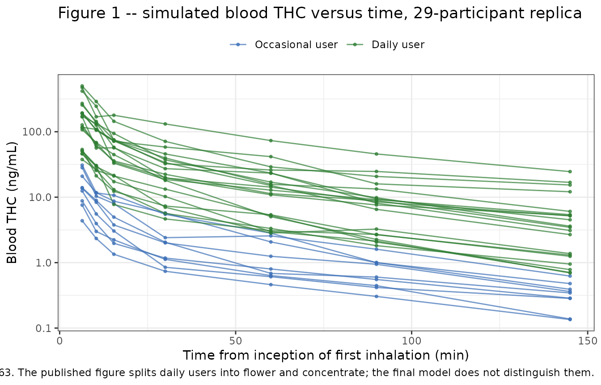
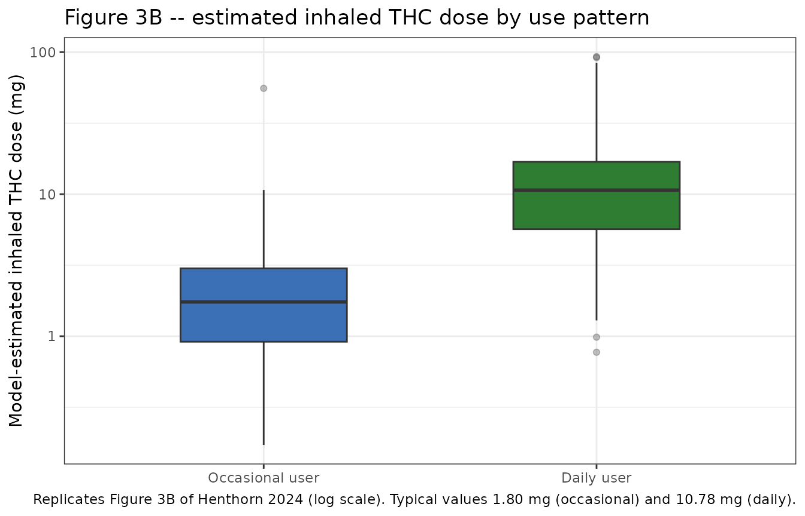

# Delta-9-tetrahydrocannabinol (Henthorn 2024)

## Model and source

- Citation: Henthorn TK, Wang GS, Dooley G, Brooks-Russell A, Wrobel J,
  Limbacher S, Kosnett M. Dose Estimation Utility in a Population
  Pharmacokinetic Analysis of Inhaled Delta-9-Tetrahydrocannabinol
  Cannabis Market Products in Occasional and Daily Users. Ther Drug
  Monit. 2024;46(5):672-680. <doi:10.1097/FTD.0000000000001224>. PMCID:
  PMC11389879. The slowly equilibrating volume V3 and the elimination
  clearance CLe were fixed to the estimates of Sempio C, Huestis MA,
  Mikulich-Gilbertson SK, et al. Population pharmacokinetic modeling of
  plasma delta-9-tetrahydrocannabinol and an active and inactive
  metabolite following controlled smoked cannabis administration. Br J
  Clin Pharmacol. 2020;86:611-619 (reference 22 of Henthorn 2024; see
  the Table 3 footnote).
- Description: Three-compartment population pharmacokinetic model for
  plasma delta-9-tetrahydrocannabinol (THC) after ad libitum inhalation
  of high-potency commercial cannabis flower and concentrate products in
  occasional and daily adult users, with the inhaled dose itself
  estimated as a fraction (Fi) of a nominal 15 mg fully bioavailable
  dose
- Article: <https://doi.org/10.1097/FTD.0000000000001224> (open access;
  PMCID PMC11389879)

Henthorn and colleagues asked a question that is unusual for a
population PK paper: rather than treating the dose as known and
estimating disposition, they treated the *dose itself* as the quantity
to be estimated. Participants inhaled commercial-market cannabis ad
libitum, so neither the amount consumed nor the inhalation efficiency
was known. The authors therefore fixed a nominal “standard” inhaled dose
of 15 mg fully bioavailable THC and estimated, per participant, the
fraction `Fi` of that nominal dose actually absorbed. The one covariate
that survived stepwise selection acts on `Fi`, not on any disposition
parameter: habitual daily users absorb roughly six times more THC per
session than occasional users.

Because no blood was drawn beyond 2.25 hours, the terminal phase is not
identifiable from these data. The slowly equilibrating volume `V3` and
the elimination clearance `CLe` were therefore fixed to the estimates of
Sempio et al., and only `VC`, `V2`, `Q2`, `Q3` and `Fi` were estimated
here.

## Population

The model was fit to 203 blood THC samples from 29 healthy adults
recruited in Colorado (Henthorn 2024 Table 1). Thirty participants
completed the study; one occasional user with no detectable blood THC at
any draw was excluded. The cohort was 65.5% female with a mean age of
32.8 years (SD 7.6) and a mean body mass index of 26.9 kg/m^2 (SD 6.2);
86.2% identified as White, 10.3% as Black/African American, and 17.2% as
Hispanic/Latino. Participants were recruited into three groups:
occasional flower users (n = 9), daily flower users (n = 10), and daily
concentrate users (n = 10). Occasional use was defined as an average of
at least 2 days per month and no more than 3 days per week over the 90
days before enrollment.

Each participant supplied their own legally purchased Colorado product
and inhaled it ad libitum over a 15-minute session (Table 2: mean 9.5
inhalations over 5.4 minutes). Total THC content was 15-30% w/w for
flower and 60-90% w/w for concentrate, giving a mean weighed THC dose of
53.0 mg (SD 58.5) against a mean model-estimated *inhaled* dose of only
11.1 mg (SD 11.1). The authors note that the cohort was predominantly
young adult White females, so extrapolation to other populations
warrants caution.

Measured blood THC was divided by the blood:plasma ratio of 0.63 before
fitting, so the model predicts **plasma** THC. Each participant’s
pre-inhalation baseline blood THC was subtracted from all subsequent
measurements.

The same information is available programmatically via the model’s
`population` metadata:

``` r

str(mod_meta$population, max.level = 1)
#> List of 14
#>  $ species       : chr "human"
#>  $ n_subjects    : num 29
#>  $ n_studies     : num 1
#>  $ n_observations: num 203
#>  $ age_range     : chr "21-55 years (enrolled); 21-53 years observed"
#>  $ age_mean      : chr "32.8 years (SD 7.6)"
#>  $ bmi_mean      : chr "26.9 kg/m^2 (SD 6.2)"
#>  $ sex_female_pct: num 65.5
#>  $ race_ethnicity: Named num [1:3] 86.2 10.3 3.4
#>   ..- attr(*, "names")= chr [1:3] "White" "Black/African American" "Other/no response"
#>  $ ethnicity     : Named num [1:3] 17.2 75.9 6.9
#>   ..- attr(*, "names")= chr [1:3] "Hispanic/Latino" "Non-Hispanic/Latino" "Declined to respond"
#>  $ disease_state : chr "healthy adult cannabis users; three recruitment groups: occasional flower (n = 9), daily flower (n = 10), daily"| __truncated__
#>  $ dose_range    : chr "ad libitum inhalation over a 15-minute session of participant-supplied Colorado commercial-market product; tota"| __truncated__
#>  $ regions       : chr "United States (Colorado)"
#>  $ notes         : chr "Henthorn 2024 Table 1 (demographics and cannabis use history) and Table 2 (observed consumption). 30 adults com"| __truncated__
```

## Source trace

Every `ini()` entry in
`inst/modeldb/specificDrugs/Henthorn_2024_tetrahydrocannabinol.R`
carries an in-file comment naming its origin. They are collected here
for review.

| Equation / parameter | Value | Source location |
|----|----|----|
| `lvc` (VC) | 17.9 L | Table 3, “Parameters of the Final Pharmacokinetic Model” (see Errata: the Abstract prints 19.9 L) |
| `lvp` (V2) | 51.6 L | Table 3; Abstract agrees (51.6 +/- 4.7 L) |
| `lvp2` (V3) | 3327 L, `fixed()` | Table 3, footnote “\*Parameters fixed to values from Sempio et al.” |
| `lq` (Q2) | 1.65 L/min | Table 3; Abstract agrees (1.65 +/- 0.14 L/min) |
| `lq2` (Q3) | 1.75 L/min | Table 3; Abstract agrees (1.75 +/- 0.10 L/min) |
| `lcl` (CLe) | 0.72 L/min, `fixed()` | Table 3, footnote “\*Parameters fixed to values from Sempio et al.” |
| `lfdepot` (Fi) | 0.12 | Table 3; the occasional-user reference level, per the Table 3 footnote “the default is Covariate_occasional user = 0” |
| `e_cannabis_daily_fdepot` | 1.79 | Table 3, row “Covariate (daily user)” |
| `etalvc` | 0.044 | Table 3, omega^2 column, VC row |
| `etalvp` | 0.16 | Table 3, omega^2 column, V2 row |
| `etalq` | 0.13 | Table 3, omega^2 column, Q2 row |
| `etalfdepot` | 0.82 | Table 3, omega^2 column, Fi row |
| `propSd` | 0.15 | Table 3, row “d”, footnoted “proportional (relative) intrasubject variability”; Methods: “the relative error method” |
| Nominal dose = 15 mg | n/a | Methods, Pharmacokinetic Analyses: “a 60 mg THC joint smoked with 25% efficiency or bioavailability (ie, 15 mg fully bioavailable by inhalation)” |
| Log-normal IIV, `theta_j = theta_TV * e^(eta_j)` | n/a | Equation (1), p. 674 |
| Categorical covariate, `theta_i = theta_TV * e^(theta_cov) * e^(eta_i)` | n/a | Equation (3), p. 675 |
| 3-compartment structure, input into VC | n/a | Figure 2, p. 677 |
| Blood:plasma ratio 0.63 | n/a | Methods, Pharmacokinetic Analyses |

### Confirming the covariate is exponential, not proportional

The categorical covariate form matters: read proportionally, a
coefficient of 1.79 would mean daily users absorb 2.79 times more; read
exponentially it means `exp(1.79) = 5.99` times more. Equation (3) is
written multiplicatively in the exponent, and the paper’s own Discussion
settles it arithmetically. Encoding the exponential form reproduces the
published typical daily-user dose exactly, which is an independent check
because that number was never used to build the model.

``` r

fi_tv <- 0.12
theta_cov <- 1.79
nominal_mg <- 15

exponential_mg <- fi_tv * exp(theta_cov) * nominal_mg
proportional_mg <- fi_tv * (1 + theta_cov) * nominal_mg

data.frame(
  Reading = c("Exponential (equation 3)", "Proportional (alternative)"),
  `Typical daily dose (mg)` = round(c(exponential_mg, proportional_mg), 3),
  `Published (Discussion p. 677)` = 10.78,
  check.names = FALSE
)
#>                      Reading Typical daily dose (mg)
#> 1   Exponential (equation 3)                  10.781
#> 2 Proportional (alternative)                   5.022
#>   Published (Discussion p. 677)
#> 1                         10.78
#> 2                         10.78

# Hard gate: the exponential reading must reproduce the published 10.78 mg.
stopifnot(abs(exponential_mg - 10.78) < 0.005)
```

The paper glosses this as “an approximate 5-fold difference”; the
coefficient actually implies 5.99-fold. The 10.78 mg figure is the
authoritative check.

## Virtual cohort

Individual participant data are not publicly available. Two virtual
cohorts are used below.

1.  A **validation cohort** of 200 occasional and 200 daily users, used
    for the NCA and the exposure summaries.
2.  A **study replica** of 29 participants matching the published group
    sizes (20 daily, 9 occasional) and the published sampling schedule,
    used to reproduce Figure 1 and the reported inhaled-dose
    distribution.

Every participant receives a single dose record of 15 mg into `central`
– the nominal fully bioavailable dose. The model’s
`f(central) <- fdepot` term scales it to that individual’s estimated
inhaled amount, so the dose record is deliberately identical for
everyone and all between-participant dose variation comes from `Fi`.

``` r

set.seed(20240501)

n_per_arm <- 200

make_events <- function(ids, cannabis_daily, obs_times) {
  lapply(seq_along(ids), function(i) {
    data.frame(
      id = ids[i],
      time = c(0, obs_times),
      amt = c(15, rep(NA_real_, length(obs_times))),
      evid = c(1L, rep(0L, length(obs_times))),
      cmt = "central",
      CANNABIS_DAILY = cannabis_daily[i]
    )
  }) |>
    dplyr::bind_rows()
}

# Dense grid over the 135-minute study window; finer early where the
# distribution phase (t1/2 = 2.8 min) is fastest.
obs_dense <- c(seq(0, 20, by = 0.25), seq(21, 135, by = 1))

events <- dplyr::bind_rows(
  make_events(seq_len(n_per_arm), rep(0, n_per_arm), obs_dense),
  make_events(n_per_arm + seq_len(n_per_arm), rep(1, n_per_arm), obs_dense)
)

stopifnot(!anyDuplicated(events[, c("id", "time", "evid")]))
```

## Simulation

``` r

mod <- readModelDb("Henthorn_2024_tetrahydrocannabinol")

sim <- rxode2::rxSolve(mod, events = events, addDosing = FALSE) |>
  as.data.frame() |>
  dplyr::mutate(
    usage = factor(
      ifelse(CANNABIS_DAILY == 1, "Daily user", "Occasional user"),
      levels = c("Occasional user", "Daily user")
    ),
    # The model predicts plasma THC; the paper's figures show blood THC.
    blood = Cc * 0.63,
    blood_obs = sim * 0.63
  )
#> ℹ parameter labels from comments will be replaced by 'label()'
```

`Cc` is the individual prediction (plasma, ng/mL) and `sim` adds the 15%
proportional residual error, so `sim` is the right column for
reproducing an *observed*-concentration figure and `Cc` is the right
column for NCA.

## Structural implementation gates

Before comparing anything to the paper, the ODE implementation is
checked against the closed-form identities that any linear mammillary
model must satisfy exactly. These test the encoding, not the parameter
values: with the Table 3 parameters held fixed, a correctly wired
three-compartment system must return `AUC(0-inf) = Dose/CL`,
`Cmax = Dose/VC` for a bolus into the central compartment, and
`Vss = VC + V2 + V3`.

The 135-minute study window captures only a small part of the total AUC,
so the gate is run on a deterministic typical-subject solve extended to
roughly ten terminal half-lives.

``` r

terminal_hl_min <- log(2) / min(abs(eigen(local({
  vc <- 17.9; vp <- 51.6; vp2 <- 3327; q <- 1.65; q2 <- 1.75; cl <- 0.72
  matrix(
    c(-(cl / vc + q / vc + q2 / vc), q / vp,   q2 / vp2,
        q / vc,                     -q / vp,   0,
        q2 / vc,                     0,       -q2 / vp2),
    nrow = 3, byrow = TRUE
  )
}))$values))

horizon_min <- 10 * terminal_hl_min
gate_times <- c(
  seq(0, 135, by = 0.5),
  exp(seq(log(136), log(horizon_min), length.out = 400))
)

gate_events <- make_events(1:2, c(0, 1), gate_times)

gate <- rxode2::rxSolve(
  mod, events = gate_events,
  params = c(etalvc = 0, etalvp = 0, etalq = 0, etalfdepot = 0),
  omega = NA, addDosing = FALSE
) |>
  as.data.frame() |>
  dplyr::mutate(
    usage = factor(
      ifelse(CANNABIS_DAILY == 1, "Daily user", "Occasional user"),
      levels = c("Occasional user", "Daily user")
    )
  )
#> Warning: multi-subject simulation without without 'omega'

round(c(`terminal half-life (h)` = terminal_hl_min / 60,
        `simulation horizon (h)` = horizon_min / 60), 1)
#> terminal half-life (h) simulation horizon (h) 
#>                   76.1                  761.4
```

The 76-hour terminal half-life implied by the fixed `V3` and `CLe` sits
inside the 30-100 hour band the paper cites for THC (Limitations,
p. 679) – an external consistency check on the two parameters carried
over from Sempio et al.

``` r

gate_conc <- gate |>
  dplyr::filter(!is.na(Cc)) |>
  dplyr::select(id, time, Cc, usage)

gate_dose <- gate |>
  dplyr::distinct(id, usage) |>
  dplyr::mutate(time = 0, amt = 15) |>
  dplyr::select(id, time, amt, usage)

gate_res <- PKNCA::pk.nca(PKNCA::PKNCAdata(
  PKNCA::PKNCAconc(gate_conc, Cc ~ time | usage + id,
                   concu = "ng/mL", timeu = "min"),
  PKNCA::PKNCAdose(gate_dose, amt ~ time | usage + id,
                   doseu = "mg", route = "intravascular"),
  intervals = data.frame(
    start = 0, end = Inf,
    cmax = TRUE, aucinf.obs = TRUE, aumcinf.obs = TRUE, half.life = TRUE
  )
))

gate_wide <- as.data.frame(gate_res$result) |>
  dplyr::select(usage, PPTESTCD, PPORRES) |>
  tidyr::pivot_wider(names_from = PPTESTCD, values_from = PPORRES)

# Closed-form references from the Table 3 parameters.
gate_ref <- data.frame(
  usage = factor(c("Occasional user", "Daily user"),
                 levels = c("Occasional user", "Daily user")),
  dose_mg = 15 * 0.12 * exp(1.79 * c(0, 1))
) |>
  dplyr::mutate(
    cmax = 1000 * dose_mg / 17.9,
    aucinf.obs = 1000 * dose_mg / 0.72,
    half.life = terminal_hl_min
  )

gate_check <- gate_wide |>
  dplyr::mutate(
    # Vss (L) = Dose(ng) * AUMC / AUC^2, then mL -> L.
    vss_sim = (gate_ref$dose_mg[match(usage, gate_ref$usage)] * 1e6) *
      aumcinf.obs / aucinf.obs^2 / 1000,
    vss_ref = 17.9 + 51.6 + 3327
  )

nlmixr2lib::ncaComparisonTable(
  simulated = gate_wide |> dplyr::select(usage, cmax, aucinf.obs, half.life),
  reference = gate_ref |> dplyr::select(usage, cmax, aucinf.obs, half.life),
  by = "usage",
  units = c(cmax = "ng/mL", aucinf.obs = "ng*min/mL", half.life = "min"),
  tolerance_pct = 20
) |>
  knitr::kable(
    caption = paste(
      "Simulated NCA versus the closed-form identities implied by the",
      "Henthorn 2024 Table 3 parameters. * marks a >20% difference."
    ),
    digits = 1
  )
```

| NCA parameter             | usage           | Reference | Simulated | % diff |
|:--------------------------|:----------------|:----------|:----------|:-------|
| Cmax (ng/mL)              | Occasional user | 101       | 101       | +0.0%  |
| Cmax (ng/mL)              | Daily user      | 602       | 602       | +0.0%  |
| AUC0-∞ (obs) (ng\*min/mL) | Occasional user | 2500      | 2500      | +0.0%  |
| AUC0-∞ (obs) (ng\*min/mL) | Daily user      | 15000     | 15000     | +0.0%  |
| t½ (min)                  | Occasional user | 4570      | 4560      | -0.2%  |
| t½ (min)                  | Daily user      | 4570      | 4560      | -0.2%  |

Simulated NCA versus the closed-form identities implied by the Henthorn
2024 Table 3 parameters. \* marks a \>20% difference. {.table
style="width:100%;"}

``` r

# Hard gates. These must hold to within numerical-integration tolerance;
# a failure means the ODE system is mis-wired, not that the paper is wrong.
stopifnot(
  all(abs(gate_wide$cmax / gate_ref$cmax - 1) < 1e-3),
  all(abs(gate_wide$aucinf.obs / gate_ref$aucinf.obs - 1) < 1e-3),
  all(abs(gate_check$vss_sim / gate_check$vss_ref - 1) < 5e-3),
  all(abs(gate_wide$half.life / terminal_hl_min - 1) < 1e-2)
)

data.frame(
  usage = gate_check$usage,
  `Vss simulated (L)` = round(gate_check$vss_sim, 1),
  `Vss = VC + V2 + V3 (L)` = round(gate_check$vss_ref, 1),
  check.names = FALSE
)
#>             usage Vss simulated (L) Vss = VC + V2 + V3 (L)
#> 1 Occasional user            3396.3                 3396.5
#> 2      Daily user            3396.2                 3396.5
```

`Cmax`, `AUC(0-inf)`, `Vss` and the terminal half-life all recover their
closed-form values, confirming the three-compartment system, the
bioavailability term and the mg-to-ng/mL scaling are wired correctly.

## Replicate published figures

### Figure 1 – observed blood THC versus time

Figure 1 of Henthorn 2024 plots measured blood THC against time for all
29 participants, beginning with the first post-inhalation sample and
colour-coded by use pattern. The study replica below matches the
published design: 20 daily and 9 occasional users, sampled at the
nominal times given in Methods (Blood Collection) – approximately 1, 5
and 10 minutes after the final inhalation, then 30, 60, 90 and 145
minutes after the inception of the first inhalation. With the mean
5.4-minute consumption time from Table 2, those seven draws per
participant give 29 x 7 = 203 samples, exactly the 203 reported in
Results.

``` r

set.seed(20240502)

consumption_min <- 5.4
study_times <- c(consumption_min + c(1, 5, 10), 30, 60, 90, 145)

replica_daily <- 20
replica_occ <- 9

replica_events <- dplyr::bind_rows(
  make_events(seq_len(replica_occ), rep(0, replica_occ), study_times),
  make_events(replica_occ + seq_len(replica_daily),
              rep(1, replica_daily), study_times)
)

replica <- rxode2::rxSolve(mod, events = replica_events, addDosing = FALSE) |>
  as.data.frame() |>
  dplyr::mutate(
    usage = factor(
      ifelse(CANNABIS_DAILY == 1, "Daily user", "Occasional user"),
      levels = c("Occasional user", "Daily user")
    ),
    blood_obs = sim * 0.63
  )

stopifnot(nrow(replica) == (replica_daily + replica_occ) * length(study_times))

ggplot(replica, aes(time, blood_obs, group = id, colour = usage)) +
  geom_line(alpha = 0.7) +
  geom_point(size = 0.8, alpha = 0.7) +
  scale_y_log10() +
  scale_colour_manual(values = c("Occasional user" = "#3B6FB6",
                                 "Daily user" = "#2E7D32")) +
  labs(
    x = "Time from inception of first inhalation (min)",
    y = "Blood THC (ng/mL)",
    colour = NULL,
    title = "Figure 1 -- simulated blood THC versus time, 29-participant replica",
    caption = paste(
      "Replicates Figure 1 of Henthorn 2024. Blood THC = plasma Cc x 0.63.",
      "The published figure splits daily users into flower and concentrate;",
      "the final model does not distinguish them."
    )
  ) +
  theme_bw() +
  theme(legend.position = "top")
```



The published figure shows daily-user traces starting in roughly the
200-700 ng/mL band and occasional-user traces roughly an order of
magnitude lower, with all traces converging toward a few ng/mL by 135
minutes. The simulated replica reproduces that separation and that
convergence. Note that the paper’s Figure 1 uses three colours
(occasional flower, daily flower, daily concentrate); the final model
collapses the two daily groups, which is precisely the finding the
covariate analysis supports.

### Figure 3B – distribution of model-estimated inhaled THC dose

Figure 3B shows box plots of the model-estimated inhaled THC dose by
group. The paper’s three recruitment groups reduce to the model’s two
levels, because further delineation into daily-flower and
daily-concentrate “did not further decrease the -2\*Loglikelihood, so it
was not included in the final model”.

``` r

dose_by_subject <- sim |>
  dplyr::distinct(id, usage, fdepot) |>
  dplyr::mutate(inhaled_mg = fdepot * 15)

ggplot(dose_by_subject, aes(usage, inhaled_mg, fill = usage)) +
  geom_boxplot(outlier.alpha = 0.3, width = 0.5) +
  scale_y_log10() +
  scale_fill_manual(values = c("Occasional user" = "#3B6FB6",
                               "Daily user" = "#2E7D32"),
                    guide = "none") +
  labs(
    x = NULL, y = "Model-estimated inhaled THC dose (mg)",
    title = "Figure 3B -- estimated inhaled THC dose by use pattern",
    caption = paste(
      "Replicates Figure 3B of Henthorn 2024 (log scale).",
      "Typical values 1.80 mg (occasional) and 10.78 mg (daily)."
    )
  ) +
  theme_bw()
```



``` r


dose_by_subject |>
  dplyr::group_by(usage) |>
  dplyr::summarise(
    n = dplyr::n(),
    `Median (mg)` = round(median(inhaled_mg), 2),
    `Q1 (mg)` = round(quantile(inhaled_mg, 0.25), 2),
    `Q3 (mg)` = round(quantile(inhaled_mg, 0.75), 2),
    `Typical value (mg)` = round(15 * 0.12 * exp(1.79 * (usage[1] == "Daily user")), 2),
    .groups = "drop"
  ) |>
  dplyr::rename("Use pattern" = usage) |>
  knitr::kable(caption = "Simulated inhaled-dose distribution by use pattern.")
```

| Use pattern     |   n | Median (mg) | Q1 (mg) | Q3 (mg) | Typical value (mg) |
|:----------------|----:|------------:|--------:|--------:|-------------------:|
| Occasional user | 200 |        1.74 |    0.91 |    3.01 |               1.80 |
| Daily user      | 200 |       10.68 |    5.67 |   16.90 |              10.78 |

Simulated inhaled-dose distribution by use pattern. {.table}

Figure 4 of the paper (weighed dose versus model-estimated dose) cannot
be reproduced: it requires the per-participant weighed doses, which are
not published at the individual level.

## PKNCA validation

NCA is run over the published 135-minute observation window, grouped by
use pattern. The window deliberately does not extend into the terminal
phase – these are the exposures the study actually observed, and the
contrast with the `AUC(0-inf)` values from the gate section above
quantifies how much of the total exposure the 2.25-hour design misses.

``` r

sim_nca <- sim |>
  dplyr::filter(!is.na(Cc)) |>
  dplyr::select(id, time, Cc, usage)

sim_nca <- dplyr::bind_rows(
  sim_nca,
  sim_nca |> dplyr::distinct(id, usage) |> dplyr::mutate(time = 0, Cc = 0)
) |>
  dplyr::distinct(id, usage, time, .keep_all = TRUE) |>
  dplyr::arrange(id, usage, time)

dose_df <- events |>
  dplyr::filter(evid == 1) |>
  dplyr::mutate(
    usage = factor(
      ifelse(CANNABIS_DAILY == 1, "Daily user", "Occasional user"),
      levels = c("Occasional user", "Daily user")
    )
  ) |>
  dplyr::select(id, time, amt, usage)

nca_res <- PKNCA::pk.nca(PKNCA::PKNCAdata(
  PKNCA::PKNCAconc(sim_nca, Cc ~ time | usage + id,
                   concu = "ng/mL", timeu = "min"),
  PKNCA::PKNCAdose(dose_df, amt ~ time | usage + id,
                   doseu = "mg", route = "intravascular"),
  intervals = data.frame(
    start = 0, end = 135,
    cmax = TRUE, tmax = TRUE, auclast = TRUE, clast.obs = TRUE
  )
))

as.data.frame(nca_res$result) |>
  dplyr::select(usage, PPTESTCD, PPORRES) |>
  dplyr::group_by(usage, PPTESTCD) |>
  dplyr::summarise(
    Median = median(PPORRES),
    `5th pctile` = quantile(PPORRES, 0.05),
    `95th pctile` = quantile(PPORRES, 0.95),
    .groups = "drop"
  ) |>
  dplyr::mutate(dplyr::across(where(is.numeric), \(x) signif(x, 3))) |>
  dplyr::rename("Use pattern" = usage, "NCA parameter" = PPTESTCD) |>
  knitr::kable(
    caption = paste(
      "Plasma THC NCA over the published 0-135 minute window,",
      "200 simulated participants per use pattern."
    )
  )
```

| Use pattern     | NCA parameter |   Median | 5th pctile | 95th pctile |
|:----------------|:--------------|---------:|-----------:|------------:|
| Occasional user | auclast       |  693.000 |    173.000 |      2810.0 |
| Occasional user | clast.obs     |    0.681 |      0.149 |         2.8 |
| Occasional user | cmax          |   87.600 |     22.800 |       368.0 |
| Occasional user | tmax          |    0.000 |      0.000 |         0.0 |
| Daily user      | auclast       | 4120.000 |    846.000 |     17600.0 |
| Daily user      | clast.obs     |    4.230 |      0.924 |        17.6 |
| Daily user      | cmax          |  554.000 |    119.000 |      2490.0 |
| Daily user      | tmax          |    0.000 |      0.000 |         0.0 |

Plasma THC NCA over the published 0-135 minute window, 200 simulated
participants per use pattern. {.table}

`Tmax` is zero for every participant because inhalation is modelled as
an instantaneous input into the central compartment (Figure 2 shows no
absorption compartment), so the peak occurs at the dose record.

### Comparison against published values

Henthorn 2024 reports no NCA table – the paper’s outputs are the
population parameters in Table 3 and the estimated inhaled doses. The
published quantities that the model can be held to are collected below.

``` r

set.seed(20240503)

# Replicate the 29-participant study 2000 times to get the sampling
# distribution of the reported mean and SD of the estimated inhaled dose.
draw_study <- function() {
  daily <- rep(c(1, 0), times = c(replica_daily, replica_occ))
  fi <- 0.12 * exp(1.79 * daily + rnorm(length(daily), 0, sqrt(0.82)))
  mg <- fi * 15
  c(mean = mean(mg), sd = sd(mg))
}

studies <- t(replicate(2000, draw_study()))

published_comparison <- tibble::tribble(
  ~Quantity,                                        ~Published,          ~Source,
  "Typical inhaled THC dose, daily user (mg)",      "10.78",             "Discussion p. 677",
  "Typical inhaled THC dose, occasional user (mg)", "1.80",              "Table 3 (Fi = 0.12 x 15 mg)",
  "Mean estimated inhaled THC, all 29 (mg)",        "11.1",              "Results p. 676",
  "SD of estimated inhaled THC, all 29 (mg)",       "11.1",              "Results p. 676",
  "Terminal half-life (h)",                         "30 to 100 (range)", "Limitations p. 679 (band cited from refs 9, 22, 25, 31)"
) |>
  dplyr::mutate(
    Simulated = sprintf("%.2f", c(
      15 * 0.12 * exp(1.79),
      15 * 0.12,
      median(studies[, "mean"]),
      median(studies[, "sd"]),
      terminal_hl_min / 60
    )),
    `Simulated 90% interval` = c(
      "exact", "exact",
      sprintf("%.1f to %.1f", quantile(studies[, "mean"], 0.05),
              quantile(studies[, "mean"], 0.95)),
      sprintf("%.1f to %.1f", quantile(studies[, "sd"], 0.05),
              quantile(studies[, "sd"], 0.95)),
      "n/a (deterministic)"
    )
  ) |>
  dplyr::relocate(Simulated, .after = Published)

knitr::kable(
  published_comparison,
  caption = paste(
    "Published quantities versus the packaged model. The two typical-value",
    "rows are exact; the two cohort rows are compared against the sampling",
    "distribution of a 29-participant study; the half-life row is a range",
    "cited by the paper rather than a value it estimated."
  )
)
```

| Quantity | Published | Simulated | Source | Simulated 90% interval |
|:---|:---|:---|:---|:---|
| Typical inhaled THC dose, daily user (mg) | 10.78 | 10.78 | Discussion p. 677 | exact |
| Typical inhaled THC dose, occasional user (mg) | 1.80 | 1.80 | Table 3 (Fi = 0.12 x 15 mg) | exact |
| Mean estimated inhaled THC, all 29 (mg) | 11.1 | 11.65 | Results p. 676 | 8.3 to 17.3 |
| SD of estimated inhaled THC, all 29 (mg) | 11.1 | 13.34 | Results p. 676 | 7.8 to 28.3 |
| Terminal half-life (h) | 30 to 100 (range) | 76.14 | Limitations p. 679 (band cited from refs 9, 22, 25, 31) | n/a (deterministic) |

Published quantities versus the packaged model. The two typical-value
rows are exact; the two cohort rows are compared against the sampling
distribution of a 29-participant study; the half-life row is a range
cited by the paper rather than a value it estimated. {.table}

``` r


# The model's terminal half-life must fall inside the band the paper cites.
stopifnot(terminal_hl_min / 60 > 30, terminal_hl_min / 60 < 100)
```

``` r

# Typical values must reproduce exactly.
stopifnot(
  abs(15 * 0.12 * exp(1.79) - 10.78) < 0.005,
  abs(15 * 0.12 - 1.80) < 1e-9
)
# The reported cohort mean and SD must fall inside the 90% sampling interval
# of a 29-participant study drawn from the published parameters.
stopifnot(
  11.1 >= quantile(studies[, "mean"], 0.05),
  11.1 <= quantile(studies[, "mean"], 0.95),
  11.1 >= quantile(studies[, "sd"], 0.05),
  11.1 <= quantile(studies[, "sd"], 0.95)
)
```

Both typical values reproduce exactly. The published cohort mean and SD
of the estimated inhaled dose fall inside the 90% sampling interval
implied by the published parameters – the appropriate comparison here,
because with an inter-individual variance of 0.82 on `Fi` (a coefficient
of variation of 113%) the sample mean and sample SD of only 29
participants are both very noisy, and the sample SD of a heavy-tailed
lognormal is biased low. Comparing the reported point values against a
single simulated cohort would over- or under-shoot for reasons that have
nothing to do with the model.

## Assumptions and deviations

- **Central volume: Table 3, not the Abstract.** `VC` is printed as 17.9
  +/- 1.20 L in Table 3 and as 19.9 +/- 1.2 L in the Abstract – an 11%
  discrepancy on a parameter that sets the peak concentration directly.
  The model uses the Table 3 value (operator ruling, 2026-08-05). The
  evidence: Table 3 is the dedicated final-model parameter table that
  the Results and Discussion cross-reference; its standard error (1.20)
  matches the Abstract’s (1.2); and every other value in the same
  Abstract sentence (V2 51.6, Q2 1.65, Q3 1.75) matches Table 3 exactly.
  A second model fit would be expected to shift the standard error too,
  so this reads as a digit transposition in the Abstract. Figure 1
  cannot discriminate between the two: the predicted initial blood THC
  for a typical daily user is 379 ng/mL with 17.9 L versus 341 ng/mL
  with 19.9 L, and both sit inside the observed band.
- **Two standard-error discrepancies, not model-relevant.** The
  covariate coefficient is 1.79 +/- 0.29 in Table 3 but 1.79 +/- 0.67 in
  the Discussion, and the `Fi` variance is 0.82 +/- 0.02 in Table 3 but
  0.82 +/- 0.23 in the Results. The point estimates agree everywhere and
  only point estimates are encoded, so neither affects the model.
- **Exponential, not proportional, covariate form.** Equation (3) is
  `theta_i = theta_TV * e^(theta_cov) * e^(eta_i)`. The trimmed markdown
  companion to the source PDF dropped all four display equations
  (“formula-not-decoded”); they were recovered from the PDF text layer
  directly. The exponential reading is confirmed arithmetically against
  the published 10.78 mg typical daily dose. The paper’s prose
  description of the effect as “an approximate 5-fold difference” is a
  loose gloss of `exp(1.79) = 5.99`.
- **Inhalation modelled as an instantaneous input.** Figure 2 shows drug
  inhaled directly into `VC` with no absorption or infusion compartment,
  and the paper describes no input rate, so the dose is encoded as a
  bolus into `central`. In the study, consumption actually took a mean
  of 5.4 minutes (Table 2) within a 15-minute window, so simulated
  concentrations in the first few minutes will peak higher and earlier
  than real measurements. This does not affect the validation, because
  the first blood sample was drawn about a minute after the *final*
  inhalation.
- **Sampling window: 135 versus 145 minutes.** The Abstract and Results
  describe 135 minutes (2.25 hours) of sampling, while Methods (Blood
  Collection) lists a final draw at 145 minutes after the inception of
  the first inhalation. The Figure 1 replica uses the Methods schedule,
  which yields exactly the 203 samples reported; NCA uses the 0-135
  minute window described in the Results.
- **Bioavailability encoded on `central`.** The canonical `lfdepot` /
  `fdepot` parameter pair is applied via `f(central)` rather than
  `f(depot)` because there is no depot compartment. This follows
  existing registry precedent (`Pillai_2004_ibandronate.R`,
  `Abrantes_2017_moroctocog.R`, `Lacy_2018_cabozantinib.R`,
  `Sanhajariya_2018_snake_venom.R`, `Boer_2015_cisplatin.R` all apply
  `f(central) <- fdepot`). Users simulating this model must dose 15 mg
  into `central`; `Fi` is applied internally.
- **Concentrations are plasma.** The model returns plasma THC in ng/mL.
  Measured blood THC was divided by the blood:plasma ratio of 0.63
  before fitting, so blood THC is recovered as `Cc * 0.63`. That
  conversion is done in this vignette rather than in the model file, so
  `Cc` stays the single canonical output.
- **`V3` and `CLe` are fixed, not estimated.** Both come from Sempio et
  al.
  2020. because this study collected no terminal-phase data. Any
        simulation extending past the 2.25-hour observation window is
        therefore governed by parameters this study did not identify,
        and the resulting `AUC(0-inf)` and `Vss` should be read as
        properties of the Sempio parameters, not of these data.
- **Covariates screened but not retained.** Age, body mass index, sex,
  the weighed cannabis dose, and the inhalation device were all tested
  and rejected in the stepwise search. They are recorded in the model
  file’s `covariatesDataExcluded` metadata rather than `covariateData`,
  so their provenance is preserved without implying they act on any
  parameter.
- **Race and ethnicity are not simulated.** No demographic covariate
  entered the final model, so the virtual cohorts carry only
  `CANNABIS_DAILY`. The published demographic distribution is recorded
  in the model’s `population` metadata for reference.
- **Group sizes in the study replica.** The published cohort is 9
  occasional and 20 daily users (10 flower, 10 concentrate). Because the
  final model does not distinguish flower from concentrate, the replica
  uses 9 occasional and 20 daily participants without further
  subdivision.
