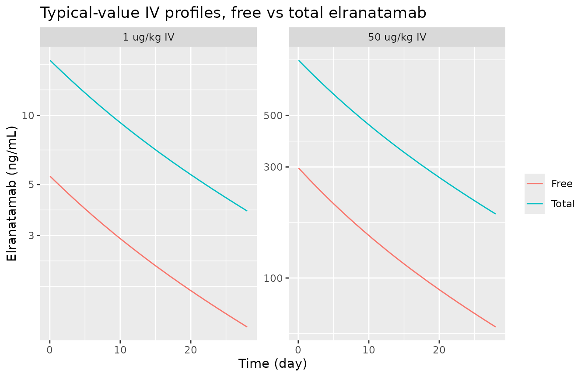
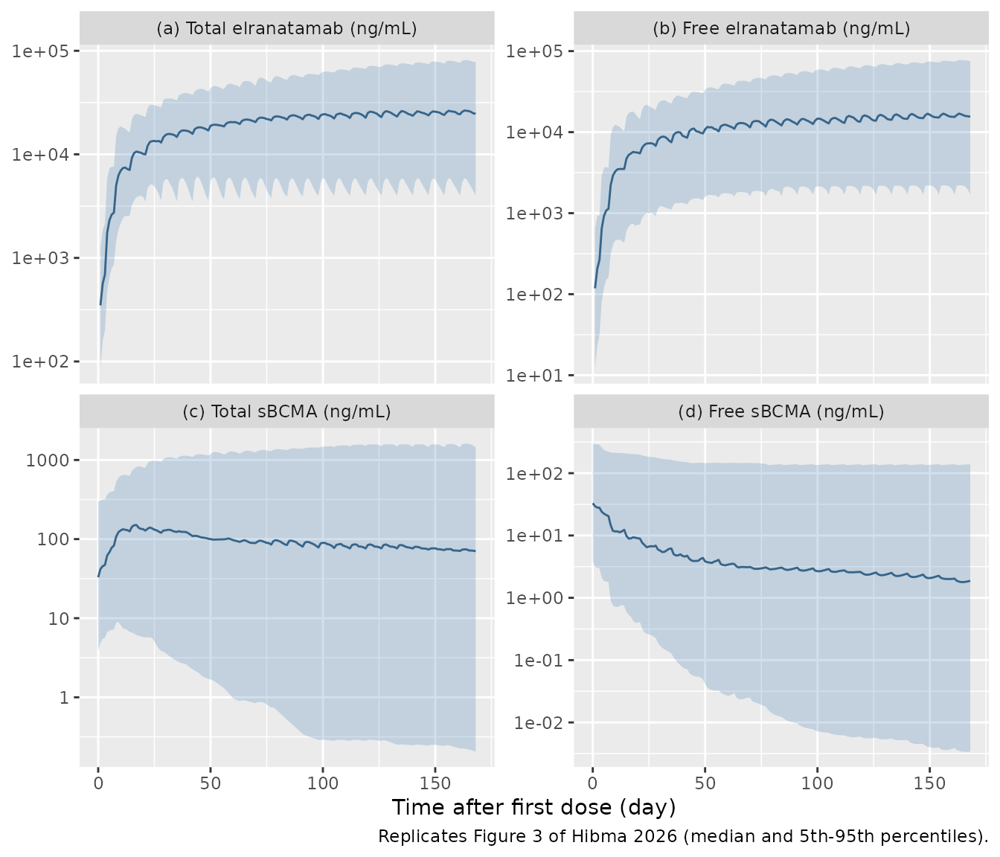
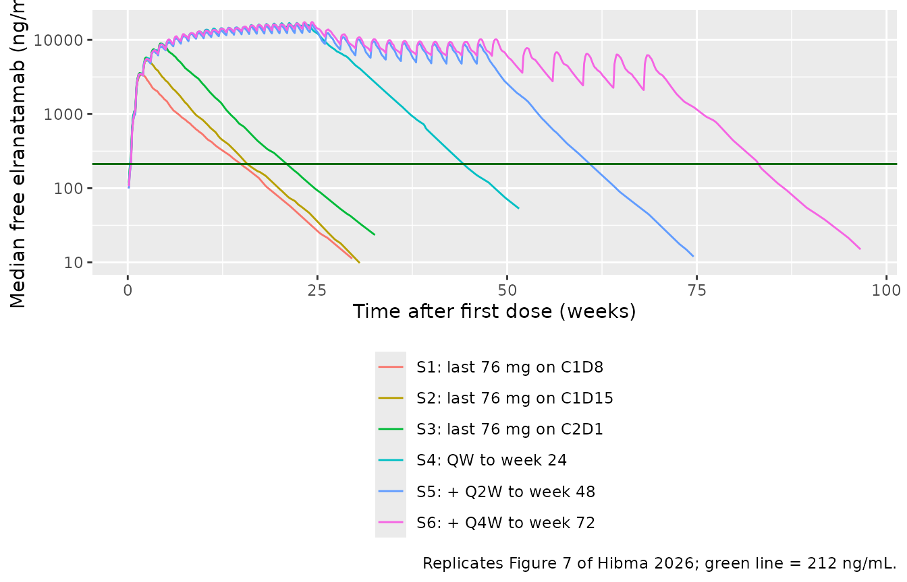
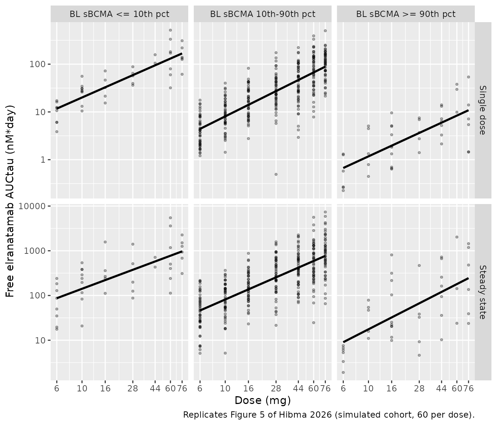
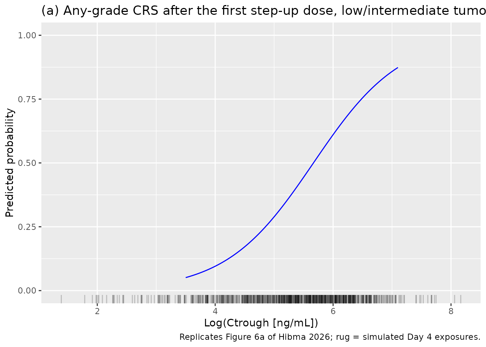
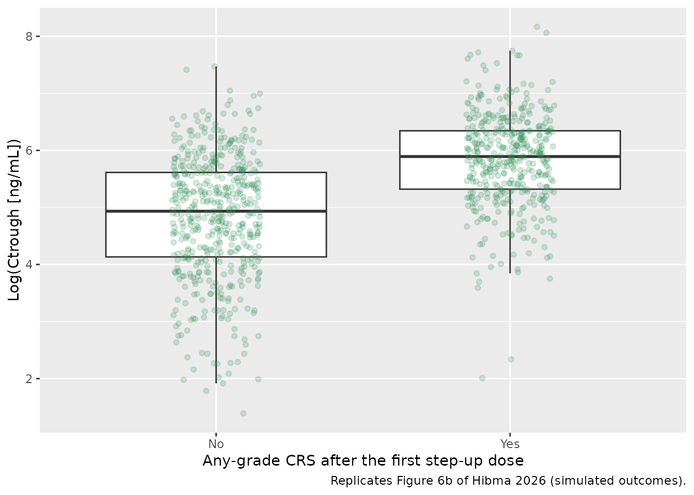

# Elranatamab population PK and CRS exposure-response (Hibma 2026)

## Model and source

Hibma 2026 contributes two models, both documented in this article:

- `Hibma_2026_elranatamab` – the population PK model. It is a
  two-compartment semi-mechanistic target-binding model for free and
  total elranatamab and free and total soluble BCMA (sBCMA).
- `Hibma_2026_elranatamab_crs` – the landmark logistic exposure-response
  model for any-grade cytokine release syndrome (CRS) after the first
  step-up priming dose. Its exposure input is the Day 4 free elranatamab
  trough, which comes from the PK model.

``` r

mod_pk <- readModelDb("Hibma_2026_elranatamab")
mod_crs <- readModelDb("Hibma_2026_elranatamab_crs")
ui_pk <- rxode2::rxode(mod_pk)
#> ℹ parameter labels from comments will be replaced by 'label()'
ui_crs <- rxode2::rxode(mod_crs)
```

- Citation: Hibma JE, Irby D, Liu A, Elmeliegy M, King LE, Gifondorwa D,
  Jiang S, Poels KE, Soltantabar P, Lon H-K, Shtylla B, Wang D, Williams
  JH, Nicholas T. Elranatamab population pharmacokinetics and
  exposure-response for cytokine release syndrome in patients with
  relapsed or refractory multiple myeloma. Clin Pharmacokinet.
  2026;65:1173-1192. <doi:10.1007/s40262-026-01663-z>.
- Description (PK): Two-compartment semi-mechanistic target-binding
  population PK model for the BCMA x CD3 bispecific antibody elranatamab
  in adults with relapsed or refractory multiple myeloma (Hibma 2026;
  MagnetisMM-1, -2, -3 and -9, N = 321). Elranatamab binds soluble BCMA
  (sBCMA) in the central compartment under rapid (quasi-)equilibrium
  with dissociation constant Kd; free drug, free sBCMA and the
  elranatamab-sBCMA complex each carry their own clearance and volume.
  States are total elranatamab (free + complex) in the central
  compartment, free elranatamab in the peripheral compartment, and total
  sBCMA with zero-order synthesis; the complex amount is the closed-form
  root of the binding quadratic. SC absorption is first order with
  bioavailability F; IV doses are 1-h infusions. Covariates: sex on
  elranatamab CL (linear), baseline body weight on elranatamab Vc and
  age on ka (power). Outputs: free (Cc) and total (Cc_total) elranatamab
  in ng/mL, free (Ctarget) and total (Ctotal_target) sBCMA in nM, each
  with proportional residual error. The companion landmark
  exposure-response model for cytokine release syndrome is
  Hibma_2026_elranatamab_crs.
- Description (CRS): Binomial logistic-regression exposure-safety model
  for any-grade cytokine release syndrome (CRS) after the FIRST step-up
  priming dose (12 mg SC on Cycle 1 Day 1) of the BCMA x CD3 bispecific
  antibody elranatamab in adults with relapsed or refractory multiple
  myeloma (Hibma 2026; MagnetisMM-3, N = 183, 79 events). The
  probability of CRS is expit(-7.65 + 1.14 \* TUM_BURDEN_HIGH + 1.35 \*
  log(CTROUGH)), where CTROUGH is the individual FREE elranatamab trough
  concentration in ng/mL on Day 4, just before the second (32 mg)
  step-up dose, and TUM_BURDEN_HIGH flags high baseline tumour burden
  (ESM Table S2). The log is natural (odds ratio 3.86 = exp(1.35) per
  unit of log(Ctrough)). There is no PK layer and no ODE: the exposure
  is supplied as a data column, derived in the source from post-hoc
  estimates of the companion population PK model Hibma_2026_elranatamab.
  No random effect and no residual error are estimated (Bernoulli
  likelihood). No exposure-response relationship was significant after
  the second step-up dose, and none could be fitted after the first full
  dose, so this is the paper’s only CRS model.
- Article: <https://doi.org/10.1007/s40262-026-01663-z> (open access,
  PMC13461831)

The CRS model’s parameters are printed in electronic supplementary
material (ESM) Table S2. The PK equations and Table 2 are in the main
text.

Elranatamab is a BCMA x CD3 bispecific antibody. A mechanistic QSP model
of the same drug, fitted to the same MagnetisMM-1 and -3 programme, is
available as `Poels_2025_elranatamab_qsp`.

## Population

The PK model was fitted to 321 adults with relapsed or refractory
multiple myeloma from four studies (Hibma 2026 Table 1, ESM Table S1):

- MagnetisMM-1: IV (1-h infusion) and SC dose escalation, step-up
  regimens and fixed-dose expansion; n = 87.
- MagnetisMM-2: Japanese patients; n = 4.
- MagnetisMM-3 Cohorts A and B: 12/32/76 mg step-up, then 76 mg QW; n =
  187.
- MagnetisMM-9: 4/20/76 mg step-up; n = 43.

Doses ranged from 0.1 to 1000 ug/kg, and fixed doses from 4 to 76 mg.
The data were 13,233 observations: 3739 total elranatamab, 2947 free
elranatamab, 3812 total sBCMA and 2735 free sBCMA.

The cohort was 48% female (154/321), 60% White, 15% Asian, 9% Black and
16% race missing. Median age was 66 years (range 36-89) and median body
weight 71.5 kg (36.5-159.6). Median baseline sBCMA was 8.29 nM
(0.00-266.67).

The CRS analysis used the 183 MagnetisMM-3 participants who received the
two step-up priming doses. There were 79 any-grade CRS events (43%)
after the first step-up dose, 35 (19%) after the second and 13 (7%)
after the first full dose. Baseline tumour burden in this population was
low or intermediate in 131 (72%), high in 38 (21%) and missing in 14
(7.7%).

``` r

str(ui_pk$population)
#> List of 13
#>  $ species       : chr "human"
#>  $ n_subjects    : int 321
#>  $ n_studies     : int 4
#>  $ n_observations: chr "13,233 non-BLQ observations: 3739 total elranatamab, 2947 free elranatamab, 3812 total sBCMA, 2735 free sBCMA ("| __truncated__
#>  $ age_range     : chr "36-89 years (median 66)"
#>  $ weight_range  : chr "36.5-159.6 kg (median 71.5)"
#>  $ sex_female_pct: num 48
#>  $ race_ethnicity: Named num [1:4] 60 15 9 16
#>   ..- attr(*, "names")= chr [1:4] "White" "Asian" "Black" "Missing"
#>  $ disease_state : chr "Relapsed or refractory multiple myeloma"
#>  $ dose_range    : chr "IV (1-h infusion) 0.1-50 ug/kg QW and SC 80-1000 ug/kg QW (MagnetisMM-1 Part 1); SC 600 then 1000 ug/kg QW or Q"| __truncated__
#>  $ regions       : chr "Multinational (MagnetisMM-2 enrolled Japanese patients only)"
#>  $ baseline_sbcma: chr "median 8.29 nM, range 0.00-266.67 (Table 1)"
#>  $ notes         : chr "MagnetisMM-1 (NCT03269136) Parts 1, 1.1 and 2A (n = 53 + 19 + 15), MagnetisMM-2 (NCT04798586, n = 4), MagnetisM"| __truncated__
str(ui_crs$population)
#> List of 11
#>  $ species       : chr "human"
#>  $ n_subjects    : int 183
#>  $ n_studies     : int 1
#>  $ n_observations: chr "183 binary any-grade CRS outcomes after the first step-up priming dose (79 events, 43%; 104 non-events)"
#>  $ age_range     : chr "36-89 years (MagnetisMM-3 Cohorts A and B; medians 68 and 67; Table 1)"
#>  $ weight_range  : chr "36.5-159.6 kg (MagnetisMM-3 Cohorts A and B; medians 72.0 and 69.3; Table 1)"
#>  $ disease_state : chr "Relapsed or refractory multiple myeloma"
#>  $ dose_range    : chr "SC elranatamab 12 mg on C1D1, 32 mg on C1D4, 76 mg on C1D8 then 76 mg QW (two-step-up priming regimen)"
#>  $ regions       : chr "Multinational (MagnetisMM-3, NCT04649359)"
#>  $ tumor_burden  : chr "MagnetisMM-3 exposure-response population: low or intermediate 131 (72%), high 38 (21%), missing 14 (7.7%) (Table 1)"
#>  $ notes         : chr "Data cutoff March 2024. After the second step-up dose 35 CRS events (19%) occurred with no significant exposure"| __truncated__
```

## Source trace

| Equation / parameter | Value | Source location |
|----|----|----|
| `d/dt(central)` (A1, total drug) | `ka*A3 - k12*(A1 - X) + k21*A2 - CL*Cf - CLcomplex*Ccomplex` | Section 2.4, equation for dA1/dt |
| `d/dt(peripheral1)` (A2) | `k12*(A1 - X) - k21*A2` | Section 2.4, dA2/dt |
| `d/dt(depot)` (A3) | `-ka*A3` | Section 2.4, dA3/dt |
| `d/dt(total_target)` (A4, total sBCMA) | `ksyn - CLsBCMA*Cf,sBCMA - CLcomplex*Ccomplex` | Section 2.4, dA4/dt |
| Free / complex concentrations | `Cf = (A1-X)/Vc`; `Cf,sBCMA = (A4-X)/Vc,sBCMA`; `Ccomplex = X/Vc,complex` | Section 2.4 |
| Complex amount `X` | smaller root of the Kd quadratic, rationalised | Section 2.4, Xcomplex equation |
| Total concentrations | `Ct = Cf + Ccomplex` (drug and sBCMA) | Section 2.4 |
| `ksyn`, `total_target(0)` | `CLsBCMA * BLsBCMA`; `BLsBCMA * Vc,sBCMA` | Not printed; drug-free steady state (see Assumptions) |
| Molecular weight | 148 kDa (sBCMA 5.4 kDa) | Section 2.2 |
| `lcl` | log(0.324) L/day | Table 2; Section 3.3 equation |
| `e_sexf_cl` | -0.492 (linear, female) | Table 2; Section 3.3 equation |
| `lvc` | log(4.777) L | Table 2 |
| `e_wt_vc` | 1.017, reference 71.45 kg | Table 2; Section 3.3 equation |
| `lvp`, `lq` | log(2.83) L, log(0.225) L/day | Table 2 |
| `lka` | log(0.287) 1/day | Table 2 |
| `e_age_ka` | -1.459, reference 66 years | Table 2; Section 3.3 equation |
| `lfdepot` | log(0.562) | Table 2 |
| `lcl_target`, `lvc_target` | log(0.273) L/day, log(15.418) L | Table 2 |
| `lrbase_target` | log(6.914) nM | Table 2 (BLsBCMA) |
| `lcl_complex`, `lvc_complex` | log(0.164) L/day, log(3.802) L | Table 2 |
| `lkd` | log(3.138) nM | Table 2 |
| IIV variances | `(CV/100)^2` of the Table 2 ‘CV (%)’ column | Table 2 (scale verified below) |
| Residual SDs | free drug 0.347, total drug 0.422, free sBCMA 0.518, total sBCMA 0.347 | Table 2 |
| `logit_ref` (CRS) | -7.65 | ESM Table S2 |
| `e_tum_burden_high_logit` | 1.14 (OR 3.11) | ESM Table S2 |
| `e_ctrough_logit` | 1.35 (OR 3.86) per unit of natural log(Ctrough, ng/mL) | ESM Table S2 |

### IIV scale: `CV% = 100 * sqrt(omega^2)`

Table 2 reports each IIV as a “CV (%)” with an RSE and a 95% CI. The
printed CI is reproduced exactly by a symmetric Wald interval on
`omega^2`, with the RSE on the variance scale, mapped back through
[`sqrt()`](https://rdrr.io/r/base/MathFun.html). The exact log-normal
CV, `sqrt(exp(omega^2) - 1)`, does not reproduce the CIs. The variances
in the model are therefore `(CV/100)^2`. This matters a lot here: for
CLsBCMA (448% CV) the two readings give `omega^2` = 20.1 and 3.05.

``` r

tab2 <- tibble::tribble(
  ~parameter,   ~cv,    ~rse,   ~lo,    ~hi,
  "Vc",         68.56,  13.346, 58.91,  77.01,
  "Vc,sBCMA",   135.98, 31.91,  83.25,  173.38,
  "CLsBCMA",    448.07, 15.702, 372.8,  512.41,
  "CLcomplex",  79.18,  19.338, 62.45,  93.01,
  "Vc,complex", 70.07,  17.261, 57.01,  81.06,
  "BLsBCMA",    134.61, 13.078, 116.1,  150.9,
  "ka",         68.41,  14.538, 57.88,  77.59
)
iiv_chk <- tab2 |>
  mutate(
    omega2 = (cv / 100)^2,
    se = rse / 100 * omega2,
    lo_sqrt = 100 * sqrt(omega2 - 1.96 * se),
    hi_sqrt = 100 * sqrt(omega2 + 1.96 * se),
    # Alternative reading: exact log-normal CV
    omega2_ln = log(1 + (cv / 100)^2),
    hi_ln = 100 * sqrt(exp(omega2_ln + 1.96 * rse / 100 * omega2_ln) - 1)
  )
iiv_chk |>
  select(parameter, cv, lo, lo_sqrt, hi, hi_sqrt, hi_ln) |>
  rename(
    "Parameter" = parameter, "CV (%)" = cv,
    "Printed lower" = lo, "sqrt-reading lower" = lo_sqrt,
    "Printed upper" = hi, "sqrt-reading upper" = hi_sqrt,
    "log-normal-reading upper" = hi_ln
  ) |>
  knitr::kable(digits = 2, caption = "Table 2 IIV confidence intervals under two readings of 'CV (%)'.")
```

| Parameter | CV (%) | Printed lower | sqrt-reading lower | Printed upper | sqrt-reading upper | log-normal-reading upper |
|:---|---:|---:|---:|---:|---:|---:|
| Vc | 68.56 | 58.91 | 58.91 | 77.01 | 77.01 | 79.12 |
| Vc,sBCMA | 135.98 | 83.25 | 83.22 | 173.38 | 173.36 | 211.75 |
| CLsBCMA | 448.07 | 372.80 | 372.80 | 512.41 | 512.40 | 727.00 |
| CLcomplex | 79.18 | 62.45 | 62.40 | 93.01 | 92.98 | 97.80 |
| Vc,complex | 70.07 | 57.01 | 57.00 | 81.06 | 81.06 | 84.07 |
| BLsBCMA | 134.61 | 116.10 | 116.08 | 150.90 | 150.88 | 163.26 |
| ka | 68.41 | 57.88 | 57.85 | 77.59 | 77.55 | 79.86 |

Table 2 IIV confidence intervals under two readings of ‘CV (%)’.
{.table}

``` r


# Deterministic: the sqrt reading reproduces every printed bound to within
# 0.05 CV points; the log-normal reading overshoots every upper bound, by
# 2.1-4.8 points for the moderate CVs and by 38 and 215 points for Vc,sBCMA
# and CLsBCMA.
stopifnot(
  max(abs(iiv_chk$lo_sqrt - iiv_chk$lo)) < 0.2,
  max(abs(iiv_chk$hi_sqrt - iiv_chk$hi)) < 0.2,
  all(iiv_chk$hi_ln - iiv_chk$hi > 1.5),
  max(iiv_chk$hi_ln - iiv_chk$hi) > 100
)

# The packaged variances equal (CV/100)^2.
om <- diag(ui_pk$omega)
stopifnot(
  abs(om[["etalcl_target"]] - 4.4807^2) < 1e-4,
  abs(om[["etalvc"]] - 0.6856^2) < 1e-4,
  abs(om[["etalrbase_target"]] - 1.3461^2) < 1e-4
)
```

### CRS odds ratios

The CRS model’s printed odds ratios should equal the exponentiated
estimates. With two-decimal rounding on both columns the test is an
interval one: there must be a coefficient that rounds to the printed
estimate and whose exponential rounds to the printed odds ratio.

``` r

or_consistent <- function(est, or, digits = 2) {
  b <- seq(est - 0.5 * 10^-digits, est + 0.5 * 10^-digits, length.out = 2001)
  any(round(b, digits) == est & round(exp(b), digits) == or)
}
ini_crs <- ui_crs$theta
stopifnot(
  or_consistent(ini_crs[["e_ctrough_logit"]], 3.86),
  or_consistent(ini_crs[["e_tum_burden_high_logit"]], 3.11),
  # 95% CI of the odds ratios equal exp() of the coefficient CIs
  abs(exp(0.869) - 2.38) < 0.01, abs(exp(1.88) - 6.55) < 0.01,
  abs(exp(0.335) - 1.40) < 0.01, abs(exp(1.97) - 7.17) < 0.01
)
```

## Typical-value checks

The helper below builds an event table. Observation rows carry
`dvid = 1` and no `cmt`, because the model has four observed outputs and
none of them is an ODE state. Every output column (`Cc`, `Cc_total`,
`Ctarget`, `Ctotal_target`) is returned at every observation row.

``` r

make_events <- function(ids, dose_times, dose_amts, obs_times,
                        route = c("sc", "iv"), inf_dur = 1 / 24) {
  route <- match.arg(route)
  dose <- tidyr::expand_grid(id = ids, k = seq_along(dose_times)) |>
    mutate(
      time = dose_times[k], amt = dose_amts[k], evid = 1L,
      cmt = if (route == "sc") "depot" else "central",
      rate = if (route == "sc") 0 else amt / inf_dur,
      dvid = NA_integer_
    ) |>
    select(-k)
  obs <- tidyr::expand_grid(id = ids, time = obs_times) |>
    mutate(amt = 0, evid = 0L, cmt = NA_character_, rate = 0, dvid = 1L)
  bind_rows(dose, obs) |> arrange(id, time, desc(evid))
}
typical_covs <- function(ev, SEXF = 0, WT = 71.45, AGE = 66) {
  ev$SEXF <- SEXF
  ev$WT <- WT
  ev$AGE <- AGE
  ev
}
mod_typ <- rxode2::zeroRe(ui_pk)
solve_typ <- function(ev, model = mod_typ) {
  as.data.frame(rxode2::rxSolve(model, events = ev, returnType = "data.frame",
                                useLinCmt = FALSE))
}
```

### Derived rate constants and half-life

The Discussion quotes elimination rate constants of 0.068/day for free
drug (CL/Vc) and 0.043/day for the complex (CLcomplex/Vc,complex). It
also gives a half-life of about 22 days at 76 mg. The first two follow
directly from Table 2. For the half-life, a typical male receives 76 mg
QW for 24 weeks and the terminal slopes of total and free elranatamab
are fitted between 60 and 120 days after the last dose. The paper does
not say which analyte its 22-day half-life refers to. Total elranatamab
matches it. Free drug declines faster (about 18 days) because the bound
fraction grows as concentrations fall towards the sBCMA pool.

``` r

th <- ui_pk$theta
kel_free <- exp(th[["lcl"]]) / exp(th[["lvc"]])
kel_complex <- exp(th[["lcl_complex"]]) / exp(th[["lvc_complex"]])

ev_hl <- make_events(1L, c(seq(0, 161, 7)), rep(76, 24), seq(0, 400, 1)) |>
  typical_covs()
s_hl <- solve_typ(ev_hl)
#> ℹ omega/sigma items treated as zero: 'etalcl', 'etalvc', 'etalvp', 'etalq', 'etalka', 'etalfdepot', 'etalcl_target', 'etalvc_target', 'etalrbase_target', 'etalcl_complex', 'etalvc_complex', 'etalkd'
term <- s_hl |> filter(time >= 161 + 60, time <= 161 + 120)
t_half <- log(2) / -coef(lm(log(Cc_total) ~ time, data = term))[["time"]]
t_half_free <- log(2) / -coef(lm(log(Cc) ~ time, data = term))[["time"]]

tibble::tibble(
  quantity = c("kel, free elranatamab (1/day)", "kel, complex (1/day)",
               "terminal half-life, total (day)", "terminal half-life, free (day)"),
  model = c(kel_free, kel_complex, t_half, t_half_free),
  paper = c(0.068, 0.043, 22, NA)
) |>
  rename("Quantity" = quantity, "Model" = model, "Hibma 2026" = paper) |>
  knitr::kable(digits = 3)
```

| Quantity                        |  Model | Hibma 2026 |
|:--------------------------------|-------:|-----------:|
| kel, free elranatamab (1/day)   |  0.068 |      0.068 |
| kel, complex (1/day)            |  0.043 |      0.043 |
| terminal half-life, total (day) | 22.023 |     22.000 |
| terminal half-life, free (day)  | 17.818 |         NA |

``` r


stopifnot(
  abs(kel_free - 0.068) < 0.0005,
  abs(kel_complex - 0.043) < 0.0005,
  abs(t_half / 22 - 1) < 0.1,
  t_half_free < t_half
)
```

### Drug-free steady state of sBCMA

With no drug the sBCMA synthesis and elimination balance at the
estimated baseline, so free and total sBCMA stay at 6.914 nM.

``` r

ev_ss <- make_events(1L, 0, 0, seq(0, 200, 10)) |> typical_covs()
s_ss <- solve_typ(ev_ss)
#> ℹ omega/sigma items treated as zero: 'etalcl', 'etalvc', 'etalvp', 'etalq', 'etalka', 'etalfdepot', 'etalcl_target', 'etalvc_target', 'etalrbase_target', 'etalcl_complex', 'etalvc_complex', 'etalkd'
stopifnot(
  max(abs(s_ss$Ctarget / 6.914 - 1)) < 1e-6,
  max(abs(s_ss$Ctotal_target / 6.914 - 1)) < 1e-6,
  max(abs(s_ss$Cc)) < 1e-8
)
```

### IV route: target binding at low doses

The IV path is exercised with 1-h infusions at two MagnetisMM-1 Part 1
dose levels, for a 71.45 kg typical male. Even 50 ug/kg (3.6 mg) gives
only about 5 nM of drug, less than the ~7 nM sBCMA pool. At every IV
dose free drug is therefore close to its analytic low-dose fraction of
total, `Kd / (Kd + BLsBCMA)` = 0.31. At 76 mg SC steady state the drug
exceeds the pool by more than 10-fold, and free and total converge.

``` r

iv <- bind_rows(lapply(c(1, 50), function(ugkg) {
  amt <- ugkg * 71.45 / 1000
  make_events(1L, 0, amt, c(seq(0, 1, 1 / 24), seq(1.5, 28, 0.5)), route = "iv") |>
    typical_covs() |>
    solve_typ() |>
    mutate(dose = paste(ugkg, "ug/kg IV"))
}))
#> ℹ omega/sigma items treated as zero: 'etalcl', 'etalvc', 'etalvp', 'etalq', 'etalka', 'etalfdepot', 'etalcl_target', 'etalvc_target', 'etalrbase_target', 'etalcl_complex', 'etalvc_complex', 'etalkd'
#> ℹ omega/sigma items treated as zero: 'etalcl', 'etalvc', 'etalvp', 'etalq', 'etalka', 'etalfdepot', 'etalcl_target', 'etalvc_target', 'etalrbase_target', 'etalcl_complex', 'etalvc_complex', 'etalkd'
iv |>
  select(time, dose, Free = Cc, Total = Cc_total) |>
  pivot_longer(c(Free, Total), names_to = "analyte", values_to = "conc") |>
  filter(conc > 0) |>
  ggplot(aes(time, conc, colour = analyte)) +
  geom_line() +
  facet_wrap(~dose, scales = "free_y") +
  scale_y_log10() +
  labs(x = "Time (day)", y = "Elranatamab (ng/mL)", colour = NULL,
       title = "Typical-value IV profiles, free vs total elranatamab")
```



``` r


frac_free <- iv |>
  filter(time == 1) |>
  mutate(f = Cc / Cc_total) |>
  pull(f, name = dose)
frac_limit <- exp(th[["lkd"]]) / (exp(th[["lkd"]]) + exp(th[["lrbase_target"]]))
frac_ss <- s_hl$Cc[s_hl$time == 161] / s_hl$Cc_total[s_hl$time == 161]
c(frac_limit = frac_limit, frac_free, frac_76mg_ss = frac_ss)
#>   frac_limit   1 ug/kg IV  50 ug/kg IV frac_76mg_ss 
#>    0.3121767    0.3127711    0.3430444    0.9108057
# Deterministic: 1 ug/kg sits within 0.01 of the analytic limit; 76 mg QW
# steady state is > 85% free (typical value 0.91).
stopifnot(
  abs(frac_free[["1 ug/kg IV"]] - frac_limit) < 0.01,
  frac_free[["50 ug/kg IV"]] < 0.45,
  frac_ss > 0.85
)
```

## Virtual cohort

The observed data are not public. The virtual patients draw covariates
to match the pooled analysis population in Table 1: 48% female; body
weight log-normal with median 71.5 kg and CV 24%, truncated to
36.5-159.6 kg; age normal with mean 65.3 years and SD 9.7, truncated to
36-89 years. Random effects are drawn from the model’s OMEGA. Each
scenario gets its own 150 virtual patients.

``` r

# rxode2 random streams are partitioned per solver thread, so the cohort
# below differs between machines with different thread counts; every
# assertion downstream is written to hold for any cohort (robust medians and
# geometric means with generous headroom, never extremes).
set.seed(20260929)
rxode2::rxSetSeed(20260929)
draw_covs <- function(n) {
  tibble::tibble(
    SEXF = rbinom(n, 1, 0.48),
    WT = pmin(pmax(71.5 * exp(rnorm(n, 0, 0.24)), 36.5), 159.6),
    AGE = pmin(pmax(round(rnorm(n, 65.3, 9.7)), 36), 89)
  )
}
n_per <- 150L

# Approved regimen: 12 mg on Day 1, 32 mg on Day 4, 76 mg QW from Day 8.
# Responders move to Q2W after week 24 (Day 169) and Q4W after week 48
# (Day 337). Time 0 is Day 1.
qw <- seq(7, 161, 7)
q2w <- seq(168, 322, 14)
q4w <- seq(336, 476, 28)
scen <- list(
  "S1: last 76 mg on C1D8" = c(0, 3, 7),
  "S2: last 76 mg on C1D15" = c(0, 3, 7, 14),
  "S3: last 76 mg on C2D1" = c(0, 3, 7, 14, 21, 28),
  "S4: QW to week 24" = c(0, 3, qw),
  "S5: + Q2W to week 48" = c(0, 3, qw, q2w),
  "S6: + Q4W to week 72" = c(0, 3, qw, q2w, q4w)
)
events <- bind_rows(lapply(seq_along(scen), function(i) {
  dt <- scen[[i]]
  last <- max(dt)
  obs <- sort(unique(c(seq(0, last + 200, 1), 3)))
  ids <- (i - 1L) * n_per + seq_len(n_per)
  make_events(ids, dt, c(12, 32, rep(76, length(dt) - 2)), obs) |>
    left_join(draw_covs(n_per) |> mutate(id = ids), by = "id") |>
    mutate(scenario = names(scen)[i], last_dose = last,
           n76 = length(dt) - 2L)
}))
stopifnot(!anyDuplicated(unique(events[, c("id", "time", "evid")])))
```

## Simulation

``` r

sim <- rxode2::rxSolve(
  mod_pk, events = events,
  keep = c("scenario", "last_dose", "n76", "SEXF", "WT", "AGE"),
  returnType = "data.frame", useLinCmt = FALSE
) |>
  as.data.frame()
#> ℹ parameter labels from comments will be replaced by 'label()'
stopifnot(!anyNA(sim$Cc), all(sim$Cc >= -1e-6 * max(sim$Cc)))
```

## Replicate published figures

### Figure 3: IPRED percentiles under 12/32/76 mg QW

Figure 3 of Hibma 2026 overlays the 5th, 50th and 95th percentiles of
the individual predictions on the observed data for the 12/32/76 mg QW
regimen. The simulated equivalent uses scenario S4 up to week 24. sBCMA
is converted from nM to ng/mL (x 5.4) to match the figure’s axes.

``` r

sim |>
  filter(scenario == "S4: QW to week 24", time <= 168) |>
  transmute(
    time,
    `(a) Total elranatamab (ng/mL)` = Cc_total,
    `(b) Free elranatamab (ng/mL)` = Cc,
    `(c) Total sBCMA (ng/mL)` = Ctotal_target * 5.4,
    `(d) Free sBCMA (ng/mL)` = Ctarget * 5.4
  ) |>
  pivot_longer(-time, names_to = "panel", values_to = "conc") |>
  group_by(panel, time) |>
  summarise(
    q05 = quantile(conc, 0.05), q50 = median(conc), q95 = quantile(conc, 0.95),
    .groups = "drop"
  ) |>
  filter(q05 > 0) |>
  ggplot(aes(time, q50)) +
  geom_ribbon(aes(ymin = q05, ymax = q95), alpha = 0.25, fill = "steelblue") +
  geom_line(colour = "steelblue4") +
  facet_wrap(~panel, scales = "free_y") +
  scale_y_log10() +
  labs(x = "Time after first dose (day)", y = NULL,
       caption = "Replicates Figure 3 of Hibma 2026 (median and 5th-95th percentiles).")
```



### Figure 7 and Table 4: dose-interruption scenarios

Figure 7 shows the median free elranatamab profile when dosing stops
after each of six scenarios. The threshold is 212 ng/mL, the geometric
mean peak free concentration after the 12 mg first step-up dose. Table 4
lists the time from the last dose until the median falls below this
threshold. It also lists the median concentration 84 days (12 weeks)
after the last dose.

``` r

threshold <- 212
med <- sim |>
  group_by(scenario, last_dose, n76, time) |>
  summarise(Cc = median(Cc), .groups = "drop")

ggplot(med |> filter(Cc > 1), aes(time / 7, Cc, colour = scenario)) +
  geom_line() +
  geom_hline(yintercept = threshold, colour = "darkgreen") +
  scale_y_log10() +
  labs(x = "Time after first dose (weeks)", y = "Median free elranatamab (ng/mL)",
       colour = NULL,
       caption = "Replicates Figure 7 of Hibma 2026; green line = 212 ng/mL.") +
  theme(legend.position = "bottom", legend.direction = "vertical")
```



``` r

# Time after the last dose at which the median crosses the threshold, by
# log-linear interpolation between the bracketing daily grid points.
cross_time <- function(t, c, thr) {
  i <- which(c <= thr)[1]
  if (is.na(i) || i == 1L) return(NA_real_)
  t[i - 1] + (log(thr) - log(c[i - 1])) / (log(c[i]) - log(c[i - 1])) * (t[i] - t[i - 1])
}
tab4_pub <- tibble::tribble(
  ~scenario,                   ~n76_pub, ~t_pub, ~c84_pub,
  "S1: last 76 mg on C1D8",    1,        87.3,   231.9,
  "S2: last 76 mg on C1D15",   2,        103.5,  390.5,
  "S3: last 76 mg on C2D1",    4,        119.6,  697.1,
  "S4: QW to week 24",         23,       143.1,  1668.0,
  "S5: + Q2W to week 48",      35,       123.9,  863.0,
  "S6: + Q4W to week 72",      41,       107,    449.0
)
tab4 <- med |>
  filter(time > last_dose) |>
  group_by(scenario, n76, last_dose) |>
  summarise(
    t_sim = cross_time(time - last_dose, Cc, threshold),
    c84_sim = Cc[which.min(abs(time - last_dose - 84))],
    .groups = "drop"
  ) |>
  left_join(tab4_pub, by = "scenario") |>
  mutate(t_pct = 100 * (t_sim / t_pub - 1), c84_pct = 100 * (c84_sim / c84_pub - 1))

tab4 |>
  select(scenario, n76, t_pub, t_sim, t_pct, c84_pub, c84_sim, c84_pct) |>
  rename(
    "Scenario" = scenario, "76 mg doses" = n76,
    "Days to <= 212 ng/mL, paper" = t_pub, "Days, simulated" = t_sim, "Days % diff" = t_pct,
    "Conc. 84 d after last dose, paper (ng/mL)" = c84_pub,
    "Conc. 84 d, simulated" = c84_sim, "Conc. % diff" = c84_pct
  ) |>
  knitr::kable(digits = 1, caption = "Reproduces Table 4 of Hibma 2026.")
```

| Scenario | 76 mg doses | Days to \<= 212 ng/mL, paper | Days, simulated | Days % diff | Conc. 84 d after last dose, paper (ng/mL) | Conc. 84 d, simulated | Conc. % diff |
|:---|---:|---:|---:|---:|---:|---:|---:|
| S1: last 76 mg on C1D8 | 1 | 87.3 | 97.3 | 11.4 | 231.9 | 297.2 | 28.2 |
| S2: last 76 mg on C1D15 | 2 | 103.5 | 96.4 | -6.9 | 390.5 | 329.1 | -15.7 |
| S3: last 76 mg on C2D1 | 4 | 119.6 | 118.6 | -0.8 | 697.1 | 570.2 | -18.2 |
| S4: QW to week 24 | 23 | 143.1 | 148.7 | 3.9 | 1668.0 | 1595.7 | -4.3 |
| S5: + Q2W to week 48 | 35 | 123.9 | 104.3 | -15.9 | 863.0 | 391.6 | -54.6 |
| S6: + Q4W to week 72 | 41 | 107.0 | 105.9 | -1.1 | 449.0 | 421.2 | -6.2 |

Reproduces Table 4 of Hibma 2026. {.table}

``` r


stopifnot(
  all(tab4$n76 == tab4$n76_pub),
  nrow(tab4) == 6L, !anyNA(tab4$t_sim),
  # The paper's conclusion: the median stays above the threshold for more
  # than 12 weeks in every scenario.
  all(tab4$t_sim > 84),
  # Structural envelope. The paper's medians come from post-hoc estimates of
  # the 321 analysed patients, ours from a fresh cohort. A mis-transcribed
  # CL, Vc, F or MW moves these times by tens of days.
  abs(median(tab4$t_pct)) < 15,
  max(abs(tab4$t_pct)) < 30
)
```

Days-to-threshold reproduces to within 16% in every scenario. The median
difference is about 1%, and all six scenarios stay above 12 weeks, which
is the paper’s conclusion. The 84-day concentrations agree less closely.
They fall on the steep terminal decline, where shifting the curve by a
few days moves the concentration by tens of percent.

## PKNCA validation

### Table 3: free elranatamab exposure metrics

Table 3 gives the geometric mean (GM) Caverage, Cmax and Ctrough of free
elranatamab over four dosing intervals of the full regimen: the first
full dose (Day 8), steady-state QW (week 24), Q2W (week 48) and Q4W
(week 72). Scenario S6 follows that regimen. PKNCA computes the interval
metrics. `cmin` stands in for Ctrough, because PKNCA’s `ctrough` is
undefined for an interval that does not start at time 0. Results are
pooled by GM to match the table.

``` r

s6 <- sim |> filter(scenario == "S6: + Q4W to week 72")
conc_df <- s6 |>
  filter(!is.na(Cc)) |>
  mutate(Cc = pmax(Cc, 0)) |>
  select(id, time, Cc, scenario)
conc_df <- bind_rows(
  conc_df,
  conc_df |> distinct(id, scenario) |> mutate(time = 0, Cc = 0)
) |>
  distinct(id, scenario, time, .keep_all = TRUE) |>
  arrange(id, scenario, time)
dose_df <- events |>
  filter(scenario == "S6: + Q4W to week 72", evid == 1) |>
  select(id, time, amt, scenario)

conc_obj <- PKNCA::PKNCAconc(conc_df, Cc ~ time | scenario + id)
dose_obj <- PKNCA::PKNCAdose(dose_df, amt ~ time | scenario + id)
intervals <- data.frame(
  start = c(7, 161, 322, 476),
  end = c(14, 168, 336, 504),
  cmax = TRUE, cav = TRUE, cmin = TRUE
)
nca_res <- PKNCA::pk.nca(PKNCA::PKNCAdata(conc_obj, dose_obj, intervals = intervals))
```

``` r

period_lab <- c(`7` = "First full dose (Day 8)", `161` = "SSQW (Week 24)",
                `322` = "SSQ2W (Week 48)", `476` = "SSQ4W (Week 72)")
gm <- function(x) exp(mean(log(x)))
sim_gm <- as.data.frame(nca_res$result) |>
  filter(PPTESTCD %in% c("cmax", "cav", "cmin")) |>
  mutate(period = unname(period_lab[as.character(start)])) |>
  group_by(period, PPTESTCD) |>
  summarise(PPORRES = gm(PPORRES), .groups = "drop")

published_t3 <- tibble::tribble(
  ~period,                    ~cav,     ~cmax,    ~cmin,
  "First full dose (Day 8)",  3083.46,  3794.53,  323.35,
  "SSQW (Week 24)",           32025.26, 33020.03, 30460.11,
  "SSQ2W (Week 48)",          17688.78, 19493.64, 15099.10,
  "SSQ4W (Week 72)",          8788.19,  11519.69, 5921.46
)
cmp <- nlmixr2lib::ncaComparisonTable(
  simulated = sim_gm, reference = published_t3, by = "period",
  units = c(cmax = "ng/mL", cav = "ng/mL", cmin = "ng/mL"),
  tolerance_pct = 20
)
knitr::kable(cmp, caption = "Geometric-mean free elranatamab exposure: simulated vs Hibma 2026 Table 3. * differs by >20%.")
```

| NCA parameter | period                  | Reference | Simulated | % diff    |
|:--------------|:------------------------|:----------|:----------|:----------|
| Cmax (ng/mL)  | First full dose (Day 8) | 3790      | 3490      | -8.1%     |
| Cmax (ng/mL)  | SSQW (Week 24)          | 33000     | 16600     | -49.9%\*  |
| Cmax (ng/mL)  | SSQ2W (Week 48)         | 19500     | 10400     | -46.5%\*  |
| Cmax (ng/mL)  | SSQ4W (Week 72)         | 11500     | 6710      | -41.7%\*  |
| Cmin (ng/mL)  | First full dose (Day 8) | 323       | 986       | +204.9%\* |
| Cmin (ng/mL)  | SSQW (Week 24)          | 30500     | 14000     | -54.0%\*  |
| Cmin (ng/mL)  | SSQ2W (Week 48)         | 15100     | 6680      | -55.8%\*  |
| Cmin (ng/mL)  | SSQ4W (Week 72)         | 5920      | 2390      | -59.6%\*  |
| Cavg (ng/mL)  | First full dose (Day 8) | 3080      | 2800      | -9.3%     |
| Cavg (ng/mL)  | SSQW (Week 24)          | 32000     | 15600     | -51.2%\*  |
| Cavg (ng/mL)  | SSQ2W (Week 48)         | 17700     | 8880      | -49.8%\*  |
| Cavg (ng/mL)  | SSQ4W (Week 72)         | 8790      | 4600      | -47.7%\*  |

Geometric-mean free elranatamab exposure: simulated vs Hibma 2026 Table
3. \* differs by \>20%. {.table}

``` r


gm_ratio <- sim_gm |>
  left_join(pivot_longer(published_t3, -period, names_to = "PPTESTCD", values_to = "pub"),
            by = c("period", "PPTESTCD")) |>
  mutate(ratio = PPORRES / pub)
```

The first-full-dose Cmax and Caverage agree with Table 3 to within about
10%. Two groups of rows do not reproduce, and both are recorded as known
deviations rather than tuned away:

- **Steady-state rows (weeks 24, 48 and 72).** The simulation gives
  about half the Table 3 geometric means. The paper is not
  self-consistent here. Its own Figure 7 median at week 24 is about
  20,000 ng/mL, against a Table 3 GM of 32,025 ng/mL. Table 4, which
  this article reproduces closely (above), was simulated over all 321
  patients. Table 3 summarises post-hoc estimates of the analysis
  population at those weeks. The patients still on treatment then are
  mostly responders with lower clearance, and the tight Table 3 CVs
  (46-60%, against a 100% CV on CL) point to that enriched subset. The
  paper itself excluded simulated subjects with CL \> 0.3 L/day after
  about 84 days to reproduce this dropout in its pcVPCs (Section 2.7).
  The virtual cohort has no dropout.
- **First-full-dose Ctrough.** Table 3 prints 323 ng/mL. That is barely
  above the 212 ng/mL GM peak after the 12 mg dose, although the 32 mg
  second step-up dose has been given in between. The simulated Day 8
  pre-dose value, which is PKNCA’s `cmin` over Days 8-15, is about three
  times higher. The paper does not define which trough this row holds,
  so the row is displayed and excluded from the gate.

``` r

gated <- gm_ratio |> filter(!(period == "First full dose (Day 8)" & PPTESTCD == "cmin"))
stopifnot(
  nrow(gm_ratio) == 12L, !anyNA(gm_ratio$ratio), nrow(gated) == 11L,
  # First full dose: every patient contributes, so no enrichment.
  all(abs(gated$ratio[gated$period == "First full dose (Day 8)"] - 1) < 0.35),
  # Later intervals: the simulation must not EXCEED the enriched table and
  # must stay within a factor of 3 of it (realised 0.40-0.58).
  all(gated$ratio > 1 / 3), all(gated$ratio < 1.3)
)
```

### Accumulation, dose proportionality and baseline sBCMA (Figure 5)

The paper gives median accumulation ratios for 76 mg QW. For Cmax they
are 4.8 (total) and 6.6 (free); for AUCtau they are 8.0 (total) and 11.2
(free). Figure 5 regresses log free AUCtau on log dose over 6-76 mg SC
QW. The slopes are about 1.0-1.2 overall. At steady state the slope
rises to about 1.6 for patients above the 90th percentile of baseline
sBCMA, where the shed-target sink saturates.

The accumulation ratios are medians over 200 virtual patients receiving
76 mg QW from the first dose. Each ratio is steady state (week 24) over
the first dose. The typical male is shown alongside. Females (half the
clearance) accumulate more than the typical male, so the cohort median
sits above him. The dose-proportionality slopes use typical values at
the 10th and 90th percentiles of the model’s baseline sBCMA
distribution. At the 90th percentile that is 6.914 \* exp(1.2816 \*
1.3461) = 38.9 nM, and these slopes are deterministic. A small
stochastic cohort then gives the population picture.

``` r

auc_tau <- function(s, from, to, col) {
  d <- s[s$time >= from & s$time <= to, ]
  sum(diff(d$time) * (head(d[[col]], -1) + tail(d[[col]], -1)) / 2)
}
acc_ratios <- function(s) {
  c(
    cmax_total = max(s$Cc_total[s$time >= 161]) / max(s$Cc_total[s$time <= 7]),
    cmax_free = max(s$Cc[s$time >= 161]) / max(s$Cc[s$time <= 7]),
    auc_total = auc_tau(s, 161, 168, "Cc_total") / auc_tau(s, 0, 7, "Cc_total"),
    auc_free = auc_tau(s, 161, 168, "Cc") / auc_tau(s, 0, 7, "Cc")
  )
}
grid <- sort(unique(c(seq(0, 7, 0.05), seq(7, 161, 1), seq(161, 168, 0.05))))
s76 <- make_events(1L, seq(0, 161, 7), rep(76, 24), grid) |> typical_covs() |> solve_typ()
#> ℹ omega/sigma items treated as zero: 'etalcl', 'etalvc', 'etalvp', 'etalq', 'etalka', 'etalfdepot', 'etalcl_target', 'etalvc_target', 'etalrbase_target', 'etalcl_complex', 'etalvc_complex', 'etalkd'

rxode2::rxSetSeed(76)
ev_acc <- make_events(seq_len(200), seq(0, 161, 7), rep(76, 24), grid) |>
  left_join(draw_covs(200) |> mutate(id = seq_len(200)), by = "id")
sim_acc <- rxode2::rxSolve(mod_pk, events = ev_acc, returnType = "data.frame",
                           useLinCmt = FALSE) |>
  as.data.frame()
acc_cohort <- sim_acc |>
  group_by(id) |>
  group_modify(~ as.data.frame(t(acc_ratios(.x)))) |>
  ungroup()

acc <- tibble::tibble(
  metric = c("Cmax, total", "Cmax, free", "AUCtau, total", "AUCtau, free"),
  typical = acc_ratios(s76),
  cohort = vapply(acc_cohort[, -1], median, numeric(1)),
  paper = c(4.8, 6.6, 8.0, 11.2)
)
acc |>
  rename("Accumulation ratio (76 mg QW, week 24 / first dose)" = metric,
         "Typical male" = typical, "Cohort median" = cohort,
         "Hibma 2026 (median)" = paper) |>
  knitr::kable(digits = 2)
```

| Accumulation ratio (76 mg QW, week 24 / first dose) | Typical male | Cohort median | Hibma 2026 (median) |
|:---|---:|---:|---:|
| Cmax, total | 3.42 | 4.75 | 4.8 |
| Cmax, free | 5.40 | 6.41 | 6.6 |
| AUCtau, total | 4.28 | 5.87 | 8.0 |
| AUCtau, free | 7.26 | 8.09 | 11.2 |

``` r

# The per-patient ratios are heavily right-skewed (interquartile range about
# 3-10 for AUCtau, total), so a 200-patient median is noisy: two cohorts
# drawn while writing this article gave cohort/paper ratios of 0.72-0.99 and
# 0.94-1.43 across the four rows. The bound admits that spread; the typical
# male, a deterministic floor, sits 35-46% below the paper for AUCtau.
stopifnot(all(abs(log(acc$cohort / acc$paper)) < log(1.6)))
```

Here the four cohort medians fall within 30% of the paper’s medians.
Another 200-patient cohort drawn while writing this article landed up to
43% above them, so the spread between one cohort and the next is as
large as the difference from the paper. It comes from the long right
tail created by the 100% CV on elranatamab clearance and the 448% CV on
sBCMA clearance. The paper’s medians were taken over the post-hoc
estimates of 321 patients, so they carry the same kind of sampling
noise.

``` r

dp_doses <- c(6, 10, 16, 28, 44, 60, 76)
slope_at <- function(model) {
  res <- vapply(dp_doses, function(d) {
    s <- make_events(1L, seq(0, 161, 7), rep(d, 24), grid) |> typical_covs() |>
      solve_typ(model = model)
    c(sd = auc_tau(s, 0, 7, "Cc"), ss = auc_tau(s, 161, 168, "Cc"))
  }, numeric(2))
  c(single = unname(coef(lm(log(res["sd", ]) ~ log(dp_doses)))[2]),
    ss = unname(coef(lm(log(res["ss", ]) ~ log(dp_doses)))[2]))
}
bl90 <- exp(th[["lrbase_target"]] + qnorm(0.9) * sqrt(om[["etalrbase_target"]]))
bl10 <- exp(th[["lrbase_target"]] + qnorm(0.1) * sqrt(om[["etalrbase_target"]]))
slopes <- rbind(
  "BL sBCMA 10th percentile" = slope_at(mod_typ |> rxode2::ini(lrbase_target = log(bl10))),
  "BL sBCMA typical (6.914 nM)" = slope_at(mod_typ),
  "BL sBCMA 90th percentile" = slope_at(mod_typ |> rxode2::ini(lrbase_target = log(bl90)))
)
#> ℹ change initial estimate of `lrbase_target` to `0.208449498966833`
#> ℹ omega/sigma items treated as zero: 'etalcl', 'etalvc', 'etalvp', 'etalq', 'etalka', 'etalfdepot', 'etalcl_target', 'etalvc_target', 'etalrbase_target', 'etalcl_complex', 'etalvc_complex', 'etalkd'
#> ℹ omega/sigma items treated as zero: 'etalcl', 'etalvc', 'etalvp', 'etalq', 'etalka', 'etalfdepot', 'etalcl_target', 'etalvc_target', 'etalrbase_target', 'etalcl_complex', 'etalvc_complex', 'etalkd'
#> ℹ omega/sigma items treated as zero: 'etalcl', 'etalvc', 'etalvp', 'etalq', 'etalka', 'etalfdepot', 'etalcl_target', 'etalvc_target', 'etalrbase_target', 'etalcl_complex', 'etalvc_complex', 'etalkd'
#> ℹ omega/sigma items treated as zero: 'etalcl', 'etalvc', 'etalvp', 'etalq', 'etalka', 'etalfdepot', 'etalcl_target', 'etalvc_target', 'etalrbase_target', 'etalcl_complex', 'etalvc_complex', 'etalkd'
#> ℹ omega/sigma items treated as zero: 'etalcl', 'etalvc', 'etalvp', 'etalq', 'etalka', 'etalfdepot', 'etalcl_target', 'etalvc_target', 'etalrbase_target', 'etalcl_complex', 'etalvc_complex', 'etalkd'
#> ℹ omega/sigma items treated as zero: 'etalcl', 'etalvc', 'etalvp', 'etalq', 'etalka', 'etalfdepot', 'etalcl_target', 'etalvc_target', 'etalrbase_target', 'etalcl_complex', 'etalvc_complex', 'etalkd'
#> ℹ omega/sigma items treated as zero: 'etalcl', 'etalvc', 'etalvp', 'etalq', 'etalka', 'etalfdepot', 'etalcl_target', 'etalvc_target', 'etalrbase_target', 'etalcl_complex', 'etalvc_complex', 'etalkd'
#> ℹ omega/sigma items treated as zero: 'etalcl', 'etalvc', 'etalvp', 'etalq', 'etalka', 'etalfdepot', 'etalcl_target', 'etalvc_target', 'etalrbase_target', 'etalcl_complex', 'etalvc_complex', 'etalkd'
#> ℹ omega/sigma items treated as zero: 'etalcl', 'etalvc', 'etalvp', 'etalq', 'etalka', 'etalfdepot', 'etalcl_target', 'etalvc_target', 'etalrbase_target', 'etalcl_complex', 'etalvc_complex', 'etalkd'
#> ℹ omega/sigma items treated as zero: 'etalcl', 'etalvc', 'etalvp', 'etalq', 'etalka', 'etalfdepot', 'etalcl_target', 'etalvc_target', 'etalrbase_target', 'etalcl_complex', 'etalvc_complex', 'etalkd'
#> ℹ omega/sigma items treated as zero: 'etalcl', 'etalvc', 'etalvp', 'etalq', 'etalka', 'etalfdepot', 'etalcl_target', 'etalvc_target', 'etalrbase_target', 'etalcl_complex', 'etalvc_complex', 'etalkd'
#> ℹ omega/sigma items treated as zero: 'etalcl', 'etalvc', 'etalvp', 'etalq', 'etalka', 'etalfdepot', 'etalcl_target', 'etalvc_target', 'etalrbase_target', 'etalcl_complex', 'etalvc_complex', 'etalkd'
#> ℹ omega/sigma items treated as zero: 'etalcl', 'etalvc', 'etalvp', 'etalq', 'etalka', 'etalfdepot', 'etalcl_target', 'etalvc_target', 'etalrbase_target', 'etalcl_complex', 'etalvc_complex', 'etalkd'
#> ℹ omega/sigma items treated as zero: 'etalcl', 'etalvc', 'etalvp', 'etalq', 'etalka', 'etalfdepot', 'etalcl_target', 'etalvc_target', 'etalrbase_target', 'etalcl_complex', 'etalvc_complex', 'etalkd'
#> ℹ change initial estimate of `lrbase_target` to `3.65864718403203`
#> ℹ omega/sigma items treated as zero: 'etalcl', 'etalvc', 'etalvp', 'etalq', 'etalka', 'etalfdepot', 'etalcl_target', 'etalvc_target', 'etalrbase_target', 'etalcl_complex', 'etalvc_complex', 'etalkd'
#> ℹ omega/sigma items treated as zero: 'etalcl', 'etalvc', 'etalvp', 'etalq', 'etalka', 'etalfdepot', 'etalcl_target', 'etalvc_target', 'etalrbase_target', 'etalcl_complex', 'etalvc_complex', 'etalkd'
#> ℹ omega/sigma items treated as zero: 'etalcl', 'etalvc', 'etalvp', 'etalq', 'etalka', 'etalfdepot', 'etalcl_target', 'etalvc_target', 'etalrbase_target', 'etalcl_complex', 'etalvc_complex', 'etalkd'
#> ℹ omega/sigma items treated as zero: 'etalcl', 'etalvc', 'etalvp', 'etalq', 'etalka', 'etalfdepot', 'etalcl_target', 'etalvc_target', 'etalrbase_target', 'etalcl_complex', 'etalvc_complex', 'etalkd'
#> ℹ omega/sigma items treated as zero: 'etalcl', 'etalvc', 'etalvp', 'etalq', 'etalka', 'etalfdepot', 'etalcl_target', 'etalvc_target', 'etalrbase_target', 'etalcl_complex', 'etalvc_complex', 'etalkd'
#> ℹ omega/sigma items treated as zero: 'etalcl', 'etalvc', 'etalvp', 'etalq', 'etalka', 'etalfdepot', 'etalcl_target', 'etalvc_target', 'etalrbase_target', 'etalcl_complex', 'etalvc_complex', 'etalkd'
#> ℹ omega/sigma items treated as zero: 'etalcl', 'etalvc', 'etalvp', 'etalq', 'etalka', 'etalfdepot', 'etalcl_target', 'etalvc_target', 'etalrbase_target', 'etalcl_complex', 'etalvc_complex', 'etalkd'
knitr::kable(slopes, digits = 2,
             caption = "Typical-value slope of log(free AUCtau) on log(dose), 6-76 mg SC QW (Figure 5 reports about 1.0-1.2, and 1.6 at steady state for the upper sBCMA decile).")
```

|                             | single |   ss |
|:----------------------------|-------:|-----:|
| BL sBCMA 10th percentile    |   1.05 | 1.02 |
| BL sBCMA typical (6.914 nM) |   1.17 | 1.14 |
| BL sBCMA 90th percentile    |   1.10 | 1.63 |

Typical-value slope of log(free AUCtau) on log(dose), 6-76 mg SC QW
(Figure 5 reports about 1.0-1.2, and 1.6 at steady state for the upper
sBCMA decile). {.table}

``` r

stopifnot(
  all(abs(slopes[1:2, ] - 1.1) < 0.2),
  slopes["BL sBCMA 90th percentile", "ss"] > 1.3
)
```

``` r

# Stochastic cohort, 60 per dose level, for the Figure 5 display.
trap <- function(t, c) sum(diff(t) * (head(c, -1) + tail(c, -1)) / 2)
grid_dp <- sort(unique(c(seq(0, 7, 0.25), seq(161, 168, 0.25))))
ev_dp <- bind_rows(lapply(seq_along(dp_doses), function(i) {
  ids <- (i - 1L) * 60L + seq_len(60)
  make_events(ids, seq(0, 161, 7), rep(dp_doses[i], 24), grid_dp) |>
    left_join(draw_covs(60) |> mutate(id = ids), by = "id") |>
    mutate(dose = dp_doses[i])
}))
sim_dp <- rxode2::rxSolve(mod_pk, events = ev_dp, keep = "dose",
                          returnType = "data.frame", useLinCmt = FALSE) |>
  as.data.frame()
# AUC in nM*day, as in Figure 5 (ng/mL / 148 = nM).
auc_dp <- sim_dp |>
  group_by(id, dose) |>
  summarise(
    rbase = first(rbase_target),
    `Single dose` = trap(time[time <= 7], Cc[time <= 7]) / 148,
    `Steady state` = trap(time[time >= 161], Cc[time >= 161]) / 148,
    .groups = "drop"
  )
bl_cut <- quantile(auc_dp$rbase, c(0.1, 0.9))
auc_dp <- auc_dp |>
  mutate(bl_group = case_when(
    rbase <= bl_cut[1] ~ "BL sBCMA <= 10th pct",
    rbase >= bl_cut[2] ~ "BL sBCMA >= 90th pct",
    TRUE ~ "BL sBCMA 10th-90th pct"
  ), bl_group = factor(bl_group, c("BL sBCMA <= 10th pct", "BL sBCMA 10th-90th pct", "BL sBCMA >= 90th pct"))) |>
  pivot_longer(c(`Single dose`, `Steady state`), names_to = "period", values_to = "auc")

ggplot(auc_dp, aes(dose, auc)) +
  geom_point(alpha = 0.3, size = 0.8) +
  geom_smooth(method = "lm", formula = y ~ x, se = FALSE, colour = "black") +
  facet_grid(period ~ bl_group, scales = "free_y") +
  scale_x_log10(breaks = dp_doses) +
  scale_y_log10() +
  labs(x = "Dose (mg)", y = "Free elranatamab AUCtau (nM*day)",
       caption = "Replicates Figure 5 of Hibma 2026 (simulated cohort, 60 per dose).")
```



``` r


auc_dp |>
  group_by(period, bl_group) |>
  summarise(slope = unname(coef(lm(log(auc) ~ log(dose)))[2]), .groups = "drop") |>
  pivot_wider(names_from = period, values_from = slope) |>
  rename("Baseline sBCMA group" = bl_group) |>
  knitr::kable(digits = 2, caption = "Cohort slopes of log(free AUCtau) on log(dose). Figure 5 reports single-dose 1.0 / 1.2 / 1.1 and steady-state 1.0 / 1.1 / 1.6 by group.")
```

| Baseline sBCMA group   | Single dose | Steady state |
|:-----------------------|------------:|-------------:|
| BL sBCMA \<= 10th pct  |        1.05 |         0.95 |
| BL sBCMA 10th-90th pct |        1.18 |         1.11 |
| BL sBCMA \>= 90th pct  |        1.10 |         1.30 |

Cohort slopes of log(free AUCtau) on log(dose). Figure 5 reports
single-dose 1.0 / 1.2 / 1.1 and steady-state 1.0 / 1.1 / 1.6 by group.
{.table}

The cohort slopes are shown for display only. About 42 patients fall in
each tail group, so a slope carries a standard error of roughly 0.2. The
gate on the sBCMA effect is the typical-value calculation above.

### Exposure by sex (Figure 2a)

Sex is the largest covariate effect: female clearance is 50.8% of male
clearance. The paper reports median free AUCtau,ss of 1.33 in females
and 0.579 in males, printed in “mg/L”. That unit cannot be an AUC. At 76
mg QW the steady-state free Caverage alone is about 16 mg/L for a
typical male, so the absolute values could not be reconciled. The ratio,
2.30, is compared instead.

``` r

auc_sex <- sim |>
  filter(scenario == "S4: QW to week 24", time >= 161, time <= 168) |>
  group_by(id, SEXF) |>
  summarise(auc = trap(time, Cc), .groups = "drop") |>
  group_by(SEXF) |>
  summarise(median_auc = median(auc) / 1000, n = n(), .groups = "drop") |>
  mutate(sex = ifelse(SEXF == 1, "Female", "Male"))
typ_f <- make_events(1L, c(0, 3, qw), c(12, 32, rep(76, length(qw))), seq(161, 168, 0.25)) |>
  typical_covs(SEXF = 1) |> solve_typ()
#> ℹ omega/sigma items treated as zero: 'etalcl', 'etalvc', 'etalvp', 'etalq', 'etalka', 'etalfdepot', 'etalcl_target', 'etalvc_target', 'etalrbase_target', 'etalcl_complex', 'etalvc_complex', 'etalkd'
typ_m <- make_events(1L, c(0, 3, qw), c(12, 32, rep(76, length(qw))), seq(161, 168, 0.25)) |>
  typical_covs(SEXF = 0) |> solve_typ()
#> ℹ omega/sigma items treated as zero: 'etalcl', 'etalvc', 'etalvp', 'etalq', 'etalka', 'etalfdepot', 'etalcl_target', 'etalvc_target', 'etalrbase_target', 'etalcl_complex', 'etalvc_complex', 'etalkd'
typ_ratio <- trap(typ_f$time, typ_f$Cc) / trap(typ_m$time, typ_m$Cc)
auc_sex |>
  select(sex, n, median_auc) |>
  rename("Sex" = sex, "N simulated" = n, "Median free AUCtau,ss week 24 (mg*day/L)" = median_auc) |>
  knitr::kable(digits = 1)
```

| Sex    | N simulated | Median free AUCtau,ss week 24 (mg\*day/L) |
|:-------|------------:|------------------------------------------:|
| Male   |          77 |                                      89.4 |
| Female |          73 |                                     144.9 |

The typical-value female-to-male ratio of free AUCtau at week 24 is
1.89. The simulated-cohort ratio of medians is 1.62. The paper’s ratio
of medians is 2.30.

``` r

# Deterministic: at steady state free exposure scales ~1/CL, and female CL is
# (1 - 0.492) of male, so the typical ratio sits just under 1/0.508 = 1.97.
stopifnot(typ_ratio > 1.7, typ_ratio < 2.1)
```

## CRS exposure-response (Figure 6)

The CRS model needs the free elranatamab concentration on Day 4, just
before the 32 mg second step-up dose. That value is also the peak of the
first step-up interval. The simulated cohorts all start with the same 12
mg dose, so all 900 virtual patients contribute. Their geometric mean is
compared with the 212 ng/mL (90% CV) the paper reports as the geometric
mean peak after the first step-up dose. The CRS probability is then
evaluated with baseline tumour burden drawn at the MagnetisMM-3 rate (38
high of 169 with a known value).

``` r

day4 <- sim |>
  filter(time == 3) |>
  distinct(id, .keep_all = TRUE) |>
  transmute(id, CTROUGH = Cc)
gm_day4 <- exp(mean(log(day4$CTROUGH)))
gcv_day4 <- 100 * sqrt(exp(var(log(day4$CTROUGH))) - 1)
c(geometric_mean = gm_day4, geometric_cv_pct = gcv_day4)
#>   geometric_mean geometric_cv_pct 
#>         198.6606         150.4409

# Structural: F, ka, Vc and the MW conversion all enter the Day 4 value; an
# error in any of them moves the GM by far more than 35%.
stopifnot(nrow(day4) == 6L * n_per, abs(gm_day4 / 212 - 1) < 0.35)
```

The geometric mean is close to 212 ng/mL. The simulated geometric CV is
wider than the paper’s 90%. That is expected: the virtual cohort samples
the full population IIV, whereas the paper’s figure comes from post-hoc
estimates, which shrinkage (up to 31% here) pulls towards the typical
value.

``` r

rxode2::rxSetSeed(6)
crs_ev <- day4 |>
  mutate(time = 0, amt = 0, evid = 0L,
         TUM_BURDEN_HIGH = rbinom(n(), 1, 38 / 169))
crs <- rxode2::rxSolve(mod_crs, events = crs_ev, keep = c("CTROUGH", "TUM_BURDEN_HIGH"),
                       returnType = "data.frame") |>
  as.data.frame()
#> Warning: multi-subject simulation without without 'omega'
mean_p <- mean(crs$prob_crs_stepup1)
c(mean_predicted_probability = mean_p, observed_incidence = 79 / 183)
#> mean_predicted_probability         observed_incidence 
#>                  0.4706519                  0.4316940
# A logistic regression's mean fitted probability equals the observed rate in
# its own data (79/183 = 43%). A fresh cohort drawn from the PK model is not
# the fitted data, so allow 12 percentage points; a unit error in CTROUGH
# (nM instead of ng/mL) would move this by more than 40 points.
stopifnot(abs(mean_p - 79 / 183) < 0.12)
```

``` r

grid_log <- seq(3.5, 7.1, length.out = 100)
curve_ev <- data.frame(id = 1L, time = seq_along(grid_log), amt = 0, evid = 0L,
                       CTROUGH = exp(grid_log), TUM_BURDEN_HIGH = 0)
curve <- rxode2::rxSolve(mod_crs, events = curve_ev, returnType = "data.frame") |>
  as.data.frame() |>
  mutate(log_ctrough = grid_log)
p6a <- ggplot(curve, aes(log_ctrough, prob_crs_stepup1)) +
  geom_line(colour = "blue") +
  geom_rug(data = crs, aes(x = log(CTROUGH)), inherit.aes = FALSE, alpha = 0.2) +
  coord_cartesian(ylim = c(0, 1)) +
  labs(x = "Log(Ctrough [ng/mL])", y = "Predicted probability",
       title = "(a) Any-grade CRS after the first step-up dose, low/intermediate tumour burden",
       caption = "Replicates Figure 6a of Hibma 2026; rug = simulated Day 4 exposures.")
p6a
```



``` r


# Figure 6b: exposure in patients with and without CRS, drawing each virtual
# patient's outcome from its predicted probability.
crs$CRS <- ifelse(rbinom(nrow(crs), 1, crs$prob_crs_stepup1) == 1, "Yes", "No")
ggplot(crs, aes(CRS, log(CTROUGH))) +
  geom_boxplot(outlier.shape = NA) +
  geom_jitter(width = 0.15, alpha = 0.2, colour = "seagreen") +
  labs(x = "Any-grade CRS after the first step-up dose", y = "Log(Ctrough [ng/mL])",
       caption = "Replicates Figure 6b of Hibma 2026 (simulated outcomes).")
```



``` r


# Figure 6a reads about 0.06 at log(Ctrough) = 3.6 and 0.87 at 7.0; these are
# deterministic evaluations of the packaged equation.
p_at <- function(x) plogis(-7.65 + 1.35 * x)
stopifnot(
  abs(curve$prob_crs_stepup1[1] - p_at(3.5)) < 1e-6,
  abs(p_at(3.6) - 0.06) < 0.02, abs(p_at(7.0) - 0.87) < 0.03
)
```

## Assumptions and deviations

- **sBCMA synthesis rate and initial condition.** The paper writes
  `ksyn` in the dA4/dt equation but does not give its value. It
  estimates the baseline sBCMA concentration BLsBCMA instead. The model
  sets `ksyn = CLsBCMA * BLsBCMA` and
  `total_target(0) = BLsBCMA * Vc,sBCMA`, which is the drug-free steady
  state. This is the only reading under which BLsBCMA is the baseline,
  and the steady-state chunk above confirms that sBCMA stays at 6.914 nM
  without drug.
- **IIV scale.** Table 2’s “CV (%)” is `100 * sqrt(omega^2)`, which the
  confidence-interval check above demonstrates. Variances are
  `(CV/100)^2`, including a variance of 20.08 for sBCMA clearance. IIV
  is exponential on every parameter, bioavailability included, as stated
  in Methods. The paper does not say whether F was logit-transformed.
  With a 14.8% CV individual F exceeds 1 only beyond about 4 SD.
- **IIV held at a small value.** The Methods quote a variance of 0.025
  for the IIVs held at a small value (Vp, Q, F, Kd). Table 2 prints them
  as 14.83% CV, which is a variance of 0.022, and the model uses the
  table value.
- **Residual error.** Table 2 lists the four proportional residual terms
  among the fixed effects with RSEs. They are taken to be SD-scale
  thetas (SAEM Mu-referencing with SIGMA fixed to 1) and encoded as
  proportional SDs.
- **Complex amount.** Section 2.4 prints the complex amount as the
  smaller root `0.5 * (b - sqrt(b^2 - 4 * A1 * A4))`. The model uses the
  identical rationalised form
  `2 * A1 * A4 / (b + sqrt(b^2 - 4 * A1 * A4))`. The printed form
  subtracts two nearly equal numbers once the drug has washed out, and
  loses precision there; the rationalised form does not.
- **Units.** The model works in molar units internally, as the paper
  does (148 kDa for elranatamab). Doses are given in mg to `depot` (SC)
  or `central` (IV). The drug states are carried in mg and converted to
  nmol inside `model()`. Free and total elranatamab are reported in
  ng/mL; free and total sBCMA are reported in nM, which is how the model
  was fitted and how Table 1 reports baseline sBCMA (x 5.4 for ng/mL).
- **Table 2 typo.** The printed 95% CI for “Age on ka” is “(2.031;
  -0.886)”. The lower bound has lost its minus sign. The estimate -1.459
  is used.
- **Reference weight.** The Vc equation centres body weight at 71.45 kg,
  and that value is used. Table 1 reports the median as 71.50 kg.
- **Missing tumour burden.** ESM Table S2 prints a single “TumorBurden
  High” coefficient against a low/intermediate reference. The paper does
  not say how the 14 patients with missing tumour burden were coded. The
  virtual cohort draws high burden at 38/169 among patients with a known
  value.
- **Virtual cohort.** The dose-interruption simulations in the paper
  used post-hoc estimates of the 321 analysed patients. This article
  uses fresh draws from the population distribution, with covariates
  approximating Table 1 (48% female; weight log-normal around 71.5 kg;
  age around 65 years). There is no dropout, so late-interval exposures
  sit below the enriched post-hoc summaries of Table 3 (discussed
  above).
- **Placeholder residual on the CRS model.** The CRS model is a
  Bernoulli logistic regression with no residual error.
  `addSd_prob_crs_stepup1 = 0.001` is a fixed placeholder so that rxode2
  has an error model. It is not a published value.
- **No correction notice** was found for Hibma 2026 as of 2026-09-29.
