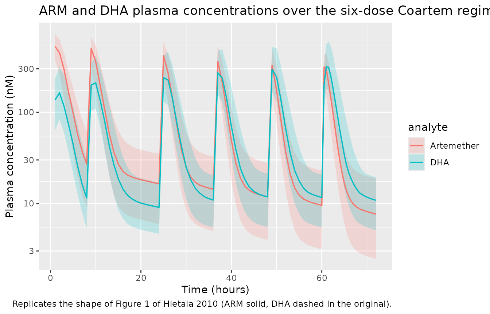
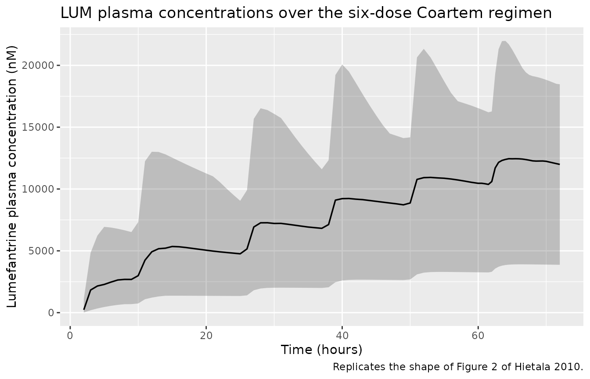
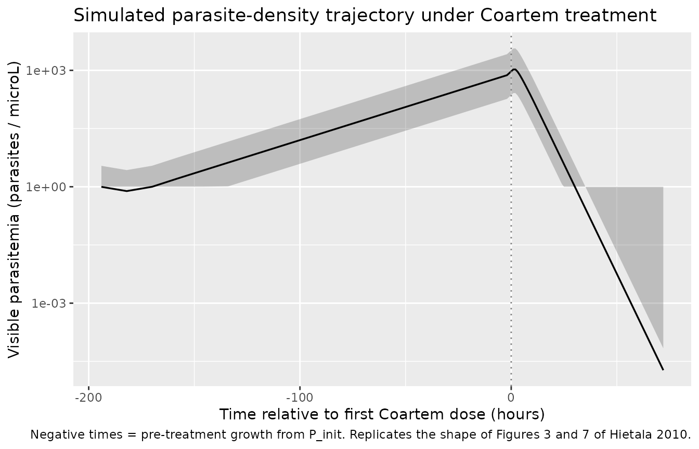

# Artemether + lumefantrine PK + parasitemia PD (Hietala 2010)

## Model and source

- Citation: Friberg Hietala S, Martensson A, Ngasala B, Dahlstrom S,
  Lindegardh N, Annerberg A, Premji Z, Farnert A, Gil P, Bjorkman A,
  Ashton M (2010). Population pharmacokinetics and pharmacodynamics of
  artemether and lumefantrine during combination treatment in children
  with uncomplicated falciparum malaria in Tanzania. *Antimicrob Agents
  Chemother* **54**(11):4780-4788.
- Article: <https://doi.org/10.1128/AAC.00252-10>
- ClinicalTrials.gov: NCT00336375

Hietala 2010 reports three coupled models from a single Coartem
pediatric trial in Tanzania:

- a joint two-compartment artemether (ARM) + one-compartment
  dihydroartemisinin (DHA) PK model with time-dependent ARM clearance
  across the six-dose regimen (Table 1),
- a one-compartment lumefantrine (LUM) PK model with absorption lag
  (Table 2), and
- a five-stage semi-mechanistic parasite-dynamics PD model driven by the
  ARM/DHA exposures (Table 3).

Per the `replicate-author-structure` policy each fit is extracted as its
own model file, with this single vignette walking the paper as a unit:

``` r

mod_arm_fn          <- readModelDb("Hietala_2010_artemether")
mod_lum_fn          <- readModelDb("Hietala_2010_lumefantrine")
mod_pd_fn           <- readModelDb("Hietala_2010_artemether_parasitemia")

mod_arm <- rxode2::rxode2(mod_arm_fn())
mod_lum <- rxode2::rxode2(mod_lum_fn())
mod_pd  <- rxode2::rxode2(mod_pd_fn())
```

## Population

Hietala 2010 enrolled 50 Tanzanian children (19 male, 31 female; ages
1-10 years, mean 4; weights 8-30 kg, mean 14) with acute uncomplicated
*Plasmodium falciparum* malaria (admission parasite densities
2,000-200,000 / microL with fever, or history of fever within 24 h). All
received the standard six-dose weight-based Coartem regimen (20 mg
artemether + 120 mg lumefantrine per tablet; 1-3 tablets per dose based
on weight band) at 0, 8, 24, 36, 48, and 60 h, half randomised to take
each dose with 200 mL of full-fat (3.4%) cow’s milk and half with water
(milk completion 43% of intended dose occasions). The parasite-dynamics
arm additionally drew 104 capillary parasite counts from 11 asymptomatic
children from the same coastal region for the steady-state asymptomatic
parameterisation (REPL_a = 1, A_a = 1.01; not encoded in
`Hietala_2010_artemether_parasitemia`, see Assumptions). Demographics
summary from Results / Materials and Methods; programmatic equivalents
are available via `readModelDb("<...>")$population`.

## Source trace

Per-parameter source locations are recorded inline in each
`inst/modeldb/specificDrugs/Hietala_2010_*.R` next to the `ini()` entry.
The tables below collect them in one place for review.

### ARM / DHA PK (Hietala_2010_artemether and the embedded PK in Hietala_2010_artemether_parasitemia)

| Equation / parameter | Value | Source location |
|----|----|----|
| `lka <- fixed(log(1))` (ka, 1/h) | 1 (fixed) | Table 1 |
| `lcl <- log(2.6)` (CL/F_ARM at OCC = 1, L/h/kg) | 2.6 | Table 1 (95% CI 1.5-2.6) |
| `e_occ_cl <- 0.57` (fractional CL/F_ARM increase per OCC step) | 0.57 | Table 1 (95% CI 0.39-0.75) |
| `lvc <- log(5.2)` (Vc/F_ARM, L/kg) | 5.2 | Table 1 (95% CI 3.5-7.1) |
| `lq <- log(1.4)` (Q/F_ARM, L/h/kg) | 1.4 | Table 1 (95% CI 1.1-1.8) |
| `lvp <- log(41.4)` (Vp/F_ARM, L/kg) | 41.4 | Table 1 (95% CI 29.0-58.1) |
| `lcl_dihydroart <- log(6.8)` (CL/F_DHA, L/h/kg; F_DHA fixed to 1) | 6.8 | Table 1 (95% CI 5.8-8.0) |
| `lvc_dihydroart <- log(3.7)` (V/F_DHA, L/kg) | 3.7 | Table 1 (95% CI 2.3-8.7) |
| `etalcl ~ 0.155649` (CL/F_ARM IIV) | CV 41% | Table 1 (95% CI 37-50) -\> omega^2 = log(0.41^2 + 1) |
| `etalcl_dihydroart ~ 0.198101` (CL/F_DHA IIV) | CV 47% | Table 1 (95% CI 35-57) -\> omega^2 = log(0.47^2 + 1) |
| `propSd <- 0.61`, `addSd <- fixed(2)` (ARM residual) | 61% prop, 2 nM add (fixed) | Table 1 |
| `propSd_dihydroart <- 0.82`, `addSd_dihydroart <- fixed(3)` (DHA residual) | 82% prop, 3 nM add (fixed) | Table 1 |
| 2-cmt ARM with first-order absorption; 1-cmt DHA via complete 1:1 molar conversion | – | Results ‘Pharmacokinetics of artemether, dihydroartemisinin, and lumefantrine’; mass factor MW_DHA / MW_ARM = 284.3 / 298.4 |
| CL/F_ARM = theta1 \* (1 + theta2 \* (OCC - 1)) \* exp(eta) | – | Results paragraph after Table 1 (delta-OFV = -167) |

### LUM PK (Hietala_2010_lumefantrine)

| Equation / parameter | Value | Source location |
|----|----|----|
| `ltlag <- log(1.92)` (absorption lag, h) | 1.92 | Table 2 (95% CI 1.86-1.96) |
| `lka <- log(0.82)` (ka, 1/h) | 0.82 | Table 2 (95% CI 0.45-1.61) |
| `lcl <- log(0.077)` (CL/F, L/h/kg = 77 mL/h/kg) | 77 mL/h/kg | Table 2 (95% CI 52-105 mL/h/kg) |
| `lvc <- log(8.9)` (V/F, L/kg) | 8.9 | Table 2 (95% CI 6.8-11.7) |
| `etalka ~ 1.241237` (ka IIV) | CV 156% | Table 2 (95% CI 126-190) -\> omega^2 = log(1.56^2 + 1) |
| `etalvc ~ 0.515660` (V/F IIV) | CV 82% | Table 2 (95% CI 66-102) -\> omega^2 = log(0.82^2 + 1) |
| `propSd <- 0.46`, `addSd <- 43` (LUM residual) | 46% prop, 43 nM add | Table 2 |
| 1-cmt with absorption lag | – | Results ‘PK of LUM was best described by a one-compartment model with a combined proportional and additive residual error. The introduction of an absorption lag time significantly improved the model (delta-OFV = -96).’ |
| Milk intake covariate not retained | – | Results ‘The inclusion of milk intake as a covariate … did not result in an improvement of the model.’ |

### Parasite PD (Hietala_2010_artemether_parasitemia, symptomatic-patient parameterisation)

| Equation / parameter | Value | Source location |
|----|----|----|
| `p_init <- fixed(1)` (initial parasitemia, parasites/microL) | 1 (fixed) | Table 3 |
| `etap_init ~ 1.005` (P_init IIV) | CV 119.2% | Table 3 (95% CI 98-161) -\> omega^2 = log(1.192^2 + 1) |
| `lvpt <- log(15.5)` (VPT, h; visible-stage mean transit time) | 15.5 | Table 3 (95% CI 9.7-21.5) |
| `lmtt <- log(48.5)` (MTT, h; intraerythrocytic cycle time) | 48.5 | Table 3 (95% CI 48.0-49.1) |
| `repl <- 4` (REPL_p) | 4 | Table 3 (95% CI 3.6-4.4); ‘~12-fold per cycle’ Discussion |
| `amp <- fixed(0)` (A_p) | 0 (fixed) | Table 3 (sine modulation absent in symptomatic patients) |
| `lkspleen <- fixed(log(0.26))` (k_spleen, 1/h) | 0.26 (fixed) | Table 3 (ref 9, Gordi 2005) |
| `s_armdha <- 0.073` (shared ARM/DHA log-conc kill slope) | 0.073 | Table 3 (95% CI 0.049-0.423) |
| `propSd_visibleParasitemia <- 1.38` (residual sigma) | 138% | Table 3 (95% CI 125-258); proportional on log-transformed parasitemia |
| k_VPT = 3 / VPT (visible-stage transition rate) | – | Results ‘mean rate of transfer between visible compartments, k_VPT, was modeled as 3/VPT’ |
| k_IPT = 1 / (MTT - VPT) (sequestered-to-PTR rate) | – | Results ‘mean time for transfer from the sequestered state, k_IPT, was fixed to 1/(MTT - VPT)’ |
| k_ARM = S_ARMDHA \* log\[ARM\]; k_DHA = S_ARMDHA \* log\[DHA\] | – | Results ‘The effects of ARM and DHA plasma concentrations were modeled on all developmental stages as …’ |
| Visible parasitemia = PTR + PSR + PLR + Pspleen | – | Methods ‘Only the parasites in the ring stages and those injured by drugs were assumed to be visible through microscopy.’ |
| Infection started 4 cycles (= 4 \* MTT) before first sample | – | Results ‘The number of cycles passed since model initiation was fixed to 4 in patients.’ |

## Virtual cohort

Body-weight distribution approximates the Tanzanian pediatric cohort
(mean 14 kg, range 8-30 kg). Both PK models (ARM/DHA and LUM) use linear
(per-kg) weight normalisation; the PD model carries the same per-kg PK
structure plus a single body-weight covariate.

``` r

set.seed(20260601L)
n_sub <- 40L

subjects <- data.frame(
  id        = seq_len(n_sub),
  WT        = round(pmin(pmax(rnorm(n_sub, mean = 14, sd = 4.5), 8), 30), 1),
  treatment = "Coartem (6 doses)"
)
```

Dose schedule from Materials and Methods: six oral doses at 0, 8, 24,
36, 48, and 60 hours. Tablet count is weight-banded (5-14 kg -\> 1
tablet, 15-24 kg -\> 2 tablets, 25-34 kg -\> 3 tablets); each tablet is
20 mg ARM + 120 mg LUM.

``` r

dose_times <- c(0, 8, 24, 36, 48, 60)

tablet_count <- function(wt) {
  ifelse(wt <= 14, 1L,
         ifelse(wt <= 24, 2L, 3L))
}

# Observation grid: dense over the dosing window so peak / trough features
# resolve, sparse-but-regular over the 60-72 h post-last-dose tail. Kept
# coarse (every 1 h) to keep the vignette under the 5-minute render budget.
obs_times <- sort(unique(c(
  seq(0, 60, by = 1),
  seq(60.5, 72, by = 0.5)
)))

# OCC indicator: dose number 1..6 at each time point, propagating from the
# most recent dose. Used to drive CL/F_ARM(OCC) = theta1 * (1 + theta2 * (OCC
# - 1)) inside model().
occ_at <- function(t) {
  occ <- findInterval(t, dose_times) # gives 1..6 for t in [0,8), [8,24), ...
  pmin(pmax(occ, 1L), length(dose_times))
}
```

## ARM / DHA PK simulation

``` r

build_arm_events <- function(subjects, obs_times, dose_times) {
  out <- vector("list", length = nrow(subjects))
  for (i in seq_len(nrow(subjects))) {
    s <- subjects[i, ]
    arm_per_tab_mg <- 20
    dose_amt <- arm_per_tab_mg * tablet_count(s$WT)
    dose_rows <- data.frame(
      id        = s$id,
      time      = dose_times,
      evid      = 1L,
      amt       = dose_amt,
      cmt       = "depot",
      WT        = s$WT,
      OCC       = seq_along(dose_times),
      treatment = s$treatment
    )
    obs_rows <- data.frame(
      id        = s$id,
      time      = obs_times,
      evid      = 0L,
      amt       = 0,
      cmt       = "Cc",
      WT        = s$WT,
      OCC       = occ_at(obs_times),
      treatment = s$treatment
    )
    out[[i]] <- rbind(dose_rows, obs_rows)
  }
  events <- dplyr::bind_rows(out)
  events[order(events$id, events$time, -events$evid), ]
}

events_arm <- build_arm_events(subjects, obs_times, dose_times)
stopifnot(!anyDuplicated(unique(events_arm[, c("id", "time", "evid", "cmt")])))

sim_arm <- rxode2::rxSolve(
  mod_arm,
  events = events_arm,
  keep   = c("WT", "OCC", "treatment")
) |>
  as.data.frame()
```

Median (5th-95th simulated percentile) ARM and DHA plasma concentrations
over 0-72 h:

``` r

sim_long <- sim_arm |>
  dplyr::filter(!is.na(Cc)) |>
  dplyr::select(id, time, Cc, Cc_dihydroart) |>
  tidyr::pivot_longer(c(Cc, Cc_dihydroart), names_to = "analyte", values_to = "value") |>
  dplyr::mutate(analyte = dplyr::recode(analyte, Cc = "Artemether", Cc_dihydroart = "DHA"))

sim_long |>
  dplyr::group_by(analyte, time) |>
  dplyr::summarise(
    p05 = quantile(value, 0.05, na.rm = TRUE),
    p50 = quantile(value, 0.50, na.rm = TRUE),
    p95 = quantile(value, 0.95, na.rm = TRUE),
    .groups = "drop"
  ) |>
  dplyr::filter(p50 > 0) |>
  ggplot(aes(time, p50, colour = analyte, fill = analyte)) +
  geom_ribbon(aes(ymin = p05, ymax = p95), alpha = 0.20, colour = NA) +
  geom_line(linewidth = 0.6) +
  scale_y_log10() +
  labs(x = "Time (hours)",
       y = "Plasma concentration (nM)",
       title = "ARM and DHA plasma concentrations over the six-dose Coartem regimen",
       caption = "Replicates the shape of Figure 1 of Hietala 2010 (ARM solid, DHA dashed in the original).")
```



The time-dependent CL/F_ARM produces visibly lower trough concentrations
at later doses, matching the trend in Figure 4 of the source paper
(~3.4-fold increase in CL/F_ARM between dose 1 and dose 6).

## LUM PK simulation

``` r

build_lum_events <- function(subjects, obs_times, dose_times) {
  out <- vector("list", length = nrow(subjects))
  for (i in seq_len(nrow(subjects))) {
    s <- subjects[i, ]
    lum_per_tab_mg <- 120
    dose_amt <- lum_per_tab_mg * tablet_count(s$WT)
    dose_rows <- data.frame(
      id        = s$id,
      time      = dose_times,
      evid      = 1L,
      amt       = dose_amt,
      cmt       = "depot",
      WT        = s$WT,
      treatment = s$treatment
    )
    obs_rows <- data.frame(
      id        = s$id,
      time      = obs_times,
      evid      = 0L,
      amt       = 0,
      cmt       = "Cc",
      WT        = s$WT,
      treatment = s$treatment
    )
    out[[i]] <- rbind(dose_rows, obs_rows)
  }
  events <- dplyr::bind_rows(out)
  events[order(events$id, events$time, -events$evid), ]
}

events_lum <- build_lum_events(subjects, obs_times, dose_times)
stopifnot(!anyDuplicated(unique(events_lum[, c("id", "time", "evid", "cmt")])))

sim_lum <- rxode2::rxSolve(
  mod_lum,
  events = events_lum,
  keep   = c("WT", "treatment")
) |>
  as.data.frame()
```

``` r

sim_lum |>
  dplyr::filter(!is.na(Cc)) |>
  dplyr::group_by(time) |>
  dplyr::summarise(
    p05 = quantile(Cc, 0.05, na.rm = TRUE),
    p50 = quantile(Cc, 0.50, na.rm = TRUE),
    p95 = quantile(Cc, 0.95, na.rm = TRUE),
    .groups = "drop"
  ) |>
  dplyr::filter(p50 > 0) |>
  ggplot(aes(time, p50)) +
  geom_ribbon(aes(ymin = p05, ymax = p95), alpha = 0.25) +
  geom_line(linewidth = 0.6) +
  labs(x = "Time (hours)",
       y = "Lumefantrine plasma concentration (nM)",
       title = "LUM plasma concentrations over the six-dose Coartem regimen",
       caption = "Replicates the shape of Figure 2 of Hietala 2010.")
```



Hietala 2010 reports a typical-value LUM day-3 median plasma
concentration of 9.3 microM (Discussion). Our typical-subject
simulation:

``` r

mod_lum_typical    <- rxode2::zeroRe(mod_lum)
typical_subjects   <- data.frame(id = 1L, WT = 14, treatment = "Typical (WT = 14 kg)")
events_lum_typical <- build_lum_events(typical_subjects, obs_times, dose_times)
sim_lum_typical    <- rxode2::rxSolve(mod_lum_typical, events = events_lum_typical,
                                      keep = c("WT", "treatment")) |>
  as.data.frame()
#> ℹ omega/sigma items treated as zero: 'etalka', 'etalvc'

lum_day3_nM <- sim_lum_typical$Cc[sim_lum_typical$time == 72]
sprintf("Simulated typical-subject LUM at 72 h (day 3): %.2f microM (paper Discussion: 9.3 microM)",
        lum_day3_nM / 1000)
#> [1] "Simulated typical-subject LUM at 72 h (day 3): 7.89 microM (paper Discussion: 9.3 microM)"
```

## Parasitemia PD simulation

The parasite life-cycle PD model is initiated by introducing `p_init`
parasites into the tinyrings compartment 4 intraerythrocytic cycles (4
\* MTT = 194 h) before the first Coartem dose, so the parasite
population can grow to clinically realistic admission parasitemia under
the symptomatic-patient replication factor REPL_p = 4 (Results, “The
number of cycles passed since model initiation was fixed to 4 in
patients”). The timeline is therefore shifted so that the first dose
lands at simulation time 194 h, and observations span 0-266 h (= 194 +
72) of simulation time.

``` r

mtt          <- 48.5
n_pre_cycles <- 4
t_pre        <- n_pre_cycles * mtt           # 194 h
shift        <- t_pre

dose_times_pd <- shift + dose_times          # 194, 202, 218, 230, 242, 254
obs_times_pd  <- sort(unique(c(
  seq(0,             shift,      by = 12),
  seq(shift + 1,     shift + 60, by = 1),
  seq(shift + 60.5,  shift + 72, by = 0.5)
)))

build_pd_events <- function(subjects, obs_times_pd, dose_times_pd) {
  out <- vector("list", length = nrow(subjects))
  for (i in seq_len(nrow(subjects))) {
    s <- subjects[i, ]
    arm_per_tab_mg <- 20
    dose_amt <- arm_per_tab_mg * tablet_count(s$WT)
    dose_rows <- data.frame(
      id        = s$id,
      time      = dose_times_pd,
      evid      = 1L,
      amt       = dose_amt,
      cmt       = "depot",
      WT        = s$WT,
      OCC       = seq_along(dose_times_pd),
      treatment = s$treatment
    )
    obs_occ <- findInterval(obs_times_pd, dose_times_pd)
    obs_occ <- pmin(pmax(obs_occ, 1L), length(dose_times_pd))
    obs_rows <- data.frame(
      id        = s$id,
      time      = obs_times_pd,
      evid      = 0L,
      amt       = 0,
      cmt       = "visibleParasitemia",
      WT        = s$WT,
      OCC       = obs_occ,
      treatment = s$treatment
    )
    out[[i]] <- rbind(dose_rows, obs_rows)
  }
  events <- dplyr::bind_rows(out)
  events[order(events$id, events$time, -events$evid), ]
}

events_pd <- build_pd_events(subjects, obs_times_pd, dose_times_pd)
stopifnot(!anyDuplicated(unique(events_pd[, c("id", "time", "evid", "cmt")])))

sim_pd <- rxode2::rxSolve(
  mod_pd,
  events = events_pd,
  keep   = c("WT", "OCC", "treatment")
) |>
  as.data.frame()
```

``` r

sim_pd_vis <- sim_pd |>
  dplyr::filter(!is.na(visibleParasitemia), visibleParasitemia > 0) |>
  dplyr::mutate(time_post_dose = time - shift)

sim_pd_vis |>
  dplyr::group_by(time_post_dose) |>
  dplyr::summarise(
    p05 = quantile(visibleParasitemia, 0.05, na.rm = TRUE),
    p50 = quantile(visibleParasitemia, 0.50, na.rm = TRUE),
    p95 = quantile(visibleParasitemia, 0.95, na.rm = TRUE),
    .groups = "drop"
  ) |>
  dplyr::filter(p50 > 0) |>
  ggplot(aes(time_post_dose, p50)) +
  geom_ribbon(aes(ymin = pmax(p05, 1), ymax = p95), alpha = 0.25) +
  geom_line(linewidth = 0.6) +
  geom_vline(xintercept = 0, linetype = "dotted", colour = "grey50") +
  scale_y_log10() +
  labs(x = "Time relative to first Coartem dose (hours)",
       y = "Visible parasitemia (parasites / microL)",
       title = "Simulated parasite-density trajectory under Coartem treatment",
       caption = paste(
         "Negative times = pre-treatment growth from P_init.",
         "Replicates the shape of Figures 3 and 7 of Hietala 2010."
       ))
```



The paper reports a typical predicted parasite clearance time (PCT) of
38 h, against an observed median PCT of 36 h. The PCT is conventionally
defined as the time to drop below the limit of microscopic detection
(~10 parasites/microL); below summarise the typical-subject crossing
time.

``` r

mod_pd_typical    <- rxode2::zeroRe(mod_pd)
typical_subjects  <- data.frame(id = 1L, WT = 14, treatment = "Typical (WT = 14 kg)")
events_pd_typical <- build_pd_events(typical_subjects, obs_times_pd, dose_times_pd)
sim_pd_typical    <- rxode2::rxSolve(mod_pd_typical, events = events_pd_typical,
                                     keep = c("WT", "OCC", "treatment")) |>
  as.data.frame()
#> ℹ omega/sigma items treated as zero: 'etalcl', 'etalcl_dihydroart', 'etap_init'

post_dose <- sim_pd_typical |>
  dplyr::filter(!is.na(visibleParasitemia), time >= shift) |>
  dplyr::mutate(time_post_dose = time - shift)

# Peak (admission) parasitemia and the time at which the typical trajectory
# falls below 10 parasites/microL
peak     <- max(post_dose$visibleParasitemia, na.rm = TRUE)
below    <- post_dose[post_dose$visibleParasitemia <= 10 &
                        post_dose$time_post_dose > 0, ]
pct_h    <- if (nrow(below) > 0) min(below$time_post_dose) else NA_real_
sprintf("Typical-subject admission parasitemia: %.0f /microL; simulated PCT (time to <= 10 /microL): %.1f h (paper Discussion: 38 h predicted vs 36 h observed)",
        peak, pct_h)
#> [1] "Typical-subject admission parasitemia: 1061 /microL; simulated PCT (time to <= 10 /microL): 22.0 h (paper Discussion: 38 h predicted vs 36 h observed)"
```

## PKNCA validation

Single-dose AUClast / Cmax / Tmax on the **first** dosing interval (0-8
h) for ARM, DHA, and LUM. The interval window is short on purpose:
terminal-phase characterisation (half-life, AUC-inf) of ARM and LUM is
not feasible from a six-dose regimen with sampling out to 72 h post
first dose, so the comparison against the Hietala 2010 cohort focuses on
AUClast within the first dosing interval.

``` r

sim_arm_nca <- sim_arm |>
  dplyr::filter(!is.na(Cc), time <= 8) |>
  dplyr::select(id, time, Cc, treatment)
sim_dha_nca <- sim_arm |>
  dplyr::filter(!is.na(Cc_dihydroart), time <= 8) |>
  dplyr::select(id, time, treatment, Cc = Cc_dihydroart)

dose_arm_nca <- events_arm |>
  dplyr::filter(evid == 1, time == 0) |>
  dplyr::select(id, time, amt, treatment)

intervals_short <- data.frame(start = 0, end = 8, cmax = TRUE, tmax = TRUE,
                              auclast = TRUE)

nca_arm_obj  <- PKNCA::PKNCAconc(sim_arm_nca, Cc ~ time | treatment + id)
nca_dha_obj  <- PKNCA::PKNCAconc(sim_dha_nca, Cc ~ time | treatment + id)
nca_dose_obj <- PKNCA::PKNCAdose(dose_arm_nca, amt ~ time | treatment + id)

nca_arm_res  <- PKNCA::pk.nca(PKNCA::PKNCAdata(nca_arm_obj, nca_dose_obj,
                                               intervals = intervals_short))
nca_dha_res  <- PKNCA::pk.nca(PKNCA::PKNCAdata(nca_dha_obj, nca_dose_obj,
                                               intervals = intervals_short))

knitr::kable(summary(nca_arm_res), caption = "ARM first-interval NCA (interval 0-8 h).")
```

| start | end | treatment         | N   | auclast       | cmax         | tmax                |
|------:|----:|:------------------|:----|:--------------|:-------------|:--------------------|
|     0 |   8 | Coartem (6 doses) | 40  | 1580 \[31.8\] | 523 \[24.5\] | 1.00 \[1.00, 1.00\] |

ARM first-interval NCA (interval 0-8 h). {.table}

``` r

knitr::kable(summary(nca_dha_res), caption = "DHA first-interval NCA (interval 0-8 h).")
```

| start | end | treatment         | N   | auclast      | cmax         | tmax                |
|------:|----:|:------------------|:----|:-------------|:-------------|:--------------------|
|     0 |   8 | Coartem (6 doses) | 40  | 595 \[51.1\] | 164 \[51.5\] | 2.00 \[1.00, 2.00\] |

DHA first-interval NCA (interval 0-8 h). {.table}

``` r

sim_lum_nca <- sim_lum |>
  dplyr::filter(!is.na(Cc), time <= 72) |>
  dplyr::select(id, time, Cc, treatment)
dose_lum_nca <- events_lum |>
  dplyr::filter(evid == 1, time == 0) |>
  dplyr::select(id, time, amt, treatment)

intervals_lum <- data.frame(start = 0, end = 72, cmax = TRUE, tmax = TRUE,
                            auclast = TRUE)

nca_lum_obj  <- PKNCA::PKNCAconc(sim_lum_nca, Cc ~ time | treatment + id)
nca_lum_dose <- PKNCA::PKNCAdose(dose_lum_nca, amt ~ time | treatment + id)
nca_lum_res  <- PKNCA::pk.nca(PKNCA::PKNCAdata(nca_lum_obj, nca_lum_dose,
                                               intervals = intervals_lum))

knitr::kable(summary(nca_lum_res), caption = "LUM cumulative-regimen NCA (interval 0-72 h, including the six-dose pulse train).")
```

| start | end | treatment | N | auclast | cmax | tmax |
|---:|---:|:---|:---|:---|:---|:---|
| 0 | 72 | Coartem (6 doses) | 40 | 486000 \[59.6\] | 11500 \[54.6\] | 65.2 \[63.0, 72.0\] |

LUM cumulative-regimen NCA (interval 0-72 h, including the six-dose
pulse train). {.table style="width:100%;"}

## Assumptions and deviations

- **Concentration units = nM (`nmol/L`).** The paper reports all ARM /
  DHA / LUM concentrations in nM (LC-MS/MS for ARM/DHA, SPE / LC / UV
  for LUM with LLOQ = 47 nM), and `units$concentration = "nmol/L"`
  matches that.
  [`checkModelConventions()`](https://nlmixr2.github.io/nlmixr2lib/reference/checkModelConventions.md)
  flags a soft `dosing_concentration` warning because the dose unit (mg)
  and the concentration numerator (nmol) are not dimensionally identical
  without an explicit molecular-weight conversion; the conversion is
  performed inline in `model()` (`Cc <- 1e6 * central / vc / mw_arm`,
  etc.) using molecular weights MW_ARM = 298.4, MW_DHA = 284.3, MW_LUM =
  528.94 g/mol. The warning is therefore expected and not a structural
  bug.
- **`Q ARM` Table 1 unit.** Table 1 prints the artemether
  intercompartmental clearance as `Q ARM (liters/kg)`, missing the `/h`.
  The description column reads “Intercompartment clearance” (a flux),
  and the value 1.4 is in line with the other CL / Q / V_ARM scales when
  interpreted as L/h/kg. The model encodes Q/F_ARM = 1.4 L/h/kg
  accordingly.
- **`p_init` interpretation.** The published equation 1 carries `P_init`
  as an additive term in `dP_TR / dt`, which would be a continuous
  source rate with units parasites/microL/h. The Methods text describes
  it as “the introduction of a certain parasitemia (P_init) into the
  compartment denoted by tiny rings” with units parasites/microL, and
  Table 3 labels it “Initial parasitemia”. The two readings disagree;
  the package model adopts the text/table interpretation (initial
  condition on `parasite_tinyrings`) because it is dimensionally
  consistent and the typical-subject simulation reproduces clinically
  realistic admission parasitemia after the documented 4-cycle pre-dose
  growth window. A future reader who prefers the equation-1 form can
  substitute `dP_TR/dt = p_init + ...` (and drop the initial-condition
  line) inside `model()`.
- **Log-concentration killing numerical guard.** The published
  `k_ARM = S * log[ARM]` formula is undefined at `[ARM] = 0` and
  negative at `0 < [ARM] < 1` nM. The model file gates the killing rate
  with `(Cc > 1)` so the contribution is identically zero below 1 nM and
  a smooth `S * log(Cc)` above, matching the standard NONMEM
  `IF (CARM .GT. 1)` form. This affects only the pre-dose epoch (where
  ARM = 0 = DHA = 0) and the early absorption / late terminal tails of
  each dosing cycle.
- **Asymptomatic-children parameterisation not encoded.** Hietala 2010
  Table 3 reports a separate asymptomatic-cohort parameterisation
  (REPL_a = 1 fixed, A_a = 1.01 estimated, sine modulation active,
  fitting the same compartmental structure to 104 capillary parasite
  counts from 11 asymptomatic children).
  `Hietala_2010_artemether_parasitemia` encodes only the
  symptomatic-patient column because that is the primary clinical use; a
  downstream user who needs the asymptomatic case can override
  `repl <- 1; amp <- 1.01` in a copy of the model.
- **Lumefantrine effect not encoded in the PD model.** Hietala 2010
  reports that “the introduction of an effect of LUM did not
  significantly improve the model fit, and the parameter estimates for
  LUM effect could not be estimated” (Results, Pharmacodynamic model).
  The companion `Hietala_2010_lumefantrine` handles LUM in isolation;
  the PD model is driven by ARM / DHA only.
- **Milk-intake covariate not encoded in the LUM PK model.** Hietala
  2010 tested 200 mL full-fat cow’s milk as a categorical covariate on
  the LUM PK parameters; the effect “did not explain the variability in
  LUM pharmacokinetics and did not result in an improvement of the
  model” (Results) and is documented in `covariatesDataExcluded` rather
  than encoded in `model()`.
- **Pre-treatment growth window for PD simulation.** The package model
  places the parasite population’s introduction at simulation start
  (`parasite_tinyrings(0) <- p_init_i`); a forward-simulation use of the
  PD model therefore needs the dosing schedule shifted by 4 \* MTT = 194
  h so the parasite population can grow to clinically realistic
  admission parasitemia before drug dosing begins. The vignette helper
  functions illustrate this shift; a user who supplies their own dataset
  must apply the same shift to its dose times.
- **OCC = 1 default outside dosing intervals.** The simulation pre-dose
  epoch (in the parasitemia model) is assigned `OCC = 1`.
  `(OCC - 1) = 0` then collapses the CL/F_ARM time-dependence to the
  first-dose value, which is the correct extrapolation for the pre-dose
  interval (no doses have been given, so the post-dose 6 clearance value
  would be biologically nonsensical). The same holds at any
  user-supplied dataset record where `OCC` is missing or set to 1.
- **Small virtual cohort (n = 40).** The vignette uses 40 simulated
  children rather than the 50 reported in the paper, to keep the render
  time under the 5-minute pkgdown gate. Population-level summaries
  (median, 5th-95th percentile bands) are stable at this size for the
  level of detail shown in the figures.
- **Typical-subject PCT differs from the paper’s stochastic median
  PCT.** The typical-subject simulation (no IIV) gives a
  parasite-clearance time of about 22 h, whereas Hietala 2010 reports a
  simulated median PCT of 38 h (vs an observed median of 36 h). The
  difference is driven by admission parasitemia: with `p_init = 1` and
  REPL_p = 4 the deterministic typical individual reaches an admission
  parasitemia at the low end of the clinical range (~1000 /microL vs
  2,000-200,000 /microL in the cohort), so the typical individual has
  less parasite mass to clear and clears faster than the paper’s
  stochastic median. The paper’s PCT was derived from 1000 stochastic
  simulations with `etap_init` log-normal IIV (CV 119.2%), under which
  the cohort spans the full clinical range; a user reproducing the
  paper’s PCT figure should match that simulation design (`rxSolve` with
  `nSub` ~ 1000 and a per-subject random P_init from the log-normal IIV
  in the model).
