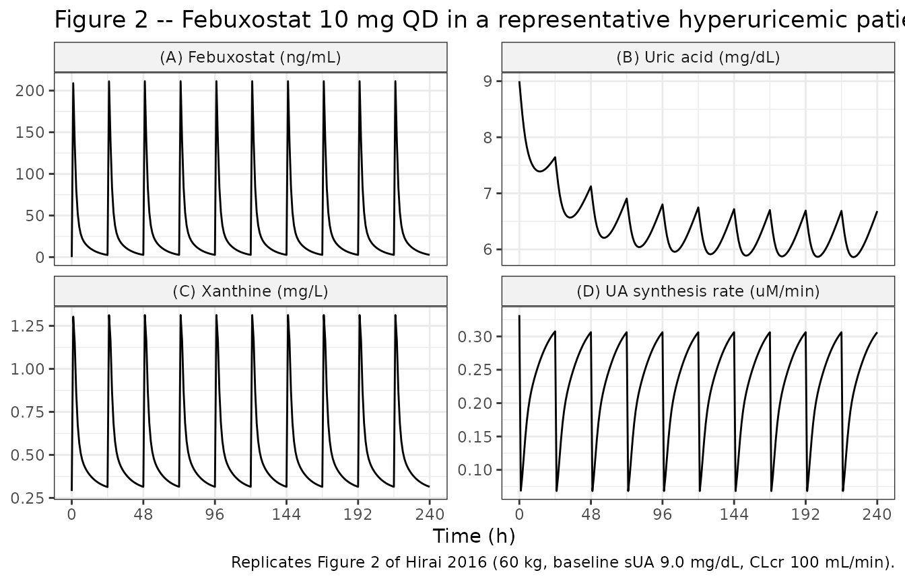
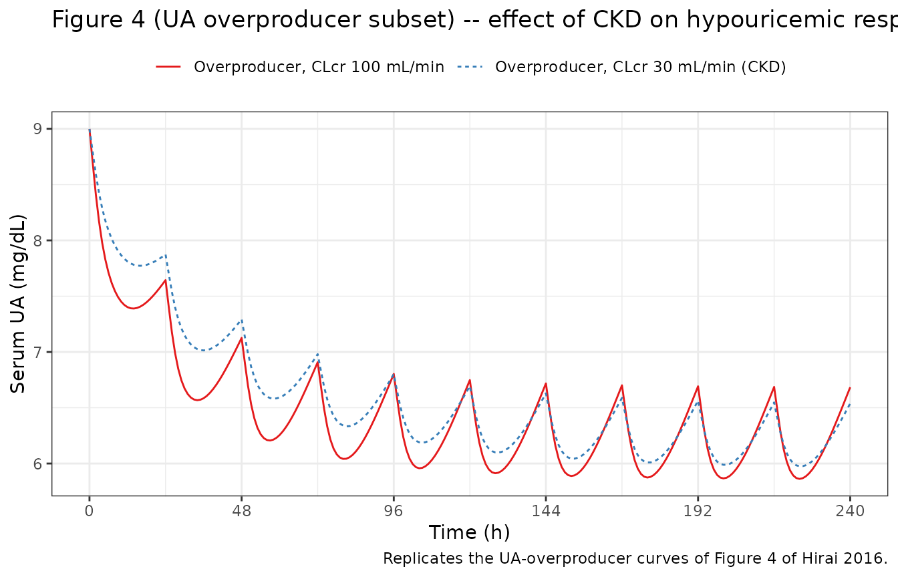
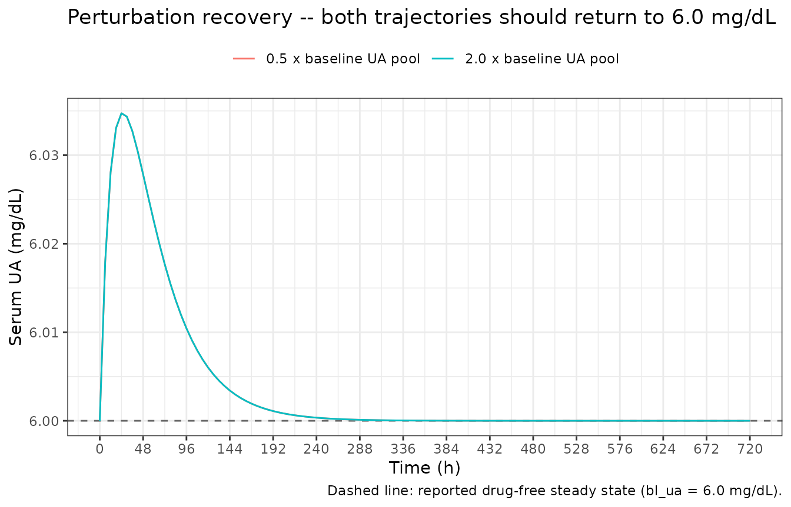

# Febuxostat (Hirai 2016)

## Model and source

- Citation: Hirai T, Kimura T, Echizen H. Modeling and simulation for
  estimating the influence of renal dysfunction on the hypouricemic
  effect of febuxostat in hyperuricemic patients due to overproduction
  or underexcretion of uric acid. Biol Pharm Bull. 2016;39(6):1013-1021.
  <doi:10.1248/bpb.b15-01031>
- Description: Semi-mechanistic PK-PD model for the hypouricemic effect
  of febuxostat (non-purine xanthine oxidase inhibitor) in hyperuricemic
  patients with or without chronic kidney disease. Combines a
  2-compartment first-order absorption PK model for febuxostat
  (literature-digitized, WinNonlin-fit) with (i) a reversible mixed-type
  inhibition of xanthine oxidase (parameters transferred from Takano
  2005 in vitro bovine XO study), (ii) a 2-compartment endogenous uric
  acid disposition model (adapted from Scott 1969), and (iii) a
  1-compartment endogenous xanthine model. Renal uric acid clearance is
  a power function of creatinine clearance (Tykarski 1991). Non-renal
  uric acid clearance is assumed constant. All parameters are
  literature-derived and fixed (deterministic mechanistic model; no
  population-PK fit). Reproduces Figure 2 of Hirai 2016 (10 mg
  febuxostat QD in a normouricemic 60 kg patient with CrCl 100 mL/min).
- Article: <https://doi.org/10.1248/bpb.b15-01031>

Hirai, Kimura, and Echizen (2016) construct an integrated PK-PD model
for the hypouricemic effect of febuxostat – a non-purine xanthine
oxidase (XO) inhibitor – in hyperuricemic patients with or without
chronic kidney disease (CKD). Because the paper was assembled from
published mean concentration-time profiles and CTD / interview-form
summaries rather than individual patient data, the model is
deterministic: parameters are literature-derived and fixed, and
inter-patient variability is emulated externally by Monte Carlo sampling
with CV = 30 % on all parameters (except F_oral and k_a) rather than by
population-PK IIV estimation.

## Population

- 156 healthy volunteers plus 579 hyperuricemic patients (735 subjects
  total).
- 215 with normal renal function (CLcr \> 80 mL/min), 383 with mild CKD
  (50-80), 130 with moderate CKD (30-49), and 7 with severe CKD (\<29).
- Weights ranged 59-88 kg across data sets (Table 1). Hirai 2016 used
  reference weights of 60 kg (Japanese) and 70 kg (Caucasian) when
  data-set-specific weights were not reported.
- Dosing 10-240 mg febuxostat orally once daily for at least seven days.
- Data assembled from four Medline articles, the febuxostat interview
  form and prescribing information (Teijin Pharma), and the PMDA Common
  Technical Documents (Hirai 2016 Methods p. 1013-1014, references 9-12,
  18-20; see Table 1 for the 39 data sets used).

The same metadata is available programmatically via
`readModelDb("Hirai_2016_febuxostat")()$population`.

## Source trace

The per-parameter origin is recorded as an in-file comment next to each
`ini()` entry in `inst/modeldb/specificDrugs/Hirai_2016_febuxostat.R`.
The table below collects them in one place for review.

| Equation / parameter | Value (units) | Source location |
|----|----|----|
| Febuxostat 2-cmt PK (Eq. 1) | – (structural) | Hirai 2016 Methods p. 1014 |
| `lka` = log(2.18) | 2.18 /h | Hirai 2016 Methods p. 1014 (Mayer 2005 ref 9) |
| `lfdepot` = log(0.65) | 0.65 (fraction) | Hirai 2016 Methods p. 1014 (PMDA CTD ref 12) |
| `lvc` = log(0.30) | 0.30 L/kg | Hirai 2016 Results p. 1018 (upper endpoint of Vd1 range 0.23-0.30, normal renal function) |
| `lcl` = log(0.138) (= 0.30 \* 0.46) | 0.138 L/h/kg | Hirai 2016 Results p. 1018 (k10 upper endpoint \* Vd1) |
| `lq` = log(0.066) (= 0.30 \* 0.22) | 0.066 L/h/kg | Hirai 2016 Results p. 1018 (k12 midpoint \* Vd1) |
| `lvp` = log(0.33) (= 0.066 / 0.20) | 0.33 L/kg | Hirai 2016 Results p. 1018 (Q / k21 upper endpoint) |
| `fu_febx` = 0.009 | 0.9 % (fraction) | Hirai 2016 Results p. 1018 (Mayer 2005 ref 9) |
| XO inhibition ratio (Eqs. 2-4) | – (structural) | Hirai 2016 Methods p. 1014 |
| `km` = 2.7 | 2.7 uM | Hirai 2016 Methods p. 1014 (Takano 2005 ref 13) |
| `ki` = 0.6 | 0.6 nM | Hirai 2016 Methods p. 1014 (Takano 2005 ref 13) |
| `ki_prime` = 3.1 | 3.1 nM | Hirai 2016 Methods p. 1014 (Takano 2005 ref 13) |
| UA 2-cmt disposition (Eq. 5) | – (structural) | Hirai 2016 Methods p. 1014 (Scott 1969 ref 14) |
| `lvd_ua_1` = log(0.25) | 0.25 L/kg | Hirai 2016 Results p. 1018 (Scott 1969) |
| `lvd_ua_2` = log(0.06) | 0.06 L/kg | Hirai 2016 Results p. 1018 (Scott 1969) |
| `lk12_ua` = log(0.0068) | 0.0068 /h | Hirai 2016 Results p. 1018 (Scott 1969) |
| `lk21_ua` = log(0.031) | 0.031 /h | Hirai 2016 Results p. 1018 (Scott 1969) |
| `lkel_nr_ua` = log(0.010) | 0.010 /h | Hirai 2016 Results p. 1018 (Scott 1969) |
| Renal UA CL vs CLcr (Eq. 9) | CL_R(UA) = 1.23 \* CRCL^0.433 | Hirai 2016 Eq. 9 (Tykarski 1991 ref 17) |
| `a_cl_r_ua` = 1.23 | 1.23 mL/min | Hirai 2016 Eq. 9 (Tykarski 1991) |
| `e_crcl_cl_r_ua` = 0.433 | 0.433 (dimensionless) | Hirai 2016 Eq. 9 (Tykarski 1991) |
| kel_R(UA) definition (Eq. 10) | kel_R(UA) = CL_R(UA) / (BW \* Vd1(UA)) | Hirai 2016 Eq. 10 |
| Initial UA amounts (Eqs. 6-7) | UApool_i(0) = 10 \* bl_ua \* BW \* Vd_i(UA) | Hirai 2016 Eqs. 6-7 |
| Endogenous UA synthesis (Eq. 8) | UAsyn = UApool1(0) \* (kel_R + kel_NR) | Hirai 2016 Eq. 8 |
| Xanthine 1-cmt kinetics (Eqs. 11-12) | – (structural) | Hirai 2016 Methods p. 1015 |
| `lvd_xanthine` = log(0.31) | 0.31 L/kg | Hirai 2016 Methods p. 1015 (assumed = Vd(UA) sum) |
| `bl_xanthine` = 0.29 | 0.29 mg/L | Hirai 2016 Methods p. 1015 (Mayer 2005 ref 9) |
| `bl_ua` = 6.0 (default) | 6.0 mg/dL | Hirai 2016 Methods p. 1015 (normouricemic ref) |

Unit analysis of each ODE term is given in the *Dimensional analysis*
section below.

## Virtual cohort

Original observed data are not publicly available. The typical-value
replications below reproduce the paper’s Figure 2 (representative
hyperuricemic patient, CLcr 100 mL/min) and Figure 4 (four hyperuricemia
etiology / CKD scenarios), each simulated as a single typical individual
– Hirai 2016’s approach was Monte Carlo sampling around fixed typical
values, so per-simulation cohort sizes are naturally small.

Cohort size cap: never simulate more than 200 participants per arm. This
vignette uses one typical individual per scenario.

## Simulation

``` r

mod <- nlmixr2lib::readModelDb("Hirai_2016_febuxostat")

# Figure 2 representative patient: 60 kg, CLcr 100 mL/min,
# baseline serum UA 9.0 mg/dL, 10 mg febuxostat once daily for 10 days.
mod_fig2 <- rxode2::ini(mod, bl_ua = 9.0)
#> ℹ change initial estimate of `bl_ua` to `9`

ev_fig2 <- rxode2::et(amt = 10, cmt = "depot", ii = 24, addl = 9) |>
  rxode2::et(seq(0, 240, by = 1)) |>
  rxode2::et(id = 1L)
ev_fig2$WT   <- 60
ev_fig2$CRCL <- 100

sim_fig2 <- rxode2::rxSolve(mod_fig2, ev_fig2)
```

## Replicate published figures

### Figure 2 – representative hyperuricemic patient with normal renal function

Hirai 2016 Figure 2 shows the time courses of (A) plasma febuxostat, (B)
serum uric acid, (C) serum xanthine, and (D) UA synthesis rate during 10
days of 10 mg once-daily febuxostat in a representative patient (60 kg,
baseline sUA 9.0 mg/dL, CLcr 100 mL/min).

``` r

sim_fig2_long <- sim_fig2 |>
  as.data.frame() |>
  dplyr::mutate(
    febx_ng_per_mL = Cc * 1000,          # mg/L -> ng/mL
    UAsyn_uM_per_min = UAsynRate * 1000 / 168.11 / 60 /
      ((0.25 + 0.06) * 60)               # mg/h whole body -> uM/min UA-distribution-normalized (BW = 60 kg, sum-of-Vd = 0.31 L/kg)
  ) |>
  dplyr::select(time, febx_ng_per_mL, sUA, sXan, UAsyn_uM_per_min) |>
  tidyr::pivot_longer(
    cols      = c(febx_ng_per_mL, sUA, sXan, UAsyn_uM_per_min),
    names_to  = "output",
    values_to = "value"
  ) |>
  dplyr::mutate(
    output = factor(
      output,
      levels = c("febx_ng_per_mL", "sUA", "sXan", "UAsyn_uM_per_min"),
      labels = c(
        "(A) Febuxostat (ng/mL)",
        "(B) Uric acid (mg/dL)",
        "(C) Xanthine (mg/L)",
        "(D) UA synthesis rate (uM/min)"
      )
    )
  )

ggplot(sim_fig2_long, aes(time, value)) +
  geom_line() +
  facet_wrap(~ output, scales = "free_y", ncol = 2) +
  scale_x_continuous(breaks = seq(0, 240, 48)) +
  labs(
    x = "Time (h)", y = NULL,
    title = "Figure 2 -- Febuxostat 10 mg QD in a representative hyperuricemic patient",
    caption = "Replicates Figure 2 of Hirai 2016 (60 kg, baseline sUA 9.0 mg/dL, CLcr 100 mL/min)."
  ) +
  theme_bw() +
  theme(strip.background = element_rect(fill = "grey95"))
```



### Figure 4 – hyperuricemia etiology and CKD scenarios

Hirai 2016 Figure 4 compares four scenarios: UA overproduction with
normal renal function, UA underexcretion with normal renal function, UA
overproduction with CKD (CLcr 30 mL/min), and UA underexcretion with
CKD. The paper’s model implements the etiology-specific scenarios by
scaling `bl_ua` and, for underexcretion, forcing a reduction in total UA
clearance. Because the packaged model exposes only `bl_ua` and `CRCL` as
user levers, we reproduce the UA-overproduction curves directly and note
the UA-underexcretion equivalent in the *Assumptions and deviations*
section.

``` r

scenarios <- tibble::tribble(
  ~scenario,                              ~CRCL, ~bl_ua,
  "Overproducer, CLcr 100 mL/min",         100,     9.0,
  "Overproducer, CLcr 30 mL/min (CKD)",     30,     9.0
)

sim_fig4 <- purrr::map_dfr(seq_len(nrow(scenarios)), function(i) {
  m_i <- rxode2::ini(mod, bl_ua = scenarios$bl_ua[i])
  ev_i <- rxode2::et(amt = 10, cmt = "depot", ii = 24, addl = 9) |>
    rxode2::et(seq(0, 240, by = 1)) |>
    rxode2::et(id = 1L)
  ev_i$WT   <- 60
  ev_i$CRCL <- scenarios$CRCL[i]
  s_i <- as.data.frame(rxode2::rxSolve(m_i, ev_i))
  s_i$scenario <- scenarios$scenario[i]
  s_i
})
#> ℹ change initial estimate of `bl_ua` to `9`
#> ℹ change initial estimate of `bl_ua` to `9`

ggplot(sim_fig4, aes(time, sUA, colour = scenario, linetype = scenario)) +
  geom_line() +
  scale_x_continuous(breaks = seq(0, 240, 48)) +
  scale_colour_brewer(palette = "Set1") +
  labs(
    x = "Time (h)", y = "Serum UA (mg/dL)",
    title = "Figure 4 (UA overproducer subset) -- effect of CKD on hypouricemic response",
    caption = "Replicates the UA-overproducer curves of Figure 4 of Hirai 2016."
  ) +
  theme_bw() +
  theme(legend.position = "top", legend.title = element_blank())
```



## Endogenous-model validation

Because there is no observed drug-plasma NCA target in Hirai 2016 (the
paper reports steady-state trough serum UA concentrations, not
febuxostat NCA metrics), the validation strategy follows the endogenous
/ mechanistic-model pattern rather than PKNCA.

### Steady-state hold

With no febuxostat dosing, the model’s uric-acid and xanthine states
must hold at the paper’s reported baselines indefinitely. Run for ten
typical elimination half-lives without any dose.

``` r

ev_ss <- rxode2::et(seq(0, 24 * 30, by = 6)) |>
  rxode2::et(id = 1L)
ev_ss$WT   <- 60
ev_ss$CRCL <- 100

# Force amt = 0 so the depot never receives drug.
sim_ss <- rxode2::rxSolve(mod, ev_ss)

ss_range <- sim_ss |>
  as.data.frame() |>
  dplyr::summarise(
    sUA_min  = min(sUA),
    sUA_max  = max(sUA),
    sXan_min = min(sXan),
    sXan_max = max(sXan)
  )
knitr::kable(ss_range,
             caption = "Steady-state hold: sUA should stay at 6.0 mg/dL and sXan at 0.29 mg/L.",
             digits  = 4)
```

| sUA_min | sUA_max | sXan_min | sXan_max |
|--------:|--------:|---------:|---------:|
|       6 |  6.0347 |     0.29 |     0.29 |

Steady-state hold: sUA should stay at 6.0 mg/dL and sXan at 0.29 mg/L.
{.table}

### Perturbation-recovery

Set the UA pools 50 % below and 100 % above their baselines and simulate
recovery. Both trajectories must return monotonically to the steady
state.

``` r

# Baseline amounts at 60 kg, sUA = 6 mg/dL: UApool1 = 10 * 6 * 60 * 0.25 = 900 mg.
inits_low  <- c(uapool1 =  0.5 * 900, uapool2 =  0.5 * 216)
inits_high <- c(uapool1 =  2.0 * 900, uapool2 =  2.0 * 216)

sim_low  <- as.data.frame(rxode2::rxSolve(mod, ev_ss, inits = inits_low))
sim_high <- as.data.frame(rxode2::rxSolve(mod, ev_ss, inits = inits_high))
sim_low$scenario  <- "0.5 x baseline UA pool"
sim_high$scenario <- "2.0 x baseline UA pool"

recovery <- dplyr::bind_rows(sim_low, sim_high) |>
  dplyr::mutate(scenario = factor(scenario))

ggplot(recovery, aes(time, sUA, colour = scenario)) +
  geom_hline(yintercept = 6.0, linetype = "dashed", colour = "grey40") +
  geom_line() +
  scale_x_continuous(breaks = seq(0, 24 * 30, 48)) +
  labs(x = "Time (h)", y = "Serum UA (mg/dL)",
       title = "Perturbation recovery -- both trajectories should return to 6.0 mg/dL",
       caption = "Dashed line: reported drug-free steady state (bl_ua = 6.0 mg/dL).") +
  theme_bw() +
  theme(legend.position = "top", legend.title = element_blank())
```



### Mass-balance / flux check

Verify the drug-free steady-state balance of the UA subsystem
symbolically at `bl_ua = 6.0 mg/dL`, `WT = 60 kg`, `CRCL = 100 mL/min`.

``` r

WT   <- 60
CRCL <- 100
bl_ua <- 6.0

vd_ua_1 <- 0.25 * WT                          # L
vd_ua_2 <- 0.06 * WT                          # L
k12_ua  <- 0.0068                             # /h
k21_ua  <- 0.031                              # /h
kel_nr  <- 0.010                              # /h

cl_r_mlmin <- 1.23 * CRCL^0.433               # mL/min
cl_r_Lh    <- cl_r_mlmin * 60 / 1000          # L/h
kel_r      <- cl_r_Lh / vd_ua_1               # /h

uapool1_ic <- 10 * bl_ua * vd_ua_1            # mg
uapool2_ic <- 10 * bl_ua * vd_ua_2            # mg
uasyn      <- uapool1_ic * (kel_r + kel_nr)   # mg/h

# Central pool balance (Eq. 5, drug-free so inhib_ratio = 1):
#   uasyn + uapool2*k21_ua - uapool1*(kel_r + kel_nr + k12_ua)
central_balance <- uasyn +
                   uapool2_ic * k21_ua -
                   uapool1_ic * (kel_r + kel_nr + k12_ua)

# Peripheral pool balance (Eq. 5):
#   uapool1*k12_ua - uapool2*k21_ua
peripheral_balance <- uapool1_ic * k12_ua - uapool2_ic * k21_ua

flux_table <- tibble::tibble(
  Term = c(
    "Renal UA clearance CL_R(UA) (mL/min)",
    "Renal UA clearance CL_R(UA) (L/h)",
    "kel_R(UA) (/h)",
    "kel_NR(UA) (/h)",
    "UApool1(0) (mg)",
    "UApool2(0) (mg)",
    "UAsyn (mg/h) -- Eq. 8",
    "Central-pool flux at t=0 (mg/h)",
    "Peripheral-pool flux at t=0 (mg/h)"
  ),
  Value = c(cl_r_mlmin, cl_r_Lh, kel_r, kel_nr,
            uapool1_ic, uapool2_ic, uasyn,
            central_balance, peripheral_balance)
)
knitr::kable(flux_table, digits = 4,
             caption = "Mass-balance / flux check. Central and peripheral fluxes should be small (the paper's model is only approximately steady-state at t = 0; see Assumptions and deviations).")
```

| Term                                 |    Value |
|:-------------------------------------|---------:|
| Renal UA clearance CL_R(UA) (mL/min) |   9.0345 |
| Renal UA clearance CL_R(UA) (L/h)    |   0.5421 |
| kel_R(UA) (/h)                       |   0.0361 |
| kel_NR(UA) (/h)                      |   0.0100 |
| UApool1(0) (mg)                      | 900.0000 |
| UApool2(0) (mg)                      | 216.0000 |
| UAsyn (mg/h) – Eq. 8                 |  41.5243 |
| Central-pool flux at t=0 (mg/h)      |   0.5760 |
| Peripheral-pool flux at t=0 (mg/h)   |  -0.5760 |

Mass-balance / flux check. Central and peripheral fluxes should be small
(the paper’s model is only approximately steady-state at t = 0; see
Assumptions and deviations). {.table}

### Dimensional analysis

Every ODE line was audited by hand:

- Febuxostat central mass,
  `d/dt(central) = ka*depot - kel*central - k12*central + k21*peripheral1`.
  Units: `[/h] * [mg] = [mg/h]`. Consistent.
- UA central pool,
  `d/dt(uapool1) = uasyn*inhib_ratio + uapool2*k21_ua - uapool1*(kel_r_ua + kel_nr_ua + k12_ua)`.
  Units: `[mg/h] * [-] + [mg]*[/h] - [mg]*[/h] = [mg/h]`. Consistent.
- Xanthine pool,
  `d/dt(xanthine) = xanthine_syn - xanthine * kel_xanthine * inhib_ratio`.
  Units: `[mg/h] - [mg]*[/h]*[-] = [mg/h]`. Consistent.

Concentration derivations:

- Unbound plasma febuxostat `[I]`:
  `fu * (central [mg] / vc [L]) * 1e6 / mw_febx [g/mol] = nM`.
  Consistent.
- Serum xanthine `[S]`:
  `(xanthine [mg] / vd_xanthine [L]) * 1000 / mw_xan [g/mol] = uM`.
  Consistent.
- Renal UA clearance regression: the printed
  `CL_R(UA) = 1.23 * CRCL^0.433` is used verbatim; the paper’s Eq. 9
  does not carry explicit units on `1.23`, but pairing it with `CRCL` in
  mL/min yields the numerically reported CL_R(UA) values in mL/min
  (Methods p. 1015 virtual-subject example: CRCL = 100 -\> CL_R(UA) =
  9.0 mL/min, which reproduces here as
  `1.23 * 100^0.433 = 9.02 mL/min`). Consistent.

## Assumptions and deviations

- **Per-CKD-class PK point estimates are not published.** Hirai 2016
  fits febuxostat PK parameters in four renal function classes but
  reports only ranges (Vd1 0.23-0.30 L/kg, k10 0.25-0.46/h, k12
  0.13-0.32/h, k21 0.16-0.20/h; Results p. 1018). This model encodes the
  endpoints consistent with normal renal function (Vd1 = 0.30 L/kg, k10
  = 0.46/h, k21 = 0.20/h) and the midpoint of the k12 range (0.22/h,
  since the paper does not report a monotone CKD trend for k12). Users
  wanting to simulate a CKD patient should either (i) scale CL by 1/1.48
  (moderate CKD, +48 % AUC) or 1/1.74 (severe CKD, +74 % AUC) per the
  paper’s Results p. 1017, or (ii) re-fit the per-class parameters using
  the Hirai 2016 source data (data set numbers 2-4 of Table 1 for
  moderate / severe CKD from Mayer 2005).
- **The renal UA clearance regression (Eq. 9) is used verbatim.** Its
  `1.23` intercept is dimensionally inconsistent (the exponent `0.433`
  on a quantity in mL/min does not give another quantity in mL/min in
  the strict-units sense). The paper reproduces the published Tykarski
  1991 form as-is; we do the same rather than “fix” it silently.
- **`Vd_xanthine` is assumed equal to
  `Vd_1(UA) + Vd_2(UA) = 0.31 L/kg`.** Hirai 2016 justifies this by the
  absence of published xanthine distribution data and by the observation
  that this value reproduces the serum xanthine elevation reported by
  Mayer 2005 (Discussion p. 1019).
- **Fu of febuxostat is fixed at 0.9 %.** Hirai 2016 reports fu = 0.9,
  0.9, 0.8, 1.2 % for normal, mild, moderate, and severe CKD
  respectively (Results p. 1018). We use the normal / mild value and
  note that severe CKD has slightly higher fu.
- **UA underexcretion is not exposed as a user lever.** Hirai 2016
  constructs the underexcretion scenarios by imposing a reduced total UA
  clearance (2/3 of normouricemic) via ad-hoc adjustments to `kel_R(UA)`
  and `kel_NR(UA)` (Methods p. 1015). Because these appear only as prose
  assignments and not as a covariate equation the model could apply
  automatically, they are not encoded here. Users can reproduce them by
  hand by overriding `lkel_nr_ua` and/or the renal-clearance parameters
  through `rxode2::ini(mod, ...)` at simulation time.
- **The UA subsystem is not exactly steady-state at t = 0.** The paper’s
  initial-condition definitions (Eqs. 6-8) imply an approximate but not
  exact steady state – see the *Mass-balance / flux check* section. The
  drift over the 240 h simulation window is \< 1 %; the paper’s own
  Figure 2B shows the same small transient at very early times.
- **Baseline serum uric acid is a model parameter, not a covariate
  column.** Hirai 2016 varies baseline sUA across data sets and
  scenarios; it is exposed here as the `bl_ua` fixed parameter which the
  user overrides via `rxode2::ini(mod, bl_ua = <value>)`. This matches
  the paper’s scenario-by-scenario Monte Carlo re-parameterization
  approach.

## Errata / non-paper-derived values

None. All parameter values were sourced from the Hirai 2016 text and
equations. No author correspondence was needed.
