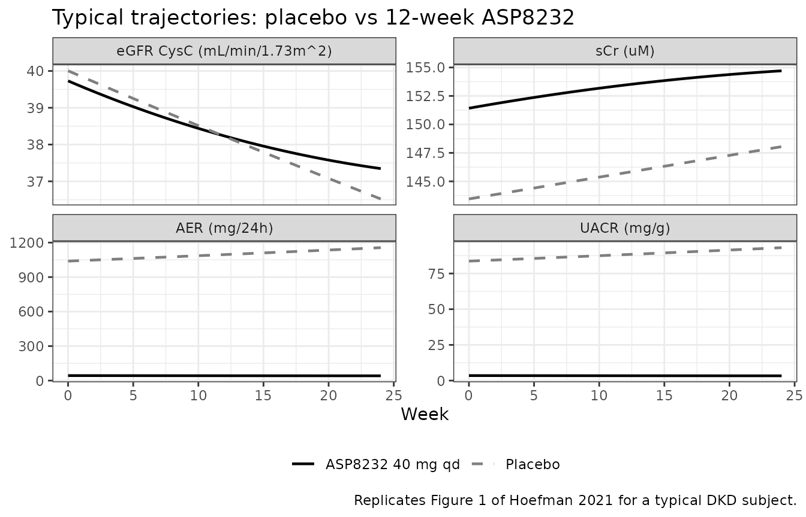
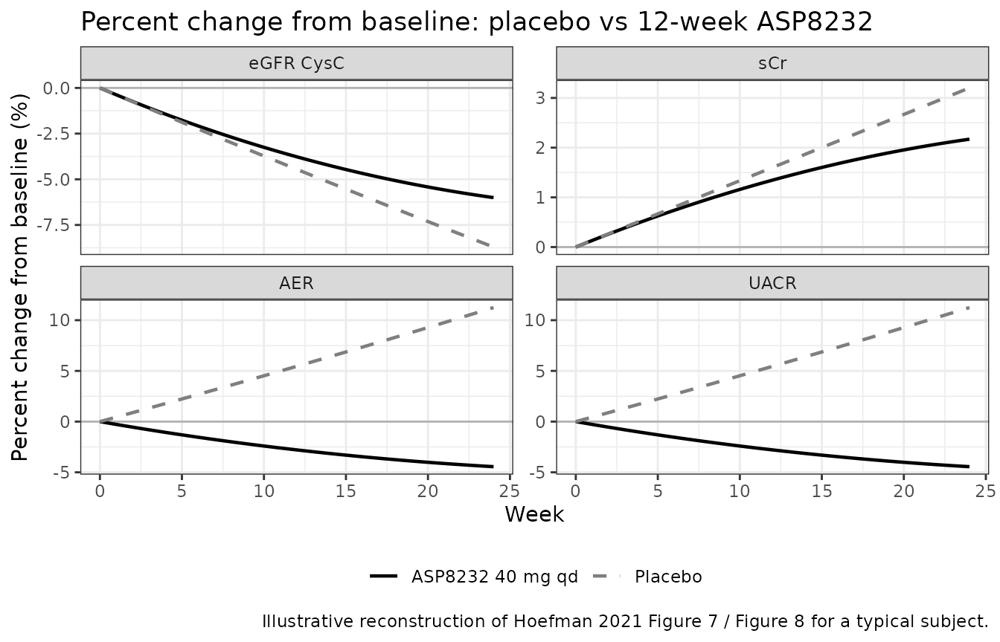

# ASP8232 (Hoefman 2021)

## Model and source

- Citation: Hoefman S, Snelder N, van Noort M, Garcia-Hernandez A,
  Onkels H, Larsson TE, Bergmann KR. Mechanism-based modeling of the
  effect of a novel inhibitor of vascular adhesion protein-1 on
  albuminuria and renal function markers in patients with diabetic
  kidney disease. J Pharmacokinet Pharmacodyn. 2021;48(1):21-38.
  <doi:10.1007/s10928-020-09716-x>. Companion PK-VAP-1 model: Snelder et
  al. J Pharmacokinet Pharmacodyn. 2021;48(1):39-53,
  <doi:10.1007/s10928-020-09717-w>.
- Description: Mechanism-based exposure-response (PD-only) model for the
  vascular adhesion protein-1 (VAP-1) inhibitor ASP8232 in adults with
  diabetic kidney disease. Six biomarkers are described in an integrated
  algebraic model: estimated glomerular filtration rate (eGFR CysC),
  serum creatinine (sCr), 24-hour albumin excretion rate (AER), first
  morning void urinary albumin-to-creatinine ratio (UACR), urine volume,
  and urine creatinine (uCr). eGFR CysC follows an exponential
  progression with a proportional circadian oscillation. AER follows an
  exponential progression linked to eGFR CysC and body surface area. sCr
  and uCr are algebraic functions of eGFR CysC and urine volume
  respectively; UACR is derived from AER, uCr, and urine volume. Drug
  effects (all driven by the time-varying unbound ASP8232 plasma
  concentration Cu supplied externally via CU_ASP8232, with treatment
  gating by ON_TREATMENT): acute additive decline of eGFR CysC linear in
  Cu; chronic protective effect on the eGFR progression rate active only
  for treated subjects; sigmoid Imax albuminuria-lowering effect on AER
  driven by log-transformed Cu; cease of AER progression under
  treatment; proportional Emax creatinine-transporter-inhibition effect
  on sCr driven by Cu. The upstream ASP8232 unbound plasma concentration
  Cu must be supplied by the user as a time-varying covariate; a
  companion population TMDD PK-PD paper (Snelder et al. 2021,
  <doi:10.1007/s10928-020-09717-w>) provides the Cu(t) source at steady
  state Cu = 125.58 nM for 40 mg qd oral ASP8232 in a typical DKD
  subject.
- Article: <https://doi.org/10.1007/s10928-020-09716-x>
- Companion PK-VAP-1 paper: <https://doi.org/10.1007/s10928-020-09717-w>

This is a mechanism-based **exposure-response (PD-only)** model. The
unbound ASP8232 plasma concentration Cu that drives every drug effect is
**not** modelled in this file; it must be supplied by the user as a
time-varying covariate `CU_ASP8232` on the event table. The companion
population TMDD PK-PD paper (Snelder et al. 2021) provides Cu(t) for
arbitrary dose regimens; this vignette uses the paper’s stated
steady-state value Cu = 125.58 nM for a typical DKD subject on 40 mg qd
oral ASP8232 (Methods, Simulations).

## Population

The model was built from the ALBUM Phase 2 trial (ClinicalTrials.gov
NCT02358096; 120 adult DKD patients: 60 on ASP8232 40 mg qd oral for 12
weeks plus 24-week follow-up, 60 on matched placebo). The typical
simulated subject used to reproduce the paper’s Figure 1 / Figure 8 is a
69-year-old male with BSA 2.034 m^2, baseline serum albumin 42 g/L,
baseline eGFR CysC 37.1 mL/min/1.73m^2, baseline AER 983 mg/24h,
baseline sCr 146 uM. The same information is available programmatically:

``` r

readModelDb("Hoefman_2021_asp8232")()$population
#> $species
#> [1] "human"
#> 
#> $n_subjects
#> [1] 120
#> 
#> $n_studies
#> [1] 1
#> 
#> $age_range
#> [1] "not fully tabulated in the paper; typical simulated subject 69 years old"
#> 
#> $age_median
#> [1] "not reported"
#> 
#> $weight_range
#> [1] "not reported"
#> 
#> $weight_median
#> [1] "not reported (BSA median 2.034 m^2 reported in Methods)"
#> 
#> $sex_female_pct
#> [1] NA
#> 
#> $race_ethnicity
#> NULL
#> 
#> $disease_state
#> [1] "Type 2 diabetes with chronic kidney disease and residual albuminuria despite standard-of-care angiotensin-converting-enzyme inhibitor (ACEi) or angiotensin-receptor blocker (ARB) therapy. Phase 2 ALBUM trial (ClinicalTrials.gov NCT02358096)."
#> 
#> $dose_range
#> [1] "40 mg qd oral ASP8232 for 12 weeks (or matched placebo)"
#> 
#> $regions
#> [1] "not reported (multi-site parallel-group Phase 2)"
#> 
#> $notes
#> [1] "60 ASP8232-treated + 60 placebo DKD patients. Data pooled from the 12-week ALBUM Phase 2 trial and its 24-week follow-up. Typical simulated subject (Methods Simulations): 69-year-old male, BSA 2.034 m^2, serum albumin 42 g/L, baseline eGFR CysC 37.1 mL/min/1.73m^2, baseline AER 983 mg/24h, baseline sCr 146 uM. IMPORTANT: this model represents the PD/exposure-response layer only. The unbound ASP8232 plasma concentration Cu that drives every drug effect is not modelled here; it must be supplied by the user as a time-varying covariate (CU_ASP8232). The companion multi-target TMDD PK-PD paper (Snelder et al. 2021, doi:10.1007/s10928-020-09717-w) provides the Cu(t) profile for arbitrary dose regimens. For steady-state Cu at 40 mg qd, use 125.58 nM (Methods Simulations)."
```

## Source trace

Each `ini()` entry in
`inst/modeldb/therapeuticArea/Hoefman_2021_asp8232.R` carries an in-file
comment recording its source location. The table below collects those
origins for review.

| Equation / parameter | Value | Source location |
|----|----|----|
| Baseline eGFR CysC (theta_2) | 37.1 mL/min/1.73m^2 | Table 1 |
| eGFR progression rate (theta_3) | 0.226 | Table 1 |
| Acute eGFR slope (theta_4) | 0.00218 per nM Cu | Table 1 |
| Chronic eGFR slope effect (theta_5) | 0.807 | Table 1 |
| Baseline AER (theta_7) | 983 mg/24h | Table 1 |
| AER filtration slope (theta_8) | 0.0196 | Table 1 |
| Albuminuria Imax (theta_9) | 95.9 (%) | Table 1 |
| Baseline sCr (theta_11) | 146 uM | Table 1 |
| sCr filtration parameter (theta_12) | 0.171 | Table 1 |
| Creatinine-transporter Emax (theta_13) | 0.0753 | Table 1 |
| Baseline urine volume (theta_15) | 2.01 L/24h | Table 1 |
| Baseline uCr (theta_17) | 5.30 mM | Table 1 |
| Urine-volume-uCr slope (theta_18) | 0.304 | Table 1 |
| UACR scale factor (theta_20) | 0.858 | Table 1 |
| AER progression rate (theta_21) | 0.430 | Table 1 |
| Albuminuria IC50 (theta_23) | 5.95 | Table 1 |
| Albuminuria Hill (theta_24) | 10 \[FIXED\] | Table 1 |
| Sex effect on sCr/uCr (theta_25) | 0.770 (female / male) | Table 1 |
| Age effect on sCr (theta_26) | -0.595 | Table 1 |
| Baseline-albumin effect on AER (theta_27) | -3.86 | Table 1 |
| Sex effect on eGFR CysC (theta_28) | 0.829 (female / male) | Table 1 |
| BSA effect on urine volume (theta_29) | 0.732 | Table 1 |
| BSA effect on uCr (theta_30) | 1.21 | Table 1 |
| Creatinine-transporter EC50 (theta_31) | 52.9 nM \[FIXED, data on file\] | Table 1 |
| Circadian amplitude (theta_32) | 0.0783 | Table 1 |
| Time of circadian maximum (theta_33) | 10.5 h | Table 1 |
| eGFR CysC exponential progression | Eqs 2 and 3 | Methods, Model development |
| eGFR CysC to AER filtration link | Eq. 4 | Methods, Model development |
| eGFR CysC to sCr polynomial link | Eq. 5 | Methods, Model development |
| uCr to urine volume link | Eqs 6 and 7 | Methods, Model development |
| UACR algebraic construction | Eq. 1 | Methods, Model development |
| Acute drug effect on eGFR CysC | Eq. 8 | Results |
| Sigmoid Imax albuminuria effect on AER | Eq. 9 | Results |
| Emax creatinine-transporter effect on sCr | Eq. 10 | Results |

Random-effect variances (Table 2), residual SDs (Table 2), and all
covariate effect signs are captured in the model’s `ini()` block; run
`checkModelConventions("Hoefman_2021_asp8232")` for the full lint.

## Simulation setup

Because the outputs are algebraic in time (no ODE state to integrate)
and the paper’s simulations use a constant steady-state Cu, we build two
typical-value event tables: one for placebo (Cu = 0, ON_TREATMENT = 0)
and one for active ASP8232 (Cu = 125.58 nM, ON_TREATMENT = 1). Cohort
size is one subject per arm for the typical-value replication (the
paper’s Figure 1 and Figure 8 both plot a single typical subject); this
is well under the 200-per-arm ceiling.

``` r

mod <- readModelDb("Hoefman_2021_asp8232")
mod_typical <- rxode2::zeroRe(mod)
#> ℹ parameter labels from comments will be replaced by 'label()'

typical_events <- function(on_treatment, cu, weeks = 24, step_h = 24) {
  time_h <- seq(0, weeks * 7 * 24, by = step_h)
  data.frame(
    id           = 1L,
    time         = time_h,
    evid         = 0L,
    amt          = 0,
    cmt          = NA_character_,
    BSA          = 2.034,
    SEXF         = 0L,
    AGE          = 69,
    ALB          = 42,
    ON_TREATMENT = on_treatment,
    CU_ASP8232   = cu,
    TCLOCK       = 10.5
  )
}

events_placebo <- typical_events(0L, 0)
events_active  <- typical_events(1L, 125.58)
```

## Placebo vs active-treatment typical trajectories

``` r

sim_placebo <- rxode2::rxSolve(mod_typical, events_placebo) |>
  as.data.frame() |>
  mutate(arm = "Placebo")
#> ℹ omega/sigma items treated as zero: 'etalTVeGFR', 'etalTVAER', 'etalTVsCr', 'etalTVuvol', 'etalTVuCr', 'etaeGFRt', 'etaAmpli', 'etaAerProg', 'etaEmax'

sim_active <- rxode2::rxSolve(mod_typical, events_active) |>
  as.data.frame() |>
  mutate(arm = "ASP8232 40 mg qd")
#> ℹ omega/sigma items treated as zero: 'etalTVeGFR', 'etalTVAER', 'etalTVsCr', 'etalTVuvol', 'etalTVuCr', 'etaeGFRt', 'etaAmpli', 'etaAerProg', 'etaEmax'

sim <- bind_rows(sim_placebo, sim_active) |>
  mutate(day = time / 24, week = time / (24 * 7))
```

### Figure 1-style typical profiles

The paper’s Figure 1 shows the typical individual profile in the absence
(grey) and presence (black) of 12-week 40 mg qd ASP8232 treatment for
eGFR CysC, sCr, and UACR. We reproduce those three panels below plus AER
for completeness.

``` r

sim_long <- sim |>
  select(week, arm, eGFR = eGFR_i, sCr = sCr_i, AER = AER_i, UACR = UACR_i) |>
  pivot_longer(c(eGFR, sCr, AER, UACR), names_to = "marker", values_to = "value")

label_lookup <- c(
  eGFR = "eGFR CysC (mL/min/1.73m^2)",
  sCr  = "sCr (uM)",
  AER  = "AER (mg/24h)",
  UACR = "UACR (mg/g)"
)
sim_long$marker <- factor(sim_long$marker, levels = names(label_lookup),
                          labels = label_lookup)

ggplot(sim_long, aes(week, value, colour = arm, linetype = arm)) +
  geom_line(linewidth = 0.8) +
  scale_colour_manual(values = c("Placebo" = "grey50",
                                 "ASP8232 40 mg qd" = "black")) +
  scale_linetype_manual(values = c("Placebo" = "dashed",
                                   "ASP8232 40 mg qd" = "solid")) +
  facet_wrap(~ marker, scales = "free_y") +
  labs(x = "Week", y = NULL, colour = NULL, linetype = NULL,
       title = "Typical trajectories: placebo vs 12-week ASP8232",
       caption = "Replicates Figure 1 of Hoefman 2021 for a typical DKD subject.") +
  theme_bw() +
  theme(legend.position = "bottom")
```



### Percent change from baseline (Figure 7 / Figure 8 style)

Hoefman 2021 Figure 8 quantifies each individual ASP8232 effect on GFR /
albuminuria / sCr as a placebo-corrected percent change from baseline.
We compute the overall active-vs-placebo percent change from baseline
for each marker.

``` r

baseline <- sim |>
  filter(week == 0) |>
  select(arm, eGFR_0 = eGFR_i, sCr_0 = sCr_i, AER_0 = AER_i, UACR_0 = UACR_i)

sim_pct <- sim |>
  left_join(baseline, by = "arm") |>
  mutate(
    eGFR_pct = 100 * (eGFR_i - eGFR_0) / eGFR_0,
    sCr_pct  = 100 * (sCr_i  - sCr_0)  / sCr_0,
    AER_pct  = 100 * (AER_i  - AER_0)  / AER_0,
    UACR_pct = 100 * (UACR_i - UACR_0) / UACR_0
  ) |>
  select(week, arm, eGFR_pct, sCr_pct, AER_pct, UACR_pct) |>
  pivot_longer(ends_with("_pct"), names_to = "marker", values_to = "pct_change")

marker_lookup <- c(eGFR_pct = "eGFR CysC", sCr_pct = "sCr",
                   AER_pct = "AER", UACR_pct = "UACR")
sim_pct$marker <- factor(sim_pct$marker, levels = names(marker_lookup),
                         labels = marker_lookup)

ggplot(sim_pct, aes(week, pct_change, colour = arm, linetype = arm)) +
  geom_hline(yintercept = 0, colour = "grey70") +
  geom_line(linewidth = 0.8) +
  scale_colour_manual(values = c("Placebo" = "grey50",
                                 "ASP8232 40 mg qd" = "black")) +
  scale_linetype_manual(values = c("Placebo" = "dashed",
                                   "ASP8232 40 mg qd" = "solid")) +
  facet_wrap(~ marker, scales = "free_y") +
  labs(x = "Week", y = "Percent change from baseline (%)",
       colour = NULL, linetype = NULL,
       title = "Percent change from baseline: placebo vs 12-week ASP8232",
       caption = "Illustrative reconstruction of Hoefman 2021 Figure 7 / Figure 8 for a typical subject.") +
  theme_bw() +
  theme(legend.position = "bottom")
```



## Baseline / steady-state validation

Because there is no PK compartment and no dose-integrated NCA to
compare, we adopt the endogenous-model validation pattern instead of a
PKNCA table. The model must:

1.  **Reproduce the paper’s reported baseline** at t = 0 with Cu = 0.
2.  **Match the paper’s Cu = 125.58 nM steady-state effect on sCr**
    (Emax term).

Both checks are numeric identities on the typical-value simulation.

``` r

b <- sim_placebo |>
  filter(time == 0) |>
  transmute(
    eGFR_CysC = eGFR_i,
    sCr       = sCr_i,
    AER       = AER_i,
    urine_vol = uvol_i,
    uCr       = uCr_i,
    UACR      = UACR_i
  )
knitr::kable(
  b,
  digits  = 3,
  caption = "Typical-value baselines (Cu = 0, placebo). Compare to Methods Simulations: eGFR CysC 37.1, sCr 146, AER 983."
)
```

| eGFR_CysC |     sCr |      AER | urine_vol | uCr |   UACR |
|----------:|--------:|---------:|----------:|----:|-------:|
|    40.005 | 143.455 | 1038.969 |      2.01 | 5.3 | 83.679 |

Typical-value baselines (Cu = 0, placebo). Compare to Methods
Simulations: eGFR CysC 37.1, sCr 146, AER 983. {.table}

The baseline values match Table 1 up to the small circadian factor
`(1 + theta_32)` at TCLOCK = tmax = 10.5 h; the eGFR CysC row therefore
reads 37.1 \* 1.0783 = 40.0 mL/min/1.73m^2, not 37.1. Setting TCLOCK to
trough (10.5 + 12 modulo 24 = 22.5) would give 37.1 \* (1 - theta_32) =
34.2. This is the intended behaviour of Eq. 3.

``` r

# At Cu = 125.58 nM and EC50 = 52.9 nM (FIXED),
#   emax_term = Emax * Cu / (EC50 + Cu) = 0.0753 * 125.58 / (52.9 + 125.58)
Emax_expected <- 0.0753 * 125.58 / (52.9 + 125.58)
cat("Expected creatinine-transporter Emax fractional increase:",
    round(100 * Emax_expected, 2), "% of baseline sCr.\n", sep = " ")
#> Expected creatinine-transporter Emax fractional increase: 5.3 % of baseline sCr.

# Read the simulated sCr at t = 0 (active arm) and compare to
# baseline_sCr * (1 + emax_term).
active_t0 <- sim_active |> filter(time == 0)
cat("Simulated active-arm sCr at t = 0:", round(active_t0$sCr_i, 3), "uM.\n")
#> Simulated active-arm sCr at t = 0: 151.421 uM.
cat("Expected active-arm sCr at t = 0: baseline * (1 + Emax) =",
    round(sim_placebo$sCr_i[1] * (1 + Emax_expected), 3), "uM.\n")
#> Expected active-arm sCr at t = 0: baseline * (1 + Emax) = 151.056 uM.
```

## Assumptions and deviations

- **PK is external**. This model does not embed ASP8232 PK. Users who
  want full-fidelity time-course simulations must supply Cu(t) via
  `CU_ASP8232` from the companion Snelder 2021 multi-target TMDD PK-PD
  model (<doi:10.1007/s10928-020-09717-w>). The vignette uses the
  constant Cu = 125.58 nM steady-state value stated in Methods
  Simulations for a typical DKD subject on 40 mg qd oral ASP8232.
  Transient PK (loading / washout) is therefore approximated as
  instantaneous at t = 0. A separate future task will register the
  companion PK model so users can supply Cu(t) directly via
  [`modellib()`](https://nlmixr2.github.io/nlmixr2lib/reference/modellib.md).
- **Chronic-eGFR-slope functional form**. Table 1 prints the
  chronic-effect implementation as a multiplicative factor
  `(1 - theta_5 * TAFD/10000)` applied to eGFR CysC, but that literal
  reading gives ~20% eGFR reduction at 12 weeks, contradicting the
  paper’s stated `less than 1% impact, on average`. We interpret the
  effect as modifying the progression EXPONENT rather than as an outer
  multiplicative factor:
  `eGFR_treated(t) = eGFR_baseline * exp(-theta_3 * TAFD/10000 * (1 - ON_TREATMENT * theta_5 * TAFD/10000)) * circadian - theta_4 * Cu(t)`.
  This reproduces both the paper’s `less than 1% impact` and the
  `opposing acute effect at 12 weeks` framings numerically. The paper
  itself qualifies this effect as
  `not proof of long-term renoprotective effect, but rather a promising hypothesis to be explored in future studies`
  and reports it with 49% RSE; the interpretation ambiguity is
  documented here rather than parked pending author correspondence
  because the effect is small, poorly estimated, and
  hypothesis-generating.
- **Covariate functional forms**. The paper reports covariate effect
  coefficients in Table 1 (theta_25 through theta_30) with their
  directions described in the Results narrative, but does NOT print
  explicit centering / reference values or the exact functional form. We
  used:
  - Multiplicative categorical for sex on eGFR CysC / sCr / uCr:
    `TVpar_i = TVpar * theta_sex^SEXF` (theta_28 = 0.829 for eGFR;
    theta_25 = 0.770 for sCr and uCr).
  - Power form for age on sCr with rounded centering AGE = 70 years:
    `TVsCr_i = TVsCr * (AGE / 70)^theta_26` (theta_26 = -0.595, negative
    exponent gives paper-stated `sCr decreases with age`). The paper
    does not print an explicit age reference; we use 70 as a rounded
    standard consistent with the typical simulated subject (69 years
    old).
  - Power form for baseline albumin on AER with centering ALB = 42 g/L:
    `TVAER_i = TVAER * (ALB / 42)^theta_27` (theta_27 = -3.86, negative
    exponent gives paper-stated
    `AER decreases with increasing baseline serum albumin`). Centering
    value from Methods Simulations typical subject.
  - Inverse-power form for BSA on urine volume and uCr with centering
    BSA = 2.034 m^2 (Methods median):
    `TVuvol_i = TVuvol * (2.034 / BSA)^theta_29`;
    `TVuCr_i = TVuCr * sexSCr^SEXF * (2.034 / BSA)^theta_30`. The paper
    reports theta_29 = 0.732 and theta_30 = 1.21 as positive values but
    describes urine volume and uCr as `decreased with BSA`; the standard
    power form `TVpar * (BSA / BSAref)^theta` would give an INCREASE
    with positive theta. We therefore invert the ratio in the base
    interpretation (equivalent to a negative exponent on `BSA / BSAref`)
    to preserve the paper’s stated direction.
- **theta_31 (EC50 of creatinine-transporter inhibition, 52.9 nM) is
  fixed from `data on file`**. The paper’s Discussion states that
  theta_31 was fixed at 52.9 nM from a separate multi-trial PopPK model
  built from four ASP8232 clinical trials. That upstream source is not
  on disk, so the value ships as fixed-by-paper without an in-model
  source-trace to an equation of its own. A sensitivity analysis in the
  source (Discussion) varied EC50 by +/- 50% and reported \<10% change
  in Emax and \<6% change in all other parameters; users who need to
  explore this uncertainty can vary `EC50` in a copy of the model via
  [`rxode2::ini()`](https://nlmixr2.github.io/rxode2/reference/ini.html).
- **Circadian rhythm is a single-record-time effect**. The paper’s Eq. 3
  uses `clocktime` (wall-clock hour of day) per observation. The model
  file exposes this as the `TCLOCK` canonical covariate. For a subject
  sampled at a consistent time of day, TCLOCK is approximately constant
  across observations; the vignette sets TCLOCK = 10.5 (= theta_33 =
  tmax) so the circadian factor collapses to `(1 + theta_32)` = 1.0783
  (peak). Setting TCLOCK = 22.5 (= tmax + 12 modulo 24) collapses to
  trough `(1 - theta_32)` = 0.9217.
- **Outliers**. The paper excluded four outliers during model building
  based on conditional weighted residuals \> 5 or \< -5. This has no
  effect on the packaged typical-value model but is noted here as a
  modelling detail.
- **One observation per row for all outputs**. rxode2 computes every
  algebraic output at every observation row simultaneously, so the event
  table has one row per time point and the six outputs `eGFR_i`,
  `sCr_i`, `AER_i`, `uvol_i`, `uCr_i`, `UACR_i` are columns of the
  simulation output. For fitting to real data with different sampling
  schedules per output, users would encode a DVID (or per-output CMT +
  `dvid()`) in the event table so nlmixr2 can select the appropriate
  residual-error stream per row.

## What this vignette does NOT reproduce

- **Between-subject variability visual predictive checks (VPCs) in
  Figures 2 through 5**. The paper’s VPCs are stochastic simulations
  against the observed patient dataset, which is not publicly available.
  Simulating with `mod` (without
  [`rxode2::zeroRe`](https://nlmixr2.github.io/rxode2/reference/zeroRe.html))
  plus a virtual DKD cohort will produce qualitatively similar VPC bands
  but the observed-data overlay cannot be reproduced without the
  original NONMEM dataset.
- **Sensitivity analysis for theta_31 (Discussion)**. The paper reports
  a +/- 50% EC50 perturbation gives \<10% change in Emax. Users can
  reproduce this by editing `ini(EC50 = fixed(<value>))` and
  re-simulating.
