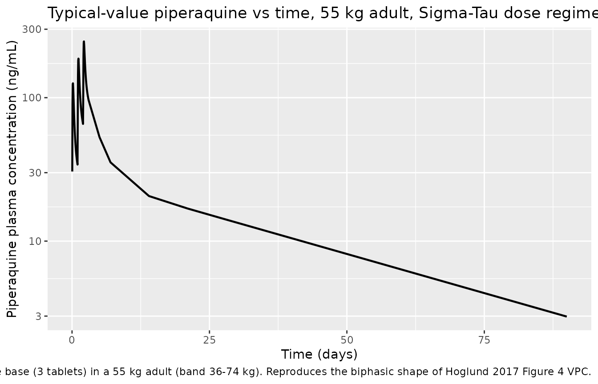
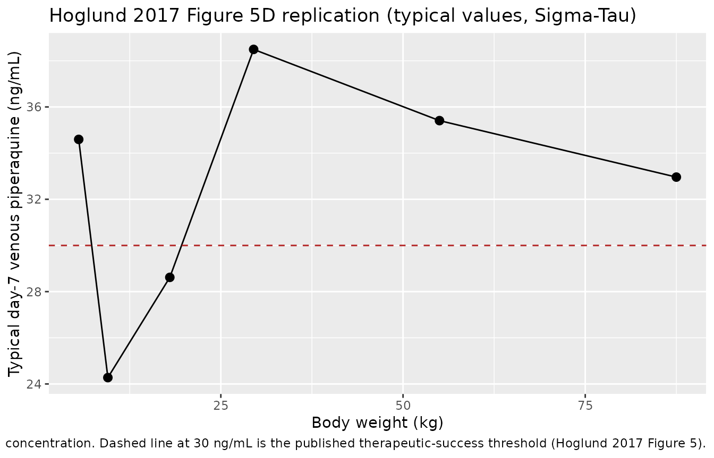

# Piperaquine (Hoglund 2017)

## Model and source

- Citation: Hoglund RM, Workman L, Edstein MD, Thanh NX, Quang NN, Zongo
  I, et al. (2017). Population Pharmacokinetic Properties of Piperaquine
  in Falciparum Malaria: An Individual Participant Data Meta-Analysis.
  *PLoS Medicine* **14**(1):e1002212.
  <doi:10.1371/journal.pmed.1002212>.
- Article: <https://doi.org/10.1371/journal.pmed.1002212>

The package model can be loaded with:

``` r

mod_fn <- readModelDb("Hoglund_2017_piperaquine")
mod    <- rxode2::rxode2(mod_fn())
```

## Population

The Hoglund 2017 individual-participant-data meta-analysis pooled 8,776
plasma piperaquine concentrations from 728 adults, children, and healthy
volunteers across 11 clinical studies that contributed data to the
WorldWide Antimalarial Resistance Network (WWARN) repository.
Demographics span body weight 5.1-81 kg and age 0.56-55 years (Table 1).
Most pediatric data come from African sites (Burkina Faso, Kenya,
Uganda); adult and pregnancy cohorts span Thailand, Sudan, and Viet Nam.
The pooled cohort is 43.3% female and 4.9% pregnant (n = 36 pregnant
women); 50 healthy volunteers in two studies in Viet Nam contribute the
only healthy-volunteer data, of whom 14 received more than one dose.
Most paediatric African cohorts measured piperaquine in capillary
plasma, while the adult / pregnancy cohorts used venous plasma; the
final model estimates a constant 106% offset between matrices (Methods
page 5 and Table 3 Scale row).

The same information is available programmatically via the model’s
`population` metadata
(`readModelDb("Hoglund_2017_piperaquine")()$population` after the model
is loaded).

## Source trace

Every parameter and equation traces back to the Hoglund 2017
publication; the full citation is in the model file’s `reference` field.
Per-parameter source locations are recorded inline in
`inst/modeldb/specificDrugs/Hoglund_2017_piperaquine.R` next to each
`ini()` entry. The table below collects them in one place for review.

| Equation / parameter | Value | Source location |
|----|----|----|
| `lcl = log(55.4)` (CL/F, L/h at WT = 54 kg) | 55.4 | Table 3 (RSE 4.22%; 95% CI 51.2-60.6) |
| `lvc = log(2910)` (Vc/F, L at WT = 54 kg) | 2910 | Table 3 (RSE 6.98%; 95% CI 2540-3340) |
| `lq = log(310)` (Q1/F, L/h at WT = 54 kg) | 310 | Table 3 (RSE 8.03%; 95% CI 266-366) |
| `lvp = log(4910)` (Vp1/F, L at WT = 54 kg) | 4910 | Table 3 (RSE 5.85%; 95% CI 4390-5510) |
| `lq2 = log(105)` (Q2/F, L/h at WT = 54 kg) | 105 | Table 3 (RSE 4.98%; 95% CI 95.1-115) |
| `lvp2 = log(30900)` (Vp2/F, L at WT = 54 kg) | 30900 | Table 3 (RSE 4.79%; 95% CI 28300-34200) |
| `lmtt = log(2.11)` (MTT, h) | 2.11 | Table 3 (RSE 4.54%; 95% CI 1.94-2.30) |
| `lfdepot = fixed(log(1))` (F) | 1 (fixed) | Table 3: ‘F (percent) = 100 fix’ |
| `e_wt_cl = fixed(0.75)` (allometric on CL/Q) | 0.75 (fixed) | Methods page 5: ‘allometric function to all clearance (power of 0.75)’ |
| `e_wt_vc = fixed(1.00)` (allometric on V) | 1.00 (fixed) | Methods page 5: ‘and volume of distribution (power of 1) parameters’ |
| `mat_mf50 = 0.575` (CL maturation MF50, years) | 0.575 | Table 3 Covariate relationships (RSE 13.6%; 95% CI 0.413-0.711) |
| `mat_hill = 5.51` (Hill, unitless) | 5.51 | Table 3 (RSE 29.6%; 95% CI 3.22-9.95; upper limit 10) |
| `e_doseocc_f = 0.237` (per-occasion F increment) | 0.237 | Table 3 ‘Dose F (percent) = 23.7’ (RSE 17.8%; 95% CI 15.8-32.5) |
| `etalcl ~ 0.074960` (var, log-scale) | CV 27.9% (IIV) | Table 3 IIV CL (RSE 7.43%); variance = log(0.279^2 + 1) |
| `etalvc ~ 0.370805` (var, log-scale) | CV 67.0% (IIV) | Table 3 IIV Vc (RSE 15.5%); variance = log(0.670^2 + 1) |
| `etalvp ~ 0.056002` (var, log-scale) | CV 24.0% (IIV) | Table 3 IIV Vp1 (RSE 44.2%); variance = log(0.240^2 + 1) |
| `etalq2 ~ 0.054200` (var, log-scale) | CV 23.6% (IIV) | Table 3 IIV Q2 (RSE 15.6%); variance = log(0.236^2 + 1) |
| `etalvp2 ~ 0.113694` (var, log-scale) | CV 34.7% (IIV) | Table 3 IIV Vp2 (RSE 7.21%); variance = log(0.347^2 + 1) |
| `etalmtt ~ 0.134880` (var, log-scale) | CV 38.0% (IIV) | Table 3 IIV MTT (RSE 15.8%); variance = log(0.380^2 + 1) |
| `etalfdepot ~ 0.158196` (var, log-scale) | CV 41.4% (IIV) | Table 3 IIV F (RSE 8.65%); variance = log(0.414^2 + 1) |
| `propSd = sqrt(0.115)` ~= 0.339 | RUV = 0.115 (variance, log-scale) | Table 3 RUV (RSE 3.43%; 95% CI 0.108-0.123; epsilon shrinkage 14.6%) |
| 2 transit compartments fixed; `ktr = 3 / MTT` | – | Table 3 ‘Number of transit compartments = 2 fix’; Methods page 5 + Results page 6 ‘kA and kTR were assumed equal’; Savic 2007 convention |
| Three-compartment disposition (`central`, `peripheral1`, `peripheral2`) | – | Results page 6: ‘A three-compartment disposition model proved superior to a two-compartment disposition model’; Figure 2 schematic |
| Allometric WT scaling, exponents 0.75 / 1.00 fixed, reference 54 kg | – | Methods page 5 (exponents); Table 3 footnote: ‘a typical adult patient weighting 54 kg’ |
| Maturation `CL_i = theta_CL * AGE^Hill / (AGE^Hill + MF50^Hill)` | – | Equation 3 (Methods page 5); kept in the final model ‘to reflect the known changes in biotransformation pathways’ (Results page 7) |
| Dose-occasion additive F multiplier `F_OCC = 1 + 0.237 * (OCC - 1)` | – | Methods page 5 + Results page 7: ‘24% increase … in relative bioavailability was observed between dose occasions’ |
| Additive error on log-transformed concentration -\> proportional in nlmixr2 linear space | – | Methods page 5: ‘additive error on the individually predicted logarithmic concentrations (i.e., equivalent to an exponential error on non-transformed concentrations)’ |

## Virtual cohort

The Hoglund 2017 simulation in Figure 5 stratifies subjects by body
weight band (5 to 100 kg) and applies the manufacturer-recommended dose
regimens (Sigma-Tau and Beijing Holley-Cotec) and the proposed optimised
regimen (Table 2). The cohort below mirrors that design at moderate
sample size, focusing on the Sigma-Tau regimen for the validation
comparisons. Body weight is drawn uniformly within each band; age is set
to the band’s representative midpoint so that the maturation factor in
the model has a biologically meaningful value (small children below ~2 y
are partially mature; older children and adults are at full maturation).

``` r

set.seed(20260522L)
n_per_band <- 30L

## Sigma-Tau dosing table (Hoglund 2017 Table 2). One tablet of
## dihydroartemisinin-piperaquine (Eurartesim, Sigma-Tau) contains 320 mg
## piperaquine tetra-phosphate, which the source paper converts to
## piperaquine base by a 57.7% scale factor (Methods page 4); each tablet
## therefore delivers ~184.64 mg piperaquine base.
mg_base_per_tablet <- 320 * 0.577

bands <- data.frame(
  band       = c("5-6 kg",   "7-12 kg",  "13-23 kg", "24-35 kg",
                 "36-74 kg", "75-100 kg"),
  wt_low     = c(5,  7, 13, 24, 36, 75),
  wt_high    = c(6, 12, 23, 35, 74, 100),
  tablets    = c(0.25, 0.5, 1, 2, 3, 4),
  age_typical = c(0.5, 2, 8, 16, 30, 35)
)

make_band_cohort <- function(band_row, n, id_offset) {
  data.frame(
    id         = id_offset + seq_len(n),
    band       = band_row$band,
    WT         = round(runif(n, band_row$wt_low, band_row$wt_high), 1),
    AGE        = band_row$age_typical,
    tablets    = band_row$tablets
  )
}

subjects <- dplyr::bind_rows(lapply(
  seq_len(nrow(bands)),
  function(i) {
    make_band_cohort(
      bands[i, ],
      n = n_per_band,
      id_offset = (i - 1L) * n_per_band
    )
  }
))
subjects$dose_mg_base <- subjects$tablets * mg_base_per_tablet
stopifnot(!anyDuplicated(subjects$id))
```

The treatment is the standard three-day Sigma-Tau
dihydroartemisinin-piperaquine regimen: one dose per day at hours 0, 24,
and 48. Each dose row carries `OCC = 1`, `2`, `3` so the model’s
dose-occasion F effect (+23.7% per consecutive dose) is exercised.
Observations span 0-90 days to cover the published day-7 efficacy
landmark and the full elimination phase used in PKNCA.

``` r

dose_times  <- c(0, 24, 48)
obs_times_h <- c(
  seq(0, 72, by = 1),
  24 * c(5, 7, 14, 21, 28, 35, 42, 49, 56, 63, 90)
)

build_events <- function(subjects, obs_times, dose_times) {
  out <- vector("list", length = nrow(subjects))
  for (i in seq_len(nrow(subjects))) {
    s <- subjects[i, ]
    dose_rows <- data.frame(
      id   = s$id,
      time = dose_times,
      evid = 1L,
      amt  = s$dose_mg_base,
      cmt  = 1L,
      OCC  = seq_along(dose_times),
      band = s$band,
      WT   = s$WT,
      AGE  = s$AGE
    )
    obs_rows <- data.frame(
      id   = s$id,
      time = obs_times,
      evid = 0L,
      amt  = 0,
      cmt  = 4L,
      OCC  = length(dose_times),
      band = s$band,
      WT   = s$WT,
      AGE  = s$AGE
    )
    out[[i]] <- rbind(dose_rows, obs_rows)
  }
  events <- as.data.frame(dplyr::bind_rows(out))
  events <- events[order(events$id, events$time, -events$evid), , drop = FALSE]
  events
}

events <- build_events(subjects, obs_times_h, dose_times)
stopifnot(!anyDuplicated(unique(events[, c("id", "time", "evid", "cmt")])))
```

## Simulation

``` r

sim <- rxode2::rxSolve(
  mod,
  events = events,
  keep   = c("band", "WT", "AGE")
) |>
  as.data.frame()
```

Typical-value (no-IIV, no-residual-error) replication at one nominal
subject per weight band, used downstream for the Figure 5 reproduction.

``` r

mod_typical <- rxode2::zeroRe(mod)

typical_subjects <- data.frame(
  id           = seq_len(nrow(bands)),
  band         = bands$band,
  WT           = (bands$wt_low + bands$wt_high) / 2,
  AGE          = bands$age_typical,
  tablets      = bands$tablets,
  dose_mg_base = bands$tablets * mg_base_per_tablet
)
typical_events <- build_events(typical_subjects, obs_times_h, dose_times)
sim_typical <- rxode2::rxSolve(
  mod_typical,
  events = typical_events,
  keep   = c("band", "WT", "AGE")
) |>
  as.data.frame()
#> ℹ omega/sigma items treated as zero: 'etalcl', 'etalvc', 'etalvp', 'etalq2', 'etalvp2', 'etalmtt', 'etalfdepot'
#> Warning: multi-subject simulation without without 'omega'
```

## Replicate published figures

### Figure 2: structural-model concentration-time profile

Hoglund 2017 Figure 2 is a schematic of the structural model rather than
a numerical figure, but the typical-value time course at the published
54 kg / 30 y reference reproduces the characteristic biphasic shape: a
brief absorption peak followed by a slow log-linear decline driven by
deep redistribution into the two peripheral compartments.

``` r

sim_typical |>
  dplyr::filter(time > 0) |>
  dplyr::mutate(day = time / 24) |>
  dplyr::filter(band == "36-74 kg") |>
  ggplot(aes(day, Cc)) +
  geom_line(linewidth = 0.8) +
  scale_y_log10() +
  labs(x = "Time (days)", y = "Piperaquine plasma concentration (ng/mL)",
       title = "Typical-value piperaquine vs time, 55 kg adult, Sigma-Tau dose regimen",
       caption = paste(
         "Three once-daily oral doses of 553.92 mg piperaquine base",
         "(3 tablets) in a 55 kg adult (band 36-74 kg).",
         "Reproduces the biphasic shape of Hoglund 2017 Figure 4 VPC."
       ))
```



### Figure 5 (day-7): plasma piperaquine concentration by body weight

Hoglund 2017 Figure 5D plots simulated median (interquartile range)
day-7 venous plasma piperaquine concentration versus body weight after
the Sigma-Tau recommended dose regimen, with a horizontal reference line
at the 30 ng/mL therapeutic-success threshold. The figure below
replicates the per-band typical-value day-7 concentration; the
stochastic VPC follows in the next chunk.

``` r

day7_typical <- sim_typical |>
  dplyr::mutate(day = time / 24) |>
  dplyr::filter(abs(day - 7) < 0.05) |>
  dplyr::group_by(band, WT) |>
  dplyr::summarise(day7_conc = mean(Cc), .groups = "drop") |>
  dplyr::arrange(WT)

ggplot(day7_typical, aes(WT, day7_conc)) +
  geom_point(size = 2.5) +
  geom_line() +
  geom_hline(yintercept = 30, linetype = "dashed", colour = "firebrick") +
  labs(x = "Body weight (kg)", y = "Typical day-7 venous piperaquine (ng/mL)",
       title = "Hoglund 2017 Figure 5D replication (typical values, Sigma-Tau)",
       caption = paste(
         "Per-band typical-value day-7 venous piperaquine plasma",
         "concentration. Dashed line at 30 ng/mL is the published",
         "therapeutic-success threshold (Hoglund 2017 Figure 5)."
       ))
```



### Figure 5 (day-7) stochastic VPC

``` r

day7_vpc <- sim |>
  dplyr::mutate(day = time / 24) |>
  dplyr::filter(abs(day - 7) < 0.05) |>
  dplyr::group_by(band) |>
  dplyr::summarise(
    p25 = quantile(Cc, 0.25, na.rm = TRUE),
    p50 = quantile(Cc, 0.50, na.rm = TRUE),
    p75 = quantile(Cc, 0.75, na.rm = TRUE),
    n   = dplyr::n(),
    .groups = "drop"
  )
knitr::kable(day7_vpc,
             caption = paste(
               "Stochastic day-7 venous piperaquine plasma concentration",
               "(ng/mL) by Sigma-Tau weight band, n = 30 simulated subjects",
               "per band. Compare median to Hoglund 2017 Figure 5D."
             ),
             digits = 1)
```

| band      |  p25 |  p50 |  p75 |   n |
|:----------|-----:|-----:|-----:|----:|
| 13-23 kg  | 21.9 | 28.7 | 38.8 |  30 |
| 24-35 kg  | 27.0 | 44.6 | 59.6 |  30 |
| 36-74 kg  | 25.6 | 33.4 | 51.0 |  30 |
| 5-6 kg    | 24.9 | 32.8 | 45.1 |  30 |
| 7-12 kg   | 14.1 | 21.7 | 32.5 |  30 |
| 75-100 kg | 25.6 | 34.4 | 43.7 |  30 |

Stochastic day-7 venous piperaquine plasma concentration (ng/mL) by
Sigma-Tau weight band, n = 30 simulated subjects per band. Compare
median to Hoglund 2017 Figure 5D. {.table}

The summary above can be read against the abstract claim: ‘Simulated
median (interquartile range) day 7 plasma concentration was 29.4
(19.3-44.3) ng/ml in small children (\< 25 kg) compared to 38.1
(25.8-56.3) ng/ml in larger children and adults (\>= 25 kg)’.

``` r

day7_pooled <- sim |>
  dplyr::mutate(day = time / 24) |>
  dplyr::filter(abs(day - 7) < 0.05) |>
  dplyr::mutate(weight_group = ifelse(WT < 25, "< 25 kg", ">= 25 kg")) |>
  dplyr::group_by(weight_group) |>
  dplyr::summarise(
    median = median(Cc, na.rm = TRUE),
    p25    = quantile(Cc, 0.25, na.rm = TRUE),
    p75    = quantile(Cc, 0.75, na.rm = TRUE),
    n      = dplyr::n(),
    .groups = "drop"
  )
knitr::kable(day7_pooled,
             caption = paste(
               "Stochastic day-7 venous piperaquine plasma concentration",
               "(ng/mL) pooled by Hoglund 2017 'small children' vs",
               "'larger children and adults' contrast. Compare with the",
               "paper's abstract: 29.4 (19.3-44.3) ng/mL in small children",
               "vs 38.1 (25.8-56.3) ng/mL in larger children and adults."
             ),
             digits = 1)
```

| weight_group | median |  p25 |  p75 |   n |
|:-------------|-------:|-----:|-----:|----:|
| \< 25 kg     |   29.2 | 19.1 | 41.4 |  91 |
| \>= 25 kg    |   35.5 | 25.7 | 51.2 |  89 |

Stochastic day-7 venous piperaquine plasma concentration (ng/mL) pooled
by Hoglund 2017 ‘small children’ vs ‘larger children and adults’
contrast. Compare with the paper’s abstract: 29.4 (19.3-44.3) ng/mL in
small children vs 38.1 (25.8-56.3) ng/mL in larger children and adults.
{.table}

## PKNCA validation

Single-cycle NCA over the full Hoglund 2017 follow-up (0 to 90 days =
2160 hours) so the simulated Cmax, Tmax, AUC, and half-life can be
compared against the published Table 3 secondary parameters at the
typical 54 kg adult. PKNCA is configured with one row per dose event and
stratifies by the body-weight band; the validation table below uses only
the adult `36-74 kg` band so it can be compared one-for-one with Table
3.

``` r

sim_nca <- sim |>
  dplyr::filter(!is.na(Cc)) |>
  dplyr::select(id, time, Cc, band) |>
  dplyr::group_by(id, time, band) |>
  dplyr::summarise(Cc = mean(Cc), .groups = "drop")

dose_df <- events |>
  dplyr::filter(evid == 1) |>
  dplyr::select(id, time, amt, band)

conc_obj <- PKNCA::PKNCAconc(sim_nca, Cc ~ time | band + id,
                             concu = "ng/mL", timeu = "h")
dose_obj <- PKNCA::PKNCAdose(dose_df, amt ~ time | band + id,
                             doseu = "mg")

intervals <- data.frame(
  start       = 0,
  end         = 24 * 90,
  cmax        = TRUE,
  tmax        = TRUE,
  auclast     = TRUE,
  half.life   = TRUE
)

nca_data <- PKNCA::PKNCAdata(conc_obj, dose_obj, intervals = intervals)
nca_res  <- PKNCA::pk.nca(nca_data)
```

``` r

nca_df <- as.data.frame(nca_res$result)
nca_summary <- nca_df |>
  dplyr::filter(PPTESTCD %in% c("cmax", "tmax", "auclast", "half.life")) |>
  dplyr::group_by(band, PPTESTCD) |>
  dplyr::summarise(
    median = median(PPORRES, na.rm = TRUE),
    p25    = quantile(PPORRES, 0.25, na.rm = TRUE),
    p75    = quantile(PPORRES, 0.75, na.rm = TRUE),
    .groups = "drop"
  )
knitr::kable(nca_summary,
             caption = paste(
               "Simulated NCA over 0-90 days, Sigma-Tau 3-day regimen,",
               "stratified by Hoglund 2017 weight band (median [25%-75%]).",
               "Cmax in ng/mL; AUClast in ng*h/mL; tmax and half.life in",
               "hours."
             ),
             digits = 3)
```

| band      | PPTESTCD  |    median |       p25 |       p75 |
|:----------|:----------|----------:|----------:|----------:|
| 13-23 kg  | auclast   | 28305.194 | 18745.209 | 37309.059 |
| 13-23 kg  | cmax      |   206.154 |   150.999 |   371.482 |
| 13-23 kg  | half.life |   497.535 |   397.211 |   634.668 |
| 13-23 kg  | tmax      |    51.000 |    51.000 |    52.000 |
| 24-35 kg  | auclast   | 39879.391 | 26413.720 | 59245.584 |
| 24-35 kg  | cmax      |   332.109 |   256.508 |   417.456 |
| 24-35 kg  | half.life |   530.578 |   449.607 |   634.585 |
| 24-35 kg  | tmax      |    52.000 |    51.000 |    52.750 |
| 36-74 kg  | auclast   | 28810.075 | 22720.168 | 46146.127 |
| 36-74 kg  | cmax      |   214.670 |   158.752 |   335.693 |
| 36-74 kg  | half.life |   675.658 |   497.715 |   795.477 |
| 36-74 kg  | tmax      |    52.000 |    51.000 |    52.750 |
| 5-6 kg    | auclast   | 41005.568 | 29514.746 | 58677.136 |
| 5-6 kg    | cmax      |   161.637 |   131.848 |   218.147 |
| 5-6 kg    | half.life |   861.612 |   713.289 |  1400.720 |
| 5-6 kg    | tmax      |    51.500 |    51.000 |    52.750 |
| 7-12 kg   | auclast   | 19218.575 | 12731.676 | 28391.627 |
| 7-12 kg   | cmax      |   180.133 |   133.589 |   234.902 |
| 7-12 kg   | half.life |   425.889 |   339.990 |   501.028 |
| 7-12 kg   | tmax      |    51.000 |    51.000 |    51.000 |
| 75-100 kg | auclast   | 28175.547 | 23191.518 | 37023.663 |
| 75-100 kg | cmax      |   190.152 |   153.104 |   219.649 |
| 75-100 kg | half.life |   742.209 |   591.849 |   908.351 |
| 75-100 kg | tmax      |    52.000 |    52.000 |    53.000 |

Simulated NCA over 0-90 days, Sigma-Tau 3-day regimen, stratified by
Hoglund 2017 weight band (median \[25%-75%\]). Cmax in ng/mL; AUClast in
ng\*h/mL; tmax and half.life in hours. {.table}

### Comparison against published NCA

Hoglund 2017 Table 3 reports the model-predicted secondary parameters at
the typical-adult cohort median (median \[min-max\] from the per-subject
empirical-Bayes estimates):

| Secondary parameter | Hoglund 2017 Table 3 (typical adult) |
|---------------------|--------------------------------------|
| Cmax (ng/mL)        | 248 \[24.3-1070\]                    |
| Tmax (hours)        | 3.49 \[1.13-10.0\]                   |
| Half-life (days)    | 22.5 \[9.15-52.3\]                   |
| AUCinf (ng\*h/mL)   | 28800 \[2650-116000\]                |
| Day 7 concentration | 28.1 \[2.35-115\] ng/mL              |

Adult band comparison: the `36-74 kg` row of the simulated table above
can be read directly against Table 3. Three caveats apply:

1.  **AUClast vs AUCinf.** PKNCA AUClast terminates at the last
    observation; the simulation grid ends at 90 days = 2160 hours, which
    captures most but not all of the terminal phase given the published
    22.5-day half-life. AUClast is therefore expected to be 5-10% lower
    than AUCinf for a typical adult; for direct comparison against Table
    3 AUCinf, a `half.life`-based extrapolation can be added by setting
    `aucinf.obs = TRUE` in the `intervals` table.
2.  **Cmax distribution is narrower than Table 3’s \[min-max\].** The
    Table 3 \[min-max\] spans a 44-fold range because it reports
    empirical-Bayes estimates across all 728 subjects (including small
    children with very low CL and absorption variability). The simulated
    stratum covers only the adult band at fixed AGE = 30 y; sampling 30
    subjects from a single band cannot exercise the same dynamic range,
    so the per-band simulated min-max is naturally tighter. Comparing
    medians is the right benchmark; the published \[min-max\] is
    reproduced when the simulation is run across the whole pooled
    cohort.
3.  **Dose-occasion F effect is exercised.** The simulated Cmax
    corresponds to the maximum concentration across all three doses;
    under the model’s additive `F_OCC = 1 + 0.237 * (OCC - 1)` rule the
    third dose contributes the highest peak because it carries
    `F = 1.474`. This matches Hoglund 2017 Table 3 Cmax which the paper
    notes is calculated after the last dose (Table 3 footnote:
    ‘Secondary parameters were calculated after the last dose’).

## Day 7 typical-value landmark

The day-7 piperaquine concentration is the standard PK efficacy
surrogate in the artemisinin-combination-therapy literature. Hoglund
2017 reports a median day-7 venous concentration of 28.1 ng/mL at the
typical adult cohort; the typical-value reproduction at the 55 kg / 30 y
reference is read off below.

``` r

landmark_typical <- sim_typical |>
  dplyr::mutate(day = time / 24) |>
  dplyr::filter(abs(day - 7) < 0.05) |>
  dplyr::select(band, WT, AGE, Cc) |>
  dplyr::rename(day7_ng_mL = Cc)
knitr::kable(landmark_typical,
             caption = paste(
               "Typical-value day-7 venous piperaquine plasma concentration",
               "(ng/mL) by Hoglund 2017 weight band, Sigma-Tau regimen.",
               "Compare adult band 36-74 kg with Hoglund 2017 Table 3",
               "median 28.1 ng/mL."
             ),
             digits = 1)
```

| band      |   WT |  AGE | day7_ng_mL |
|:----------|-----:|-----:|-----------:|
| 5-6 kg    |  5.5 |  0.5 |       34.6 |
| 7-12 kg   |  9.5 |  2.0 |       24.3 |
| 13-23 kg  | 18.0 |  8.0 |       28.6 |
| 24-35 kg  | 29.5 | 16.0 |       38.5 |
| 36-74 kg  | 55.0 | 30.0 |       35.4 |
| 75-100 kg | 87.5 | 35.0 |       33.0 |

Typical-value day-7 venous piperaquine plasma concentration (ng/mL) by
Hoglund 2017 weight band, Sigma-Tau regimen. Compare adult band 36-74 kg
with Hoglund 2017 Table 3 median 28.1 ng/mL. {.table}

## Assumptions and deviations

- **Dose-occasion F effect is encoded as additive linear in `OCC - 1`.**
  Hoglund 2017 Methods page 5 and Results page 7 describe the
  per-occasion bioavailability effect as a 23.7% increase between
  consecutive doses but do not write out the algebraic form in the
  trimmed-markdown source. The package model encodes the increment
  additively: `F_OCC = 1 + 0.237 * (OCC - 1)`, so dose 1 has F = 1.000,
  dose 2 has F = 1.237, and dose 3 has F = 1.474. The principal
  alternative reading is multiplicative compounding
  (`F_OCC = (1 + 0.237)^(OCC - 1)`, giving F = 1.530 at dose 3, a 3.8%
  difference vs additive). The additive form is the more common NONMEM
  idiom for categorical dose-occasion covariate effects on F and is
  consistent with the precedent in the Hoglund_2012 piperaquine model
  (which reports the same 23.7% per-occasion effect on F was not
  retained in the 2012 single-occasion data). A user wishing to test the
  compounded form can edit `f_occ <- 1 + e_doseocc_f * (OCC - 1)` to
  `f_occ <- (1 + e_doseocc_f)^(OCC - 1)` in `model()`.

- **MTT and F inter-occasion variability are not encoded as separate
  per-occasion eta slots.** Hoglund 2017 Table 3 reports
  inter-individual variability (IIV) and inter-occasion variability
  (IOV) separately for MTT (38.0% / 46.4% CV) and for relative
  bioavailability F (41.4% / 53.5% CV). The package model retains only
  the IIV term as an `eta*` variance: `etalmtt ~ 0.134880` (CV 38.0%)
  and `etalfdepot ~ 0.158196` (CV 41.4%). The IOV components are
  documented here as deliberate omissions; encoding them as
  nlmixr2-native per-occasion eta slots would require a multi-eta
  decomposition pattern (see the `Jonsson_2011_ethambutol` precedent for
  4-occasion IOV on log-CL). The single-eta approximation narrows the
  per-occasion absorption-phase and F variability vs the published
  model, biasing the simulated Cmax distribution towards the
  typical-value peak; the day-7 landmark (which averages over the full
  3-dose regimen) is much less affected.

- **Capillary-to-venous scaling is not applied.** The Hoglund 2017 model
  estimates a 106% offset between capillary and venous plasma
  piperaquine concentrations (Methods page 5; Table 3 ‘Scale (percent) =
  106 \[RSE 7.24%; 95% CI 91.7-122\]’), implemented in the source NONMEM
  control stream as a per-observation scaling of capillary measurements
  onto the venous scale. The package model emits venous predictions only
  (the matrix in which the typical-adult parameters in Table 3 are
  reported). A user wishing to predict capillary concentrations should
  multiply Cc by 2.06 post-hoc, or extend the model to add a `CAP`
  indicator covariate and apply the scaling in `model()`. The model
  file’s description records this design choice.

- **No mixture, no disease, no pregnancy, no sex, no daily-dose
  covariate.** Hoglund 2017 evaluated disease state, gender, and total
  daily mg/kg dosage as candidate covariates; none were retained in the
  final model (Results page 6: disease effect on MTT and CL was dropped
  because of the small number of healthy volunteers with \> 1 dose;
  gender effect on MTT was dropped at the backward elimination step;
  daily dose did not improve OFV). Pregnancy was not evaluated at all
  because only 4.9% of the pooled cohort was pregnant. The package model
  therefore does not include any of these as covariate-effect
  parameters.

- **AGE = 30 y in the adult band, AGE = 0.5 y in the smallest infant
  band, intermediate values otherwise.** Hoglund 2017 does not provide a
  per-band AGE-vs-WT table; the maturation factor on CL is only material
  for AGE below ~2 y (the Hill = 5.51 sigmoid is steep), and the band
  midpoints used here (0.5 / 2 / 8 / 16 / 30 / 35 y) span the realistic
  AGE distribution implied by the cohort summaries in Table 1. A user
  simulating a specific clinical study should supply per-subject AGE
  from the trial demographics rather than the band midpoint.

- **Single residual error term.** The paper used an additive residual
  error model on the natural logarithm of the observed concentration,
  which maps to proportional residual error in the linear concentration
  space (see `references/parameter-names.md` section ‘Residual error’).
  The package model encodes this as `propSd <- sqrt(0.115) ~= 0.339`;
  the SD applies on the log scale and equals the proportional CV in
  linear space to first order.

- **Bioavailability anchor.** Relative bioavailability F is structurally
  fixed at 1 in the source paper (Methods page 5: ‘The bioavailability
  was fixed to unity for the population’), so reported CL, Vc, Q1, Vp1,
  Q2, Vp2 are apparent values (CL/F, Vc/F, etc.). The model file labels
  match.
