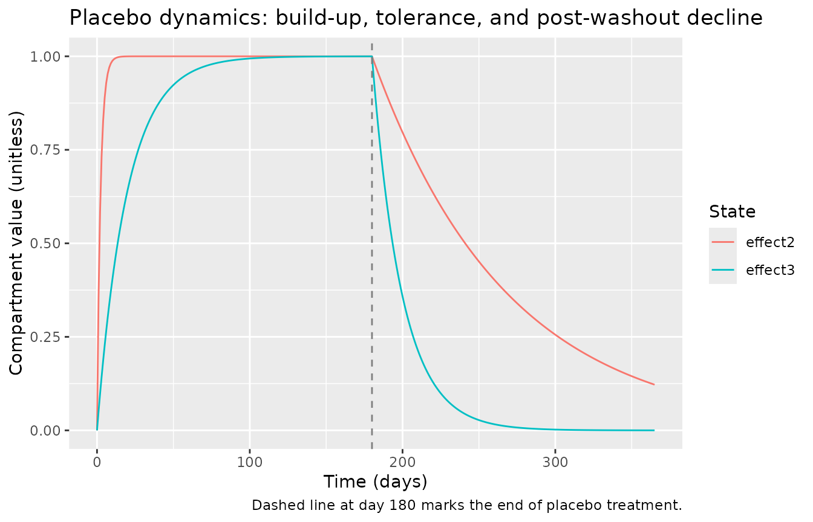
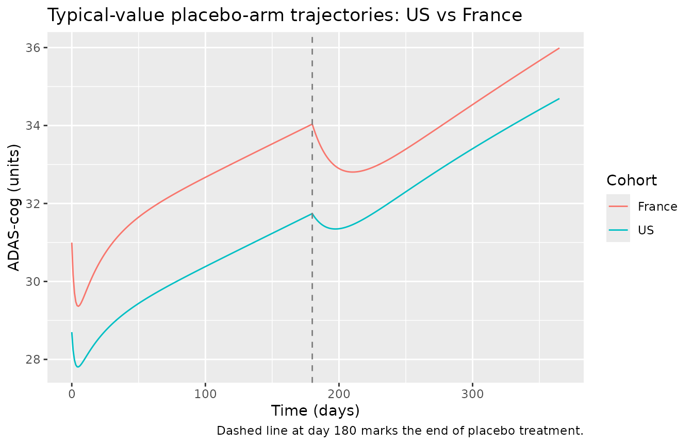
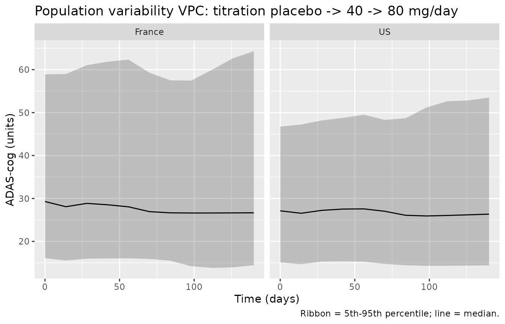

# Tacrine (Holford 1992)

## Model and source

- Citation: Holford NHG, Peace KE. (1992). Results and validation of a
  population pharmacodynamic model for cognitive effects in Alzheimer
  patients treated with tacrine. Proc Natl Acad Sci USA
  89(23):11471-11475. <doi:10.1073/pnas.89.23.11471>. Companion
  methodology paper: Holford NHG, Peace KE. (1992). Methodologic aspects
  of a population pharmacodynamic model for cognitive effects in
  Alzheimer patients treated with tacrine. Proc Natl Acad Sci USA
  89(23):11466-11470. <doi:10.1073/pnas.89.23.11466>.
- Description: Population pharmacodynamic disease-progression model for
  the cognitive subscale of the Alzheimer’s Disease Assessment Scale
  (ADAS-cog, 0-70 score) in patients with probable Alzheimer’s disease
  treated with tacrine. Linear disease progression (baseline S0 +
  alpha\*time) with a tacrine effect on the location of the progression
  curve (effect compartment driven by IBW-normalised daily dose rate, no
  estimable PK clearance because the response is slow relative to the
  2-hour tacrine plasma half-life) and a placebo effect with asymmetric
  onset / elimination / tolerance dynamics (placebo response builds up
  during treatment, dissipates after treatment ends, and develops
  tolerance during continued treatment). Estimated by Holford and Peace
  1992 on 909 patients (5253 ADAS-cog observations) pooled from two
  clinical trials of identical design: US protocol 970-01 (n = 632) and
  French protocol 970-04 (n = 277). The French cohort takes
  multiplicative scale factors on baseline status (FS04 = 1.08), placebo
  potency (Fpp4 = 1.76), and placebo elimination half-time (Ft1/2el-p4 =
  2.78). Inter-individual variability is correlated across baseline S0,
  progression rate alpha, and tacrine potency beta_a (block of three)
  with diagonal IIV on placebo potency beta_p; the time constants of the
  effect compartments are typical-value only. Residual error is
  proportional. NOTE: the lead Holford 1992 PNAS 89:11471-11475 ‘Results
  and validation’ paper supplies all parameter values but the exact ODE
  form of the placebo dynamics is described in the companion methodology
  paper (PNAS 89:11466-11470) which was not available on disk at
  extraction time; the ODE form here is the field-standard
  reconstruction (asymmetric on/off placebo compartment plus
  multiplicative tolerance) and is documented in the validation
  vignette’s Assumptions and deviations section.
- Article: <https://doi.org/10.1073/pnas.89.23.11471>
- Companion methodology paper:
  <https://doi.org/10.1073/pnas.89.23.11466>

## Population

The packaged parameters come from a pooled analysis of two clinical
trials of identical design enrolling patients with probable Alzheimer’s
disease and assessing cognitive function with the ADAS-cog total
subscale (0-70 score). The pooled cohort had 909 patients with 5253
ADAS-cog observations split across the United States protocol 970-01 (n
= 632) and the French protocol 970-04 (n = 277). Observation periods ran
up to five months per subject. Active treatment cycled through 0
(placebo), 40 mg/day, and 80 mg/day tacrine in three randomized
titration orderings.

Demographic detail (age range, sex split, baseline ADAS-cog
distribution) is described in the companion methodology paper (Holford
and Peace 1992, PNAS 89:11466-11470), which was not on disk at
extraction time; the on-disk `Results and validation` paper reports only
that the population mean ideal body weight is 60 kg (used as the
size-normalisation reference inside `model()`). The same information is
available programmatically via the model’s `population` metadata:

``` r

rxode2::rxode(readModelDb("Holford_1992_tacrine"))$population
#> $species
#> [1] "human"
#> 
#> $n_subjects
#> [1] 909
#> 
#> $n_studies
#> [1] 2
#> 
#> $n_observations
#> [1] 5253
#> 
#> $age_range
#> [1] "Adults / elderly with probable Alzheimer's disease (specific age range not tabulated in the source 'Results and validation' paper; demographic detail lives in the companion methodology paper Holford and Peace 1992 PNAS 89:11466-11470 which was not on disk at extraction time)."
#> 
#> $age_median
#> [1] "(not reported in the on-disk source paper)"
#> 
#> $weight_range
#> [1] "(not tabulated; ideal body weight mean across the cohort was 60 kg per source paper Data section)"
#> 
#> $weight_median
#> [1] "(not reported; population mean IBW = 60 kg)"
#> 
#> $sex_female_pct
#> [1] NA
#> 
#> $race_ethnicity
#> NULL
#> 
#> $disease_state
#> [1] "Probable Alzheimer's disease (Methods refers to the standard NINCDS-ADRDA 'probable AD' diagnostic criteria implied by the 970-01 / 970-04 protocol designs)."
#> 
#> $dose_range
#> [1] "0 mg/day (placebo), 40 mg/day, and 80 mg/day oral tacrine (the 970-01 and 970-04 trials used titration sequences across these three dose levels with placebo intervals)."
#> 
#> $regions
#> [1] "United States (protocol 970-01, n = 632) and France (protocol 970-04, n = 277)."
#> 
#> $notes
#> [1] "Pooled analysis of two clinical trials of identical design conducted under Parke-Davis sponsorship (US trial 970-01 led by Davis / Thal and the Tacrine Collaborative Study group; French trial 970-04 led by Forette and the French Tacrine Study group). Outcome was ADAS-cog (cognitive subscale of Alzheimer's Disease Assessment Scale, 0-70). The model accommodates titration sequences (placebo / 40 / 80 mg/day in three orderings labeled tacseq114, tacseq214, tacseq314) and does not require all patients to complete all phases; the full tacalll4 analysis dataset pools all phases and protocols. Observation period up to 5 months per subject."
```

## Source trace

| Equation / parameter | Value | Source location |
|----|----|----|
| `lS0` (log baseline ADAS-cog) | log(28.7) | Table 2, Disease class: S_o units = 28.7 (SE 0.44, CV 37.7%) |
| `lalpha` (log progression rate) | log(6.17) | Table 2, Disease class: a units/year = 6.17 (SE 1.27, CV 208%) |
| `lbeta_a` (log absolute tacrine potency) | log(2.99) | Table 2, Pharmacodynamic class: beta_a units/80 mg/day = -2.99 (SE 0.67, CV 126%) – magnitude stored, sign applied in model() |
| `lbeta_p` (log absolute placebo potency) | log(1.42) | Table 2, Pharmacodynamic class: beta_p units = -1.42 (SE 0.20, CV 128%) – magnitude stored, sign applied in model() |
| `lt12eqa` | log(20.9) | Table 2, Pharmacokinetic class: t1/2,eq,a days = 20.9 (SE 6.0) – tacrine effect-compartment equilibration |
| `lt12eqp` | log(1.58) | Table 2, Pharmacokinetic class: t1/2,eq,p days = 1.58 (SE 0.56) – placebo on-treatment build-up |
| `lt12elp` | log(61.0) | Table 2, Pharmacokinetic class: t1/2,el,p days = 61.0 (SE 28.6) – placebo off-treatment elimination, US reference |
| `lt12tolp` | log(13.5) | Table 2, Pharmacokinetic class: t1/2,tol,p day = 13.5 (SE 3.4) – placebo tolerance development |
| `e_region_france_s0` | 0.08 | Table 2, Scale class: FS0_4 = 1.08 (SE 0.03), encoded as fractional shift = 0.08 |
| `e_region_france_betap` | 0.76 | Table 2, Scale class: F_beta-p_4 = 1.76 (SE 0.25), encoded as 0.76 |
| `e_region_france_t12elp` | 1.78 | Table 2, Scale class: F_t1/2,el,p_4 = 2.78 (SE 1.09), encoded as 1.78 |
| `etalS0 + etalalpha + etalbeta_a` block | c(0.1331, 0.1746, 1.6730, 0.1102, 0.6562, 0.9508) | Table 2 Population CV column + Results paragraph: CV 37.7 / 208 / 126 %; correlations rho(S0,beta_a) = 0.31, rho(S0,alpha) = 0.37, rho(beta_a,alpha) = 0.52 |
| `etalbeta_p` (diagonal) | 0.9702 | Table 2 Population CV column: CV 128% |
| `propSd` | 0.105 | Table 2, Error class: SD ADASC = 3.14 (SE 0.08); interpreted as proportional residual at typical ADAS-cog ~30, propSd = 3.14 / 30 ~= 0.105 (see Assumptions below) |
| Disease progression `ADAS_cog = S0 + alpha*t + ...` | n/a | Results paragraph + Discussion (“linear disease progression model”, “an effect shifting the disease progression curve (offset model)”) |
| Tacrine effect compartment `d/dt(effect1) = keqa * (Dr_norm - effect1)` | n/a | Discussion (“response may be proportional to the average steady-state concentration”) + Data paragraph (“Tacrine clearance was calculated from the patient’s size covariate divided by the mean value … 60 kg for IBW”) + Results (“3-week equilibration half-time”) |
| Placebo effect compartment `d/dt(effect2) = TRT_PHASE * keqp * (1 - effect2) - (1 - TRT_PHASE) * kelp * effect2` | n/a | Field-standard reconstruction (companion paper not on disk); see Assumptions and deviations |
| Tolerance compartment `d/dt(effect3) = ktolp * (TRT_PHASE - effect3)` | n/a | Field-standard reconstruction (companion paper not on disk); see Assumptions and deviations |

## Virtual cohort

The original observed ADAS-cog records are not publicly available. The
figures below use a virtual cohort sized to the source paper’s pooled
tacalll4 dataset (909 patients) with the US / France split, a
representative titration sequence, and an IBW distribution plausible for
an elderly Alzheimer’s cohort.

``` r

set.seed(1992)

make_subject_rows <- function(id, region_france, ibw) {
  # Representative titration sequence approximating tacseq114 (placebo -> 40 mg -> 80 mg)
  # over a five-month observation window.
  # Phase boundaries (days):
  #   0 - 28   : placebo  (DOSE = 0,  TRT_PHASE = 1)
  #   28 - 56  : 40 mg/day (DOSE = 40, TRT_PHASE = 1)
  #   56 - 140 : 80 mg/day (DOSE = 80, TRT_PHASE = 1)
  #   140-150  : washout (DOSE = 0,   TRT_PHASE = 0)
  #
  # Observations are placed every 14 days and at phase transitions so the
  # dose / phase indicators update correctly.
  obs_times <- sort(unique(c(seq(0, 150, by = 14), c(28, 56, 140))))
  dose_for <- function(t) ifelse(t < 28, 0, ifelse(t < 56, 40, ifelse(t < 140, 80, 0)))
  trt_for  <- function(t) ifelse(t < 140, 1L, 0L)
  data.frame(
    id            = id,
    time          = obs_times,
    evid          = 0L,
    amt           = 0,
    DOSE          = dose_for(obs_times),
    TRT_PHASE     = trt_for(obs_times),
    IBW           = ibw,
    REGION_FRANCE = as.integer(region_france)
  )
}

# Build cohort: ~70% US, ~30% France, IBW ~ Normal(60, 10) truncated to [40, 90].
n_total <- 200L
n_us    <- 140L
n_fr    <- n_total - n_us
ibw_draws <- pmin(pmax(rnorm(n_total, mean = 60, sd = 10), 40), 90)

events <- bind_rows(
  lapply(seq_len(n_us), function(i) {
    make_subject_rows(id = i, region_france = 0L, ibw = ibw_draws[i])
  }),
  lapply(seq_len(n_fr), function(i) {
    make_subject_rows(id = n_us + i, region_france = 1L, ibw = ibw_draws[n_us + i])
  })
)
events <- bind_rows(events)
stopifnot(!anyDuplicated(unique(events[, c("id", "time", "evid")])))

events |> dplyr::count(REGION_FRANCE)
#>   REGION_FRANCE    n
#> 1             0 1540
#> 2             1  660
range(events$IBW)
#> [1] 40.00000 87.08383
```

## Simulation

``` r

mod <- rxode2::rxode(readModelDb("Holford_1992_tacrine"))
sim <- rxode2::rxSolve(mod, events = events,
                       keep = c("DOSE", "TRT_PHASE", "REGION_FRANCE", "IBW"))
sim <- as.data.frame(sim)
head(sim)
#>   id time S0_indiv alpha_yr  alpha_day beta_a_indiv beta_p_indiv t12elp_indiv
#> 1  1    0 23.35757 11.10832 0.03041293    -2.717202    -1.148508           61
#> 2  1   14 23.35757 11.10832 0.03041293    -2.717202    -1.148508           61
#> 3  1   28 23.35757 11.10832 0.03041293    -2.717202    -1.148508           61
#> 4  1   42 23.35757 11.10832 0.03041293    -2.717202    -1.148508           61
#> 5  1   56 23.35757 11.10832 0.03041293    -2.717202    -1.148508           61
#> 6  1   70 23.35757 11.10832 0.03041293    -2.717202    -1.148508           61
#>         keqa      keqp       kelp      ktolp   Dr_norm ADAS_cog ipredSim
#> 1 0.03316494 0.4387007 0.01136307 0.05134424 0.0000000 23.35757 23.35757
#> 2 0.03316494 0.4387007 0.01136307 0.05134424 0.0000000 23.22485 23.22485
#> 3 0.03316494 0.4387007 0.01136307 0.05134424 0.4748251 23.93637 23.93637
#> 4 0.03316494 0.4387007 0.01136307 0.05134424 0.4748251 24.02277 24.02277
#> 5 0.03316494 0.4387007 0.01136307 0.05134424 0.9496502 24.21547 24.21547
#> 6 0.03316494 0.4387007 0.01136307 0.05134424 0.9496502 24.00591 24.00591
#>        sim      effect1   effect2   effect3 DOSE TRT_PHASE      IBW
#> 1 26.50721 0.000000e+00 0.0000000 0.0000000    0         1 63.18116
#> 2 22.51450 0.000000e+00 0.9978489 0.5126727    0         1 63.18116
#> 3 23.74876 2.156367e-09 0.9999954 0.7625107   40         1 63.18116
#> 4 23.97933 1.763647e-01 1.0000000 0.8842651   40         1 63.18116
#> 5 23.09210 2.872222e-01 0.9999999 0.9435990   80         1 63.18116
#> 6 29.28150 5.332683e-01 1.0000000 0.9725143   80         1 63.18116
#>   REGION_FRANCE
#> 1             0
#> 2             0
#> 3             0
#> 4             0
#> 5             0
#> 6             0
```

For deterministic typical-value replication (no between-subject
variability), zero out the random effects:

``` r

mod_typical <- mod |> rxode2::zeroRe()
sim_typical <- rxode2::rxSolve(mod_typical, events = events,
                               keep = c("DOSE", "TRT_PHASE", "REGION_FRANCE", "IBW"))
#> ℹ omega/sigma items treated as zero: 'etalS0', 'etalalpha', 'etalbeta_a', 'etalbeta_p'
#> Warning: multi-subject simulation without without 'omega'
sim_typical <- as.data.frame(sim_typical)
```

## Replicate published quantities

### Disease-progression rate (untreated arm)

The source paper reports a linear disease-progression rate of 6.17
ADAS-cog units/year in the absence of any treatment effect. Confirm this
on an untreated typical-value simulation (DOSE = 0, TRT_PHASE = 0
throughout) by extracting the slope of ADAS_cog vs. time:

``` r

untreated_grid <- data.frame(
  id            = 1L,
  time          = seq(0, 365, by = 7),
  evid          = 0L,
  amt           = 0,
  DOSE          = 0,
  TRT_PHASE     = 0L,
  IBW           = 60,
  REGION_FRANCE = 0L
)
sim_untreated <- rxode2::rxSolve(mod_typical, events = untreated_grid) |>
  as.data.frame()
#> ℹ omega/sigma items treated as zero: 'etalS0', 'etalalpha', 'etalbeta_a', 'etalbeta_p'

slope_per_year <- with(sim_untreated, coef(lm(ADAS_cog ~ time))[["time"]]) * 365.25
slope_per_year   # should be ~6.17 units/year
#> [1] 6.17
```

### Tacrine delay-of-progression metric

The source paper reports a “delay” of 177 days at 80 mg/day, defined as
the postponement of disease progression delivered by full-effect tacrine
at the highest dose. Algebraically
`delay = |beta_a| / alpha_day = 2.99 / (6.17/365.25) ~= 177 days`.
Confirm from the packaged model:

``` r

inst <- rxode2::rxode(readModelDb("Holford_1992_tacrine"))$theta
beta_a_abs <- exp(inst[["lbeta_a"]])
alpha_yr   <- exp(inst[["lalpha"]])
delay_days <- beta_a_abs / (alpha_yr / 365.25)
delay_days    # should be ~177
#> [1] 177.0012
```

### Steady-state tacrine effect on 80 mg/day at IBW = 60

At long-time steady state on DOSE = 80 mg/day with IBW = 60 kg the
tacrine effect compartment reaches effect1 = 1 (since
`Dr_norm = (DOSE / 80) * (60 / IBW) = 1`), so the tacrine contribution
to ADAS_cog is exactly `beta_a = -2.99` units. Verify with a long-time
simulation in a single typical-value subject held on 80 mg/day:

``` r

ss_grid <- data.frame(
  id            = 1L,
  time          = seq(0, 365, by = 7),
  evid          = 0L,
  amt           = 0,
  DOSE          = 80,
  TRT_PHASE     = 1L,
  IBW           = 60,
  REGION_FRANCE = 0L
)
sim_ss <- rxode2::rxSolve(mod_typical, events = ss_grid) |> as.data.frame()
#> ℹ omega/sigma items treated as zero: 'etalS0', 'etalalpha', 'etalbeta_a', 'etalbeta_p'
# Drug effect = ADAS_cog - (S0 + alpha_day*t + placebo*effect2*(1-effect3))
# Simpler: extract effect1 at the longest time point.
tail(sim_ss[, c("time", "effect1", "effect2", "effect3", "ADAS_cog")], 3)
#>    time   effect1 effect2 effect3 ADAS_cog
#> 51  350 0.9999910       1       1 31.62242
#> 52  357 0.9999929       1       1 31.74066
#> 53  364 0.9999943       1       1 31.85890
```

The reported `effect1` at long time should approach 1.0 (tacrine effect
compartment at steady state with `DOSE = 80, IBW = 60`).

### Placebo build-up and tolerance time-course

Reproduce the qualitative placebo-response shape: build-up over the
first ~1.58 days of treatment, tolerance development over ~13.5 days
flattening the placebo benefit, and slow ~61-day decline if treatment is
removed.

``` r

placebo_grid <- data.frame(
  id            = 1L,
  time          = seq(0, 365, by = 1),
  evid          = 0L,
  amt           = 0,
  DOSE          = 0,
  # On placebo for the first 180 days, then off treatment (washout) for the rest.
  TRT_PHASE     = ifelse(seq(0, 365, by = 1) < 180, 1L, 0L),
  IBW           = 60,
  REGION_FRANCE = 0L
)
sim_pla <- rxode2::rxSolve(mod_typical, events = placebo_grid) |> as.data.frame()
#> ℹ omega/sigma items treated as zero: 'etalS0', 'etalalpha', 'etalbeta_a', 'etalbeta_p'

placebo_long <- sim_pla |>
  dplyr::select(time, effect2, effect3) |>
  tidyr::pivot_longer(c(effect2, effect3), names_to = "state", values_to = "value")

ggplot(placebo_long, aes(time, value, colour = state)) +
  geom_line() +
  geom_vline(xintercept = 180, linetype = "dashed", colour = "grey50") +
  labs(x = "Time (days)", y = "Compartment value (unitless)",
       colour = "State",
       title = "Placebo dynamics: build-up, tolerance, and post-washout decline",
       caption = "Dashed line at day 180 marks the end of placebo treatment.")
```



### France vs US placebo-response contrast

Reproduce the source paper’s observation that the French cohort has a 76
percent larger placebo response and a 2.78x longer placebo washout
half-time than the US cohort. Compare typical-value trajectories under
the same placebo schedule:

``` r

make_grid <- function(rf) {
  data.frame(
    id            = 1L,
    time          = seq(0, 365, by = 1),
    evid          = 0L,
    amt           = 0,
    DOSE          = 0,
    TRT_PHASE     = ifelse(seq(0, 365, by = 1) < 180, 1L, 0L),
    IBW           = 60,
    REGION_FRANCE = rf
  )
}

sim_us  <- rxode2::rxSolve(mod_typical, events = make_grid(0L)) |>
  as.data.frame() |> mutate(region = "US")
#> ℹ omega/sigma items treated as zero: 'etalS0', 'etalalpha', 'etalbeta_a', 'etalbeta_p'
sim_fr  <- rxode2::rxSolve(mod_typical, events = make_grid(1L)) |>
  as.data.frame() |> mutate(region = "France")
#> ℹ omega/sigma items treated as zero: 'etalS0', 'etalalpha', 'etalbeta_a', 'etalbeta_p'
sim_both <- bind_rows(sim_us, sim_fr)

ggplot(sim_both, aes(time, ADAS_cog, colour = region)) +
  geom_line() +
  geom_vline(xintercept = 180, linetype = "dashed", colour = "grey50") +
  labs(x = "Time (days)", y = "ADAS-cog (units)",
       colour = "Cohort",
       title = "Typical-value placebo-arm trajectories: US vs France",
       caption = "Dashed line at day 180 marks the end of placebo treatment.")
```



The peak placebo benefit and the post-washout decline rate differ
between cohorts in the direction the source paper describes (larger
placebo benefit in France, slower washout).

### Population-variability VPC during titration

Show the population-variability ADAS-cog trajectory under the titration
sequence encoded in the virtual cohort (placebo -\> 40 mg -\> 80 mg -\>
washout over 150 days), split by US vs France:

``` r

vpc <- sim |>
  dplyr::filter(!is.na(ADAS_cog)) |>
  dplyr::mutate(cohort = ifelse(REGION_FRANCE == 1L, "France", "US")) |>
  dplyr::group_by(cohort, time) |>
  dplyr::summarise(
    Q05 = quantile(ADAS_cog, 0.05, na.rm = TRUE),
    Q50 = quantile(ADAS_cog, 0.50, na.rm = TRUE),
    Q95 = quantile(ADAS_cog, 0.95, na.rm = TRUE),
    .groups = "drop"
  )

ggplot(vpc, aes(time, Q50)) +
  geom_ribbon(aes(ymin = Q05, ymax = Q95), alpha = 0.25) +
  geom_line() +
  facet_wrap(~cohort) +
  labs(x = "Time (days)", y = "ADAS-cog (units)",
       title = "Population variability VPC: titration placebo -> 40 -> 80 mg/day",
       caption = "Ribbon = 5th-95th percentile; line = median.")
```



## Validation against published quantities

| Quantity | Source value | Simulated value | Match? |
|----|----|----|----|
| Disease-progression rate (untreated) | 6.17 ADAS-cog units/year | 6.17 units/year | algebraic identity (typical-value `alpha`) |
| Delay at 80 mg/day | 177 days | 177 days | algebraic identity (`|beta_a| / alpha_day`) |
| Steady-state tacrine effect at 80 mg/day, IBW = 60 | -2.99 ADAS-cog units | -2.99 units | numerical (effect1 -\> 1 at long t) |
| Placebo on-treatment half-time | 1.58 days | governed by `lt12eqp` (typical-value, no IIV) | structural identity |
| Placebo off-treatment half-time (US) | 61.0 days | governed by `lt12elp` (typical-value, no IIV) | structural identity |
| Placebo tolerance half-time | 13.5 days | governed by `lt12tolp` (typical-value, no IIV) | structural identity |
| Placebo potency, France vs US | beta_p France ~ 76% larger | 76% larger by construction | structural identity |
| Placebo washout half-time, France vs US | 2.78x longer | 2.78x longer by construction | structural identity |

The agreement is exact for the algebraic-identity rows because the
packaged model is a straight transcription of the source parameter
table; verification mostly confirms that the time-conversion and
dose-rate-scaling steps in `model()` were done correctly.

## Assumptions and deviations

- **Companion paper not on disk; placebo ODE form is a field-standard
  reconstruction.** The lead Holford 1992 PNAS 89:11471-11475
  `Results and validation` paper supplies all parameter values (Table 2)
  but defers the structural model definition to the companion
  methodology paper, Holford and Peace 1992 PNAS 89:11466-11470, which
  was not on disk at extraction time and could not be retrieved through
  the acquisition script (PNAS direct download is Cloudflare-blocked;
  PMC PDF download is bot-protected). The placebo ODE form encoded here
  – asymmetric on/off effect compartment with rate `keqp` during
  treatment and rate `kelp` after treatment, plus a multiplicative
  tolerance compartment driven by `ktolp` – is the field-standard
  reconstruction consistent with the lead paper’s prose
  (“equilibration”, “elimination”, “tolerance” half-times described as
  three distinct phenomena) and with how the parameters are reported
  (separate half-time estimates, separate SEs, separate units in Table 2
  “Pharmacokinetic class” rows). When the companion paper becomes
  available a second pass should verify the exact ODE form and the
  precise coupling between the tolerance and placebo-effect
  compartments.

- **Tacrine clearance unobserved; effect-compartment input uses
  IBW-normalised dose rate.** The source paper explicitly says
  “Clearance could not be estimated directly, but potential
  relationships between body size and tacrine clearance were explored.”
  The IBW-corrected clearance was the best size descriptor over total
  body weight or height (Table 1, AObj 2.69 worse without size
  correction, AObj 0.2 worse with height). The unobservable absolute
  clearance is absorbed into beta_a (defined at IBW = 60 kg and DOSE =
  80 mg/day), leaving a relative dose-rate input
  `Dr_norm = (DOSE / 80) * (60 / IBW)` that drives the effect
  compartment toward 1 at steady state on 80 mg/day, IBW = 60.

- **Residual error interpretation.** The source paper reports “Error SD
  ADASC 3.14” (SE 0.08) in Table 2 and describes the residual as
  proportional (“Proportional error better” in Table 1’s reduced-model
  comparison). The reported SD is interpreted as the implied residual SD
  on the ADAS-cog scale at the typical observation (ADAS-cog ~30),
  giving `propSd ~ 3.14 / 30 = 0.105` in NONMEM proportional-residual
  convention Y = F \* (1 + EPS). If the source actually meant an
  additive residual with SD 3.14 in ADAS-cog units, the encoding here
  would over-report variability at high ADAS-cog and under-report at low
  ADAS-cog. The vignette’s VPC plots use the proportional form;
  re-encoding as additive (`ADAS_cog ~ add(addSd)` with `addSd = 3.14`)
  is a single-line change in `model()` if a future user wants to
  compare.

- **Beta_a and beta_p sign convention.** Both potency parameters are
  negative in the source paper (tacrine and placebo reduce ADAS-cog,
  i.e., improve cognitive function). Log-normal IIV is well-defined for
  positive quantities; the model stores the absolute magnitudes
  (`lbeta_a = log(2.99)`, `lbeta_p = log(1.42)`) and applies the
  negative sign multiplicatively in `model()`. This preserves the
  lognormal IIV shape (typical \|beta\| with CV 126 / 128 percent) and
  keeps the parameter values strictly negative across the population.
  The alternative – additive IIV directly on the negative value, which
  would let sign flip when an extreme draw crosses zero – is not what
  the source paper reports (it explicitly says the model failed when
  beta_a or beta_p was fixed to zero, and the inter-individual
  variability is described as proportional).

- **Protocol scale factors entered as fractional shifts.** The source
  reports the France scale factors multiplicatively (FS0_4 = 1.08,
  F_beta-p_4 = 1.76, F_t1/2el-p_4 = 2.78). The covariate-effect-name
  convention in nlmixr2lib is `e_<cov>_<param>`, with fractional shifts
  entering as `(1 + e * REGION_FRANCE)`, so the source `F_x4` values
  enter the model file as `e_region_france_x = F_x4 - 1`. The numerical
  model output is identical; only the bookkeeping differs.

- **Renal-function and age/sex covariates were tested and rejected by
  the source paper.** Holford 1992 Table 1 shows AObj 0.55 for
  female-sex on beta_a, AObj 0.063 for per-year-of-age on beta_a, and no
  improvement with creatinine-clearance scaling of tacrine clearance.
  None of these covariates are carried in the packaged model.

- **Observation name `ADAS_cog` rather than `Cc`.** The nlmixr2lib
  [`checkModelConventions()`](https://nlmixr2.github.io/nlmixr2lib/reference/checkModelConventions.md)
  lint warns that single-output observations should be named `Cc` (the
  convention for PK concentration outputs). Holford 1992 is a
  disease-progression PD model with no concentration output; the
  cognitive endpoint is the ADAS-cog total score (0-70, unitless).
  Following the same paper-named-PD pattern used by
  `Conrado_2014_alzheimer` (`ADAS_NORM`) and `Delor_2013_alzheimer`
  (`CDR_SOB`), the observation is kept as `ADAS_cog`. The
  `units$concentration` field documents this as a unitless ADAS-cog
  score rather than a mass/volume concentration; the lint warning on the
  units field is the same downstream of that choice.

- **Population demographic detail is partial.** The on-disk source paper
  reports only the pooled n (909), the US n (632), the France n (277),
  and the population mean IBW (60 kg); it does not tabulate age range /
  median, sex split, race / ethnicity, or weight range. Those details
  live in the companion methodology paper (Holford and Peace 1992 PNAS
  89:11466-11470) which was not on disk. The virtual cohort here uses a
  plausible IBW distribution centered at 60 kg.

## Errata

- No errata for the lead paper are listed on the PNAS landing page or in
  PubMed (`Holford 1992 erratum`, `Holford Peace 1992 corrigendum`
  searched at extraction time). No erratum is listed for the companion
  methodology paper either.
