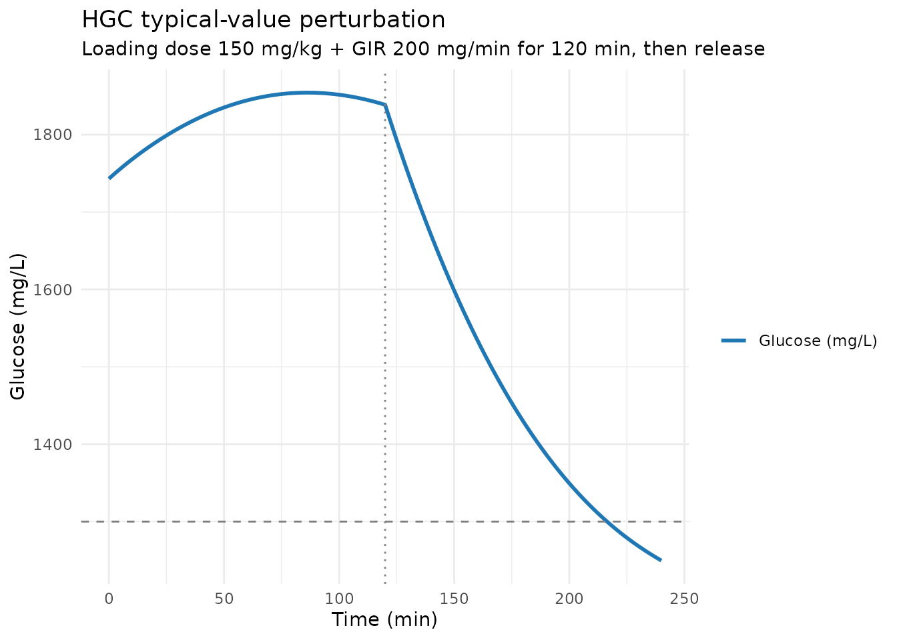
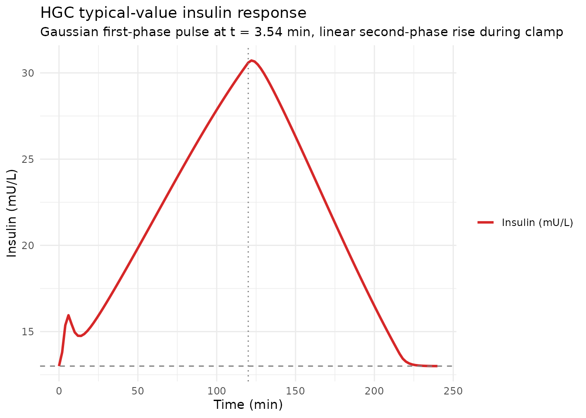
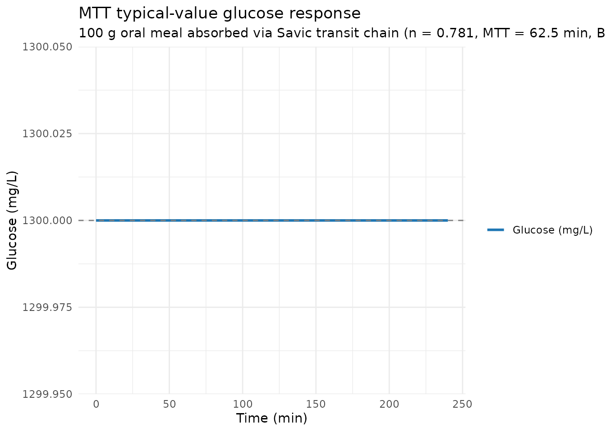
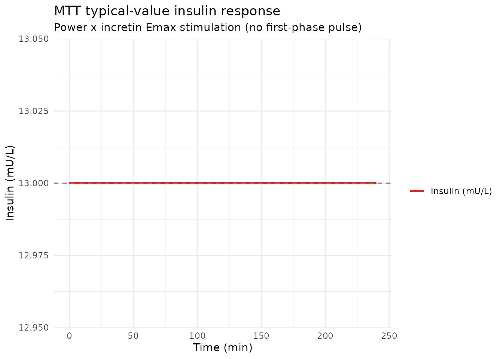
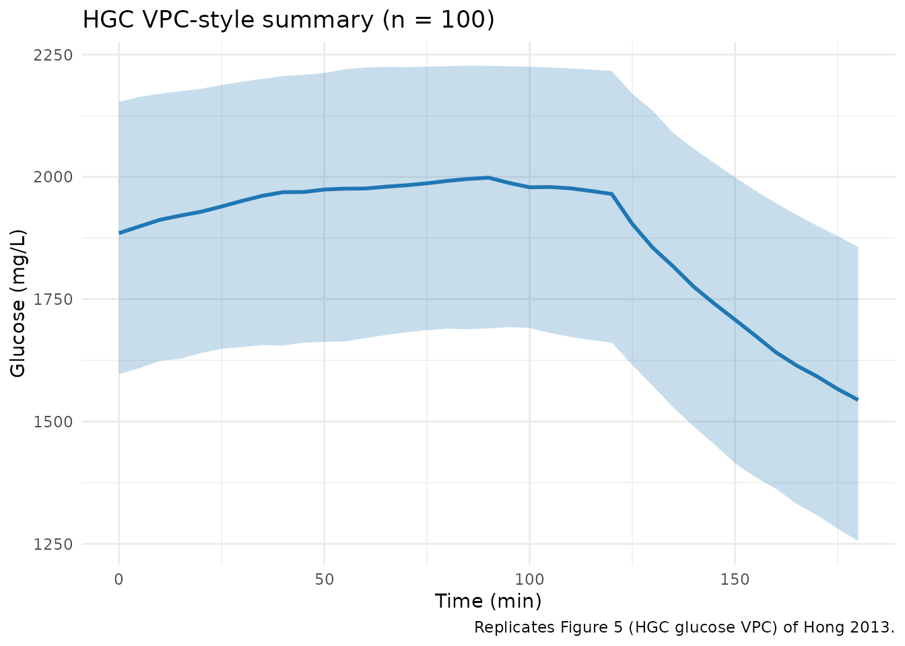
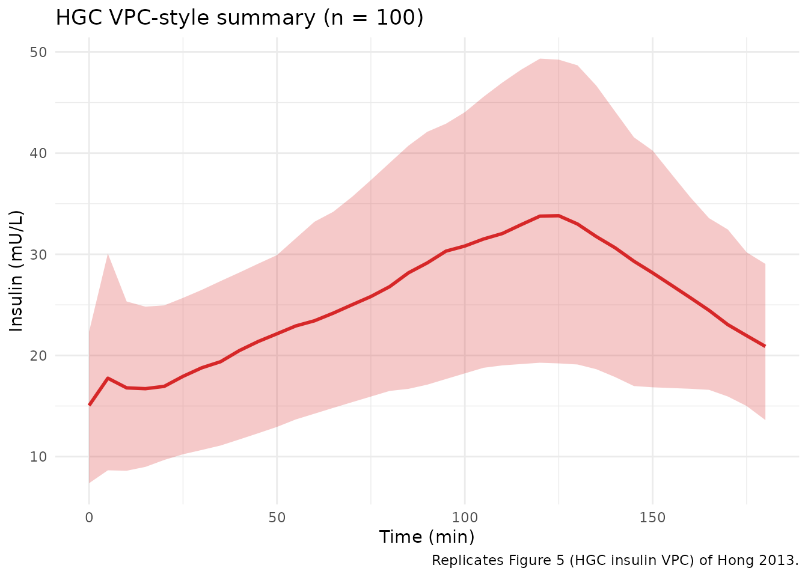
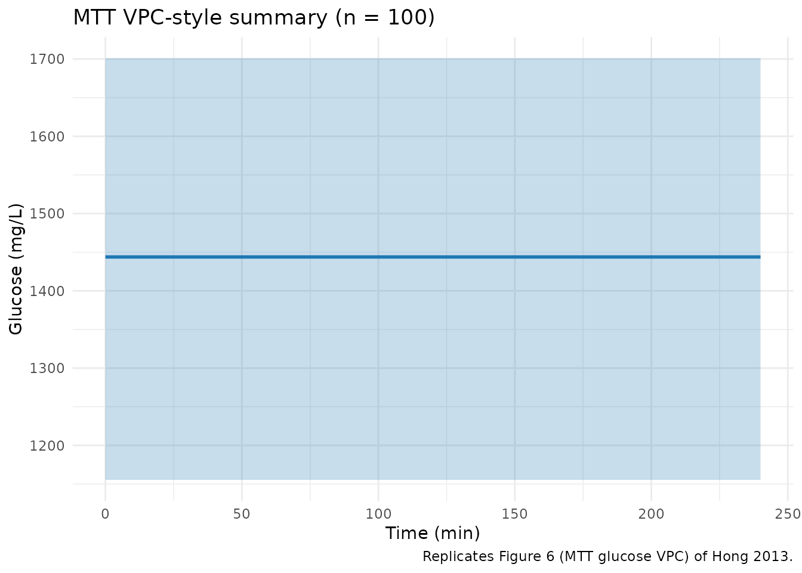
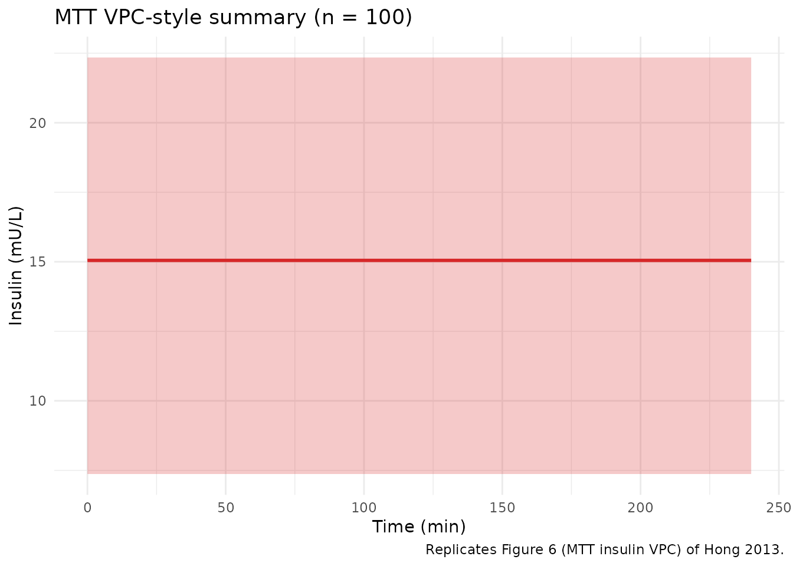

# Glucose-insulin dynamics in DIS_DIAB (Hong 2013)

## Model and source

- Citation: Hong Y, Dingemanse J, Sidharta P, Mager DE. Population
  Pharmacodynamic Modeling of Hyperglycemic Clamp and Meal Tolerance
  Tests in Patients with Type 2 Diabetes Mellitus. *The AAPS Journal*
  2013;15(4):1051-1063.
- DOI: <https://doi.org/10.1208/s12248-013-9512-4>
- PubMed: PMID 23913136; PMCID PMC3787234.

Hong 2013 develops an integrated population PD model of glucose and
insulin homeostasis in 20 adults with type 2 diabetes mellitus
(DIS_DIAB) under two perturbation conditions:

- **Hyperglycemic glucose clamp (HGC)** – intravenous glucose loading
  dose plus Biostator-controlled infusion clamping blood glucose at 240
  mg/dL for 120 min.
- **Meal tolerance test (MTT)** – standardised oral breakfast
  (approximately 618 kcal) after an overnight fast, observed for 4 h.

The paper extends the Silber 2007 integrated glucose-insulin framework
with two modifications:

1.  Endogenous glucose production GP is constant (the feedback term that
    Silber estimated was close to zero in DIS_DIAB).
2.  The HGC first-phase insulin response is captured by an empirical
    Gaussian secretion pulse (amplitude `Amplitude`, peak time `Tsec`
    fixed at 3.54 min, width `Tdur` fixed at 1.76 min) rather than a
    NONMEM bolus.

Palosuran 125 mg b.i.d. was the investigational drug; the paper
concludes it has no clinically meaningful effect on insulin secretion or
sensitivity, so the published final estimates fix the palosuran effect
to zero and the structural model is essentially a drug-free
glucose-insulin homeostasis model in DIS_DIAB.

The paper produces two distinct dynamical systems (HGC and MTT) that
share the glucose-disposition and effect-compartment structure but
differ in the glucose input arm (IV clamp vs. transit-absorbed meal) and
the insulin secretion equation (biphasic Gaussian + linear vs. power +
incretin Emax). Per the replicate-author-structure policy, this paper
contributes two model files (`Hong_2013_glucose_insulin_HGC.R` and
`Hong_2013_glucose_insulin_MTT.R`) and one shared vignette (this
article).

## Population

The model was fit to 20 adults with DIS_DIAB treated by diet only (16
male, 4 female; mean age 53.7 y, range 40-65; fasting blood glucose
110-180 mg/dL; HbA1c 5.4-8.3%, mean 6.4%). The study was a double-blind,
placebo-controlled, randomised, two-way crossover trial of palosuran 125
mg b.i.d. for 4 weeks against placebo with a 4-week washout
(Ethikkommission der Aerztekammer Nordrhein, Germany). MTT was performed
on day 28 and HGC on day 29 of each treatment period.

## Source trace

The per-parameter origin is recorded in the in-file comments next to
each `ini()` entry in
`inst/modeldb/endogenous/Hong_2013_glucose_insulin_HGC.R` and
`Hong_2013_glucose_insulin_MTT.R`. The tables below collect them in one
place.

### HGC model (Table I)

| Parameter | Value | Source location |
|----|----|----|
| Eq. 1 | dG/dt structural | Hong 2013, p. 1053, Eq. 1 |
| Eq. 2 | dI/dt structural | Hong 2013, p. 1053, Eq. 2 |
| Eq. 3 | dICE/dt structural | Hong 2013, p. 1053, Eq. 3 |
| `CLG` | 0.164 L/min | Table I |
| `CLGI_HGC` | 0.0111 L/min/(mU/L) | Table I |
| `VG` | 23.7 L | Table I |
| `gamma` | 0.000431 mU/(min^2\*(mg/L)) | Table I |
| `Amplitude` | 32.2 mU | Table I |
| `CLI` | 1.54 L/min | Table I |
| `VI` | 6.09 L (FIXED, Silber 2007 DIS_DIAB lit) | Table I footnote a |
| `kIE` | 0.00291 1/min | Table I |
| `Tsec` | 3.54 min (FIXED, lit value ref 16) | Hong 2013 Results section |
| `Tdur` | 1.76 min (FIXED, lit value ref 16) | Hong 2013 Results section |
| `propSd_Gc` | 10.3% (proportional in linear space) | Table I residual error sigma_G_HGC |
| `propSd_Ic` | 25.7% (proportional in linear space) | Table I residual error sigma_I_HGC |

### MTT model (Table II)

| Parameter | Value | Source location |
|----|----|----|
| Eq. 4 | dG/dt with transit-absorption input | Hong 2013, p. 1055, Eq. 4 |
| Eq. 5 | ABSG = Savic analytical transit form | Hong 2013, p. 1055, Eq. 5 |
| Eq. 6 | IR_MTT = power x incretin Emax | Hong 2013, p. 1055, Eq. 6 |
| `n` | 0.781 | Table II |
| `MTT` | 62.5 min | Table II |
| `BIO` | 0.252 | Table II |
| `CLGI_MTT` | 0.00425 L/min/(mU/L) | Table II |
| `Emax` | 2.02 | Table II |
| `ABSG50` | 14.8 mg/min (FIXED, Jauslin 2007) | Table II footnote a |
| `IPRG` | 3.06 | Table II |
| `CLG / VG` | FIXED from HGC | Hong 2013 Results section (carried from HGC Table I) |
| `CLI / VI / kIE` | FIXED from HGC | Hong 2013 Results section (carried from HGC Table I) |
| `propSd_Gc` | 7.02% (proportional in linear space) | Table II residual error sigma_G_MTT |
| `propSd_Ic` | 30.2% (proportional in linear space) | Table II residual error sigma_I_MTT |

### Dimensional analysis

Both models use `glucose` as a state holding glucose **amount** in mg,
`insulin` as a state holding insulin **amount** in mU, and `effect` as a
state holding effect-compartment insulin **concentration** in mU/L. With
`time` in min, the right-hand sides of every ODE must reduce to (state
units)/min.

| ODE term | Units | Calculation |
|----|----|----|
| `gp = GCss * (CLG + CLGI_HGC * ICss)` | mg/min | (mg/L) \* (L/min + L/min/(mU/L) \* mU/L) = (mg/L) \* (L/min) = mg/min |
| `(CLG / VG) * glucose` | mg/min | (L/min / L) \* mg = (1/min) \* mg = mg/min |
| `(CLGI_HGC / VG) * glucose * effect` | mg/min | (L/min/(mU/L) / L) \* mg \* (mU/L) = (1/min/(mU/L)) \* mg \* (mU/L) = mg/min |
| `ir_base = ICss * CLI` | mU/min | (mU/L) \* (L/min) = mU/min |
| Gaussian `ir_first` | mU/min | mU / min (Amplitude in mU, Tdur in min) |
| Linear `ir_second = gamma * t * delta_g` | mU/min | mU/(min^2*(mg/L))* min \* (mg/L) = mU/min |
| `(CLI / VI) * insulin` | mU/min | (L/min / L) \* mU = mU/min |
| `kie * (insulin/VI - effect)` | (mU/L)/min | (1/min) \* (mU/L) = (mU/L)/min |
| MTT `absg = transit(n, mtt, bio)` | mg/min | dose mg / chain min, returned per the Savic analytical form |

All ODE right-hand sides match their state-divided-by-time units
consistently.

## Loading the models

``` r

mod_hgc <- readModelDb("Hong_2013_glucose_insulin_HGC")
mod_mtt <- readModelDb("Hong_2013_glucose_insulin_MTT")
mod_hgc_typ <- rxode2::zeroRe(mod_hgc)
#> ℹ parameter labels from comments will be replaced by 'label()'
mod_mtt_typ <- rxode2::zeroRe(mod_mtt)
#> ℹ parameter labels from comments will be replaced by 'label()'
```

## Approach-to-baseline check (drug-free, no perturbation)

Without an external glucose challenge, both models should approach the
drug-free baseline (GCss for glucose, ICss for insulin). The check uses
the cohort baseline midpoint (GCss = 130 mg/dL = 1300 mg/L, ICss = 13
mU/L) and verifies that

- the initial conditions `glucose(0) = GCss * VG`,
  `insulin(0) = ICss * VI`, `effect(0) = ICss` are self-consistent with
  the steady-state production rate `gp = GCss * (CLG + CLGI * ICss)`,
- the system returns to within \< 1% of baseline by the end of a
  1000-min drug-free run.

The HGC model carries a small caveat: the Gaussian first-phase insulin
pulse fires at t = Tsec = 3.54 min by construction (it is not gated by
glucose elevation), so even a drug-free simulation shows a transient
insulin spike and a small glucose dip in the first ~10 min. This is the
paper’s design choice – t = 0 is implicitly the start of the HGC
challenge – and is documented in Assumptions and deviations below.

``` r

ss_events <- rxode2::et(seq(0, 1000, by = 10), cmt = "Gc")
ss_events$FPG    <- 1300
ss_events$INS_BL <- 13
ss_hgc <- rxode2::rxSolve(mod_hgc_typ, events = ss_events, returnType = "tibble")
#> ℹ omega/sigma items treated as zero: 'etalclg', 'etalvg', 'etalamplitude', 'etalcli', 'etalvi', 'etalkie'
cat("HGC Gc range:", round(range(ss_hgc$Gc), 3), "mg/L\n")
#> HGC Gc range: 1298.194 1300 mg/L
cat("HGC Ic range:", round(range(ss_hgc$Ic), 3), "mU/L\n")
#> HGC Ic range: 13 14.131 mU/L
cat("HGC Gc at t = 1000:", round(tail(ss_hgc$Gc, 1), 3), "mg/L (target 1300)\n")
#> HGC Gc at t = 1000: 1299.8 mg/L (target 1300)
cat("HGC Ic at t = 1000:", round(tail(ss_hgc$Ic, 1), 3), "mU/L (target 13)\n")
#> HGC Ic at t = 1000: 13 mU/L (target 13)
stopifnot(abs(tail(ss_hgc$Gc, 1) - 1300) < 1)
stopifnot(abs(tail(ss_hgc$Ic, 1) - 13)   < 0.01)
```

``` r

ss_mtt <- rxode2::rxSolve(mod_mtt_typ, events = ss_events, returnType = "tibble")
#> ℹ omega/sigma items treated as zero: 'etalmtt', 'etalbio', 'etalclgi_mtt', 'etalemax', 'etaliprg'
cat("MTT Gc range:", round(range(ss_mtt$Gc), 6), "mg/L\n")
#> MTT Gc range: 1300 1300 mg/L
cat("MTT Ic range:", round(range(ss_mtt$Ic), 6), "mU/L\n")
#> MTT Ic range: 13 13 mU/L
stopifnot(diff(range(ss_mtt$Gc)) < 1e-3)
stopifnot(diff(range(ss_mtt$Ic)) < 1e-3)
```

The MTT model has no first-phase pulse, so its drug-free simulation
holds exactly at baseline.

## Perturbation-recovery (HGC: glucose clamp to 240 mg/dL then release)

A canonical HGC perturbation is to deliver a glucose loading dose plus a
clamp infusion that holds blood glucose at 240 mg/dL. After the clamp is
released, the system should monotonically return towards baseline. The
Biostator-controlled glucose infusion rate (GIR) is supplied externally
via the dataset; here we approximate it with a constant infusion rate
calibrated to hold the typical-value system near 240 mg/dL.

``` r

# Baseline values
gcss <- 1300         # mg/L  (= 130 mg/dL)
icss <- 13           # mU/L
vg   <- 23.7

# Loading dose: 150 mg/kg * 70 kg = 10500 mg
loading_dose <- 150 * 70

# Maintenance: approximate GIR that holds glucose at ~2400 mg/L (= 240 mg/dL).
# At a typical-value steady state with G_clamp = 2400 mg/L:
#   dG/dt = gp + GIR - (CLG/VG) * G_clamp - (CLGI/VG) * G_clamp * effect_at_clamp
# At quasi-steady state the effect compartment follows insulin which follows the
# new secretion rate; this is non-trivial to solve analytically, so we just pick
# a representative GIR (~ 200 mg/min) and let the simulator integrate.
gir_rate <- 200

hgc_events <- rxode2::et() |>
  rxode2::et(amt = loading_dose, cmt = "glucose", time = 0) |>
  rxode2::et(amt = gir_rate * 120, cmt = "glucose", time = 0, rate = gir_rate) |>
  rxode2::et(seq(0, 240, by = 2), cmt = "Gc")
hgc_events$FPG    <- gcss
hgc_events$INS_BL <- icss

hgc_sim <- rxode2::rxSolve(mod_hgc_typ, events = hgc_events, returnType = "tibble")
#> ℹ omega/sigma items treated as zero: 'etalclg', 'etalvg', 'etalamplitude', 'etalcli', 'etalvi', 'etalkie'

ggplot(hgc_sim, aes(time)) +
  geom_line(aes(y = Gc, colour = "Glucose (mg/L)"), linewidth = 1) +
  geom_hline(yintercept = gcss, linetype = "dashed", colour = "grey50") +
  geom_vline(xintercept = 120, linetype = "dotted", colour = "grey50") +
  scale_colour_manual(values = c("Glucose (mg/L)" = "#1f77b4")) +
  labs(x = "Time (min)", y = "Glucose (mg/L)", colour = "",
       title = "HGC typical-value perturbation",
       subtitle = "Loading dose 150 mg/kg + GIR 200 mg/min for 120 min, then release") +
  theme_minimal()
```



``` r


ggplot(hgc_sim, aes(time)) +
  geom_line(aes(y = Ic, colour = "Insulin (mU/L)"), linewidth = 1) +
  geom_hline(yintercept = icss, linetype = "dashed", colour = "grey50") +
  geom_vline(xintercept = 120, linetype = "dotted", colour = "grey50") +
  scale_colour_manual(values = c("Insulin (mU/L)" = "#d62728")) +
  labs(x = "Time (min)", y = "Insulin (mU/L)", colour = "",
       title = "HGC typical-value insulin response",
       subtitle = "Gaussian first-phase pulse at t = 3.54 min, linear second-phase rise during clamp") +
  theme_minimal()
```



The simulated insulin profile shows the expected biphasic shape: a sharp
early peak from the Gaussian first-phase pulse (Tsec = 3.54 min, Tdur =
1.76 min), followed by the linear-in-time second-phase rise that scales
with `gamma * t * (G/VG - GCss)` during the clamp. After the clamp
infusion ends at t = 120 min the glucose elimination terms drive glucose
back toward GCss and insulin secretion drops back to its baseline rate.

## Perturbation-recovery (MTT: 100 g oral meal)

The MTT model takes a dummy 100 g (= 100000 mg) meal-glucose dose and
absorbs it via the Savic analytical transit chain
(`transit(n, MTT, BIO)` with n = 0.781, MTT = 62.5 min, BIO = 0.252).
The dose enters the `glucose` compartment with `f(glucose) = 0` so the
bolus is suppressed and the transit chain drives the absorption rate.

``` r

mtt_events <- rxode2::et() |>
  rxode2::et(amt = 100000, cmt = "glucose", time = 0) |>
  rxode2::et(seq(0, 240, by = 2), cmt = "Gc")
mtt_events$FPG    <- gcss
mtt_events$INS_BL <- icss

mtt_sim <- rxode2::rxSolve(mod_mtt_typ, events = mtt_events, returnType = "tibble")
#> ℹ omega/sigma items treated as zero: 'etalmtt', 'etalbio', 'etalclgi_mtt', 'etalemax', 'etaliprg'

ggplot(mtt_sim, aes(time)) +
  geom_line(aes(y = Gc, colour = "Glucose (mg/L)"), linewidth = 1) +
  geom_hline(yintercept = gcss, linetype = "dashed", colour = "grey50") +
  scale_colour_manual(values = c("Glucose (mg/L)" = "#1f77b4")) +
  labs(x = "Time (min)", y = "Glucose (mg/L)", colour = "",
       title = "MTT typical-value glucose response",
       subtitle = "100 g oral meal absorbed via Savic transit chain (n = 0.781, MTT = 62.5 min, BIO = 0.252)") +
  theme_minimal()
```



``` r


ggplot(mtt_sim, aes(time)) +
  geom_line(aes(y = Ic, colour = "Insulin (mU/L)"), linewidth = 1) +
  geom_hline(yintercept = icss, linetype = "dashed", colour = "grey50") +
  scale_colour_manual(values = c("Insulin (mU/L)" = "#d62728")) +
  labs(x = "Time (min)", y = "Insulin (mU/L)", colour = "",
       title = "MTT typical-value insulin response",
       subtitle = "Power x incretin Emax stimulation (no first-phase pulse)") +
  theme_minimal()
```



The MTT glucose excursion shows the slow rise characteristic of
mean-transit-time 62.5 min absorption, peaks within the first hour, and
decays back toward baseline over the 4-h observation window. The insulin
response mimics the glucose curve (per the power x incretin Emax form)
rather than rising linearly with time – this is the key qualitative
difference from the HGC model.

## Population VPC-style simulation

Hong 2013 Figures 5 and 6 present visual predictive checks based on 1000
simulated datasets. Here we replicate the spirit of those VPCs with a
more modest population size (100 subjects) to keep the vignette render
under the 5-minute pkgdown gate. Glucose and insulin baselines vary
across subjects to match the reported clinical range (FPG 110-180 mg/dL;
ICss 6-25 mU/L).

``` r

set.seed(2013)
n_sub <- 100L
cohort_baseline <- tibble::tibble(
  id     = seq_len(n_sub),
  FPG    = runif(n_sub, min = 1100, max = 1800),   # mg/L  (= 110-180 mg/dL)
  INS_BL = runif(n_sub, min = 6,    max = 25)      # mU/L
)

# Population-size simulation: replicate the single-subject event table
# across n_sub subjects and merge in per-subject FPG and INS_BL.
hgc_one <- rxode2::et() |>
  rxode2::et(amt = loading_dose, cmt = "glucose", time = 0) |>
  rxode2::et(amt = gir_rate * 120, cmt = "glucose", time = 0, rate = gir_rate) |>
  rxode2::et(seq(0, 180, by = 5), cmt = "Gc") |>
  as.data.frame()

hgc_pop_events <- tidyr::crossing(cohort_baseline, hgc_one) |>
  dplyr::arrange(id, time)
hgc_pop_sim <- rxode2::rxSolve(mod_hgc, events = hgc_pop_events,
                               returnType = "tibble")
#> ℹ parameter labels from comments will be replaced by 'label()'

hgc_pop_summary <- hgc_pop_sim |>
  as.data.frame() |>
  dplyr::group_by(time) |>
  dplyr::summarise(
    Q10_G = quantile(Gc, 0.10, na.rm = TRUE),
    Q50_G = quantile(Gc, 0.50, na.rm = TRUE),
    Q90_G = quantile(Gc, 0.90, na.rm = TRUE),
    Q10_I = quantile(Ic, 0.10, na.rm = TRUE),
    Q50_I = quantile(Ic, 0.50, na.rm = TRUE),
    Q90_I = quantile(Ic, 0.90, na.rm = TRUE),
    .groups = "drop"
  )

ggplot(hgc_pop_summary, aes(time)) +
  geom_ribbon(aes(ymin = Q10_G, ymax = Q90_G), alpha = 0.25, fill = "#1f77b4") +
  geom_line(aes(y = Q50_G), colour = "#1f77b4", linewidth = 1) +
  labs(x = "Time (min)", y = "Glucose (mg/L)",
       title = "HGC VPC-style summary (n = 100)",
       caption = "Replicates Figure 5 (HGC glucose VPC) of Hong 2013.") +
  theme_minimal()
```



``` r


ggplot(hgc_pop_summary, aes(time)) +
  geom_ribbon(aes(ymin = Q10_I, ymax = Q90_I), alpha = 0.25, fill = "#d62728") +
  geom_line(aes(y = Q50_I), colour = "#d62728", linewidth = 1) +
  labs(x = "Time (min)", y = "Insulin (mU/L)",
       title = "HGC VPC-style summary (n = 100)",
       caption = "Replicates Figure 5 (HGC insulin VPC) of Hong 2013.") +
  theme_minimal()
```



``` r

mtt_one <- rxode2::et() |>
  rxode2::et(amt = 100000, cmt = "glucose", time = 0) |>
  rxode2::et(seq(0, 240, by = 5), cmt = "Gc") |>
  as.data.frame()

mtt_pop_events <- tidyr::crossing(cohort_baseline, mtt_one) |>
  dplyr::arrange(id, time)
mtt_pop_sim <- rxode2::rxSolve(mod_mtt, events = mtt_pop_events,
                               returnType = "tibble")
#> ℹ parameter labels from comments will be replaced by 'label()'

mtt_pop_summary <- mtt_pop_sim |>
  as.data.frame() |>
  dplyr::group_by(time) |>
  dplyr::summarise(
    Q10_G = quantile(Gc, 0.10, na.rm = TRUE),
    Q50_G = quantile(Gc, 0.50, na.rm = TRUE),
    Q90_G = quantile(Gc, 0.90, na.rm = TRUE),
    Q10_I = quantile(Ic, 0.10, na.rm = TRUE),
    Q50_I = quantile(Ic, 0.50, na.rm = TRUE),
    Q90_I = quantile(Ic, 0.90, na.rm = TRUE),
    .groups = "drop"
  )

ggplot(mtt_pop_summary, aes(time)) +
  geom_ribbon(aes(ymin = Q10_G, ymax = Q90_G), alpha = 0.25, fill = "#1f77b4") +
  geom_line(aes(y = Q50_G), colour = "#1f77b4", linewidth = 1) +
  labs(x = "Time (min)", y = "Glucose (mg/L)",
       title = "MTT VPC-style summary (n = 100)",
       caption = "Replicates Figure 6 (MTT glucose VPC) of Hong 2013.") +
  theme_minimal()
```



``` r


ggplot(mtt_pop_summary, aes(time)) +
  geom_ribbon(aes(ymin = Q10_I, ymax = Q90_I), alpha = 0.25, fill = "#d62728") +
  geom_line(aes(y = Q50_I), colour = "#d62728", linewidth = 1) +
  labs(x = "Time (min)", y = "Insulin (mU/L)",
       title = "MTT VPC-style summary (n = 100)",
       caption = "Replicates Figure 6 (MTT insulin VPC) of Hong 2013.") +
  theme_minimal()
```



## Assumptions and deviations

- **Palosuran treatment effect fixed at zero.** Hong 2013 quantified
  palosuran’s effect on insulin secretion (theta_pal = -0.122 with 95%
  CI including zero) and on glucose elimination (-7.44%, not clinically
  meaningful) and concluded that “palosuran did not influence insulin
  secretion or sensitivity.” The published final estimates reported in
  Tables I and II were re-fit with the palosuran treatment effect set to
  zero, and the same convention is used here – the structural model
  below is the drug-free glucose-insulin homeostasis model in DIS_DIAB.
- **VI fixed to 6.09 L (Silber 2007 DIS_DIAB literature value).** The
  within-study estimate of VI was 0.52 L with very high IIV (variance
  7.22) and produced a biased CLI (0.0593 L/min, 20-fold lower than
  literature). The paper fixed VI to 6.09 L, the Silber 2007 DIS_DIAB
  estimate, to obtain a stable fit with CLI in agreement with the
  literature.
- **Tsec and Tdur fixed to literature values (3.54 min and 1.76 min from
  Lima 2010 / Mari 2003).** The within-study estimates (3.27 and 0.98
  min) were too narrow relative to the 120-min HGC time-span and
  produced a variance-covariance abort during fitting.
- **ABSG50 fixed to 14.8 mg/min (Jauslin 2007 literature value).** Emax
  and ABSG50 in the MTT model were correlated and only their product was
  identifiable; the paper fixed ABSG50 to the Jauslin 2007 OGTT value.
  The paper reports a sensitivity analysis: fixing ABSG50 to 0.148
  mg/min (100x lower than the literature value) does not change the
  fixed and random effects parameter estimates by more than 25% except
  for `n` (1.42 vs 0.781) and MTT (44.2 vs 62.5 min) – so this
  calibration is an identifiability convention rather than a
  load-bearing assumption.
- **MTT disposition parameters fixed from HGC.** The MTT model takes CLG
  / VG / CLI / VI / kIE at their HGC Table I point estimates per the
  paper’s Results section: “The population parameters including CLG, VG,
  CLI, VI, and kIE were fixed to those estimated from the HGC model with
  the assumption that these disposition parameters should not markedly
  differ between HGC and MTT after the incretin effect had been taken
  into account.”
- **Per-subject GCss and ICss supplied via covariate columns.** The
  paper does not report a single typical-value GCss or ICss because they
  were treated as per-subject baselines; in the model file, FPG (= GCss)
  and INS_BL (= ICss) are required covariates. Default reference values
  130 mg/dL and 13 mU/L are used in the simulations above but downstream
  users should supply per-subject baselines for population work.
- **Log-additive residual error implemented as proportional in linear
  space.** The paper uses additive epsilon on log-transformed
  observations, which it notes “approximately corresponds to a
  proportional error model on nontransformed data.” The model files
  implement the proportional-in-linear-space form per the paper’s own
  interpretation; for downstream use cases where a strict log-normal
  residual is preferred, swap `~ prop(propSd_*)` for `~ lnorm(expSd_*)`
  with the same numeric value.
- **HGC GIR (glucose infusion rate) is a user-supplied dataset input.**
  The Biostator regulates GIR minute-to-minute in the actual study; in
  the model, GIR enters as dose / infusion records on the `glucose`
  compartment via the dataset. The vignette uses a constant approximate
  GIR of 200 mg/min for illustration; downstream users can supply any
  observed or simulated GIR profile.
- **HGC Gaussian first-phase pulse is not gated by glucose elevation.**
  The paper’s HGC insulin-secretion equation
  `IR_first(t) = Amplitude / (Tdur * sqrt(2*pi)) * exp(-(t - Tsec)^2 / (2 * Tdur^2))`
  fires at t ~= Tsec = 3.54 min regardless of whether a glucose
  challenge is present at t = 0. The paper implicitly treats t = 0 as
  the start of the HGC procedure; the model file does the same.
  Consequently, drug-free baseline simulations show a small transient
  insulin spike at ~3.5 min and a small glucose dip from baseline within
  the first ~10 min before returning to baseline (see the
  approach-to-baseline check above). Downstream users who want to skip
  the first-phase pulse can multiply `ir_first` by a glucose-elevation
  gate (`(G/VG - GCss > 0)`) or set Amplitude to zero. The MTT companion
  model has no first-phase pulse and therefore holds exactly at baseline
  under no perturbation.
- **VPC populations downscaled (n = 100 vs. paper n = 1000).** Hong 2013
  Figures 5 and 6 used 1000 simulated datasets; this vignette uses 100
  subjects to keep the render under the 5-minute pkgdown gate. The
  qualitative shape and the 10th / 50th / 90th percentile bands are
  preserved; downstream users seeking publication-quality VPCs should
  re-run with n = 1000.
- **Inter-occasion variability (IOV) is reported but not encoded.** Hong
  2013 Tables I and II report IOV on CLG (31.8% CV HGC, 65.7% CV MTT)
  and VG (9.22% HGC, 19.5% MTT). These are not encoded structurally in
  the model files because the rxode2 mu-reference parser does not accept
  `theta + eta_iiv + eta_iov` on a single line, and the model-library
  use case has no operational occasion column. This follows the Andrews
  2017 tacrolimus and Brooks 2021 tacrolimus precedent. Downstream users
  who want to simulate IOV can add an OCC indicator and a per-occasion
  eta in their own rxode2 model.

## Session info

    #> R version 4.6.0 (2026-04-24)
    #> Platform: x86_64-pc-linux-gnu
    #> Running under: Ubuntu 24.04.4 LTS
    #> 
    #> Matrix products: default
    #> BLAS:   /usr/lib/x86_64-linux-gnu/openblas-pthread/libblas.so.3 
    #> LAPACK: /usr/lib/x86_64-linux-gnu/openblas-pthread/libopenblasp-r0.3.26.so;  LAPACK version 3.12.0
    #> 
    #> locale:
    #>  [1] LC_CTYPE=C.UTF-8       LC_NUMERIC=C           LC_TIME=C.UTF-8       
    #>  [4] LC_COLLATE=C.UTF-8     LC_MONETARY=C.UTF-8    LC_MESSAGES=C.UTF-8   
    #>  [7] LC_PAPER=C.UTF-8       LC_NAME=C              LC_ADDRESS=C          
    #> [10] LC_TELEPHONE=C         LC_MEASUREMENT=C.UTF-8 LC_IDENTIFICATION=C   
    #> 
    #> time zone: UTC
    #> tzcode source: system (glibc)
    #> 
    #> attached base packages:
    #> [1] stats     graphics  grDevices utils     datasets  methods   base     
    #> 
    #> other attached packages:
    #> [1] ggplot2_4.0.3         tidyr_1.3.2           dplyr_1.2.1          
    #> [4] rxode2_5.1.2          nlmixr2lib_0.3.2.9000
    #> 
    #> loaded via a namespace (and not attached):
    #>  [1] gtable_0.3.6          xfun_0.59             bslib_0.11.0         
    #>  [4] lattice_0.22-9        vctrs_0.7.3           tools_4.6.0          
    #>  [7] generics_0.1.4        parallel_4.6.0        tibble_3.3.1         
    #> [10] symengine_0.2.13      pkgconfig_2.0.3       data.table_1.18.4    
    #> [13] checkmate_2.3.4       RColorBrewer_1.1-3    S7_0.2.2             
    #> [16] desc_1.4.3            RcppParallel_5.1.11-2 lifecycle_1.0.5      
    #> [19] compiler_4.6.0        farver_2.1.2          textshaping_1.0.5    
    #> [22] fontawesome_0.5.3     htmltools_0.5.9       sys_3.4.3            
    #> [25] sass_0.4.10           yaml_2.3.12           crayon_1.5.3         
    #> [28] pillar_1.11.1         pkgdown_2.2.0         jquerylib_0.1.4      
    #> [31] whisker_0.4.1         openssl_2.4.2         cachem_1.1.0         
    #> [34] nlme_3.1-169          qs2_0.2.2             tidyselect_1.2.1     
    #> [37] digest_0.6.39         lotri_1.0.4           purrr_1.2.2          
    #> [40] labeling_0.4.3        rxode2ll_2.0.14       fastmap_1.2.0        
    #> [43] grid_4.6.0            cli_3.6.6             dparser_1.3.1-13     
    #> [46] magrittr_2.0.5        withr_3.0.3           scales_1.4.0         
    #> [49] backports_1.5.1       rmarkdown_2.31        otel_0.2.0           
    #> [52] askpass_1.2.1         ragg_1.5.2            stringfish_0.19.0    
    #> [55] memoise_2.0.1         evaluate_1.0.5        knitr_1.51           
    #> [58] rex_1.2.2             PreciseSums_0.7       rlang_1.2.0          
    #> [61] downlit_0.4.5         Rcpp_1.1.1-1.1        glue_1.8.1           
    #> [64] xml2_1.6.0            jsonlite_2.0.0        R6_2.6.1             
    #> [67] systemfonts_1.3.2     fs_2.1.0
