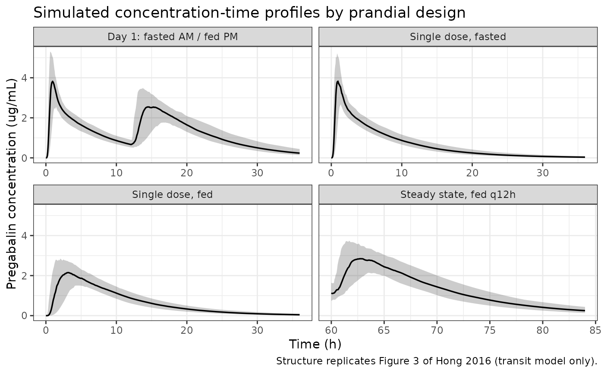
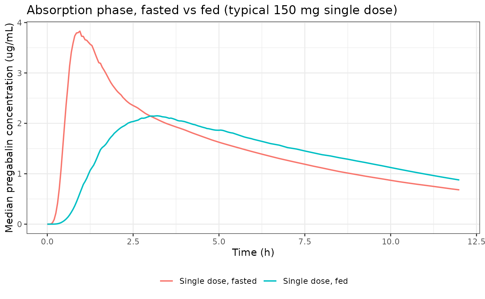

# Pregabalin (Hong 2016)

## Model and source

- Citation: Hong T, Han S, Lee J, Jeon S, Yim DS. Comparison of oral
  absorption models for pregabalin: usefulness of transit compartment
  model. Drug Des Devel Ther. 2016;10:3995-4003.
  <doi:10.2147/DDDT.S123318>.
- Description: Two-compartment population pharmacokinetic model for oral
  pregabalin in healthy Korean male volunteers, with Savic-parameterised
  transit-compartment absorption (continuous, non-integer chain length
  NN = 3.61) feeding a depot that empties at first-order ka. Mean
  transit time and ka are estimated separately for the overnight-fasted
  and the fed state; apparent clearance scales with creatinine clearance
  as a power function.
- Article: <https://doi.org/10.2147/DDDT.S123318>

This paper is a *model-comparison* study: its purpose was to show that
the absorption phase of pregabalin is described better by a
transit-compartment model than by the first-order and zero-order forms
that popPK analyses reach for by default. Six candidate structures were
fitted (Table 4) and the winner – a two-compartment disposition model
with Savic transit-compartment absorption – is the model packaged here.
The five rejected candidates are not packaged: the paper reports only
their objective function values, apparent clearance and total apparent
volume, which is not enough to reconstruct them.

## Population

The model was built from 1,615 plasma pregabalin concentrations
contributed by 88 healthy Korean male volunteers across five studies run
at the clinical trial center of Seoul St Mary’s Hospital (Table 1).
Subjects were 20-45 years old by protocol, within 20% of ideal body
weight, and free of clinically significant organ-system disease. Pooled
demographics were 27.2 +/- 5.0 years, 68.3 +/- 7.8 kg, and creatinine
clearance 120.0 +/- 21.6 mL/min by Cockcroft-Gault; demographics did not
differ significantly between the five studies (Kruskal-Wallis, all *p*
\> 0.05).

Every subject received 150 mg pregabalin, either as a single dose or
every 12 h for up to three days (Table 2). The prandial conditions are
what the paper is about: doses were given after an overnight fast, 30
min after a regular or high-fat meal, or 4 h after a regular meal.
Plasma was assayed by LC/MS/MS at four different contract research
organizations with lower limits of quantification of 30-100 ng/mL (Table
3).

Two consequences for reuse follow from the cohort. It is entirely male,
so sex was not testable as a covariate. And renal function is uniformly
normal-to-supranormal (per-study means 110.8-132.8 mL/min), so the
fitted creatinine-clearance term carries no information about renal
impairment – see “Assumptions and deviations” below.

The same information is available programmatically via the model’s
`population` metadata
(`readModelDb("Hong_2016_pregabalin")()$population`).

## Source trace

The per-parameter origin is recorded as an in-file comment next to each
`ini()` entry in `inst/modeldb/specificDrugs/Hong_2016_pregabalin.R`.
The table below collects them in one place for review.

| Equation / parameter | Value | Source location |
|----|----|----|
| `lcl` (CLt/F) | 6.25 L/h | Table 5, row `CLt/F` (RSE 0.80%) |
| `e_crcl_cl` | 0.511 | Table 5, row `theta CLCR` (RSE 8.96%) |
| `lvc` (V2/F) | 18.0 L | Table 5, row `V2/F` (RSE 1.78%) |
| `lq` (Q/F) | 26.5 L/h | Table 5, row `Q/F` (RSE 3.63%) |
| `lvp` (V3/F) | 27.0 L | Table 5, row `V3/F` (RSE 1.93%) |
| `lmtt_fasted` | 0.494 h | Table 5, row `MTT fast` (RSE 9.94%) |
| `lmtt_fed` | 0.879 h | Table 5, row `MTT fed` (RSE 6.88%) |
| `lnn` (NN) | 3.61 | Table 5, row `nn` (RSE 5.32%); also Table 4 final-model row |
| `lka_fasted` | 5.69 1/h | Table 5, row `Ka fast` (RSE 33.57%) |
| `lka_fed` | 0.713 1/h | Table 5, row `Ka fed` (RSE 1.47%) |
| `lfdepot` | 1 (fixed) | Not estimated; Table 5 reports only apparent (/F) parameters |
| `etalcl` | 11.2% CV | Table 5, row `omega CLt/F` |
| `etalvc` | 27.8% CV | Table 5, row `omega V2/F` |
| `etalcl:etalvc` correlation | 0.615 | Table 5, row `rho CLt/F - V2/F` |
| `etalmtt_fasted` | 43.7% CV | Table 5, row `omega MTTfast` |
| `etalmtt_fed` | 81.9% CV | Table 5, row `omega MTTfed` |
| `etalka` | 49.4% CV | Table 5, row `omega Ka`, “BSV of Ka (fasting and fed)” – one eta shared by both states |
| `propSd` | 19.0% | Table 5, row `sigma prop (%)` (RSE 4.76%) |
| CL/F covariate equation | n/a | Table 5 parameter column: `CL/F = CLt/F x (CLCR/120)^theta_CLCR` |
| BSV equation (exponential) | n/a | Methods, “Basic PK model”: `P_ij = theta_j x exp(eta_ij)` |
| Transit absorption input | n/a | Reference 12 = Savic RM et al., *J Pharmacokinet Pharmacodyn* 2007;34(5):711-726 |
| Two-compartment disposition | n/a | Results, “Population PK model”; Table 4 final-model row |

Random effects are reported as percent CV in Table 5 and the Methods
state that between-subject variability entered exponentially, so each
variance is recovered as `omega^2 = log(1 + CV^2)`. Between-subject
variability on Q/F, V3/F and NN is listed as “not estimated” and is
therefore absent from the model rather than invented.

## Virtual cohort

Original observed data are not publicly available. The cohorts below are
virtual populations whose creatinine-clearance distribution approximates
the pooled Table 1 demographics (mean 120.0, SD 21.6 mL/min), truncated
to the physiologically plausible 70-190 mL/min window.

Four arms reproduce the prandial designs of Table 2. `FED` is a
**dose-record-level** covariate: in the crossover studies the same
subject was dosed fasted in the morning and fed in the evening, so `FED`
changes within a subject and observation rows carry the flag of the most
recent dose.

``` r

# set.seed() seeds R's RNG. It does NOT seed rxode2's simulation RNG, whose
# streams are partitioned per solver thread -- so this cohort is reproducible
# on this machine and different on a machine with a different thread count.
# Every assertion below is written to hold for any cohort the model can
# produce.
set.seed(20161207)

DOSE_MG <- 150 # Table 2: every study gave 150 mg

# FED for an observation time = the flag carried by the most recent dose.
fed_at <- function(t, dose_times, fed_flags) {
  idx <- findInterval(t, dose_times)
  idx[idx < 1L] <- 1L
  fed_flags[idx]
}

make_cohort <- function(n, label, dose_times, fed_flags, obs_times,
                        id_offset = 0L) {
  subj <- tibble(
    id = id_offset + seq_len(n),
    # Table 1 pooled creatinine clearance: 120.0 +/- 21.6 mL/min.
    CRCL = pmin(pmax(rnorm(n, mean = 120.0, sd = 21.6), 70), 190),
    cohort = label
  )
  doses <- subj |>
    tidyr::crossing(tibble(time = dose_times, FED = fed_flags)) |>
    mutate(amt = DOSE_MG, evid = 1L, cmt = "depot")
  obs <- subj |>
    tidyr::crossing(tibble(time = obs_times)) |>
    mutate(
      amt = NA_real_, evid = 0L, cmt = "central",
      FED = fed_at(time, dose_times, fed_flags)
    )
  bind_rows(doses, obs) |>
    arrange(id, time, desc(evid)) |>
    select(id, time, amt, evid, cmt, FED, CRCL, cohort)
}

# Dense through the absorption phase, coarser through the terminal phase.
obs_sd <- sort(unique(c(seq(0, 6, by = 0.05), seq(6, 36, by = 0.25))))
obs_day1 <- sort(unique(c(obs_sd, seq(12, 18, by = 0.05))))
obs_ss <- sort(unique(c(seq(60, 66, by = 0.05), seq(66, 84, by = 0.25))))

N_ARM <- 100L # well under the 200/arm cap; ample for the percentile ribbons

events <- bind_rows(
  make_cohort(N_ARM, "Single dose, fasted",
    dose_times = 0, fed_flags = 0, obs_times = obs_sd, id_offset = 0L
  ),
  make_cohort(N_ARM, "Single dose, fed",
    dose_times = 0, fed_flags = 1, obs_times = obs_sd, id_offset = 100L
  ),
  make_cohort(N_ARM, "Day 1: fasted AM / fed PM",
    dose_times = c(0, 12), fed_flags = c(0, 1),
    obs_times = obs_day1, id_offset = 200L
  ),
  make_cohort(N_ARM, "Steady state, fed q12h",
    dose_times = seq(0, 60, by = 12), fed_flags = rep(1, 6),
    obs_times = obs_ss, id_offset = 300L
  )
)

# Duplicate (id, time, evid) keys across cohorts silently merge subjects.
stopifnot(!anyDuplicated(unique(events[, c("id", "time", "evid")])))
```

## Simulation

`covsInterpolation = "locf"` is mandatory here, not cosmetic. rxode2
interpolates covariates linearly by default, which would turn the binary
`FED` switch into fractional values between the last fasted observation
and the fed dose, silently blending the two absorption parameter sets.

``` r

mod <- readModelDb("Hong_2016_pregabalin")

sim <- rxode2::rxSolve(
  mod,
  events = events,
  keep = c("cohort", "FED"),
  covsInterpolation = "locf"
) |>
  as.data.frame()

# The transit()/f(depot) idiom can silently return an all-zero solve on some
# models at rxode2 5.1.x. Fail loudly here rather than letting every downstream
# ratio divide zero by zero and "pass".
stopifnot(max(sim$Cc, na.rm = TRUE) > 0)
stopifnot(all(sim$Cc >= 0, na.rm = TRUE))
```

## Replicate published figures

The paper’s Figure 3 is a four-panel visual predictive check contrasting
the first-order and transit models across the study designs: day 1
fasted-and-fed (study 3), day 1 both-fed (study 5), steady state
fasted-and-fed (study 2), and steady state both-fed (studies 1 and 4).
Only the transit model is packaged, so the panels below show its median
and 5th/95th percentiles alone rather than the two-model overlay.

``` r

# Replicates the structure of Figure 3 of Hong 2016: median and 5th/95th
# percentile envelope of simulated concentrations, one panel per study design.
sim |>
  group_by(cohort, time) |>
  summarise(
    Q05 = quantile(Cc, 0.05),
    Q50 = quantile(Cc, 0.50),
    Q95 = quantile(Cc, 0.95),
    .groups = "drop"
  ) |>
  ggplot(aes(time, Q50)) +
  geom_ribbon(aes(ymin = Q05, ymax = Q95), alpha = 0.25) +
  geom_line(linewidth = 0.6) +
  facet_wrap(~cohort, scales = "free_x") +
  labs(
    x = "Time (h)", y = "Pregabalin concentration (ug/mL)",
    title = "Simulated concentration-time profiles by prandial design",
    caption = "Structure replicates Figure 3 of Hong 2016 (transit model only)."
  ) +
  theme_bw()
```



The absorption-phase contrast that motivated the paper is clearest with
the two single-dose arms overlaid. The fasted profile rises to an early,
sharp peak; the fed profile is flattened and delayed, and – the feature
a first-order model cannot produce – its rise is *concave* rather than
exponential-decay-shaped, because the gamma-density input rate increases
over time before it falls.

``` r

sim |>
  filter(cohort %in% c("Single dose, fasted", "Single dose, fed"),
    time <= 12
  ) |>
  group_by(cohort, time) |>
  summarise(Q50 = quantile(Cc, 0.50), .groups = "drop") |>
  ggplot(aes(time, Q50, colour = cohort)) +
  geom_line(linewidth = 0.7) +
  labs(
    x = "Time (h)", y = "Median pregabalin concentration (ug/mL)",
    colour = NULL,
    title = "Absorption phase, fasted vs fed (typical 150 mg single dose)"
  ) +
  theme_bw() +
  theme(legend.position = "bottom")
```



## PKNCA validation

NCA is run on the two clean single-dose arms, where the
fasted-versus-fed absorption contrast is unconfounded by accumulation.

``` r

sim_nca <- sim |>
  filter(cohort %in% c("Single dose, fasted", "Single dose, fed")) |>
  filter(!is.na(Cc)) |>
  select(id, time, Cc, cohort)

# Guarantee a time = 0 row per (id, cohort); for an extravascular dose the
# correct pre-dose value is 0. Without it PKNCA warns on every subject that the
# AUC interval starts before the first measurement.
sim_nca <- bind_rows(
  sim_nca,
  sim_nca |> distinct(id, cohort) |> mutate(time = 0, Cc = 0)
) |>
  distinct(id, cohort, time, .keep_all = TRUE) |>
  arrange(id, cohort, time)

conc_obj <- PKNCA::PKNCAconc(sim_nca, Cc ~ time | cohort + id)

dose_df <- events |>
  filter(evid == 1, cohort %in% c("Single dose, fasted", "Single dose, fed")) |>
  select(id, time, amt, cohort)

dose_obj <- PKNCA::PKNCAdose(dose_df, amt ~ time | cohort + id)

intervals <- data.frame(
  start = 0, end = Inf,
  cmax = TRUE, tmax = TRUE,
  auclast = TRUE, aucinf.obs = TRUE, half.life = TRUE
)

nca_res <- PKNCA::pk.nca(PKNCA::PKNCAdata(conc_obj, dose_obj,
  intervals = intervals
))

nca_wide <- as.data.frame(nca_res) |>
  select(cohort, id, PPTESTCD, PPORRES) |>
  tidyr::pivot_wider(names_from = PPTESTCD, values_from = PPORRES)

nca_wide |>
  group_by(cohort) |>
  summarise(
    `Cmax (ug/mL)` = median(cmax),
    `Tmax (h)` = median(tmax),
    `AUCinf (ug*h/mL)` = median(aucinf.obs),
    `t1/2 (h)` = median(half.life),
    .groups = "drop"
  ) |>
  rename("Arm" = cohort) |>
  knitr::kable(
    digits = 3,
    caption = "Median simulated NCA parameters after a single 150 mg dose."
  )
```

| Arm                 | Cmax (ug/mL) | Tmax (h) | AUCinf (ug\*h/mL) | t1/2 (h) |
|:--------------------|-------------:|---------:|------------------:|---------:|
| Single dose, fasted |        4.048 |    1.000 |            24.188 |    5.442 |
| Single dose, fed    |        2.226 |    3.125 |            23.805 |    5.479 |

Median simulated NCA parameters after a single 150 mg dose. {.table}

Hong 2016 reports **no** NCA table – the paper’s own exposure
comparisons were made with linear-trapezoidal AUCs that it explicitly
declines to tabulate (“not shown in this report”). There is therefore
nothing to place in an
[`ncaComparisonTable()`](https://nlmixr2.github.io/nlmixr2lib/reference/ncaComparisonTable.md),
and the NCA above characterises the packaged model rather than
validating it against published NCA. Validation instead uses the
quantitative claims the paper *does* state, below.

### Structural gate: mass balance

For a linear model, `CL/F x AUCinf` must equal `Dose x F` exactly, per
subject. This is the one check that the known `transit()` +
`f(depot) <- 0` failure mode (a silent all-zero solve) cannot pass, and
it also catches a dose arriving twice. Both sides use the same drawn
parameters, so the residual is pure numerical error and a tight bound is
appropriate.

``` r

cl_by_id <- sim |>
  group_by(id) |>
  summarise(cl = first(cl), .groups = "drop")

mb <- nca_wide |>
  left_join(cl_by_id, by = "id") |>
  mutate(ratio = cl * aucinf.obs / DOSE_MG)

stopifnot(nrow(mb) == 2L * N_ARM) # a zero-row join would pass vacuously
cat(sprintf(
  "mass-balance CL/F * AUCinf / Dose: min %.6f, max %.6f\n",
  min(mb$ratio), max(mb$ratio)
))
#> mass-balance CL/F * AUCinf / Dose: min 0.999859, max 1.001269
stopifnot(all(abs(mb$ratio - 1) < 0.01))
```

### Published quantitative claims

Each row below is a number Hong 2016 states in prose or in a table,
checked against the packaged model. Tolerances are absolute and set to
half of the last printed digit, because the published values are rounded
and no single percentage tolerance works across values printed to
different precision.

``` r

ui <- rxode2::rxode(mod)
th <- setNames(ui$theta, names(ui$theta))

cl_t <- exp(th[["lcl"]])
mtt_fasted <- exp(th[["lmtt_fasted"]])
mtt_fed <- exp(th[["lmtt_fed"]])
ka_fasted <- exp(th[["lka_fasted"]])
ka_fed <- exp(th[["lka_fed"]])
nn <- exp(th[["lnn"]])

# Claim 1 is the strongest available: it is non-circular (the value appears in
# the Discussion, not in Table 5) and it constrains the intercept, the exponent
# and the 120 mL/min centring value simultaneously.
cl_at_107 <- cl_t * (107 / 120)^th[["e_crcl_cl"]]
ka_drop_pct <- 100 * (1 - ka_fed / ka_fasted)
mtt_gain <- mtt_fed - mtt_fasted
v_total <- exp(th[["lvc"]]) + exp(th[["lvp"]])

claims <- tibble::tribble(
  ~Claim, ~Source, ~Published, ~Model, ~Tol, ~Deviation,
  "CL/F of a typical subject at CLCR = 107 mL/min (L/h)",
  "Discussion", 5.89, cl_at_107, 0.005, FALSE,
  "Reduction in absorption rate constant when fed (%)",
  "Discussion", 87.5, ka_drop_pct, 0.05, FALSE,
  "Prolongation of mean transit time when fed (h)",
  "Discussion", 0.39, mtt_gain, 0.01, FALSE,
  "Apparent clearance CL/F of the final model (L/h)",
  "Table 4", 6.25, cl_t, 0.005, FALSE,
  "Number of transit compartments of the final model",
  "Table 4", 3.61, nn, 0.005, FALSE,
  "Total apparent volume V/F = V2/F + V3/F (L)",
  "Table 4", 44.9, v_total, 0.05, TRUE
) |>
  mutate(
    Diff = Model - Published,
    Pass = abs(Diff) <= Tol
  )

claims |>
  select(Claim, Source, Published, Model, Diff, Pass, Deviation) |>
  rename(
    "Published value" = Published, "Model value" = Model,
    "Difference" = Diff, "Known deviation" = Deviation
  ) |>
  knitr::kable(
    digits = 4,
    caption = paste(
      "Published claims from Hong 2016 checked against the packaged model.",
      "Tolerances are half of the last printed digit."
    )
  )
```

| Claim | Source | Published value | Model value | Difference | Pass | Known deviation |
|:---|:---|---:|---:|---:|:---|:---|
| CL/F of a typical subject at CLCR = 107 mL/min (L/h) | Discussion | 5.89 | 5.8943 | 0.0043 | TRUE | FALSE |
| Reduction in absorption rate constant when fed (%) | Discussion | 87.50 | 87.4692 | -0.0308 | TRUE | FALSE |
| Prolongation of mean transit time when fed (h) | Discussion | 0.39 | 0.3850 | -0.0050 | TRUE | FALSE |
| Apparent clearance CL/F of the final model (L/h) | Table 4 | 6.25 | 6.2500 | 0.0000 | TRUE | FALSE |
| Number of transit compartments of the final model | Table 4 | 3.61 | 3.6100 | 0.0000 | TRUE | FALSE |
| Total apparent volume V/F = V2/F + V3/F (L) | Table 4 | 44.90 | 45.0000 | 0.1000 | FALSE | TRUE |

Published claims from Hong 2016 checked against the packaged model.
Tolerances are half of the last printed digit. {.table}

``` r


# Gate on every non-deviation row. The one flagged row is discussed below and
# is deliberately excluded rather than having its tolerance widened until it
# passes.
stopifnot(all(claims$Pass[!claims$Deviation]))
```

The total-volume row is a genuine, minor inconsistency **within the
paper**, not a transcription error. Table 4 gives the final model’s V/F
as 44.9 L with the footnote “sum of central volume and peripheral
volume”, while Table 5 reports V2/F = 18.0 L and V3/F = 27.0 L, which
sum to 45.0 L. The 0.1 L gap is consistent with Table 4 having been
computed from unrounded estimates (e.g. 17.96 + 26.95 = 44.91) that
Table 5 then rounded to three significant figures. The model uses the
Table 5 values, which are the ones reported as the final estimates with
precision and bootstrap intervals.

### Dose superimposition

The paper implemented Shen 2012 dose superimposition (its reference 14)
so that a dose whose absorption is incomplete still contributes input
after the next dose is given. rxode2’s `transit()` builtin instead
restarts the gamma input at each dose. This is a real structural
difference, so it has to be shown to be immaterial rather than assumed
to be.

It is immaterial here because absorption is fast relative to the 12 h
dosing interval. The Savic input is a gamma density with shape `NN + 1`
and rate `ktr = (NN + 1) / MTT`, so the fraction of a dose delivered by
the time the next one arrives is a gamma CDF.

``` r

frac_absorbed_at_tau <- function(mtt, tau = 12) {
  ktr <- (nn + 1) / mtt
  pgamma(tau, shape = nn + 1, rate = ktr)
}

fed_frac <- frac_absorbed_at_tau(mtt_fed) # the slower of the two states
cat(sprintf(
  "Fraction of a dose delivered by tau = 12 h: fasted %.10f, fed %.10f\n",
  frac_absorbed_at_tau(mtt_fasted), fed_frac
))
#> Fraction of a dose delivered by tau = 12 h: fasted 1.0000000000, fed 1.0000000000

# Deterministic (no cohort draw), so an exact bound is appropriate.
stopifnot(fed_frac > 1 - 1e-9)
```

Even in the fed state, which has the longer mean transit time of the
two, the input is complete to within one part in a billion before the
next dose arrives. Restarting rather than superimposing the gamma input
therefore has no numerical consequence at this paper’s 12 h interval. A
user who shortens the interval to a few hours, or who reuses these
absorption parameters for a drug or formulation with a much longer MTT,
would need to revisit this.

### Food effect on exposure and on rate

The paper’s reason for not modelling a bioavailability change with food
is that its trapezoidal AUC comparison found none. The packaged model
should therefore shift the *rate* of absorption substantially while
leaving the *extent* untouched.

The gate below is deliberately run on the **typical-value** profile
(`zeroRe()`, creatinine clearance held at the 120 mL/min reference)
rather than on the cohort medians. Comparing medians of two
independently drawn cohorts would put roughly a 2.6% standard error on
the AUC ratio, so any tolerance tight enough to be meaningful would
flicker between CI machines that solve on different thread counts. With
the random effects zeroed the contrast is deterministic and the same on
every machine, so it can be asserted tightly and still go red if a food
effect were ever wired into `F` or `cl`.

``` r

typ <- rxode2::zeroRe(mod)

# Fine through absorption, coarse through the terminal phase; 168 h is many
# half-lives, so the trapezoidal integral is effectively AUCinf.
typ_times <- sort(unique(c(seq(0, 12, by = 0.01), seq(12, 168, by = 0.1))))

typical_profile <- function(fed) {
  ev <- data.frame(
    id = 1L,
    time = c(0, typ_times),
    amt = c(DOSE_MG, rep(NA_real_, length(typ_times))),
    evid = c(1L, rep(0L, length(typ_times))),
    cmt = c("depot", rep("central", length(typ_times))),
    FED = fed,
    CRCL = 120
  )
  rxode2::rxSolve(typ, ev, covsInterpolation = "locf") |> as.data.frame()
}

trapz <- function(x, y) sum(diff(x) * (head(y, -1) + tail(y, -1)) / 2)

p_fasted <- typical_profile(0)
#> ℹ omega/sigma items treated as zero: 'etalcl', 'etalvc', 'etalmtt_fasted', 'etalmtt_fed', 'etalka'
p_fed <- typical_profile(1)
#> ℹ omega/sigma items treated as zero: 'etalcl', 'etalvc', 'etalmtt_fasted', 'etalmtt_fed', 'etalka'
stopifnot(nrow(p_fasted) > 100, nrow(p_fed) > 100)

auc_fasted <- trapz(p_fasted$time, p_fasted$Cc)
auc_fed <- trapz(p_fed$time, p_fed$Cc)
auc_ratio <- auc_fed / auc_fasted
cmax_ratio <- max(p_fed$Cc) / max(p_fasted$Cc)
tmax_ratio <- p_fed$time[which.max(p_fed$Cc)] /
  p_fasted$time[which.max(p_fasted$Cc)]

cat(sprintf(
  "typical-value fed/fasted ratios -- AUC0-168 %.6f, Cmax %.4f, Tmax %.4f\n",
  auc_ratio, cmax_ratio, tmax_ratio
))
#> typical-value fed/fasted ratios -- AUC0-168 1.000002, Cmax 0.5404, Tmax 2.9263

# Extent must be untouched: neither F nor cl depends on FED, so the only
# difference between the two integrals is solver/trapezoid error. Deterministic,
# hence a tight bound. This goes red if a food effect is ever added to F or cl.
stopifnot(abs(auc_ratio - 1) < 0.002)

# Rate effects are large -- ka falls 8-fold and MTT nearly doubles. Also
# deterministic here, but bounds are kept as magnitude claims rather than
# pinned to the realised values so they stay readable as statements of the
# paper's finding. Realised: Cmax ratio ~0.55, Tmax ratio ~3.1.
stopifnot(cmax_ratio < 0.85)
stopifnot(tmax_ratio > 1.8)

# The cohort medians are reported for context but deliberately NOT gated.
nca_wide |>
  group_by(cohort) |>
  summarise(
    `Median Cmax (ug/mL)` = median(cmax),
    `Median Tmax (h)` = median(tmax),
    `Median AUCinf (ug*h/mL)` = median(aucinf.obs),
    .groups = "drop"
  ) |>
  rename("Arm" = cohort) |>
  knitr::kable(
    digits = 3,
    caption = "Cohort medians (descriptive; the gate above uses typical values)."
  )
```

| Arm | Median Cmax (ug/mL) | Median Tmax (h) | Median AUCinf (ug\*h/mL) |
|:---|---:|---:|---:|
| Single dose, fasted | 4.048 | 1.000 | 24.188 |
| Single dose, fed | 2.226 | 3.125 | 23.805 |

Cohort medians (descriptive; the gate above uses typical values).
{.table}

Exposure is unchanged while the peak is materially lower and materially
later, which is the behaviour the paper describes and the clinical
reason it cared: pregabalin’s common adverse events track peak
concentration, so an absorption model that misplaces Cmax misstates the
safety profile even when it gets AUC right.

## Assumptions and deviations

- **Only the winning model is packaged.** Table 4 lists six candidate
  structures. For the five rejected ones the paper reports only the
  number of parameters, the objective function value, CL/F and total
  V/F, which is not enough to reconstruct them. The paper’s central
  claim – that the transit model beats the first-order model by dAIC
  497.3 and the Erlang model by dAIC 8.5 – is a model-selection result
  that cannot be reproduced without refitting to the original data,
  which are not public. It is recorded here as a claim of the source,
  not as a gate.

- **Dose superimposition is approximated.** The source used the Shen
  2012 NONMEM implementation of dose superimposition; rxode2’s
  `transit()` restarts the gamma input at each dose. The “Dose
  superimposition” section above quantifies the difference as under one
  part in a billion at this paper’s 12 h interval and states when a user
  would need to revisit it.

- **`f(depot) <- 0` is a known rxode2 hazard.** The idiom that
  suppresses the dose bolus so `transit()` is the sole input pathway
  silently returns an all-zero solve for some models at rxode2 5.1.x.
  This model was verified not to be affected, and the mass-balance gate
  above is the standing regression check; ratio-based checks are useless
  for this failure because they divide one zero by another and pass.

- **Random effects are back-transformed from percent CV.** Table 5
  reports between-subject variability as CV% and the Methods state that
  variability entered exponentially, so `omega^2 = log(1 + CV^2)`. The
  alternative reading, that the printed CV% is the omega standard
  deviation directly, would inflate the MTT-fed variance from 0.513 to
  0.671; the log-normal back-transform is the convention used throughout
  nlmixr2lib.

- **Variability the paper did not estimate is absent, not invented.**
  Table 5 marks between-subject variability on Q/F, V3/F and NN as “not
  estimated”, so the model carries no eta on those parameters.

- **The creatinine-clearance term must not be extrapolated to renal
  impairment.** The cohort is 88 healthy young men with per-study mean
  CLCR of 110.8-132.8 mL/min. The paper devotes a Discussion section and
  Figure 4 to the point that, unlike Bockbrader 2011 and Shoji 2011, it
  finds no breakpoint at 107 mL/min above which CL/F plateaus – and
  attributes the difference to its small, homogeneous sample rather than
  to a real absence of the plateau. For renally impaired subjects,
  `Shoji_2011_pregabalin` is the appropriate model in this package.

- **Prandial detail is collapsed to one binary flag.** Studies differed
  in meal type (regular or high-fat) and in dose timing relative to the
  meal (30 min or 4 h). The authors state that these distinctions “were
  not successfully modeled” and were “not significantly different or
  discernible”, so the model has a single fed-versus-fasted indicator
  and `FED_HIGHFAT` is deliberately unused despite study 4 giving a
  high-fat breakfast.

- **Bioavailability is fixed to 1.** Oral-only data cannot identify F;
  the paper folds it into the apparent parameters CL/F, V2/F, Q/F and
  V3/F and does not allow it to change with food.

- **Virtual covariate distribution.** Creatinine clearance is drawn as
  Normal(120.0, 21.6) mL/min per Table 1’s pooled statistics and
  truncated to 70-190 mL/min. The paper publishes per-study means and
  standard deviations but not the individual values or the
  distributional shape.

- **Concentration units.** The model returns ug/mL (equivalently mg/L)
  from a dose in mg and volumes in L. The paper tabulates assay lower
  limits of quantification in ng/mL (Table 3), which are 1000x the
  model’s units.
