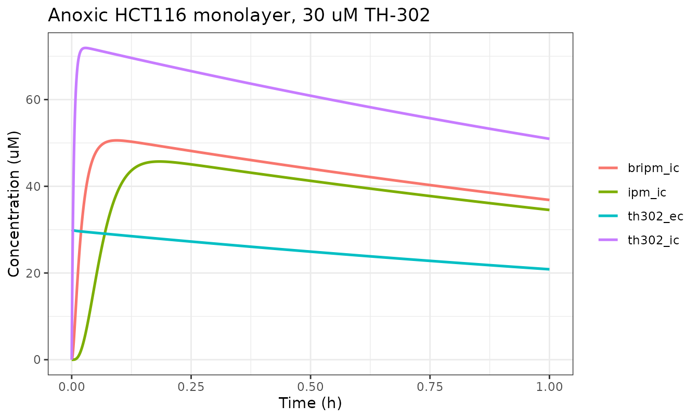
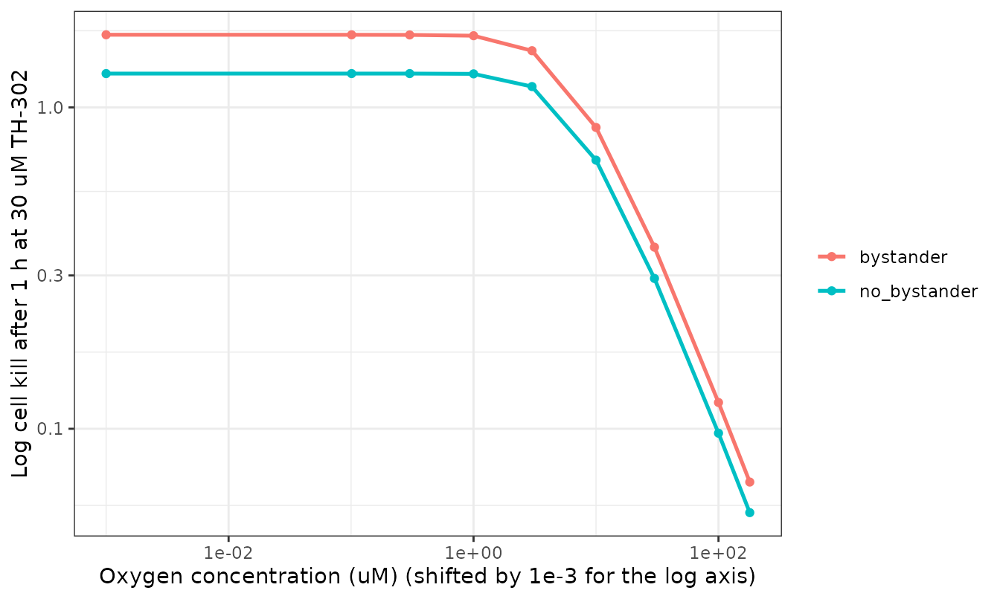

# Evofosfamide (TH-302) intratumor PK/PD (Hong 2019)

## Model and source

- Citation: Hong CR, Wilson WR, Hicks KO (2019). An intratumor
  pharmacokinetic/pharmacodynamic model for the hypoxia-activated
  prodrug evofosfamide (TH-302): monotherapy activity is not dependent
  on a bystander effect. Neoplasia 21(2):159-171.
  <doi:10.1016/j.neo.2018.11.009>. PMCID: PMC6314220. Model equations
  from main-text equations (1)-(5); parameter values from Supplementary
  Table S1 and the Supplementary Methods section ‘Kinetics of Br-IPM,
  intermediate and IPM formation’.
- Article: <https://doi.org/10.1016/j.neo.2018.11.009>
- Supplement (Methods and Figures, `mmc1`; Tables, `mmc2`):
  <https://www.ebi.ac.uk/europepmc/webservices/rest/PMC6314220/supplementaryFiles>

Evofosfamide (TH-302) is a hypoxia-activated prodrug: a 2-nitroimidazole
trigger attached to the DNA-crosslinking mustard bromo-isophosphoramide
mustard (Br-IPM). One-electron reduction of the trigger by cellular
reductases is reversed by molecular oxygen, so the prodrug fragments to
release Br-IPM only where oxygen is scarce. Br-IPM then loses bromide
through a series of chloro-substitution intermediates to give
isophosphoramide mustard (IPM).

The question Hong 2019 asks is whether a **bystander effect** –
diffusion of the released cytotoxins out of the hypoxic cell that made
them and into neighbouring oxic cells – is needed to explain TH-302’s
single-agent activity in xenografts. The answer is no, and the argument
is made by building a cellular PK/PD model, measuring its transport
parameters experimentally, and then solving it over real tumour
microvascular geometry.

## What this model file contains, and what it does not

The source contains three nested modelling layers. Only the innermost is
expressible in `rxode2`, and that is what
`Hong_2019_evofosfamide_cellular` packages.

| Layer | Source | Portable to rxode2? |
|----|----|----|
| Cellular reaction kinetics: 4 species x 2 subcellular compartments, oxygen-inhibited activation, two cell-kill readouts | Equations (1)-(5), Table S1 | **Yes – this file**, in the well-mixed (no-gradient) limit |
| 1-D reaction-diffusion across a multicellular layer (donor / support membrane / MCL / receiver) | Supplementary Methods, “MCL model” | No – a partial differential equation in one spatial dimension |
| 3-D steady-state Green’s-function solve over digitized R3230Ac and FaDu microvascular networks | Supplementary Methods, “SR-PK/PD modelling”; Visual C++ | No – requires the network geometry, which is published elsewhere and is not on disk |

Equations (1) and (2) carry a Laplacian diffusion term `D * del^2(Ce)`
on the extracellular species. Setting that term to zero – the well-mixed
limit – is what turns the paper’s partial differential equations into
the ordinary differential equations this file solves. The tissue
diffusion coefficients are therefore **not** parameters of the model
file: carrying them would advertise a spatial capability it does not
have. They are recorded here for completeness: `D` = 1.82e-7 cm^2/s
(TH-302) and 1.33e-7 cm^2/s (Br-IPM and IPM), Table S1.

The consequence for validation is specific and worth stating plainly:
any published result whose value depends on a **concentration gradient**
is out of scope, and this vignette does not claim to reproduce it. That
includes the whole-microregion log cell kill of Figure 4E/4F and Figure
5D, and the receiver-compartment curves of Figures 2B-2D and 3A-3B. What
*is* in scope is every relationship that holds pointwise: the
subcellular partition ratios, the oxygen dependence of activation, the
metabolite cascade, the exposure-to-kill mapping, and the well-mixed
monolayer experiment of Figure 2E.

## Population

This is not a patient model. Transport parameters were measured in
multicellular layers (MCLs) and monolayer cultures of the HCT116 human
colon carcinoma line, with the H460 non-small-cell lung line
cross-checked for equivalent anoxic metabolic rate (Figure S6) and
equivalent TH-302 sensitivity (IC50 0.2 uM for both). Mean and standard
error are from 3 MCLs per condition, with mean MCL thickness 139 +/- 2
um (Figure 2 legend). Monolayer experiments used 10^6 cells in 0.5 mL.
The PD parameter `AUC10` was fitted to clonogenic survival of anoxic
HCT116 cells exposed to 0.01-0.5 uM TH-302 for 1 h (Figure S3 legend).
The tumour-tissue parameterization applies to HCT116 and H460 xenografts
in nude mice dosed intravenously at 50 mg/kg, which gives a plasma AUC
of 25 uM\*h.

``` r

str(readModelDb("Hong_2019_evofosfamide_cellular")()$population)
#> List of 6
#>  $ species      : chr "in vitro (HCT116 human colon carcinoma cell line; H460 NSCLC cells cross-checked) + mouse (nude-mouse HCT116 an"| __truncated__
#>  $ n_subjects   : int 3
#>  $ n_studies    : int 1
#>  $ disease_state: chr "HCT116 colon carcinoma and H460 non-small-cell lung carcinoma; hypoxic tumor microenvironment"
#>  $ dose_range   : chr "30 uM TH-302 or 100 uM Br-IPM applied to the donor compartment in vitro; 50 mg/kg i.v. TH-302 in nude mice, giv"| __truncated__
#>  $ notes        : chr "Not a patient population. Transport parameters were measured in multicellular layers (MCLs) grown from HCT116 c"| __truncated__
```

## Source trace

Every `ini()` entry carries an in-file comment naming its source
location. They are collected here for review. All rate constants are
printed by the source in **inverse seconds**; the model file keeps those
printed values and converts to inverse hours with an explicit `* 3600`
in `model()`, so each number in `ini()` is a literal transcription.

| Parameter | Value | Units | Source location |
|----|----|----|----|
| `phicell` | 0.45 | unitless | Table S1, `phi_i`, cited to Foehrenbacher 2013 |
| `kmet0` | 0.0115 | 1/s | Table S1, `k_met,0`; fitted to anoxic HCT116 MCL flux |
| `ko2` | 0.27 | uM | Suppl. Methods, “Estimation of KO2 for TH-302”; Table S1 prints the same value as 0.2 mmHg |
| `kmemin_th302` / `kmemout_th302` | 0.15 / 0.05 | 1/s | Table S1, `k_in` / `k_out`, TH-302 |
| `kmemin_bripm` / `kmemout_bripm` | 0.001 / 0.001 | 1/s | Table S1, `k_in` / `k_out`, Br-IPM |
| `kmemin_ipm` / `kmemout_ipm` | 0.0005 / 0.0005 | 1/s | Table S1, `k_in` / `k_out`, IPM |
| `kmemin_intm` / `kmemout_intm` | 0.0005 / 0.0005 | 1/s | Suppl. Methods: INT assumed to share `D`, `k_in`, `k_out` with IPM |
| `rec_th302` | 6.67e-7 | 1/s | Table S1, `re`, TH-302; Figure S1 legend (fitted in anoxic medium, no cells) |
| `rec_bripm` | 0.0033 | 1/s | Table S1, `re`, Br-IPM (see Errata) |
| `rec_intm` | 0.00017 | 1/s | Suppl. Methods, “Kinetics of Br-IPM, intermediate and IPM formation” |
| `rec_ipm` | 6.67e-6 | 1/s | Table S1, `re`, IPM |
| `ric_bripm` | 0.015 | 1/s | Table S1, `ri`, Br-IPM |
| `ric_intm` | 0.01 | 1/s | Suppl. Methods, “Kinetics of Br-IPM, intermediate and IPM formation” |
| `ric_ipm` | 0.015 | 1/s | Table S1, `ri`, IPM |
| `auc10_metab` | 0.771 | uM\*h | Table S1, `AUC10` Br-IPM / IPM (equation 4); Figure S3A |
| `auc10_th302` | 0.695 | uM\*h | Table S1, `AUC10` TH-302 (equation 5); Figure S3B |
| Extracellular mass balance | n/a | n/a | Equation (1) |
| Intracellular mass balance | n/a | n/a | Equation (2) |
| Oxygen inhibition of activation | n/a | n/a | Equation (3) |
| “Bystander” cell kill | n/a | n/a | Equation (4) |
| “No bystander” cell kill | n/a | n/a | Equation (5) |

### Dimensional analysis

Mechanistic models mix phase-volume fractions, concentrations and
fractional rate constants, so every ODE term is checked term by term.
States are concentrations (uM) and the model time unit is hours.

| Term | Units | Note |
|----|----|----|
| `d/dt(<species>_ec)`, `d/dt(<species>_ic)` | uM/h | state / time |
| `phiRatio * (kmemIn * C_ec - kmemOut * C_ic)` | 1 \* (1/h \* uM) = uM/h | `phiRatio` is unitless |
| `kmet * th302_ic` | 1/h \* uM = uM/h | `kmet` carries the `* 3600` conversion |
| `rec_* * C_ec`, `ric_* * C_ic` | 1/h \* uM = uM/h | after `* sPerH` |
| `ko2 / (ko2 + STIM_OXYGEN_UM)` | uM/uM = unitless | equation (3) |
| `d/dt(auc_*_ic)` | uM | integrating uM over h gives uM\*h |
| `auc_metab_ic / auc10_metab` | uM*h / uM*h = unitless | log cell kill, equation (4) |

The asymmetric `phiRatio` factor deserves a note because it is the one
place a transcription slip would be invisible. In the source, equation
(1) is multiplied through by `phi_e` and equation (2) by `phi_i`, and
**both** carry the membrane flux term scaled by `phi_i`. Dividing each
equation by its own prefactor therefore leaves the extracellular side
scaled by `phi_i / phi_e` and the intracellular side unscaled. That
asymmetry is exactly what conserves mass, and it is verified numerically
below.

``` r

mod <- readModelDb("Hong_2019_evofosfamide_cellular")
mod
#> function() {
#>   description <- paste(
#>     "QSP. In vitro / preclinical (HCT116 and H460 human carcinoma cells;",
#>     "nude-mouse xenograft tissue parameterization). Hong 2019 cellular",
#>     "pharmacokinetic/pharmacodynamic model for the hypoxia-activated prodrug",
#>     "evofosfamide (TH-302). Ten ODEs carrying four chemical species --",
#>     "the prodrug TH-302, its cytotoxic bromo-isophosphoramide mustard",
#>     "metabolite Br-IPM, a single notional intermediate INT standing for the",
#>     "three chloro-substitution intermediates, and the dichloro product IPM --",
#>     "each in an extracellular and an intracellular compartment coupled by",
#>     "first-order membrane influx and efflux. Intracellular bioreductive",
#>     "activation of TH-302 to Br-IPM is oxygen-inhibited through a hyperbolic",
#>     "term with KO2 = 0.27 uM, so activation is near-maximal under anoxia and",
#>     "essentially switched off in well-oxygenated cells. Two alternative",
#>     "cell-kill readouts are computed side by side from intracellular AUC:",
#>     "a 'bystander' model driven by Br-IPM + IPM exposure and a 'no bystander'",
#>     "model driven by TH-302 exposure and its oxygen-dependent rate of",
#>     "reduction; the paper's conclusion is that the two are nearly equivalent,",
#>     "so a bystander effect is not needed to explain TH-302 monotherapy",
#>     "activity. Deterministic: no IIV and no residual error are reported.",
#>     "SCOPE -- this is the WELL-MIXED (no-gradient) limit of the paper's",
#>     "equations (1) and (2). The published headline model is spatially",
#>     "resolved: the same equations are solved with a Laplacian diffusion term",
#>     "by Green's function methods over digitized R3230Ac and FaDu",
#>     "microvascular networks, which rxode2 cannot express and whose network",
#>     "geometry is not on disk. Diffusion coefficients are therefore NOT",
#>     "parameters of this file. See the vignette for what this scope does and",
#>     "does not reproduce.",
#>     sep = " "
#>   )
#>   reference <- paste(
#>     "Hong CR, Wilson WR, Hicks KO (2019). An intratumor",
#>     "pharmacokinetic/pharmacodynamic model for the hypoxia-activated prodrug",
#>     "evofosfamide (TH-302): monotherapy activity is not dependent on a",
#>     "bystander effect. Neoplasia 21(2):159-171.",
#>     "doi:10.1016/j.neo.2018.11.009. PMCID: PMC6314220.",
#>     "Model equations from main-text equations (1)-(5); parameter values from",
#>     "Supplementary Table S1 and the Supplementary Methods section 'Kinetics",
#>     "of Br-IPM, intermediate and IPM formation'.",
#>     sep = " "
#>   )
#>   vignette <- "Hong_2019_evofosfamide"
#> 
#>   # Every state is a chemical species of the TH-302 activation cascade held in
#>   # one of two subcellular spaces. None maps onto a canonical PK compartment
#>   # role: `central` / `peripheral1` describe a body-level disposition model,
#>   # whereas these are the extracellular medium and the cytosol of one cell
#>   # population. The canonical `int_tumor` / `is_tumor` PBPK sub-compartment
#>   # pair carries only ONE species per organ and so cannot hold four.
#>   # Suffixes: `_ec` extracellular, `_ic` intracellular.
#>   paper_specific_compartments <- c(
#>     "th302_ec",
#>     "th302_ic",
#>     "bripm_ec",
#>     "bripm_ic",
#>     "intm_ec",
#>     "intm_ic",
#>     "ipm_ec",
#>     "ipm_ic",
#>     "auc_th302_ic",
#>     "auc_metab_ic"
#>   )
#> 
#>   units <- list(
#>     time = "h",
#>     dosing = paste(
#>       "uM (the states are CONCENTRATIONS, not amounts; an rxode2 dose record",
#>       "into th302_ec sets the initial extracellular prodrug concentration, so",
#>       "amt = 30 means 30 uM TH-302 in the medium as in Figure 2E)",
#>       sep = " "
#>     ),
#>     concentration = "uM"
#>   )
#> 
#>   covariateData <- list(
#>     STIM_OXYGEN_UM = list(
#>       description = paste(
#>         "Oxygen concentration in the medium / tissue surrounding the cells.",
#>         "Sets the degree of inhibition of bioreductive TH-302 activation",
#>         "through equation (3) and, in the 'no bystander' cell-kill model,",
#>         "scales exposure to cell kill through equation (5).",
#>         sep = " "
#>       ),
#>       units = "uM",
#>       type = "continuous",
#>       reference_category = NULL,
#>       notes = paste(
#>         "Per-record covariate; constant within an experimental arm. Anchors",
#>         "used by the source: 0 uM = anoxia (95% N2 gas phase); 180 uM =",
#>         "humidified 20% O2 in the gas phase (Supplementary Methods,",
#>         "'Estimation of KO2 for TH-302'); < 1 uM is the source's definition of",
#>         "the tumor hypoxic fraction. The source reports KO2 in both units",
#>         "(0.2 mmHg = 0.27 uM); this model works in uM throughout.",
#>         sep = " "
#>       ),
#>       source_name = "[O2]"
#>     )
#>   )
#> 
#>   # Issue #482. Every species state holds a CONCENTRATION (uM) rather than an
#>   # amount, because equations (1) and (2) are written per unit volume of the
#>   # respective phase. `specimen` is "tumor" for the species states: the cells
#>   # are HCT116 / H460 carcinoma cells, whether grown as monolayers, as
#>   # multicellular layers, or as a xenograft microregion. The two AUC states are
#>   # bookkeeping integrators.
#>   compartmentData <- list(
#>     th302_ec = list(analyte = "evofosfamide (TH-302)", units = "uM", specimen = "tumor", verified = TRUE),
#>     th302_ic = list(analyte = "evofosfamide (TH-302)", units = "uM", specimen = "tumor", verified = TRUE),
#>     bripm_ec = list(
#>       analyte = "bromo-isophosphoramide mustard (Br-IPM)",
#>       units = "uM",
#>       specimen = "tumor",
#>       verified = TRUE
#>     ),
#>     bripm_ic = list(
#>       analyte = "bromo-isophosphoramide mustard (Br-IPM)",
#>       units = "uM",
#>       specimen = "tumor",
#>       verified = TRUE
#>     ),
#>     intm_ec = list(
#>       analyte = "notional chloro-substitution intermediate (INT) between Br-IPM and IPM",
#>       units = "uM",
#>       specimen = "tumor",
#>       verified = TRUE
#>     ),
#>     intm_ic = list(
#>       analyte = "notional chloro-substitution intermediate (INT) between Br-IPM and IPM",
#>       units = "uM",
#>       specimen = "tumor",
#>       verified = TRUE
#>     ),
#>     ipm_ec = list(
#>       analyte = "isophosphoramide mustard (IPM)",
#>       units = "uM",
#>       specimen = "tumor",
#>       verified = TRUE
#>     ),
#>     ipm_ic = list(
#>       analyte = "isophosphoramide mustard (IPM)",
#>       units = "uM",
#>       specimen = "tumor",
#>       verified = TRUE
#>     ),
#>     auc_th302_ic = list(
#>       analyte = "cumulative intracellular evofosfamide (TH-302) exposure",
#>       units = "uM*h",
#>       specimen = "not applicable",
#>       verified = TRUE
#>     ),
#>     auc_metab_ic = list(
#>       analyte = "cumulative intracellular Br-IPM + IPM exposure",
#>       units = "uM*h",
#>       specimen = "not applicable",
#>       verified = TRUE
#>     )
#>   )
#> 
#>   population <- list(
#>     species = "in vitro (HCT116 human colon carcinoma cell line; H460 NSCLC cells cross-checked) + mouse (nude-mouse HCT116 and H460 xenograft tissue parameterization)",
#>     n_subjects = 3L,
#>     n_studies = 1L,
#>     disease_state = "HCT116 colon carcinoma and H460 non-small-cell lung carcinoma; hypoxic tumor microenvironment",
#>     dose_range = "30 uM TH-302 or 100 uM Br-IPM applied to the donor compartment in vitro; 50 mg/kg i.v. TH-302 in nude mice, giving a plasma AUC of 25 uM*h used as the tumor inflow",
#>     notes = paste(
#>       "Not a patient population. Transport parameters were measured in",
#>       "multicellular layers (MCLs) grown from HCT116 cells and in HCT116",
#>       "monolayer cultures (10^6 cells / 0.5 mL); mean and SE are from 3 MCLs",
#>       "per condition, with mean MCL thickness 139 +/- 2 um (Figure 2 legend).",
#>       "The PD parameter AUC10 was estimated from clonogenic survival of",
#>       "anoxic HCT116 cells exposed to 0.01-0.5 uM TH-302 for 1 h",
#>       "(Figure S3 legend). The tumor intracellular volume fraction",
#>       "phicell = 0.45 (Table S1) applies to tumors and MCLs; the monolayer",
#>       "experiments of Figure 2E have a far smaller cell volume fraction --",
#>       "see the vignette.",
#>       sep = " "
#>     )
#>   )
#> 
#>   ini({
#>     # =====================================================================
#>     # Hong 2019 Supplementary Table S1 lists every parameter. The source
#>     # reports all rate constants in SECONDS^-1; this file keeps the printed
#>     # s^-1 values here so each number is a literal source trace, and converts
#>     # to h^-1 with an explicit * 3600 in model(). AUC10 is printed in uM*h
#>     # and the model time unit is h, so the PD equations need no conversion.
#>     #
#>     # Every parameter is fixed(): none is estimated by this file. The source
#>     # fitted most of them (to MCL flux, monolayer steady state, or clonogenic
#>     # survival) and fixed the rest from prior work; either way they enter here
#>     # as published point estimates of a deterministic mechanistic model.
#>     #
#>     # NOT included: the tissue diffusion coefficients D (TH-302 1.82e-7,
#>     # Br-IPM and IPM 1.33e-7 cm^2/s) and the support-membrane / medium
#>     # diffusion coefficients. They multiply the Laplacian term of equation (1),
#>     # which is identically zero in this well-mixed scope, so carrying them
#>     # would imply a spatial capability this file does not have.
#>     # =====================================================================
#> 
#>     # --- Volume fraction -------------------------------------------------
#>     phicell <- fixed(0.45); label("Intracellular volume fraction of the tissue or culture (unitless)") # Table S1 'phi_i' = 0.45, cited to Foehrenbacher 2013
#> 
#>     # --- Oxygen-dependent bioreductive activation of the prodrug ---------
#>     #     Equation (3): kmet = ko2 / (ko2 + [O2]) * kmet0
#>     kmet0 <- fixed(0.0115); label("Maximum rate constant for intracellular bioreductive metabolism of TH-302, attained under anoxia (1/s)") # Table S1 'k_met,0' = 0.0115 +/- 0.05 s^-1, from anoxic HCT116 MCL flux
#>     ko2 <- fixed(0.27); label("Oxygen concentration giving half-maximal inhibition of TH-302 bioreduction (uM)") # Suppl Methods 'Estimation of KO2': 0.27 uM (Table S1 prints the same value as 0.2 mmHg)
#> 
#>     # --- Membrane transfer rate constants (source symbols kin / kout) ----
#>     #     Named kmemin_/kmemout_ rather than kin/kout because the canonical
#>     #     nlmixr2lib kin/kout are indirect-response turnover constants
#>     #     (production into, and loss from, a turnover pool), which is a
#>     #     different quantity from a plasma-membrane permeability rate.
#>     kmemin_th302 <- fixed(0.15); label("TH-302 plasma-membrane influx rate constant (1/s)") # Table S1 'k_in' TH-302 = 0.15 s^-1
#>     kmemout_th302 <- fixed(0.05); label("TH-302 plasma-membrane efflux rate constant (1/s)") # Table S1 'k_out' TH-302 = 0.05 s^-1
#>     kmemin_bripm <- fixed(0.001); label("Br-IPM plasma-membrane influx rate constant (1/s)") # Table S1 'k_in' Br-IPM = 0.001 s^-1
#>     kmemout_bripm <- fixed(0.001); label("Br-IPM plasma-membrane efflux rate constant (1/s)") # Table S1 'k_out' Br-IPM = 0.001 s^-1
#>     kmemin_ipm <- fixed(0.0005); label("IPM plasma-membrane influx rate constant (1/s)") # Table S1 'k_in' IPM = 0.0005 s^-1
#>     kmemout_ipm <- fixed(0.0005); label("IPM plasma-membrane efflux rate constant (1/s)") # Table S1 'k_out' IPM = 0.0005 s^-1
#>     kmemin_intm <- fixed(0.0005); label("INT plasma-membrane influx rate constant, assumed equal to IPM (1/s)") # Suppl Methods: INT assumed to share D, k_in and k_out with IPM
#>     kmemout_intm <- fixed(0.0005); label("INT plasma-membrane efflux rate constant, assumed equal to IPM (1/s)") # Suppl Methods: INT assumed to share D, k_in and k_out with IPM
#> 
#>     # --- Extracellular (medium) chemical conversion, source symbol re -----
#>     #     Each rate constant is the LOSS of the named species; the product is
#>     #     the next species in the cascade (TH-302 -> Br-IPM -> INT -> IPM ->
#>     #     untracked downstream products).
#>     rec_th302 <- fixed(6.67e-7); label("Extracellular chemical reduction of TH-302 to Br-IPM, anoxia only (1/s)") # Table S1 're' TH-302 = 6.67e-7 s^-1; Fig S1 legend, fitted in anoxic medium without cells
#>     rec_bripm <- fixed(0.0033); label("Extracellular conversion of Br-IPM to INT (1/s)") # Table S1 're' Br-IPM = 0.0033 s^-1 (see the vignette Errata: Suppl Methods prose misprints this as 0.033)
#>     rec_intm <- fixed(0.00017); label("Extracellular conversion of INT to IPM (1/s)") # Suppl Methods 'Kinetics of Br-IPM...': r_e,INT = 0.00017 s^-1, from the Fig 2C,D and Fig 3A,B flux data
#>     rec_ipm <- fixed(6.67e-6); label("Extracellular loss of IPM to downstream products (1/s)") # Table S1 're' IPM = 6.67e-6 s^-1
#> 
#>     # --- Intracellular chemical conversion, source symbol ri --------------
#>     ric_bripm <- fixed(0.015); label("Intracellular conversion of Br-IPM to INT (1/s)") # Table S1 'ri' Br-IPM = 0.015 s^-1, fitted to monolayer intracellular concentrations
#>     ric_intm <- fixed(0.01); label("Intracellular conversion of INT to IPM (1/s)") # Suppl Methods 'Kinetics of Br-IPM...': r_i,INT = 0.01 s^-1
#>     ric_ipm <- fixed(0.015); label("Intracellular loss of IPM to downstream products (1/s)") # Table S1 'ri' IPM = 0.015 s^-1
#> 
#>     # --- Pharmacodynamics: intracellular AUC giving 10% clonogenic survival
#>     auc10_metab <- fixed(0.771); label("Intracellular Br-IPM + IPM AUC giving 10% clonogenic survival (uM*h)") # Table S1 'AUC10' Br-IPM and IPM (equation 4) = 0.771 uM.h, from Figure S3A
#>     auc10_th302 <- fixed(0.695); label("Intracellular TH-302 AUC giving 10% clonogenic survival (uM*h)") # Table S1 'AUC10' TH-302 (equation 5) = 0.695 uM.h, from Figure S3B
#>   })
#> 
#>   model({
#>     # ===================================================================
#>     # 0. Unit conversion and labels.
#>     #    All source rate constants are per SECOND; the model time unit is h.
#>     # ===================================================================
#>     sPerH <- 3600 # s/h, converts every published rate constant to the model time unit
#> 
#>     kmemInP <- kmemin_th302 * sPerH
#>     kmemOutP <- kmemout_th302 * sPerH
#>     kmemInB <- kmemin_bripm * sPerH
#>     kmemOutB <- kmemout_bripm * sPerH
#>     kmemInN <- kmemin_intm * sPerH
#>     kmemOutN <- kmemout_intm * sPerH
#>     kmemInI <- kmemin_ipm * sPerH
#>     kmemOutI <- kmemout_ipm * sPerH
#> 
#>     recP <- rec_th302 * sPerH
#>     recB <- rec_bripm * sPerH
#>     recN <- rec_intm * sPerH
#>     recI <- rec_ipm * sPerH
#> 
#>     ricB <- ric_bripm * sPerH
#>     ricN <- ric_intm * sPerH
#>     ricI <- ric_ipm * sPerH
#> 
#>     # ===================================================================
#>     # 1. Oxygen dependence of bioreductive activation. Equation (3).
#>     # ===================================================================
#>     kmet <- ko2 / (ko2 + STIM_OXYGEN_UM) * kmet0 * sPerH
#> 
#>     # Chemical (non-enzymatic) reduction of TH-302 in the medium is, per the
#>     # Supplementary Methods, "assumed to be zero except under anoxia". Anoxia
#>     # is the source's 95% N2 / 0% O2 gas phase, so the switch is exact at
#>     # [O2] = 0 and needs no invented threshold. The constant is tiny
#>     # (t1/2 ~ 12 days) and matters only over the multi-hour MCL experiments.
#>     anoxic <- (STIM_OXYGEN_UM <= 0)
#> 
#>     # ===================================================================
#>     # 2. Phase-volume ratio. Equations (1) and (2) are written per unit
#>     #    volume of each phase and the membrane flux term is multiplied by
#>     #    phi_i in BOTH, so dividing equation (1) through by phi_e leaves the
#>     #    extracellular side scaled by phi_i / phi_e while the intracellular
#>     #    side is unscaled. That asymmetry is what conserves mass.
#>     # ===================================================================
#>     phiRatio <- phicell / (1 - phicell)
#> 
#>     # ===================================================================
#>     # 3. The cascade. Equation (1) governs each extracellular species and
#>     #    equation (2) each intracellular species, with the Laplacian term
#>     #    D * del^2(Ce) dropped (well-mixed scope, see description).
#>     #
#>     #    TH-302 --kmet--> Br-IPM --ri--> INT --ri--> IPM --ri--> (sink)   [cells]
#>     #    TH-302 --re----> Br-IPM --re--> INT --re--> IPM --re--> (sink)   [medium]
#>     #    with the medium arm of the first step active only under anoxia.
#>     # ===================================================================
#>     d/dt(th302_ec) <- -phiRatio * (kmemInP * th302_ec - kmemOutP * th302_ic) -
#>       anoxic * recP * th302_ec
#>     d/dt(th302_ic) <- kmemInP * th302_ec - kmemOutP * th302_ic -
#>       kmet * th302_ic
#> 
#>     d/dt(bripm_ec) <- -phiRatio * (kmemInB * bripm_ec - kmemOutB * bripm_ic) -
#>       recB * bripm_ec + anoxic * recP * th302_ec
#>     d/dt(bripm_ic) <- kmemInB * bripm_ec - kmemOutB * bripm_ic -
#>       ricB * bripm_ic + kmet * th302_ic
#> 
#>     d/dt(intm_ec) <- -phiRatio * (kmemInN * intm_ec - kmemOutN * intm_ic) -
#>       recN * intm_ec + recB * bripm_ec
#>     d/dt(intm_ic) <- kmemInN * intm_ec - kmemOutN * intm_ic -
#>       ricN * intm_ic + ricB * bripm_ic
#> 
#>     d/dt(ipm_ec) <- -phiRatio * (kmemInI * ipm_ec - kmemOutI * ipm_ic) -
#>       recI * ipm_ec + recN * intm_ec
#>     d/dt(ipm_ic) <- kmemInI * ipm_ec - kmemOutI * ipm_ic -
#>       ricI * ipm_ic + ricN * intm_ic
#> 
#>     # ===================================================================
#>     # 4. Intracellular exposure integrators feeding the PD models.
#>     #    Equation (4) is driven by Br-IPM + IPM; INT is excluded because the
#>     #    source fitted AUC10 to "the intracellular concentrations of
#>     #    Br-IPM + IPM" (Suppl Methods, 'Monolayer metabolism model').
#>     # ===================================================================
#>     d/dt(auc_th302_ic) <- th302_ic
#>     d/dt(auc_metab_ic) <- bripm_ic + ipm_ic
#> 
#>     # ===================================================================
#>     # 5. Cell kill. Equations (4) and (5). Log cell kill is -log10(SF), so
#>     #    an intracellular AUC equal to AUC10 gives exactly 1 log of kill,
#>     #    i.e. 10% clonogenic survival -- which is the definition of AUC10.
#>     # ===================================================================
#>     lck_bystander <- auc_metab_ic / auc10_metab # equation (4), 'bystander' model
#>     lck_nobystander <- ko2 / (ko2 + STIM_OXYGEN_UM) * auc_th302_ic / auc10_th302 # equation (5), 'no bystander' model
#> 
#>     sf_bystander <- 10^(-lck_bystander) # surviving fraction, 'bystander' model
#>     sf_nobystander <- 10^(-lck_nobystander) # surviving fraction, 'no bystander' model
#> 
#>     # No residual-error model and no IIV. Hong 2019 fits deterministic
#>     # reaction-diffusion solutions by least squares (MatLab nlinfit) and
#>     # tabulates no residual-error magnitude or between-experiment variance for
#>     # any output; the only uncertainties reported are SEs across 3 MCLs.
#>   })
#> }
#> <environment: 0x5556291bee18>
```

``` r

# One helper used throughout: solve the cellular model at a given oxygen
# concentration and cell volume fraction. `amtP` / `amtB` set the initial
# EXTRACELLULAR concentration (uM) of prodrug / Br-IPM, because the states are
# concentrations rather than amounts.
simulate_cells <- function(o2, phi, amtP = 30, amtB = 0, tmax = 5, by = 0.002) {
  ev <- rxode2::et(amt = amtP, cmt = "th302_ec")
  if (amtB > 0) ev <- rxode2::et(ev, amt = amtB, cmt = "bripm_ec")
  ev <- rxode2::et(ev, seq(0, tmax, by = by))
  m <- rxode2::ini(mod, phicell = phi)
  rxode2::rxSolve(m, ev, params = c(STIM_OXYGEN_UM = o2), returnType = "data.frame")
}
```

## Validation

There is no dose-concentration-time profile to integrate and no NCA
table in the source, so the PKNCA validation used for population-PK
extractions does not apply. The checks below are the mechanistic-model
equivalents: closed-form identities, a mass balance, a definitional
check on the PD parameter, and one published-figure replication.

All of these are deterministic. The model carries no IIV and no residual
error, and nothing here draws a random number, so every assertion is a
tight bound on numerical error rather than a tolerance on a sampled
cohort.

### 1. Subcellular partition ratio (closed form)

With no metabolism (full oxygenation drives `kmet` to zero) the two
TH-302 compartments equilibrate at the ratio of the membrane rate
constants, and that ratio must be exactly `kmemin_th302 / kmemout_th302`
= 0.15 / 0.05 = 3. Under anoxia, intracellular consumption pulls the
quasi-steady ratio down to `kmemin / (kmemout + kmet0)` = 0.15 / 0.0615
= 2.439. Both are pure algebra on the `ini()` values, so a sign slip or
a misplaced `phiRatio` breaks them.

``` r

oxic <- simulate_cells(o2 = 1e6, phi = 0.45, tmax = 20, by = 0.01)
#> ℹ change initial estimate of `phicell` to `0.45`
ratio_oxic <- tail(oxic$th302_ic, 1) / tail(oxic$th302_ec, 1)

cf_oxic <- 0.15 / 0.05
cf_anox <- 0.15 / (0.05 + 0.0115)

data.frame(
  Condition = c("Fully oxygenated", "Anoxic (quasi-steady)"),
  Simulated = c(round(ratio_oxic, 4), NA),
  `Closed form` = c(cf_oxic, round(cf_anox, 4)),
  check.names = FALSE
)
#>               Condition Simulated Closed form
#> 1      Fully oxygenated         3       3.000
#> 2 Anoxic (quasi-steady)        NA       2.439

stopifnot(abs(ratio_oxic - cf_oxic) < 1e-6)
```

### 2. Oxygen dependence and the hypoxic cytotoxicity ratio

Equation (3) makes activation hyperbolic in oxygen. The source turns
that into a testable identity in Supplementary equations (6) and (7):
the hypoxic cytotoxicity ratio, defined as the ratio of `AUC10` at 20%
gas-phase oxygen to `AUC10` at 0%, must equal `1 + [O2] / KO2`. With the
source’s solution oxygen concentration of 180 uM under 20% O2, and `ko2`
= 0.27 uM, that predicts a HCR of 668 – against a measured HCR of 650
for HCT116 cells. This is the only independent check on `ko2`, since
`ko2` was *derived* from the HCR rather than fitted to a time course.

``` r

o2_20pct <- 180 # uM, Suppl. Methods (humidified 20% O2 at 37 C, citing Wenger 2015)
ko2 <- 0.27 # uM
hcr_predicted <- 1 + o2_20pct / ko2
hcr_measured <- 650 # HCT116, Suppl. Methods citing Hong 2018

c(predicted = round(hcr_predicted, 1),
  measured = hcr_measured,
  rel_diff = round(abs(hcr_predicted - hcr_measured) / hcr_measured, 4))
#> predicted  measured  rel_diff 
#>  667.7000  650.0000    0.0272

stopifnot(abs(hcr_predicted - hcr_measured) / hcr_measured < 0.05)
```

``` r

o2_grid <- 10^seq(-3, 2.5, length.out = 400)
ggplot(data.frame(o2 = o2_grid, frac = ko2 / (ko2 + o2_grid)), aes(o2, frac)) +
  geom_line(linewidth = 0.9) +
  geom_vline(xintercept = 1, linetype = "dashed", colour = "grey40") +
  geom_vline(xintercept = ko2, linetype = "dotted", colour = "grey40") +
  scale_x_log10() +
  labs(x = "Oxygen concentration (uM)",
       y = "kmet / kmet0 (fraction of anoxic rate)") +
  theme_bw()
```


Oxygen inhibition of TH-302 bioreductive activation, equation (3). The
dashed line marks the source’s 1 uM definition of the tumour hypoxic
fraction; the dotted line marks KO2.

### 3. The PD parameter is self-consistent

`AUC10` is defined as the intracellular exposure giving 10% clonogenic
survival. Equations (4) and (5) express log cell kill as `AUC / AUC10`,
so when the accumulated intracellular exposure reaches `AUC10` the model
must report exactly 1 log of kill and a surviving fraction of exactly
0.1. This catches a reciprocal, a base-10 / base-e confusion, or the two
`AUC10` values being swapped between the bystander and no-bystander
readouts.

``` r

anox <- simulate_cells(o2 = 0, phi = 0.45, tmax = 1, by = 0.0005)
#> ℹ change initial estimate of `phicell` to `0.45`
auc10_metab <- 0.771

i <- which.min(abs(anox$auc_metab_ic - auc10_metab))
chk <- anox[i, c("auc_metab_ic", "lck_bystander", "sf_bystander")]
round(chk, 5)
#>     auc_metab_ic lck_bystander sf_bystander
#> 164      0.77286       1.00242      0.09945

# Interpolate to the exact crossing so the check is on the model's algebra,
# not on how finely the output grid happens to straddle AUC10. Log cell kill is
# LINEAR in accumulated AUC, so interpolating it is exact; the surviving
# fraction is not, so it is recovered from the interpolated log kill rather
# than interpolated directly.
lck_at <- approx(anox$auc_metab_ic, anox$lck_bystander, xout = auc10_metab)$y
sf_at <- 10^(-lck_at)

stopifnot(
  abs(lck_at - 1) < 1e-8,
  abs(sf_at - 0.1) < 1e-8,
  # ...and the model's own surviving-fraction output is that same transform of
  # its own log cell kill at every time point, for both readouts.
  max(abs(anox$sf_bystander - 10^(-anox$lck_bystander))) < 1e-12,
  max(abs(anox$sf_nobystander - 10^(-anox$lck_nobystander))) < 1e-12
)
```

### 4. Mass balance of the activation cascade

This is the check that catches the `phiRatio` asymmetry being applied to
the wrong side of the membrane – a slip that is otherwise invisible,
because both readings produce smooth, plausible-looking curves.

Above anoxia it can be made **exact**, with no numerical quadrature at
all. Whenever oxygen is present the prodrug leaves the system by exactly
one route, intracellular bioreduction at rate `kmet * th302_ic`, and the
model already integrates `th302_ic` for us as `auc_th302_ic`. So the
phase-weighted prodrug total plus its cumulative metabolic loss must
equal the dose for all time:

`(1 - phi) * th302_ec + phi * th302_ic + phi * kmet * auc_th302_ic = (1 - phi) * 30`

Strict anoxia is excluded from this form, because it switches on the
second prodrug route – chemical reduction in the medium at `rec_th302` –
whose integral the model does not carry. That route is covered by the
full-cascade check below; omitting its term at `[O2]` = 0 leaves a
residual of 2.9e-5, which falls to 3.4e-7 once it is added back by
quadrature.

``` r

phi <- 0.45
kmet_at <- function(o2) 0.27 / (0.27 + o2) * 0.0115 * 3600 # 1/h, equation (3)
o2_balance <- c(1, 180, 1e6)

balance <- vapply(o2_balance, function(o2) {
  s <- simulate_cells(o2 = o2, phi = phi, tmax = 5, by = 0.002)
  bal <- (1 - phi) * s$th302_ec + phi * s$th302_ic +
    phi * kmet_at(o2) * s$auc_th302_ic
  max(abs(bal / bal[1] - 1))
}, numeric(1))
#> ℹ change initial estimate of `phicell` to `0.45`
#> ℹ change initial estimate of `phicell` to `0.45`
#> ℹ change initial estimate of `phicell` to `0.45`

data.frame(`Oxygen (uM)` = o2_balance,
           `Worst relative deviation` = signif(balance, 3),
           check.names = FALSE)
#>   Oxygen (uM) Worst relative deviation
#> 1           1                 1.22e-14
#> 2         180                 1.78e-15
#> 3     1000000                 1.78e-15

stopifnot(all(balance < 1e-10))
```

The deviation is at machine precision. To show that this is a
discriminating test rather than a vacuous one, the same quantity is
computed for a model in which `phiRatio` has been moved to the
intracellular side – the single most plausible transcription slip in
equations (1) and (2):

``` r

mutated <- rxode2::rxode2({
  kIn <- 0.15 * 3600
  kOut <- 0.05 * 3600
  phiR <- 0.45 / (1 - 0.45)
  d/dt(ec) <- -(kIn * ec - kOut * ic)
  d/dt(ic) <- phiR * (kIn * ec - kOut * ic)
})
ev_mut <- rxode2::et(rxode2::et(amt = 30, cmt = "ec"), seq(0, 5, by = 0.002))
s_mut <- rxode2::rxSolve(mutated, ev_mut, returnType = "data.frame")
tot_mut <- (1 - phi) * s_mut$ec + phi * s_mut$ic

c(correct_model = signif(max(balance), 3),
  phiRatio_on_wrong_side = signif(max(abs(tot_mut / tot_mut[1] - 1)), 3))
#>          correct_model phiRatio_on_wrong_side 
#>               1.22e-14               2.60e-01

stopifnot(max(abs(tot_mut / tot_mut[1] - 1)) > 0.1)
```

The full four-species cascade closes too, but that one does need
quadrature because the terminal loss of IPM to untracked products is not
integrated by the model. Its residual is bounded by the trapezoid rule
applied to a fast-rising sink term, not by the model, which is why the
tolerance below is looser than the exact check above – and why the
endpoint, where the signed quadrature error cancels, is held far
tighter.

``` r

mb <- simulate_cells(o2 = 0, phi = phi, tmax = 2, by = 0.0005)
#> ℹ change initial estimate of `phicell` to `0.45`

tracked <-
  (1 - phi) * (mb$th302_ec + mb$bripm_ec + mb$intm_ec + mb$ipm_ec) +
  phi * (mb$th302_ic + mb$bripm_ic + mb$intm_ic + mb$ipm_ic)

# IPM is lost to untracked downstream products at rec_ipm (medium) and
# ric_ipm (cells).
sink_rate <-
  (1 - phi) * 6.67e-6 * 3600 * mb$ipm_ec +
  phi * 0.015 * 3600 * mb$ipm_ic
sink_cum <- c(0, cumsum(diff(mb$time) *
  (head(sink_rate, -1) + tail(sink_rate, -1)) / 2))

closure <- (tracked + sink_cum) / tracked[1]

c(start = tracked[1],
  end_tracked = tail(tracked, 1),
  end_sink = tail(sink_cum, 1),
  worst_rel_error = signif(max(abs(closure - 1)), 3),
  endpoint_rel_error = signif(abs(tail(closure, 1) - 1), 3))
#>              start        end_tracked           end_sink    worst_rel_error 
#>       1.650000e+01       1.493428e-01       1.635066e+01       4.160000e-06 
#> endpoint_rel_error 
#>       1.860000e-11

stopifnot(
  max(abs(closure - 1)) < 1e-5, # quadrature-limited
  abs(tail(closure, 1) - 1) < 1e-8 # model-limited
)
```

### 5. Replication of Figure 2E (anoxic HCT116 monolayer)

Figure 2E is the one published figure the well-mixed model can reproduce
directly, because a stirred monolayer culture *is* well mixed. It
reports intracellular and extracellular concentrations of TH-302, Br-IPM
and IPM after 1 h of exposure to 30 uM TH-302 under anoxia.

It needs one input the source does not print. Table S1’s `phi_i` = 0.45
is labelled “in tumors and MCLs”; the monolayer has a far smaller cell
volume fraction, which the Supplementary Methods say was “set based on
total cell number per culture and median cell volume measured with a Z2
Coulter Counter” without giving the measured volume. It is recoverable
from the figure. The extracellular prodrug falls from 30 uM to about 21
uM over the hour, and the only route out of the medium is
uptake-and-metabolism, whose effective rate constant is
`(phi_i / phi_e) * kmemin * kmet0 / (kmemout + kmet0)`. Solving gives
`phi_i` = 0.0035.

That value is then checked against the stated experiment rather than
merely fitted to the figure: 0.0035 of 0.5 mL spread over 10^6 cells is
1.76 pL per cell, i.e. a 15.0 um diameter sphere – an ordinary HCT116
cell. The agreement of an independently-measured quantity with a
figure-derived one is what makes this a validation rather than a tuning
step.

``` r

k_eff <- -log(21 / 30) / 1 # 1/h, from Figure 2E extracellular TH-302
k_cell <- 0.15 * 0.0115 / (0.05 + 0.0115) * 3600 # 1/h, per unit phi_i/phi_e
phi_ratio_mono <- k_eff / k_cell
phi_mono <- phi_ratio_mono / (1 + phi_ratio_mono)

cell_volume_pL <- phi_mono * 0.5e-3 / 1e6 * 1e12 # L of cells / cell -> pL
cell_diameter_um <- (6 / pi * cell_volume_pL * 1e3)^(1 / 3)

c(phi_i_monolayer = round(phi_mono, 5),
  cell_volume_pL = round(cell_volume_pL, 2),
  cell_diameter_um = round(cell_diameter_um, 1))
#>  phi_i_monolayer   cell_volume_pL cell_diameter_um 
#>          0.00352          1.76000         15.00000

stopifnot(
  cell_diameter_um > 10, cell_diameter_um < 25 # a plausible carcinoma cell
)
```

``` r

mono <- simulate_cells(o2 = 0, phi = phi_mono, amtP = 30, tmax = 1, by = 0.0005)
#> ℹ change initial estimate of `phicell` to `0.00351985495041942`
final <- mono[nrow(mono), ]

fig2e <- data.frame(
  Species = rep(c("TH-302", "Br-IPM", "IPM"), each = 2),
  Space = rep(c("Intracellular", "Extracellular"), times = 3),
  Model = c(final$th302_ic, final$th302_ec,
            final$bripm_ic, final$bripm_ec,
            final$ipm_ic, final$ipm_ec),
  # Bar heights read off the Figure 2E log axis; +/- ~10-15% reading error.
  Paper_simulated = c(57, 21, 34, 0.15, 32, 0.35),
  Paper_measured = c(55, 23, 38, 0.16, 46, 0.29)
)
fig2e$Ratio_model_over_paper <- fig2e$Model / fig2e$Paper_simulated

fig2e |>
  mutate(across(where(is.numeric), \(x) signif(x, 3))) |>
  rename("Paper (simulated)" = Paper_simulated,
         "Paper (measured)" = Paper_measured,
         "Model / paper" = Ratio_model_over_paper) |>
  knitr::kable(caption = "Figure 2E: 1 h exposure of anoxic HCT116 monolayers to 30 uM TH-302. Concentrations in uM.")
```

| Species | Space         |  Model | Paper (simulated) | Paper (measured) | Model / paper |
|:--------|:--------------|-------:|------------------:|-----------------:|--------------:|
| TH-302  | Intracellular | 50.900 |             57.00 |            55.00 |         0.894 |
| TH-302  | Extracellular | 20.900 |             21.00 |            23.00 |         0.993 |
| Br-IPM  | Intracellular | 36.900 |             34.00 |            38.00 |         1.080 |
| Br-IPM  | Extracellular |  0.045 |              0.15 |             0.16 |         0.300 |
| IPM     | Intracellular | 34.500 |             32.00 |            46.00 |         1.080 |
| IPM     | Extracellular |  0.471 |              0.35 |             0.29 |         1.350 |

Figure 2E: 1 h exposure of anoxic HCT116 monolayers to 30 uM TH-302.
Concentrations in uM. {.table}

The four quantities that a well-mixed model controls – both TH-302
compartments and the two intracellular metabolites – agree within 11%,
which is inside the reading error of a log-scale bar chart. The two
**extracellular metabolite** concentrations are the ones the well-mixed
limit is expected to miss, and it misses them in the expected direction:
the source’s monolayer program retains diffusion in the medium, so
metabolite effluxed from the cell sheet sitting at the bottom of the
well is locally concentrated rather than instantly dispersed through 0.5
mL. Averaging that gradient away under-predicts extracellular Br-IPM by
about three-fold. The assertions below are therefore tight on the four
in-scope quantities and deliberately loose on the two gradient-dependent
ones.

``` r

in_scope <- fig2e$Space == "Intracellular" |
  (fig2e$Species == "TH-302" & fig2e$Space == "Extracellular")

stopifnot(
  # In scope for a well-mixed model: within the figure's reading error.
  all(abs(fig2e$Ratio_model_over_paper[in_scope] - 1) < 0.25),
  # Gradient-dependent: bounded, but only to an order of magnitude.
  all(fig2e$Ratio_model_over_paper[!in_scope] > 0.2),
  all(fig2e$Ratio_model_over_paper[!in_scope] < 5)
)
```

``` r

mono |>
  select(time, th302_ic, th302_ec, bripm_ic, ipm_ic) |>
  pivot_longer(-time, names_to = "state", values_to = "conc") |>
  ggplot(aes(time, conc, colour = state)) +
  geom_line(linewidth = 0.9) +
  labs(x = "Time (h)", y = "Concentration (uM)", colour = NULL,
       title = "Anoxic HCT116 monolayer, 30 uM TH-302") +
  theme_bw()
```



### 6. The paper’s central claim: bystander versus no bystander

The two cell-kill readouts are computed side by side from the same
solve. The “bystander” model (equation 4) counts intracellular Br-IPM +
IPM exposure, which includes any cytotoxin that diffused in from a
neighbour. The “no bystander” model (equation 5) counts only
intracellular prodrug exposure scaled by the oxygen-dependent rate of
its own reduction, confining kill to the cell that performed the
activation.

In the well-mixed limit there is no neighbour to receive anything, so
what this reproduces is the *relationship* between the two readouts
rather than the whole-microregion averages of Figure 4E, which are
gradient-dependent and out of scope. The relationship is the paper’s
actual claim, and it is quantitative: Figure 4E reports 6.4% survival
without a bystander effect against 4.1% with one, i.e. log cell kills of
1.19 and 1.39, a ratio of 1.16. Any value near 1 is the paper’s
conclusion that a bystander effect is not needed.

Two features of the oxygen response below are worth reading off the
curve. Kill is **flat** below about 1 uM oxygen and only then falls: in
that regime activation is so efficient that essentially all available
prodrug is consumed within the hour, so metabolite exposure saturates at
the delivered dose rather than tracking `kmet`. And the fall above 3 uM
is much gentler than the hyperbolic `kmet` curve of section 2, because
as activation slows, more prodrug survives to be activated – the two
effects partly cancel. That cancellation is precisely why TH-302 is able
to kill relatively well-oxygenated cells, which is the mechanism the
paper invokes in place of a bystander effect.

``` r

o2_levels <- c(0, 0.1, 0.3, 1, 3, 10, 30, 100, 180)
lck <- lapply(o2_levels, function(o2) {
  s <- simulate_cells(o2 = o2, phi = 0.45, amtP = 30, tmax = 1, by = 0.001)
  data.frame(o2 = o2,
             bystander = tail(s$lck_bystander, 1),
             no_bystander = tail(s$lck_nobystander, 1))
}) |> bind_rows()
#> ℹ change initial estimate of `phicell` to `0.45`
#> ℹ change initial estimate of `phicell` to `0.45`
#> ℹ change initial estimate of `phicell` to `0.45`
#> ℹ change initial estimate of `phicell` to `0.45`
#> ℹ change initial estimate of `phicell` to `0.45`
#> ℹ change initial estimate of `phicell` to `0.45`
#> ℹ change initial estimate of `phicell` to `0.45`
#> ℹ change initial estimate of `phicell` to `0.45`
#> ℹ change initial estimate of `phicell` to `0.45`

lck |>
  mutate(across(where(is.numeric), \(x) signif(x, 3))) |>
  rename("Oxygen (uM)" = o2,
         "Log cell kill, bystander" = bystander,
         "Log cell kill, no bystander" = no_bystander) |>
  knitr::kable()
```

| Oxygen (uM) | Log cell kill, bystander | Log cell kill, no bystander |
|------------:|-------------------------:|----------------------------:|
|         0.0 |                   1.6800 |                      1.2700 |
|         0.1 |                   1.6800 |                      1.2700 |
|         0.3 |                   1.6800 |                      1.2700 |
|         1.0 |                   1.6700 |                      1.2700 |
|         3.0 |                   1.5000 |                      1.1600 |
|        10.0 |                   0.8660 |                      0.6850 |
|        30.0 |                   0.3670 |                      0.2940 |
|       100.0 |                   0.1210 |                      0.0969 |
|       180.0 |                   0.0683 |                      0.0548 |

``` r


lck |>
  pivot_longer(-o2, names_to = "model", values_to = "lck") |>
  ggplot(aes(o2 + 1e-3, lck, colour = model)) +
  geom_line(linewidth = 0.9) +
  geom_point() +
  scale_x_log10() +
  scale_y_log10() +
  labs(x = "Oxygen concentration (uM) (shifted by 1e-3 for the log axis)",
       y = "Log cell kill after 1 h at 30 uM TH-302", colour = NULL) +
  theme_bw()
```



``` r

n <- nrow(lck)
ratio <- lck$bystander / lck$no_bystander
selectivity <- c(bystander = lck$bystander[1] / lck$bystander[n],
                 no_bystander = lck$no_bystander[1] / lck$no_bystander[n])

c(round(selectivity, 1),
  ratio_min = round(min(ratio), 3),
  ratio_max = round(max(ratio), 3),
  paper_figure_4E_ratio = round(1.387 / 1.194, 3))
#>             bystander          no_bystander             ratio_min 
#>                24.700                23.200                 1.245 
#>             ratio_max paper_figure_4E_ratio 
#>                 1.321                 1.162

stopifnot(
  # Kill is non-increasing in oxygen. Not strictly decreasing: below ~1 uM it
  # plateaus, because essentially all prodrug is consumed within the hour and
  # metabolite exposure saturates at the delivered dose.
  all(diff(lck$bystander) < 0),
  # The no-bystander readout is strictly decreasing ABOVE anoxia. It rises by
  # 3.7e-5 (2.9e-5 relative) across the single step from [O2] = 0 to 0.1 uM,
  # because exact anoxia also switches on extracellular chemical reduction of
  # the prodrug, diverting a little of it away from the intracellular pool
  # that drives equation (5). That step is asserted separately below, and its
  # size is the quantitative form of the model file's claim that the exact
  # anoxia switch is numerically immaterial.
  all(diff(lck$no_bystander[-1]) < 0),
  abs(lck$no_bystander[2] - lck$no_bystander[1]) / lck$no_bystander[1] < 1e-4,
  # Hypoxia selectivity over this 1 h, 30 uM exposure: a ~20-fold drop from
  # anoxia to 20% oxygen. This is NOT the hypoxic cytotoxicity ratio of
  # section 2 -- HCR compares the doses needed for equal effect, whereas this
  # compares effects at equal dose, and the two differ by exactly the
  # prodrug-sparing cancellation described above.
  all(selectivity > 20),
  # The paper's central claim, quantitatively: the bystander readout exceeds
  # the no-bystander readout by only a small factor at every oxygen level,
  # bracketing the 1.16 implied by Figure 4E.
  all(ratio > 1.1), all(ratio < 1.5)
)
```

## Assumptions and deviations

### Errata: a 10-fold misprint in the Supplementary Methods

The extracellular rate constant for conversion of Br-IPM to the
intermediate is printed **twice in the same supplement with values
differing by a factor of ten**. The Supplementary Methods prose states
`r_e, Br-IPM = 0.033 s^-1`; Table S1 gives `re` for Br-IPM as `0.0033`.

The model file uses **0.0033**, on the evidence of the source’s own
Figure 3A. That panel plots the fitted simulation of Br-IPM decay in the
donor compartment, so the fitted curve itself carries the value that was
used. Digitising the red simulated line between 265 s and 846 s gives a
first-order decay constant of 0.0033-0.0036 /s, i.e. a half-life near
3.5 min. The alternative reading, 0.033 /s, implies a 21 s half-life,
under which the plotted curve would be indistinguishable from a vertical
drop at this axis scale rather than the visibly curved decay spanning
roughly 0.2 h that the figure shows. Table S1 is also the register the
main text points to when it says “all model parameters are listed in
Table S1”.

This matters beyond bookkeeping: `rec_bripm` sets how quickly
extracellular Br-IPM is consumed, and therefore how much of it is
available to be taken up by a neighbouring cell. A ten-fold error here
would bias precisely the bystander contribution the paper set out to
measure.

### Scope deviations

- **Diffusion is dropped.** As set out at the top, this file solves
  equations
  1.  and (2) with the Laplacian term set to zero. The paper’s headline
      results – Figures 4E, 4F, 5D and 6 – are whole-microregion
      averages over a solved concentration field and are not
      reproducible here, nor is the receiver-compartment flux of Figures
      2B-2D and 3A-3B. Tissue diffusion coefficients are consequently
      absent from `ini()`.
- **The monolayer cell volume fraction is figure-derived.** `phi_i` for
  the Figure 2E monolayer is not printed anywhere in the source. The
  vignette back-solves 0.0035 from the extracellular TH-302 decay in
  that figure and cross-checks it against the stated 10^6 cells / 0.5
  mL, which implies a 15.0 um cell. The model file’s `phi_i` is the
  printed tumour/MCL value of 0.45 from Table S1; the monolayer value is
  used only inside this vignette and is flagged at the point of use.
- **Figure 2E bar heights are read off a log axis.** The “paper
  simulated” and “paper measured” columns of the Figure 2E table are
  digitised from the bar chart, since the source tabulates no numbers
  for that panel. Expect 10-15% reading error, which is why the in-scope
  assertion is set at 25%.
- **The intermediate INT is excluded from the cytotoxic exposure.**
  Equation
  4.  is driven by Br-IPM + IPM only. The Supplementary Methods are
      explicit that `AUC10` was fitted to “the intracellular
      concentrations of Br-IPM + IPM”, so including INT would be
      inconsistent with the parameter’s own calibration – even though
      INT stands for chloro-substitution intermediates that are
      themselves crosslinkers.
- **Anoxia is an exact switch.** The Supplementary Methods state that
  chemical reduction of TH-302 in the medium is “zero except under
  anoxia” without giving a threshold. The model file applies it at
  `STIM_OXYGEN_UM <= 0`, matching the source’s 0% O2 gas-phase
  definition of anoxia, rather than inventing a cutoff. The constant is
  small enough (`rec_th302` = 6.67e-7 /s, a 12-day half-life) that the
  choice is numerically immaterial over the experiment durations
  modelled.
- **Systemic metabolite inflow is not carried.** Table S1’s inflow rows
  (TH-302 25 uM\*h, Br-IPM 2.5, IPM 2.5) parameterize the vessel
  boundary condition of the Green’s-function solve. They are boundary
  values for the spatial layer, not parameters of the cellular
  equations, and are recorded here rather than in `ini()`.
- **No IIV and no residual error.** The source fits deterministic
  reaction-diffusion solutions by least squares (MatLab `nlinfit`) and
  tabulates no residual-error magnitude or between-experiment variance;
  the only uncertainties reported are standard errors across 3 MCLs.
- **`kmet0` standard error is as printed.** Table S1 gives
  `k_met,0 = 0.0115 +/- 0.05 s^-1`, an SE more than four times the
  estimate. This is transcribed as printed and is very likely itself a
  misprint for 0.005 or 0.0005, but no other source value contradicts it
  and the point estimate is unaffected.

### Naming

Three naming choices in this extraction are worth a reviewer’s
attention.

- The eight species states use the `paper_specific_compartments`
  mechanism. They are a chemical cascade in two subcellular spaces,
  which no canonical PK compartment role describes; the closest
  canonical pair, `is_tumor` / `int_tumor`, carries only one species per
  organ and cannot hold four.
- The membrane transfer constants are named `kmemin_*` / `kmemout_*`
  rather than following the source’s `kin` / `kout`, because canonical
  `kin` / `kout` in this library are indirect-response turnover
  constants – a zero-order production rate into a pool and a first-order
  loss from it. Reusing those names for a plasma-membrane permeability
  would be actively misleading.
- `STIM_OXYGEN_UM` is registered as a new member of the applied-stimulus
  `STIM_<agent>_<units>` covariate family, whose non-drug members
  already include a bitter-taste stimulus and several ligand input
  nodes. It is distinct from the three oxygen-adjacent columns already
  in the register: `STO2` (haemoglobin saturation, %), `PACO2` (a
  different gas, as a partial pressure) and `OXYSUP_LOW` / `OXYSUP_HIGH`
  (binary oxygen-therapy flags).
