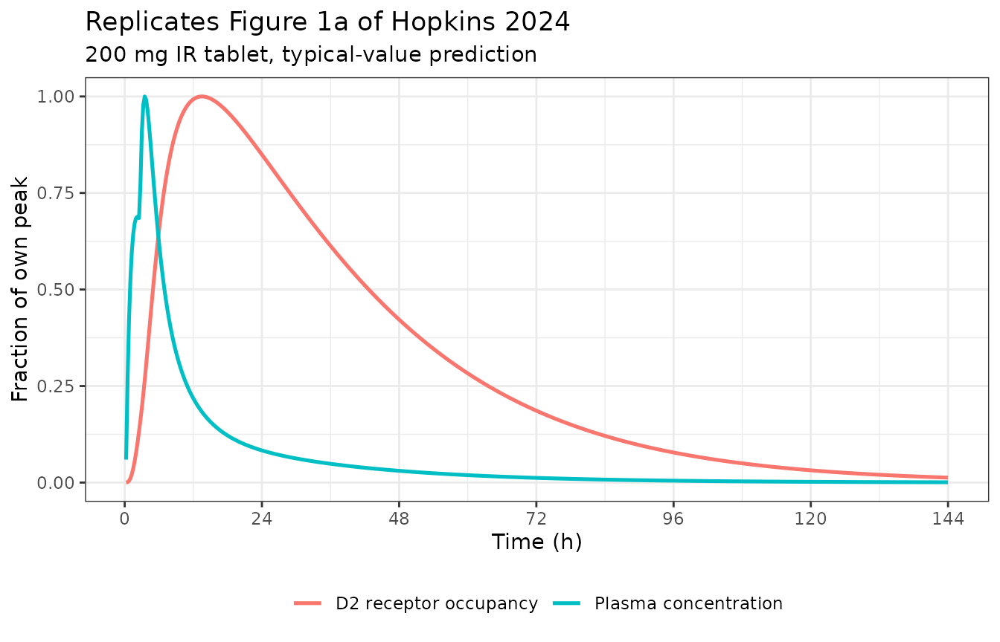
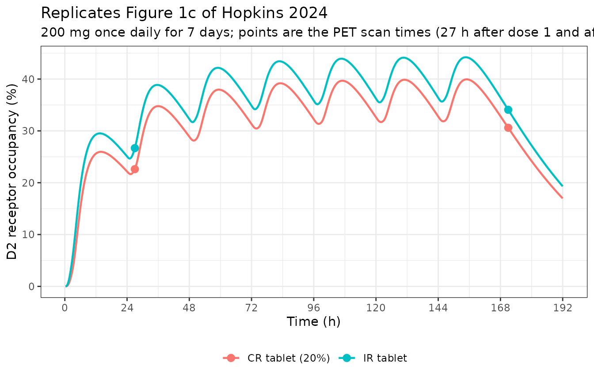
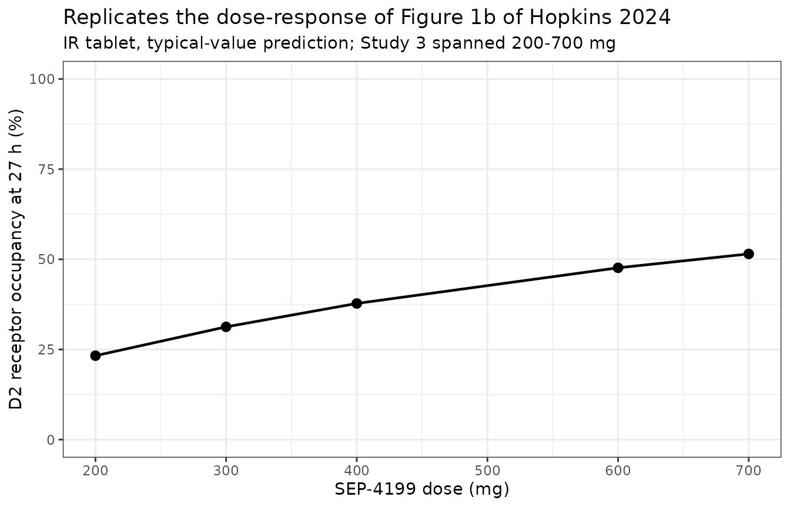
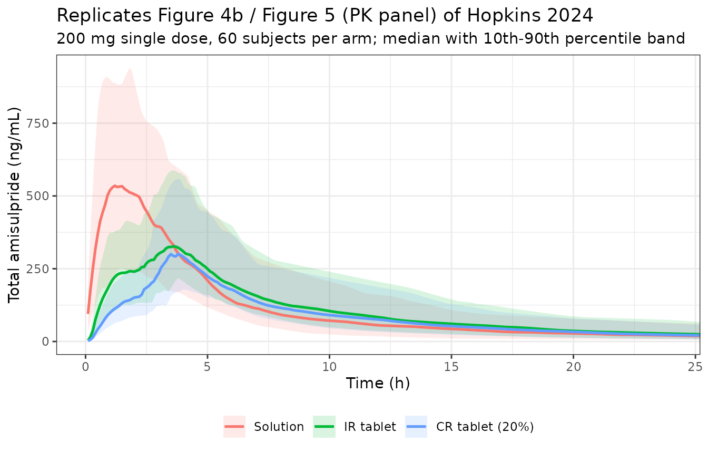

# Nonracemic amisulpride (Hopkins 2024)

## Model and source

``` r

ui <- rxode2::rxode(readModelDb("Hopkins_2024_amisulpride"))
#> ℹ parameter labels from comments will be replaced by 'label()'
#> Warning: some etas defaulted to non-mu referenced, possible parsing error: etaltlag3, etaiov_lcl_1, etaiov_lcl_2, etaiov_lcl_3, etaiov_lcl_4, etaiov_lcl_5, etaiov_lcl_6, etaiov_lcl_7, etaiov_lq_1, etaiov_lq_2, etaiov_lq_3, etaiov_lq_4, etaiov_lq_5, etaiov_lq_6, etaiov_lq_7, etaiov_ltlag2_1, etaiov_ltlag2_2, etaiov_ltlag2_3, etaiov_ltlag2_4, etaiov_ltlag2_5, etaiov_ltlag2_6, etaiov_ltlag2_7, etaiov_ltlag3_1, etaiov_ltlag3_2, etaiov_ltlag3_3, etaiov_ltlag3_4, etaiov_ltlag3_5, etaiov_ltlag3_6, etaiov_ltlag3_7, etaiov_lf1_1, etaiov_lf1_2, etaiov_lf1_3, etaiov_lf1_4, etaiov_lf1_5, etaiov_lf1_6, etaiov_lf1_7, etaiov_lf2_1, etaiov_lf2_2, etaiov_lf2_3, etaiov_lf2_4, etaiov_lf2_5, etaiov_lf2_6, etaiov_lf2_7, etaiov_lf3_1, etaiov_lf3_2, etaiov_lf3_3, etaiov_lf3_4, etaiov_lf3_5, etaiov_lf3_6, etaiov_lf3_7
#> as a work-around try putting the mu-referenced expression on a simple line
```

- Citation: Hopkins SC, Toongsuwan S, Corriveau TJ, Watanabe T, Tsushima
  Y, Asada T, Lew R, Shi L, Zann V, Snowden TJ, van der Graaf PH, Darpo
  B, Searle GE, Rabiner EA, Wilding I, Szabo ST, Galluppi GR, Koblan KS.
  Discovery and Model-Informed Drug Development of a Controlled-Release
  Formulation of Nonracemic Amisulpride that Reduces Plasma Exposure but
  Achieves Pharmacodynamic Bioequivalence in the Brain. Clin Pharmacol
  Ther. 2024;116(6):1553-1562. <doi:10.1002/cpt.3311>.
- Article: <https://doi.org/10.1002/cpt.3311>

Joint PK/PD ‘Distribution Model’ for nonracemic amisulpride (SEP-4199, a
fixed 85:15 ratio of aramisulpride to esamisulpride) and its brain
dopamine D2 receptor occupancy in healthy adults (Hopkins 2024).
Absorption is a three-parallel-depot construct with staggered lag times,
representing regiospecific uptake along the gastrointestinal tract; each
depot’s first-order rate constant is scaled by a shared Weibull in vitro
dissolution term fitted separately per formulation prototype, so a
single model spans oral solution, immediate-release tablet, five
controlled-release tablet strengths (10/15/20/25/40 percent
rate-controlling polymer, one of them fed) and two multiparticulate
(MUPS) capsules. Plasma disposition of total amisulpride enantiomers is
two compartmental with linear clearance. The pharmacodynamic layer is
the paper’s named contribution: unbound esamisulpride distributes from
plasma into a first brain compartment (plausibly the blood-brain /
blood-CSF barrier), transits to a second brain compartment (plausibly
parenchyma), and D2 receptor occupancy is an Emax-type function of the
second compartment with a fixed binding affinity. This two-step
distribution is what simultaneously reproduces the three observations
that defeated conventional PK/PD forms: plasma-brain hysteresis (24 h
plasma washout vs 5 day occupancy washout), a dose-response that does
not saturate over the tested range, and an absence of occupancy
accumulation over 7 daily doses. The model supported the model-informed
decision to carry a controlled-release formulation into Phase III as
dose-equivalent to the immediate-release form despite not being
bioequivalent in plasma, because the reduced peak plasma concentrations
lower QT prolongation while brain occupancy is preserved.

## Population

``` r

pop <- ui$population
tibble::tibble(
  Field = names(pop),
  Value = vapply(pop, function(x) paste(
    if (is.null(names(x))) as.character(x) else paste0(names(x), ": ", x),
    collapse = "; "), character(1))
) |>
  knitr::kable(caption = "Population metadata recorded with the model.")
```

| Field | Value |
|:---|:---|
| species | human |
| n_subjects | 181 |
| n_studies | 6 |
| age_range | 32-39 years (per-study means; Table 1) |
| disease_state | healthy volunteers |
| race_ethnicity | White: 68; Black: 19; Other: 14 |
| dose_range | 25-700 mg single oral doses, plus 200 and 400 mg once daily for 7 days |
| regions | UK (Studies 1, 3, 4, 5 conducted under MHRA Clinical Trial Authorization) |
| notes | Table 1 of the paper gives baseline demographics for the four PET / translational-pharmaceutics studies (Study 1 N = 6, Study 3 N = 11, Study 4 N = 11, Study 5 Part 1 N = 17 and Part 2 N = 18, imaging arm N = 37). Supplement Table 1 lists all six studies pooled for the PK/PD analysis, adding Study 2 (N = 33, aramisulpride polysomnography) and an ascending single oral dose study (N = 48) in Caucasian and Japanese subjects, for the stated total of 181 subjects, 11,626 plasma samples and 157 D2 receptor occupancy measurements. Sex percentages are given per study rather than pooled; Studies 1 and 3 were all male, Study 4 was 64 percent male and Study 5 was 53 and 44 percent male in Parts 1 and 2. The race percentages recorded here are those of the N = 37 imaging arm, the only pooled column in Table 1. sex_female_pct is deliberately absent: Table 1 reports sex per study rather than pooled, the ascending-single-dose study enrolled male subjects only per its title, and no sex breakdown is published for Study 2 or for Study 5 as a whole, so no pooled female percentage across the 181 subjects can be computed. Women were enrolled (Study 4 was 36 percent female and Study 5 Parts 1 and 2 were 47 and 56 percent female), so recording 0 would be wrong. |

Population metadata recorded with the model. {.table}

The six pooled Phase I studies are listed in Table 1 of the supplement.
Table 1 of the paper gives baseline demographics for the four studies
with PET imaging. The analysis dataset comprises 181 subjects, 11,626
plasma samples and 157 D2 receptor occupancy measurements.

## Model structure

The paper’s named contribution is the **Distribution Model**: a two-step
brain distribution cascade placed downstream of an ordinary plasma PK
model. Supplement Table 2 of the paper (reproduced as the “Distribution
Model” row of its Table 2) shows that no conventional PD form reproduces
all three governing observations simultaneously; the two-step cascade
does.

Absorption is three parallel depots with staggered lag times,
representing regiospecific uptake along the gastrointestinal tract. Each
depot’s first-order rate constant is multiplied by a shared Weibull
dissolution term whose two parameters were fitted outside NONMEM to the
measured in vitro dissolution curve of each formulation prototype, so
one model spans an oral solution, an immediate-release tablet, five
controlled-release tablet strengths and two multiparticulate capsules.

``` r

cat(paste(src[block_span("^  model\\(\\{$")], collapse = "\n"))
  model({
    # -------------------------------------------------------------------
    # 1. Formulation-derived terms.
    #
    # The ten regimen indicators are mutually exclusive and exhaustive, so
    # each sum below selects exactly one value.
    # -------------------------------------------------------------------
    is_solution <- FORM_SEP4199_SOLUTION
    is_capsule  <- FORM_SEP4199_MUPS30 + FORM_SEP4199_MUPS225
    is_tablet   <- 1 - is_solution - is_capsule

    ra <-
      exp(lra_cr10)     * FORM_SEP4199_CR10 +
      exp(lra_cr25)     * FORM_SEP4199_CR25 +
      exp(lra_ir)       * FORM_SEP4199_IR +
      exp(lra_solution) * FORM_SEP4199_SOLUTION +
      exp(lra_cr15)     * FORM_SEP4199_CR15 +
      exp(lra_cr25fed)  * FORM_SEP4199_CR25_FED +
      exp(lra_mups30)   * FORM_SEP4199_MUPS30 +
      exp(lra_mups225)  * FORM_SEP4199_MUPS225 +
      exp(lra_cr20)     * FORM_SEP4199_CR20 +
      exp(lra_cr40)     * FORM_SEP4199_CR40

    gam1 <-
      exp(lgam1_cr10)     * FORM_SEP4199_CR10 +
      exp(lgam1_cr25)     * FORM_SEP4199_CR25 +
      exp(lgam1_ir)       * FORM_SEP4199_IR +
      exp(lgam1_solution) * FORM_SEP4199_SOLUTION +
      exp(lgam1_cr15)     * FORM_SEP4199_CR15 +
      exp(lgam1_cr25fed)  * FORM_SEP4199_CR25_FED +
      exp(lgam1_mups30)   * FORM_SEP4199_MUPS30 +
      exp(lgam1_mups225)  * FORM_SEP4199_MUPS225 +
      exp(lgam1_cr20)     * FORM_SEP4199_CR20 +
      exp(lgam1_cr40)     * FORM_SEP4199_CR40

    # -------------------------------------------------------------------
    # 2. Occasion indicators and the inter-occasion variability terms.
    #    OCC = 0 (or any value outside 1..7) zeroes every indicator and
    #    leaves only the IIV contribution, matching the NONMEM $ABBR
    #    REPLACE mapping.
    # -------------------------------------------------------------------
    oc1 <- (OCC == 1)
    oc2 <- (OCC == 2)
    oc3 <- (OCC == 3)
    oc4 <- (OCC == 4)
    oc5 <- (OCC == 5)
    oc6 <- (OCC == 6)
    oc7 <- (OCC == 7)

    iov_lcl <- oc1 * etaiov_lcl_1 + oc2 * etaiov_lcl_2 + oc3 * etaiov_lcl_3 +
      oc4 * etaiov_lcl_4 + oc5 * etaiov_lcl_5 + oc6 * etaiov_lcl_6 + oc7 * etaiov_lcl_7
    iov_lq <- oc1 * etaiov_lq_1 + oc2 * etaiov_lq_2 + oc3 * etaiov_lq_3 +
      oc4 * etaiov_lq_4 + oc5 * etaiov_lq_5 + oc6 * etaiov_lq_6 + oc7 * etaiov_lq_7
    iov_ltlag2 <- oc1 * etaiov_ltlag2_1 + oc2 * etaiov_ltlag2_2 + oc3 * etaiov_ltlag2_3 +
      oc4 * etaiov_ltlag2_4 + oc5 * etaiov_ltlag2_5 + oc6 * etaiov_ltlag2_6 + oc7 * etaiov_ltlag2_7
    iov_ltlag3 <- oc1 * etaiov_ltlag3_1 + oc2 * etaiov_ltlag3_2 + oc3 * etaiov_ltlag3_3 +
      oc4 * etaiov_ltlag3_4 + oc5 * etaiov_ltlag3_5 + oc6 * etaiov_ltlag3_6 + oc7 * etaiov_ltlag3_7
    iov_lf1 <- oc1 * etaiov_lf1_1 + oc2 * etaiov_lf1_2 + oc3 * etaiov_lf1_3 +
      oc4 * etaiov_lf1_4 + oc5 * etaiov_lf1_5 + oc6 * etaiov_lf1_6 + oc7 * etaiov_lf1_7
    iov_lf2 <- oc1 * etaiov_lf2_1 + oc2 * etaiov_lf2_2 + oc3 * etaiov_lf2_3 +
      oc4 * etaiov_lf2_4 + oc5 * etaiov_lf2_5 + oc6 * etaiov_lf2_6 + oc7 * etaiov_lf2_7
    iov_lf3 <- oc1 * etaiov_lf3_1 + oc2 * etaiov_lf3_2 + oc3 * etaiov_lf3_3 +
      oc4 * etaiov_lf3_4 + oc5 * etaiov_lf3_5 + oc6 * etaiov_lf3_6 + oc7 * etaiov_lf3_7

    # -------------------------------------------------------------------
    # 3. Individual parameters.
    # -------------------------------------------------------------------
    cl <- exp(lcl + etalcl + iov_lcl)
    q  <- exp(lq + etalq + iov_lq)
    vc <- exp(lvc + etalvc)
    vp <- exp(lvp + etalvp)

    # $PK: TAL2 = THETA(5)*EXP(...); TAL3 = TAL2 + THETA(6)*EXP(...)
    tlag2 <- exp(ltlag2 + etaltlag2 + iov_ltlag2)
    tlag3 <- tlag2 + exp(ltlag3 + etaltlag3 + iov_ltlag3)

    kamax1 <- exp(lkamax1_sol) * is_solution + exp(lkamax1_tab) * is_tablet + exp(lkamax1_cap) * is_capsule
    kamax2 <- exp(lkamax2_sol) * is_solution + exp(lkamax2_tab) * is_tablet + exp(lkamax2_cap) * is_capsule
    kamax3 <- exp(lkamax3_sol) * is_solution + exp(lkamax3_tab) * is_tablet + exp(lkamax3_cap) * is_capsule

    f1 <- exp(iov_lf1) * (
      exp(lf1_cr10)     * FORM_SEP4199_CR10 +
        exp(lf1_cr25)     * FORM_SEP4199_CR25 +
        exp(lf1_ir)       * FORM_SEP4199_IR +
        exp(lf1_solution) * FORM_SEP4199_SOLUTION +
        exp(lf1_cr15)     * FORM_SEP4199_CR15 +
        exp(lf1_cr25fed)  * FORM_SEP4199_CR25_FED +
        exp(lf1_mups30)   * FORM_SEP4199_MUPS30 +
        exp(lf1_mups225)  * FORM_SEP4199_MUPS225 +
        exp(lf1_cr20)     * FORM_SEP4199_CR20 +
        exp(lf1_cr40)     * FORM_SEP4199_CR40)

    f2 <- exp(iov_lf2) * (
      exp(lf2_cr10)     * FORM_SEP4199_CR10 +
        exp(lf2_cr25)     * FORM_SEP4199_CR25 +
        exp(lf2_ir)       * FORM_SEP4199_IR +
        exp(lf2_solution) * FORM_SEP4199_SOLUTION +
        exp(lf2_cr15)     * FORM_SEP4199_CR15 +
        exp(lf2_cr25fed)  * FORM_SEP4199_CR25_FED +
        exp(lf2_mups30)   * FORM_SEP4199_MUPS30 +
        exp(lf2_mups225)  * FORM_SEP4199_MUPS225 +
        exp(lf2_cr20)     * FORM_SEP4199_CR20 +
        exp(lf2_cr40)     * FORM_SEP4199_CR40)

    f3 <- exp(iov_lf3) * (
      exp(lf3_cr10)     * FORM_SEP4199_CR10 +
        exp(lf3_cr25)     * FORM_SEP4199_CR25 +
        exp(lf3_ir)       * FORM_SEP4199_IR +
        exp(lf3_solution) * FORM_SEP4199_SOLUTION +
        exp(lf3_cr15)     * FORM_SEP4199_CR15 +
        exp(lf3_cr25fed)  * FORM_SEP4199_CR25_FED +
        exp(lf3_mups30)   * FORM_SEP4199_MUPS30 +
        exp(lf3_mups225)  * FORM_SEP4199_MUPS225 +
        exp(lf3_cr20)     * FORM_SEP4199_CR20 +
        exp(lf3_cr40)     * FORM_SEP4199_CR40)

    kinf_effect1 <- exp(lkinf_effect1 + etalkinf_effect1)
    keff_effect1 <- exp(lkeff_effect1 + etalkeff_effect1)
    kinf_effect2 <- exp(lkinf_effect2 + etalkinf_effect2)
    keff_effect2 <- exp(lkeff_effect2 + etalkeff_effect2)

    # -------------------------------------------------------------------
    # 4. Micro-constants.
    # -------------------------------------------------------------------
    kel <- cl / vc
    k12 <- q / vc
    k21 <- q / vp

    # -------------------------------------------------------------------
    # 5. Weibull dissolution scaling of the three absorption rate
    #    constants, WB = 1 - exp(-(KAW * TAD)^GAMAW) in $PK. TAD is time
    #    after the most recent dose; depot1 takes the dose with no lag, so
    #    tad(depot1) is the NONMEM TAD column. The occupancy control stream
    #    sets WB = 1 for the oral solution, which has no dissolution step.
    # -------------------------------------------------------------------
    wb <- is_solution + (1 - is_solution) * (1 - exp(-(ra * tad(depot1))^gam1))

    # $ERROR computes CT = A(4)/V4 directly, which means the NONMEM dataset
    # carried dose amounts in ug: the assay curve range and every reported
    # concentration are ng/mL (equivalently ug/L), and 289 L is an apparent
    # central volume in litres. Doses here are declared in mg to match the
    # published dose levels, so the quotient central/vc is in mg/L and needs
    # the 1000-fold conversion to ng/mL. The factor is a pure unit
    # conversion, not a fitted scaling parameter. It is applied before the
    # effect compartments because their influx is driven by the plasma
    # concentration on the ng/mL scale, the same scale as kd = 9 ng/mL.
    Cc <- 1000 * central / vc

    # -------------------------------------------------------------------
    # 6. ODE system. Compartments 1-5 are $DES of the PK script; 6 and 7
    #    are the Distribution Model states added by the occupancy script.
    # -------------------------------------------------------------------
    d/dt(depot1) <- -kamax1 * wb * depot1
    d/dt(depot2) <- -kamax2 * wb * depot2
    d/dt(depot3) <- -kamax3 * wb * depot3
    d/dt(central) <- kamax1 * wb * depot1 + kamax2 * wb * depot2 + kamax3 * wb * depot3 +
      k21 * peripheral1 - (kel + k12) * central
    d/dt(peripheral1) <- k12 * central - k21 * peripheral1
    # DADT(6) = KE1*FU*SP*(A(4)/V4) - KE2*A(6) - KT*A(6)
    d/dt(effect1) <- kinf_effect1 * fu * f_esamisulpride * Cc - keff_effect1 * effect1 - kinf_effect2 * effect1
    # DADT(7) = KT*A(6) - KE3*A(7)
    d/dt(effect2) <- kinf_effect2 * effect1 - keff_effect2 * effect2

    # -------------------------------------------------------------------
    # 7. Bioavailability and lag times.
    # -------------------------------------------------------------------
    f(depot1) <- f1
    f(depot2) <- f2
    f(depot3) <- f3
    alag(depot2) <- tlag2
    alag(depot3) <- tlag3

    # -------------------------------------------------------------------
    # 8. Observations. $ERROR: CT = A(4)/V4 with a combined error model,
    #    and D2P = (A(7)/(KD + A(7)))*100 with an additive error model.
    # -------------------------------------------------------------------
    D2RO <- 100 * effect2 / (kd + effect2)

    Cc ~ prop(propSd) + add(addSd)
    D2RO ~ add(addSd_D2RO)
  })
```

## Source trace

Every `ini()` entry in the model file carries an inline comment naming
the table, `$THETA` line or `$OMEGA` line it came from. The table below
is parsed directly out of the installed model file, so it cannot drift
from the code.

``` r

ini_span <- block_span("^  ini\\(\\{$")
ini_lines <- src[ini_span[-c(1, length(ini_span))]]
keep <- grepl("(<-|~)", ini_lines) & grepl("#", ini_lines)
trace <- tibble::tibble(raw = trimws(ini_lines[keep])) |>
  mutate(
    Parameter = trimws(sub("\\s*(<-|~).*$", "", raw)),
    Definition = trimws(sub("^.*?(<-|~)\\s*", "", sub("\\s*#.*$", "", raw))),
    Source = trimws(sub("^[^#]*#\\s*", "", raw))
  ) |>
  select(Parameter, Definition, Source)
knitr::kable(trace, caption = paste0(
  "Source trace for all ", nrow(trace), " ini() entries, parsed from the model file."))
```

| Parameter | Definition | Source |
|:---|:---|:---|
| lcl | fixed(log(106)); label(“Apparent clearance from the central compartment CL/F (L/h)”) | PK \$THETA TH1 = 106 FIX |
| lq | fixed(log(62)); label(“Apparent intercompartmental clearance Q/F (L/h)”) | PK \$THETA TH2 = 62 FIX |
| lvc | fixed(log(289)); label(“Apparent central volume of distribution Vc/F (L)”) | PK \$THETA TH3 = 289 FIX |
| lvp | fixed(log(981)); label(“Apparent peripheral volume of distribution Vp/F (L)”) | PK \$THETA TH4 = 981 FIX |
| ltlag2 | fixed(log(0.241)); label(“Lag time before absorption compartment 2 opens (h)”) | PK \$THETA TH5 = 0.241 FIX |
| ltlag3 | fixed(log(2.4)); label(“Additional lag of absorption compartment 3 beyond compartment 2 (h)”) | PK \$THETA TH6 = 2.4 FIX |
| lkamax1_sol | fixed(log(0.657)); label(“Absorption rate constant, compartment 1, oral solution (1/h)”) | PK \$THETA TH7 = 0.657 FIX |
| lkamax1_tab | fixed(log(0.214)); label(“Absorption rate constant, compartment 1, tablet (1/h)”) | PK \$THETA TH8 = 0.214 FIX |
| lkamax1_cap | fixed(log(0.197)); label(“Absorption rate constant, compartment 1, MUPS capsule (1/h)”) | PK \$THETA TH9 = 0.197 FIX |
| lkamax2_sol | fixed(log(0.283)); label(“Absorption rate constant, compartment 2, oral solution (1/h)”) | PK \$THETA TH10 = 0.283 FIX |
| lkamax2_tab | fixed(log(1.33)); label(“Absorption rate constant, compartment 2, tablet (1/h)”) | PK \$THETA TH11 = 1.33 FIX |
| lkamax2_cap | fixed(log(0.433)); label(“Absorption rate constant, compartment 2, MUPS capsule (1/h)”) | PK \$THETA TH12 = 0.433 FIX |
| lkamax3_sol | fixed(log(8.05)); label(“Absorption rate constant, compartment 3, oral solution (1/h)”) | PK \$THETA TH13 = 8.05 FIX |
| lkamax3_tab | fixed(log(1.36)); label(“Absorption rate constant, compartment 3, tablet (1/h)”) | PK \$THETA TH14 = 1.36 FIX |
| lkamax3_cap | fixed(log(1.3)); label(“Absorption rate constant, compartment 3, MUPS capsule (1/h)”) | PK \$THETA TH15 = 1.3 FIX |
| lf1_cr10 | fixed(log(1.39)); label(“Fraction absorbed via process 1, 10% CR tablet (unitless)”) | PK \$THETA TH16 = 1.39 FIX |
| lf1_cr25 | fixed(log(0.759)); label(“Fraction absorbed via process 1, 25% CR tablet (unitless)”) | PK \$THETA TH17 = 0.759 FIX |
| lf1_ir | fixed(log(1.39)); label(“Fraction absorbed via process 1, IR tablet (unitless)”) | PK \$THETA TH18 = 1.39 FIX |
| lf1_solution | fixed(log(1.99)); label(“Fraction absorbed via process 1, oral solution (unitless)”) | PK \$THETA TH19 = 1.99 FIX |
| lf1_cr15 | fixed(log(0.807)); label(“Fraction absorbed via process 1, 15% CR tablet (unitless)”) | PK \$THETA TH20 = 0.807 FIX |
| lf1_cr25fed | fixed(log(1.04)); label(“Fraction absorbed via process 1, 25% CR tablet fed (unitless)”) | PK \$THETA TH21 = 1.04 FIX |
| lf1_mups30 | fixed(log(0.0092)); label(“Fraction absorbed via process 1, MUPS capsule 30% polymer (unitless)”) | PK \$THETA TH22 = 0.0092 FIX |
| lf1_mups225 | fixed(log(1.07)); label(“Fraction absorbed via process 1, MUPS capsule 22.5% polymer (unitless)”) | PK \$THETA TH23 = 1.07 FIX |
| lf1_cr20 | fixed(log(0.942)); label(“Fraction absorbed via process 1, 20% CR tablet (unitless)”) | PK \$THETA TH24 = 0.942 FIX |
| lf1_cr40 | fixed(log(0.638)); label(“Fraction absorbed via process 1, 40% CR tablet (unitless)”) | PK \$THETA TH25 = 0.638 FIX |
| lf2_cr10 | fixed(log(0.0599)); label(“Fraction absorbed via process 2, 10% CR tablet (unitless)”) | PK \$THETA TH26 = 0.0599 FIX |
| lf2_cr25 | fixed(log(0.36)); label(“Fraction absorbed via process 2, 25% CR tablet (unitless)”) | PK \$THETA TH27 = 0.36 FIX |
| lf2_ir | fixed(log(0.224)); label(“Fraction absorbed via process 2, IR tablet (unitless)”) | PK \$THETA TH28 = 0.224 FIX |
| lf2_solution | fixed(log(0.198)); label(“Fraction absorbed via process 2, oral solution (unitless)”) | PK \$THETA TH29 = 0.198 FIX |
| lf2_cr15 | fixed(log(0.201)); label(“Fraction absorbed via process 2, 15% CR tablet (unitless)”) | PK \$THETA TH30 = 0.201 FIX |
| lf2_cr25fed | fixed(log(2.21e-7)); label(“Fraction absorbed via process 2, 25% CR tablet fed (unitless)”) | PK \$THETA TH31 = 0.000000221 FIX |
| lf2_mups30 | fixed(log(0.98)); label(“Fraction absorbed via process 2, MUPS capsule 30% polymer (unitless)”) | PK \$THETA TH32 = 0.98 FIX |
| lf2_mups225 | fixed(log(0.299)); label(“Fraction absorbed via process 2, MUPS capsule 22.5% polymer (unitless)”) | PK \$THETA TH33 = 0.299 FIX |
| lf2_cr20 | fixed(log(0.251)); label(“Fraction absorbed via process 2, 20% CR tablet (unitless)”) | PK \$THETA TH34 = 0.251 FIX |
| lf2_cr40 | fixed(log(0.439)); label(“Fraction absorbed via process 2, 40% CR tablet (unitless)”) | PK \$THETA TH35 = 0.439 FIX |
| lf3_cr10 | fixed(log(0.542)); label(“Fraction absorbed via process 3, 10% CR tablet (unitless)”) | PK \$THETA TH36 = 0.542 FIX |
| lf3_cr25 | fixed(log(0.287)); label(“Fraction absorbed via process 3, 25% CR tablet (unitless)”) | PK \$THETA TH37 = 0.287 FIX |
| lf3_ir | fixed(log(0.392)); label(“Fraction absorbed via process 3, IR tablet (unitless)”) | PK \$THETA TH38 = 0.392 FIX |
| lf3_solution | fixed(log(0.00842)); label(“Fraction absorbed via process 3, oral solution (unitless)”) | PK \$THETA TH39 = 0.00842 FIX |
| lf3_cr15 | fixed(log(0.521)); label(“Fraction absorbed via process 3, 15% CR tablet (unitless)”) | PK \$THETA TH40 = 0.521 FIX |
| lf3_cr25fed | fixed(log(0.234)); label(“Fraction absorbed via process 3, 25% CR tablet fed (unitless)”) | PK \$THETA TH41 = 0.234 FIX |
| lf3_mups30 | fixed(log(1.15)); label(“Fraction absorbed via process 3, MUPS capsule 30% polymer (unitless)”) | PK \$THETA TH42 = 1.15 FIX |
| lf3_mups225 | fixed(log(0.885)); label(“Fraction absorbed via process 3, MUPS capsule 22.5% polymer (unitless)”) | PK \$THETA TH43 = 0.885 FIX |
| lf3_cr20 | fixed(log(0.491)); label(“Fraction absorbed via process 3, 20% CR tablet (unitless)”) | PK \$THETA TH44 = 0.491 FIX |
| lf3_cr40 | fixed(log(0.393)); label(“Fraction absorbed via process 3, 40% CR tablet (unitless)”) | PK \$THETA TH45 = 0.393 FIX |
| lra_cr10 | fixed(log(1.6536)); label(“Weibull dissolution rate scaling, 10% CR tablet (1/h)”) | PK \$PK IF (RGN.EQ.1) TKA1 = 1.6536 |
| lra_cr25 | fixed(log(0.1824)); label(“Weibull dissolution rate scaling, 25% CR tablet (1/h)”) | PK \$PK IF (RGN.EQ.2) TKA1 = 0.1824 |
| lra_ir | fixed(log(5.7466)); label(“Weibull dissolution rate scaling, IR tablet (1/h)”) | PK \$PK IF (RGN.EQ.3) TKA1 = 5.7466 |
| lra_solution | fixed(log(7.98)); label(“Weibull dissolution rate scaling, oral solution (1/h)”) | PK \$PK IF (RGN.EQ.4) TKA1 = 7.98 (unused; solution bypasses the term) |
| lra_cr15 | fixed(log(0.3276)); label(“Weibull dissolution rate scaling, 15% CR tablet (1/h)”) | PK \$PK IF (RGN.EQ.5) TKA1 = 0.3276 |
| lra_cr25fed | fixed(log(1.1305)); label(“Weibull dissolution rate scaling, 25% CR tablet fed (1/h)”) | PK \$PK IF (RGN.EQ.6) TKA1 = 1.1305 (interpolated) |
| lra_mups30 | fixed(log(0.18)); label(“Weibull dissolution rate scaling, MUPS capsule 30% polymer (1/h)”) | PK \$PK IF (RGN.EQ.7) TKA1 = 0.1800 |
| lra_mups225 | fixed(log(0.687)); label(“Weibull dissolution rate scaling, MUPS capsule 22.5% polymer (1/h)”) | PK \$PK IF (RGN.EQ.8) TKA1 = 0.6870 |
| lra_cr20 | fixed(log(0.8457)); label(“Weibull dissolution rate scaling, 20% CR tablet (1/h)”) | PK \$PK IF (RGN.EQ.9) TKA1 = 0.8457 |
| lra_cr40 | fixed(log(0.1411)); label(“Weibull dissolution rate scaling, 40% CR tablet (1/h)”) | PK \$PK IF (RGN.EQ.10) TKA1 = 0.1411 |
| lgam1_cr10 | fixed(log(1.3732)); label(“Weibull dissolution shape, 10% CR tablet (unitless)”) | PK \$PK IF (RGN.EQ.1) TGAMA1 = 1.3732 |
| lgam1_cr25 | fixed(log(1.1305)); label(“Weibull dissolution shape, 25% CR tablet (unitless)”) | PK \$PK IF (RGN.EQ.2) TGAMA1 = 1.1305 |
| lgam1_ir | fixed(log(1.4364)); label(“Weibull dissolution shape, IR tablet (unitless)”) | PK \$PK IF (RGN.EQ.3) TGAMA1 = 1.4364 |
| lgam1_solution | fixed(log(0.905)); label(“Weibull dissolution shape, oral solution (unitless)”) | PK \$PK IF (RGN.EQ.4) TGAMA1 = 0.905 (unused; solution bypasses the term) |
| lgam1_cr15 | fixed(log(1.0949)); label(“Weibull dissolution shape, 15% CR tablet (unitless)”) | PK \$PK IF (RGN.EQ.5) TGAMA1 = 1.0949 |
| lgam1_cr25fed | fixed(log(5.7466)); label(“Weibull dissolution shape, 25% CR tablet fed (unitless)”) | PK \$PK IF (RGN.EQ.6) TGAMA1 = 5.7466 (interpolated) |
| lgam1_mups30 | fixed(log(0.6988)); label(“Weibull dissolution shape, MUPS capsule 30% polymer (unitless)”) | PK \$PK IF (RGN.EQ.7) TGAMA1 = 0.6988 |
| lgam1_mups225 | fixed(log(1.0411)); label(“Weibull dissolution shape, MUPS capsule 22.5% polymer (unitless)”) | PK \$PK IF (RGN.EQ.8) TGAMA1 = 1.0411 |
| lgam1_cr20 | fixed(log(0.5496)); label(“Weibull dissolution shape, 20% CR tablet (unitless)”) | PK \$PK IF (RGN.EQ.9) TGAMA1 = 0.5496 |
| lgam1_cr40 | fixed(log(0.7764)); label(“Weibull dissolution shape, 40% CR tablet (unitless)”) | PK \$PK IF (RGN.EQ.10) TGAMA1 = 0.7764 |
| lkinf_effect1 | log(0.0221); label(“Influx rate constant from plasma into brain compartment 1, KE1 (1/h)”) | Supplement Table 3: KE1 = 0.0221 |
| lkeff_effect1 | log(0.0685); label(“Efflux rate constant out of brain compartment 1 back to plasma, KE2 (1/h)”) | Supplement Table 3: KE2 = 0.0685 |
| lkinf_effect2 | log(0.42); label(“Distribution rate constant from brain compartment 1 to compartment 2, KT (1/h)”) | Supplement Table 3: KT = 0.42 |
| lkeff_effect2 | log(0.0602); label(“Efflux rate constant out of brain compartment 2, KE3 (1/h)”) | Supplement Table 3: KE3 = 0.0602 |
| kd | fixed(9); label(“D2 receptor binding affinity in brain compartment 2 units, KD (ng/mL)”) | Supplement Table 3: KD = 9 (FIX); occupancy control stream \$THETA TH5 9 FIX |
| fu | fixed(0.83); label(“Fraction of amisulpride unbound in plasma, FU (unitless)”) | Supplement Table 3: FU = 0.83 (FIX); occupancy control stream \$THETA TH6 0.83 FIX |
| f_esamisulpride | fixed(0.15); label(“Fraction of total measured amisulpride that is the D2-active enantiomer esamisulpride, SP (unitless)”) | Supplement Table 3: SP = 0.15 (FIX); the fixed 85:15 aramisulpride:esamisulpride ratio of SEP-4199 (Methods, Drugs) |
| etalcl | 0.105 | PK \$OMEGA ETA1 - CL IIV = 0.105 FIX |
| etalq | 0.719 | PK \$OMEGA ETA2 - Q IIV = 0.719 FIX |
| etalvc | 0.431 | PK \$OMEGA ETA3 - Vcen IIV = 0.431 FIX |
| etalvp | 0.389 | PK \$OMEGA ETA4 - Vperi IIV = 0.389 FIX |
| etaltlag2 | 0.01 | PK \$OMEGA ETA5 - ALAG2 IIV = 0.01 FIX |
| etaltlag3 | 0.01 | PK \$OMEGA ETA6 - ALAG3 IIV = 0.01 FIX |
| etalkinf_effect1 | 0.0314 | Supplement Table 3: KE1 - IIV = 0.0314 |
| etalkeff_effect1 | 1e-06 | Supplement Table 3: KE2 - IIV = 1.00E-06 (effectively no IIV, but not fixed to zero) |
| etalkinf_effect2 | 0.706 | Supplement Table 3: KT - IIV = 0.706 |
| etalkeff_effect2 | 0.0341 | Supplement Table 3: KE3 - IIV = 0.0341 |
| etaiov_lcl_1 | 0.048 | PK \$OMEGA BLOCK(7) element (1,1) = 0.048, CL IOV |
| etaiov_lcl_2 | fixed(0.048) | BLOCK(7) SAME |
| etaiov_lcl_3 | fixed(0.048) | BLOCK(7) SAME |
| etaiov_lcl_4 | fixed(0.048) | BLOCK(7) SAME |
| etaiov_lcl_5 | fixed(0.048) | BLOCK(7) SAME |
| etaiov_lcl_6 | fixed(0.048) | BLOCK(7) SAME |
| etaiov_lcl_7 | fixed(0.048) | BLOCK(7) SAME |
| etaiov_lq_1 | 0.293 | PK \$OMEGA BLOCK(7) element (2,2) = 0.293, Q IOV |
| etaiov_lq_2 | fixed(0.293) | BLOCK(7) SAME |
| etaiov_lq_3 | fixed(0.293) | BLOCK(7) SAME |
| etaiov_lq_4 | fixed(0.293) | BLOCK(7) SAME |
| etaiov_lq_5 | fixed(0.293) | BLOCK(7) SAME |
| etaiov_lq_6 | fixed(0.293) | BLOCK(7) SAME |
| etaiov_lq_7 | fixed(0.293) | BLOCK(7) SAME |
| etaiov_ltlag2_1 | 0.0103 | PK \$OMEGA BLOCK(7) element (3,3) = 0.0103, ALAG2 IOV |
| etaiov_ltlag2_2 | fixed(0.0103) | BLOCK(7) SAME |
| etaiov_ltlag2_3 | fixed(0.0103) | BLOCK(7) SAME |
| etaiov_ltlag2_4 | fixed(0.0103) | BLOCK(7) SAME |
| etaiov_ltlag2_5 | fixed(0.0103) | BLOCK(7) SAME |
| etaiov_ltlag2_6 | fixed(0.0103) | BLOCK(7) SAME |
| etaiov_ltlag2_7 | fixed(0.0103) | BLOCK(7) SAME |
| etaiov_ltlag3_1 | 0.00964 | PK \$OMEGA BLOCK(7) element (4,4) = 0.00964, ALAG3 IOV |
| etaiov_ltlag3_2 | fixed(0.00964) | BLOCK(7) SAME |
| etaiov_ltlag3_3 | fixed(0.00964) | BLOCK(7) SAME |
| etaiov_ltlag3_4 | fixed(0.00964) | BLOCK(7) SAME |
| etaiov_ltlag3_5 | fixed(0.00964) | BLOCK(7) SAME |
| etaiov_ltlag3_6 | fixed(0.00964) | BLOCK(7) SAME |
| etaiov_ltlag3_7 | fixed(0.00964) | BLOCK(7) SAME |
| etaiov_lf1_1 | 0.165 | PK \$OMEGA BLOCK(7) element (5,5) = 0.165, F1 IOV |
| etaiov_lf1_2 | fixed(0.165) | BLOCK(7) SAME |
| etaiov_lf1_3 | fixed(0.165) | BLOCK(7) SAME |
| etaiov_lf1_4 | fixed(0.165) | BLOCK(7) SAME |
| etaiov_lf1_5 | fixed(0.165) | BLOCK(7) SAME |
| etaiov_lf1_6 | fixed(0.165) | BLOCK(7) SAME |
| etaiov_lf1_7 | fixed(0.165) | BLOCK(7) SAME |
| etaiov_lf2_1 | 0.05 | PK \$OMEGA BLOCK(7) element (6,6) = 0.05, F2 IOV |
| etaiov_lf2_2 | fixed(0.05) | BLOCK(7) SAME |
| etaiov_lf2_3 | fixed(0.05) | BLOCK(7) SAME |
| etaiov_lf2_4 | fixed(0.05) | BLOCK(7) SAME |
| etaiov_lf2_5 | fixed(0.05) | BLOCK(7) SAME |
| etaiov_lf2_6 | fixed(0.05) | BLOCK(7) SAME |
| etaiov_lf2_7 | fixed(0.05) | BLOCK(7) SAME |
| etaiov_lf3_1 | 0.2 | PK \$OMEGA BLOCK(7) element (7,7) = 0.2, F3 IOV |
| etaiov_lf3_2 | fixed(0.2) | BLOCK(7) SAME |
| etaiov_lf3_3 | fixed(0.2) | BLOCK(7) SAME |
| etaiov_lf3_4 | fixed(0.2) | BLOCK(7) SAME |
| etaiov_lf3_5 | fixed(0.2) | BLOCK(7) SAME |
| etaiov_lf3_6 | fixed(0.2) | BLOCK(7) SAME |
| etaiov_lf3_7 | fixed(0.2) | BLOCK(7) SAME |
| propSd | sqrt(0.15); label(“Proportional residual error on plasma concentration (fraction)”) | PK / occupancy \$SIGMA EPS(1) variance 0.15 -\> SD 0.3873 |
| addSd | sqrt(10); label(“Additive residual error on plasma concentration (ng/mL)”) | PK / occupancy \$SIGMA EPS(2) variance 10 -\> SD 3.1623 |
| addSd_D2RO | sqrt(52.2); label(“Additive residual error on D2 receptor occupancy (percent)”) | Occupancy \$SIGMA EPS(3) variance 52.2 -\> SD 7.2250 |

Source trace for all 134 ini() entries, parsed from the model file.
{.table}

Structural equations trace as follows.

| Model equation | Source |
|----|----|
| `d/dt(depot1..3) <- -kamax_i * wb * depot_i` | Supplement, PK Fitting NONMEM Script, `$DES` DADT(1)-(3) |
| `d/dt(central)` (2-compartment with three absorption inputs) | Supplement, PK script `$DES` DADT(4) |
| `d/dt(peripheral1) <- k12 * central - k21 * peripheral1` | Supplement, PK script `$DES` DADT(5) |
| `wb <- 1 - exp(-(ra * tad(depot1))^gam1)` | Supplement, PK script `$PK`: `WB = 1-EXP((-(KAW*TAD)**GAMAW))` |
| solution bypasses the Weibull term (`wb = 1`) | Supplement, D2 occupancy script `$PK`: `IF (RGN.EQ.4) WB = 1` |
| `tlag3 <- tlag2 + exp(ltlag3 + ...)` | Supplement, PK script `$PK`: `TAL3 = TAL2 + TAL3T` |
| `d/dt(effect1) <- kinf_effect1 * fu * f_esamisulpride * Cc - keff_effect1 * effect1 - kinf_effect2 * effect1` | Supplement, D2 occupancy script `$DES` DADT(6) |
| `d/dt(effect2) <- kinf_effect2 * effect1 - keff_effect2 * effect2` | Supplement, D2 occupancy script `$DES` DADT(7) |
| `D2RO <- 100 * effect2 / (kd + effect2)` | Supplement, D2 occupancy script `$ERROR`: `D2P = (A(7)/(KD + A(7)))*100`; main text Table 2, Distribution Model row |
| `Cc ~ prop(propSd) + add(addSd)` | Supplement, `$ERROR`: `Y = IPRE + IPRE*EPS(1) + EPS(2)` |
| `D2RO ~ add(addSd_D2RO)` | Supplement, D2 occupancy script `$ERROR`: `IF (CMT.EQ.8) Y = IPRE + EPS(3)` |

## Virtual cohort

Three single-dose 200 mg arms are simulated: the oral solution used by
the PET studies, the immediate-release tablet that was carried into
Phase II, and the 20% controlled-release tablet, which of the five CR
prototypes lies closest to the peak concentration reported for the CR
tablet selected in Study 5.

Each subject receives one dose, so a single occasion is modelled and the
inter-occasion variability terms all draw on `OCC = 1`.

``` r

form_cols <- c(
  "FORM_SEP4199_CR10", "FORM_SEP4199_CR25", "FORM_SEP4199_IR",
  "FORM_SEP4199_SOLUTION", "FORM_SEP4199_CR15", "FORM_SEP4199_CR25_FED",
  "FORM_SEP4199_MUPS30", "FORM_SEP4199_MUPS225", "FORM_SEP4199_CR20",
  "FORM_SEP4199_CR40"
)

#' Build an event data frame for one formulation arm.
#'
#' Doses go simultaneously into all three parallel absorption compartments, as
#' in the NONMEM dataset; f() and alag() inside the model apply the
#' per-formulation bioavailability fractions and lag times.
make_events <- function(form, dose = 200, n_sub = 1L, times = seq(0, 48, by = 0.1),
                        addl = 0L, ii = 24) {
  stopifnot(form %in% form_cols)
  ev <- rxode2::et(amt = dose, cmt = "depot1", time = 0, addl = addl, ii = ii) |>
    rxode2::et(amt = dose, cmt = "depot2", time = 0, addl = addl, ii = ii) |>
    rxode2::et(amt = dose, cmt = "depot3", time = 0, addl = addl, ii = ii) |>
    rxode2::et(times)
  if (n_sub > 1L) ev <- rxode2::et(ev, id = seq_len(n_sub))
  dat <- as.data.frame(ev)
  # Two endpoints are declared, so observation rows need a dvid; dvid = 1 on
  # every observation returns both Cc and D2RO as columns.
  dat$dvid <- ifelse(dat$evid == 0, 1L, NA_integer_)
  for (nm in form_cols) dat[[nm]] <- 0
  dat[[form]] <- 1
  dat$OCC <- 1
  dat
}

#' Solve, keeping the arm label. useLinCmt = FALSE is required for multi-output
#' models (rxode2's automatic ODE-to-linCmt conversion corrupts the dvid map).
solve_arm <- function(mod, form, label, ...) {
  out <- rxode2::rxSolve(mod, make_events(form, ...), returnType = "data.frame",
                         useLinCmt = FALSE)
  if (is.null(out$id)) out$id <- 1L
  out$treatment <- label
  out
}

arms <- c(Solution = "FORM_SEP4199_SOLUTION",
          `IR tablet` = "FORM_SEP4199_IR",
          `CR tablet (20%)` = "FORM_SEP4199_CR20")

n_per_arm <- 60L
# Re-seed before EACH arm so all three draw the identical sequence of etas.
# That makes subject i the same virtual person in every arm, which turns the
# across-arm contrasts below into paired comparisons. Seeding once outside the
# loop would give each arm a different cohort and silently unpair them.
cohort <- lapply(names(arms), function(lbl) {
  rxode2::rxSetSeed(20240501)
  solve_arm(ui, arms[[lbl]], lbl, n_sub = n_per_arm)
}) |>
  bind_rows() |>
  mutate(treatment = factor(treatment, levels = names(arms)))
#> Warning: 'ii' requires non zero additional doses ('addl') or steady state
#> dosing ('ii': 24.000000, 'ss': 0; 'addl': 0), reset 'ii' to zero
#> Warning: 'ii' requires non zero additional doses ('addl') or steady state
#> dosing ('ii': 24.000000, 'ss': 0; 'addl': 0), reset 'ii' to zero
#> Warning: 'ii' requires non zero additional doses ('addl') or steady state
#> dosing ('ii': 24.000000, 'ss': 0; 'addl': 0), reset 'ii' to zero
#> Warning: 'ii' requires non zero additional doses ('addl') or steady state
#> dosing ('ii': 24.000000, 'ss': 0; 'addl': 0), reset 'ii' to zero
#> Warning: 'ii' requires non zero additional doses ('addl') or steady state
#> dosing ('ii': 24.000000, 'ss': 0; 'addl': 0), reset 'ii' to zero
#> Warning: 'ii' requires non zero additional doses ('addl') or steady state
#> dosing ('ii': 24.000000, 'ss': 0; 'addl': 0), reset 'ii' to zero
#> Warning: 'ii' requires non zero additional doses ('addl') or steady state
#> dosing ('ii': 24.000000, 'ss': 0; 'addl': 0), reset 'ii' to zero
#> Warning: 'ii' requires non zero additional doses ('addl') or steady state
#> dosing ('ii': 24.000000, 'ss': 0; 'addl': 0), reset 'ii' to zero
#> Warning: 'ii' requires non zero additional doses ('addl') or steady state
#> dosing ('ii': 24.000000, 'ss': 0; 'addl': 0), reset 'ii' to zero

# Confirm the arms really are paired: with common random numbers the individual
# clearance draws must be identical subject-by-subject across arms.
cl_by_arm <- cohort |>
  distinct(treatment, id, cl) |>
  tidyr::pivot_wider(names_from = treatment, values_from = cl)
stopifnot(
  nrow(cl_by_arm) == n_per_arm,
  isTRUE(all.equal(cl_by_arm[[2]], cl_by_arm[[3]])),
  isTRUE(all.equal(cl_by_arm[[2]], cl_by_arm[[4]]))
)

obs <- cohort |> filter(time > 0)
stopifnot(nrow(obs) > 0, !anyNA(obs$Cc), !anyNA(obs$D2RO), all(obs$Cc >= 0))
```

Typical-value profiles use
[`rxode2::zeroRe()`](https://nlmixr2.github.io/rxode2/reference/zeroRe.html)
so the curves are the population prediction rather than one realisation.

``` r

tv <- rxode2::zeroRe(ui)
#> Warning: some etas defaulted to non-mu referenced, possible parsing error: etaltlag3, etaiov_lcl_1, etaiov_lcl_2, etaiov_lcl_3, etaiov_lcl_4, etaiov_lcl_5, etaiov_lcl_6, etaiov_lcl_7, etaiov_lq_1, etaiov_lq_2, etaiov_lq_3, etaiov_lq_4, etaiov_lq_5, etaiov_lq_6, etaiov_lq_7, etaiov_ltlag2_1, etaiov_ltlag2_2, etaiov_ltlag2_3, etaiov_ltlag2_4, etaiov_ltlag2_5, etaiov_ltlag2_6, etaiov_ltlag2_7, etaiov_ltlag3_1, etaiov_ltlag3_2, etaiov_ltlag3_3, etaiov_ltlag3_4, etaiov_ltlag3_5, etaiov_ltlag3_6, etaiov_ltlag3_7, etaiov_lf1_1, etaiov_lf1_2, etaiov_lf1_3, etaiov_lf1_4, etaiov_lf1_5, etaiov_lf1_6, etaiov_lf1_7, etaiov_lf2_1, etaiov_lf2_2, etaiov_lf2_3, etaiov_lf2_4, etaiov_lf2_5, etaiov_lf2_6, etaiov_lf2_7, etaiov_lf3_1, etaiov_lf3_2, etaiov_lf3_3, etaiov_lf3_4, etaiov_lf3_5, etaiov_lf3_6, etaiov_lf3_7
#> as a work-around try putting the mu-referenced expression on a simple line
```

## Replicating the published observations

### Hysteresis (Figure 1a)

Plasma concentrations wash out within about 24 h while D2 receptor
occupancy needs about 5 days. Both series are scaled to their own peak,
as in the source figure.

``` r

hyst <- solve_arm(tv, "FORM_SEP4199_IR", "IR tablet", times = seq(0, 144, by = 0.25)) |>
  filter(time > 0) |>
  transmute(time,
            `Plasma concentration` = Cc / max(Cc),
            `D2 receptor occupancy` = D2RO / max(D2RO)) |>
  pivot_longer(-time, names_to = "series", values_to = "fraction")
#> Warning: 'ii' requires non zero additional doses ('addl') or steady state
#> dosing ('ii': 24.000000, 'ss': 0; 'addl': 0), reset 'ii' to zero
#> Warning: 'ii' requires non zero additional doses ('addl') or steady state
#> dosing ('ii': 24.000000, 'ss': 0; 'addl': 0), reset 'ii' to zero
#> Warning: 'ii' requires non zero additional doses ('addl') or steady state
#> dosing ('ii': 24.000000, 'ss': 0; 'addl': 0), reset 'ii' to zero
#> ℹ omega/sigma items treated as zero: 'etalcl', 'etalq', 'etalvc', 'etalvp', 'etaltlag2', 'etaltlag3', 'etalkinf_effect1', 'etalkeff_effect1', 'etalkinf_effect2', 'etalkeff_effect2', 'etaiov_lcl_1', 'etaiov_lcl_2', 'etaiov_lcl_3', 'etaiov_lcl_4', 'etaiov_lcl_5', 'etaiov_lcl_6', 'etaiov_lcl_7', 'etaiov_lq_1', 'etaiov_lq_2', 'etaiov_lq_3', 'etaiov_lq_4', 'etaiov_lq_5', 'etaiov_lq_6', 'etaiov_lq_7', 'etaiov_ltlag2_1', 'etaiov_ltlag2_2', 'etaiov_ltlag2_3', 'etaiov_ltlag2_4', 'etaiov_ltlag2_5', 'etaiov_ltlag2_6', 'etaiov_ltlag2_7', 'etaiov_ltlag3_1', 'etaiov_ltlag3_2', 'etaiov_ltlag3_3', 'etaiov_ltlag3_4', 'etaiov_ltlag3_5', 'etaiov_ltlag3_6', 'etaiov_ltlag3_7', 'etaiov_lf1_1', 'etaiov_lf1_2', 'etaiov_lf1_3', 'etaiov_lf1_4', 'etaiov_lf1_5', 'etaiov_lf1_6', 'etaiov_lf1_7', 'etaiov_lf2_1', 'etaiov_lf2_2', 'etaiov_lf2_3', 'etaiov_lf2_4', 'etaiov_lf2_5', 'etaiov_lf2_6', 'etaiov_lf2_7', 'etaiov_lf3_1', 'etaiov_lf3_2', 'etaiov_lf3_3', 'etaiov_lf3_4', 'etaiov_lf3_5', 'etaiov_lf3_6', 'etaiov_lf3_7'

ggplot(hyst, aes(time, fraction, colour = series)) +
  geom_line(linewidth = 0.9) +
  scale_x_continuous(breaks = seq(0, 144, by = 24)) +
  labs(x = "Time (h)", y = "Fraction of own peak", colour = NULL,
       title = "Replicates Figure 1a of Hopkins 2024",
       subtitle = "200 mg IR tablet, typical-value prediction") +
  theme_bw() + theme(legend.position = "bottom")
```



``` r

h <- solve_arm(tv, "FORM_SEP4199_IR", "IR tablet", times = seq(0, 144, by = 0.25)) |>
  filter(time > 0)
#> Warning: 'ii' requires non zero additional doses ('addl') or steady state
#> dosing ('ii': 24.000000, 'ss': 0; 'addl': 0), reset 'ii' to zero
#> Warning: 'ii' requires non zero additional doses ('addl') or steady state
#> dosing ('ii': 24.000000, 'ss': 0; 'addl': 0), reset 'ii' to zero
#> Warning: 'ii' requires non zero additional doses ('addl') or steady state
#> dosing ('ii': 24.000000, 'ss': 0; 'addl': 0), reset 'ii' to zero
#> ℹ omega/sigma items treated as zero: 'etalcl', 'etalq', 'etalvc', 'etalvp', 'etaltlag2', 'etaltlag3', 'etalkinf_effect1', 'etalkeff_effect1', 'etalkinf_effect2', 'etalkeff_effect2', 'etaiov_lcl_1', 'etaiov_lcl_2', 'etaiov_lcl_3', 'etaiov_lcl_4', 'etaiov_lcl_5', 'etaiov_lcl_6', 'etaiov_lcl_7', 'etaiov_lq_1', 'etaiov_lq_2', 'etaiov_lq_3', 'etaiov_lq_4', 'etaiov_lq_5', 'etaiov_lq_6', 'etaiov_lq_7', 'etaiov_ltlag2_1', 'etaiov_ltlag2_2', 'etaiov_ltlag2_3', 'etaiov_ltlag2_4', 'etaiov_ltlag2_5', 'etaiov_ltlag2_6', 'etaiov_ltlag2_7', 'etaiov_ltlag3_1', 'etaiov_ltlag3_2', 'etaiov_ltlag3_3', 'etaiov_ltlag3_4', 'etaiov_ltlag3_5', 'etaiov_ltlag3_6', 'etaiov_ltlag3_7', 'etaiov_lf1_1', 'etaiov_lf1_2', 'etaiov_lf1_3', 'etaiov_lf1_4', 'etaiov_lf1_5', 'etaiov_lf1_6', 'etaiov_lf1_7', 'etaiov_lf2_1', 'etaiov_lf2_2', 'etaiov_lf2_3', 'etaiov_lf2_4', 'etaiov_lf2_5', 'etaiov_lf2_6', 'etaiov_lf2_7', 'etaiov_lf3_1', 'etaiov_lf3_2', 'etaiov_lf3_3', 'etaiov_lf3_4', 'etaiov_lf3_5', 'etaiov_lf3_6', 'etaiov_lf3_7'
at <- function(v, tt) v[h$time == tt]
tmax_pk <- h$time[which.max(h$Cc)]
tmax_ro <- h$time[which.max(h$D2RO)]
pk_frac <- h$Cc / max(h$Cc)
ro_frac <- h$D2RO / max(h$D2RO)
c(tmax_pk = tmax_pk, tmax_ro = tmax_ro,
  pk_frac_at_24h = at(pk_frac, 24),
  ro_frac_at_8h = at(ro_frac, 8), ro_frac_at_24h = at(ro_frac, 24),
  ro_frac_at_27h = at(ro_frac, 27), ro_frac_at_120h = at(ro_frac, 120))
#>         tmax_pk         tmax_ro  pk_frac_at_24h   ro_frac_at_8h  ro_frac_at_24h 
#>      3.50000000     13.50000000      0.08326670      0.85071460      0.84940965 
#>  ro_frac_at_27h ro_frac_at_120h 
#>      0.78835145      0.03176387

stopifnot(
  # Occupancy peaks well after the plasma peak -- the definition of hysteresis.
  tmax_ro > 3 * tmax_pk,
  # "the plasma PK (24-hour washout)": plasma is essentially gone at 24 h.
  at(pk_frac, 24) < 0.10,
  # "maximal D2R receptor occupancies were achieved by 8 hours and maintained
  # out to 27 hours postdose" -- occupancy is within 20% of its own peak across
  # that whole window while plasma falls by more than an order of magnitude.
  at(ro_frac, 8) > 0.80, at(ro_frac, 24) > 0.80, at(ro_frac, 27) > 0.75,
  # "up to 5 days were required for complete washout of D2R occupancy levels."
  at(ro_frac, 120) < 0.05
)
```

### Lack of accumulation over 7 daily doses (Figure 1c)

``` r

md <- lapply(c("IR tablet", "CR tablet (20%)"), function(lbl) {
  solve_arm(tv, arms[[lbl]], lbl, times = seq(0, 192, by = 0.25), addl = 6L, ii = 24)
}) |>
  bind_rows() |>
  filter(time > 0)
#> ℹ omega/sigma items treated as zero: 'etalcl', 'etalq', 'etalvc', 'etalvp', 'etaltlag2', 'etaltlag3', 'etalkinf_effect1', 'etalkeff_effect1', 'etalkinf_effect2', 'etalkeff_effect2', 'etaiov_lcl_1', 'etaiov_lcl_2', 'etaiov_lcl_3', 'etaiov_lcl_4', 'etaiov_lcl_5', 'etaiov_lcl_6', 'etaiov_lcl_7', 'etaiov_lq_1', 'etaiov_lq_2', 'etaiov_lq_3', 'etaiov_lq_4', 'etaiov_lq_5', 'etaiov_lq_6', 'etaiov_lq_7', 'etaiov_ltlag2_1', 'etaiov_ltlag2_2', 'etaiov_ltlag2_3', 'etaiov_ltlag2_4', 'etaiov_ltlag2_5', 'etaiov_ltlag2_6', 'etaiov_ltlag2_7', 'etaiov_ltlag3_1', 'etaiov_ltlag3_2', 'etaiov_ltlag3_3', 'etaiov_ltlag3_4', 'etaiov_ltlag3_5', 'etaiov_ltlag3_6', 'etaiov_ltlag3_7', 'etaiov_lf1_1', 'etaiov_lf1_2', 'etaiov_lf1_3', 'etaiov_lf1_4', 'etaiov_lf1_5', 'etaiov_lf1_6', 'etaiov_lf1_7', 'etaiov_lf2_1', 'etaiov_lf2_2', 'etaiov_lf2_3', 'etaiov_lf2_4', 'etaiov_lf2_5', 'etaiov_lf2_6', 'etaiov_lf2_7', 'etaiov_lf3_1', 'etaiov_lf3_2', 'etaiov_lf3_3', 'etaiov_lf3_4', 'etaiov_lf3_5', 'etaiov_lf3_6', 'etaiov_lf3_7'
#> ℹ omega/sigma items treated as zero: 'etalcl', 'etalq', 'etalvc', 'etalvp', 'etaltlag2', 'etaltlag3', 'etalkinf_effect1', 'etalkeff_effect1', 'etalkinf_effect2', 'etalkeff_effect2', 'etaiov_lcl_1', 'etaiov_lcl_2', 'etaiov_lcl_3', 'etaiov_lcl_4', 'etaiov_lcl_5', 'etaiov_lcl_6', 'etaiov_lcl_7', 'etaiov_lq_1', 'etaiov_lq_2', 'etaiov_lq_3', 'etaiov_lq_4', 'etaiov_lq_5', 'etaiov_lq_6', 'etaiov_lq_7', 'etaiov_ltlag2_1', 'etaiov_ltlag2_2', 'etaiov_ltlag2_3', 'etaiov_ltlag2_4', 'etaiov_ltlag2_5', 'etaiov_ltlag2_6', 'etaiov_ltlag2_7', 'etaiov_ltlag3_1', 'etaiov_ltlag3_2', 'etaiov_ltlag3_3', 'etaiov_ltlag3_4', 'etaiov_ltlag3_5', 'etaiov_ltlag3_6', 'etaiov_ltlag3_7', 'etaiov_lf1_1', 'etaiov_lf1_2', 'etaiov_lf1_3', 'etaiov_lf1_4', 'etaiov_lf1_5', 'etaiov_lf1_6', 'etaiov_lf1_7', 'etaiov_lf2_1', 'etaiov_lf2_2', 'etaiov_lf2_3', 'etaiov_lf2_4', 'etaiov_lf2_5', 'etaiov_lf2_6', 'etaiov_lf2_7', 'etaiov_lf3_1', 'etaiov_lf3_2', 'etaiov_lf3_3', 'etaiov_lf3_4', 'etaiov_lf3_5', 'etaiov_lf3_6', 'etaiov_lf3_7'

pet <- md |> filter(time %in% c(27, 27 + 144))

ggplot(md, aes(time, D2RO, colour = treatment)) +
  geom_line(linewidth = 0.8) +
  geom_point(data = pet, size = 2.6) +
  scale_x_continuous(breaks = seq(0, 192, by = 24)) +
  labs(x = "Time (h)", y = "D2 receptor occupancy (%)", colour = NULL,
       title = "Replicates Figure 1c of Hopkins 2024",
       subtitle = paste("200 mg once daily for 7 days; points are the PET scan times",
                        "(27 h after dose 1 and after dose 7)")) +
  theme_bw() + theme(legend.position = "bottom")
```



``` r

acc <- pet |>
  mutate(scan = ifelse(time == 27, "day1", "day7")) |>
  select(treatment, scan, D2RO) |>
  pivot_wider(names_from = scan, values_from = D2RO) |>
  mutate(ratio = day7 / day1)
knitr::kable(acc, digits = 2,
             caption = "Occupancy 27 h after the first and the seventh daily dose.")
```

| treatment       |  day1 |  day7 | ratio |
|:----------------|------:|------:|------:|
| IR tablet       | 26.68 | 34.07 |  1.28 |
| CR tablet (20%) | 22.62 | 30.60 |  1.35 |

Occupancy 27 h after the first and the seventh daily dose. {.table}

``` r


stopifnot(
  # The paper's claim is that occupancy does not accumulate SUBSTANTIALLY. The
  # initial indirect-response model it replaced predicted the day-7 scan roughly
  # double the day-1 scan (gray curves of Figure 1c); the Distribution Model
  # keeps the rise modest.
  all(acc$ratio > 1), all(acc$ratio < 1.5),
  # Both formulations reach a similar steady-state occupancy: the paper's
  # "pharmacodynamic bioequivalence in the brain" claim.
  abs(diff(acc$day7)) / mean(acc$day7) < 0.25
)
```

### Dose-response without receptor saturation (Figure 1b)

``` r

dr <- lapply(c(200, 300, 400, 600, 700), function(d) {
  s <- solve_arm(tv, "FORM_SEP4199_IR", "IR tablet", dose = d, times = seq(0, 48, by = 0.25))
  tibble::tibble(dose = d, rod2_27h = s$D2RO[s$time == 27])
}) |>
  bind_rows()
#> Warning: 'ii' requires non zero additional doses ('addl') or steady state
#> dosing ('ii': 24.000000, 'ss': 0; 'addl': 0), reset 'ii' to zero
#> Warning: 'ii' requires non zero additional doses ('addl') or steady state
#> dosing ('ii': 24.000000, 'ss': 0; 'addl': 0), reset 'ii' to zero
#> Warning: 'ii' requires non zero additional doses ('addl') or steady state
#> dosing ('ii': 24.000000, 'ss': 0; 'addl': 0), reset 'ii' to zero
#> ℹ omega/sigma items treated as zero: 'etalcl', 'etalq', 'etalvc', 'etalvp', 'etaltlag2', 'etaltlag3', 'etalkinf_effect1', 'etalkeff_effect1', 'etalkinf_effect2', 'etalkeff_effect2', 'etaiov_lcl_1', 'etaiov_lcl_2', 'etaiov_lcl_3', 'etaiov_lcl_4', 'etaiov_lcl_5', 'etaiov_lcl_6', 'etaiov_lcl_7', 'etaiov_lq_1', 'etaiov_lq_2', 'etaiov_lq_3', 'etaiov_lq_4', 'etaiov_lq_5', 'etaiov_lq_6', 'etaiov_lq_7', 'etaiov_ltlag2_1', 'etaiov_ltlag2_2', 'etaiov_ltlag2_3', 'etaiov_ltlag2_4', 'etaiov_ltlag2_5', 'etaiov_ltlag2_6', 'etaiov_ltlag2_7', 'etaiov_ltlag3_1', 'etaiov_ltlag3_2', 'etaiov_ltlag3_3', 'etaiov_ltlag3_4', 'etaiov_ltlag3_5', 'etaiov_ltlag3_6', 'etaiov_ltlag3_7', 'etaiov_lf1_1', 'etaiov_lf1_2', 'etaiov_lf1_3', 'etaiov_lf1_4', 'etaiov_lf1_5', 'etaiov_lf1_6', 'etaiov_lf1_7', 'etaiov_lf2_1', 'etaiov_lf2_2', 'etaiov_lf2_3', 'etaiov_lf2_4', 'etaiov_lf2_5', 'etaiov_lf2_6', 'etaiov_lf2_7', 'etaiov_lf3_1', 'etaiov_lf3_2', 'etaiov_lf3_3', 'etaiov_lf3_4', 'etaiov_lf3_5', 'etaiov_lf3_6', 'etaiov_lf3_7'
#> Warning: 'ii' requires non zero additional doses ('addl') or steady state
#> dosing ('ii': 24.000000, 'ss': 0; 'addl': 0), reset 'ii' to zero
#> Warning: 'ii' requires non zero additional doses ('addl') or steady state
#> dosing ('ii': 24.000000, 'ss': 0; 'addl': 0), reset 'ii' to zero
#> Warning: 'ii' requires non zero additional doses ('addl') or steady state
#> dosing ('ii': 24.000000, 'ss': 0; 'addl': 0), reset 'ii' to zero
#> ℹ omega/sigma items treated as zero: 'etalcl', 'etalq', 'etalvc', 'etalvp', 'etaltlag2', 'etaltlag3', 'etalkinf_effect1', 'etalkeff_effect1', 'etalkinf_effect2', 'etalkeff_effect2', 'etaiov_lcl_1', 'etaiov_lcl_2', 'etaiov_lcl_3', 'etaiov_lcl_4', 'etaiov_lcl_5', 'etaiov_lcl_6', 'etaiov_lcl_7', 'etaiov_lq_1', 'etaiov_lq_2', 'etaiov_lq_3', 'etaiov_lq_4', 'etaiov_lq_5', 'etaiov_lq_6', 'etaiov_lq_7', 'etaiov_ltlag2_1', 'etaiov_ltlag2_2', 'etaiov_ltlag2_3', 'etaiov_ltlag2_4', 'etaiov_ltlag2_5', 'etaiov_ltlag2_6', 'etaiov_ltlag2_7', 'etaiov_ltlag3_1', 'etaiov_ltlag3_2', 'etaiov_ltlag3_3', 'etaiov_ltlag3_4', 'etaiov_ltlag3_5', 'etaiov_ltlag3_6', 'etaiov_ltlag3_7', 'etaiov_lf1_1', 'etaiov_lf1_2', 'etaiov_lf1_3', 'etaiov_lf1_4', 'etaiov_lf1_5', 'etaiov_lf1_6', 'etaiov_lf1_7', 'etaiov_lf2_1', 'etaiov_lf2_2', 'etaiov_lf2_3', 'etaiov_lf2_4', 'etaiov_lf2_5', 'etaiov_lf2_6', 'etaiov_lf2_7', 'etaiov_lf3_1', 'etaiov_lf3_2', 'etaiov_lf3_3', 'etaiov_lf3_4', 'etaiov_lf3_5', 'etaiov_lf3_6', 'etaiov_lf3_7'
#> Warning: 'ii' requires non zero additional doses ('addl') or steady state
#> dosing ('ii': 24.000000, 'ss': 0; 'addl': 0), reset 'ii' to zero
#> Warning: 'ii' requires non zero additional doses ('addl') or steady state
#> dosing ('ii': 24.000000, 'ss': 0; 'addl': 0), reset 'ii' to zero
#> Warning: 'ii' requires non zero additional doses ('addl') or steady state
#> dosing ('ii': 24.000000, 'ss': 0; 'addl': 0), reset 'ii' to zero
#> ℹ omega/sigma items treated as zero: 'etalcl', 'etalq', 'etalvc', 'etalvp', 'etaltlag2', 'etaltlag3', 'etalkinf_effect1', 'etalkeff_effect1', 'etalkinf_effect2', 'etalkeff_effect2', 'etaiov_lcl_1', 'etaiov_lcl_2', 'etaiov_lcl_3', 'etaiov_lcl_4', 'etaiov_lcl_5', 'etaiov_lcl_6', 'etaiov_lcl_7', 'etaiov_lq_1', 'etaiov_lq_2', 'etaiov_lq_3', 'etaiov_lq_4', 'etaiov_lq_5', 'etaiov_lq_6', 'etaiov_lq_7', 'etaiov_ltlag2_1', 'etaiov_ltlag2_2', 'etaiov_ltlag2_3', 'etaiov_ltlag2_4', 'etaiov_ltlag2_5', 'etaiov_ltlag2_6', 'etaiov_ltlag2_7', 'etaiov_ltlag3_1', 'etaiov_ltlag3_2', 'etaiov_ltlag3_3', 'etaiov_ltlag3_4', 'etaiov_ltlag3_5', 'etaiov_ltlag3_6', 'etaiov_ltlag3_7', 'etaiov_lf1_1', 'etaiov_lf1_2', 'etaiov_lf1_3', 'etaiov_lf1_4', 'etaiov_lf1_5', 'etaiov_lf1_6', 'etaiov_lf1_7', 'etaiov_lf2_1', 'etaiov_lf2_2', 'etaiov_lf2_3', 'etaiov_lf2_4', 'etaiov_lf2_5', 'etaiov_lf2_6', 'etaiov_lf2_7', 'etaiov_lf3_1', 'etaiov_lf3_2', 'etaiov_lf3_3', 'etaiov_lf3_4', 'etaiov_lf3_5', 'etaiov_lf3_6', 'etaiov_lf3_7'
#> Warning: 'ii' requires non zero additional doses ('addl') or steady state
#> dosing ('ii': 24.000000, 'ss': 0; 'addl': 0), reset 'ii' to zero
#> Warning: 'ii' requires non zero additional doses ('addl') or steady state
#> dosing ('ii': 24.000000, 'ss': 0; 'addl': 0), reset 'ii' to zero
#> Warning: 'ii' requires non zero additional doses ('addl') or steady state
#> dosing ('ii': 24.000000, 'ss': 0; 'addl': 0), reset 'ii' to zero
#> ℹ omega/sigma items treated as zero: 'etalcl', 'etalq', 'etalvc', 'etalvp', 'etaltlag2', 'etaltlag3', 'etalkinf_effect1', 'etalkeff_effect1', 'etalkinf_effect2', 'etalkeff_effect2', 'etaiov_lcl_1', 'etaiov_lcl_2', 'etaiov_lcl_3', 'etaiov_lcl_4', 'etaiov_lcl_5', 'etaiov_lcl_6', 'etaiov_lcl_7', 'etaiov_lq_1', 'etaiov_lq_2', 'etaiov_lq_3', 'etaiov_lq_4', 'etaiov_lq_5', 'etaiov_lq_6', 'etaiov_lq_7', 'etaiov_ltlag2_1', 'etaiov_ltlag2_2', 'etaiov_ltlag2_3', 'etaiov_ltlag2_4', 'etaiov_ltlag2_5', 'etaiov_ltlag2_6', 'etaiov_ltlag2_7', 'etaiov_ltlag3_1', 'etaiov_ltlag3_2', 'etaiov_ltlag3_3', 'etaiov_ltlag3_4', 'etaiov_ltlag3_5', 'etaiov_ltlag3_6', 'etaiov_ltlag3_7', 'etaiov_lf1_1', 'etaiov_lf1_2', 'etaiov_lf1_3', 'etaiov_lf1_4', 'etaiov_lf1_5', 'etaiov_lf1_6', 'etaiov_lf1_7', 'etaiov_lf2_1', 'etaiov_lf2_2', 'etaiov_lf2_3', 'etaiov_lf2_4', 'etaiov_lf2_5', 'etaiov_lf2_6', 'etaiov_lf2_7', 'etaiov_lf3_1', 'etaiov_lf3_2', 'etaiov_lf3_3', 'etaiov_lf3_4', 'etaiov_lf3_5', 'etaiov_lf3_6', 'etaiov_lf3_7'
#> Warning: 'ii' requires non zero additional doses ('addl') or steady state
#> dosing ('ii': 24.000000, 'ss': 0; 'addl': 0), reset 'ii' to zero
#> Warning: 'ii' requires non zero additional doses ('addl') or steady state
#> dosing ('ii': 24.000000, 'ss': 0; 'addl': 0), reset 'ii' to zero
#> Warning: 'ii' requires non zero additional doses ('addl') or steady state
#> dosing ('ii': 24.000000, 'ss': 0; 'addl': 0), reset 'ii' to zero
#> ℹ omega/sigma items treated as zero: 'etalcl', 'etalq', 'etalvc', 'etalvp', 'etaltlag2', 'etaltlag3', 'etalkinf_effect1', 'etalkeff_effect1', 'etalkinf_effect2', 'etalkeff_effect2', 'etaiov_lcl_1', 'etaiov_lcl_2', 'etaiov_lcl_3', 'etaiov_lcl_4', 'etaiov_lcl_5', 'etaiov_lcl_6', 'etaiov_lcl_7', 'etaiov_lq_1', 'etaiov_lq_2', 'etaiov_lq_3', 'etaiov_lq_4', 'etaiov_lq_5', 'etaiov_lq_6', 'etaiov_lq_7', 'etaiov_ltlag2_1', 'etaiov_ltlag2_2', 'etaiov_ltlag2_3', 'etaiov_ltlag2_4', 'etaiov_ltlag2_5', 'etaiov_ltlag2_6', 'etaiov_ltlag2_7', 'etaiov_ltlag3_1', 'etaiov_ltlag3_2', 'etaiov_ltlag3_3', 'etaiov_ltlag3_4', 'etaiov_ltlag3_5', 'etaiov_ltlag3_6', 'etaiov_ltlag3_7', 'etaiov_lf1_1', 'etaiov_lf1_2', 'etaiov_lf1_3', 'etaiov_lf1_4', 'etaiov_lf1_5', 'etaiov_lf1_6', 'etaiov_lf1_7', 'etaiov_lf2_1', 'etaiov_lf2_2', 'etaiov_lf2_3', 'etaiov_lf2_4', 'etaiov_lf2_5', 'etaiov_lf2_6', 'etaiov_lf2_7', 'etaiov_lf3_1', 'etaiov_lf3_2', 'etaiov_lf3_3', 'etaiov_lf3_4', 'etaiov_lf3_5', 'etaiov_lf3_6', 'etaiov_lf3_7'

ggplot(dr, aes(dose, rod2_27h)) +
  geom_line(linewidth = 0.8) + geom_point(size = 2.5) +
  ylim(0, 100) +
  labs(x = "SEP-4199 dose (mg)", y = "D2 receptor occupancy at 27 h (%)",
       title = "Replicates the dose-response of Figure 1b of Hopkins 2024",
       subtitle = "IR tablet, typical-value prediction; Study 3 spanned 200-700 mg") +
  theme_bw()
```



``` r


knitr::kable(dr, digits = 1, col.names = c("Dose (mg)", "Occupancy at 27 h (%)"))
```

| Dose (mg) | Occupancy at 27 h (%) |
|----------:|----------------------:|
|       200 |                  23.3 |
|       300 |                  31.3 |
|       400 |                  37.8 |
|       600 |                  47.6 |
|       700 |                  51.5 |

``` r

stopifnot(
  # Monotone in dose.
  all(diff(dr$rod2_27h) > 0),
  # Not saturated: the paper states receptor is not saturated at the tested dose
  # levels, and targets occupancy below 50% at the 200/400 mg therapeutic doses.
  max(dr$rod2_27h) < 70,
  dr$rod2_27h[dr$dose == 400] < 50,
  # A 3.5-fold dose increase still produces a substantial occupancy increase,
  # i.e. the curve has not flattened.
  dr$rod2_27h[dr$dose == 700] / dr$rod2_27h[dr$dose == 200] > 1.8
)
```

### Controlled release lowers peak plasma concentration (Figures 4b and 5)

``` r

med <- obs |>
  group_by(treatment, time) |>
  summarise(median = median(Cc),
            lo = quantile(Cc, 0.1), hi = quantile(Cc, 0.9), .groups = "drop")

ggplot(med, aes(time, median, colour = treatment, fill = treatment)) +
  geom_ribbon(aes(ymin = lo, ymax = hi), alpha = 0.15, colour = NA) +
  geom_line(linewidth = 0.9) +
  coord_cartesian(xlim = c(0, 24)) +
  labs(x = "Time (h)", y = "Total amisulpride (ng/mL)", colour = NULL, fill = NULL,
       title = "Replicates Figure 4b / Figure 5 (PK panel) of Hopkins 2024",
       subtitle = paste0("200 mg single dose, ", n_per_arm,
                         " subjects per arm; median with 10th-90th percentile band")) +
  theme_bw() + theme(legend.position = "bottom")
```



## Noncompartmental analysis

``` r

# Built from `cohort`, NOT from `obs`: `obs` drops time == 0, and a PKNCA
# concentration frame with no time-zero record triggers "Requesting an AUC range
# starting (0) before the first measurement" once per subject.
conc_data <- cohort |>
  filter(!is.na(Cc)) |>
  select(id, time, Cc, treatment)
stopifnot(all(tapply(conc_data$time, conc_data$treatment, min) == 0))

dose_data <- conc_data |>
  distinct(id, treatment) |>
  mutate(time = 0, dose = 200)

o_conc <- PKNCA::PKNCAconc(conc_data, Cc ~ time | treatment + id,
                           concu = "ng/mL", timeu = "h")
o_dose <- PKNCA::PKNCAdose(dose_data, dose ~ time | treatment + id, doseu = "mg")
o_data <- PKNCA::PKNCAdata(
  o_conc, o_dose,
  intervals = data.frame(start = 0, end = 24,
                         cmax = TRUE, tmax = TRUE, auclast = TRUE, half.life = TRUE)
)
nca_raw <- suppressWarnings(PKNCA::pk.nca(o_data))

nca_res <- as.data.frame(nca_raw) |>
  filter(!is.na(PPORRES)) |>
  group_by(treatment, PPTESTCD) |>
  summarise(value = ifelse(unique(PPTESTCD) == "tmax",
                           median(PPORRES), exp(mean(log(PPORRES)))),
            .groups = "drop") |>
  pivot_wider(names_from = PPTESTCD, values_from = value)

stopifnot(nrow(nca_res) == length(arms), all(c("cmax", "tmax", "auclast") %in% names(nca_res)))
knitr::kable(nca_res, digits = c(0, 1, 2, 0, 2),
             caption = "Simulated NCA: geometric mean (median for tmax) per arm.")
```

| treatment | adj.r.squared | auclast | clast.pred | cmax | half.life | lambda.z | lambda.z.n.points | lambda.z.time.first | lambda.z.time.last | r.squared | span.ratio | tlast | tmax |
|:---|---:|---:|---:|---:|---:|---:|---:|---:|---:|---:|---:|---:|---:|
| Solution | 1 | 3187.34 | 20 | 524.70 | 14 | 0.1 | 34.98 | 17 | 24 | 1 | 0.2 | 24 | 2 |
| IR tablet | 1 | 2900.95 | 25 | 355.39 | 10 | 0.1 | 25.75 | 19 | 24 | 1 | 0.3 | 24 | 4 |
| CR tablet (20%) | 1 | 2442.01 | 22 | 313.82 | 9 | 0.1 | 26.30 | 19 | 24 | 1 | 0.3 | 24 | 4 |

Simulated NCA: geometric mean (median for tmax) per arm. {.table}

### Comparison against the published values

The paper reports three summary statistics that this model can be scored
against: the median AUC0-24 of the 200 mg liquid arms of Studies 3 and 4
(Figure 3 caption), and the geometric mean peak concentrations of the
immediate-release and controlled-release tablets in Study 5 (Figure 5).
Tmax and half-life are not reported numerically, so they are omitted
from the comparison rather than compared against a value read off a
figure.

``` r

published <- tibble::tribble(
  ~treatment,        ~cmax, ~auclast,
  "Solution",        NA,    3000,
  "IR tablet",       599,   NA,
  "CR tablet (20%)", 314,   NA
)

cmp <- nlmixr2lib::ncaComparisonTable(
  simulated     = nca_res,
  reference     = published,
  by            = "treatment",
  units         = c(cmax = "ng/mL", auclast = "ng*h/mL"),
  tolerance_pct = 20
)

# ncaComparisonTable() already names the header column "NCA parameter" and
# renders an unmatched cell as a dash, so no renaming is needed here.
knitr::kable(cmp,
             caption = paste("Simulated vs published.",
                             "* marks a difference above 20%."),
             align = c("l", "l", "r", "r", "r"))
```

| NCA parameter      | treatment       | Reference | Simulated |   % diff |
|:-------------------|:----------------|----------:|----------:|---------:|
| Cmax (ng/mL)       | Solution        |         — |       525 |        — |
| Cmax (ng/mL)       | IR tablet       |       599 |       355 | -40.7%\* |
| Cmax (ng/mL)       | CR tablet (20%) |       314 |       314 |    -0.1% |
| AUClast (ng\*h/mL) | Solution        |      3000 |      3190 |    +6.2% |
| AUClast (ng\*h/mL) | IR tablet       |         — |      2900 |        — |
| AUClast (ng\*h/mL) | CR tablet (20%) |         — |      2440 |        — |

Simulated vs published. \* marks a difference above 20%. {.table}

``` r

gm <- function(tr, pp) nca_res[[pp]][nca_res$treatment == tr]
sol_auc <- gm("Solution", "auclast")
ir_cmax <- gm("IR tablet", "cmax")
cr_cmax <- gm("CR tablet (20%)", "cmax")
c(solution_auc0_24 = sol_auc, ir_cmax = ir_cmax, cr_cmax = cr_cmax,
  cr_over_ir = cr_cmax / ir_cmax)
#> solution_auc0_24          ir_cmax          cr_cmax       cr_over_ir 
#>      3187.337125       355.393957       313.824960         0.883034

stopifnot(
  # Exposure is the parameter the model reproduces well: the 200 mg liquid arm
  # lands within 20% of the published median AUC0-24 of 3000 ng*h/mL.
  abs(sol_auc / 3000 - 1) < 0.20,
  # The CR peak concentration matches the published geometric mean closely.
  abs(cr_cmax / 314 - 1) < 0.20,
  # The IR peak is under-predicted -- a limitation the supplement itself records
  # ("slight under-prediction of the highest concentrations was somewhat
  # apparent"). This gate pins the size of that gap so it cannot silently drift.
  ir_cmax / 599 > 0.55, ir_cmax / 599 < 0.80,
  # Controlled release still lowers the peak relative to immediate release,
  # which is the finding the formulation programme rested on.
  cr_cmax < ir_cmax
)
```

Per-subject paired checks are more robust than cohort extremes, because
the absorption terms carry large inter-individual and inter-occasion
variability and the extreme of a random cohort is not reproducible
across rxode2 versions.

``` r

paired <- obs |>
  group_by(treatment, id) |>
  summarise(cmax = max(Cc), tmax_pk = time[which.max(Cc)],
            tmax_ro = time[which.max(D2RO)], .groups = "drop")

# Hysteresis holds subject by subject, not just on average.
stopifnot(all(paired$tmax_ro - paired$tmax_pk > 2))

cr_vs_ir <- paired |>
  filter(treatment != "Solution") |>
  select(treatment, id, cmax) |>
  pivot_wider(names_from = treatment, values_from = cmax) |>
  mutate(ratio = `CR tablet (20%)` / `IR tablet`)

quantile(cr_vs_ir$ratio, c(0.1, 0.5, 0.9))
#>       10%       50%       90% 
#> 0.7919407 0.8884166 0.9902275

stopifnot(
  # Centre, not extreme: the controlled-release tablet lowers the peak
  # concentration in the typical subject.
  median(cr_vs_ir$ratio) < 0.95,
  # Robust envelope rather than max(): the extreme of a random cohort is not
  # reproducible across rxode2 versions, so the 90th percentile is asserted
  # instead. Even the least-affected decile is not materially above parity.
  quantile(cr_vs_ir$ratio, 0.9) < 1.10
)
```

The direction of the controlled-release effect is reproduced, but its
magnitude is not: the simulated median CR-to-IR peak ratio is about 0.89
against the 0.52 implied by the published geometric means of 314 and 599
ng/mL. The gap is entirely on the immediate-release side, whose peak
this model under-predicts by about 40% (cohort geometric mean 356
against a published 599 ng/mL) for the reason recorded in the first
Errata bullet below; the CR peak itself lands within a percent of the
published value (314.3 against 314 ng/mL). Nothing was adjusted to
narrow it.

## Assumptions and deviations

- **Which published parameter set the model encodes.** The supplement
  reports the PK layer twice and the two reports disagree. Its Table 2
  (“NONMEM PK Fitting Results”) gives CL 128 L/h, Vc 203 L, ALAG2 0.97 h
  and a distinct IIV / IOV structure; the PK control stream printed in
  the same supplement carries `$THETA ... FIX` values of CL 106 L/h, Vc
  289 L, ALAG2 0.241 h with a different IIV / IOV structure. This model
  encodes the **control stream**, for four reasons. (i) Table 2’s IIV
  column is not usable: it reports variances up to 39.1 on parameters
  with exponential inter-individual variability, which corresponds to a
  coefficient of variation of order 1e8 and cannot be simulated; the
  supplement itself notes that “obtaining full convergence was typically
  not feasible”. The control stream’s variances (0.105 on CL, i.e.
  33% CV) are ordinary. (ii) The control stream is the executable
  specification whose `$TABLE` writes exactly the per-subject columns
  that the D2 receptor occupancy script reads in `$INPUT`, so it is the
  PK that underlies the published Distribution Model results. (iii) It
  is internally self-consistent across `$THETA`, `$OMEGA` and the IOV
  block. (iv) Scored against the paper’s own published anchors it fits
  better than Table 2: median AUC0-24 for the 200 mg liquid arm 3395 vs
  3588 ng\*h/mL against a published 3000, and IR typical-value Cmax 381
  vs 323 ng/mL against a published 599. Nothing was tuned; both sets
  were simulated as printed and compared.
- **`ALAG3` is an increment, not an absolute lag.** The control stream
  computes `TAL3 = TAL2 + TAL3T`, so `THETA(6)` is the additional delay
  of the third absorption compartment beyond the second. The absolute
  lag is 0.241 + 2.4 = 2.641 h. Reading `THETA(6)` as an absolute lag
  would place the third absorption wave an hour and a half too early.
- **Unit conversion on the plasma concentration.** `$ERROR` computes
  `CT = A(4)/V4` with no scaling, which means the NONMEM dataset carried
  dose amounts in ug. Doses are declared here in mg so that the
  published dose levels can be entered directly, so `model()` applies an
  explicit factor of 1000 to convert mg/L to ng/mL. It is a unit
  conversion, not a fitted parameter, and it applies before the effect
  compartments because their influx is driven by the plasma
  concentration on the same ng/mL scale as `kd = 9 ng/mL`.
- **PD parameters come from Table 3, not from the occupancy control
  stream.** That script’s `$THETA` entries (KE1 0.0723, KE2 0.221, KE3
  0.0605, KT 0.0741) are bounded initial estimates for the run; the
  final values are supplement Table 3 (KE1 0.0221, KE2 0.0685, KE3
  0.0602, KT 0.42). The fixed KD, FU and SP agree between the two.
- **The Weibull dissolution constants come from the executed `$PK`
  block.** Supplement Table 5 rounds two of them differently from the
  code that was run (RGN9 `TKA1` printed as 0.80 against 0.8457 in
  `$PK`, RGN10 `TGAMA1` printed as 0.70 against 0.7764). The
  four-decimal values in `$PK` are used. The supplement also states that
  the pairs for the fed 25% CR tablet and for the solution were
  interpolated rather than fitted to a dissolution curve.
- **The oral solution bypasses the Weibull term.** The PK script applies
  a nominal fast Weibull pair to the solution while the D2 occupancy
  script sets `WB = 1` for it. This model follows the occupancy script,
  which is the final integrated model and is also the physically
  sensible reading (a solution has no solid-state dissolution step). The
  numerical difference is confined to the first half hour after a
  solution dose.
- **Zero-variance IIV terms are omitted.** The control stream fixes the
  inter-individual variances of `KA1`-`KA3` and `F1`-`F3` to exactly
  zero. No eta is carried for them, because a zero-variance eta makes
  OMEGA singular and [`chol()`](https://rdrr.io/r/base/chol.html) fails
  during sampling. The inter-occasion variability on `F1`-`F3` is
  non-zero and is retained.
- **Which CR prototype Study 5 selected is not stated.** The paper says
  a single CR prototype was selected “based on PK parameters evaluated
  in previous cohorts” but does not name it. The 20% CR tablet is used
  here because its simulated peak concentration is the closest of the
  five CR prototypes to the published 314 ng/mL. All ten formulations
  are available in the model through their `FORM_SEP4199_*` indicators.
- **The IR peak concentration is under-predicted by about 40%.** The
  cohort geometric mean is 356 ng/mL against a published 599, and the
  typical-value prediction is 381 ng/mL, i.e. about a third low. This is
  a property of the published model, not of the transcription: the
  supplement records that “slight under-prediction of the highest
  concentrations was somewhat apparent”, and the main text emphasises
  the “short-lasting peak concentrations with the IR formulation” that a
  three-depot Weibull absorption model necessarily smooths. Exposure
  (AUC) and the CR peak are reproduced within 20%. No parameter was
  adjusted to close the gap.
- **Sex and food are carried as `covariatesDataExcluded`.** `SEX` and
  `FED` appear in the NONMEM `$INPUT` records but are never referenced
  in `$PK` or `$DES`. The single fed arm is carried structurally
  instead, as its own regimen indicator with its own bioavailability
  triple and Weibull pair.
- **`sex_female_pct` is deliberately absent from `population`.** Table 1
  reports sex per study rather than pooled; the ascending-single-dose
  study enrolled male subjects only per its title; and no sex breakdown
  is published for Study 2 or for Study 5 as a whole. A pooled female
  percentage across the 181 subjects therefore cannot be computed. Women
  were enrolled – Study 4 was 36% female and Study 5 Parts 1 and 2 were
  47% and 56% female – so recording 0 would assert an all-male cohort
  that the source contradicts.
- **Models the paper rejected are not extracted.** Table 2 of the paper
  lists five alternative PD forms (linear direct effect, saturated Emax,
  effect compartment, concentration-difference, ratio) with their
  equations but no parameter estimates, and the earlier
  indirect-response model built on single-dose data is described without
  published parameters. None of them can be encoded without inventing
  values, so only the Distribution Model is packaged. The
  concentration-QT relationship of Figure 4c and the `Cmax`-occupancy
  regression of Figure 3b are likewise reported graphically without
  parameter values.
