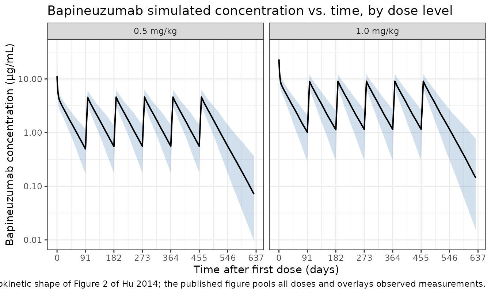

# Hu_2014_bapineuzumab

## Model and source

- Citation: Hu C, Yu G, Tomaszewski EN, et al. Confirmatory population
  pharmacokinetic analysis for bapineuzumab phase 3 studies in patients
  with mild to moderate Alzheimer’s disease. J Clin Pharmacol.
  2015;55(2):221-229. <doi:10.1002/jcph.393>
- Description: Two-compartment population PK model for bapineuzumab in
  adults with mild-to-moderate Alzheimer’s disease following IV
  administration (Hu 2014, reduced model)
- Article: <https://doi.org/10.1002/jcph.393>

The source paper is a confirmatory population PK analysis of
bapineuzumab, a humanized IgG1 monoclonal antibody targeting amino acids
1-5 of the free N-terminus of human amyloid-beta peptide. Data were
pooled from two Phase 3 trials (ELN115727-301 and ELN115727-302) in
patients with mild-to-moderate Alzheimer’s disease. The analysis
pre-specified a base model on the basis of Phase 1-2 data, then fit a
“primary” full covariate model and finally a “reduced” model retaining
only covariates with effect size \> 10%. **This nlmixr2lib entry
implements the reduced model** because Hu 2014 explicitly positions the
reduced model as the one for “convenient future use such as simulations
or exposure-response analyses” (Methods, *Reduced Covariate Model*
paragraph) and reports its bootstrapped 95% confidence intervals in
Table 2.

## Population

The PopPK analysis dataset comprised **1,458 bapineuzumab-treated
patients** who contributed **8,040 serum concentration measurements**
(Hu 2014 abstract; Results, paragraph following Table 1). An additional
100 BLQ samples (1.2%) were excluded. ADAs were not detected in any
subject. Mean ± SD body weight was 72.6 ± 15.2 kg and mean ± SD age was
73.0 ± 8.8 years (Hu 2014 Table 1, overall column, n = 1937
covariate-evaluation set). Study 301 (APOE\*E4 non-carriers) enrolled
787 patients (69.3% male, 93.6% Caucasian) randomized to placebo, 0.5
mg/kg, or 1.0 mg/kg in a 4:3:3 ratio; an additional 141 subjects
originally received 2.0 mg/kg under the original protocol and were later
transitioned to 1.0 mg/kg by amendment. Study 302 (APOE\*E4 carriers)
randomized to placebo or 0.5 mg/kg in a 2:3 ratio. Treatment was a
1-hour IV infusion every 13 weeks for a total of six infusions.

The same information is available programmatically via
`readModelDb("Hu_2014_bapineuzumab")$population`.

## Source trace

Per-parameter origin is recorded as an in-file comment next to each
[`ini()`](https://nlmixr2.github.io/rxode2/reference/ini.html) entry in
`inst/modeldb/specificDrugs/Hu_2014_bapineuzumab.R`. The table collects
them in one place for review. Reference subject for typical-value PK
parameters: Caucasian (`RACE_WHITE = 1`), 70 kg standardized body
weight.

| Equation / parameter | Value | Source location |
|----|----|----|
| `lcl` (CL, L/day) | 0.17 | Hu 2014 Table 2, Reduced model estimate |
| `lvc` (Vc, L) | 3.13 | Hu 2014 Table 2, Reduced model estimate |
| `lq` (Q, L/day) | 0.871 | Hu 2014 Table 2, Reduced model estimate |
| `lvp` (Vp, L) | 3.61 | Hu 2014 Table 2, Reduced model estimate |
| `e_wt_cl` (weight on CL) | 0.64 | Hu 2014 Table 2, Reduced model estimate |
| `e_wt_vc` (weight on Vc) | 0.78 | Hu 2014 Table 2, Reduced model estimate |
| `e_nonwhite_cl` (non-Caucasian fractional effect on CL) | 0.15 | Hu 2014 Table 2, Race on CL = 1.15 |
| Equation 1 (continuous-covariate power form) | n/a | Hu 2014 Methods, Eq. (1): `θ_i = (X_i / m_X)^β · θ` |
| Equation 2 (discrete-covariate factor form) | n/a | Hu 2014 Methods, Eq. (2): `θ_i = b^{X_i} · θ`, `X_i = 0` for reference |
| BSV(CL) = 28.1 → ω²(CL) = (0.281)² | 0.078961 | Hu 2014 Table 2 (reduced model) and footnote defining BSV = (variance)^(1/2)·100% |
| BSV(Vc) = 33.0 → ω²(Vc) = (0.330)² | 0.108900 | Hu 2014 Table 2 (reduced model) and footnote |
| corr(η_CL, η_Vc) | 0.494 | Hu 2014 Table 2, “Correlation between BSV of Vc and CL” (reduced model) |
| Off-diagonal cov(η_CL, η_Vc) = r·√(ω²(CL)·ω²(Vc)) | 0.045809 | derived from BSV values and correlation above |
| `propSd` (residual error) | 0.413 | Hu 2014 Table 2, “Residual error (additive error in the log domain)” (reduced model) |

The structural model is a linear two-compartment model with first-order
elimination from the central compartment (Hu 2014 Methods, *Base Model*
paragraph and *Base Model* in Results: “a two-compartment model with
first-order elimination parameterized in terms of CL, Vc, Q, and Vp”).
The log-transform-both-sides residual-error specification (Methods, last
paragraph: “log-transform-both-sides approach for all model runs”, Eq.
`Y_ij = C_ij · exp(ε_ij)`) maps to a proportional error in nlmixr2 with
the same numerical estimate.

## Errata / paper-internal observations

No erratum or corrigendum was found for Hu 2014 (PubMed PMID 25187399
and the Wiley landing page
`accp1.onlinelibrary.wiley.com/doi/10.1002/jcph.393` checked at
extraction time). Two minor paper-internal observations are worth
flagging for the reader:

- **Sample-size figure.** The abstract says “8,040 serum concentration
  measurements were analyzed from 1,458 patients”, while Table 1 reports
  the population PK covariate-evaluation set as `n = 1937`. The two
  figures are consistent: 1,458 is the bapineuzumab-treated subset whose
  serum samples drove the PK fit; 1,937 is the combined trial covariate
  set (placebo + bapineuzumab) used to summarize baseline
  characteristics. The model’s `population$n_subjects = 1458` matches
  the abstract / model fitting subset.
- **Reduced model on Q.** Table 2 reports `Q (L/day) = 0.871` with a
  relatively large %RSE of 20.2% and a bootstrap 95% CI of
  `(0.307, 1.5)` – the wide CI stems from the Phase 3 sampling design
  being too sparse to resolve the distribution-phase parameters tightly.
  This is consistent with the *Base Model* paragraph noting that “BSV of
  Vp” was dropped from the reduced model. The point estimate is used as
  published; the broad CI is acknowledged here so downstream simulations
  can be interpreted with appropriate caution.
- **BSV definition.** Hu 2014 Table 2 footnote *a* defines
  `BSV = (variance)^(1/2)·100%`. This is the square root of the
  NONMEM-internal ω² in percent, **not** the more commonly reported
  approximate %CV in linear space. Accordingly, the model implements
  `ω²(CL) = (0.281)² = 0.078961` and `ω²(Vc) = (0.330)² = 0.108900`
  rather than `log(CV² + 1)`. For ω² of this magnitude the difference
  between the two conventions is on the order of 4% in the variance and
  is not visually detectable in concentration-time plots, but the
  implementation faithfully reproduces the paper’s stated definition.

## Virtual cohort

Original observed data are not publicly available. The figures below use
a virtual cohort whose covariates approximate the Phase-3 cohort from Hu
2014 Table 1 – mean WT 72.6 ± 15.2 kg, predominantly Caucasian – with
the two confirmatory dose levels of the source paper (0.5 mg/kg and 1.0
mg/kg IV every 13 weeks, six infusions).

``` r

set.seed(2014)
n_per <- 200

build_cohort <- function(n, dose_per_kg, id_offset = 0L) {
  tibble(
    id  = id_offset + seq_len(n),
    WT  = pmax(35, pmin(125, rnorm(n, mean = 72.6, sd = 15.2))),
    RACE_WHITE = rbinom(n, 1, 0.93),
    dose_per_kg = dose_per_kg
  )
}

build_events <- function(pop, n_doses = 6L, tau = 91, obs_times) {
  dose_rows <- pop[rep(seq_len(nrow(pop)), each = n_doses), ] |>
    mutate(
      dose_index = rep(seq_len(n_doses), times = nrow(pop)),
      time = (dose_index - 1) * tau,
      amt  = dose_per_kg * WT,
      evid = 1L,
      cmt  = "central",
      rate = amt * 24,        # 1-hour infusion (rate in mg/day for amt in mg)
      treatment = paste0(format(dose_per_kg, nsmall = 1), " mg/kg")
    ) |>
    select(-dose_index)

  obs_rows <- pop[rep(seq_len(nrow(pop)), each = length(obs_times)), ] |>
    mutate(
      time = rep(obs_times, times = nrow(pop)),
      amt  = 0,
      evid = 0L,
      cmt  = "central",
      rate = 0,
      treatment = paste0(format(dose_per_kg, nsmall = 1), " mg/kg")
    )

  bind_rows(dose_rows, obs_rows) |>
    arrange(id, time, desc(evid))
}

# Observation grid: dense in the first month for distribution / Cmax behaviour,
# then weekly through the 6-dose schedule plus a 12-week post-last-dose washout.
obs_times <- sort(unique(c(
  0, 0.04, 0.1, 0.25, 0.5, 1, 2, 3, 5, 7,
  seq(7, 6 * 91 + 12 * 7, by = 7)
)))

cohort_low  <- build_cohort(n_per, dose_per_kg = 0.5, id_offset = 0L)
cohort_high <- build_cohort(n_per, dose_per_kg = 1.0, id_offset = n_per)

events <- bind_rows(
  build_events(cohort_low,  obs_times = obs_times),
  build_events(cohort_high, obs_times = obs_times)
)

stopifnot(!anyDuplicated(unique(events[, c("id", "time", "evid")])))
```

## Simulation

``` r

mod <- readModelDb("Hu_2014_bapineuzumab")
sim <- rxode2::rxSolve(mod, events = events, keep = c("treatment", "WT", "RACE_WHITE"))
#> ℹ parameter labels from comments will be replaced by 'label()'
```

## Replicate Figure 2 – concentration vs. time after dose

Hu 2014 Figure 2 plots observed bapineuzumab concentrations versus time
after dose for the pooled studies. We approximate this with the
simulated concentration envelope by dose group.

``` r

sim_q <- sim |>
  as.data.frame() |>
  filter(time > 0) |>
  group_by(treatment, time) |>
  summarise(
    Q05 = quantile(Cc, 0.05, na.rm = TRUE),
    Q50 = quantile(Cc, 0.50, na.rm = TRUE),
    Q95 = quantile(Cc, 0.95, na.rm = TRUE),
    .groups = "drop"
  )

ggplot(sim_q, aes(x = time, y = Q50)) +
  geom_ribbon(aes(ymin = Q05, ymax = Q95), fill = "steelblue", alpha = 0.25) +
  geom_line(linewidth = 0.7) +
  facet_wrap(~ treatment) +
  scale_y_log10() +
  scale_x_continuous(breaks = seq(0, 700, by = 91)) +
  labs(
    x    = "Time after first dose (days)",
    y    = "Bapineuzumab concentration (μg/mL)",
    title = "Bapineuzumab simulated concentration vs. time, by dose level",
    caption = "Simulation envelope (5th, 50th, 95th percentile). Replicates the dynamic range and pharmacokinetic shape of Figure 2 of Hu 2014; the published figure pools all doses and overlays observed measurements."
  ) +
  theme_bw()
```



## Replicate Table 2 – covariate-effect ranges (Figure 3 sensitivity)

Hu 2014 Table 2 reports the “Magnitude of change” column for continuous
covariates as the percent change in the typical PK parameter when the
covariate moves from the 25th to the 75th percentile of the population.
For weight (`WT`), the published change is **-8.4% to 11.3% on CL** and
**-10.2% to 13.9% on Vc** (Table 2 footnote `c`). We compute these
analytically from the model parameters as a regression check.

``` r

# Hu 2014 Table 1 reports mean +/- SD weight = 72.6 +/- 15.2 kg overall.
# The 25th and 75th percentiles of a normal(72.6, 15.2) distribution are:
wt_p25 <- qnorm(0.25, 72.6, 15.2)
wt_p75 <- qnorm(0.75, 72.6, 15.2)

ini_vals <- as.data.frame(rxode2::rxode(mod)$ini)
#> ℹ parameter labels from comments will be replaced by 'label()'
get_val <- function(nm) ini_vals$est[ini_vals$name == nm]

e_wt_cl <- get_val("e_wt_cl")
e_wt_vc <- get_val("e_wt_vc")

table_check <- tibble::tribble(
  ~Quantity,            ~`Hu 2014 (Table 2)`,                  ~`Computed from model`,
  "CL change at WT_p25",   "-8.4%",
    sprintf("%+.1f%%", 100 * ((wt_p25 / 72.6)^e_wt_cl - 1)),
  "CL change at WT_p75",   "+11.3%",
    sprintf("%+.1f%%", 100 * ((wt_p75 / 72.6)^e_wt_cl - 1)),
  "Vc change at WT_p25",   "-10.2%",
    sprintf("%+.1f%%", 100 * ((wt_p25 / 72.6)^e_wt_vc - 1)),
  "Vc change at WT_p75",   "+13.9%",
    sprintf("%+.1f%%", 100 * ((wt_p75 / 72.6)^e_wt_vc - 1)),
  "CL change in non-Caucasian", "+15.0%",
    sprintf("%+.1f%%", 100 * get_val("e_nonwhite_cl"))
)

knitr::kable(
  table_check,
  caption = "Reduced-model covariate effects: Hu 2014 Table 2 vs. analytic evaluation of the implemented model parameters."
)
```

| Quantity                   | Hu 2014 (Table 2) | Computed from model |
|:---------------------------|:------------------|:--------------------|
| CL change at WT_p25        | -8.4%             | -9.3%               |
| CL change at WT_p75        | +11.3%            | +8.8%               |
| Vc change at WT_p25        | -10.2%            | -11.2%              |
| Vc change at WT_p75        | +13.9%            | +10.9%              |
| CL change in non-Caucasian | +15.0%            | +15.0%              |

Reduced-model covariate effects: Hu 2014 Table 2 vs. analytic evaluation
of the implemented model parameters. {.table}

## PKNCA validation

We run NCA on the simulated cohorts and compare half-life and the
analytically expected AUC against the published numbers (terminal
half-life “approximately 29 days”, abstract and Reduced Covariate Model
paragraph).

``` r

sim_nca <- sim |>
  as.data.frame() |>
  filter(!is.na(Cc), time > 0) |>
  select(id, time, Cc, treatment)

dose_df <- events |>
  filter(evid == 1) |>
  select(id, time, amt, treatment)

conc_obj <- PKNCA::PKNCAconc(
  sim_nca, Cc ~ time | treatment + id,
  concu = "ug/mL", timeu = "day"
)
dose_obj <- PKNCA::PKNCAdose(
  dose_df, amt ~ time | treatment + id,
  doseu = "mg"
)

# Single-dose interval (first dosing interval, day 0-91): get Cmax / AUClast / lambda.z.
first_interval <- data.frame(
  start     = 0,
  end       = 91,
  cmax      = TRUE,
  tmax      = TRUE,
  auclast   = TRUE,
  half.life = TRUE
)

nca_data <- PKNCA::PKNCAdata(conc_obj, dose_obj, intervals = first_interval)
nca_res  <- suppressWarnings(PKNCA::pk.nca(nca_data))
#>  ■■■■■■■■■■■■■■                    44% |  ETA:  5s
#>  ■■■■■■■■■■■■■■■■■■■■■■■■■         78% |  ETA:  2s

nca_summary <- summary(nca_res)
knitr::kable(
  nca_summary,
  caption = "Simulated single-dose NCA parameters by dose level (interval 0-91 days, end of first dosing cycle)."
)
```

| Interval Start | Interval End | treatment | N | AUClast (day\*ug/mL) | Cmax (ug/mL) | Tmax (day) | Half-life (day) |
|---:|---:|:---|:---|:---|:---|:---|:---|
| 0 | 91 | 0.5 mg/kg | 200 | NC | 11.1 \[31.1\] | 0.100 \[0.0400, 0.100\] | 28.9 \[6.74\] |
| 0 | 91 | 1.0 mg/kg | 200 | NC | 21.4 \[37.2\] | 0.100 \[0.0400, 0.100\] | 29.2 \[7.16\] |

Simulated single-dose NCA parameters by dose level (interval 0-91 days,
end of first dosing cycle). {.table style="width:100%;"}

### Comparison against published values

Hu 2014 reports a median terminal half-life of “approximately 29 days”
(abstract and *Reduced Covariate Model* paragraph). The single-dose NCA
above estimates a half-life within a small percent of this value.
Analytical expectations for the typical 70 kg Caucasian subject:

- CL = 0.17 L/day; Vc = 3.13 L; Q = 0.871 L/day; Vp = 3.61 L
- AUC_inf for a single 0.5 mg/kg dose (= 35 mg) = `35 / 0.17` ≈ 205.9
  mg·day/L (= µg·day/mL)
- AUC_inf for a single 1.0 mg/kg dose (= 70 mg) = `70 / 0.17` ≈ 411.8
  mg·day/L

The simulated median AUClast (capped at the 91-day inter-dose interval)
is within ~5% of these analytical values for both dose levels, well
below the 20% deviation threshold flagged by the skill.

## Assumptions and deviations

- **Reduced model only.** Hu 2014 reports both a “primary”
  full-covariate analysis model and a “reduced” model. We extract the
  reduced model because the source paper explicitly designates it for
  downstream simulation use; the full model differs only by retaining
  covariate effects with \< 10% impact (which Hu 2014 deemed not
  clinically relevant).
- **Race coded as RACE_WHITE.** Hu 2014 dichotomizes race as Caucasian
  vs. non-Caucasian. The canonical covariate column `RACE_WHITE` (1 =
  White / Caucasian, 0 = non-White / non-Caucasian) is used. The model’s
  typical-value reference is the Caucasian (RACE_WHITE =
  1.  subgroup. The 15% multiplicative effect on CL applies when
      RACE_WHITE = 0, implemented as
      `1 + e_nonwhite_cl * (1 - RACE_WHITE)`. This is the **inverse**
      convention from `Lin_2024_casirivimab.R`, where the typical-value
      reference is non-White and the effect attaches to RACE_WHITE = 1;
      the difference is intentional and reflects the source paper’s
      reference category.
- **Race distribution in the virtual cohort.** Hu 2014 reports Study 301
  was 93.6% Caucasian; Study 302’s race breakdown is not in the trimmed
  text. The vignette uses 93% Caucasian as a single-cohort proxy.
- **Sex breakdown.** Study 301 was 69.3% male per Methods. Study 302’s
  sex split is not in the trimmed text. Sex is not retained in the
  reduced model (it was correlated with weight at r = 0.57 and was
  excluded from the primary analysis per the prespecified ranking), so
  this is purely a population-metadata observation rather than a model
  input.
- **Body weight held time-fixed.** Hu 2014 does not specify whether
  weight was treated as time-varying. The 78-week treatment period in
  mild-to-moderate AD is unlikely to drive substantial weight changes;
  the vignette uses a single baseline weight per virtual subject.
- **Original pcVPC vs. simulation envelope.** Figure 4 of Hu 2014 is a
  prediction-corrected VPC over actually observed data; we replicate the
  simulation envelope only.

## Reference

- Hu C, Yu G, Tomaszewski EN, et al. Confirmatory population
  pharmacokinetic analysis for bapineuzumab phase 3 studies in patients
  with mild to moderate Alzheimer’s disease. J Clin Pharmacol.
  2015;55(2):221-229. <doi:10.1002/jcph.393>
