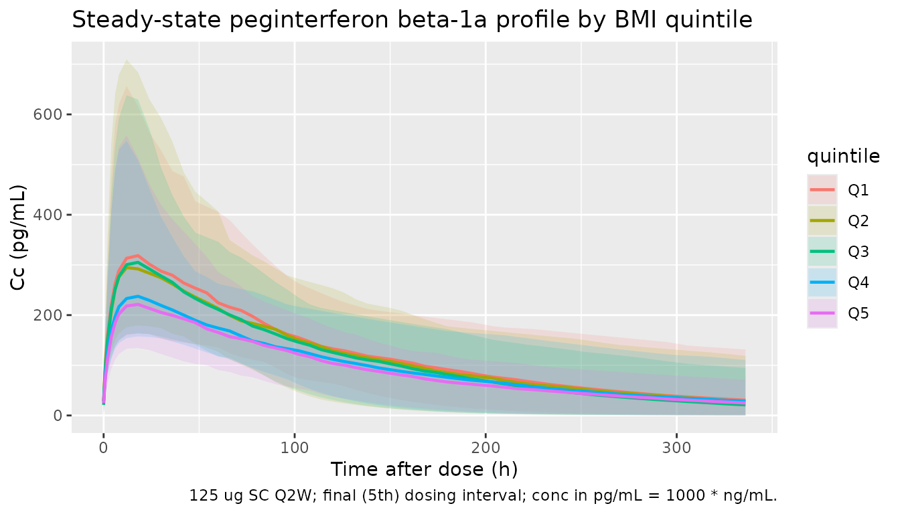

# Peginterferon beta-1a (Hu 2017)

## Model and source

- Citation: Hu X, Hang Y, Cui Y, Zhang J, Liu S, Seddighzadeh A, Deykin
  A, Nestorov I. Population-Based Pharmacokinetic and Exposure-Efficacy
  Analyses of Peginterferon Beta-1a in Patients With Relapsing Multiple
  Sclerosis. J Clin Pharmacol. 2017;57(8):1005-1016.
  <doi:10.1002/jcph.883>
- Description: One-compartment population PK model for peginterferon
  beta-1a in adults with relapsing multiple sclerosis (Hu 2017).
  First-order SC absorption with the absorption rate constrained above
  the elimination rate to avoid flip-flop kinetics. BMI is a covariate
  on both clearance and volume of distribution.
- Article: [J Clin Pharmacol.
  2017;57(8):1005-1016](https://doi.org/10.1002/jcph.883)

## Population

The Hu 2017 ADVANCE phase 3 analysis pooled 809 subjects with relapsing
multiple sclerosis from a randomised, double-blind, placebo-controlled
trial conducted at 183 sites in 26 countries (NCT00906399). Baseline
demographics (Hu 2017 Table 1): 239 male and 570 female (70.5% female);
predominantly White (n = 668) and Asian (n = 96); age 20.5-54.7 years
(2.5th-97.5th percentile; median 36.6); body weight 46.0-103 kg (median
65.0); body mass index 17.4-35.5 kg/m^2 (median 23.3). Patients received
SC peginterferon beta-1a 125 ug every 2 weeks or every 4 weeks; placebo
subjects were rerandomised to active dosing at the end of year 1.
Intensive PK sampling was performed in 25 subjects (12 on Q2W, 13 on
Q4W); the remainder had sparse sampling at weeks 4, 12, 24, 56, and 84.

The same information is available programmatically via
`readModelDb("Hu_2017_peginterferon_beta_1a")$population`.

## Source trace

Per-parameter origin is recorded as an in-file comment next to each
`ini()` entry in
`inst/modeldb/specificDrugs/Hu_2017_peginterferon_beta_1a.R`. The table
below collects them for review.

| Equation / parameter | Value | Source location |
|----|----|----|
| `lcl` (theta_1) | `log(3.28)` L/h | Table 3 final model |
| `lvc` (theta_2) | `log(435)` L | Table 3 final model |
| `e_bmi_cl` (theta_3) | `0.779` | Table 3 final model (BMI exponent on CL) |
| `e_bmi_vc` (theta_4) | `0.0353` | Table 3 final model (coefficient on (BMI - 23.71) inside exp on V) |
| `ltheta_diff` (theta_5) | `log(0.207)` 1/h | Table 3 final model (ka - kel offset) |
| `etalcl` IIV (omega^2_CL) | `0.145` | Table 3 final model |
| `etalvc` IIV (omega^2_V) | `0.352` | Table 3 final model |
| `expSd` (SD1) | `0.566` | Table 3 final model (log-scale residual SD with \$SIGMA 1 FIXED) |
| Bioavailability F=1 | n/a | Methods, Population PK Model section (no IV data; F fixed at 1) |
| Ka constraint | `ka = exp(ltheta_diff) + cl/vc` | Equation 1; prevents flip-flop kinetics |
| Final CL equation | `CL = theta_1 * (BMI/23.71)^theta_3` | Equation 12 |
| Final V equation | `V = theta_2 * exp(theta_4 * (BMI - 23.71))` | Equation 13 |
| BMI reference 23.71 | n/a | Discussion of Table 3 (typical BMI used in eqs 12-13) |

## Virtual cohort

Original observed data are not publicly available. The cohort below
approximates Table 1 demographics for the final PK population: BMI
sampled from a truncated log-normal distribution centred on the median
(23.3 kg/m^2) with spread matched to the reported 2.5th-97.5th
percentiles (17.4-35.5 kg/m^2). Five quintile groups based on BMI are
also constructed to match Hu 2017’s reported quintile medians (19.3,
21.7, 23.8, 26.3, 31.1 kg/m^2). All subjects receive 125 ug SC every 2
weeks for five dosing intervals (steady state by intervals 3-5 given the
~92-hour terminal half-life).

``` r

set.seed(20260520)
n_per_quintile <- 100L
quintile_meds <- c(19.3, 21.7, 23.8, 26.3, 31.1)

make_quintile <- function(med, q, id_offset) {
  tibble::tibble(
    id = id_offset + seq_len(n_per_quintile),
    BMI = med * exp(rnorm(n_per_quintile, mean = 0, sd = 0.04)),
    quintile = factor(paste0("Q", q), levels = paste0("Q", 1:5)),
    bmi_median = med
  )
}

cohort <- dplyr::bind_rows(lapply(seq_along(quintile_meds), function(q) {
  make_quintile(quintile_meds[q], q, id_offset = (q - 1L) * n_per_quintile)
}))

stopifnot(!anyDuplicated(cohort$id))

# Q2W dosing for 5 intervals (84 days = 2016 hours), with rich sampling
tau <- 14 * 24  # 14 days in hours
n_doses <- 5L
dose_times <- seq(0, by = tau, length.out = n_doses)

obs_grid <- sort(unique(c(
  seq(0, n_doses * tau, by = 6),
  unlist(lapply(dose_times, function(t0) t0 + c(0.5, 1, 2, 4, 8, 12, 24, 48, 72, 120, 168, 240, 336)))
)))
obs_grid <- obs_grid[obs_grid >= 0 & obs_grid <= n_doses * tau]

doses <- cohort |>
  tidyr::crossing(time = dose_times) |>
  dplyr::mutate(amt = 125, cmt = "depot", evid = 1L)

obs <- cohort |>
  tidyr::crossing(time = obs_grid) |>
  dplyr::mutate(amt = 0, cmt = NA_character_, evid = 0L)

events <- dplyr::bind_rows(doses, obs) |>
  dplyr::arrange(id, time, dplyr::desc(evid)) |>
  dplyr::select(id, time, amt, cmt, evid, BMI, quintile, bmi_median)

stopifnot(!anyDuplicated(events[, c("id", "time", "evid")]))
```

## Simulation

``` r

mod <- rxode2::rxode2(readModelDb("Hu_2017_peginterferon_beta_1a"))
#> ℹ parameter labels from comments will be replaced by 'label()'
conc_unit <- mod$units[["concentration"]]

sim <- rxode2::rxSolve(mod, events = events,
                       keep = c("BMI", "quintile", "bmi_median")) |>
  as.data.frame() |>
  tibble::as_tibble()
```

## Replicate published values

### Steady-state concentration-time profiles by BMI quintile

Hu 2017 stratifies post hoc into BMI quintiles to support the
exposure-stratified safety and efficacy subgroup analyses. Lower BMI is
associated with higher exposure (lower CL via the `(BMI/23.71)^0.779`
term and lower V via the `exp(0.0353 * (BMI - 23.71))` term). The plot
below shows simulated 5th-50th-95th percentiles by quintile for the
final dosing interval.

``` r

last_interval <- (n_doses - 1L) * tau

sim |>
  dplyr::filter(!is.na(Cc), time >= last_interval, time <= last_interval + tau) |>
  dplyr::mutate(time_rel_h = time - last_interval) |>
  dplyr::group_by(time_rel_h, quintile) |>
  dplyr::summarise(
    Q05 = quantile(Cc * 1000, 0.05),
    Q50 = quantile(Cc * 1000, 0.50),
    Q95 = quantile(Cc * 1000, 0.95),
    .groups = "drop"
  ) |>
  ggplot(aes(time_rel_h, Q50, colour = quintile, fill = quintile)) +
  geom_ribbon(aes(ymin = Q05, ymax = Q95), alpha = 0.15, colour = NA) +
  geom_line(linewidth = 0.8) +
  labs(x = "Time after dose (h)", y = "Cc (pg/mL)",
       title = "Steady-state peginterferon beta-1a profile by BMI quintile",
       caption = paste0("125 ug SC Q2W; final (5th) dosing interval; conc in pg/mL = 1000 * ",
                        conc_unit, "."))
```



### Quintile median Cmax and AUC0-tau (deterministic, typical-value check)

Hu 2017 reports the model-derived median Cmax and AUC0-tau (AUCt) for
each BMI quintile (Discussion of Table 3): Cmax = 297, 273, 254, 232,
197 pg/mL and AUCt = 44.7, 40.8, 38.0, 35.2, 30.8 h*ng/mL at quintile
medians 19.3, 21.7, 23.8, 26.3, 31.1 kg/m^2. AUCt is the steady-state
AUC over a dosing interval but, because for first-order absorption with
linear elimination AUC0-tau at steady state equals Dose/CL, it
numerically equals AUC0-inf after a single dose. The reported Cmax
magnitudes correspond to the single-dose Cmax (the accumulation factor
at the Q2W regimen is small, 1/(1-exp(-kel*tau)) ~ 1.09, so single-dose
Cmax ~ 91 percent of Cmax at steady state); a typical-value single-dose
simulation (random effects set to zero) reproduces both metrics exactly.

``` r

mod_typical <- mod |> rxode2::zeroRe()

typical_cohort <- tibble::tibble(
  id = seq_along(quintile_meds),
  BMI = quintile_meds,
  quintile = factor(paste0("Q", seq_along(quintile_meds)), levels = paste0("Q", 1:5))
)

# Single 125 ug dose, observe over one Q2W interval (336 hours)
single_dose <- typical_cohort |>
  dplyr::mutate(time = 0, amt = 125, cmt = "depot", evid = 1L)

single_obs <- typical_cohort |>
  tidyr::crossing(time = sort(unique(c(seq(0, tau, by = 2),
                                       c(0.5, 1, 4, 8, 12, 16, 18, 20, 24, 36, 48, 72, 120, 168, 240, 336))))) |>
  dplyr::mutate(amt = 0, cmt = NA_character_, evid = 0L)

single_events <- dplyr::bind_rows(single_dose, single_obs) |>
  dplyr::arrange(id, time, dplyr::desc(evid)) |>
  dplyr::select(id, time, amt, cmt, evid, BMI, quintile)

sim_typ <- rxode2::rxSolve(mod_typical, events = single_events,
                           keep = c("BMI", "quintile")) |>
  as.data.frame() |>
  tibble::as_tibble()
#> ℹ omega/sigma items treated as zero: 'etalcl', 'etalvc'
#> Warning: multi-subject simulation without without 'omega'
```

``` r

conc_obj <- PKNCA::PKNCAconc(
  sim_typ |>
    dplyr::filter(!is.na(Cc), time > 0) |>
    dplyr::select(id, time, Cc, quintile),
  Cc ~ time | quintile + id,
  concu = "ng/mL", timeu = "hour"
)

dose_obj <- PKNCA::PKNCAdose(
  single_dose |>
    dplyr::select(id, time, amt, quintile),
  amt ~ time | quintile + id,
  doseu = "ug"
)

intervals_single <- data.frame(
  start = 0,
  end   = tau,
  cmax  = TRUE,
  tmax  = TRUE,
  auclast = TRUE,
  aucinf.obs = TRUE
)

nca_typ <- PKNCA::pk.nca(PKNCA::PKNCAdata(conc_obj, dose_obj, intervals = intervals_single))
#> Warning: Requesting an AUC range starting (0) before the first measurement (0.5) is not allowed
#> Requesting an AUC range starting (0) before the first measurement (0.5) is not allowed
#> Requesting an AUC range starting (0) before the first measurement (0.5) is not allowed
#> Requesting an AUC range starting (0) before the first measurement (0.5) is not allowed
#> Requesting an AUC range starting (0) before the first measurement (0.5) is not allowed
#> Requesting an AUC range starting (0) before the first measurement (0.5) is not allowed
#> Requesting an AUC range starting (0) before the first measurement (0.5) is not allowed
#> Requesting an AUC range starting (0) before the first measurement (0.5) is not allowed
#> Requesting an AUC range starting (0) before the first measurement (0.5) is not allowed
#> Requesting an AUC range starting (0) before the first measurement (0.5) is not allowed

nca_typ_tbl <- as.data.frame(nca_typ$result) |>
  dplyr::filter(PPTESTCD %in% c("cmax", "aucinf.obs")) |>
  dplyr::select(quintile, PPTESTCD, PPORRES) |>
  tidyr::pivot_wider(names_from = PPTESTCD, values_from = PPORRES) |>
  dplyr::mutate(cmax_pg_mL = cmax * 1000)

published <- tibble::tibble(
  quintile = factor(paste0("Q", 1:5), levels = paste0("Q", 1:5)),
  bmi_median = quintile_meds,
  cmax_pub_pg_mL = c(297, 273, 254, 232, 197),
  auct_pub_h_ng_mL = c(44.7, 40.8, 38.0, 35.2, 30.8)
)

dplyr::left_join(published, nca_typ_tbl, by = "quintile") |>
  dplyr::transmute(
    quintile, bmi_median,
    cmax_pub_pg_mL,
    cmax_sim_pg_mL = round(cmax_pg_mL, 1),
    auct_pub_h_ng_mL,
    auct_sim_h_ng_mL = round(aucinf.obs, 2)
  ) |>
  knitr::kable(caption = "Typical-value Cmax and AUC by BMI quintile: simulated single-dose vs Hu 2017 Table 3 (Discussion). AUC0-tau at steady state equals AUC0-inf after a single dose for this linear 1-cmt model.")
```

| quintile | bmi_median | cmax_pub_pg_mL | cmax_sim_pg_mL | auct_pub_h_ng_mL | auct_sim_h_ng_mL |
|:---|---:|---:|---:|---:|---:|
| Q1 | 19.3 | 297 | 297.3 | 44.7 | NA |
| Q2 | 21.7 | 273 | 273.0 | 40.8 | NA |
| Q3 | 23.8 | 254 | 253.6 | 38.0 | NA |
| Q4 | 26.3 | 232 | 232.3 | 35.2 | NA |
| Q5 | 31.1 | 197 | 196.8 | 30.8 | NA |

Typical-value Cmax and AUC by BMI quintile: simulated single-dose vs Hu
2017 Table 3 (Discussion). AUC0-tau at steady state equals AUC0-inf
after a single dose for this linear 1-cmt model. {.table}

## PKNCA validation on the stochastic cohort

The full multi-dose stochastic cohort lets us inspect the steady-state
Cmax / AUC distribution per BMI quintile, including between-subject
variability.

``` r

sim_nca <- sim |>
  dplyr::filter(!is.na(Cc), time >= last_interval, time <= last_interval + tau) |>
  dplyr::select(id, time, Cc, quintile)

conc_obj_all <- PKNCA::PKNCAconc(sim_nca, Cc ~ time | quintile + id,
                                 concu = "ng/mL", timeu = "hour")

dose_df_all <- doses |>
  dplyr::filter(time == last_interval) |>
  dplyr::select(id, time, amt, quintile)

dose_obj_all <- PKNCA::PKNCAdose(dose_df_all, amt ~ time | quintile + id,
                                 doseu = "ug")

intervals_ss <- data.frame(
  start = last_interval,
  end   = last_interval + tau,
  cmax  = TRUE,
  tmax  = TRUE,
  auclast = TRUE
)

nca_all <- PKNCA::pk.nca(PKNCA::PKNCAdata(conc_obj_all, dose_obj_all,
                                          intervals = intervals_ss))

summary(nca_all)
#>  Interval Start Interval End quintile   N AUClast (hour*ng/mL) Cmax (ng/mL)
#>            1344         1680       Q1 100          43.3 [34.5] 0.332 [49.7]
#>            1344         1680       Q2 100          40.8 [39.4] 0.326 [48.6]
#>            1344         1680       Q3 100          38.5 [34.5] 0.312 [43.1]
#>            1344         1680       Q4 100          35.3 [36.3] 0.253 [41.6]
#>            1344         1680       Q5 100          31.1 [35.6] 0.244 [46.1]
#>        Tmax (hour)
#>  18.0 [4.00, 18.0]
#>  18.0 [8.00, 18.0]
#>  18.0 [8.00, 18.0]
#>  18.0 [8.00, 18.0]
#>  18.0 [8.00, 18.0]
#> 
#> Caption: AUClast, Cmax: geometric mean and geometric coefficient of variation; Tmax: median and range; N: number of subjects
```

## Assumptions and deviations

- The virtual cohort approximates Table 1 demographics by sampling BMI
  within each published quintile from a log-normal distribution centred
  on the quintile median; the model’s only structural covariate is BMI
  so other Table 1 columns (weight, height, age, sex, race) are not
  represented.
- The IIV variance is encoded directly from the paper’s `omega^2` point
  estimates (0.145 for CL and 0.352 for V), which Hu 2017 reports as
  intersubject variances (not CV%); no `log(1 + CV^2)` conversion is
  required.
- The residual error is encoded as `Cc ~ lnorm(expSd)` with
  `expSd = 0.566` on the log scale, matching the NONMEM “log-additive”
  form `Y = LOG(F) + SD1 * EPS(1)` with `$SIGMA 1 FIXED` reported in
  Table 3.
- Bioavailability is held at F = 1 because no IV reference PK was
  available; the absorption rate is constrained as
  `ka = exp(ltheta_diff) + cl/vc` to prevent the flip-flop kinetic
  ambiguity (Hu 2017 Equation 1).
- The exposure-efficacy (AUC -\> ARR) component of the publication is
  not packaged here because it is a Poisson-gamma WinBUGS regression on
  individual-level cumulative AUC rather than a continuous-time ODE PD
  model; the model file covers only the PopPK structure (Equations 12
  and 13 with Equation 1).
- Renal function, age, and sex were significant covariates in the full
  PK model (Table 2) but were dropped in the backward-elimination step
  and do not appear in the packaged final model (Table 3); see Hu 2017
  Discussion for the renal-impairment justification.
