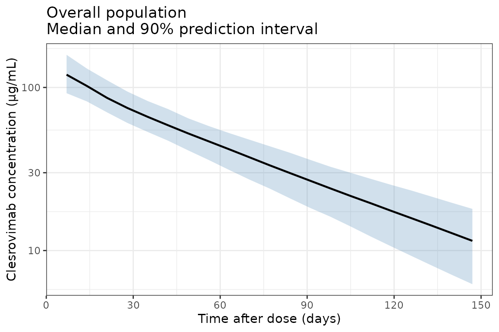
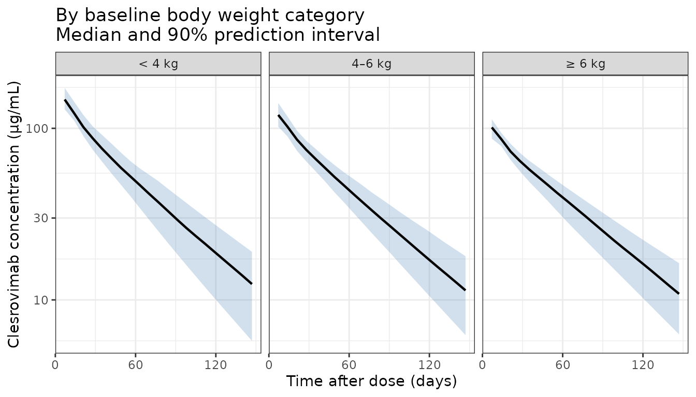

# Hu_2026_clesrovimab

``` r
library(nlmixr2lib)
library(dplyr)
#> 
#> Attaching package: 'dplyr'
#> The following objects are masked from 'package:stats':
#> 
#>     filter, lag
#> The following objects are masked from 'package:base':
#> 
#>     intersect, setdiff, setequal, union
library(ggplot2)
```

## Clesrovimab population PK simulation

Replicate Figure 2 from Hu et al. (2026): a prediction-corrected visual
predictive check (VPC) showing clesrovimab serum concentrations over 150
days after a single 105 mg intramuscular dose, presented as an overall
population panel and a panel stratified by baseline body weight
category.

Because the original study data (5,850 PK samples from 2,942 infants
across three trials) are not publicly available, this vignette simulates
a virtual infant population using covariate distributions that
approximate the study demographics (median age 3.02 months, median
weight 5.4 kg, preterm and full-term infants). Body weight trajectories
over follow-up are generated using WHO weight-for-age growth standards
(combined sex, 0–10 months).

### WHO weight-for-age growth curve helper

WHO weight-for-age LMS parameters for combined sex, 0–10 months (WHO
Multicentre Growth Reference Study Group, 2006). The LMS formula is:
weight = M × (1 + L × S × z)^(1/L)

``` r
who_lms <- data.frame(
  age_mo = 0:10,
  L = c(0.3487, 0.2297, 0.1970, 0.1738, 0.1553, 0.1395,
        0.1257, 0.1125, 0.0998, 0.0875, 0.0756),
  M = c(3.3464, 4.4709, 5.5675, 6.3762, 7.0023, 7.5105,
        7.9340, 8.2970, 8.6151, 8.9014, 9.1649),
  S = c(0.14602, 0.13395, 0.12385, 0.11876, 0.11535, 0.11254,
        0.11056, 0.10947, 0.10868, 0.10814, 0.10765)
)

# Returns weight (kg) for a given age (months) and individual z-score
# using linear interpolation of LMS parameters between whole-month values
who_weight <- function(age_mo, z) {
  age_mo <- pmax(0, pmin(age_mo, 10))
  L <- approx(who_lms$age_mo, who_lms$L, xout = age_mo)$y
  M <- approx(who_lms$age_mo, who_lms$M, xout = age_mo)$y
  S <- approx(who_lms$age_mo, who_lms$S, xout = age_mo)$y
  M * (1 + L * S * z)^(1 / L)
}
```

### Virtual population generation

Sample N = 500 virtual infants with covariate distributions
approximating the study population.

``` r
set.seed(1654) # clesrovimab MK-1654
n_subj <- 500

# Gestational age: 85% full-term (37-42 wk), 15% preterm (32-37 wk)
is_preterm <- runif(n_subj) < 0.15
GA <- ifelse(is_preterm, runif(n_subj, 32, 37), runif(n_subj, 37, 42))

# Postnatal age at dosing (months); study enrolled infants <= 3 months
PNA_0 <- runif(n_subj, 0, 3)

# Individual weight z-score (fixed percentile across follow-up)
# Truncated to ±2 SD to avoid extreme weights
wt_z <- pmax(-2, pmin(2, rnorm(n_subj, 0, 1)))

# Race: approximate study demographics
race_draw <- runif(n_subj)
ASIAN       <- as.integer(race_draw < 0.15)
BLACK       <- as.integer(race_draw >= 0.15 & race_draw < 0.35)
MULTIRACIAL <- as.integer(race_draw >= 0.35 & race_draw < 0.40)
# White/Other: race_draw >= 0.40 (reference; all indicators = 0)

pop <- data.frame(
  ID          = seq_len(n_subj),
  GA          = GA,
  PNA_0       = PNA_0,
  wt_z        = wt_z,
  ASIAN       = ASIAN,
  BLACK       = BLACK,
  MULTIRACIAL = MULTIRACIAL
)

# Baseline weight for stratification
pop$WT_base <- who_weight(pop$PNA_0, pop$wt_z)
pop$wt_group <- cut(
  pop$WT_base,
  breaks = c(0, 4, 6, Inf),
  labels = c("< 4 kg", "4\u20136 kg", "\u2265 6 kg"),
  right  = FALSE
)
```

### Dataset construction with time-varying covariates

Observation times every 7 days from 0 to 150 days, plus the dose event
at time 0.

``` r
obs_times_day <- seq(0, 150, by = 7)

# Dose records (one per subject at time 0)
d_dose <- pop |>
  mutate(
    TIME = 0,
    AMT  = 105,    # mg, single IM dose
    EVID = 1,
    CMT  = "depot",
    DV   = NA
  )

# Observation records with time-varying WT and PNA
d_obs <- pop[rep(seq_len(n_subj), each = length(obs_times_day)), ] |>
  mutate(
    TIME = rep(obs_times_day, times = n_subj),
    AMT  = 0,
    EVID = 0,
    CMT  = "central",
    DV   = NA,
    PNA  = PNA_0 + TIME / 30.44,      # postnatal age in months
    WT   = who_weight(PNA, wt_z)       # time-varying weight from WHO curves
  )

# Dose records also need WT and PNA at time 0
d_dose <- d_dose |>
  mutate(
    PNA = PNA_0,
    WT  = who_weight(PNA_0, wt_z)
  )

d_sim <- bind_rows(d_dose, d_obs) |>
  arrange(ID, TIME, desc(EVID)) |>
  select(ID, TIME, AMT, EVID, CMT, DV, WT, PNA, GA, ASIAN, BLACK, MULTIRACIAL,
         wt_group, wt_z)
```

### Load model and simulate

``` r
mod <- readModelDb("Hu_2026_clesrovimab")

# Simulate: rxSolve uses the N=500 subjects' IIV from the model ini() block.
# Setting seed for reproducibility.
set.seed(2026)
sim_out <- rxode2::rxSolve(mod, events = d_sim)
#> ℹ parameter labels from comments will be replaced by 'label()'
```

### Summarise simulation results

``` r
# Attach baseline weight group to simulation output
wt_grp_map <- d_sim |>
  filter(EVID == 0, TIME == 0) |>
  select(ID, wt_group) |>
  distinct()

sim_plot <- sim_out |>
  as.data.frame() |>
  filter(time > 0) |>                 # exclude pre-dose time point
  left_join(wt_grp_map, by = c("id" = "ID"))

# Overall population quantiles
d_overall <- sim_plot |>
  group_by(time) |>
  summarise(
    Q05 = quantile(Cc, 0.05, na.rm = TRUE),
    Q50 = quantile(Cc, 0.50, na.rm = TRUE),
    Q95 = quantile(Cc, 0.95, na.rm = TRUE),
    .groups = "drop"
  ) |>
  mutate(panel = "Overall")

# Weight-stratified quantiles
d_strat <- sim_plot |>
  group_by(time, wt_group) |>
  summarise(
    Q05 = quantile(Cc, 0.05, na.rm = TRUE),
    Q50 = quantile(Cc, 0.50, na.rm = TRUE),
    Q95 = quantile(Cc, 0.95, na.rm = TRUE),
    .groups = "drop"
  ) |>
  rename(panel = wt_group)
```

### Figure 2 — Overall population VPC

``` r
ggplot(d_overall, aes(x = time, y = Q50)) +
  geom_ribbon(aes(ymin = Q05, ymax = Q95), fill = "steelblue", alpha = 0.25) +
  geom_line(linewidth = 0.8) +
  scale_y_log10(
    labels = scales::label_number(drop0trailing = TRUE)
  ) +
  scale_x_continuous(breaks = seq(0, 150, by = 30)) +
  labs(
    x    = "Time after dose (days)",
    y    = "Clesrovimab concentration (\u03bcg/mL)",
    title = "Overall population\nMedian and 90% prediction interval"
  ) +
  theme_bw()
```



### Figure 2 — Stratified by baseline body weight

``` r
ggplot(d_strat, aes(x = time, y = Q50)) +
  geom_ribbon(aes(ymin = Q05, ymax = Q95), fill = "steelblue", alpha = 0.25) +
  geom_line(linewidth = 0.8) +
  facet_wrap(~panel, nrow = 1) +
  scale_y_log10(
    labels = scales::label_number(drop0trailing = TRUE)
  ) +
  scale_x_continuous(breaks = seq(0, 150, by = 60)) +
  labs(
    x    = "Time after dose (days)",
    y    = "Clesrovimab concentration (\u03bcg/mL)",
    title = "By baseline body weight category\nMedian and 90% prediction interval"
  ) +
  theme_bw()
```



### Notes on the simulation

- **Virtual population**: 500 infants with GA, postnatal age, weight
  percentile, and race sampled to approximate the three-study population
  (MK-1654-002, CLEVER, SMART).
- **Time-varying weight**: Individual weight trajectories are generated
  using WHO weight-for-age growth standards (LMS method), with each
  subject assigned a fixed z-score (growth percentile) at enrollment.
- **IIV**: Simulated using the published omega^2 values for Ka (23.5%
  CV), CL/F (14.4% CV), and Vc/F (8.12% CV; note high shrinkage of 71.9%
  in the original analysis). Q/F and Vp/F had no IIV in the final model.
- **Residual error**: Combined proportional (14.3%) and additive (0.231
  µg/mL).
- The prediction intervals reflect both inter-individual variability and
  residual error from the final population PK model.

### Reference

- Hu Z, Hellmann F, Zang X, et al. Population Pharmacokinetics of
  Clesrovimab in Preterm and Full-Term Infants. Clin Pharmacol Ther.
  2026;119(4):1036-1046. <doi:10.1002/cpt.70199>
