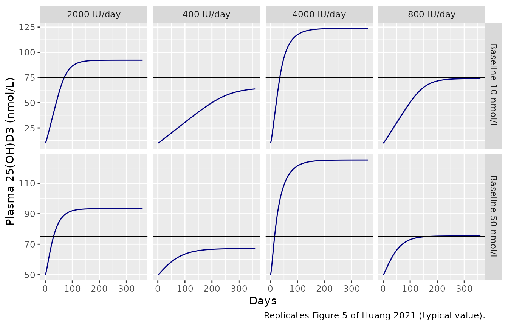
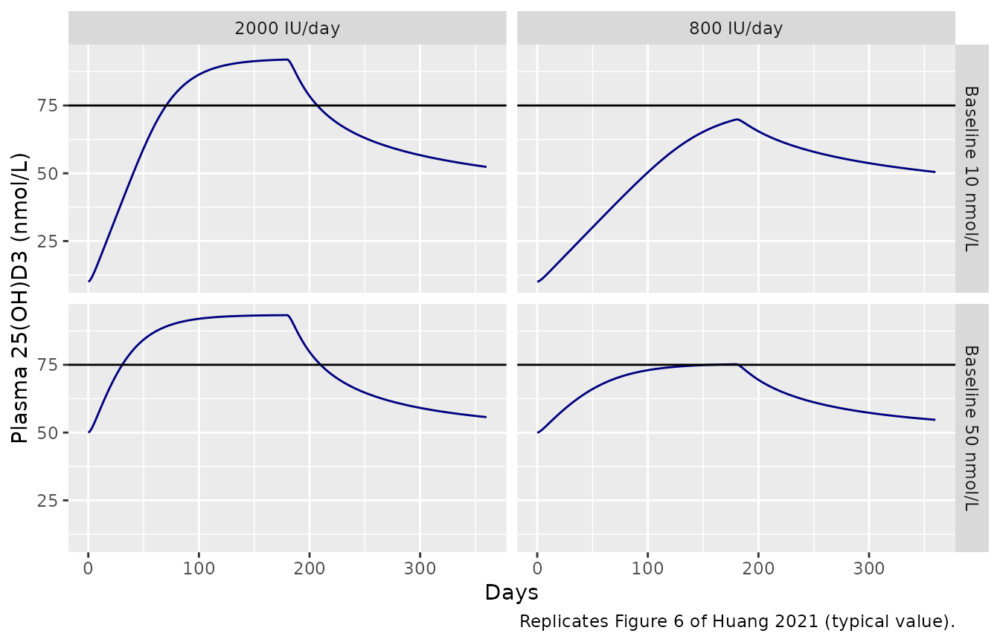
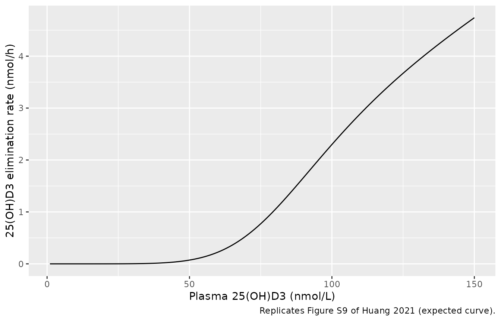
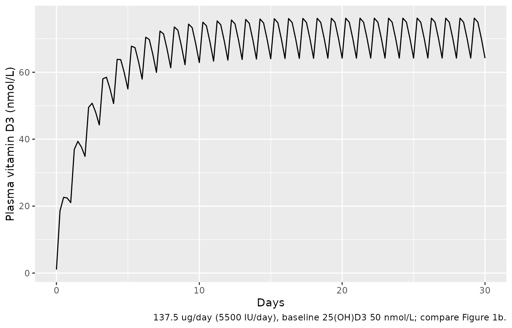

# Vitamin D3 / 25-hydroxyvitamin D PBPK in adults (Huang 2021)

``` r

# Cholecalciferol molar mass used by the authors' deposited script
# (Final_model.R: DOSE/384.64*1000 converts ug to nmol). 1 ug = 40 IU.
mw_d3 <- 384.64
ug_to_nmol <- function(ug) ug * 1000 / mw_d3

# The system is stiff (blood flows turn over in seconds, 25(OH)D3 in weeks)
# and a year of daily doses exhausts rxode2's default step budget, which
# makes the solve stop with "could not solve the system". A large `maxsteps`
# is therefore load-bearing.
SOLVE <- function(mod, ev, ...) {
  out <- rxode2::rxSolve(mod, ev, maxsteps = 1e6, returnType = "data.frame", ...)
  stopifnot(!anyNA(out$Cc_25d3), !anyNA(out$Cc))
  out
}

mod <- rxode2::rxode(readModelDb("Huang_2021_cholecalciferol_pbpk"))

# Daily oral vitamin D3 for `days` days, observed daily (and at extra times).
daily_events <- function(dose_ug, days, d25_bl, regi_qd = 1, obs_days = seq(0, days)) {
  ev <- rxode2::et(amt = ug_to_nmol(dose_ug), cmt = "depot", ii = 24, addl = days - 1) |>
    rxode2::et(sort(unique(obs_days)) * 24)
  ev <- as.data.frame(ev)
  ev$D25OH_BL <- d25_bl
  ev$REGI_QD <- regi_qd
  ev
}
```

## Model and source

Huang and You (2021) built a minimal physiologically based
pharmacokinetic (PBPK) model of oral vitamin D3 (cholecalciferol) and
its circulating metabolite 25-hydroxyvitamin D3 (25(OH)D3). They fitted
it to arm-mean plasma concentrations collated from published trials. The
final model, Run009b (paper Figure 3, supplement “Final Model” section),
has these parts:

- Vitamin D3 is absorbed first-order from a gastrointestinal depot into
  the liver. It then distributes perfusion-limited between venous blood,
  arterial blood, liver and a lumped rest of body.
- Vitamin D3 is cleared from the liver at a rate that depends on the
  regimen: `SCLH` after a single dose and `MCLH` under repeated daily
  dosing.
- One third of the cleared vitamin D3 becomes 25(OH)D3.
- 25(OH)D3 has its own four compartments. It leaves the liver through a
  sigmoidal clearance, `CLmax * C^gamma / (C50^gamma + C^gamma)`, so its
  clearance is close to zero below about 50 nmol/L and saturates above
  C50.
- A constant endogenous vitamin D3 input `ENDOG` is back-calculated from
  the arm’s baseline plasma 25(OH)D3 (`D25BASE`). Every compartment
  therefore starts at the pre-dose steady state.

The supplement (`PSP4-10-723-s001.zip`) holds the authors’ deSolve
implementation `Final_model.R` and the MCMC chain `MCMC-Run009b.RDS`.
The model file follows the supplement’s printed equations. It was
checked against that script, which settles the two typographical slips
listed under Errata below.

- Citation: Huang Z, You T. Personalise vitamin D3 using physiologically
  based pharmacokinetic modelling. *CPT Pharmacometr Syst Pharmacol*.
  2021;10(7):723-734. <doi:10.1002/psp4.12640>
- Model: `Huang_2021_cholecalciferol_pbpk`

## Population

    #> List of 9
    #>  $ species       : chr "human"
    #>  $ n_subjects    : chr "307 (vitamin D3 PK) and 6484 (25(OH)D3 PK), arm means only"
    #>  $ n_studies     : chr "155 treatment arms from published trials, January 1970 to January 2019"
    #>  $ age_range     : chr "18 years and over (most vitamin D3 PK subjects 30-50 years)"
    #>  $ sex_female_pct: logi NA
    #>  $ disease_state : chr "adults without disease or conditions known to alter vitamin D PK; normal renal function"
    #>  $ dose_range    : chr "oral vitamin D3 single doses 70-50000 ug; repeated daily doses 10-1250 ug/day; 25(OH)D3 7 and 20 ug/day"
    #>  $ regions       : chr "all continents except Antarctica; mostly USA, the Netherlands, UK and Canada"
    #>  $ notes         : chr "Huang 2021 Results 'PK data collection': vitamin D3 PK from 307 subjects in 13 arms of 6 trials (Table S2); 25("| __truncated__

The model was fitted to **arm means**, not to individuals. The vitamin
D3 PK set was 307 subjects in 13 arms of 6 trials (Table S2). The
25(OH)D3 set was 451 mean concentrations from 6484 subjects in 126 arms
(Tables S3, S4). All subjects were adults (18 years or older) without
conditions known to alter vitamin D PK. The training set was all of the
vitamin D3 PK plus the 43 25(OH)D3 arms dosed 10 or 100 ug/day. The test
set was 83 repeated-dose arms (12.5 to 1250 ug/day), 16 high single-dose
arms and two 25(OH)D3 dosing arms. The paper estimated no
interindividual variability and reported no residual error. The model is
therefore a typical-value (arm-level) model, and each simulated
“subject” below is an arm defined by its baseline 25(OH)D3.

## Source trace

| Element | Value | Source |
|----|----|----|
| `lka` | log(0.19) h^-1 | Table 1, Ka posterior mean |
| `lkp_liver` | log(1), fixed | Table 1, Kpl “1 (fixed)” |
| `lkp_other` | log(0.09) | Table 1, Kprb posterior mean |
| `lsclh` | log(0.32) L/h | Table 1, SCLH posterior mean |
| `lmclh` | log(0.21) L/h | Table 1, MCLH posterior mean |
| `fm_25d3` | 1/3, fixed | Table 1 Fm “0.33 (fixed)”; the supplement ODEs use exactly 1/3 and 3 |
| `lkp_liver_25d3` | log(1), fixed | Supplement ODEs carry Kp25l; value 1 in `Final_model.R` |
| `lkp_other_25d3` | log(0.54) | Table 1, Kp25rb posterior mean |
| `lc50` | log(86.3) nmol/L | Table 1, C50 posterior mean |
| `lhill` | log(5.64) | Table 1, gamma posterior mean |
| `lclmax` | log(0.033) L/h | Table 1, CLmax posterior mean |
| Qco, Ql, Qrb | 312, 70.824, 241.176 L/h | Table S6 (models without adipose) |
| Vven, Vl, Vrb, Vart | 4.2, 1.8, 62.6, 1.4 L | Table S6 |
| `endog` | CLmax C^(g/(C50)g+C^g) x D25BASE x 3 | Supplement Final Model, first equation |
| Vitamin D3 ODEs | depot, venous, liver, other, arterial | Supplement Final Model, ODEs 1-5 |
| 25(OH)D3 ODEs | four compartments | Supplement Final Model, ODEs 6-9 |
| `clh` switch | SCLH single / MCLH repeated | Supplement: “For single dose: CLH = SCLH. For repeated dose: CLH = MCLH.” |
| Initial conditions | pre-dose steady state | Supplement “Initial conditions”; `Final_model.R` section 1.B |
| Dose conversion | ug x 1000 / 384.64 = nmol | `Final_model.R` section 1.B |

The Table 1 posterior means are the arithmetic means of
[`exp()`](https://rdrr.io/r/base/Log.html) over the deposited MCMC
chain. Recomputing them from `MCMC-Run009b.RDS` gives Kp25rb 0.542 (SD
0.145), C50 86.33 (4.23), gamma 5.636 (1.28) and CLmax 0.03277
(0.00231). These round to the printed 0.54 (0.15), 86.3 (4.23), 5.64
(1.28) and 0.033 (0.0023).

## Validation 1: the untreated system holds at baseline

`ENDOG` and the initial conditions are built so that production exactly
balances clearance at `D25BASE`. With no dose, every concentration must
stay flat. This is an exact test of the whole ODE transcription: it
catches a missing term, a wrong factor of 3, or a mis-scaled initial
condition. Both sides come from the same deterministic solve, so the
bound is tight.

``` r

hold <- expand.grid(d25 = c(10, 30, 50, 86.3, 150), regi = c(0, 1)) |>
  rowwise() |>
  do({
    ev <- data.frame(time = c(0, 24 * c(30, 180, 360)), evid = 0, amt = 0,
                     cmt = "venous_25d3", D25OH_BL = .$d25, REGI_QD = .$regi)
    s <- SOLVE(mod, ev)
    data.frame(d25 = .$d25, regi = .$regi,
               max_rel_dev_25d3 = max(abs(s$Cc_25d3 / .$d25 - 1)),
               max_rel_dev_d3 = max(abs(s$Cc / s$Cc[1] - 1)))
  }) |>
  ungroup()
knitr::kable(hold, digits = 12)
```

|   d25 | regi | max_rel_dev_25d3 | max_rel_dev_d3 |
|------:|-----:|-----------------:|---------------:|
|  10.0 |    0 |            0e+00 |              0 |
|  30.0 |    0 |            3e-12 |              0 |
|  50.0 |    0 |            0e+00 |              0 |
|  86.3 |    0 |            0e+00 |              0 |
| 150.0 |    0 |            1e-12 |              0 |
|  10.0 |    1 |            0e+00 |              0 |
|  30.0 |    1 |            2e-12 |              0 |
|  50.0 |    1 |            1e-12 |              0 |
|  86.3 |    1 |            0e+00 |              0 |
| 150.0 |    1 |            0e+00 |              0 |

``` r

stopifnot(all(hold$max_rel_dev_25d3 < 1e-6), all(hold$max_rel_dev_d3 < 1e-6))
```

## Validation 2: agreement with the authors’ deposited code

The values below were produced by running the authors’ `Final_model.R`
deSolve function (`VitaminD_PBPK`, `daspk` solver) with the Table 1
posterior means substituted into its `param` vector. The substituted
values are Kprb 0.09, MCLH 0.21, ka 0.19, Kp25rb 0.54, C50 86.3, gamma
5.64 and CLmax 0.033. The dosing is repeated daily and the output is
venous 25(OH)D3 (`CP`) and venous vitamin D3 (`A_ven / Vven`). The
rxode2 model must reproduce them up to numerical-integration error.

``` r

ref <- tribble(
  ~d25, ~dose, ~day, ~cp_25d3, ~cp_d3,
  10, 20, 30, 21.6462, 9.19103,
  10, 20, 90, 46.4839, 9.19112,
  10, 20, 180, 69.8667, 9.19112,
  10, 20, 360, 73.9635, 9.19112,
  50, 20, 30, 60.4574, 10.22830,
  50, 20, 90, 72.2143, 10.22839,
  50, 20, 180, 75.2146, 10.22839,
  50, 20, 360, 75.4492, 10.22839,
  50, 100, 30, 94.6715, 46.99237,
  50, 100, 90, 120.1611, 46.99281,
  50, 100, 180, 124.8355, 46.99283,
  50, 100, 360, 125.2456, 46.99283,
  30, 1250, 15, 320.9550, 572.70833,
  30, 1250, 30, 582.8653, 574.47396,
  30, 1250, 60, 926.6171, 574.47937,
  30, 1250, 120, 1228.3386, 574.47937
)
sim_ref <- ref |>
  group_by(d25, dose) |>
  group_modify(function(g, k) {
    days <- max(g$day)
    s <- SOLVE(mod, daily_events(k$dose, days + 1, k$d25, obs_days = g$day))
    s <- s[!duplicated(s$time), ]
    tibble(day = g$day,
           rx_25d3 = s$Cc_25d3[match(g$day * 24, s$time)],
           rx_d3 = s$Cc[match(g$day * 24, s$time)])
  }) |>
  ungroup() |>
  inner_join(ref, by = c("d25", "dose", "day")) |>
  mutate(rel_25d3 = rx_25d3 / cp_25d3 - 1, rel_d3 = rx_d3 / cp_d3 - 1)
sim_ref |>
  select(d25, dose, day, cp_25d3, rx_25d3, rel_25d3, cp_d3, rx_d3, rel_d3) |>
  rename("Baseline 25(OH)D3 (nmol/L)" = d25, "Dose (ug/day)" = dose, "Day" = day,
         "25(OH)D3, script" = cp_25d3, "25(OH)D3, rxode2" = rx_25d3,
         "Rel. diff 25(OH)D3" = rel_25d3, "D3, script" = cp_d3,
         "D3, rxode2" = rx_d3, "Rel. diff D3" = rel_d3) |>
  knitr::kable(digits = c(1, 0, 0, 3, 3, 6, 4, 4, 6))
```

| Baseline 25(OH)D3 (nmol/L) | Dose (ug/day) | Day | 25(OH)D3, script | 25(OH)D3, rxode2 | Rel. diff 25(OH)D3 | D3, script | D3, rxode2 | Rel. diff D3 |
|---:|---:|---:|---:|---:|---:|---:|---:|---:|
| 10 | 20 | 30 | 21.646 | 21.646 | 2e-06 | 9.1910 | 9.1910 | -6e-06 |
| 10 | 20 | 90 | 46.484 | 46.484 | -1e-06 | 9.1911 | 9.1911 | -6e-06 |
| 10 | 20 | 180 | 69.867 | 69.867 | 1e-06 | 9.1911 | 9.1911 | -6e-06 |
| 10 | 20 | 360 | 73.964 | 73.964 | 0e+00 | 9.1911 | 9.1911 | -6e-06 |
| 30 | 1250 | 15 | 320.955 | 320.955 | 1e-06 | 572.7083 | 572.7050 | -6e-06 |
| 30 | 1250 | 30 | 582.865 | 582.865 | 0e+00 | 574.4740 | 574.4709 | -5e-06 |
| 30 | 1250 | 60 | 926.617 | 926.617 | 0e+00 | 574.4794 | 574.4763 | -5e-06 |
| 30 | 1250 | 120 | 1228.339 | 1228.339 | 0e+00 | 574.4794 | 574.4763 | -5e-06 |
| 50 | 20 | 30 | 60.457 | 60.457 | 1e-06 | 10.2283 | 10.2283 | 1e-06 |
| 50 | 20 | 90 | 72.214 | 72.214 | 1e-06 | 10.2284 | 10.2284 | 1e-06 |
| 50 | 20 | 180 | 75.215 | 75.215 | 1e-06 | 10.2284 | 10.2284 | 1e-06 |
| 50 | 20 | 360 | 75.449 | 75.449 | -1e-06 | 10.2284 | 10.2284 | 1e-06 |
| 50 | 100 | 30 | 94.671 | 94.672 | 0e+00 | 46.9924 | 46.9921 | -5e-06 |
| 50 | 100 | 90 | 120.161 | 120.161 | 0e+00 | 46.9928 | 46.9926 | -5e-06 |
| 50 | 100 | 180 | 124.836 | 124.835 | 0e+00 | 46.9928 | 46.9926 | -6e-06 |
| 50 | 100 | 360 | 125.246 | 125.246 | 0e+00 | 46.9928 | 46.9926 | -6e-06 |

``` r

# Same parameters on both sides: the only difference is solver error (daspk
# atol = rtol = 1e-4 in the script), so a tight bound is correct.
stopifnot(all(abs(sim_ref$rel_25d3) < 1e-3), all(abs(sim_ref$rel_d3) < 1e-3))
```

## Validation 3: Figure 5 (daily dosing for 360 days)

Figure 5 simulates two individuals with baseline 25(OH)D3 of 10 and 50
nmol/L. Each gets 10, 20, 50 or 100 ug/day (400 to 4000 IU/day) for 360
days. The solid line is the expected value over the posterior and the
band is the 5-95% interval. The maintainers digitised the day-360
plateau of each solid line from the figure and compare it with the
typical-value simulation.

``` r

fig5 <- expand.grid(d25 = c(10, 50), dose = c(10, 20, 50, 100)) |>
  rowwise() |>
  do({
    s <- SOLVE(mod, daily_events(.$dose, 360, .$d25))
    s <- s[!duplicated(s$time), ]
    data.frame(d25 = .$d25, dose = .$dose, day = s$time / 24, c25 = s$Cc_25d3)
  }) |>
  ungroup()

ggplot(fig5, aes(day, c25)) +
  geom_line(colour = "navy") +
  geom_hline(yintercept = 75) +
  facet_grid(paste("Baseline", d25, "nmol/L") ~ paste(dose * 40, "IU/day"),
             scales = "free_y") +
  labs(x = "Days", y = "Plasma 25(OH)D3 (nmol/L)",
       caption = "Replicates Figure 5 of Huang 2021 (typical value).")
```



``` r

# Day-360 solid-line values digitised from Figure 5 panels a-h.
fig5_pub <- tribble(
  ~d25, ~dose, ~pub360,
  10, 10, 62.5, 10, 20, 73.5, 10, 50, 93, 10, 100, 125,
  50, 10, 67.5, 50, 20, 75, 50, 50, 93.5, 50, 100, 127
)
fig5_chk <- fig5 |>
  filter(day == 360) |>
  inner_join(fig5_pub, by = c("d25", "dose")) |>
  mutate(pct_diff = 100 * (c25 / pub360 - 1))
fig5_chk |>
  rename("Baseline (nmol/L)" = d25, "Dose (ug/day)" = dose,
         "Simulated day 360" = c25, "Figure 5 day 360" = pub360,
         "% difference" = pct_diff) |>
  select(-day) |>
  knitr::kable(digits = 1)
```

| Baseline (nmol/L) | Dose (ug/day) | Simulated day 360 | Figure 5 day 360 | % difference |
|---:|---:|---:|---:|---:|
| 10 | 10 | 63.7 | 62.5 | 1.9 |
| 50 | 10 | 67.1 | 67.5 | -0.5 |
| 10 | 20 | 74.0 | 73.5 | 0.6 |
| 50 | 20 | 75.4 | 75.0 | 0.6 |
| 10 | 50 | 92.2 | 93.0 | -0.8 |
| 50 | 50 | 93.4 | 93.5 | -0.1 |
| 10 | 100 | 123.7 | 125.0 | -1.0 |
| 50 | 100 | 125.2 | 127.0 | -1.4 |

``` r

stopifnot(all(abs(fig5_chk$pct_diff) < 5))
```

The eight plateaus agree to within a few percent. The time to reach 75
nmol/L also agrees for 50 ug/day (paper: about 75 and 30 days) and 100
ug/day (paper: 40 and 20 days):

``` r

fig5 |>
  group_by(d25, dose) |>
  summarise(first_day_at_75 = if (any(c25 >= 75)) min(day[c25 >= 75]) else NA_real_,
            .groups = "drop") |>
  rename("Baseline (nmol/L)" = d25, "Dose (ug/day)" = dose,
         "First day >= 75 nmol/L" = first_day_at_75) |>
  knitr::kable()
```

| Baseline (nmol/L) | Dose (ug/day) | First day \>= 75 nmol/L |
|------------------:|--------------:|------------------------:|
|                10 |            10 |                      NA |
|                10 |            20 |                      NA |
|                10 |            50 |                      71 |
|                10 |           100 |                      35 |
|                50 |            10 |                      NA |
|                50 |            20 |                     159 |
|                50 |            50 |                      31 |
|                50 |           100 |                      16 |

At 20 ug/day (800 IU/day) the paper’s prose does not match its own
figure. The Results say it “might take over 200 days” for the 10 nmol/L
individual and “~100 days” for the 50 nmol/L individual. In Figure 5b,
however, the solid line levels off at about 73.5 nmol/L and never
reaches 75. In Figure 5f it reaches 75 only after about 150 days. The
simulation agrees with the figure. The prose times match where the upper
edge of the uncertainty band crosses 75 nmol/L. Because this regimen
levels off almost exactly at the threshold, the crossing time depends
heavily on the parameters, so it is not used as a check.

## Validation 4: Figure 6 (dosing stopped after 180 days)

``` r

fig6 <- expand.grid(d25 = c(10, 50), dose = c(20, 50)) |>
  rowwise() |>
  do({
    s <- SOLVE(mod, daily_events(.$dose, 180, .$d25, obs_days = 0:360))
    s <- s[!duplicated(s$time), ]
    data.frame(d25 = .$d25, dose = .$dose, day = s$time / 24, c25 = s$Cc_25d3)
  }) |>
  ungroup()
ggplot(fig6, aes(day, c25)) +
  geom_line(colour = "navy") +
  geom_hline(yintercept = 75) +
  facet_grid(paste("Baseline", d25, "nmol/L") ~ paste(dose * 40, "IU/day")) +
  labs(x = "Days", y = "Plasma 25(OH)D3 (nmol/L)",
       caption = "Replicates Figure 6 of Huang 2021 (typical value).")
```



``` r


# Solid-line values digitised from Figure 6 at the last dose (day 180) and
# at day 360, taken from the panel titles (see Errata on the caption).
fig6_pub <- tribble(
  ~d25, ~dose, ~day, ~pub,
  10, 20, 180, 69, 10, 20, 360, 50,
  10, 50, 180, 91.5, 10, 50, 360, 51.5,
  50, 20, 180, 74.5, 50, 20, 360, 55,
  50, 50, 180, 94, 50, 50, 360, 56.5
)
fig6_chk <- fig6 |>
  inner_join(fig6_pub, by = c("d25", "dose", "day")) |>
  mutate(pct_diff = 100 * (c25 / pub - 1))
fig6_chk |>
  rename("Baseline (nmol/L)" = d25, "Dose (ug/day)" = dose, "Day" = day,
         "Simulated" = c25, "Figure 6" = pub, "% difference" = pct_diff) |>
  knitr::kable(digits = 1)
```

| Baseline (nmol/L) | Dose (ug/day) | Day | Simulated | Figure 6 | % difference |
|------------------:|--------------:|----:|----------:|---------:|-------------:|
|                10 |            20 | 180 |      69.9 |     69.0 |          1.3 |
|                10 |            20 | 360 |      50.5 |     50.0 |          0.9 |
|                50 |            20 | 180 |      75.2 |     74.5 |          1.0 |
|                50 |            20 | 360 |      54.7 |     55.0 |         -0.5 |
|                10 |            50 | 180 |      92.0 |     91.5 |          0.5 |
|                10 |            50 | 360 |      52.4 |     51.5 |          1.7 |
|                50 |            50 | 180 |      93.3 |     94.0 |         -0.7 |
|                50 |            50 | 360 |      55.7 |     56.5 |         -1.4 |

``` r

stopifnot(all(abs(fig6_chk$pct_diff) < 5))
```

## Validation 5: 25(OH)D3 clearance curve (Figure S9)

The supplement’s `ENDOG.R` plots the 25(OH)D3 elimination rate
`CLmax * C^gamma / (C50^gamma + C^gamma) * C` against plasma 25(OH)D3.
The rate is close to zero below 50 nmol/L. This is the mechanism the
paper offers for its Figure 2 finding: the rise in 25(OH)D3 after dosing
is smaller when the baseline is higher.

``` r

p <- mod$theta
s9 <- data.frame(c25 = 1:150) |>
  mutate(rate = exp(p[["lclmax"]]) * c25^exp(p[["lhill"]]) /
           (exp(p[["lc50"]])^exp(p[["lhill"]]) + c25^exp(p[["lhill"]])) * c25)
ggplot(s9, aes(c25, rate)) +
  geom_line() +
  labs(x = "Plasma 25(OH)D3 (nmol/L)", y = "25(OH)D3 elimination rate (nmol/h)",
       caption = "Replicates Figure S9 of Huang 2021 (expected curve).")
```



## Vitamin D3 PK after single and repeated doses (PKNCA)

The paper reports no NCA table. Its data exploration notes that vitamin
D3 has a half-life of “around 20 h” and reaches steady state “within 10
days” at 137.5 ug/day. Below, the three single-dose training arms (70,
140 and 2500 ug; `REGI_QD = 0`, clearance SCLH) are simulated from a 50
nmol/L baseline. The endogenous vitamin D3 baseline is subtracted before
NCA so that the parameters describe the dose.

``` r

sd_events <- lapply(c(70, 140, 2500), function(d) {
  ev <- rxode2::et(amt = ug_to_nmol(d), cmt = "depot") |>
    rxode2::et(c(0, 0.5, 1, 2, 3, 4, 6, 8, 10, 12, 16, 24, 36, 48, 72, 96, 120, 168, 240))
  ev <- as.data.frame(ev)
  ev$id <- which(c(70, 140, 2500) == d)
  ev$D25OH_BL <- 50
  ev$REGI_QD <- 0
  ev$treatment <- paste(d, "ug single dose")
  ev
}) |> bind_rows()
sd_sim <- SOLVE(mod, sd_events, keep = "treatment") |>
  group_by(id) |>
  mutate(Cc_dose = Cc - first(Cc)) |>
  ungroup()

conc <- sd_sim |>
  filter(!is.na(Cc_dose)) |>
  select(id, treatment, time, Cc_dose)
dose_df <- sd_events |>
  filter(evid == 1) |>
  select(id, treatment, time, amt)
conc_obj <- PKNCAconc(conc, Cc_dose ~ time | treatment + id,
                      concu = "nmol/L", timeu = "h")
dose_obj <- PKNCAdose(dose_df, amt ~ time | treatment + id, doseu = "nmol")
intervals <- data.frame(start = 0, end = Inf, cmax = TRUE, tmax = TRUE,
                        half.life = TRUE, aucinf.obs = TRUE)
nca <- pk.nca(PKNCAdata(conc_obj, dose_obj, intervals = intervals))
nca_tab <- as.data.frame(nca$result) |>
  select(treatment, PPTESTCD, PPORRES) |>
  pivot_wider(names_from = PPTESTCD, values_from = PPORRES)
nca_tab |>
  rename("Regimen" = treatment, "Cmax (nmol/L)" = cmax, "Tmax (h)" = tmax,
         "t1/2 (h)" = half.life, "AUC0-inf (nmol*h/L)" = aucinf.obs) |>
  select("Regimen", "Cmax (nmol/L)", "Tmax (h)", "t1/2 (h)", "AUC0-inf (nmol*h/L)") |>
  knitr::kable(digits = 2)
```

| Regimen             | Cmax (nmol/L) | Tmax (h) | t1/2 (h) | AUC0-inf (nmol\*h/L) |
|:--------------------|--------------:|---------:|---------:|---------------------:|
| 140 ug single dose  |         20.55 |       12 |    28.38 |              1134.72 |
| 2500 ug single dose |        366.89 |       12 |    28.38 |             20262.94 |
| 70 ug single dose   |         10.27 |       12 |    28.38 |               567.36 |

``` r


# Everything that leaves the depot reaches the liver, and at the pre-dose
# steady state the vitamin D3 in blood is removed only by SCLH acting on the
# liver outflow concentration, which equals the venous concentration at steady
# state. The dose-attributable AUC therefore satisfies SCLH * AUC = dose.
sclh <- exp(mod$theta[["lsclh"]])
auc_chk <- nca_tab |>
  mutate(dose_nmol = ug_to_nmol(c(70, 140, 2500)[match(treatment, paste(c(70, 140, 2500), "ug single dose"))]),
         ratio = sclh * aucinf.obs / dose_nmol)
knitr::kable(auc_chk |> select(treatment, dose_nmol, ratio), digits = 3)
```

| treatment           | dose_nmol | ratio |
|:--------------------|----------:|------:|
| 140 ug single dose  |   363.977 | 0.998 |
| 2500 ug single dose |  6499.584 | 0.998 |
| 70 ug single dose   |   181.988 | 0.998 |

``` r

stopifnot(all(abs(auc_chk$ratio - 1) < 0.03))
```

The simulated terminal half-life after a single dose is about 28 h. This
is the typical-value result of SCLH 0.32 L/h acting on a vitamin D3
volume of about 13 L (Vven + Vl + Vart + Kprb x Vrb). The paper’s
“around 20 h” describes the raw collated data, not the fitted model, so
it is not a target. Under repeated dosing MCLH (0.21 L/h) gives a longer
half-life of about 43 h. Steady state is then close to complete by day
10:

``` r

md <- SOLVE(mod, daily_events(137.5, 30, 50, obs_days = seq(0, 30, by = 0.25)))
md <- md[!duplicated(md$time), ]
ggplot(md, aes(time / 24, Cc)) +
  geom_line() +
  labs(x = "Days", y = "Plasma vitamin D3 (nmol/L)",
       caption = "137.5 ug/day (5500 IU/day), baseline 25(OH)D3 50 nmol/L; compare Figure 1b.")
```



``` r

trough <- md$Cc[match(c(10, 29) * 24, md$time)]
stopifnot(trough[1] / trough[2] > 0.95)
```

## Sensitivity to the vitamin D3 values in the deposited script

The deposited `Final_model.R` sets ka = 0.2, Kprb = 0.1 and MCLH = 0.2.
These are rounded versions of the Table 1 priors, not the posterior
means 0.19 / 0.09 / 0.21. Its 25(OH)D3 point values are the
exponentiated means of the log-scale chain (Kp25rb 0.522, C50 86.23,
gamma 5.514, CLmax 0.03268), which also differ slightly from Table 1.
The model file uses Table 1, which the paper presents as the final
estimates. The table below shows that the choice barely moves 25(OH)D3.
It does move the vitamin D3 level itself, roughly in proportion to
1/MCLH.

``` r

alt <- c(lka = log(0.2), lkp_other = log(0.1), lmclh = log(0.2),
         lkp_other_25d3 = log(0.5220573), lc50 = log(86.22754),
         lhill = log(5.514068), lclmax = log(0.03268347))
ev <- daily_events(50, 360, 30, obs_days = c(90, 360))
a <- SOLVE(mod, ev)
b <- SOLVE(mod, ev, params = alt)
tibble(day = a$time / 24, table1_25d3 = a$Cc_25d3, script_25d3 = b$Cc_25d3,
       table1_d3 = a$Cc, script_d3 = b$Cc) |>
  distinct() |>
  filter(day %in% c(90, 360)) |>
  rename("Day" = day, "25(OH)D3, Table 1" = table1_25d3,
         "25(OH)D3, script values" = script_25d3, "D3, Table 1" = table1_d3,
         "D3, script values" = script_d3) |>
  knitr::kable(digits = 2, caption = "50 ug/day, baseline 30 nmol/L")
```

| Day | 25(OH)D3, Table 1 | 25(OH)D3, script values | D3, Table 1 | D3, script values |
|----:|------------------:|------------------------:|------------:|------------------:|
|  90 |             88.11 |                   88.52 |       23.01 |             24.35 |
| 360 |             92.29 |                   92.61 |       23.01 |             24.35 |

50 ug/day, baseline 30 nmol/L {.table style="width:100%;"}

## Assumptions and deviations

- **Units of SCLH and MCLH.** Table 1 gives both hepatic clearances in
  `h^-1`. The supplement ODEs and the deposited script multiply them by
  the liver concentration (`CLH x A_l / V_l / Kpl`) to give an amount
  rate, so they are clearances in L/h. They are labelled L/h here. The
  values are unchanged.
- **`A_l(0)` in the supplement.** The printed initial condition is
  `A_l(0) = ENDOG x Vven / CLH x Kpl`, with the venous volume. The
  script uses `Vl`, and only `Vl` gives a steady state (Validation 1
  holds to 1e-6 with `Vl`). The model uses `Vl`.
- **Partition coefficient in the 25(OH)D3 clearance term.** The
  supplement divides the liver 25(OH)D3 amount by `Kpl` in the clearance
  term, while the script uses `Kp25l`. Both equal 1, so the choice has
  no numerical effect. `Kp25l` is used because it is the 25(OH)D3
  coefficient.
- **Kp25l = 1.** It appears in the supplement ODEs but in no table. Its
  value comes from the deposited script. Table S7 confirms it was not
  estimated.
- **Fm = 1/3 rather than 0.33.** Table 1 prints 0.33 (fixed). The
  equations and the script use exactly 3 and 1/3, which keeps the
  baseline balance exact.
- **Regimen switch.** The paper uses SCLH for single-dose arms and MCLH
  for repeated daily arms. Here the covariate `REGI_QD` (1 = repeated
  daily, 0 = single dose) selects between them. Other dosing frequencies
  were excluded from the analysis, and the model should not be used for
  them without further justification.
- **Dose units.** The model is dosed in nmol of vitamin D3, as in the
  script. Convert from ug with x 1000 / 384.64 (1 ug = 40 IU).
- **No variability or residual error.** The paper fitted arm means with
  one parameter set and gives no residual-error estimate. The MCMC chain
  carries a model-variance term (`var_Conc`), but it was estimated on
  residuals weighted by the observed means, and the paper does not
  report or use it. The uncertainty bands in Figures 5 and 6 are
  posterior parameter uncertainty, which is not interindividual
  variability. The model is therefore deterministic.
- **25(OH)D3 dosing (Figure S8).** The paper also simulated oral
  25(OH)D3 at 7 and 20 ug/day. It does not print how the 25(OH)D3 dose
  enters (absorption rate or bioavailability), so that route is not
  encoded.
- **Figure 6 caption.** The caption lists panel (b) as “Baseline = 50,
  800 IU/d” and (c) as “Baseline = 10, 2000 IU/d”. The panel titles in
  the figure are (b) baseline 10, 2000 IU/d and (c) baseline 50, 800
  IU/d. The digitised values above follow the panel titles.
- **Figure 5, 20 ug/day prose.** See Validation 3. The prose times to
  sufficiency at 800 IU/day do not match the solid lines in the paper’s
  own figure.
