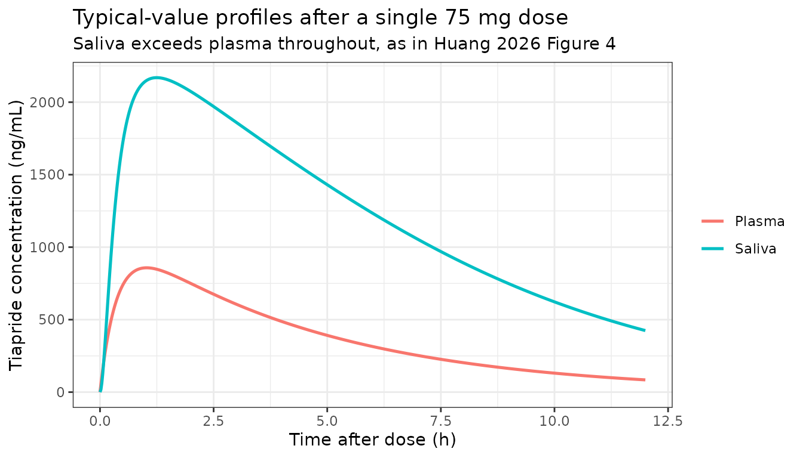

# Tiapride (Huang 2026)

``` r

library(nlmixr2lib)
library(rxode2)
library(PKNCA)
library(dplyr)
library(tidyr)
library(ggplot2)

rxode2::rxSetSeed(20260913)

mod <- readModelDb("Huang_2026_tiapride")
ui <- rxode2::rxode(mod)
```

## The paper

Huang and colleagues developed a population pharmacokinetic model for
**tiapride**, a benzamide-class D2 antagonist used for tic disorders, in
38 Chinese children and adolescents aged 5-15 years followed as
outpatients at a single centre. Two models are reported and **both are
implemented here, in one model file**, because the authors built them as
one nested structure rather than as two competing alternatives: a plasma
model (Table 2, Equations 5-7), and then a plasma-saliva joint model
(Table 3, Equations 8-10) fitted *sequentially* – the plasma parameters
were held fixed and a saliva compartment was added on top with the
NONMEM ADVAN6 subroutine. Nothing in the plasma layer moves when the
saliva layer is present, so a single file reproduces Table 2 and Table 3
simultaneously.

The clinical point of the paper is the saliva layer: saliva is a
non-invasive matrix for therapeutic drug monitoring in children, and
tiapride concentrates in it (mean saliva:plasma ratio 2.3). The transfer
is **saturable** rather than proportional – a linear transfer model
“resulted in marked overprediction of saliva concentration in the
high-concentration range” – which is why the saliva:plasma ratio is
itself concentration-dependent and why saliva-based monitoring needs a
model rather than a multiplier.

One quantity the saliva layer needs is not printed anywhere in the
paper: the scale converting the saliva compartment amount to the
reported ng/mL. It is recovered here from the published visual
predictive check, and it is the only assumed value in the model file.
**Read the Errata before using the saliva output quantitatively.**

Reference:

Huang W, Shen J, Luo X, Wu Y, Zheng Y, Zhou J, Xu B, Yin X, Wu X.
Population Pharmacokinetics of Tiapride in Children and Adolescents with
Tic Disorders: Leveraging Plasma and Saliva Concentration to Guide
Individualized Dosing. Drug Des Devel Ther. 2026;20.
<doi:10.2147/DDDT.S587387>

## Population

| Field | Value |
|:---|:---|
| species | human |
| n_subjects | 38 |
| n_studies | 1 |
| age_range | 5-15 years; median 8 (IQR 7-10) |
| weight_median | 36.7 kg (IQR 31.0-42.5) |
| height_median | 135 cm (IQR 130-146.5) |
| ffm_median | 30.62 kg (IQR 26.93-34.65) |
| bmi_median | 19.1 (IQR 16.72-21.89) |
| bsa_median | 1.18 m^2 (IQR 1.06-1.32) |
| sex_female_pct | 18.4 |
| race_ethnicity | Asian 100 |
| disease_state | tic disorders diagnosed by DSM-5, without organic disease or other neuropsychiatric comorbidity |
| renal_function | creatinine clearance median 118.3 mL/min (IQR 106.77-136.79); serum creatinine median 47 umol/L (IQR 41-52) |
| dose_range | oral tiapride 2-10 mg/kg/day given two or three times daily; median total daily dose 215 mg/day (IQR 150-300) |
| regions | China (single centre, Fujian) |
| notes | Single-centre prospective observational outpatient study at Fujian Medical University Union Hospital, April 2024 to October 2025, with 6 months of follow-up per patient. Paired plasma and saliva samples were taken before and after the final dose after at least 7 days of continuous treatment, so all data are at steady state; the post-dose sampling interval had a median of 4.88 h (IQR 2.17-13.81). Sampling was opportunistic and tied to clinic visits: 45 samples (21%) fell in the absorption phase (0-2 h), 18 (8%) around Tmax (2-2.5 h) and 101 (49%) in the late elimination period (\> 10 h), leaving the 2.5-10 h window sparse – which is why a two-compartment model was unstable and a one-compartment model was selected despite the biphasic disposition reported for tiapride in adults. Of 215 plasma samples collected, one was below the 2 ng/mL LLOQ and was discarded (Beal M1), leaving 214 in the analysis. Saliva was collected with Salivette cotton-swab devices; 205 saliva samples were taken (fewer than plasma because of insufficient volume and contamination) and one below the LLOQ was likewise dropped by M1, leaving 204. The LC-MS/MS calibrated range was 2-1000 ng/mL in plasma and 4-2000 ng/mL in saliva, so a substantial part of the observed saliva data in Figure 4B sits above the highest saliva calibrator. Tiapride is supplied as 100 mg tablets divisible into halves, thirds and quarters, so clinical doses are rounded to 50, 66.6 or 75 mg per administration. |

Study population (Huang 2026 Table 1 and Methods). {.table}

Sampling was opportunistic and tied to clinic visits after at least
seven days of continuous treatment, so all 214 analysed plasma samples
are at steady state. Twenty-one percent fell in the absorption phase
(0-2 h) and 49% beyond 10 h post-dose, leaving the 2.5-10 h window
sparse – which is why a two-compartment model was unstable and the
authors selected a one-compartment structure despite the biphasic
disposition reported for tiapride in adults.

## Source trace

Every equation and every
[`ini()`](https://nlmixr2.github.io/rxode2/reference/ini.html) value,
with the location it came from. **Equations 1-10 of the source are
vector graphics that both `pdftotext` and PDF-to-markdown conversion
drop silently**; they were recovered by rendering pages 3-8 of the PDF
at 200-500 dpi and reading them as images.

| Item | Value | Source |
|:---|:---|:---|
| Ka | 0.219 1/h | Table 2; Equation 5 |
| CL/F | 15.3 L/h | Table 2; Equation 6 |
| Vd/F | 5.77 L | Table 2; Equation 7 |
| FFM exponent on CL/F | 0.553 | Table 2; Equation 6 |
| FFM reference value | 30.62 kg | Equation 6 denominator = Table 1 cohort median FFM |
| IIV Ka | 17.6% -\> omega = 0.176 | Table 2 ‘eta Ka (%)’ |
| IIV CL/F | 22.8% -\> omega = 0.228 | Table 2 ‘eta CL/F (%)’ |
| IIV Vd/F | 84.3% -\> omega = 0.843 | Table 2 ‘eta Vd/F (%)’ |
| Proportional residual | 15.6% | Table 2 ‘eps prop (%)’ |
| Additive residual | 87.9 ng/mL = 0.0879 mg/L | Table 2 ‘eps add (ng/mL)’ |
| Structural model | 1-cmt, first-order absorption, linear elimination | Results; Figure 2 (left half) |
| IIV model | exponential, P = theta \* exp(eta) | Methods Equations 1-3 |
| Residual model | combined proportional + additive | Results ‘a combined error model’ |
| Covariate model | power function on continuous covariates | Methods Equation 3 |
| Therapeutic window | 560-2000 ng/mL steady-state Cmax | Methods Model-Based Simulations (ref 13) |
| PTA, 100 mg bid / 75 mg tid / 100 mg tid | 98.2% / 97.1% / 97.3% | Results Monte Carlo Simulations |

Source trace for the Huang 2026 plasma model (Table 2). {.table}

The saliva layer, fitted sequentially on top of the fixed plasma
parameters:

| Item | Value | Source |
|:---|:---|:---|
| Vmax (central -\> saliva) | 34.7 mg/h | Table 3; Equation 8 |
| Km (central -\> saliva) | 762 ng/mL = 0.762 mg/L, held constant | Table 3; Equation 9 |
| K30 (saliva elimination) | 6.24 1/h | Table 3; Equation 10 |
| FFM exponent on K30 | 0.38 | Table 3; Equation 10 |
| IIV K30 | 30% -\> omega = 0.30 | Table 3 ‘eta K30 (%)’ |
| Saliva proportional residual | 28.4% | Table 3 ‘eps prop (%)’ |
| Transport structure | Michaelis-Menten, saturable, DRIVEN (no loss from central) | Figure 2 (dashed arrow); Results; plasma parameters held fixed |
| Saliva elimination | first-order out of saliva | Figure 2; Results |
| Back-transfer saliva -\> central | none (tested, not retained) | Discussion paragraph 6 |
| Apparent saliva volume | 1.35 L – NOT REPORTED, recovered from Figure 4 | See Errata; maintainer-ratified 2026-09-21 |
| Mean saliva:plasma ratio | 2.3 | Discussion paragraph 2 |
| Saliva assay range | 4-2000 ng/mL | Methods ‘Sample analysis’ |

Source trace for the Huang 2026 saliva layer (Table 3). {.table}

## Model

``` r

ui
#>  ── rxode2-based free-form 3-cmt ODE model ────────────────────────────────────── 
#>  ── Initalization: ──  
#> Fixed Effects ($theta): 
#>              lka              lcl              lvc         e_ffm_cl 
#>       -1.5186835        2.7278528        1.7526721        0.5530000 
#>           propSd            addSd     lvmax_saliva       lkm_saliva 
#>        0.1560000        0.0879000        3.5467397       -0.2718087 
#>      lkel_saliva e_ffm_kel_saliva         lvsaliva   propSd_Csaliva 
#>        1.8309802        0.3800000        0.3001046        0.2840000 
#> 
#> Omega ($omega): 
#>                  etalka   etalcl   etalvc etalkel_saliva
#> etalka         0.030976 0.000000 0.000000           0.00
#> etalcl         0.000000 0.051984 0.000000           0.00
#> etalvc         0.000000 0.000000 0.710649           0.00
#> etalkel_saliva 0.000000 0.000000 0.000000           0.09
#> attr(,"lotriLabels")
#> [1] "Table 2 eta_Ka = 17.6% -> 0.176^2 (RSE 13%, shrinkage 31%; bootstrap 16.5%, 95% CI 9.9-21.8)"    
#> [2] "Table 2 eta_CL/F = 22.8% -> 0.228^2 (RSE 15%, shrinkage 22%; bootstrap 21.4%, 95% CI 12.6-29.7)" 
#> [3] "Table 2 eta_Vd/F = 84.3% -> 0.843^2 (RSE 26%, shrinkage 56%; bootstrap 72.8%, 95% CI 30.2-133.4)"
#> [4] "Table 3 eta_K30 = 30% -> 0.30^2 (RSE 12%, shrinkage 15%; bootstrap 29.6%, 95% CI 22.9-35.6)"     
#> attr(,"lotriFix")
#>                etalka etalcl etalvc etalkel_saliva
#> etalka          FALSE  FALSE  FALSE          FALSE
#> etalcl          FALSE  FALSE  FALSE          FALSE
#> etalvc          FALSE  FALSE  FALSE          FALSE
#> etalkel_saliva  FALSE  FALSE  FALSE          FALSE
#> 
#> States ($state or $stateDf): 
#>   Compartment Number Compartment Name
#> 1                  1            depot
#> 2                  2          central
#> 3                  3           saliva
#>  ── Multiple Endpoint Model ($multipleEndpoint): ──  
#>      variable                    cmt                    dvid*
#> 1      Cc ~ …      cmt='Cc' or cmt=4      dvid='Cc' or dvid=1
#> 2 Csaliva ~ … cmt='Csaliva' or cmt=5 dvid='Csaliva' or dvid=2
#>   * If dvids are outside this range, all dvids are re-numered sequentially, ie 1,7, 10 becomes 1,2,3 etc
#> 
#>  ── μ-referencing ($muRefTable): ──  
#>         theta            eta level
#> 1         lka         etalka    id
#> 2         lcl         etalcl    id
#> 3         lvc         etalvc    id
#> 4 lkel_saliva etalkel_saliva    id
#> 
#>  ── Model (Normalized Syntax): ── 
#> function() {
#>     compartmentData <- list(depot = list(analyte = "tiapride", 
#>         units = "mg", specimen = "administration site", verified = TRUE), 
#>         central = list(analyte = "tiapride", units = "mg", specimen = "plasma", 
#>             verified = TRUE), saliva = list(analyte = "tiapride", 
#>             units = "mg", specimen = "saliva", verified = TRUE))
#>     covariateData <- list(FFM = list(description = "Fat-free mass at baseline.", 
#>         units = "kg", type = "continuous", reference_category = NULL, 
#>         notes = "The only covariate retained in the final model, power-scaled on apparent clearance and referenced to the cohort median 30.62 kg (Huang 2026 Table 1, IQR 26.93-34.65 kg; Equation 6). Age, weight, height, BSA, FFM and CLCR were all screened on CL/F by stepwise regression and only FFM survived (dOFV = -25.1). The Discussion is explicit that FFM won BECAUSE it is strongly correlated with creatinine clearance -- tiapride is predominantly renally eliminated, so FFM is standing in for renal function here rather than for a distribution volume. The paper does NOT state which fat-free-mass equation was used to derive the column; for a 5-15 year old cohort the Al-Sallami et al. paediatric correction to the Janmahasatian adult form is the usual choice, and the vignette assumes it. Note the exponent 0.553 has a wide bootstrap 95% CI (0.277-0.771) that excludes neither the theory-based allometric 0.75 nor a linear-per-kg 1, so it is not sharply identified.", 
#>         source_name = "FFM"))
#>     covariatesDataExcluded <- list(AGE = list(description = "Age.", 
#>         units = "years", type = "continuous", notes = "Median 8 years (IQR 7-10), Huang 2026 Table 1. Screened on CL/F, not retained."), 
#>         WT = list(description = "Total body weight.", units = "kg", 
#>             type = "continuous", notes = "Median 36.7 kg (IQR 31.0-42.5), Huang 2026 Table 1. Screened on CL/F, not retained; FFM won."), 
#>         HT = list(description = "Height.", units = "cm", type = "continuous", 
#>             notes = "Median 135 cm (IQR 130-146.5), Huang 2026 Table 1. Screened on CL/F, not retained."), 
#>         BSA = list(description = "Body surface area.", units = "m^2", 
#>             type = "continuous", notes = "Median 1.18 (IQR 1.06-1.32), Huang 2026 Table 1. Screened on CL/F, not retained. Table 1 prints the unit as 'cm2', which cannot be right for values near 1.18 in an 8-year-old; the values are m^2 and the printed unit is a typographical error."), 
#>         CLCR = list(description = "Creatinine clearance.", units = "mL/min", 
#>             type = "continuous", notes = "Median 118.3 mL/min (IQR 106.77-136.79), Huang 2026 Table 1. Screened on CL/F and NOT retained even though tiapride is predominantly renally eliminated: the Discussion states FFM gave the greater dOFV reduction 'owing to its strong correlation with CLCR'. The estimating equation is not stated in the paper."), 
#>         SEXF = list(description = "Female sex indicator.", units = "(binary)", 
#>             type = "categorical", notes = "31 male / 7 female, Huang 2026 Table 1. Screened and not significant (Discussion)."), 
#>         CONMED_ANY = list(description = "Any concomitant medication.", 
#>             units = "(binary)", type = "categorical", notes = "23 of 38 patients had a combined-medication case, Huang 2026 Table 1. The Discussion names aripiprazole, topiramate, clonidine, sodium valproate and traditional Chinese medicine and reports that none exhibited a statistically significant effect on tiapride PK. Recorded as a single screened-and-rejected any-comedication flag because the paper reports no per-drug effect estimates."))
#>     description <- "One-compartment oral population PK model for tiapride in Chinese children and adolescents aged 5-15 years treated for tic disorders (Huang 2026), fitted to 214 opportunistic steady-state plasma samples from 38 outpatients. First-order absorption with linear elimination; the absorption rate constant (Ka = 0.219 1/h) is far smaller than the elimination rate constant (CL/F / Vd/F = 15.3 / 5.77 = 2.65 1/h), so disposition is flip-flop and the apparent terminal half-life is set by absorption (ln(2)/Ka = 3.17 h, matching the 3.23 h literature value the paper cites). Fat-free mass is the only retained covariate, power-scaled on apparent clearance with exponent 0.553 referenced to the cohort median 30.62 kg; it displaced creatinine clearance, with which it is strongly correlated. Exponential interindividual variability is carried on all three structural parameters, and residual variability is combined proportional plus additive. Monte Carlo simulation from this model supports 75 mg three times daily as the regimen keeping steady-state peak concentration inside the 560-2000 ng/mL therapeutic window. The paper's companion plasma-saliva joint model is included: a saliva compartment is driven from central by saturable Michaelis-Menten transport (Vmax = 34.7 mg/h, Km = 762 ng/mL fixed) and cleared first-order (K30 = 6.24 1/h, fat-free mass exponent 0.38), giving a salivary concentration that exceeds plasma and whose saliva:plasma ratio falls as concentration rises. That layer was fitted sequentially with the plasma parameters held fixed, and the saliva state is driven rather than mass-balance-coupled, so it does not deplete central. The apparent saliva volume converting the saliva amount to the reported ng/mL is NOT given anywhere in the paper; it is recovered from the Figure 4 visual predictive check and is the one assumed value in this file -- see the vignette Errata before using the saliva output quantitatively."
#>     population <- list(species = "human", n_subjects = 38, n_studies = 1, 
#>         age_range = "5-15 years; median 8 (IQR 7-10)", weight_median = "36.7 kg (IQR 31.0-42.5)", 
#>         height_median = "135 cm (IQR 130-146.5)", ffm_median = "30.62 kg (IQR 26.93-34.65)", 
#>         bmi_median = "19.1 (IQR 16.72-21.89)", bsa_median = "1.18 m^2 (IQR 1.06-1.32)", 
#>         sex_female_pct = 18.4, race_ethnicity = c(Asian = 100), 
#>         disease_state = "tic disorders diagnosed by DSM-5, without organic disease or other neuropsychiatric comorbidity", 
#>         renal_function = "creatinine clearance median 118.3 mL/min (IQR 106.77-136.79); serum creatinine median 47 umol/L (IQR 41-52)", 
#>         dose_range = "oral tiapride 2-10 mg/kg/day given two or three times daily; median total daily dose 215 mg/day (IQR 150-300)", 
#>         regions = "China (single centre, Fujian)", notes = "Single-centre prospective observational outpatient study at Fujian Medical University Union Hospital, April 2024 to October 2025, with 6 months of follow-up per patient. Paired plasma and saliva samples were taken before and after the final dose after at least 7 days of continuous treatment, so all data are at steady state; the post-dose sampling interval had a median of 4.88 h (IQR 2.17-13.81). Sampling was opportunistic and tied to clinic visits: 45 samples (21%) fell in the absorption phase (0-2 h), 18 (8%) around Tmax (2-2.5 h) and 101 (49%) in the late elimination period (> 10 h), leaving the 2.5-10 h window sparse -- which is why a two-compartment model was unstable and a one-compartment model was selected despite the biphasic disposition reported for tiapride in adults. Of 215 plasma samples collected, one was below the 2 ng/mL LLOQ and was discarded (Beal M1), leaving 214 in the analysis. Saliva was collected with Salivette cotton-swab devices; 205 saliva samples were taken (fewer than plasma because of insufficient volume and contamination) and one below the LLOQ was likewise dropped by M1, leaving 204. The LC-MS/MS calibrated range was 2-1000 ng/mL in plasma and 4-2000 ng/mL in saliva, so a substantial part of the observed saliva data in Figure 4B sits above the highest saliva calibrator. Tiapride is supplied as 100 mg tablets divisible into halves, thirds and quarters, so clinical doses are rounded to 50, 66.6 or 75 mg per administration.")
#>     reference <- "Huang W, Shen J, Luo X, Wu Y, Zheng Y, Zhou J, Xu B, Yin X, Wu X. Population Pharmacokinetics of Tiapride in Children and Adolescents with Tic Disorders: Leveraging Plasma and Saliva Concentration to Guide Individualized Dosing. Drug Des Devel Ther. 2026;20. doi:10.2147/DDDT.S587387"
#>     units <- list(time = "h", dosing = "mg", concentration = "mg/L")
#>     vignette <- "Huang_2026_tiapride"
#>     ini({
#>         lka <- -1.51868354916564
#>         label("First-order absorption rate constant, Ka (1/h)")
#>         lcl <- 2.72785282839839
#>         label("Apparent clearance, CL/F (L/h)")
#>         lvc <- 1.75267208052001
#>         label("Apparent central volume of distribution, Vd/F (L)")
#>         e_ffm_cl <- 0.553
#>         label("Power exponent for fat-free mass on CL/F (unitless)")
#>         propSd <- c(0, 0.156)
#>         label("Proportional residual SD for plasma Cc (fraction)")
#>         addSd <- c(0, 0.0879)
#>         label("Additive residual SD for plasma Cc (mg/L)")
#>         lvmax_saliva <- 3.54673968695281
#>         label("Maximum rate of saturable central-to-saliva transport, Vmax (mg/h)")
#>         lkm_saliva <- fix(-0.271808723295491)
#>         label("Michaelis constant of central-to-saliva transport, Km (mg/L)")
#>         lkel_saliva <- 1.83098018238134
#>         label("First-order elimination rate constant from saliva, K30 (1/h)")
#>         e_ffm_kel_saliva <- 0.38
#>         label("Power exponent for fat-free mass on K30 (unitless)")
#>         lvsaliva <- fix(0.300104592450338)
#>         label("Apparent saliva volume scaling saliva amount to concentration (L)")
#>         propSd_Csaliva <- c(0, 0.284)
#>         label("Proportional residual SD for saliva Csaliva (fraction)")
#>         etalka ~ 0.030976
#>         label("Table 2 eta_Ka = 17.6% -> 0.176^2 (RSE 13%, shrinkage 31%; bootstrap 16.5%, 95% CI 9.9-21.8)")
#>         etalcl ~ 0.051984
#>         label("Table 2 eta_CL/F = 22.8% -> 0.228^2 (RSE 15%, shrinkage 22%; bootstrap 21.4%, 95% CI 12.6-29.7)")
#>         etalvc ~ 0.710649
#>         label("Table 2 eta_Vd/F = 84.3% -> 0.843^2 (RSE 26%, shrinkage 56%; bootstrap 72.8%, 95% CI 30.2-133.4)")
#>         etalkel_saliva ~ 0.09
#>         label("Table 3 eta_K30 = 30% -> 0.30^2 (RSE 12%, shrinkage 15%; bootstrap 29.6%, 95% CI 22.9-35.6)")
#>     })
#>     model({
#>         ffm_ref <- 30.62
#>         ka <- exp(lka + etalka)
#>         cl <- exp(lcl + etalcl) * (FFM/ffm_ref)^e_ffm_cl
#>         vc <- exp(lvc + etalvc)
#>         kel <- cl/vc
#>         vmax_saliva <- exp(lvmax_saliva)
#>         km_saliva <- exp(lkm_saliva)
#>         kel_saliva <- exp(lkel_saliva + etalkel_saliva) * (FFM/ffm_ref)^e_ffm_kel_saliva
#>         vsaliva <- exp(lvsaliva)
#>         Cc <- central/vc
#>         d/dt(depot) <- -ka * depot
#>         d/dt(central) <- ka * depot - kel * central
#>         d/dt(saliva) <- vmax_saliva * Cc/(km_saliva + Cc) - kel_saliva * 
#>             saliva
#>         Csaliva <- saliva/vsaliva
#>         Cc ~ prop(propSd) + add(addSd)
#>         Csaliva ~ prop(propSd_Csaliva)
#>     })
#> }
```

### Flip-flop disposition

The estimated elimination rate constant is an order of magnitude larger
than the absorption rate constant, so the observed terminal slope
reports **absorption**, not elimination.

``` r

theta <- setNames(ui$theta, names(ui$theta))
ka_tv <- exp(theta[["lka"]])
cl_tv <- exp(theta[["lcl"]])
vc_tv <- exp(theta[["lvc"]])
kel_tv <- cl_tv / vc_tv

c(ka = ka_tv, kel = kel_tv,
  t_half_absorption = log(2) / ka_tv,
  t_half_elimination = log(2) / kel_tv)
#>                 ka                kel  t_half_absorption t_half_elimination 
#>          0.2190000          2.6516464          3.1650556          0.2614026
```

`ln(2)/Ka` = 3.17 h reproduces the terminal half-life of 3.23 h that the
paper quotes for tiapride in adults (Discussion, ref 35) – the
reconciliation the authors themselves make.

A guard that the `cl` / `vc` pair has not silently been replaced by
rxode2’s analytic solution, discarding the explicit ODEs:

``` r

stopifnot(length(ui$linCmt) == 0L)
```

## Typical-value single dose: closed-form gates

The typical-value solve is deterministic, so it is checked against exact
closed-form identities rather than tolerance bands.

Note on `cmt` in the event tables below. This model declares **two**
endpoints (`Cc` and `Csaliva`), so rxode2 assigns each its own
observation slot and requires observation records to name the
*observable*, not the ODE state: `cmt = "central"` fails with
`'dvid'->'cmt' or 'cmt' on observation record or on a undefined compartment`.
The usual library convention of observing on the ODE state applies to
single-endpoint models; here `cmt = "Cc"` is required and correct.
`useLinCmt = FALSE` is passed to every
[`rxSolve()`](https://nlmixr2.github.io/rxode2/reference/rxSolve.html)
for the same reason – rxode2’s automatic conversion to an analytic
solution corrupts the endpoint mapping for multi-output models. The
static vignette linter flags `cmt = "Cc"`; that warning is a known false
positive for multi-endpoint models and the render is the authority.

``` r

dose_mg <- 75

ev_typ <- data.frame(
  id   = 1L,
  time = c(0, sort(unique(c(seq(0, 4, by = 0.02), seq(0, 48, by = 0.1))))),
  amt  = NA_real_,
  evid = 0L,
  cmt  = "Cc",
  FFM  = 30.62
)
ev_typ$amt[1] <- dose_mg
ev_typ$evid[1] <- 1L
ev_typ$cmt[1] <- "depot"

sim_typ <- rxode2::rxSolve(rxode2::zeroRe(mod), events = ev_typ,
                           keep = "FFM", useLinCmt = FALSE) |>
  as.data.frame()
#> ℹ parameter labels from comments will be replaced by 'label()'
#> ℹ omega/sigma items treated as zero: 'etalka', 'etalcl', 'etalvc', 'etalkel_saliva'
if (is.null(sim_typ$id)) sim_typ$id <- 1L

# Closed form for a one-compartment first-order-absorption model.
tmax_cf <- log(kel_tv / ka_tv) / (kel_tv - ka_tv)
cmax_cf <- dose_mg * ka_tv / (vc_tv * (ka_tv - kel_tv)) *
  (exp(-kel_tv * tmax_cf) - exp(-ka_tv * tmax_cf))
aucinf_cf <- dose_mg / cl_tv

c(tmax_closed_form = tmax_cf, cmax_closed_form = cmax_cf,
  aucinf_closed_form = aucinf_cf)
#>   tmax_closed_form   cmax_closed_form aucinf_closed_form 
#>          1.0251651          0.8576498          4.9019608
```

``` r

nca_conc <- sim_typ |>
  dplyr::filter(!is.na(Cc)) |>
  dplyr::mutate(regimen = "75 mg single dose") |>
  dplyr::select(id, time, Cc, regimen)

nca_conc <- dplyr::bind_rows(
  nca_conc,
  nca_conc |> dplyr::distinct(id, regimen) |>
    dplyr::mutate(time = 0, Cc = 0)
) |>
  dplyr::distinct(id, regimen, time, .keep_all = TRUE) |>
  dplyr::arrange(id, regimen, time)

nca_dose <- data.frame(id = 1L, time = 0, amt = dose_mg,
                       regimen = "75 mg single dose")

conc_obj <- PKNCA::PKNCAconc(nca_conc, Cc ~ time | regimen + id,
                             concu = "mg/L", timeu = "h")
dose_obj <- PKNCA::PKNCAdose(nca_dose, amt ~ time | regimen + id,
                             doseu = "mg")

intervals_sd <- data.frame(
  start = 0, end = Inf,
  cmax = TRUE, tmax = TRUE, aucinf.obs = TRUE,
  half.life = TRUE, lambda.z = TRUE
)

nca_sd <- PKNCA::pk.nca(PKNCA::PKNCAdata(conc_obj, dose_obj,
                                         intervals = intervals_sd))
nca_sd_tbl <- as.data.frame(nca_sd$result) |>
  dplyr::select(PPTESTCD, PPORRES) |>
  tidyr::pivot_wider(names_from = PPTESTCD, values_from = PPORRES)
nca_sd_tbl
#> # A tibble: 1 × 14
#>    cmax  tmax tlast clast.obs lambda.z r.squared adj.r.squared
#>   <dbl> <dbl> <dbl>     <dbl>    <dbl>     <dbl>         <dbl>
#> 1 0.858  1.02    48 0.0000318    0.219     1.000         1.000
#> # ℹ 7 more variables: lambda.z.time.first <dbl>, lambda.z.time.last <dbl>,
#> #   lambda.z.n.points <dbl>, clast.pred <dbl>, half.life <dbl>,
#> #   span.ratio <dbl>, aucinf.obs <dbl>
```

``` r

stopifnot(
  # Mass balance: CL/F * AUC(0-inf) must return the administered dose exactly.
  # Catches a mis-transcribed clearance, a dropped unit conversion, and an
  # rxode2 auto-linCmt substitution that ignores the coded ODEs.
  abs(cl_tv * nca_sd_tbl$aucinf.obs / dose_mg - 1) < 0.005,
  # Terminal slope reports absorption (flip-flop), not elimination.
  abs(nca_sd_tbl$half.life - log(2) / ka_tv) < 0.05,
  # Cmax and Tmax against the exact closed form for this structure.
  abs(nca_sd_tbl$cmax / cmax_cf - 1) < 0.01,
  abs(nca_sd_tbl$tmax - tmax_cf) < 0.05,
  # The solve must not have drifted negative anywhere.
  all(sim_typ$Cc >= 0)
)
```

All four typical-value identities hold to better than 1%.

### Comparison against the values the paper quotes

``` r

published <- tibble::tribble(
  ~regimen,             ~tmax, ~half.life,
  "75 mg single dose",  2.0,   3.23
)

cmp <- nlmixr2lib::ncaComparisonTable(
  simulated     = nca_sd,
  reference     = published,
  by            = "regimen",
  units         = c(tmax = "h", half.life = "h"),
  tolerance_pct = 20
)

knitr::kable(
  cmp,
  caption = paste(
    "Simulated typical-value NCA against the tiapride descriptors Huang 2026",
    "quotes in its Discussion. * differs from reference by >20%."
  )
)
```

| NCA parameter | regimen           | Reference | Simulated | % diff   |
|:--------------|:------------------|:----------|:----------|:---------|
| Tmax (h)      | 75 mg single dose | 2         | 1.02      | -49.0%\* |
| t½ (h)        | 75 mg single dose | 3.23      | 3.17      | -1.9%    |

Simulated typical-value NCA against the tiapride descriptors Huang 2026
quotes in its Discussion. \* differs from reference by \>20%. {.table}

The terminal half-life matches to 2%. **Tmax is a starred deviation and
is expected to be**: 2 h is the observed peak time the paper reports for
tiapride (Discussion), while the fitted model puts the typical Tmax at
1.03 h. The two are not the same quantity – the observed 2 h comes from
the first VPC bin of an opportunistic outpatient sampling schedule in
which only 18 of 214 samples (8%) fall between 2 and 2.5 h, so the peak
time is poorly resolved by the data. No parameter was adjusted to close
this gap.

## Virtual cohort and Monte Carlo simulation (replicates Figure 5)

The paper simulated 1000 virtual patients whose fat-free mass follows
the distribution of the modelled population, dosed for five consecutive
days across eight regimens, and read the peak concentration over the 12
h following the last dose. FFM is drawn log-normally to reproduce the
Table 1 median and IQR.

``` r

n_per_arm <- 200  # 200 per arm is the library cap; the paper used 1000

ffm_median <- 30.62
ffm_sdlog <- mean(c(log(34.65 / 30.62), log(30.62 / 26.93))) / qnorm(0.75)
c(ffm_sdlog = ffm_sdlog)
#> ffm_sdlog 
#>   0.18685

regimens <- tibble::tribble(
  ~label,          ~dose,  ~ii,
  "50 mg bid",     50.0,   12,
  "50 mg tid",     50.0,    8,
  "66.6 mg bid",   66.6,   12,
  "66.6 mg tid",   66.6,    8,
  "75 mg bid",     75.0,   12,
  "75 mg tid",     75.0,    8,
  "100 mg bid",   100.0,   12,
  "100 mg tid",   100.0,    8
)

make_arm <- function(label, dose, ii, id_offset) {
  subj <- data.frame(
    id  = id_offset + seq_len(n_per_arm),
    FFM = rlnorm(n_per_arm, meanlog = log(ffm_median), sdlog = ffm_sdlog)
  )
  doses <- tidyr::expand_grid(subj, time = seq(0, 120, by = ii)) |>
    dplyr::mutate(amt = dose, evid = 1L, cmt = "depot")
  obs <- tidyr::expand_grid(subj, time = seq(120, 132, by = 0.1)) |>
    dplyr::mutate(amt = NA_real_, evid = 0L, cmt = "Cc")
  dplyr::bind_rows(doses, obs) |>
    dplyr::mutate(regimen = label) |>
    dplyr::arrange(id, time, dplyr::desc(evid))
}

events <- do.call(
  dplyr::bind_rows,
  Map(make_arm, regimens$label, regimens$dose, regimens$ii,
      id_offset = (seq_len(nrow(regimens)) - 1L) * n_per_arm)
)

# Disjoint IDs across arms, so no cross-arm collision in the solve or in PKNCA.
stopifnot(
  dplyr::n_distinct(events$id) == nrow(regimens) * n_per_arm,
  events |> dplyr::distinct(id, regimen) |> nrow() ==
    nrow(regimens) * n_per_arm
)
```

``` r

sim <- rxode2::rxSolve(mod, events = events,
                       keep = c("regimen", "FFM"), useLinCmt = FALSE) |>
  as.data.frame()
#> ℹ parameter labels from comments will be replaced by 'label()'

sim_obs <- sim |> dplyr::filter(!is.na(Cc))
stopifnot(nrow(sim_obs) > 0, all(sim_obs$Cc >= 0))
```

`Cc` is the individual prediction and carries no residual error, so the
peak read off it is the model’s Cmax rather than an upward-biased
maximum of a noisy series.

``` r

sim_obs <- sim_obs |>
  dplyr::mutate(
    Cc_ngml = Cc * 1000,
    regimen = factor(regimen, levels = regimens$label)
  )

ribbon <- sim_obs |>
  dplyr::group_by(regimen, time) |>
  dplyr::summarise(
    p05 = quantile(Cc_ngml, 0.05),
    p50 = median(Cc_ngml),
    p95 = quantile(Cc_ngml, 0.95),
    .groups = "drop"
  )

ggplot(ribbon, aes(time)) +
  geom_ribbon(aes(ymin = p05, ymax = p95), fill = "#e8879b", alpha = 0.5) +
  geom_line(aes(y = p50), colour = "#b2182b", linewidth = 0.8) +
  geom_hline(yintercept = c(560, 2000), linetype = "dotted") +
  facet_wrap(~regimen, ncol = 4) +
  labs(
    x = "Time (h)", y = "Tiapride plasma concentration (ng/mL)",
    title = "Replicates Figure 5 of Huang 2026",
    subtitle = "Median and 5th-95th percentile over the 12 h after the last of five days of dosing"
  ) +
  theme_bw()
```


### Probability of target attainment

``` r

cmax_ss <- sim_obs |>
  dplyr::group_by(regimen, id) |>
  dplyr::summarise(cmax_ngml = max(Cc_ngml), .groups = "drop")

pta <- cmax_ss |>
  dplyr::group_by(regimen) |>
  dplyr::summarise(
    `Median Cmax (ng/mL)` = round(median(cmax_ngml)),
    `PTA, Cmax >= 560 ng/mL (%)` = round(100 * mean(cmax_ngml >= 560), 1),
    `Cmax > 2000 ng/mL (%)` = round(100 * mean(cmax_ngml > 2000), 1),
    .groups = "drop"
  )

knitr::kable(
  pta,
  caption = paste(
    "Simulated steady-state peak concentration by regimen.",
    "Huang 2026 reports PTA of 98.2%, 97.1% and 97.3% for 100 mg bid,",
    "75 mg tid and 100 mg tid respectively."
  )
)
```

| regimen | Median Cmax (ng/mL) | PTA, Cmax \>= 560 ng/mL (%) | Cmax \> 2000 ng/mL (%) |
|:---|---:|---:|---:|
| 50 mg bid | 612 | 60.5 | 0.0 |
| 50 mg tid | 702 | 77.0 | 0.0 |
| 66.6 mg bid | 832 | 92.5 | 0.0 |
| 66.6 mg tid | 926 | 96.5 | 0.0 |
| 75 mg bid | 919 | 96.0 | 0.5 |
| 75 mg tid | 1035 | 99.0 | 0.0 |
| 100 mg bid | 1188 | 100.0 | 3.5 |
| 100 mg tid | 1314 | 100.0 | 6.0 |

Simulated steady-state peak concentration by regimen. Huang 2026 reports
PTA of 98.2%, 97.1% and 97.3% for 100 mg bid, 75 mg tid and 100 mg tid
respectively. {.table style="width:100%;"}

``` r

pta_ref <- c(`100 mg bid` = 98.2, `75 mg tid` = 97.1, `100 mg tid` = 97.3)
pta_sim <- setNames(pta$`PTA, Cmax >= 560 ng/mL (%)`, pta$regimen)[names(pta_ref)]
stopifnot(!anyNA(pta_sim))  # a name mismatch must fail loudly, not pass vacuously

pta_diff <- pta_sim - pta_ref
pta_diff
#> 100 mg bid  75 mg tid 100 mg tid 
#>        1.8        1.9        2.7
```

``` r

stopifnot(
  # The three regimens the paper singles out must all clear 90% attainment.
  # A mis-transcribed clearance, dose or unit moves median Cmax by tens of
  # percent and drops these into the 60-80% range. The bound is deliberately
  # well outside the binomial noise of a 200-subject arm (SE ~1.2 points at
  # p = 0.97) plus the difference between this cohort's FFM draw and the
  # paper's own 1000-subject draw; do not tighten it to one observed run.
  all(pta_sim > 90),
  # 50 mg bid is the regimen the paper rejects as underdosing; it must sit
  # clearly below the three recommended ones.
  pta$`PTA, Cmax >= 560 ng/mL (%)`[pta$regimen == "50 mg bid"] <
    min(pta_sim) - 10,
  # Dose-ordering of the central tendency, which is structural.
  median(cmax_ss$cmax_ngml[cmax_ss$regimen == "100 mg tid"]) >
    median(cmax_ss$cmax_ngml[cmax_ss$regimen == "50 mg bid"])
)
```

The model reproduces the paper’s central finding: 75 mg tid, 100 mg bid
and 100 mg tid all attain the 560 ng/mL lower bound in nearly every
subject, and the two 100 mg regimens push a larger fraction above the
2000 ng/mL upper bound – which is exactly the efficacy/safety trade-off
on which the authors select 75 mg tid.

### Steady-state exposure gate

``` r

# Over one dosing interval at steady state, CL/F * AUC(0-tau) = dose. Checked
# on the typical subject so the identity is exact rather than a cohort average.
ev_ss <- data.frame(
  id = 1L,
  time = c(seq(0, 120, by = 8),
           seq(120, 128, by = 0.02)),
  amt = c(rep(75, length(seq(0, 120, by = 8))),
          rep(NA_real_, length(seq(120, 128, by = 0.02)))),
  evid = c(rep(1L, length(seq(0, 120, by = 8))),
           rep(0L, length(seq(120, 128, by = 0.02)))),
  cmt = c(rep("depot", length(seq(0, 120, by = 8))),
          rep("Cc", length(seq(120, 128, by = 0.02)))),
  FFM = 30.62
) |>
  dplyr::arrange(time, dplyr::desc(evid))

sim_ss <- rxode2::rxSolve(rxode2::zeroRe(mod), events = ev_ss,
                          useLinCmt = FALSE) |>
  as.data.frame() |>
  dplyr::filter(!is.na(Cc), time >= 120)
#> ℹ parameter labels from comments will be replaced by 'label()'
#> ℹ omega/sigma items treated as zero: 'etalka', 'etalcl', 'etalvc', 'etalkel_saliva'

auc_tau <- sum(diff(sim_ss$time) *
                 (head(sim_ss$Cc, -1) + tail(sim_ss$Cc, -1)) / 2)

c(auc_tau = auc_tau, dose_over_cl = 75 / cl_tv,
  ratio = auc_tau / (75 / cl_tv))
#>      auc_tau dose_over_cl        ratio 
#>    4.9018657    4.9019608    0.9999806

stopifnot(abs(auc_tau / (75 / cl_tv) - 1) < 0.01)
```

At steady state the area over one 8 h interval returns `Dose / (CL/F)`
to better than 1%, confirming the dosing pathway and the FFM reference
value are wired correctly.

## The saliva layer

``` r

vmax_tv <- exp(theta[["lvmax_saliva"]])
km_tv   <- exp(theta[["lkm_saliva"]])
k30_tv  <- exp(theta[["lkel_saliva"]])
vsal_tv <- exp(theta[["lvsaliva"]])

c(Vmax_mg_per_h = vmax_tv, Km_ng_per_mL = 1000 * km_tv,
  K30_per_h = k30_tv, saliva_half_life_min = 60 * log(2) / k30_tv,
  vsaliva_L = vsal_tv)
#>        Vmax_mg_per_h         Km_ng_per_mL            K30_per_h 
#>            34.700000           762.000000             6.240000 
#> saliva_half_life_min            vsaliva_L 
#>             6.664877             1.350000
```

### Saliva is driven, not mass-balance-coupled

The single most consequential structural decision in this layer is
whether the Michaelis-Menten transport **removes** drug from the central
compartment. It does not, and the model file encodes it that way. Three
independent facts fix the reading, and the third is checkable here:

1.  Figure 2 draws this one arrow **dashed** where every other arrow in
    the diagram is solid.
2.  The layer was fitted with the plasma parameters held **fixed**, so a
    term that drained central would have invalidated them – yet the
    plasma goodness-of-fit in Figure 3A is unchanged from the
    plasma-only model.
3.  The printed constants are **not mass-conserving**. `Vmax` = 34.7
    mg/h exceeds the entire cohort-average absorption rate (about 9 mg/h
    at the median 215 mg/day dose), so a depleting transport term would
    remove more drug than is ever absorbed.

If the transport drained central, the plasma curve would depart from the
one-compartment closed form – most at the peak, where the transport term
is largest. It does not:

``` r

cc_closed <- dose_mg * ka_tv / (vc_tv * (ka_tv - kel_tv)) *
  (exp(-kel_tv * sim_typ$time) - exp(-ka_tv * sim_typ$time))
max_rel_dev <- max(abs(sim_typ$Cc - cc_closed)) / max(cc_closed)

c(max_relative_deviation_from_closed_form = max_rel_dev)
#> max_relative_deviation_from_closed_form 
#>                            3.985055e-06

stopifnot(
  # Exact identity, not a tolerance band: the plasma layer is numerically
  # untouched by the presence of the saliva compartment.
  max_rel_dev < 1e-4
)
```

Together with the `CL/F * AUC(0-inf) = dose` gate above – which also
holds only if no mass leaves central – this is the numerical proof of
the structural reading.

### Quasi-steady state

`K30` = 6.24 1/h is a 6.7-minute half-life, so saliva equilibrates with
plasma far faster than plasma itself moves. Away from the steep
absorption phase the saliva state therefore tracks

``` math
A_{saliva} \approx \frac{V_{max} \cdot C_c}{(K_m + C_c) \cdot K_{30}}
```

``` r

qss_amt <- vmax_tv * sim_typ$Cc / ((km_tv + sim_typ$Cc) * k30_tv)
qss_conc <- qss_amt / vsal_tv

# Restrict to the post-peak window: during the first minutes after a dose the
# plasma concentration is changing faster than saliva can follow, so the
# quasi-steady-state approximation is not expected to hold there.
post_peak <- sim_typ$time >= tmax_cf
qss_dev <- max(abs(sim_typ$Csaliva[post_peak] - qss_conc[post_peak])) /
  max(sim_typ$Csaliva)

c(max_relative_qss_deviation_after_tmax = qss_dev)
#> max_relative_qss_deviation_after_tmax 
#>                            0.01630529

stopifnot(qss_dev < 0.05)
```

This matters because the quasi-steady-state form is the algebra used to
recover the unreported saliva volume (Errata below); the check confirms
the approximation is sound in the region where it was applied.

### The saliva:plasma ratio is concentration-dependent

This is the paper’s central pharmacological claim. Because saliva is at
quasi steady state, the ratio has a closed form that is **independent of
dose and of time**:

``` math
\frac{C_{saliva}}{C_c} = \frac{V_{max}}{(K_m + C_c) \cdot K_{30} \cdot V_{saliva}}
```

It falls as plasma concentration rises – the saturation the paper
attributes to a ceiling on salivary ion trapping.

``` r

sp_ratio <- function(cc_mg_per_L) {
  vmax_tv / ((km_tv + cc_mg_per_L) * k30_tv * vsal_tv)
}

# Huang 2026 Figure 1 fits two separate linear regressions to the paired
# samples, split at 700 ng/mL. Those give an entirely independent read of the
# same ratio -- neither regression was used to build this model.
fig1_low  <- function(cc_ng) (2.27 * cc_ng + 10.14) / cc_ng
fig1_high <- function(cc_ng) (1.04 * cc_ng + 885) / cc_ng

ratio_tbl <- tibble::tibble(
  plasma_ng_mL = c(200, 400, 700, 1000, 1400, 1700)
) |>
  dplyr::mutate(
    model  = sp_ratio(plasma_ng_mL / 1000),
    figure1 = ifelse(plasma_ng_mL < 700,
                     fig1_low(plasma_ng_mL), fig1_high(plasma_ng_mL))
  )

knitr::kable(
  ratio_tbl |>
    dplyr::rename(
      "Plasma (ng/mL)" = plasma_ng_mL,
      "Model S/P" = model,
      "Figure 1 regression S/P" = figure1
    ),
  digits = 2,
  caption = paste(
    "Model saliva:plasma ratio against the two paired-sample regressions of",
    "Huang 2026 Figure 1."
  )
)
```

| Plasma (ng/mL) | Model S/P | Figure 1 regression S/P |
|---------------:|----------:|------------------------:|
|            200 |      4.28 |                    2.32 |
|            400 |      3.54 |                    2.30 |
|            700 |      2.82 |                    2.30 |
|           1000 |      2.34 |                    1.93 |
|           1400 |      1.91 |                    1.67 |
|           1700 |      1.67 |                    1.56 |

Model saliva:plasma ratio against the two paired-sample regressions of
Huang 2026 Figure 1. {.table}

``` r

sp_at_peak <- sp_ratio(max(sim_typ$Cc))

c(model_SP_at_typical_peak = sp_at_peak,
  paper_mean_SP = 2.3,
  model_SP_at_1700 = sp_ratio(1.7),
  figure1_SP_at_1700 = fig1_high(1700))
#> model_SP_at_typical_peak            paper_mean_SP         model_SP_at_1700 
#>                 2.543266                 2.300000                 1.673105 
#>       figure1_SP_at_1700 
#>                 1.560588

stopifnot(
  # Saturation direction: the ratio must DECREASE with concentration. This is
  # the paper's qualitative central finding and is independent of the assumed
  # saliva volume, which scales the ratio but cannot change its shape.
  sp_ratio(0.4) > sp_ratio(1.6),
  # Saliva exceeds plasma everywhere in the observed range (S/P > 1), the
  # observation that motivates saliva monitoring at all.
  sp_ratio(1.7) > 1,
  # The mean saliva:plasma ratio of 2.3 that the Discussion reports for the
  # paired samples was NOT used to set the saliva volume (that anchor was
  # rejected -- see Errata), so this is an out-of-sample check. The model puts
  # the ratio at the typical peak within 20% of it.
  abs(sp_at_peak / 2.3 - 1) < 0.20,
  # At the top of the observed range the model tracks the Figure 1 regression
  # to within 25%.
  abs(sp_ratio(1.7) / fig1_high(1700) - 1) < 0.25
)
```

The agreement is good at high concentrations and deteriorates at low
ones: the model puts S/P near 4.3 at 200 ng/mL where the Figure 1
regression implies about 2.3. That discrepancy is **inherited from the
published constants, not introduced here** – the shape of the S/P curve
is fixed entirely by `Vmax`, `Km` and `K30`, and the assumed saliva
volume only slides the whole curve up or down. With `Km` = 762 ng/mL
sitting inside the observed plasma range, the model predicts a
several-fold swing in S/P across the data where the paired data show a
milder one. See the Errata.

### Plasma and saliva profiles (replicates Figure 4)

``` r

profile_tbl <- sim_typ |>
  dplyr::filter(time <= 12) |>
  dplyr::transmute(
    time,
    Plasma = 1000 * Cc,
    Saliva = 1000 * Csaliva
  ) |>
  tidyr::pivot_longer(c(Plasma, Saliva),
                      names_to = "Matrix", values_to = "conc")

ggplot2::ggplot(profile_tbl,
                ggplot2::aes(time, conc, colour = Matrix)) +
  ggplot2::geom_line(linewidth = 0.9) +
  ggplot2::labs(
    x = "Time after dose (h)",
    y = "Tiapride concentration (ng/mL)",
    colour = NULL,
    title = "Typical-value profiles after a single 75 mg dose",
    subtitle = "Saliva exceeds plasma throughout, as in Huang 2026 Figure 4"
  ) +
  ggplot2::theme_bw()
```



Saliva peaks later and higher than plasma, and decays in parallel with
it once quasi steady state is reached – the qualitative shape of Figure
4B.

``` r

sal_peak_time <- sim_typ$time[which.max(sim_typ$Csaliva)]

c(plasma_tmax = tmax_cf, saliva_tmax = sal_peak_time,
  saliva_peak_ng_mL = 1000 * max(sim_typ$Csaliva))
#>       plasma_tmax       saliva_tmax saliva_peak_ng_mL 
#>          1.025165          1.240000       2169.117858

stopifnot(
  # Saliva lags plasma: the transport is driven by Cc and the saliva state
  # needs a few of its own half-lives to catch the rising plasma curve.
  sal_peak_time > tmax_cf,
  # but only slightly, given the 6.7-minute saliva half-life.
  sal_peak_time - tmax_cf < 0.5,
  # Saliva above plasma from the peak onwards. NOT asserted before the peak:
  # the saliva compartment starts empty and needs a few of its own half-lives
  # to fill, so Csaliva is legitimately below Cc during the first minutes
  # after the dose. The paper's paired samples were all drawn at clinic
  # visits well past that window.
  all(sim_typ$Csaliva[post_peak] >= sim_typ$Cc[post_peak]),
  all(sim_typ$Csaliva >= 0)
)
```

## Covariate effect of fat-free mass

``` r

ffm_grid <- seq(18, 50, by = 1)
cl_by_ffm <- cl_tv * (ffm_grid / 30.62)^ui$theta[["e_ffm_cl"]]

ggplot(data.frame(FFM = ffm_grid, CL = cl_by_ffm), aes(FFM, CL)) +
  geom_line(linewidth = 0.8) +
  geom_point(data = data.frame(FFM = 30.62, CL = cl_tv), size = 2.5) +
  labs(x = "Fat-free mass (kg)", y = "Apparent clearance CL/F (L/h)",
       title = "Equation 6: CL/F = 15.3 * (FFM/30.62)^0.553") +
  theme_bw()
```


``` r


# Across the cohort IQR, clearance spans a factor of:
round((34.65 / 26.93)^ui$theta[["e_ffm_cl"]], 3)
#> [1] 1.15
```

Over the interquartile range of fat-free mass in the study population,
apparent clearance varies by only about 14%, consistent with the modest
exponent and its wide bootstrap confidence interval (0.277-0.771).

## Assumptions and deviations

### The saliva volume is assumed, not reported

**This is the one assumed value in the model file, and it sits directly
under the saliva layer’s primary output. Read this section before using
`Csaliva` quantitatively.**

Every other saliva parameter is printed: `Vmax` = 34.7 mg/h (Equation
8), `Km` = 762 ng/mL held constant (Equation 9), and
`K30 = 6.24 * (FFM/30.62)^0.38 * exp(eta)` (Equation 10), with 30% IIV
on K30 and 28.4% proportional residual error (Table 3). Those three
constants fully determine the *amount* of drug in the saliva
compartment. Converting that amount to the observed saliva
*concentration* needs one more quantity – an apparent saliva volume –
and it appears nowhere in the paper: not in Tables 1-3, not in Equations
1-10 (all ten were rendered from the PDF’s vector graphics and read),
not in any figure caption, and not in the Methods. In NONMEM this would
have been a `$SCALE`/`S3` statement rather than a `$THETA`, which is
very likely why it never reached the parameter table.

There is nothing to acquire: the EuropePMC `supplementaryFiles` endpoint
returns HTTP 404 for `PMC13111164`, the core record reports
`hasSuppl: N`, and the article carries no data-availability or
supplementary-material statement. This is a reporting gap, not an
acquisition gap.

Writing the quasi-steady-state form
`Csaliva = Vmax * Cc / ((Km + Cc) * K30 * Vsaliva)`, `Vsaliva` is the
only unknown, and candidate recoveries span more than threefold
depending on which published quantity is used to pin it:

| Basis for recovery | Implied `Vsaliva` | Disposition |
|----|----|----|
| Model median saliva / plasma at the Figure 4 VPC peak | **1.35 L** | **Adopted** |
| NONMEM’s default `S3 = 1` (a unit-volume compartment) | 1 L | Rejected – puts the low-concentration S/P near 7.3 against a reported mean of 2.3, the worst agreement with the paper’s own data of any candidate |
| Fitting the Figure 1 regressions to the saturating form | ~1.9 L | Rejected – the two regressions are not mutually consistent with a single saturating curve |
| The reported mean saliva:plasma ratio of 2.3 | ~3.2 L | Rejected – exact only in the low-concentration limit, and puts saliva about 35% below the Figure 4B median at the peak |
| Sharing the central volume, as `Nguyen_2026_linezolid` does | 5.77 L | Falsified – gives saliva *below* plasma, contradicting the paper’s central finding |

**The adopted value and its provenance.** `Vsaliva` = 1.35 L was
recovered by digitising Figure 4 at 500 dpi. At the roughly 2 h peak the
model’s median plasma prediction is about 790 ng/mL and its median
saliva prediction about 2100 ng/mL; substituting into the
quasi-steady-state form gives `A_saliva` = 34.7 x 0.790 / ((0.762 +
0.790) x 6.24) = 2.83 mg and hence `Vsaliva` = 1000 x 2.83 / 2100 = 1.35
L. The value is annotated inline in
[`ini()`](https://nlmixr2.github.io/rxode2/reference/ini.html) as
figure-derived. This follows the standing figure-digitisation policy for
parameters available only graphically, and was **maintainer-ratified on
2026-09-21**.

**What this costs.** Three caveats, in decreasing order of importance:

1.  *The Figure 4 peak is calibration, not validation.* `Vsaliva` was
    chosen to make the model reproduce that point, so agreement there is
    circular and is not claimed as a check anywhere in this vignette.
    The genuinely independent comparisons are the mean saliva:plasma
    ratio of 2.3 from the Discussion and the Figure 1 paired
    regressions, neither of which was used in the recovery; both are
    gated above.
2.  *The recovery is uncertain by roughly twofold.* Applying the same
    algebra at trough times rather than at the peak yields about 2.4 L.
    The digitisation itself is good to perhaps +/- 25%, but the choice
    of anchor point matters more than the reading precision.
3.  *`Vsaliva` cannot fix the shape.* It scales the whole S/P curve
    uniformly, so it slides agreement between low and high
    concentrations without ever achieving both. The model’s S/P falls
    about threefold from 200 to 1700 ng/mL, whereas the Figure 1 paired
    regressions imply a milder decline. That is a property of the
    published `Km` = 762 ng/mL sitting inside the observed plasma range,
    and it would be present at any `Vsaliva`.

Anyone needing quantitatively reliable saliva predictions should treat
`Csaliva` as accurate to within a factor of about two, use it in the
high-concentration region where it agrees best with Figure 1, and
ideally write to the corresponding authors (Xiaorong Yin,
`sunnyxrr@126.com`; Xuemei Wu, `wuxuemei@fjmu.edu.cn`) for the scale
statement. The plasma layer carries none of this uncertainty.

### Two saliva values differ between Table 3 and the Discussion

The Discussion states “the estimated K30 was 6.19 h-1” and “an IIV of
31.3% in K30”, where Table 3 and Equation 10 both print 6.24 1/h and
30%. The model follows **Table 3 and Equation 10**, on the standing rule
that a printed equation and the final parameter table outrank a
Discussion recollection. The difference is well inside the bootstrap
interval (5.72-6.8 for K30) and moves no conclusion.

### The saliva transport is encoded as driven, not depleting

The paper never writes the central compartment’s differential equation,
so whether the Michaelis-Menten term is subtracted from central is a
reconstruction. It is encoded as **driven** (central is untouched) on
the three grounds set out in the saliva section above – the dashed arrow
in Figure 2, the sequential fit with plasma parameters held fixed, and
the fact that the printed `Vmax` is too large to be mass-conserving. The
same structural reading was maintainer-ratified for
`Nguyen_2026_linezolid.R`, the other saliva model in this library. Were
the term instead depleting, the plasma layer would no longer reproduce
Table 2 and the `CL/F * AUC = dose` identity would fail by tens of
percent, so this is not a fine distinction.

### Much of the observed saliva data sits above the highest calibrator

The LC-MS/MS saliva assay was calibrated over 4-2000 ng/mL (Methods),
but Figure 4B shows observed saliva concentrations reaching about 3900
ng/mL and a median above 2000 ng/mL at the peak. A substantial part of
the saliva data the model was fitted to therefore lies above the
calibrated range. The paper does not comment on this. It is a property
of the source, not of the implementation, but it bears on how much
weight the saliva layer will carry.

### Interindividual variability scale

Table 2 heads the variability rows `eta Ka (%)`, `eta CL/F (%)` and
`eta Vd/F (%)` – the eta itself as a percentage – so they are read as
`omega * 100` and encoded as `omega^2`. The paper prints no CV% column
and no control stream that would settle the convention independently.
Read instead as a log-normal CV%, the two small terms barely move (17.6%
-\> 0.1745, 22.8% -\> 0.2249) but Vd/F would fall from 0.843 to 0.7444.
Given the 56% shrinkage on `eta Vd/F` and the bootstrap interval
spanning 30-133%, that term carries little information either way.

### Other assumptions

- **Fat-free mass equation.** The paper does not state how the FFM
  column was derived. For a 5-15 year old cohort the Al-Sallami
  paediatric correction to the Janmahasatian adult formula is the usual
  choice, and a user supplying `FFM` should compute it that way. The
  virtual cohort here draws FFM directly from a log-normal matched to
  the Table 1 median and IQR, as the paper did.
- **Bioavailability.** The study is oral-only, so `CL/F` and `Vd/F` are
  apparent. No `F` term is reported and none is encoded.
- **Units.** The model works in mg / L / h, so `Cc` is in mg/L; the
  paper reports ng/mL throughout and 1 mg/L = 1000 ng/mL. The additive
  residual 87.9 ng/mL is encoded as 0.0879 mg/L.
- **Dosing schedule for Figure 5.** The paper says “simulated for 5
  consecutive days” and plots 120-132 h, so the last dose is at t = 120
  h with observation over the following 12 h and no further doses; that
  is what is reproduced.
- **PTA definition.** The paper’s phrasing (“the proportion of simulated
  steady-state peak concentration within the therapeutic window of
  560-2000 ng/mL”) is ambiguous, but only the lower-bound reading
  `P(Cmax >= 560)` reproduces the reported 97-98% values while also
  leaving room for the paper’s separate observation that the 100 mg
  regimens push more patients above 2000 ng/mL. Both quantities are
  tabulated above.
- **Internal inconsistencies in the source.** The Discussion states
  `K30 = 6.19 1/h` and an IIV of 31.3% where Table 3 gives 6.24 and 30%,
  and says the optimal regimen is “75 mg bid” where the Abstract,
  Results and Conclusions all say 75 mg tid. The tables and the majority
  text are taken as authoritative. Table 1 prints BSA in “cm2” and BMI
  in “kg cm2”, both of which are typographical errors for m^2 and
  kg/m^2.

## Session information

    #> R version 4.6.1 (2026-06-24)
    #> Platform: x86_64-pc-linux-gnu
    #> Running under: Ubuntu 24.04.5 LTS
    #> 
    #> Matrix products: default
    #> BLAS:   /usr/lib/x86_64-linux-gnu/openblas-pthread/libblas.so.3 
    #> LAPACK: /usr/lib/x86_64-linux-gnu/openblas-pthread/libopenblasp-r0.3.26.so;  LAPACK version 3.12.0
    #> 
    #> locale:
    #>  [1] LC_CTYPE=C.UTF-8       LC_NUMERIC=C           LC_TIME=C.UTF-8       
    #>  [4] LC_COLLATE=C.UTF-8     LC_MONETARY=C.UTF-8    LC_MESSAGES=C.UTF-8   
    #>  [7] LC_PAPER=C.UTF-8       LC_NAME=C              LC_ADDRESS=C          
    #> [10] LC_TELEPHONE=C         LC_MEASUREMENT=C.UTF-8 LC_IDENTIFICATION=C   
    #> 
    #> time zone: UTC
    #> tzcode source: system (glibc)
    #> 
    #> attached base packages:
    #> [1] stats     graphics  grDevices utils     datasets  methods   base     
    #> 
    #> other attached packages:
    #> [1] ggplot2_4.0.3         tidyr_1.3.2           dplyr_1.2.1          
    #> [4] PKNCA_0.12.1          rxode2_5.1.8          nlmixr2lib_0.3.2.9000
    #> 
    #> loaded via a namespace (and not attached):
    #>  [1] gtable_0.3.6        xfun_0.61           bslib_0.12.0       
    #>  [4] rxode2lincmt_0.1.0  lattice_0.22-9      vctrs_0.7.3        
    #>  [7] tools_4.6.1         generics_0.1.4      parallel_4.6.1     
    #> [10] tibble_3.3.1        symengine_0.2.13    pkgconfig_2.0.3    
    #> [13] data.table_1.18.6.1 checkmate_2.3.4     RColorBrewer_1.1-3 
    #> [16] S7_0.2.2            desc_1.4.3          lifecycle_1.0.5    
    #> [19] compiler_4.6.1      farver_2.1.2        textshaping_1.0.5  
    #> [22] fontawesome_0.5.3   htmltools_0.5.9     sys_3.4.3          
    #> [25] sass_0.4.10         yaml_2.3.12         pillar_1.11.1      
    #> [28] pkgdown_2.2.1       crayon_1.5.3        jquerylib_0.1.4    
    #> [31] whisker_0.4.1       openssl_2.4.2       cachem_1.1.0       
    #> [34] nlme_3.1-169        tidyselect_1.2.1    digest_0.6.39      
    #> [37] lotri_1.0.5         purrr_1.2.2         labeling_0.4.3     
    #> [40] rxode2ll_2.0.18     fastmap_1.2.0       grid_4.6.1         
    #> [43] cli_3.6.6           dparser_1.3.1-13    magrittr_2.0.5     
    #> [46] withr_3.0.3         scales_1.4.0        backports_1.5.1    
    #> [49] rmarkdown_2.32      otel_0.2.0          askpass_1.2.1      
    #> [52] ragg_1.5.2          memoise_2.0.1       evaluate_1.0.5     
    #> [55] knitr_1.52          rex_1.2.2           PreciseSums_0.7    
    #> [58] rlang_1.3.0         downlit_0.4.5       Rcpp_1.1.2         
    #> [61] glue_1.8.1          xml2_1.6.0          jsonlite_2.0.0     
    #> [64] R6_2.6.1            systemfonts_1.3.2   fs_2.1.0
