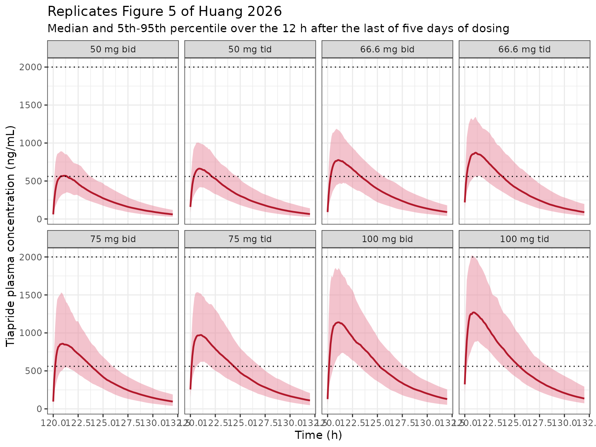
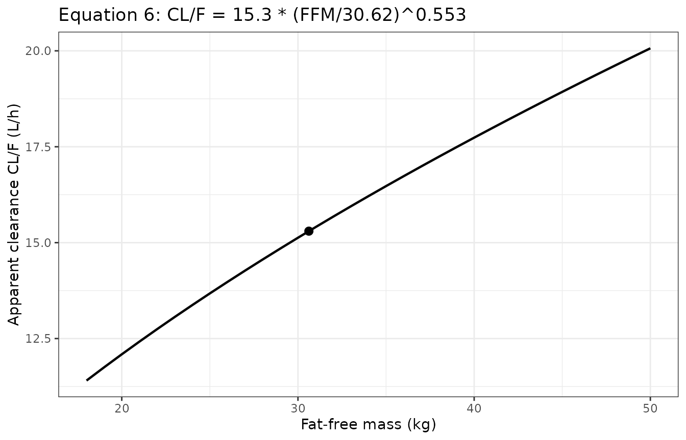

# Tiapride (Huang 2026)

``` r

library(nlmixr2lib)
library(rxode2)
library(PKNCA)
library(dplyr)
library(tidyr)
library(ggplot2)

rxode2::rxSetSeed(20260913)

mod <- readModelDb("Huang_2026_tiapride")
ui <- rxode2::rxode(mod)
```

## The paper

Huang and colleagues developed a population pharmacokinetic model for
**tiapride**, a benzamide-class D2 antagonist used for tic disorders, in
38 Chinese children and adolescents aged 5-15 years followed as
outpatients at a single centre. Two models are reported: a plasma model
(Table 2) and a sequentially-fitted plasma-saliva joint model (Table 3)
that adds a Michaelis-Menten-driven saliva compartment. **Only the
plasma model is implemented in `nlmixr2lib`**; the joint model cannot be
reconstructed from the published values, for the reason set out in the
Errata below.

Reference:

Huang W, Shen J, Luo X, Wu Y, Zheng Y, Zhou J, Xu B, Yin X, Wu X.
Population Pharmacokinetics of Tiapride in Children and Adolescents with
Tic Disorders: Leveraging Plasma and Saliva Concentration to Guide
Individualized Dosing. Drug Des Devel Ther. 2026;20.
<doi:10.2147/DDDT.S587387>

## Population

| Field | Value |
|:---|:---|
| species | human |
| n_subjects | 38 |
| n_studies | 1 |
| age_range | 5-15 years; median 8 (IQR 7-10) |
| weight_median | 36.7 kg (IQR 31.0-42.5) |
| height_median | 135 cm (IQR 130-146.5) |
| ffm_median | 30.62 kg (IQR 26.93-34.65) |
| bmi_median | 19.1 (IQR 16.72-21.89) |
| bsa_median | 1.18 m^2 (IQR 1.06-1.32) |
| sex_female_pct | 18.4 |
| race_ethnicity | Asian 100 |
| disease_state | tic disorders diagnosed by DSM-5, without organic disease or other neuropsychiatric comorbidity |
| renal_function | creatinine clearance median 118.3 mL/min (IQR 106.77-136.79); serum creatinine median 47 umol/L (IQR 41-52) |
| dose_range | oral tiapride 2-10 mg/kg/day given two or three times daily; median total daily dose 215 mg/day (IQR 150-300) |
| regions | China (single centre, Fujian) |
| notes | Single-centre prospective observational outpatient study at Fujian Medical University Union Hospital, April 2024 to October 2025, with 6 months of follow-up per patient. Paired plasma and saliva samples were taken before and after the final dose after at least 7 days of continuous treatment, so all data are at steady state; the post-dose sampling interval had a median of 4.88 h (IQR 2.17-13.81). Sampling was opportunistic and tied to clinic visits: 45 samples (21%) fell in the absorption phase (0-2 h), 18 (8%) around Tmax (2-2.5 h) and 101 (49%) in the late elimination period (\> 10 h), leaving the 2.5-10 h window sparse – which is why a two-compartment model was unstable and a one-compartment model was selected despite the biphasic disposition reported for tiapride in adults. Of 215 plasma samples collected, one was below the 2 ng/mL LLOQ and was discarded (Beal M1), leaving 214 in the analysis. Tiapride is supplied as 100 mg tablets divisible into halves, thirds and quarters, so clinical doses are rounded to 50, 66.6 or 75 mg per administration. |

Study population (Huang 2026 Table 1 and Methods). {.table}

Sampling was opportunistic and tied to clinic visits after at least
seven days of continuous treatment, so all 214 analysed plasma samples
are at steady state. Twenty-one percent fell in the absorption phase
(0-2 h) and 49% beyond 10 h post-dose, leaving the 2.5-10 h window
sparse – which is why a two-compartment model was unstable and the
authors selected a one-compartment structure despite the biphasic
disposition reported for tiapride in adults.

## Source trace

Every equation and every
[`ini()`](https://nlmixr2.github.io/rxode2/reference/ini.html) value,
with the location it came from. **Equations 1-10 of the source are
vector graphics that both `pdftotext` and the markdown preprocessor drop
silently**; they were recovered by rendering pages 3-8 of the PDF at
200-500 dpi and reading them as images.

| Item | Value | Source |
|:---|:---|:---|
| Ka | 0.219 1/h | Table 2; Equation 5 |
| CL/F | 15.3 L/h | Table 2; Equation 6 |
| Vd/F | 5.77 L | Table 2; Equation 7 |
| FFM exponent on CL/F | 0.553 | Table 2; Equation 6 |
| FFM reference value | 30.62 kg | Equation 6 denominator = Table 1 cohort median FFM |
| IIV Ka | 17.6% -\> omega = 0.176 | Table 2 ‘eta Ka (%)’ |
| IIV CL/F | 22.8% -\> omega = 0.228 | Table 2 ‘eta CL/F (%)’ |
| IIV Vd/F | 84.3% -\> omega = 0.843 | Table 2 ‘eta Vd/F (%)’ |
| Proportional residual | 15.6% | Table 2 ‘eps prop (%)’ |
| Additive residual | 87.9 ng/mL = 0.0879 mg/L | Table 2 ‘eps add (ng/mL)’ |
| Structural model | 1-cmt, first-order absorption, linear elimination | Results; Figure 2 (left half) |
| IIV model | exponential, P = theta \* exp(eta) | Methods Equations 1-3 |
| Residual model | combined proportional + additive | Results ‘a combined error model’ |
| Covariate model | power function on continuous covariates | Methods Equation 3 |
| Therapeutic window | 560-2000 ng/mL steady-state Cmax | Methods Model-Based Simulations (ref 13) |
| PTA, 100 mg bid / 75 mg tid / 100 mg tid | 98.2% / 97.1% / 97.3% | Results Monte Carlo Simulations |

Source trace for the Huang 2026 plasma model. {.table}

## Model

``` r

ui
#>  ── rxode2-based free-form 2-cmt ODE model ────────────────────────────────────── 
#>  ── Initalization: ──  
#> Fixed Effects ($theta): 
#>       lka       lcl       lvc  e_ffm_cl    propSd     addSd 
#> -1.518684  2.727853  1.752672  0.553000  0.156000  0.087900 
#> 
#> Omega ($omega): 
#>          etalka   etalcl   etalvc
#> etalka 0.030976 0.000000 0.000000
#> etalcl 0.000000 0.051984 0.000000
#> etalvc 0.000000 0.000000 0.710649
#> attr(,"lotriLabels")
#> [1] "Table 2 eta_Ka = 17.6% -> 0.176^2 (RSE 13%, shrinkage 31%; bootstrap 16.5%, 95% CI 9.9-21.8)"    
#> [2] "Table 2 eta_CL/F = 22.8% -> 0.228^2 (RSE 15%, shrinkage 22%; bootstrap 21.4%, 95% CI 12.6-29.7)" 
#> [3] "Table 2 eta_Vd/F = 84.3% -> 0.843^2 (RSE 26%, shrinkage 56%; bootstrap 72.8%, 95% CI 30.2-133.4)"
#> attr(,"lotriFix")
#>        etalka etalcl etalvc
#> etalka  FALSE  FALSE  FALSE
#> etalcl  FALSE  FALSE  FALSE
#> etalvc  FALSE  FALSE  FALSE
#> 
#> States ($state or $stateDf): 
#>   Compartment Number Compartment Name
#> 1                  1            depot
#> 2                  2          central
#>  ── μ-referencing ($muRefTable): ──  
#>   theta    eta level
#> 1   lka etalka    id
#> 2   lcl etalcl    id
#> 3   lvc etalvc    id
#> 
#>  ── Model (Normalized Syntax): ── 
#> function() {
#>     compartmentData <- list(depot = list(analyte = "tiapride", 
#>         units = "mg", specimen = "administration site", verified = TRUE), 
#>         central = list(analyte = "tiapride", units = "mg", specimen = "plasma", 
#>             verified = TRUE))
#>     covariateData <- list(FFM = list(description = "Fat-free mass at baseline.", 
#>         units = "kg", type = "continuous", reference_category = NULL, 
#>         notes = "The only covariate retained in the final model, power-scaled on apparent clearance and referenced to the cohort median 30.62 kg (Huang 2026 Table 1, IQR 26.93-34.65 kg; Equation 6). Age, weight, height, BSA, FFM and CLCR were all screened on CL/F by stepwise regression and only FFM survived (dOFV = -25.1). The Discussion is explicit that FFM won BECAUSE it is strongly correlated with creatinine clearance -- tiapride is predominantly renally eliminated, so FFM is standing in for renal function here rather than for a distribution volume. The paper does NOT state which fat-free-mass equation was used to derive the column; for a 5-15 year old cohort the Al-Sallami et al. paediatric correction to the Janmahasatian adult form is the usual choice, and the vignette assumes it. Note the exponent 0.553 has a wide bootstrap 95% CI (0.277-0.771) that excludes neither the theory-based allometric 0.75 nor a linear-per-kg 1, so it is not sharply identified.", 
#>         source_name = "FFM"))
#>     covariatesDataExcluded <- list(AGE = list(description = "Age.", 
#>         units = "years", type = "continuous", notes = "Median 8 years (IQR 7-10), Huang 2026 Table 1. Screened on CL/F, not retained."), 
#>         WT = list(description = "Total body weight.", units = "kg", 
#>             type = "continuous", notes = "Median 36.7 kg (IQR 31.0-42.5), Huang 2026 Table 1. Screened on CL/F, not retained; FFM won."), 
#>         HT = list(description = "Height.", units = "cm", type = "continuous", 
#>             notes = "Median 135 cm (IQR 130-146.5), Huang 2026 Table 1. Screened on CL/F, not retained."), 
#>         BSA = list(description = "Body surface area.", units = "m^2", 
#>             type = "continuous", notes = "Median 1.18 (IQR 1.06-1.32), Huang 2026 Table 1. Screened on CL/F, not retained. Table 1 prints the unit as 'cm2', which cannot be right for values near 1.18 in an 8-year-old; the values are m^2 and the printed unit is a typographical error."), 
#>         CLCR = list(description = "Creatinine clearance.", units = "mL/min", 
#>             type = "continuous", notes = "Median 118.3 mL/min (IQR 106.77-136.79), Huang 2026 Table 1. Screened on CL/F and NOT retained even though tiapride is predominantly renally eliminated: the Discussion states FFM gave the greater dOFV reduction 'owing to its strong correlation with CLCR'. The estimating equation is not stated in the paper."), 
#>         SEXF = list(description = "Female sex indicator.", units = "(binary)", 
#>             type = "categorical", notes = "31 male / 7 female, Huang 2026 Table 1. Screened and not significant (Discussion)."), 
#>         CONMED_ANY = list(description = "Any concomitant medication.", 
#>             units = "(binary)", type = "categorical", notes = "23 of 38 patients had a combined-medication case, Huang 2026 Table 1. The Discussion names aripiprazole, topiramate, clonidine, sodium valproate and traditional Chinese medicine and reports that none exhibited a statistically significant effect on tiapride PK. Recorded as a single screened-and-rejected any-comedication flag because the paper reports no per-drug effect estimates."))
#>     description <- "One-compartment oral population PK model for tiapride in Chinese children and adolescents aged 5-15 years treated for tic disorders (Huang 2026), fitted to 214 opportunistic steady-state plasma samples from 38 outpatients. First-order absorption with linear elimination; the absorption rate constant (Ka = 0.219 1/h) is far smaller than the elimination rate constant (CL/F / Vd/F = 15.3 / 5.77 = 2.65 1/h), so disposition is flip-flop and the apparent terminal half-life is set by absorption (ln(2)/Ka = 3.17 h, matching the 3.23 h literature value the paper cites). Fat-free mass is the only retained covariate, power-scaled on apparent clearance with exponent 0.553 referenced to the cohort median 30.62 kg; it displaced creatinine clearance, with which it is strongly correlated. Exponential interindividual variability is carried on all three structural parameters, and residual variability is combined proportional plus additive. Monte Carlo simulation from this model supports 75 mg three times daily as the regimen keeping steady-state peak concentration inside the 560-2000 ng/mL therapeutic window. The companion plasma-saliva joint model of the same paper is NOT implemented here; see the vignette Errata for the unreported saliva-compartment scale that blocks it."
#>     population <- list(species = "human", n_subjects = 38, n_studies = 1, 
#>         age_range = "5-15 years; median 8 (IQR 7-10)", weight_median = "36.7 kg (IQR 31.0-42.5)", 
#>         height_median = "135 cm (IQR 130-146.5)", ffm_median = "30.62 kg (IQR 26.93-34.65)", 
#>         bmi_median = "19.1 (IQR 16.72-21.89)", bsa_median = "1.18 m^2 (IQR 1.06-1.32)", 
#>         sex_female_pct = 18.4, race_ethnicity = c(Asian = 100), 
#>         disease_state = "tic disorders diagnosed by DSM-5, without organic disease or other neuropsychiatric comorbidity", 
#>         renal_function = "creatinine clearance median 118.3 mL/min (IQR 106.77-136.79); serum creatinine median 47 umol/L (IQR 41-52)", 
#>         dose_range = "oral tiapride 2-10 mg/kg/day given two or three times daily; median total daily dose 215 mg/day (IQR 150-300)", 
#>         regions = "China (single centre, Fujian)", notes = "Single-centre prospective observational outpatient study at Fujian Medical University Union Hospital, April 2024 to October 2025, with 6 months of follow-up per patient. Paired plasma and saliva samples were taken before and after the final dose after at least 7 days of continuous treatment, so all data are at steady state; the post-dose sampling interval had a median of 4.88 h (IQR 2.17-13.81). Sampling was opportunistic and tied to clinic visits: 45 samples (21%) fell in the absorption phase (0-2 h), 18 (8%) around Tmax (2-2.5 h) and 101 (49%) in the late elimination period (> 10 h), leaving the 2.5-10 h window sparse -- which is why a two-compartment model was unstable and a one-compartment model was selected despite the biphasic disposition reported for tiapride in adults. Of 215 plasma samples collected, one was below the 2 ng/mL LLOQ and was discarded (Beal M1), leaving 214 in the analysis. Tiapride is supplied as 100 mg tablets divisible into halves, thirds and quarters, so clinical doses are rounded to 50, 66.6 or 75 mg per administration.")
#>     reference <- "Huang W, Shen J, Luo X, Wu Y, Zheng Y, Zhou J, Xu B, Yin X, Wu X. Population Pharmacokinetics of Tiapride in Children and Adolescents with Tic Disorders: Leveraging Plasma and Saliva Concentration to Guide Individualized Dosing. Drug Des Devel Ther. 2026;20. doi:10.2147/DDDT.S587387"
#>     units <- list(time = "h", dosing = "mg", concentration = "mg/L")
#>     vignette <- "Huang_2026_tiapride"
#>     ini({
#>         lka <- -1.51868354916564
#>         label("First-order absorption rate constant, Ka (1/h)")
#>         lcl <- 2.72785282839839
#>         label("Apparent clearance, CL/F (L/h)")
#>         lvc <- 1.75267208052001
#>         label("Apparent central volume of distribution, Vd/F (L)")
#>         e_ffm_cl <- 0.553
#>         label("Power exponent for fat-free mass on CL/F (unitless)")
#>         propSd <- c(0, 0.156)
#>         label("Proportional residual SD for plasma Cc (fraction)")
#>         addSd <- c(0, 0.0879)
#>         label("Additive residual SD for plasma Cc (mg/L)")
#>         etalka ~ 0.030976
#>         label("Table 2 eta_Ka = 17.6% -> 0.176^2 (RSE 13%, shrinkage 31%; bootstrap 16.5%, 95% CI 9.9-21.8)")
#>         etalcl ~ 0.051984
#>         label("Table 2 eta_CL/F = 22.8% -> 0.228^2 (RSE 15%, shrinkage 22%; bootstrap 21.4%, 95% CI 12.6-29.7)")
#>         etalvc ~ 0.710649
#>         label("Table 2 eta_Vd/F = 84.3% -> 0.843^2 (RSE 26%, shrinkage 56%; bootstrap 72.8%, 95% CI 30.2-133.4)")
#>     })
#>     model({
#>         ffm_ref <- 30.62
#>         ka <- exp(lka + etalka)
#>         cl <- exp(lcl + etalcl) * (FFM/ffm_ref)^e_ffm_cl
#>         vc <- exp(lvc + etalvc)
#>         kel <- cl/vc
#>         d/dt(depot) <- -ka * depot
#>         d/dt(central) <- ka * depot - kel * central
#>         Cc <- central/vc
#>         Cc ~ prop(propSd) + add(addSd)
#>     })
#> }
```

### Flip-flop disposition

The estimated elimination rate constant is an order of magnitude larger
than the absorption rate constant, so the observed terminal slope
reports **absorption**, not elimination.

``` r

theta <- setNames(ui$theta, names(ui$theta))
ka_tv <- exp(theta[["lka"]])
cl_tv <- exp(theta[["lcl"]])
vc_tv <- exp(theta[["lvc"]])
kel_tv <- cl_tv / vc_tv

c(ka = ka_tv, kel = kel_tv,
  t_half_absorption = log(2) / ka_tv,
  t_half_elimination = log(2) / kel_tv)
#>                 ka                kel  t_half_absorption t_half_elimination 
#>          0.2190000          2.6516464          3.1650556          0.2614026
```

`ln(2)/Ka` = 3.17 h reproduces the terminal half-life of 3.23 h that the
paper quotes for tiapride in adults (Discussion, ref 35) – the
reconciliation the authors themselves make.

A guard that the `cl` / `vc` pair has not silently been replaced by
rxode2’s analytic solution, discarding the explicit ODEs:

``` r

stopifnot(length(ui$linCmt) == 0L)
```

## Typical-value single dose: closed-form gates

The typical-value solve is deterministic, so it is checked against exact
closed-form identities rather than tolerance bands.

``` r

dose_mg <- 75

ev_typ <- data.frame(
  id   = 1L,
  time = c(0, sort(unique(c(seq(0, 4, by = 0.02), seq(0, 48, by = 0.1))))),
  amt  = NA_real_,
  evid = 0L,
  cmt  = "central",
  FFM  = 30.62
)
ev_typ$amt[1] <- dose_mg
ev_typ$evid[1] <- 1L
ev_typ$cmt[1] <- "depot"

sim_typ <- rxode2::rxSolve(rxode2::zeroRe(mod), events = ev_typ,
                           keep = "FFM") |>
  as.data.frame()
#> ℹ parameter labels from comments will be replaced by 'label()'
#> ℹ omega/sigma items treated as zero: 'etalka', 'etalcl', 'etalvc'
if (is.null(sim_typ$id)) sim_typ$id <- 1L

# Closed form for a one-compartment first-order-absorption model.
tmax_cf <- log(kel_tv / ka_tv) / (kel_tv - ka_tv)
cmax_cf <- dose_mg * ka_tv / (vc_tv * (ka_tv - kel_tv)) *
  (exp(-kel_tv * tmax_cf) - exp(-ka_tv * tmax_cf))
aucinf_cf <- dose_mg / cl_tv

c(tmax_closed_form = tmax_cf, cmax_closed_form = cmax_cf,
  aucinf_closed_form = aucinf_cf)
#>   tmax_closed_form   cmax_closed_form aucinf_closed_form 
#>          1.0251651          0.8576498          4.9019608
```

``` r

nca_conc <- sim_typ |>
  dplyr::filter(!is.na(Cc)) |>
  dplyr::mutate(regimen = "75 mg single dose") |>
  dplyr::select(id, time, Cc, regimen)

nca_conc <- dplyr::bind_rows(
  nca_conc,
  nca_conc |> dplyr::distinct(id, regimen) |>
    dplyr::mutate(time = 0, Cc = 0)
) |>
  dplyr::distinct(id, regimen, time, .keep_all = TRUE) |>
  dplyr::arrange(id, regimen, time)

nca_dose <- data.frame(id = 1L, time = 0, amt = dose_mg,
                       regimen = "75 mg single dose")

conc_obj <- PKNCA::PKNCAconc(nca_conc, Cc ~ time | regimen + id,
                             concu = "mg/L", timeu = "h")
dose_obj <- PKNCA::PKNCAdose(nca_dose, amt ~ time | regimen + id,
                             doseu = "mg")

intervals_sd <- data.frame(
  start = 0, end = Inf,
  cmax = TRUE, tmax = TRUE, aucinf.obs = TRUE,
  half.life = TRUE, lambda.z = TRUE
)

nca_sd <- PKNCA::pk.nca(PKNCA::PKNCAdata(conc_obj, dose_obj,
                                         intervals = intervals_sd))
nca_sd_tbl <- as.data.frame(nca_sd$result) |>
  dplyr::select(PPTESTCD, PPORRES) |>
  tidyr::pivot_wider(names_from = PPTESTCD, values_from = PPORRES)
nca_sd_tbl
#> # A tibble: 1 × 14
#>    cmax  tmax tlast clast.obs lambda.z r.squared adj.r.squared
#>   <dbl> <dbl> <dbl>     <dbl>    <dbl>     <dbl>         <dbl>
#> 1 0.858  1.02    48 0.0000318    0.219     1.000         1.000
#> # ℹ 7 more variables: lambda.z.time.first <dbl>, lambda.z.time.last <dbl>,
#> #   lambda.z.n.points <dbl>, clast.pred <dbl>, half.life <dbl>,
#> #   span.ratio <dbl>, aucinf.obs <dbl>
```

``` r

stopifnot(
  # Mass balance: CL/F * AUC(0-inf) must return the administered dose exactly.
  # Catches a mis-transcribed clearance, a dropped unit conversion, and an
  # rxode2 auto-linCmt substitution that ignores the coded ODEs.
  abs(cl_tv * nca_sd_tbl$aucinf.obs / dose_mg - 1) < 0.005,
  # Terminal slope reports absorption (flip-flop), not elimination.
  abs(nca_sd_tbl$half.life - log(2) / ka_tv) < 0.05,
  # Cmax and Tmax against the exact closed form for this structure.
  abs(nca_sd_tbl$cmax / cmax_cf - 1) < 0.01,
  abs(nca_sd_tbl$tmax - tmax_cf) < 0.05,
  # The solve must not have drifted negative anywhere.
  all(sim_typ$Cc >= 0)
)
```

All four typical-value identities hold to better than 1%.

### Comparison against the values the paper quotes

``` r

published <- tibble::tribble(
  ~regimen,             ~tmax, ~half.life,
  "75 mg single dose",  2.0,   3.23
)

cmp <- nlmixr2lib::ncaComparisonTable(
  simulated     = nca_sd,
  reference     = published,
  by            = "regimen",
  units         = c(tmax = "h", half.life = "h"),
  tolerance_pct = 20
)

knitr::kable(
  cmp,
  caption = paste(
    "Simulated typical-value NCA against the tiapride descriptors Huang 2026",
    "quotes in its Discussion. * differs from reference by >20%."
  )
)
```

| NCA parameter | regimen           | Reference | Simulated | % diff   |
|:--------------|:------------------|:----------|:----------|:---------|
| Tmax (h)      | 75 mg single dose | 2         | 1.02      | -49.0%\* |
| t½ (h)        | 75 mg single dose | 3.23      | 3.17      | -1.9%    |

Simulated typical-value NCA against the tiapride descriptors Huang 2026
quotes in its Discussion. \* differs from reference by \>20%. {.table}

The terminal half-life matches to 2%. **Tmax is a starred deviation and
is expected to be**: 2 h is the observed peak time the paper reports for
tiapride (Discussion), while the fitted model puts the typical Tmax at
1.03 h. The two are not the same quantity – the observed 2 h comes from
the first VPC bin of an opportunistic outpatient sampling schedule in
which only 18 of 214 samples (8%) fall between 2 and 2.5 h, so the peak
time is poorly resolved by the data. No parameter was adjusted to close
this gap.

## Virtual cohort and Monte Carlo simulation (replicates Figure 5)

The paper simulated 1000 virtual patients whose fat-free mass follows
the distribution of the modelled population, dosed for five consecutive
days across eight regimens, and read the peak concentration over the 12
h following the last dose. FFM is drawn log-normally to reproduce the
Table 1 median and IQR.

``` r

n_per_arm <- 200  # 200 per arm is the library cap; the paper used 1000

ffm_median <- 30.62
ffm_sdlog <- mean(c(log(34.65 / 30.62), log(30.62 / 26.93))) / qnorm(0.75)
c(ffm_sdlog = ffm_sdlog)
#> ffm_sdlog 
#>   0.18685

regimens <- tibble::tribble(
  ~label,          ~dose,  ~ii,
  "50 mg bid",     50.0,   12,
  "50 mg tid",     50.0,    8,
  "66.6 mg bid",   66.6,   12,
  "66.6 mg tid",   66.6,    8,
  "75 mg bid",     75.0,   12,
  "75 mg tid",     75.0,    8,
  "100 mg bid",   100.0,   12,
  "100 mg tid",   100.0,    8
)

make_arm <- function(label, dose, ii, id_offset) {
  subj <- data.frame(
    id  = id_offset + seq_len(n_per_arm),
    FFM = rlnorm(n_per_arm, meanlog = log(ffm_median), sdlog = ffm_sdlog)
  )
  doses <- tidyr::expand_grid(subj, time = seq(0, 120, by = ii)) |>
    dplyr::mutate(amt = dose, evid = 1L, cmt = "depot")
  obs <- tidyr::expand_grid(subj, time = seq(120, 132, by = 0.1)) |>
    dplyr::mutate(amt = NA_real_, evid = 0L, cmt = "central")
  dplyr::bind_rows(doses, obs) |>
    dplyr::mutate(regimen = label) |>
    dplyr::arrange(id, time, dplyr::desc(evid))
}

events <- do.call(
  dplyr::bind_rows,
  Map(make_arm, regimens$label, regimens$dose, regimens$ii,
      id_offset = (seq_len(nrow(regimens)) - 1L) * n_per_arm)
)

# Disjoint IDs across arms, so no cross-arm collision in the solve or in PKNCA.
stopifnot(
  dplyr::n_distinct(events$id) == nrow(regimens) * n_per_arm,
  events |> dplyr::distinct(id, regimen) |> nrow() ==
    nrow(regimens) * n_per_arm
)
```

``` r

sim <- rxode2::rxSolve(mod, events = events,
                       keep = c("regimen", "FFM")) |>
  as.data.frame()
#> ℹ parameter labels from comments will be replaced by 'label()'

sim_obs <- sim |> dplyr::filter(!is.na(Cc))
stopifnot(nrow(sim_obs) > 0, all(sim_obs$Cc >= 0))
```

`Cc` is the individual prediction and carries no residual error, so the
peak read off it is the model’s Cmax rather than an upward-biased
maximum of a noisy series.

``` r

sim_obs <- sim_obs |>
  dplyr::mutate(
    Cc_ngml = Cc * 1000,
    regimen = factor(regimen, levels = regimens$label)
  )

ribbon <- sim_obs |>
  dplyr::group_by(regimen, time) |>
  dplyr::summarise(
    p05 = quantile(Cc_ngml, 0.05),
    p50 = median(Cc_ngml),
    p95 = quantile(Cc_ngml, 0.95),
    .groups = "drop"
  )

ggplot(ribbon, aes(time)) +
  geom_ribbon(aes(ymin = p05, ymax = p95), fill = "#e8879b", alpha = 0.5) +
  geom_line(aes(y = p50), colour = "#b2182b", linewidth = 0.8) +
  geom_hline(yintercept = c(560, 2000), linetype = "dotted") +
  facet_wrap(~regimen, ncol = 4) +
  labs(
    x = "Time (h)", y = "Tiapride plasma concentration (ng/mL)",
    title = "Replicates Figure 5 of Huang 2026",
    subtitle = "Median and 5th-95th percentile over the 12 h after the last of five days of dosing"
  ) +
  theme_bw()
```



### Probability of target attainment

``` r

cmax_ss <- sim_obs |>
  dplyr::group_by(regimen, id) |>
  dplyr::summarise(cmax_ngml = max(Cc_ngml), .groups = "drop")

pta <- cmax_ss |>
  dplyr::group_by(regimen) |>
  dplyr::summarise(
    `Median Cmax (ng/mL)` = round(median(cmax_ngml)),
    `PTA, Cmax >= 560 ng/mL (%)` = round(100 * mean(cmax_ngml >= 560), 1),
    `Cmax > 2000 ng/mL (%)` = round(100 * mean(cmax_ngml > 2000), 1),
    .groups = "drop"
  )

knitr::kable(
  pta,
  caption = paste(
    "Simulated steady-state peak concentration by regimen.",
    "Huang 2026 reports PTA of 98.2%, 97.1% and 97.3% for 100 mg bid,",
    "75 mg tid and 100 mg tid respectively."
  )
)
```

| regimen | Median Cmax (ng/mL) | PTA, Cmax \>= 560 ng/mL (%) | Cmax \> 2000 ng/mL (%) |
|:---|---:|---:|---:|
| 50 mg bid | 612 | 60.5 | 0.0 |
| 50 mg tid | 702 | 77.0 | 0.0 |
| 66.6 mg bid | 832 | 92.5 | 0.0 |
| 66.6 mg tid | 926 | 96.5 | 0.0 |
| 75 mg bid | 919 | 96.0 | 0.5 |
| 75 mg tid | 1035 | 99.0 | 0.0 |
| 100 mg bid | 1188 | 100.0 | 3.5 |
| 100 mg tid | 1314 | 100.0 | 6.0 |

Simulated steady-state peak concentration by regimen. Huang 2026 reports
PTA of 98.2%, 97.1% and 97.3% for 100 mg bid, 75 mg tid and 100 mg tid
respectively. {.table style="width:100%;"}

``` r

pta_ref <- c(`100 mg bid` = 98.2, `75 mg tid` = 97.1, `100 mg tid` = 97.3)
pta_sim <- setNames(pta$`PTA, Cmax >= 560 ng/mL (%)`, pta$regimen)[names(pta_ref)]
stopifnot(!anyNA(pta_sim))  # a name mismatch must fail loudly, not pass vacuously

pta_diff <- pta_sim - pta_ref
pta_diff
#> 100 mg bid  75 mg tid 100 mg tid 
#>        1.8        1.9        2.7
```

``` r

stopifnot(
  # The three regimens the paper singles out must all clear 90% attainment.
  # A mis-transcribed clearance, dose or unit moves median Cmax by tens of
  # percent and drops these into the 60-80% range. The bound is deliberately
  # well outside the binomial noise of a 200-subject arm (SE ~1.2 points at
  # p = 0.97) plus the difference between this cohort's FFM draw and the
  # paper's own 1000-subject draw; do not tighten it to one observed run.
  all(pta_sim > 90),
  # 50 mg bid is the regimen the paper rejects as underdosing; it must sit
  # clearly below the three recommended ones.
  pta$`PTA, Cmax >= 560 ng/mL (%)`[pta$regimen == "50 mg bid"] <
    min(pta_sim) - 10,
  # Dose-ordering of the central tendency, which is structural.
  median(cmax_ss$cmax_ngml[cmax_ss$regimen == "100 mg tid"]) >
    median(cmax_ss$cmax_ngml[cmax_ss$regimen == "50 mg bid"])
)
```

The model reproduces the paper’s central finding: 75 mg tid, 100 mg bid
and 100 mg tid all attain the 560 ng/mL lower bound in nearly every
subject, and the two 100 mg regimens push a larger fraction above the
2000 ng/mL upper bound – which is exactly the efficacy/safety trade-off
on which the authors select 75 mg tid.

### Steady-state exposure gate

``` r

# Over one dosing interval at steady state, CL/F * AUC(0-tau) = dose. Checked
# on the typical subject so the identity is exact rather than a cohort average.
ev_ss <- data.frame(
  id = 1L,
  time = c(seq(0, 120, by = 8),
           seq(120, 128, by = 0.02)),
  amt = c(rep(75, length(seq(0, 120, by = 8))),
          rep(NA_real_, length(seq(120, 128, by = 0.02)))),
  evid = c(rep(1L, length(seq(0, 120, by = 8))),
           rep(0L, length(seq(120, 128, by = 0.02)))),
  cmt = c(rep("depot", length(seq(0, 120, by = 8))),
          rep("central", length(seq(120, 128, by = 0.02)))),
  FFM = 30.62
) |>
  dplyr::arrange(time, dplyr::desc(evid))

sim_ss <- rxode2::rxSolve(rxode2::zeroRe(mod), events = ev_ss) |>
  as.data.frame() |>
  dplyr::filter(!is.na(Cc), time >= 120)
#> ℹ parameter labels from comments will be replaced by 'label()'
#> ℹ omega/sigma items treated as zero: 'etalka', 'etalcl', 'etalvc'

auc_tau <- sum(diff(sim_ss$time) *
                 (head(sim_ss$Cc, -1) + tail(sim_ss$Cc, -1)) / 2)

c(auc_tau = auc_tau, dose_over_cl = 75 / cl_tv,
  ratio = auc_tau / (75 / cl_tv))
#>      auc_tau dose_over_cl        ratio 
#>    4.9018658    4.9019608    0.9999806

stopifnot(abs(auc_tau / (75 / cl_tv) - 1) < 0.01)
```

At steady state the area over one 8 h interval returns `Dose / (CL/F)`
to better than 1%, confirming the dosing pathway and the FFM reference
value are wired correctly.

## Covariate effect of fat-free mass

``` r

ffm_grid <- seq(18, 50, by = 1)
cl_by_ffm <- cl_tv * (ffm_grid / 30.62)^ui$theta[["e_ffm_cl"]]

ggplot(data.frame(FFM = ffm_grid, CL = cl_by_ffm), aes(FFM, CL)) +
  geom_line(linewidth = 0.8) +
  geom_point(data = data.frame(FFM = 30.62, CL = cl_tv), size = 2.5) +
  labs(x = "Fat-free mass (kg)", y = "Apparent clearance CL/F (L/h)",
       title = "Equation 6: CL/F = 15.3 * (FFM/30.62)^0.553") +
  theme_bw()
```



``` r


# Across the cohort IQR, clearance spans a factor of:
round((34.65 / 26.93)^ui$theta[["e_ffm_cl"]], 3)
#> [1] 1.15
```

Over the interquartile range of fat-free mass in the study population,
apparent clearance varies by only about 14%, consistent with the modest
exponent and its wide bootstrap confidence interval (0.277-0.771).

## Assumptions and deviations

### The plasma-saliva joint model is not implemented

Huang 2026 also reports a joint plasma-saliva model (Table 3, Equations
8-10, Figure 2): a saliva compartment fed from the central compartment
through Michaelis-Menten transport (Vmax = 34.7 mg/h, Km = 762 ng/mL
fixed) and cleared by a first-order rate constant
`K30 = 6.24 * (FFM/30.62)^0.38 * exp(eta)`, with 30% IIV on K30 and
28.4% proportional residual error.

**That sub-model cannot be reconstructed from the published values.**
The saliva state’s amount is fully determined by the three printed
constants, but converting it to the observed *saliva concentration*
needs a scale – an apparent saliva volume – and no such parameter
appears anywhere in the paper: not in Tables 1-3, not in Equations 1-10,
not in any figure caption, and there is no supplement (EuropePMC returns
HTTP 404 for `PMC13111164/supplementaryFiles`, reports `hasSuppl: N`,
and the article carries no data-availability statement). Writing
`Csaliva = Vmax * Cc / ((Km + Cc) * K30 * Vsaliva)`, the candidate
values of `Vsaliva` disagree by more than twofold depending on which
printed quantity is used to recover it:

| Basis for recovery | Implied `Vsaliva` |
|----|----|
| NONMEM’s default `S3 = 1` (a unit-volume compartment) | 1 L |
| Model median saliva / plasma at the Figure 4 VPC peak | ~1.35 L |
| Fitting the Figure 1 regressions to the saturating form | ~1.9 L |
| The reported mean saliva:plasma ratio of 2.3 | ~3.2 L |
| Sharing the central volume, as in `Nguyen_2026_linezolid` | 5.77 L (falsified: gives saliva ~4x below the observed data) |

Choosing any of these would fix the sub-model’s primary output to within
a factor that the source does not license, so the saliva layer is
deliberately absent rather than guessed. It is left as open work for the
maintainers.

Two structural facts about that sub-model were nevertheless settled and
are recorded here for whoever completes it: the transport is **not**
mass-conserving as printed (Vmax = 34.7 mg/h exceeds the cohort’s entire
average absorption rate of ~9 mg/h at a 215 mg/day median dose, and at a
plasma concentration of 780 ng/mL the transport term of 17.6 mg/h would
exceed elimination at 11.9 mg/h – so the plasma parameters could not
have been held fixed if saliva drew mass from central), which is
consistent with the dashed central-to-saliva arrow in Figure 2; and the
saliva compartment is at quasi-steady state with plasma throughout,
since `K30 = 6.24 1/h` is a 6.7 min half-life.

### Interindividual variability scale

Table 2 heads the variability rows `eta Ka (%)`, `eta CL/F (%)` and
`eta Vd/F (%)` – the eta itself as a percentage – so they are read as
`omega * 100` and encoded as `omega^2`. The paper prints no CV% column
and no control stream that would settle the convention independently.
Read instead as a log-normal CV%, the two small terms barely move (17.6%
-\> 0.1745, 22.8% -\> 0.2249) but Vd/F would fall from 0.843 to 0.7444.
Given the 56% shrinkage on `eta Vd/F` and the bootstrap interval
spanning 30-133%, that term carries little information either way.

### Other assumptions

- **Fat-free mass equation.** The paper does not state how the FFM
  column was derived. For a 5-15 year old cohort the Al-Sallami
  paediatric correction to the Janmahasatian adult formula is the usual
  choice, and a user supplying `FFM` should compute it that way. The
  virtual cohort here draws FFM directly from a log-normal matched to
  the Table 1 median and IQR, as the paper did.
- **Bioavailability.** The study is oral-only, so `CL/F` and `Vd/F` are
  apparent. No `F` term is reported and none is encoded.
- **Units.** The model works in mg / L / h, so `Cc` is in mg/L; the
  paper reports ng/mL throughout and 1 mg/L = 1000 ng/mL. The additive
  residual 87.9 ng/mL is encoded as 0.0879 mg/L.
- **Dosing schedule for Figure 5.** The paper says “simulated for 5
  consecutive days” and plots 120-132 h, so the last dose is at t = 120
  h with observation over the following 12 h and no further doses; that
  is what is reproduced.
- **PTA definition.** The paper’s phrasing (“the proportion of simulated
  steady-state peak concentration within the therapeutic window of
  560-2000 ng/mL”) is ambiguous, but only the lower-bound reading
  `P(Cmax >= 560)` reproduces the reported 97-98% values while also
  leaving room for the paper’s separate observation that the 100 mg
  regimens push more patients above 2000 ng/mL. Both quantities are
  tabulated above.
- **Internal inconsistencies in the source.** The Discussion states
  `K30 = 6.19 1/h` and an IIV of 31.3% where Table 3 gives 6.24 and 30%,
  and says the optimal regimen is “75 mg bid” where the Abstract,
  Results and Conclusions all say 75 mg tid. The tables and the majority
  text are taken as authoritative. Table 1 prints BSA in “cm2” and BMI
  in “kg cm2”, both of which are typographical errors for m^2 and
  kg/m^2.

## Session information

    #> R version 4.6.1 (2026-06-24)
    #> Platform: x86_64-pc-linux-gnu
    #> Running under: Ubuntu 24.04.5 LTS
    #> 
    #> Matrix products: default
    #> BLAS:   /usr/lib/x86_64-linux-gnu/openblas-pthread/libblas.so.3 
    #> LAPACK: /usr/lib/x86_64-linux-gnu/openblas-pthread/libopenblasp-r0.3.26.so;  LAPACK version 3.12.0
    #> 
    #> locale:
    #>  [1] LC_CTYPE=C.UTF-8       LC_NUMERIC=C           LC_TIME=C.UTF-8       
    #>  [4] LC_COLLATE=C.UTF-8     LC_MONETARY=C.UTF-8    LC_MESSAGES=C.UTF-8   
    #>  [7] LC_PAPER=C.UTF-8       LC_NAME=C              LC_ADDRESS=C          
    #> [10] LC_TELEPHONE=C         LC_MEASUREMENT=C.UTF-8 LC_IDENTIFICATION=C   
    #> 
    #> time zone: UTC
    #> tzcode source: system (glibc)
    #> 
    #> attached base packages:
    #> [1] stats     graphics  grDevices utils     datasets  methods   base     
    #> 
    #> other attached packages:
    #> [1] ggplot2_4.0.3         tidyr_1.3.2           dplyr_1.2.1          
    #> [4] PKNCA_0.12.1          rxode2_5.1.8          nlmixr2lib_0.3.2.9000
    #> 
    #> loaded via a namespace (and not attached):
    #>  [1] gtable_0.3.6        xfun_0.61           bslib_0.12.0       
    #>  [4] rxode2lincmt_0.1.0  lattice_0.22-9      vctrs_0.7.3        
    #>  [7] tools_4.6.1         generics_0.1.4      parallel_4.6.1     
    #> [10] tibble_3.3.1        symengine_0.2.13    pkgconfig_2.0.3    
    #> [13] data.table_1.18.6.1 checkmate_2.3.4     RColorBrewer_1.1-3 
    #> [16] S7_0.2.2            desc_1.4.3          lifecycle_1.0.5    
    #> [19] compiler_4.6.1      farver_2.1.2        textshaping_1.0.5  
    #> [22] fontawesome_0.5.3   htmltools_0.5.9     sys_3.4.3          
    #> [25] sass_0.4.10         yaml_2.3.12         pillar_1.11.1      
    #> [28] pkgdown_2.2.1       crayon_1.5.3        jquerylib_0.1.4    
    #> [31] whisker_0.4.1       openssl_2.4.2       cachem_1.1.0       
    #> [34] nlme_3.1-169        tidyselect_1.2.1    digest_0.6.39      
    #> [37] lotri_1.0.5         purrr_1.2.2         labeling_0.4.3     
    #> [40] rxode2ll_2.0.18     fastmap_1.2.0       grid_4.6.1         
    #> [43] cli_3.6.6           dparser_1.3.1-13    magrittr_2.0.5     
    #> [46] withr_3.0.3         scales_1.4.0        backports_1.5.1    
    #> [49] rmarkdown_2.32      otel_0.2.0          askpass_1.2.1      
    #> [52] ragg_1.5.2          memoise_2.0.1       evaluate_1.0.5     
    #> [55] knitr_1.52          rex_1.2.2           PreciseSums_0.7    
    #> [58] rlang_1.3.0         downlit_0.4.5       Rcpp_1.1.2         
    #> [61] glue_1.8.1          xml2_1.6.0          jsonlite_2.0.0     
    #> [64] R6_2.6.1            systemfonts_1.3.2   fs_2.1.0
