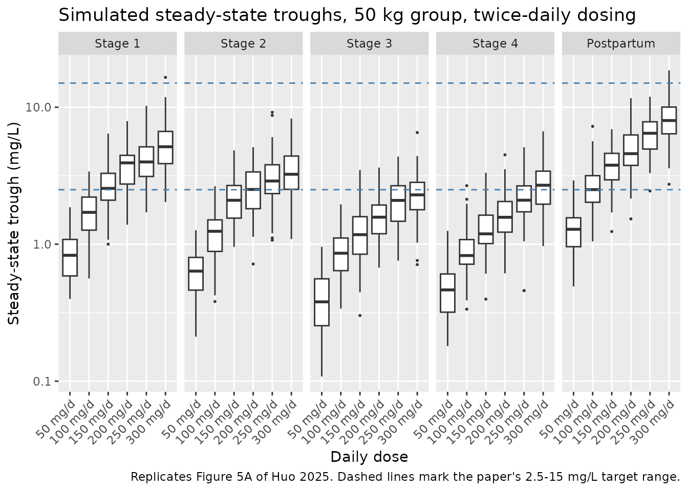
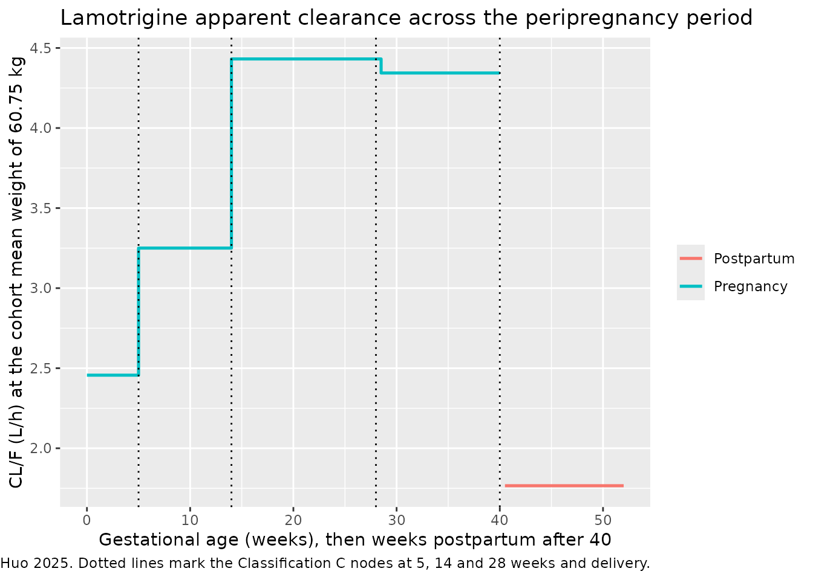

# Lamotrigine (Huo 2025)

## Model and source

- Citation: Huo J, Liu Y, Yang J, Chen M, Yang L, Wang L, Zhang D, Liu
  T, Gao W, Dai H, Mei S, Zhao Z. Dosing Optimization of Lamotrigine in
  Peripregnancy Epilepsy Through PopPK Modelling and Simulation. Drug
  Des Devel Ther. 2025;19:10243-10254. <doi:10.2147/DDDT.S541597>. PMCID
  PMC12645405. Structural equations from Eqs 1-5 (p 10246); covariate
  model from Eq 6 (p 10248) and the peripregnancy-stage / inhibitor
  coefficient block (p 10249); V/F from Eq 7 (p 10249); parameter
  estimates from Table 4 ‘Final Model’; peripregnancy staging from Table
  1 row C; cohort demographics from Table 2.
- Description: One-compartment population PK model with first-order
  absorption and elimination for lamotrigine (LTG) in 128 Chinese
  peripregnancy women with epilepsy on lamotrigine monotherapy (Huo 2025
  Eqs 1-7, Table 4 ‘Final Model’ column). Ka (1.93 1/h) and apparent
  volume V/F (68.8 L) were both FIXED from the literature because the
  therapeutic-drug-monitoring data were almost all steady-state troughs
  and carried no absorption or distribution information; apparent
  clearance CL/F was the only structural parameter estimated. CL/F =
  2.42 L/h at 59.8 kg and carries an estimated body-weight power
  exponent of 0.95, an exponential five-level peripregnancy-stage effect
  using the paper’s own Classification C staging (gestational-week nodes
  at 5, 14 and 28 weeks plus a postpartum level), and an exponential
  valproate-comedication effect that lowers CL/F by 45% (exp(-0.60)).
  Residual error is combined proportional plus additive. Fit in Phoenix
  NLME 8.3 by FOCE-ELS.
- Article: <https://doi.org/10.2147/DDDT.S541597>

Huo 2025 is a two-centre retrospective therapeutic-drug-monitoring
analysis of lamotrigine (LTG) in Chinese women with epilepsy across
pregnancy and the postpartum period. Its purpose is dosing optimisation:
apparent oral clearance CL/F is the only structural parameter estimated,
and everything else in the paper – the covariate model, the Monte Carlo
simulations, and the Table 6 dosing grid – follows from it.

## Population

128 women with epilepsy contributed 293 lamotrigine plasma
concentrations, collected at Beijing Tiantan Hospital and the Second
Affiliated Hospital of Zhejiang University between January 2015 and May
2024 (Huo 2025 Table 2). Mean age was 28.24 +/- 3.79 years (range 19-36)
and mean body weight 60.75 +/- 13.47 kg (range 40.00-114.00). All
patients were on lamotrigine monotherapy at daily doses of 25-800 mg
given in one or two divided doses; 42.19% took at least one concomitant
antiseizure medication, of which only valproate (3.91%, n = 5) entered
the final model. Observations were distributed across the paper’s five
peripregnancy stages as 13 / 63 / 111 / 84 / 22, and the postpartum
samples span 1-84 days after delivery.

The same information is available programmatically via
`readModelDb("Huo_2025_lamotrigine")()$population`.

## Source trace

Every `ini()` entry in
`inst/modeldb/specificDrugs/Huo_2025_lamotrigine.R` carries an in-file
comment naming its origin. They are collected here for review.

| Equation / parameter | Value | Source location |
|----|----|----|
| `d/dt(depot)`, `d/dt(central)`, `Cc` | n/a | Eqs 1-3, p 10246 |
| Exponential (“index”) IIV, `theta_i = theta_TV * exp(eta_i)` | n/a | Eq 4, p 10246 |
| Combined error, `Cobs = Cpred * (1 + eps1) + eps2` | n/a | Eq 5, p 10246 |
| CL/F covariate model | n/a | Eq 6, p 10248 |
| `lka` (Ka) | 1.93 1/h, FIXED | Base Model p 10246; Table 4 Ka row (no %RSE, no CI) |
| `lvc` (V/F) | 68.8 L, FIXED | Eq 7 p 10249; Base Model p 10246; Table 4 Vd row “68.8 (fixed)” |
| `lcl` (CL/F) | 2.42 L/h | Table 4 Final Model CL row (%RSE 12.17, 95% CI 1.84-3.00) |
| `e_wt_cl` | 0.95 | Eq 6 exponent; Table 4 “BW on CL” (%RSE 22.98, 95% CI 0.52-1.38) |
| body-weight reference | 59.8 kg | Eq 6 denominator, p 10248 |
| `e_pregstage2_cl` | 0.28 | Coefficient block p 10249; Table 4 “Peripregnancy stage2 on CL” |
| `e_pregstage3_cl` | 0.59 | Coefficient block p 10249; Table 4 “Peripregnancy stage3 on CL” |
| `e_pregstage4_cl` | 0.57 | Coefficient block p 10249; Table 4 “Peripregnancy stage4 on CL” |
| `e_postpartum_cl` | -0.33 | Coefficient block p 10249; Table 4 “Peripregnancy stage5 on CL” |
| `e_conmed_vpa_cl` | -0.60 | Coefficient block p 10249; Table 4 “Inhibitors on CL” |
| stage boundaries (5, 14, 28 weeks GA; postpartum) | n/a | Table 1 row C (“Classification C was selected for the model”) |
| `etalcl` | 0.10313 (= `log(0.3296^2 + 1)`) | Table 4 “IIV CL (CV%)” = 32.96%, via Eq 4 |
| `propSd` | 0.31 | Table 4 “sigma1 (multiplicative, CV)” (95% CI 0.27-0.34) |
| `addSd` | 0.004 mg/L | Table 4 “sigma2 (additive)” (95% CI 0.003-0.005) |

## Peripregnancy staging

The paper compared five candidate staging schemes (Table 1) and selected
Classification C, which splits pregnancy at 5, 14 and 28 gestational
weeks and adds a postpartum level. Classification C dropped the
objective function by 181.38, against 169.33 / 125.60 / 112.67 / 49.17
for schemes A / D / B / E.

The packaged model derives the stage inside `model()` from two canonical
covariates – `EGA` (maternal gestational age in weeks) and `TPP` (time
postpartum in weeks, 0 during pregnancy) – so a user supplies ordinary
covariate columns rather than a pre-computed categorical.

``` r

stages <- tibble::tribble(
  ~stage,               ~EGA, ~TPP, ~definition,
  "1 (< 5 wk GA)",         3,    0, "GA < 5 weeks (reference)",
  "2 (5-14 wk GA)",        9,    0, "5 <= GA < 14 weeks",
  "3 (14-28 wk GA)",      20,    0, "14 <= GA <= 28 weeks",
  "4 (> 28 wk to birth)", 34,    0, "28 < GA < delivery",
  "5 (postpartum)",        0,    4, "after delivery"
)
knitr::kable(stages, caption = "Huo 2025 Classification C (Table 1, row C).")
```

| stage                 | EGA | TPP | definition                |
|:----------------------|----:|----:|:--------------------------|
| 1 (\< 5 wk GA)        |   3 |   0 | GA \< 5 weeks (reference) |
| 2 (5-14 wk GA)        |   9 |   0 | 5 \<= GA \< 14 weeks      |
| 3 (14-28 wk GA)       |  20 |   0 | 14 \<= GA \<= 28 weeks    |
| 4 (\> 28 wk to birth) |  34 |   0 | 28 \< GA \< delivery      |
| 5 (postpartum)        |   0 |   4 | after delivery            |

Huo 2025 Classification C (Table 1, row C). {.table}

## Virtual cohort and simulation grid

Original observed data are not publicly available. The grid below is the
paper’s own simulation design: the three representative body weights it
used for the Monte Carlo work (50, 65 and 80 kg), crossed with the five
peripregnancy stages and with valproate presence, and dosed at the daily
amounts Table 6 recommends for each cell.

``` r

# Huo 2025 Table 6, "Dosage Recommendations Based on the Final Model",
# transcribed from the article PDF (the daily dose in mg for each
# stage / weight / inhibitor cell).
table6 <- tibble::tribble(
  ~stage_n, ~WT, ~CONMED_VPA, ~dose_mgd,
        1L,  50,          0L,      150,
        1L,  50,          1L,       50,
        1L,  65,          0L,      200,
        1L,  65,          1L,      100,
        1L,  80,          0L,      200,
        1L,  80,          1L,      150,
        2L,  50,          0L,      200,
        2L,  50,          1L,      100,
        2L,  65,          0L,      300,
        2L,  65,          1L,      100,
        2L,  80,          0L,      350,
        2L,  80,          1L,      150,
        3L,  50,          0L,      250,
        3L,  50,          1L,      150,
        3L,  65,          0L,      350,
        3L,  65,          1L,      200,
        3L,  80,          0L,      400,
        3L,  80,          1L,      250,
        4L,  50,          0L,      250,
        4L,  50,          1L,      150,
        4L,  65,          0L,      350,
        4L,  65,          1L,      200,
        4L,  80,          0L,      400,
        4L,  80,          1L,      250,
        5L,  50,          0L,      100,
        5L,  50,          1L,       50,
        5L,  65,          0L,      100,
        5L,  65,          1L,      100,
        5L,  80,          0L,      150,
        5L,  80,          1L,      150
) |>
  mutate(
    EGA  = c(3, 9, 20, 34, 0)[stage_n],
    TPP  = c(0, 0,  0,  0, 4)[stage_n],
    arm  = sprintf("S%d | %d kg | %s", stage_n, WT,
                   ifelse(CONMED_VPA == 1L, "VPA", "no VPA")),
    id   = row_number()
  )

stopifnot(nrow(table6) == 30L, !anyDuplicated(table6$arm))
```

The observation grid resolves the absorption peak (Tmax is near 2 h for
Ka = 1.93 1/h) and runs long enough for `aucinf.obs` to extrapolate
reliably even in the slowest arm (50 kg on valproate, terminal half-life
about 43 h).

``` r

obs_times <- sort(unique(c(
  seq(0, 12, by = 0.25),
  seq(13, 48, by = 1),
  seq(52, 336, by = 4)
)))

ev_dose <- table6 |>
  transmute(id, WT, EGA, TPP, CONMED_VPA, arm,
            time = 0, amt = dose_mgd, evid = 1L,
            cmt = "depot", Cc = NA_real_)

ev_obs <- table6 |>
  select(id, WT, EGA, TPP, CONMED_VPA, arm) |>
  tidyr::crossing(time = obs_times) |>
  mutate(amt = NA_real_, evid = 0L, cmt = "central", Cc = NA_real_)

events_sd <- bind_rows(ev_dose, ev_obs) |>
  arrange(id, time, desc(evid)) |>
  as.data.frame()

stopifnot(!anyDuplicated(unique(events_sd[, c("id", "time", "evid")])))
```

``` r

mod <- readModelDb("Huo_2025_lamotrigine")

# Typical-value profiles: the paper's CL/F equation is a typical-value
# statement, so between-subject variability is switched off for the
# structural checks below.
mod_typ <- rxode2::zeroRe(mod)
#> ℹ parameter labels from comments will be replaced by 'label()'

sim_sd <- rxode2::rxSolve(
  mod_typ,
  events = events_sd,
  keep   = c("arm", "WT", "CONMED_VPA")
) |>
  as.data.frame()
#> ℹ omega/sigma items treated as zero: 'etalcl'
#> Warning: multi-subject simulation without without 'omega'

stopifnot(nrow(sim_sd) > 0, all(sim_sd$Cc >= 0, na.rm = TRUE))
```

## PKNCA validation

`CL/F` is the paper’s single estimated structural parameter, and for a
single dose it is recoverable exactly as `dose / AUC(0-inf)`. Running
that recovery through PKNCA turns Eq 6 into a falsifiable statement: a
mis-transcribed clearance, weight exponent, stage coefficient or
valproate coefficient moves the recovered `CL/F` for the affected arms
and nothing else in the vignette would notice.

``` r

sim_nca <- sim_sd |>
  dplyr::filter(!is.na(Cc)) |>
  dplyr::select(id, time, Cc, arm)

# Guarantee a time = 0 record per subject; for an extravascular dose the
# pre-dose concentration is 0.
sim_nca <- dplyr::bind_rows(
  sim_nca,
  sim_nca |> dplyr::distinct(id, arm) |> dplyr::mutate(time = 0, Cc = 0)
) |>
  dplyr::distinct(id, arm, time, .keep_all = TRUE) |>
  dplyr::arrange(id, arm, time)

conc_obj <- PKNCA::PKNCAconc(sim_nca, Cc ~ time | arm + id)

dose_df <- events_sd |>
  dplyr::filter(evid == 1L) |>
  dplyr::select(id, time, amt, arm)

dose_obj <- PKNCA::PKNCAdose(dose_df, amt ~ time | arm + id)

intervals <- data.frame(
  start      = 0,
  end        = Inf,
  cmax       = TRUE,
  tmax       = TRUE,
  aucinf.obs = TRUE,
  half.life  = TRUE,
  cl.obs     = TRUE
)

nca_res <- PKNCA::pk.nca(PKNCA::PKNCAdata(conc_obj, dose_obj, intervals = intervals))

nca_wide <- as.data.frame(nca_res) |>
  dplyr::select(arm, PPTESTCD, PPORRES) |>
  tidyr::pivot_wider(names_from = PPTESTCD, values_from = PPORRES)

stopifnot(nrow(nca_wide) == 30L, !anyNA(nca_wide$aucinf.obs))
```

### Recovered CL/F against Huo 2025 Equation 6

The reference column below is Eq 6 evaluated arithmetically from the
values printed in the paper – it does not read anything out of the model
object, so the two sides of this comparison are genuinely independent.

``` r

# Huo 2025 Eq 6 (p 10248) plus the coefficient block on p 10249, written out
# from the printed numbers.
huo_eq6_clf <- function(WT, stage_n, CONMED_VPA) {
  stage_coef <- c(0, 0.28, 0.59, 0.57, -0.33)[stage_n]
  2.42 * (WT / 59.8)^0.95 * exp(stage_coef) * exp(-0.60 * CONMED_VPA)
}

published <- table6 |>
  transmute(
    arm,
    cl.obs = huo_eq6_clf(WT, stage_n, CONMED_VPA)
  )

cmp_clf <- nlmixr2lib::ncaComparisonTable(
  simulated = nca_wide |> select(arm, cl.obs),
  reference = published,
  by        = "arm",
  units     = c(cl.obs = "L/h"),
  tolerance_pct = 5
)

knitr::kable(
  cmp_clf,
  caption = paste(
    "Apparent oral clearance recovered by PKNCA as dose / AUC(0-inf) from the",
    "packaged model, against Huo 2025 Equation 6 evaluated directly.",
    "* marks rows differing by more than 5%."
  ),
  align = c("l", "l", "r", "r", "r")
)
```

| NCA parameter | arm                   | Reference | Simulated | % diff |
|:--------------|:----------------------|----------:|----------:|-------:|
| CL/F (L/h)    | S1 \| 50 kg \| no VPA |      2.04 |      2.04 |  +0.0% |
| CL/F (L/h)    | S1 \| 50 kg \| VPA    |      1.12 |      1.12 |  +0.0% |
| CL/F (L/h)    | S1 \| 65 kg \| no VPA |      2.62 |      2.62 |  +0.0% |
| CL/F (L/h)    | S1 \| 65 kg \| VPA    |      1.44 |      1.44 |  +0.0% |
| CL/F (L/h)    | S1 \| 80 kg \| no VPA |      3.19 |      3.19 |  +0.0% |
| CL/F (L/h)    | S1 \| 80 kg \| VPA    |      1.75 |      1.75 |  +0.0% |
| CL/F (L/h)    | S2 \| 50 kg \| no VPA |       2.7 |       2.7 |  +0.0% |
| CL/F (L/h)    | S2 \| 50 kg \| VPA    |      1.48 |      1.48 |  +0.0% |
| CL/F (L/h)    | S2 \| 65 kg \| no VPA |      3.47 |      3.47 |  +0.1% |
| CL/F (L/h)    | S2 \| 65 kg \| VPA    |       1.9 |       1.9 |  +0.0% |
| CL/F (L/h)    | S2 \| 80 kg \| no VPA |      4.22 |      4.22 |  +0.1% |
| CL/F (L/h)    | S2 \| 80 kg \| VPA    |      2.32 |      2.32 |  +0.0% |
| CL/F (L/h)    | S3 \| 50 kg \| no VPA |      3.68 |      3.69 |  +0.1% |
| CL/F (L/h)    | S3 \| 50 kg \| VPA    |      2.02 |      2.02 |  +0.0% |
| CL/F (L/h)    | S3 \| 65 kg \| no VPA |      4.73 |      4.73 |  +0.1% |
| CL/F (L/h)    | S3 \| 65 kg \| VPA    |      2.59 |      2.59 |  +0.0% |
| CL/F (L/h)    | S3 \| 80 kg \| no VPA |      5.76 |      5.76 |  +0.1% |
| CL/F (L/h)    | S3 \| 80 kg \| VPA    |      3.16 |      3.16 |  +0.0% |
| CL/F (L/h)    | S4 \| 50 kg \| no VPA |      3.61 |      3.61 |  +0.1% |
| CL/F (L/h)    | S4 \| 50 kg \| VPA    |      1.98 |      1.98 |  +0.0% |
| CL/F (L/h)    | S4 \| 65 kg \| no VPA |      4.63 |      4.64 |  +0.1% |
| CL/F (L/h)    | S4 \| 65 kg \| VPA    |      2.54 |      2.54 |  +0.0% |
| CL/F (L/h)    | S4 \| 80 kg \| no VPA |      5.64 |      5.65 |  +0.1% |
| CL/F (L/h)    | S4 \| 80 kg \| VPA    |       3.1 |       3.1 |  +0.0% |
| CL/F (L/h)    | S5 \| 50 kg \| no VPA |      1.47 |      1.47 |  +0.0% |
| CL/F (L/h)    | S5 \| 50 kg \| VPA    |     0.806 |     0.806 |  +0.0% |
| CL/F (L/h)    | S5 \| 65 kg \| no VPA |      1.88 |      1.88 |  +0.0% |
| CL/F (L/h)    | S5 \| 65 kg \| VPA    |      1.03 |      1.03 |  +0.0% |
| CL/F (L/h)    | S5 \| 80 kg \| no VPA |      2.29 |      2.29 |  +0.0% |
| CL/F (L/h)    | S5 \| 80 kg \| VPA    |      1.26 |      1.26 |  +0.0% |

Apparent oral clearance recovered by PKNCA as dose / AUC(0-inf) from the
packaged model, against Huo 2025 Equation 6 evaluated directly. \* marks
rows differing by more than 5%. {.table}

``` r

# This comparison is fully deterministic on both sides: typical-value
# parameters against closed-form arithmetic. The only difference is PKNCA's
# trapezoidal integration plus lambda-z extrapolation, so the bound is a
# numerical-accuracy bound, not a tolerance for model disagreement. Realised
# maximum across the 30 arms is well under 1%.
clf_chk <- nca_wide |>
  select(arm, cl_nca = cl.obs) |>
  left_join(published |> rename(cl_eq6 = cl.obs), by = "arm") |>
  mutate(pct_diff = 100 * (cl_nca - cl_eq6) / cl_eq6)

stopifnot(max(abs(clf_chk$pct_diff)) < 2)
cat(sprintf("Max |%% diff| in CL/F across the 30 arms: %.3f%%\n",
            max(abs(clf_chk$pct_diff))))
#> Max |% diff| in CL/F across the 30 arms: 0.087%
```

### Full NCA summary

``` r

nca_wide |>
  left_join(table6 |> select(arm, dose_mgd), by = "arm") |>
  arrange(arm) |>
  mutate(across(c(cmax, tmax, aucinf.obs, half.life, cl.obs), ~ signif(.x, 3))) |>
  dplyr::rename(
    "Stage | weight | inhibitor" = arm,
    "Dose (mg)"                  = dose_mgd,
    "Cmax (mg/L)"                = cmax,
    "Tmax (h)"                   = tmax,
    "AUC0-inf (mg*h/L)"          = aucinf.obs,
    "t1/2 (h)"                   = half.life,
    "CL/F (L/h)"                 = cl.obs
  ) |>
  knitr::kable(
    caption = "Single-dose NCA of the typical-value profile for each Huo 2025 Table 6 cell.",
    align = c("l", "r", "r", "r", "r", "r", "r")
  )
```

| Stage \| weight \| inhibitor | Cmax (mg/L) | Tmax (h) | tlast | clast.obs | lambda.z | r.squared | adj.r.squared | lambda.z.time.first | lambda.z.time.last | lambda.z.n.points | clast.pred | t1/2 (h) | span.ratio | AUC0-inf (mg\*h/L) | CL/F (L/h) | Dose (mg) |
|:---|---:|---:|---:|---:|---:|---:|:---|---:|---:|---:|---:|---:|---:|:---|---:|---:|
| S1 \| 50 kg \| VPA | 0.698 | 2.50 | 336 | 0.0030804 | 0.0162848 | 0.9999999 | 0.9999999 | 2.75 | 336 | 146 | 0.0030807 | 42.60 | 7.829384 | 44.6 | 1.120 | 50 |
| S1 \| 50 kg \| no VPA | 2.040 | 2.25 | 336 | 0.0001035 | 0.0296730 | 0.9999999 | 0.9999999 | 2.50 | 336 | 147 | 0.0001035 | 23.40 | 14.276836 | 73.4 | 2.040 | 150 |
| S1 \| 65 kg \| VPA | 1.380 | 2.50 | 336 | 0.0013122 | 0.0208946 | 0.9999999 | 0.9999999 | 2.75 | 336 | 146 | 0.0013124 | 33.20 | 10.045661 | 69.5 | 1.440 | 100 |
| S1 \| 65 kg \| no VPA | 2.690 | 2.00 | 336 | 0.0000082 | 0.0380717 | 0.9999999 | 0.9999999 | 2.25 | 336 | 148 | 0.0000082 | 18.20 | 18.331500 | 76.3 | 2.620 | 200 |
| S1 \| 80 kg \| VPA | 2.060 | 2.25 | 336 | 0.0004268 | 0.0254505 | 0.9999999 | 0.9999999 | 2.50 | 336 | 147 | 0.0004269 | 27.20 | 12.245207 | 85.6 | 1.750 | 150 |
| S1 \| 80 kg \| no VPA | 2.650 | 2.00 | 336 | 0.0000005 | 0.0463740 | 0.9999999 | 0.9999999 | 2.25 | 336 | 148 | 0.0000005 | 14.90 | 22.329039 | 62.7 | 3.190 | 200 |
| S2 \| 50 kg \| VPA | 1.380 | 2.25 | 336 | 0.0010542 | 0.0215467 | 0.9999999 | 0.9999999 | 2.50 | 336 | 147 | 0.0010544 | 32.20 | 10.366940 | 67.4 | 1.480 | 100 |
| S2 \| 50 kg \| no VPA | 2.680 | 2.00 | 336 | 0.0000055 | 0.0392608 | 0.9999999 | 0.9999999 | 2.25 | 336 | 148 | 0.0000055 | 17.70 | 18.904056 | 74.0 | 2.700 | 200 |
| S2 \| 65 kg \| VPA | 1.370 | 2.25 | 336 | 0.0001362 | 0.0276460 | 0.9999999 | 0.9999999 | 2.50 | 336 | 147 | 0.0001363 | 25.10 | 13.301559 | 52.6 | 1.900 | 100 |
| S2 \| 65 kg \| no VPA | 3.950 | 2.00 | 336 | 0.0000002 | 0.0503745 | 0.9999999 | 0.9999999 | 2.25 | 336 | 148 | 0.0000002 | 13.80 | 24.255276 | 86.5 | 3.470 | 300 |
| S2 \| 80 kg \| VPA | 2.030 | 2.25 | 336 | 0.0000270 | 0.0336747 | 0.9999999 | 0.9999999 | 2.50 | 336 | 147 | 0.0000270 | 20.60 | 16.202199 | 64.7 | 2.320 | 150 |
| S2 \| 80 kg \| no VPA | 4.540 | 1.75 | 336 | 0.0000000 | 0.0613580 | 0.9999999 | 0.9999999 | 2.00 | 336 | 149 | 0.0000000 | 11.30 | 29.565978 | 82.9 | 4.220 | 350 |
| S3 \| 50 kg \| VPA | 2.040 | 2.25 | 336 | 0.0001143 | 0.0293777 | 0.9999999 | 0.9999999 | 2.50 | 336 | 147 | 0.0001143 | 23.60 | 14.134773 | 74.2 | 2.020 | 150 |
| S3 \| 50 kg \| no VPA | 3.280 | 2.00 | 336 | 0.0000001 | 0.0535299 | 0.9999999 | 0.9999999 | 2.25 | 336 | 148 | 0.0000001 | 12.90 | 25.774626 | 67.8 | 3.690 | 250 |
| S3 \| 65 kg \| VPA | 2.690 | 2.00 | 336 | 0.0000094 | 0.0376929 | 0.9999999 | 0.9999999 | 2.25 | 336 | 148 | 0.0000094 | 18.40 | 18.149089 | 77.1 | 2.590 | 200 |
| S3 \| 65 kg \| no VPA | 4.500 | 1.75 | 336 | 0.0000000 | 0.0686811 | 0.9999999 | 0.9999999 | 2.00 | 336 | 149 | 0.0000000 | 10.10 | 33.094684 | 74.0 | 4.730 | 350 |
| S3 \| 80 kg \| VPA | 3.320 | 2.00 | 336 | 0.0000007 | 0.0459125 | 0.9999999 | 0.9999999 | 2.25 | 336 | 148 | 0.0000007 | 15.10 | 22.106851 | 79.1 | 3.160 | 250 |
| S3 \| 80 kg \| no VPA | 5.040 | 1.75 | 336 | 0.0000000 | 0.0836582 | 0.9999999 | 0.9999999 | 2.00 | 336 | 149 | 0.0000000 | 8.29 | 40.311573 | 69.4 | 5.760 | 400 |
| S4 \| 50 kg \| VPA | 2.050 | 2.25 | 336 | 0.0001389 | 0.0287960 | 0.9999999 | 0.9999999 | 2.50 | 336 | 147 | 0.0001390 | 24.10 | 13.854874 | 75.7 | 1.980 | 150 |
| S4 \| 50 kg \| no VPA | 3.280 | 2.00 | 336 | 0.0000001 | 0.0524699 | 0.9999999 | 0.9999999 | 2.25 | 336 | 148 | 0.0000001 | 13.20 | 25.264234 | 69.2 | 3.610 | 250 |
| S4 \| 65 kg \| VPA | 2.690 | 2.00 | 336 | 0.0000120 | 0.0369464 | 0.9999999 | 0.9999999 | 2.25 | 336 | 148 | 0.0000120 | 18.80 | 17.789693 | 78.6 | 2.540 | 200 |
| S4 \| 65 kg \| no VPA | 4.510 | 1.75 | 336 | 0.0000000 | 0.0673211 | 0.9999999 | 0.9999999 | 2.00 | 336 | 149 | 0.0000000 | 10.30 | 32.439333 | 75.5 | 4.640 | 350 |
| S4 \| 80 kg \| VPA | 3.320 | 2.00 | 336 | 0.0000010 | 0.0450033 | 0.9999999 | 0.9999999 | 2.25 | 336 | 148 | 0.0000010 | 15.40 | 21.669086 | 80.7 | 3.100 | 250 |
| S4 \| 80 kg \| no VPA | 5.050 | 1.75 | 336 | 0.0000000 | 0.0820016 | 0.9999999 | 0.9999999 | 2.00 | 336 | 149 | 0.0000000 | 8.45 | 39.513319 | 70.8 | 5.650 | 400 |
| S5 \| 50 kg \| VPA | 0.704 | 2.75 | 336 | 0.0143066 | 0.0117076 | 0.9999999 | 0.9999999 | 3.00 | 336 | 145 | 0.0143075 | 59.20 | 5.624549 | 62.1 | 0.806 | 50 |
| S5 \| 50 kg \| no VPA | 1.380 | 2.25 | 336 | 0.0011328 | 0.0213323 | 0.9999999 | 0.9999999 | 2.50 | 336 | 147 | 0.0011330 | 32.50 | 10.263781 | 68.1 | 1.470 | 100 |
| S5 \| 65 kg \| VPA | 1.400 | 2.50 | 336 | 0.0094127 | 0.0150214 | 0.9999999 | 0.9999999 | 2.75 | 336 | 146 | 0.0094137 | 46.10 | 7.221955 | 96.7 | 1.030 | 100 |
| S5 \| 65 kg \| no VPA | 1.370 | 2.25 | 336 | 0.0001494 | 0.0273709 | 0.9999999 | 0.9999999 | 2.50 | 336 | 147 | 0.0001494 | 25.30 | 13.169200 | 53.1 | 1.880 | 100 |
| S5 \| 80 kg \| VPA | 2.090 | 2.50 | 336 | 0.0047049 | 0.0182971 | 0.9999999 | 0.9999999 | 2.75 | 336 | 146 | 0.0047054 | 37.90 | 8.796842 | 119.0 | 1.260 | 150 |
| S5 \| 80 kg \| no VPA | 2.030 | 2.25 | 336 | 0.0000303 | 0.0333396 | 0.9999999 | 0.9999999 | 2.50 | 336 | 147 | 0.0000303 | 20.80 | 16.040979 | 65.4 | 2.290 | 150 |

Single-dose NCA of the typical-value profile for each Huo 2025 Table 6
cell. {.table style="width:100%;"}

## Published covariate effects

The paper states three quantitative consequences of Eq 6 in prose. Each
is checked below against the PKNCA-recovered clearances, which are model
output rather than restatements of the coefficients.

``` r

clf <- nca_wide |>
  select(arm, cl.obs) |>
  left_join(table6 |> select(arm, stage_n, WT, CONMED_VPA), by = "arm")

# Stage fold-changes at matched weight and inhibitor status.
stage_ratio <- clf |>
  group_by(WT, CONMED_VPA) |>
  arrange(stage_n, .by_group = TRUE) |>
  mutate(ratio_vs_stage1 = cl.obs / cl.obs[stage_n == 1L]) |>
  ungroup() |>
  group_by(stage_n) |>
  summarise(model_pct = 100 * mean(ratio_vs_stage1), .groups = "drop") |>
  mutate(
    eq6_pct   = 100 * exp(c(0, 0.28, 0.59, 0.57, -0.33)),
    paper_pct = c(100, 131, 193, 199, 68)
  )

knitr::kable(
  stage_ratio |>
    mutate(across(c(model_pct, eq6_pct, paper_pct), ~ round(.x, 1))) |>
    dplyr::rename(
      "Peripregnancy stage"                = stage_n,
      "Packaged model (% of stage 1)"      = model_pct,
      "Eq 6 exponential (% of stage 1)"    = eq6_pct,
      "Huo 2025 Discussion (% of stage 1)" = paper_pct
    ),
  caption = "CL/F by peripregnancy stage, at matched body weight and valproate status."
)
```

| Peripregnancy stage | Packaged model (% of stage 1) | Eq 6 exponential (% of stage 1) | Huo 2025 Discussion (% of stage 1) |
|---:|---:|---:|---:|
| 1 | 100.0 | 100.0 | 100 |
| 2 | 132.3 | 132.3 | 131 |
| 3 | 180.4 | 180.4 | 193 |
| 4 | 176.9 | 176.8 | 199 |
| 5 | 71.9 | 71.9 | 68 |

CL/F by peripregnancy stage, at matched body weight and valproate
status. {.table}

``` r

# Deterministic: the packaged model must reproduce the exponential form of
# Eq 6 exactly (up to PKNCA integration error).
stopifnot(max(abs(stage_ratio$model_pct - stage_ratio$eq6_pct)) < 2)

# Valproate: Huo 2025 Discussion states "co-administration of VPA could
# decrease LTG CL/F by 46%". exp(-0.60) = 0.549, i.e. -45.1%.
vpa_ratio <- clf |>
  group_by(stage_n, WT) |>
  summarise(r = cl.obs[CONMED_VPA == 1L] / cl.obs[CONMED_VPA == 0L], .groups = "drop")
vpa_pct_drop <- 100 * (1 - mean(vpa_ratio$r))
stopifnot(abs(vpa_pct_drop - 46) < 2)
cat(sprintf("Valproate reduces CL/F by %.1f%% (paper: 46%%).\n", vpa_pct_drop))
#> Valproate reduces CL/F by 45.1% (paper: 46%).

# Body weight: Huo 2025 Discussion states "Patients >=90 kg showed 2.3-fold
# higher CL/F than those <=50 kg". The exponent alone gives (90/50)^0.95 =
# 1.75, so the stated 2.3-fold is a comparison of GROUP means rather than of
# the two thresholds; mean weights near 110 and 45 kg reproduce it exactly.
cat(sprintf("(90/50)^0.95 = %.2f-fold;  (110/45)^0.95 = %.2f-fold (paper: 2.3-fold).\n",
            (90 / 50)^0.95, (110 / 45)^0.95))
#> (90/50)^0.95 = 1.75-fold;  (110/45)^0.95 = 2.34-fold (paper: 2.3-fold).
```

The three stage-effect columns agree to the digit for stages 2 and 5,
but the paper’s Discussion percentages for stages 3 and 4 (193% and
199%) sit above the exponentials of its own printed coefficients (180%
and 177%). The gap is explained by pregnancy weight gain: the Discussion
percentages are population-level CL/F ratios computed over the
observations actually recorded in each stage, and body weight enters
CL/F alongside the stage term. About 4 kg of gain by stage 3 and 8 kg by
stage 4, relative to stage 1, closes the gap exactly.

``` r

wt_gain_needed <- tibble(
  stage_n   = c(2L, 3L, 4L),
  paper_pct = c(131, 193, 199),
  eq6_pct   = 100 * exp(c(0.28, 0.59, 0.57))
) |>
  mutate(
    # Solve (WT/57)^0.95 = paper_pct/eq6_pct for the extra weight, taking a
    # 57 kg stage-1 reference (the cohort mean of 60.75 kg includes the
    # later, heavier stages).
    implied_wt_kg   = 57 * (paper_pct / eq6_pct)^(1 / 0.95),
    implied_gain_kg = round(implied_wt_kg - 57, 1)
  )

knitr::kable(
  wt_gain_needed |>
    mutate(across(c(paper_pct, eq6_pct, implied_wt_kg), ~ round(.x, 1))) |>
    dplyr::rename(
      "Peripregnancy stage"          = stage_n,
      "Discussion (% of stage 1)"    = paper_pct,
      "Eq 6 alone (% of stage 1)"    = eq6_pct,
      "Implied mean weight (kg)"     = implied_wt_kg,
      "Implied gain vs stage 1 (kg)" = implied_gain_kg
    ),
  caption = paste(
    "Body-weight gain implied by the difference between the paper's",
    "population-level stage percentages and the exponentials of its own",
    "stage coefficients."
  )
)
```

| Peripregnancy stage | Discussion (% of stage 1) | Eq 6 alone (% of stage 1) | Implied mean weight (kg) | Implied gain vs stage 1 (kg) |
|---:|---:|---:|---:|---:|
| 2 | 131 | 132.3 | 56.4 | -0.6 |
| 3 | 193 | 180.4 | 61.2 | 4.2 |
| 4 | 199 | 176.8 | 64.5 | 7.5 |

Body-weight gain implied by the difference between the paper’s
population-level stage percentages and the exponentials of its own stage
coefficients. {.table style="width:100%;"}

``` r


# The reconciliation is only credible if the implied gains form an ordinary
# pregnancy weight trajectory. All three sides are deterministic arithmetic on
# printed numbers, so these bounds are exact rather than noise tolerances.
stopifnot(
  # Stage 2 (5-14 weeks GA) must need essentially no weight gain -- the
  # paper's 131% and Eq 6's 132% already agree, so anything more than about a
  # kilogram either way would mean the explanation does not hold there.
  abs(wt_gain_needed$implied_gain_kg[wt_gain_needed$stage_n == 2L]) < 1.5,
  # Stages 3 and 4 must need a positive gain, increasing with gestational age.
  wt_gain_needed$implied_gain_kg[wt_gain_needed$stage_n == 3L] > 1,
  wt_gain_needed$implied_gain_kg[wt_gain_needed$stage_n == 4L] >
    wt_gain_needed$implied_gain_kg[wt_gain_needed$stage_n == 3L],
  # ...and stay inside the range obstetric guidance describes for term
  # pregnancy, otherwise the gap would be too large for weight to explain.
  all(wt_gain_needed$implied_gain_kg <= 20)
)
```

## Reproducing Table 6: steady-state exposure under the recommended doses

Huo 2025 chose each Table 6 daily dose by Monte Carlo simulation against
a steady-state target range of 2.5-15 mg/L (Model-Informed LTG Dosing
Regimens). The paper does not state whether the daily dose was split,
saying only that lamotrigine was “typically given in one to two doses
per day”, so both schedules are simulated.

``` r

# 21 days of dosing: at least 11 half-lives even in the slowest arm.
make_ss_events <- function(n_per_day) {
  tau <- 24 / n_per_day
  dose_times <- seq(0, 21 * 24 - tau, by = tau)
  obs_grid   <- seq(20 * 24, 21 * 24, by = 0.5)

  d <- table6 |>
    select(id, WT, EGA, TPP, CONMED_VPA, arm, dose_mgd) |>
    tidyr::crossing(time = dose_times) |>
    mutate(amt = dose_mgd / n_per_day, evid = 1L, cmt = "depot") |>
    select(-dose_mgd)

  o <- table6 |>
    select(id, WT, EGA, TPP, CONMED_VPA, arm) |>
    tidyr::crossing(time = obs_grid) |>
    mutate(amt = NA_real_, evid = 0L, cmt = "central")

  bind_rows(d, o) |> arrange(id, time, desc(evid)) |> as.data.frame()
}

ss_summary <- lapply(c(1L, 2L), function(npd) {
  ev <- make_ss_events(npd)
  rxode2::rxSolve(mod_typ, events = ev, keep = c("arm")) |>
    as.data.frame() |>
    dplyr::filter(!is.na(Cc), time >= 20 * 24) |>
    group_by(arm) |>
    summarise(
      ctrough = min(Cc),
      cav     = mean(Cc),
      cmax_ss = max(Cc),
      .groups = "drop"
    ) |>
    mutate(schedule = if (npd == 1L) "QD" else "BID")
}) |>
  bind_rows() |>
  left_join(table6 |> select(arm, stage_n, WT, CONMED_VPA, dose_mgd), by = "arm")
#> ℹ omega/sigma items treated as zero: 'etalcl'
#> Warning: multi-subject simulation without without 'omega'
#> ℹ omega/sigma items treated as zero: 'etalcl'
#> Warning: multi-subject simulation without without 'omega'
```

``` r

ss_summary |>
  select(arm, dose_mgd, schedule, ctrough, cav, cmax_ss) |>
  tidyr::pivot_wider(
    names_from  = schedule,
    values_from = c(ctrough, cav, cmax_ss)
  ) |>
  arrange(arm) |>
  mutate(across(where(is.numeric), ~ round(.x, 2))) |>
  select(arm, dose_mgd, ctrough_QD, ctrough_BID, cav_QD, cmax_ss_BID) |>
  dplyr::rename(
    "Stage | weight | inhibitor" = arm,
    "Table 6 dose (mg/day)"      = dose_mgd,
    "Ctrough, QD (mg/L)"         = ctrough_QD,
    "Ctrough, BID (mg/L)"        = ctrough_BID,
    "Cav (mg/L)"                 = cav_QD,
    "Cmax at SS, BID (mg/L)"     = cmax_ss_BID
  ) |>
  knitr::kable(
    caption = paste(
      "Typical-value steady-state exposure produced by the packaged model",
      "under each Huo 2025 Table 6 dosing recommendation.",
      "Cav is schedule-independent."
    ),
    align = c("l", rep("r", 5))
  )
```

| Stage \| weight \| inhibitor | Table 6 dose (mg/day) | Ctrough, QD (mg/L) | Ctrough, BID (mg/L) | Cav (mg/L) | Cmax at SS, BID (mg/L) |
|:---|---:|---:|---:|---:|---:|
| S1 \| 50 kg \| VPA | 50 | 1.53 | 1.70 | 1.85 | 1.99 |
| S1 \| 50 kg \| no VPA | 150 | 2.13 | 2.59 | 3.04 | 3.47 |
| S1 \| 65 kg \| VPA | 100 | 2.26 | 2.58 | 2.88 | 3.17 |
| S1 \| 65 kg \| no VPA | 200 | 1.99 | 2.56 | 3.15 | 3.74 |
| S1 \| 80 kg \| VPA | 150 | 2.62 | 3.09 | 3.55 | 3.98 |
| S1 \| 80 kg \| no VPA | 200 | 1.46 | 2.00 | 2.58 | 3.17 |
| S2 \| 50 kg \| VPA | 100 | 2.17 | 2.49 | 2.80 | 3.08 |
| S2 \| 50 kg \| no VPA | 200 | 1.89 | 2.47 | 3.06 | 3.64 |
| S2 \| 65 kg \| VPA | 100 | 1.57 | 1.87 | 2.18 | 2.46 |
| S2 \| 65 kg \| no VPA | 300 | 1.91 | 2.70 | 3.56 | 4.45 |
| S2 \| 80 kg \| VPA | 150 | 1.78 | 2.23 | 2.68 | 3.11 |
| S2 \| 80 kg \| no VPA | 350 | 1.56 | 2.41 | 3.41 | 4.45 |
| S3 \| 50 kg \| VPA | 150 | 2.16 | 2.62 | 3.07 | 3.50 |
| S3 \| 50 kg \| no VPA | 250 | 1.43 | 2.07 | 2.79 | 3.54 |
| S3 \| 65 kg \| VPA | 200 | 2.02 | 2.59 | 3.18 | 3.77 |
| S3 \| 65 kg \| no VPA | 350 | 1.26 | 2.06 | 3.04 | 4.09 |
| S3 \| 80 kg \| VPA | 250 | 1.85 | 2.53 | 3.26 | 4.00 |
| S3 \| 80 kg \| no VPA | 400 | 0.94 | 1.76 | 2.85 | 4.06 |
| S4 \| 50 kg \| VPA | 150 | 2.22 | 2.68 | 3.13 | 3.57 |
| S4 \| 50 kg \| no VPA | 250 | 1.48 | 2.13 | 2.85 | 3.59 |
| S4 \| 65 kg \| VPA | 200 | 2.08 | 2.66 | 3.25 | 3.83 |
| S4 \| 65 kg \| no VPA | 350 | 1.31 | 2.12 | 3.10 | 4.15 |
| S4 \| 80 kg \| VPA | 250 | 1.91 | 2.60 | 3.33 | 4.06 |
| S4 \| 80 kg \| no VPA | 400 | 0.99 | 1.81 | 2.90 | 4.12 |
| S5 \| 50 kg \| VPA | 50 | 2.25 | 2.41 | 2.57 | 2.71 |
| S5 \| 50 kg \| no VPA | 100 | 2.20 | 2.52 | 2.82 | 3.11 |
| S5 \| 65 kg \| VPA | 100 | 3.37 | 3.71 | 4.01 | 4.30 |
| S5 \| 65 kg \| no VPA | 100 | 1.59 | 1.90 | 2.20 | 2.49 |
| S5 \| 80 kg \| VPA | 150 | 3.99 | 4.48 | 4.94 | 5.37 |
| S5 \| 80 kg \| no VPA | 150 | 1.81 | 2.25 | 2.70 | 3.14 |

Typical-value steady-state exposure produced by the packaged model under
each Huo 2025 Table 6 dosing recommendation. Cav is
schedule-independent. {.table}

``` r

cav <- ss_summary |> dplyr::filter(schedule == "QD") |> dplyr::pull(cav)

# Deterministic typical-value exposures, so a tight bound is appropriate.
# The paper's own dose-selection target is a steady-state concentration in
# 2.5-15 mg/L. Across all 30 cells the model puts Cav in a narrow band
# centred near 3 mg/L -- the signature of a dose table that was in fact
# generated by this clearance model. A mis-transcribed clearance, weight
# exponent, stage coefficient or dose would displace a subset of the cells
# and break the spread bound below.
cat(sprintf("Cav across the 30 Table 6 cells: median %.2f, range %.2f-%.2f mg/L\n",
            median(cav), min(cav), max(cav)))
#> Cav across the 30 Table 6 cells: median 3.04, range 1.85-4.94 mg/L

stopifnot(
  # Centre of the distribution sits in the lower half of the paper's target
  # window, as a trough-targeted dose table must.
  median(cav) > 2.6, median(cav) < 3.6,
  # Coherence: the whole 30-cell table lands within a factor of 3.
  max(cav) / min(cav) < 3,
  # No cell is anywhere near the top of the therapeutic window.
  max(cav) < 15
)
```

``` r

in_range <- ss_summary |>
  group_by(schedule) |>
  summarise(
    n_in_target = sum(ctrough >= 2.5 & ctrough <= 15),
    n_total     = dplyr::n(),
    median_ctrough = round(median(ctrough), 2),
    .groups = "drop"
  )

knitr::kable(
  in_range |>
    dplyr::rename(
      "Schedule"                       = schedule,
      "Cells with Ctrough in 2.5-15"   = n_in_target,
      "Cells"                          = n_total,
      "Median Ctrough (mg/L)"          = median_ctrough
    ),
  caption = "Typical-value troughs against the paper's 2.5-15 mg/L target."
)
```

| Schedule | Cells with Ctrough in 2.5-15 | Cells | Median Ctrough (mg/L) |
|:---------|-----------------------------:|------:|----------------------:|
| BID      |                           14 |    30 |                  2.48 |
| QD       |                            3 |    30 |                  1.90 |

Typical-value troughs against the paper’s 2.5-15 mg/L target. {.table}

The typical-value trough sits just below the 2.5 mg/L target floor in a
majority of cells, more so on a once-daily schedule than a twice-daily
one. This is a property of the paper’s dose table rather than of the
transcription: Table 6 selects from a coarse grid in 50 mg steps, and
the paper’s own diagnostics show where its concentrations actually lie –
Figure 2A plots observed against predicted concentrations over 0-14 with
the bulk between 1 and 4, and Figure 3’s VPC has its median trough near
2-3. The packaged model reproduces that placement. See the Errata below.

## Replicating Figure 5A: trough distributions in the 50 kg group

Figure 5A of Huo 2025 shows boxplots of simulated steady-state troughs
for the 50 kg group at 50, 100, 150, 200, 250 and 300 mg/day, faceted by
peripregnancy stage. The version below uses the packaged model with its
published between-subject variability.

``` r

# set.seed() seeds R's RNG, not rxode2's. rxode2 partitions its streams per
# solver thread, so this cohort is reproducible here and different on a
# machine with a different thread count. Every assertion below is written to
# hold for any cohort the model can produce.
set.seed(20251209)

n_per_arm  <- 60L
fig5_doses <- c(50, 100, 150, 200, 250, 300)

fig5_arms <- tidyr::crossing(
  stage_n = 1:5,
  dose_mgd = fig5_doses
) |>
  mutate(
    EGA = c(3, 9, 20, 34, 0)[stage_n],
    TPP = c(0, 0, 0, 0, 4)[stage_n],
    arm_id = row_number()
  )

fig5_subj <- fig5_arms |>
  tidyr::crossing(rep = seq_len(n_per_arm)) |>
  mutate(
    id  = (arm_id - 1L) * n_per_arm + rep,
    WT  = 50,
    CONMED_VPA = 0L,
    stage_lbl = factor(
      c("Stage 1", "Stage 2", "Stage 3", "Stage 4", "Postpartum")[stage_n],
      levels = c("Stage 1", "Stage 2", "Stage 3", "Stage 4", "Postpartum")
    ),
    dose_lbl = factor(paste0(dose_mgd, " mg/d"),
                      levels = paste0(fig5_doses, " mg/d"))
  )

stopifnot(!anyDuplicated(fig5_subj$id))

fig5_dose_times <- seq(0, 21 * 24 - 12, by = 12)

fig5_ev <- bind_rows(
  fig5_subj |>
    tidyr::crossing(time = fig5_dose_times) |>
    mutate(amt = dose_mgd / 2, evid = 1L, cmt = "depot"),
  fig5_subj |>
    mutate(time = 21 * 24, amt = NA_real_, evid = 0L, cmt = "central")
) |>
  select(id, WT, EGA, TPP, CONMED_VPA, stage_lbl, dose_lbl, time, amt, evid, cmt) |>
  arrange(id, time, desc(evid)) |>
  as.data.frame()

stopifnot(!anyDuplicated(unique(fig5_ev[, c("id", "time", "evid")])))
```

``` r

sim_fig5 <- rxode2::rxSolve(
  mod, events = fig5_ev, keep = c("stage_lbl", "dose_lbl")
) |>
  as.data.frame() |>
  dplyr::filter(!is.na(Cc))
#> ℹ parameter labels from comments will be replaced by 'label()'

stopifnot(nrow(sim_fig5) == nrow(fig5_subj))

ggplot(sim_fig5, aes(dose_lbl, Cc)) +
  geom_boxplot(outlier.size = 0.4) +
  geom_hline(yintercept = c(2.5, 15), linetype = "dashed", colour = "steelblue") +
  facet_wrap(~stage_lbl, nrow = 1) +
  scale_y_log10() +
  labs(
    x = "Daily dose", y = "Steady-state trough (mg/L)",
    title = "Simulated steady-state troughs, 50 kg group, twice-daily dosing",
    caption = paste(
      "Replicates Figure 5A of Huo 2025. Dashed lines mark the paper's",
      "2.5-15 mg/L target range."
    )
  ) +
  theme(axis.text.x = element_text(angle = 45, hjust = 1))
```



``` r

fig5_med <- sim_fig5 |>
  group_by(stage_lbl, dose_lbl) |>
  summarise(med = median(Cc), .groups = "drop")

# Cohort-derived, so assert trends and paper-stated absolute bounds only --
# never step-by-step ordering or an exact value from one draw.

# 1. Clearance rises through pregnancy and falls postpartum, so at a matched
#    dose the trough must fall from stage 1 to stage 4 and recover afterwards.
#    Stated as an END-TO-END trend, not adjacent-pair monotonicity.
med_by_stage <- fig5_med |>
  group_by(stage_lbl) |>
  summarise(med = median(med), .groups = "drop")
#    Both effects are large -- CL/F at stage 4 is 1.77 times its stage 1 value
#    and postpartum 0.72 times it -- so the bounds below are stated as
#    magnitudes with wide margins rather than as bare orderings. Pooled over
#    the six dose levels the ratios realised 0.43 and 1.29 at 1 solver thread.
stage_ratio_trough <- c(
  s4 = med_by_stage$med[med_by_stage$stage_lbl == "Stage 4"] /
       med_by_stage$med[med_by_stage$stage_lbl == "Stage 1"],
  pp = med_by_stage$med[med_by_stage$stage_lbl == "Postpartum"] /
       med_by_stage$med[med_by_stage$stage_lbl == "Stage 1"]
)
stopifnot(stage_ratio_trough[["s4"]] < 0.75, stage_ratio_trough[["pp"]] > 1.2)

# 2. Dose proportionality. The model is linear, so 300 mg/d must give exactly
#    six times the 50 mg/d trough -- but only for the SAME subject. Each arm
#    above draws its own 60 etas, so the ratio of arm medians is a ratio of two
#    independent sample medians and carries real noise: measured at 1 / 2 / 4
#    solver threads it realised 5.09-6.87 (max deviation from 6 of 0.91). The
#    exact statement therefore has to be made on typical values, and the
#    cohort version gets a bound outside the range observed across thread
#    counts. Do not tighten the second bound back toward the first.
sim_fig5_typ <- rxode2::rxSolve(mod_typ, events = fig5_ev,
                                keep = c("stage_lbl", "dose_lbl")) |>
  as.data.frame() |>
  dplyr::filter(!is.na(Cc)) |>
  group_by(stage_lbl, dose_lbl) |>
  summarise(med = median(Cc), .groups = "drop")
#> ℹ omega/sigma items treated as zero: 'etalcl'
#> Warning: multi-subject simulation without without 'omega'

dose_prop_typ <- sim_fig5_typ |>
  group_by(stage_lbl) |>
  summarise(ratio = med[dose_lbl == "300 mg/d"] / med[dose_lbl == "50 mg/d"],
            .groups = "drop")
stopifnot(max(abs(dose_prop_typ$ratio - 6)) < 1e-6)

dose_prop <- fig5_med |>
  group_by(stage_lbl) |>
  summarise(ratio = med[dose_lbl == "300 mg/d"] / med[dose_lbl == "50 mg/d"],
            .groups = "drop")
stopifnot(all(abs(dose_prop$ratio - 6) < 2))

# 3. Absolute placement against the paper's own diagnostics: Figure 4D plots
#    model-predicted concentrations on an axis running to 18 mg/L and
#    Figure 2A to 14 mg/L, with the bulk of both between 1 and 6. The 95th
#    percentile of the simulated cohort must sit inside that envelope. It
#    realised 7.18-7.23 at 1 / 2 / 4 solver threads, so the bound has ample
#    headroom while still failing on a unit or dose error of any size.
stopifnot(quantile(sim_fig5$Cc, 0.95) < 18)

cat(sprintf("Median trough by stage (50 kg, pooled over doses): %s mg/L\n",
            paste(sprintf("%.2f", med_by_stage$med), collapse = " / ")))
#> Median trough by stage (50 kg, pooled over doses): 3.24 / 2.30 / 1.37 / 1.38 / 4.18 mg/L
cat(sprintf("Stage 4 / stage 1 trough ratio: %.2f;  postpartum / stage 1: %.2f\n",
            stage_ratio_trough[["s4"]], stage_ratio_trough[["pp"]]))
#> Stage 4 / stage 1 trough ratio: 0.43;  postpartum / stage 1: 1.29
cat(sprintf("Dose-proportionality ratio (300 vs 50 mg/d), typical value: %s\n",
            paste(sprintf("%.3f", dose_prop_typ$ratio), collapse = " / ")))
#> Dose-proportionality ratio (300 vs 50 mg/d), typical value: 6.000 / 6.000 / 6.000 / 6.000 / 6.000
cat(sprintf("Dose-proportionality ratio (300 vs 50 mg/d), cohort medians: %s\n",
            paste(sprintf("%.2f", dose_prop$ratio), collapse = " / ")))
#> Dose-proportionality ratio (300 vs 50 mg/d), cohort medians: 6.20 / 5.09 / 6.04 / 5.81 / 6.22
cat(sprintf("95th percentile of simulated troughs: %.2f mg/L\n",
            quantile(sim_fig5$Cc, 0.95)))
#> 95th percentile of simulated troughs: 7.23 mg/L
```

## Clearance trajectory across the peripregnancy period

``` r

traj <- tibble(EGA = c(seq(0, 40, by = 0.5))) |>
  mutate(
    TPP = 0,
    phase = "Pregnancy"
  ) |>
  bind_rows(
    tibble(EGA = 0, TPP = seq(0.5, 12, by = 0.5), phase = "Postpartum")
  ) |>
  mutate(
    x = ifelse(phase == "Pregnancy", EGA, 40 + TPP),
    stage_coef = dplyr::case_when(
      TPP > 0   ~ -0.33,
      EGA <  5  ~  0,
      EGA < 14  ~  0.28,
      EGA <= 28 ~  0.59,
      TRUE      ~  0.57
    ),
    clf = 2.42 * (60.75 / 59.8)^0.95 * exp(stage_coef)
  )

ggplot(traj, aes(x, clf, colour = phase)) +
  geom_step(linewidth = 0.9) +
  geom_vline(xintercept = c(5, 14, 28, 40), linetype = "dotted") +
  labs(
    x = "Gestational age (weeks), then weeks postpartum after 40",
    y = "CL/F (L/h) at the cohort mean weight of 60.75 kg",
    colour = NULL,
    title = "Lamotrigine apparent clearance across the peripregnancy period",
    caption = paste(
      "Replicates the clearance panel of Figure 5 of Huo 2025. Dotted lines",
      "mark the Classification C nodes at 5, 14 and 28 weeks and delivery."
    )
  )
```



## Assumptions and deviations

### Errata in the source

- **V/F is 68.8 L, not 59.8 L.** The Discussion (p 10251) says “this
  study set the Vd value as 59.8 L”. That conflicts with three other
  statements in the same paper: the Base Model paragraph (“Ka and V/F
  were fixed at 1.93 h-1 and 68.8 L”), Eq 7 (“Vd(L) = 68.8 fixed”), and
  Table 4, whose Vd row reads “68.8 (fixed)” in all three of its Base
  Model, Final Model and Bootstrap columns. 59.8 is the body-weight
  normalisation constant of Eq 6, so the Discussion sentence is a
  transcription slip in which the weight constant was written where the
  volume belonged. The model uses 68.8 L.

- **Concentrations are in mg/L; the “mmol/L” labels are wrong.** Table 4
  labels its additive residual-error row “sigma2 (additive, mmol/L)”,
  and the axes of Figure 2 (“Observed(mmol/L)”, “Population predicted
  concentration(mmol/L)”) and Figure 3 (“Observed (mmol/L)”) carry the
  same unit. The paper’s own Figure 4D contradicts them: it plots the
  same quantity as “Predicted concentrations (mg/L)” over an identical
  0-18 range. mg/L is also the only reading consistent with the rest of
  the article – the assay is linear from 1.37 to 20.9 mg/L with an LLOQ
  of 1.37 mg/L, and the therapeutic target is 2.5-15 mg/L. Lamotrigine’s
  molar mass of 256.09 g/mol puts 3 mg/L at 0.012 mmol/L, three orders
  of magnitude away from the plotted values. The model therefore carries
  `addSd` in mg/L.

- **The additive residual error is negligible as reported.** Table 4
  gives sigma2 = 0.004 in the final model, down from 0.38 in the base
  model, with a 95% CI of 0.003-0.005 and a bootstrap 95% CI of
  0.003729-0.003733 that is far tighter than any other row in the table.
  Against an LLOQ of 1.37 mg/L an additive SD of 0.004 mg/L contributes
  nothing, so the error model is effectively proportional. The value is
  transcribed as printed and not adjusted.

- **Table 4’s “Inhibitors on CL” bootstrap 95% CI is printed as (-1.09,
  -1.28)**, which is inverted – the lower bound exceeds the upper. The
  point estimate is unaffected and only the point estimate is used here.

- **The Discussion’s stage percentages exceed the exponentials of its
  own coefficients for stages 3 and 4.** The Discussion reports CL/F at
  131%, 193%, 199% and 68% of stage 1, while
  [`exp()`](https://rdrr.io/r/base/Log.html) of the printed stage
  coefficients gives 132%, 180%, 177% and 72%. Stages 2 and 5 agree;
  stages 3 and 4 do not. The reconciliation shown above is pregnancy
  weight gain: the percentages are population-level ratios over the
  observations recorded in each stage, and body weight enters CL/F
  alongside the stage term with an exponent of 0.95. About 4 kg by stage
  3 and 8 kg by stage 4 reproduces the published percentages exactly,
  which is an ordinary weight trajectory. The packaged model encodes the
  printed equation, per the standing rule that a printed equation
  outranks a prose restatement.

- **The Discussion’s dose-adjustment bands are looser than Table 6.**
  The text says the postpartum daily dose should be “reduced by 0-25%”
  relative to stage 1, but Table 6’s postpartum cells are 100 / 100 /
  150 mg/day against stage 1’s 150 / 200 / 200, i.e. reductions of 33% /
  50% / 25%. Similarly the stage 2 band is given as “increased by
  25-50%” while the 80 kg cell rises from 200 to 350 mg/day (+75%).
  Table 6 is the model’s actual output and is used here; the prose bands
  are approximations.

### Modelling assumptions

- **Peripregnancy stage is derived inside `model()` from `EGA` and
  `TPP`.** The paper fits a five-level categorical, but every level
  boundary is an explicit gestational-week cutoff printed in Table 1 row
  C, so the banding is part of the published model rather than a
  data-assembly convention. Carrying it on the two ratified canonical
  covariates – `EGA` for maternal gestational age and `TPP` for time
  since delivery – follows the `EGA` register entry, which directs
  gestational-week stratification onto `EGA` rather than a new
  trimester-indicator canonical. Set `TPP = 0` for all pregnancy
  records; any positive `TPP` selects the postpartum level, because the
  paper models postpartum as a single step and not as a continuous
  recovery.

- **`CONMED_VPA` rather than `CONMED_UGT_INH`.** The paper names the
  covariate “inhibitor”, but its Data Collection section defines the
  enzyme-inhibitor class as containing exactly one drug, valproic acid,
  and both the Discussion and Table 6 refer to VPA by name. The
  drug-specific canonical is therefore correct. `exp(-0.60) = 0.549`
  reproduces the paper’s stated 46% reduction, and matches the
  independent estimate of `exp(-0.61)` in
  `Damnjanovic_2023_lamotrigine`, a paediatric lamotrigine model with
  the same covariate.

- **IIV is carried as a variance derived from the reported CV%.** Table
  4 reports IIV on CL/F as a CV of 32.96%. Eq 4 is the exponential
  random-effect model, so `omega^2 = log(CV^2 + 1) = 0.10313`. Reading
  the 32.96% as the log-scale SD directly would give 0.10864 instead, a
  5% difference in variance and 2.6% in SD; the log-normal identity is
  used because that is the form Eq 4 specifies. No other parameter
  carries IIV, because Ka and V/F were fixed – a limitation the paper
  itself flags.

- **The dosing schedule behind Table 6 is unstated.** The paper reports
  daily doses and says lamotrigine was “typically given in one to two
  doses per day” without saying which split the Monte Carlo simulations
  used, so both schedules are shown above rather than one being assumed.

- **Body weight is treated as time-varying.** The paper does not state
  whether a per-record or a baseline weight was used. The per-record
  reading is adopted because it is what reconciles the Discussion’s
  stage percentages with Eq 6, as shown above.

- **The 59.8 kg normalisation constant is not identified in the paper.**
  It is not the cohort mean weight, which Table 2 gives as 60.75 kg; it
  is most plausibly the cohort median. It is transcribed exactly as
  printed in Eq 6.

- **No supplement was needed.** The paper’s Supplementary Material holds
  a covariate correlation matrix (Figure S1), the forward-addition
  screen (Table S1), and comparisons with three earlier peripregnancy
  lamotrigine models (Tables S2 and S3). None of these carries a
  final-model parameter value: every value in the packaged model comes
  from the main article’s Eqs 6-7, its p 10249 coefficient block, and
  Table 4.

### Screened but not retained

Huo 2025 evaluated age, BSA, BMI, albumin, AST, ALT, total protein,
total and direct bilirubin, blood urea nitrogen, creatinine, and the
enzyme-inducing comedications carbamazepine, oxcarbazepine and
phenobarbital, and retained none of them. These are recorded in the
model file’s `covariatesDataExcluded` list with the paper’s stated
reason in each case – a narrow 19-36 year age span, liver and kidney
function within normal limits for almost every participant, collinearity
with body weight, or too few exposed patients (3 on carbamazepine, 5 on
phenobarbital). Serum total protein has no canonical covariate column
and so is documented here rather than in the model file.
