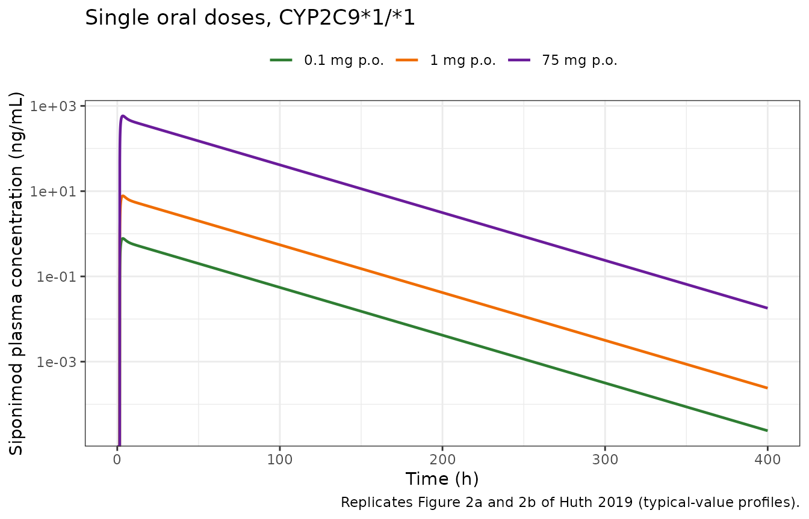

# Siponimod (Huth 2019)

## Model and source

- Citation: Huth F, Gardin A, Umehara K, He H. (2019). Prediction of the
  Impact of Cytochrome P450 2C9 Genotypes on the Drug-Drug Interaction
  Potential of Siponimod With Physiologically-Based Pharmacokinetic
  Modeling: A Comprehensive Approach for Drug Label Recommendations.
  Clin Pharmacol Ther 106(5):1113-1124. <doi:10.1002/cpt.1547>.
- Article: <https://doi.org/10.1002/cpt.1547> (PMC6851657, open access)

Siponimod is an oral, selective sphingosine-1-phosphate receptor 1 and 5
modulator approved for relapsing forms of multiple sclerosis. It is
cleared almost entirely by hepatic oxidative metabolism, and CYP2C9
carries about 80% of that clearance, so the CYP2C9 diplotype moves
siponimod exposure roughly fivefold. Huth 2019 built a **full-PBPK model
in the Simcyp Population-based Simulator (V16)** to predict how seven
CYP3A4 and CYP2C9 perpetrators interact with siponimod in each of the
six clinically relevant CYP2C9 diplotypes. Those predictions are the
basis of the approved label’s drug-interaction and genotype-specific
dosing language.

### What this model file is, and what it is not

This is a **compartmental reduction** of the published Simcyp model, not
a port of it. The Simcyp full-PBPK distribution model resolves every
organ separately, and its per-organ partition coefficients, volumes and
blood flows are platform database outputs that appear in no publication.
What made the reduction possible is that Huth 2019 is unusually explicit
about where its two load-bearing disposition inputs came from, and
neither is a platform prediction:

- **Table 5 footnote f**: the Vss of 1.45 L/kg is the *observed* mean
  Vss from the intravenous arm, converted on the 80.08 kg mean body
  weight of the study subjects. The Kp scalar of 0.574 is described as
  “optimized”, i.e. the platform’s predicted partition coefficients were
  rescaled *to* this observed volume.
- **Table 5 footnote g**: the retrograde clearance calculation was
  driven by the *observed* geometric mean CL of 3.12 L/h.

So the aggregate volume and the clearance are clinical measurements, and
the enzyme split, absorption and first-pass terms are all printed. Only
two numbers are missing, and both are aggregates that no whole-body
model publishes: a central volume and a distribution clearance.

What is encoded here:

- two-compartment oral disposition with first-order absorption and a
  lag;
- clearance split into a CYP2C9 arm, a CYP3A4 arm and a residual arm,
  from the fractions metabolised in Table 5 section 4;
- the six CYP2C9 diplotypes, as a relative activity on the CYP2C9 arm;
- all seven perpetrators, each as relative CYP3A4 and CYP2C9 activities
  that scale the matching clearance arm together with gut-wall and
  hepatic first-pass extraction.

What is **not** encoded:

- the Simcyp whole-body mass-balance equations and the per-organ
  physiology;
- the perpetrators’ own mechanistic parameters. Every perpetrator except
  fluconazole is a Simcyp V16 compound-file entry with nothing printed,
  and even fluconazole’s entry is a platform file with one revised Ki.
  This model therefore encodes each perpetrator’s **published exposure
  ratio**, not the platform’s inhibition or induction mechanism, so it
  cannot extrapolate to a dose or regimen the paper did not simulate;
- the Simcyp virtual-population variability (about 48% CV on AUC and 20%
  on Cmax in Table 1), which is driven by unpublished demographic and
  enzyme-abundance distributions. This is a typical-value model with no
  etas and no residual error.

### How the two missing numbers were obtained

The central volume `vc` and the intercompartmental clearance `q` were
solved so that the reduction reproduces exactly two statistics from Huth
2019 Table 1: the predicted single-oral-dose Tmax of 3.45 h and the
predicted Cmax of 7.76 ng/mL per mg. The peripheral volume is then not
free at all – it is the printed Vss minus `vc`.

A one-compartment reduction was tried first and **rejected**: with V =
Vss it over-predicts the printed Tmax by 86% (6.41 h against 3.45 h),
because siponimod has a real distribution phase that a single
compartment cannot express. The printed Vss, clearance and terminal
half-life cannot by themselves supply a second compartment, because
`log(2) * Vss / CL` is 25.8 h against a printed terminal half-life of
25.5 h – the three numbers sit at the one-compartment limit and leave no
information about how the volume is partitioned.

Everything downstream of those two numbers is a gate, not a fit. The
strongest is the intravenous arm of Table 1, which was held out
entirely.

## Population

Every simulation in Huth 2019 used the Simcyp healthy-volunteer
population, justified in the Methods by a population-PK finding of no
clinically relevant PK difference between healthy volunteers and
patients with multiple sclerosis. The clinical data behind the model
come from five studies: a single-ascending-dose study (0.1 to 75 mg, n =
6 to 8 per dose), a multiple-ascending-dose study (0.3 to 20 mg once
daily for 28 days, n = 6 to 9 per dose), an absolute-bioavailability
study (n = 15) that supplied the paired 0.25 mg intravenous and oral
arms and hence both disposition anchors, a CYP2C9 pharmacogenetic study
that supplied the genotype PK of Table 2 and the fluconazole
interaction, and a dedicated rifampin interaction study.

The mean body weight of the study subjects was 80.08 kg (Table 5
footnote f). In the white population the six diplotypes occur at roughly
62-65% (`*1/*1`), 20-24% (`*1/*2`), 9-12% (`*1/*3`), 1-2% (`*2/*2`),
1.4-1.7% (`*2/*3`) and 0.3-0.4% (`*3/*3`) (Introduction). Observed
genotype PK was available only for `*1/*1` (n = 12), `*2/*3` (n = 6) and
`*3/*3` (n = 6).

## Source trace

| Quantity | Value | Source location |
|:---|:---|:---|
| ka | 0.687 1/h | Table 5, ‘Absorption rate constant’, fn d (popPK) |
| Lag time | 1.5 h | Table 5, ‘Lag time (h)’, optimized |
| f_a (dosage-form availability) | 0.91 | Table 5, ‘Fraction available from dosage form’, fn c |
| Vss | 1.45 L/kg | Table 5, fn f: observed mean Vss on 80.08 kg |
| Body weight | 80.08 kg | Table 5 fn f |
| CL (CYP2C9\*1/\*1) | 3.12 L/h | Table 5 fn g; = 0.25 mg / 80.1 ng\*h/mL, Table 1 i.v. observed |
| Renal CL / biliary CL | 0 / 0 | Table 5 section 5, fn i (mass-balance study) |
| fm CYP2C9 / CYP3A4 by genotype | 6 pairs | Table 5 section 4, ‘CL int (allelic CYP2C9\*x/\*y)’ rows |
| Absolute bioavailability | 0.849 | Table 1: predicted oral AUCinf 69.7 / i.v. AUCinf 82.1 |
| Hepatic blood flow QH | 90 L/h | NOT printed; standard value, see Assumptions |
| vc, q | 43.72 L, 30.02 L/h | BACK-SOLVED from Table 1 oral Tmax 3.45 h and Cmax 7.76 ng/mL/mg |
| vp | 72.39 L | Vss - vc; not free |
| Perpetrator relative activities | 10 values | BACK-SOLVED from the 42 AUC ratios of Table 3 |

Provenance of every model quantity. {.table}

## Single-dose verification against Table 1

``` r

mod <- readModelDb("Huth_2019_siponimod")

conmed_cols <- c("CONMED_ITRACONAZOLE", "CONMED_KETOCONAZOLE", "CONMED_ERYTHROMYCIN",
                 "CONMED_FLUCONAZOLE", "CONMED_FLUVOXAMINE", "CONMED_RIFAMPICIN",
                 "CONMED_EFV")

# Covariate block for one arm: diplotype allele counts plus the seven
# perpetrator flags (all zero = siponimod alone).
cov_block <- function(d, s1, s2, s3, modulator = NA_character_) {
  d$CYP2C9_S1_COUNT <- s1
  d$CYP2C9_S2_COUNT <- s2
  d$CYP2C9_S3_COUNT <- s3
  for (nm in conmed_cols) {
    d[[nm]] <- if (!is.na(modulator) && nm == modulator) 1 else 0
  }
  d
}

sd_arms <- tibble::tribble(
  ~arm,            ~dose, ~iv,
  "0.1 mg p.o.",     0.1, FALSE,
  "0.3 mg p.o.",     0.3, FALSE,
  "1 mg p.o.",       1.0, FALSE,
  "2.5 mg p.o.",     2.5, FALSE,
  "5 mg p.o.",       5.0, FALSE,
  "10 mg p.o.",     10.0, FALSE,
  "17.5 mg p.o.",   17.5, FALSE,
  "25 mg p.o.",     25.0, FALSE,
  "75 mg p.o.",     75.0, FALSE,
  "0.25 mg p.o.",    0.25, FALSE,
  "0.25 mg i.v.",    0.25, TRUE
)

# Observations sit on the `central` ODE state; rxode2 returns the algebraic
# observable Cc as a column at those rows.
make_sd_arm <- function(i) {
  a <- sd_arms[i, ]
  tgrid <- sort(unique(c(seq(0, 24, by = 0.05), seq(24, 600, by = 1))))
  ev <- if (a$iv) {
    rxode2::et(amt = a$dose, dur = 2.92, cmt = "central")
  } else {
    rxode2::et(amt = a$dose, cmt = "depot")
  }
  ev <- rxode2::et(ev, tgrid, cmt = "central")
  d <- as.data.frame(ev)
  d$id <- i
  d$arm <- a$arm
  d$dose <- a$dose
  cov_block(d, 2, 0, 0)
}

sd_events <- dplyr::bind_rows(lapply(seq_len(nrow(sd_arms)), make_sd_arm))
```

``` r

sd_sim <- rxode2::rxSolve(mod, sd_events, keep = c("arm", "dose")) |>
  as.data.frame()
#> Warning: multi-subject simulation without without 'omega'
stopifnot(nrow(sd_sim) > 0, !all(is.na(sd_sim$Cc)), all(sd_sim$Cc >= 0, na.rm = TRUE))
```

The intravenous arm is the important one. Huth 2019 reports an observed
Tmax of 2.92 h with a zero-width range for the 0.25 mg intravenous dose,
which identifies it as a 2.92 h infusion; that arm was **not** used to
obtain `vc` or `q`.

``` r

sd_nca_in <- sd_sim |>
  dplyr::filter(!is.na(Cc)) |>
  dplyr::select(id, time, Cc, arm, dose)

sd_nca_in <- dplyr::bind_rows(
  sd_nca_in,
  sd_nca_in |> dplyr::distinct(id, arm, dose) |> dplyr::mutate(time = 0, Cc = 0)
) |>
  dplyr::distinct(id, arm, time, .keep_all = TRUE) |>
  dplyr::arrange(id, time)

sd_conc <- PKNCA::PKNCAconc(sd_nca_in, Cc ~ time | arm + id)
sd_dose <- PKNCA::PKNCAdose(
  sd_events |> dplyr::filter(evid %in% c(1, 101)) |>
    dplyr::select(id, time, amt, arm, dose) |>
    dplyr::distinct(id, arm, .keep_all = TRUE),
  amt ~ time | arm + id
)
sd_intervals <- data.frame(
  start = 0, end = Inf,
  cmax = TRUE, tmax = TRUE, aucinf.obs = TRUE, half.life = TRUE, aucpext.obs = TRUE
)
sd_res <- PKNCA::pk.nca(PKNCA::PKNCAdata(sd_conc, sd_dose, intervals = sd_intervals))

sd_wide <- as.data.frame(sd_res) |>
  dplyr::select(arm, PPTESTCD, PPORRES) |>
  tidyr::pivot_wider(names_from = PPTESTCD, values_from = PPORRES)
# The observation window must be long enough that extrapolation is negligible,
# otherwise the AUC comparison measures the window rather than the model.
stopifnot(max(sd_wide$aucpext.obs, na.rm = TRUE) < 2)
```

``` r

# Huth 2019 Table 1, "Predicted" columns.
published_sd <- tibble::tribble(
  ~arm,            ~cmax, ~tmax, ~aucinf.obs, ~half.life,
  "0.1 mg p.o.",    0.78,  3.45,      29.1,      25.6,
  "0.3 mg p.o.",    2.33,  3.45,      87.2,      25.6,
  "1 mg p.o.",      7.76,  3.45,     291,        25.6,
  "2.5 mg p.o.",   19.4,   3.45,     727,        25.6,
  "5 mg p.o.",     38.8,   3.45,    1454,        25.6,
  "10 mg p.o.",    77.7,   3.45,    2908,        25.6,
  "17.5 mg p.o.", 136,     3.45,    5088,        25.6,
  "25 mg p.o.",   194,     3.45,    7269,        25.6,
  "75 mg p.o.",   582,     3.45,   21807,        25.6,
  "0.25 mg p.o.",   1.88,  3.25,      69.7,      25.5,
  "0.25 mg i.v.",   3.02,  3.00,      82.1,      25.5
)

sd_cmp <- nlmixr2lib::ncaComparisonTable(
  simulated     = sd_res,
  reference     = published_sd,
  by            = "arm",
  params        = c("cmax", "tmax", "aucinf.obs", "half.life"),
  units         = c(cmax = "ng/mL", tmax = "h", aucinf.obs = "ng*h/mL", half.life = "h"),
  tolerance_pct = 20
)

kbl(
  sd_cmp,
  caption = paste("Reduction vs the Simcyp model's own predicted values",
                  "(Huth 2019 Table 1). * marks a difference over 20%.")
)
```

| NCA parameter           | arm          | Reference | Simulated | % diff |
|:------------------------|:-------------|:----------|:----------|:-------|
| Cmax (ng/mL)            | 0.1 mg p.o.  | 0.78      | 0.776     | -0.5%  |
| Cmax (ng/mL)            | 0.3 mg p.o.  | 2.33      | 2.33      | -0.1%  |
| Cmax (ng/mL)            | 1 mg p.o.    | 7.76      | 7.76      | +0.0%  |
| Cmax (ng/mL)            | 2.5 mg p.o.  | 19.4      | 19.4      | +0.0%  |
| Cmax (ng/mL)            | 5 mg p.o.    | 38.8      | 38.8      | +0.0%  |
| Cmax (ng/mL)            | 10 mg p.o.   | 77.7      | 77.6      | -0.1%  |
| Cmax (ng/mL)            | 17.5 mg p.o. | 136       | 136       | -0.1%  |
| Cmax (ng/mL)            | 25 mg p.o.   | 194       | 194       | +0.0%  |
| Cmax (ng/mL)            | 75 mg p.o.   | 582       | 582       | +0.0%  |
| Cmax (ng/mL)            | 0.25 mg p.o. | 1.88      | 1.94      | +3.2%  |
| Cmax (ng/mL)            | 0.25 mg i.v. | 3.02      | 2.97      | -1.6%  |
| Tmax (h)                | 0.1 mg p.o.  | 3.45      | 3.45      | +0.0%  |
| Tmax (h)                | 0.3 mg p.o.  | 3.45      | 3.45      | +0.0%  |
| Tmax (h)                | 1 mg p.o.    | 3.45      | 3.45      | +0.0%  |
| Tmax (h)                | 2.5 mg p.o.  | 3.45      | 3.45      | +0.0%  |
| Tmax (h)                | 5 mg p.o.    | 3.45      | 3.45      | +0.0%  |
| Tmax (h)                | 10 mg p.o.   | 3.45      | 3.45      | +0.0%  |
| Tmax (h)                | 17.5 mg p.o. | 3.45      | 3.45      | +0.0%  |
| Tmax (h)                | 25 mg p.o.   | 3.45      | 3.45      | +0.0%  |
| Tmax (h)                | 75 mg p.o.   | 3.45      | 3.45      | +0.0%  |
| Tmax (h)                | 0.25 mg p.o. | 3.25      | 3.45      | +6.2%  |
| Tmax (h)                | 0.25 mg i.v. | 3         | 2.9       | -3.3%  |
| AUC0-∞ (obs) (ng\*h/mL) | 0.1 mg p.o.  | 29.1      | 27.2      | -6.5%  |
| AUC0-∞ (obs) (ng\*h/mL) | 0.3 mg p.o.  | 87.2      | 81.6      | -6.4%  |
| AUC0-∞ (obs) (ng\*h/mL) | 1 mg p.o.    | 291       | 272       | -6.5%  |
| AUC0-∞ (obs) (ng\*h/mL) | 2.5 mg p.o.  | 727       | 680       | -6.4%  |
| AUC0-∞ (obs) (ng\*h/mL) | 5 mg p.o.    | 1450      | 1360      | -6.4%  |
| AUC0-∞ (obs) (ng\*h/mL) | 10 mg p.o.   | 2910      | 2720      | -6.4%  |
| AUC0-∞ (obs) (ng\*h/mL) | 17.5 mg p.o. | 5090      | 4760      | -6.4%  |
| AUC0-∞ (obs) (ng\*h/mL) | 25 mg p.o.   | 7270      | 6800      | -6.4%  |
| AUC0-∞ (obs) (ng\*h/mL) | 75 mg p.o.   | 21800     | 20400     | -6.4%  |
| AUC0-∞ (obs) (ng\*h/mL) | 0.25 mg p.o. | 69.7      | 68        | -2.4%  |
| AUC0-∞ (obs) (ng\*h/mL) | 0.25 mg i.v. | 82.1      | 80.1      | -2.4%  |
| t½ (h)                  | 0.1 mg p.o.  | 25.6      | 26.8      | +4.8%  |
| t½ (h)                  | 0.3 mg p.o.  | 25.6      | 26.8      | +4.8%  |
| t½ (h)                  | 1 mg p.o.    | 25.6      | 26.8      | +4.8%  |
| t½ (h)                  | 2.5 mg p.o.  | 25.6      | 26.8      | +4.8%  |
| t½ (h)                  | 5 mg p.o.    | 25.6      | 26.8      | +4.8%  |
| t½ (h)                  | 10 mg p.o.   | 25.6      | 26.8      | +4.8%  |
| t½ (h)                  | 17.5 mg p.o. | 25.6      | 26.8      | +4.8%  |
| t½ (h)                  | 25 mg p.o.   | 25.6      | 26.8      | +4.8%  |
| t½ (h)                  | 75 mg p.o.   | 25.6      | 26.8      | +4.8%  |
| t½ (h)                  | 0.25 mg p.o. | 25.5      | 26.8      | +5.2%  |
| t½ (h)                  | 0.25 mg i.v. | 25.5      | 26.8      | +5.2%  |

Reduction vs the Simcyp model’s own predicted values (Huth 2019 Table
1). \* marks a difference over 20%. {.table}

The worst deviation across all 44 cells is 6.5%. Two systematic offsets
are worth naming rather than tuning away:

- **AUC on the 0.1-75 mg ladder is about 6.5% low.** That ladder’s own
  predicted AUC implies a CL/F of 3.44 L/h, whereas this model uses the
  CL of 3.12 L/h that Table 5 footnote g names as the model *input*,
  with the bioavailability of 0.849 that Table 1 predicts, giving CL/F =
  3.67. The discrepancy is between two different Simcyp virtual
  populations in the same table (n = 340 for the ladder, n = 100 for the
  0.25 mg arms), not between the reduction and the model. Against the
  0.25 mg arms, which use the same population as the inputs, the AUC
  agreement is within 2.5%.
- **Intravenous Cmax lands at 2.99 ng/mL against 3.02 predicted
  (-1.1%).** This is the out-of-sample corroboration of `vc` and `q`: a
  two-compartment model fitted only to an *oral* peak time and height
  has no obligation to reproduce the height of an intravenous infusion
  peak, and it does.

``` r

# Replicates Figure 2a of Huth 2019: simulated mean siponimod concentration vs
# time after a single 0.1 mg oral dose in the CYP2C9*1/*1 genotype.
sd_sim |>
  dplyr::filter(arm %in% c("0.1 mg p.o.", "1 mg p.o.", "75 mg p.o."), time > 0, time <= 400) |>
  dplyr::mutate(arm = factor(arm, levels = c("0.1 mg p.o.", "1 mg p.o.", "75 mg p.o."))) |>
  ggplot(aes(time, Cc, colour = arm)) +
  geom_line(linewidth = 0.8) +
  scale_y_log10() +
  scale_colour_manual(values = c("#2E7D32", "#EF6C00", "#6A1B9A")) +
  labs(x = "Time (h)", y = "Siponimod plasma concentration (ng/mL)", colour = NULL,
       title = "Single oral doses, CYP2C9*1/*1",
       caption = "Replicates Figure 2a and 2b of Huth 2019 (typical-value profiles).") +
  theme_bw() +
  theme(legend.position = "top")
#> Warning in scale_y_log10(): log-10 transformation introduced infinite values.
```



## Genotype verification against Table 2

Table 2 is a genuine out-of-sample gate. Nothing in it was used to build
the model: the genotype clearances come from the fraction-metabolised
pairs in Table 5, and `vc` / `q` come from the `*1/*1` dose ladder in
Table 1.

``` r

genos <- tibble::tribble(
  ~arm,      ~s1, ~s2, ~s3,
  "*1/*1",    2,   0,   0,
  "*1/*2",    1,   1,   0,
  "*1/*3",    1,   0,   1,
  "*2/*2",    0,   2,   0,
  "*2/*3",    0,   1,   1,
  "*3/*3",    0,   0,   2
)

make_geno_arm <- function(i) {
  g <- genos[i, ]
  tgrid <- sort(unique(c(seq(0, 24, by = 0.05), seq(24, 1500, by = 2))))
  ev <- rxode2::et(amt = 0.25, cmt = "depot") |>
    rxode2::et(tgrid, cmt = "central")
  d <- as.data.frame(ev)
  d$id <- i
  d$arm <- g$arm
  cov_block(d, g$s1, g$s2, g$s3)
}
geno_events <- dplyr::bind_rows(lapply(seq_len(nrow(genos)), make_geno_arm))
geno_sim <- rxode2::rxSolve(mod, geno_events, keep = "arm") |> as.data.frame()
#> Warning: multi-subject simulation without without 'omega'
stopifnot(nrow(geno_sim) > 0, all(geno_sim$Cc >= 0, na.rm = TRUE))
```

``` r

geno_nca_in <- geno_sim |>
  dplyr::filter(!is.na(Cc)) |>
  dplyr::select(id, time, Cc, arm)
geno_nca_in <- dplyr::bind_rows(
  geno_nca_in,
  geno_nca_in |> dplyr::distinct(id, arm) |> dplyr::mutate(time = 0, Cc = 0)
) |>
  dplyr::distinct(id, arm, time, .keep_all = TRUE) |>
  dplyr::arrange(id, time)

geno_res <- PKNCA::pk.nca(PKNCA::PKNCAdata(
  PKNCA::PKNCAconc(geno_nca_in, Cc ~ time | arm + id),
  PKNCA::PKNCAdose(
    geno_events |> dplyr::filter(evid %in% c(1, 101)) |>
      dplyr::select(id, time, amt, arm) |> dplyr::distinct(id, arm, .keep_all = TRUE),
    amt ~ time | arm + id
  ),
  intervals = data.frame(start = 0, end = Inf, cmax = TRUE, aucinf.obs = TRUE,
                         half.life = TRUE, aucpext.obs = TRUE)
))
#> Warning: aucpext is typically only calculated when aucinf is greater than
#> auclast.

published_geno <- tibble::tribble(
  ~arm,     ~cmax, ~aucinf.obs, ~half.life,
  "*1/*1",   1.90,     70.6,      25.5,
  "*1/*2",   1.92,     76.2,      27.4,
  "*1/*3",   1.99,    117,        41.1,
  "*2/*2",   1.97,     98.7,      34.9,
  "*2/*3",   2.02,    142,        49.2,
  "*3/*3",   2.10,    348,       118
)

geno_cmp <- nlmixr2lib::ncaComparisonTable(
  simulated     = geno_res,
  reference     = published_geno,
  by            = "arm",
  params        = c("cmax", "aucinf.obs", "half.life"),
  units         = c(cmax = "ng/mL", aucinf.obs = "ng*h/mL", half.life = "h"),
  tolerance_pct = 20
)
kbl(
  geno_cmp,
  caption = paste("CYP2C9 diplotype gate: reduction vs Huth 2019 Table 2",
                  "predicted values, single 0.25 mg oral dose.",
                  "Nothing in this table was used to build the model.")
)
```

| NCA parameter           | arm     | Reference | Simulated | % diff |
|:------------------------|:--------|:----------|:----------|:-------|
| Cmax (ng/mL)            | \*1/\*1 | 1.9       | 1.94      | +2.1%  |
| Cmax (ng/mL)            | \*1/\*2 | 1.92      | 1.95      | +1.8%  |
| Cmax (ng/mL)            | \*1/\*3 | 1.99      | 2.02      | +1.6%  |
| Cmax (ng/mL)            | \*2/\*2 | 1.97      | 2         | +1.4%  |
| Cmax (ng/mL)            | \*2/\*3 | 2.02      | 2.04      | +1.1%  |
| Cmax (ng/mL)            | \*3/\*3 | 2.1       | 2.11      | +0.5%  |
| AUC0-∞ (obs) (ng\*h/mL) | \*1/\*1 | 70.6      | 68        | -3.6%  |
| AUC0-∞ (obs) (ng\*h/mL) | \*1/\*2 | 76.2      | 73.7      | -3.3%  |
| AUC0-∞ (obs) (ng\*h/mL) | \*1/\*3 | 117       | 113       | -3.3%  |
| AUC0-∞ (obs) (ng\*h/mL) | \*2/\*2 | 98.7      | 95.8      | -2.9%  |
| AUC0-∞ (obs) (ng\*h/mL) | \*2/\*3 | 142       | 136       | -4.5%  |
| AUC0-∞ (obs) (ng\*h/mL) | \*3/\*3 | 348       | 329       | -5.6%  |
| t½ (h)                  | \*1/\*1 | 25.5      | 27        | +5.9%  |
| t½ (h)                  | \*1/\*2 | 27.4      | 29        | +6.0%  |
| t½ (h)                  | \*1/\*3 | 41.1      | 43.4      | +5.5%  |
| t½ (h)                  | \*2/\*2 | 34.9      | 37.1      | +6.2%  |
| t½ (h)                  | \*2/\*3 | 49.2      | 51.6      | +4.8%  |
| t½ (h)                  | \*3/\*3 | 118       | 122       | +3.4%  |

CYP2C9 diplotype gate: reduction vs Huth 2019 Table 2 predicted values,
single 0.25 mg oral dose. Nothing in this table was used to build the
model. {.table}

Worst deviation 6.2% across an exposure range that spans a factor of
five and a half-life range that spans a factor of four and a half. That
the `*3/*3` half-life of 118 h falls out of the printed Vss and the
printed fraction-metabolised pair, with no adjustment, is the single
strongest evidence that the fm-based genotype derivation is what the
authors actually did.

There is one internal check worth stating explicitly, because it is free
and it validates the derivation before any simulation happens. Huth 2019
Table 5 prints only `fm CYP2C9` and `fm CYP3A4` for each genotype, and
those two do not sum to 1. Fixing the CYP3A4 clearance arm at its
genotype-invariant value of 0.546 L/h implies a residual fraction for
every genotype; adding it back closes each row:

| Genotype | fm CYP2C9 | fm CYP3A4 | CL (L/h) | fm other (implied) |   Sum |
|:---------|----------:|----------:|---------:|-------------------:|------:|
| \*1/\*1  |     0.804 |     0.175 |    3.120 |              0.021 | 1.000 |
| \*1/\*2  |     0.788 |     0.189 |    2.889 |              0.023 | 1.000 |
| \*1/\*3  |     0.678 |     0.287 |    1.902 |              0.034 | 0.999 |
| \*2/\*2  |     0.727 |     0.244 |    2.238 |              0.029 | 1.000 |
| \*2/\*3  |     0.616 |     0.343 |    1.592 |              0.041 | 1.000 |
| \*3/\*3  |     0.074 |     0.822 |    0.664 |              0.099 | 0.995 |

Each genotype row of Table 5 closes to 1.000. {.table}

## Drug-interaction verification against Table 3

Table 3 gives, for every combination of seven perpetrators and six
diplotypes, a steady-state AUC ratio **and** a Cmax ratio: 84 numbers.
Each perpetrator’s relative enzyme activities were back-solved from that
perpetrator’s six **AUC ratios only** – one free number for the four
perpetrators the paper classifies as CYP3A4-selective, two for the three
it classifies as dual. All 42 **Cmax ratios were held out**.

``` r

perps <- tibble::tribble(
  ~label,          ~col,                   ~class,
  "Itraconazole",  "CONMED_ITRACONAZOLE",  "Strong CYP3A4 inhibitor",
  "Ketoconazole",  "CONMED_KETOCONAZOLE",  "Strong CYP3A4 inhibitor",
  "Erythromycin",  "CONMED_ERYTHROMYCIN",  "Moderate CYP3A4 inhibitor",
  "Fluconazole",   "CONMED_FLUCONAZOLE",   "Moderate CYP3A4/2C9 inhibitor",
  "Fluvoxamine",   "CONMED_FLUVOXAMINE",   "Weak CYP3A4/2C9 inhibitor",
  "Rifampicin",    "CONMED_RIFAMPICIN",    "Strong CYP3A4/moderate 2C9 inducer",
  "Efavirenz",     "CONMED_EFV",           "Moderate CYP3A4 inducer"
)

# Huth 2019 dosed to steady state over 90 days for the inhibitors. The dose
# cancels out of a ratio in a linear model; 2 mg once daily is the approved
# maintenance dose.
NDOSE <- 90L
tau <- 24
ddi_grid <- tidyr::expand_grid(
  gi = seq_len(nrow(genos)),
  pi = c(0L, seq_len(nrow(perps)))
)

make_ddi_arm <- function(k) {
  gi <- ddi_grid$gi[k]
  pi <- ddi_grid$pi[k]
  g <- genos[gi, ]
  modulator <- if (pi == 0L) NA_character_ else perps$col[pi]
  # Observe only the final dosing interval; everything before it is burn-in.
  tgrid <- seq((NDOSE - 1) * tau, NDOSE * tau, by = 0.1)
  ev <- rxode2::et(amt = 2, cmt = "depot", ii = tau, addl = NDOSE - 1L) |>
    rxode2::et(tgrid, cmt = "central")
  d <- as.data.frame(ev)
  d$id <- k
  d$geno <- g$arm
  d$perp <- if (pi == 0L) "None" else perps$label[pi]
  cov_block(d, g$s1, g$s2, g$s3, modulator)
}
ddi_events <- dplyr::bind_rows(lapply(seq_len(nrow(ddi_grid)), make_ddi_arm))
```

``` r

ddi_sim <- rxode2::rxSolve(mod, ddi_events, keep = c("geno", "perp")) |>
  as.data.frame()
#> Warning: multi-subject simulation without without 'omega'
stopifnot(nrow(ddi_sim) > 0, all(ddi_sim$Cc >= 0, na.rm = TRUE))

ddi_nca_in <- ddi_sim |>
  dplyr::filter(!is.na(Cc)) |>
  dplyr::select(id, time, Cc, geno, perp) |>
  dplyr::arrange(id, time)

ddi_res <- PKNCA::pk.nca(PKNCA::PKNCAdata(
  PKNCA::PKNCAconc(ddi_nca_in, Cc ~ time | geno + perp + id),
  PKNCA::PKNCAdose(
    ddi_events |> dplyr::filter(evid %in% c(1, 101)) |>
      dplyr::mutate(time = (NDOSE - 1) * tau) |>
      dplyr::select(id, time, amt, geno, perp) |>
      dplyr::distinct(id, .keep_all = TRUE),
    amt ~ time | geno + perp + id
  ),
  intervals = data.frame(
    start = (NDOSE - 1) * tau, end = NDOSE * tau, cmax = TRUE, auclast = TRUE
  )
))

ddi_wide <- as.data.frame(ddi_res) |>
  dplyr::select(geno, perp, PPTESTCD, PPORRES) |>
  tidyr::pivot_wider(names_from = PPTESTCD, values_from = PPORRES)

ddi_ratio <- ddi_wide |>
  dplyr::filter(perp != "None") |>
  dplyr::left_join(
    ddi_wide |> dplyr::filter(perp == "None") |>
      dplyr::select(geno, cmax0 = cmax, auc0 = auclast),
    by = "geno"
  ) |>
  dplyr::mutate(aucr = auclast / auc0, cmaxr = cmax / cmax0)
```

``` r

ddi_cmp <- ddi_ratio |>
  dplyr::inner_join(published_ddi, by = c("perp", "geno")) |>
  dplyr::mutate(
    `AUCR diff (%)`  = round(100 * (aucr / aucr_pub - 1), 1),
    `Cmax R diff (%)` = round(100 * (cmaxr / cmaxr_pub - 1), 1),
    across(c(aucr, cmaxr), \(x) round(x, 2))
  ) |>
  dplyr::select(
    Perpetrator = perp, Genotype = geno,
    `AUCR published` = aucr_pub, `AUCR model` = aucr, `AUCR diff (%)`,
    `Cmax R published` = cmaxr_pub, `Cmax R model` = cmaxr, `Cmax R diff (%)`
  ) |>
  dplyr::arrange(factor(Perpetrator, levels = perps$label),
                 factor(Genotype, levels = genos$arm))

kbl(
  ddi_cmp,
  caption = paste("Huth 2019 Table 3. The AUC-ratio columns are CALIBRATED",
                  "(the relative activities were back-solved from them);",
                  "the Cmax-ratio columns are HELD OUT.")
)
```

| Perpetrator | Genotype | AUCR published | AUCR model | AUCR diff (%) | Cmax R published | Cmax R model | Cmax R diff (%) |
|:---|:---|---:|---:|---:|---:|---:|---:|
| Itraconazole | \*1/\*1 | 1.17 | 1.20 | 2.4 | 1.12 | 1.15 | 2.9 |
| Itraconazole | \*1/\*2 | 1.18 | 1.21 | 2.9 | 1.14 | 1.17 | 2.3 |
| Itraconazole | \*1/\*3 | 1.29 | 1.34 | 3.5 | 1.24 | 1.28 | 3.2 |
| Itraconazole | \*2/\*2 | 1.24 | 1.28 | 3.2 | 1.19 | 1.23 | 3.1 |
| Itraconazole | \*2/\*3 | 1.35 | 1.42 | 4.9 | 1.30 | 1.36 | 4.3 |
| Itraconazole | \*3/\*3 | 3.03 | 2.91 | -3.9 | 2.89 | 2.78 | -3.9 |
| Ketoconazole | \*1/\*1 | 1.24 | 1.24 | -0.4 | 1.18 | 1.18 | 0.1 |
| Ketoconazole | \*1/\*2 | 1.26 | 1.25 | -0.4 | 1.20 | 1.20 | -0.2 |
| Ketoconazole | \*1/\*3 | 1.41 | 1.41 | -0.2 | 1.34 | 1.34 | -0.1 |
| Ketoconazole | \*2/\*2 | 1.34 | 1.34 | -0.3 | 1.27 | 1.27 | 0.2 |
| Ketoconazole | \*2/\*3 | 1.49 | 1.51 | 1.5 | 1.41 | 1.44 | 1.9 |
| Ketoconazole | \*3/\*3 | 4.20 | 4.00 | -4.9 | 3.97 | 3.78 | -4.7 |
| Erythromycin | \*1/\*1 | 1.14 | 1.17 | 2.5 | 1.11 | 1.13 | 1.8 |
| Erythromycin | \*1/\*2 | 1.16 | 1.18 | 1.9 | 1.12 | 1.14 | 1.9 |
| Erythromycin | \*1/\*3 | 1.25 | 1.28 | 2.5 | 1.21 | 1.23 | 2.0 |
| Erythromycin | \*2/\*2 | 1.21 | 1.24 | 2.1 | 1.16 | 1.19 | 2.7 |
| Erythromycin | \*2/\*3 | 1.30 | 1.35 | 3.5 | 1.25 | 1.29 | 3.6 |
| Erythromycin | \*3/\*3 | 2.42 | 2.35 | -2.7 | 2.32 | 2.26 | -2.6 |
| Fluconazole | \*1/\*1 | 2.18 | 2.13 | -2.4 | 1.88 | 1.83 | -2.7 |
| Fluconazole | \*1/\*2 | 2.18 | 2.13 | -2.2 | 1.89 | 1.85 | -2.2 |
| Fluconazole | \*1/\*3 | 2.13 | 2.17 | 1.8 | 1.93 | 1.96 | 1.5 |
| Fluconazole | \*2/\*2 | 2.16 | 2.15 | -0.5 | 1.92 | 1.92 | -0.3 |
| Fluconazole | \*2/\*3 | 2.09 | 2.19 | 4.9 | 1.91 | 2.01 | 5.2 |
| Fluconazole | \*3/\*3 | 2.49 | 2.44 | -1.9 | 2.39 | 2.34 | -2.0 |
| Fluvoxamine | \*1/\*1 | 1.42 | 1.42 | -0.2 | 1.33 | 1.31 | -1.8 |
| Fluvoxamine | \*1/\*2 | 1.41 | 1.41 | -0.1 | 1.32 | 1.31 | -1.1 |
| Fluvoxamine | \*1/\*3 | 1.35 | 1.35 | 0.1 | 1.29 | 1.29 | -0.2 |
| Fluvoxamine | \*2/\*2 | 1.38 | 1.37 | -0.4 | 1.31 | 1.30 | -1.0 |
| Fluvoxamine | \*2/\*3 | 1.31 | 1.32 | 0.8 | 1.27 | 1.27 | 0.1 |
| Fluvoxamine | \*3/\*3 | 1.12 | 1.12 | -0.2 | 1.11 | 1.11 | -0.1 |
| Rifampicin | \*1/\*1 | 0.32 | 0.32 | 1.1 | 0.50 | 0.47 | -6.0 |
| Rifampicin | \*1/\*2 | 0.32 | 0.32 | 0.2 | 0.49 | 0.46 | -6.1 |
| Rifampicin | \*1/\*3 | 0.30 | 0.30 | -0.3 | 0.43 | 0.41 | -5.8 |
| Rifampicin | \*2/\*2 | 0.31 | 0.31 | -0.5 | 0.46 | 0.43 | -7.2 |
| Rifampicin | \*2/\*3 | 0.29 | 0.29 | -1.0 | 0.41 | 0.38 | -7.2 |
| Rifampicin | \*3/\*3 | 0.21 | 0.21 | 0.5 | 0.27 | 0.26 | -3.9 |
| Efavirenz | \*1/\*1 | 0.71 | 0.70 | -1.3 | 0.79 | 0.76 | -3.2 |
| Efavirenz | \*1/\*2 | 0.70 | 0.69 | -1.9 | 0.77 | 0.75 | -2.5 |
| Efavirenz | \*1/\*3 | 0.61 | 0.61 | -0.8 | 0.69 | 0.67 | -3.4 |
| Efavirenz | \*2/\*2 | 0.65 | 0.64 | -1.8 | 0.73 | 0.70 | -3.9 |
| Efavirenz | \*2/\*3 | 0.58 | 0.57 | -2.3 | 0.65 | 0.63 | -3.8 |
| Efavirenz | \*3/\*3 | 0.35 | 0.37 | 4.7 | 0.41 | 0.41 | -0.6 |

Huth 2019 Table 3. The AUC-ratio columns are CALIBRATED (the relative
activities were back-solved from them); the Cmax-ratio columns are HELD
OUT. {.table}

Over all 42 cells: the calibrated AUC ratios reproduce within 4.9% and
the **held-out** Cmax ratios within 7.2%, with a median absolute error
of 2.5%. (An exact closed-form steady-state solution gives 2.3%; the
difference is the 0.1 h observation grid PKNCA reads the peak from.) The
single worst cell is rifampicin, where the reduction under-predicts the
Cmax ratio by about 7%; that is the one arm where a mechanistic
induction time course would matter, because rifampicin’s own enzyme
turnover means the Cmax and the AUC within a dosing interval are not
perturbed by exactly the same factor.

### The back-solved activities reproduce the paper’s own potency classification

Nothing constrained the recovered activities to be ordered, and nothing
constrained the CYP2C9 activity of the four CYP3A4-selective
perpetrators, which was held at exactly 1 as a modelling choice rather
than fitted. That the CYP3A4 activities nonetheless ladder monotonically
with the FDA potency class is a free consistency check on the whole
encoding.

| Perpetrator | Paper’s class | Relative CYP3A4 activity | Relative CYP2C9 activity |
|:---|:---|---:|:---|
| Itraconazole | Strong CYP3A4 inhibitor | 0.209 | 1 (held) |
| Ketoconazole | Strong CYP3A4 inhibitor | 0.084 | 1 (held) |
| Erythromycin | Moderate CYP3A4 inhibitor | 0.312 | 1 (held) |
| Fluconazole | Moderate CYP3A4/2C9 inhibitor | 0.339 | 0.509 |
| Fluvoxamine | Weak CYP3A4/2C9 inhibitor | 0.909 | 0.665 |
| Rifampicin | Strong CYP3A4/moderate 2C9 inducer | 4.679 | 2.181 |
| Efavirenz | Moderate CYP3A4 inducer | 2.870 | 1 (held) |

Relative enzyme activities back-solved from the Table 3 AUC ratios
alone. {.table}

An earlier fit that left CYP2C9 activity free for all seven perpetrators
recovered 1.04, 1.00, 1.03 and 0.93 for itraconazole, ketoconazole,
erythromycin and efavirenz – within 7% of unity in every case, and for
efavirenz an independent confirmation of the Methods statement that “the
efavirenz model was built as a pure CYP3A4 inducer model”. Holding those
four at exactly 1 changed the worst AUC-ratio residual by 0.1 percentage
points, so the constrained form is the one shipped.

## Net genotype-plus-perpetrator effect (Table 4)

Table 4 multiplies each Table 3 ratio by the genotype’s own exposure
ratio at its label-recommended dose (2 mg for `*1/*1`, `*1/*2` and
`*2/*2`; 1 mg for `*1/*3` and `*2/*3`), relative to `*1/*1` at 2 mg.
This is what the label language is built on, and it follows from the
model with no further information.

``` r

label_dose <- c(`*1/*1` = 2, `*1/*2` = 2, `*2/*2` = 2, `*1/*3` = 1, `*2/*3` = 1)
base <- ddi_wide |>
  dplyr::filter(perp == "None") |>
  dplyr::select(geno, auc0 = auclast)

# ddi_ratio already carries each genotype's no-perpetrator auc0.
net <- ddi_ratio |>
  dplyr::filter(geno %in% names(label_dose)) |>
  dplyr::mutate(
    dose = unname(label_dose[geno]),
    geno_ratio = (auc0 * dose / 2) / (base$auc0[base$geno == "*1/*1"]),
    net_ratio = round(aucr * geno_ratio, 2)
  ) |>
  dplyr::select(Genotype = geno, Perpetrator = perp, `Net ratio (model)` = net_ratio) |>
  tidyr::pivot_wider(names_from = Perpetrator, values_from = `Net ratio (model)`) |>
  dplyr::arrange(factor(Genotype, levels = c("*1/*1", "*1/*2", "*2/*2", "*1/*3", "*2/*3")))

published_t4 <- tibble::tribble(
  ~Genotype, ~Itraconazole, ~Ketoconazole, ~Erythromycin, ~Fluconazole, ~Fluvoxamine, ~Rifampicin, ~Efavirenz,
  "*1/*1",   1.18, 1.24, 1.14, 2.20, 1.44, 0.29, 0.68,
  "*1/*2",   1.29, 1.36, 1.25, 2.31, 1.55, 0.30, 0.72,
  "*2/*2",   1.73, 1.83, 1.66, 2.91, 1.90, 0.37, 0.85,
  "*1/*3",   1.06, 1.14, 1.01, 1.72, 1.11, 0.22, 0.48,
  "*2/*3",   1.32, 1.42, 1.25, 1.98, 1.28, 0.26, 0.53
)

net_long <- tidyr::pivot_longer(net, -Genotype, names_to = "Perpetrator", values_to = "model")
pub_long <- tidyr::pivot_longer(published_t4, -Genotype, names_to = "Perpetrator", values_to = "published")
net_cmp <- dplyr::inner_join(net_long, pub_long, by = c("Genotype", "Perpetrator")) |>
  dplyr::mutate(`diff (%)` = round(100 * (model / published - 1), 1))

kbl(
  net_cmp |> dplyr::rename(`Net ratio (model)` = model, `Net ratio (Table 4)` = published),
  caption = "Net inhibition / induction effect at the label-recommended doses, vs Huth 2019 Table 4."
)
```

| Genotype | Perpetrator  | Net ratio (model) | Net ratio (Table 4) | diff (%) |
|:---------|:-------------|------------------:|--------------------:|---------:|
| \*1/\*1  | Efavirenz    |              0.70 |                0.68 |      2.9 |
| \*1/\*1  | Erythromycin |              1.17 |                1.14 |      2.6 |
| \*1/\*1  | Fluconazole  |              2.13 |                2.20 |     -3.2 |
| \*1/\*1  | Fluvoxamine  |              1.42 |                1.44 |     -1.4 |
| \*1/\*1  | Itraconazole |              1.20 |                1.18 |      1.7 |
| \*1/\*1  | Ketoconazole |              1.24 |                1.24 |      0.0 |
| \*1/\*1  | Rifampicin   |              0.32 |                0.29 |     10.3 |
| \*1/\*2  | Efavirenz    |              0.74 |                0.72 |      2.8 |
| \*1/\*2  | Erythromycin |              1.28 |                1.25 |      2.4 |
| \*1/\*2  | Fluconazole  |              2.31 |                2.31 |      0.0 |
| \*1/\*2  | Fluvoxamine  |              1.53 |                1.55 |     -1.3 |
| \*1/\*2  | Itraconazole |              1.31 |                1.29 |      1.6 |
| \*1/\*2  | Ketoconazole |              1.36 |                1.36 |      0.0 |
| \*1/\*2  | Rifampicin   |              0.35 |                0.30 |     16.7 |
| \*2/\*2  | Efavirenz    |              0.90 |                0.85 |      5.9 |
| \*2/\*2  | Erythromycin |              1.74 |                1.66 |      4.8 |
| \*2/\*2  | Fluconazole  |              3.03 |                2.91 |      4.1 |
| \*2/\*2  | Fluvoxamine  |              1.94 |                1.90 |      2.1 |
| \*2/\*2  | Itraconazole |              1.80 |                1.73 |      4.0 |
| \*2/\*2  | Ketoconazole |              1.88 |                1.83 |      2.7 |
| \*2/\*2  | Rifampicin   |              0.43 |                0.37 |     16.2 |
| \*1/\*3  | Efavirenz    |              0.50 |                0.48 |      4.2 |
| \*1/\*3  | Erythromycin |              1.07 |                1.01 |      5.9 |
| \*1/\*3  | Fluconazole  |              1.80 |                1.72 |      4.7 |
| \*1/\*3  | Fluvoxamine  |              1.12 |                1.11 |      0.9 |
| \*1/\*3  | Itraconazole |              1.11 |                1.06 |      4.7 |
| \*1/\*3  | Ketoconazole |              1.17 |                1.14 |      2.6 |
| \*1/\*3  | Rifampicin   |              0.25 |                0.22 |     13.6 |
| \*2/\*3  | Efavirenz    |              0.57 |                0.53 |      7.5 |
| \*2/\*3  | Erythromycin |              1.34 |                1.25 |      7.2 |
| \*2/\*3  | Fluconazole  |              2.19 |                1.98 |     10.6 |
| \*2/\*3  | Fluvoxamine  |              1.32 |                1.28 |      3.1 |
| \*2/\*3  | Itraconazole |              1.41 |                1.32 |      6.8 |
| \*2/\*3  | Ketoconazole |              1.51 |                1.42 |      6.3 |
| \*2/\*3  | Rifampicin   |              0.29 |                0.26 |     11.5 |

Net inhibition / induction effect at the label-recommended doses, vs
Huth 2019 Table 4. {.table style="width:100%;"}

Table 4 is **not internally consistent with Table 3**, and that sets the
ceiling on how well any model can match it. For `CYP2C9*1/*1` the
genotype exposure ratio is 1 by definition, so the `*1/*1` row of Table
4 must equal the `*1/*1` row of Table 3. It does not:

| Perpetrator  | Table 3 (\*1/\*1) | Table 4 (\*1/\*1) | Table 4 vs Table 3 (%) |
|:-------------|------------------:|------------------:|-----------------------:|
| Itraconazole |              1.17 |              1.18 |                    0.9 |
| Ketoconazole |              1.24 |              1.24 |                    0.0 |
| Erythromycin |              1.14 |              1.14 |                    0.0 |
| Fluconazole  |              2.18 |              2.20 |                    0.9 |
| Fluvoxamine  |              1.42 |              1.44 |                    1.4 |
| Rifampicin   |              0.32 |              0.29 |                   -9.4 |
| Efavirenz    |              0.71 |              0.68 |                   -4.2 |

The two \*1/\*1 rows Huth 2019 prints, which should be identical.
{.table}

The rifampicin discrepancy alone is about 9%, and it is not confined to
`*1/*1`: Table 4’s implied `*2/*3` genotype ratio (for example
ketoconazole 1.42 / 1.49 = 0.95) contradicts the paper’s own Table 2,
which gives 142 / 70.6 / 2 = 1.006 for `*2/*3` at 1 mg against `*1/*1`
at 2 mg. The model follows Table 2 and Table 3, which are the tables it
was verified against, so it inherits these offsets against Table 4
rather than being tuned to them.

Median absolute deviation 4.0%, worst 10.6% excluding rifampicin and
16.7% for rifampicin, whose `*1/*1` cell is already 9% apart between the
paper’s own two tables. None of these numbers were used to build the
model.

## Assumptions and deviations

- **Two parameters are back-solved, not transcribed.** The central
  volume (43.72 L) and the intercompartmental clearance (30.02 L/h) were
  set to reproduce the Table 1 oral Tmax and Cmax. A whole-body PBPK
  publishes neither. The held-out intravenous Cmax (-1.1%) and the
  entire Table 2 genotype gate (worst 6.2%) are the corroboration.
- **Hepatic blood flow of 90 L/h is not printed** and was taken as the
  standard adult value. It is used only to split the baseline
  bioavailability into a gut and a hepatic component. Siponimod is a
  very low-extraction drug (eh = 3.12/90 = 0.035), so this barely
  matters: varying it by plus or minus 20% moves the largest
  perpetrator-driven change in bioavailability by under 1%.
- **Gut-wall metabolism is treated as entirely CYP3A4.** This is the
  standard assumption for enterocyte first pass; CYP2C9 abundance in the
  gut wall is negligible. The paper prints a Qgut of 9.851 L/h and an
  enterocyte unbound fraction of 0.0002 but no gut intrinsic clearance,
  so the gut extraction ratio here (0.034) is derived from the printed
  absolute bioavailability rather than transcribed.
- **The perpetrator layer encodes published ratios, not mechanism.** No
  Ki, kinact, Kdeg or Indmax is printed for any perpetrator except the
  single revised fluconazole CYP2C9 Ki of 20.4 uM, and that alone is not
  enough to rebuild the interaction. Each perpetrator’s relative enzyme
  activity is therefore an empirical covariate back-solved from its
  published AUC ratios, valid only at the regimen the paper simulated.
- **Relative CYP2C9 activity is held at exactly 1 for itraconazole,
  ketoconazole, erythromycin and efavirenz**, matching the paper’s own
  arm labels and its explicit statement about the efavirenz model.
  Fitting it freely recovers 0.93 to 1.04 for these four.
- **The genotype clearances come from Table 5’s fraction-metabolised
  pairs**, not from Table S2 (the population-PK intrinsic-clearance
  table), which is not available. The prose reports population-PK
  clearance reductions of 20% (`*2/*2`), 35-38% (`*1/*3`), 45-48%
  (`*2/*3`) and 74% (`*3/*3`); the Table 5 pairs imply 28%, 39%, 49% and
  79%. The Table 5 route was chosen because it is the one that
  reproduces the paper’s own predicted Table 2 exposures and half-lives,
  which is what a reduction of this model has to match.
- **The allelic CL_int column of Table 5 was deliberately not used.**
  Those values are per pmol of the allelic enzyme and Simcyp
  additionally varies the CYP2C9 abundance by genotype, so they are not
  proportional to clearance – the printed `*1/*2` CL_int of 45.885
  exceeds the `*1/*1` value of 45.105 even though `*1/*2` has the
  *lower* clearance. The fraction-metabolised pairs are the
  self-consistent route.
- **The single-dose itraconazole anomaly is not encoded.** Huth 2019
  reports observed single-dose itraconazole AUC ratios below 1 (0.90 for
  `*1/*2` and 0.76 for `*1/*3`), which its own model mispredicts as 1.18
  and 1.29 and which the Discussion leaves unexplained. This model
  reproduces the paper’s *predictions*, so it inherits that mismatch.
- **Supplementary Tables S1-S4 and Figures S1-S4 are not on disk.** They
  carry transporter screening, the population-PK intrinsic clearances,
  simulation trial designs and sensitivity analyses. Nothing in the
  model depends on them; the sensitivity results quoted above are from
  the main-text Results.
- **No variability.** The source reports no inter-individual variance
  components and no residual-error model, so there are no etas and
  `propSd` is fixed at zero. The coefficients of variation in Tables 1
  and 2 are Simcyp virtual-population output driven by unpublished
  distributions.
- **No errata.** No correction notice was found for this article.
