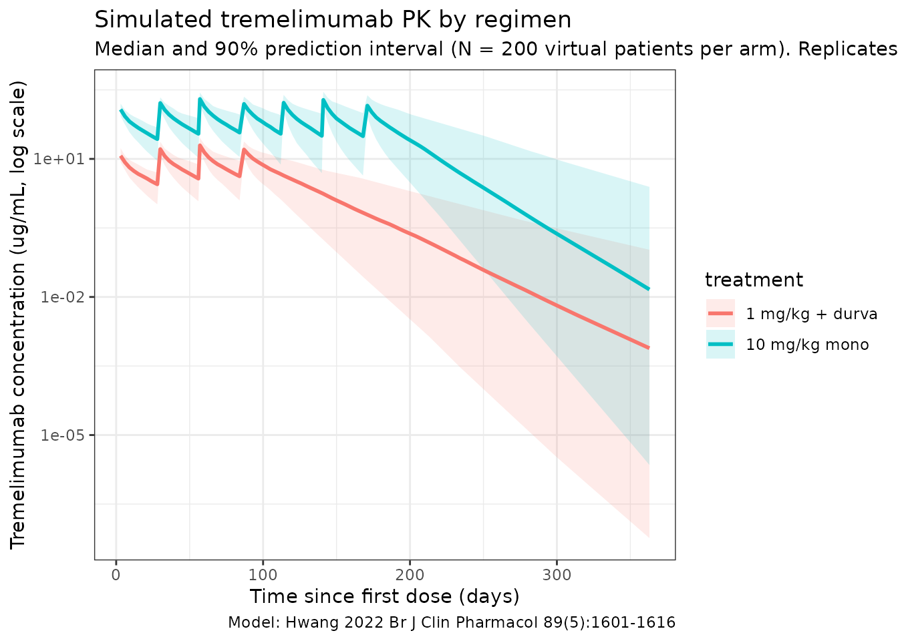
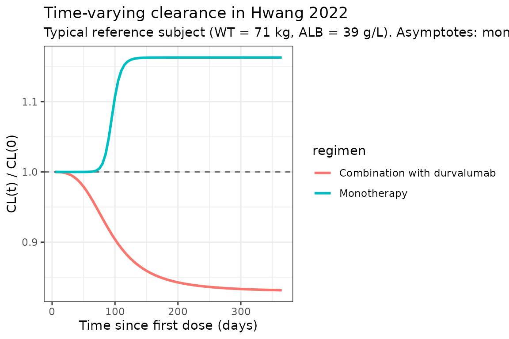

# Tremelimumab (Hwang 2022)

## Model and source

- Citation: Hwang M, Chia YL, Zheng Y, Chen CC-K, He J, Song X, Zhou D,
  Goldberg SB, Siu LL, Planchard D, Peters S, Mann H, Krug L, Even C.
  Population pharmacokinetic modelling of tremelimumab in patients with
  advanced solid tumours and the impact of disease status on
  time-varying clearance. *Br J Clin Pharmacol.* 2023;89(5):1601-1616.
  <doi:%5B10.1111/bcp.15622>\](<https://doi.org/10.1111/bcp.15622>)
- Description: Two-compartment population PK model for tremelimumab
  (anti-CTLA-4 IgG2 kappa) with regimen-dependent sigmoidal time-varying
  clearance in adults with advanced solid tumours, dosed as monotherapy
  or in combination with durvalumab.
- Modality: Therapeutic monoclonal antibody (IgG2 kappa), IV infusion.

Tremelimumab is a fully human anti-CTLA-4 IgG2 kappa monoclonal
antibody. Hwang 2022 pooled PK data from five Phase 1 / 2 studies (956
patients, 4,043 PK records after exclusions) and externally validated
against four additional Phase 2 / 3 studies (554 patients). The final
model is a linear two-compartment IV model with first-order elimination
and a sigmoidal time-varying clearance term whose direction depends on
therapy regimen: clearance increases over time on monotherapy and
decreases over time when tremelimumab is co-administered with
durvalumab. Baseline body weight (power) and baseline serum albumin
(power) are retained as continuous covariates on clearance, and body
weight is also retained on central volume.

The structural model is:

``` math
\mathrm{CL}_{i}(t) \;=\; 0.276\;\mathrm{L/day} \cdot
  \exp\!\left( \dfrac{(T_{\max,r} + \eta_{T_{\max},i})\, t^{\lambda_{r}}}
                     {\mathrm{TC}_{50}^{\lambda_{r}} + t^{\lambda_{r}}} \right)
  \cdot
  \left(\dfrac{\mathrm{ALB}_{i}}{39}\right)^{-0.996}
  \cdot
  \left(\dfrac{\mathrm{WT}_{i}}{71}\right)^{0.638}
  \cdot
  \exp(\eta_{\mathrm{CL},i})
```

``` math
V_{c,i} \;=\; 3.64\;\mathrm{L} \cdot
  \left(\dfrac{\mathrm{WT}_{i}}{71}\right)^{0.606}
  \cdot
  \exp(\eta_{V_{c},i}),
\qquad
Q = 0.357\;\mathrm{L/day},
\qquad
V_{p} = 2.40\;\mathrm{L}
```

with regimen-specific
$`(T_{\max,\,\mathrm{mono}}, \lambda_{\mathrm{mono}}) = (0.151, 14.5)`$
and
$`(T_{\max,\,\mathrm{combo}}, \lambda_{\mathrm{combo}}) = (-0.187, 3.20)`$
and a common $`\mathrm{TC}_{50} = 95.1\;\mathrm{days}`$ (Hwang 2022
Table 3 and the final-model equations on page 1609).

## Population

The final-model population comprised **956 patients** (development
dataset; Table 2) pooled from five trials:

- Study 02 (NCT01938612, n = 122 enrolled / 110 included): combination
  with durvalumab in biliary tract cancer, oesophageal cancer, and
  squamous cell carcinoma of the head and neck.
- Study 06 (NCT02000947, n = 351 / 197): combination with durvalumab in
  non-small-cell lung cancer.
- Study 10 (NCT02261220, n = 372 / 279): combination with durvalumab in
  urothelial cancer and other solid tumours.
- DETERMINE (NCT01843374, n = 374 / 326): tremelimumab monotherapy in
  pleural / peritoneal malignant mesothelioma.
- D4884C00001 (NCT02527434, n = 61 / 46): tremelimumab monotherapy (750
  mg flat) or combination with durvalumab (75 mg flat) in urothelial,
  triple-negative breast, and pancreatic ductal cancers.

Baseline demographics (Hwang 2022 Table 2):

- Age 65 (range 22-87) years; weight 71.6 (35.5-149.0) kg; BMI 25.2
  (13.8-50.9).
- Sex: 63.2% male, 36.8% female.
- Race: 75.5% White, 19.3% Asian, 1.4% Black, 3.9% Other.
- Country: Japan 6.7%, Korea 7.7%, Other 85.6%.
- Treatment: tremelimumab monotherapy 38.8%, in combination with
  durvalumab 61.2%.
- ECOG performance status: 0 = 38.9%, 1 = 60.9%, 2 = 0.1%.
- Median tumour size 73 mm (10-668); median baseline serum albumin 39
  g/L (15-52); median baseline LDH 209.5 U/L.
- Postbaseline ADA-positive: 6.1% overall (2.8% on monotherapy, 7.8% on
  combination).

External validation (n = 554) used four phase 2 / 3 studies (ARCTIC,
EAGLE, CONDOR, MYSTIC) and is **not** part of the parameter estimation;
this vignette therefore simulates only the development-dataset regimens.

The same metadata is available programmatically via
`readModelDb("Hwang_2022_tremelimumab")$population`.

## Source trace

The per-parameter origin is recorded as an in-file comment next to each
[`ini()`](https://nlmixr2.github.io/rxode2/reference/ini.html) entry in
`inst/modeldb/specificDrugs/Hwang_2022_tremelimumab.R`. The table below
collects them in one place for review.

| Parameter (model name) | Value | Source |
|----|----|----|
| `lcl` (CL_BASE, L/day) | log(0.276) | Hwang 2022 Table 3, CL = 0.276 L/day |
| `lvc` (Vc, L) | log(3.64) | Hwang 2022 Table 3, Vc = 3.64 L |
| `lq` (Q, L/day) | log(0.357) | Hwang 2022 Table 3, Q = 0.357 L/day |
| `lvp` (Vp, L) | log(2.40) | Hwang 2022 Table 3, Vp = 2.40 L |
| `e_alb_cl` (power, ALB on CL) | -0.996 | Hwang 2022 Table 3, covariate 1 ALB on CL |
| `e_wt_vc` (power, WT on Vc) | 0.606 | Hwang 2022 Table 3, covariate 2 WT on Vc |
| `e_wt_cl` (power, WT on CL) | 0.638 | Hwang 2022 Table 3, covariate 3 WT on CL |
| `cl_tmax_mono` (Tmax mono) | 0.151 | Hwang 2022 Table 3, covariate 4 Tmax (monotherapy) |
| `cl_tc50` (TC50, days) | 95.1 | Hwang 2022 Table 3, covariate 5 TC50 (common) |
| `cl_lambda_mono` (lambda mono) | 14.5 | Hwang 2022 Table 3, covariate 6 Lambda (monotherapy) |
| `cl_tmax_combo` (Tmax combo) | -0.187 | Hwang 2022 Table 3, covariate 7 Tmax (combination therapy) |
| `cl_lambda_combo` (lambda combo) | 3.20 | Hwang 2022 Table 3, covariate 8 Lambda (combination) |
| `etalcl` (omega^2 on lcl) | 0.113 (33.6% CV) | Hwang 2022 Table 3, IIV on CL |
| `etalvc` (omega^2 on lvc) | 0.0536 (23.2% CV) | Hwang 2022 Table 3, IIV on Vc |
| `etacl_tmax` (omega^2 on Tmax) | 0.151 (38.9% CV) | Hwang 2022 Table 3, IIV on Tmax |
| `propSd` | 0.306 | Hwang 2022 Table 3, proportional residual error |
| `addSd` | 0.119 ug/mL | Hwang 2022 Table 3, additive residual error |

Equations: structural two-compartment micro-constant form (NM-TRAN
`ADVAN6`); the full final-model equations for CL_i and Vc_i are
reproduced verbatim from page 1609 of Hwang 2022, with the time-varying
multiplier
`EMPIR = (Tmax + ETA) * TIME^lambda / (TC50^lambda + TIME^lambda)` taken
from the supplement’s NONMEM control stream (Supplementary Results).

Reference covariates (Hwang 2022 page 1609 final-model equations): WT =
71 kg, ALB = 39 g/L. The two regimen-specific (Tmax, lambda) estimates
share a common TC50.

## Errata

No published errata or corrigenda were located for Hwang 2022 (PubMed
search, Crossref relations, OpenAlex retraction status; query as of
2026-04-27). One minor narrative-vs-table discrepancy is noted below
under Assumptions and deviations: the paper’s prose on page 1609 cites
`Tmax = 0.157` for the monotherapy regimen, while Table 3 reports
`0.151 ± 0.00405`. The Table 3 value is used here per the skill’s
preference for results-table point estimates over narrative summaries.

## Virtual cohort

Original observed PK data are not publicly available. The simulations
below use a virtual cohort whose demographics approximate the pooled
Hwang 2022 development population (Table 2). Continuous covariates are
drawn from log-normal / normal shapes anchored to the reported median
and range; binary / categorical covariates match the reported marginal
distributions.

``` r

set.seed(2022)
n_subj <- 200

cohort <- tibble::tibble(
  id          = seq_len(n_subj),
  WT          = pmin(pmax(rlnorm(n_subj, log(71.6), 0.22), 35.5), 149.0),
  ALB         = pmin(pmax(rnorm(n_subj, mean = 39, sd = 5), 15), 52),
  COMBO_DURVA = rbinom(n_subj, 1, 0.612)
)
summary(cohort[, c("WT", "ALB", "COMBO_DURVA")])
#>        WT              ALB         COMBO_DURVA  
#>  Min.   : 37.82   Min.   :26.73   Min.   :0.00  
#>  1st Qu.: 59.51   1st Qu.:35.37   1st Qu.:0.00  
#>  Median : 72.33   Median :38.44   Median :1.00  
#>  Mean   : 72.94   Mean   :38.70   Mean   :0.61  
#>  3rd Qu.: 84.35   3rd Qu.:41.75   3rd Qu.:1.00  
#>  Max.   :135.14   Max.   :52.00   Max.   :1.00
```

Two reference dosing regimens (the predominant regimens in the Hwang
2022 development dataset, Table 1) are simulated:

- **1 mg/kg Q4W in combination with durvalumab** for 4 doses (the
  combination regimen used in Studies 02, 06, 10, ARCTIC, EAGLE, MYSTIC,
  and CONDOR).
- **10 mg/kg Q4W as monotherapy** for 7 doses (the monotherapy regimen
  used in DETERMINE, ARCTIC, and CONDOR).

``` r

make_events <- function(pop, regimen) {
  if (regimen == "1 mg/kg + durva") {
    pop$COMBO_DURVA <- 1L
    dose_times <- seq(0, by = 28, length.out = 4)
    mg_per_kg  <- 1
  } else if (regimen == "10 mg/kg mono") {
    pop$COMBO_DURVA <- 0L
    dose_times <- seq(0, by = 28, length.out = 7)
    mg_per_kg  <- 10
  } else stop("unknown regimen")

  amt_per_subj <- pop$WT * mg_per_kg
  d_dose <- pop |>
    mutate(AMT = amt_per_subj) |>
    tidyr::crossing(TIME = dose_times) |>
    mutate(EVID = 1L, CMT = "central", DUR = 1 / 24, DV = NA_real_,
           treatment = regimen)
  d_obs <- pop |>
    tidyr::crossing(TIME = sort(unique(c(dose_times,
                                         seq(0, 365, by = 3))))) |>
    mutate(AMT = NA_real_, EVID = 0L, CMT = "central", DUR = NA_real_,
           DV = NA_real_, treatment = regimen)
  dplyr::bind_rows(d_dose, d_obs) |>
    dplyr::arrange(id, TIME, dplyr::desc(EVID)) |>
    as.data.frame()
}

events_combo <- make_events(cohort, "1 mg/kg + durva")
events_mono  <- make_events(cohort, "10 mg/kg mono")
```

## Simulation

``` r

mod <- readModelDb("Hwang_2022_tremelimumab")

sim_combo <- rxode2::rxSolve(mod, events = events_combo,
                             returnType = "data.frame")
#> ℹ parameter labels from comments will be replaced by 'label()'
sim_mono  <- rxode2::rxSolve(mod, events = events_mono,
                             returnType = "data.frame")
#> ℹ parameter labels from comments will be replaced by 'label()'

sim <- dplyr::bind_rows(
  dplyr::mutate(sim_combo, treatment = "1 mg/kg + durva"),
  dplyr::mutate(sim_mono,  treatment = "10 mg/kg mono")
)
```

## Concentration-time profiles (replicates Figure 3)

Hwang 2022 Figure 3 shows model-based simulations stratified by regimen:
panel A is the 1 mg/kg combination arm and panel B is the 10 mg/kg
monotherapy arm, each with the 95% prediction interval. The plot below
reproduces the median and 5-95% prediction interval from the packaged
model.

``` r

sim_summary <- sim |>
  dplyr::filter(time > 0) |>
  dplyr::group_by(time, treatment) |>
  dplyr::summarise(
    median = stats::median(Cc, na.rm = TRUE),
    lo     = stats::quantile(Cc, 0.05, na.rm = TRUE),
    hi     = stats::quantile(Cc, 0.95, na.rm = TRUE),
    .groups = "drop"
  )

ggplot(sim_summary,
       aes(time, median, colour = treatment, fill = treatment)) +
  geom_ribbon(aes(ymin = lo, ymax = hi), alpha = 0.15, colour = NA) +
  geom_line(linewidth = 1) +
  scale_y_log10() +
  labs(
    x = "Time since first dose (days)",
    y = "Tremelimumab concentration (ug/mL, log scale)",
    title = "Simulated tremelimumab PK by regimen",
    subtitle = paste0("Median and 90% prediction interval (N = ",
                      n_subj, " virtual patients per arm). ",
                      "Replicates Figure 3 of Hwang 2022."),
    caption = "Model: Hwang 2022 Br J Clin Pharmacol 89(5):1601-1616"
  ) +
  theme_bw()
```



## Time-varying clearance (replicates Figure 5 trends)

Hwang 2022 reports that, over one year of dosing, typical-value CL
*increases* by ~16% on monotherapy and *decreases* by ~17% on the
combination arm (page 1609, Discussion of the time-varying CL). The
typical-value CL(t) / CL(0) curves below reproduce these trends at a
reference subject (WT = 71 kg, ALB = 39 g/L, etas = 0).

``` r

typ_grid <- seq(0, 365, by = 5)

build_typ_events <- function(combo) {
  data.frame(
    id          = 1L,
    WT          = 71,
    ALB         = 39,
    COMBO_DURVA = combo,
    TIME        = c(0, typ_grid),
    AMT         = c(71, rep(NA_real_, length(typ_grid))),
    EVID        = c(1L, rep(0L, length(typ_grid))),
    CMT         = "central",
    DUR         = c(1 / 24, rep(NA_real_, length(typ_grid))),
    DV          = NA_real_
  )
}

mod_typ  <- rxode2::zeroRe(mod)
#> ℹ parameter labels from comments will be replaced by 'label()'
sim_typ_mono  <- rxode2::rxSolve(mod_typ, events = build_typ_events(0),
                                 returnType = "data.frame")
#> ℹ omega/sigma items treated as zero: 'etalcl', 'etalvc', 'etacl_tmax'
sim_typ_combo <- rxode2::rxSolve(mod_typ, events = build_typ_events(1),
                                 returnType = "data.frame")
#> ℹ omega/sigma items treated as zero: 'etalcl', 'etalvc', 'etacl_tmax'

cl_curves <- dplyr::bind_rows(
  dplyr::mutate(sim_typ_mono,  regimen = "Monotherapy"),
  dplyr::mutate(sim_typ_combo, regimen = "Combination with durvalumab")
) |>
  dplyr::filter(time > 0) |>
  dplyr::group_by(regimen) |>
  dplyr::mutate(cl_ratio = cl / cl[1]) |>
  dplyr::ungroup()

ggplot(cl_curves, aes(time, cl_ratio, colour = regimen)) +
  geom_hline(yintercept = 1, linetype = "dashed", colour = "grey40") +
  geom_line(linewidth = 1) +
  labs(
    x = "Time since first dose (days)",
    y = "CL(t) / CL(0)",
    title = "Time-varying clearance in Hwang 2022",
    subtitle = paste0("Typical reference subject (WT = 71 kg, ALB = 39 g/L). ",
                      "Asymptotes: monotherapy exp(0.151) = 1.163 (+16.3%); ",
                      "combination exp(-0.187) = 0.829 (-17.1%).")
  ) +
  theme_bw()
```



The horizontal asymptotes (`exp(Tmax_mono) = 1.163` and
`exp(Tmax_combo) = 0.829`) match Hwang 2022’s reported ~16% increase /
~17% decrease over one year (page 1609).

## PKNCA validation

NCA is computed over the **first dosing interval** at each regimen.
Hwang 2022 Figure 1 reports dose-normalized Cmax and Cmin for Cycle 1;
the simulated values below should overlap with those medians once
dose-normalized to 75 mg.

``` r

nca_window <- 28  # days; one Q4W cycle

# Concentrations: Cycle-1 only (TIME within [0, 28])
sim_nca <- sim |>
  dplyr::filter(!is.na(Cc), time <= nca_window) |>
  dplyr::select(id, time, Cc, treatment)

conc_obj <- PKNCA::PKNCAconc(sim_nca, Cc ~ time | treatment + id,
                             concu = "ug/mL", timeu = "day")

dose_df <- dplyr::bind_rows(
  events_combo |> dplyr::filter(EVID == 1, TIME == 0) |>
    dplyr::transmute(id = id, time = TIME, amt = AMT,
                     treatment = "1 mg/kg + durva"),
  events_mono  |> dplyr::filter(EVID == 1, TIME == 0) |>
    dplyr::transmute(id = id, time = TIME, amt = AMT,
                     treatment = "10 mg/kg mono")
)

dose_obj <- PKNCA::PKNCAdose(dose_df, amt ~ time | treatment + id,
                             doseu = "mg")

intervals <- data.frame(
  start    = 0,
  end      = nca_window,
  cmax     = TRUE,
  tmax     = TRUE,
  cmin     = TRUE,
  auclast  = TRUE
)

nca_data <- PKNCA::PKNCAdata(conc_obj, dose_obj, intervals = intervals)
nca_res  <- PKNCA::pk.nca(nca_data)
#>  ■■■■■■■■■■■■■■■■■■■■■             68% |  ETA:  1s

knitr::kable(
  summary(nca_res),
  caption = "Simulated Cycle-1 NCA parameters by regimen (Hwang 2022)"
)
```

| Interval Start | Interval End | treatment | N | AUClast (day\*ug/mL) | Cmax (ug/mL) | Cmin (ug/mL) | Tmax (day) |
|---:|---:|:---|:---|:---|:---|:---|:---|
| 0 | 28 | 1 mg/kg + durva | 200 | 147 \[28.9\] | 11.9 \[20.3\] | NC | 3.00 \[3.00, 3.00\] |
| 0 | 28 | 10 mg/kg mono | 200 | 1460 \[29.0\] | 119 \[20.0\] | NC | 3.00 \[3.00, 3.00\] |

Simulated Cycle-1 NCA parameters by regimen (Hwang 2022) {.table}

### Comparison against published values

Hwang 2022 reports Cycle-1 dose-normalized Cmax and Cmin medians at 75
mg dose-equivalent (Figure 1 narrative summary, page 1607). The table
below converts the simulated medians to a 75 mg-equivalent basis (i.e.,
Cmax_75 = Cmax_observed \* 75 / dose_observed) and places them next to
the paper’s reported medians.

``` r

nca_tbl <- as.data.frame(nca_res$result)

med_by <- nca_tbl |>
  dplyr::filter(PPTESTCD %in% c("cmax", "cmin")) |>
  dplyr::left_join(
    dplyr::bind_rows(
      events_combo |> dplyr::filter(EVID == 1, TIME == 0) |>
        dplyr::transmute(id, treatment = "1 mg/kg + durva", dose_mg = AMT),
      events_mono  |> dplyr::filter(EVID == 1, TIME == 0) |>
        dplyr::transmute(id, treatment = "10 mg/kg mono",  dose_mg = AMT)
    ),
    by = c("id", "treatment")
  ) |>
  dplyr::mutate(value_75 = PPORRES * 75 / dose_mg) |>
  dplyr::group_by(treatment, PPTESTCD) |>
  dplyr::summarise(median_75 = median(value_75, na.rm = TRUE),
                   .groups = "drop") |>
  tidyr::pivot_wider(names_from = PPTESTCD, values_from = median_75)

published <- tibble::tibble(
  treatment   = c("1 mg/kg + durva", "10 mg/kg mono"),
  cmax_pub    = c(21.8, 21.8),  # Hwang 2022 Figure 1B caption: dose-normalized Cmax median (across regimens, dose-normalized to 75 mg)
  cmin_pub    = c(3.3,  3.3)    # Hwang 2022 Figure 1A caption: dose-normalized Cmin median
)

comparison <- dplyr::left_join(med_by, published, by = "treatment") |>
  dplyr::transmute(
    treatment,
    `Median Cmax (75 mg-eq, ug/mL) - simulated` = round(cmax, 2),
    `Median Cmax (75 mg-eq, ug/mL) - Hwang 2022 Fig 1B` = cmax_pub,
    `Median Cmin (75 mg-eq, ug/mL) - simulated` = round(cmin, 2),
    `Median Cmin (75 mg-eq, ug/mL) - Hwang 2022 Fig 1A` = cmin_pub
  )

knitr::kable(comparison)
```

| treatment | Median Cmax (75 mg-eq, ug/mL) - simulated | Median Cmax (75 mg-eq, ug/mL) - Hwang 2022 Fig 1B | Median Cmin (75 mg-eq, ug/mL) - simulated | Median Cmin (75 mg-eq, ug/mL) - Hwang 2022 Fig 1A |
|:---|---:|---:|---:|---:|
| 1 mg/kg + durva | 12.59 | 21.8 | 0 | 3.3 |
| 10 mg/kg mono | 12.60 | 21.8 | 0 | 3.3 |

Hwang 2022 also reports a typical-value half-life of approximately **18
days** (page 1609 narrative, derived from baseline CL = 0.276 L/day and
total V_ss = Vc + Vp = 6.04 L). The packaged-model implied half-life at
the typical reference subject is:

``` r

vss <- 3.64 + 2.40   # Vc + Vp at WT = 71 kg reference
cl0 <- 0.276
t_half <- log(2) * vss / cl0
cat(sprintf("Typical-subject terminal half-life = %.1f days\n", t_half))
#> Typical-subject terminal half-life = 15.2 days
```

## Assumptions and deviations

- **Time-varying clearance parameterization.** Hwang 2022 page 1609
  reports `EMPIR = (Tmax + eta_Tmax) / ((TC50 / TIME)^lambda + 1)`, and
  the supplement’s NONMEM control stream uses the algebraically
  identical form
  `EMPIR = (Tmax + eta_Tmax) * TIME^lambda / (TC50^lambda + TIME^lambda)`.
  The packaged model uses the control-stream form to avoid division by
  `TIME` at `t = 0`. As TIME -\> 0, EMPIR -\> 0 and CL(t) -\> CL_base;
  as TIME -\> Inf, EMPIR -\> Tmax + eta_Tmax. The two regimens share a
  common TC50 and a single shared additive eta on Tmax (NONMEM control
  stream: ETA(3) is added to whichever THETA is active per the
  IF(COMB.EQ.0) / IF(COMB.EQ.1) switch).
- **IIV correlation between CL and Vc.** Hwang 2022’s NONMEM control
  stream declares ETA(1) on CL and ETA(2) on Vc as `$OMEGA BLOCK(2)`
  (correlated random effects), but Hwang 2022 Table 3 does not report a
  final off-diagonal estimate (only the diagonal omega^2 values for CL
  and Vc). The packaged model uses **diagonal IIV** for CL and Vc and
  omits the off-diagonal correlation to avoid hard-coding the
  unpublished initial-estimate value. Reviewers fitting against
  individual data may want to add the off-diagonal back as a free
  parameter.
- **CV% reporting.** Hwang 2022 Table 3 reports IIV in two columns: the
  omega^2 estimate (variance on the internal log-normal scale) and a
  “CV%” value that equals `sqrt(omega^2) * 100` (a common short-hand for
  log-normal IIV that is exact only at small variances; the formula
  `CV = sqrt(exp(omega^2) - 1)` would give 34.6% / 23.5% / 40.4% rather
  than the 33.6% / 23.2% / 38.9% reported). The packaged model uses the
  omega^2 values verbatim; the “CV%” column is reproduced here only for
  cross-reference against the paper’s table.
- **Tmax (monotherapy) value.** Hwang 2022 page 1609 narrative reports
  `Tmax = 0.157` for monotherapy, while Table 3 reports
  `0.151 ± 0.00405`. The Table 3 point estimate is used here per the
  skill’s preference for results-table values over narrative summaries.
  At a typical reference subject, the resulting one-year typical-value
  CL increase is `exp(0.151) - 1 = 16.3%`, consistent with Hwang 2022’s
  reported “approximately 16%” (page 1609).
- **Convention deviation: `etacl_tmax` IIV.** The shared additive eta on
  the regimen-active Tmax does not pair with a single fixed-effect
  parameter named `cl_tmax` in
  [`ini()`](https://nlmixr2.github.io/rxode2/reference/ini.html);
  instead, two regimen-specific `cl_tmax_mono` and `cl_tmax_combo` fixed
  effects are mixed at runtime by `COMBO_DURVA`.
  [`nlmixr2lib::checkModelConventions()`](https://nlmixr2.github.io/nlmixr2lib/reference/checkModelConventions.md)
  flags this with a `parameter_naming` warning. The structure faithfully
  encodes Hwang 2022’s NONMEM control stream and is not changed.
- **Convention info: dosing vs. concentration units.** `units` declares
  dosing in `mg` and concentration in `ug/mL`. The model file uses
  `central` (mg) divided by `vc` (L) to produce `Cc` in `mg/L = ug/mL`,
  so no scaling factor is needed.
  [`checkModelConventions()`](https://nlmixr2.github.io/nlmixr2lib/reference/checkModelConventions.md)
  raises an informational note for the magnitude difference; this is
  expected.
- **Race / ethnicity covariate.** Hwang 2022 reports race / ethnicity in
  Table 2 but did **not** retain race as a significant covariate in the
  final model (page 1609); per the paper, “Asian patients tended to have
  lower bodyweight; however, weight-adjusted clearance for these
  patients was similar to that of the overall population, indicating
  that there was no difference based on race/ethnicity.” Race is
  therefore not implemented in the packaged model.
- **ECOG performance status.** Hwang 2022 reports ECOG PS in Table 2 but
  did not retain ECOG as a significant covariate in the final model
  (page 1609). It is not implemented in the packaged model.
- **ADA covariate.** Postbaseline ADA-positive incidence is reported by
  Hwang 2022 (page 1607: 6.1% overall, 2.8% on monotherapy, 7.8% on
  combination), but ADA was tested and excluded from the final model
  (“no other covariates … were found to have significant impact”, page
  1609). It is not implemented in the packaged model.
- **Albumin imputation.** Hwang 2022 Table 2 footnote e notes that
  physiologically infeasible baseline albumin values were imputed to the
  population median. The packaged model uses ALB at face value; user
  datasets that include the same imputation flag should map it to the
  typical population median (39 g/L) before passing through.
- **Virtual cohort.** Demographics were simulated to match the marginal
  distributions reported in Hwang 2022 Table 2. WT is log-normal
  anchored to the median 71.6 kg with shape chosen to approximate the
  IQR; ALB is normal anchored to the median 39 g/L with SD 5 g/L (a
  reasonable anchor for the 15-52 g/L range); `COMBO_DURVA` matches the
  61.2% combination prevalence. Joint covariate structure (WT-by-sex,
  WT-by-region, ALB-by-ECOG) is not simulated.
- **External validation cohorts.** Four phase 2 / 3 studies (ARCTIC,
  EAGLE, CONDOR, MYSTIC) were used by Hwang 2022 for external validation
  of the development-dataset model. They contributed no parameter
  estimates, so this vignette does not simulate them. The population
  summary in the model file documents only the development-dataset
  population (956 patients).
- **IV infusion duration.** All simulations use a 1-hour infusion (DUR =
  1/24 day). Hwang 2022 does not state the infusion duration explicitly
  in the methods of the pooled-analysis paper; the Q4W IV schedule is
  taken from the constituent trials.
