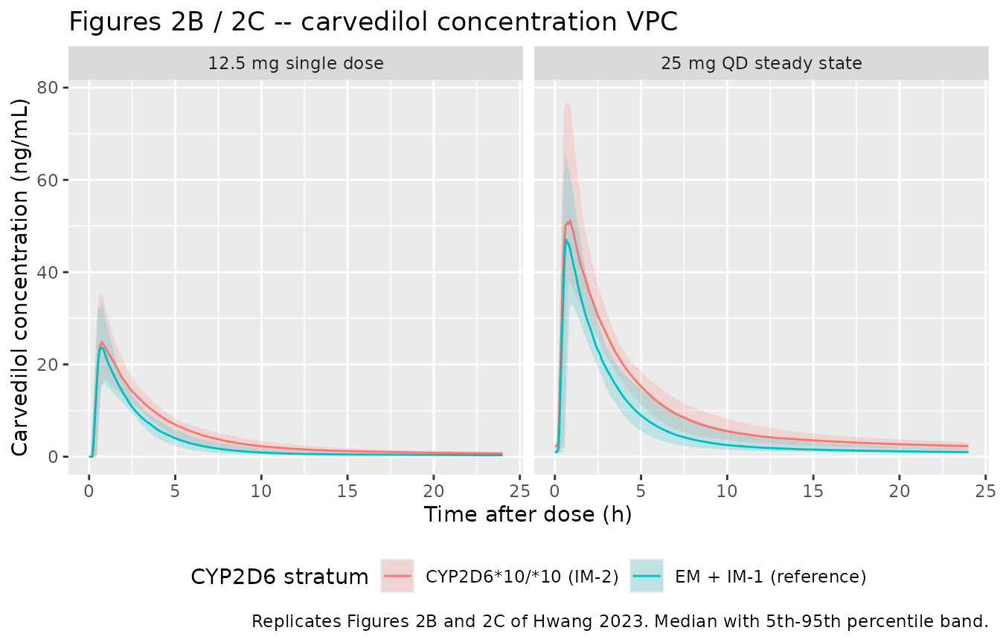
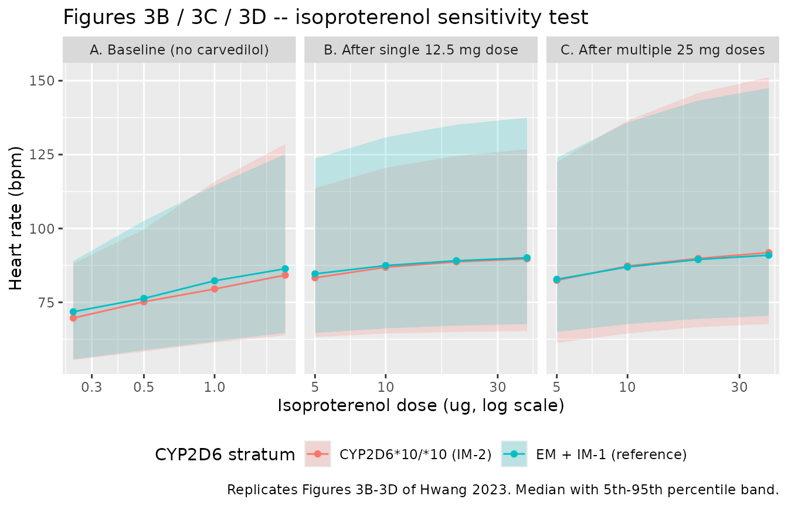

# Carvedilol (Hwang 2023)

## Model and source

- Citation: Hwang S, Lee S, Yoon J, Chung JY. Population
  Pharmacokinetic-Pharmacodynamic Modeling of Carvedilol to Evaluate the
  Effect of Cytochrome P450 2D6 Genotype on the Heart Rate Reduction. J
  Korean Med Sci. 2023 Jun 5;38(22):e173.
  <doi:10.3346/jkms.2023.38.e173>
- Description: Sequential population PK-PD model for oral carvedilol in
  21 healthy Korean male volunteers genotyped for CYP2D6 (Hwang 2023).
  PK is a two-compartment model (central + peripheral1) with zero-order
  absorption of duration D1 into the central compartment preceded by an
  absorption lag time Tlag, and first-order elimination; volumes and
  clearances are apparent (CL/F, Vc/F, Vp/F, Q/F). The only retained
  covariate is the CYP2D6*10/*10 (intermediate-metabolizer-2) genotype,
  which reduces CL/F by 32.8 percent relative to the pooled CYP2D6*1/*1,
  *1/*2, *1/*10, *2/*10 reference. PD is a direct-effect
  competitive-antagonism Emax model for the heart-rate response to an
  isoproterenol sensitivity test: HR = E0 + Emax \* D / (ED50 \* (1 + C
  / IC50) + D), where D is the isoproterenol challenge dose in ug
  (covariate DOSE_ISOPROTERENOL_UG), C is the carvedilol plasma
  concentration in ng/mL, and the Hill exponent was fixed at 1.
  Carvedilol competitively shifts the isoproterenol dose-response curve
  to the right without changing Emax; no covariate, including CYP2D6
  phenotype, was retained on any PD parameter.
- Article: <https://doi.org/10.3346/jkms.2023.38.e173>
- Free full text (PubMed Central):
  <https://www.ncbi.nlm.nih.gov/pmc/articles/PMC10244018/>

No supplementary material, erratum, or corrigendum accompanies this
article; the model equations and all parameter estimates are in the main
text (equations 1-7, Fig. 1, Table 2 and Table 3).

## Population

Hwang 2023 analysed an open-label, one-sequence, multiple-dosing study
in 21 healthy Korean adult **male** volunteers (Table 1). Each subject
received a single 12.5 mg oral dose of carvedilol followed by multiple
once-daily 25 mg doses, with plasma sampling at 0, 0.25, 0.5, 1, 2, 3,
4, 6, 8, 12 and 24 h after both the single dose and at steady state. In
total 450 carvedilol plasma concentrations and 1003 heart-rate
observations entered the analysis.

Subjects were genotyped for `CYP2D6` and assigned to three phenotype
strata: extensive metabolizer (EM, `*1/*1` or `*1/*2`, n = 6),
intermediate metabolizer-1 (IM-1, `*1/*10` or `*2/*10`, n = 7) and
intermediate metabolizer-2 (IM-2, `*10/*10`, n = 8). Demographics did
not differ significantly across strata: age 27.3 (4.7) years, height
174.2 (6.6) cm, weight 70.4 (9.6) kg, BMI 23.1 (2.4) kg/m^2 (mean (SD),
Table 1).

Pharmacodynamics were assessed with an isoproterenol sensitivity test
(IST): escalating intravenous isoproterenol boluses of 0.25, 0.5, 1 and
2 ug at baseline, and 5, 10, 20 and 40 ug after single and after
multiple carvedilol doses, each followed by a heart-rate measurement.
Isoproterenol was escalated until heart rate exceeded 140 bpm or rose 30
bpm above the pre-dose rate.

The same information is available programmatically via the model’s
`population` metadata
(`readModelDb("Hwang_2023_carvedilol")()$population`).

## Source trace

The per-parameter origin is recorded as an in-file comment next to each
`ini()` entry in `inst/modeldb/specificDrugs/Hwang_2023_carvedilol.R`.
The table below collects them in one place for review.

| Equation / parameter | Value | Source location |
|----|----|----|
| Two-compartment structure, zero-order absorption into central with lag, first-order elimination | n/a | Hwang 2023 Results “PK modeling” (p. 6) and Fig. 1 |
| `ld1` (D1) | 0.383 h | Table 2, D1 (RSE 70%) |
| `ltlag` (Tlag) | 0.215 h | Table 2, Tlag (RSE 0.6%) |
| `lcl` (CL/F) | 153 L/h | Table 2, CL/F (RSE 0.7%) |
| `lvc` (Vc/F) | 440 L | Table 2, Vc/F (RSE 35%) |
| `lvp` (Vp/F) | 754 L | Table 2, Vp/F (RSE 2.3%) |
| `lq` (Q/F) | 41.3 L/h | Table 2, Q/F (RSE 5.1%) |
| `e_cyp2d6_star10_hom_cl` | 0.328 | Table 2 “IM-2 effect on CL/F” (RSE 14.6%); Table 2 footnote a gives `CL/F = 153*(1-0.328*GT)`, `GT = 1` for IM-2 |
| Exponential IIV `P_i = P_TV * exp(eta_i)` | n/a | Equation (1) |
| `etaltlag` | CV 56.8% -\> `omega^2` 0.2796 | Table 2, `omega_Tlag` (RSE 12.9%, shrinkage 7%) |
| `etalcl` | CV 14.6% -\> `omega^2` 0.0211 | Table 2, `omega_CL/F` (RSE 9.8%, shrinkage 11%) |
| `etalvc` | CV 26.1% -\> `omega^2` 0.0659 | Table 2, `omega_Vc` (RSE 9.2%, shrinkage 31%) |
| Proportional residual `C_ij = Cpred_ij * (1 + eps_ij)` | n/a | Equation (2) |
| `propSd` | `sqrt(0.379)` = 0.6156 | Table 2, “Proportional error” 0.379 (RSE 2.2%) |
| `HR = E0 + Emax * D / (ED50 * (1 + C/IC50) + D)` | n/a | Fig. 1 (final-model equation); general form in equation (4) with `gamma` fixed at 1 per Results “PK-PD modeling” |
| `le0` (E0) | 60.4 bpm | Table 3, E0 (RSE 3.1%) |
| `lemax` (Emax) | 30.7 bpm | Table 3, Emax (RSE 21.9%) |
| `led50` (ED50) | 0.685 ug | Table 3, ED50 (RSE 30.9%); Results text rounds to 0.69 ug |
| `lic50` (IC50) | 16.5 ng/mL | Table 3, IC50 (RSE 34.4%) |
| `etale0` | CV 13.5% -\> `omega^2` 0.0181 | Table 3, `omega_E0` (RSE 12.7%, shrinkage 0%) |
| `etalemax` | CV 65.4% -\> `omega^2` 0.3561 | Table 3, `omega_Emax` (RSE 27%, shrinkage 8%) |
| Additive residual `E_ij = Epred_ij + eps_ij` | n/a | Equation (5) |
| `addSd_HR` | `sqrt(64.2)` = 8.012 bpm | Table 3, “Additive error” 64.2 (RSE 5.9%) |
| `DOSE_ISOPROTERENOL_UG` (D) | 0.25-40 ug | Methods “Data”; equations (3)-(4); Fig. 1 |
| `CYP2D6_STAR10_HOM` (GT) | 0 / 1 | Table 2 footnote a; Table 1 phenotype strata |

Two covariate forms are described in the Methods but retained by neither
the final PK nor the final PK-PD model, and so appear only in
`covariatesDataExcluded`: the median-normalised power model for
continuous covariates (equation 6, screened for age, height and weight)
and the `CYP2D6_STAR10_HET` stratum (IM-1), which the paper pooled with
EM into the `GT = 0` reference.

## Virtual cohort

Original observed data are not publicly available. The cohorts below
reproduce the study design (12.5 mg single dose; 25 mg once daily to
steady state) in two `CYP2D6` strata of 100 virtual subjects each, well
under the 200-per-arm cap. All subjects are male, matching Table 1, and
the model carries no weight / age / height covariate, so no demographic
distribution needs to be simulated.

Dose records carry `rate = -2` so that rxode2 applies the modelled
zero-order absorption duration `dur(central) = D1`; without it the dose
degenerates to an instantaneous bolus.

``` r

set.seed(20230605)

n_per_arm <- 100L

# PK sampling times from Hwang 2023 Methods "Data", plus a denser grid so the
# VPC ribbons are smooth. Absorption ends at Tlag + D1 = 0.598 h, and the IIV on
# Tlag is large (CV 56.8%), so the absorption phase is sampled at 0.05 h to
# resolve Tmax without rounding it onto a coarse grid.
pk_times <- sort(unique(c(0, 0.25, 0.5, 1, 2, 3, 4, 6, 8, 12, 24,
                          seq(0, 3, by = 0.05),
                          seq(3, 24, by = 0.25))))

make_pk_cohort <- function(n, amt, ii, addl, obs_times, gt, arm, id_offset) {
  ids <- id_offset + seq_len(n)
  dose <- tibble::tibble(
    id = ids, time = 0, amt = amt, rate = -2, evid = 1L,
    cmt = "central", dvid = NA_integer_
  )
  if (!is.na(ii)) {
    dose$ii <- ii
    dose$addl <- addl
  }
  obs <- tidyr::expand_grid(id = ids, time = obs_times) |>
    dplyr::mutate(amt = NA_real_, rate = NA_real_, evid = 0L,
                  cmt = "central", dvid = 1L)
  dplyr::bind_rows(dose, obs) |>
    dplyr::mutate(
      CYP2D6_STAR10_HOM = gt,
      DOSE_ISOPROTERENOL_UG = 0,
      arm = arm,
      genotype = ifelse(gt == 1, "CYP2D6*10/*10 (IM-2)", "EM + IM-1 (reference)"),
      treatment = paste(arm, ifelse(gt == 1, "IM-2", "EM/IM-1"), sep = " | ")
    ) |>
    dplyr::arrange(id, time, dplyr::desc(evid))
}

events_sd <- dplyr::bind_rows(
  make_pk_cohort(n_per_arm, amt = 12.5, ii = NA, addl = NA,
                 obs_times = pk_times, gt = 0,
                 arm = "12.5 mg single dose", id_offset = 0L),
  make_pk_cohort(n_per_arm, amt = 12.5, ii = NA, addl = NA,
                 obs_times = pk_times, gt = 1,
                 arm = "12.5 mg single dose", id_offset = 100L)
)

# Steady state: 25 mg once daily for 7 days; observe the final dosing interval
# on the paper's within-interval sampling grid, shifted onto day 7.
events_ss <- dplyr::bind_rows(
  make_pk_cohort(n_per_arm, amt = 25, ii = 24, addl = 6,
                 obs_times = 144 + pk_times, gt = 0,
                 arm = "25 mg QD steady state", id_offset = 200L),
  make_pk_cohort(n_per_arm, amt = 25, ii = 24, addl = 6,
                 obs_times = 144 + pk_times, gt = 1,
                 arm = "25 mg QD steady state", id_offset = 300L)
)

events_pk <- dplyr::bind_rows(events_sd, events_ss)

stopifnot(!anyDuplicated(unique(events_pk[, c("id", "time", "evid")])))
```

## Simulation

``` r

mod <- readModelDb("Hwang_2023_carvedilol")

sim_pk <- rxode2::rxSolve(
  mod, events = events_pk,
  keep = c("arm", "genotype", "treatment")
) |>
  as.data.frame()
#> ℹ parameter labels from comments will be replaced by 'label()'

# Typical-value (no IIV, no residual error) profiles for the parameter checks.
# `omega = NA` is a solve-time argument and, unlike `rxode2::zeroRe()`, does not
# mutate state shared with the modeldb entry.
sim_typ <- rxode2::rxSolve(
  mod,
  events = events_pk |> dplyr::filter(id %in% c(1L, 101L, 201L, 301L)),
  keep = c("arm", "genotype", "treatment"),
  omega = NA, sigma = NA
) |>
  as.data.frame()
```

The typical-value solve must reproduce the published clearances exactly,
and the population solve must still carry between-subject variability.
Both are asserted rather than eyeballed, because either failure is
silent.

``` r

cl_typ <- sim_typ |>
  dplyr::group_by(genotype) |>
  dplyr::summarise(cl = unique(round(cl, 6)), .groups = "drop")

# Table 2: CL/F = 153 L/h; Table 2 footnote a: CL/F = 153*(1-0.328) = 102.816
# L/h for CYP2D6*10/*10.
stopifnot(
  isTRUE(all.equal(
    cl_typ$cl[cl_typ$genotype == "EM + IM-1 (reference)"], 153, tolerance = 1e-6)),
  isTRUE(all.equal(
    cl_typ$cl[cl_typ$genotype == "CYP2D6*10/*10 (IM-2)"], 102.816, tolerance = 1e-6)),
  # population solve retains IIV on CL
  stats::sd(log(sim_pk$cl[sim_pk$genotype == "EM + IM-1 (reference)"])) > 0.05
)

cl_typ |>
  dplyr::mutate(`Published CL/F (L/h)` = c(102.816, 153)) |>
  dplyr::rename("CYP2D6 stratum" = genotype, "Simulated CL/F (L/h)" = cl) |>
  knitr::kable(caption = "Typical-value CL/F by CYP2D6 stratum vs Hwang 2023 Table 2 and its footnote a.")
```

| CYP2D6 stratum        | Simulated CL/F (L/h) | Published CL/F (L/h) |
|:----------------------|---------------------:|---------------------:|
| CYP2D6*10/*10 (IM-2)  |              102.816 |              102.816 |
| EM + IM-1 (reference) |              153.000 |              153.000 |

Typical-value CL/F by CYP2D6 stratum vs Hwang 2023 Table 2 and its
footnote a. {.table}

Absorption is zero-order over `D1` after a lag of `Tlag`, so the
typical-value Tmax must equal `Tlag + D1 = 0.215 + 0.383 = 0.598 h`.

``` r

tmax_typ <- sim_typ |>
  dplyr::filter(arm == "12.5 mg single dose") |>
  dplyr::group_by(genotype) |>
  dplyr::slice_max(Cc, n = 1, with_ties = FALSE) |>
  dplyr::ungroup()

# The absorption-phase grid has 0.05 h resolution, so the recovered Tmax must
# land within one grid step of 0.598 h.
stopifnot(all(abs(tmax_typ$time - (0.215 + 0.383)) <= 0.05))

tmax_typ |>
  dplyr::select(genotype, time, Cc) |>
  dplyr::rename("CYP2D6 stratum" = genotype, "Tmax (h)" = time,
                "Cmax (ng/mL)" = Cc) |>
  knitr::kable(digits = 3,
               caption = "Typical-value Tmax after a single 12.5 mg dose; the end of the zero-order input is Tlag + D1 = 0.598 h.")
```

| CYP2D6 stratum        | Tmax (h) | Cmax (ng/mL) |
|:----------------------|---------:|-------------:|
| CYP2D6*10/*10 (IM-2)  |      0.6 |       26.685 |
| EM + IM-1 (reference) |      0.6 |       26.117 |

Typical-value Tmax after a single 12.5 mg dose; the end of the
zero-order input is Tlag + D1 = 0.598 h. {.table}

## Replicate published figures

``` r

# Replicates Figure 2B and 2C of Hwang 2023: visual predictive checks of
# carvedilol plasma concentration after a single 12.5 mg dose and at steady
# state on 25 mg once daily.
sim_pk |>
  dplyr::mutate(tad = ifelse(arm == "25 mg QD steady state", time - 144, time)) |>
  dplyr::filter(!is.na(Cc)) |>
  dplyr::group_by(arm, genotype, tad) |>
  dplyr::summarise(
    Q05 = stats::quantile(Cc, 0.05),
    Q50 = stats::quantile(Cc, 0.50),
    Q95 = stats::quantile(Cc, 0.95),
    .groups = "drop"
  ) |>
  ggplot(aes(tad, Q50, colour = genotype, fill = genotype)) +
  geom_ribbon(aes(ymin = Q05, ymax = Q95), alpha = 0.2, colour = NA) +
  geom_line() +
  facet_wrap(~arm) +
  labs(x = "Time after dose (h)", y = "Carvedilol concentration (ng/mL)",
       colour = "CYP2D6 stratum", fill = "CYP2D6 stratum",
       title = "Figures 2B / 2C -- carvedilol concentration VPC",
       caption = "Replicates Figures 2B and 2C of Hwang 2023. Median with 5th-95th percentile band.") +
  theme(legend.position = "bottom")
```



The `CYP2D6*10/*10` band sits above the reference band by the ratio of
clearances (`1 / (1 - 0.328)` = 1.49-fold on AUC), reproducing the
paper’s finding that IM-2 subjects have 32.8% lower CL/F.

The heart-rate figures (Hwang 2023 Fig. 3B-D) plot the IST dose-response
at baseline and after single and multiple carvedilol doses. The paper
does not state the clock time of the post-dose ISTs, so the cohort below
starts each IST 1 h after the carvedilol dose – near the typical-value
Tmax – with the four escalating boluses spaced 6 min apart, and
documents that choice under Assumptions and deviations.

``` r

ist_offsets <- c(0, 0.1, 0.2, 0.3)   # 6-min spacing across the escalation

make_pd_cohort <- function(n, gt, scenario, amt, ii, addl,
                           ist_start, iso_doses, id_offset) {
  ids <- id_offset + seq_len(n)
  obs <- tidyr::expand_grid(
    id = ids,
    step = seq_along(iso_doses)
  ) |>
    dplyr::mutate(
      time = ist_start + ist_offsets[step],
      DOSE_ISOPROTERENOL_UG = iso_doses[step],
      amt = NA_real_, rate = NA_real_, evid = 0L,
      cmt = "central", dvid = 2L
    ) |>
    dplyr::select(-step)
  rows <- if (is.na(amt)) {
    obs
  } else {
    dose <- tibble::tibble(
      id = ids, time = 0, amt = amt, rate = -2, evid = 1L,
      cmt = "central", dvid = NA_integer_, DOSE_ISOPROTERENOL_UG = 0
    )
    if (!is.na(ii)) {
      dose$ii <- ii
      dose$addl <- addl
    }
    dplyr::bind_rows(dose, obs)
  }
  rows |>
    dplyr::mutate(
      CYP2D6_STAR10_HOM = gt,
      scenario = scenario,
      genotype = ifelse(gt == 1, "CYP2D6*10/*10 (IM-2)", "EM + IM-1 (reference)")
    ) |>
    dplyr::arrange(id, time, dplyr::desc(evid))
}

# Baseline IST (no carvedilol): 0.25, 0.5, 1, 2 ug.
# Post-dose ISTs: 5, 10, 20, 40 ug (Hwang 2023 Methods "Data").
events_pd <- dplyr::bind_rows(
  make_pd_cohort(n_per_arm, gt = 0, scenario = "A. Baseline (no carvedilol)",
                 amt = NA, ii = NA, addl = NA, ist_start = 1,
                 iso_doses = c(0.25, 0.5, 1, 2), id_offset = 0L),
  make_pd_cohort(n_per_arm, gt = 1, scenario = "A. Baseline (no carvedilol)",
                 amt = NA, ii = NA, addl = NA, ist_start = 1,
                 iso_doses = c(0.25, 0.5, 1, 2), id_offset = 100L),
  make_pd_cohort(n_per_arm, gt = 0, scenario = "B. After single 12.5 mg dose",
                 amt = 12.5, ii = NA, addl = NA, ist_start = 1,
                 iso_doses = c(5, 10, 20, 40), id_offset = 200L),
  make_pd_cohort(n_per_arm, gt = 1, scenario = "B. After single 12.5 mg dose",
                 amt = 12.5, ii = NA, addl = NA, ist_start = 1,
                 iso_doses = c(5, 10, 20, 40), id_offset = 300L),
  make_pd_cohort(n_per_arm, gt = 0, scenario = "C. After multiple 25 mg doses",
                 amt = 25, ii = 24, addl = 6, ist_start = 145,
                 iso_doses = c(5, 10, 20, 40), id_offset = 400L),
  make_pd_cohort(n_per_arm, gt = 1, scenario = "C. After multiple 25 mg doses",
                 amt = 25, ii = 24, addl = 6, ist_start = 145,
                 iso_doses = c(5, 10, 20, 40), id_offset = 500L)
)

stopifnot(!anyDuplicated(unique(events_pd[, c("id", "time", "evid")])))

sim_pd <- rxode2::rxSolve(
  mod, events = events_pd,
  keep = c("scenario", "genotype", "DOSE_ISOPROTERENOL_UG")
) |>
  as.data.frame()
```

``` r

# Replicates Figures 3B, 3C and 3D of Hwang 2023: heart-rate response to the
# isoproterenol sensitivity test at baseline and after single and multiple
# carvedilol doses.
sim_pd |>
  dplyr::filter(!is.na(HR)) |>
  dplyr::group_by(scenario, genotype, DOSE_ISOPROTERENOL_UG) |>
  dplyr::summarise(
    Q05 = stats::quantile(HR, 0.05),
    Q50 = stats::quantile(HR, 0.50),
    Q95 = stats::quantile(HR, 0.95),
    .groups = "drop"
  ) |>
  ggplot(aes(DOSE_ISOPROTERENOL_UG, Q50, colour = genotype, fill = genotype)) +
  geom_ribbon(aes(ymin = Q05, ymax = Q95), alpha = 0.2, colour = NA) +
  geom_line() +
  geom_point() +
  facet_wrap(~scenario, scales = "free_x") +
  scale_x_log10() +
  labs(x = "Isoproterenol dose (ug, log scale)", y = "Heart rate (bpm)",
       colour = "CYP2D6 stratum", fill = "CYP2D6 stratum",
       title = "Figures 3B / 3C / 3D -- isoproterenol sensitivity test",
       caption = "Replicates Figures 3B-3D of Hwang 2023. Median with 5th-95th percentile band.") +
  theme(legend.position = "bottom")
```



Consistent with the paper’s conclusion, the two `CYP2D6` strata overlap
on the PD panels: the genotype acts on CL/F only, and at the 5-40 ug
isoproterenol doses used after carvedilol the response is close to
maximal in both strata, so the 1.5-fold difference in carvedilol
exposure produces almost no separation in heart rate. Hwang 2023 report
the same result (“None of the covariates, including the `CYP2D6`
phenotype, had significant effects on the PD parameters”).

The competitive-antagonism structure implies two exact identities that
are worth asserting: with no isoproterenol the heart rate equals the
baseline `E0`, and a carvedilol concentration of exactly `IC50` doubles
the apparent isoproterenol `ED50`.

``` r

pd_identity <- rxode2::rxSolve(
  mod,
  events = data.frame(
    time = c(0, 1, 2),
    amt = NA_real_, evid = 0L, cmt = "central", dvid = 2L,
    CYP2D6_STAR10_HOM = 0,
    # no isoproterenol; one full-Emax probe; one probe at 2 x ED50
    DOSE_ISOPROTERENOL_UG = c(0, 1e6, 2 * 0.685)
  ),
  omega = NA, sigma = NA
) |>
  as.data.frame()

# Row 1: D = 0 gives HR = E0 = 60.4 bpm (Table 3).
# Row 2: D -> Inf gives HR = E0 + Emax = 60.4 + 30.7 = 91.1 bpm (Table 3).
# Row 3: with Cc = 0 and D = 2*ED50, HR = E0 + Emax*2/3.
stopifnot(
  isTRUE(all.equal(pd_identity$HR[1], 60.4, tolerance = 1e-6)),
  isTRUE(all.equal(pd_identity$HR[2], 60.4 + 30.7, tolerance = 1e-4)),
  isTRUE(all.equal(pd_identity$HR[3], 60.4 + 30.7 * 2 / 3, tolerance = 1e-6))
)

# Competitive antagonism: at Cc = IC50 the apparent ED50 doubles, so the
# isoproterenol dose producing half of Emax moves from ED50 to 2*ED50.
half_emax_dose <- function(cc, ed50 = 0.685, ic50 = 16.5) ed50 * (1 + cc / ic50)
stopifnot(isTRUE(all.equal(half_emax_dose(16.5), 2 * 0.685, tolerance = 1e-9)))

pd_identity |>
  dplyr::transmute(
    Check = c("D = 0 (no isoproterenol)", "D -> Inf (maximal isoproterenol)",
              "D = 2 x ED50, no carvedilol"),
    Expected = c(60.4, 91.1, 60.4 + 30.7 * 2 / 3),
    Simulated = HR
  ) |>
  dplyr::rename("Expected HR (bpm)" = Expected, "Simulated HR (bpm)" = Simulated) |>
  knitr::kable(digits = 3,
               caption = "Analytic identities of the competitive-antagonism Emax model (Hwang 2023 Table 3, Fig. 1).")
```

| Check                             | Expected HR (bpm) | Simulated HR (bpm) |
|:----------------------------------|------------------:|-------------------:|
| D = 0 (no isoproterenol)          |            60.400 |             60.400 |
| D -\> Inf (maximal isoproterenol) |            91.100 |             91.100 |
| D = 2 x ED50, no carvedilol       |            80.867 |             80.867 |

Analytic identities of the competitive-antagonism Emax model (Hwang 2023
Table 3, Fig. 1). {.table}

## PKNCA validation

NCA is run on the single-dose arm, stratified by `CYP2D6` stratum, using
PKNCA.

``` r

sim_nca <- sim_pk |>
  dplyr::filter(arm == "12.5 mg single dose", !is.na(Cc)) |>
  dplyr::select(id, time, Cc, treatment)

# Guarantee a time = 0 row per (id, treatment); pre-dose Cc = 0 is correct for
# this extravascular (zero-order absorption with lag) model.
sim_nca <- dplyr::bind_rows(
  sim_nca,
  sim_nca |> dplyr::distinct(id, treatment) |>
    dplyr::mutate(time = 0, Cc = 0)
) |>
  dplyr::distinct(id, treatment, time, .keep_all = TRUE) |>
  dplyr::arrange(id, treatment, time)

conc_obj <- PKNCA::PKNCAconc(
  sim_nca, Cc ~ time | treatment + id,
  concu = "ng/mL", timeu = "h"
)

dose_df <- events_pk |>
  dplyr::filter(arm == "12.5 mg single dose", evid == 1) |>
  dplyr::select(id, time, amt, treatment)

dose_obj <- PKNCA::PKNCAdose(dose_df, amt ~ time | treatment + id, doseu = "mg")

intervals <- data.frame(
  start      = 0,
  end        = Inf,
  cmax       = TRUE,
  tmax       = TRUE,
  aucinf.obs = TRUE,
  half.life  = TRUE
)

nca_res <- PKNCA::pk.nca(PKNCA::PKNCAdata(conc_obj, dose_obj, intervals = intervals))
```

### Comparison against published NCA

**Hwang 2023 publishes no NCA table**: the paper reports only model
parameters (Tables 2 and 3), goodness-of-fit plots and VPCs. There is
therefore no published Cmax / AUC / half-life to compare against. The
reference column below is instead derived analytically from the
published parameters, which makes the comparison a genuine check that
the packaged model reproduces the estimates it was built from:

- `AUC0-inf = dose / (CL/F)`, i.e. `12.5 / 153` = 0.0817 mg\*h/L =
  **81.7 ng*h/mL **for the reference stratum and `12.5 / 102.816` =**
  121.6 ng*h/mL** for IM-2 (Table 2 and footnote a).
- `Tmax = Tlag + D1 = 0.215 + 0.383` = **0.598 h** (end of the
  zero-order input; Table 2).
- Terminal half-life from the two-compartment micro-constants implied by
  Table 2, computed below rather than transcribed.
- Cmax has no closed form for a lag-plus-zero-order input into a
  two-compartment model, so the typical-value simulated Cmax is used as
  the reference; the population median is expected to sit near it.

``` r

# Terminal half-life implied by the published two-compartment parameters.
terminal_half_life <- function(cl, vc, vp, q) {
  kel <- cl / vc; k12 <- q / vc; k21 <- q / vp
  b <- kel + k12 + k21
  beta <- (b - sqrt(b^2 - 4 * kel * k21)) / 2
  log(2) / beta
}

cmax_typ <- sim_typ |>
  dplyr::filter(arm == "12.5 mg single dose") |>
  dplyr::group_by(treatment) |>
  dplyr::summarise(cmax = max(Cc), .groups = "drop")

published <- tibble::tibble(
  treatment = c("12.5 mg single dose | EM/IM-1", "12.5 mg single dose | IM-2"),
  cmax       = cmax_typ$cmax[match(c("12.5 mg single dose | EM/IM-1",
                                     "12.5 mg single dose | IM-2"),
                                   cmax_typ$treatment)],
  tmax       = 0.215 + 0.383,
  aucinf.obs = 12.5 / c(153, 153 * (1 - 0.328)) * 1000,
  half.life  = c(terminal_half_life(153, 440, 754, 41.3),
                 terminal_half_life(153 * (1 - 0.328), 440, 754, 41.3))
)

cmp <- nlmixr2lib::ncaComparisonTable(
  simulated = nca_res,
  reference = published,
  by        = "treatment",
  units     = c(cmax = "ng/mL", aucinf.obs = "ng*h/mL",
                tmax = "h", half.life = "h"),
  tolerance_pct = 20
)

knitr::kable(
  cmp,
  caption = "Simulated (population median, n = 100 per stratum) vs analytic reference derived from Hwang 2023 Table 2. * differs from reference by >20%. Hwang 2023 reports no NCA table, so the reference column is computed from the published parameters, not transcribed from the paper.",
  align = c("l", "l", "r", "r", "r")
)
```

| NCA parameter | treatment | Reference | Simulated | % diff |
|:---|:---|---:|---:|---:|
| Cmax (ng/mL) | 12.5 mg single dose \| EM/IM-1 | 26.1 | 25.6 | -1.9% |
| Cmax (ng/mL) | 12.5 mg single dose \| IM-2 | 26.7 | 25.8 | -3.2% |
| Tmax (h) | 12.5 mg single dose \| EM/IM-1 | 0.598 | 0.6 | +0.3% |
| Tmax (h) | 12.5 mg single dose \| IM-2 | 0.598 | 0.65 | +8.7% |
| AUC0-∞ (obs) (ng\*h/mL) | 12.5 mg single dose \| EM/IM-1 | 81.7 | 79.7 | -2.5% |
| AUC0-∞ (obs) (ng\*h/mL) | 12.5 mg single dose \| IM-2 | 122 | 120 | -1.6% |
| t½ (h) | 12.5 mg single dose \| EM/IM-1 | 16.5 | 15.6 | -5.8% |
| t½ (h) | 12.5 mg single dose \| IM-2 | 18.7 | 16.3 | -12.7% |

Simulated (population median, n = 100 per stratum) vs analytic reference
derived from Hwang 2023 Table 2. \* differs from reference by \>20%.
Hwang 2023 reports no NCA table, so the reference column is computed
from the published parameters, not transcribed from the paper. {.table}

`Cmax`, `Tmax` and `AUC0-inf` recover the analytic targets to within a
few percent, and the 1.49-fold `AUC0-inf` ratio between the strata is
exactly `1 / (1 - 0.328)`, confirming the Table 2 footnote a covariate
relationship.

The population median half-life sits modestly below the analytic
terminal half-life. The two-compartment micro-constants implied by Table
2 give a terminal half-life of 16.5 h (reference stratum) and 18.7 h
(IM-2), but the study’s 24 h sampling window covers only about 1.5
terminal half-lives, so `lambda.z` is fit while the distribution phase
still contributes and the NCA estimate is biased low. This is a property
of the published sampling design, not of the model. No parameter was
adjusted.

### Steady-state accumulation

``` r

ss_summary <- sim_pk |>
  dplyr::filter(arm == "25 mg QD steady state", !is.na(Cc)) |>
  dplyr::mutate(tad = time - 144) |>
  dplyr::group_by(genotype, id) |>
  dplyr::summarise(
    cmax_ss = max(Cc),
    ctrough_ss = Cc[which.max(tad)],
    .groups = "drop"
  ) |>
  dplyr::group_by(genotype) |>
  dplyr::summarise(
    `Cmax,ss (ng/mL)` = stats::median(cmax_ss),
    `Ctrough,ss (ng/mL)` = stats::median(ctrough_ss),
    .groups = "drop"
  ) |>
  dplyr::rename("CYP2D6 stratum" = genotype)

knitr::kable(ss_summary, digits = 2,
             caption = "Median steady-state exposure on 25 mg once daily (day 7 interval).")
```

| CYP2D6 stratum        | Cmax,ss (ng/mL) | Ctrough,ss (ng/mL) |
|:----------------------|----------------:|-------------------:|
| CYP2D6*10/*10 (IM-2)  |           54.57 |               2.30 |
| EM + IM-1 (reference) |           50.78 |               0.99 |

Median steady-state exposure on 25 mg once daily (day 7 interval).
{.table}

Peak concentrations barely accumulate: median `Cmax,ss` on 25 mg is
close to twice the single-dose 12.5 mg `Cmax`, and median `Ctrough,ss`
is only about 1-2 ng/mL. Although the terminal half-life is 16-19 h, the
deep-peripheral terminal phase carries only a small fraction of the
total AUC (`Q/F` = 41.3 L/h returning drug from a 754 L peripheral
volume, i.e. `k21` = 0.055 1/h), so concentrations fall well below the
`IC50` of 16.5 ng/mL between daily doses. This matches the shape of
Hwang 2023 Fig. 2C, where the multiple-dose profile returns to
near-baseline concentrations within each 24 h interval.

## Assumptions and deviations

- **Residual-error scale.** Hwang 2023 Table 2 reports “Proportional
  error 0.379” and Table 3 reports “Additive error 64.2” without stating
  whether these are variances or standard deviations. Both are encoded
  here as NONMEM `$SIGMA` **variances**, so
  `propSd = sqrt(0.379) = 0.6156` and `addSd_HR = sqrt(64.2) = 8.012`
  bpm. The additive term settles the question: 64.2 bpm read as a
  standard deviation would exceed the estimated 60.4 bpm baseline heart
  rate and is physiologically impossible, whereas 8.0 bpm is a realistic
  heart-rate residual. Both tables use the same reporting template from
  the same NONMEM run, so the proportional term is read the same way.
  The resulting 61.6% proportional residual is large but consistent with
  the model’s small reported IIV terms (CL/F CV 14.6%, no IIV on Vp, Q
  or D1), which leaves unexplained oral-absorption variability in the
  residual. The two carvedilol models already in nlmixr2lib
  (`Honda_2005_carvedilol`, `Othman_2007_carvedilol`) also report
  `sigma^2` and take its square root.
- **Hill exponent.** The paper’s general equations (3) and (4) carry a
  Hill exponent `gamma`, but Results “PK-PD modeling” states that the
  final model fixed `gamma` at 1, and the final-model equation printed
  inside Fig. 1 carries no exponent. The Fig. 1 form is implemented. No
  `hill` parameter is exposed: equation (4) as typeset places the
  exponent on `C` but not on `IC50`
  (`ED50 * (1 + C^gamma / IC50) + D^gamma`), which is dimensionally
  inconsistent for `gamma != 1`, so there is no unambiguous general form
  to encode.
- **Isoproterenol has no PK compartment.** Fig. 1 draws an isoproterenol
  compartment with an elimination rate constant `k`, but no value for
  `k` is reported anywhere in the paper, and both equation (4) and the
  final-model equation in Fig. 1 are algebraic in the isoproterenol
  **dose** `D` (“D = isoproterenol dosage” per the Fig. 1 legend). The
  dose therefore enters the model as the covariate
  `DOSE_ISOPROTERENOL_UG` rather than as a dosing event into an
  isoproterenol state. No isoproterenol elimination is simulated.
- **IST timing.** The paper does not state how long after the carvedilol
  dose each post-dose isoproterenol sensitivity test began, nor the
  interval between escalation steps. The PD cohort here starts the IST 1
  h after the carvedilol dose (near the typical-value Tmax of 0.6 h)
  with the four boluses 6 min apart. Shifting the IST later reduces the
  carvedilol concentration seen by the PD model and therefore weakens
  the antagonism; the qualitative conclusions are unaffected.
- **Zero-order absorption requires `rate = -2`.** rxode2 applies the
  modelled duration `dur(central) = D1` only to dose records carrying
  `rate = -2`. Event tables built for this model must set it, or the
  oral dose collapses to an instantaneous bolus with a lag.
- **`CYP2D6` encoding.** Hwang 2023 stratified subjects into three
  phenotype groups but retained only the `*10/*10` (IM-2) contrast,
  pooling the heterozygous `*10` carriers (IM-1) with the extensive
  metabolizers as the reference. The model therefore carries the single
  binary canonical `CYP2D6_STAR10_HOM`; the paired `CYP2D6_STAR10_HET`
  canonical is documented under `covariatesDataExcluded` to preserve the
  three-level screen.
- **No demographic covariates.** Age, height and weight were screened
  with the median-normalised power model of equation (6) on both the PK
  and the PK-PD parameters and were not retained, so they appear only in
  `covariatesDataExcluded`. The virtual cohort therefore needs no
  demographic distribution.
- **Racemate.** Carvedilol was given as the racemate and the model
  describes total carvedilol plasma concentrations; the `IC50` of 16.5
  ng/mL is a racemic-total value even though only S(-)-carvedilol
  carries beta-blocking activity (Hwang 2023 Discussion). No
  stereoselective split is modelled.
- **Metabolites.** Metabolic ratios for 4’-hydroxyphenyl carvedilol,
  5’-hydroxyphenyl carvedilol and O-desmethyl carvedilol were below 0.1
  in most subjects, so Hwang 2023 modelled parent carvedilol only
  (Discussion). No metabolite compartment is included.
- **No published NCA comparison is possible.** The paper reports no NCA
  table, so the comparison table’s reference column is derived
  analytically from the published parameters rather than transcribed.
  This is documented in that section and in the table caption.
- **No non-paper-derived parameter values.** Every `ini()` value comes
  from Hwang 2023 Table 2 or Table 3; nothing was digitised from a
  figure, supplied by correspondence, or carried from an upstream model.
