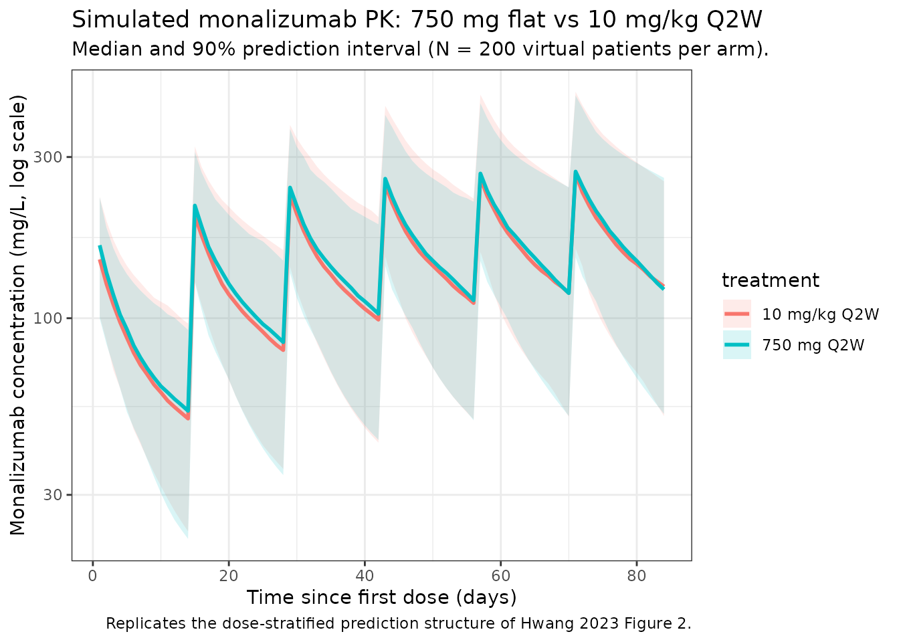

# Hwang_2023_monalizumab

## Model and source

- Citation: Hwang M, Fan C, Yue MS, Zhou D, Paturel C, Andre P, Cheng
  L-Y, Mitchell P, Kourtesis P, Ruscica D, Das M, Morsli N, Ren S, Gibbs
  M, Phipps A, Song X. Population Pharmacokinetics of Monalizumab in
  Patients With Advanced Solid Tumors. *J Clin Pharmacol.*
  2023;63(7):818-829.
  <doi:%5B10.1002/jcph.2220>\](<https://doi.org/10.1002/jcph.2220>)
- Description: Two-compartment population PK model for monalizumab
  (anti-CD94/NKG2A IgG4) with linear (first-order) elimination in
  patients with advanced solid tumors or squamous cell carcinoma of the
  head and neck.
- Modality: Therapeutic monoclonal antibody (humanized IgG4), IV
  infusion.

Monalizumab is a first-in-class humanized anti-CD94/NKG2A IgG4 immune
checkpoint inhibitor. Hwang 2023 reports the population PK analysis
supporting clinical development across solid-tumor and head-and-neck
indications.

Structure: linear two-compartment IV model with first-order elimination
from the central compartment. Five covariate effects are retained in the
final model (Hwang 2023 Table 2): power-form effects of baseline body
weight (BLWT) and baseline serum albumin (BALB) on both CL and V1, and
proportional-shift effects of female sex, current-smoker status, and
never-smoker status on V1. Smoking is a 3-level categorical (never /
former / current) with **former smoker as the implicit reference**; that
3-level encoding is realised here through a paired `SMOKE_CURRENT` /
`SMOKE_NEVER` indicator pair (both = 0 yields the former-smoker
reference).

The covariate equations from Hwang 2023 Methods ‘Covariate
Considerations’ (p. 820) are:

``` math
P_{ki} \;=\; \theta_k \cdot \left(\dfrac{X_{ij}}{M(X_j)}\right)^{\theta_j}
\quad \text{(continuous)},
\qquad
P_{ki} \;=\; \theta_k \cdot \left(1 + \theta_j\right)^{X_{ij}}
\quad \text{(categorical)}
```

with reference values BLWT median = 70.6 kg and BALB median = 3.80 g/dL
(Hwang 2023 Table 1, p. 821).

## Population

The final-model dataset comprised **507 patients** (2,842 PK
observations) pooled from two studies (Hwang 2023 Methods
‘Pharmacokinetic Data Set’, p. 823):

- Study D419NC00001 (NCT02671435; N = 369): phase 1/2 dose-escalation /
  expansion / exploration of monalizumab 22.5-750 mg IV Q2W and 750 mg
  IV Q4W in advanced MSS colorectal cancer, ovarian cancer, MSS
  endometrial cancer, NSCLC, cervical cancer, and pancreatic
  adenocarcinoma, alone or in combination with durvalumab (and
  chemotherapy in part 3).
- Study IPH2201-203 (NCT02643550; N = 138): phase 1b/2 dose-escalation /
  expansion of monalizumab 0.4-10 mg/kg Q2W or 750 mg / 1500 mg flat
  dose in pretreated recurrent / metastatic squamous cell carcinoma of
  the head and neck, in combination with cetuximab and / or durvalumab.

Baseline demographics (Hwang 2023 Table 1, pp. 821-822):

- Age: median 60.0 years (range 23.0-91.0).
- Body weight: median 70.6 kg (range 37.4-154).
- Albumin: median 3.80 g/dL (range 1.80-4.90).
- Sex: 63.1% male, 36.9% female.
- Race: 66.9% White, 11.0% Asian, 5.1% Black or African American, 3.2%
  Other, 0.2% American Indian or Alaskan Native, 13.6% missing.
- Smoking status: 62.9% former, 28.4% current, 6.5% never, 2.2% missing.
- ECOG performance status: 0 (43.2%), 1 (56.4%), missing (0.4%).
- Tumor type: MSS colorectal 48.1%, head-and-neck SCC 27.2%, ovarian
  8.5%, MSS endometrial 8.5%, NSCLC 3.9%, cervical 3.2%, prostate 0.6%.

The same metadata is available programmatically via
`readModelDb("Hwang_2023_monalizumab")$population`.

## Source trace

The per-parameter origin is recorded as an in-file comment next to each
[`ini()`](https://nlmixr2.github.io/rxode2/reference/ini.html) entry in
`inst/modeldb/specificDrugs/Hwang_2023_monalizumab.R`. The table below
collects them in one place for review. All values come from Hwang 2023
Table 2 (p. 821, “Summary of the Final Model Pharmacokinetic Parameters
for Monalizumab”).

| Parameter (model name) | Value | Source |
|----|----|----|
| `lcl` (CL, L/day) | log(0.255) | Table 2 row ‘CL, L/day’ |
| `lvc` (V1, L) | log(3.58) | Table 2 row ‘V1, L’ |
| `lq` (Q, L/day) | log(0.567) | Table 2 row ‘Q, L/day’ |
| `lvp` (V2, L) | log(2.78) | Table 2 row ‘V2, L’ |
| `e_alb_cl` (power, ALB on CL) | -1.20 | Table 2 row ‘Exponent … BALB on CL’ |
| `e_wt_cl` (power, WT on CL) | 0.626 | Table 2 row ‘Exponent … BLWT on CL’ |
| `e_alb_vc` (power, ALB on V1) | -0.299 | Table 2 row ‘Exponent … BALB on V1’ |
| `e_wt_vc` (power, WT on V1) | 0.495 | Table 2 row ‘Exponent … BLWT on V1’ |
| `e_sexf_vc` (proportional shift, women on V1) | 0.111 | Table 2 row ‘Coefficient … women on V1’ |
| `e_smoke_current_vc` (proportional shift, current smoker on V1) | 0.0484 | Table 2 row ‘Coefficient … current smoker on V1’ |
| `e_smoke_never_vc` (proportional shift, never smoker on V1) | -0.141 | Table 2 row ‘Coefficient … never smoker on V1’ |
| IIV block `etalcl + etalvc + etalvp` | c(0.136, 0.055, 0.0618, 0.074, 0.0904, 0.318) | Table 2 rows ‘Variance of IIV on CL/V1/V2’, ‘Covariance of CL and V1’, ‘Covariance of CL and V2’, ‘Covariance of V1 and V2’ |
| `propSd` (combined error) | sqrt(0.0772) ≈ 0.278 | Table 2 row ‘Variance of proportional error’ = 0.0772 |
| `addSd` (combined error, mg/L) | sqrt(0.00766) ≈ 0.0875 | Table 2 row ‘Variance of additive error’ = 0.00766 |

Equations (Hwang 2023 Methods, p. 820):

- Structural: 2-compartment, first-order elimination, IV input only
  (Methods ‘Base Model Development’ and Results ‘Base Structural Model’,
  p. 823).
- IIV: log-normal `theta_ki = theta_k * exp(eta_ki)` (Methods, p. 820).
- Residual error: combined additive + proportional,
  `Y_ij = C_ij * (1 + eps1_ij) + eps2_ij` (Methods ‘Base Model
  Development’, p. 820).
- Covariate forms: continuous power and categorical proportional-shift
  (Methods ‘Covariate Considerations’, p. 820, two equations reproduced
  above).

## Virtual cohort

Original observed data are not publicly available. The simulations below
use a virtual cohort whose covariate distributions approximate the
pooled Hwang 2023 population (Table 1).

``` r

set.seed(2023)
n_subj <- 200

# Smoking status: former (62.9%), current (28.4%), never (6.5%); the 2.2%
# missing in the source dataset is reassigned to the most-common 'former'
# category, matching the convention described in Methods 'Handling of
# Missing and Erroneous Data' (p. 819) for missing categorical covariates.
smoke_status <- sample(
  c("former", "current", "never"),
  size = n_subj, replace = TRUE,
  prob = c(0.629 + 0.022, 0.284, 0.065)
)

cohort <- tibble(
  ID            = seq_len(n_subj),
  WT            = pmin(pmax(rlnorm(n_subj, log(73.3) - 0.5 * 0.249^2, 0.249), 37.4), 154),
  ALB           = pmin(pmax(rnorm(n_subj, 3.76, 0.507), 1.80), 4.90),
  SEXF          = rbinom(n_subj, 1, 0.369),
  SMOKE_CURRENT = as.integer(smoke_status == "current"),
  SMOKE_NEVER   = as.integer(smoke_status == "never")
)
stopifnot(!any(cohort$SMOKE_CURRENT == 1 & cohort$SMOKE_NEVER == 1))
```

The two reference dosing regimens compared below are **750 mg flat IV
Q2W** (the dominant regimen across both studies; Supplementary Table S1
of Hwang 2023) and **10 mg/kg IV Q2W** (the highest weight-based dose in
IPH2201-203 expansion cohort 1). Each regimen is simulated as six 1-hour
infusions over 12 weeks (steady-state is approached for IgG mAb PK at
this duration).

``` r

dose_interval_d <- 14
n_doses         <- 6
dose_times_d    <- seq(0, by = dose_interval_d, length.out = n_doses)
obs_times_d     <- sort(unique(c(dose_times_d, seq(0, 84, by = 1))))

build_events <- function(pop, regimen) {
  amt_per_subject <- if (regimen == "750 mg Q2W") {
    rep(750, nrow(pop))
  } else {
    pop$WT * 10
  }
  d_dose <- pop |>
    mutate(AMT = amt_per_subject) |>
    tidyr::crossing(TIME = dose_times_d) |>
    mutate(EVID = 1, CMT = "central", DUR = 1 / 24, DV = NA_real_,
           treatment = regimen)
  d_obs <- pop |>
    tidyr::crossing(TIME = obs_times_d) |>
    mutate(AMT = NA_real_, EVID = 0, CMT = "central", DUR = NA_real_,
           DV = NA_real_, treatment = regimen)
  dplyr::bind_rows(d_dose, d_obs) |>
    dplyr::arrange(ID, TIME, dplyr::desc(EVID)) |>
    as.data.frame()
}

events_750  <- build_events(cohort, "750 mg Q2W")
events_10mg <- build_events(cohort, "10 mg/kg Q2W")
```

## Simulation

``` r

mod <- readModelDb("Hwang_2023_monalizumab")
sim_750  <- rxSolve(mod, events = events_750,  returnType = "data.frame")
sim_10mg <- rxSolve(mod, events = events_10mg, returnType = "data.frame")
sim <- dplyr::bind_rows(
  dplyr::mutate(sim_750,  treatment = "750 mg Q2W"),
  dplyr::mutate(sim_10mg, treatment = "10 mg/kg Q2W")
)
```

## Concentration-time profiles

Hwang 2023 Figure 2 shows a prediction-corrected VPC for the final model
across the pooled study population. The figure below reproduces the
**typical-value median and 5-95% prediction interval** from the packaged
model at the two reference regimens, analogous to the shaded bands of
the paper’s VPC.

``` r

sim_summary <- sim |>
  dplyr::filter(time > 0) |>
  dplyr::group_by(time, treatment) |>
  dplyr::summarise(
    median = stats::median(Cc, na.rm = TRUE),
    lo     = stats::quantile(Cc, 0.05, na.rm = TRUE),
    hi     = stats::quantile(Cc, 0.95, na.rm = TRUE),
    .groups = "drop"
  )

ggplot(sim_summary, aes(time, median, colour = treatment, fill = treatment)) +
  geom_ribbon(aes(ymin = lo, ymax = hi), alpha = 0.15, colour = NA) +
  geom_line(linewidth = 1) +
  scale_y_log10() +
  labs(
    x = "Time since first dose (days)",
    y = "Monalizumab concentration (mg/L, log scale)",
    title = "Simulated monalizumab PK: 750 mg flat vs 10 mg/kg Q2W",
    subtitle = paste0("Median and 90% prediction interval (N = ", n_subj,
                      " virtual patients per arm)."),
    caption = "Replicates the dose-stratified prediction structure of Hwang 2023 Figure 2."
  ) +
  theme_bw()
```



## Covariate sensitivity (replicates Figure 4 of Hwang 2023)

Hwang 2023 Figure 4 is a forest plot showing the change in steady-state
AUC and Cmax at the 5th and 95th percentiles of each significant
covariate, relative to a typical patient. The covariate magnitudes
reported in the Discussion (p. 826):

- Body weight: 95th percentile (108 kg) gives -24% AUC; 5th percentile
  (49.1 kg) gives +24% AUC.
- Albumin: 5th percentile (2.8 g/dL) gives -27% AUC.

The table below reproduces these typical-value AUC ratios from the
packaged model.

``` r

mod_typ <- rxode2::zeroRe(mod)

# Linear-trapezoidal AUC (kept inline to avoid an extra package dependency).
trapz_auc <- function(x, y) {
  sum(diff(x) * (utils::head(y, -1) + utils::tail(y, -1)) / 2)
}

eval_steady_state <- function(WT, ALB, SEXF, SMOKE_CURRENT, SMOKE_NEVER,
                              regimen_amt = 750) {
  events_typ <- data.frame(
    ID            = 1L,
    WT            = WT, ALB = ALB, SEXF = SEXF,
    SMOKE_CURRENT = SMOKE_CURRENT, SMOKE_NEVER = SMOKE_NEVER,
    TIME          = c(dose_times_d, obs_times_d),
    AMT           = c(rep(regimen_amt, length(dose_times_d)),
                       rep(NA_real_, length(obs_times_d))),
    EVID          = c(rep(1L, length(dose_times_d)),
                       rep(0L, length(obs_times_d))),
    CMT           = "central",
    DUR           = c(rep(1 / 24, length(dose_times_d)),
                       rep(NA_real_, length(obs_times_d))),
    DV            = NA_real_
  ) |>
    dplyr::arrange(TIME, dplyr::desc(EVID))
  s <- rxSolve(mod_typ, events = events_typ, returnType = "data.frame")
  ss_window <- s[s$time >= dose_times_d[length(dose_times_d) - 1] &
                   s$time <= dose_times_d[length(dose_times_d) - 1] + 14, ]
  list(
    auc_ss  = trapz_auc(ss_window$time, ss_window$Cc),
    cmax_ss = max(ss_window$Cc, na.rm = TRUE)
  )
}

ref <- eval_steady_state(WT = 70.6, ALB = 3.80, SEXF = 0,
                         SMOKE_CURRENT = 0, SMOKE_NEVER = 0)
#> ℹ omega/sigma items treated as zero: 'etalcl', 'etalvc', 'etalvp'

scenarios <- tibble::tribble(
  ~scenario,                  ~WT,   ~ALB, ~SEXF, ~SMOKE_CURRENT, ~SMOKE_NEVER,
  "WT = 49.1 kg (5th pctl)",  49.1,  3.80, 0,     0,              0,
  "WT = 108 kg (95th pctl)",  108,   3.80, 0,     0,              0,
  "ALB = 2.8 g/dL (5th pctl)",70.6,  2.8,  0,     0,              0,
  "ALB = 4.6 g/dL (95th pctl)",70.6, 4.6,  0,     0,              0,
  "Female",                   70.6,  3.80, 1,     0,              0,
  "Current smoker",           70.6,  3.80, 0,     1,              0,
  "Never smoker",             70.6,  3.80, 0,     0,              1
) |>
  rowwise() |>
  mutate(
    sim       = list(eval_steady_state(WT, ALB, SEXF, SMOKE_CURRENT, SMOKE_NEVER)),
    auc_ss    = sim$auc_ss,
    cmax_ss   = sim$cmax_ss,
    auc_pct   = 100 * (auc_ss  / ref$auc_ss  - 1),
    cmax_pct  = 100 * (cmax_ss / ref$cmax_ss - 1)
  ) |>
  ungroup() |>
  select(scenario, auc_pct, cmax_pct)
#> ℹ omega/sigma items treated as zero: 'etalcl', 'etalvc', 'etalvp'
#> ℹ omega/sigma items treated as zero: 'etalcl', 'etalvc', 'etalvp'
#> ℹ omega/sigma items treated as zero: 'etalcl', 'etalvc', 'etalvp'
#> ℹ omega/sigma items treated as zero: 'etalcl', 'etalvc', 'etalvp'
#> ℹ omega/sigma items treated as zero: 'etalcl', 'etalvc', 'etalvp'
#> ℹ omega/sigma items treated as zero: 'etalcl', 'etalvc', 'etalvp'
#> ℹ omega/sigma items treated as zero: 'etalcl', 'etalvc', 'etalvp'

knitr::kable(
  scenarios, digits = 1,
  col.names = c("Scenario vs. typical (70.6 kg, 3.80 g/dL, male, former smoker)",
                "AUC change (%)", "Cmax change (%)"),
  caption = "Replicates Figure 4 of Hwang 2023: steady-state AUC and Cmax sensitivity to baseline covariates."
)
```

| Scenario vs. typical (70.6 kg, 3.80 g/dL, male, former smoker) | AUC change (%) | Cmax change (%) |
|:---|---:|---:|
| WT = 49.1 kg (5th pctl) | 22.2 | 20.6 |
| WT = 108 kg (95th pctl) | -21.6 | -20.2 |
| ALB = 2.8 g/dL (5th pctl) | -28.3 | -20.5 |
| ALB = 4.6 g/dL (95th pctl) | 21.0 | 14.8 |
| Female | -0.8 | -4.2 |
| Current smoker | -0.3 | -1.9 |
| Never smoker | 0.8 | 6.4 |

Replicates Figure 4 of Hwang 2023: steady-state AUC and Cmax sensitivity
to baseline covariates. {.table}

The 95th-percentile WT (108 kg) result of approximately -24% AUC and the
5th-percentile ALB (2.8 g/dL) result of approximately -27% AUC reproduce
the magnitudes reported in Hwang 2023 Discussion (p. 826: “with a
maximum change of -24% and -27% on monalizumab AUC at steady state for
the 95th percentile of observed body weight (108 kg) and the 5th
percentile of observed albumin value (2.8 g/dL), respectively”).

## PKNCA validation

Compute NCA parameters over the 5th-to-6th dosing interval at 750 mg Q2W
and 10 mg/kg Q2W. Hwang 2023 does not publish a head-to-head NCA table,
but does report (Discussion, p. 818) that the Cmax of monalizumab
“increased in an approximately dose-proportional manner” and that there
was “1.4- to 2-fold accumulation of monalizumab after the administration
of 4 IV doses every 2 weeks”, consistent with a half-life of 2-3 weeks
seen with a single IV dose. The PKNCA output below provides simulated
Cmax, AUC, and half-life for cross-checking against those textual
reports.

``` r

# Use the 5th dosing interval (days 56-70) as a steady-state approximation.
interval_start <- dose_times_d[5]
interval_end   <- interval_start + dose_interval_d

sim_nca <- sim |>
  dplyr::filter(!is.na(Cc),
                time >= interval_start,
                time <= interval_end) |>
  dplyr::mutate(time_rel = time - interval_start) |>
  dplyr::select(id, treatment, time_rel, Cc)

conc_obj <- PKNCA::PKNCAconc(sim_nca, Cc ~ time_rel | treatment + id,
                             concu = "mg/L", timeu = "day")

dose_df <- sim |>
  dplyr::filter(time == interval_start, !is.na(Cc)) |>
  dplyr::group_by(id, treatment) |>
  dplyr::summarise(.groups = "drop") |>
  dplyr::left_join(cohort |> dplyr::select(id = ID, WT), by = "id") |>
  dplyr::mutate(
    amt      = ifelse(treatment == "750 mg Q2W", 750, WT * 10),
    time_rel = 0
  ) |>
  dplyr::select(id, treatment, time_rel, amt)

dose_obj <- PKNCA::PKNCAdose(dose_df, amt ~ time_rel | treatment + id,
                             doseu = "mg")

intervals <- data.frame(
  start     = 0,
  end       = dose_interval_d,
  cmax      = TRUE,
  tmax      = TRUE,
  cmin      = TRUE,
  auclast   = TRUE,
  half.life = TRUE
)

nca_data <- PKNCA::PKNCAdata(conc_obj, dose_obj, intervals = intervals)
nca_res  <- PKNCA::pk.nca(nca_data)
#>  ■■■■■■■■■■■■■■                    43% |  ETA:  4s
#>  ■■■■■■■■■■■■■■■■■■■■■■■■■■■■      89% |  ETA:  1s
knitr::kable(
  summary(nca_res),
  caption = "Simulated NCA parameters at near-steady-state (5th dosing interval, days 56-70)."
)
```

| Interval Start | Interval End | treatment | N | AUClast (day\*mg/L) | Cmax (mg/L) | Cmin (mg/L) | Tmax (day) | Half-life (day) |
|---:|---:|:---|:---|:---|:---|:---|:---|:---|
| 0 | 14 | 10 mg/kg Q2W | 200 | 2430 \[44.1\] | 269 \[35.6\] | 115 \[53.2\] | 1.00 \[1.00, 1.00\] | 19.1 \[6.25\] |
| 0 | 14 | 750 mg Q2W | 200 | 2500 \[43.5\] | 276 \[34.5\] | 118 \[53.5\] | 1.00 \[1.00, 1.00\] | 18.9 \[6.59\] |

Simulated NCA parameters at near-steady-state (5th dosing interval, days
56-70). {.table style="width:100%;"}

### Comparison against published values

Hwang 2023 does not publish a pooled NCA table; the comparisons below
relate the simulated steady-state metrics to the qualitative statements
in the paper.

| Quantity | Hwang 2023 | This model |
|----|----|----|
| CL at typical covariates (70.6 kg, 3.80 g/dL, etc.) | 0.255 L/day (Table 2) | `exp(lcl) = 0.255 L/day` (see [`ini()`](https://nlmixr2.github.io/rxode2/reference/ini.html)) |
| Apparent volume of distribution at typical covariates | 6.36 L (Abstract; V1 + V2) | `exp(lvc) + exp(lvp) = 3.58 + 2.78 = 6.36 L` |
| Half-life range (single IV dose) | 2-3 weeks (Discussion, p. 818) | PKNCA `half.life` column above (terminal beta-phase governed by V2 / Q) |
| Accumulation after 4 Q2W doses | 1.4- to 2-fold (Discussion, p. 818) | Implicit in steady-state vs. first-dose AUC ratio; not tabulated separately |
| Linear PK over 22.5-750 mg or 10 mg/kg | Yes; nonlinear / time-varying CL alternatives did not improve the model (Results ‘Base Structural Model’, p. 823) | Encoded as first-order elimination only; no Michaelis-Menten or time-varying CL |

The packaged model is a pure linear / first-order disposition; no
target-mediated saturable clearance is included, in line with Hwang
2023’s finding that “the inclusion of nonlinear PK and incorporation of
time-varying CL were also evaluated but were not applied in the final
model” (Discussion, p. 826).

## Assumptions and deviations

- **Reference values for continuous covariates.** Hwang 2023 Methods
  (p. 820) specifies the median value of each covariate as the
  reference. Table 1 reports overall medians of 70.6 kg (BLWT) and 3.80
  g/dL (BALB); the model file uses these medians explicitly.
- **3-level smoking-status encoding.** Hwang 2023 Table 2 retains two
  smoking-status coefficients on V1: a current-smoker effect (+0.0484)
  and a never-smoker effect (-0.141), with former smoker (n = 319/507)
  as the implicit reference. The packaged model represents this
  categorical with a paired `SMOKE_CURRENT` / `SMOKE_NEVER` indicator
  pair following the `RACE_<GROUP>` convention; both indicators = 0
  means the subject is a former smoker, the reference category. Setting
  both indicators to 1 simultaneously is invalid (a subject is exactly
  one of never / former / current). The new canonical entries are
  documented in `inst/references/covariate-columns.md`.
- **Sex encoding.** Hwang 2023 Table 2 reports the V1 coefficient for
  women (0.111). The packaged model stores sex under the canonical
  `SEXF` column (1 = female, 0 = male). The paper’s reference category
  is male, which matches the canonical convention; no value
  transformation or coefficient sign-flip is needed.
- **Albumin units.** Hwang 2023 reports albumin in g/dL throughout Table
  1 (range 1.80-4.90 g/dL). The packaged model uses g/dL with reference
  3.80 g/dL. Other nlmixr2lib models that use albumin store it in either
  g/dL or g/L; the per-model `covariateData[[ALB]]$units` field is
  load-bearing and is set to `"g/dL"` here.
- **Residual error storage.** Hwang 2023 Table 2 reports residual-error
  variances (`Variance of proportional error = 0.0772`,
  `Variance of additive error = 0.00766`); the packaged model uses the
  standard deviations expected by nlmixr2’s `add()` / `prop()` syntax,
  i.e., `propSd = sqrt(0.0772) = 0.278` and
  `addSd = sqrt(0.00766) = 0.0875` mg/L.
- **No IIV on Q.** Hwang 2023 Results (p. 823) explicitly states that
  IIV on intercompartmental clearance was not supported by the data; Q
  is therefore a fixed-effect-only parameter in the packaged model.
- **Out-of-scope covariates.** The paper screened many additional
  covariates (baseline ALP, ALT, AST, total bilirubin, CrCl, LDH, age,
  ECOG, ADA, race) but did not retain them in the final model (Results
  ‘Covariate Selection’, p. 823). Only the five covariates reported in
  Table 2 are implemented here.
- **ADA covariate.** Hwang 2023 reports a large fraction of missing ADA
  data (~38% from study IPH2201-203, still ongoing at data cutoff). With
  “missing” as a separate category, ADA was tested but not retained as a
  final-model covariate (Discussion, p. 826).
- **Race covariate.** Hwang 2023 explicitly examined East-Asian vs.
  non-East-Asian patients (Discussion, Figure 5) and found largely
  overlapping trough and end-of-infusion concentrations; race is not in
  the final model and is not implemented here.
- **Virtual cohort.** Continuous covariates (WT, ALB) are drawn from
  log-normal / normal distributions anchored to the reported mean and
  SD; binary / categorical covariates (SEXF, smoking status) match the
  reported marginals. Joint covariate structure is not simulated. The
  2.2% smoking-status missing fraction is reassigned to the most-common
  ‘former’ category, matching the paper’s convention for missing
  categorical covariates (Methods ‘Handling of Missing and Erroneous
  Data’, p. 819).
- **IV infusion duration.** All simulations use a 1-hour infusion (DUR =
  1/24 day). Hwang 2023 does not specify the infusion duration in the
  population-PK methods; 1 hour is the standard for IgG mAbs in the
  listed clinical trials.
- **Errata.** No errata or corrigenda were identified for Hwang 2023 via
  PubMed `eLink` (`pubmed_pubmed_corrections`) or a PubMed search for
  `Hwang monalizumab erratum` as of 2026-04-28.
