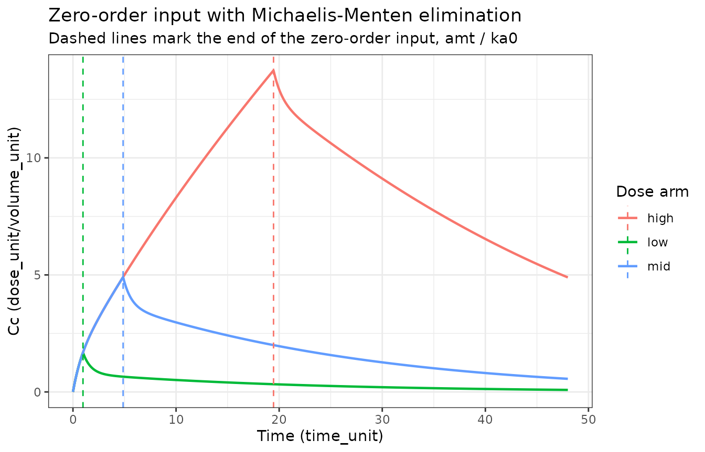

# Two-compartment zero-order-absorption Michaelis-Menten methodology template (Ibrahim 2019)

## Model and source

- Citation: Ibrahim MMA, Ueckert S, Freiberga S, Kjellsson MC, Karlsson
  MO. Model-Based Conditional Weighted Residuals Analysis for Structural
  Model Assessment. AAPS J. 2019 Feb 27;21(2):34.
  <doi:10.1208/s12248-019-0305-2>. PMCID PMC6394649. Structure and all
  six parameter values transcribed from Supplementary Material 1
  (12248_2019_305_MOESM1_ESM.docx), section ‘Simple PK example’, Table 1
  ‘Simulation specifications and dOFVBias’.
- Article: <https://doi.org/10.1208/s12248-019-0305-2>

Ibrahim 2019 is a **methodology** paper. Its own product is a
diagnostic: conditional weighted residuals (CWRES) from a fitted
nonlinear mixed-effects model are themselves modelled, first by a base
model that estimates the mean and variance of the CWRES distribution and
then by an extended model that estimates a separate mean for each of `N`
bins of an independent variable. The bin-specific means form a CWRES
bias vector, and inverting the FOCE covariance equation converts that
vector into a bias in conditional predictions. The method now ships in
PsN as part of the `qa` tool (from version 4.8.1).

That diagnostic is a regression on residuals, not a pharmacokinetic
model, and is not encoded in `nlmixr2lib`. Neither are the two
demonstration vehicles of the main text – the integrated glucose-insulin
(IGI) model of Silber 2007 and the integrated minimal model (IMM) of
Largajolli 2013 – because this paper reports no parameter values for
either; they are separate primary sources.

What **is** packaged here is the paper’s own generative simulation model
from Supplementary Material 1, section “Simple PK example”: a
two-compartment model with zero-order absorption and Michaelis-Menten
elimination, from which the authors simulated 100 subjects. Table 1 of
that supplement lists all six structural constants, which makes this a
fully-valued author-invented toy model of the same class as
`Beal_2001_iv1cmt_bql` and the `Schoning_2026_oral1cmt_*` family – and
it is filed alongside them under `inst/modeldb/pharmacokinetics/` for
the same reason: there is no drug.

``` r

mod <- readModelDb("Ibrahim_2019_oral2cmt_zeroorder_mm")()
mod
#>  ── rxode2-based free-form 2-cmt ODE model ────────────────────────────────────── 
#>  ── Initalization: ──  
#> Fixed Effects ($theta): 
#>      lvc      lvp       lq    lvmax      lkm      lr1    addSd 
#> 1.420696 1.945910 1.175573 2.220290 2.793616 2.330200 0.000000 
#> 
#> States ($state or $stateDf): 
#>   Compartment Number Compartment Name
#> 1                  1          central
#> 2                  2      peripheral1
#>  ── Model (Normalized Syntax): ── 
#> function() {
#>     compartmentData <- list(central = list(analyte = "hypothetical drug", 
#>         units = NA_character_, specimen = "not applicable", verified = FALSE), 
#>         peripheral1 = list(analyte = "hypothetical drug", units = NA_character_, 
#>             specimen = "not applicable", verified = FALSE))
#>     covariateData <- list()
#>     description <- "Methodology reference. Ground-truth (data-generating) two-compartment population PK model with ZERO-ORDER absorption and Michaelis-Menten elimination for a HYPOTHETICAL drug, taken from the 'Simple PK example' in the supplementary material of Ibrahim 2019, the paper that introduces model-based conditional weighted residuals (CWRES) analysis for structural model assessment. There is no real molecule and no real patients: the authors DEFINED these six structural parameters, simulated a data set of 100 subjects from them, and then fitted that data set with both the true model and a deliberately misspecified variant (first-order instead of zero-order absorption) so that their CWRES-bias diagnostic could be shown to recover a known prediction bias. Every value here is therefore an author-chosen simulation constant, not an estimate, and all are encoded with fixed(). The source reports no units, no dose, no inter-individual variability magnitudes and no residual-error magnitude; the model is consequently typical-value-only and its units are placeholders. See the vignette Errata for the full list of gaps and the one interpretive call (ka0 read as a zero-order input RATE, per its printed row label)."
#>     population <- list(species = "None (methodology paper; simulation-only toy model with no drug, no patients and no fitted estimates).", 
#>         n_subjects = 100L, n_studies = 1L, disease_state = "N/A (Monte Carlo simulation study demonstrating a model-diagnostic method; not a fit of any real molecule).", 
#>         dose_range = "Not reported. The supplement states only that a data set of 100 subjects was simulated; it gives no dose amount, no dosing route beyond 'zero order absorption', and no sampling schedule.", 
#>         regions = "N/A", scope_note = "Filed under inst/modeldb/pharmacokinetics/ (not specificDrugs/) because there is no drug: the model is an author-invented hypothetical used to demonstrate a diagnostic method. This mirrors the packaging of Beal_2001_iv1cmt_bql.R and the Schoning_2026_oral1cmt_* family. The paper's own product is a CWRES-bias regression (a residual post-processing diagnostic, now shipped in PsN's qa tool from version 4.8.1), which is not a pharmacokinetic model and is not encoded here. The two integrated glucose-insulin models the main text uses as demonstration vehicles (the IGI model of Silber 2007, doi:10.1177/0091270007304457, and the integrated minimal model of Largajolli 2013, PAGE 22 Abstract 2762) are cited backbones whose parameter values appear nowhere in this paper or its supplement; they are separate primary sources, not layers of this extraction.", 
#>         notes = "Supplementary Material 1, 'Simple PK example': 'In this example we used a two-compartment PK model with zero order absorption and Michaelis-Menten elimination to simulate a dataset of 100 subjects. The simulated data set was then used to fit two models: a true model (same as the simulation model) and a misspecified model that is the same as the simulation model except for using 1st order absorption process instead of the true zero order absorption process.' Table 1 of that supplement reports dOFVBias = -165.8 for the misspecified fit and lists the six 'Simulated parameters' encoded below, with the footnote 'Vc volume of central compartment, Vp volume of peripheral compartment, ka0 zero order absorption rate, Q intercompartmental clearance, KM and VMAX Michaelis-Menten elimination parameters.' The misspecified companion fit is NOT encoded as a sibling model file because the supplement publishes no parameter values for it; see the vignette Errata.")
#>     reference <- "Ibrahim MMA, Ueckert S, Freiberga S, Kjellsson MC, Karlsson MO. Model-Based Conditional Weighted Residuals Analysis for Structural Model Assessment. AAPS J. 2019 Feb 27;21(2):34. doi:10.1208/s12248-019-0305-2. PMCID PMC6394649. Structure and all six parameter values transcribed from Supplementary Material 1 (12248_2019_305_MOESM1_ESM.docx), section 'Simple PK example', Table 1 'Simulation specifications and dOFVBias'."
#>     units <- list(time = "time_unit", dosing = "dose_unit", concentration = "dose_unit/volume_unit")
#>     vignette <- "Ibrahim_2019_oral2cmt_zeroorder_mm"
#>     ini({
#>         lvc <- fix(1.42069578783722)
#>         label("Central volume of distribution Vc (volume_unit)")
#>         lvp <- fix(1.94591014905531)
#>         label("Peripheral volume of distribution Vp (volume_unit)")
#>         lq <- fix(1.17557332980424)
#>         label("Intercompartmental clearance Q (volume_unit/time_unit)")
#>         lvmax <- fix(2.22028985026722)
#>         label("Michaelis-Menten maximum elimination rate VMAX (dose_unit/time_unit)")
#>         lkm <- fix(2.79361608943186)
#>         label("Michaelis-Menten constant KM (dose_unit/volume_unit)")
#>         lr1 <- fix(2.33020026002702)
#>         label("Zero-order input rate ka0 into the central compartment (dose_unit/time_unit)")
#>         addSd <- fix(0, 0)
#>         label("Additive residual SD; magnitude not reported by the source")
#>     })
#>     model({
#>         vc <- exp(lvc)
#>         vp <- exp(lvp)
#>         q <- exp(lq)
#>         vmax <- exp(lvmax)
#>         km <- exp(lkm)
#>         r1 <- exp(lr1)
#>         Cc <- central/vc
#>         Cp <- peripheral1/vp
#>         rate(central) <- r1
#>         d/dt(central) <- -q * (Cc - Cp) - vmax * Cc/(km + Cc)
#>         d/dt(peripheral1) <- q * (Cc - Cp)
#>         Cc ~ add(addSd)
#>     })
#> }
```

## Population

There is no population. The supplement states only that a data set of
100 subjects was simulated from the model below; it names no molecule,
no subjects, no indication and no study. The full metadata list is
available programmatically:

``` r

str(readModelDb("Ibrahim_2019_oral2cmt_zeroorder_mm")()$meta$population)
#> List of 8
#>  $ species      : chr "None (methodology paper; simulation-only toy model with no drug, no patients and no fitted estimates)."
#>  $ n_subjects   : int 100
#>  $ n_studies    : int 1
#>  $ disease_state: chr "N/A (Monte Carlo simulation study demonstrating a model-diagnostic method; not a fit of any real molecule)."
#>  $ dose_range   : chr "Not reported. The supplement states only that a data set of 100 subjects was simulated; it gives no dose amount"| __truncated__
#>  $ regions      : chr "N/A"
#>  $ scope_note   : chr "Filed under inst/modeldb/pharmacokinetics/ (not specificDrugs/) because there is no drug: the model is an autho"| __truncated__
#>  $ notes        : chr "Supplementary Material 1, 'Simple PK example': 'In this example we used a two-compartment PK model with zero or"| __truncated__
```

## Source trace

Every value in `ini()` comes from one place: Supplementary Material 1
(`12248_2019_305_MOESM1_ESM.docx`), section “Simple PK example”, Table 1
“Simulation specifications and dOFVBias”, column “Simulated parameters”.
The table’s own footnote supplies the parameter glossary quoted below.

| Item | Source location |
|:---|:---|
| Two-compartment disposition | Suppl. 1, ‘Simple PK example’, sentence 1 |
| Zero-order absorption | Suppl. 1, ‘Simple PK example’, sentence 1 |
| Michaelis-Menten elimination | Suppl. 1, ‘Simple PK example’, sentence 1 |
| lvc | Suppl. 1, Table 1: Vc = 4.14 |
| lvp | Suppl. 1, Table 1: VP = 7 |
| lq | Suppl. 1, Table 1: Q = 3.24 (‘Q intercompartmental clearance’) |
| lr1 | Suppl. 1, Table 1: ka0 = 10.28 (‘ka0 zero order absorption rate’) |
| lkm | Suppl. 1, Table 1: KM = 16.34 |
| lvmax | Suppl. 1, Table 1: VMAX = 9.21 |
| addSd | NOT REPORTED anywhere in the paper or supplement; set to fixed(0) |
| IIV (all parameters) | NOT REPORTED anywhere in the paper or supplement; omitted |

## Simulation design

The supplement reports **no dose, no units and no sampling schedule**,
so none of those can be traced to the source. The design below is
therefore a demonstration of the encoded structure, not a replication of
the authors’ simulation: three single doses are given on a ladder chosen
to straddle `KM`, so that the Michaelis-Menten arm is exercised from the
near-linear regime into saturation. Because the model carries no IIV and
no residual error, every subject within an arm would be identical; one
profile per arm is simulated.

Under the encoding, `ka0` is an input **rate**, so the zero-order input
lasts `amt / ka0` time units and differs by arm.

``` r

r1 <- exp(mod$theta[["lr1"]])
km <- exp(mod$theta[["lkm"]])
vc <- exp(mod$theta[["lvc"]])

doses <- c(low = 10, mid = 50, high = 200)
t_inf <- doses / r1

events <-
  dplyr::bind_rows(lapply(seq_along(doses), function(i) {
    e <- rxode2::et(amt = doses[[i]], rate = -1, cmt = "central")
    e <- rxode2::et(e, seq(0, 48, by = 0.05))
    d <- as.data.frame(e)
    d$id <- i
    d$treatment <- names(doses)[i]
    d
  }))

knitr::kable(
  data.frame(
    treatment = names(doses),
    `Dose (dose_unit)` = as.numeric(doses),
    `Zero-order input duration = amt / ka0 (time_unit)` = round(as.numeric(t_inf), 3),
    check.names = FALSE
  )
)
```

| treatment | Dose (dose_unit) | Zero-order input duration = amt / ka0 (time_unit) |
|:---|---:|---:|
| low | 10 | 0.973 |
| mid | 50 | 4.864 |
| high | 200 | 19.455 |

``` r

sim <- rxode2::rxSolve(mod, events, returnType = "data.frame")
#> Warning: multi-subject simulation without without 'omega'
sim$treatment <- events$treatment[match(sim$id, events$id)]
```

``` r

ggplot2::ggplot(sim, ggplot2::aes(time, Cc, colour = treatment)) +
  ggplot2::geom_line(linewidth = 0.8) +
  ggplot2::geom_vline(
    data = data.frame(treatment = names(doses), t_inf = as.numeric(t_inf)),
    ggplot2::aes(xintercept = t_inf, colour = treatment),
    linetype = "dashed"
  ) +
  ggplot2::labs(
    x = "Time (time_unit)", y = "Cc (dose_unit/volume_unit)",
    colour = "Dose arm",
    title = "Zero-order input with Michaelis-Menten elimination",
    subtitle = "Dashed lines mark the end of the zero-order input, amt / ka0"
  ) +
  ggplot2::theme_bw()
```



## Structural validation

The paper reports no NCA table, no VPC of this toy model and no figure
with digitisable values, so there is nothing to replicate numerically.
What can be checked is that the encoded structure *is* the structure the
supplement describes. Four closed-form gates do that, and each is paired
with a control that proves the gate is not vacuous.

### Gate 1 – the ODEs are solved, not silently replaced

`rxode2` replaces an explicit `d/dt` system with an analytic linear
solution when it recognises a `cl` / `vc` pair. This model deliberately
has no `cl`, so the Michaelis-Menten arm cannot be discarded. Assert it.

``` r

stopifnot(is.null(mod$linCmt))
stopifnot(identical(mod$state, c("central", "peripheral1")))
```

### Gate 2 – exact mass balance, including the zero-order input rate

Appending an accumulator state for eliminated amount closes the system:
at any time, `central + peripheral1 + eliminated` must equal the amount
delivered so far, which for a zero-order input of rate `ka0` is
`min(t * ka0, amt)`. This gate validates the elimination expression
*and* the reading of `ka0` as a rate in a single identity, and it holds
to solver tolerance rather than to a hand-chosen percentage.

``` r

mod_mb <- rxode2::model(
  mod,
  d / dt(eliminated) <- vmax * Cc / (km + Cc),
  append = TRUE
)

sim_mb <- rxode2::rxSolve(mod_mb, events, returnType = "data.frame")
#> Warning: multi-subject simulation without without 'omega'
sim_mb$dose <- as.numeric(doses)[sim_mb$id]

mb_err <- with(
  sim_mb,
  abs((central + peripheral1 + eliminated) - pmin(time * r1, dose))
)
max_mb_err <- max(mb_err)
max_mb_err
#> [1] 1.392664e-12

stopifnot(max_mb_err < 1e-8)
```

Control: the same identity computed against a deliberately-wrong input
rate must fail by a wide margin. If it did not, the gate would be
measuring nothing.

``` r

mb_err_mutated <- with(
  sim_mb,
  abs((central + peripheral1 + eliminated) - pmin(time * r1 * 0.9, dose))
)
max(mb_err_mutated)
#> [1] 19.9946

stopifnot(max(mb_err_mutated) > 1)
```

### Gate 3 – Tmax falls at the end of the zero-order input

While a zero-order input is running, the central compartment gains mass
at the constant rate `ka0`; these parameter values keep that rate above
the combined distribution and elimination losses throughout, so the peak
sits exactly at the end of infusion. This is the signature that
distinguishes a zero-order input from the bolus that a missing
`rate = -1` flag would silently produce.

``` r

tmax_obs <- vapply(
  seq_along(doses),
  function(i) {
    si <- sim[sim$id == i, ]
    si$time[which.max(si$Cc)]
  },
  numeric(1)
)

data.frame(
  treatment = names(doses),
  tmax_observed = tmax_obs,
  t_inf_expected = as.numeric(t_inf)
)
#>   treatment tmax_observed t_inf_expected
#> 1       low          0.95      0.9727626
#> 2       mid          4.85      4.8638132
#> 3      high         19.45     19.4552529

# Agreement to within one step of the 0.05 observation grid.
stopifnot(all(abs(tmax_obs - as.numeric(t_inf)) <= 0.05))
```

Control: dosing the same amounts as a bolus (no `rate` flag, so
`rate(central)` is never consulted) must put every Tmax at time 0.

``` r

events_bolus <- events
events_bolus$rate[events_bolus$evid == 1] <- 0
sim_bolus <- rxode2::rxSolve(mod, events_bolus, returnType = "data.frame")
#> Warning: multi-subject simulation without without 'omega'

tmax_bolus <- vapply(
  seq_along(doses),
  function(i) {
    si <- sim_bolus[sim_bolus$id == i, ]
    si$time[which.max(si$Cc)]
  },
  numeric(1)
)
tmax_bolus
#> [1] 0 0 0

stopifnot(all(tmax_bolus == 0))
```

### Gate 4 – elimination saturates

With Michaelis-Menten elimination and no linear clearance term, exposure
must rise faster than proportionally with dose: dose-normalised AUC is
strictly increasing. A linear model would hold it constant, so this gate
discriminates the encoded elimination from the linear alternative.

``` r

auc_trap <- function(time, conc) {
  sum(diff(time) * (head(conc, -1) + tail(conc, -1)) / 2)
}

dn_auc <- vapply(
  seq_along(doses),
  function(i) {
    si <- sim[sim$id == i, ]
    auc_trap(si$time, si$Cc) / doses[[i]]
  },
  numeric(1)
)

data.frame(treatment = names(doses), dose = as.numeric(doses), dn_auc = dn_auc)
#>   treatment dose   dn_auc
#> 1       low   10 1.642044
#> 2       mid   50 1.759391
#> 3      high  200 1.953727

stopifnot(all(diff(dn_auc) > 0))

# The peak concentration of the top arm must reach the saturable regime,
# otherwise the Michaelis-Menten arm is never exercised at all.
stopifnot(max(sim$Cc[sim$id == 3]) > km / 2)
```

## PKNCA validation

`PKNCA` provides the independent NCA arm. It is run here as a
cross-check of the simulated profiles rather than as a comparison
against published values, because the source reports no NCA (see
Errata).

``` r

sim_nca <-
  sim |>
  dplyr::filter(!is.na(Cc)) |>
  dplyr::select(id, time, Cc, treatment)

# Time-zero anchor: pre-dose concentration is 0 for a zero-order input.
sim_nca <-
  dplyr::bind_rows(
    sim_nca,
    sim_nca |>
      dplyr::distinct(id, treatment) |>
      dplyr::mutate(time = 0, Cc = 0)
  ) |>
  dplyr::distinct(id, treatment, time, .keep_all = TRUE) |>
  dplyr::arrange(id, time)

dose_df <-
  events |>
  dplyr::filter(evid == 1) |>
  dplyr::mutate(time = 0) |>
  dplyr::select(id, time, amt, treatment)

conc_obj <- PKNCA::PKNCAconc(
  sim_nca, Cc ~ time | treatment + id,
  concu = "dose_unit/volume_unit", timeu = "time_unit"
)
dose_obj <- PKNCA::PKNCAdose(
  dose_df, amt ~ time | treatment + id,
  doseu = "dose_unit"
)

intervals <- data.frame(
  start = 0, end = 48,
  cmax = TRUE, tmax = TRUE, auclast = TRUE, clast.obs = TRUE
)

res <- PKNCA::pk.nca(PKNCA::PKNCAdata(conc_obj, dose_obj, intervals = intervals))
nca_wide <-
  as.data.frame(res) |>
  dplyr::select(treatment, PPTESTCD, PPORRES) |>
  tidyr::pivot_wider(names_from = PPTESTCD, values_from = PPORRES)

nca_wide |>
  dplyr::rename(
    "Dose arm" = treatment,
    "Cmax (dose_unit/volume_unit)" = cmax,
    "Tmax (time_unit)" = tmax,
    "AUC0-48 (dose_unit*time_unit/volume_unit)" = auclast,
    "Clast (dose_unit/volume_unit)" = clast.obs
  ) |>
  knitr::kable(digits = 3)
```

| Dose arm | AUC0-48 (dose_unit\*time_unit/volume_unit) | Cmax (dose_unit/volume_unit) | Tmax (time_unit) | Clast (dose_unit/volume_unit) |
|:---|---:|---:|---:|---:|
| high | 390.745 | 13.737 | 19.45 | 4.894 |
| low | 16.420 | 1.657 | 0.95 | 0.087 |
| mid | 87.969 | 4.899 | 4.85 | 0.561 |

`PKNCA` must agree with the structural gates computed above: its `tmax`
is the end of the zero-order input, and its dose-normalised `auclast` is
strictly increasing across the ladder.

``` r

nca_ord <- nca_wide[match(names(doses), nca_wide$treatment), ]

stopifnot(all(abs(nca_ord$tmax - as.numeric(t_inf)) <= 0.05))
stopifnot(all(diff(nca_ord$auclast / as.numeric(doses)) > 0))
```

## Comparison against published NCA

None is possible. Ibrahim 2019 reports `dOFVBias`, the CWRES bias vector
`b`, `%delta` and `% known bias` for its diagnostic; it reports no Cmax,
Tmax, AUC or half-life for the simple PK example, and no concentration
figure with digitisable axes. The structural gates above stand in place
of a published-NCA comparison.

## Assumptions and deviations

**Errata and gaps in the source.**

1.  **No units anywhere.** Table 1 of the supplement gives six bare
    numbers. The model’s `units` metadata therefore uses the placeholder
    tokens `time_unit` / `dose_unit` / `volume_unit` so that an assumed
    unit can never be mistaken for a published one.

2.  **No dose and no sampling schedule.** The dose ladder (10 / 50
    / 200) and the 0-48 observation grid in this vignette are
    demonstration choices made here, selected so the peak of the top arm
    exceeds `KM / 2` and the Michaelis-Menten arm is genuinely
    exercised. They are not the authors’ design, which is unreported.

3.  **No inter-individual variability.** The supplement states that 100
    subjects were simulated, which implies random effects, but reports
    no omega for any parameter. Per policy, variances are never
    invented: the model is typical-value-only and carries no `eta`
    terms. A user who wants a cohort must supply their own omegas.

4.  **No residual error.** No sigma is reported either; `addSd` is
    `fixed(0)`.

5.  **`ka0` is read as an input RATE, not a duration.** This is the one
    interpretive call in the extraction. The supplement’s own footnote
    reads “ka0 zero order absorption rate”, and the library’s canonical
    encoding for a zero-order input rate is `lr1` / `r1` applied through
    `rate(<cmt>)` (as in `Brekkan_2018_pegfilgrastim`,
    `Lin_2023_asparaginaseErwiniaRecombinant`, `Sager_2023_sotrovimab`
    and `Wang_2022_aripiprazole`). The alternative reading – `ka0` as a
    zero-order *duration*, the canonical `ld1` / `d1` applied through
    `dur(<cmt>)` – cannot be excluded from the source text alone,
    because no dose is given against which a duration could be checked.
    The printed row label is the only evidence, and it says “rate”.

6.  **The misspecified companion model is not packaged.** The supplement
    describes it exactly (“the same as the simulation model except for
    using 1st order absorption process instead of the true zero order
    absorption process”) and reports its `dOFVBias` of -165.8, but
    publishes **no parameter estimates** for it. Its `ini()` would be
    empty, so it is not a model in the sense this library packages.

    The deposited files in Supplementary Material 2 (`miss.ext`,
    `miss_linbase.dta`, `extra_table`, `Bias_calculations.r`) do **not**
    close that gap, and were checked rather than assumed. They belong to
    a *different* worked example of the R implementation: the data set
    carries 26 subjects, not 100, its population predictions are
    reproduced essentially exactly by a first-order-absorption structure
    with `Vc` near 2.2 and `KM` near 49 (sum of squares 1.3e-3 over 136
    points) and not at all by the constants in Table 1, and no
    permutation of the six `THETA` values in `miss.ext` reproduces those
    predictions (best-permutation sum of squares 1.7e2). `miss.ext` is
    the linearised model’s parameter file, so its `THETA` indices are
    not the PK parameters and cannot be mapped onto them.

7.  **The IGI and IMM models of the main text are not packaged.**
    Ibrahim 2019 uses them as demonstration vehicles and reports only
    `dOFVBias` (Table I) and CWRES bias estimates (Table II) for them –
    no structural parameter values at all. They are separate primary
    sources: Silber 2007 (<https://doi.org/10.1177/0091270007304457>)
    for the IGI model and Largajolli 2013 (PAGE 22, Abstract 2762) for
    the integrated minimal model.

**No deviations from library convention.** All parameter names (`lvc`,
`lvp`, `lq`, `lvmax`, `lkm`, `lr1`, `addSd`) and compartment names
(`central`, `peripheral1`) are canonical;
[`checkModelConventions()`](https://nlmixr2.github.io/nlmixr2lib/reference/checkModelConventions.md)
is clean.
