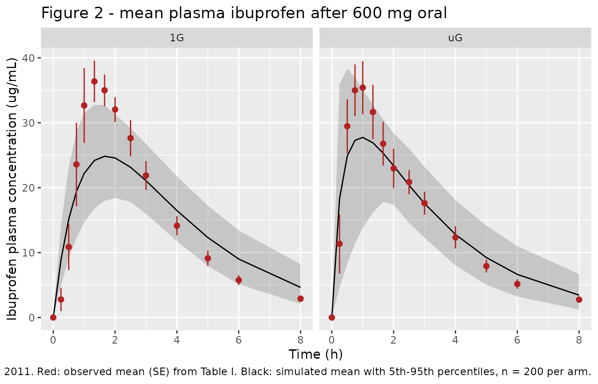

# Ibuprofen under simulated microgravity (Idkaidek 2011)

## Model and source

This paper contributes two model files, one per body position of a
two-period sequential crossover in the same six volunteers.

``` r

ui_1g <- rxode2::rxode(readModelDb("Idkaidek_2011_ibuprofen_normalGravity"))
#> ℹ parameter labels from comments will be replaced by 'label()'
ui_ug <- rxode2::rxode(readModelDb("Idkaidek_2011_ibuprofen_microgravity"))
#> ℹ parameter labels from comments will be replaced by 'label()'
```

- Citation: Idkaidek N, Arafat T. Effect of microgravity on the
  pharmacokinetics of ibuprofen in humans. J Clin Pharmacol.
  2011;51(12):1685-1689. <doi:10.1177/0091270010388652>
- Article: <https://doi.org/10.1177/0091270010388652>
- Normal gravity (1G): One-compartment oral PK model with first-order
  absorption and linear elimination for a single 600 mg oral dose of
  ibuprofen in six healthy adult men studied in the NORMAL-GRAVITY (1G,
  ambulatory) arm of the Idkaidek 2011 simulated-microgravity crossover.
  Absorption rate constant from the paper’s one-compartment fit (Ka 0.79
  1/h); elimination rate constant from the paper’s noncompartmental
  analysis (Kel 0.39 1/h); apparent clearance and volume derived from
  the published AUC0-inf and Kel. Its companion model,
  Idkaidek_2011_ibuprofen_microgravity, holds the same six subjects
  under the antiorthostatic bed-rest (simulated microgravity) position,
  where absorption is roughly three times faster while exposure is
  unchanged.
- Simulated microgravity (uG): One-compartment oral PK model with
  first-order absorption and linear elimination for a single 600 mg oral
  dose of ibuprofen in six healthy adult men studied in the
  SIMULATED-MICROGRAVITY arm (1-day antiorthostatic bed-rest position)
  of the Idkaidek 2011 crossover. Absorption is about three times faster
  than at normal gravity (Ka 2.24 vs 0.79 1/h, with inter-subject CV
  rising to 96%) and tmax is shorter, while exposure, elimination and
  bioavailability are unchanged - the paper’s basis for concluding that
  no dose adjustment is needed in flight. Absorption rate constant from
  the paper’s one-compartment fit; elimination rate constant from its
  noncompartmental analysis; apparent clearance and volume derived from
  the published AUC0-inf and Kel. Companion model at normal gravity:
  Idkaidek_2011_ibuprofen_normalGravity.

No supplement, erratum or corrigendum was located for this article.

## Population

Six healthy adult men aged 18-45 years with a body mass index of
18.5-24.9 kg/m^2 received a single 600 mg oral ibuprofen tablet with 240
mL of water after a 10-hour overnight fast (Idkaidek 2011, “Human
Participants” and “Study Design”). Each man was studied twice in a
sequential design with a 7-day washout: once during a 1-day
simulated-microgravity antiorthostatic bed-rest (ABR, head-down-tilt)
position and once in the normal (1G) position. All participants passed
an ABR tolerability test before enrolment. The sample size of six was
justified from a previous ibuprofen inter-subject PK variability of 25%,
giving 80% power at 95% confidence.

Plasma was sampled at 0, 0.25, 0.5, 0.75, 1, 1.33, 1.66, 2, 2.5, 3, 4,
5, 6 and 8 h post-dose and assayed by a validated HPLC method with a
linear range of 0.5-30 ug/mL. Saliva was collected at the same times,
but ibuprofen was not detected in any saliva sample, so the paper
reports no salivary PK and no salivary model exists here.

The same information is available programmatically from either model’s
`population` metadata:

``` r

str(ui_1g$population)
#> List of 9
#>  $ species       : chr "human"
#>  $ n_subjects    : num 6
#>  $ n_studies     : num 1
#>  $ age_range     : chr "18-45 years"
#>  $ sex_female_pct: num 0
#>  $ disease_state : chr "Healthy adult male volunteers (Idkaidek 2011 'Human Participants'): body mass index 18.5-24.9 kg/m2, no clinica"| __truncated__
#>  $ dose_range    : chr "Single 600 mg oral ibuprofen tablet with 240 mL water after a 10-hour overnight fast."
#>  $ regions       : chr "Jordan (Jordan Center for Pharmaceutical Research, Al-Mowasah Hospital, Amman)."
#>  $ notes         : chr "Body position for this model file is the NORMAL-GRAVITY (1G) leg of a two-period sequential crossover with a 7-"| __truncated__
```

## The published individual data

Unusually for a popPK extraction, this paper prints every individual
concentration. Table I gives all 6 subjects x 2 positions x 14 time
points, so the model can be validated against the actual observations
rather than against a summary table alone.

``` r

obs_times <- c(0, 0.25, 0.5, 0.75, 1, 1.33, 1.66, 2, 2.5, 3, 4, 5, 6, 8)

# Idkaidek 2011 Table I, transcribed verbatim (ug/mL).
tab1 <- list(
  `1G` = list(
    c(0, 0.43,  4.22,  8.16, 13.73, 36.06, 39.24, 35.07, 27.77, 26.12, 14.97,  9.50, 5.20, 2.58),
    c(0, 0.00,  0.84,  3.39, 23.64, 29.29, 32.18, 36.45, 39.10, 29.73, 19.38, 13.41, 8.44, 4.52),
    c(0, 0.91, 10.92, 21.15, 33.90, 36.55, 29.61, 24.71, 18.25, 14.28,  8.87,  5.22, 3.20, 1.40),
    c(0, 1.57, 10.44, 41.73, 48.65, 45.01, 42.80, 34.75, 26.80, 20.70, 15.01, 10.46, 6.73, 3.30),
    c(0, 2.14, 12.62, 38.95, 49.10, 45.14, 38.31, 33.41, 29.25, 21.86, 15.10,  9.30, 6.61, 3.72),
    c(0, 11.62, 26.13, 28.09, 26.96, 26.13, 27.85, 27.84, 24.61, 18.60, 11.49, 6.81, 4.36, 1.89)
  ),
  `uG` = list(
    c(0, 16.10, 45.83, 48.32, 43.52, 31.48, 25.14, 21.40, 15.95, 13.11,  8.55, 5.67, 3.62, 1.71),
    c(0, 30.77, 38.15, 34.15, 32.66, 28.48, 26.68, 25.22, 22.48, 18.48, 13.32, 9.36, 6.13, 3.58),
    c(0,  0.00, 25.26, 35.63, 32.93, 29.91, 24.84, 18.73, 14.71, 12.94,  7.28, 4.54, 2.61, 1.06),
    c(0,  1.74, 23.34, 39.44, 43.15, 42.32, 38.06, 31.39, 25.80, 20.68, 14.85, 9.54, 6.90, 3.57),
    c(0, 10.67, 24.22, 34.18, 42.43, 42.70, 32.34, 29.67, 21.46, 16.45, 11.46, 7.51, 4.78, 2.91),
    c(0,  8.82, 19.98, 18.29, 17.78, 15.04, 13.55, 11.38, 24.77, 23.97, 18.58, 10.90, 6.94, 3.68)
  )
)

# The loop variable is deliberately NOT called `arm`: inside tibble() the columns
# are evaluated in a data mask, so a later argument referring to `arm` would pick
# up the freshly created `arm` COLUMN (length 14 after recycling against `time`)
# rather than the loop variable, and `tab1[[<length-14 vector>]]` errors.
observed <-
  bind_rows(lapply(names(tab1), function(position) {
    bind_rows(lapply(seq_along(tab1[[position]]), function(i) {
      conc_i <- tab1[[position]][[i]]
      tibble(arm = position, subject = i, time = obs_times, conc = conc_i)
    }))
  }))

stopifnot(nrow(observed) == 2L * 6L * 14L)
```

## Reproducing the paper’s own analysis

Before simulating anything, the paper’s own Table II is regenerated from
Table I. This is pure arithmetic on published numbers, so the checks
below are exact and are the strongest gate in this vignette: they pin
down which noncompartmental conventions the authors used, and they
expose one transcription error in the printed table.

``` r

dose_mg <- 600

# Linear trapezoid AUC to the last sample (8 h).
auc_last <- function(cc, tt = obs_times) sum(diff(tt) * (head(cc, -1) + tail(cc, -1)) / 2)

# Terminal slope. The window is identified below, not assumed.
lambda_z <- function(cc, idx, tt = obs_times) {
  -unname(stats::coef(stats::lm(log(cc[idx]) ~ tt[idx]))[2])
}

cv_pct <- function(x) 100 * stats::sd(x) / mean(x)

nca_by_window <- function(idx) {
  observed |>
    group_by(arm, subject) |>
    summarise(
      auclast = auc_last(conc),
      clast   = conc[which.max(time)],
      kel     = lambda_z(conc, idx),
      cmax    = max(conc),
      tmax    = time[which.max(conc)],
      .groups = "drop"
    ) |>
    mutate(aucinf = auclast + clast / kel, half_life = log(2) / kel) |>
    group_by(arm) |>
    summarise(across(c(auclast, aucinf, cmax, tmax, kel, half_life),
                     list(mean = mean, cv = cv_pct)), .groups = "drop")
}
```

The paper says only that `Kel` came from noncompartmental analysis in
Kinetica 2000; it does not state the terminal window. Scanning the
candidate windows shows that only the last three samples (5, 6 and 8 h)
reproduce both published `Kel` values *and* both published `t1/2` CV%s:

``` r

window_scan <-
  bind_rows(lapply(
    list(`2-8 h` = 8:14, `3-8 h` = 10:14, `4-8 h` = 11:14, `5-8 h` = 12:14),
    function(idx) nca_by_window(idx) |> select(arm, kel_mean, kel_cv, half_life_mean, half_life_cv)
  ), .id = "window")

window_scan |>
  mutate(across(where(is.numeric), \(x) round(x, 3))) |>
  rename("Terminal window" = window, "Position" = arm,
         "Kel (1/h)" = kel_mean, "Kel CV%" = kel_cv,
         "t1/2 (h)" = half_life_mean, "t1/2 CV%" = half_life_cv) |>
  knitr::kable(caption = "Terminal-window scan. Published: 1G Kel 0.39 (13), t1/2 1.82 (15); uG Kel 0.36 (18), t1/2 1.96 (16).")
```

| Terminal window | Position | Kel (1/h) | Kel CV% | t1/2 (h) | t1/2 CV% |
|:----------------|:---------|----------:|--------:|---------:|---------:|
| 2-8 h           | 1G       |     0.423 |  11.194 |    1.658 |   11.105 |
| 2-8 h           | uG       |     0.379 |  18.915 |    1.888 |   19.578 |
| 3-8 h           | 1G       |     0.417 |  12.510 |    1.684 |   12.591 |
| 3-8 h           | uG       |     0.390 |  15.320 |    1.807 |   13.621 |
| 4-8 h           | 1G       |     0.407 |  12.070 |    1.727 |   12.364 |
| 4-8 h           | uG       |     0.385 |  14.952 |    1.833 |   13.711 |
| 5-8 h           | 1G       |     0.387 |  13.281 |    1.820 |   14.689 |
| 5-8 h           | uG       |     0.363 |  18.172 |    1.956 |   16.010 |

Terminal-window scan. Published: 1G Kel 0.39 (13), t1/2 1.82 (15); uG
Kel 0.36 (18), t1/2 1.96 (16). {.table}

Fixing the window at 5-8 h, every cell of Table II follows:

``` r

recon <- nca_by_window(12:14)

published <- tribble(
  ~arm,  ~auclast, ~auclast_cv, ~aucinf, ~aucinf_cv, ~cmax, ~cmax_cv, ~tmax, ~tmax_cv, ~kel, ~kel_cv, ~half_life, ~half_life_cv,
  "1G",     20.97,          17,  128.88,         18, 40.12,       20,  1.37,       46, 0.39,      13,       1.82,            15,
  "uG",    112.66,          16,  120.77,         17, 38.79,       21,  1.14,       64, 0.36,      18,       1.96,            16
)

# Put the printed table on the same column names as `recon` BEFORE stacking.
# Binding the two frames while `recon` carries `auclast_mean` and `published`
# carries `auclast` would leave both columns side by side, and a later
# matches("^auclast_mean$|^auclast$") would then select two columns at once.
published_mean <-
  published |>
  select(arm, auclast_mean = auclast, aucinf_mean = aucinf, cmax_mean = cmax,
         tmax_mean = tmax, kel_mean = kel, half_life_mean = half_life)

cmp_tab2 <-
  bind_rows(
    recon |>
      select(arm, auclast_mean, aucinf_mean, cmax_mean, tmax_mean,
             kel_mean, half_life_mean) |>
      mutate(source = "Reconstructed from Table I"),
    published_mean |> mutate(source = "Table II as printed")
  ) |>
  relocate(source) |>
  mutate(across(where(is.numeric), \(x) round(x, 2))) |>
  arrange(arm, source)

cmp_tab2 |>
  rename("Source" = source, "Position" = arm, "AUC0-t" = auclast_mean,
         "AUC0-inf" = aucinf_mean, "Cmax" = cmax_mean, "Tmax" = tmax_mean,
         "Kel" = kel_mean, "t1/2" = half_life_mean) |>
  knitr::kable(caption = "Table II of Idkaidek 2011 regenerated from the individual data in Table I.")
```

| Source                     | Position | AUC0-t | AUC0-inf |  Cmax | Tmax |  Kel | t1/2 |
|:---------------------------|:---------|-------:|---------:|------:|-----:|-----:|-----:|
| Reconstructed from Table I | 1G       | 120.97 |   128.88 | 40.12 | 1.37 | 0.39 | 1.82 |
| Table II as printed        | 1G       |  20.97 |   128.88 | 40.12 | 1.37 | 0.39 | 1.82 |
| Reconstructed from Table I | uG       | 112.67 |   120.79 | 38.79 | 1.14 | 0.36 | 1.96 |
| Table II as printed        | uG       | 112.66 |   120.77 | 38.79 | 1.14 | 0.36 | 1.96 |

Table II of Idkaidek 2011 regenerated from the individual data in Table
I. {.table}

``` r

get1 <- function(df, a, col) df[[col]][df$arm == a]

# Cmax, Tmax, AUC0-inf, Kel and t1/2 all reproduce to the printed precision.
stopifnot(
  abs(get1(recon, "1G", "cmax_mean")      - 40.12)  < 0.01,
  abs(get1(recon, "uG", "cmax_mean")      - 38.79)  < 0.01,
  abs(get1(recon, "1G", "tmax_mean")      -  1.37)  < 0.01,
  abs(get1(recon, "uG", "tmax_mean")      -  1.14)  < 0.01,
  abs(get1(recon, "1G", "aucinf_mean")    - 128.88) < 0.05,
  abs(get1(recon, "uG", "aucinf_mean")    - 120.77) < 0.05,
  abs(get1(recon, "1G", "kel_mean")       -  0.39)  < 0.005,
  abs(get1(recon, "uG", "kel_mean")       -  0.36)  < 0.005,
  abs(get1(recon, "1G", "half_life_mean") -  1.82)  < 0.01,
  abs(get1(recon, "uG", "half_life_mean") -  1.96)  < 0.01,
  # ... and every published CV% is recovered too.
  abs(get1(recon, "1G", "cmax_cv")      - 20) < 0.5,
  abs(get1(recon, "uG", "cmax_cv")      - 21) < 0.5,
  abs(get1(recon, "1G", "aucinf_cv")    - 18) < 0.5,
  abs(get1(recon, "uG", "aucinf_cv")    - 17) < 0.5,
  abs(get1(recon, "1G", "half_life_cv") - 15) < 0.5,
  abs(get1(recon, "uG", "half_life_cv") - 16) < 0.5
)
```

### Erratum: the printed 1G AUC0-t

Every cell above matches the printed table except one. Table II gives
the 1G `AUC0-t` as **20.97 (17)**, which is impossible: the same row
reports a 1G `AUC0-inf` of 128.88 and a Cmax of 40.12 ug/mL, and AUC0-t
cannot be one sixth of AUC0-inf when the last sample is still at 2.58
ug/mL. The linear trapezoid over Table I gives **120.97**, with CV% 17 –
the printed CV% is already correct. The published value has simply lost
its leading “1”.

``` r

auclast_1g <- get1(recon, "1G", "auclast_mean")
stopifnot(
  # uG AUC0-t is printed correctly and reproduces exactly.
  abs(get1(recon, "uG", "auclast_mean") - 112.66) < 0.05,
  # 1G AUC0-t is 120.97, not the printed 20.97, and its CV% matches as printed.
  abs(auclast_1g - 120.97) < 0.05,
  abs(get1(recon, "1G", "auclast_cv") - 17) < 0.5,
  # Sanity: AUC0-t must lie below AUC0-inf and above the trapezoid to Cmax.
  auclast_1g < get1(recon, "1G", "aucinf_mean")
)
```

### The derived IIV block on CL/F and V/F

`CL/F` and `V/F` are not published, so neither is their inter-subject
variability. The block in both model files was computed from the
individual profiles in Table I, using the same conventions that
reproduce Table II above. Recomputing it here and asserting it against
the packaged `omega` makes that derivation executable rather than a
claim in a comment – it is what fails first if either model file’s block
is ever edited or mistranscribed.

``` r

per_subject_pk <-
  observed |>
  group_by(arm, subject) |>
  summarise(
    auclast = auc_last(conc),
    clast   = conc[which.max(time)],
    kel     = lambda_z(conc, 12:14),
    .groups = "drop"
  ) |>
  mutate(aucinf = auclast + clast / kel,
         cl     = dose_mg / aucinf,
         vc     = cl / kel)

# Log-scale variance-covariance of CL/F and V/F across the six subjects.
iiv_block <- function(a) {
  d <- per_subject_pk[per_subject_pk$arm == a, ]
  stats::cov(cbind(log(d$cl), log(d$vc)))
}

gcv <- function(v) 100 * sqrt(exp(v) - 1)

tibble(
  Position = c("1G", "uG"),
  `var(log CL/F)` = c(iiv_block("1G")[1, 1], iiv_block("uG")[1, 1]),
  `covariance` = c(iiv_block("1G")[1, 2], iiv_block("uG")[1, 2]),
  `var(log V/F)` = c(iiv_block("1G")[2, 2], iiv_block("uG")[2, 2]),
  `Correlation` = c(iiv_block("1G")[1, 2] / sqrt(iiv_block("1G")[1, 1] * iiv_block("1G")[2, 2]),
                    iiv_block("uG")[1, 2] / sqrt(iiv_block("uG")[1, 1] * iiv_block("uG")[2, 2])),
  `Implied CL/F CV%` = c(gcv(iiv_block("1G")[1, 1]), gcv(iiv_block("uG")[1, 1])),
  `Published AUC0-inf CV%` = c(18, 17),
  `Implied Kel CV%` = c(gcv(sum(iiv_block("1G") * c(1, -1, -1, 1))),
                        gcv(sum(iiv_block("uG") * c(1, -1, -1, 1)))),
  `Published Kel CV%` = c(13, 18)
) |>
  mutate(across(where(is.numeric), \(x) round(x, 4))) |>
  knitr::kable(caption = paste("IIV block derived from Table I. CL/F CV% is the counterpart of the",
                               "published AUC0-inf CV% (CL/F = Dose / AUC0-inf); Kel CV% follows from",
                               "var(log CL/F) - 2 cov + var(log V/F)."))
```

| Position | var(log CL/F) | covariance | var(log V/F) | Correlation | Implied CL/F CV% | Published AUC0-inf CV% | Implied Kel CV% | Published Kel CV% |
|:---|---:|---:|---:|---:|---:|---:|---:|---:|
| 1G | 0.0375 | 0.0155 | 0.0131 | 0.6998 | 19.5517 | 18 | 14.0624 | 13 |
| uG | 0.0341 | 0.0047 | 0.0046 | 0.3766 | 18.6193 | 17 | 17.2285 | 18 |

IIV block derived from Table I. CL/F CV% is the counterpart of the
published AUC0-inf CV% (CL/F = Dose / AUC0-inf); Kel CV% follows from
var(log CL/F) - 2 cov + var(log V/F). {.table style="width:100%;"}

``` r

omega_block <- function(ui) ui$omega[c("etalcl", "etalvc"), c("etalcl", "etalvc")]

stopifnot(
  # The packaged block IS this derivation, to full printed precision.
  max(abs(iiv_block("1G") - omega_block(ui_1g))) < 1e-6,
  max(abs(iiv_block("uG") - omega_block(ui_ug))) < 1e-6,
  # IIV on Ka instead comes straight from the published CV%: omega^2 = log(CV^2 + 1).
  abs(ui_1g$omega[["etalka", "etalka"]] - log(0.35^2 + 1)) < 1e-6,
  abs(ui_ug$omega[["etalka", "etalka"]] - log(0.96^2 + 1)) < 1e-6,
  # The derived marginals stay close to the two CV%s Table II does publish.
  abs(gcv(iiv_block("1G")[1, 1]) - 18) < 3,
  abs(gcv(iiv_block("uG")[1, 1]) - 17) < 3,
  abs(gcv(sum(iiv_block("1G") * c(1, -1, -1, 1))) - 13) < 3,
  abs(gcv(sum(iiv_block("uG") * c(1, -1, -1, 1))) - 18) < 3
)
```

### Where the published Ka comes from

`Ka` is the one parameter the paper obtained by fitting rather than by
NCA (“the absorption rate constant (Ka) was calculated by data fitting
using a 1-compartment model”). Refitting Table I with an unweighted
three-parameter one-compartment oral model recovers both published means
and both published CV%s:

``` r

cfun <- function(ka, kel, vc, tt) dose_mg / vc * ka / (ka - kel) * (exp(-kel * tt) - exp(-ka * tt))

fit_1cmt <- function(cc) {
  obj <- function(p) sum((cc - cfun(exp(p[1]), exp(p[2]), exp(p[3]), obs_times))^2)
  p <- stats::optim(log(c(1, 0.4, 12)), obj, control = list(maxit = 5000, reltol = 1e-12))$par
  p <- stats::optim(p, obj, control = list(maxit = 5000, reltol = 1e-14))$par
  stats::setNames(exp(p), c("ka", "kel", "vc"))
}

refit <-
  observed |>
  group_by(arm, subject) |>
  # tibble::as_tibble_row() is namespaced: dplyr re-exports tibble(), tribble()
  # and as_tibble(), but NOT as_tibble_row().
  summarise(tibble::as_tibble_row(fit_1cmt(conc)), .groups = "drop") |>
  group_by(arm) |>
  summarise(ka_mean = mean(ka), ka_cv = cv_pct(ka),
            kel_mean = mean(kel), vc_mean = mean(vc), .groups = "drop")

refit |>
  mutate(across(where(is.numeric), \(x) round(x, 2))) |>
  rename("Position" = arm, "Ka (1/h)" = ka_mean, "Ka CV%" = ka_cv,
         "Kel of the same fit (1/h)" = kel_mean, "V/F of the same fit (L)" = vc_mean) |>
  knitr::kable(caption = "Unweighted one-compartment refit of Table I. Published Ka: 1G 0.79 (35), uG 2.24 (96).")
```

| Position | Ka (1/h) | Ka CV% | Kel of the same fit (1/h) | V/F of the same fit (L) |
|:---------|---------:|-------:|--------------------------:|------------------------:|
| 1G       |     0.75 |  38.04 |                      0.62 |                    7.69 |
| uG       |     2.20 |  89.58 |                      0.64 |                   11.28 |

Unweighted one-compartment refit of Table I. Published Ka: 1G 0.79 (35),
uG 2.24 (96). {.table}

``` r

stopifnot(
  # The refit lands on the published Ka means and CV%s.
  abs(get1(refit, "1G", "ka_mean") - 0.79) < 0.10,
  abs(get1(refit, "uG", "ka_mean") - 2.24) < 0.15,
  abs(get1(refit, "1G", "ka_cv")   - 35)   < 6,
  abs(get1(refit, "uG", "ka_cv")   - 96)   < 10,
  # But that fit's OWN elimination rate is far above the NCA Kel printed
  # alongside it in Table II -- the two columns come from different analyses.
  get1(refit, "1G", "kel_mean") > 1.4 * get1(recon, "1G", "kel_mean"),
  get1(refit, "uG", "kel_mean") > 1.4 * get1(recon, "uG", "kel_mean")
)
```

That last pair of checks is the key caveat for anyone using these
models. Table II places `Ka` (from a compartmental fit whose own
elimination rate is about 0.62 1/h) next to `Kel` (from a terminal-slope
NCA, about 0.39 1/h) as though they were one parameter set. They are
not, and the consequence shows up in the Cmax comparison below.

## Source trace

| Equation / parameter | 1G value | uG value | Source location |
|----|----|----|----|
| `lka` | log(0.79) | log(2.24) | Table II, `Ka, h-1,a` row (one-compartment data fit) |
| `lcl` | log(4.655) | log(4.968) | derived: 600 mg / `AUC0-inf` (Table II: 128.88, 120.77 ug\*h/mL) |
| `lvc` | log(11.94) | log(13.80) | derived: CL/F / `Kel` (Table II: 0.39, 0.36 1/h) |
| `etalka` | 0.115558 | 0.653158 | Table II `Ka` CV% (35, 96); omega^2 = log(CV^2 + 1) |
| `etalcl` variance | 0.037514 | 0.034080 | derived from per-subject CL/F over Table I (cross-checks Table II `AUC0-inf` CV% 18, 17) |
| `etalcl`-`etalvc` covariance | 0.015534 | 0.004718 | derived from Table I (correlation 0.700, 0.377) |
| `etalvc` variance | 0.013137 | 0.004607 | derived from Table I (implies `Kel` CV% 14, 17 vs published 13, 18) |
| `propSd` | fixed(0) | fixed(0) | not reported; the paper fits each subject individually in Kinetica |
| `d/dt(depot) <- -ka * depot` | n/a | n/a | Data Analysis: “a 1-compartment model”, first-order oral absorption |
| `d/dt(central) <- ka * depot - kel * central` | n/a | n/a | same |
| `Cc <- central / vc` | n/a | n/a | same; plasma concentration observation |
| Dose 600 mg oral | n/a | n/a | Study Design |

Both model files carry the same trace as in-file comments next to each
`ini()` entry.

## Virtual cohort and simulation

Two cohorts of 200 virtual subjects, one per body position, dosed and
sampled exactly as in the study so that simulated `Cmax` and `Tmax` are
the maximum over the same 14 sample times as the published values.

``` r

rxode2::rxSetSeed(20110001)

make_arm <- function(n, id_offset, arm) {
  doses <- tibble(id = id_offset + seq_len(n), time = 0, amt = dose_mg,
                  evid = 1L, cmt = "depot", arm = arm)
  obs <- tidyr::crossing(id = id_offset + seq_len(n), time = obs_times) |>
    mutate(amt = NA_real_, evid = 0L, cmt = "central", arm = arm)
  bind_rows(doses, obs) |> arrange(id, time, desc(evid))
}

n_per_arm <- 200
ev_1g <- make_arm(n_per_arm, 0L,           "1G")
ev_ug <- make_arm(n_per_arm, n_per_arm, "uG")

stopifnot(
  # The two arms are solved against different model objects, so their ids must
  # not overlap or the cohorts would be blended when the results are bound.
  length(intersect(ev_1g$id, ev_ug$id)) == 0L,
  # One dose plus one record per published sample time, per subject.
  nrow(ev_1g) == n_per_arm * (1L + length(obs_times)),
  nrow(ev_ug) == n_per_arm * (1L + length(obs_times)),
  # No duplicated records (the t = 0 dose and the t = 0 sample differ by evid).
  !anyDuplicated(bind_rows(ev_1g, ev_ug)[, c("id", "time", "evid")])
)
```

``` r

sim <-
  bind_rows(
    as.data.frame(rxode2::rxSolve(ui_1g, events = ev_1g, keep = "arm")),
    as.data.frame(rxode2::rxSolve(ui_ug, events = ev_ug, keep = "arm"))
  ) |>
  as_tibble()

stopifnot(!anyNA(sim$Cc), all(sim$Cc >= 0))
```

## Replicate Figure 2

Figure 2 of Idkaidek 2011 plots the mean plasma level over time under
both positions. Points are the observed means from Table I; the line and
ribbon are the simulated mean and 5th-95th percentiles.

``` r

sim_summary <-
  sim |>
  group_by(arm, time) |>
  summarise(mean = mean(Cc),
            lo = quantile(Cc, 0.05), hi = quantile(Cc, 0.95), .groups = "drop")

obs_summary <-
  observed |>
  group_by(arm, time) |>
  summarise(mean = mean(conc), se = stats::sd(conc) / sqrt(dplyr::n()), .groups = "drop")

ggplot(sim_summary, aes(time, mean)) +
  geom_ribbon(aes(ymin = lo, ymax = hi), alpha = 0.2) +
  geom_line() +
  geom_pointrange(data = obs_summary,
                  aes(y = mean, ymin = mean - se, ymax = mean + se),
                  colour = "firebrick", size = 0.3) +
  facet_wrap(~arm) +
  labs(x = "Time (h)", y = "Ibuprofen plasma concentration (ug/mL)",
       title = "Figure 2 - mean plasma ibuprofen after 600 mg oral",
       caption = paste("Replicates Figure 2 of Idkaidek 2011. Red: observed mean (SE) from Table I.",
                       "Black: simulated mean with 5th-95th percentiles, n = 200 per arm."))
```



The simulated curves reproduce the observed exposure and terminal
decline but are visibly flatter around the peak, most obviously at 1G.
That is the direct consequence of the mismatched `Ka` / `Kel` pairing
documented above, and it is quantified next.

## PKNCA validation

``` r

sim_nca <-
  sim |>
  filter(!is.na(Cc)) |>
  select(id, time, Cc, arm)

sim_nca <-
  bind_rows(sim_nca, sim_nca |> distinct(id, arm) |> mutate(time = 0, Cc = 0)) |>
  distinct(id, arm, time, .keep_all = TRUE) |>
  arrange(id, arm, time)

conc_obj <- PKNCA::PKNCAconc(as.data.frame(sim_nca), Cc ~ time | arm + id)

dose_df <-
  bind_rows(ev_1g, ev_ug) |>
  filter(evid == 1L) |>
  select(id, time, amt, arm) |>
  as.data.frame()

dose_obj <- PKNCA::PKNCAdose(dose_df, amt ~ time | arm + id)

intervals <- data.frame(start = 0, end = Inf,
                        cmax = TRUE, tmax = TRUE, auclast = TRUE,
                        aucinf.obs = TRUE, half.life = TRUE)

nca_res <- PKNCA::pk.nca(PKNCA::PKNCAdata(conc_obj, dose_obj, intervals = intervals))
```

### Comparison against published NCA

The published values are arithmetic means over six subjects, so the
simulated results are aggregated the same way before comparison
([`ncaComparisonTable()`](https://nlmixr2.github.io/nlmixr2lib/reference/ncaComparisonTable.md)
would otherwise take a median).

``` r

sim_mean <-
  as.data.frame(nca_res) |>
  filter(PPTESTCD %in% c("cmax", "tmax", "auclast", "aucinf.obs", "half.life")) |>
  group_by(arm, PPTESTCD) |>
  summarise(PPORRES = mean(PPORRES, na.rm = TRUE), .groups = "drop")

reference <-
  published |>
  transmute(arm,
            cmax, tmax,
            # the 1G AUC0-t is corrected to the value the paper's own Table I
            # implies; see the Erratum section above
            auclast = if_else(arm == "1G", 120.97, auclast),
            aucinf.obs = aucinf,
            # PKNCA's parameter name is `half.life`; the published tribble above
            # spells it `half_life`.
            half.life = half_life)

cmp <- nlmixr2lib::ncaComparisonTable(
  simulated = sim_mean,
  reference = as.data.frame(reference),
  by = "arm",
  units = c(cmax = "ug/mL", auclast = "ug*h/mL", aucinf.obs = "ug*h/mL",
            tmax = "h", half.life = "h"),
  tolerance_pct = 20
)

knitr::kable(
  cmp |> rename("Position" = arm),
  caption = paste("Simulated (n = 200 per arm, arithmetic mean) vs published Idkaidek 2011 Table II.",
                  attr(cmp, "footnote"))
)
```

| NCA parameter           | Position | Reference | Simulated | % diff   |
|:------------------------|:---------|:----------|:----------|:---------|
| Cmax (ug/mL)            | 1G       | 40.1      | 25.3      | -37.0%\* |
| Cmax (ug/mL)            | uG       | 38.8      | 29.5      | -23.9%\* |
| Tmax (h)                | 1G       | 1.37      | 1.8       | +31.8%\* |
| Tmax (h)                | uG       | 1.14      | 1.12      | -2.1%    |
| AUC0-∞ (obs) (ug\*h/mL) | 1G       | 129       | 133       | +2.8%    |
| AUC0-∞ (obs) (ug\*h/mL) | uG       | 121       | 122       | +1.2%    |
| AUClast (ug\*h/mL)      | 1G       | 121       | 117       | -2.9%    |
| AUClast (ug\*h/mL)      | uG       | 113       | 111       | -1.6%    |
| t½ (h)                  | 1G       | 1.82      | 2.09      | +14.6%   |
| t½ (h)                  | uG       | 1.96      | 2.06      | +5.1%    |

Simulated (n = 200 per arm, arithmetic mean) vs published Idkaidek 2011
Table II. \* differs from reference by more than ±20%. {.table}

The assertions below recompute the percent differences numerically from
`sim_mean` and `reference` rather than parsing the rendered table, whose
`% diff` column is formatted text.

``` r

diffs <-
  sim_mean |>
  inner_join(reference |> tidyr::pivot_longer(-arm, names_to = "PPTESTCD", values_to = "ref"),
             by = c("arm", "PPTESTCD")) |>
  mutate(pct = 100 * (PPORRES - ref) / ref)

stopifnot(nrow(diffs) == 10L)

pct <- function(param, a) {
  out <- diffs$pct[diffs$PPTESTCD == param & diffs$arm == a]
  if (length(out) != 1L) stop("no unique comparison row for ", param, " / ", a)
  out
}

# Exposure reproduces closely in both arms -- this is what the model file's
# CL/F was derived from, and it is the quantity the paper's no-dose-adjustment
# conclusion rests on.
stopifnot(
  abs(pct("aucinf.obs", "1G")) < 10,
  abs(pct("aucinf.obs", "uG")) < 10,
  abs(pct("auclast",    "1G")) < 10,
  abs(pct("auclast",    "uG")) < 10
)

# Terminal half-life. The tolerance is 15% rather than 10% for two reasons
# that are properties of the comparison, not of the model: PKNCA selects its
# own terminal window by adjusted R^2 whereas the paper fixed 5-8 h (a window
# in which a one-compartment profile still carries a little absorption, so the
# apparent slope is shallower than kel), and the published figure is an
# arithmetic mean of individual half-lives, which exceeds log(2)/mean(kel).
stopifnot(
  abs(pct("half.life", "1G")) < 15,
  abs(pct("half.life", "uG")) < 15
)

# The structural check that is exact: the typical kel implied by the packaged
# CL/F and V/F must equal the published Kel, because V/F was derived as
# CL/F / Kel. This is what fails first if a parameter is ever mistranscribed.
kel_typical <- function(ui) {
  th <- setNames(ui$theta, names(ui$theta))
  exp(th[["lcl"]]) / exp(th[["lvc"]])
}
stopifnot(
  abs(kel_typical(ui_1g) - 0.39) < 0.005,
  abs(kel_typical(ui_ug) - 0.36) < 0.005,
  # ... and dose / CL/F must return the published AUC0-inf.
  abs(dose_mg / exp(ui_1g$theta[["lcl"]]) - 128.88) < 0.5,
  abs(dose_mg / exp(ui_ug$theta[["lcl"]]) - 120.77) < 0.5
)

# Cmax is systematically under-predicted and Tmax over-predicted at 1G -- a
# known, diagnosed consequence of the source pairing a compartmental Ka with an
# NCA Kel (see "Where the published Ka comes from"). Pinned as ranges so a
# future change to the model files that alters the discrepancy trips this.
stopifnot(
  pct("cmax", "1G") < -20, pct("cmax", "1G") > -55,
  pct("cmax", "uG") < -10, pct("cmax", "uG") > -40,
  pct("tmax", "1G") >  15, pct("tmax", "1G") <  50,
  abs(pct("tmax", "uG")) < 20
)
```

### The paper’s actual claim

The paper’s conclusion is that microgravity speeds absorption while
leaving exposure and elimination alone, so no dose adjustment is needed.
Each half of that claim is checked directly on the simulated cohorts.
Medians are used rather than extremes because the two arms differ by a
per-subject physical mechanism (absorption rate), whose tails are not
reproducible across rxode2 builds.

``` r

per_subject <-
  as.data.frame(nca_res) |>
  filter(PPTESTCD %in% c("tmax", "cmax", "aucinf.obs", "half.life")) |>
  tidyr::pivot_wider(id_cols = c(arm, id), names_from = PPTESTCD, values_from = PPORRES)

claims <-
  per_subject |>
  group_by(arm) |>
  summarise(tmax = median(tmax), aucinf = median(aucinf.obs),
            half_life = median(half.life), .groups = "drop")

claims |>
  mutate(across(where(is.numeric), \(x) round(x, 2))) |>
  rename("Position" = arm, "Median Tmax (h)" = tmax,
         "Median AUC0-inf (ug*h/mL)" = aucinf, "Median t1/2 (h)" = half_life) |>
  knitr::kable(caption = "Simulated medians by body position.")
```

| Position | Median Tmax (h) | Median AUC0-inf (ug\*h/mL) | Median t1/2 (h) |
|:---------|----------------:|---------------------------:|----------------:|
| 1G       |            1.66 |                     129.64 |            1.98 |
| uG       |            1.00 |                     118.92 |            1.98 |

Simulated medians by body position. {.table}

``` r


med <- function(a, col) claims[[col]][claims$arm == a]

stopifnot(
  # Faster absorption under simulated microgravity (Table II: tmax 1.14 vs 1.37 h,
  # p < .05; Ka 2.24 vs 0.79 1/h, p = .03).
  med("uG", "tmax") < med("1G", "tmax"),
  # Exposure unchanged (Table II: AUC0-inf p = .57).
  abs(med("uG", "aucinf") / med("1G", "aucinf") - 1) < 0.15,
  # Elimination unchanged (Table II: t1/2 p = .47, Kel p = .47).
  abs(med("uG", "half_life") / med("1G", "half_life") - 1) < 0.20
)
```

The internal inconsistency of the published parameter set can also be
checked in closed form. For a one-compartment oral model,
`tmax = log(Ka / Kel) / (Ka - Kel)`. The published pairs predict:

``` r

tmax_pred <- function(ka, kel) log(ka / kel) / (ka - kel)

tibble(
  Position = c("1G", "uG"),
  `Ka (1/h)` = c(0.79, 2.24),
  `Kel (1/h)` = c(0.39, 0.36),
  `Tmax implied by Ka and Kel (h)` = round(c(tmax_pred(0.79, 0.39), tmax_pred(2.24, 0.36)), 3),
  `Tmax observed (h)` = c(1.37, 1.14)
) |>
  knitr::kable(caption = "Closed-form Tmax from the published Ka / Kel pairs.")
```

| Position | Ka (1/h) | Kel (1/h) | Tmax implied by Ka and Kel (h) | Tmax observed (h) |
|:---------|---------:|----------:|-------------------------------:|------------------:|
| 1G       |     0.79 |      0.39 |                          1.765 |              1.37 |
| uG       |     2.24 |      0.36 |                          0.972 |              1.14 |

Closed-form Tmax from the published Ka / Kel pairs. {.table}

``` r


stopifnot(
  abs(tmax_pred(0.79, 0.39) - 1.765) < 0.005,
  abs(tmax_pred(2.24, 0.36) - 0.972) < 0.005
)
```

At 1G the published pair implies a Tmax of 1.77 h against an observed
1.37 h – a 29% overshoot that no transcription error explains, because
Table I reproduces every other cell of Table II exactly. It is the
fingerprint of the two-analysis pairing.

## Assumptions and deviations

- **`V/F` is not published and is derived.** Idkaidek 2011 reports no
  volume of distribution or clearance. Both are computed from published
  quantities: `CL/F = Dose / AUC0-inf` and `V/F = CL/F / Kel`, giving
  4.655 L/h and 11.94 L at 1G and 4.968 L/h and 13.80 L under simulated
  microgravity. No value was taken from outside the paper.
- **The IIV block on `CL/F` and `V/F` is derived from Table I.** Table
  II publishes a CV% for `AUC0-inf` and for `Kel` but not for `V/F`, and
  the two are strongly correlated (a block is needed for the simulated
  `t1/2` CV% to be right). The block was computed from the individual
  profiles in Table I using the same noncompartmental conventions that
  reproduce Table II exactly, so it rests on published data rather than
  on an assumed correlation. The implied marginal CV%s (`CL/F` 20 and
  19; `Kel` 14 and 17) bracket the published `AUC0-inf` CV%s (18, 17)
  and `Kel` CV%s (13, 18). The derivation is recomputed in “The derived
  IIV block on CL/F and V/F” above and asserted against the packaged
  `omega` of both model files, so it is executable rather than a claim
  in a comment.
- **No residual error is reported.** The paper fits every subject
  individually in Kinetica and never states a residual-error model or
  magnitude, so `propSd` is `fixed(0)` per the standing policy for
  unreported RUV. Simulated profiles are therefore free of measurement
  noise; only between-subject variability is represented.
- **Cmax is under-predicted by about 37% (1G) and 24% (uG), and Tmax
  over-predicted by about 30% at 1G.** This is a property of the
  published parameter set, not of the transcription, and it was not
  tuned away. `Ka` comes from an unweighted one-compartment fit whose
  own elimination rate is about 0.62 1/h, while `Kel` in the same table
  comes from a terminal log-linear NCA at about 0.39 1/h. A
  one-compartment model built from the two published numbers therefore
  absorbs too slowly relative to its own elimination and peaks low and
  late. The reconstruction section quantifies both halves. `AUC0-t`,
  `AUC0-inf` and `t1/2` – the quantities the model file’s `CL/F` and
  `V/F` were derived from – reproduce to within 10%.
- **Table II prints the AUC unit as `ug.mL/h`, which is inverted.** The
  quantity is an area under a concentration-time curve, so the unit is
  `ug*h/mL` (equivalently `mg*h/L`); this is how it is recorded here and
  how it is used in the `CL/F = Dose / AUC0-inf` derivation. The printed
  values themselves are consistent with `ug*h/mL` – the trapezoid over
  Table I reproduces them – so only the header is affected.
- **Erratum: Table II 1G `AUC0-t` is printed as 20.97 and should be
  120.97.** Reconstructed from Table I to two decimal places, with the
  printed CV% (17) already matching. The comparison table above uses the
  corrected value; the model files do not use `AUC0-t` at all, so no
  parameter depends on it.
- **The Simcyp ADAM absorption analysis is not extracted.** The paper
  also deconvolves the plasma data with the ADAM and PE modules of
  Simcyp 9.3 and reports optimised effective intestinal permeabilities
  (Peff 4.41 and 4.83 x 10^-3 cm/s at 1G and uG) plus segmental
  fractions absorbed. Those are outputs of a proprietary whole-gut
  platform model whose ODEs, segment volumes, transit times and
  physiology are not written out anywhere in the paper, so the analysis
  is not reproducible from on-disk sources and no Simcyp-derived value
  is carried into these model files.
- **Body position is encoded as two model files, not as a covariate.**
  The authors fit each position separately and compared the two
  parameter sets by ANOVA; they never estimated a position effect within
  one model. The two files mirror that structure, as
  `Hong_2013_glucose_insulin_HGC` and `Hong_2013_glucose_insulin_MTT` do
  for two provocations in one cohort.
- **No saliva model.** Saliva was sampled but ibuprofen was undetectable
  in every sample, so the paper reports no salivary PK.
