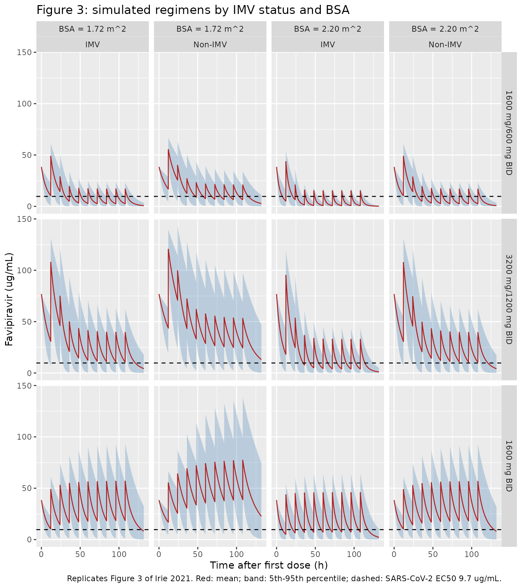

# Favipiravir (Irie 2021)

## Model and source

- Citation: Irie K, Nakagawa A, Fujita H, Tamura R, Eto M, Ikesue H,
  Muroi N, Fukushima S, Tomii K, Hashida T. Population pharmacokinetics
  of favipiravir in patients with COVID-19. CPT Pharmacometrics Syst
  Pharmacol. 2021;10(10):1161-1170. <doi:10.1002/psp4.12685>
- Description: One-compartment population PK model for oral favipiravir
  in hospitalized adults with COVID-19, with dose entered directly into
  the central compartment (NONMEM ADVAN1, no absorption phase). CL/F is
  a power function of the last administered dose (dose-dependent
  nonlinear PK), a multiplicative ratio for time-varying invasive
  mechanical ventilation, and a power function of body surface area.
- Article: <https://doi.org/10.1002/psp4.12685> (open access,
  PMC8420316)
- Supplement: NONMEM control stream (Supplementary Data S2), simulation
  data template (Data S1) and Figures S1-S3, available from the article
  page.

Irie et al. analysed favipiravir (FPV) serum concentrations from
residual routine-care samples of hospitalized COVID-19 patients. The
final model is a one-compartment model in which apparent clearance
(CL/F) falls with the last administered dose (dose-dependent nonlinear
PK), rises during invasive mechanical ventilation (IMV), and rises with
body surface area (BSA):

``` math
CL/F\ (\text{L/h}) = 5.11 \times \left(\frac{\text{Dose}}{600}\right)^{-0.61}
\times 1.71^{\text{IMV}} \times \left(\frac{\text{BSA}}{1.72}\right)^{2.22}
```

## Population

39 adults with RT-PCR-confirmed COVID-19 were treated with oral
favipiravir at Kobe City Medical Center General Hospital (Japan) between
March and May 2020 (Irie 2021 Table 1): median age 68 years (27-89),
79.5% male, median body weight 64 kg (29-100), median BSA 1.72 m^2
(1.14-2.20). Ten patients (25.6%) were on IMV when favipiravir started,
seven more were intubated later and two were weaned during treatment.
Thirty-three patients received 1600 mg twice daily on Day 1 followed by
600 mg twice daily; six received 1800 mg twice daily on Day 1 followed
by 800 mg (later switched to 600 mg) twice daily. Patients on IMV
received a suspension of the tablets through a nasogastric tube. 204
serum concentrations (median 5 per patient) entered the analysis.

The same information is available programmatically via
`readModelDb("Irie_2021_favipiravir")()$population`.

## Source trace

| Equation / parameter | Value | Source location |
|----|----|----|
| `lcl` (CL/F at 600 mg, no IMV, BSA 1.72 m^2) | log(5.11) L/h | Table 4; Supplementary Data S2 `THETA(1)` |
| `lvc` (V/F) | log(41.6) L | Table 4 (unit column misprinted “L/h”); S2 `THETA(2)` |
| `e_dose_cl` | -0.61 | Table 4 ‘Dose on CL/F’; S2 `(600000/LAST)**THETA(3)`, `THETA(3)` = 0.61 |
| `e_mech_vent_cl` | 1.71 | Table 4 ‘IMV on CL/F’; S2 `THETA(4)**TUBE` |
| `e_bsa_cl` | 2.22 | Table 4 ‘BSA on CL/F’; S2 `(BSA/1.72)**THETA(5)` |
| `etalcl` | 0.355 | Table 4 omega^2 CL/F; S2 `$OMEGA`, `CL = TVCL*EXP(ETA(1))` |
| `propSd` | sqrt(0.749) = 0.865 | Table 4 sigma^2 proportional; S2 `Y = F*(1+EPS(1)) + EPS(2)` |
| `addSd` | sqrt(764) ng/mL = 0.0276 ug/mL | Table 4 sigma^2 additive; S2 `$SIGMA` |
| CL/F covariate equation | n/a | Results, ‘Covariate analysis’ display equation; S2 `$PK` |
| `d/dt(central) <- -kel * central`, dose into `central` | n/a | Methods ‘PK analysis’; S2 `$SUBROUTINES ADVAN1 TRANS2`, dose records `CMT = 1` (Data S1) |
| `Cc <- central / vc` | n/a | S2 `S1 = V` |

## Assumptions and deviations

- **No absorption phase.** The deposited control stream uses
  `ADVAN1 TRANS2` with every dose record on `CMT = 1`, so the oral dose
  enters the central compartment directly. The model is packaged that
  way; do not add a depot. The first-dose peaks of the paper’s Figure 3
  (about 38 and 77 ug/mL after 1600 and 3200 mg) equal Dose / V/F, which
  confirms the bolus input.
- **Units.** The control stream carries doses in micrograms
  (`AMT = 1600000`) and V in litres, so its concentrations and the
  additive residual variance
  764. are in ng/mL. The packaged model doses in mg and predicts ug/mL,
       so the additive SD is sqrt(764) / 1000 = 0.02764 ug/mL. The dose
       covariate `LAST` (micrograms) is carried here as `DOSE` in mg
       with the same 600 mg reference.
- **`DOSE` is time-varying.** It is the last administered dose at each
  record (1600/1800 mg on the loading day, 600/800 mg thereafter).
  NONMEM advances the state over each interval with the parameters of
  the record that closes it; the simulations below carry the covariate
  forward from each dose (rxode2’s default
  last-observation-carried-forward interpolation), which is what the
  paper’s definition ‘last administered dosage at the time’ describes.
  The two differ only between the last loading dose and the first
  maintenance dose when no observation falls in between.
- **`MECH_VENT` is time-varying** in the source (the baseline-only IMV
  flag was not significant, Table 2). The simulations hold it constant
  within a patient.
- **Residual error** is the NONMEM `F*(1+EPS(1)) + EPS(2)` form with
  separate diagonal variances, which is nlmixr2’s default combined error
  (`combined2`).
- The prediction-corrected VPC (Figure 2) and goodness-of-fit plots
  (Figure 1) need the patient data, which are not public, and are not
  reproduced.

## Deterministic checks

### Time-varying clearance against a closed form

With a bolus input and clearance that changes only at dose times, the
concentration has a closed form: each dose adds `amt / V`, and between
doses the amount decays at the rate set by the last dose. The
typical-value solve must match it to solver precision; this also
confirms that the time-varying `DOSE` covariate reaches the model.

``` r

mod <- readModelDb("Irie_2021_favipiravir")
mod_typ <- rxode2::zeroRe(mod)

make_events <- function(load, maint, imv, bsa, id = 1L,
                        obs = seq(0, 144, by = 0.5)) {
  dose_times <- seq(0, 108, by = 12)
  doses <- data.frame(
    id = id, time = dose_times, evid = 1L,
    amt = ifelse(dose_times < 24, load, maint), cmt = "central"
  )
  observations <- data.frame(
    id = id, time = obs, evid = 0L, amt = 0, cmt = "central"
  )
  ev <- dplyr::bind_rows(doses, observations) |>
    dplyr::arrange(time, dplyr::desc(evid))
  # DOSE = last administered dose on every record (LAST in the source data).
  ev$DOSE <- ifelse(ev$evid == 1L, ev$amt, NA_real_)
  ev <- tidyr::fill(ev, DOSE)
  ev$MECH_VENT <- imv
  ev$BSA <- bsa
  # Event columns first: a DOSE column ahead of amt is not passed to the model.
  dplyr::relocate(ev, id, time, evid, amt, cmt)
}

closed_form <- function(t, ev, v = 41.6) {
  doses <- ev[ev$evid == 1L, ]
  kel_of <- function(d) 5.11 * (d / 600)^-0.61 * 1.71^ev$MECH_VENT[1] *
    (ev$BSA[1] / 1.72)^2.22 / v
  vapply(t, function(tt) {
    given <- doses[doses$time <= tt, ]
    amount <- 0
    for (i in seq_len(nrow(given))) {
      if (i > 1) {
        amount <- amount * exp(-kel_of(given$amt[i - 1]) *
          (given$time[i] - given$time[i - 1]))
      }
      amount <- amount + given$amt[i]
    }
    last <- nrow(given)
    amount * exp(-kel_of(given$amt[last]) * (tt - given$time[last])) / v
  }, numeric(1))
}

cf_cases <- expand.grid(imv = 0:1, bsa = c(1.72, 2.20))
cf_err <- vapply(seq_len(nrow(cf_cases)), function(i) {
  ev <- make_events(1600, 600, cf_cases$imv[i], cf_cases$bsa[i])
  s <- rxode2::rxSolve(mod_typ, ev, returnType = "data.frame")
  max(abs(s$Cc - closed_form(s$time, ev)) / closed_form(s$time, ev))
}, numeric(1))
cf_err
#> [1] 2.895237e-06 3.943246e-06 3.012893e-06 4.531883e-06
stopifnot(max(cf_err) < 1e-4)
```

### Published arithmetic

``` r

# Discussion: CL/F after 1600 mg is 0.55-fold that after 600 mg.
ratio_1600 <- (1600 / 600)^-0.61
ratio_1600
#> [1] 0.5497422
stopifnot(abs(ratio_1600 - 0.55) < 0.005)

# Figure 3: the first-dose peak is Dose / (V/F) for every scenario.
peak <- rxode2::rxSolve(
  mod_typ, make_events(3200, 1200, 1, 2.20, obs = 0),
  returnType = "data.frame"
)$Cc
c(simulated = peak, dose_over_v = 3200 / 41.6)
#>   simulated dose_over_v 
#>    76.92308    76.92308
stopifnot(abs(peak - 3200 / 41.6) < 1e-6)
```

## Replicate Figure 3

Figure 3 of the paper simulates three regimens (1600/600, 3200/1200 and
1600/1600 mg twice daily, five days) for patients with or without IMV at
the median (1.72 m^2) and upper (2.20 m^2) BSA, and plots the mean with
the 5th-95th percentile band. To keep the comparison free of
random-number differences between machines, the between-subject
variability is represented by 200 equally-spaced normal quantiles of
`etalcl` instead of random draws, so the summaries below are
deterministic.

``` r

# warning = FALSE: rxode2 warns that a multi-subject solve has no omega, which
# is intended here -- the etas are supplied as data on the zeroRe() model.
n_grid <- 200
eta_grid <- qnorm((seq_len(n_grid) - 0.5) / n_grid) * sqrt(0.355)

regimens <- tibble::tribble(
  ~regimen,             ~load, ~maint,
  "1600 mg/600 mg BID",  1600,    600,
  "3200 mg/1200 mg BID", 3200,   1200,
  "1600 mg BID",         1600,   1600
)
scenarios <- tidyr::expand_grid(regimens, imv = 0:1, bsa = c(1.72, 2.20)) |>
  mutate(scenario = row_number())

fig3 <- lapply(seq_len(nrow(scenarios)), function(i) {
  sc <- scenarios[i, ]
  ev1 <- make_events(sc$load, sc$maint, sc$imv, sc$bsa,
    obs = sort(c(seq(0, 132, by = 1), seq(12, 108, by = 12) - 1e-6))
  )
  ev <- dplyr::bind_rows(lapply(seq_len(n_grid), function(j) {
    dplyr::mutate(ev1, id = j)
  }))
  s <- rxode2::rxSolve(mod_typ, ev,
    params = data.frame(id = seq_len(n_grid), etalcl = eta_grid),
    returnType = "data.frame"
  )
  dplyr::mutate(s, scenario = sc$scenario)
}) |>
  dplyr::bind_rows() |>
  dplyr::left_join(scenarios, by = "scenario") |>
  mutate(
    imv_lab = ifelse(imv == 1, "IMV", "Non-IMV"),
    bsa_lab = paste0("BSA = ", format(bsa, nsmall = 2), " m^2"),
    regimen = factor(regimen, levels = regimens$regimen)
  )
```

``` r

fig3 |>
  group_by(regimen, imv_lab, bsa_lab, time) |>
  summarise(
    mean = mean(Cc), p05 = quantile(Cc, 0.05), p95 = quantile(Cc, 0.95),
    .groups = "drop"
  ) |>
  ggplot(aes(time, mean)) +
  geom_ribbon(aes(ymin = p05, ymax = p95), fill = "steelblue", alpha = 0.3) +
  geom_line(colour = "firebrick") +
  geom_hline(yintercept = 9.7, linetype = "dashed") +
  facet_grid(regimen ~ bsa_lab + imv_lab) +
  labs(
    x = "Time after first dose (h)", y = "Favipiravir (ug/mL)",
    title = "Figure 3: simulated regimens by IMV status and BSA",
    caption = paste(
      "Replicates Figure 3 of Irie 2021. Red: mean; band: 5th-95th",
      "percentile; dashed: SARS-CoV-2 EC50 9.7 ug/mL."
    )
  )
```



The paper’s Results compare the trough concentrations against the
SARS-CoV-2 EC50 of 9.7 ug/mL. The table gives the trough before the last
(tenth) dose at 108 h.

``` r

troughs <- fig3 |>
  filter(time > 107.99, time < 108) |>
  group_by(regimen, imv_lab, bsa) |>
  summarise(mean = mean(Cc), median = median(Cc), .groups = "drop")

troughs |>
  mutate(across(c(mean, median), \(x) signif(x, 3))) |>
  dplyr::rename(
    "Regimen" = regimen, "IMV" = imv_lab, "BSA (m^2)" = bsa,
    "Mean trough (ug/mL)" = mean, "Median trough (ug/mL)" = median
  ) |>
  knitr::kable(caption = "Trough concentration at 108 h (before the tenth dose).")
```

| Regimen | IMV | BSA (m^2) | Mean trough (ug/mL) | Median trough (ug/mL) |
|:---|:---|---:|---:|---:|
| 1600 mg/600 mg BID | IMV | 1.72 | 2.510 | 1.260 |
| 1600 mg/600 mg BID | IMV | 2.20 | 0.766 | 0.188 |
| 1600 mg/600 mg BID | Non-IMV | 1.72 | 6.460 | 4.280 |
| 1600 mg/600 mg BID | Non-IMV | 2.20 | 2.460 | 1.230 |
| 3200 mg/1200 mg BID | IMV | 1.72 | 10.700 | 6.840 |
| 3200 mg/1200 mg BID | IMV | 2.20 | 3.920 | 1.770 |
| 3200 mg/1200 mg BID | Non-IMV | 1.72 | 24.400 | 17.800 |
| 3200 mg/1200 mg BID | Non-IMV | 2.20 | 10.500 | 6.710 |
| 1600 mg BID | IMV | 1.72 | 18.500 | 12.800 |
| 1600 mg BID | IMV | 2.20 | 7.330 | 3.870 |
| 1600 mg BID | Non-IMV | 1.72 | 38.900 | 30.800 |
| 1600 mg BID | Non-IMV | 2.20 | 18.200 | 12.600 |

Trough concentration at 108 h (before the tenth dose). {.table}

``` r


tr <- function(reg, imv, b, stat = "mean") {
  troughs[[stat]][troughs$regimen == reg & troughs$imv_lab == imv &
    troughs$bsa == b]
}

stopifnot(
  # 'The mean trough concentration of the 1600/600 mg b.i.d. regimen was lower
  # than the EC50 ... with any simulation.'
  all(troughs$mean[troughs$regimen == "1600 mg/600 mg BID"] < 9.7),
  # IMV: the 1600 mg b.i.d. regimen 'only exceeded the EC50 in patients with
  # median BSA = 1.72 and not in those with BSA = 2.20'.
  tr("1600 mg BID", "IMV", 1.72) > 9.7,
  tr("1600 mg BID", "IMV", 2.20) < 9.7,
  # IMV: the 3200/1200 mg regimen 'was also lower than the EC50' (see below).
  tr("3200 mg/1200 mg BID", "IMV", 1.72, "median") < 9.7,
  tr("3200 mg/1200 mg BID", "IMV", 2.20) < 9.7,
  # Non-IMV: the 1600 mg b.i.d. regimen exceeds the EC50 at both BSA values.
  tr("1600 mg BID", "Non-IMV", 1.72) > 9.7,
  tr("1600 mg BID", "Non-IMV", 2.20) > 9.7
)
```

Every statement in the paper’s Results holds for the packaged model,
with one qualification. For IMV patients with BSA 1.72 m^2 on 3200/1200
mg, the population mean trough is about 10.7 ug/mL, slightly above the
EC50, while the median (and typical-value) trough is about 6.8 ug/mL,
below it. The paper reports this scenario as below the EC50; its summary
came from 1000 random replicates, and a right-skewed trough distribution
this close to the threshold places the mean on either side depending on
the draw. The Results sentence for non-IMV patients (‘the mean trough
concentration of the 1600 b.i.d. regimens only exceeded the EC50 in
patients with BSA = 2.20’) cannot be literal, since CL/F rises with BSA;
the model’s troughs exceed the EC50 at both BSA values, as Figure 3 of
the paper also shows.

## Virtual cohort and PKNCA

A stochastic cohort of 200 patients per regimen, with BSA drawn around
the median 1.72 m^2 within the observed range and a 25.6% IMV prevalence
(the share on IMV at the start of treatment), gives the exposure
summaries below.

``` r

set.seed(8420316)
rxode2::rxSetSeed(8420316)

draw_bsa <- function(n) {
  out <- numeric(0)
  while (length(out) < n) {
    x <- rnorm(n, 1.72, 0.18)
    out <- c(out, x[x >= 1.14 & x <= 2.20])
  }
  out[seq_len(n)]
}

n_arm <- 200
cohort <- tidyr::expand_grid(regimens, k = seq_len(n_arm)) |>
  mutate(
    id = row_number(),
    BSA = draw_bsa(n()),
    MECH_VENT = rbinom(n(), 1, 0.256)
  )

events <- lapply(seq_len(nrow(cohort)), function(i) {
  p <- cohort[i, ]
  make_events(p$load, p$maint, p$MECH_VENT, p$BSA,
    id = p$id,
    # Drop the dose times except 0 and 96 (where the post-dose value starts
    # the NCA interval) and add the pre-dose trough just before each dose.
    obs = sort(c(
      setdiff(seq(0, 132, by = 0.5), c(seq(12, 84, by = 12), 108)),
      seq(12, 108, by = 12) - 1e-6
    ))
  ) |>
    mutate(regimen = p$regimen)
}) |>
  dplyr::bind_rows()

sim <- rxode2::rxSolve(mod, events, keep = "regimen", returnType = "data.frame")
```

``` r

sim_nca <- sim |>
  filter(!is.na(Cc)) |>
  select(id, time, Cc, regimen) |>
  distinct(id, regimen, time, .keep_all = TRUE)

dose_df <- events |>
  filter(evid == 1) |>
  select(id, time, amt, regimen)

conc_obj <- PKNCA::PKNCAconc(sim_nca, Cc ~ time | regimen + id)
dose_obj <- PKNCA::PKNCAdose(dose_df, amt ~ time | regimen + id)
intervals <- data.frame(
  start = c(0, 96),
  end = c(24, 108),
  cmax = TRUE,
  cmin = TRUE,
  auclast = TRUE
)
nca_res <- PKNCA::pk.nca(PKNCA::PKNCAdata(conc_obj, dose_obj,
  intervals = intervals
))

nca_res |>
  as.data.frame() |>
  filter(PPTESTCD %in% c("cmax", "cmin", "auclast")) |>
  group_by(regimen, start, end, PPTESTCD) |>
  summarise(median = signif(median(PPORRES), 3), .groups = "drop") |>
  tidyr::pivot_wider(names_from = PPTESTCD, values_from = median) |>
  arrange(match(regimen, regimens$regimen), start) |>
  dplyr::rename(
    "Regimen" = regimen, "Start (h)" = start, "End (h)" = end,
    "Cmax (ug/mL)" = cmax, "Cmin (ug/mL)" = cmin,
    "AUC (ug*h/mL)" = auclast
  ) |>
  knitr::kable(caption = paste(
    "Median simulated exposure on Day 1 (0-24 h) and over the last",
    "dosing interval (96-108 h). The paper reports no NCA table."
  ))
```

| Regimen | Start (h) | End (h) | AUC (ug\*h/mL) | Cmax (ug/mL) | Cmin (ug/mL) |
|:---|---:|---:|---:|---:|---:|
| 1600 mg/600 mg BID | 0 | 24 | 708 | 51.5 | 15.10 |
| 1600 mg/600 mg BID | 96 | 108 | 102 | 17.6 | 3.22 |
| 3200 mg/1200 mg BID | 0 | 24 | 1760 | 117.0 | 42.70 |
| 3200 mg/1200 mg BID | 96 | 108 | 324 | 44.0 | 15.10 |
| 1600 mg BID | 0 | 24 | 699 | 51.2 | 14.80 |
| 1600 mg BID | 96 | 108 | 483 | 62.5 | 24.00 |

Median simulated exposure on Day 1 (0-24 h) and over the last dosing
interval (96-108 h). The paper reports no NCA table. {.table
style="width:100%;"}

### Steady-state dose recovery

On Day 5 the 1600 mg BID regimen is at steady state for the typical
patient, so `CL/F * AUC(tau)` must return the dose. The check uses the
typical-value solve, which is deterministic.

``` r

ev_typ <- make_events(1600, 1600, 0, 1.72,
  obs = c(seq(96, 107.95, by = 0.05), 108 - 1e-6)
)
s_typ <- rxode2::rxSolve(mod_typ, ev_typ, returnType = "data.frame")
auc_tau <- PKNCA::pk.calc.auc.last(
  conc = s_typ$Cc[s_typ$time >= 96 & s_typ$time <= 108],
  time = s_typ$time[s_typ$time >= 96 & s_typ$time <= 108] - 96
)
cl_1600 <- 5.11 * (1600 / 600)^-0.61
c(cl_times_auc = cl_1600 * auc_tau, dose = 1600)
#> cl_times_auc         dose 
#>     1598.914     1600.000
stopifnot(abs(cl_1600 * auc_tau / 1600 - 1) < 0.01)
```
