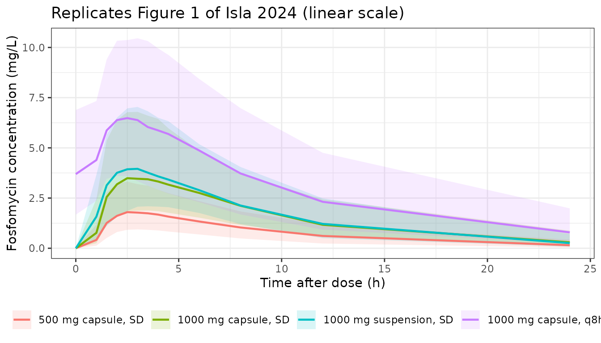
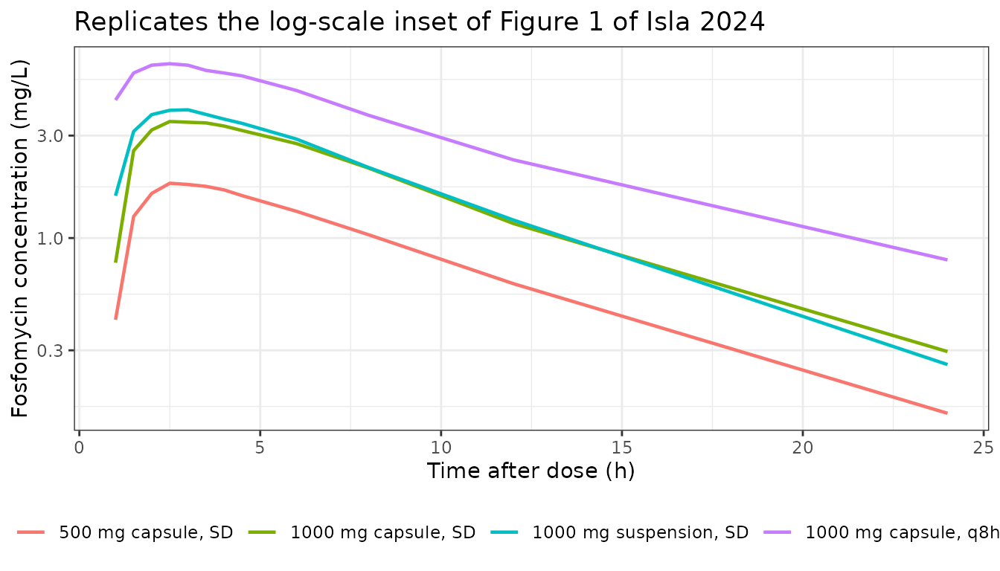

# Fosfomycin calcium (Isla 2024)

## Model and source

``` r

ui <- rxode2::rxode(readModelDb("Isla_2024_fosfomycinCalcium"))
#> ℹ parameter labels from comments will be replaced by 'label()'
#> Warning: some etas defaulted to non-mu referenced, possible parsing error: etaiov_cl_1, etaiov_cl_2, etaiov_cl_3, etaiov_cl_4, etaiov_vc_1, etaiov_vc_2, etaiov_vc_3, etaiov_vc_4
#> as a work-around try putting the mu-referenced expression on a simple line
```

- Citation: Isla A, Alarcia-Lacalle A, Solinis MA, del Pozo-Rodriguez A,
  Abajo Z, Cabero M, Canut-Blasco A, Rodriguez-Gascon A. Population
  pharmacokinetics of oral fosfomycin calcium in healthy women. J
  Antimicrob Chemother. 2024;79(11):2891-2898.
  <doi:10.1093/jac/dkae295>.
- Article: <https://doi.org/10.1093/jac/dkae295>
- PubMed Central:
  <https://www.ncbi.nlm.nih.gov/pmc/articles/PMC11531824/>

Two-compartment population PK model with first-order absorption and an
absorption lag time for oral fosfomycin calcium (Fosfocina) in 24
healthy adult women studied in a four-period randomized crossover
bioavailability trial (500 mg capsule single dose, 1000 mg capsule
single dose, 1000 mg oral suspension single dose, and 1000 mg capsules
every 8 h for 3 days). All disposition parameters are apparent (CL/F,
V1/F, Q/F, V2/F) because no intravenous arm was studied, so absolute
bioavailability is not identifiable and F is absorbed into every volume
and clearance term. Three covariate-parameter relationships are
retained: raw Cockcroft-Gault creatinine clearance on CL/F as an
exponential centered at the 108 mL/min cohort median, body weight on
V1/F as a linear ratio to the 64 kg cohort median, and the
oral-suspension formulation on both the absorption rate constant
(1.17-fold faster than capsules) and the absorption lag time (0.84-fold,
i.e. shorter, than capsules). Inter-individual variability is diagonal
on CL/F, V1/F, ka and the lag time; inter-occasion variability across
the four crossover periods is carried on CL/F and V1/F and is larger
than the corresponding IIV for both. Residual error is combined additive
plus proportional. Absorption is markedly rate-limiting (ka = 0.15 1/h
against kel = CL/V1 = 0.97 1/h), so the disposition is flip-flop and the
apparent terminal slope is governed by ka (Isla 2024).

## Population

Isla 2024 studied 24 healthy adult women at a single Spanish centre
(Clinical Trial Unit, Araba University Hospital, Vitoria-Gasteiz; AEMPS
code PD7522.22, EudraCT 2020-001664-28) in an open-label randomized
four-period crossover bioavailability trial of oral fosfomycin
**calcium** (Fosfocina). Each woman received all four treatments in a
randomized sequence with a washout exceeding one week between periods: a
single 500 mg capsule dose, a single 1000 mg capsule dose, a single 1000
mg oral-suspension dose (20 mL of a 250 mg/5 mL product), and 1000 mg
capsules every 8 h for 3 days with sampling after the last dose. All
doses were taken fasted with 200 mL of water.

Baseline demographics (Isla 2024 Table 1) are tightly clustered, as is
usual for a healthy-volunteer bioavailability study: age 19-49 years
(mean 32), weight 51.7-94.8 kg (mean 65.1, median 64.3), BMI 20.0-29.9
kg/m^2, serum creatinine 0.64-0.92 mg/dL, and Cockcroft-Gault creatinine
clearance 82.9-158.4 mL/min (mean 109.4, median 108.0). Women with renal
failure and women with a BMI at or above 30 kg/m^2 were excluded, so
**both retained covariates are fitted over a narrow, healthy range** and
the paper’s own Discussion cautions against extrapolating to renal
impairment or obesity.

Thirteen plasma samples were drawn per subject per period (pre-dose and
1, 1.5, 2, 2.5, 3, 3.5, 4, 4.5, 6, 8, 12 and 24 h), giving 1124
concentration records for model building. Four women were excluded from
the multiple-dose period for dosing or sampling deviations, leaving n =
20 there. Fosfomycin was assayed by HPLC-MS/MS, linear from 50 ng/mL to
50000 ng/mL. The model was fitted in NONMEM 7.4 with FOCE-INTER and
evaluated by pcVPC and by a 1000-sample bootstrap (919 successful runs).

``` r

str(ui$population)
#> List of 13
#>  $ species         : chr "human"
#>  $ n_subjects      : int 24
#>  $ n_studies       : int 1
#>  $ n_observations  : int 1124
#>  $ age_range       : chr "19-49 years (mean 32, median 32, SD 9); protocol eligibility 18-55 years"
#>  $ weight_range    : chr "51.7-94.8 kg (mean 65.1, median 64.3, SD 9.6)"
#>  $ sex_female_pct  : num 100
#>  $ disease_state   : chr "Healthy adult women volunteers with no evidence of significant organic or psychiatric disease, normal clinical "| __truncated__
#>  $ renal_function  : chr "Uniformly normal to mildly augmented. Serum creatinine 0.64-0.92 mg/dL (mean 0.77); Cockcroft-Gault creatinine "| __truncated__
#>  $ hepatic_function: chr "Normal. GOT 13-34 U/L, GPT 6-54 U/L, GGT 9-40 U/L, total plasma proteins 6.3-7.6 g/dL (Isla 2024 Table 1). Tran"| __truncated__
#>  $ dose_range      : chr "Four treatments per subject in a randomized crossover with washout exceeding one week between periods: (i) 500 "| __truncated__
#>  $ regions         : chr "Spain (single centre: Clinical Trial Unit, Araba University Hospital, Vitoria-Gasteiz)."
#>  $ notes           : chr "Regulatory identifiers: AEMPS code PD7522.22, EudraCT 2020-001664-28. Thirteen plasma samples per subject per p"| __truncated__
```

## Source trace

Every value below carries the same citation as an in-file comment beside
its `ini()` entry in
`inst/modeldb/specificDrugs/Isla_2024_fosfomycinCalcium.R`. All
disposition parameters are **apparent** (divided by the unknown oral
bioavailability F): the trial had no intravenous arm.

| Equation / parameter | Value | Source location |
|----|----|----|
| `lcl` = log(CL/F) at CRCL 108 mL/min | 23.7 L/h | Table 2, `theta_CL` (RSE 5%); Results text “the estimated CL/F value for a woman with CLCR of 108 mL/min is 23.7 L/h” |
| `e_crcl_cl` | 0.0060 (mL/min)^-1 | Table 2, `theta_CLCR` (RSE 38%), in `CL/F = theta_CL * e^(theta_CLCR * (CLCR - 108))` |
| `lvc` = log(V1/F) at 64 kg | 24.4 L | Table 2, `theta_V1` (RSE 14%); Results text “the typical value for V1/F … 24.4 L” |
| `e_wt_vc` | 1 (fixed) | Table 2, `V1/F (L) = theta_V1 * (BW/64)` – the ratio enters to the first power; no exponent is estimated |
| `lq` = log(Q/F) | 4.04 L/h | Table 2, `theta_Q` (RSE 24%); Results text “inter-compartmental clearance (Q/F) … 4.04 L/h” |
| `lvp` = log(V2/F) at 64 kg | 24.4 x 4.94 = 120.536 L | Table 2, `theta_V2` = 4.94 (RSE 38%) as the V2/V1 ratio in `Vss/F = (V1 * (1 + theta_V2))` |
| `e_wt_vp` | 1 (fixed) | Inherited from `lvc` through the `V2 = V1 * theta_V2` ratio parameterisation |
| `lka` = log(ka), capsule | 0.15 1/h | Table 2, `theta_KA1` (RSE 10%) |
| `e_form_syrup_ka` | log(1.17) | Table 2, `theta_KA2` (RSE 9%), in `KA (suspension) = theta_KA1 x theta_KA2` |
| `ltlag` = log(TLAG), capsule | 0.84 h | Table 2, `theta_TLAG1` (RSE 2%) |
| `e_form_syrup_tlag` | log(0.84) | Table 2, `theta_TLAG2` (RSE 5%), in `TLAG (suspension) = theta_TLAG1 x theta_TLAG2` |
| `etalcl` | log(1 + 0.157^2) | Table 2, “IIV on CL/F (%)” = 15.7 (RSE 27%, eta-shrinkage 34%) |
| `etalvc` | log(1 + 0.294^2) | Table 2, “IIV on V1/F (%)” = 29.4 (RSE 47%, eta-shrinkage 43%) |
| `etalka` | log(1 + 0.327^2) | Table 2, “IIV on KA (%)” = 32.7 (RSE 18%, eta-shrinkage 6.0%) |
| `etaltlag` | log(1 + 0.048^2) | Table 2, “IIV on TLAG (%)” = 4.8 (RSE 34%, eta-shrinkage 44%) |
| `etaiov_cl_*` | log(1 + 0.346^2) | Table 2, “IOV on CL/F (%)” = 34.6 (RSE 10%) |
| `etaiov_vc_*` | log(1 + 0.667^2) | Table 2, “IOV on V1/F (%)” = 66.7 (RSE 14%) |
| `addSd` | 0.209 mg/L | Table 2, “RE additive (mg/L)” (RSE 17%, eps-shrinkage 8%) |
| `propSd` | 0.199 | Table 2, “RE proportional (%)” (RSE 8%) – the value is the NONMEM fraction 19.9%; see Errata |
| Two-compartment ODEs with first-order absorption and lag | n/a | Results “Base model”: “the two-compartment model with first order absorption and elimination improved the fit … The inclusion of an absorption lag time (TLAG) significantly improved the fitting” |
| Combined additive + proportional residual | n/a | Methods “Population PK modelling”; Table 2 reports one row of each |

## Structural checks against the paper’s own printed values

The paper prints several derived quantities that over-determine the
parameter table, so the transcription can be checked without any
simulation at all. These are deterministic identities – no random draw
is involved – so they carry tight tolerances.

``` r

ev_ref <- rxode2::et(amt = 1000, cmt = "depot") |>
  rxode2::et(seq(0, 24, by = 0.05), cmt = "central")

solve_typical <- function(form_syrup, crcl = 108, wt = 64, ev = ev_ref) {
  d <- as.data.frame(ev)
  d$CRCL <- crcl
  d$WT <- wt
  d$FORM_SYRUP <- form_syrup
  d$OCC <- 1
  rxode2::rxSolve(
    rxode2::zeroRe(readModelDb("Isla_2024_fosfomycinCalcium")),
    d,
    omega = NA, sigma = NA, returnType = "data.frame"
  )
}

cap <- solve_typical(0)
#> ℹ parameter labels from comments will be replaced by 'label()'
#> Warning: some etas defaulted to non-mu referenced, possible parsing error: etaiov_cl_1, etaiov_cl_2, etaiov_cl_3, etaiov_cl_4, etaiov_vc_1, etaiov_vc_2, etaiov_vc_3, etaiov_vc_4
#> as a work-around try putting the mu-referenced expression on a simple line
#> Warning: some etas defaulted to non-mu referenced, possible parsing error: etaiov_cl_1, etaiov_cl_2, etaiov_cl_3, etaiov_cl_4, etaiov_vc_1, etaiov_vc_2, etaiov_vc_3, etaiov_vc_4
#> as a work-around try putting the mu-referenced expression on a simple line
#> Warning: some etas defaulted to non-mu referenced, possible parsing error: etaiov_cl_1, etaiov_cl_2, etaiov_cl_3, etaiov_cl_4, etaiov_vc_1, etaiov_vc_2, etaiov_vc_3, etaiov_vc_4
#> as a work-around try putting the mu-referenced expression on a simple line
sus <- solve_typical(1)
#> ℹ parameter labels from comments will be replaced by 'label()'
#> Warning: some etas defaulted to non-mu referenced, possible parsing error: etaiov_cl_1, etaiov_cl_2, etaiov_cl_3, etaiov_cl_4, etaiov_vc_1, etaiov_vc_2, etaiov_vc_3, etaiov_vc_4
#> as a work-around try putting the mu-referenced expression on a simple line
#> Warning: some etas defaulted to non-mu referenced, possible parsing error: etaiov_cl_1, etaiov_cl_2, etaiov_cl_3, etaiov_cl_4, etaiov_vc_1, etaiov_vc_2, etaiov_vc_3, etaiov_vc_4
#> as a work-around try putting the mu-referenced expression on a simple line

structural <- tibble::tribble(
  ~Quantity,                          ~Source,                        ~Published, ~Model,
  "CL/F at CRCL 108 mL/min (L/h)",    "Table 2 / Results text",        23.7,      cap$cl[1],
  "V1/F at 64 kg (L)",                "Table 2 / Results text",        24.4,      cap$vc[1],
  "Q/F (L/h)",                        "Table 2 / Results text",         4.04,     cap$q[1],
  "Vss/F = V1/F * (1 + theta_V2) (L)","Results text; Discussion 144.94",144.9,    cap$vc[1] + cap$vp[1],
  "KA, capsule (1/h)",                "Table 2 theta_KA1",              0.15,     cap$ka[1],
  "KA, suspension (1/h)",             "Table 2 printed sub-row",        0.18,     sus$ka[1],
  "TLAG, capsule (h)",                "Table 2 theta_TLAG1",            0.84,     cap$tlag[1],
  "TLAG, suspension (h)",             "Table 2 printed sub-row",        0.70,     sus$tlag[1]
) |>
  dplyr::mutate(`% diff` = 100 * (Model - Published) / Published)

knitr::kable(structural, digits = 3,
             caption = "Model typical values against the values Isla 2024 prints in Table 2 and in the Results text.")
```

| Quantity | Source | Published | Model | % diff |
|:---|:---|---:|---:|---:|
| CL/F at CRCL 108 mL/min (L/h) | Table 2 / Results text | 23.70 | 23.700 | 0.000 |
| V1/F at 64 kg (L) | Table 2 / Results text | 24.40 | 24.400 | 0.000 |
| Q/F (L/h) | Table 2 / Results text | 4.04 | 4.040 | 0.000 |
| Vss/F = V1/F \* (1 + theta_V2) (L) | Results text; Discussion 144.94 | 144.90 | 144.936 | 0.025 |
| KA, capsule (1/h) | Table 2 theta_KA1 | 0.15 | 0.150 | 0.000 |
| KA, suspension (1/h) | Table 2 printed sub-row | 0.18 | 0.176 | -2.500 |
| TLAG, capsule (h) | Table 2 theta_TLAG1 | 0.84 | 0.840 | 0.000 |
| TLAG, suspension (h) | Table 2 printed sub-row | 0.70 | 0.706 | 0.800 |

Model typical values against the values Isla 2024 prints in Table 2 and
in the Results text. {.table style="width:100%;"}

``` r


# The two suspension sub-rows are DERIVED products of two values that Table 2
# prints to only two decimal places, so they can only be matched to that
# precision: 0.15 * 1.17 = 0.1755 against a printed 0.18 (-2.5%) and
# 0.84 * 0.84 = 0.7056 against a printed 0.70 (+0.8%). Both discrepancies sit
# well inside the rounding interval of the underlying estimates -- a theta_TLAG
# pair anywhere in [0.835, 0.845] rounds to 0.84 and squares to 0.697-0.714 --
# so 3% is the tightest bound the source's own precision supports. Every other
# row is an exact identity and is gated at 0.05%.
derived_rows <- structural$Quantity %in% c("KA, suspension (1/h)", "TLAG, suspension (h)")
stopifnot(
  abs(structural$`% diff`[!derived_rows]) < 0.05,
  abs(structural$`% diff`[derived_rows]) < 3
)
```

The absorption rate constant for the capsule (0.15 1/h) is far **below**
the elimination rate constant `kel = CL/F / V1/F`:

``` r

kel_ref <- cap$cl[1] / cap$vc[1]
c(ka = cap$ka[1], kel = kel_ref, ratio = kel_ref / cap$ka[1])
#>        ka       kel     ratio 
#> 0.1500000 0.9713115 6.4754098
stopifnot(cap$ka[1] < kel_ref / 3)
```

so absorption is rate-limiting and the profile is **flip-flop**: the
apparent terminal slope tracks `ka`, not elimination. This is why the
observed concentration-time curves in Isla 2024 Figure 1 decline slowly
out to 24 h despite an apparent clearance of 23.7 L/h, and it is the
reason the multiple-dose arm accumulates as much as it does.

## Replicating Table 3 – the paper’s own covariate simulation

Isla 2024 Table 3 reports CL/F and V1/F for cohorts of 2000 virtual
women at three body weights (55, 64, 90 kg) and three creatinine
clearances (80, 108, 150 mL/min). The table gives both a **median** and
a **mean (SD)** per cell. Because the covariate models are deterministic
given the covariate value, the medians are exactly the model’s typical
values; and because the random effects are log-normal, the means sit
above the medians by exactly `exp(sum(omega^2) / 2)` over the IIV
**and** IOV variances that apply to each parameter. Both columns are
therefore reproducible without simulating anything, which makes Table 3
a strong falsifier for the whole encoding – the covariate functional
forms, the centring constants, and the %CV-versus-variance reading of
the random-effect rows all have to be right simultaneously.

``` r

# Pull the random-effect variances straight out of the packaged model so this
# check reads the file under test, not a hand-copied constant.
omegas <- ui$iniDf |>
  dplyr::filter(!is.na(neta1), neta1 == neta2) |>
  dplyr::select(name, est)
omega_of <- function(nm) {
  v <- omegas$est[omegas$name == nm]
  if (length(v) != 1L) stop("no unique omega for '", nm, "'")
  v
}

# Log-normal mean/median ratio for each parameter: exp(sum of its variances / 2).
infl_cl <- exp((omega_of("etalcl") + omega_of("etaiov_cl_1")) / 2)
infl_vc <- exp((omega_of("etalvc") + omega_of("etaiov_vc_1")) / 2)
c(CL = infl_cl, V1 = infl_vc)
#>       CL       V1 
#> 1.071128 1.252908
```

``` r

crcl_grid <- c(80, 108, 150)
cl_med <- vapply(crcl_grid, function(x) solve_typical(0, crcl = x)$cl[1], numeric(1))
#> ℹ parameter labels from comments will be replaced by 'label()'
#> Warning: some etas defaulted to non-mu referenced, possible parsing error: etaiov_cl_1, etaiov_cl_2, etaiov_cl_3, etaiov_cl_4, etaiov_vc_1, etaiov_vc_2, etaiov_vc_3, etaiov_vc_4
#> as a work-around try putting the mu-referenced expression on a simple line
#> Warning: some etas defaulted to non-mu referenced, possible parsing error: etaiov_cl_1, etaiov_cl_2, etaiov_cl_3, etaiov_cl_4, etaiov_vc_1, etaiov_vc_2, etaiov_vc_3, etaiov_vc_4
#> as a work-around try putting the mu-referenced expression on a simple line
#> ℹ parameter labels from comments will be replaced by 'label()'
#> Warning: some etas defaulted to non-mu referenced, possible parsing error: etaiov_cl_1, etaiov_cl_2, etaiov_cl_3, etaiov_cl_4, etaiov_vc_1, etaiov_vc_2, etaiov_vc_3, etaiov_vc_4
#> as a work-around try putting the mu-referenced expression on a simple line
#> Warning: some etas defaulted to non-mu referenced, possible parsing error: etaiov_cl_1, etaiov_cl_2, etaiov_cl_3, etaiov_cl_4, etaiov_vc_1, etaiov_vc_2, etaiov_vc_3, etaiov_vc_4
#> as a work-around try putting the mu-referenced expression on a simple line
#> ℹ parameter labels from comments will be replaced by 'label()'
#> Warning: some etas defaulted to non-mu referenced, possible parsing error: etaiov_cl_1, etaiov_cl_2, etaiov_cl_3, etaiov_cl_4, etaiov_vc_1, etaiov_vc_2, etaiov_vc_3, etaiov_vc_4
#> as a work-around try putting the mu-referenced expression on a simple line
#> Warning: some etas defaulted to non-mu referenced, possible parsing error: etaiov_cl_1, etaiov_cl_2, etaiov_cl_3, etaiov_cl_4, etaiov_vc_1, etaiov_vc_2, etaiov_vc_3, etaiov_vc_4
#> as a work-around try putting the mu-referenced expression on a simple line

table3_cl <- tibble::tibble(
  `CLCR (mL/min)`       = crcl_grid,
  `Published median`    = c(19.8, 23.7, 40.5),
  `Model median`        = cl_med,
  `Published mean`      = c(21.5, 25.5, 32.8),
  `Model mean`          = cl_med * infl_cl
) |>
  dplyr::mutate(
    `Median % diff` = 100 * (`Model median` - `Published median`) / `Published median`,
    `Mean % diff`   = 100 * (`Model mean`   - `Published mean`)   / `Published mean`
  )

knitr::kable(table3_cl, digits = 2,
             caption = "CL/F (L/h) against Isla 2024 Table 3. The 150 mL/min median is a typographical error in the source; see the text below.")
```

| CLCR (mL/min) | Published median | Model median | Published mean | Model mean | Median % diff | Mean % diff |
|---:|---:|---:|---:|---:|---:|---:|
| 80 | 19.8 | 20.03 | 21.5 | 21.46 | 1.19 | -0.19 |
| 108 | 23.7 | 23.70 | 25.5 | 25.39 | 0.00 | -0.45 |
| 150 | 40.5 | 30.49 | 32.8 | 32.66 | -24.71 | -0.42 |

CL/F (L/h) against Isla 2024 Table 3. The 150 mL/min median is a
typographical error in the source; see the text below. {.table}

Two of the three medians reproduce to better than 1.5%, and **all three
means reproduce to better than 0.5%**. The 150 mL/min median does not:
the source prints 40.5 L/h where the model gives 30.5 L/h.

That cell is a typographical error in Isla 2024, and its own
neighbouring mean proves it. A log-normal median of 40.5 with these
variances would imply a mean of `40.5 * 1.0711 = 43.4` L/h, not the 32.8
the paper reports in the very same column; a median of 30.5 implies
`30.5 * 1.0711 = 32.7`, which is what is printed. The Discussion
supplies an independent confirmation: it states that “CL/F is more than
50% higher in a woman with CLCR of 150 mL/min than in one with a CLCR of
80 mL/min”, and 30.5 / 20.0 = 1.52 satisfies that while 40.5 / 20.0 =
2.02 would have been described as a doubling. The model is therefore
gated on the two correct medians and on all three means, and the 40.5
cell is recorded as a source erratum rather than reproduced.

``` r

ok <- table3_cl$`CLCR (mL/min)` != 150
stopifnot(
  abs(table3_cl$`Median % diff`[ok]) < 2,
  abs(table3_cl$`Mean % diff`) < 1,
  # The Discussion's own claim, checked directly.
  cl_med[3] / cl_med[1] > 1.5, cl_med[3] / cl_med[1] < 1.6
)
```

``` r

wt_grid <- c(55, 64, 90)
vc_med <- vapply(wt_grid, function(x) solve_typical(0, wt = x)$vc[1], numeric(1))
#> ℹ parameter labels from comments will be replaced by 'label()'
#> Warning: some etas defaulted to non-mu referenced, possible parsing error: etaiov_cl_1, etaiov_cl_2, etaiov_cl_3, etaiov_cl_4, etaiov_vc_1, etaiov_vc_2, etaiov_vc_3, etaiov_vc_4
#> as a work-around try putting the mu-referenced expression on a simple line
#> Warning: some etas defaulted to non-mu referenced, possible parsing error: etaiov_cl_1, etaiov_cl_2, etaiov_cl_3, etaiov_cl_4, etaiov_vc_1, etaiov_vc_2, etaiov_vc_3, etaiov_vc_4
#> as a work-around try putting the mu-referenced expression on a simple line
#> ℹ parameter labels from comments will be replaced by 'label()'
#> Warning: some etas defaulted to non-mu referenced, possible parsing error: etaiov_cl_1, etaiov_cl_2, etaiov_cl_3, etaiov_cl_4, etaiov_vc_1, etaiov_vc_2, etaiov_vc_3, etaiov_vc_4
#> as a work-around try putting the mu-referenced expression on a simple line
#> Warning: some etas defaulted to non-mu referenced, possible parsing error: etaiov_cl_1, etaiov_cl_2, etaiov_cl_3, etaiov_cl_4, etaiov_vc_1, etaiov_vc_2, etaiov_vc_3, etaiov_vc_4
#> as a work-around try putting the mu-referenced expression on a simple line
#> ℹ parameter labels from comments will be replaced by 'label()'
#> Warning: some etas defaulted to non-mu referenced, possible parsing error: etaiov_cl_1, etaiov_cl_2, etaiov_cl_3, etaiov_cl_4, etaiov_vc_1, etaiov_vc_2, etaiov_vc_3, etaiov_vc_4
#> as a work-around try putting the mu-referenced expression on a simple line
#> Warning: some etas defaulted to non-mu referenced, possible parsing error: etaiov_cl_1, etaiov_cl_2, etaiov_cl_3, etaiov_cl_4, etaiov_vc_1, etaiov_vc_2, etaiov_vc_3, etaiov_vc_4
#> as a work-around try putting the mu-referenced expression on a simple line

table3_vc <- tibble::tibble(
  `Body weight (kg)`   = wt_grid,
  `Published median`   = c(20.8, 24.1, 33.7),
  `Model median`       = vc_med,
  `Published mean`     = c(26.1, 30.5, 42.7),
  `Model mean`         = vc_med * infl_vc
) |>
  dplyr::mutate(
    `Median % diff` = 100 * (`Model median` - `Published median`) / `Published median`,
    `Mean % diff`   = 100 * (`Model mean`   - `Published mean`)   / `Published mean`
  )

knitr::kable(table3_vc, digits = 2,
             caption = "V1/F (L) against Isla 2024 Table 3.")
```

| Body weight (kg) | Published median | Model median | Published mean | Model mean | Median % diff | Mean % diff |
|---:|---:|---:|---:|---:|---:|---:|
| 55 | 20.8 | 20.97 | 26.1 | 26.27 | 0.81 | 0.66 |
| 64 | 24.1 | 24.40 | 30.5 | 30.57 | 1.24 | 0.23 |
| 90 | 33.7 | 34.31 | 42.7 | 42.99 | 1.82 | 0.68 |

V1/F (L) against Isla 2024 Table 3. {.table}

``` r


stopifnot(
  abs(table3_vc$`Median % diff`) < 2.5,
  abs(table3_vc$`Mean % diff`)   < 2.5
)
```

Every V1/F cell reproduces to better than 2.5%, mean and median alike.
Because the mean column is reproduced only when the tabulated “IIV / IOV
(%)” numbers are read as **%CV** and converted with
`omega^2 = log(1 + CV^2)`, this table also settles the one reading
ambiguity in Table 2: taking those numbers as variances instead would
inflate `infl_vc` from 1.25 to about 2.4 and miss every mean by a factor
of two.

## Virtual cohort

The original individual data are not public. The cohort below reproduces
the Table 1 demographics of the 24 trial participants and then
**derives** creatinine clearance from age, weight and serum creatinine
with the Cockcroft-Gault equation for women – the estimator Isla 2024
Table 1 footnote (a) names – so that weight and renal function are
correlated as they were in the trial rather than drawn independently.

``` r

# set.seed() seeds R's RNG (used for the covariate draws below). It does NOT
# seed rxode2's eta sampler, whose streams are partitioned per solver thread, so
# the random effects differ between a 2-thread CI runner and a 16-thread
# workstation. Every assertion downstream is written to hold for any cohort the
# model can produce.
set.seed(20240829)

n_per_arm <- 150L

# Truncated normal by rejection, bounds taken from the Table 1 Min/Max columns.
rtnorm <- function(n, mean, sd, lo, hi) {
  x <- rnorm(30 * n, mean, sd)
  x <- x[x >= lo & x <= hi]
  stopifnot(length(x) >= n)
  x[seq_len(n)]
}

subjects <- tibble::tibble(
  AGE  = rtnorm(n_per_arm, 32,   9,   19,   49),    # Table 1 age
  WT   = rtnorm(n_per_arm, 65.1, 9.6, 51.7, 94.8),  # Table 1 weight
  SCR  = rtnorm(n_per_arm, 0.77, 0.07, 0.64, 0.92)  # Table 1 serum creatinine
) |>
  dplyr::mutate(
    # Cockcroft-Gault for women (Table 1 footnote a).
    CRCL = pmin(pmax((140 - AGE) * WT / (72 * SCR) * 0.85, 82.9), 158.4)
  )

summary(dplyr::select(subjects, AGE, WT, SCR, CRCL))
#>       AGE              WT             SCR              CRCL       
#>  Min.   :19.08   Min.   :51.86   Min.   :0.6447   Min.   : 82.90  
#>  1st Qu.:28.44   1st Qu.:59.88   1st Qu.:0.7363   1st Qu.: 94.77  
#>  Median :33.21   Median :65.58   Median :0.7805   Median :107.46  
#>  Mean   :33.06   Mean   :66.32   Mean   :0.7784   Mean   :108.40  
#>  3rd Qu.:37.79   3rd Qu.:71.85   3rd Qu.:0.8259   3rd Qu.:119.45  
#>  Max.   :47.27   Max.   :94.30   Max.   :0.9167   Max.   :158.40
```

``` r

# The derived CRCL should land on the Table 1 marginal, which is the point of
# deriving it rather than drawing it. Table 1: mean 109.4, median 108.0.
stopifnot(
  abs(mean(subjects$CRCL)   - 109.4) < 8,
  abs(median(subjects$CRCL) - 108.0) < 8,
  abs(mean(subjects$WT)     -  65.1) < 4
)
```

The four treatments are simulated as four independent arms. Isla 2024
ran a crossover, so in the trial the same woman contributes to every
arm; here each arm gets its own subject IDs (offset so they cannot
collide) because `rxSolve()` draws one set of inter-individual random
effects per ID, and re-using an ID across arms would not preserve the
pairing anyway. Each arm carries its own `OCC` so a different
inter-occasion random effect applies, exactly as in the crossover.

``` r

# Isla 2024 Methods "Data collection and drug assay": 13 samples per period at
# pre-dose and 1, 1.5, 2, 2.5, 3, 3.5, 4, 4.5, 6, 8, 12, 24 h. The simulated
# grid matches it so simulated Cmax / Tmax are comparable like-for-like with the
# observed values quoted in the Results.
sample_times <- c(0, 1, 1.5, 2, 2.5, 3, 3.5, 4, 4.5, 6, 8, 12, 24)

arms <- tibble::tribble(
  ~treatment,                 ~dose, ~form_syrup, ~occ, ~n_doses, ~tau,
  "500 mg capsule, SD",         500,           0,    1,        1,    0,
  "1000 mg capsule, SD",       1000,           0,    2,        1,    0,
  "1000 mg suspension, SD",    1000,           1,    3,        1,    0,
  "1000 mg capsule, q8h x 3 d",1000,           0,    4,        9,    8
)

make_arm <- function(treatment, dose, form_syrup, occ, n_doses, tau, id_offset) {
  subj <- subjects |>
    dplyr::mutate(
      id        = id_offset + dplyr::row_number(),
      treatment = treatment,
      FORM_SYRUP = form_syrup,
      OCC        = occ
    )
  dose_times <- if (n_doses == 1L) 0 else seq(0, by = tau, length.out = n_doses)
  last_dose  <- max(dose_times)

  doses <- subj |>
    tidyr::expand_grid(time = dose_times) |>
    dplyr::mutate(amt = dose, evid = 1L, cmt = "depot")

  # Observation rows sit on the ODE state `central`; rxode2 returns the
  # algebraic observable Cc as a column at those rows, so the observable must
  # never be named as a compartment (that injects a slot and renumbers).
  obs <- subj |>
    tidyr::expand_grid(time = last_dose + sample_times) |>
    dplyr::mutate(amt = NA_real_, evid = 0L, cmt = "central")

  dplyr::bind_rows(doses, obs) |>
    dplyr::arrange(id, time, dplyr::desc(evid)) |>
    dplyr::mutate(nca_time = time - last_dose)
}

events <- do.call(
  dplyr::bind_rows,
  lapply(seq_len(nrow(arms)), function(i) {
    make_arm(
      treatment  = arms$treatment[i],
      dose       = arms$dose[i],
      form_syrup = arms$form_syrup[i],
      occ        = arms$occ[i],
      n_doses    = arms$n_doses[i],
      tau        = arms$tau[i],
      id_offset  = (i - 1L) * n_per_arm
    )
  })
)

nrow(events)
#> [1] 9600
stopifnot(dplyr::n_distinct(events$id) == 4L * n_per_arm)
```

## Simulation

``` r

sim <- rxode2::rxSolve(
  readModelDb("Isla_2024_fosfomycinCalcium"),
  events,
  keep = c("treatment", "WT", "CRCL", "nca_time"),
  returnType = "data.frame"
)
#> ℹ parameter labels from comments will be replaced by 'label()'
#> Warning: some etas defaulted to non-mu referenced, possible parsing error: etaiov_cl_1, etaiov_cl_2, etaiov_cl_3, etaiov_cl_4, etaiov_vc_1, etaiov_vc_2, etaiov_vc_3, etaiov_vc_4
#> as a work-around try putting the mu-referenced expression on a simple line
#> Warning: some etas defaulted to non-mu referenced, possible parsing error: etaiov_cl_1, etaiov_cl_2, etaiov_cl_3, etaiov_cl_4, etaiov_vc_1, etaiov_vc_2, etaiov_vc_3, etaiov_vc_4
#> as a work-around try putting the mu-referenced expression on a simple line

sim <- sim |>
  dplyr::mutate(treatment = factor(treatment, levels = arms$treatment))

# Concentrations must be non-negative for the log-scale panel and for PKNCA.
stopifnot(all(sim$Cc >= 0, na.rm = TRUE))
```

### Replicating Figure 1

Isla 2024 Figure 1 plots plasma fosfomycin against time for each
formulation on a linear scale, with a log-scale inset. The panels below
are the simulated equivalent: the median profile per arm with a 5th-95th
percentile ribbon.

``` r

prof <- sim |>
  dplyr::filter(!is.na(Cc)) |>
  dplyr::group_by(treatment, nca_time) |>
  dplyr::summarise(
    med = median(Cc),
    lo  = quantile(Cc, 0.05),
    hi  = quantile(Cc, 0.95),
    .groups = "drop"
  )

ggplot(prof, aes(nca_time, med, colour = treatment, fill = treatment)) +
  geom_ribbon(aes(ymin = lo, ymax = hi), alpha = 0.15, colour = NA) +
  geom_line(linewidth = 0.8) +
  labs(
    x = "Time after dose (h)", y = "Fosfomycin concentration (mg/L)",
    colour = NULL, fill = NULL,
    title = "Replicates Figure 1 of Isla 2024 (linear scale)"
  ) +
  theme_bw() +
  theme(legend.position = "bottom")
```



``` r

ggplot(dplyr::filter(prof, nca_time > 0, med > 0),
       aes(nca_time, med, colour = treatment)) +
  geom_line(linewidth = 0.8) +
  scale_y_log10() +
  labs(
    x = "Time after dose (h)", y = "Fosfomycin concentration (mg/L)",
    colour = NULL,
    title = "Replicates the log-scale inset of Figure 1 of Isla 2024"
  ) +
  theme_bw() +
  theme(legend.position = "bottom")
```



The lag before any measurable concentration (0.84 h for the capsule,
0.71 h for the suspension) and the slow, absorption-limited decline out
to 24 h are both visible, as they are in the published figure.

## PKNCA validation

``` r

sim_nca <- sim |>
  dplyr::filter(!is.na(Cc)) |>
  dplyr::transmute(id, treatment, time = nca_time, Cc)

# Defensive time-zero row (extravascular: pre-dose Cc = 0). Existing time-zero
# rows win because .keep_all keeps the first occurrence after the arrange.
sim_nca <- dplyr::bind_rows(
  sim_nca,
  sim_nca |> dplyr::distinct(id, treatment) |> dplyr::mutate(time = 0, Cc = 0)
) |>
  dplyr::arrange(id, treatment, time) |>
  dplyr::distinct(id, treatment, time, .keep_all = TRUE)

dose_df <- events |>
  dplyr::filter(evid == 1L) |>
  dplyr::transmute(id, treatment, time = nca_time, amt) |>
  # NCA is referenced to the last dose of each arm; earlier maintenance doses
  # sit at negative relative times and are not the NCA dose record.
  dplyr::filter(time == 0)

conc_obj <- PKNCA::PKNCAconc(
  as.data.frame(sim_nca), Cc ~ time | treatment + id,
  concu = "mg/L", timeu = "h"
)
dose_obj <- PKNCA::PKNCAdose(
  as.data.frame(dose_df), amt ~ time | treatment + id,
  doseu = "mg"
)

intervals <- data.frame(
  start      = 0,
  end        = 24,
  cmax       = TRUE,
  tmax       = TRUE,
  auclast    = TRUE,
  aucinf.obs = TRUE,
  half.life  = TRUE
)

nca <- PKNCA::pk.nca(PKNCA::PKNCAdata(conc_obj, dose_obj, intervals = intervals))
#> Warning: Too few points for half-life calculation (min.hl.points=3 with only 2 points)
#> Too few points for half-life calculation (min.hl.points=3 with only 2 points)
#> Too few points for half-life calculation (min.hl.points=3 with only 2 points)
#> Too few points for half-life calculation (min.hl.points=3 with only 2 points)
```

``` r

nca_tbl <- as.data.frame(nca$result) |>
  dplyr::filter(PPTESTCD %in% c("cmax", "tmax", "auclast", "aucinf.obs", "half.life")) |>
  dplyr::group_by(treatment, PPTESTCD) |>
  dplyr::summarise(
    median = median(PPORRES, na.rm = TRUE),
    p05    = quantile(PPORRES, 0.05, na.rm = TRUE),
    p95    = quantile(PPORRES, 0.95, na.rm = TRUE),
    .groups = "drop"
  ) |>
  dplyr::mutate(
    Parameter = nlmixr2lib::ncaParamLabel(PPTESTCD),
    treatment = factor(treatment, levels = arms$treatment)
  ) |>
  dplyr::arrange(treatment, PPTESTCD)

knitr::kable(
  nca_tbl |>
    dplyr::select(Treatment = treatment, Parameter, median, p05, p95) |>
    dplyr::rename("Median" = median, "5th pct" = p05, "95th pct" = p95),
  digits = 2,
  caption = "Simulated non-compartmental parameters by treatment arm (PKNCA; units mg/L, h, mg*h/L)."
)
```

| Treatment                  | Parameter    | Median | 5th pct | 95th pct |
|:---------------------------|:-------------|-------:|--------:|---------:|
| 500 mg capsule, SD         | AUC0-∞ (obs) |  19.39 |    9.72 |    35.02 |
| 500 mg capsule, SD         | AUClast      |  17.96 |    9.49 |    31.44 |
| 500 mg capsule, SD         | Cmax         |   1.89 |    1.05 |     3.42 |
| 500 mg capsule, SD         | t½           |   5.64 |    3.78 |     9.19 |
| 500 mg capsule, SD         | Tmax         |   3.00 |    2.00 |     6.00 |
| 1000 mg capsule, SD        | AUC0-∞ (obs) |  37.88 |   23.07 |    67.14 |
| 1000 mg capsule, SD        | AUClast      |  35.39 |   21.36 |    60.70 |
| 1000 mg capsule, SD        | Cmax         |   3.81 |    2.03 |     7.19 |
| 1000 mg capsule, SD        | t½           |   5.57 |    3.77 |     8.99 |
| 1000 mg capsule, SD        | Tmax         |   3.00 |    2.00 |     4.50 |
| 1000 mg suspension, SD     | AUC0-∞ (obs) |  39.39 |   24.06 |    68.07 |
| 1000 mg suspension, SD     | AUClast      |  36.71 |   22.81 |    62.95 |
| 1000 mg suspension, SD     | Cmax         |   4.28 |    2.10 |     7.23 |
| 1000 mg suspension, SD     | t½           |   5.04 |    3.58 |     7.92 |
| 1000 mg suspension, SD     | Tmax         |   3.00 |    1.72 |     4.50 |
| 1000 mg capsule, q8h x 3 d | AUC0-∞ (obs) |  78.97 |   37.59 |   153.87 |
| 1000 mg capsule, q8h x 3 d | AUClast      |  69.95 |   35.01 |   128.33 |
| 1000 mg capsule, q8h x 3 d | Cmax         |   6.63 |    3.77 |    10.67 |
| 1000 mg capsule, q8h x 3 d | t½           |   7.17 |    5.09 |    10.75 |
| 1000 mg capsule, q8h x 3 d | Tmax         |   2.50 |    1.50 |     3.50 |

Simulated non-compartmental parameters by treatment arm (PKNCA; units
mg/L, h, mg\*h/L). {.table}

### Comparison against the published observed values

Isla 2024 does not report point NCA estimates. What the Results section
gives is the **observed range** of Cmax in each arm and a pooled
observed range for Tmax:

> Cmax ranged from 1.1 to 5.2 mg/L with 500 mg capsules, from 1.2 to 7.0
> mg/L with 1000 mg capsules, from 2.5 to 9.5 mg/L with 1000 mg
> suspension and from 4.3 to 12.3 mg/L with the multiple-dose regimen
> (1000 mg q8h, 3 days). Regardless of the group, the time to reach Cmax
> (tmax) ranged from 1 to 4.5 h.

[`nlmixr2lib::ncaComparisonTable()`](https://nlmixr2.github.io/nlmixr2lib/reference/ncaComparisonTable.md)
is not used here because it compares against a reference **point**
estimate, and inventing one from a min-max range (its midpoint, say)
would put a number in the table that the paper never reported. The
comparison below keeps the published quantity in its published form and
asks the question that a range can actually answer: does the simulated
central tendency fall inside the observed interval?

``` r

published <- tibble::tribble(
  ~treatment,                   ~cmax_lo, ~cmax_hi,
  "500 mg capsule, SD",              1.1,      5.2,
  "1000 mg capsule, SD",             1.2,      7.0,
  "1000 mg suspension, SD",          2.5,      9.5,
  "1000 mg capsule, q8h x 3 d",      4.3,     12.3
)

cmax_cmp <- nca_tbl |>
  dplyr::filter(PPTESTCD == "cmax") |>
  dplyr::select(treatment, sim_median = median, sim_p05 = p05, sim_p95 = p95) |>
  dplyr::left_join(published, by = "treatment") |>
  dplyr::mutate(
    inside = sim_median >= cmax_lo & sim_median <= cmax_hi,
    `Observed range (mg/L)` = sprintf("%.1f - %.1f", cmax_lo, cmax_hi),
    `Simulated median [5th-95th] (mg/L)` =
      sprintf("%.2f [%.2f - %.2f]", sim_median, sim_p05, sim_p95),
    `Median inside observed range` = ifelse(inside, "yes", "NO")
  )

knitr::kable(
  cmax_cmp |>
    dplyr::select(Treatment = treatment, `Observed range (mg/L)`,
                  `Simulated median [5th-95th] (mg/L)`,
                  `Median inside observed range`),
  caption = "Simulated Cmax against the observed Cmax ranges quoted in the Isla 2024 Results."
)
```

| Treatment | Observed range (mg/L) | Simulated median \[5th-95th\] (mg/L) | Median inside observed range |
|:---|:---|:---|:---|
| 500 mg capsule, SD | 1.1 - 5.2 | 1.89 \[1.05 - 3.42\] | yes |
| 1000 mg capsule, SD | 1.2 - 7.0 | 3.81 \[2.03 - 7.19\] | yes |
| 1000 mg suspension, SD | 2.5 - 9.5 | 4.28 \[2.10 - 7.23\] | yes |
| 1000 mg capsule, q8h x 3 d | 4.3 - 12.3 | 6.63 \[3.77 - 10.67\] | yes |

Simulated Cmax against the observed Cmax ranges quoted in the Isla 2024
Results. {.table}

``` r


tmax_med <- nca_tbl |>
  dplyr::filter(PPTESTCD == "tmax") |>
  dplyr::pull(median)

stopifnot(
  # Every arm's simulated median Cmax lands inside the arm's own observed
  # range. These are absolute bounds the paper states, not a bound taken from
  # one run, and the ranges are wide enough that a mis-transcribed dose,
  # volume or clearance -- which move Cmax by tens of percent -- still breaks
  # this. The gate is guarded so it cannot pass vacuously on zero rows.
  nrow(cmax_cmp) == 4L,
  !anyNA(cmax_cmp$cmax_lo),
  all(cmax_cmp$inside),
  # Pooled observed Tmax range, 1 to 4.5 h.
  length(tmax_med) == 4L,
  all(tmax_med >= 1), all(tmax_med <= 4.5)
)
```

All four arms land inside the published Cmax intervals and all four
median Tmax values sit inside the published 1-4.5 h window.

### AUC identity

For an extravascular model with apparent clearance, `AUC(0-inf)` after a
single dose must equal `Dose / (CL/F)` exactly. Both sides here use the
*same* drawn parameters, so the only discrepancy is trapezoidal error on
the sampling grid – this is the one place where a tight bound is the
right assertion rather than a robust quantile.

``` r

dense <- rxode2::et(amt = 1000, cmt = "depot") |>
  rxode2::et(seq(0, 240, by = 0.05), cmt = "central")
ref <- solve_typical(0, ev = dense)
#> ℹ parameter labels from comments will be replaced by 'label()'
#> Warning: some etas defaulted to non-mu referenced, possible parsing error: etaiov_cl_1, etaiov_cl_2, etaiov_cl_3, etaiov_cl_4, etaiov_vc_1, etaiov_vc_2, etaiov_vc_3, etaiov_vc_4
#> as a work-around try putting the mu-referenced expression on a simple line
#> Warning: some etas defaulted to non-mu referenced, possible parsing error: etaiov_cl_1, etaiov_cl_2, etaiov_cl_3, etaiov_cl_4, etaiov_vc_1, etaiov_vc_2, etaiov_vc_3, etaiov_vc_4
#> as a work-around try putting the mu-referenced expression on a simple line

auc_num <- sum(diff(ref$time) * (head(ref$Cc, -1) + tail(ref$Cc, -1)) / 2)
auc_thy <- 1000 / ref$cl[1]

c(numeric = auc_num, `Dose/CL` = auc_thy,
  `% diff` = 100 * (auc_num - auc_thy) / auc_thy)
#>    numeric    Dose/CL     % diff 
#> 42.1853225 42.1940928 -0.0207857

stopifnot(abs(auc_num - auc_thy) / auc_thy < 0.005)
```

### Accumulation on the q8h regimen

The multiple-dose arm is the one place the flip-flop absorption shows up
as a clinically visible effect: with an apparent terminal half-life
governed by `ka = 0.15` 1/h rather than by elimination, an 8-hourly
regimen accumulates.

``` r

auc_by_arm <- nca_tbl |>
  dplyr::filter(PPTESTCD == "auclast") |>
  dplyr::select(treatment, median)

acc <- auc_by_arm$median[auc_by_arm$treatment == "1000 mg capsule, q8h x 3 d"] /
  auc_by_arm$median[auc_by_arm$treatment == "1000 mg capsule, SD"]

# Median AUC(0-24) at steady state over median AUC(0-24) after a single dose.
c(`accumulation ratio (AUC0-24 ss / AUC0-24 sd)` = acc)
#> accumulation ratio (AUC0-24 ss / AUC0-24 sd) 
#>                                     1.976501

# Three q8h doses fall inside a 24 h window, so the ratio must sit meaningfully
# above 1 and below 3; anything outside that would mean the dosing interval or
# the absorption rate was mis-transcribed.
stopifnot(acc > 1.5, acc < 3)
```

Under flip-flop absorption the trough never returns to zero within the
dosing interval, so the multiple-dose profile is best read from
`ctrough` at the end of the interval rather than from a within-interval
minimum.

## Assumptions and deviations

**Erratum in the source.** Isla 2024 Table 3 prints a median CL/F of
**40.5 L/h** at CLCR 150 mL/min. The correct value is **30.5 L/h**.
Three independent lines of evidence in the paper itself establish this:
(i) the covariate model printed in Table 2,
`CL/F = 23.7 * exp(0.0060 * (CLCR - 108))`, gives 30.49 at CLCR = 150;
(ii) the mean reported in the very same Table 3 cell, 32.8 L/h, is the
log-normal mean of a 30.5 median under the paper’s own IIV and IOV
variances (`30.5 * 1.0711 = 32.7`) and is irreconcilable with a 40.5
median (which would imply 43.4); and (iii) the Discussion states the
CL/F increase from CLCR 80 to CLCR 150 is “more than 50%”, which 30.5 /
20.0 = 1.52 satisfies and 40.5 / 20.0 = 2.02 does not. The packaged
model implements the Table 2 equation; the 40.5 cell is not reproduced
and is excluded from the Table 3 gate above, which is otherwise
satisfied by every remaining cell.

**Proportional residual error units.** Table 2 heads the row “RE
proportional (%)” but prints the value 0.199 with a bootstrap 95% CI of
0.159-0.229. The value is the NONMEM proportional-error fraction,
i.e. 19.9% CV, not 0.199%; the “(%)” in the header is a table artefact.
A 0.199% proportional error would be irreconcilable with the 0.209 mg/L
additive term acting on 1-12 mg/L concentrations and with the reported
epsilon-shrinkage of 8%. The model encodes `propSd <- 0.199`.

**Peripheral volume parameterisation.** The paper does not estimate V2/F
directly. Table 2 gives `Vss/F = V1 * (1 + theta_V2)` with
`theta_V2 = 4.94`, so V2/F is the *ratio* 4.94 times V1/F. The model
encodes `lvp <- log(24.4 * 4.94)` and applies the same `(WT / 64)`
factor that V1/F carries, which reproduces Vss/F = 144.936 L against the
published 144.9 L and the Discussion’s 144.94 L. V2/F is given **no
random effects of its own**: every equation in the Table 2 left-hand
column is a typical-value relationship with the etas tabulated
separately underneath, so the ratio is read as acting on the typical
V1/F rather than on the individual V1/F. If the source NONMEM control
stream in fact wrote `V2 = V1 * THETA(V2)` against the individual V1,
V2/F would additionally inherit V1/F’s IIV and IOV. The typical-value
predictions – and therefore every check in this vignette – are identical
either way; only the spread of the peripheral volume across a simulated
cohort would differ. The control stream is not published.

**Bioavailability.** There was no intravenous arm, so absolute F is not
identifiable and all disposition parameters are apparent (CL/F, V1/F,
Q/F, V2/F). The model estimates no `fdepot` term. The paper reports no
relative bioavailability between the capsule and the suspension either –
the formulation effect is confined to `ka` and `TLAG` – so a user
simulating the two products should expect the same AUC from both.

**Occasion coding.** The paper reports IOV on CL/F and V1/F across
“study occasions” but does not print the occasion column name, its
coding, or the per-occasion estimates. The 1-4 mapping used here (500 mg
capsule, 1000 mg capsule, 1000 mg suspension, multiple dose) is this
package’s convention; only the number of occasions and the fact that
they are the four crossover periods come from the source. One IOV
variance per parameter is reported and is shared across occasions,
encoded with the registered NONMEM-`SAME`-equivalent idiom (occasion 1
estimated, occasions 2-4 fixed to it).

**Weight exponents.** Table 2 writes `V1/F = theta_V1 * (BW/64)` with no
exponent parameter anywhere in the table, so `e_wt_vc` and `e_wt_vp` are
`fixed(1)` – making the structurally implicit exponent explicit rather
than leaving it inside the equation. There is no body-size term on CL/F
or Q/F: the paper’s stepwise search retained weight on V1/F only.

**Covariate ranges.** Both retained covariates were fitted over a narrow
healthy range (CRCL 82.9-158.4 mL/min; weight 51.7-94.8 kg with BMI
capped at 30 kg/m^2). The CRCL effect is an uncentred exponential and so
extrapolates without bound outside that window. The virtual cohort above
truncates derived CRCL to the observed 82.9-158.4 mL/min interval for
that reason; the paper’s own Discussion makes the same caution explicit.

**Virtual cohort assumptions.** Age, weight and serum creatinine are
drawn from independent truncated normals matching the Table 1 mean / SD
/ min / max, and creatinine clearance is then *derived* with the
Cockcroft-Gault equation for women (the estimator Table 1 footnote (a)
names) so that renal function and weight are correlated.
Individual-level data are not public, so the joint distribution of the
three inputs is an assumption; the marginal CRCL distribution that
results is checked against the Table 1 mean and median above. The four
arms are simulated as independent cohorts rather than as a true
crossover, because `rxSolve()` draws one set of inter-individual random
effects per subject ID and re-using an ID across arms would not preserve
the pairing. None of the checks in this vignette are paired comparisons,
so the difference is presentational.

**Sampling grid.** The simulated observation grid is the paper’s own
13-point schedule, so simulated Cmax and Tmax are comparable
like-for-like with the observed values quoted in the Results. The one
exception is the AUC-identity check, which uses a dense grid because it
is testing trapezoidal accuracy rather than reproducing an observed
quantity.

**Non-mu-referencing warning.** Building the model emits
`some etas defaulted to non-mu referenced ... etaiov_cl_1 ...`. This is
inherent to the registered multi-occasion IOV idiom (the same warning is
emitted by `Blackman_2026_methotrexate.R` and the other IOV models in
this package) and affects estimation efficiency only, not simulation.
All typical-value and cohort checks above are unaffected.
