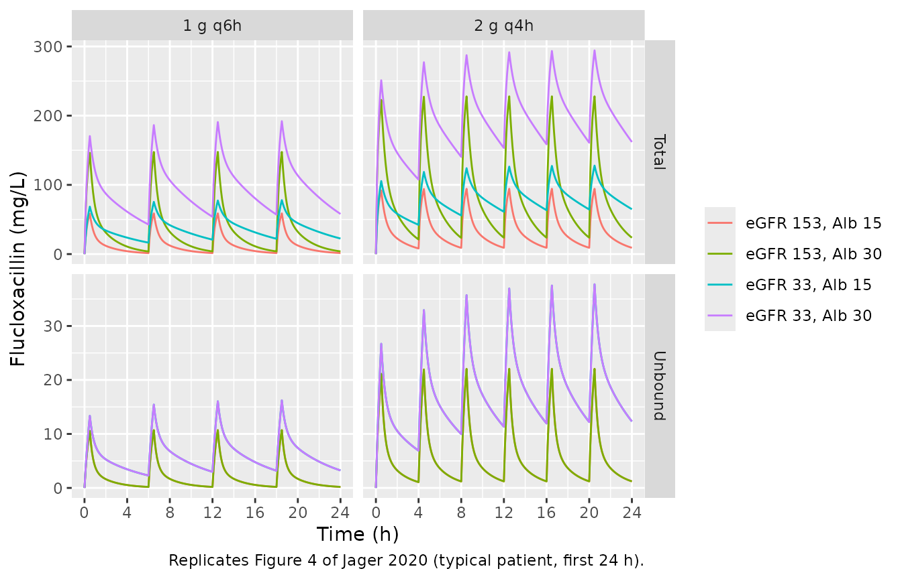
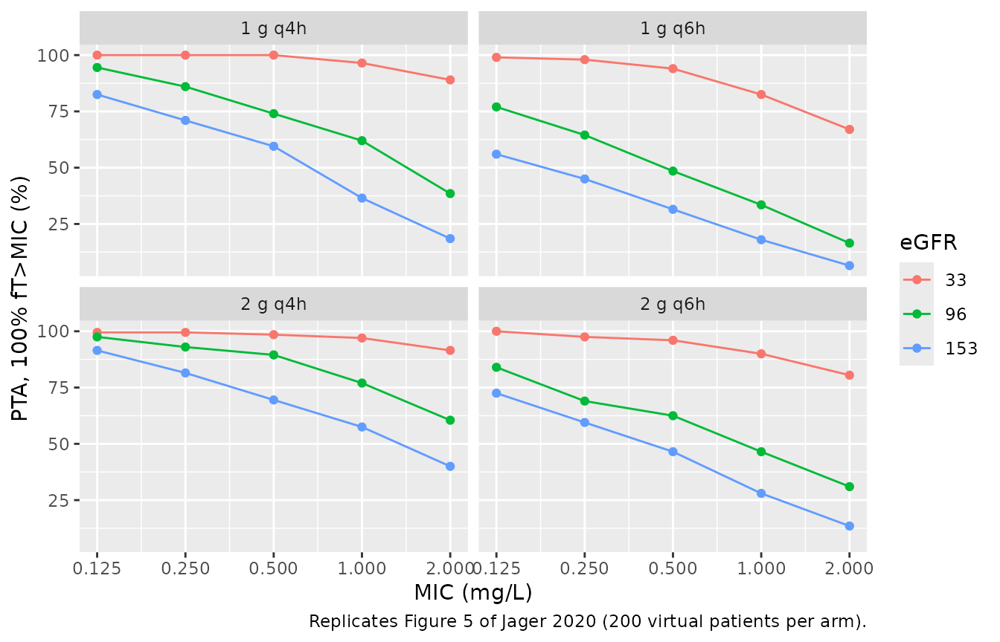

# Flucloxacillin (Jager 2020)

## Model and source

- Citation: Jager NGL, van Hest RM, Xie J, Wong G, Ulldemolins M,
  Bruggemann RJM, Lipman J, Roberts JA. Optimization of flucloxacillin
  dosing regimens in critically ill patients using population
  pharmacokinetic modelling of total and unbound concentrations. J
  Antimicrob Chemother. 2020;75(9):2641-2649. <doi:10.1093/jac/dkaa187>.
  PMCID PMC7443729. Binding equation from main-text Equation 3
  (Supplementary Appendix 2 Equation 1); covariate equations from
  main-text Equations 4-5; parameter estimates from main-text Table 2
  (final model column); unit conversion (flucloxacillin MW 453.9 g/mol)
  and residual-error form from Supplementary Appendix 2.
- Description: Two-compartment joint total/unbound population PK model
  for intravenous flucloxacillin in critically ill adults (Jager 2020).
  The disposition is carried on the UNBOUND concentration Cu =
  central/V1 with linear unbound clearance and linear intercompartmental
  exchange; the measured TOTAL plasma concentration is reconstructed as
  Cc = Cu + Bmax \* Cu / (Kd + Cu), a single saturable binding site
  whose capacity Bmax rises with serum albumin. Total and unbound
  concentrations are BOTH observed endpoints, each with its own additive
  error on the log scale. Unbound clearance carries a power term on
  CKD-EPI eGFR. Inter-individual variability on CL and Bmax.
- Article: <https://doi.org/10.1093/jac/dkaa187> (open access,
  PMC7443729)
- Supplementary data (Appendices 1-3, Figures S1-S3): available with the
  article at JAC Online.

## Population

The model was built from 35 critically ill adults treated with
intermittent intravenous flucloxacillin in the 30-bed ICU of the Royal
Brisbane and Women’s Hospital, Australia. The data were pooled from two
sources: a prospective PK study run in 2009 (10 hypoalbuminaemic
patients, rich sampling of both total and unbound concentrations after
at least 24 h of treatment) and a beta-lactam
therapeutic-drug-monitoring programme run 2012-2014 (25 patients, mostly
paired mid-interval and trough samples; unbound only in 19, total and
unbound in 6). In total 79 total and 104 unbound concentrations were
available (Methods; Results, Patients and samples).

Baseline characteristics (Table 1; median and IQR): 34% female, age 52
years (43-67), total body weight 95 kg (73-120), BMI 31 kg/m^2 (25-35),
SOFA score 8 (5-13), CKD-EPI eGFR 96 (26-166), serum albumin 21 g/L
(15-34); 11% were on renal replacement therapy. Every patient had
albumin below 35 g/L. Doses ranged from 1 g q6h to 2 g q2h as 30-minute
infusions. The observed protein binding was 63.4-97.2% (median 89.4%)
and fell as total concentration rose (Figure 1), the signature of
saturable binding.

The same information is recorded in the model’s `population` metadata.

## Model structure

The paper’s integrated model (Supplementary Appendix 2) runs the
two-compartment PK on the **unbound** drug: CL, V1, V2 and Q are
unbound-referenced, and the unbound central concentration is
`Cu = central / V1`. The total concentration is then the unbound plus
the bound concentration from a single saturable site (Equation 3):

    Ctotal = Cu + Bmax * Cu / (Kd + Cu)

with the binding capacity rising with albumin and unbound clearance
rising with renal function (Equations 4 and 5):

    Bmax (mmol/L) = 0.469 * (Albumin / 20)^1.51
    CL   (L/h)    = 55.4  * (eGFR / 90)^0.809

The fit was performed with every concentration converted to mmol/L
(flucloxacillin MW 453.9 g/mol; Supplementary Appendix 2), so Bmax and
Kd are kept in mmol/L exactly as printed and the model converts with the
same molecular weight: Bmax 0.469 mmol/L is 212.9 mg/L and Kd 0.0441
mmol/L is 20.0 mg/L. Because albumin enters only the bound term, it
moves total but not unbound concentrations – which is precisely what the
paper reports from its own simulations (“Serum albumin concentrations
did not affect unbound concentrations”, Figure 4b and d), and is
verified below.

## Source trace

| Model element | Value | Source |
|----|----|----|
| Two-compartment disposition on unbound drug | – | Results, PK analysis; Supplementary Appendix 2 (structural model) |
| `Ctotal = Cu + Bmax*Cu/(Kd+Cu)` | – | Equation 3; Supplementary Appendix 2 Equation 1 |
| Unit conversion, MW 453.9 g/mol | 453.9 | Supplementary Appendix 2 (structural model) |
| `lcl` (CL at eGFR 90) | 55.4 L/h | Table 2, final model; Equation 5 |
| `lvc` (V1) | 52.7 L | Table 2, final model |
| `lvp` (V2) | 56.8 L | Table 2, final model |
| `lq` (Q) | 67.2 L/h | Table 2, final model |
| `lbmax_pb` (Bmax at albumin 20 g/L) | 0.469 mmol/L | Table 2, final model; Equation 4 |
| `lkd_pb` (Kd) | 0.0441 mmol/L | Table 2, final model |
| `e_alb_bmax_pb` | 1.51 | Table 2 covariates, albumin; Equation 4 |
| `e_crcl_cl` | 0.809 | Table 2 covariates, eGFR; Equation 5 |
| `etalbmax_pb` | 30.4 %CV -\> 0.088384 | Table 2 BPV, final model |
| `etalcl` | 71.6 %CV -\> 0.413876 | Table 2 BPV, final model |
| `expSd` (total) | 0.160 | Table 2 residual variability; Supplementary Appendix 2 (log-additive) |
| `expSd_Cu` (unbound) | 0.222 | Table 2 residual variability; Supplementary Appendix 2 (log-additive) |

## Binding isotherm

``` r

mod <- readModelDb("Jager_2020_flucloxacillin")
mod_typical <- rxode2::zeroRe(mod)
#> ℹ parameter labels from comments will be replaced by 'label()'

mw <- 453.9
bmax_mgL <- function(alb) 0.469 * (alb / 20)^1.51 * mw
kd_mgL <- 0.0441 * mw

binding <- tidyr::expand_grid(ALB = c(15, 21, 34), Cu = c(0.1, 1, 5, 10, 20, 30)) |>
  dplyr::mutate(
    Cb = bmax_mgL(ALB) * Cu / (kd_mgL + Cu),
    Ctot = Cu + Cb,
    pct_bound = 100 * Cb / Ctot
  )

binding |>
  dplyr::mutate(dplyr::across(c(Cb, Ctot, pct_bound), \(x) round(x, 1))) |>
  dplyr::rename(
    "Albumin (g/L)" = ALB,
    "Unbound (mg/L)" = Cu,
    "Bound (mg/L)" = Cb,
    "Total (mg/L)" = Ctot,
    "Protein binding (%)" = pct_bound
  ) |>
  knitr::kable(caption = "Typical-value protein binding across the observed albumin IQR and unbound concentration range.")
```

| Albumin (g/L) | Unbound (mg/L) | Bound (mg/L) | Total (mg/L) | Protein binding (%) |
|--------------:|---------------:|-------------:|-------------:|--------------------:|
|            15 |            0.1 |          0.7 |          0.8 |                87.3 |
|            15 |            1.0 |          6.6 |          7.6 |                86.8 |
|            15 |            5.0 |         27.6 |         32.6 |                84.6 |
|            15 |           10.0 |         45.9 |         55.9 |                82.1 |
|            15 |           20.0 |         68.9 |         88.9 |                77.5 |
|            15 |           30.0 |         82.7 |        112.7 |                73.4 |
|            21 |            0.1 |          1.1 |          1.2 |                91.9 |
|            21 |            1.0 |         10.9 |         11.9 |                91.6 |
|            21 |            5.0 |         45.8 |         50.8 |                90.2 |
|            21 |           10.0 |         76.3 |         86.3 |                88.4 |
|            21 |           20.0 |        114.5 |        134.5 |                85.1 |
|            21 |           30.0 |        137.4 |        167.4 |                82.1 |
|            34 |            0.1 |          2.4 |          2.5 |                95.9 |
|            34 |            1.0 |         22.6 |         23.6 |                95.8 |
|            34 |            5.0 |         94.8 |         99.8 |                95.0 |
|            34 |           10.0 |        158.0 |        168.0 |                94.0 |
|            34 |           20.0 |        237.1 |        257.1 |                92.2 |
|            34 |           30.0 |        284.5 |        314.5 |                90.5 |

Typical-value protein binding across the observed albumin IQR and
unbound concentration range. {.table}

The observed range of protein binding was 63.4-97.2% over unbound
concentrations of 0.1-30 mg/L and albumin of roughly 15-34 g/L (Results,
Protein binding). The typical-value isotherm must fall inside that
envelope over the same domain, must fall with concentration at fixed
albumin (Figure 1) and must rise with albumin at fixed concentration
(Figure 2).

``` r

# Deterministic; no random draws involved.
stopifnot(
  all(binding$pct_bound > 63.4 & binding$pct_bound < 97.2),
  all(tapply(binding$pct_bound, binding$ALB, \(x) all(diff(x) < 0))),
  all(tapply(binding$pct_bound, binding$Cu, \(x) all(diff(x) > 0)))
)
```

The model’s own `Cc` must reproduce the same isotherm. At an unbound
concentration equal to Kd the bound concentration is exactly Bmax / 2.

``` r

# Run a typical patient to steady state and check Cc against the closed-form
# isotherm evaluated at the model's own Cu.
ev_iso <- rxode2::et(amt = 2000, dur = 0.5, cmt = "central", ii = 4, until = 48) |>
  rxode2::et(seq(0, 48, by = 0.25)) |>
  as.data.frame() |>
  dplyr::mutate(CRCL = 96, ALB = 21, dvid = ifelse(evid == 0, 1L, NA_integer_))

sim_iso <- rxode2::rxSolve(mod_typical, ev_iso, omega = NA, sigma = NA,
                           returnType = "data.frame") |>
  dplyr::mutate(Cc_closed = Cu + bmax_mgL(21) * Cu / (kd_mgL + Cu))

stopifnot(max(abs(sim_iso$Cc - sim_iso$Cc_closed) / sim_iso$Cc_closed, na.rm = TRUE) < 1e-8)
```

## Replicating Figure 4: effect of eGFR and albumin

Figure 4 shows typical-patient profiles over the first 24 h of 1 g q6h
and 2 g q4h, for eGFR at the 10th and 90th percentiles (33 and 153)
crossed with albumin at the 10th and 90th percentiles (15 and 30 g/L).

``` r

fig4_grid <- tidyr::expand_grid(
  regimen = c("1 g q6h", "2 g q4h"),
  CRCL = c(33, 153),
  ALB = c(15, 30)
) |>
  dplyr::mutate(id = dplyr::row_number())

make_fig4 <- function(regimen, CRCL, ALB, id) {
  amt <- if (regimen == "1 g q6h") 1000 else 2000
  tau <- if (regimen == "1 g q6h") 6 else 4
  rxode2::et(amt = amt, dur = 0.5, cmt = "central", ii = tau, addl = 24 / tau - 1) |>
    rxode2::et(seq(0, 24, by = 0.1)) |>
    as.data.frame() |>
    dplyr::mutate(id = id, CRCL = CRCL, ALB = ALB, regimen = regimen,
                  dvid = ifelse(evid == 0, 1L, NA_integer_))
}

ev_fig4 <- dplyr::bind_rows(Map(make_fig4, fig4_grid$regimen, fig4_grid$CRCL, fig4_grid$ALB, fig4_grid$id))

sim_fig4 <- rxode2::rxSolve(mod_typical, ev_fig4, omega = NA, sigma = NA,
                            keep = c("regimen", "CRCL", "ALB"),
                            returnType = "data.frame") |>
  dplyr::mutate(scenario = paste0("eGFR ", CRCL, ", Alb ", ALB))

sim_fig4 |>
  dplyr::select(time, regimen, scenario, Total = Cc, Unbound = Cu) |>
  tidyr::pivot_longer(c(Total, Unbound), names_to = "analyte", values_to = "conc") |>
  ggplot(aes(time, conc, colour = scenario)) +
  geom_line() +
  facet_grid(analyte ~ regimen, scales = "free_y") +
  scale_x_continuous(breaks = seq(0, 24, by = 4)) +
  labs(x = "Time (h)", y = "Flucloxacillin (mg/L)", colour = NULL,
       caption = "Replicates Figure 4 of Jager 2020 (typical patient, first 24 h).")
```



``` r

chk4 <- sim_fig4 |>
  dplyr::select(time, regimen, CRCL, ALB, Cc, Cu) |>
  tidyr::pivot_wider(names_from = ALB, values_from = c(Cc, Cu))

stopifnot(
  # Albumin does not change unbound concentrations (Results, Figure 4b/d).
  max(abs(chk4$Cu_15 - chk4$Cu_30)) < 1e-10,
  # ...but a higher albumin raises total concentrations (Figure 4a/c).
  all(chk4$Cc_30[chk4$time > 0] > chk4$Cc_15[chk4$time > 0])
)

# Higher eGFR lowers the 24-h trough, total and unbound, for both regimens.
tr24 <- sim_fig4 |> dplyr::filter(time == 24)
stopifnot(all(
  tapply(seq_len(nrow(tr24)), paste(tr24$regimen, tr24$ALB), function(i) {
    d <- tr24[i, ]
    d$Cu[d$CRCL == 153] < d$Cu[d$CRCL == 33] && d$Cc[d$CRCL == 153] < d$Cc[d$CRCL == 33]
  })
))
```

## PKNCA validation

Unbound flucloxacillin is linear, so over a steady-state interval its
AUC must equal Dose / CL and its terminal half-life must equal ln 2 /
beta, where beta is the slower root of the two-compartment disposition.
The check runs at the three eGFR values the paper used for target
attainment (33, 96 and 153) on 2 g q4h.

``` r

egfr_levels <- c(33, 96, 153)

make_ss_arm <- function(egfr, id) {
  rxode2::et(amt = 2000, dur = 0.5, cmt = "central", ii = 4, until = 96) |>
    rxode2::et(c(0, seq(96, 100, by = 0.05))) |>
    as.data.frame() |>
    dplyr::mutate(id = id, CRCL = egfr, ALB = 21,
                  dvid = ifelse(evid == 0, 2L, NA_integer_),
                  treatment = paste0("eGFR ", egfr))
}

ev_nca <- dplyr::bind_rows(Map(make_ss_arm, egfr_levels, seq_along(egfr_levels)))

sim_nca <- rxode2::rxSolve(mod_typical, ev_nca, omega = NA, sigma = NA,
                           keep = c("treatment", "CRCL"),
                           returnType = "data.frame")

conc_df <- sim_nca |>
  dplyr::filter(!is.na(Cu)) |>
  dplyr::select(id, time, Cu, treatment)

dose_df <- ev_nca |>
  dplyr::filter(evid == 1) |>
  dplyr::select(id, time, amt, treatment)

conc_obj <- PKNCA::PKNCAconc(conc_df, Cu ~ time | treatment + id)
dose_obj <- PKNCA::PKNCAdose(dose_df, amt ~ time | treatment + id)

intervals <- data.frame(start = 96, end = 100, auclast = TRUE, cmax = TRUE,
                        half.life = TRUE)

nca_res <- PKNCA::pk.nca(PKNCA::PKNCAdata(conc_obj, dose_obj, intervals = intervals))
```

``` r

beta_of <- function(cl, vc = 52.7, vp = 56.8, q = 67.2) {
  k10 <- cl / vc; k12 <- q / vc; k21 <- q / vp
  s <- k10 + k12 + k21
  (s - sqrt(s^2 - 4 * k10 * k21)) / 2
}

closed <- tibble::tibble(CRCL = egfr_levels) |>
  dplyr::mutate(
    treatment = paste0("eGFR ", CRCL),
    cl = 55.4 * (CRCL / 90)^0.809,
    auc_closed = 2000 / cl,
    hl_closed = log(2) / beta_of(cl)
  )

nca_wide <- as.data.frame(nca_res) |>
  dplyr::filter(PPTESTCD %in% c("auclast", "cmax", "half.life")) |>
  dplyr::select(treatment, PPTESTCD, PPORRES) |>
  tidyr::pivot_wider(names_from = PPTESTCD, values_from = PPORRES) |>
  dplyr::left_join(closed, by = "treatment") |>
  dplyr::mutate(
    auc_pct = 100 * (auclast - auc_closed) / auc_closed,
    hl_pct = 100 * (half.life - hl_closed) / hl_closed
  ) |>
  dplyr::arrange(CRCL)

nca_wide |>
  dplyr::select(treatment, cmax, auclast, auc_closed, auc_pct, half.life, hl_closed, hl_pct) |>
  dplyr::mutate(dplyr::across(where(is.numeric), \(x) round(x, 2))) |>
  dplyr::rename(
    "Renal stratum" = treatment,
    "Cmax,u (mg/L)" = cmax,
    "PKNCA AUCtau,u (mg*h/L)" = auclast,
    "Dose/CL (mg*h/L)" = auc_closed,
    "AUC difference (%)" = auc_pct,
    "PKNCA t1/2 (h)" = half.life,
    "ln2/beta (h)" = hl_closed,
    "t1/2 difference (%)" = hl_pct
  ) |>
  knitr::kable(caption = "Unbound NCA over a steady-state 2 g q4h interval against the model's closed-form identities.")
```

| Renal stratum | Cmax,u (mg/L) | PKNCA AUCtau,u (mg\*h/L) | Dose/CL (mg\*h/L) | AUC difference (%) | PKNCA t1/2 (h) | ln2/beta (h) | t1/2 difference (%) |
|:---|---:|---:|---:|---:|---:|---:|---:|
| eGFR 33 | 37.93 | 81.28 | 81.29 | 0.00 | 3.36 | 3.42 | -1.58 |
| eGFR 96 | 25.61 | 34.26 | 34.26 | -0.02 | 1.64 | 1.67 | -1.48 |
| eGFR 153 | 22.06 | 23.49 | 23.50 | -0.03 | 1.27 | 1.28 | -1.23 |

Unbound NCA over a steady-state 2 g q4h interval against the model’s
closed-form identities. {.table}

``` r

# Solve against its own closed form: pure numerical error, so a tight bound
# is correct. The half-life bound allows for PKNCA fitting the terminal slope
# over a 4-h interval in which the distribution phase has not fully decayed.
stopifnot(
  all(abs(nca_wide$auc_pct) < 1),
  all(abs(nca_wide$hl_pct) < 10)
)
```

The paper does not tabulate NCA parameters, so the comparison above is
against the model’s own closed form; the published target-attainment
results below are the external check.

## Replicating Figure 5: probability of target attainment

The paper simulated four regimens at eGFR 33, 96 and 153 for a patient
with otherwise median characteristics, and computed the probability that
the unbound concentration stays above the MIC for the whole dosing
interval at t = 24 h (Figure 5). Unbound concentration falls
monotonically after each infusion ends, so this is the unbound
concentration at 24 h, the trough of the last dose of the first day. The
cohort here is 200 virtual patients per regimen-and-eGFR arm (the paper
used 1000).

``` r

rxode2::rxSetSeed(20200416)
n_per_arm <- 200

pta_grid <- tidyr::expand_grid(
  regimen = c("1 g q6h", "1 g q4h", "2 g q6h", "2 g q4h"),
  CRCL = c(33, 96, 153)
) |>
  dplyr::mutate(arm = dplyr::row_number())

make_pta_arm <- function(regimen, CRCL, arm) {
  amt <- if (startsWith(regimen, "1 g")) 1000 else 2000
  tau <- if (endsWith(regimen, "q6h")) 6 else 4
  rxode2::et(amt = amt, dur = 0.5, cmt = "central", ii = tau, addl = 24 / tau - 1) |>
    rxode2::et(24) |>
    rxode2::et(id = seq_len(n_per_arm) + (arm - 1) * n_per_arm) |>
    as.data.frame() |>
    dplyr::mutate(CRCL = CRCL, ALB = 21, regimen = regimen,
                  dvid = ifelse(evid == 0, 2L, NA_integer_))
}

ev_pta <- dplyr::bind_rows(Map(make_pta_arm, pta_grid$regimen, pta_grid$CRCL, pta_grid$arm))

sim_pta <- rxode2::rxSolve(mod, ev_pta, sigma = NA,
                           keep = c("regimen", "CRCL"),
                           returnType = "data.frame")
#> ℹ parameter labels from comments will be replaced by 'label()'

mics <- c(0.125, 0.25, 0.5, 1, 2)

pta <- sim_pta |>
  dplyr::filter(time == 24) |>
  tidyr::crossing(MIC = mics) |>
  dplyr::group_by(regimen, CRCL, MIC) |>
  dplyr::summarise(PTA = 100 * mean(Cu >= MIC), .groups = "drop")

ggplot(pta, aes(MIC, PTA, colour = factor(CRCL))) +
  geom_line() +
  geom_point() +
  scale_x_log10(breaks = mics) +
  facet_wrap(~regimen) +
  labs(x = "MIC (mg/L)", y = "PTA, 100% fT>MIC (%)", colour = "eGFR",
       caption = "Replicates Figure 5 of Jager 2020 (200 virtual patients per arm).")
```



``` r

published <- tibble::tribble(
  ~regimen,  ~CRCL, ~MIC, ~PTA_paper,
  "1 g q6h",  33,   0.5,  91,
  "2 g q4h",  96,   0.5,  87,
  "2 g q4h", 153,   0.5,  71,
  "2 g q4h",  33,   2,    95,
  "2 g q4h",  96,   2,    57,
  "2 g q4h", 153,   2,    36
)

pta_cmp <- published |>
  dplyr::left_join(pta, by = c("regimen", "CRCL", "MIC")) |>
  dplyr::mutate(diff = PTA - PTA_paper)

pta_cmp |>
  dplyr::mutate(PTA = round(PTA, 1), diff = round(diff, 1)) |>
  dplyr::rename(
    "Regimen" = regimen, "eGFR" = CRCL, "MIC (mg/L)" = MIC,
    "Published PTA (%)" = PTA_paper, "Simulated PTA (%)" = PTA,
    "Difference (points)" = diff
  ) |>
  knitr::kable(caption = "Every probability of target attainment the paper prints in its Results, against this simulation.")
```

| Regimen | eGFR | MIC (mg/L) | Published PTA (%) | Simulated PTA (%) | Difference (points) |
|:---|---:|---:|---:|---:|---:|
| 1 g q6h | 33 | 0.5 | 91 | 94.0 | 3.0 |
| 2 g q4h | 96 | 0.5 | 87 | 89.5 | 2.5 |
| 2 g q4h | 153 | 0.5 | 71 | 69.5 | -1.5 |
| 2 g q4h | 33 | 2.0 | 95 | 91.5 | -3.5 |
| 2 g q4h | 96 | 2.0 | 57 | 60.5 | 3.5 |
| 2 g q4h | 153 | 2.0 | 36 | 40.0 | 4.0 |

Every probability of target attainment the paper prints in its Results,
against this simulation. {.table}

The six printed PTAs are the Results-section values (Abstract and
Results, Monte Carlo dosing simulations). With 200 patients per arm the
binomial standard error of a PTA is at most 3.5 points; the bound below
is about four standard errors, wide enough to hold for whatever cohort a
given rxode2 build draws but far tighter than the shift a
mis-transcribed clearance, exponent or variance would cause.

``` r

stopifnot(
  all(abs(pta_cmp$diff) < 15),
  # Paper, Results: MIC 0.25 mg/L on 2 g q4h gives >90% up to eGFR 96 but
  # not at eGFR 153. Asserted with margin on the robust side only.
  pta$PTA[pta$regimen == "2 g q4h" & pta$CRCL == 33 & pta$MIC == 0.25] > 90,
  pta$PTA[pta$regimen == "2 g q4h" & pta$CRCL == 153 & pta$MIC == 0.25] < 95
)
```

## Assumptions and deviations

- **Between-patient variability scale.** Table 2 reports BPV as %CV for
  exponential random effects without stating the conversion. The model
  uses the log-normal identity omega^2 = log(CV^2 + 1) (0.0884 for Bmax,
  0.4139 for CL). The alternative reading omega^2 = CV^2 (0.0924 and
  0.5127) was also simulated during extraction: both reproduce the
  published target-attainment percentages within a few points, so the
  paper cannot discriminate between them.
- **Residual error.** Supplementary Appendix 2 describes an additive
  error on log-transformed data with SDs 0.16 (total) and 0.22
  (unbound), and translates them to 17-18% and 24-25%, which are
  exp(SD) - 1. Table 2 labels the same numbers “proportional error”.
  They are encoded as `lnorm()` SDs.
- **eGFR units.** The paper writes eGFR in mL/min, but it is the CKD-EPI
  creatinine equation, whose native output is mL/min/1.73 m^2, and no
  de-normalization is described. The column is the BSA-normalized
  canonical `CRCL`; supply CKD-EPI values as reported by the laboratory.
- **Albumin extrapolation.** All patients had albumin below 35 g/L; the
  authors caution against using the model above that.
- **Target-attainment simulation.** The paper does not state whether
  residual error was included in its Monte Carlo simulations; the
  replication here uses between-patient variability only (`sigma = NA`),
  which reproduces the published values. The albumin value is irrelevant
  to unbound PTA.
- **Renal replacement therapy.** Four patients were on RRT; RRT was not
  a retained covariate, so the model has no dialysis term.
- **Errata.** No erratum or correction was found for this article
  (Crossref and journal landing page, checked 2026-09-27).
