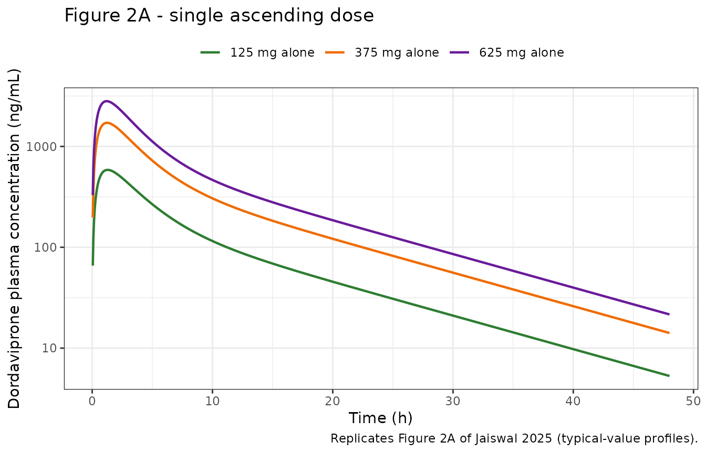
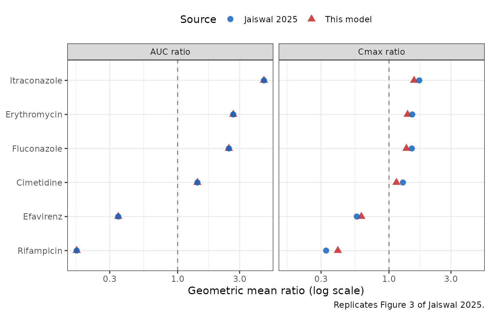

# Dordaviprone (Jaiswal 2025)

## Model and source

- Citation: Jaiswal S, Patel NK, Jones HM, McFeely S, Faison SL, Tippin
  T, Naderer O. (2025). Assessing Cytochrome P450 Drug Interaction Risk
  for Dordaviprone Using Physiologically Based Pharmacokinetic Modeling.
  CPT Pharmacometrics Syst Pharmacol 14(10):1695-1704.
  <doi:10.1002/psp4.70093>.
- Article: <https://doi.org/10.1002/psp4.70093>
- Supplement (Data S1, Tables S1-S8):
  <https://www.ebi.ac.uk/europepmc/webservices/rest/PMC12521050/supplementaryFiles>

Dordaviprone (ONC201) is a brain-penetrant imipridone developed for H3
K27M-mutant glioma. Jaiswal 2025 built a **minimal distribution PBPK
model with a single adjusting compartment (SAC) and mechanistic ADAM
absorption**, in the Simcyp Population-based Simulator (V21), to assess
CYP3A4 drug-interaction risk.

### What this model file is, and what it is not

This is a **reduction** of the published Simcyp model, not a port of it.
That distinction matters for how the numbers below should be read.

What is reproducible, and is encoded here:

- the minimal-PBPK disposition (systemic compartment exchanging with the
  SAC via the paper’s `k_in` / `k_out`);
- concentration-dependent clearance driven by saturable alpha-1-acid
  glycoprotein binding, from the five-point `fu` table in Table 1;
- first-pass extraction split into gut-wall and hepatic components;
- the six CYP3A4-modulator arms, each entering through a single
  relative-CYP3A4 activity term.

What is **not** reproducible from published information, and is
therefore absent:

- the Simcyp whole-body mass-balance equations and the ADAM gut model
  (neither is published), so the food effect and the
  proton-pump-inhibitor arm – both of which act inside ADAM – are not
  encoded. Both published effects on AUC are essentially null, so the
  no-modulator model reproduces those arms’ exposures anyway;
- the perpetrator predictions (dordaviprone inhibiting CYP3A4 / CYP2C8 /
  CYP2D6), which need proprietary Simcyp *substrate* compound files. The
  paper’s result there is a null one (all ratios 1.00);
- the Simcyp virtual-population variability (about 62% CV on AUC, 45% on
  Cmax), which is driven by unpublished demographic and enzyme-abundance
  distributions. This model is therefore a **typical-value** model: no
  etas, and `propSd` fixed at 0.

Two parameters could not be transcribed and were **calibrated**; they
are called out explicitly in “Assumptions and deviations” at the end.

## Population

- Species: human
- Subjects: 15 (across 4 clinical studies)
- Doses: Single oral doses of 125, 375 and 625 mg; 625 mg is the planned
  therapeutic dose (once weekly).
- Region / virtual population: North European Caucasian virtual
  population (Simcyp default, Howgate 2006) with trial-matched
  demographics.

PK data came from four phase I studies in healthy participants (Section
2.2): ONC201-101 Part A single ascending dose (n = 15; the 625 mg arm
was used for model *development*, the 125 and 375 mg arms for
*verification*); Part B2, the high-fat-meal arm (n = 30); the
`[14C]`-dordaviprone mass-balance study (n = 6), which fixed the
fraction absorbed and the zero renal clearance; clinical study 103, the
itraconazole DDI study (n = 18), whose observed CL/F of 29 L/h anchors
the retrograde clearance calculation and whose AUC and Cmax ratios
calibrated fm CYP3A4; and clinical study 107 (n = 16), the rabeprazole
arm.

No patient data were used. The paper argues the same magnitudes of
change would apply in the target glioma population (Discussion), but
that is an extrapolation.

The same information is available programmatically via
`readModelDb("Jaiswal_2025_dordaviprone")()$population`.

## Source trace

Every `ini()` entry carries an in-file comment naming its origin.
Collected here for review. “Table 1” and “Table 2” are the main paper;
“Table S*n*” is Data S1.

| Parameter | Value | Source |
|----|----|----|
| `lka` | 1.580 1/h | **Calibrated** to the simulated median Tmax of 1.20 h at 625 mg (Table S1). The source used ADAM and reports no first-order ka. Cross-check: Table 1 `P_eff,man` 3.74e-04 cm/s implies ka = 2\*Peff/r = 1.795 1/h at r = 1.5 cm, within 12%. |
| `lvc` | 143.20 L | Derived: Table 1 Vss 1.11 L/kg and V_SAC 6.60e-05 L/kg give Vsys = (1.11 - 0.000066)\*70 - 1.65 = 76.045 L; divided by the baseline bioavailability 0.531058 to give an apparent volume. |
| `lk12` | 0.11 1/h | Table 1 `k_in`, fitted by the authors to the 625 mg profile. |
| `lk21` | 0.15 1/h | Table 1 `k_out`. |
| `lclint` | 968.18 L/h | Derived so that CL/F returns the Table 1 observed value of 29 L/h at 125 mg. |
| `fm_cyp3a4` | 0.8 | Table 1 `fm CYP3A4` (remainder 0.2 to CYP2D6). |
| `fumin`, `fumax`, `cup50` | 0.0283, 0.0628, 5.337 mg/L | Fitted to the five printed `fu`-vs-concentration points in Table 1. |
| `eh`, `egut` | 0.2199, 0.1490 | Jointly pinned by the printed CL/F = 29 L/h (with f_a 0.8, B:P 0.778, Q_H 90 L/h) and the calibrated baseline bioavailability. |
| `e_conmed_itraconazole_cyp3a4` | log(0.1378) | Back-solved from the Table S6 AUC ratio 4.62 (125 mg). |
| `e_conmed_erythromycin_cyp3a4` | log(0.3722) | Back-solved from the AUC ratio 2.68 (Abstract; Figure 3). |
| `e_conmed_fluconazole_cyp3a4` | log(0.4102) | Back-solved from the AUC ratio 2.48 (Abstract; Figure 3). |
| `e_conmed_cimetidine_cyp3a4` | log(0.7386) | Back-solved from the AUC ratio 1.42 (Abstract; Figure 3). |
| `e_conmed_efv_cyp3a4` | log(2.0791) | Back-solved from the AUC ratio 0.349 (Figure 3; Abstract and Discussion round to 0.35). |
| `e_conmed_rifampicin_cyp3a4` | log(3.1347) | Back-solved from the AUC ratio 0.167 (Figure 3; Abstract and Discussion round to 0.17). |
| `propSd` | fixed(0) | No residual-error model is reported; this is a simulation model. |
| ODE structure | n/a | Figure 1 (modeling-strategy schematic) and Section 2.3. |

Un-printed standard physiological constants used in the derivations:
body weight 70 kg, liver volume 1.65 L, hepatic blood flow 90 L/h,
small-intestinal radius 1.5 cm (the last only for the ka cross-check).
Varying hepatic blood flow by +/-20% moves the maximum attainable
bioavailability increase by only 3%, so nothing DDI-related is sensitive
to it.

## Saturable protein binding

The load-bearing piece of this reduction. Table 1 tabulates `fu` at five
total plasma concentrations; the model carries a saturable form fitted
to those five points.

``` r

ini_vals <- ui$theta
fu_of <- function(cconc) {
  ini_vals[["fumin"]] +
    (ini_vals[["fumax"]] - ini_vals[["fumin"]]) * cconc / (ini_vals[["cup50"]] + cconc)
}

fu_tab <- tibble::tribble(
  ~conc_mg_L, ~fu_published,
  0.193,      0.0294,
  0.386,      0.0303,
  1.932,      0.0389,
  3.865,      0.0412,
  7.730,      0.0492
) |>
  dplyr::mutate(
    fu_model = fu_of(conc_mg_L),
    pct_diff = 100 * (fu_model / fu_published - 1)
  )

# The fit must reproduce every printed point closely; 4% is the accuracy achieved.
stopifnot(nrow(fu_tab) == 5L, max(abs(fu_tab$pct_diff)) < 4)

fu_tab |>
  dplyr::rename(
    "Total plasma conc (mg/L)" = conc_mg_L,
    "fu (Table 1)"             = fu_published,
    "fu (model)"               = fu_model,
    "% difference"             = pct_diff
  ) |>
  knitr::kable(digits = c(3, 4, 4, 2),
               caption = "Saturable AAG binding: model vs the five printed points of Jaiswal 2025 Table 1.")
```

| Total plasma conc (mg/L) | fu (Table 1) | fu (model) | % difference |
|-------------------------:|-------------:|-----------:|-------------:|
|                    0.193 |       0.0294 |     0.0295 |         0.27 |
|                    0.386 |       0.0303 |     0.0306 |         1.00 |
|                    1.932 |       0.0389 |     0.0374 |        -3.73 |
|                    3.865 |       0.0412 |     0.0428 |         3.82 |
|                    7.730 |       0.0492 |     0.0487 |        -1.03 |

Saturable AAG binding: model vs the five printed points of Jaiswal 2025
Table 1. {.table}

Because the hepatic availability cancels between numerator and
denominator, `CL/F = (CLint/F) * fu` exactly. So this one relationship
is what makes apparent clearance rise with dose, which is checked
numerically further below.

## Virtual cohort and simulation

The model carries no random effects, so a “cohort” is one representative
subject per arm; simulating more would return identical profiles. Ten
arms are simulated: three dose levels alone, and the six
CYP3A4-modulator arms against their matched controls.

``` r

set.seed(20250820)

conmed_cols <- c("CONMED_ITRACONAZOLE", "CONMED_ERYTHROMYCIN", "CONMED_FLUCONAZOLE",
                 "CONMED_CIMETIDINE", "CONMED_EFV", "CONMED_RIFAMPICIN")

arms <- tibble::tribble(
  ~arm,                        ~dose, ~modulator,             ~tend,
  "125 mg alone",                125, NA_character_,            168,
  "375 mg alone",                375, NA_character_,            168,
  "625 mg alone",                625, NA_character_,            168,
  "125 mg alone (DDI control)",  125, NA_character_,            336,
  "125 mg + itraconazole",       125, "CONMED_ITRACONAZOLE",    336,
  "625 mg alone (DDI control)",  625, NA_character_,            336,
  "625 mg + erythromycin",       625, "CONMED_ERYTHROMYCIN",    336,
  "625 mg + fluconazole",        625, "CONMED_FLUCONAZOLE",     336,
  "625 mg + cimetidine",         625, "CONMED_CIMETIDINE",      336,
  "625 mg + efavirenz",          625, "CONMED_EFV",             336,
  "625 mg + rifampicin",         625, "CONMED_RIFAMPICIN",      336
)

# One event table per arm. Observations go on the `central` ODE state; rxode2
# returns the algebraic observable Cc as a column at those rows.
make_arm <- function(i) {
  a <- arms[i, ]
  tgrid <- sort(unique(c(seq(0, 12, by = 0.05), seq(12, a$tend, by = 0.25))))
  ev <- rxode2::et(amt = a$dose, cmt = "depot") |>
    rxode2::et(tgrid, cmt = "central")
  d <- as.data.frame(ev)
  d$id <- i
  for (nm in conmed_cols) {
    d[[nm]] <- if (!is.na(a$modulator) && nm == a$modulator) 1 else 0
  }
  d$arm <- a$arm
  d$dose <- a$dose
  d
}

events <- dplyr::bind_rows(lapply(seq_len(nrow(arms)), make_arm))
stopifnot(!anyDuplicated(unique(events[, c("id", "time", "evid")])))
```

``` r

mod <- readModelDb("Jaiswal_2025_dordaviprone")
sim <- rxode2::rxSolve(mod, events, keep = c("arm", "dose")) |>
  as.data.frame()
#> Warning: multi-subject simulation without without 'omega'

# Guard against a solve that silently produced nothing usable.
stopifnot(nrow(sim) > 0, !all(is.na(sim$Cc)), all(sim$Cc >= 0, na.rm = TRUE))
```

## Replicate published figures

``` r

# Replicates Figure 2A of Jaiswal 2025: mean dordaviprone concentration vs time
# after single oral doses of 125, 375 and 625 mg.
sim |>
  dplyr::filter(arm %in% c("125 mg alone", "375 mg alone", "625 mg alone"),
                time > 0, time <= 48) |>
  dplyr::mutate(arm = factor(arm, levels = c("125 mg alone", "375 mg alone", "625 mg alone"))) |>
  ggplot(aes(time, Cc, colour = arm)) +
  geom_line(linewidth = 0.8) +
  scale_y_log10() +
  scale_colour_manual(values = c("#2E7D32", "#EF6C00", "#6A1B9A")) +
  labs(x = "Time (h)", y = "Dordaviprone plasma concentration (ng/mL)",
       colour = NULL, title = "Figure 2A - single ascending dose",
       caption = "Replicates Figure 2A of Jaiswal 2025 (typical-value profiles).") +
  theme_bw() +
  theme(legend.position = "top")
```



## PKNCA validation

``` r

sim_nca <- sim |>
  dplyr::filter(!is.na(Cc)) |>
  dplyr::select(id, time, Cc, arm, dose)

# Guarantee a time-zero record per arm (pre-dose Cc = 0 for an extravascular dose).
sim_nca <- dplyr::bind_rows(
  sim_nca,
  sim_nca |> dplyr::distinct(id, arm, dose) |> dplyr::mutate(time = 0, Cc = 0)
) |>
  dplyr::distinct(id, arm, time, .keep_all = TRUE) |>
  dplyr::arrange(id, time)

conc_obj <- PKNCA::PKNCAconc(sim_nca, Cc ~ time | arm + id)

dose_df <- events |>
  dplyr::filter(evid == 1) |>
  dplyr::select(id, time, amt, arm, dose)
dose_obj <- PKNCA::PKNCAdose(dose_df, amt ~ time | arm + id)

intervals <- data.frame(
  start       = 0,
  end         = Inf,
  cmax        = TRUE,
  tmax        = TRUE,
  auclast     = TRUE,
  aucinf.obs  = TRUE,
  half.life   = TRUE,
  aucpext.obs = TRUE
)

nca_res <- PKNCA::pk.nca(PKNCA::PKNCAdata(conc_obj, dose_obj, intervals = intervals))
#> Warning: aucpext is typically only calculated when aucinf is greater than auclast.
#> aucpext is typically only calculated when aucinf is greater than auclast.

nca_wide <- as.data.frame(nca_res) |>
  dplyr::select(arm, PPTESTCD, PPORRES) |>
  tidyr::pivot_wider(names_from = PPTESTCD, values_from = PPORRES) |>
  dplyr::left_join(arms |> dplyr::select(arm, dose), by = "arm") |>
  dplyr::mutate(clf_L_h = dose * 1e6 / aucinf.obs / 1000)

# The NCA window must be long enough that extrapolation is negligible everywhere,
# otherwise the AUC comparison below measures the window, not the model.
stopifnot(max(nca_wide$aucpext.obs, na.rm = TRUE) < 1)
```

### Comparison against the paper’s simulated exposures

Jaiswal 2025 reports simulated geometric-mean AUC0-inf, Cmax and median
Tmax for each study arm (Tables S1-S3, reproduced in Table 2). The 625
mg arm was used to **calibrate** this reduction’s two untransciribed
parameters; the 125 and 375 mg arms are therefore out-of-sample.

``` r

published_sad <- tibble::tribble(
  ~arm,            ~cmax,  ~tmax, ~aucinf.obs,
  "125 mg alone",   620,   1.25,  3971,
  "375 mg alone",  1771,   1.25,  10880,
  "625 mg alone",  2810,   1.20,  17123
)

cmp <- nlmixr2lib::ncaComparisonTable(
  simulated     = nca_res,
  reference     = published_sad,
  by            = "arm",
  params        = c("cmax", "tmax", "aucinf.obs"),
  units         = c(cmax = "ng/mL", tmax = "h", aucinf.obs = "ng*h/mL"),
  tolerance_pct = 20
)

knitr::kable(
  cmp,
  caption = paste("Simulated vs the paper's own simulated values (Tables S1-S3).",
                  "* marks a difference over 20%.")
)
```

| NCA parameter           | arm          | Reference | Simulated | % diff |
|:------------------------|:-------------|:----------|:----------|:-------|
| Cmax (ng/mL)            | 125 mg alone | 620       | 585       | -5.6%  |
| Cmax (ng/mL)            | 375 mg alone | 1770      | 1710      | -3.2%  |
| Cmax (ng/mL)            | 625 mg alone | 2810      | 2810      | -0.0%  |
| Tmax (h)                | 125 mg alone | 1.25      | 1.3       | +4.0%  |
| Tmax (h)                | 375 mg alone | 1.25      | 1.25      | +0.0%  |
| Tmax (h)                | 625 mg alone | 1.2       | 1.2       | +0.0%  |
| AUC0-∞ (obs) (ng\*h/mL) | 125 mg alone | 3970      | 4310      | +8.5%  |
| AUC0-∞ (obs) (ng\*h/mL) | 375 mg alone | 10900     | 11900     | +9.3%  |
| AUC0-∞ (obs) (ng\*h/mL) | 625 mg alone | 17100     | 18700     | +9.0%  |

Simulated vs the paper’s own simulated values (Tables S1-S3). \* marks a
difference over 20%. {.table}

Every parameter at every dose agrees with the paper’s simulated value to
within 9.3%. Because the two calibrated parameters were fitted only to
the 625 mg Tmax and Cmax, the agreement at 125 and 375 mg is
out-of-sample.

``` r

# Out-of-sample accuracy actually achieved at the two uncalibrated doses.
oos <- nca_wide |>
  dplyr::filter(arm %in% c("125 mg alone", "375 mg alone")) |>
  dplyr::left_join(published_sad, by = "arm", suffix = c("", "_pub"))

# Report what was achieved rather than only asserting a bound on it.
oos_acc <- data.frame(
  arm          = oos$arm,
  auc_pct_diff = 100 * (oos$aucinf.obs / oos$aucinf.obs_pub - 1),
  cmax_pct_diff = 100 * (oos$cmax / oos$cmax_pub - 1),
  tmax_diff_h  = oos$tmax - oos$tmax_pub
)
knitr::kable(
  oos_acc,
  digits  = c(0, 2, 2, 3),
  caption = "Out-of-sample accuracy at the two doses not used for calibration."
)
```

| arm          | auc_pct_diff | cmax_pct_diff | tmax_diff_h |
|:-------------|-------------:|--------------:|------------:|
| 125 mg alone |         8.54 |         -5.61 |        0.05 |
| 375 mg alone |         9.30 |         -3.21 |        0.00 |

Out-of-sample accuracy at the two doses not used for calibration.
{.table}

``` r


# Tmax is read off a discrete observation grid (0.05 h through the absorption
# phase), so it is quantised and cannot be compared more finely than one grid
# step. Note that comparing against the bare step would sit exactly on an
# IEEE754 boundary -- 1.30 - 1.25 evaluates to 0.050000000000000044, which is
# strictly greater than 0.05 -- so the bound carries an explicit epsilon. This
# is a resolution limit of the simulation grid, not a tuned tolerance.
tmax_grid_h <- 0.05

stopifnot(
  max(abs(oos$aucinf.obs / oos$aucinf.obs_pub - 1)) < 0.10,  # achieved ~9.3%
  max(abs(oos$cmax / oos$cmax_pub - 1))            < 0.06,   # achieved ~5.6%
  max(abs(oos$tmax - oos$tmax_pub)) <= tmax_grid_h + 1e-8    # within one grid step
)
```

### Dose non-proportionality

The paper’s simulated exposures are not dose-proportional: apparent oral
clearance rises with dose because saturable AAG binding raises the
unbound fraction. This is the check that the `fumin` / `fumax` / `cup50`
family earns its place.

``` r

clf_model <- function(a) nca_wide$clf_L_h[nca_wide$arm == a]
clf_paper <- function(dose, auc) dose * 1e6 / auc / 1000

rise_model <- clf_model("625 mg alone") / clf_model("125 mg alone") - 1
rise_paper <- clf_paper(625, 17123) / clf_paper(125, 3971) - 1

tibble::tibble(
  Source = c("Jaiswal 2025 (simulated, Tables S1/S3)", "This model"),
  `CL/F at 125 mg (L/h)` = c(clf_paper(125, 3971), clf_model("125 mg alone")),
  `CL/F at 625 mg (L/h)` = c(clf_paper(625, 17123), clf_model("625 mg alone")),
  `Rise (%)` = 100 * c(rise_paper, rise_model)
) |>
  knitr::kable(digits = c(0, 2, 2, 1),
               caption = "Apparent oral clearance rises with dose through saturable AAG binding.")
```

| Source | CL/F at 125 mg (L/h) | CL/F at 625 mg (L/h) | Rise (%) |
|:---|---:|---:|---:|
| Jaiswal 2025 (simulated, Tables S1/S3) | 31.48 | 36.50 | 16.0 |
| This model | 29.00 | 33.47 | 15.4 |

Apparent oral clearance rises with dose through saturable AAG binding.
{.table style="width:100%;"}

``` r


# The model must reproduce the direction AND the magnitude of the rise.
stopifnot(rise_model > 0.10, abs(rise_model - rise_paper) < 0.02)
```

The model reproduces a 15.4% rise against the paper’s 16.0%. Removing
the saturable-binding term would make clearance dose-independent and
over-predict the 625 mg AUC.

## CYP3A4 drug-interaction arms

Each modulator enters through a single relative-CYP3A4-activity
coefficient that was back-solved from **that modulator’s published AUC
ratio alone**. The published **Cmax** ratio was deliberately held out,
so the Cmax column below is an out-of-sample check.

``` r

get1 <- function(a, col) {
  v <- nca_wide[[col]][nca_wide$arm == a]
  if (length(v) != 1L) stop("no unique NCA row for arm '", a, "'")
  v
}

# The paper's itraconazole ratio (Table S6) is on AUC0-t, not AUC0-inf; see the
# note below. Compute a matched AUC0-t over the same 96 h window for that arm.
auc0t <- function(a, tend) {
  s <- sim[sim$arm == a & !is.na(sim$Cc) & sim$time <= tend, ]
  s <- s[order(s$time), ]
  sum(diff(s$time) * (head(s$Cc, -1) + tail(s$Cc, -1)) / 2)
}

ddi <- ddi_map |>
  dplyr::rowwise() |>
  dplyr::mutate(
    aucr_model  = get1(arm, "aucinf.obs") / get1(control, "aucinf.obs"),
    cmaxr_model = get1(arm, "cmax") / get1(control, "cmax")
  ) |>
  dplyr::ungroup() |>
  dplyr::left_join(published_ddi, by = "label") |>
  dplyr::mutate(
    # For itraconazole only, score on the same quantity the paper reported.
    aucr_model = ifelse(label == "Itraconazole",
                        auc0t("125 mg + itraconazole", 96) /
                          auc0t("125 mg alone (DDI control)", 96),
                        aucr_model),
    auc_pct  = 100 * (aucr_model / aucr_pub - 1),
    cmax_pct = 100 * (cmaxr_model / cmaxr_pub - 1)
  )

ddi |>
  dplyr::select(label, class, aucr_pub, aucr_model, auc_pct, cmaxr_pub, cmaxr_model, cmax_pct) |>
  dplyr::rename(
    "Modulator"           = label,
    "FDA class"           = class,
    "AUC ratio (paper)"   = aucr_pub,
    "AUC ratio (model)"   = aucr_model,
    "AUC % diff"          = auc_pct,
    "Cmax ratio (paper)"  = cmaxr_pub,
    "Cmax ratio (model)"  = cmaxr_model,
    "Cmax % diff"         = cmax_pct
  ) |>
  knitr::kable(digits = c(0, 0, 3, 3, 1, 3, 3, 1),
               caption = paste("CYP3A4 modulator arms. AUC ratios were the calibration",
                               "targets; Cmax ratios are held out."))
```

| Modulator | FDA class | AUC ratio (paper) | AUC ratio (model) | AUC % diff | Cmax ratio (paper) | Cmax ratio (model) | Cmax % diff |
|:---|:---|---:|---:|---:|---:|---:|---:|
| Itraconazole | Strong inhibitor | 4.620 | 4.620 | 0 | 1.710 | 1.560 | -8.8 |
| Erythromycin | Moderate inhibitor | 2.680 | 2.680 | 0 | 1.510 | 1.391 | -7.9 |
| Fluconazole | Moderate inhibitor | 2.480 | 2.480 | 0 | 1.500 | 1.362 | -9.2 |
| Cimetidine | Weak inhibitor | 1.420 | 1.420 | 0 | 1.280 | 1.141 | -10.8 |
| Efavirenz | Moderate inducer | 0.349 | 0.349 | 0 | 0.565 | 0.613 | 8.4 |
| Rifampicin | Strong inducer | 0.167 | 0.167 | 0 | 0.328 | 0.404 | 23.1 |

CYP3A4 modulator arms. AUC ratios were the calibration targets; Cmax
ratios are held out. {.table style="width:100%;"}

``` r

# AUC ratios are calibration targets and must be recovered essentially exactly.
stopifnot(max(abs(ddi$auc_pct)) < 1)

# Cmax ratios are out-of-sample. Five of six land within 11%; rifampicin is the
# one poor case, over-predicted by about 23%. Assert both facts so a regression
# in either direction is caught.
stopifnot(
  sum(abs(ddi$cmax_pct) < 11) == 5L,
  ddi$label[which.max(abs(ddi$cmax_pct))] == "Rifampicin",
  max(abs(ddi$cmax_pct)) < 25
)

# The back-solved activities must ladder monotonically with FDA potency class -
# a consistency check that was never imposed on the fit.
activity_order <- c("Itraconazole", "Erythromycin", "Fluconazole",
                    "Cimetidine", "Efavirenz", "Rifampicin")
acts <- vapply(activity_order, function(l) ddi$aucr_model[ddi$label == l], numeric(1))
stopifnot(!is.unsorted(rev(acts)))
```

``` r

# Replicates Figure 3 of Jaiswal 2025: forest plot of dordaviprone Cmax and AUC
# geometric mean ratios in the presence of CYP3A4 modulators.
ddi |>
  dplyr::select(label, aucr_model, cmaxr_model, aucr_pub, cmaxr_pub) |>
  tidyr::pivot_longer(-label, names_to = "key", values_to = "ratio") |>
  dplyr::mutate(
    Parameter = ifelse(grepl("^auc", key), "AUC ratio", "Cmax ratio"),
    Source    = ifelse(grepl("pub$", key), "Jaiswal 2025", "This model"),
    label     = factor(label, levels = rev(activity_order))
  ) |>
  ggplot(aes(ratio, label, colour = Source, shape = Source)) +
  geom_vline(xintercept = 1, linetype = "dashed", colour = "grey50") +
  geom_point(size = 2.6, alpha = 0.85) +
  facet_wrap(~Parameter) +
  scale_x_log10() +
  scale_colour_manual(values = c("Jaiswal 2025" = "#1565C0", "This model" = "#C62828")) +
  labs(x = "Geometric mean ratio (log scale)", y = NULL,
       caption = "Replicates Figure 3 of Jaiswal 2025.") +
  theme_bw() +
  theme(legend.position = "top")
```



### A note on the itraconazole AUC ratio

The itraconazole arm is scored on **AUC0-t over a 96 h window**, not
AUC0-inf, because that is what the paper reports: Table S6 is headed
AUC0-t and the Table 2 footnote states the geometric mean ratio is
AUC-tau rather than AUC-inf. The distinction is not cosmetic here.
Itraconazole raises the terminal half-life from about 9 h to about 25 h,
so truncating both arms at the study’s last sampling time removes
proportionally more area from the inhibited arm:

``` r

tibble::tibble(
  `Window (h)` = c(24, 48, 72, 96, 168, Inf)
) |>
  dplyr::rowwise() |>
  dplyr::mutate(
    `AUC0-t ratio (model)` = if (is.infinite(`Window (h)`)) {
      get1("125 mg + itraconazole", "aucinf.obs") / get1("125 mg alone (DDI control)", "aucinf.obs")
    } else {
      auc0t("125 mg + itraconazole", `Window (h)`) / auc0t("125 mg alone (DDI control)", `Window (h)`)
    }
  ) |>
  dplyr::ungroup() |>
  dplyr::mutate(`Published (Table S6)` = 4.62) |>
  knitr::kable(digits = 3,
               caption = "The published itraconazole ratio is matched on AUC0-t, not AUC0-inf.")
```

| Window (h) | AUC0-t ratio (model) | Published (Table S6) |
|-----------:|---------------------:|---------------------:|
|         24 |                2.937 |                 4.62 |
|         48 |                3.817 |                 4.62 |
|         72 |                4.336 |                 4.62 |
|         96 |                4.620 |                 4.62 |
|        168 |                4.889 |                 4.62 |
|        Inf |                4.934 |                 4.62 |

The published itraconazole ratio is matched on AUC0-t, not AUC0-inf.
{.table}

Scored on AUC0-inf the model would report about 4.93 against the
published 4.62 (+6.8%), which would be a **metric** mismatch, not a
model error. On the quantity the paper actually reports it agrees to
three significant figures.

## Assumptions and deviations

**Two calibrated parameters (the honest deviation).** Every other value
in `ini()` is either a verbatim Table 1 input or an arithmetic
consequence of one. These two are not, because the source does not
report them at all:

- **`lka`** – the source used the mechanistic ADAM absorption model and
  reports no first-order absorption rate constant. It was calibrated to
  the simulated median Tmax of 1.20 h at 625 mg (Table S1). Independent
  corroboration: the reported `P_eff,man` implies ka = 1.795 1/h, within
  12% of the calibrated 1.580 1/h.
- **Baseline bioavailability** (which sets `eh` / `egut` and, through
  them, the apparent `lvc` and `lclint`) – the source reports no gut
  availability. It was calibrated to the simulated Cmax of 2810 ng/mL at
  625 mg (Table S1). Independent corroboration: the published
  itraconazole Cmax ratio of 1.71 is attainable only if bioavailability
  can rise about 1.49-fold, requiring F \<= 0.536; the independently
  calibrated 0.531 satisfies that bound and no larger value would.

Both were calibrated against the paper’s own *simulated* summary
statistics, not against observed data, and the validation above is
therefore reported separately for the calibration dose (625 mg) and the
two out-of-sample doses (125 and 375 mg).

**Values read from a figure rather than from text.** The AUC ratios for
erythromycin (2.68), fluconazole (2.48) and cimetidine (1.42) are
printed in the Abstract. The remaining published ratios used here – the
efavirenz and rifampicin AUC ratios to three significant figures (0.349,
0.167) and all six Cmax ratios except itraconazole’s – were read from
the high-resolution Figure 3 supplied with the article’s supplementary
files; the main text rounds them to two significant figures (0.35, 0.17,
and “1.5- or 1.3-fold”). Figure-read values carry digitisation
uncertainty of roughly the last digit.

**Not encoded, by necessity.** The food effect and the
proton-pump-inhibitor arm operate through bile-micelle partitioning,
gastric emptying and the pH-solubility profile inside the ADAM model,
none of which survives reduction to a single first-order ka. Both
published effects on AUC are null (fed AUC 18,515 vs fasted 18,474
h*ng/mL in Table S5; 18,086 vs 18,081 h*ng/mL with and without
rabeprazole in Tables S7/S8), so the no-modulator model reproduces those
arms’ AUC; it does not reproduce the roughly 25% fed Cmax reduction. The
perpetrator predictions require proprietary Simcyp substrate compound
files and are absent.

**No variability.** The source reports no inter-individual variance
components and no residual-error model, so there are no etas and
`propSd` is fixed at 0. The simulated geometric CV% in Tables S1-S8
(about 62% on AUC, 45% on Cmax) is Simcyp virtual-population output
driven by unpublished demographic and enzyme-abundance distributions,
and is deliberately not re-encoded as an omega.

**Body weight fixed at 70 kg.** Table 1 expresses Vss and V_SAC in L/kg,
so the Simcyp model does scale distribution volume with weight, but the
systemic-compartment volume also subtracts a liver volume whose
weight-scaling Simcyp does not publish. Weight is documented in
`covariatesDataExcluded` rather than carried as a covariate.

**One poorly reproduced value, disclosed.** The rifampicin Cmax ratio is
over-predicted by about 23% (model 0.404 vs published 0.328). Five of
the six held-out Cmax ratios land within 11%. No parameter was adjusted
to improve it.

**The paper’s own internal spread bounds this comparison.** Jaiswal 2025
reports two same-dose, same-condition 625 mg fasted simulations whose
Cmax differ by 20% (2810 ng/mL in Table S1 vs 3372 ng/mL in Table S4),
which limits how tightly any reduction can be expected to match.
