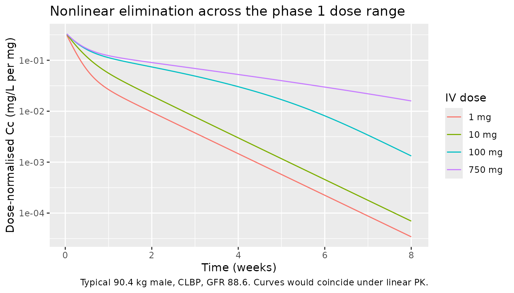
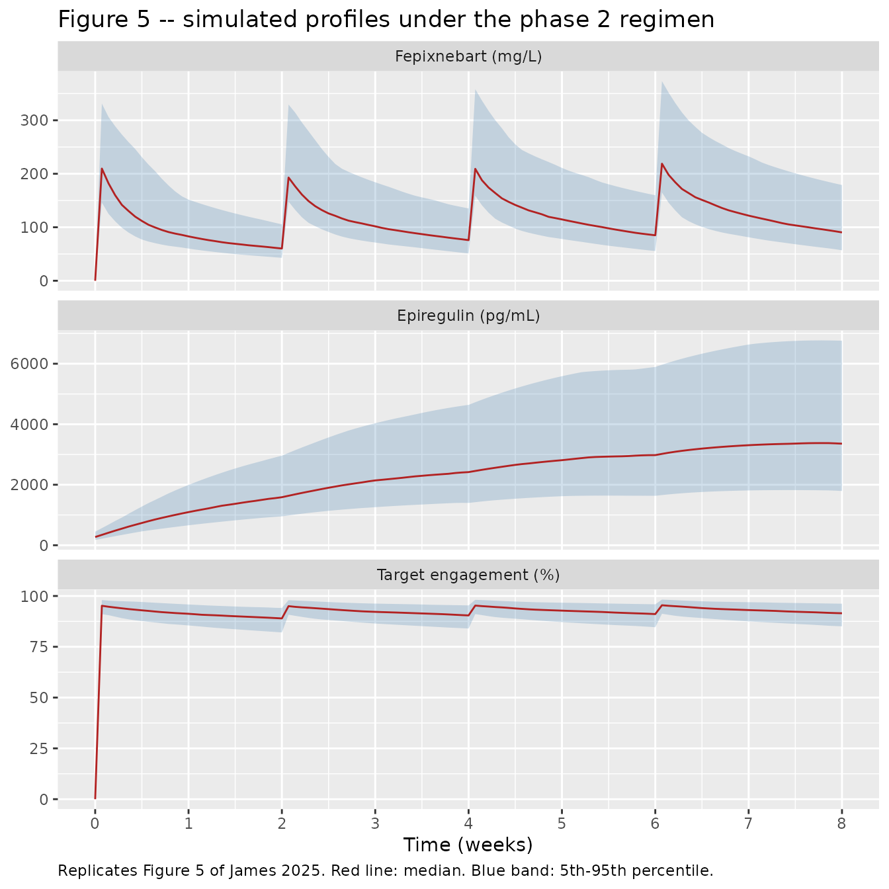

# Fepixnebart and epiregulin (James 2025)

## Model and source

``` r

mod <- readModelDb("James_2025_fepixnebart")
ui  <- rxode2::rxode(mod)
```

- Citation: James DE, Bailey J, van der Walt J-S, Winkler J,
  Schoemaker R. Population pharmacokinetics and pharmacodynamics of
  fepixnebart (LY3016859) and epiregulin in patients with chronic pain.
  Clin Pharmacokinet. 2025;64(5):757-766.
  <doi:10.1007/s40262-025-01506-3>
- Description: Simultaneous population PK/PD model for fepixnebart
  (LY3016859, a humanized IgG4 monoclonal antibody against epiregulin
  and TGF-alpha) and its soluble target epiregulin in adults with
  chronic pain (James 2025): two-compartment IV disposition with
  parallel linear and Michaelis-Menten elimination, an indirect-response
  epiregulin turnover compartment in which fepixnebart inhibits
  epiregulin degradation through a sigmoid Emax (Emax fixed to 1)
  relationship, estimated allometric weight exponents on CL, Q, Vc and
  Vp, sex and glomerular filtration rate on CL, and sex and pain
  indication on Vc. The drug-effect fraction doubles as the predicted
  soluble target engagement.
- Article: <https://doi.org/10.1007/s40262-025-01506-3> (open access, CC
  BY-NC)

Fepixnebart (LY3016859) is a humanized IgG4 monoclonal antibody that
binds epiregulin and TGF-alpha, two EGFR ligands that promote receptor
recycling and persistent EGFR pathway activation. James 2025 fits
fepixnebart concentrations and fepixnebart-bound epiregulin
**simultaneously**, so a single model file carries both endpoints:

- **PK** – two compartments with parallel linear and Michaelis-Menten
  elimination (Eqs. 1-2). The saturable arm stands in for the
  target-mediated disposition seen in the phase 1 studies.
- **PD** – an indirect-response epiregulin turnover pool whose
  *degradation* is inhibited by fepixnebart through a sigmoid Emax
  relationship with `Emax` fixed to 1 (Eq. 3).
- **Target engagement** – the same Hill term, read directly as the
  fraction of soluble epiregulin engaged (Eq. 4). This is the paper’s
  headline deliverable, so it is the quantity this vignette gates on.

## Population

``` r

pop <- ui$population
str(pop, max.level = 1)
#> List of 14
#>  $ species                  : chr "human"
#>  $ n_subjects               : int 386
#>  $ n_studies                : int 3
#>  $ age_range                : chr "20-84 years"
#>  $ age_mean                 : chr "59.4 years"
#>  $ weight_range             : chr "47-148 kg"
#>  $ weight_mean              : chr "90.4 kg"
#>  $ sex_female_pct           : num 53.1
#>  $ disease_state            : chr "Chronic pain: chronic low back pain (n = 149), painful diabetic peripheral neuropathy (n = 124), and osteoarthr"| __truncated__
#>  $ renal_function           : chr "MDRD-6 estimated GFR mean 88.6 mL/min/1.73 m^2, range 52.0-138 (Table 1)."
#>  $ dose_range               : chr "750 mg intravenous loading dose followed by three 500 mg intravenous doses every 2 weeks (4 infusions in total)"| __truncated__
#>  $ n_observations_drug      : int 2444
#>  $ n_observations_epiregulin: int 2436
#>  $ notes                    : chr "Pooled from three 26-week phase 2 proof-of-concept, randomized, double-blind, placebo-controlled studies (NCT04"| __truncated__
```

The analysis pooled 386 participants from 3 26-week phase 2
proof-of-concept studies – osteoarthritis knee pain (NCT04456686, n =
113), painful diabetic peripheral neuropathy (NCT04476108, n = 124) and
chronic low back pain (NCT04529096, n = 149). Participants were
randomized 2:1 to fepixnebart or placebo and received four 1-hour
intravenous infusions two weeks apart: 750 mg followed by three doses of
500 mg. Baseline demographics (James 2025 Table 1, mean (range)): age
59.4 (20-84) years, weight 90.4 (47-148) kg, MDRD-6 estimated GFR 88.6
(52.0-138) mL/min/1.73 m^2, 53.1% female. The combined dataset held 2444
fepixnebart and 2436 epiregulin concentrations.

## Source trace

Every `ini()` entry in
`inst/modeldb/specificDrugs/James_2025_fepixnebart.R` carries an in-file
comment naming its source location. They are collected here for review.

| Equation / parameter | Value as encoded | Source location |
|----|----|----|
| `d/dt(central)`, `d/dt(peripheral1)` | n/a | Eq. 1-2, Sect. 2.4 |
| `d/dt(epiregulin)` | n/a | Eq. 3, Sect. 2.4 |
| `te` (target engagement) | n/a | Eq. 4, Sect. 2.4 |
| allometric form `(WT/70)^theta2` | n/a | Eq. 5, Sect. 2.4; footnote b of Table 3 |
| `lcl` | `log(6.72/1000)` L/h | Table 3: CL = 6.72 mL/h |
| `lvc` | `log(2.42)` L | Table 3: Vc = 2.42 L |
| `lq` | `log(12.7/1000)` L/h | Table 3: Q = 12.7 mL/h |
| `lvp` | `log(2.06)` L | Table 3: Vp = 2.06 L |
| `lvmax` | `log(41.5/1000)` mg/h | Table 3: Vmax = 41.5 ug/h |
| `lkm` | `log(0.966)` mg/L | Table 3: Km = 0.966 mg/L |
| `lec50` | `log(3.42)` mg/L | Table 3: EC50 = 3.42 mg/L |
| `lrbase` | `log(278)` pg/mL | Table 3: baseline epiregulin = 278 pg/mL |
| `lkdeg` | `log(0.0234)` 1/h | Table 3: Kdeg = 0.0234 /h |
| `lhill` | `log(0.723)` | Table 3: Hill factor = 0.723 |
| `lemax` | `fixed(log(1))` | Sect. 2.4: “Emax could therefore be fixed to one” |
| `e_wt_cl`, `e_wt_q`, `e_wt_vc`, `e_wt_vp` | 1.06, 2.81, 0.623, 1.06 | Table 3, allometric-exponent rows |
| `e_crcl_cl` | 0.21 | Table 3 footnote c |
| `e_sexf_cl` | 0.153 | Table 3 footnote c (CLSEX) |
| `e_sexf_vc` | 0.162 | Table 3 footnote d (VCSEX) |
| `e_dpn_vc` | -0.102 | Table 3 footnote d (VCSTUDY, DPNP) |
| `e_oa_vc` | 0.00735 | Table 3 footnote d (VCSTUDY, OA) |
| IIV (9 diagonal etas) | `log(1 + CV^2)` | Table 3 “IIV” column |
| `propSd`, `propSd_Epi` | 0.138, 0.181 | Table 3: RUV LY3016859 / Epiregulin |

## Covariate model reproduces the published fold changes

Table 3 reports each covariate effect twice: as a **fold change** in the
table body, and as the underlying log-scale coefficient in footnotes c
and d. That redundancy is a free, fully deterministic check on the
encoding – the numbers below are read out of the *solved model*, not
recomputed by hand, so a wrong sign, a missing division or a covariate
wired to the wrong parameter shows up immediately.

``` r

# Typical values only: zero the random effects so the ratios below are exact.
mod_typ <- rxode2::zeroRe(mod)

# Solve a single time-zero record for one covariate setting and read back the
# individual cl / vc the model computed.
params_at <- function(WT = 70, SEXF = 0, CRCL = 88, DIS_DPN = 0, DIS_OA = 0) {
  ev <- rxode2::et(amt = 1, dur = 1, cmt = "central") |>
    rxode2::et(c(0, 1)) |>
    as.data.frame()
  ev$dvid    <- ifelse(ev$evid == 0, 1L, NA_integer_)
  ev$WT      <- WT
  ev$SEXF    <- SEXF
  ev$CRCL    <- CRCL
  ev$DIS_DPN <- DIS_DPN
  ev$DIS_OA  <- DIS_OA
  out <- rxode2::rxSolve(mod_typ, ev, omega = NA, returnType = "data.frame")
  c(cl = out$cl[1], vc = out$vc[1])
}

ref <- params_at()
cov_check <- tibble::tribble(
  ~effect,                          ~published, ~model,
  "Sex (female / male) on CL",      1.17,       params_at(SEXF = 1)[["cl"]] / ref[["cl"]],
  "GFR 119 / 65 on CL",             1.23,       params_at(CRCL = 119)[["cl"]] / params_at(CRCL = 65)[["cl"]],
  "Sex (female / male) on Vc",      1.18,       params_at(SEXF = 1)[["vc"]] / ref[["vc"]],
  "DPNP / CLBP on Vc",              0.903,      params_at(DIS_DPN = 1)[["vc"]] / ref[["vc"]],
  "OA / CLBP on Vc",                1.01,       params_at(DIS_OA = 1)[["vc"]] / ref[["vc"]]
) |>
  mutate(abs_diff = abs(model - published))

cov_check |>
  dplyr::rename(
    "Covariate effect"      = effect,
    "Published fold change" = published,
    "Model fold change"     = model,
    "|difference|"          = abs_diff
  ) |>
  knitr::kable(digits = 4,
               caption = "Fold changes read out of the solved model vs James 2025 Table 3.")
```

| Covariate effect | Published fold change | Model fold change | \|difference\| |
|:---|---:|---:|---:|
| Sex (female / male) on CL | 1.170 | 1.1653 | 0.0047 |
| GFR 119 / 65 on CL | 1.230 | 1.2337 | 0.0037 |
| Sex (female / male) on Vc | 1.180 | 1.1759 | 0.0041 |
| DPNP / CLBP on Vc | 0.903 | 0.9030 | 0.0000 |
| OA / CLBP on Vc | 1.010 | 1.0074 | 0.0026 |

Fold changes read out of the solved model vs James 2025 Table 3.
{.table}

``` r


# Deterministic: no cohort, no RNG. The published values are quoted to 3
# significant figures, so 0.01 is pure rounding headroom. A sign error or a
# missing (log(119) - log(65)) divisor moves these by 0.1 or more.
stopifnot(all(cov_check$abs_diff < 0.01))
```

The allometric exponents are checked the same way: doubling body weight
must scale CL by `2^1.06` and Vc by `2^0.623`.

``` r

allo <- c(
  cl = params_at(WT = 140)[["cl"]] / params_at(WT = 70)[["cl"]],
  vc = params_at(WT = 140)[["vc"]] / params_at(WT = 70)[["vc"]]
)
stopifnot(abs(allo[["cl"]] - 2^1.06)  < 1e-6,
          abs(allo[["vc"]] - 2^0.623) < 1e-6)
allo
#>       cl       vc 
#> 2.084932 1.540074
```

## The Michaelis-Menten arm is live

A two-compartment model whose parameters are named `cl` / `vc` / `q` /
`vp` is a shape rxode2 can solve analytically, and an analytic solve
would silently drop the saturable arm. The check below re-solves the
identical event table with `Vmax` driven to zero: if the profiles were
identical, the Michaelis-Menten term would not be reaching the solver.

``` r

cov_typ <- list(WT = 90.4, SEXF = 0, CRCL = 88.6, DIS_DPN = 0, DIS_OA = 0)

phase2_events <- function(ids = 1L) {
  ev <- rxode2::et(amt = 750, dur = 1, cmt = "central", id = ids)
  for (tt in c(336, 672, 1008)) {
    ev <- rxode2::et(ev, amt = 500, dur = 1, cmt = "central", time = tt, id = ids)
  }
  rxode2::et(ev, seq(0, 1344, by = 12), id = ids) |> as.data.frame()
}

ev_typ <- phase2_events()
ev_typ$dvid <- ifelse(ev_typ$evid == 0, 1L, NA_integer_)
for (nm in names(cov_typ)) ev_typ[[nm]] <- cov_typ[[nm]]

sim_typ    <- rxode2::rxSolve(mod_typ, ev_typ, omega = NA, returnType = "data.frame")
sim_no_mm  <- rxode2::rxSolve(mod_typ, ev_typ, omega = NA, returnType = "data.frame",
                              params = c(lvmax = log(1e-9)))

mm_share <- max(abs(sim_no_mm$Cc - sim_typ$Cc) / pmax(sim_typ$Cc, 1e-12))
sprintf("Removing Vmax changes the typical profile by up to %.1f%%.", 100 * mm_share)
#> [1] "Removing Vmax changes the typical profile by up to 3.9%."

# Deterministic. At phase 2 exposures Cc >> Km, so the saturable arm is nearly
# saturated and contributes only a few percent -- but it must contribute
# something, or the ODE is not the one being solved.
stopifnot(mm_share > 0.01)
```

The saturable arm matters far more at the low doses of the phase 1
programme than at the phase 2 dose, which is the nonlinearity the paper
describes. Below, single intravenous doses spanning the phase 1 range
are compared on a dose-normalised basis: with a purely linear model
every curve would coincide.

``` r

dose_levels <- c(1, 10, 100, 750)

single_dose_events <- function(dose, id) {
  ev <- rxode2::et(amt = dose, dur = 1, cmt = "central", id = id) |>
    rxode2::et(seq(0, 1344, by = 6), id = id) |>
    as.data.frame()
  ev$dvid      <- ifelse(ev$evid == 0, 1L, NA_integer_)
  ev$treatment <- sprintf("%g mg", dose)
  for (nm in names(cov_typ)) ev[[nm]] <- cov_typ[[nm]]
  ev
}

ev_dose <- dplyr::bind_rows(
  lapply(seq_along(dose_levels),
         \(i) single_dose_events(dose_levels[i], id = i))
)
stopifnot(!anyDuplicated(unique(ev_dose[, c("id", "time", "evid")])))

sim_dose <- rxode2::rxSolve(mod_typ, ev_dose, omega = NA,
                            keep = c("treatment"), returnType = "data.frame")
#> Warning: multi-subject simulation without without 'omega'

sim_dose |>
  mutate(dose = as.numeric(sub(" mg", "", treatment))) |>
  filter(!is.na(Cc), Cc > 0) |>
  ggplot(aes(time / 168, Cc / dose, colour = treatment)) +
  geom_line() +
  scale_y_log10() +
  labs(x = "Time (weeks)", y = "Dose-normalised Cc (mg/L per mg)",
       colour = "IV dose",
       title = "Nonlinear elimination across the phase 1 dose range",
       caption = "Typical 90.4 kg male, CLBP, GFR 88.6. Curves would coincide under linear PK.")
```



``` r

nca_dose <- sim_dose |>
  dplyr::filter(!is.na(Cc)) |>
  dplyr::mutate(Cc = pmax(Cc, 0)) |>   # clamp far-tail solver noise, not a row filter
  dplyr::select(id, time, Cc, treatment)

dose_df_sd <- ev_dose |>
  dplyr::filter(evid == 1) |>
  dplyr::select(id, time, amt, treatment)

nca_sd <- PKNCA::pk.nca(PKNCA::PKNCAdata(
  PKNCA::PKNCAconc(nca_dose, Cc ~ time | treatment + id,
                   concu = "mg/L", timeu = "h"),
  PKNCA::PKNCAdose(dose_df_sd, amt ~ time | treatment + id, doseu = "mg"),
  intervals = data.frame(start = 0, end = 1344, cmax = TRUE, auclast = TRUE)
))

dose_norm <- as.data.frame(nca_sd) |>
  dplyr::filter(PPTESTCD == "auclast") |>
  dplyr::left_join(dose_df_sd |> dplyr::select(treatment, amt), by = "treatment") |>
  dplyr::mutate(auc_per_mg = PPORRES / amt) |>
  dplyr::arrange(amt)

dose_norm |>
  dplyr::select(treatment, amt, PPORRES, auc_per_mg) |>
  dplyr::rename(
    "Dose group"                  = treatment,
    "Dose (mg)"                   = amt,
    "AUC0-1344h (mg*h/L)"         = PPORRES,
    "Dose-normalised (mg*h/L/mg)" = auc_per_mg
  ) |>
  knitr::kable(digits = c(0, 0, 1, 4),
               caption = "Dose-normalised exposure rises with dose as the saturable arm is overwhelmed.")
```

| Dose group | Dose (mg) | AUC0-1344h (mg\*h/L) | Dose-normalised (mg\*h/L/mg) |
|:-----------|----------:|---------------------:|-----------------------------:|
| 1 mg       |         1 |                 20.4 |                      20.4495 |
| 10 mg      |        10 |                323.7 |                      32.3737 |
| 100 mg     |       100 |               6918.0 |                      69.1801 |
| 750 mg     |       750 |              69739.5 |                      92.9860 |

Dose-normalised exposure rises with dose as the saturable arm is
overwhelmed. {.table}

``` r


# Deterministic (typical values, no RNG): strict monotonicity is the right
# assertion here. Super-proportionality is the qualitative claim in Sect. 3.3
# and the reason the Michaelis-Menten arm is in the model at all.
stopifnot(all(diff(dose_norm$auc_per_mg) > 0))
```

## Virtual cohort

Individual data are not public. The cohort below reproduces the James
2025 Table 1 marginal distributions: weight and GFR are drawn normal
with the published means and truncated to the published ranges, sex is
Bernoulli at 53.1% female, and pain indication is allocated in the
published 149:124:113 ratio. Correlations between covariates are not
published and are therefore not imposed.

``` r

# set.seed() seeds R's RNG (used for the covariate draws below). It does NOT
# seed rxode2's IIV sampler, whose streams are partitioned per solver thread --
# so the etas differ between a 2-core CI runner and a 16-thread workstation.
# Every assertion downstream is written to hold for any cohort this model can
# produce.
set.seed(20250423)
rxode2::rxSetSeed(20250423)

n_cohort <- 150L
indication <- sample(rep(c("CLBP", "DPNP", "OA"),
                         times = round(n_cohort * c(149, 124, 113) / 386)))
n_cohort <- length(indication)

subjects <- tibble::tibble(
  id         = seq_len(n_cohort),
  WT         = pmin(pmax(rnorm(n_cohort, 90.4, 20), 47), 148),
  SEXF       = rbinom(n_cohort, 1, 0.531),
  CRCL       = pmin(pmax(rnorm(n_cohort, 88.6, 17), 52), 138),
  treatment  = indication,
  DIS_DPN    = as.integer(indication == "DPNP"),
  DIS_OA     = as.integer(indication == "OA")
)

events <- phase2_events(ids = subjects$id) |>
  dplyr::left_join(subjects, by = "id")
events$dvid <- ifelse(events$evid == 0, 1L, NA_integer_)
stopifnot(!anyDuplicated(unique(events[, c("id", "time", "evid")])))
```

## Simulation

``` r

sim <- rxode2::rxSolve(mod, events = events,
                       keep = c("treatment", "WT", "SEXF", "CRCL"),
                       returnType = "data.frame")
```

## Replicate Figure 5

Figure 5 of James 2025 shows the median and 5th-95th percentile band of
simulated fepixnebart concentration (panel a), epiregulin concentration
(panel b) and target engagement (panel c) under the phase 2 regimen.

``` r

fig5 <- sim |>
  dplyr::filter(!is.na(Cc)) |>
  dplyr::select(id, time, Cc, Epi, te) |>
  dplyr::mutate(`Target engagement (%)` = 100 * te,
                `Fepixnebart (mg/L)`    = Cc,
                `Epiregulin (pg/mL)`    = Epi) |>
  tidyr::pivot_longer(
    c(`Fepixnebart (mg/L)`, `Epiregulin (pg/mL)`, `Target engagement (%)`),
    names_to = "panel", values_to = "value") |>
  dplyr::mutate(panel = factor(panel, levels = c(
    "Fepixnebart (mg/L)", "Epiregulin (pg/mL)", "Target engagement (%)"))) |>
  dplyr::group_by(panel, time) |>
  dplyr::summarise(Q05 = quantile(value, 0.05),
                   Q50 = median(value),
                   Q95 = quantile(value, 0.95),
                   .groups = "drop")

ggplot(fig5, aes(time / 168, Q50)) +
  geom_ribbon(aes(ymin = Q05, ymax = Q95), fill = "steelblue", alpha = 0.25) +
  geom_line(colour = "firebrick") +
  facet_wrap(~panel, ncol = 1, scales = "free_y") +
  scale_x_continuous(breaks = seq(0, 8, by = 1)) +
  labs(x = "Time (weeks)", y = NULL,
       title = "Figure 5 -- simulated profiles under the phase 2 regimen",
       caption = paste("Replicates Figure 5 of James 2025. Red line: median.",
                       "Blue band: 5th-95th percentile.")) +
  theme(plot.caption = element_text(hjust = 0))
```



## Target engagement at week 8

This is the paper’s primary deliverable. James 2025 Sect. 3.4 reports a
median target engagement of **92.0%** two weeks after the final dose,
with 90% of predictions between **86.0%** and **96.2%**, and **68.5%**
of subjects above 90%.

``` r

# Deterministic arm first: the typical subject carries no RNG at all.
te_typical <- 100 * sim_typ$te[which.min(abs(sim_typ$time - 1344))]
sprintf("Typical-subject target engagement at week 8: %.1f%% (paper median 92.0%%)",
        te_typical)
#> [1] "Typical-subject target engagement at week 8: 92.2% (paper median 92.0%)"

# No cohort, no random effects -- a 1.5-point window is rounding headroom on a
# value the paper quotes to one decimal. A mis-transcribed EC50 or Hill factor
# moves this by 5-20 points.
stopifnot(abs(te_typical - 92.0) < 1.5)
```

``` r

week8 <- sim |>
  dplyr::filter(abs(time - 1344) < 1e-6) |>
  dplyr::mutate(te_pct = 100 * te)

te_tab <- tibble::tribble(
  ~statistic,                 ~published, ~simulated,
  "Median target engagement (%)",  92.0, median(week8$te_pct),
  "5th percentile (%)",            86.0, unname(quantile(week8$te_pct, 0.05)),
  "95th percentile (%)",           96.2, unname(quantile(week8$te_pct, 0.95)),
  "Subjects above 90% (%)",        68.5, 100 * mean(week8$te_pct > 90)
) |>
  dplyr::mutate(difference = simulated - published)

te_tab |>
  dplyr::rename("Statistic"        = statistic,
                "James 2025"       = published,
                "This simulation"  = simulated,
                "Difference"       = difference) |>
  knitr::kable(digits = 1,
               caption = "Week-8 target engagement: simulated cohort vs James 2025 Sect. 3.4.")
```

| Statistic                    | James 2025 | This simulation | Difference |
|:-----------------------------|-----------:|----------------:|-----------:|
| Median target engagement (%) |       92.0 |            91.5 |       -0.5 |
| 5th percentile (%)           |       86.0 |            85.1 |       -0.9 |
| 95th percentile (%)          |       96.2 |            96.2 |        0.0 |
| Subjects above 90% (%)       |       68.5 |            64.0 |       -4.5 |

Week-8 target engagement: simulated cohort vs James 2025 Sect. 3.4.
{.table}

``` r


# Cohort-derived, so the bounds must survive a different draw on a different
# thread count. Each is several times the between-draw spread and each still
# goes red on a real transcription error: halving EC50 lifts the median past
# 95%, and dropping the Hill factor to 1 moves the 5th percentile by >10
# points. Note the published interval comes from empirical-Bayes estimates
# (shrunken), whereas this cohort samples the full OMEGA, so the simulated
# band is expected to be slightly the wider of the two -- see Errata.
stopifnot(
  abs(te_tab$difference[te_tab$statistic == "Median target engagement (%)"]) < 3,
  abs(te_tab$difference[te_tab$statistic == "5th percentile (%)"])           < 6,
  abs(te_tab$difference[te_tab$statistic == "95th percentile (%)"])          < 3,
  abs(te_tab$difference[te_tab$statistic == "Subjects above 90% (%)"])       < 15
)
```

## PKNCA validation

James 2025 reports no non-compartmental parameters, so PKNCA is used
here for two purposes: to summarise the simulated exposure by pain
indication, and to supply an independent steady-state mass-balance check
on the model.

### Exposure over the final dosing interval, by indication

``` r

nca_conc <- sim |>
  dplyr::filter(!is.na(Cc)) |>
  dplyr::select(id, time, Cc, treatment)

nca_dose_df <- events |>
  dplyr::filter(evid == 1) |>
  dplyr::select(id, time, amt, treatment)

nca_res <- PKNCA::pk.nca(PKNCA::PKNCAdata(
  PKNCA::PKNCAconc(nca_conc, Cc ~ time | treatment + id,
                   concu = "mg/L", timeu = "h"),
  PKNCA::PKNCAdose(nca_dose_df, amt ~ time | treatment + id, doseu = "mg"),
  # Final dosing interval: dose 4 at 1008 h, interval end at 1344 h. `cmin`
  # rather than `ctrough` -- PKNCA's `ctrough` is the concentration before the
  # NEXT dose and is NA when there is no next dose, whereas for an intravenous
  # infusion the profile declines monotonically after the end of infusion, so
  # the interval minimum IS the trough.
  intervals = data.frame(start = 1008, end = 1344,
                         cmax = TRUE, tmax = TRUE, auclast = TRUE,
                         cav = TRUE, cmin = TRUE)
))

as.data.frame(nca_res) |>
  dplyr::group_by(treatment, PPTESTCD) |>
  dplyr::summarise(median = median(PPORRES),
                   p05    = quantile(PPORRES, 0.05),
                   p95    = quantile(PPORRES, 0.95),
                   .groups = "drop") |>
  tidyr::pivot_longer(c(median, p05, p95)) |>
  tidyr::pivot_wider(names_from = PPTESTCD, values_from = value) |>
  dplyr::rename("Indication"            = treatment,
                "Statistic"             = name,
                "AUC1008-1344h (mg*h/L)" = auclast,
                "Cav (mg/L)"            = cav,
                "Cmax (mg/L)"           = cmax,
                "Cmin (mg/L)"           = cmin,
                "Tmax (h)"              = tmax) |>
  knitr::kable(digits = 1,
               caption = "Simulated NCA over the final dosing interval, by pain indication.")
```

| Indication | Statistic | AUC1008-1344h (mg\*h/L) | Cav (mg/L) | Cmax (mg/L) | Cmin (mg/L) | Tmax (h) |
|:---|:---|---:|---:|---:|---:|---:|
| CLBP | median | 42395.0 | 126.2 | 215.8 | 84.5 | 12 |
| CLBP | p05 | 29610.6 | 88.1 | 164.2 | 55.7 | 12 |
| CLBP | p95 | 65853.4 | 196.0 | 301.6 | 133.7 | 12 |
| DPNP | median | 44694.9 | 133.0 | 237.9 | 83.5 | 12 |
| DPNP | p05 | 29388.1 | 87.5 | 165.6 | 54.1 | 12 |
| DPNP | p95 | 92955.3 | 276.7 | 412.6 | 172.1 | 12 |
| OA | median | 45254.6 | 134.7 | 213.5 | 86.7 | 12 |
| OA | p05 | 29313.4 | 87.2 | 166.6 | 57.0 | 12 |
| OA | p95 | 81248.3 | 241.8 | 386.9 | 167.2 | 12 |

Simulated NCA over the final dosing interval, by pain indication.
{.table}

### Steady-state mass balance

At steady state the mass eliminated over one dosing interval must equal
the dose:

`CL * AUCtau + integral over tau of Vmax*Cc/(Km + Cc) = Dose`

That identity is exact, closed-form, and has no cohort and no RNG in it,
so it is checked directly below. It also pins the linear-only limit from
above – with the saturable arm removing real mass, `AUCtau` must sit
strictly *below* `Dose / CL`.

``` r

tau <- 336
ev_ss <- rxode2::et(amt = 500, dur = 1, cmt = "central", ii = tau, ss = 1) |>
  rxode2::et(seq(0, tau, by = 2)) |>
  as.data.frame()
ev_ss$dvid      <- ifelse(ev_ss$evid == 0, 1L, NA_integer_)
ev_ss$treatment <- "500 mg q2w, steady state"
for (nm in names(cov_typ)) ev_ss[[nm]] <- cov_typ[[nm]]

sim_ss <- rxode2::rxSolve(mod_typ, ev_ss, omega = NA,
                          keep = c("treatment"), returnType = "data.frame")

nca_ss <- PKNCA::pk.nca(PKNCA::PKNCAdata(
  PKNCA::PKNCAconc(sim_ss |> dplyr::filter(!is.na(Cc)) |>
                     dplyr::mutate(id = 1L) |>
                     dplyr::select(id, time, Cc, treatment),
                   Cc ~ time | treatment + id, concu = "mg/L", timeu = "h"),
  PKNCA::PKNCAdose(data.frame(id = 1L, treatment = "500 mg q2w, steady state",
                              time = 0, amt = 500),
                   amt ~ time | treatment + id, doseu = "mg"),
  intervals = data.frame(start = 0, end = tau,
                         cmax = TRUE, auclast = TRUE, cmin = TRUE)
))

nca_ss_df <- as.data.frame(nca_ss)
auc_ss    <- nca_ss_df$PPORRES[nca_ss_df$PPTESTCD == "auclast"]
cl_typ    <- sim_ss$cl[1]
auc_lin   <- 500 / cl_typ

# Mass removed by the saturable arm over the interval, integrated with PKNCA's
# own AUC routine rather than an inline trapezoid. vmax and km are read back
# from the solved model, not re-entered by hand.
obs_ss  <- sim_ss[!is.na(sim_ss$Cc), ]
mm_rate <- obs_ss$vmax * obs_ss$Cc / (obs_ss$km + obs_ss$Cc)   # mg/h
mm_mass <- PKNCA::pk.calc.auc.last(conc = mm_rate, time = obs_ss$time)
lin_mass <- cl_typ * auc_ss

tibble::tibble(
  quantity = c("AUCtau from PKNCA (mg*h/L)",
               "Dose / CL, linear arm only (mg*h/L)",
               "Ratio AUCtau / (Dose / CL)",
               "Mass cleared by the linear arm, CL * AUCtau (mg)",
               "Mass cleared by the saturable arm (mg)",
               "Total mass cleared per interval (mg; dose = 500)"),
  value    = c(auc_ss, auc_lin, auc_ss / auc_lin,
               lin_mass, mm_mass, lin_mass + mm_mass)
) |>
  dplyr::rename("Quantity" = quantity, "Value" = value) |>
  knitr::kable(digits = c(0, 2),
               caption = "Steady-state mass balance for a typical 90.4 kg male.")
```

| Quantity                                          |    Value |
|:--------------------------------------------------|---------:|
| AUCtau from PKNCA (mg\*h/L)                       | 54946.15 |
| Dose / CL, linear arm only (mg\*h/L)              | 56603.25 |
| Ratio AUCtau / (Dose / CL)                        |     0.97 |
| Mass cleared by the linear arm, CL \* AUCtau (mg) |   485.36 |
| Mass cleared by the saturable arm (mg)            |    13.86 |
| Total mass cleared per interval (mg; dose = 500)  |   499.22 |

Steady-state mass balance for a typical 90.4 kg male. {.table}

``` r


# Deterministic (typical values, ss = 1). The 2% window is discretisation
# headroom on the 2-hour grid across the 1-hour infusion peak; the realised
# residual is ~0.2%. Both assertions still go red on a real defect: if the
# saturable arm were dropped by an analytic solve, CL * AUCtau alone would
# account for the whole 500 mg and the total would overshoot by ~2.8%, and
# auc_ss would equal auc_lin rather than sit below it.
stopifnot(abs((lin_mass + mm_mass) / 500 - 1) < 0.02,
          auc_ss < auc_lin)
```

## Assumptions and deviations

- **Interindividual variability read as %CV.** James 2025 Table 3
  reports IIV as a bare percentage with no scale stated in the legend,
  so it is encoded as the coefficient of variation of a log-normal
  random effect (`omega^2 = log(1 + CV^2)`). The alternative reading –
  that the percentage *is* the log-scale standard deviation – changes
  each omega by at most 0.02 at these magnitudes (the largest, 27.0%,
  gives 0.265 under the CV reading against 0.270 under the SD reading),
  which is immaterial for every quantity gated above.
- **Diagonal OMEGA.** The paper reports no off-diagonal elements, so the
  nine etas are uncorrelated here. Real mAb models almost always carry a
  CL-Vc correlation; its absence widens the simulated exposure spread
  slightly relative to the true model.
- **The published week-8 interval is empirical-Bayes-based.** Sect. 2.7
  states that the simulated profiles used “individual empirical Bayes
  estimates of the PK and PKPD parameters”. EBEs are shrunken toward the
  typical value – and the shrinkage on EC50 (65.7%) and Km (76.4%) is
  substantial – so the paper’s 86.0-96.2% band is narrower than a band
  drawn from the full OMEGA. This vignette samples the full OMEGA, which
  is the reproducible choice for a packaged model, and the resulting
  band is correspondingly a little wider.
- **Covariate correlations are not imposed.** Weight, sex, GFR and
  indication are drawn independently because the paper publishes only
  marginal distributions (Table 1). In the real cohort weight and sex
  are correlated, which would slightly narrow the simulated exposure
  spread.
- **The OA effect on Vc is a null effect and is retained anyway.**
  `e_oa_vc = 0.00735` has a 408.2% RSE in Table 3. It is encoded because
  the paper retained the whole three-level indication term through
  backward deletion, not because the OA level is individually
  informative. Users comparing osteoarthritis with chronic low back pain
  should treat the 1.01 fold change as indistinguishable from 1.
- **Age and anti-drug antibodies are documented but not modelled.** Both
  were screened (Table 2, runs 301/307/312 and 304/315) and neither met
  the p \< 0.001 backward-deletion criterion, so they appear in
  `covariatesDataExcluded` rather than `covariateData`. The ADA result
  is a genuine negative rather than a power problem: 70 of 255
  fepixnebart-treated participants seroconverted and 69 of those were
  neutralizing (Sect. 3.2).
- **The estimated allometric exponent on Q is 2.81.** This is far
  outside the theoretical value of 0.75 and is retained as published
  (Table 3, RSE 27.7%). Q is the least well-determined disposition
  parameter in the model – it is the only one without IIV – and users
  extrapolating to body weights outside the fitted 47-148 kg range
  should be aware that this term moves distribution very steeply.
- **`epiregulin` is a paper-specific compartment.** The state is
  declared via `paper_specific_compartments` rather than promoted to a
  canonical compartment name; a second soluble-EGFR-ligand turnover
  model would be the trigger to revisit.
- **No non-paper-derived parameter values.** Every `ini()` entry traces
  to James 2025 Table 3 or Sect. 2.4. No supplement was needed: the
  EuropePMC supplementary bundle for PMC12064609 contains only the
  figure and equation images, and EuropePMC reports no correction or
  erratum for this DOI.
