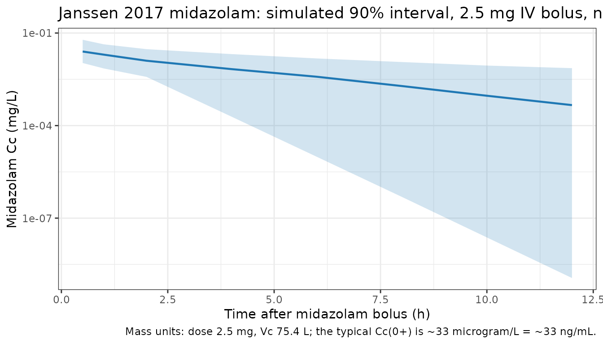
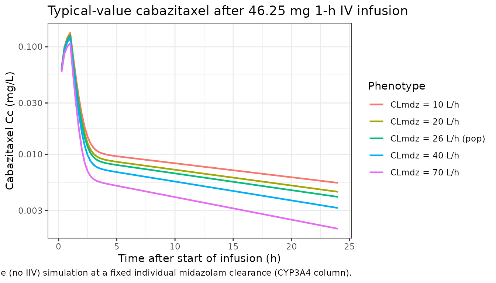

# Cabazitaxel + midazolam metabolic phenotyping (Janssen 2017)

## Models and source

Janssen 2017 fits two pharmacokinetic models on a single
proof-of-concept cohort of 10 men with metastatic castration-resistant
prostate cancer:

- A one-compartment intravenous PK model for **midazolam** (Table 2A)
  given as a 2.5 mg single IV bolus as a CYP3A phenotyping probe.
- A two-compartment intravenous PK model for **cabazitaxel** (Table 2B,
  “Metabolic phenotype model”) with each patient’s individual midazolam
  clearance entering as a linear covariate on cabazitaxel clearance per
  Equation (1) of the paper.

Per the `extract-literature-model` skill’s replicate-author-structure
default, the two independent fits are extracted as **two separate model
files** sharing this single vignette:

- `modellib("Janssen_2017_midazolam")` — 1-cmt IV midazolam popPK (Table
  2A).

- `modellib("Janssen_2017_cabazitaxel")` — 2-cmt IV cabazitaxel popPK
  with the CYP3A4 covariate (Table 2B “Metabolic phenotype model”).

- Article: <https://doi.org/10.1038/bjc.2017.91>

- Citation (midazolam): Janssen A, Verkleij CPM, van der Vlist A,
  Mathijssen RHJ, Bloemendal HJ, ter Heine R (2017). Towards better dose
  individualisation: metabolic phenotyping to predict cabazitaxel
  pharmacokinetics in men with prostate cancer. Br J Cancer
  116(10):1312-1317. <doi:10.1038/bjc.2017.91>.

- Citation (cabazitaxel): Janssen A, Verkleij CPM, van der Vlist A,
  Mathijssen RHJ, Bloemendal HJ, ter Heine R (2017). Towards better dose
  individualisation: metabolic phenotyping to predict cabazitaxel
  pharmacokinetics in men with prostate cancer. Br J Cancer
  116(10):1312-1317. <doi:10.1038/bjc.2017.91>. The CYP3A4 covariate
  column carries the individual midazolam clearance produced by the
  companion model; see modellib(‘Janssen_2017_midazolam’).

## Population

Ten men with metastasised castration-resistant prostate cancer who were
already scheduled to receive cabazitaxel 25 mg/m^2 as routine palliative
care at Meander Medical Center (Amersfoort, The Netherlands). All
patients had previously received docetaxel. Median age 67 years (range
65-77); median body surface area (DuBois-DuBois) 1.95 m^2 (range
1.76-2.34); median absolute cabazitaxel dose 46.25 mg (range 38-50).
Hepatic function (bilirubin) was not decreased in any patient (Table 1).

For phenotyping, each patient received a single 2.5 mg IV bolus of
midazolam 1-7 days before chemotherapy (Methods). Midazolam plasma
samples were drawn at 0, 30, 60, 120, 240, and 360 min post-injection;
cabazitaxel plasma samples at 0, 30, 60, 120, 240, 360, and 600 min
post-infusion plus a single 24-hour sample. Bioanalysis by validated
LC-MS/MS (LOQ 0.4 ng/mL for midazolam; 1 ng/mL for cabazitaxel).

Estimation used NONMEM V7.3.0 with first-order conditional estimation
with interaction. Visual predictive checks (1000 simulations) and
empirical Bayes shrinkage were used to evaluate the models (Methods).

The same information is available programmatically as
`rxode2::rxode2(readModelDb("Janssen_2017_cabazitaxel"))$population`.

## Source trace

The per-parameter origin is recorded as an in-file comment next to each
`ini()` entry in `inst/modeldb/specificDrugs/Janssen_2017_midazolam.R`
and `inst/modeldb/specificDrugs/Janssen_2017_cabazitaxel.R`. The table
below collects them in one place for review.

| Model | Parameter | Value | Source location |
|----|----|----|----|
| midazolam | `lcl` (CLmdz, L/h) | 26.0 | Table 2A (RSE 25.0%) |
| midazolam | `lvc` (V3, L) | 75.4 | Table 2A (RSE 24.8%) |
| midazolam | `etalcl` (omega^2) | 0.42907 (= log(1 + 0.732^2)) | Table 2A IIV CLmdz 73.2% CV |
| midazolam | `etalvc` (omega^2) | 0.46846 (= log(1 + 0.773^2)) | Table 2A IIV V3 77.3% CV |
| midazolam | `propSd` | 0.354 | Table 2A residual error 35.4% CV |
| cabazitaxel | `lcl` (CLbase at CLmdz=26 L/h) | 119 | Table 2B metab-phenotype (RSE 29.6%) |
| cabazitaxel | `lvc` (V1, L) | 142 | Table 2B metab-phenotype (RSE 35.1%) |
| cabazitaxel | `lvp` (V2, L) | 2090 | Table 2B metab-phenotype (RSE 30.2%) |
| cabazitaxel | `lq` (Q, L/h) | 220 | Table 2B metab-phenotype (RSE 47.9%) |
| cabazitaxel | `e_cyp3a4_cl` (y_clearance) | 1.71 | Table 2B metab-phenotype (RSE 69%) |
| cabazitaxel | `etalcl` (omega^2) | 0.01035 (= log(1 + 0.102^2)) | Table 2B IIV CL_CBZ 10.2% CV |
| cabazitaxel | `propSd` | 0.333 | Table 2B metab-phenotype residual error 33.3% CV |
| cabazitaxel | Equation: CL = CLbase + y_clearance \* (CLmdz_i - 26) | n/a | Equation (1) of Results |
| Population midazolam CL reference (26 L/h) | n/a | Table 2A; used as the covariate centring value in Equation (1) |  |

## Midazolam: replicate the published 2.5 mg IV-bolus disposition

We exercise the midazolam model with a virtual cohort of 200 subjects
receiving the published 2.5 mg IV bolus and look at the post-dose
concentration trajectory.

``` r

set.seed(2017)

n_mdz <- 200
events_mdz <- bind_rows(
  data.frame(
    id   = seq_len(n_mdz),
    time = 0,
    evid = 1L,
    amt  = 2.5,
    cmt  = "central"
  ),
  expand.grid(
    id   = seq_len(n_mdz),
    time = c(0, 0.5, 1, 2, 4, 6, 8, 10, 12)
  ) |>
    mutate(evid = 0L, amt = 0, cmt = "central")
) |>
  arrange(id, time, desc(evid))

mdz <- rxode2::rxode2(readModelDb("Janssen_2017_midazolam"))
#> ℹ parameter labels from comments will be replaced by 'label()'

sim_mdz <- rxode2::rxSolve(mdz, events = events_mdz) |>
  as.data.frame() |>
  filter(time > 0)
```

``` r

sim_mdz_summary <- sim_mdz |>
  group_by(time) |>
  summarise(
    Q05 = quantile(Cc, 0.05, na.rm = TRUE),
    Q50 = quantile(Cc, 0.50, na.rm = TRUE),
    Q95 = quantile(Cc, 0.95, na.rm = TRUE),
    .groups = "drop"
  )

ggplot(sim_mdz_summary, aes(time, Q50)) +
  geom_ribbon(aes(ymin = Q05, ymax = Q95), alpha = 0.2, fill = "#1f78b4") +
  geom_line(linewidth = 0.8, colour = "#1f78b4") +
  scale_y_log10() +
  labs(
    x = "Time after midazolam bolus (h)",
    y = "Midazolam Cc (mg/L)",
    title = "Janssen 2017 midazolam: simulated 90% interval, 2.5 mg IV bolus, n = 200",
    caption = "Mass units: dose 2.5 mg, Vc 75.4 L; the typical Cc(0+) is ~33 microgram/L = ~33 ng/mL."
  ) +
  theme_bw()
```



The simulated 90% interval spans roughly four orders of magnitude across
the first 12 hours, reflecting the high IIV (73-77% CV) on both CL and
V3 that drives Janssen 2017’s reported wide between-patient variability
in midazolam exposure.

### PKNCA validation — midazolam single-dose AUCinf

``` r

sim_nca_mdz <- sim_mdz |>
  filter(!is.na(Cc), Cc > 0) |>
  select(id, time, Cc) |>
  mutate(arm = "midazolam_2.5_mg_iv")

dose_mdz <- events_mdz |>
  filter(evid == 1L) |>
  select(id, time, amt) |>
  mutate(arm = "midazolam_2.5_mg_iv")

conc_obj_mdz <- PKNCA::PKNCAconc(
  sim_nca_mdz, Cc ~ time | arm + id,
  concu = "mg/L", timeu = "h"
)
dose_obj_mdz <- PKNCA::PKNCAdose(
  dose_mdz, amt ~ time | arm + id, doseu = "mg"
)
intervals_mdz <- data.frame(
  start       = 0,
  end         = Inf,
  cmax        = TRUE,
  aucinf.obs  = TRUE,
  half.life   = TRUE,
  cl.obs      = TRUE,
  vss.obs     = TRUE
)
nca_mdz <- PKNCA::pk.nca(PKNCA::PKNCAdata(
  conc_obj_mdz, dose_obj_mdz, intervals = intervals_mdz
))
#> Warning: Requesting an AUC range starting (0) before the first measurement (0.5) is not allowed
#> Requesting an AUC range starting (0) before the first measurement (0.5) is not allowed
#> Requesting an AUC range starting (0) before the first measurement (0.5) is not allowed
#> Requesting an AUC range starting (0) before the first measurement (0.5) is not allowed
#> Requesting an AUC range starting (0) before the first measurement (0.5) is not allowed
#> Requesting an AUC range starting (0) before the first measurement (0.5) is not allowed
#> Requesting an AUC range starting (0) before the first measurement (0.5) is not allowed
#> Requesting an AUC range starting (0) before the first measurement (0.5) is not allowed
#> Requesting an AUC range starting (0) before the first measurement (0.5) is not allowed
#> Requesting an AUC range starting (0) before the first measurement (0.5) is not allowed
#> Requesting an AUC range starting (0) before the first measurement (0.5) is not allowed
#> Requesting an AUC range starting (0) before the first measurement (0.5) is not allowed
#> Requesting an AUC range starting (0) before the first measurement (0.5) is not allowed
#> Requesting an AUC range starting (0) before the first measurement (0.5) is not allowed
#> Requesting an AUC range starting (0) before the first measurement (0.5) is not allowed
#> Requesting an AUC range starting (0) before the first measurement (0.5) is not allowed
#> Requesting an AUC range starting (0) before the first measurement (0.5) is not allowed
#> Requesting an AUC range starting (0) before the first measurement (0.5) is not allowed
#> Requesting an AUC range starting (0) before the first measurement (0.5) is not allowed
#> Requesting an AUC range starting (0) before the first measurement (0.5) is not allowed
#> Requesting an AUC range starting (0) before the first measurement (0.5) is not allowed
#> Requesting an AUC range starting (0) before the first measurement (0.5) is not allowed
#> Requesting an AUC range starting (0) before the first measurement (0.5) is not allowed
#> Requesting an AUC range starting (0) before the first measurement (0.5) is not allowed
#> Requesting an AUC range starting (0) before the first measurement (0.5) is not allowed
#> Requesting an AUC range starting (0) before the first measurement (0.5) is not allowed
#> Requesting an AUC range starting (0) before the first measurement (0.5) is not allowed
#> Requesting an AUC range starting (0) before the first measurement (0.5) is not allowed
#> Requesting an AUC range starting (0) before the first measurement (0.5) is not allowed
#> Requesting an AUC range starting (0) before the first measurement (0.5) is not allowed
#> Requesting an AUC range starting (0) before the first measurement (0.5) is not allowed
#> Requesting an AUC range starting (0) before the first measurement (0.5) is not allowed
#> Requesting an AUC range starting (0) before the first measurement (0.5) is not allowed
#> Requesting an AUC range starting (0) before the first measurement (0.5) is not allowed
#> Requesting an AUC range starting (0) before the first measurement (0.5) is not allowed
#> Requesting an AUC range starting (0) before the first measurement (0.5) is not allowed
#> Requesting an AUC range starting (0) before the first measurement (0.5) is not allowed
#> Requesting an AUC range starting (0) before the first measurement (0.5) is not allowed
#> Requesting an AUC range starting (0) before the first measurement (0.5) is not allowed
#> Requesting an AUC range starting (0) before the first measurement (0.5) is not allowed
#> Requesting an AUC range starting (0) before the first measurement (0.5) is not allowed
#> Requesting an AUC range starting (0) before the first measurement (0.5) is not allowed
#> Requesting an AUC range starting (0) before the first measurement (0.5) is not allowed
#> Requesting an AUC range starting (0) before the first measurement (0.5) is not allowed
#> Requesting an AUC range starting (0) before the first measurement (0.5) is not allowed
#> Requesting an AUC range starting (0) before the first measurement (0.5) is not allowed
#> Requesting an AUC range starting (0) before the first measurement (0.5) is not allowed
#> Requesting an AUC range starting (0) before the first measurement (0.5) is not allowed
#> Requesting an AUC range starting (0) before the first measurement (0.5) is not allowed
#> Requesting an AUC range starting (0) before the first measurement (0.5) is not allowed
#> Requesting an AUC range starting (0) before the first measurement (0.5) is not allowed
#> Requesting an AUC range starting (0) before the first measurement (0.5) is not allowed
#> Requesting an AUC range starting (0) before the first measurement (0.5) is not allowed
#> Requesting an AUC range starting (0) before the first measurement (0.5) is not allowed
#> Requesting an AUC range starting (0) before the first measurement (0.5) is not allowed
#> Requesting an AUC range starting (0) before the first measurement (0.5) is not allowed
#> Requesting an AUC range starting (0) before the first measurement (0.5) is not allowed
#> Requesting an AUC range starting (0) before the first measurement (0.5) is not allowed
#> Requesting an AUC range starting (0) before the first measurement (0.5) is not allowed
#> Requesting an AUC range starting (0) before the first measurement (0.5) is not allowed
#> Requesting an AUC range starting (0) before the first measurement (0.5) is not allowed
#> Requesting an AUC range starting (0) before the first measurement (0.5) is not allowed
#> Requesting an AUC range starting (0) before the first measurement (0.5) is not allowed
#> Requesting an AUC range starting (0) before the first measurement (0.5) is not allowed
#> Requesting an AUC range starting (0) before the first measurement (0.5) is not allowed
#> Requesting an AUC range starting (0) before the first measurement (0.5) is not allowed
#> Requesting an AUC range starting (0) before the first measurement (0.5) is not allowed
#> Requesting an AUC range starting (0) before the first measurement (0.5) is not allowed
#> Requesting an AUC range starting (0) before the first measurement (0.5) is not allowed
#> Requesting an AUC range starting (0) before the first measurement (0.5) is not allowed
#> Requesting an AUC range starting (0) before the first measurement (0.5) is not allowed
#> Requesting an AUC range starting (0) before the first measurement (0.5) is not allowed
#> Requesting an AUC range starting (0) before the first measurement (0.5) is not allowed
#> Requesting an AUC range starting (0) before the first measurement (0.5) is not allowed
#> Requesting an AUC range starting (0) before the first measurement (0.5) is not allowed
#> Requesting an AUC range starting (0) before the first measurement (0.5) is not allowed
#> Requesting an AUC range starting (0) before the first measurement (0.5) is not allowed
#> Requesting an AUC range starting (0) before the first measurement (0.5) is not allowed
#> Requesting an AUC range starting (0) before the first measurement (0.5) is not allowed
#> Requesting an AUC range starting (0) before the first measurement (0.5) is not allowed
#> Requesting an AUC range starting (0) before the first measurement (0.5) is not allowed
#> Requesting an AUC range starting (0) before the first measurement (0.5) is not allowed
#> Requesting an AUC range starting (0) before the first measurement (0.5) is not allowed
#> Requesting an AUC range starting (0) before the first measurement (0.5) is not allowed
#> Requesting an AUC range starting (0) before the first measurement (0.5) is not allowed
#> Requesting an AUC range starting (0) before the first measurement (0.5) is not allowed
#> Requesting an AUC range starting (0) before the first measurement (0.5) is not allowed
#> Requesting an AUC range starting (0) before the first measurement (0.5) is not allowed
#> Requesting an AUC range starting (0) before the first measurement (0.5) is not allowed
#> Requesting an AUC range starting (0) before the first measurement (0.5) is not allowed
#> Requesting an AUC range starting (0) before the first measurement (0.5) is not allowed
#> Requesting an AUC range starting (0) before the first measurement (0.5) is not allowed
#> Requesting an AUC range starting (0) before the first measurement (0.5) is not allowed
#> Requesting an AUC range starting (0) before the first measurement (0.5) is not allowed
#> Requesting an AUC range starting (0) before the first measurement (0.5) is not allowed
#> Requesting an AUC range starting (0) before the first measurement (0.5) is not allowed
#> Requesting an AUC range starting (0) before the first measurement (0.5) is not allowed
#> Requesting an AUC range starting (0) before the first measurement (0.5) is not allowed
#> Requesting an AUC range starting (0) before the first measurement (0.5) is not allowed
#> Requesting an AUC range starting (0) before the first measurement (0.5) is not allowed
#> Requesting an AUC range starting (0) before the first measurement (0.5) is not allowed
#> Requesting an AUC range starting (0) before the first measurement (0.5) is not allowed
#> Requesting an AUC range starting (0) before the first measurement (0.5) is not allowed
#> Requesting an AUC range starting (0) before the first measurement (0.5) is not allowed
#> Requesting an AUC range starting (0) before the first measurement (0.5) is not allowed
#> Requesting an AUC range starting (0) before the first measurement (0.5) is not allowed
#> Requesting an AUC range starting (0) before the first measurement (0.5) is not allowed
#> Requesting an AUC range starting (0) before the first measurement (0.5) is not allowed
#> Requesting an AUC range starting (0) before the first measurement (0.5) is not allowed
#> Requesting an AUC range starting (0) before the first measurement (0.5) is not allowed
#> Requesting an AUC range starting (0) before the first measurement (0.5) is not allowed
#> Requesting an AUC range starting (0) before the first measurement (0.5) is not allowed
#> Requesting an AUC range starting (0) before the first measurement (0.5) is not allowed
#> Requesting an AUC range starting (0) before the first measurement (0.5) is not allowed
#> Requesting an AUC range starting (0) before the first measurement (0.5) is not allowed
#> Requesting an AUC range starting (0) before the first measurement (0.5) is not allowed
#> Requesting an AUC range starting (0) before the first measurement (0.5) is not allowed
#> Requesting an AUC range starting (0) before the first measurement (0.5) is not allowed
#> Requesting an AUC range starting (0) before the first measurement (0.5) is not allowed
#> Requesting an AUC range starting (0) before the first measurement (0.5) is not allowed
#> Requesting an AUC range starting (0) before the first measurement (0.5) is not allowed
#> Requesting an AUC range starting (0) before the first measurement (0.5) is not allowed
#> Requesting an AUC range starting (0) before the first measurement (0.5) is not allowed
#> Requesting an AUC range starting (0) before the first measurement (0.5) is not allowed
#> Requesting an AUC range starting (0) before the first measurement (0.5) is not allowed
#> Requesting an AUC range starting (0) before the first measurement (0.5) is not allowed
#> Requesting an AUC range starting (0) before the first measurement (0.5) is not allowed
#> Requesting an AUC range starting (0) before the first measurement (0.5) is not allowed
#> Requesting an AUC range starting (0) before the first measurement (0.5) is not allowed
#> Requesting an AUC range starting (0) before the first measurement (0.5) is not allowed
#> Requesting an AUC range starting (0) before the first measurement (0.5) is not allowed
#> Requesting an AUC range starting (0) before the first measurement (0.5) is not allowed
#> Requesting an AUC range starting (0) before the first measurement (0.5) is not allowed
#> Requesting an AUC range starting (0) before the first measurement (0.5) is not allowed
#> Requesting an AUC range starting (0) before the first measurement (0.5) is not allowed
#> Requesting an AUC range starting (0) before the first measurement (0.5) is not allowed
#> Requesting an AUC range starting (0) before the first measurement (0.5) is not allowed
#> Requesting an AUC range starting (0) before the first measurement (0.5) is not allowed
#> Requesting an AUC range starting (0) before the first measurement (0.5) is not allowed
#> Requesting an AUC range starting (0) before the first measurement (0.5) is not allowed
#> Requesting an AUC range starting (0) before the first measurement (0.5) is not allowed
#> Requesting an AUC range starting (0) before the first measurement (0.5) is not allowed
#> Requesting an AUC range starting (0) before the first measurement (0.5) is not allowed
#> Requesting an AUC range starting (0) before the first measurement (0.5) is not allowed
#> Requesting an AUC range starting (0) before the first measurement (0.5) is not allowed
#> Requesting an AUC range starting (0) before the first measurement (0.5) is not allowed
#> Requesting an AUC range starting (0) before the first measurement (0.5) is not allowed
#> Requesting an AUC range starting (0) before the first measurement (0.5) is not allowed
#> Requesting an AUC range starting (0) before the first measurement (0.5) is not allowed
#> Requesting an AUC range starting (0) before the first measurement (0.5) is not allowed
#> Requesting an AUC range starting (0) before the first measurement (0.5) is not allowed
#> Requesting an AUC range starting (0) before the first measurement (0.5) is not allowed
#> Requesting an AUC range starting (0) before the first measurement (0.5) is not allowed
#> Requesting an AUC range starting (0) before the first measurement (0.5) is not allowed
#> Requesting an AUC range starting (0) before the first measurement (0.5) is not allowed
#> Requesting an AUC range starting (0) before the first measurement (0.5) is not allowed
#> Requesting an AUC range starting (0) before the first measurement (0.5) is not allowed
#> Requesting an AUC range starting (0) before the first measurement (0.5) is not allowed
#> Requesting an AUC range starting (0) before the first measurement (0.5) is not allowed
#> Requesting an AUC range starting (0) before the first measurement (0.5) is not allowed
#> Requesting an AUC range starting (0) before the first measurement (0.5) is not allowed
#> Requesting an AUC range starting (0) before the first measurement (0.5) is not allowed
#> Requesting an AUC range starting (0) before the first measurement (0.5) is not allowed
#> Requesting an AUC range starting (0) before the first measurement (0.5) is not allowed
#> Requesting an AUC range starting (0) before the first measurement (0.5) is not allowed
#> Requesting an AUC range starting (0) before the first measurement (0.5) is not allowed
#> Requesting an AUC range starting (0) before the first measurement (0.5) is not allowed
#> Requesting an AUC range starting (0) before the first measurement (0.5) is not allowed
#> Requesting an AUC range starting (0) before the first measurement (0.5) is not allowed
#> Requesting an AUC range starting (0) before the first measurement (0.5) is not allowed
#> Requesting an AUC range starting (0) before the first measurement (0.5) is not allowed
#> Requesting an AUC range starting (0) before the first measurement (0.5) is not allowed
#> Requesting an AUC range starting (0) before the first measurement (0.5) is not allowed
#> Requesting an AUC range starting (0) before the first measurement (0.5) is not allowed
#> Requesting an AUC range starting (0) before the first measurement (0.5) is not allowed
#> Requesting an AUC range starting (0) before the first measurement (0.5) is not allowed
#> Requesting an AUC range starting (0) before the first measurement (0.5) is not allowed
#> Requesting an AUC range starting (0) before the first measurement (0.5) is not allowed
#> Requesting an AUC range starting (0) before the first measurement (0.5) is not allowed
#> Requesting an AUC range starting (0) before the first measurement (0.5) is not allowed
#> Requesting an AUC range starting (0) before the first measurement (0.5) is not allowed
#> Requesting an AUC range starting (0) before the first measurement (0.5) is not allowed
#> Requesting an AUC range starting (0) before the first measurement (0.5) is not allowed
#> Requesting an AUC range starting (0) before the first measurement (0.5) is not allowed
#> Requesting an AUC range starting (0) before the first measurement (0.5) is not allowed
#> Requesting an AUC range starting (0) before the first measurement (0.5) is not allowed
#> Requesting an AUC range starting (0) before the first measurement (0.5) is not allowed
#> Requesting an AUC range starting (0) before the first measurement (0.5) is not allowed
#> Requesting an AUC range starting (0) before the first measurement (0.5) is not allowed
#> Requesting an AUC range starting (0) before the first measurement (0.5) is not allowed
#> Requesting an AUC range starting (0) before the first measurement (0.5) is not allowed
#> Requesting an AUC range starting (0) before the first measurement (0.5) is not allowed
#> Requesting an AUC range starting (0) before the first measurement (0.5) is not allowed
#> Requesting an AUC range starting (0) before the first measurement (0.5) is not allowed
#> Requesting an AUC range starting (0) before the first measurement (0.5) is not allowed
#> Requesting an AUC range starting (0) before the first measurement (0.5) is not allowed
#> Requesting an AUC range starting (0) before the first measurement (0.5) is not allowed
#> Requesting an AUC range starting (0) before the first measurement (0.5) is not allowed
#> Requesting an AUC range starting (0) before the first measurement (0.5) is not allowed
#> Requesting an AUC range starting (0) before the first measurement (0.5) is not allowed
#> Requesting an AUC range starting (0) before the first measurement (0.5) is not allowed
#> Requesting an AUC range starting (0) before the first measurement (0.5) is not allowed
#> Requesting an AUC range starting (0) before the first measurement (0.5) is not allowed
#> Requesting an AUC range starting (0) before the first measurement (0.5) is not allowed
#> Requesting an AUC range starting (0) before the first measurement (0.5) is not allowed
#> Requesting an AUC range starting (0) before the first measurement (0.5) is not allowed
#> Requesting an AUC range starting (0) before the first measurement (0.5) is not allowed
#> Requesting an AUC range starting (0) before the first measurement (0.5) is not allowed
#> Requesting an AUC range starting (0) before the first measurement (0.5) is not allowed
#> Requesting an AUC range starting (0) before the first measurement (0.5) is not allowed
#> Requesting an AUC range starting (0) before the first measurement (0.5) is not allowed
#> Requesting an AUC range starting (0) before the first measurement (0.5) is not allowed
#> Requesting an AUC range starting (0) before the first measurement (0.5) is not allowed
#> Requesting an AUC range starting (0) before the first measurement (0.5) is not allowed
#> Requesting an AUC range starting (0) before the first measurement (0.5) is not allowed
#> Requesting an AUC range starting (0) before the first measurement (0.5) is not allowed
#> Requesting an AUC range starting (0) before the first measurement (0.5) is not allowed
#> Requesting an AUC range starting (0) before the first measurement (0.5) is not allowed
#> Requesting an AUC range starting (0) before the first measurement (0.5) is not allowed
#> Requesting an AUC range starting (0) before the first measurement (0.5) is not allowed
#> Requesting an AUC range starting (0) before the first measurement (0.5) is not allowed
#> Requesting an AUC range starting (0) before the first measurement (0.5) is not allowed
#> Requesting an AUC range starting (0) before the first measurement (0.5) is not allowed
#> Requesting an AUC range starting (0) before the first measurement (0.5) is not allowed
#> Requesting an AUC range starting (0) before the first measurement (0.5) is not allowed
#> Requesting an AUC range starting (0) before the first measurement (0.5) is not allowed
#> Requesting an AUC range starting (0) before the first measurement (0.5) is not allowed
#> Requesting an AUC range starting (0) before the first measurement (0.5) is not allowed
#> Requesting an AUC range starting (0) before the first measurement (0.5) is not allowed
#> Requesting an AUC range starting (0) before the first measurement (0.5) is not allowed
#> Requesting an AUC range starting (0) before the first measurement (0.5) is not allowed
#> Requesting an AUC range starting (0) before the first measurement (0.5) is not allowed
#> Requesting an AUC range starting (0) before the first measurement (0.5) is not allowed
#> Requesting an AUC range starting (0) before the first measurement (0.5) is not allowed
#> Requesting an AUC range starting (0) before the first measurement (0.5) is not allowed
#> Requesting an AUC range starting (0) before the first measurement (0.5) is not allowed
#> Requesting an AUC range starting (0) before the first measurement (0.5) is not allowed
#> Requesting an AUC range starting (0) before the first measurement (0.5) is not allowed
#> Requesting an AUC range starting (0) before the first measurement (0.5) is not allowed
#> Requesting an AUC range starting (0) before the first measurement (0.5) is not allowed
#> Requesting an AUC range starting (0) before the first measurement (0.5) is not allowed
#> Requesting an AUC range starting (0) before the first measurement (0.5) is not allowed
#> Requesting an AUC range starting (0) before the first measurement (0.5) is not allowed
#> Requesting an AUC range starting (0) before the first measurement (0.5) is not allowed
#> Requesting an AUC range starting (0) before the first measurement (0.5) is not allowed
#> Requesting an AUC range starting (0) before the first measurement (0.5) is not allowed
#> Requesting an AUC range starting (0) before the first measurement (0.5) is not allowed
#> Requesting an AUC range starting (0) before the first measurement (0.5) is not allowed
#> Requesting an AUC range starting (0) before the first measurement (0.5) is not allowed
#> Requesting an AUC range starting (0) before the first measurement (0.5) is not allowed
#> Requesting an AUC range starting (0) before the first measurement (0.5) is not allowed
#> Requesting an AUC range starting (0) before the first measurement (0.5) is not allowed
#> Requesting an AUC range starting (0) before the first measurement (0.5) is not allowed
#> Requesting an AUC range starting (0) before the first measurement (0.5) is not allowed
#> Requesting an AUC range starting (0) before the first measurement (0.5) is not allowed
#> Requesting an AUC range starting (0) before the first measurement (0.5) is not allowed
#> Requesting an AUC range starting (0) before the first measurement (0.5) is not allowed
#> Requesting an AUC range starting (0) before the first measurement (0.5) is not allowed
#> Requesting an AUC range starting (0) before the first measurement (0.5) is not allowed
#> Requesting an AUC range starting (0) before the first measurement (0.5) is not allowed
#> Requesting an AUC range starting (0) before the first measurement (0.5) is not allowed
#> Requesting an AUC range starting (0) before the first measurement (0.5) is not allowed
#> Requesting an AUC range starting (0) before the first measurement (0.5) is not allowed
#> Requesting an AUC range starting (0) before the first measurement (0.5) is not allowed
#> Requesting an AUC range starting (0) before the first measurement (0.5) is not allowed
#> Requesting an AUC range starting (0) before the first measurement (0.5) is not allowed
#> Requesting an AUC range starting (0) before the first measurement (0.5) is not allowed
#> Requesting an AUC range starting (0) before the first measurement (0.5) is not allowed
#> Requesting an AUC range starting (0) before the first measurement (0.5) is not allowed
#> Requesting an AUC range starting (0) before the first measurement (0.5) is not allowed
#> Requesting an AUC range starting (0) before the first measurement (0.5) is not allowed
#> Requesting an AUC range starting (0) before the first measurement (0.5) is not allowed
#> Requesting an AUC range starting (0) before the first measurement (0.5) is not allowed
#> Requesting an AUC range starting (0) before the first measurement (0.5) is not allowed
#> Requesting an AUC range starting (0) before the first measurement (0.5) is not allowed
#> Requesting an AUC range starting (0) before the first measurement (0.5) is not allowed
#> Requesting an AUC range starting (0) before the first measurement (0.5) is not allowed
#> Requesting an AUC range starting (0) before the first measurement (0.5) is not allowed
#> Requesting an AUC range starting (0) before the first measurement (0.5) is not allowed
#> Requesting an AUC range starting (0) before the first measurement (0.5) is not allowed
#> Requesting an AUC range starting (0) before the first measurement (0.5) is not allowed
#> Requesting an AUC range starting (0) before the first measurement (0.5) is not allowed
#> Requesting an AUC range starting (0) before the first measurement (0.5) is not allowed
#> Requesting an AUC range starting (0) before the first measurement (0.5) is not allowed
#> Requesting an AUC range starting (0) before the first measurement (0.5) is not allowed
#> Requesting an AUC range starting (0) before the first measurement (0.5) is not allowed
#> Requesting an AUC range starting (0) before the first measurement (0.5) is not allowed
#> Requesting an AUC range starting (0) before the first measurement (0.5) is not allowed
#> Requesting an AUC range starting (0) before the first measurement (0.5) is not allowed
#> Requesting an AUC range starting (0) before the first measurement (0.5) is not allowed
#> Requesting an AUC range starting (0) before the first measurement (0.5) is not allowed
#> Requesting an AUC range starting (0) before the first measurement (0.5) is not allowed
#> Requesting an AUC range starting (0) before the first measurement (0.5) is not allowed
#> Requesting an AUC range starting (0) before the first measurement (0.5) is not allowed
#> Requesting an AUC range starting (0) before the first measurement (0.5) is not allowed
#> Requesting an AUC range starting (0) before the first measurement (0.5) is not allowed
#> Requesting an AUC range starting (0) before the first measurement (0.5) is not allowed
#> Requesting an AUC range starting (0) before the first measurement (0.5) is not allowed
#> Requesting an AUC range starting (0) before the first measurement (0.5) is not allowed
#> Requesting an AUC range starting (0) before the first measurement (0.5) is not allowed
#> Requesting an AUC range starting (0) before the first measurement (0.5) is not allowed
#> Requesting an AUC range starting (0) before the first measurement (0.5) is not allowed
#> Requesting an AUC range starting (0) before the first measurement (0.5) is not allowed
#> Requesting an AUC range starting (0) before the first measurement (0.5) is not allowed
#> Requesting an AUC range starting (0) before the first measurement (0.5) is not allowed
#> Requesting an AUC range starting (0) before the first measurement (0.5) is not allowed
#> Requesting an AUC range starting (0) before the first measurement (0.5) is not allowed
#> Requesting an AUC range starting (0) before the first measurement (0.5) is not allowed
#> Requesting an AUC range starting (0) before the first measurement (0.5) is not allowed
#> Requesting an AUC range starting (0) before the first measurement (0.5) is not allowed
#> Requesting an AUC range starting (0) before the first measurement (0.5) is not allowed
#> Requesting an AUC range starting (0) before the first measurement (0.5) is not allowed
#> Requesting an AUC range starting (0) before the first measurement (0.5) is not allowed
#> Requesting an AUC range starting (0) before the first measurement (0.5) is not allowed
#> Requesting an AUC range starting (0) before the first measurement (0.5) is not allowed
#> Requesting an AUC range starting (0) before the first measurement (0.5) is not allowed
#> Requesting an AUC range starting (0) before the first measurement (0.5) is not allowed
#> Requesting an AUC range starting (0) before the first measurement (0.5) is not allowed
#> Requesting an AUC range starting (0) before the first measurement (0.5) is not allowed
#> Requesting an AUC range starting (0) before the first measurement (0.5) is not allowed
#> Requesting an AUC range starting (0) before the first measurement (0.5) is not allowed
#> Requesting an AUC range starting (0) before the first measurement (0.5) is not allowed
#> Requesting an AUC range starting (0) before the first measurement (0.5) is not allowed
#> Requesting an AUC range starting (0) before the first measurement (0.5) is not allowed
#> Requesting an AUC range starting (0) before the first measurement (0.5) is not allowed
#> Requesting an AUC range starting (0) before the first measurement (0.5) is not allowed
#> Requesting an AUC range starting (0) before the first measurement (0.5) is not allowed
#> Requesting an AUC range starting (0) before the first measurement (0.5) is not allowed
#> Requesting an AUC range starting (0) before the first measurement (0.5) is not allowed
#> Requesting an AUC range starting (0) before the first measurement (0.5) is not allowed
#> Requesting an AUC range starting (0) before the first measurement (0.5) is not allowed
#> Requesting an AUC range starting (0) before the first measurement (0.5) is not allowed
#> Requesting an AUC range starting (0) before the first measurement (0.5) is not allowed
#> Requesting an AUC range starting (0) before the first measurement (0.5) is not allowed
#> Requesting an AUC range starting (0) before the first measurement (0.5) is not allowed
#> Requesting an AUC range starting (0) before the first measurement (0.5) is not allowed
#> Requesting an AUC range starting (0) before the first measurement (0.5) is not allowed
#> Requesting an AUC range starting (0) before the first measurement (0.5) is not allowed
#> Requesting an AUC range starting (0) before the first measurement (0.5) is not allowed
#> Requesting an AUC range starting (0) before the first measurement (0.5) is not allowed
#> Requesting an AUC range starting (0) before the first measurement (0.5) is not allowed
#> Requesting an AUC range starting (0) before the first measurement (0.5) is not allowed
#> Requesting an AUC range starting (0) before the first measurement (0.5) is not allowed
#> Requesting an AUC range starting (0) before the first measurement (0.5) is not allowed
#> Requesting an AUC range starting (0) before the first measurement (0.5) is not allowed
#> Requesting an AUC range starting (0) before the first measurement (0.5) is not allowed
#> Requesting an AUC range starting (0) before the first measurement (0.5) is not allowed
#> Requesting an AUC range starting (0) before the first measurement (0.5) is not allowed
#> Requesting an AUC range starting (0) before the first measurement (0.5) is not allowed
#> Requesting an AUC range starting (0) before the first measurement (0.5) is not allowed
#> Requesting an AUC range starting (0) before the first measurement (0.5) is not allowed
#> Requesting an AUC range starting (0) before the first measurement (0.5) is not allowed
#> Requesting an AUC range starting (0) before the first measurement (0.5) is not allowed
#> Requesting an AUC range starting (0) before the first measurement (0.5) is not allowed
#> Requesting an AUC range starting (0) before the first measurement (0.5) is not allowed
#> Requesting an AUC range starting (0) before the first measurement (0.5) is not allowed
#> Requesting an AUC range starting (0) before the first measurement (0.5) is not allowed
#> Requesting an AUC range starting (0) before the first measurement (0.5) is not allowed
#> Requesting an AUC range starting (0) before the first measurement (0.5) is not allowed
#> Requesting an AUC range starting (0) before the first measurement (0.5) is not allowed
#> Requesting an AUC range starting (0) before the first measurement (0.5) is not allowed
#> Requesting an AUC range starting (0) before the first measurement (0.5) is not allowed
#> Requesting an AUC range starting (0) before the first measurement (0.5) is not allowed
#> Requesting an AUC range starting (0) before the first measurement (0.5) is not allowed
#> Requesting an AUC range starting (0) before the first measurement (0.5) is not allowed
#> Requesting an AUC range starting (0) before the first measurement (0.5) is not allowed
#> Requesting an AUC range starting (0) before the first measurement (0.5) is not allowed
#> Requesting an AUC range starting (0) before the first measurement (0.5) is not allowed
#> Requesting an AUC range starting (0) before the first measurement (0.5) is not allowed
#> Requesting an AUC range starting (0) before the first measurement (0.5) is not allowed
#> Requesting an AUC range starting (0) before the first measurement (0.5) is not allowed
#> Requesting an AUC range starting (0) before the first measurement (0.5) is not allowed
#> Requesting an AUC range starting (0) before the first measurement (0.5) is not allowed
#> Requesting an AUC range starting (0) before the first measurement (0.5) is not allowed
#> Requesting an AUC range starting (0) before the first measurement (0.5) is not allowed
#> Requesting an AUC range starting (0) before the first measurement (0.5) is not allowed
#> Requesting an AUC range starting (0) before the first measurement (0.5) is not allowed
#> Requesting an AUC range starting (0) before the first measurement (0.5) is not allowed
#> Requesting an AUC range starting (0) before the first measurement (0.5) is not allowed
#> Requesting an AUC range starting (0) before the first measurement (0.5) is not allowed
#> Requesting an AUC range starting (0) before the first measurement (0.5) is not allowed
#> Requesting an AUC range starting (0) before the first measurement (0.5) is not allowed
#> Requesting an AUC range starting (0) before the first measurement (0.5) is not allowed
#> Requesting an AUC range starting (0) before the first measurement (0.5) is not allowed
#> Requesting an AUC range starting (0) before the first measurement (0.5) is not allowed
#> Requesting an AUC range starting (0) before the first measurement (0.5) is not allowed
#> Requesting an AUC range starting (0) before the first measurement (0.5) is not allowed
#> Requesting an AUC range starting (0) before the first measurement (0.5) is not allowed
#> Requesting an AUC range starting (0) before the first measurement (0.5) is not allowed
#> Requesting an AUC range starting (0) before the first measurement (0.5) is not allowed
#> Requesting an AUC range starting (0) before the first measurement (0.5) is not allowed
#> Requesting an AUC range starting (0) before the first measurement (0.5) is not allowed
#> Requesting an AUC range starting (0) before the first measurement (0.5) is not allowed
#> Requesting an AUC range starting (0) before the first measurement (0.5) is not allowed
#> Requesting an AUC range starting (0) before the first measurement (0.5) is not allowed
#> Requesting an AUC range starting (0) before the first measurement (0.5) is not allowed
#> Requesting an AUC range starting (0) before the first measurement (0.5) is not allowed
#> Requesting an AUC range starting (0) before the first measurement (0.5) is not allowed
#> Requesting an AUC range starting (0) before the first measurement (0.5) is not allowed
#> Requesting an AUC range starting (0) before the first measurement (0.5) is not allowed

mdz_summary <- as.data.frame(nca_mdz$result) |>
  filter(PPTESTCD %in% c("cmax", "aucinf.obs", "half.life",
                         "cl.obs", "vss.obs")) |>
  group_by(PPTESTCD) |>
  summarise(
    median = median(PPORRES, na.rm = TRUE),
    Q05    = quantile(PPORRES, 0.05, na.rm = TRUE),
    Q95    = quantile(PPORRES, 0.95, na.rm = TRUE),
    .groups = "drop"
  )
knitr::kable(
  mdz_summary,
  caption = "Simulated midazolam single-dose NCA (median and 90% interval over n = 200 virtual subjects)."
)
```

| PPTESTCD   |    median |       Q05 |       Q95 |
|:-----------|----------:|----------:|----------:|
| aucinf.obs |        NA |        NA |        NA |
| cl.obs     |        NA |        NA |        NA |
| cmax       | 0.0251795 | 0.0106869 | 0.0604334 |
| half.life  | 1.8975012 | 0.4574768 | 8.2924189 |
| vss.obs    |        NA |        NA |        NA |

Simulated midazolam single-dose NCA (median and 90% interval over n =
200 virtual subjects). {.table}

Janssen 2017 reports the typical-value clearance directly (CLmdz = 26
L/h, V3 = 75.4 L); the median `cl.obs` and `vss.obs` from the NCA above
should agree with those values to within a few percent once IIV is
averaged across the cohort.

## Cabazitaxel: covariate sensitivity across midazolam phenotype

Janssen 2017’s headline finding is that individual midazolam clearance
explains roughly 60% of the inter-individual variability in cabazitaxel
clearance (Results). To visualise that sensitivity, we simulate
typical-value cabazitaxel profiles (no IIV) at five scenarios spanning
the observed midazolam-clearance range, holding the cabazitaxel dose at
the published median absolute value of 46.25 mg given as a 1-hour IV
infusion (the clinically used infusion duration).

``` r

scenarios_cbz <- tibble::tribble(
  ~scenario,             ~CYP3A4,
  "CLmdz = 10 L/h",       10,
  "CLmdz = 20 L/h",       20,
  "CLmdz = 26 L/h (pop)", 26,
  "CLmdz = 40 L/h",       40,
  "CLmdz = 70 L/h",       70
)

cbz_dose_mg  <- 46.25
cbz_infusion <- 1.0   # h; clinical standard cabazitaxel infusion duration
obs_grid     <- c(seq(0, 6, by = 0.25), seq(7, 24, by = 1))

build_cbz_events <- function(scenarios) {
  out <- vector("list", nrow(scenarios))
  for (i in seq_len(nrow(scenarios))) {
    sc <- scenarios[i, ]
    dose_row <- data.frame(
      id     = i,
      time   = 0,
      evid   = 1L,
      amt    = cbz_dose_mg,
      cmt    = "central",
      rate   = cbz_dose_mg / cbz_infusion,
      scenario = sc$scenario,
      CYP3A4   = sc$CYP3A4
    )
    obs_rows <- data.frame(
      id     = i,
      time   = obs_grid,
      evid   = 0L,
      amt    = 0,
      cmt    = "central",
      rate   = 0,
      scenario = sc$scenario,
      CYP3A4   = sc$CYP3A4
    )
    out[[i]] <- rbind(dose_row, obs_rows)
  }
  dplyr::bind_rows(out)
}

events_cbz <- build_cbz_events(scenarios_cbz)
stopifnot(!anyDuplicated(unique(events_cbz[, c("id", "time", "evid")])))

cbz <- rxode2::rxode2(readModelDb("Janssen_2017_cabazitaxel"))
#> ℹ parameter labels from comments will be replaced by 'label()'
cbz_typ <- rxode2::zeroRe(cbz)

sim_cbz <- rxode2::rxSolve(
  cbz_typ,
  events = events_cbz,
  keep   = c("scenario", "CYP3A4")
) |>
  as.data.frame() |>
  filter(time > 0)
#> ℹ omega/sigma items treated as zero: 'etalcl'
#> Warning: multi-subject simulation without without 'omega'
```

``` r

ggplot(sim_cbz, aes(time, Cc, colour = scenario)) +
  geom_line(linewidth = 0.8) +
  scale_y_log10() +
  labs(
    x = "Time after start of infusion (h)",
    y = "Cabazitaxel Cc (mg/L)",
    colour = "Phenotype",
    title = "Typical-value cabazitaxel after 46.25 mg 1-h IV infusion",
    caption = "Each line is a typical-value (no IIV) simulation at a fixed individual midazolam clearance (CYP3A4 column)."
  ) +
  theme_bw()
```



Higher midazolam clearance (faster CYP3A activity) translates to lower
cabazitaxel plasma exposure across the profile, reproducing the headline
finding of Janssen 2017 that CYP3A metabolic phenotype is a strong
predictor of cabazitaxel clearance.

### Quantify the covariate sensitivity — cabazitaxel AUCinf vs midazolam CL

``` r

sim_nca_cbz <- sim_cbz |>
  filter(!is.na(Cc), Cc > 0) |>
  select(id, time, Cc, scenario)

dose_cbz <- events_cbz |>
  filter(evid == 1L) |>
  select(id, time, amt, scenario)

conc_obj_cbz <- PKNCA::PKNCAconc(
  sim_nca_cbz, Cc ~ time | scenario + id,
  concu = "mg/L", timeu = "h"
)
dose_obj_cbz <- PKNCA::PKNCAdose(
  dose_cbz, amt ~ time | scenario + id, doseu = "mg"
)

intervals_cbz <- data.frame(
  start       = 0,
  end         = Inf,
  cmax        = TRUE,
  aucinf.obs  = TRUE,
  half.life   = TRUE,
  cl.obs      = TRUE
)

nca_cbz <- PKNCA::pk.nca(PKNCA::PKNCAdata(
  conc_obj_cbz, dose_obj_cbz, intervals = intervals_cbz
))
#> Warning: Requesting an AUC range starting (0) before the first measurement (0.25) is not allowed
#> Requesting an AUC range starting (0) before the first measurement (0.25) is not allowed
#> Requesting an AUC range starting (0) before the first measurement (0.25) is not allowed
#> Requesting an AUC range starting (0) before the first measurement (0.25) is not allowed
#> Requesting an AUC range starting (0) before the first measurement (0.25) is not allowed

nca_tbl <- as.data.frame(nca_cbz$result) |>
  filter(PPTESTCD %in% c("cmax", "aucinf.obs", "cl.obs", "half.life")) |>
  select(scenario, PPTESTCD, PPORRES) |>
  tidyr::pivot_wider(names_from = PPTESTCD, values_from = PPORRES)

knitr::kable(
  nca_tbl,
  caption = "Typical-value cabazitaxel NCA across the midazolam-clearance phenotype range, 46.25 mg 1-h IV infusion."
)
```

| scenario             |      cmax | half.life | aucinf.obs | cl.obs |
|:---------------------|----------:|----------:|-----------:|-------:|
| CLmdz = 10 L/h       | 0.1351239 |  23.06128 |         NA |     NA |
| CLmdz = 20 L/h       | 0.1298918 |  20.42608 |         NA |     NA |
| CLmdz = 26 L/h (pop) | 0.1269076 |  19.23286 |         NA |     NA |
| CLmdz = 40 L/h       | 0.1203629 |  17.07902 |         NA |     NA |
| CLmdz = 70 L/h       | 0.1080789 |  14.27937 |         NA |     NA |

Typical-value cabazitaxel NCA across the midazolam-clearance phenotype
range, 46.25 mg 1-h IV infusion. {.table}

The simulated cabazitaxel CL at the CLmdz = 26 L/h reference row should
equal exactly the published `CLbase = 119 L/h` (Janssen 2017 Equation
(1) collapses to CLbase when CLmdz = 26). At CLmdz = 10 L/h the model
predicts CL = 119 + 1.71 \* (10 - 26) = 91.6 L/h (a 23% drop relative to
the population reference); at CLmdz = 70 L/h the model predicts CL =
119 + 1.71 \* (70 - 26) = 194.2 L/h (a 63% increase).

## Assumptions and deviations

- **Cabazitaxel infusion duration not stated in the paper.** Janssen
  2017 Methods states only that cabazitaxel was given “at the approved
  dose of 25 mg/m^2”; the infusion duration is not specified. The
  simulation above uses the clinically standard 1-hour infusion duration
  (FDA cabazitaxel prescribing information). Setting a different
  infusion duration changes the simulated Cmax but does not affect
  AUCinf, half-life, or the covariate-sensitivity conclusion.

- **Reference midazolam clearance reused across both models.** Janssen
  2017 Equation (1) centres the cabazitaxel-CL covariate on the
  population midazolam clearance of 26 L/h reported in Table 2A. That
  same value is the typical clearance of the midazolam model and is
  hard-coded inside `model()` of the cabazitaxel file as the literal
  `26` in the covariate expression. A future refactor could expose this
  reference as an `ini()` parameter or upstream-model lookup, but the
  literal value matches the paper’s parameterisation exactly.

- **CYP3A4 column carries midazolam clearance in L/h.** The canonical
  `CYP3A4` covariate column accepts probe-substrate-derived CYP3A
  activity in paper-specific units; the existing
  `TerHeine_2014_tamoxifen` extraction uses dextromethorphan-probe
  CYP3A4/5 clearance in ng/L (with reference 44.7 ng/L), while this
  extraction uses midazolam clearance in L/h (with reference 26 L/h).
  The per-model `covariateData[[CYP3A4]]$units` and `notes` fields
  document the in-force units and reference value for each extraction.

- **Cabazitaxel IIV is only on CL.** Table 2B reports an IIV value for
  CL_CBZ only; Vc, Vp, and Q have no IIV in the metabolic phenotype
  model. The residual IIV on CL after accounting for the midazolam
  covariate (10.2% CV) carries a high RSE (294%) and 41.7% shrinkage, as
  Janssen 2017 reports. We retain it as published rather than dropping
  it.

- **Base cabazitaxel model not extracted.** Table 2B also reports a
  “Base model” column (cabazitaxel without the midazolam covariate, IIV
  CL_CBZ = 24.8% CV, CLbase = 129 L/h). Per the standing default policy
  in `references/replicate-author-structure.md`, base-vs-final model
  pairs collapse to the final model only. The final / metabolic
  phenotype model is what `modellib("Janssen_2017_cabazitaxel")`
  returns.

- **The cabazitaxel covariate equation can produce negative typical CL
  at very low midazolam clearance.** Equation (1) extrapolates linearly
  below the cohort range and would give CL = 0 at CLmdz approximately 4
  L/h (119 + 1.71 \* (4 - 26) = 81.4 L/h; the zero-crossing is at CLmdz
  approximately -43 L/h, well outside any physiologically plausible
  range). Janssen 2017 Discussion calls out the non-zero intercept –
  attributing it to the small CYP2C8-mediated cabazitaxel metabolism
  pathway that is not shared with midazolam – but cautions that the
  extrapolated relationship is only validated within the cohort’s
  observed CLmdz range.

- **Cohort size and proof-of-concept caveats.** The fit is based on n =
  10 patients; the authors explicitly frame the study as proof-of-
  concept and propose validation in a larger cohort. The high RSEs on
  several structural parameters (Q at 47.9%, V1 at 35.1%, V2 at 30.2%)
  and on the covariate slope (69%) reflect this sample size.
