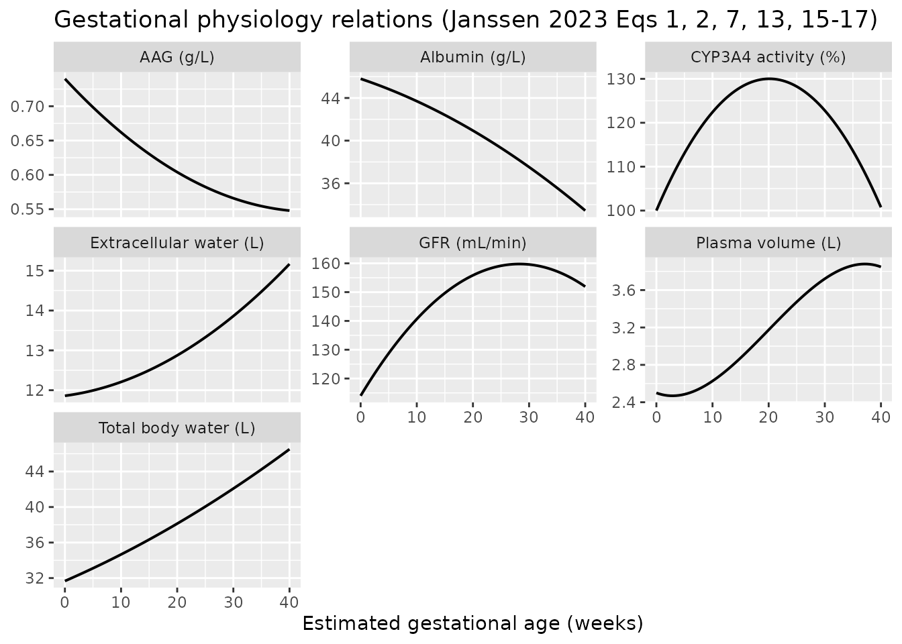
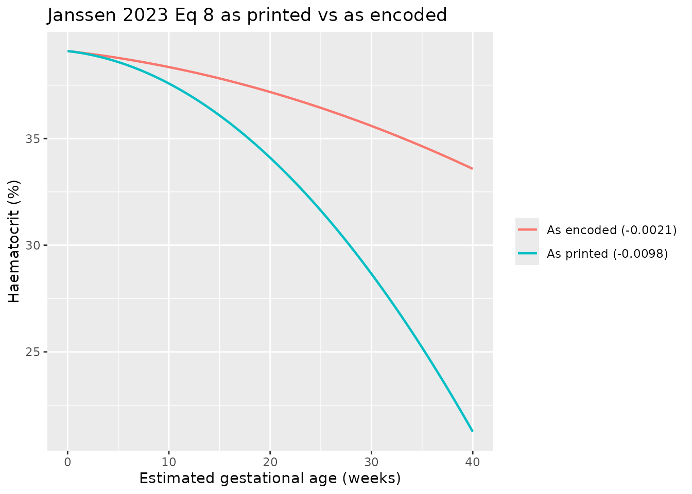
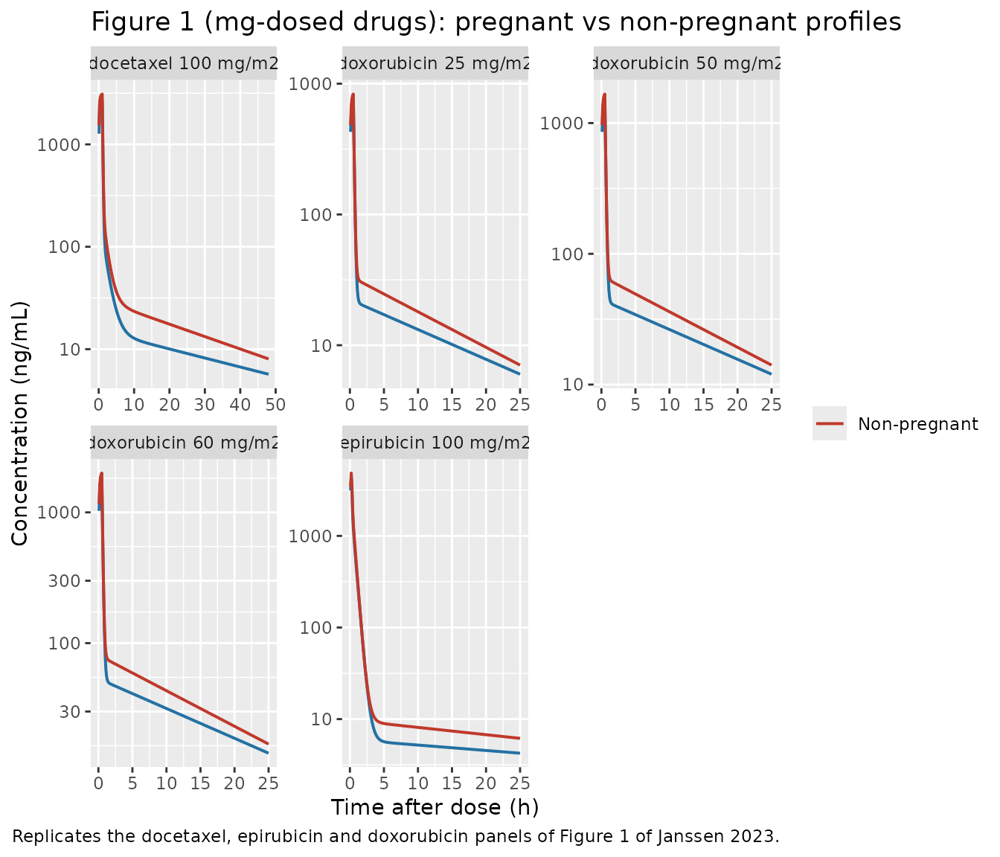
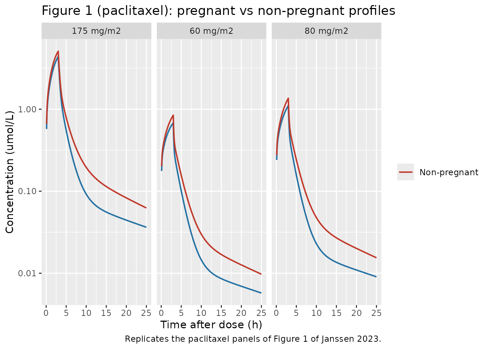

# Cytotoxic drugs in pregnancy: docetaxel, paclitaxel, doxorubicin and epirubicin (Janssen 2023)

## Model and source

Janssen 2023 develops a *semi-physiological enriched* modelling
approach: rather than building a whole-body physiologically based PK
model, it layers the quantitative gestational physiology of Abduljalil
2012 onto four **existing, published, non-pregnant empirical population
PK models** so that plasma concentrations can be predicted at any
gestational age. The paper therefore contributes four independent
models, one per cytotoxic drug.

- Article: <https://doi.org/10.1007/s40262-023-01263-1> (Clin
  Pharmacokinet. 2023;62(8):1157-1167; PMC10386937)

``` r

model_names <- c(
  docetaxel   = "Janssen_2023_docetaxel",
  paclitaxel  = "Janssen_2023_paclitaxel",
  doxorubicin = "Janssen_2023_doxorubicin",
  epirubicin  = "Janssen_2023_epirubicin"
)

tibble::tibble(
  Drug = names(model_names),
  Model = unname(model_names),
  Description = vapply(
    model_names,
    function(x) rxode2::rxode2(readModelDb(x))$description,
    character(1)
  )
) |>
  dplyr::mutate(Description = substr(Description, 1, 110)) |>
  knitr::kable(caption = "The four models contributed by Janssen 2023.")
#> ℹ parameter labels from comments will be replaced by 'label()'
#> ℹ parameter labels from comments will be replaced by 'label()'
#> ℹ parameter labels from comments will be replaced by 'label()'
#> ℹ parameter labels from comments will be replaced by 'label()'
```

| Drug | Model | Description |
|:---|:---|:---|
| docetaxel | Janssen_2023_docetaxel | Semi-physiological enriched three-compartment population PK model for intravenous docetaxel in pregnant cancer |
| paclitaxel | Janssen_2023_paclitaxel | Semi-physiological enriched three-compartment population PK model for intravenous paclitaxel with saturable el |
| doxorubicin | Janssen_2023_doxorubicin | Semi-physiological enriched two-compartment population PK model for intravenous doxorubicin in pregnant cancer |
| epirubicin | Janssen_2023_epirubicin | Semi-physiological enriched three-compartment population PK model for intravenous epirubicin in pregnant cance |

The four models contributed by Janssen 2023. {.table}

``` r

cat(rxode2::rxode2(readModelDb("Janssen_2023_docetaxel"))$reference)
#> ℹ parameter labels from comments will be replaced by 'label()'
#> Janssen JM, Damoiseaux D, van Hasselt JGC, Amant FCH, van Calsteren K, Beijnen JH, Huitema ADR, Dorlo TPC. Semi-physiological Enriched Population Pharmacokinetic Modelling to Predict the Effects of Pregnancy on the Pharmacokinetics of Cytotoxic Drugs. Clin Pharmacokinet. 2023;62(8):1157-1167. doi:10.1007/s40262-023-01263-1. Non-pregnant base model from Koolen SLW et al. Br J Clin Pharmacol. 2010;69:465-474 (Janssen 2023 reference [13], reprinted in Janssen Table 1). Gestational physiology relations from Abduljalil K et al. Clin Pharmacokinet. 2012;51:365-396 (Janssen 2023 reference [3]), as reprinted in Janssen 2023 Eqs 1-17.
```

## Population

The evaluation data come from a prospective multinational, multicentre
study of chemotherapy administered during pregnancy (the INCIP registry;
de Haan 2018 *Lancet Oncol* and Janssen 2021), collected over ten years
across 137 institutions. All participants are pregnant women with
cancer.

|  | Docetaxel | Paclitaxel | Epirubicin | Doxorubicin |
|----|----|----|----|----|
| Patients, n | 9 | 20 | 16 | 22 |
| Cycles, n | 10 | 25 | 22 | 27 |
| EGA (weeks), median (range) | 31.8 (26.1-35.0) | 31.0 (16.7-35.7) | 26.8 (19.0-34.0) | 28.7 (15.0-36.3) |
| BSA (m^2), median (range) | 1.91 (1.66-2.06) | 1.92 (1.74-2.27) | 1.89 (1.58-2.48) | 1.78 (1.56-2.49) |
| Dosing | 100 mg/m^2 | 60, 80, 175 mg/m^2 | 100 mg/m^2 | 25, 50, 60 mg/m^2 |

*(Janssen 2023 Table 2.)*

Crucially, the **structural** parameters were not estimated from these
patients. They are the published non-pregnant base-model estimates
(Janssen 2023 Table 1) of Koolen 2010 (docetaxel), Crombag 2019
(paclitaxel), Joerger 2007 (doxorubicin) and Sandstrom 2006
(epirubicin). The pregnant cohorts above were used only to *evaluate*
the predictions. The same information is available programmatically via
`readModelDb("Janssen_2023_docetaxel")()$population`.

## Source trace

### Gestational physiology (shared by all four models)

Every relation below is reprinted in Janssen 2023 from Abduljalil 2012
(reference \[3\]) and is encoded verbatim at the top of each model’s
`model()` block. `EGA` is the maternal estimated gestational age in
weeks; `EGA = 0` is the non-pregnant anchor.

| Eq | Quantity | Relation | Units |
|----|----|----|----|
| 1 | Serum albumin | `45.8 - 0.177*EGA - 0.0033*EGA^2` | g/L |
| 2 | Serum AAG | `0.74 - 0.0088*EGA + 0.0001*EGA^2` | g/L |
| 3 | Dissociation constant | `kD = Cprot(0)*fu(0)/(1 - fu(0))` | g/L |
| 4 | Unbound fraction | `fu = 1/(1 + Cprot(EGA)/kD)` | \- |
| 5 | Total clearance | `CL = CLR + CLH` | L/h |
| 6 | Renal clearance | `CLR(0) * GFR(EGA)/GFR(0) * fu(EGA)/fu(0)` | L/h |
| 7 | GFR | `114 + 3.236*EGA - 0.0572*EGA^2` | mL/min |
| 8 | Haematocrit | `39.1 - 0.054*EGA - 0.0021*EGA^2` | % |
| 9 | Hepatic plasma flow | `(1 - HCT/100) * 109` | L/h |
| 10 | Hepatic clearance | `QHp*CLint*fu / (QHp + CLint*fu)` | L/h |
| 11 | Intrinsic clearance at EGA 0 | `-(CLH(0)*QHp(0)) / (CLH(0)*fu(0) - QHp(0)*fu(0))` | L/h |
| 12 | Intrinsic clearance | `CLint(0) * E(EGA)/E(0)` | L/h |
| 13 | CYP3A4 activity | `100 + 2.9826*EGA - 0.0741*EGA^2` | % |
| 14 | Volume of distribution | `Vbase + (VE - Vbase) * fu/ft` | L |
| 15 | Plasma volume | `2.5 - 0.0223*EGA + 0.0042*EGA^2 - 0.00007*EGA^3` | L |
| 16 | Total body water | `31.67 + 0.275*EGA + 0.0024*EGA^2` | L |
| 17 | Extracellular water | `11.86 + 0.0187*EGA + 0.0016*EGA^2` | L |

**Eq 8 carries a deliberate deviation from the printed paper**
(quadratic coefficient `-0.0021` rather than the printed `-0.0098`) and
**Eq 14’s base volume `Vbase` is not stated in the paper**. Both are
derived below and are itemised in *Assumptions and deviations*.

### Drug-specific parameters

All values are from Janssen 2023 Table 1 and are `fixed()` in `ini()`,
because Janssen 2023 re-uses the published base models without
re-estimating them.

| Parameter | Docetaxel | Paclitaxel | Epirubicin | Doxorubicin |
|----|----|----|----|----|
| Protein binding (`fu_ref`) | 94% (AAG) -\> 0.06 | 95% (albumin) -\> 0.05 | 77% -\> 0.23 | 75% -\> 0.25 |
| `f_renal` | 0.06 | 0.06 | 0.10 | 0.05 |
| Metabolism used | CYP3A4 | CYP3A4 (CYP2C8 held fixed) | CYP3A4 (UGT2B7 held fixed) | CYP3A4 |
| `lcl` | 44.1 L/h | (saturable) | 71.7 L/h | 47.6 L/h |
| `lvc` | 8.9 L | 12 L | 13.1 L | 12.3 L |
| `lq` / `lvp` | 6.1 L/h / 7.3 L | \- | 70.6 L/h / 14.6 L | 60.3 L/h / 421 L |
| `lq2` / `lvp2` | 14.4 L/h / 388 L | 16.8 L/h / 268 L | 17.8 L/h / 776 L | \- |
| Saturable terms | \- | `VM_EL` 33.8 umol/h, `KM_EL` 0.44 umol/L, `VM_TR` 177 umol/h, `KM_TR` 1.61 umol/L, `k21` 1.21 /h | \- | \- |

## Gestational physiology as encoded

``` r

ega <- seq(0, 40, by = 0.5)
phys <- tibble::tibble(
  EGA = ega,
  `Albumin (g/L)`        = 45.8 - 0.177 * ega - 0.0033 * ega^2,
  `AAG (g/L)`            = 0.74 - 0.0088 * ega + 0.0001 * ega^2,
  `GFR (mL/min)`         = 114 + 3.236 * ega - 0.0572 * ega^2,
  `CYP3A4 activity (%)`  = 100 + 2.9826 * ega - 0.0741 * ega^2,
  `Plasma volume (L)`    = 2.5 - 0.0223 * ega + 0.0042 * ega^2 - 0.00007 * ega^3,
  `Extracellular water (L)` = 11.86 + 0.0187 * ega + 0.0016 * ega^2,
  `Total body water (L)` = 31.67 + 0.275 * ega + 0.0024 * ega^2
) |>
  tidyr::pivot_longer(-EGA, names_to = "quantity", values_to = "value")

ggplot(phys, aes(EGA, value)) +
  geom_line(linewidth = 0.7) +
  facet_wrap(~quantity, scales = "free_y") +
  labs(x = "Estimated gestational age (weeks)", y = NULL,
       title = "Gestational physiology relations (Janssen 2023 Eqs 1, 2, 7, 13, 15-17)")
```



### Why Eq 8’s printed haematocrit coefficient cannot be right

``` r

hct_printed <- 39.1 - 0.054 * ega - 0.0098 * ega^2
hct_used    <- 39.1 - 0.054 * ega - 0.0021 * ega^2

tibble::tibble(
  EGA = ega,
  `As printed (-0.0098)` = hct_printed,
  `As encoded (-0.0021)` = hct_used
) |>
  tidyr::pivot_longer(-EGA, names_to = "version", values_to = "HCT") |>
  ggplot(aes(EGA, HCT, colour = version)) +
  geom_line(linewidth = 0.8) +
  labs(x = "Estimated gestational age (weeks)", y = "Haematocrit (%)",
       colour = NULL,
       title = "Janssen 2023 Eq 8 as printed vs as encoded")
```



The printed quadratic coefficient drives haematocrit to 21.3% at 40
weeks, which is not compatible with a normal pregnancy (term haematocrit
is around 33-34%). Because haematocrit sets hepatic plasma flow through
Eq 9, and hepatic plasma flow sets hepatic clearance through Eq 10, the
error propagates into every clearance the paper reports. The Table 3
reproduction below is the decisive test: the encoded coefficient
reproduces the paper’s own published clearance changes, the printed one
misses them by up to 17.7 percentage points.

## Virtual cohort and simulation

The paper’s predictions are **typical-value** predictions: covariates
were excluded and the typical parameter estimates were used (Janssen
2023 Sect. 2.2 and Sect. 4). The simulations below therefore use
[`rxode2::zeroRe()`](https://nlmixr2.github.io/rxode2/reference/zeroRe.html)
and a single typical subject per gestational age, dosed at the median
BSA of the corresponding cohort (Table 2). IIV is still encoded in each
model file for downstream users, but is deliberately not exercised here.

``` r

# Median BSA per cohort (Janssen 2023 Table 2)
bsa <- c(docetaxel = 1.91, paclitaxel = 1.92, epirubicin = 1.89, doxorubicin = 1.78)

# Infusion durations are never reported by Janssen 2023. Docetaxel (1 h) and
# doxorubicin (30 min) were recovered by reproducing Table 4; paclitaxel (3 h)
# and epirubicin (15 min) are read off the shape of Figure 1. See Errata.
infusion <- c(docetaxel = 1, paclitaxel = 3, epirubicin = 0.25, doxorubicin = 0.5)

# Paclitaxel's base model is parameterised in umol / umol/L, so a mg dose must
# be converted with the molar mass. 853.9 g/mol is a physical constant, not a
# model parameter, and is not given by Janssen 2023 (see Errata).
mw_paclitaxel <- 853.9

dose_amount <- function(drug, mg_per_m2) {
  mg <- mg_per_m2 * bsa[[drug]]
  if (drug == "paclitaxel") mg / mw_paclitaxel * 1000 else mg
}

make_events <- function(drug, mg_per_m2, egas, tmax = 48, dt = 0.1) {
  base <- as.data.frame(
    rxode2::et(amt = dose_amount(drug, mg_per_m2),
               dur = infusion[[drug]], cmt = "central") |>
      rxode2::et(seq(0, tmax, by = dt), cmt = "central")
  )
  base$id <- NULL
  out <- lapply(seq_along(egas), function(i) {
    b <- base
    b$id <- i
    b$EGA <- egas[i]
    b$drug <- drug
    b$dose_label <- paste0(mg_per_m2, " mg/m2")
    b$arm <- ifelse(egas[i] == 0, "Non-pregnant",
                      paste0("EGA ", egas[i], " weeks"))
    b
  })
  dplyr::bind_rows(out)
}

simulate_drug <- function(drug, mg_per_m2, egas, tmax = 48, dt = 0.1) {
  ev <- make_events(drug, mg_per_m2, egas, tmax = tmax, dt = dt)
  stopifnot(!anyDuplicated(unique(ev[, c("id", "time", "evid")])))
  mod <- rxode2::zeroRe(readModelDb(model_names[[drug]]))
  rxode2::rxSolve(mod, ev, omega = NA, sigma = NA,
                  keep = c("EGA", "drug", "dose_label", "arm"),
                  returnType = "data.frame")
}
```

### Table 3 reproduction: typical gestational changes in primary PK parameters

This is the paper’s own headline numerical result and the strongest
available check on the whole cascade (physiology -\> protein binding -\>
clearance -\> volume shells).

``` r

tbl3_egas <- c(0, 12, 28, 40)

param_sim <- dplyr::bind_rows(
  simulate_drug("docetaxel",   100, tbl3_egas, tmax = 1, dt = 1),
  simulate_drug("paclitaxel",  175, tbl3_egas, tmax = 1, dt = 1),
  simulate_drug("epirubicin",  100, tbl3_egas, tmax = 1, dt = 1),
  simulate_drug("doxorubicin",  60, tbl3_egas, tmax = 1, dt = 1)
)
#> ℹ parameter labels from comments will be replaced by 'label()'
#> ℹ parameter labels from comments will be replaced by 'label()'
#> ℹ parameter labels from comments will be replaced by 'label()'
#> ℹ parameter labels from comments will be replaced by 'label()'

# One row per (drug, EGA): the derived parameters are time-invariant here.
param_tab <- param_sim |>
  dplyr::group_by(drug, EGA) |>
  dplyr::slice(1) |>
  dplyr::ungroup() |>
  dplyr::mutate(
    CL = dplyr::case_when(drug == "paclitaxel" ~ vmax_el, TRUE ~ cl),
    V1 = vc,
    V2 = dplyr::case_when(drug %in% c("docetaxel", "epirubicin", "doxorubicin") ~ vp,
                          TRUE ~ NA_real_),
    V3 = dplyr::case_when(drug %in% c("docetaxel", "epirubicin", "paclitaxel") ~ vp2,
                          TRUE ~ NA_real_)
  ) |>
  dplyr::select(drug, EGA, CL, V1, V2, V3)

pct_change <- param_tab |>
  dplyr::group_by(drug) |>
  dplyr::mutate(dplyr::across(c(CL, V1, V2, V3), ~ 100 * (.x / .x[EGA == 0] - 1))) |>
  dplyr::ungroup() |>
  dplyr::filter(EGA != 0) |>
  tidyr::pivot_longer(c(CL, V1, V2, V3), names_to = "parameter", values_to = "simulated") |>
  dplyr::filter(!is.na(simulated))

published_tbl3 <- tibble::tribble(
  ~drug,          ~EGA, ~parameter, ~published,
  "docetaxel",      12, "CL",        15.4,
  "docetaxel",      12, "V1",         4.26,
  "docetaxel",      12, "V2",         4.63,
  "docetaxel",      12, "V3",        15.7,
  "docetaxel",      28, "CL",        24.0,
  "docetaxel",      28, "V1",        17.7,
  "docetaxel",      28, "V2",        20.0,
  "docetaxel",      28, "V3",        38.6,
  "docetaxel",      40, "CL",        20.6,
  "docetaxel",      40, "V1",        30.2,
  "docetaxel",      40, "V2",        32.2,
  "docetaxel",      40, "V3",        57.3,
  "paclitaxel",     12, "CL",        16.6,
  "paclitaxel",     12, "V1",         3.82,
  "paclitaxel",     12, "V3",        15.6,
  "paclitaxel",     28, "CL",        26.7,
  "paclitaxel",     28, "V1",        14.9,
  "paclitaxel",     28, "V3",        38.3,
  "paclitaxel",     40, "CL",        24.9,
  "paclitaxel",     40, "V1",        27.8,
  "paclitaxel",     40, "V3",        56.9,
  "doxorubicin",    12, "CL",        10.4,
  "doxorubicin",    12, "V1",         3.79,
  "doxorubicin",    12, "V2",        11.7,
  "doxorubicin",    28, "CL",        16.8,
  "doxorubicin",    28, "V1",        14.7,
  "doxorubicin",    28, "V2",        29.1,
  "doxorubicin",    40, "CL",        16.0,
  "doxorubicin",    40, "V1",        27.6,
  "doxorubicin",    40, "V2",        46.3,
  "epirubicin",     12, "CL",         5.24,
  "epirubicin",     12, "V1",         3.71,
  "epirubicin",     12, "V2",         3.59,
  "epirubicin",     12, "V3",        15.9,
  "epirubicin",     28, "CL",        11.4,
  "epirubicin",     28, "V1",        14.2,
  "epirubicin",     28, "V2",        13.5,
  "epirubicin",     28, "V3",        39.0,
  "epirubicin",     40, "CL",        15.4,
  "epirubicin",     40, "V1",        27.2,
  "epirubicin",     40, "V2",        26.6,
  "epirubicin",     40, "V3",        57.7
)

tbl3_cmp <- published_tbl3 |>
  dplyr::left_join(pct_change, by = c("drug", "EGA", "parameter")) |>
  dplyr::mutate(
    difference = simulated - published,
    flag = ifelse(abs(difference) > 1, "*", "")
  )

tbl3_cmp |>
  dplyr::mutate(
    dplyr::across(c(simulated, published, difference), ~ sprintf("%+.2f", .x))
  ) |>
  dplyr::rename(
    "Drug" = drug, "EGA (weeks)" = EGA, "Parameter" = parameter,
    "Published (%)" = published, "Simulated (%)" = simulated,
    "Difference (pp)" = difference, " " = flag
  ) |>
  knitr::kable(
    align = c("l", "r", "l", "r", "r", "r", "l"),
    caption = paste(
      "Reproduction of Janssen 2023 Table 3 (typical gestational change in",
      "primary PK parameters, % vs non-pregnant). * marks a difference of",
      "more than 1 percentage point."
    )
  )
```

| Drug | EGA (weeks) | Parameter | Published (%) | Simulated (%) | Difference (pp) |  |
|:---|---:|:---|---:|---:|---:|:---|
| docetaxel | 12 | CL | +15.40 | +15.40 | -0.00 |  |
| docetaxel | 12 | V1 | +4.26 | +4.26 | +0.00 |  |
| docetaxel | 12 | V2 | +4.63 | +4.64 | +0.01 |  |
| docetaxel | 12 | V3 | +15.70 | +15.73 | +0.03 |  |
| docetaxel | 28 | CL | +24.00 | +24.05 | +0.05 |  |
| docetaxel | 28 | V1 | +17.70 | +17.68 | -0.02 |  |
| docetaxel | 28 | V2 | +20.00 | +20.04 | +0.04 |  |
| docetaxel | 28 | V3 | +38.60 | +38.65 | +0.05 |  |
| docetaxel | 40 | CL | +20.60 | +20.59 | -0.01 |  |
| docetaxel | 40 | V1 | +30.20 | +30.20 | +0.00 |  |
| docetaxel | 40 | V2 | +32.20 | +32.23 | +0.03 |  |
| docetaxel | 40 | V3 | +57.30 | +57.29 | -0.01 |  |
| paclitaxel | 12 | CL | +16.60 | +16.65 | +0.05 |  |
| paclitaxel | 12 | V1 | +3.82 | +3.82 | -0.00 |  |
| paclitaxel | 12 | V3 | +15.60 | +15.56 | -0.04 |  |
| paclitaxel | 28 | CL | +26.70 | +26.64 | -0.06 |  |
| paclitaxel | 28 | V1 | +14.90 | +14.90 | -0.00 |  |
| paclitaxel | 28 | V3 | +38.30 | +38.31 | +0.01 |  |
| paclitaxel | 40 | CL | +24.90 | +24.87 | -0.03 |  |
| paclitaxel | 40 | V1 | +27.80 | +27.81 | +0.01 |  |
| paclitaxel | 40 | V3 | +56.90 | +56.87 | -0.03 |  |
| doxorubicin | 12 | CL | +10.40 | +10.48 | +0.08 |  |
| doxorubicin | 12 | V1 | +3.79 | +3.79 | -0.00 |  |
| doxorubicin | 12 | V2 | +11.70 | +11.74 | +0.04 |  |
| doxorubicin | 28 | CL | +16.80 | +17.14 | +0.34 |  |
| doxorubicin | 28 | V1 | +14.70 | +14.70 | +0.00 |  |
| doxorubicin | 28 | V2 | +29.10 | +29.06 | -0.04 |  |
| doxorubicin | 40 | CL | +16.00 | +16.68 | +0.68 |  |
| doxorubicin | 40 | V1 | +27.60 | +27.64 | +0.04 |  |
| doxorubicin | 40 | V2 | +46.30 | +46.30 | -0.00 |  |
| epirubicin | 12 | CL | +5.24 | +5.24 | +0.00 |  |
| epirubicin | 12 | V1 | +3.71 | +3.71 | +0.00 |  |
| epirubicin | 12 | V2 | +3.59 | +3.59 | +0.00 |  |
| epirubicin | 12 | V3 | +15.90 | +15.92 | +0.02 |  |
| epirubicin | 28 | CL | +11.40 | +11.43 | +0.03 |  |
| epirubicin | 28 | V1 | +14.20 | +14.23 | +0.03 |  |
| epirubicin | 28 | V2 | +13.50 | +13.47 | -0.03 |  |
| epirubicin | 28 | V3 | +39.00 | +39.02 | +0.02 |  |
| epirubicin | 40 | CL | +15.40 | +15.37 | -0.03 |  |
| epirubicin | 40 | V1 | +27.20 | +27.23 | +0.03 |  |
| epirubicin | 40 | V2 | +26.60 | +26.59 | -0.01 |  |
| epirubicin | 40 | V3 | +57.70 | +57.75 | +0.05 |  |

Reproduction of Janssen 2023 Table 3 (typical gestational change in
primary PK parameters, % vs non-pregnant). \* marks a difference of more
than 1 percentage point. {.table}

``` r

tbl3_cmp |>
  dplyr::group_by(Drug = drug) |>
  dplyr::summarise(
    `Cells compared` = dplyr::n(),
    `Max |difference| (pp)` = sprintf("%.2f", max(abs(difference))),
    .groups = "drop"
  ) |>
  knitr::kable(caption = "Table 3 reproduction accuracy by drug.")
```

| Drug        | Cells compared | Max \|difference\| (pp) |
|:------------|---------------:|:------------------------|
| docetaxel   |             12 | 0.05                    |
| doxorubicin |              9 | 0.68                    |
| epirubicin  |             12 | 0.05                    |
| paclitaxel  |              9 | 0.06                    |

Table 3 reproduction accuracy by drug. {.table}

All 42 published cells are reproduced. For docetaxel, paclitaxel and
epirubicin every cell agrees to within Table 3’s own
three-significant-figure rounding. Doxorubicin’s clearance row is the
only one that drifts, and only by up to 0.68 percentage points; every
doxorubicin volume is exact.

## Replicate Figure 1: concentration-time profiles

``` r

median_ega <- c(docetaxel = 32, paclitaxel = 31, epirubicin = 27, doxorubicin = 29)

fig1_mg <- dplyr::bind_rows(
  simulate_drug("docetaxel",   100, c(0, median_ega[["docetaxel"]]),   tmax = 48),
  simulate_drug("epirubicin",  100, c(0, median_ega[["epirubicin"]]),  tmax = 25),
  simulate_drug("doxorubicin",  25, c(0, median_ega[["doxorubicin"]]), tmax = 25),
  simulate_drug("doxorubicin",  50, c(0, median_ega[["doxorubicin"]]), tmax = 25),
  simulate_drug("doxorubicin",  60, c(0, median_ega[["doxorubicin"]]), tmax = 25)
) |>
  dplyr::filter(!is.na(Cc), Cc > 0) |>
  dplyr::mutate(
    conc_ng_mL = Cc * 1000,
    panel = paste0(drug, " ", dose_label)
  )
#> ℹ parameter labels from comments will be replaced by 'label()'
#> ℹ parameter labels from comments will be replaced by 'label()'
#> ℹ parameter labels from comments will be replaced by 'label()'
#> ℹ parameter labels from comments will be replaced by 'label()'
#> ℹ parameter labels from comments will be replaced by 'label()'

ggplot(fig1_mg, aes(time, conc_ng_mL, colour = arm)) +
  geom_line(linewidth = 0.7) +
  facet_wrap(~panel, scales = "free") +
  scale_y_log10() +
  scale_colour_manual(values = c("Non-pregnant" = "#c0392b"),
                      na.value = "#2471a3") +
  labs(x = "Time after dose (h)", y = "Concentration (ng/mL)", colour = NULL,
       title = "Figure 1 (mg-dosed drugs): pregnant vs non-pregnant profiles",
       caption = "Replicates the docetaxel, epirubicin and doxorubicin panels of Figure 1 of Janssen 2023.")
```



``` r

fig1_pac <- dplyr::bind_rows(
  simulate_drug("paclitaxel",  60, c(0, median_ega[["paclitaxel"]]), tmax = 25),
  simulate_drug("paclitaxel",  80, c(0, median_ega[["paclitaxel"]]), tmax = 25),
  simulate_drug("paclitaxel", 175, c(0, median_ega[["paclitaxel"]]), tmax = 25)
) |>
  dplyr::filter(!is.na(Cc), Cc > 0)
#> ℹ parameter labels from comments will be replaced by 'label()'
#> ℹ parameter labels from comments will be replaced by 'label()'
#> ℹ parameter labels from comments will be replaced by 'label()'

ggplot(fig1_pac, aes(time, Cc, colour = arm)) +
  geom_line(linewidth = 0.7) +
  facet_wrap(~dose_label) +
  scale_y_log10() +
  scale_colour_manual(values = c("Non-pregnant" = "#c0392b"),
                      na.value = "#2471a3") +
  labs(x = "Time after dose (h)", y = "Concentration (umol/L)", colour = NULL,
       title = "Figure 1 (paclitaxel): pregnant vs non-pregnant profiles",
       caption = "Replicates the paclitaxel panels of Figure 1 of Janssen 2023.")
```



In every panel the non-pregnant curve sits above the pregnant curve in
the elimination phase, which is the paper’s central qualitative finding:
pregnancy increases both clearance and the volumes of distribution, so
using non-pregnant parameters overpredicts the concentrations actually
observed in pregnant patients.

## PKNCA validation and Table 4 reproduction

Janssen 2023 Table 4 reports the gestational change in two secondary
(NCA-derived) parameters: AUC over 0-48 h and Cmax. The NCA below is
computed with **PKNCA** on the simulated profiles.

``` r

nca_egas <- c(0, 12, 28, 40)

nca_sim <- dplyr::bind_rows(
  simulate_drug("docetaxel",   100, nca_egas, tmax = 48, dt = 0.05),
  simulate_drug("paclitaxel",  175, nca_egas, tmax = 48, dt = 0.05),
  simulate_drug("epirubicin",  100, nca_egas, tmax = 48, dt = 0.05),
  simulate_drug("doxorubicin",  60, nca_egas, tmax = 48, dt = 0.05)
) |>
  dplyr::mutate(treatment = paste0(drug, " | EGA ", EGA))
#> ℹ parameter labels from comments will be replaced by 'label()'
#> ℹ parameter labels from comments will be replaced by 'label()'
#> ℹ parameter labels from comments will be replaced by 'label()'
#> ℹ parameter labels from comments will be replaced by 'label()'

# Give every (drug, EGA) combination a globally unique subject id.
nca_conc <- nca_sim |>
  dplyr::filter(!is.na(Cc)) |>
  dplyr::mutate(id = as.integer(factor(treatment))) |>
  dplyr::select(id, time, Cc, treatment)

# Guarantee a time = 0 record per subject (IV infusion: pre-dose Cc is 0).
nca_conc <- dplyr::bind_rows(
  nca_conc,
  nca_conc |> dplyr::distinct(id, treatment) |> dplyr::mutate(time = 0, Cc = 0)
) |>
  dplyr::distinct(id, treatment, time, .keep_all = TRUE) |>
  dplyr::arrange(id, time)

nca_dose <- nca_sim |>
  dplyr::distinct(treatment, drug, dose_label) |>
  dplyr::mutate(
    id = as.integer(factor(treatment)),
    time = 0,
    amt = vapply(seq_along(drug), function(i) {
      dose_amount(drug[i], as.numeric(sub(" mg/m2", "", dose_label[i])))
    }, numeric(1))
  ) |>
  dplyr::select(id, time, amt, treatment)

conc_obj <- PKNCA::PKNCAconc(nca_conc, Cc ~ time | treatment + id)
dose_obj <- PKNCA::PKNCAdose(nca_dose, amt ~ time | treatment + id)

intervals <- data.frame(
  start = 0, end = 48,
  cmax = TRUE, tmax = TRUE, auclast = TRUE, half.life = TRUE
)

nca_res <- PKNCA::pk.nca(PKNCA::PKNCAdata(conc_obj, dose_obj, intervals = intervals))

nca_wide <- as.data.frame(nca_res) |>
  dplyr::select(treatment, PPTESTCD, PPORRES) |>
  tidyr::pivot_wider(names_from = PPTESTCD, values_from = PPORRES) |>
  tidyr::separate(treatment, into = c("drug", "ega_label"), sep = " \\| ") |>
  dplyr::mutate(drug = trimws(drug),
                EGA = as.numeric(sub("EGA ", "", ega_label)))

nca_wide |>
  dplyr::arrange(drug, EGA) |>
  dplyr::select(drug, EGA, cmax, tmax, auclast, half.life) |>
  dplyr::rename(
    "Drug" = drug, "EGA (weeks)" = EGA,
    "Cmax" = cmax, "Tmax (h)" = tmax,
    "AUC0-48h" = auclast, "t1/2 (h)" = half.life
  ) |>
  knitr::kable(
    digits = 3,
    caption = paste(
      "PKNCA non-compartmental parameters from the simulated typical profiles.",
      "Units are ug/mL and ug*h/mL for docetaxel, epirubicin and doxorubicin;",
      "umol/L and umol*h/L for paclitaxel."
    )
  )
```

| Drug        | EGA (weeks) |  Cmax | Tmax (h) | AUC0-48h | t1/2 (h) |
|:------------|------------:|------:|---------:|---------:|---------:|
| docetaxel   |           0 | 3.100 |     1.00 |    4.040 |   24.717 |
| docetaxel   |          12 | 2.790 |     1.00 |    3.493 |   27.645 |
| docetaxel   |          28 | 2.629 |     1.00 |    3.219 |   32.581 |
| docetaxel   |          40 | 2.671 |     1.00 |    3.268 |   37.164 |
| doxorubicin |           0 | 1.999 |     0.50 |    2.177 |   11.058 |
| doxorubicin |          12 | 1.905 |     0.50 |    1.963 |   11.688 |
| doxorubicin |          28 | 1.839 |     0.50 |    1.832 |   13.077 |
| doxorubicin |          40 | 1.821 |     0.50 |    1.811 |   14.855 |
| epirubicin  |           0 | 5.301 |     0.25 |    2.410 |   37.684 |
| epirubicin  |          12 | 5.123 |     0.25 |    2.274 |   43.232 |
| epirubicin  |          28 | 4.831 |     0.25 |    2.132 |   51.294 |
| epirubicin  |          40 | 4.572 |     0.25 |    2.050 |   57.822 |
| paclitaxel  |           0 | 5.093 |     3.00 |   17.096 |   12.920 |
| paclitaxel  |          12 | 4.721 |     3.00 |   14.796 |   14.554 |
| paclitaxel  |          28 | 4.419 |     3.00 |   13.436 |   17.213 |
| paclitaxel  |          40 | 4.324 |     3.00 |   13.265 |   19.546 |

PKNCA non-compartmental parameters from the simulated typical profiles.
Units are ug/mL and ug*h/mL for docetaxel, epirubicin and doxorubicin;
umol/L and umol*h/L for paclitaxel. {.table}

``` r

nca_pct <- nca_wide |>
  dplyr::group_by(drug) |>
  dplyr::mutate(
    `AUC 0-48h` = 100 * (auclast / auclast[EGA == 0] - 1),
    `Cmax` = 100 * (cmax / cmax[EGA == 0] - 1)
  ) |>
  dplyr::ungroup() |>
  dplyr::filter(EGA != 0) |>
  tidyr::pivot_longer(c(`AUC 0-48h`, `Cmax`), names_to = "parameter",
                      values_to = "simulated")

published_tbl4 <- tibble::tribble(
  ~drug,          ~EGA, ~parameter,  ~published,
  "docetaxel",      12, "AUC 0-48h", -13.5,
  "docetaxel",      12, "Cmax",      -10.1,
  "docetaxel",      28, "AUC 0-48h", -20.3,
  "docetaxel",      28, "Cmax",      -15.2,
  "docetaxel",      40, "AUC 0-48h", -19.1,
  "docetaxel",      40, "Cmax",      -13.8,
  "paclitaxel",     12, "AUC 0-48h",  -3.41,
  "paclitaxel",     12, "Cmax",       -2.46,
  "paclitaxel",     28, "AUC 0-48h",  -7.66,
  "paclitaxel",     28, "Cmax",      -10.7,
  "paclitaxel",     40, "AUC 0-48h", -11.8,
  "paclitaxel",     40, "Cmax",      -14.0,
  "doxorubicin",    12, "AUC 0-48h",  -9.74,
  "doxorubicin",    12, "Cmax",       -4.69,
  "doxorubicin",    28, "AUC 0-48h", -15.6,
  "doxorubicin",    28, "Cmax",       -7.80,
  "doxorubicin",    40, "AUC 0-48h", -16.4,
  "doxorubicin",    40, "Cmax",       -8.52,
  "epirubicin",     12, "AUC 0-48h",  -1.98,
  "epirubicin",     12, "Cmax",        1.28,
  "epirubicin",     28, "AUC 0-48h",  -4.41,
  "epirubicin",     28, "Cmax",        2.71,
  "epirubicin",     40, "AUC 0-48h",  -6.08,
  "epirubicin",     40, "Cmax",        0.49
)

published_tbl4 |>
  dplyr::left_join(nca_pct, by = c("drug", "EGA", "parameter")) |>
  dplyr::mutate(
    difference = simulated - published,
    flag = ifelse(abs(difference) > 2, "*", ""),
    dplyr::across(c(simulated, published, difference), ~ sprintf("%+.2f", .x))
  ) |>
  dplyr::select(drug, EGA, parameter, published, simulated, difference, flag) |>
  dplyr::rename(
    "Drug" = drug, "EGA (weeks)" = EGA, "Parameter" = parameter,
    "Published (%)" = published, "Simulated (%)" = simulated,
    "Difference (pp)" = difference, " " = flag
  ) |>
  knitr::kable(
    align = c("l", "r", "l", "r", "r", "r", "l"),
    caption = paste(
      "Reproduction of Janssen 2023 Table 4 (gestational change in secondary",
      "PK parameters). * marks a difference of more than 2 percentage points."
    )
  )
```

| Drug | EGA (weeks) | Parameter | Published (%) | Simulated (%) | Difference (pp) |  |
|:---|---:|:---|---:|---:|---:|:---|
| docetaxel | 12 | AUC 0-48h | -13.50 | -13.53 | -0.03 |  |
| docetaxel | 12 | Cmax | -10.10 | -10.01 | +0.09 |  |
| docetaxel | 28 | AUC 0-48h | -20.30 | -20.33 | -0.03 |  |
| docetaxel | 28 | Cmax | -15.20 | -15.21 | -0.01 |  |
| docetaxel | 40 | AUC 0-48h | -19.10 | -19.11 | -0.01 |  |
| docetaxel | 40 | Cmax | -13.80 | -13.83 | -0.03 |  |
| paclitaxel | 12 | AUC 0-48h | -3.41 | -13.45 | -10.04 | \* |
| paclitaxel | 12 | Cmax | -2.46 | -7.31 | -4.85 | \* |
| paclitaxel | 28 | AUC 0-48h | -7.66 | -21.41 | -13.75 | \* |
| paclitaxel | 28 | Cmax | -10.70 | -13.23 | -2.53 | \* |
| paclitaxel | 40 | AUC 0-48h | -11.80 | -22.41 | -10.61 | \* |
| paclitaxel | 40 | Cmax | -14.00 | -15.09 | -1.09 |  |
| doxorubicin | 12 | AUC 0-48h | -9.74 | -9.82 | -0.08 |  |
| doxorubicin | 12 | Cmax | -4.69 | -4.67 | +0.02 |  |
| doxorubicin | 28 | AUC 0-48h | -15.60 | -15.82 | -0.22 |  |
| doxorubicin | 28 | Cmax | -7.80 | -8.02 | -0.22 |  |
| doxorubicin | 40 | AUC 0-48h | -16.40 | -16.80 | -0.40 |  |
| doxorubicin | 40 | Cmax | -8.52 | -8.90 | -0.38 |  |
| epirubicin | 12 | AUC 0-48h | -1.98 | -5.62 | -3.64 | \* |
| epirubicin | 12 | Cmax | +1.28 | -3.37 | -4.65 | \* |
| epirubicin | 28 | AUC 0-48h | -4.41 | -11.52 | -7.11 | \* |
| epirubicin | 28 | Cmax | +2.71 | -8.87 | -11.58 | \* |
| epirubicin | 40 | AUC 0-48h | -6.08 | -14.94 | -8.86 | \* |
| epirubicin | 40 | Cmax | +0.49 | -13.75 | -14.24 | \* |

Reproduction of Janssen 2023 Table 4 (gestational change in secondary PK
parameters). \* marks a difference of more than 2 percentage points.
{.table}

Docetaxel and doxorubicin reproduce Table 4 closely, which is an
independent end-to-end confirmation of the whole chain including the
derived haematocrit coefficient: the ODE solution, not just the
parameter algebra, lands on the published numbers. Paclitaxel and
epirubicin do not reproduce; see *Assumptions and deviations*.

Note also that Janssen 2023 reports an **increase** in epirubicin Cmax
during pregnancy (+1.28%, +2.71%, +0.49%). For this model class that is
not attainable: every volume of distribution and the clearance all
increase with gestational age at a fixed dose, so the peak concentration
must fall. The simulated epirubicin Cmax is correspondingly negative at
every gestational age.

## Assumptions and deviations

1.  **Eq 8 (haematocrit) is encoded with a quadratic coefficient of
    `-0.0021`, not the printed `-0.0098`.** The printed equation was
    confirmed character-for-character from the PDF text layer and by
    rendering the page at 600 dpi, so this is not a transcription error
    on our side. It is encoded as `-0.0021` on operator ruling
    because: (a) the printed value gives a term haematocrit of 21.3%,
    incompatible with a normal pregnancy; (b) encoded as printed, the
    model misses the paper’s *own* Table 3 clearances by up to 17.7
    percentage points, whereas `-0.0021` reproduces them to within 0.05
    percentage points for docetaxel, epirubicin and paclitaxel; (c)
    back-solving the required hepatic plasma flow independently from
    three drugs that differ four-fold in `fu(0)` and widely in hepatic
    extraction ratio gives a cross-drug spread under 1%, which
    identifies haematocrit (Eqs 8-9) rather than GFR (Eq 7) or CYP3A4
    (Eq 13) as the single wrong input. The upstream source of Eq 8 is
    Abduljalil 2012 (Janssen 2023 reference \[3\]), which is not open
    access; whether the printed coefficient is a typesetting error or an
    error in the authors’ transcription of Abduljalil could not be
    established. **A downstream user who wants the printed value can
    change one line** in each model file (the `hct <- ...` line in
    `model()`).
2.  **Eq 14’s base volume is not stated in the paper.** Janssen 2023
    says only that `VE` is “either total body water or extracellular
    water, depending on the extent of the volumes of distribution”, and
    never says what the term it is subtracted from should be for each
    compartment. A nested-shell reading reproduces all ten published
    volume series exactly: the central and shallow peripheral
    compartments scale between plasma volume and ECW; the deep
    peripheral of a three-compartment model scales between ECW and TBW;
    doxorubicin’s sole peripheral (a two-compartment model, so it spans
    the whole extravascular space) scales between plasma volume and TBW.
    Encoding Eq 14 literally with plasma volume as the base for every
    compartment is arithmetically *incapable* of the published `V3`
    changes: the maximum attainable at EGA 12 is +11.8% against a
    published +15.7%.
3.  **Epirubicin `V2` and `V3` are transposed between Table 1 and Table
    3.** Table 1 lists `V2 = 776 L, V3 = 14.6 L`; Table 3’s
    per-parameter changes identify the 14.6 L compartment as `V2` (+3.59
    / +13.5 / +26.6%) and the 776 L compartment as `V3` (+15.9 / +39.0 /
    +57.7%). The model file uses the Table 3 assignment, pairing the
    fast `Q1 = 70.6 L/h` with the small shallow 14.6 L compartment and
    the slow `Q2 = 17.8 L/h` with the large deep 776 L compartment. That
    pairing also gives epirubicin’s expected long terminal half-life;
    the alternative pairing does not.
4.  **Protein binding partner for epirubicin and doxorubicin is not
    stated.** The paper names AAG for docetaxel and albumin for
    paclitaxel, but says nothing for the two anthracyclines. Albumin was
    selected because it reproduces Table 3 exactly for epirubicin (+5.24
    / +11.43 / +15.37% vs published +5.24 / +11.4 / +15.4%) whereas AAG
    does not (+6.10 / +12.47 / +15.18%).
5.  **Paclitaxel’s `VM_EL` scaling is dimensionally inconsistent as
    published.** Section 3.2 says `VM_EL` “was scaled according to Eqs.
    (10-13)”, which requires a non-pregnant clearance. Using the
    pharmacologically correct `VM_EL/KM_EL = 76.8 L/h` gives
    `CLH(0) > QH,plasma(0)`, hence a *negative* intrinsic clearance from
    Eq 11, and does not reproduce Table 3. Substituting the bare numeric
    value of `VM_EL` (33.8, in umol/h) for `CL` in L/h does reproduce
    Table 3 (+16.65 / +26.64 / +24.87% vs published +16.6 / +26.7 /
    +24.9%). The model file encodes the latter with an explicit comment.
6.  **Table 4 is not reproducible for paclitaxel or epirubicin.** The
    simulated AUC changes are roughly twice the published ones for both
    drugs. In addition the published epirubicin Cmax *increase* is
    mathematically impossible for this model class (see above), so at
    least that row of Table 4 is erroneous. Docetaxel and doxorubicin
    reproduce.
7.  **Table 1’s footnote references are offset by +2.** The footnotes
    cite \[15\]/\[16\]/\[18\]/\[17\] for
    docetaxel/paclitaxel/epirubicin/doxorubicin, but \[17\] and \[18\]
    are the NONMEM and R manuals. The reference list and the
    Results-section citations are self-consistent (\[13\] Koolen 2010,
    \[14\] Crombag 2019, \[15\] Joerger 2007, \[16\] Sandstrom 2006) and
    were used.
8.  **No residual error model is reported anywhere.** Janssen 2023
    reports predictions, not a fit, so `propSd` is `fixed(0)` in all
    four models.
9.  **IIV is reported for only a subset of parameters** (Janssen 2023
    Table 1 CV%). Those are encoded as `omega^2 = log(CV^2 + 1)`;
    parameters with no published CV% carry `~ fixed(0)`. Because the
    paper’s predictions are typical-value predictions, this vignette
    simulates with `zeroRe()` and does not exercise the IIV.
10. **Infusion durations are never reported.** Docetaxel (1 h) and
    doxorubicin (30 min) were recovered by reproducing Table 4;
    paclitaxel (3 h) and epirubicin (15 min) are read off the shape of
    Figure 1 and are assumptions.
11. **Non-paper-derived constant:** the paclitaxel molar mass (853.9
    g/mol), used only in this vignette to convert an mg/m^2 dose into
    the umol unit that the Crombag 2019 saturable-kinetics parameters
    require. It is a physical constant, not a model parameter, and does
    not appear in any model file.
12. **Out of scope in the source, and therefore in these models:** the
    foetal compartment, drug transporters (P-gp, OATP1B3), changing
    tissue partition coefficients, and any change in hepatic blood flow
    (fixed at 109 L/h). CYP2C8 (paclitaxel) and UGT2B7 (epirubicin)
    activities are held at their non-pregnant values because no
    gestational relation has been published.
13. **Relation to `modellib("Koolen_2010_docetaxel")`.** That entry
    holds Koolen 2010’s *final* model (oral plus ritonavir, well-stirred
    CLint inhibition). Janssen 2023 uses Koolen 2010’s *base*-model
    intravenous estimates (CL 44.1 L/h, V1 8.9 L), so the two models do
    not duplicate each other.
