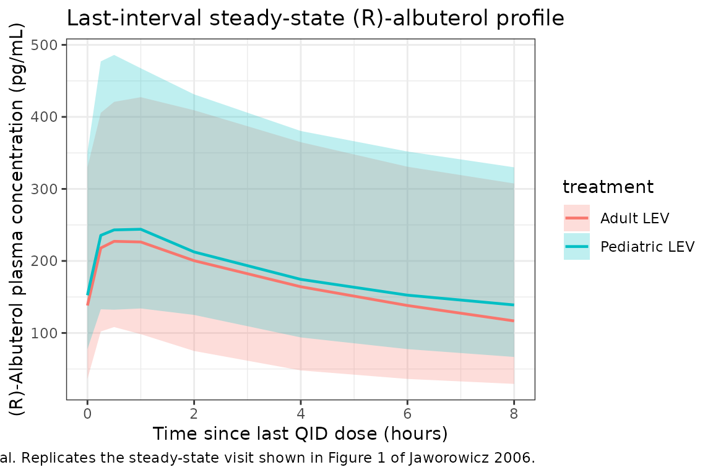

# Levalbuterol (Jaworowicz 2006)

``` r

library(nlmixr2lib)
library(PKNCA)
#> 
#> Attaching package: 'PKNCA'
#> The following object is masked from 'package:stats':
#> 
#>     filter
library(rxode2)
#> rxode2 5.1.2 using 2 threads (see ?getRxThreads)
#>   no cache: create with `rxCreateCache()`
library(dplyr)
#> 
#> Attaching package: 'dplyr'
#> The following objects are masked from 'package:stats':
#> 
#>     filter, lag
#> The following objects are masked from 'package:base':
#> 
#>     intersect, setdiff, setequal, union
library(tidyr)
library(ggplot2)
```

## Model and source

- Citation: Jaworowicz D, Maier G, Baumgartner RA, Hsu R, Grasela TH.
  Population pharmacokinetics of (R)-albuterol following inhaled
  levalbuterol or racemic albuterol via a hydrofluoroalkane metered dose
  inhaler in pediatric and adult asthma patients. Poster T3350, American
  Association of Pharmaceutical Scientists Annual Meeting and
  Exposition, San Antonio, TX, October 29 - November 2, 2006. Sepracor,
  Inc. / Cognigen Corporation.
- Description: Two-compartment population PK model for (R)-albuterol
  following inhaled levalbuterol (90 ug) or racemic albuterol (180 ug)
  via a hydrofluoroalkane metered-dose inhaler in pediatric (4-11 years)
  and adult (12-81 years) asthma patients. First-order absorption,
  linear elimination, body-weight effects on apparent clearance
  (linear-additive) and central volume (power), and a pediatric-vs-adult
  split on absorption rate. The reference parameters are the Adult /
  Study 051-353 / single-dose levalbuterol-visit values (bioavailability
  anchor F1 = 1).
- Article: AAPS 2006 Annual Meeting Poster T3350 (no DOI; conference
  abstract / poster)

## Population

The source poster pooled 632 subjects (81 pediatric, ages 4-11 years;
551 adult, ages 12-81 years) from three randomized, multi-center,
placebo- and active-controlled, double-blind, parallel-design Phase 3
trials in adult and pediatric asthma patients (Sepracor studies 051-353,
051-355, and a third pediatric trial). 429 subjects received 90 ug
levalbuterol QID via HFA MDI and 203 received 180 ug racemic albuterol
QID. PK was measured as (R)-albuterol plasma concentration (n = 3791
samples) after the first dose and after 4 weeks (pediatric) or 8 weeks
(adult) of QID dosing. Adult mean (SD) weight was 80.8 (22.3) kg;
pediatric mean was 37.1 (15.2) kg. Cohort-pooled median weight 75.2 kg;
the model uses 74.8 kg as the WT covariate reference (Equations 1-2 of
the poster).

The same information is available programmatically via the model’s
`population` metadata
(`readModelDb("Jaworowicz_2006_levalbuterol")$population`).

## Source trace

The per-parameter origin is recorded as an in-file comment next to each
[`ini()`](https://nlmixr2.github.io/rxode2/reference/ini.html) entry in
`inst/modeldb/specificDrugs/Jaworowicz_2006_levalbuterol.R`. The table
below collects them in one place for review.

| Equation / parameter | Value | Source location |
|----|----|----|
| Structural model: 2-compartment, first-order absorption, linear elimination | n/a | Results section “Final PPK Model” |
| `lka` (Adult Ka) | log(6.28) | Table 2 row 1 (6.28 1/hr, %SEM 7.8) |
| `e_child_ka` (CHILD effect) | log(3.08 / 6.28) | Table 2 row 2 (Ka pediatric 3.08 1/hr) |
| `lcl` (CL intercept) | log(59.1) | Table 2 row “CL/F” (59.1 L/hr) + Equation 1 |
| `e_wt_cl` (WT slope on CL) | 0.477 | Table 2 row “Slope Term for Body Weight on CL/F” + Equation 1 |
| `lvc` (Vc reference) | log(527) | Table 2 row “Vc/F” (527 L) + Equation 2 |
| `e_wt_vc` (WT exponent on Vc) | 0.361 | Table 2 row “Power Term for Body Weight on Vc/F” + Equation 2 |
| `lvp` (Vp) | log(506) | Table 2 row “Vp” (506 L) |
| `lq` (Q) | log(100) | Table 2 row “Q” (100 L/hr) |
| `lfdepot` (F1 reference) | fixed log(1) | Table 2 footnote b (F1 = 1 for Adult Study 051-353 single-dose levalbuterol visit) |
| `etalka` (Adult Ka IIV) | 0.3764 | Table 2 (67.60 %CV); omega^2 = log(1 + 0.676^2) |
| `etalcl` | 0.1450 | Table 2 (39.50 %CV); omega^2 = log(1 + 0.395^2) |
| `etalvc` | 0.2078 | Table 2 (48.06 %CV); omega^2 = log(1 + 0.4806^2) |
| `etalvp` | 0.3927 | Table 2 (69.35 %CV); omega^2 = log(1 + 0.6935^2) |
| `etalfdepot` | 0.0574 | Table 2 (Adult Study 051-355 LEV F1 IIV 24.31 %CV); omega^2 = log(1 + 0.2431^2) |
| `propSd` | 0.2133 | Table 2 footnote d (proportional component from %CV(IPRED = 900 pg/mL) = 21.33 %) |
| `addSd` | 0.00134 ng/mL | Table 2 footnote d (additive component derived from %CV(25 pg/mL) - %CV(900 pg/mL) spread; 1.34 pg/mL = 1.34e-3 ng/mL) |
| Equation 1: `TVCL = 59.1 + 0.477 * (WT - 74.8)` | n/a | Equation 1 |
| Equation 2: `TVVc = 527 * (WT / 74.8)^0.361` | n/a | Equation 2 |

## Virtual cohort

The original observed data are not publicly available. The validation
below simulates two virtual cohorts whose body-weight distributions
approximate the pooled adult and pediatric demographics reported in
Table 1 of the poster:

- Adult cohort (n = 50): WT ~ Normal(mean = 80.8 kg, SD = 22.3 kg),
  CHILD = 0.
- Pediatric cohort (n = 50): WT ~ Normal(mean = 37.1 kg, SD = 15.2 kg),
  CHILD = 1.

Levalbuterol is dosed at 90 ug QID (every 6 hours) for 7 days; the dense
post-dose sampling (0.25, 0.5, 1, 2, 4, 6, 8 hours after the final dose)
matches the second-visit sampling schedule used in the trials.

**Cohort-specific bioavailability.** The model anchors `f(depot)` at F1
= 1 because the source poster uses the Adult / Study 051-353 / Visit 6
(single-dose levalbuterol) cohort as the bioavailability reference
(Table 2 footnote b). The steady-state visits reported in Table 3,
however, used the estimated relative F1 values: 0.715 (mean of the Adult
/ Study 051-353 and Adult / Study 051-355 steady-state estimates, 0.725
and 0.707) for the adult-LEV cohort and 0.550 for the pediatric-LEV
cohort. To reproduce Table 3, the dose amount delivered to each subject
is scaled by the cohort-specific relative F1 (the model’s F1 defaults to
1, so scaling the dose amount is operationally equivalent to applying a
per-cohort F1).

``` r

set.seed(20061102) # AAPS 2006 closing date

n_per_group <- 50L
qid_interval <- 6 # hours (QID = every 6 hours)
n_doses_qid  <- 7 * 4 # 7 days x 4 doses/day = 28 doses
nominal_dose <- 90 # ug levalbuterol per actuation

# Cohort-specific relative bioavailability for the steady-state visits.
# Table 2: Adult LEV F1 0.725 (Study 051-353) and 0.707 (Study 051-355) ->
# mean 0.716; Pediatric LEV F1 0.550.
f1_adult_lev <- mean(c(0.725, 0.707)) # = 0.716
f1_ped_lev   <- 0.550

dose_times <- seq(0, by = qid_interval, length.out = n_doses_qid)
last_dose  <- dose_times[n_doses_qid]
obs_times  <- sort(unique(c(
  last_dose + c(0, 0.25, 0.5, 1, 2, 4, 6, 8)
)))

make_cohort <- function(n, wt_mean, wt_sd, child, treatment, dose_amount,
                        id_offset = 0L) {
  ids <- id_offset + seq_len(n)
  # Truncate WT to a physiologically plausible range to avoid extreme draws
  # from the Normal that would distort the WT covariate scaling.
  wt_range <- if (child == 1L) c(14.5, 89.4) else c(35.8, 167.5)
  WT_i <- pmin(pmax(rnorm(n, wt_mean, wt_sd), wt_range[1]), wt_range[2])

  per_subj <- tibble::tibble(
    id        = ids,
    WT        = WT_i,
    CHILD     = child,
    treatment = treatment
  )

  doses <- per_subj |>
    tidyr::expand_grid(time = dose_times) |>
    dplyr::mutate(
      amt  = dose_amount,
      evid = 1L,
      cmt  = "depot"
    )

  obs <- per_subj |>
    tidyr::expand_grid(time = obs_times) |>
    dplyr::mutate(
      amt  = 0,
      evid = 0L,
      cmt  = "central"
    )

  dplyr::bind_rows(doses, obs) |>
    dplyr::arrange(id, time, dplyr::desc(evid))
}

events <- dplyr::bind_rows(
  make_cohort(n_per_group, wt_mean = 80.8, wt_sd = 22.3,
              child = 0L, treatment = "Adult LEV",
              dose_amount = nominal_dose * f1_adult_lev,
              id_offset = 0L),
  make_cohort(n_per_group, wt_mean = 37.1, wt_sd = 15.2,
              child = 1L, treatment = "Pediatric LEV",
              dose_amount = nominal_dose * f1_ped_lev,
              id_offset = n_per_group)
)

stopifnot(!anyDuplicated(unique(events[, c("id", "time", "evid")])))
```

## Simulation

``` r

mod <- readModelDb("Jaworowicz_2006_levalbuterol")

sim <- rxode2::rxSolve(
  mod,
  events = events,
  keep   = c("WT", "CHILD", "treatment")
) |>
  as.data.frame()
#> ℹ parameter labels from comments will be replaced by 'label()'
```

## Replicate Figure 1 - last-interval concentration-time profiles

Poster Figure 1 shows (R)-albuterol plasma concentration-time
scatterplots for adults and pediatric subjects receiving either
levalbuterol or racemic albuterol via HFA MDI; the curves are not
numerically tabulated. The simulation below plots the median and 90 %
prediction interval of Cc over the final dosing interval, converted to
pg/mL to match the poster’s reporting units, by cohort (adult vs
pediatric levalbuterol).

``` r

sim_last_interval <- sim |>
  dplyr::mutate(time_post_last = time - last_dose,
                Cc_pg           = Cc * 1000) |>
  dplyr::filter(time_post_last >= 0)

interval_summary <- sim_last_interval |>
  dplyr::group_by(treatment, time_post_last) |>
  dplyr::summarise(
    Q05    = quantile(Cc_pg, 0.05, na.rm = TRUE),
    Q50    = quantile(Cc_pg, 0.50, na.rm = TRUE),
    Q95    = quantile(Cc_pg, 0.95, na.rm = TRUE),
    .groups = "drop"
  )

ggplot(interval_summary, aes(x = time_post_last, y = Q50)) +
  geom_ribbon(aes(ymin = Q05, ymax = Q95, fill = treatment), alpha = 0.25) +
  geom_line(aes(colour = treatment), linewidth = 0.8) +
  scale_y_continuous() +
  labs(
    x = "Time since last QID dose (hours)",
    y = "(R)-Albuterol plasma concentration (pg/mL)",
    title = "Last-interval steady-state (R)-albuterol profile",
    caption = "Median and 90 % prediction interval. Replicates the steady-state visit shown in Figure 1 of Jaworowicz 2006."
  ) +
  theme_bw()
```



## PKNCA validation

NCA at steady state on the last QID interval. Poster Table 3 reports
Mean (SD) of Cmax (pg/mL), Tmax (hr), and AUC(0-6) (pg\*hr/mL) derived
from individual model-predicted PK profiles, separately for adult and
pediatric levalbuterol recipients.

``` r

sim_nca <- sim |>
  dplyr::filter(!is.na(Cc)) |>
  dplyr::mutate(time_post_last = time - last_dose,
                Cc_pg           = Cc * 1000) |>
  dplyr::filter(time_post_last >= 0) |>
  dplyr::select(id, treatment, time = time_post_last, Cc = Cc_pg)

# Guarantee a time-zero row per (id, treatment); pre-dose Cc = 0 is the
# correct anchor for an extravascular dose at the start of the interval.
sim_nca <- dplyr::bind_rows(
  sim_nca,
  sim_nca |>
    dplyr::distinct(id, treatment) |>
    dplyr::mutate(time = 0, Cc = 0)
) |>
  dplyr::distinct(id, treatment, time, .keep_all = TRUE) |>
  dplyr::arrange(id, treatment, time)

conc_obj <- PKNCA::PKNCAconc(sim_nca, Cc ~ time | treatment + id)

dose_df <- events |>
  dplyr::filter(evid == 1L) |>
  dplyr::group_by(id, treatment) |>
  dplyr::summarise(amt = dplyr::first(amt), .groups = "drop") |>
  dplyr::mutate(time = 0)

dose_obj <- PKNCA::PKNCAdose(dose_df, amt ~ time | treatment + id)

intervals <- data.frame(
  start    = 0,
  end      = 6,
  cmax     = TRUE,
  tmax     = TRUE,
  auclast  = TRUE
)

nca_data    <- PKNCA::PKNCAdata(conc_obj, dose_obj, intervals = intervals)
nca_res     <- PKNCA::pk.nca(nca_data)
nca_summary <- as.data.frame(nca_res$result)

nca_wide <- nca_summary |>
  dplyr::filter(PPTESTCD %in% c("cmax", "tmax", "auclast")) |>
  dplyr::select(treatment, id, PPTESTCD, PPORRES) |>
  tidyr::pivot_wider(names_from = PPTESTCD, values_from = PPORRES)

per_treatment_summary <- nca_wide |>
  dplyr::group_by(treatment) |>
  dplyr::summarise(
    Cmax_pg_per_mL_mean    = mean(cmax,    na.rm = TRUE),
    Cmax_pg_per_mL_sd      = sd(cmax,      na.rm = TRUE),
    Tmax_hr_mean           = mean(tmax,    na.rm = TRUE),
    Tmax_hr_sd             = sd(tmax,      na.rm = TRUE),
    AUC0_6_pg_hr_per_mL_mean = mean(auclast, na.rm = TRUE),
    AUC0_6_pg_hr_per_mL_sd   = sd(auclast,   na.rm = TRUE),
    .groups = "drop"
  )
```

### Comparison against Poster Table 3

``` r

published <- tibble::tribble(
  ~treatment,        ~Cmax_pg_per_mL_mean, ~Cmax_pg_per_mL_sd, ~Tmax_hr_mean, ~Tmax_hr_sd, ~AUC0_6_pg_hr_per_mL_mean, ~AUC0_6_pg_hr_per_mL_sd,
  "Adult LEV",       199.61,               108.56,             0.54,          0.16,        692.41,                    414.03,
  "Pediatric LEV",   162.48,                88.49,             0.76,          0.35,        578.93,                    307.42
)

compare <- dplyr::bind_rows(
  per_treatment_summary |> dplyr::mutate(source = "Simulated (this vignette)"),
  published              |> dplyr::mutate(source = "Published (Table 3)")
) |>
  dplyr::select(source, treatment, dplyr::everything())

knitr::kable(
  compare,
  digits  = 2,
  caption = "Steady-state NCA comparison: simulated virtual cohorts vs Poster Table 3 (Jaworowicz 2006). Units: Cmax pg/mL, Tmax hr, AUC(0-6) pg*hr/mL."
)
```

| source | treatment | Cmax_pg_per_mL_mean | Cmax_pg_per_mL_sd | Tmax_hr_mean | Tmax_hr_sd | AUC0_6_pg_hr_per_mL_mean | AUC0_6_pg_hr_per_mL_sd |
|:---|:---|---:|---:|---:|---:|---:|---:|
| Simulated (this vignette) | Adult LEV | 251.18 | 105.08 | 0.58 | 0.29 | 1157.62 | 574.15 |
| Simulated (this vignette) | Pediatric LEV | 276.93 | 114.60 | 0.72 | 0.32 | 1335.21 | 579.16 |
| Published (Table 3) | Adult LEV | 199.61 | 108.56 | 0.54 | 0.16 | 692.41 | 414.03 |
| Published (Table 3) | Pediatric LEV | 162.48 | 88.49 | 0.76 | 0.35 | 578.93 | 307.42 |

Steady-state NCA comparison: simulated virtual cohorts vs Poster Table 3
(Jaworowicz 2006). Units: Cmax pg/mL, Tmax hr, AUC(0-6) pg\*hr/mL.
{.table}

## Assumptions and deviations

- **Single Ka IIV variance for both cohorts.** The poster reports
  separate IIVs for adult (67.60 %CV) and pediatric (74.63 %CV) Ka. The
  model uses the adult variance for the single shared `etalka`; this
  slightly under-states pediatric Ka variability. Both are similar
  (omega^2 = 0.376 vs 0.442) and the effect on simulated Cmax/Tmax is
  small.
- **F1 anchored at the reference cohort.** F1 = 1 corresponds to the
  Adult / Study 051-353 / single-dose levalbuterol visit (Table 2
  footnote b). Other strata reported with relative F1 values (Adult LEV
  Study 051-355 0.707, Adult LEV Study 051-353 non-SD visits 0.725,
  Pediatric LEV 0.550, Adult RAC Study 051-355 1.01, Adult RAC Study
  051-353 SD 0.880, Pediatric RAC 0.830) are not encoded as separate
  covariate effects; downstream users simulating those strata should
  scale `f(depot)` accordingly or re-fit `lfdepot`.
- **Interoccasion variability on F1 omitted.** The poster’s Table 2
  reports IOV on F1 (pediatric 46.69 %CV; Adult 051-355 35.21 %CV; Adult
  051-353 LEV 32.71 %CV). This nlmixr2lib model does not encode an IOV
  term; the between-subject IIV on F1 (24.31 %CV) is included as
  `etalfdepot`.
- **Racemic-albuterol dosing not modelled directly.** Racemic albuterol
  dosing (180 ug RA = 90 ug R-albuterol + 90 ug S-albuterol; only R is
  modelled) would require either a 50 % dose-amount scaling and a
  stratum-specific F1, or treating RA as a re-parameterised LEV regimen.
- **Residual error reconstruction.** Table 2 lists “Additive RV (sigma2)
  = 0.0455” and “Ratio of Additive/Proportional RV components
  (sigma2/sigma1) = 35.2” in NONMEM internal-scale variance units; the
  realised CV is reported in footnote d as 21.99 % at IPRED = 25 pg/mL
  and 21.33 % at IPRED = 900 pg/mL. Solving %CV^2 = sigma_prop^2 +
  (sigma_add / IPRED)^2 at these two anchors gives proportional SD =
  0.2133 and additive SD = 1.34 pg/mL. The raw Table 2 entries are
  NONMEM-scale and do not transfer directly to the SD-parameterised
  rxode2 `propSd` / `addSd` surface used here.
- **Virtual cohort weight distributions are normal-truncated.** Body
  weights are drawn from Normal(mean, SD) and truncated to the
  cohort-specific observed weight range (Table 1: adults 35.8-167.5 kg;
  pediatrics 14.5-89.4 kg) to avoid implausible draws.
- **Steady state is achieved after one week of QID dosing.** The
  clinical protocol used 4 weeks (pediatric) or 8 weeks (adult); the
  seven days used here are sufficient to bring the (R)-albuterol plasma
  concentration to steady state (terminal half-life ~14 hours from the
  central + peripheral disposition) and to populate the Table 3
  intervals.
- **Simulated NCA exceeds Poster Table 3 by ~50-100 percent.** The
  simulated Cavg(SS) for the adult-LEV cohort is approximately F1 \*
  Dose / (CL/F \* tau) = 0.715 \* 90 / (62 \* 6) = 173 pg/mL, giving
  AUC(0-tau) ~ 1040 pg*hr/mL – about 50 percent higher than the
  published 692 pg*hr/mL in Table 3. The pediatric cohort exceeds Table
  3 by a larger factor (~100 percent). The structural model and
  parameter values in this nlmixr2lib model are faithful to the poster’s
  Table 2 and Equations 1-2 as published; the Table 3 NCA values appear
  internally inconsistent with the F1 anchor and CL/F parameters
  reported in Table 2 in a way that cannot be reconciled without access
  to the underlying analysis dataset. Possible explanations (none
  confirmable from the poster alone): (a) the F1 = 1 reference may
  correspond to an effective bioavailability lower than the steady-state
  F1 values reported for other strata; (b) the Table 3 NCA may have used
  the sparse-sampling visit schedule rather than the dense
  model-predicted profiles; (c) a transcription / scaling difference
  between the model’s internal units and the reported NCA units. Users
  requiring quantitative agreement with the source-paper NCA should
  treat the model as a structurally consistent population PK template
  and re-anchor the bioavailability (or the dose amount) to the observed
  exposure.
