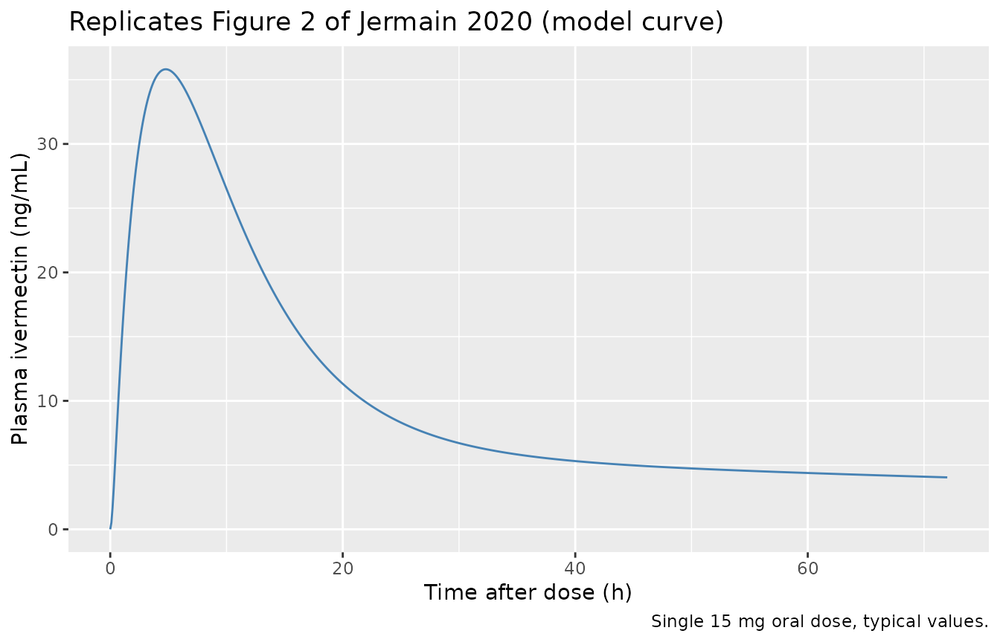
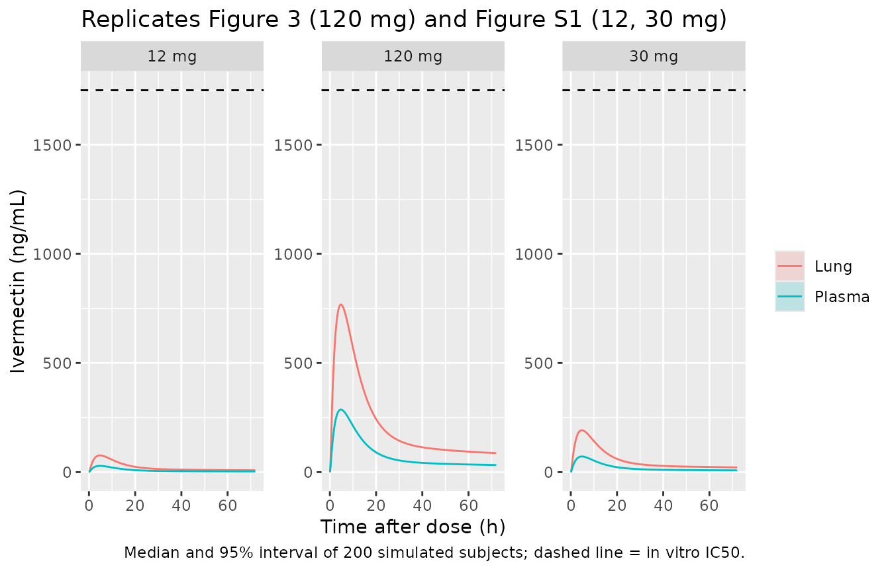

# Ivermectin lung exposure minimal PBPK (Jermain 2020)

## Model and source

Jermain et al. (2020) built a minimal physiologically-based
pharmacokinetic (mPBPK) model to ask whether oral ivermectin, repurposed
against SARS-CoV-2, reaches lung concentrations near its in vitro IC50
of 1750 ng/mL. The model has a transit compartment and an absorption
compartment feeding plasma, a lung compartment that receives the whole
cardiac output, and a lumped rest-of-body (“Other”) compartment that
receives a fraction of it. Both tissues are perfusion-rate-limited.

``` r

mod <- readModelDb("Jermain_2020_ivermectin_pbpk")
ui <- rxode2::rxode(mod)
```

- Citation: Jermain B, Hanafin PO, Cao Y, Lifschitz A, Lanusse C, Rao
  GG. Development of a Minimal Physiologically-Based Pharmacokinetic
  Model to Simulate Lung Exposure in Humans Following Oral
  Administration of Ivermectin for COVID-19 Drug Repurposing. J Pharm
  Sci. 2020;109(12):3574-3578. <doi:10.1016/j.xphs.2020.08.024>.
- Article: <https://doi.org/10.1016/j.xphs.2020.08.024>
- PubMed Central:
  <https://www.ncbi.nlm.nih.gov/pmc/articles/PMC7473010/>

PBPK (minimal, four-compartment; Phoenix WinNonlin 8.2). Oral ivermectin
disposition in adults with a transit-delayed first-order absorption, a
plasma compartment, a lung compartment perfused by the full cardiac
output and a lumped rest-of-body (Other) compartment perfused by a
fraction of the cardiac output (Jermain et al. 2020, J Pharm Sci
109:3574). Tissue uptake is perfusion-rate-limited. Plasma volume, lung
volume, cardiac output and the remaining volume are fixed physiological
values; the lung partition coefficient was fixed from the lung-to-plasma
AUC ratio in calves given subcutaneous ivermectin; ka, CL/F, the Other
partition coefficient, the fraction of cardiac output and the transit
rate were fitted to a simulated geometric-mean plasma profile after a 15
mg oral dose. Clearance and the partition coefficients are apparent
(divided by oral bioavailability F). The model carries no
between-subject variability and was built to predict total ivermectin
concentrations in lung tissue after single oral doses for COVID-19
repurposing.

## Population

The human part of the model was not fitted to individual data. The
authors took the population PK model of a phase 1 study in 18 healthy
volunteers given 0.2 mg/kg oral ivermectin (El-Tahtawy et al., reference
13 of the paper), simulated its geometric-mean plasma profile for the
study-average dose of 15 mg without between-subject or residual
variability, and fitted the five free mPBPK parameters to that profile
in Phoenix WinNonlin 8.2 (Methods, “Ivermectin Pharmacokinetic Data” and
“Parameters”).

The lung partition coefficient came from a different species: it is the
ratio of lung to plasma AUC in Holstein calves given 0.2 mg/kg
subcutaneous ivermectin (Lifschitz et al., reference 12), assumed to be
species-independent because plasma protein binding is similarly high in
cattle and humans. Physiological volumes and cardiac output are
population averages for adults (references 14 and 15). No covariates are
carried.

## Source trace

| Quantity | Model name | Value | Source |
|----|----|----|----|
| Absorption rate constant | `lka` | 0.14 1/h | Table 1 (CV 2.52%) |
| Apparent plasma clearance CLp/F | `lcl` | 10.85 L/h | Table 1 (CV 3.78%) |
| Apparent Other partition coefficient Kp,other/F | `lkp_other` | 17.32 | Table 1 (CV 5.6%) |
| Fraction of cardiac output to Other | `fq_other` | 0.08 | Table 1 (CV 1.18%) |
| Transit rate constant | `lktr` | 0.36 1/h | Table 1 (CV 3.09%) |
| Apparent lung partition coefficient Kp,lung/F | `lkp_lung` | 2.68 (fixed) | Table 1, footnote a; calf AUC ratio (Methods) |
| Plasma volume | `lvc` | 3 L (fixed) | Table 1, footnote a (ref 15) |
| Lung volume | `lv_lung` | 1.3 L (fixed) | Table 1, footnote a (ref 14) |
| Remaining volume | `lv_other` | 65.7 L (fixed) | Table 1, footnote a |
| Cardiac output | `q_co` | 282 L/h (fixed) | Table 1, footnote a (ref 15) |
| Residual error, plasma and lung | `propSd`, `propSd_Clung` | 20% (fixed) | Methods, “Human Lung Exposure Simulation” |
| Transit and absorption ODEs | `depot`, `transit1` | – | page 3576, equations for a0 and Absorption |
| Plasma ODE | `central` | – | page 3576, plasma equation (full-width) |
| Lung and Other ODEs | `lung`, `other` | – | page 3576, right column |
| Model schematic | – | – | Figure 1 |

## Typical-value simulation of the fitted 15 mg profile (Figure 2)

Figure 2 of the paper overlays the mPBPK fit on the simulated
geometric-mean plasma profile after 15 mg. The published points are not
tabulated, so only the model curve is reproduced here.

``` r

mod_typ <- rxode2::zeroRe(mod)
#> Warning: No omega parameters in the model

# The model has two error endpoints (plasma and lung), so each observation row
# names its endpoint with dvid; both Cc and Clung come back as columns.
make_events <- function(dose, times, n = 1) {
  dplyr::bind_rows(
    data.frame(id = seq_len(n), time = 0, amt = dose, evid = 1L,
               cmt = "depot", dvid = NA_integer_),
    expand.grid(id = seq_len(n), time = times) |>
      dplyr::mutate(amt = 0, evid = 0L, cmt = NA_character_, dvid = 1L)
  ) |>
    dplyr::arrange(id, time, dplyr::desc(evid))
}

sim15 <- as.data.frame(rxode2::rxSolve(mod_typ, make_events(15, seq(0, 72, by = 0.1))))

ggplot(sim15, aes(time, Cc)) +
  geom_line(colour = "steelblue") +
  labs(x = "Time after dose (h)", y = "Plasma ivermectin (ng/mL)",
       title = "Replicates Figure 2 of Jermain 2020 (model curve)",
       caption = "Single 15 mg oral dose, typical values.")
```



## Lung and plasma exposure after 12, 30 and 120 mg (Figure 3, Figure S1)

The authors simulated 1000 subjects per dose on a 0.1 h grid with an
assumed 20% residual error and no between-subject variability, and
plotted the median and 95% interval. A cohort of 200 per dose is used
here.

``` r

rxode2::rxSetSeed(20200904)
doses <- c(12, 30, 120)
times <- seq(0, 72, by = 0.1)

sim_sto <- dplyr::bind_rows(lapply(doses, function(d) {
  as.data.frame(rxode2::rxSolve(mod, make_events(d, times, n = 200))) |>
    dplyr::mutate(dose = d)
}))
#> Warning: multi-subject simulation without without 'omega'
#> Warning: multi-subject simulation without without 'omega'
#> Warning: multi-subject simulation without without 'omega'

band <- sim_sto |>
  tidyr::pivot_longer(c(Cc, Clung), names_to = "matrix", values_to = "conc") |>
  dplyr::mutate(matrix = ifelse(matrix == "Cc", "Plasma", "Lung")) |>
  dplyr::group_by(dose, matrix, time) |>
  dplyr::summarise(
    median = stats::median(conc),
    lo = stats::quantile(conc, 0.025),
    hi = stats::quantile(conc, 0.975),
    .groups = "drop"
  )

ggplot(band, aes(time, median, colour = matrix, fill = matrix)) +
  geom_ribbon(aes(ymin = lo, ymax = hi), alpha = 0.2, colour = NA) +
  geom_line() +
  geom_hline(yintercept = 1750, linetype = "dashed") +
  facet_wrap(~ paste(dose, "mg"), scales = "free_y") +
  labs(x = "Time after dose (h)", y = "Ivermectin (ng/mL)",
       colour = NULL, fill = NULL,
       title = "Replicates Figure 3 (120 mg) and Figure S1 (12, 30 mg)",
       caption = "Median and 95% interval of 200 simulated subjects; dashed line = in vitro IC50.")
```



The stochastic median tracks the typical-value profile, since the only
variability in the model is residual error:

``` r

sim120_typ <- as.data.frame(rxode2::rxSolve(mod_typ, make_events(120, times)))
med120 <- band |>
  dplyr::filter(dose == 120) |>
  dplyr::group_by(matrix) |>
  dplyr::summarise(cmax_median = max(median), .groups = "drop")
med120
#> # A tibble: 2 × 2
#>   matrix cmax_median
#>   <chr>        <dbl>
#> 1 Lung          768.
#> 2 Plasma        287.

stopifnot(
  abs(med120$cmax_median[med120$matrix == "Plasma"] / max(sim120_typ$Cc) - 1) < 0.1,
  abs(med120$cmax_median[med120$matrix == "Lung"] / max(sim120_typ$Clung) - 1) < 0.1
)
```

## PKNCA validation

NCA is run on the typical-value profiles for each dose, separately for
plasma and lung, over a long enough window (0-2000 h) that the
extrapolated AUC is negligible.

``` r

nca_times <- sort(unique(c(seq(0, 24, by = 0.1), seq(25, 2000, by = 5))))
sim_nca <- dplyr::bind_rows(lapply(doses, function(d) {
  as.data.frame(rxode2::rxSolve(mod_typ, make_events(d, nca_times))) |>
    dplyr::mutate(id = 1L, treatment = paste(d, "mg"), dose = d)
}))

run_nca <- function(conc_col) {
  conc_df <- sim_nca |>
    dplyr::transmute(id, treatment, time, conc = .data[[conc_col]]) |>
    dplyr::filter(!is.na(conc))
  dose_df <- sim_nca |>
    dplyr::distinct(id, treatment, dose) |>
    dplyr::mutate(time = 0)
  res <- PKNCA::pk.nca(PKNCA::PKNCAdata(
    PKNCA::PKNCAconc(conc_df, conc ~ time | treatment + id),
    PKNCA::PKNCAdose(dose_df, dose ~ time | treatment + id),
    intervals = data.frame(start = 0, end = Inf, cmax = TRUE, tmax = TRUE,
                           aucinf.obs = TRUE, half.life = TRUE)
  ))
  as.data.frame(res)
}

nca_plasma <- run_nca("Cc") |> dplyr::mutate(matrix = "Plasma")
nca_lung <- run_nca("Clung") |> dplyr::mutate(matrix = "Lung")

nca_all <- dplyr::bind_rows(nca_plasma, nca_lung) |>
  dplyr::filter(PPTESTCD %in% c("cmax", "tmax", "aucinf.obs", "half.life")) |>
  dplyr::select(matrix, treatment, PPTESTCD, PPORRES) |>
  tidyr::pivot_wider(names_from = PPTESTCD, values_from = PPORRES)

nca_all |>
  dplyr::rename(
    "Matrix" = matrix, "Dose" = treatment, "Cmax (ng/mL)" = cmax,
    "Tmax (h)" = tmax, "AUC0-inf (h*ng/mL)" = aucinf.obs, "t1/2 (h)" = half.life
  ) |>
  knitr::kable(digits = 2, caption = "Typical-value NCA of plasma and lung.")
```

| Matrix | Dose   | Cmax (ng/mL) | Tmax (h) | t1/2 (h) | AUC0-inf (h\*ng/mL) |
|:-------|:-------|-------------:|---------:|---------:|--------------------:|
| Plasma | 12 mg  |        28.65 |      4.8 |   107.76 |             1106.47 |
| Plasma | 120 mg |       286.53 |      4.8 |   107.76 |            11064.70 |
| Plasma | 30 mg  |        71.63 |      4.8 |   107.76 |             2766.17 |
| Lung   | 12 mg  |        76.79 |      4.8 |   107.76 |             2965.33 |
| Lung   | 120 mg |       767.90 |      4.8 |   107.76 |            29653.43 |
| Lung   | 30 mg  |       191.98 |      4.8 |   107.76 |             7413.34 |

Typical-value NCA of plasma and lung. {.table}

Two exact identities follow from the model structure and check that the
ODEs were transcribed with the right flows. First, dose over AUC in
plasma recovers CLp/F. Second, because the lung is perfused by the full
cardiac output in and out, its AUC is exactly Kp,lung/F times the plasma
AUC; that ratio is how the authors defined Kp,lung/F from the calf data.

``` r

auc_p <- nca_plasma |> dplyr::filter(PPTESTCD == "aucinf.obs") |> dplyr::arrange(treatment)
auc_l <- nca_lung |> dplyr::filter(PPTESTCD == "aucinf.obs") |> dplyr::arrange(treatment)
dose_by_trt <- as.numeric(sub(" mg", "", auc_p$treatment))

cl_recovered <- 1000 * dose_by_trt / auc_p$PPORRES   # mg / (h*ng/mL) -> L/h
ratio_lung <- auc_l$PPORRES / auc_p$PPORRES
data.frame(treatment = auc_p$treatment, cl_recovered, ratio_lung)
#>   treatment cl_recovered ratio_lung
#> 1     12 mg     10.84535   2.680004
#> 2    120 mg     10.84530   2.680003
#> 3     30 mg     10.84533   2.680003

stopifnot(
  all(abs(cl_recovered / 10.85 - 1) < 0.01),
  all(abs(ratio_lung / 2.68 - 1) < 0.01)
)
```

### Comparison against the published 120 mg peak

The paper reports the maximum simulated concentration after 120 mg as
288 ng/mL in plasma and 772 ng/mL in lung, both at 5.1 h (Results,
“Human Lung Exposure Simulation”). Those values are read from the median
of the authors’ stochastic simulation, which for a model whose only
variability is residual error sits on the typical-value profile.

``` r

simulated <- nca_all |>
  dplyr::filter(treatment == "120 mg") |>
  dplyr::transmute(group = matrix, cmax, tmax)

published <- data.frame(
  group = c("Plasma", "Lung"),
  cmax = c(288, 772),
  tmax = c(5.1, 5.1)
)

cmp <- nlmixr2lib::ncaComparisonTable(
  simulated = simulated,
  reference = published,
  by = "group",
  tolerance_pct = 20
)
knitr::kable(cmp, caption = "Simulated typical-value 120 mg peak versus Jermain 2020. * marks a difference greater than 20%.")
```

| NCA parameter | group  | Reference | Simulated | % diff |
|:--------------|:-------|:----------|:----------|:-------|
| Cmax          | Plasma | 288       | 287       | -0.5%  |
| Cmax          | Lung   | 772       | 768       | -0.5%  |
| Tmax          | Plasma | 5.1       | 4.8       | -5.9%  |
| Tmax          | Lung   | 5.1       | 4.8       | -5.9%  |

Simulated typical-value 120 mg peak versus Jermain 2020. \* marks a
difference greater than 20%. {.table}

``` r


typ_cmax <- setNames(simulated$cmax, simulated$group)
stopifnot(
  abs(typ_cmax[["Plasma"]] / 288 - 1) < 0.05,
  abs(typ_cmax[["Lung"]] / 772 - 1) < 0.05
)
```

The simulated peaks agree with the paper to within about 1%, and the
simulated Tmax (about 4.8 h) is within 0.3 h of the published 5.1 h; the
published value is the peak of a median over noisy stochastic profiles,
which shifts it slightly. Neither dose reaches the 1750 ng/mL in vitro
IC50 in lung, matching the paper’s conclusion.

## Assumptions and deviations

- **`Ka*Dose` read as `Ka*Absorption`.** The printed absorption and
  plasma equations (page 3576) write the absorption flux as `Ka*Dose`.
  Taken literally that is a constant input that never stops and drives
  the Absorption amount negative. Figure 1 draws the flux from the
  Absorption compartment to Plasma with rate Ka, and the text calls Ka a
  first-order absorption rate constant, so the flux is encoded as
  `ka * transit1` (the Absorption amount). With that reading the model
  reproduces the published 120 mg plasma and lung peaks to within about
  1%.
- **Compartment naming.** The paper’s transit compartment `a0` (which
  receives the dose) is `depot`, and its Absorption compartment is
  `transit1`, so the chain reads depot –ktr–\> transit1 –ka–\> central.
- **Residual error.** The paper used an “assumed 20% RUV” of unstated
  form for its lung-exposure simulations and does not say whether it
  applied the same error to lung. It is encoded as a fixed 20%
  proportional error on both the plasma and the lung output. It was not
  estimated; the fit itself was to a noise-free profile.
- **No between-subject variability.** None was estimated or used by the
  authors, so none is encoded; stochastic simulations vary only by
  residual error.
- **Apparent (F-scaled) parameters.** CLp/F, Kp,lung/F and Kp,other/F
  are used exactly as tabulated. Bioavailability is not separated out,
  so the dose is given into `depot` with F = 1.
- **Cardiac-output topology.** As printed, plasma loses flow to lung at
  the full cardiac output and to the Other compartment at
  `Fraction * Qco` in parallel, so the total flow out of plasma is
  `(1 + Fraction) * Qco`. That is the published equation set and it is
  reproduced as written.
- **Figure 2 data.** The simulated geometric-mean plasma concentrations
  the model was fitted to are shown only graphically; they were not
  digitised, and the Figure 2 replicate shows the model curve only.
- **Supplement.** The supplementary material (calf lung and plasma data,
  Table S1, and the 12 and 30 mg simulations, Figure S1) holds no model
  parameters; the 12 and 30 mg panels above are simulated from the Table
  1 parameters.
