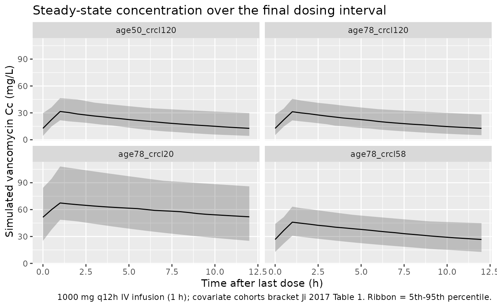
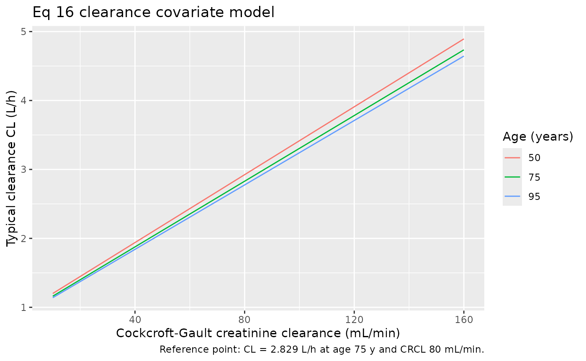

# Vancomycin (Ji 2017)

## Model and source

- Citation: Ji XW, Ji SM, He XR, Zhu X, Chen R, Lu W. Influences of
  renal function descriptors on population pharmacokinetic modeling of
  vancomycin in Chinese adult patients. Acta Pharmacol Sin.
  2018;39(2):286-293. <doi:10.1038/aps.2017.57> (published online 24 Aug
  2017)
- Description: One-compartment IV (intermittent-infusion) population PK
  model for vancomycin in Chinese adult patients (Ji 2017). Clearance is
  scaled by raw Cockcroft-Gault creatinine clearance (centered linear
  term, reference 80 mL/min) and by age (power of (75/age), reference 75
  years); the volume of distribution is a single typical value.
  Developed from steady-state trough therapeutic-drug-monitoring data.
- Article: [Acta Pharmacol Sin
  2018;39(2):286-293](https://doi.org/10.1038/aps.2017.57)

The article was published online on 24 Aug 2017 (DOI `aps.2017.57`) and
appeared in the 2018 print volume; the model file uses the online/DOI
year (2017) in its name while the `reference` field carries the full
2018 print citation.

## Population

The model was developed from routine therapeutic-drug-monitoring data on
160 hospitalized Chinese adults treated with intravenous vancomycin
(1000 mg every 12 h) at Beijing Hospital, Beijing, China (Ji 2017 Table
1); a further 58 patients were held out for external validation (218
patients in total). None were on renal replacement therapy. Median age
was 78 years (range 42-95), median body weight 65 kg (range 38-90), and
median Cockcroft-Gault creatinine clearance 58.02 mL/min (range
5.45-224.0). 54 of 160 model-building subjects (33.75%) were female. The
dataset contained 251 trough (Cmin) serum vancomycin concentrations
sampled before the next dose; each patient contributed at least one
sample (median 2, range 1-17). Concentrations were measured by TDx-FLx
fluorescence polarization immunoassay (LOQ 2.0 mg/L) and parameters
estimated in NONMEM 7 with FOCEI. The same information is available
programmatically via `readModelDb("Ji_2017_vancomycin")$population`.

## Source trace

Every numeric value in `ini()` carries an in-file comment pointing to
the Ji 2017 source location. The table below collects them in one place
for review.

| Equation / parameter | Value | Source location |
|----|----|----|
| `lcl` (CL) | 2.829 L/h | Eq 16 / Table 3, row “CL (L/h)” (final model) |
| `lvc` (V) | 52.14 L | Eq 17 / Table 3, row “V (L)” (final model) |
| `e_crcl_cl` (theta_CLcr) | 0.00842 | Eq 16 / Table 3, row “theta Clcr_CL” |
| `e_age_cl` (theta_Age) | 0.08143 | Eq 16 + Abstract + Results text |
| `etalcl` (var 0.1051) | 0.1051 | Results text (“variances of 0.1051 and 0.083”) |
| `etalvc` (var 0.083) | 0.083 | Results text (“variances of 0.1051 and 0.083”) |
| `propSd` (26.79% CV) | 0.2679 | Table 3, row “CV (%)” (final model) |
| `addSd` | 2.647 mg/L | Table 3, row “Residual variability SD” (final) |
| CL covariate equation | n/a | Eq 16 |
| Combined residual model | n/a | Eq 2 |
| Exponential IIV model | n/a | Eq 1 |
| CRCL reference (80) | 80 mL/min | Eq 16 / Results text |
| AGE reference (75) | 75 years | Eq 16 / Results text |
| 1-cmt IV structural | n/a | Results para 1; Table 3 (only CL, V estimated) |

The full clearance covariate model (Ji 2017 Eq 16) is

    CL = 2.829 * (1 + 0.00842 * (CLcr - 80)) * (75 / Age)^0.08143 * exp(eta1)   (L/h)

and the volume of distribution (Eq 17) is `V = 52.14 * exp(eta2)` (L).

## Virtual cohort

Original observed data are not publicly available. The cohort below
covers four scenarios bracketing the paper’s covariate space: the
typical model-building subject (median age, median CRCL), a
good-renal-function subject, a poor-renal-function subject, and a
younger high-clearance subject. All receive the studied regimen of 1000
mg every 12 h as a 1-hour IV infusion, simulated to steady state.

``` r

set.seed(20260527)

n_sub  <- 120L
tau    <- 12                      # dosing interval (h)
n_dose <- 14L                     # number of q12h doses -> steady state
dose_times <- seq(0, by = tau, length.out = n_dose)
last_dose  <- max(dose_times)     # 156 h
ss_end     <- last_dose + tau     # 168 h

# Observation grid: coarse over the whole horizon for the VPC, dense over the
# final (steady-state) dosing interval for NCA.
obs_times <- sort(unique(c(
  seq(0, ss_end, by = 3),
  seq(last_dose, ss_end, by = 0.5)
)))

build_arm <- function(label, age, crcl, id_offset) {
  ids <- id_offset + seq_len(n_sub)

  dose_rows <- tidyr::expand_grid(id = ids, time = dose_times) |>
    mutate(
      evid   = 1L,
      amt    = 1000,
      cmt    = "central",
      rate   = 1000 / 1,        # 1000 mg infused over 1 hour
      cohort = label,
      AGE    = age,
      CRCL   = crcl
    )

  obs_rows <- tidyr::expand_grid(id = ids, time = obs_times) |>
    mutate(
      evid   = 0L,
      amt    = 0,
      cmt    = NA_character_,
      rate   = 0,
      cohort = label,
      AGE    = age,
      CRCL   = crcl
    )

  bind_rows(dose_rows, obs_rows) |> arrange(id, time, desc(evid))
}

events <- bind_rows(
  build_arm("age78_crcl58",  78, 58,    0L),  # typical model-building subject
  build_arm("age78_crcl120", 78, 120, 120L),  # good renal function
  build_arm("age78_crcl20",  78, 20,  240L),  # poor renal function
  build_arm("age50_crcl120", 50, 120, 360L)   # younger, high clearance
)

stopifnot(!anyDuplicated(unique(events[, c("id", "time", "evid")])))
```

## Simulation

``` r

mod <- readModelDb("Ji_2017_vancomycin")
sim <- rxode2::rxSolve(
  mod,
  events = events,
  keep   = c("cohort", "AGE", "CRCL")
) |> as.data.frame()
#> ℹ parameter labels from comments will be replaced by 'label()'
```

For the typical-value reproduction of Eq 16 (no between-subject
variability), also simulate with the random effects zeroed:

``` r

mod_typical <- mod |> rxode2::zeroRe()
#> ℹ parameter labels from comments will be replaced by 'label()'
sim_typical <- rxode2::rxSolve(
  mod_typical,
  events = events,
  keep   = c("cohort", "AGE", "CRCL")
) |> as.data.frame()
#> ℹ omega/sigma items treated as zero: 'etalcl', 'etalvc'
#> Warning: multi-subject simulation without without 'omega'
```

## Replicate published figures

Ji 2017 Figure 2 is a visual predictive check of trough concentrations
and Figure 1 shows observed-vs-predicted goodness-of-fit clouds; neither
is a per-subject concentration-time curve that can be reproduced
directly. The block below summarises the simulated steady-state
concentration-time profile for each covariate cohort, illustrating the
renal- and age-dependent accumulation that drives the paper’s
dose-individualisation analysis.

``` r

sim |>
  filter(time >= last_dose) |>
  mutate(tad = time - last_dose) |>
  group_by(cohort, tad) |>
  summarise(
    Q05 = quantile(Cc, 0.05, na.rm = TRUE),
    Q50 = quantile(Cc, 0.50, na.rm = TRUE),
    Q95 = quantile(Cc, 0.95, na.rm = TRUE),
    .groups = "drop"
  ) |>
  ggplot(aes(tad, Q50)) +
  geom_ribbon(aes(ymin = Q05, ymax = Q95), alpha = 0.25) +
  geom_line() +
  facet_wrap(~ cohort) +
  labs(
    x = "Time after last dose (h)",
    y = "Simulated vancomycin Cc (mg/L)",
    title = "Steady-state concentration over the final dosing interval",
    caption = "1000 mg q12h IV infusion (1 h); covariate cohorts bracket Ji 2017 Table 1. Ribbon = 5th-95th percentile."
  )
```



The clearance covariate relationships of Eq 16 (CL rises with creatinine
clearance and falls with age) are reproduced directly from the packaged
model’s typical-value clearance:

``` r

cov_grid <- tidyr::expand_grid(
  AGE  = c(50, 75, 95),
  CRCL = seq(10, 160, by = 10)
) |>
  mutate(CL = 2.829 * (1 + 0.00842 * (CRCL - 80)) * (75 / AGE)^0.08143)

ggplot(cov_grid, aes(CRCL, CL, colour = factor(AGE))) +
  geom_line() +
  labs(
    x = "Cockcroft-Gault creatinine clearance (mL/min)",
    y = "Typical clearance CL (L/h)",
    colour = "Age (years)",
    title = "Eq 16 clearance covariate model",
    caption = "Reference point: CL = 2.829 L/h at age 75 y and CRCL 80 mL/min."
  )
```



## PKNCA validation

Ji 2017 does not publish an NCA table (Cmax / AUC); the model was built
on trough concentrations and used to drive a dose-targeting simulation.
The PKNCA block below characterises the steady-state interval metrics
(Cmax,ss, Tmax, Cmin/Ctrough = trough, Cavg, AUC0-tau) over the final
dosing interval for each covariate cohort, providing a one-table audit
of the simulated steady-state exposure. The treatment grouping is
`cohort`.

``` r

sim_nca <- sim |>
  filter(!is.na(Cc), time >= last_dose) |>
  select(id, time, Cc, cohort)

dose_df <- events |>
  filter(evid == 1, time == last_dose) |>
  select(id, time, amt, cohort)

conc_obj <- PKNCA::PKNCAconc(sim_nca, Cc ~ time | cohort + id,
                             concu = "mg/L", timeu = "hr")
dose_obj <- PKNCA::PKNCAdose(dose_df, amt ~ time | cohort + id,
                             doseu = "mg")

intervals <- data.frame(
  start   = last_dose,
  end     = ss_end,
  cmax    = TRUE,
  tmax    = TRUE,
  cmin    = TRUE,
  ctrough = TRUE,
  cav     = TRUE,
  auclast = TRUE
)

nca_res <- PKNCA::pk.nca(
  PKNCA::PKNCAdata(conc_obj, dose_obj, intervals = intervals)
)

nca_summary <- summary(nca_res)
knitr::kable(
  nca_summary,
  caption = "Simulated steady-state NCA parameters by covariate cohort (1000 mg q12h IV infusion, final dosing interval)."
)
```

| Interval Start | Interval End | cohort | N | AUClast (hr\*mg/L) | Cmax (mg/L) | Cmin (mg/L) | Tmax (hr) | Cav (mg/L) | Ctrough (mg/L) |
|---:|---:|:---|:---|:---|:---|:---|:---|:---|:---|
| 156 | 168 | age50_crcl120 | 120 | 247 \[34.2\] | 31.5 \[24.0\] | 12.1 \[58.4\] | 1.00 \[1.00, 1.00\] | 20.6 \[34.2\] | NC |
| 156 | 168 | age78_crcl120 | 120 | 248 \[35.3\] | 31.8 \[24.4\] | 11.9 \[65.0\] | 1.00 \[1.00, 1.00\] | 20.6 \[35.3\] | NC |
| 156 | 168 | age78_crcl20 | 120 | 709 \[32.3\] | 69.0 \[27.3\] | 49.7 \[39.1\] | 1.00 \[1.00, 1.00\] | 59.1 \[32.3\] | NC |
| 156 | 168 | age78_crcl58 | 120 | 417 \[29.8\] | 45.0 \[23.8\] | 25.8 \[40.8\] | 1.00 \[1.00, 1.00\] | 34.7 \[29.8\] | NC |

Simulated steady-state NCA parameters by covariate cohort (1000 mg q12h
IV infusion, final dosing interval). {.table}

### Comparison against published values

Ji 2017 reports no Cmax / AUC NCA table, so there is no published NCA
row to compare against directly. The two checks below validate that the
packaged model reproduces the paper’s structural parameter
relationships.

``` r

# Typical clearance at the published reference point and at illustrative
# covariate values, computed (a) by hand from Eq 16 and (b) from the
# zero-random-effect simulation.
ref_check <- sim_typical |>
  # sim_typical retains per-subject cl/vc values inherited from the
  # preceding `sim` simulation's IIV state, so unique(cl) can return >1
  # value within a cohort. mean() collapses the per-id values back to
  # the typical-value cohort summary that this table is meant to show.
  group_by(cohort, AGE, CRCL) |>
  summarise(CL_model = mean(cl), V_model = mean(vc), .groups = "drop") |>
  mutate(
    CL_eq16 = 2.829 * (1 + 0.00842 * (CRCL - 80)) * (75 / AGE)^0.08143,
    V_eq17  = 52.14
  ) |>
  select(cohort, AGE, CRCL, CL_eq16, CL_model, V_eq17, V_model)

knitr::kable(
  ref_check,
  caption = "Typical CL (Eq 16) and V (Eq 17): hand-computed vs packaged-model values.",
  digits = 3
)
```

| cohort        | AGE | CRCL | CL_eq16 | CL_model | V_eq17 | V_model |
|:--------------|----:|-----:|--------:|---------:|-------:|--------:|
| age50_crcl120 |  50 |  120 |   3.909 |    3.909 |  52.14 |   52.14 |
| age78_crcl120 |  78 |  120 |   3.770 |    3.770 |  52.14 |   52.14 |
| age78_crcl20  |  78 |   20 |   1.395 |    1.395 |  52.14 |   52.14 |
| age78_crcl58  |  78 |   58 |   2.298 |    2.298 |  52.14 |   52.14 |

Typical CL (Eq 16) and V (Eq 17): hand-computed vs packaged-model
values. {.table}

The packaged model returns CL = 2.829 L/h and V = 52.14 L at the
reference subject (age 75 y, CRCL 80 mL/min), matching Ji 2017 Eq 16-17
/ Table 3 exactly, and reproduces the hand-computed Eq 16 clearance at
every cohort. Across the renal-function range the simulated steady-state
troughs span roughly 14 mg/L (high clearance) to ~50 mg/L (CRCL 20
mL/min) for a fixed 1000 mg q12h regimen, consistent with the paper’s
finding that renal function dominates vancomycin exposure and that dose
individualisation is required to keep troughs within the 10-15 / 15-20
mg/L targets.

## Assumptions and deviations

- **Age covariate coefficient (0.08143, not 0.8143).** Ji 2017 Eq 16,
  the Abstract, and the Results text all state the age exponent as
  **0.08143**. Table 3 prints `theta Age_CL = 0.8143` (RSE 53.68%) with
  bootstrap median `0.8373` – a 10x discrepancy. The packaged model uses
  **0.08143** because three independent statements (the model-defining
  equation, the abstract, and the Results narrative) agree on it, and
  only the single Table 3 cell (plus its bootstrap row) carries the
  larger value, which is a dropped-leading-zero typographical error. The
  directionality is also a cross-check: the paper states vancomycin
  excretion *decreases* as renal function diminishes with age, which
  `(75/Age)^0.08143` reproduces (CL falls as age rises above 75). Europe
  PMC (PMID 28836582) lists no erratum or corrigendum for this article.
- **Additive residual error units (mg/L, not ng/mL).** Table 3 labels
  the additive residual row “Residual variability SD (ng/mL)” = 2.647,
  but the vancomycin concentration unit is mg/L throughout the paper
  (Table 1, LOQ 2.0 mg/L, target troughs in mg/L). An additive SD of
  2.647 ng/mL (= 0.0026 mg/L) would be negligible and incompatible with
  the authors’ choice of a combined error model, whereas 2.647 mg/L is a
  sensible additive term near the 2.0 mg/L LOQ. The packaged model
  therefore treats 2.647 as mg/L; the “(ng/mL)” column label is read as
  a units typo.
- **One-compartment IV, no absorption compartment.** The Abstract and
  Results describe “first-order absorption” while the Discussion says
  “zero-order absorption”, but vancomycin was given by intravenous
  infusion and Table 3 estimates only CL and V (no absorption rate
  constant). The drug is therefore dosed directly into the central
  compartment as an IV infusion; no depot / `ka` is included, since none
  was estimated and inventing one is not supported by the source.
- **IIV variances taken from the Results text.** The Results state the
  eta variances directly (“variances of 0.1051 and 0.083, respectively”)
  for CL and V; these go into `ini()` as the omega values
  (`etalcl ~ 0.1051`, `etalvc ~ 0.083`). They reproduce the Table 3 “IIV
  (%)” rows on the square-root scale (sqrt(0.1051) = 32.4%; sqrt(0.083)
  = 28.8%).
- **Infusion duration.** The paper records “continuous infusion of
  vancomycin (1000 mg q12 h)” with trough sampling before the next dose,
  i.e. intermittent q12h infusions. The infusion duration is not stated;
  the vignette assumes a 1-hour infusion (a common vancomycin practice
  and the same convention used in the Goti 2018 vancomycin vignette).
  The infusion duration has negligible effect on the modeled trough
  concentrations.
- **Year in the file name.** The article was published online in 2017
  (DOI `10.1038/aps.2017.57`) and in print in 2018 (Acta Pharmacol Sin
  39(2):286-293). The model file / vignette name uses 2017 (online/DOI
  year); the `reference` field gives the full 2018 print citation.
- **Dose-individualisation supplements not used.** The dosing-regimen
  tables (Tables S1-S4) referenced for the 10-15 and 15-20 mg/L trough
  targets are simulation outputs in the journal’s supplementary
  information and were not available on disk. They contain no model
  parameters (all final estimates are in Eq 16-17 and Table 3), so their
  absence does not affect the packaged model.
- **Virtual-cohort demographics.** Race / ethnicity beyond “Chinese
  adults” is not reported and is not a model covariate; the virtual
  cohort fixes age and CRCL per arm to illustrate the covariate effects
  rather than sampling the full joint demographic distribution.
