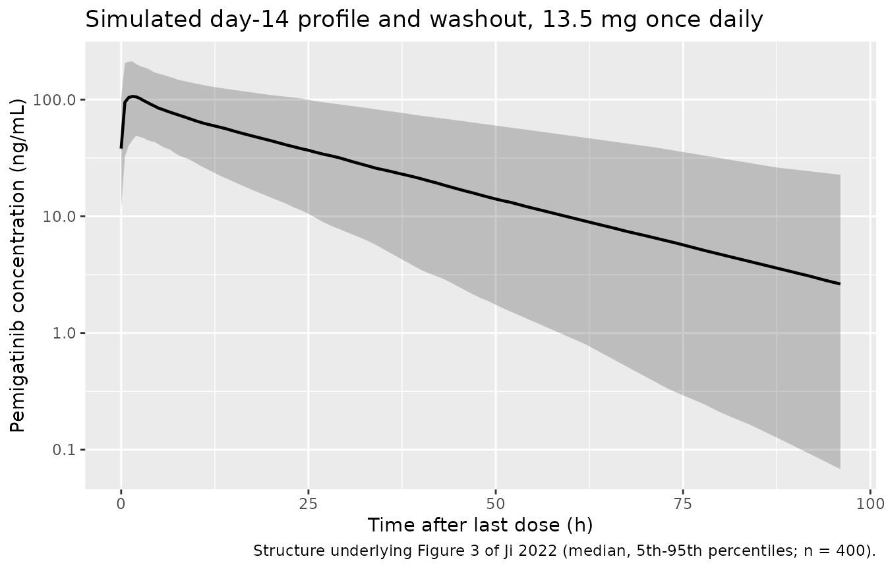

# Pemigatinib (Ji 2022)

## Model and source

- Citation: Ji T, Chen X, Liu X, Yeleswaram S. Population
  Pharmacokinetics Analysis of Pemigatinib in Patients With Advanced
  Malignancies. Clin Pharmacol Drug Dev. 2022;11(4):454-466.
- Article: <https://doi.org/10.1002/cpdd.1038> (open access, PMC9306536)

Pemigatinib is an oral inhibitor of fibroblast growth factor receptors
1-3, approved for previously treated cholangiocarcinoma with an *FGFR2*
fusion or rearrangement at 13.5 mg once daily, 2 weeks on and 1 week
off. Ji 2022 is the first population PK analysis of pemigatinib: a
two-compartment model with first-order absorption and linear
elimination. A later, larger analysis of the same programme (Gong 2023,
seven studies, sequential zero-/first-order absorption) is packaged
separately as `Gong_2023_pemigatinib`.

``` r

mod <- readModelDb("Ji_2022_pemigatinib")
```

## Population

The analysis pooled 2968 plasma concentrations from 318 patients in
three studies (Ji 2022 Table 1 and Results “Data Description”):
FIGHT-101, a phase 1/2 dose-escalation/expansion study in advanced
malignancies (157 patients, 1-20 mg once daily, rich sampling);
FIGHT-102, a phase 1 study in Japanese patients (25 patients, 9 and 13.5
mg, rich sampling); and FIGHT-202, a phase 2 study in previously treated
cholangiocarcinoma (136 patients, 13.5 mg, sparse sampling). Median
(range) age was 59 (21-79) years and median (range) body weight 73.3
(39.8-156.0) kg; 55.0% were women; 68.2% were White, 8.8% Japanese, 7.2%
other Asian, 6.3% Black and 6.0% Hispanic (Table 2). Renal function was
normal in 45.9%, mildly impaired in 42.1% and moderately impaired in
11.9%; hepatic function was normal in 67.0%, mildly impaired in 29.6%
and moderately impaired in 3.5%. Co-medications (Table 3) included
phosphate binders (36.1%) used to manage on-target hyperphosphatemia,
proton-pump inhibitors (PPIs, 26.9%) and H2-receptor antagonists
(11.1%).

## Source trace

| Model element | Value | Source |
|----|----|----|
| Structure: 2-compartment, first-order absorption, linear elimination | – | Results “Base Structure Model” and “Final Model” |
| `lka` | log(1.49) 1/h | Table 4; Equation IV |
| `lcl` | log(9.00) L/h | Table 4; Equation I |
| `lvc` | log(161) L | Table 4; Equation II |
| `lvp` | log(80.1) L | Table 4; Equation III |
| `lq` | log(16.0) L/h | Table 4 |
| `e_phosbinder_cl` | 0.141, as `(1 + 0.141 (1 - BINDER))` | Table 4 “Phosphate binder on CL”; Equation I |
| `e_sex_cl` | 0.190, as `(1 + 0.19 (1 - SEXN))` | Table 4 “Sex (male vs female) on CL”; Equation I |
| `e_sex_ka` | 0.565, as `(1 - 0.565 (1 - SEXN))` | Equation IV (not tabulated in Table 4) |
| `e_ppi_vc` | -0.244, as `(1 - 0.244 (1 - PPI))` | Table 4 “Proton pump inhibitor on Vc/F”; Equation II |
| `e_wt_vc` | 0.738 on (WT/73.3) | Table 4; Equation II |
| `e_wt_vp` | 1.22 on (WT/73.3) | Table 4; Equation III |
| `etalcl`, `etalvc` | 0.434^2, 0.351^2; covariance 0.122 | Table 4 IIV %CV and “Omega matrix for CL/F and Vc/F” |
| `etalka` | 1.27^2 | Table 4 IIV %CV |
| `expSd` | 0.401 (log scale) | Table 4 “RV,SD”; Results “Base Structure Model” (log-transformed data) |
| SEXN coding 1 = male, 2 = female; BINDER 1 = used | – | “Where:” block below Equations I-IV |
| Reference body weight 73.3 kg | – | Equations II-III; Table 2 median |

### Reading the IIV %CV as sqrt(omega^2)

Table 4 lists IIV as %CV with a %RSE and a bootstrap 95% CI. The
discriminating row is ka (127 %CV, %RSE 12.3, CI 112-143). If the %RSE
refers to the variance `omega^2 = 1.27^2 = 1.613`, its delta-method CI
on the `sqrt(omega^2)` scale is `127 +/- 1.96 * 127 * 0.123 / 2`,
i.e. 112-142, which reproduces the printed interval. Under the
alternative reading `CV = sqrt(exp(omega^2) - 1)` the same %RSE gives
103-151. The model therefore uses `omega^2 = (CV/100)^2`. With these
variances the CL/F-Vc/F covariance of 0.122 corresponds to a correlation
of 0.80.

``` r

om <- c(cl = 0.434^2, vc = 0.351^2, ka = 1.27^2)
ci_sqrt <- 1.27 + c(-1, 1) * 1.96 * 1.27 * 0.123 / 2
w <- log(1 + 1.27^2)
ci_logcv <- 1.27 + c(-1, 1) * 1.96 * (0.123 * w) * exp(w) / (2 * 1.27)
knitr::kable(
  data.frame(
    Reading = c("omega^2 = CV^2", "omega^2 = log(1 + CV^2)", "Table 4 (bootstrap)"),
    `Lower (%)` = c(100 * ci_sqrt[1], 100 * ci_logcv[1], 112),
    `Upper (%)` = c(100 * ci_sqrt[2], 100 * ci_logcv[2], 143),
    check.names = FALSE
  ),
  digits = 0,
  caption = "95% CI of the ka IIV under the two %CV readings."
)
```

| Reading                 | Lower (%) | Upper (%) |
|:------------------------|----------:|----------:|
| omega^2 = CV^2          |       112 |       142 |
| omega^2 = log(1 + CV^2) |       103 |       151 |
| Table 4 (bootstrap)     |       112 |       143 |

95% CI of the ka IIV under the two %CV readings. {.table}

``` r

stopifnot(all(abs(100 * ci_sqrt - c(112, 143)) < 2))
cat("CL/F-Vc/F correlation:", round(0.122 / sqrt(om[["cl"]] * om[["vc"]]), 3), "\n")
#> CL/F-Vc/F correlation: 0.801
```

## Typical-value checks against the text

Ji 2022 reports typical values derived from Equations I-IV. All are
reproduced from the packaged model by solving with the random effects
set to zero.

``` r

typ_params <- function(SEXF, CONMED_PHOSBINDER, CONMED_PPI, WT = 73.3) {
  ev <- rxode2::et(amt = 1, cmt = "depot") |>
    rxode2::et(time = 1, cmt = "central") |>
    as.data.frame()
  ev$SEXF <- SEXF
  ev$CONMED_PHOSBINDER <- CONMED_PHOSBINDER
  ev$CONMED_PPI <- CONMED_PPI
  ev$WT <- WT
  out <- rxode2::rxSolve(rxode2::zeroRe(mod), events = ev) |> as.data.frame()
  out[1, c("ka", "cl", "vc", "vp", "q")]
}

male_nobinder <- typ_params(SEXF = 0, CONMED_PHOSBINDER = 0, CONMED_PPI = 0)
#> ℹ parameter labels from comments will be replaced by 'label()'
#> ℹ omega/sigma items treated as zero: 'etalcl', 'etalvc', 'etalka'
female_nobinder <- typ_params(SEXF = 1, CONMED_PHOSBINDER = 0, CONMED_PPI = 0)
#> ℹ parameter labels from comments will be replaced by 'label()'
#> ℹ omega/sigma items treated as zero: 'etalcl', 'etalvc', 'etalka'
male_binder <- typ_params(SEXF = 0, CONMED_PHOSBINDER = 1, CONMED_PPI = 0)
#> ℹ parameter labels from comments will be replaced by 'label()'
#> ℹ omega/sigma items treated as zero: 'etalcl', 'etalvc', 'etalka'
male_ppi <- typ_params(SEXF = 0, CONMED_PHOSBINDER = 0, CONMED_PPI = 1)
#> ℹ parameter labels from comments will be replaced by 'label()'
#> ℹ omega/sigma items treated as zero: 'etalcl', 'etalvc', 'etalka'

typ_tab <- tibble::tibble(
  Quantity = c(
    "ka, male (1/h)",
    "CL/F, male, no binder (L/h)",
    "Vc/F at 73.3 kg, no PPI (L)",
    "Vp/F at 73.3 kg (L)",
    "CL/F female / male",
    "ka female / male",
    "CL/F binder / no binder",
    "Vc/F PPI / no PPI"
  ),
  Model = c(
    male_nobinder$ka, male_nobinder$cl, male_nobinder$vc, male_nobinder$vp,
    female_nobinder$cl / male_nobinder$cl,
    female_nobinder$ka / male_nobinder$ka,
    male_binder$cl / male_nobinder$cl,
    male_ppi$vc / male_nobinder$vc
  ),
  Published = c(1.49, 10.3, 122.0, 80.1, 1 - 0.190, 1 + 0.565, 1 / 1.141, 1 / (1 - 0.244)),
  Source = c(
    "Results: 1.49 1/h",
    "Results: 10.3 L/h",
    "Results: 122.0 L",
    "Results: 80.1 L",
    "Equation I",
    "Equation IV; Discussion '56.5% higher for female'",
    "Equation I",
    "Equation II"
  )
)
knitr::kable(typ_tab, digits = 3, caption = "Typical values reproduced from the packaged model.")
```

| Quantity | Model | Published | Source |
|:---|---:|---:|:---|
| ka, male (1/h) | 1.490 | 1.490 | Results: 1.49 1/h |
| CL/F, male, no binder (L/h) | 10.269 | 10.300 | Results: 10.3 L/h |
| Vc/F at 73.3 kg, no PPI (L) | 121.716 | 122.000 | Results: 122.0 L |
| Vp/F at 73.3 kg (L) | 80.100 | 80.100 | Results: 80.1 L |
| CL/F female / male | 0.810 | 0.810 | Equation I |
| ka female / male | 1.565 | 1.565 | Equation IV; Discussion ‘56.5% higher for female’ |
| CL/F binder / no binder | 0.876 | 0.876 | Equation I |
| Vc/F PPI / no PPI | 1.323 | 1.323 | Equation II |

Typical values reproduced from the packaged model. {.table}

``` r


# Same parameters, closed form vs solve: only rounding of the published values.
stopifnot(all(abs(typ_tab$Model / typ_tab$Published - 1) < 0.005))
```

The Results text attributes ka = 1.49 1/h and CL/F = 10.3 L/h to
*female* patients, but under the printed coding (SEXN 1 = male, 2 =
female) these are the male, no-binder values; see Errata below.

## Virtual cohort

Observed data are not public. The cohort draws body weight log-normally
around the median of 73.3 kg, truncated to the observed 39.8-156 kg
range, with 200 men and 200 women so the sex effects can be compared
with the paper. Phosphate binder and PPI use are assigned per subject at
the pooled prevalences of Table 3 (36.1% and 26.9%) and held constant
over the simulation (both are time-varying in the source dataset). Every
subject receives the approved regimen, 13.5 mg once daily for 14 days
(the “on” part of a 21-day cycle).

``` r

set.seed(20220401)
rxode2::rxSetSeed(20220401)

n_per_sex <- 200L
dose_mg <- 13.5
tau <- 24
n_dose <- 14L
last_dose <- (n_dose - 1) * tau

subj <- tibble::tibble(
  id = seq_len(2 * n_per_sex),
  SEXF = rep(c(0, 1), each = n_per_sex),
  sex = ifelse(SEXF == 1, "Female", "Male"),
  WT = pmin(pmax(rlnorm(2 * n_per_sex, log(73.3), 0.25), 39.8), 156),
  CONMED_PHOSBINDER = rbinom(2 * n_per_sex, 1, 0.361),
  CONMED_PPI = rbinom(2 * n_per_sex, 1, 0.269)
)

doses <- subj |>
  tidyr::crossing(time = seq(0, by = tau, length.out = n_dose)) |>
  dplyr::mutate(amt = dose_mg, evid = 1L, cmt = "depot")

obs_times <- sort(unique(c(
  seq(0, 24, by = 0.5),
  last_dose + c(seq(0, 12, by = 0.5), seq(13, 96, by = 1))
)))
obs <- subj |>
  tidyr::crossing(time = obs_times) |>
  dplyr::mutate(amt = NA_real_, evid = 0L, cmt = "central")

events <- dplyr::bind_rows(doses, obs) |>
  dplyr::arrange(id, time, dplyr::desc(evid))
```

## Simulation

``` r

sim <- rxode2::rxSolve(mod, events = events, keep = c("sex", "WT")) |>
  as.data.frame()
#> ℹ parameter labels from comments will be replaced by 'label()'
stopifnot(!anyNA(sim$Cc))
```

## Replicate published figures

### Visual predictive check structure (Figure 3)

Figure 3 of Ji 2022 is a VPC of log concentration against time after the
last dose for the pooled dataset (all doses and days). It cannot be
reproduced exactly without the observed data and dosing history; the
plot below shows the simulated median and 5th/95th percentiles at steady
state (day 14, 13.5 mg once daily) followed by the washout.

``` r

sim |>
  dplyr::filter(time >= last_dose) |>
  dplyr::mutate(tad = time - last_dose) |>
  dplyr::group_by(tad) |>
  dplyr::summarise(
    Q05 = quantile(Cc, 0.05),
    Q50 = quantile(Cc, 0.50),
    Q95 = quantile(Cc, 0.95),
    .groups = "drop"
  ) |>
  ggplot(aes(tad, Q50)) +
  geom_ribbon(aes(ymin = Q05, ymax = Q95), alpha = 0.25) +
  geom_line(linewidth = 0.8) +
  scale_y_log10() +
  labs(
    x = "Time after last dose (h)", y = "Pemigatinib concentration (ng/mL)",
    title = "Simulated day-14 profile and washout, 13.5 mg once daily",
    caption = "Structure underlying Figure 3 of Ji 2022 (median, 5th-95th percentiles; n = 400)."
  )
```



### Covariate effects on CL/F (Figure 2)

Figure 2 gives geometric mean ratios (GMRs) of the post hoc CL/F between
subgroups. For the two covariates retained on CL/F, the typical-value
ratio of the model is close to the post hoc GMR, as expected when the
subgroups are roughly balanced on the other covariates.

``` r

fig2 <- tibble::tibble(
  Comparison = c("Female vs male", "Phosphate binder yes vs no"),
  `Model typical-value ratio` = c(
    female_nobinder$cl / male_nobinder$cl,
    male_binder$cl / male_nobinder$cl
  ),
  `Figure 2 post hoc GMR (90% CI)` = c("0.852 (0.790-0.919)", "0.872 (0.806-0.943)")
)
knitr::kable(fig2, digits = 3, caption = "Replicates the CL/F covariate rows of Figure 2A and 2C of Ji 2022.")
```

| Comparison | Model typical-value ratio | Figure 2 post hoc GMR (90% CI) |
|:---|---:|:---|
| Female vs male | 0.810 | 0.852 (0.790-0.919) |
| Phosphate binder yes vs no | 0.876 | 0.872 (0.806-0.943) |

Replicates the CL/F covariate rows of Figure 2A and 2C of Ji 2022.
{.table}

## PKNCA validation

``` r

conc_df <- sim |>
  dplyr::filter(!is.na(Cc)) |>
  dplyr::select(id, time, Cc, sex)

dose_df <- doses |>
  dplyr::select(id, time, amt, sex)

conc_obj <- PKNCA::PKNCAconc(conc_df, Cc ~ time | sex + id)
dose_obj <- PKNCA::PKNCAdose(dose_df, amt ~ time | sex + id)

intervals <- data.frame(
  start = c(0, last_dose, last_dose),
  end = c(tau, last_dose + tau, last_dose + 96),
  cmax = c(TRUE, TRUE, FALSE),
  tmax = c(TRUE, TRUE, FALSE),
  auclast = c(TRUE, TRUE, FALSE),
  cmin = c(FALSE, TRUE, FALSE),
  half.life = c(FALSE, FALSE, TRUE)
)

nca_res <- PKNCA::pk.nca(PKNCA::PKNCAdata(conc_obj, dose_obj, intervals = intervals))
nca_df <- as.data.frame(nca_res)

nca_df |>
  dplyr::filter(PPTESTCD %in% c("cmax", "tmax", "auclast", "cmin", "half.life")) |>
  dplyr::mutate(
    Interval = dplyr::case_when(
      start == 0 ~ "Day 1",
      end == last_dose + tau ~ "Day 14 (steady state)",
      TRUE ~ "After last dose"
    )
  ) |>
  # The washout interval requests only the half-life; drop dependency rows.
  dplyr::filter(Interval != "After last dose" | PPTESTCD == "half.life") |>
  dplyr::group_by(sex, Interval, PPTESTCD) |>
  dplyr::summarise(Median = median(PPORRES, na.rm = TRUE), .groups = "drop") |>
  tidyr::pivot_wider(names_from = PPTESTCD, values_from = Median) |>
  dplyr::rename(
    Sex = sex,
    `Cmax (ng/mL)` = cmax,
    `Tmax (h)` = tmax,
    `AUC0-24 (h*ng/mL)` = auclast,
    `Cmin (ng/mL)` = cmin,
    `t1/2 (h)` = half.life
  ) |>
  knitr::kable(digits = 1, caption = "Median simulated NCA, 13.5 mg once daily.")
```

| Sex | Interval | t1/2 (h) | AUC0-24 (h\*ng/mL) | Cmax (ng/mL) | Tmax (h) | Cmin (ng/mL) |
|:---|:---|---:|---:|---:|---:|---:|
| Female | After last dose | 20.5 | NA | NA | NA | NA |
| Female | Day 1 | NA | 950.5 | 78.0 | 1.2 | NA |
| Female | Day 14 (steady state) | NA | 1641.8 | 120.7 | 1.0 | 42.1 |
| Male | After last dose | 17.0 | NA | NA | NA | NA |
| Male | Day 1 | NA | 906.8 | 72.9 | 2.0 | NA |
| Male | Day 14 (steady state) | NA | 1459.9 | 104.8 | 1.8 | 34.7 |

Median simulated NCA, 13.5 mg once daily. {.table}

### Comparison against published values

Ji 2022 reports three quantities that the simulation can be compared
with:

- post hoc steady-state Cmax of 156 nM (76.05 ng/mL) in men and 198 nM
  (96.53 ng/mL) in women (Discussion), a 27% higher Cmax,ss in women;
- a mean (SD) post hoc half-life of 16.0 (5.76) h over the evaluable
  population (Results);
- an accumulation ratio of about 1.6 for AUC0-24 (Introduction, from the
  phase 1 noncompartmental analysis).

``` r

sim_ss <- nca_df |>
  dplyr::filter(start == last_dose, end == last_dose + tau, PPTESTCD == "cmax") |>
  dplyr::select(sex, PPTESTCD, PPORRES)
sim_hl <- nca_df |>
  dplyr::filter(PPTESTCD == "half.life") |>
  dplyr::mutate(sex = "All") |>
  dplyr::select(sex, PPTESTCD, PPORRES)

ref <- data.frame(
  sex = c("Male", "Female", "All"),
  PPTESTCD = c("cmax", "cmax", "half.life"),
  PPORRES = c(76.05, 96.53, 16.0)
)

cmp <- nlmixr2lib::ncaComparisonTable(
  simulated = dplyr::bind_rows(sim_ss, sim_hl),
  reference = ref,
  by = "sex",
  units = c(cmax = "ng/mL", half.life = "h")
)
knitr::kable(cmp, caption = "Simulated (median) vs Ji 2022 reported steady-state Cmax and half-life.")
```

| NCA parameter | sex    | Reference | Simulated | % diff   |
|:--------------|:-------|:----------|:----------|:---------|
| Cmax (ng/mL)  | Male   | 76        | 105       | +37.9%\* |
| Cmax (ng/mL)  | Female | 96.5      | 121       | +25.0%\* |
| t½ (h)        | All    | 16        | 18.8      | +17.3%   |

Simulated (median) vs Ji 2022 reported steady-state Cmax and half-life.
{.table}

``` r

if (!is.null(attr(cmp, "footnote"))) cat(attr(cmp, "footnote"), "\n")
#> * differs from reference by more than ±20%.

# Female / male Cmax,ss for the typical patient (73.3 kg, no binder, no PPI),
# so the sex effect is isolated from cohort sampling noise.
typ_ss <- function(SEXF) {
  ev <- rxode2::et(amt = dose_mg, ii = tau, addl = n_dose - 1, cmt = "depot") |>
    rxode2::et(seq(last_dose, last_dose + tau, by = 0.05), cmt = "central") |>
    as.data.frame()
  ev$SEXF <- SEXF
  ev$CONMED_PHOSBINDER <- 0
  ev$CONMED_PPI <- 0
  ev$WT <- 73.3
  out <- rxode2::rxSolve(rxode2::zeroRe(mod), events = ev) |> as.data.frame()
  max(out$Cc)
}
ratio_fm <- typ_ss(1) / typ_ss(0)
#> ℹ parameter labels from comments will be replaced by 'label()'
#> ℹ omega/sigma items treated as zero: 'etalcl', 'etalvc', 'etalka'
#> ℹ parameter labels from comments will be replaced by 'label()'
#> ℹ omega/sigma items treated as zero: 'etalcl', 'etalvc', 'etalka'

# Model-derived terminal half-life per simulated subject, from the individual
# micro-constants (the paper's half-life is likewise derived from post hoc
# parameters).
hl_indiv <- sim |>
  dplyr::filter(time == last_dose) |>
  dplyr::mutate(
    beta = 0.5 * ((kel + k12 + k21) - sqrt((kel + k12 + k21)^2 - 4 * kel * k21)),
    thalf = log(2) / beta
  )

# Typical-patient terminal half-life (73.3 kg, no binder, no PPI) by sex,
# from the same closed form.
thalf_typ <- function(p) {
  kel <- p$cl / p$vc
  k12 <- p$q / p$vc
  k21 <- p$q / p$vp
  log(2) / (0.5 * ((kel + k12 + k21) - sqrt((kel + k12 + k21)^2 - 4 * kel * k21)))
}
thalf_male <- thalf_typ(male_nobinder)
thalf_female <- thalf_typ(female_nobinder)

auc_d1 <- nca_df |>
  dplyr::filter(start == 0, PPTESTCD == "auclast") |>
  dplyr::select(id, auc1 = PPORRES)
auc_ss <- nca_df |>
  dplyr::filter(start == last_dose, end == last_dose + tau, PPTESTCD == "auclast") |>
  dplyr::select(id, aucss = PPORRES)
racc <- dplyr::inner_join(auc_d1, auc_ss, by = "id") |>
  dplyr::mutate(r = aucss / auc1)

knitr::kable(
  tibble::tibble(
    Quantity = c(
      "Cmax,ss female / male (typical patient)",
      "Accumulation ratio AUC0-24 (median)",
      "Terminal t1/2, typical man (h)",
      "Terminal t1/2, typical woman (h)",
      "Model-derived terminal t1/2 in the cohort, mean (h)",
      "Model-derived terminal t1/2 in the cohort, SD (h)"
    ),
    Simulated = c(
      ratio_fm, median(racc$r), thalf_male, thalf_female,
      mean(hl_indiv$thalf), sd(hl_indiv$thalf)
    ),
    Published = c(96.53 / 76.05, 1.6, 16.0, 16.0, 16.0, 5.76)
  ),
  digits = 2
)
```

| Quantity                                            | Simulated | Published |
|:----------------------------------------------------|----------:|----------:|
| Cmax,ss female / male (typical patient)             |      1.18 |      1.27 |
| Accumulation ratio AUC0-24 (median)                 |      1.64 |      1.60 |
| Terminal t1/2, typical man (h)                      |     15.22 |     16.00 |
| Terminal t1/2, typical woman (h)                    |     18.37 |     16.00 |
| Model-derived terminal t1/2 in the cohort, mean (h) |     19.92 |     16.00 |
| Model-derived terminal t1/2 in the cohort, SD (h)   |      7.94 |      5.76 |

``` r


stopifnot(
  # Deterministic typical-value ratio vs the paper's post hoc ratio.
  abs(ratio_fm / (96.53 / 76.05) - 1) < 0.1,
  # Centre-of-distribution checks (robust to which subjects land in the tails).
  abs(median(racc$r) / 1.6 - 1) < 0.15,
  # Typical-patient half-lives bracket the published population mean.
  thalf_male < 16.0, thalf_female > 16.0,
  abs(thalf_male / 16.0 - 1) < 0.2, abs(thalf_female / 16.0 - 1) < 0.2
)
```

The accumulation ratio agrees with the paper, and the typical-patient
half-lives (about 15 h in men and 18 h in women) bracket the published
mean of 16.0 h. The cohort mean of the model-derived half-life is higher
(about 20 h) and more dispersed than the published 16.0 (5.76) h; the
published value summarises post hoc estimates, which are shrunk towards
the typical values (shrinkage 7.6% on CL/F and 21.9% on Vc/F), while the
simulation draws the full IIV. The sex effect on Cmax,ss for the typical
patient (female/male about 1.18) is a little smaller than the 1.27 the
paper reports from post hoc estimates, which also carry the other
covariate differences between men and women in the dataset.

The **absolute** simulated Cmax,ss at 13.5 mg is 25-40% above the
Discussion’s post hoc values (76.05 ng/mL in men, 96.53 ng/mL in women).
The model was not adjusted to close this gap. The typical male CL/F of
10.27 L/h implies an AUC0-24,ss of 13.5 mg / 10.27 L/h = 1314 h\*ng/mL
(an average concentration of 55 ng/mL) at 13.5 mg, and with the printed
ka and Vc/F the peak is about 105 ng/mL; a Cmax,ss of 76 ng/mL would
need a dose near 10 mg. The paper does not say at which dose or occasion
its post hoc Cmax,ss was computed. The analysis dataset mixes doses from
1 to 20 mg (FIGHT-101) and 9 mg (FIGHT-102) with 13.5 mg, so a
dataset-wide summary below the 13.5 mg value is expected. The published
half-life (mean 16.0 h) is likewise a summary of model-derived terminal
half-lives; the PKNCA half-life in the table above is fitted over 24-96
h after the last dose.

## Assumptions and deviations

- **Covariate coding.** Equations I-IV are encoded as printed. The
  source column SEXN (1 = male, 2 = female) is replaced by the canonical
  `SEXF` (1 = female) through `SEXN = 1 + SEXF`. The paper’s reference
  levels are kept: the typical CL/F of 9.00 L/h is a man on a phosphate
  binder, and the typical Vc/F of 161 L is a 73.3-kg patient on a PPI.
- **PPI coding.** The “Where:” block defines BINDER but not PPI. PPI is
  taken as 1 = used, 0 = not used, by analogy with BINDER; this
  reproduces the Results statement that Vc/F is 122.0 L at 73.3 kg
  (without a PPI) and the direction of the stated PPI effect.
- **Time-varying co-medications.** BINDER and PPI vary by visit in the
  source dataset; in this vignette each virtual subject is either on or
  off for the whole simulation.
- **Residual error.** The model was fitted to log-transformed
  concentrations with an additive error of SD 0.401 on the log scale,
  encoded as `Cc ~ lnorm(expSd)`.
- **Concentration units.** Doses are in mg and volumes in L, so
  `Cc = 1000 * central / vc` is in ng/mL, matching the paper’s statement
  that concentrations were analysed in mass units and the ng/mL axes of
  Figure 1.
- **Virtual cohort.** Body weight is log-normal around 73.3 kg (SD of
  log-weight 0.25, not reported); covariate prevalences are taken from
  Table 3 and treated as independent.

## Errata and reporting gaps

- **Sex labels in the Results and Abstract.** The Results state “The
  typical pemigatinib ka and CL/F were estimated at 1.49 h-1 and 10.3
  L/h, respectively, for female patients” and that for men CL/F is 19.0%
  higher and ka 56.5% lower. Under the printed coding SEXN = 1 male / 2
  female, Equations I and IV give ka = 1.49 1/h and CL/F = 10.27 L/h (no
  binder) for **men**, and for women CL/F x 0.81 and ka x 1.565. The
  equations, the Discussion (“typical ka value is 56.5% higher for
  female patients”, “typical CL/F value of female patients is 19% lower
  than male patients”), the higher Cmax,ss reported for women and the
  Figure 2A GMR of 0.852 (female vs male) all agree with each other, so
  the equations are encoded as printed and the Results/Abstract sentence
  is treated as a sex-label slip. The later Gong 2023 analysis of the
  same programme estimates the same direction (higher CL/F and lower ka
  in men).
- **Percent effects in the text** (“phosphate binders decrease CL/F by
  14.1%”, “PPI increases Vc/F by 24.4%”) quote the coefficients rather
  than the implied changes. With the printed equations, binder use
  lowers CL/F by 1 - 1/1.141 = 12.4% and PPI use raises Vc/F by
  1/0.756 - 1 = 32.3%.
- **Sex effect on ka** (0.565) appears in Equation IV and the Results
  text but has no row in Table 4.
- **Geometric mean CL/F of 10.9 L/h** (Discussion) is not reproducible
  from the final model: the largest typical CL/F the equations allow (a
  man not on a phosphate binder) is 10.27 L/h, and the covariate mix of
  Tables 2-3 gives a typical value near 8.7 L/h. The figure is close to
  the base-model CL/F of 10.7 L/h and may come from an intermediate
  model.
- **Figure axes.** Figures 1 and 3 label the concentration axis “log of
  ng/mL”, but the plotted values (up to about 6.7 on the log scale,
  above the 488 ng/mL upper limit of quantitation) would fit the nM
  scale better (1000 nM ULOQ). This affects only how the figures are
  read; the fitted CL/F agrees with the noncompartmental CL/F of
  9.88-11.7 L/h cited in the Discussion, so the parameters are on the
  physical mg and L scale.
