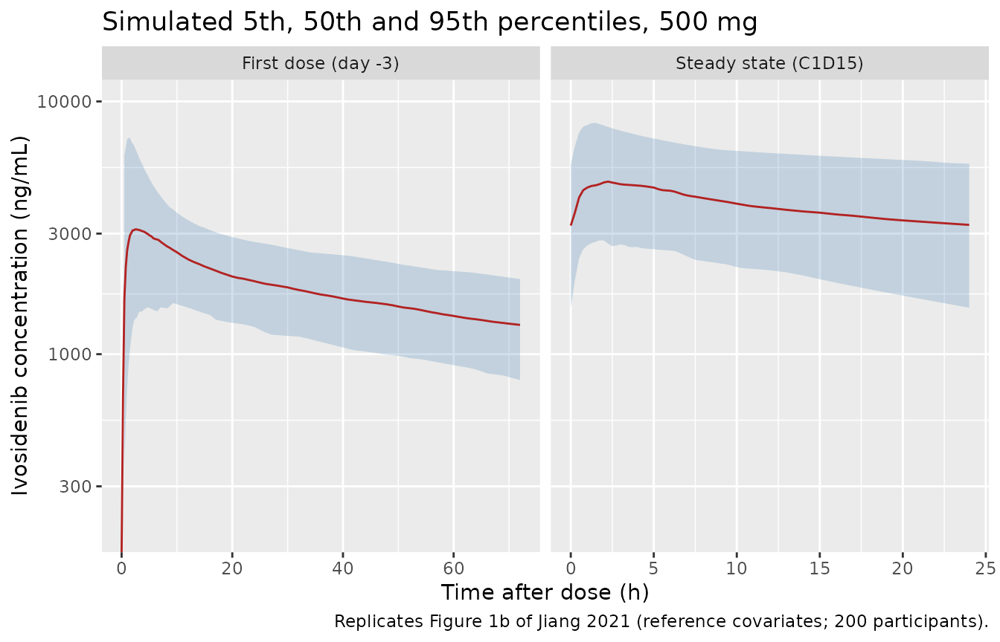
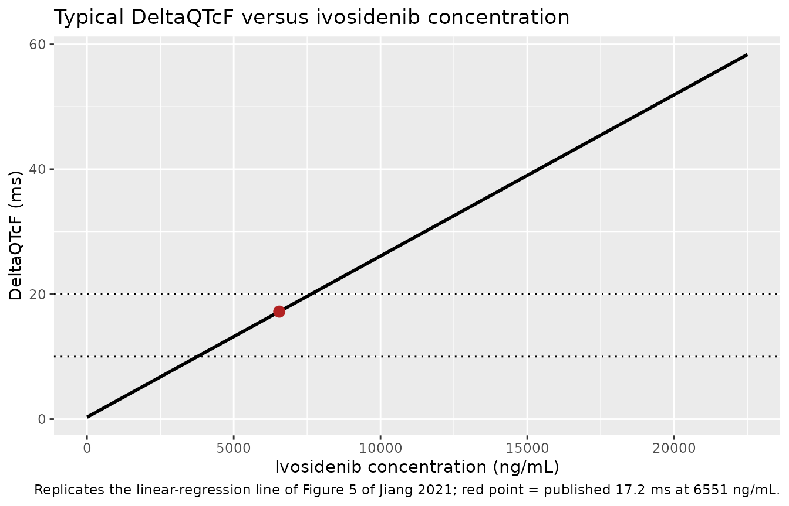

# Ivosidenib (Jiang 2021)

## Model and source

- Citation: Jiang X, Wada R, Poland B, Kleijn HJ, Fan B, Liu G, Liu H,
  Kapsalis S, Yang H, Le K. Population pharmacokinetic and
  exposure-response analyses of ivosidenib in patients with IDH1-mutant
  advanced hematologic malignancies. Clin Transl Sci.
  2021;14(3):942-953. <doi:10.1111/cts.12959>
- Description (PK): Two-compartment population PK model for oral
  ivosidenib (AG-120) in adults with IDH1-mutant advanced hematologic
  malignancies (mostly relapsed or refractory AML) from the phase 1
  AG120-C-001 study (Jiang 2021). Sequential zero-order release into the
  depot followed by first-order absorption; first-order elimination. The
  model is parameterised on steady-state apparent parameters at 500 mg
  once daily, with a step change between the first dose and repeated
  dosing (a 0.50-fold change in relative bioavailability and a 1.66-fold
  change in clearance, MULTI_DOSE_PT), a less-than-dose- proportional
  power effect of dose on relative bioavailability, baseline-albumin and
  albumin-ratio power effects on CL/F and Vc/F, a baseline body-weight
  power effect on Vc/F, and multiplicative CYP3A4-inhibitor effects on
  CL/F (voriconazole, fluconazole, posaconazole, other moderate/strong
  and mild inhibitors). The concentration-QTcF model of the same paper
  is packaged separately as Jiang_2021_ivosidenib_QTcF.
- Description (C-QTc): Linear concentration-QTc model relating the
  change from baseline in the Fridericia-corrected QT interval
  (DeltaQTcF, ms) to the plasma ivosidenib concentration, pooled across
  the phase 1 studies AG120-C-001 (IDH1-mutant hematologic
  malignancies), AG120-C-002 (IDH1-mutant solid tumors) and AG120-C-004
  (healthy volunteers) (Jiang 2021). Direct effect with no hysteresis:
  DeltaQTcF = e0 + slope \* CP_IVOSIDENIB_NGML. Typical-value model
  only: the paper reports the slope (0.00258 ms per ng/mL) and the
  predicted DeltaQTcF at the 500 mg once-daily geometric-mean Cmax (17.2
  ms at 6551 ng/mL), from which the intercept is back-solved; the
  between-subject variances of the intercept and slope, the residual
  error, and the intercept covariate coefficients are not reported.
  PD-only model: the ivosidenib concentration is supplied as a
  time-varying covariate, for example from a simulation of
  Jiang_2021_ivosidenib.
- Article (open access): <https://doi.org/10.1111/cts.12959>

Jiang 2021 reports three analyses of the phase 1 ivosidenib programme:

1.  a population PK model (packaged as `Jiang_2021_ivosidenib`);
2.  exposure-efficacy and exposure-safety analyses based on the post hoc
    steady-state AUC, which found no exposure-response relationship and
    so produced no final exposure-response model to package; and
3.  a linear concentration-QTcF model fitted to a pooled dataset of
    three phase 1 studies (packaged as `Jiang_2021_ivosidenib_QTcF`).

## Population

The population PK analysis used 4656 plasma concentrations from 253
adults with IDH1-mutant advanced hematologic malignancies enrolled in
the phase 1 study AG120-C-001 (NCT02074839). In the dose-escalation
phase patients received 100 mg twice daily or 300, 500, 800 or 1200 mg
once daily in continuous 28-day cycles, and the first three patients of
each cohort also received a single dose on day -3; in the expansion
phase all patients received 500 mg once daily (225 of 255 patients at
the approved 500 mg dose). Supplementary Table S1 (N = 255) reports 54%
men, 69% White (20% race missing), median age 68 years (18-89), median
weight 74.2 kg (37.7-150.4), median baseline albumin 37 g/L (15-48) and
median creatinine clearance 83 mL/min/1.73 m^2. Most patients had
relapsed or refractory AML (80%) and an ECOG performance status of 0 or
1 (78%). Supplementary Table S2 counts the concentration samples taken
with concomitant voriconazole (21%), fluconazole (18%), posaconazole
(6%), other moderate/strong CYP3A4 inhibitors (6%) and mild CYP3A4
inhibitors (24%).

The concentration-QTcF analysis pooled 1203 triplicate ECGs with
time-matched plasma concentrations from 171 participants in AG120-C-001,
AG120-C-002 (IDH1-mutant advanced solid tumors) and AG120-C-004 (healthy
volunteers).

The same information is available programmatically via
`readModelDb("Jiang_2021_ivosidenib")()$population`.

## Source trace

Every `ini()` value carries an in-file comment pointing to its source.
The table collects them.

| Equation / parameter | Value | Source location |
|----|----|----|
| Structure: 2-compartment, zero-order release into depot then first-order absorption | n/a | Results ‘Base population PK model’; Figure 1a |
| `lcl` (steady-state CL/F) | log(5.39 L/h) | Table 1 |
| `lvc` (steady-state Vc/F) | log(234 L) | Table 1 |
| `lq` (steady-state Q/F) | log(15.8 L/h) | Table 1 |
| `lvp` (steady-state Vp/F) | log(151 L) | Table 1 |
| `lka` | log(1.38 1/h) | Table 1 |
| `ld1` (zero-order release duration) | log(0.27 h) | Table 1 ‘Tlag’, footnote ‘zero-order release duration (lag-time)’ |
| `e_multi_dose_pt_f` | 0.50 | Table 1 ‘Steady-state fold change in Frel’ |
| `e_md_cl` | 1.66 | Table 1 ‘Steady-state fold change in CL’ |
| `e_dose_fdepot` | -0.49 | Table 1 ‘Dose-Frel exponent’; reference 500 mg from Figure 2 |
| `e_wt_vc` | 0.92 | Table 1; reference 74.2 kg from Figure 2b |
| `e_alb_base_cl`, `e_alb_ratio_cl` | 0.82, 0.99 | Table 1; reference 37 g/L from Figure 2 |
| `e_alb_base_vc`, `e_alb_ratio_vc` | 0.73, 1.1 | Table 1 |
| `e_conmed_voriconazole_cl` | 0.64 | Table 1 |
| `e_conmed_fluconazole_cl` | 0.59 | Table 1 |
| `e_conmed_posaconazole_cl` | 0.65 | Table 1 |
| `e_conmed_cyp3a4_inh_modstrong_cl` | 0.92 | Table 1 ‘other moderate/strong CYP3A inhibitors’ |
| `e_conmed_cyp3a4_inh_weak_cl` | 1.04 | Table 1 ‘mild CYP3A inhibitors’ |
| `etalcl`, `etalvc`, `etalka` | 0.35^2, 0.47^2, 1.08^2 | Table 1 BSV CV% 35, 47, 108 |
| `expSd` | 0.26 | Table 1 ‘Log-additive CV%’ = 26 |
| First-dose step `cl * 1.66^(MULTI_DOSE_PT - 1)`, `F * 0.50^(MULTI_DOSE_PT - 1)` | n/a | Results ‘Final population PK model’; Figure 1a; Figure S1c |
| `slope` (C-QTc) | 0.00258 ms per ng/mL | Results ‘QTc analysis’ |
| `e0` (C-QTc) | 0.30 ms | Back-solved: 17.2 - 0.00258 \* 6551 (Results ‘QTc analysis’) |

## How the first-dose step is encoded

The authors parameterised the model on steady-state apparent parameters
and described the change from the first dose to repeated dosing as “a
2-fold decrease in relative bioavailability and a 1.66-fold increase in
CL/F, such that the net change in apparent CL was 3.3-fold” (Results).
Figure 1a places a day-1 and a steady-state value on exactly two
quantities, `Frel` and `CL`, and Supplementary Figure S1c states that
the two factors begin to act at the start of continuous once-daily
dosing. In the packaged model, `MULTI_DOSE_PT = 0` from the first dose
until the second dose, and 1 afterwards; at 0 the dose’s bioavailability
is 2-fold and clearance is 1/1.66-fold the steady-state values. This
reproduces the printed first-dose CL/F:

``` r

first_dose_clf <- 5.39 / ((1 / 0.50) * 1.66)
first_dose_clf
#> [1] 1.623494
stopifnot(abs(first_dose_clf - 1.63) < 0.01)
```

Table 1 also prints derived first-dose values for Vc/F (71 L), Q/F (4.8
L/h) and Vp/F (46 L). Each is the steady-state value divided by the full
3.3-fold factor, which would mean the clearance factor also scales both
volumes and the intercompartmental clearance. That contradicts the text
and Figure 1a, where only `Frel` and `CL` change. Under the model as
described, the first-dose apparent volumes are the steady-state values
divided by the 2-fold bioavailability change alone (Vc/F = 117 L, Q/F =
7.9 L/h, Vp/F = 75.5 L).

The two readings can be told apart using quantities the paper prints
independently: the single-dose half-life “of 72-138 h” and the median
single-dose Tmax range of 2.4-5.5 h (Introduction, from the phase 1
NCA). The chunk below simulates a typical 500 mg single dose under both
readings.

``` r

mod <- readModelDb("Jiang_2021_ivosidenib")
mod_typ <- rxode2::zeroRe(mod)
#> ℹ parameter labels from comments will be replaced by 'label()'

# The Table-1-derived reading: every disposition parameter divided by 3.3.
# Written out explicitly because it is not the packaged structure.
table_reading <- rxode2::rxode2({
  d/dt(depot) <- -ka * depot
  d/dt(central) <- ka * depot - cl / vc * central - q / vc * central + q / vp * peripheral1
  d/dt(peripheral1) <- q / vc * central - q / vp * peripheral1
  dur(depot) <- d1
  Cc <- central / vc * 1000
})

single_dose_events <- function(extra = list()) {
  obs_t <- sort(unique(c(seq(0, 12, by = 0.05), seq(12.5, 72, by = 0.5))))
  ev <- dplyr::bind_rows(
    data.frame(id = 1L, time = 0, evid = 1L, amt = 500, rate = -2, cmt = "depot"),
    data.frame(id = 1L, time = obs_t, evid = 0L, amt = 0, rate = 0, cmt = "central")
  )
  ev <- dplyr::mutate(ev, DOSE = 500, MULTI_DOSE_PT = 0L, WT = 74.2,
                      ALB_BASE = 37, ALB = 37,
                      CONMED_VORICONAZOLE = 0L, CONMED_FLUCONAZOLE = 0L,
                      CONMED_POSACONAZOLE = 0L, CONMED_CYP3A4_INH_MOD = 0L,
                      CONMED_CYP3A4_INH_STRONG = 0L, CONMED_CYP3A4_INH_WEAK = 0L)
  dplyr::arrange(ev, time, dplyr::desc(evid))
}

summarise_single_dose <- function(s, label) {
  s <- as.data.frame(s)
  c48 <- s$Cc[abs(s$time - 48) < 1e-6]
  c72 <- s$Cc[abs(s$time - 72) < 1e-6]
  data.frame(
    reading = label,
    cmax = max(s$Cc),
    tmax = s$time[which.max(s$Cc)],
    c72 = c72,
    thalf_48_72 = 24 * log(2) / log(c48 / c72)
  )
}

sd_model <- rxode2::rxSolve(mod_typ, single_dose_events(), returnType = "data.frame")
#> ℹ omega/sigma items treated as zero: 'etalcl', 'etalvc', 'etalka'
sd_table <- rxode2::rxSolve(
  table_reading,
  params = c(ka = 1.38, d1 = 0.27, cl = 1.63, vc = 71, q = 4.8, vp = 46),
  events = single_dose_events(), returnType = "data.frame"
)

readings <- dplyr::bind_rows(
  summarise_single_dose(sd_model, "Packaged model (only F and CL change)"),
  summarise_single_dose(sd_table, "Table 1 derived first-dose rows (all divided by 3.3)")
)

readings |>
  dplyr::mutate(dplyr::across(c(cmax, c72), \(x) round(x))) |>
  dplyr::mutate(dplyr::across(c(tmax, thalf_48_72), \(x) round(x, 1))) |>
  dplyr::rename("Reading" = reading, "Cmax (ng/mL)" = cmax, "Tmax (h)" = tmax,
                "C72h (ng/mL)" = c72, "Half-life 48-72 h (h)" = thalf_48_72) |>
  knitr::kable(caption = "Typical 500 mg single dose under the two readings.")
```

| Reading | Cmax (ng/mL) | Tmax (h) | C72h (ng/mL) | Half-life 48-72 h (h) |
|:---|---:|---:|---:|---:|
| Packaged model (only F and CL change) | 3613 | 2.4 | 1359 | 84.8 |
| Table 1 derived first-dose rows (all divided by 3.3) | 5867 | 2.4 | 1491 | 52.5 |

Typical 500 mg single dose under the two readings. {.table}

``` r


stopifnot(
  # The packaged reading lands inside the printed single-dose half-life range.
  readings$thalf_48_72[1] > 72, readings$thalf_48_72[1] < 138,
  # The Table-1-derived reading does not.
  readings$thalf_48_72[2] < 72,
  # Tmax sits within the printed 2.4-5.5 h single-dose range (packaged model).
  readings$tmax[1] >= 2.3, readings$tmax[1] <= 5.5
)
```

The packaged reading gives a 48-72 h half-life of about 85 h and a
single-dose Cmax of about 3600 ng/mL, consistent with the observed day
-3 mean profile of Supplementary Figure S1b (peak near 3000 ng/mL) and
the median line of the first-dose panel of Figure 1b (near 3300 ng/mL).
The Table-1-derived reading gives a 52 h half-life, outside the printed
range, and a Cmax near 5900 ng/mL. The first-dose volume rows of Table 1
are therefore treated as a derivation slip in the table; they are not
model inputs in either case, because the model is parameterised on the
steady-state values.

## Typical-value replication of Figure 2

Figure 2 gives the steady-state AUC for the typical patient (500 mg once
daily, albumin 37 g/L, no CYP3A4 inhibitor; 93 ug\*h/mL) and for
one-at-a-time covariate changes (Figure 2c table), and the typical
steady-state Cmax (4827 ng/mL, weight 74.2 kg). The chunk below
simulates each scenario to steady state with the random effects removed
and computes AUC0-24 and Cmax with PKNCA over the day-20 dosing
interval.

``` r

ref_cov <- data.frame(
  DOSE = 500, WT = 74.2, ALB_BASE = 37, ALB = 37,
  CONMED_VORICONAZOLE = 0L, CONMED_FLUCONAZOLE = 0L, CONMED_POSACONAZOLE = 0L,
  CONMED_CYP3A4_INH_MOD = 0L, CONMED_CYP3A4_INH_STRONG = 0L,
  CONMED_CYP3A4_INH_WEAK = 0L
)

# Published Figure 2c AUC estimates (ug*h/mL) for each one-at-a-time change.
scenarios <- tibble::tribble(
  ~scenario,                ~var,                   ~value, ~auc_pub,
  "Typical patient",        "DOSE",                 500,    93,
  "Dose 300 mg",            "DOSE",                 300,    71,
  "Dose 800 mg",            "DOSE",                 800,    118,
  "Voriconazole",           "CONMED_VORICONAZOLE",  1,      145,
  "Fluconazole",            "CONMED_FLUCONAZOLE",   1,      157,
  "Posaconazole",           "CONMED_POSACONAZOLE",  1,      142,
  "Albumin baseline 26 g/L", "ALB_BASE",            26,     124,
  "Albumin baseline 44 g/L", "ALB_BASE",            44,     80,
  "Albumin ratio 0.84",     "ALB",                  0.84 * 37, 111,
  "Albumin ratio 1.24",     "ALB",                  1.24 * 37, 75
) |>
  dplyr::mutate(id = dplyr::row_number())

# Scenario covariates: the reference patient with one column changed. For the
# baseline-albumin scenarios the time-varying albumin moves with it (ratio 1).
scen_cov <- dplyr::bind_rows(lapply(seq_len(nrow(scenarios)), \(i) {
  cv <- ref_cov
  cv[[scenarios$var[i]]] <- scenarios$value[i]
  if (scenarios$var[i] == "ALB_BASE") cv$ALB <- scenarios$value[i]
  cv$id <- scenarios$id[i]
  cv
}))

build_events <- function(cov, dose_times, obs_times) {
  second_dose <- dose_times[2]
  doses <- tidyr::crossing(id = cov$id, time = dose_times) |>
    dplyr::mutate(evid = 1L, rate = -2, cmt = "depot")
  obs <- tidyr::crossing(id = cov$id, time = obs_times) |>
    dplyr::mutate(evid = 0L, rate = 0, cmt = "central")
  dplyr::bind_rows(doses, obs) |>
    dplyr::left_join(cov, by = "id") |>
    dplyr::mutate(
      amt = dplyr::if_else(evid == 1L, DOSE, 0),
      MULTI_DOSE_PT = as.integer(time >= second_dose)
    ) |>
    dplyr::select(id, time, evid, amt, rate, cmt, dplyr::everything()) |>
    dplyr::arrange(id, time, dplyr::desc(evid))
}

qd_times <- seq(0, 19 * 24, by = 24)
ss_start <- 19 * 24
ss_obs <- ss_start + sort(unique(c(seq(0, 6, by = 0.05), seq(6.5, 24, by = 0.5))))
ev_scen <- build_events(scen_cov, qd_times, ss_obs)
sim_scen <- rxode2::rxSolve(mod_typ, events = ev_scen, returnType = "data.frame")
#> ℹ omega/sigma items treated as zero: 'etalcl', 'etalvc', 'etalka'
#> Warning: multi-subject simulation without without 'omega'

conc_scen <- PKNCA::PKNCAconc(
  dplyr::select(sim_scen, id, time, Cc), Cc ~ time | id
)
dose_scen <- PKNCA::PKNCAdose(
  dplyr::filter(ev_scen, evid == 1L) |> dplyr::select(id, time, amt),
  amt ~ time | id
)
int_scen <- data.frame(start = ss_start, end = ss_start + 24,
                       cmax = TRUE, auclast = TRUE)
nca_scen <- PKNCA::pk.nca(PKNCA::PKNCAdata(conc_scen, dose_scen, intervals = int_scen))

fig2 <- as.data.frame(nca_scen$result) |>
  dplyr::select(id, PPTESTCD, PPORRES) |>
  tidyr::pivot_wider(names_from = PPTESTCD, values_from = PPORRES) |>
  dplyr::inner_join(scenarios, by = "id") |>
  dplyr::mutate(auc_model = auclast / 1000,
                pct_diff = 100 * (auc_model - auc_pub) / auc_pub)
stopifnot(nrow(fig2) == nrow(scenarios))

fig2 |>
  dplyr::transmute(scenario, auc_pub, auc_model = round(auc_model, 1),
                   pct_diff = round(pct_diff, 1), cmax = round(cmax)) |>
  dplyr::rename("Scenario" = scenario, "Published AUCss (ug*h/mL)" = auc_pub,
                "Model AUCss (ug*h/mL)" = auc_model, "% difference" = pct_diff,
                "Model Cmax,ss (ng/mL)" = cmax) |>
  knitr::kable(caption = "Replicates the Figure 2c table of Jiang 2021 (typical values).")
```

| Scenario | Published AUCss (ug\*h/mL) | Model AUCss (ug\*h/mL) | % difference | Model Cmax,ss (ng/mL) |
|:---|---:|---:|---:|---:|
| Typical patient | 93 | 92.7 | -0.3 | 4823 |
| Dose 300 mg | 71 | 71.4 | 0.6 | 3717 |
| Dose 800 mg | 118 | 117.8 | -0.2 | 6130 |
| Voriconazole | 145 | 143.3 | -1.1 | 6916 |
| Fluconazole | 157 | 154.8 | -1.4 | 7387 |
| Posaconazole | 142 | 141.2 | -0.5 | 6829 |
| Albumin baseline 26 g/L | 124 | 123.6 | -0.3 | 6406 |
| Albumin baseline 44 g/L | 80 | 80.4 | 0.5 | 4195 |
| Albumin ratio 0.84 | 111 | 110.1 | -0.8 | 5762 |
| Albumin ratio 1.24 | 75 | 74.9 | -0.1 | 3873 |

Replicates the Figure 2c table of Jiang 2021 (typical values). {.table}

``` r


typ_cmax <- fig2$cmax[fig2$scenario == "Typical patient"]
stopifnot(
  # Typical-value solves use the same parameters the paper's table was
  # generated from; the only differences are the paper's rounding of the
  # printed estimates and of the AUCs (realised max |diff| about 1%).
  max(abs(fig2$pct_diff)) < 3,
  abs(typ_cmax - 4827) / 4827 < 0.02
)
```

Every row matches the published AUC within rounding, which confirms the
reference dose (500 mg), the reference albumin (37 g/L), the positive
sign of the albumin exponents, the ratio form of the within-subject
albumin effect and the multiplicative CYP3A4-inhibitor fold changes. The
typical Cmax matches the 4827 ng/mL of Figure 2b, which also exercises
the Vc/F covariates.

## Virtual cohorts

Two cohorts of 200 participants each, all at 500 mg:

- **Reference cohort** – covariates at the Figure 2 reference values,
  with between-subject variability. This approximates the
  prediction-corrected VPC of Figure 1b. The design follows the
  dose-escalation schedule: a single dose at time 0 (day -3), then
  continuous once-daily dosing from 72 h (cycle 1 day 1).
- **Covariate cohort** – baseline weight, baseline albumin, albumin
  ratio and CYP3A4-inhibitor use drawn to approximate Supplementary
  Tables S1 and S2, used for the population AUC and Cmax ranges of
  Figure 2.

``` r

set.seed(20210301)
rxode2::rxSetSeed(20210301)
n <- 200

ref_cohort <- ref_cov[rep(1, n), ] |>
  dplyr::mutate(id = seq_len(n))

# Covariate cohort. Weight: log-normal, median 74.2 kg, CV 24%, truncated to
# the observed range. Baseline albumin: normal, mean 36 g/L, CV 16%, truncated
# to 15-48 g/L. Albumin ratio: log-normal matching the Figure 2 5th-95th
# percentiles of 0.84-1.24. CYP3A4 inhibitors: one of voriconazole /
# fluconazole / posaconazole / other moderate-strong / none with the Table S2
# sample fractions, plus an independent mild-inhibitor draw.
rtrunc <- function(x, lo, hi) pmin(pmax(x, lo), hi)
inh <- sample(c("vori", "fluc", "posa", "other", "none"), n, replace = TRUE,
              prob = c(0.21, 0.18, 0.06, 0.06, 0.49))
alb_base <- rtrunc(rnorm(n, 36, 0.16 * 36), 15, 48)
alb_ratio <- exp(rnorm(n, log(sqrt(0.84 * 1.24)), log(1.24 / 0.84) / (2 * 1.645)))
cov_cohort <- data.frame(
  id = n + seq_len(n),
  DOSE = 500,
  WT = rtrunc(exp(rnorm(n, log(74.2), 0.237)), 37.7, 150.4),
  ALB_BASE = alb_base,
  ALB = alb_base * alb_ratio,
  CONMED_VORICONAZOLE = as.integer(inh == "vori"),
  CONMED_FLUCONAZOLE = as.integer(inh == "fluc"),
  CONMED_POSACONAZOLE = as.integer(inh == "posa"),
  CONMED_CYP3A4_INH_MOD = as.integer(inh == "other"),
  CONMED_CYP3A4_INH_STRONG = 0L,
  CONMED_CYP3A4_INH_WEAK = rbinom(n, 1, 0.24)
)

# Reference cohort: day -3 single dose at t = 0, once daily from 72 h (C1D1)
# through C1D28. First-dose panel 0-72 h; C1D15 steady-state panel 408-432 h.
dose_times_esc <- c(0, seq(72, 72 + 27 * 24, by = 24))
c1d15 <- 72 + 14 * 24
obs_esc <- sort(unique(c(
  seq(0, 12, by = 0.25), seq(13, 72, by = 1),
  c1d15 + c(seq(0, 12, by = 0.25), seq(13, 24, by = 1))
)))
ev_ref <- build_events(ref_cohort, dose_times_esc, obs_esc)

# Covariate cohort: once daily from time 0; only the day-15 interval observed.
ss15 <- 14 * 24
ev_cov <- build_events(cov_cohort, seq(0, 20 * 24, by = 24),
                       ss15 + c(seq(0, 12, by = 0.25), seq(13, 24, by = 1)))

stopifnot(
  !anyDuplicated(unique(ev_ref[, c("id", "time", "evid")])),
  !anyDuplicated(unique(ev_cov[, c("id", "time", "evid")])),
  length(intersect(ev_ref$id, ev_cov$id)) == 0
)
```

## Simulation

``` r

sim_ref <- rxode2::rxSolve(mod, events = ev_ref, returnType = "data.frame")
#> ℹ parameter labels from comments will be replaced by 'label()'
sim_cov <- rxode2::rxSolve(mod, events = ev_cov, returnType = "data.frame")
stopifnot(!is.null(sim_ref$id), !is.null(sim_cov$id))
```

## Replicate Figure 1b (visual predictive check)

``` r

vpc <- sim_ref |>
  dplyr::mutate(panel = dplyr::case_when(
    time <= 72 ~ "First dose (day -3)",
    time >= c1d15 & time <= c1d15 + 24 ~ "Steady state (C1D15)",
    TRUE ~ NA_character_
  )) |>
  dplyr::filter(!is.na(panel)) |>
  dplyr::mutate(tad = dplyr::if_else(panel == "First dose (day -3)", time, time - c1d15)) |>
  dplyr::group_by(panel, tad) |>
  dplyr::summarise(Q05 = quantile(Cc, 0.05), Q50 = quantile(Cc, 0.50),
                   Q95 = quantile(Cc, 0.95), .groups = "drop")

ggplot(vpc, aes(tad, Q50)) +
  geom_ribbon(aes(ymin = Q05, ymax = Q95), alpha = 0.25, fill = "steelblue") +
  geom_line(colour = "firebrick") +
  facet_wrap(~panel, scales = "free_x") +
  scale_y_log10(limits = c(200, 10000)) +
  labs(x = "Time after dose (h)", y = "Ivosidenib concentration (ng/mL)",
       title = "Simulated 5th, 50th and 95th percentiles, 500 mg",
       caption = "Replicates Figure 1b of Jiang 2021 (reference covariates; 200 participants).")
#> Warning in scale_y_log10(limits = c(200, 10000)): log-10 transformation introduced infinite values.
#> log-10 transformation introduced infinite values.
#> log-10 transformation introduced infinite values.
#> log-10 transformation introduced infinite values.
#> Warning: Removed 1 row containing missing values or values outside the scale range
#> (`geom_ribbon()`).
```



After the first dose the simulated median peaks near 3100 ng/mL and
falls to about 1300 ng/mL at 72 h, with a 90% interval of roughly
1400-7500 ng/mL at the peak; the first-dose panel of Figure 1b shows a
median near 3300 ng/mL at the peak and 1600 ng/mL at 72 h, with a 95th
percentile near 7000 ng/mL. The steady-state panel here is the C1D15
dosing interval only, with a median peak near 4800 ng/mL. The right
panel of Figure 1b is not a like-for-like comparator: it pools every
sample after the first dose (including pre-steady-state days and
pre-dose samples plotted at about 24 h) and is prediction-corrected
across dose levels, so its median (about 3300 ng/mL at the peak) sits
below a pure steady-state profile.

## PKNCA validation

``` r

nca_conc <- sim_ref |>
  dplyr::filter(!is.na(Cc)) |>
  dplyr::mutate(arm = "500 mg") |>
  dplyr::select(id, time, Cc, arm)
# The event table observes at t = 0 for every participant, so the time-zero
# anchor PKNCA needs is already present.
stopifnot(all(tapply(nca_conc$time, nca_conc$id, min) == 0))

nca_dose <- ev_ref |>
  dplyr::filter(evid == 1L) |>
  dplyr::mutate(arm = "500 mg") |>
  dplyr::select(id, time, amt, arm)

conc_obj <- PKNCA::PKNCAconc(nca_conc, Cc ~ time | arm + id, concu = "ng/mL", timeu = "h")
dose_obj <- PKNCA::PKNCAdose(nca_dose, amt ~ time | arm + id, doseu = "mg")

# Row 1: the day -3 single dose (0-72 h, before continuous dosing starts).
# Row 2: the C1D15 dosing interval.
intervals <- data.frame(
  start     = c(0,     c1d15),
  end       = c(72,    c1d15 + 24),
  cmax      = c(TRUE,  TRUE),
  tmax      = c(TRUE,  TRUE),
  auclast   = c(FALSE, TRUE),
  cmin      = c(FALSE, TRUE),
  half.life = c(TRUE,  FALSE)
)
nca_res <- PKNCA::pk.nca(PKNCA::PKNCAdata(conc_obj, dose_obj, intervals = intervals))

nca_tab <- as.data.frame(nca_res$result) |>
  dplyr::mutate(period = dplyr::if_else(start == 0, "First dose", "Steady state"))

nca_tab |>
  dplyr::group_by(period, PPTESTCD) |>
  dplyr::summarise(median = stats::median(PPORRES, na.rm = TRUE),
                   p05 = stats::quantile(PPORRES, 0.05, na.rm = TRUE),
                   p95 = stats::quantile(PPORRES, 0.95, na.rm = TRUE),
                   .groups = "drop") |>
  dplyr::mutate(dplyr::across(c(median, p05, p95), \(x) signif(x, 3))) |>
  dplyr::rename("Period" = period, "Parameter" = PPTESTCD, "Median" = median,
                "5th percentile" = p05, "95th percentile" = p95) |>
  knitr::kable(caption = "PKNCA summary, reference cohort (500 mg).")
```

| Period       | Parameter           |   Median | 5th percentile | 95th percentile |
|:-------------|:--------------------|---------:|---------------:|----------------:|
| First dose   | adj.r.squared       | 1.00e+00 |       1.00e+00 |        1.00e+00 |
| First dose   | clast.pred          | 1.30e+03 |       7.89e+02 |        1.98e+03 |
| First dose   | cmax                | 3.33e+03 |       1.70e+03 |        7.27e+03 |
| First dose   | half.life           | 8.67e+01 |       4.70e+01 |        1.79e+02 |
| First dose   | lambda.z            | 7.99e-03 |       3.88e-03 |        1.47e-02 |
| First dose   | lambda.z.n.points   | 4.30e+01 |       3.60e+01 |        5.20e+01 |
| First dose   | lambda.z.time.first | 3.00e+01 |       2.10e+01 |        3.70e+01 |
| First dose   | lambda.z.time.last  | 7.20e+01 |       7.20e+01 |        7.20e+01 |
| First dose   | r.squared           | 1.00e+00 |       1.00e+00 |        1.00e+00 |
| First dose   | span.ratio          | 4.87e-01 |       1.98e-01 |        1.04e+00 |
| First dose   | tlast               | 7.20e+01 |       7.20e+01 |        7.20e+01 |
| First dose   | tmax                | 2.00e+00 |       7.50e-01 |        7.81e+00 |
| Steady state | auclast             | 9.26e+04 |       5.25e+04 |        1.52e+05 |
| Steady state | cmax                | 4.98e+03 |       2.84e+03 |        8.44e+03 |
| Steady state | cmin                | 3.23e+03 |       1.53e+03 |        5.61e+03 |
| Steady state | tmax                | 1.75e+00 |       7.50e-01 |        5.52e+00 |

PKNCA summary, reference cohort (500 mg). {.table}

### Comparison against published values

Jiang 2021 prints the model-predicted steady-state AUC (93 ug\*h/mL) and
Cmax (4827 ng/mL) for the typical patient at 500 mg (Figure 2). The
reference cohort holds every covariate at those typical values, so its
median is the right comparator for them.

``` r

ss_res <- nca_res
ss_res$result <- dplyr::filter(as.data.frame(nca_res$result), start == c1d15)

published <- tibble::tribble(
  ~arm,     ~cmax, ~auclast,
  "500 mg", 4827,  93000
)

cmp <- nlmixr2lib::ncaComparisonTable(
  simulated = ss_res,
  reference = published,
  by = "arm",
  params = c("cmax", "auclast"),
  units = c(cmax = "ng/mL", auclast = "ng*h/mL"),
  tolerance_pct = 20
)
knitr::kable(
  cmp,
  caption = paste("Simulated (PKNCA, C1D15 dosing interval) versus the",
                  "typical-patient values of Jiang 2021 Figure 2.",
                  "* differs from reference by >20%."),
  align = c("l", "l", "r", "r", "r")
)
```

| NCA parameter      | arm    | Reference | Simulated | % diff |
|:-------------------|:-------|----------:|----------:|-------:|
| Cmax (ng/mL)       | 500 mg |      4830 |      4980 |  +3.2% |
| AUClast (ng\*h/mL) | 500 mg |     93000 |     92600 |  -0.5% |

Simulated (PKNCA, C1D15 dosing interval) versus the typical-patient
values of Jiang 2021 Figure 2. \* differs from reference by \>20%.
{.table}

``` r

med <- nca_tab |>
  dplyr::group_by(period, PPTESTCD) |>
  dplyr::summarise(median = stats::median(PPORRES, na.rm = TRUE), .groups = "drop")
get_med <- function(p, code) {
  v <- med$median[med$period == p & med$PPTESTCD == code]
  if (length(v) != 1L) stop("no unique median for ", p, " / ", code)
  v
}
stopifnot(
  # Centre of the cohort against the typical values (robust to the draw).
  abs(get_med("Steady state", "auclast") / 93000 - 1) < 0.10,
  abs(get_med("Steady state", "cmax") / 4827 - 1) < 0.10,
  # Printed single-dose half-life range 72-138 h and Tmax ranges
  # (single dose 2.4-5.5 h; repeated dosing 1.9-4.0 h), Introduction.
  get_med("First dose", "half.life") > 60, get_med("First dose", "half.life") < 150,
  get_med("First dose", "tmax") > 1.2, get_med("First dose", "tmax") < 5.5,
  get_med("Steady state", "tmax") > 1.2, get_med("Steady state", "tmax") < 4.0
)
```

The cohort median steady-state AUC0-24 and Cmax agree with the
typical-patient values, and the first-dose half-life (PKNCA terminal fit
over the 0-72 h window, median about 87 h) sits inside the 72-138 h
single-dose range printed in the Introduction. The median Tmax is about
2.0 h after the first dose and 1.75 h at steady state, slightly below
the printed ranges of median Tmax by dose cohort (2.4-5.5 h single dose,
1.9-4.0 h repeated dosing). Those ranges come from escalation cohorts of
three or more patients sampled at 0.5, 1, 2, 3, 4, 6 and 8 h, which
places every observed Tmax on a sampling time; the typical-value Tmax of
the packaged model is 2.4 h after a single dose (checked exactly above).
The cohort assertion below therefore uses 1.2 h as its lower bound
(realised medians 2.0 and 1.75 h on a 0.25 h grid).

## Replicate the Figure 2 population ranges

The hatched bars of Figure 2 give the 5th-95th percentiles of the
modelled steady-state AUC (56-177 ug\*h/mL) and Cmax (3023-9102 ng/mL)
across the analysis population. The covariate cohort approximates that
population.

``` r

cov_nca <- sim_cov |>
  dplyr::filter(time >= ss15, time <= ss15 + 24) |>
  dplyr::group_by(id) |>
  dplyr::arrange(time, .by_group = TRUE) |>
  dplyr::summarise(
    cmax = max(Cc),
    auc = sum(diff(time) * (head(Cc, -1) + tail(Cc, -1)) / 2) / 1000,
    .groups = "drop"
  )

pop_range <- data.frame(
  metric = c("AUCss (ug*h/mL)", "Cmax,ss (ng/mL)"),
  published_p05 = c(56, 3023),
  model_p05 = c(quantile(cov_nca$auc, 0.05), quantile(cov_nca$cmax, 0.05)),
  model_median = c(median(cov_nca$auc), median(cov_nca$cmax)),
  published_p95 = c(177, 9102),
  model_p95 = c(quantile(cov_nca$auc, 0.95), quantile(cov_nca$cmax, 0.95))
)
pop_range |>
  dplyr::mutate(dplyr::across(-metric, \(x) signif(x, 3))) |>
  dplyr::rename("Metric" = metric, "Published 5th" = published_p05,
                "Model 5th" = model_p05, "Model median" = model_median,
                "Published 95th" = published_p95, "Model 95th" = model_p95) |>
  knitr::kable(caption = "Population 5th-95th percentiles, covariate cohort versus Figure 2.")
```

| Metric | Published 5th | Model 5th | Model median | Published 95th | Model 95th |
|:---|---:|---:|---:|---:|---:|
| AUCss (ug\*h/mL) | 56 | 55.7 | 117 | 177 | 208 |
| Cmax,ss (ng/mL) | 3020 | 3280.0 | 5860 | 9100 | 10200 |

Population 5th-95th percentiles, covariate cohort versus Figure 2.
{.table}

``` r


stopifnot(
  # Robust quantiles only; the published range comes from post hoc estimates
  # of the real population, which this cohort approximates. Realised on the
  # authoring machine: 5th percentiles -1% (AUC) and +8% (Cmax), 95th
  # percentiles +17% (AUC) and +12% (Cmax). The upper tail depends on how
  # many participants the cohort puts on a CYP3A4 inhibitor, which Table S2
  # gives per sample rather than per patient, so the bound is 30%. A
  # mis-transcribed CL/F, dose or unit moves both tails by far more.
  abs(pop_range$model_p05 / pop_range$published_p05 - 1) < 0.30,
  abs(pop_range$model_p95 / pop_range$published_p95 - 1) < 0.30
)
```

The simulated 5th percentiles match Figure 2 closely; the 95th
percentiles are 12-17% above it. The cohort draws inhibitor use from the
per-sample fractions of Table S2 (about half the cohort is on
voriconazole, fluconazole or posaconazole for the whole interval), which
likely overstates the per-patient steady-state exposure to those azoles.
The AUC here is a trapezoidal sum on the dense simulated grid, used only
to read the population percentiles; the PKNCA validation above is the
NCA of record.

## Concentration-QTcF model

The packaged C-QTc model is
`DeltaQTcF = e0 + slope * CP_IVOSIDENIB_NGML`. At the 500 mg
geometric-mean Cmax of 6551 ng/mL it returns the published 17.2 ms, by
construction of the back-solved intercept. The chunk below replicates
the regression line of Figure 5 and then drives the model with the
simulated steady-state concentrations of the reference cohort.

``` r

mod_qt <- readModelDb("Jiang_2021_ivosidenib_QTcF")

conc_grid <- c(0, 1000, 2500, 5000, 6551, 10000, 15000, 20000, 22500)
ev_qt <- data.frame(id = seq_along(conc_grid), time = 0, evid = 0L,
                    CP_IVOSIDENIB_NGML = conc_grid)
qt_line <- rxode2::rxSolve(mod_qt, events = ev_qt, returnType = "data.frame")
#> Warning: multi-subject simulation without without 'omega'
qt_line$CP_IVOSIDENIB_NGML <- conc_grid[qt_line$id]

pred_cmax <- qt_line$QTcF[qt_line$CP_IVOSIDENIB_NGML == 6551]
stopifnot(length(pred_cmax) == 1L, abs(pred_cmax - 17.2) < 0.05)

ggplot(qt_line, aes(CP_IVOSIDENIB_NGML, QTcF)) +
  geom_line(linewidth = 1) +
  geom_hline(yintercept = c(10, 20), linetype = "dotted") +
  geom_point(data = data.frame(CP_IVOSIDENIB_NGML = 6551, QTcF = 17.2),
             colour = "firebrick", size = 3) +
  labs(x = "Ivosidenib concentration (ng/mL)", y = "DeltaQTcF (ms)",
       title = "Typical DeltaQTcF versus ivosidenib concentration",
       caption = paste("Replicates the linear-regression line of Figure 5 of",
                       "Jiang 2021; red point = published 17.2 ms at 6551 ng/mL."))
```



``` r


# Drive the C-QTc model with the simulated steady-state Cmax of each
# participant in the reference cohort.
ss_cmax <- nca_tab |>
  dplyr::filter(period == "Steady state", PPTESTCD == "cmax") |>
  dplyr::select(id, cmax = PPORRES)
ev_qt_cohort <- data.frame(id = ss_cmax$id, time = 0, evid = 0L,
                           CP_IVOSIDENIB_NGML = ss_cmax$cmax)
qt_cohort <- rxode2::rxSolve(mod_qt, events = ev_qt_cohort, returnType = "data.frame")
#> Warning: multi-subject simulation without without 'omega'
summary(qt_cohort$QTcF)
#>    Min. 1st Qu.  Median    Mean 3rd Qu.    Max. 
#>   5.567   9.996  13.146  13.466  16.006  29.461
```

At the model-predicted typical steady-state Cmax of 4827 ng/mL the model
gives about 12.8 ms. The paper’s 17.2 ms is evaluated at the observed
geometric-mean Cmax of 6551 ng/mL, which is higher than the popPK
typical-value Cmax (the paper does not say which studies or visits that
geometric mean was taken from).

## Assumptions and deviations

- **First-dose volumes in Table 1.** The derived first-dose rows for
  Vc/F, Q/F and Vp/F in Table 1 divide the steady-state values by the
  full 3.3-fold apparent-clearance factor. The text and Figure 1a change
  only `Frel` and `CL`, and the printed single-dose half-life range
  falsifies the table’s volumes (see “How the first-dose step is
  encoded”). The packaged model follows the text and figure; it does not
  use those rows.
- **Timing of the first-dose step.** The paper does not print the
  switching rule. `MULTI_DOSE_PT` switches at the second dose, following
  Supplementary Figure S1c (“the factors begin to influence the
  pharmacokinetic curve” at the start of once-daily dosing) and the
  Figure 1b grouping of the escalation day -3 dose with the expansion
  cycle 1 day 1 dose as the “first dose”. The switch is a step; the
  paper estimates no induction time course.
- **Tlag as a zero-order release duration.** The Table 1 footnote
  defines `Tlag` as the “zero-order release duration (lag-time)”, and
  the base model is described as “sequential zero-order release (lag
  time) and first-order oral absorption”, so it is encoded as
  `dur(depot)`. Dose records must carry `rate = -2`.
- **Dose on relative bioavailability.** `DOSE` is the amount per
  administration with reference 500 mg (confirmed by Figure 2c). The
  paper does not say how the 100 mg twice-daily cohort (4 patients) was
  coded.
- **Albumin.** The albumin ratio is time-varying albumin divided by
  baseline albumin (Table 1 footnote); the covariate cohort holds each
  participant’s ratio constant over time.
- **CYP3A4 inhibitors.** The paper’s “other strong or moderate CYP3A4
  inhibitors” group excludes voriconazole, fluconazole and posaconazole.
  The model forms it from `CONMED_CYP3A4_INH_MOD` and
  `CONMED_CYP3A4_INH_STRONG` and switches it off when any of the three
  azoles is flagged, so a record coded by inhibitor strength is not
  counted twice. The paper does not name the agents in the “other” or
  “mild” groups.
- **Between-subject variability.** Table 1 reports CV% for CL/F, Vc/F
  and ka, and the footnote gives RSEs “on standard deviation terms”, so
  CV%/100 is taken as the SD of each eta (omega^2 = (CV%/100)^2). No
  correlations are reported; the etas are independent.
- **Residual error.** “Log-additive CV% 26” is encoded as `lnorm(0.26)`.
- **C-QTc intercept, variability and covariates.** Only the slope is
  printed. The intercept (0.30 ms) is back-solved from the printed
  prediction of 17.2 ms at 6551 ng/mL; because both printed numbers are
  rounded, it is uncertain by about +/- 0.1 ms. The between-subject
  variances of intercept and slope, the residual error and the intercept
  covariates (age, baseline QTcF, calcium, magnesium, QT-prolonging
  co-medication) are not reported, so the packaged C-QTc model is
  typical-value only with residual error set to 0.
- **Exposure-response.** The efficacy and safety analyses found no
  exposure relationship and produced no final model, and the logistic
  fits shown in Figure 4 have no printed coefficients, so none is
  packaged.
- **Tmax.** The simulated median Tmax (about 2.0 h after the first dose,
  1.75 h at steady state) is slightly below the printed ranges of median
  Tmax by dose cohort, which come from sparse sampling in small
  escalation cohorts.
- **Virtual cohorts.** Covariate distributions are approximations of
  Tables S1 and S2 (normal/log-normal draws truncated to the observed
  ranges; one inhibitor category per participant).
- No correction notice for this article was found in Europe PMC as of
  2026-09-28.
