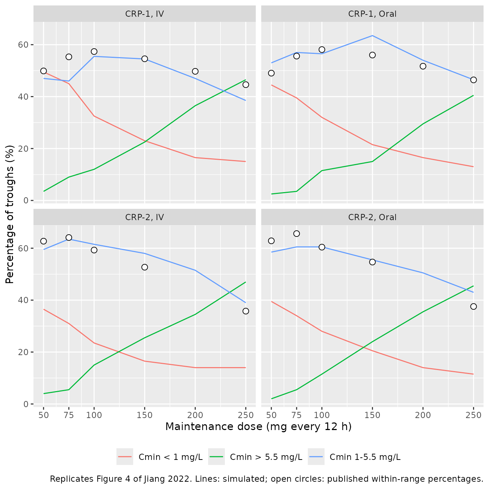

# Voriconazole (Jiang 2022)

## Model and source

- Citation: Jiang Z, Wei Y, Huang W, Li B, Zhou S, Liao L, Li T, Liang
  T, Yu X, Li X, Zhou C, Cao C, Liu T. Population pharmacokinetics of
  voriconazole and initial dosage optimization in patients with
  talaromycosis. Front Pharmacol. 2022;13:982981.
  <doi:10.3389/fphar.2022.982981>
- Description: One-compartment population pharmacokinetic model with
  first-order absorption for intravenous and oral voriconazole in
  Chinese adults with talaromycosis (Talaromyces marneffei infection)
  (Jiang 2022); C-reactive protein enters clearance as an exponential
  inflammation effect.
- Article: <https://doi.org/10.3389/fphar.2022.982981>

Jiang and colleagues fitted a one-compartment model with first-order
absorption and linear elimination to 233 voriconazole concentrations
from 69 Chinese adults treated for talaromycosis, an invasive fungal
infection caused by *Talaromyces marneffei* that is endemic in southern
China and South-East Asia. The absorption rate constant was fixed at 1.1
/h. The only covariate retained in the final model is C-reactive protein
(CRP), which lowers clearance through an exponential term. The paper
then uses Monte Carlo simulation to recommend CRP-stratified initial
doses (CRP at or below 96 mg/L versus above 96 mg/L).

``` r

mod <- readModelDb("Jiang_2022_voriconazole")
mod
#> function() {
#>   description <- "One-compartment population pharmacokinetic model with first-order absorption for intravenous and oral voriconazole in Chinese adults with talaromycosis (Talaromyces marneffei infection) (Jiang 2022); C-reactive protein enters clearance as an exponential inflammation effect."
#>   reference <- "Jiang Z, Wei Y, Huang W, Li B, Zhou S, Liao L, Li T, Liang T, Yu X, Li X, Zhou C, Cao C, Liu T. Population pharmacokinetics of voriconazole and initial dosage optimization in patients with talaromycosis. Front Pharmacol. 2022;13:982981. doi:10.3389/fphar.2022.982981"
#>   vignette <- "Jiang_2022_voriconazole"
#>   units <- list(time = "h", dosing = "mg", concentration = "mg/L")
#> 
#>   compartmentData <- list(
#>     depot = list(analyte = "voriconazole", units = "mg", specimen = "administration site", verified = TRUE),
#>     central = list(analyte = "voriconazole", units = "mg", specimen = "plasma", verified = TRUE)
#>   )
#> 
#>   covariateData <- list(
#>     CRP = list(
#>       description = "C-reactive protein concentration (clinical laboratory assay; standard vs high-sensitivity not stated), time-varying: Jiang 2022 related clearance to CRP measured within the same period as each concentration",
#>       units = "mg/L",
#>       type = "continuous",
#>       reference_category = NULL,
#>       notes = paste(
#>         "Enters CL as an exponential effect scaled by 43.6 mg/L (Jiang 2022 Eq. 6):",
#>         "exp(e_crp_cl * CRP / 43.6). This is a SCALED but not CENTERED form, so the",
#>         "tabulated typical CL of 4.34 L/h is the value at CRP = 0; at CRP = 43.6 mg/L the",
#>         "typical CL is 4.34 * exp(-0.135) = 3.79 L/h. The paper does not say what 43.6 mg/L is",
#>         "(Table 1 gives only per-site medians of 70.5 and 59.1 mg/L; the Methods say covariates",
#>         "were centered by their medians, so it is presumably the median over the analysed records).",
#>         "The scaled reading is the printed equation and reproduces the paper's own Monte Carlo",
#>         "target-attainment tables; see the model vignette.",
#>         "Cohort CRP: site 1 mean 93.9, SD 71.0, median 70.5, range 1.6-207.7 mg/L; site 2 mean",
#>         "61.3, SD 41.8, median 59.1, range 0.9-202 mg/L (Jiang 2022 Table 1)."
#>       ),
#>       source_name = "CRP"
#>     )
#>   )
#> 
#>   # Covariates Jiang 2022 screened during stepwise covariate modelling but did
#>   # not retain in the final model. Documentation only -- these names are
#>   # deliberately absent from model(). Height, hemoglobin, neutrophils, AST,
#>   # total protein, total and direct bilirubin and urea were also screened
#>   # (Methods 'Clinical data collection') and are recorded in population$notes.
#>   covariatesDataExcluded <- list(
#>     CYP2C19_IM = list(
#>       description = "CYP2C19 intermediate-metabolizer phenotype indicator",
#>       units = "(binary)",
#>       type = "binary",
#>       notes = "31 of 69 patients (*1/*2, *1/*3; Jiang 2022 Results). CYP2C19 phenotype had no significant effect on voriconazole PK; extensive-metabolizer status on V (dOFV 5.235) passed forward inclusion only and was removed in backward elimination."
#>     ),
#>     CYP2C19_PM = list(
#>       description = "CYP2C19 poor-metabolizer phenotype indicator",
#>       units = "(binary)",
#>       type = "binary",
#>       notes = "8 of 69 patients (*2/*2, *2/*3; Jiang 2022 Results). Not retained."
#>     ),
#>     ALB = list(
#>       description = "Serum albumin concentration",
#>       units = "g/L",
#>       type = "continuous",
#>       notes = "Site medians 26 and 24.7 g/L (Jiang 2022 Table 1). Correlated with the interindividual variability of CL but its forward-inclusion dOFV was below 3.84, so it was excluded (Discussion)."
#>     ),
#>     WT = list(
#>       description = "Body weight",
#>       units = "kg",
#>       type = "continuous",
#>       notes = "Site medians 61 and 50 kg, range 38-87 kg (Jiang 2022 Table 1). Screened and not retained."
#>     ),
#>     AGE = list(
#>       description = "Age",
#>       units = "years",
#>       type = "continuous",
#>       notes = "Site medians 57 and 30 years, range 20-69 years (Jiang 2022 Table 1). Screened and not retained."
#>     ),
#>     SEXF = list(
#>       description = "Sex indicator, 1 = female",
#>       units = "(binary)",
#>       type = "binary",
#>       notes = "14 of 69 patients (20.3%) female (Jiang 2022 Table 1). Screened and not retained."
#>     ),
#>     HIV_POS = list(
#>       description = "HIV-positive comorbidity indicator",
#>       units = "(binary)",
#>       type = "binary",
#>       notes = "34 of 69 patients (all from the Baise site) were newly diagnosed HIV positive with no antiretroviral history (Jiang 2022 Results). Screened and not retained."
#>     ),
#>     CONMED_PPI = list(
#>       description = "Concomitant proton-pump inhibitor use",
#>       units = "(binary)",
#>       type = "binary",
#>       notes = "32 of 69 patients received a PPI (omeprazole, pantoprazole, lansoprazole or rabeprazole), maximum 40 mg/day (Jiang 2022 Results, Table 1). No significant effect was found."
#>     ),
#>     CONMED_STEROID = list(
#>       description = "Concomitant systemic corticosteroid use",
#>       units = "(binary)",
#>       type = "binary",
#>       notes = "7 of 69 patients received a glucocorticoid (Jiang 2022 Table 1). Screened and not retained."
#>     ),
#>     ALT = list(
#>       description = "Alanine aminotransferase",
#>       units = "U/L",
#>       type = "continuous",
#>       notes = "Site medians 27.2 and 29 U/L, range 4.0-236 U/L (Jiang 2022 Table 1). Screened and not retained."
#>     ),
#>     GGT = list(
#>       description = "Gamma-glutamyltransferase",
#>       units = "U/L",
#>       type = "continuous",
#>       notes = "Site medians 290.1 and 95 U/L, range 19-1154 U/L (Jiang 2022 Table 1). Screened and not retained."
#>     ),
#>     PLT = list(
#>       description = "Platelet count",
#>       units = "10^9/L",
#>       type = "continuous",
#>       notes = "Site medians 417 and 102 x 10^9/L, range 6-625.7 (Jiang 2022 Table 1). Screened and not retained."
#>     ),
#>     WBC = list(
#>       description = "White blood cell count",
#>       units = "10^9/L",
#>       type = "continuous",
#>       notes = "Site medians 15.7 and 3.6 x 10^9/L, range 1.0-27.81 (Jiang 2022 Table 1). Screened and not retained."
#>     )
#>   )
#> 
#>   population <- list(
#>     species = "human",
#>     n_subjects = 69L,
#>     n_studies = 1L,
#>     n_observations = 233L,
#>     age_range = "20-69 years",
#>     age_median = "57 years (site 1), 30 years (site 2)",
#>     weight_range = "38-87 kg",
#>     weight_median = "61 kg (site 1), 50 kg (site 2)",
#>     sex_female_pct = 20.3,
#>     race_ethnicity = c(Chinese = 100),
#>     cyp2c19_phenotype = c(EM_pct = 43.5, IM_pct = 44.9, PM_pct = 11.6, RM_pct = 0, UM_pct = 0),
#>     co_medication = c(ProtonPumpInhibitor_pct = 46.4, Glucocorticoid_pct = 10.1),
#>     disease_state = "Adults (>= 18 years) with confirmed talaromycosis (Talaromyces marneffei infection) treated with voriconazole as initial therapy; 34 of 69 (49.3%) newly diagnosed HIV positive with no antiretroviral history. Excluded: Child-Pugh C hepatic dysfunction, creatinine > 3x upper limit of normal, other antifungals or interacting drugs, tuberculosis, chemotherapy, pregnancy.",
#>     dose_range = "Standard voriconazole dosing: IV 6 mg/kg q12h on day 1 (or oral 400 mg q12h) then 4 mg/kg q12h IV (or oral 200 mg q12h); non-loading regimen 4 mg/kg q12h IV or 200 mg q12h oral; oral dose halved below 40 kg. 50 patients IV loading + IV maintenance, 4 oral loading + oral maintenance, 1 IV loading + oral maintenance, 14 without loading dose (3 IV, 11 oral).",
#>     regions = "Guangxi, China: The First Affiliated Hospital of Guangxi Medical University, Nanning (n = 35) and People's Hospital of Baise (n = 34).",
#>     notes = paste(
#>       "Prospective observational study, February 2019 - November 2021. Sparse sampling: at least one",
#>       "sample within 30 min pre-dose and at 0.5, 1, 2, 4, 6, 8, 10 or 12 h post-dose; 233 concentrations",
#>       "(median 4 per patient, range 1-9) including 75 steady-state troughs. Concentrations by",
#>       "two-dimensional HPLC, LLOQ 0.2 mg/L. Observed troughs ranged 0.23-16.95 mg/L; 47.7% of 65",
#>       "troughs lay in the 1.0-5.5 mg/L target range, 12.3% below and 40.0% above.",
#>       "Covariates screened and not retained: sex, age, weight, height, HIV, PPIs, glucocorticoids,",
#>       "WBC, hemoglobin, platelets, neutrophils, ALT, AST, albumin, total protein, total bilirubin,",
#>       "GGT, urea and CYP2C19 phenotype. Demographics per Jiang 2022 Table 1; final-model estimates",
#>       "and 1000-replicate bootstrap (986 successful) per Jiang 2022 Table 2 and Eqs. 6-9."
#>     )
#>   )
#> 
#>   ini({
#>     # Absorption: ka fixed at 1.1/h from Pascual 2012 because few samples
#>     # fell in the absorption phase.
#>     lka <- fixed(log(1.1)); label("Absorption rate constant (1/h)")  # Jiang 2022 Methods 'Population pharmacokinetic model' ('Ka was fixed at 1.1 h-1 as reported in the literature'); Table 2 ka = 1.1 (Fixed); Eq. 8
#> 
#>     lcl <- log(4.34); label("Clearance at CRP = 0 mg/L (L/h)")  # Jiang 2022 Table 2 final model: CL = 4.34 L/h (RSE 18.6%, bootstrap median 4.39, 95% CI 2.86-4.46); Eq. 6
#> 
#>     lvc <- log(97.4); label("Volume of distribution (L)")  # Jiang 2022 Table 2 final model: V = 97.4 L (RSE 7.1%, bootstrap median 97.3, 95% CI 84.5-111.9); Eq. 7
#> 
#>     lfdepot <- log(0.951); label("Oral bioavailability (fraction)")  # Jiang 2022 Table 2 final model: F1 = 95.1% (RSE 20.5%, bootstrap median 93.7, 95% CI 46.4-134); Eq. 9
#> 
#>     e_crp_cl <- -0.135; label("Exponential CRP coefficient on CL, per unit of CRP/43.6 (unitless)")  # Jiang 2022 Table 2 final model: 'CRP on CL' = -0.135 (RSE 65.1%, bootstrap median -0.151, 95% CI -0.367 to 0.098); Eq. 6
#> 
#>     # IIV. Eqs. 6-7 print the omega^2 values in the exponent (e^1.01 and
#>     # e^0.0973) and Table 2 reports sqrt(omega^2) * 100: sqrt(1.01) = 100.5%,
#>     # sqrt(0.0973) = 31.2%.
#>     etalcl ~ 1.01  # Jiang 2022 Eq. 6 omega^2 = 1.01; Table 2 IIV_CL = 100.5% (RSE 11.7%, shrinkage 6.50%)
#>     etalvc ~ 0.0973  # Jiang 2022 Eq. 7 omega^2 = 0.0973; Table 2 IIV_V = 31.2% (RSE 14.7%, shrinkage 42.5%)
#> 
#>     # Residual error: combined model Y = F * (1 + eps1) + eps2 (Methods Eq. 5;
#>     # Results 'a combined model was used').
#>     propSd <- 0.071; label("Proportional residual error (fraction)")  # Jiang 2022 Table 2 final model: RSV_CV = 7.1% (RSE 16.5%, shrinkage 19.8%)
#>     addSd <- 0.373; label("Additive residual error (mg/L)")  # Jiang 2022 Table 2 final model: RSV_SD = 0.373 mg/L (RSE 13.5%, shrinkage 19.8%)
#>   })
#> 
#>   model({
#>     # Jiang 2022 Eqs. 6-9:
#>     #   CL (L/h) = 4.34 * exp(-0.135 * CRP(mg/L) / 43.6) * exp(eta_CL)
#>     #   V (L)    = 97.4 * exp(eta_V)
#>     #   Ka       = 1.1 /h (fixed);  F = 95.1%
#>     ka <- exp(lka)
#>     cl <- exp(lcl + etalcl) * exp(e_crp_cl * CRP / 43.6)
#>     vc <- exp(lvc + etalvc)
#> 
#>     # One-compartment disposition with first-order oral absorption.
#>     # Intravenous doses bypass the depot and enter central directly.
#>     d/dt(depot) <- -ka * depot
#>     d/dt(central) <- ka * depot - (cl / vc) * central
#> 
#>     # Oral bioavailability applies only to doses entering via the depot.
#>     f(depot) <- exp(lfdepot)
#> 
#>     # Amounts in mg and volume in L give mg/L.
#>     Cc <- central / vc
#>     Cc ~ add(addSd) + prop(propSd)
#>   })
#> }
#> <environment: 0x56005331da10>
```

## Population

69 adults with confirmed talaromycosis, enrolled prospectively between
February 2019 and November 2021 at two hospitals in Guangxi, China
(Jiang 2022 Table 1): 35 at The First Affiliated Hospital of Guangxi
Medical University (Nanning) and 34 at People’s Hospital of Baise. The
two sites differ sharply. The Nanning patients were older (median 57
years, range 54-69) and none had HIV. The Baise patients were younger
(median 30 years, range 20-65) and all 34 were newly diagnosed
HIV-positive patients who had not yet started antiretroviral therapy.
Overall 55 of 69 patients (79.7%) were male and body weight ranged from
38 to 87 kg. CRP was high at both sites: median 70.5 mg/L (range
1.6-207.7) in Nanning and 59.1 mg/L (range 0.9-202) in Baise. CYP2C19
phenotypes were 30 extensive (*1/*1), 31 intermediate and 8 poor
metabolizers; CYP2C19 phenotype was not retained as a covariate.

Patients received standard voriconazole dosing (6 mg/kg IV or 400 mg
oral twice daily on day 1, then 4 mg/kg IV or 200 mg oral twice daily).
Sampling was sparse: 233 concentrations (median 4 per patient), 75 of
them steady-state troughs.

``` r

str(readModelDb("Jiang_2022_voriconazole")()$population)
#> List of 16
#>  $ species          : chr "human"
#>  $ n_subjects       : int 69
#>  $ n_studies        : int 1
#>  $ n_observations   : int 233
#>  $ age_range        : chr "20-69 years"
#>  $ age_median       : chr "57 years (site 1), 30 years (site 2)"
#>  $ weight_range     : chr "38-87 kg"
#>  $ weight_median    : chr "61 kg (site 1), 50 kg (site 2)"
#>  $ sex_female_pct   : num 20.3
#>  $ race_ethnicity   : Named num 100
#>   ..- attr(*, "names")= chr "Chinese"
#>  $ cyp2c19_phenotype: Named num [1:5] 43.5 44.9 11.6 0 0
#>   ..- attr(*, "names")= chr [1:5] "EM_pct" "IM_pct" "PM_pct" "RM_pct" ...
#>  $ co_medication    : Named num [1:2] 46.4 10.1
#>   ..- attr(*, "names")= chr [1:2] "ProtonPumpInhibitor_pct" "Glucocorticoid_pct"
#>  $ disease_state    : chr "Adults (>= 18 years) with confirmed talaromycosis (Talaromyces marneffei infection) treated with voriconazole a"| __truncated__
#>  $ dose_range       : chr "Standard voriconazole dosing: IV 6 mg/kg q12h on day 1 (or oral 400 mg q12h) then 4 mg/kg q12h IV (or oral 200 "| __truncated__
#>  $ regions          : chr "Guangxi, China: The First Affiliated Hospital of Guangxi Medical University, Nanning (n = 35) and People's Hosp"| __truncated__
#>  $ notes            : chr "Prospective observational study, February 2019 - November 2021. Sparse sampling: at least one sample within 30 "| __truncated__
```

## Source trace

Every `ini()` entry in
`inst/modeldb/specificDrugs/Jiang_2022_voriconazole.R` carries an
in-file comment naming its source location. They are collected here for
review.

| Equation / parameter | Value | Source location |
|----|----|----|
| `lka` (fixed) | 1.1 /h | Methods “Population pharmacokinetic model” (fixed per Pascual 2012); Table 2 “ka”; Eq. 8 |
| `lcl` | 4.34 L/h | Table 2, final model “CL (L/h)” (RSE 18.6%); Eq. 6 |
| `lvc` | 97.4 L | Table 2, final model “V (L)” (RSE 7.1%); Eq. 7 |
| `lfdepot` | 0.951 | Table 2, final model “F1 (%)” (RSE 20.5%); Eq. 9 |
| `e_crp_cl` | -0.135 | Table 2, final model “CRP on CL” (RSE 65.1%); Eq. 6 |
| `etalcl` | omega^2 = 1.01 (100.5%) | Eq. 6 exponent; Table 2 “IIV_CL (%)” |
| `etalvc` | omega^2 = 0.0973 (31.2%) | Eq. 7 exponent; Table 2 “IIV_V (%)” |
| `propSd` | 0.071 | Table 2, final model “RSV_CV (%)” |
| `addSd` | 0.373 mg/L | Table 2, final model “RSV_SD (mg/L)” |
| CL equation with CRP scaled by 43.6 mg/L | n/a | Eq. 6 |
| One-compartment, first-order absorption structure | n/a | Methods “Population pharmacokinetic model”; Results “Population pharmacokinetics model development” |
| Combined residual error, `Y = F * (1 + eps1) + eps2` | n/a | Methods Eq. 5; Results “a combined model was used” |

The published final-model equations (Jiang 2022 Eqs. 6-9) are

    CL (L/h) = 4.34 * exp(-0.135 * CRP(mg/L) / 43.6) * e^1.01
    V (L)    = 97.4 * e^0.0973
    Ka (/h)  = 1.1 (fixed)
    F        = 95.1%

The exponents `e^1.01` and `e^0.0973` stand in for the random effects
and print their variances: `sqrt(1.01) = 100.5%` and
`sqrt(0.0973) = 31.2%` are exactly the Table 2 IIV percentages. The
model therefore uses `omega^2 = 1.01` for CL and `0.0973` for V.

## An independent reimplementation of the published equations

The gates below need the published equations written out from the
printed coefficients alone, independent of the packaged model. A check
built from the model’s own parameters could not fail.

``` r

# Typical CL from Eq. 6, written with literals so it does not depend on the
# model file. `crp_centered = TRUE` gives the alternative median-centered
# reading that the gates below test against.
cl_published <- function(CRP, crp_centered = FALSE) {
  crp_term <- if (crp_centered) (CRP - 43.6) / 43.6 else CRP / 43.6
  4.34 * exp(-0.135 * crp_term)
}
v_published <- 97.4
ka_published <- 1.1
f_published <- 0.951

# One-compartment concentration at time `t` after a list of doses, by
# superposition. IV doses are 1 h constant-rate infusions; oral doses are
# first-order absorption with bioavailability F. Vectorised over subjects
# (`cl`, `v`); `doses` is a data frame with columns `time` and `amt`.
conc_closed <- function(t, doses, cl, v, iv, ka = ka_published,
                        f = f_published, dur = 1) {
  k <- cl / v
  out <- 0
  for (i in seq_len(nrow(doses))) {
    tt <- t - doses$time[i]
    if (tt <= 0) next
    amt <- doses$amt[i]
    if (iv) {
      r <- amt / dur
      out <- out + if (tt <= dur) {
        r / (k * v) * (1 - exp(-k * tt))
      } else {
        r / (k * v) * (1 - exp(-k * dur)) * exp(-k * (tt - dur))
      }
    } else {
      out <- out + f * amt * ka / (v * (ka - k)) * (exp(-k * tt) - exp(-ka * tt))
    }
  }
  out
}
```

## Virtual cohort

The individual data are not public, and the paper does not say how it
sampled CRP within each stratum. The cohort below draws CRP from a
log-normal distribution per site, matched to the Table 1 median and mean
and truncated to the Table 1 range, pools the two sites in equal numbers
(35 vs 34 patients), and splits the pool at the paper’s 96 mg/L cut-off
into the CRP-1 (at or below 96 mg/L) and CRP-2 (above 96 mg/L) groups.

``` r

set.seed(20220926)

draw_crp <- function(n, med, mean, lo, hi) {
  s <- sqrt(2 * log(mean / med))
  x <- exp(rnorm(n * 4, log(med), s))
  x <- x[x >= lo & x <= hi]
  x[seq_len(n)]
}
crp_pool <- c(
  draw_crp(20000, med = 70.5, mean = 93.9, lo = 1.6, hi = 207.7), # Nanning
  draw_crp(20000, med = 59.1, mean = 61.3, lo = 0.9, hi = 202)    # Baise
)
crp_by_group <- list(
  "CRP-1" = crp_pool[crp_pool <= 96],
  "CRP-2" = crp_pool[crp_pool > 96]
)

tibble(
  group = names(crp_by_group),
  fraction_of_pool = sapply(crp_by_group, length) / length(crp_pool),
  median_CRP = sapply(crp_by_group, median)
) |>
  dplyr::rename(
    "Group" = group,
    "Fraction of pool" = fraction_of_pool,
    "Median CRP (mg/L)" = median_CRP
  ) |>
  knitr::kable(digits = 2, caption = "Simulated CRP strata.")
```

| Group | Fraction of pool | Median CRP (mg/L) |
|:------|-----------------:|------------------:|
| CRP-1 |             0.84 |             56.07 |
| CRP-2 |             0.16 |            125.37 |

Simulated CRP strata. {.table}

Two simulation designs from the paper are reproduced, each with 200
subjects per arm:

- **Table 3 (loading dose).** 200, 250, 275, 300 or 350 mg every 12 h on
  day 1, as a 1 h IV infusion or orally, and the concentration at 24 h
  (`C24`, the trough before the third dose) compared with the 1.0-5.5
  mg/L target.
- **Figure 4 (maintenance dose).** The recommended loading dose for the
  group (250 mg in CRP-1, 200 mg in CRP-2) followed by 50, 75, 100, 150,
  200 or 250 mg every 12 h. The paper defines steady state as reached
  after the fifth dose following the loading dose, so the trough is
  taken 12 h after the fifth maintenance dose (t = 84 h).

``` r

n_arm <- 200
tau <- 12

# Event rows for one arm. IV doses are 1 h infusions into central; oral doses
# go to depot. Observations are on the central state, which returns Cc.
make_arm <- function(arm_id, group, route, ld, md, t_obs, id_offset) {
  dose_times <- c(0, tau)
  dose_amts <- c(ld, ld)
  if (!is.na(md)) {
    dose_times <- c(dose_times, seq(24, t_obs - tau, by = tau))
    dose_amts <- c(dose_amts, rep(md, length(dose_times) - 2))
  }
  iv <- route == "IV"
  dose_rows <- data.frame(
    time = dose_times, evid = 1L, amt = dose_amts,
    rate = if (iv) dose_amts else 0,
    cmt = if (iv) "central" else "depot"
  )
  obs_rows <- data.frame(time = t_obs, evid = 0L, amt = 0, rate = 0, cmt = "central")
  ids <- id_offset + seq_len(n_arm)
  crp <- sample(crp_by_group[[group]], n_arm)
  tidyr::expand_grid(id = ids, bind_rows(dose_rows, obs_rows)) |>
    left_join(data.frame(id = ids, CRP = crp), by = "id") |>
    mutate(arm = arm_id, group = group, route = route, ld = ld, md = md) |>
    select(id, time, evid, amt, rate, cmt, everything()) |>
    arrange(id, time, desc(evid))
}

arms_t3 <- tidyr::expand_grid(
  group = c("CRP-1", "CRP-2"), route = c("IV", "Oral"),
  ld = c(200, 250, 275, 300, 350)
) |>
  mutate(design = "Table 3", md = NA_real_, t_obs = 24)

arms_f4 <- tidyr::expand_grid(
  group = c("CRP-1", "CRP-2"), route = c("IV", "Oral"),
  md = c(50, 75, 100, 150, 200, 250)
) |>
  mutate(design = "Figure 4", ld = ifelse(group == "CRP-1", 250, 200), t_obs = 84)

arms <- bind_rows(arms_t3, arms_f4) |>
  mutate(arm_id = row_number())

set.seed(20220927)
events <- bind_rows(lapply(seq_len(nrow(arms)), function(i) {
  a <- arms[i, ]
  make_arm(a$arm_id, a$group, a$route, a$ld, a$md, a$t_obs,
           id_offset = (i - 1L) * n_arm)
}))

# Disjoint IDs across arms: rxSolve keys subjects on `id`, and a collision
# would merge two subjects into one that receives both arms' doses.
stopifnot(length(unique(events$id)) == nrow(arms) * n_arm)
nrow(arms)
#> [1] 44
```

## Simulation

The paper included both the interindividual and the residual variability
in its Monte Carlo simulations (Methods “Dosage regimen simulations”),
so target attainment below uses `sim`, the concentration with residual
error.

``` r

rxode2::rxSetSeed(20220928)
sim <- rxode2::rxSolve(
  mod, events = events,
  keep = c("arm", "group", "route", "ld", "md", "CRP"),
  returnType = "data.frame", addDosing = FALSE,
  rtol = 1e-8, atol = 1e-10
) |>
  left_join(arms |> select(arm = arm_id, design, t_obs), by = "arm")
#> ℹ parameter labels from comments will be replaced by 'label()'
nrow(sim)
#> [1] 8800
```

### Gate 1 – the packaged model reproduces the published equations

Both sides use the same per-subject `cl` and `vc` drawn by rxode2, so
the only difference is numerical integration error.

``` r

chk <- sim |>
  rowwise() |>
  mutate(
    dose_tbl = list(if (is.na(md)) {
      data.frame(time = c(0, tau), amt = c(ld, ld))
    } else {
      dt <- c(0, tau, seq(24, t_obs - tau, by = tau))
      data.frame(time = dt, amt = c(ld, ld, rep(md, length(dt) - 2)))
    }),
    cc_closed = conc_closed(time, dose_tbl, cl, vc, iv = route == "IV")
  ) |>
  ungroup() |>
  mutate(rel_err = abs(Cc - cc_closed) / cc_closed)

max(chk$rel_err)
#> [1] 3.361512e-07
stopifnot(max(chk$rel_err) < 1e-4)
```

The typical clearance must also follow Eq. 6 across the observed CRP
range.

``` r

crp_grid <- c(0, 1, 43.6, 96, 150, 207.7)
tv <- rxode2::rxSolve(
  rxode2::zeroRe(mod),
  events = data.frame(
    id = seq_along(crp_grid), time = 1, evid = 0L, amt = 0, cmt = "central",
    CRP = crp_grid
  ),
  keep = "CRP", returnType = "data.frame"
) |>
  mutate(cl_ref = cl_published(CRP))
#> ℹ parameter labels from comments will be replaced by 'label()'
#> ℹ omega/sigma items treated as zero: 'etalcl', 'etalvc'
#> Warning: multi-subject simulation without without 'omega'

tv |> select(CRP, cl, cl_ref, vc)
#>     CRP       cl   cl_ref   vc
#> 1   0.0 4.340000 4.340000 97.4
#> 2   1.0 4.326583 4.326583 97.4
#> 3  43.6 3.791927 3.791927 97.4
#> 4  96.0 3.224012 3.224012 97.4
#> 5 150.0 2.727607 2.727607 97.4
#> 6 207.7 2.281348 2.281348 97.4
stopifnot(
  max(abs(tv$cl - tv$cl_ref) / tv$cl_ref) < 1e-10,
  all(abs(tv$vc - v_published) < 1e-10)
)
```

## Replicate published tables and figures

### Table 3 – loading-dose target attainment at 24 h

``` r

pta_t3 <- sim |>
  filter(design == "Table 3") |>
  group_by(group, route, ld) |>
  summarise(
    below = mean(sim < 1) * 100,
    in_range = mean(sim >= 1 & sim <= 5.5) * 100,
    above = mean(sim > 5.5) * 100,
    .groups = "drop"
  )

# Jiang 2022 Table 3, percentages of C24 below 1, within 1-5.5 and above
# 5.5 mg/L. (The table header prints the upper cut-off as 5 mg/L; the text
# and the abstract define the target as 1.0-5.5 mg/L.)
published_t3 <- tibble::tribble(
  ~ld, ~route, ~group, ~pub_below, ~pub_in_range, ~pub_above,
  200, "IV",   "CRP-1", 20.45, 78.61,  0.94,
  200, "Oral", "CRP-1", 21.00, 78.39,  0.61,
  250, "IV",   "CRP-1", 16.96, 80.17,  2.87,
  250, "Oral", "CRP-1", 15.73, 81.17,  3.10,
  275, "IV",   "CRP-1", 14.33, 79.17,  6.50,
  275, "Oral", "CRP-1", 14.14, 80.49,  5.37,
  300, "IV",   "CRP-1", 12.81, 77.08, 10.11,
  300, "Oral", "CRP-1", 13.14, 78.59,  8.27,
  350, "IV",   "CRP-1", 11.11, 70.40, 18.49,
  350, "Oral", "CRP-1", 11.17, 72.65, 16.18,
  200, "IV",   "CRP-2", 11.73, 86.45,  1.82,
  200, "Oral", "CRP-2", 11.89, 86.79,  1.32,
  250, "IV",   "CRP-2",  8.54, 84.38,  7.08,
  250, "Oral", "CRP-2",  8.81, 85.57,  5.62,
  275, "IV",   "CRP-2",  7.56, 81.29, 11.15,
  275, "Oral", "CRP-2",  7.42, 83.36,  9.22,
  300, "IV",   "CRP-2",  6.80, 76.75, 16.45,
  300, "Oral", "CRP-2",  6.76, 79.77, 13.47,
  350, "IV",   "CRP-2",  5.64, 66.51, 27.85,
  350, "Oral", "CRP-2",  5.40, 70.39, 24.21
)

cmp_t3 <- published_t3 |>
  left_join(pta_t3, by = c("group", "route", "ld")) |>
  arrange(group, ld, route)

cmp_t3 |>
  select(group, ld, route, pub_below, below, pub_in_range, in_range, pub_above, above) |>
  dplyr::rename(
    "Group" = group,
    "Loading dose (mg q12h)" = ld,
    "Route" = route,
    "< 1 published" = pub_below,
    "< 1 simulated" = below,
    "1-5.5 published" = pub_in_range,
    "1-5.5 simulated" = in_range,
    "> 5.5 published" = pub_above,
    "> 5.5 simulated" = above
  ) |>
  knitr::kable(
    digits = 1,
    caption = paste(
      "Replicates Table 3 of Jiang 2022: percentage of simulated C24 values",
      "below, within and above the 1.0-5.5 mg/L target after a day-1 loading",
      "dose, against the published percentages."
    )
  )
```

| Group | Loading dose (mg q12h) | Route | \< 1 published | \< 1 simulated | 1-5.5 published | 1-5.5 simulated | \> 5.5 published | \> 5.5 simulated |
|:---|---:|:---|---:|---:|---:|---:|---:|---:|
| CRP-1 | 200 | IV | 20.4 | 25.0 | 78.6 | 74.0 | 0.9 | 1.0 |
| CRP-1 | 200 | Oral | 21.0 | 23.0 | 78.4 | 77.0 | 0.6 | 0.0 |
| CRP-1 | 250 | IV | 17.0 | 18.5 | 80.2 | 78.0 | 2.9 | 3.5 |
| CRP-1 | 250 | Oral | 15.7 | 14.5 | 81.2 | 82.5 | 3.1 | 3.0 |
| CRP-1 | 275 | IV | 14.3 | 10.5 | 79.2 | 85.5 | 6.5 | 4.0 |
| CRP-1 | 275 | Oral | 14.1 | 14.0 | 80.5 | 82.5 | 5.4 | 3.5 |
| CRP-1 | 300 | IV | 12.8 | 14.0 | 77.1 | 74.5 | 10.1 | 11.5 |
| CRP-1 | 300 | Oral | 13.1 | 12.0 | 78.6 | 78.0 | 8.3 | 10.0 |
| CRP-1 | 350 | IV | 11.1 | 10.0 | 70.4 | 72.5 | 18.5 | 17.5 |
| CRP-1 | 350 | Oral | 11.2 | 11.0 | 72.7 | 75.0 | 16.2 | 14.0 |
| CRP-2 | 200 | IV | 11.7 | 14.0 | 86.4 | 83.5 | 1.8 | 2.5 |
| CRP-2 | 200 | Oral | 11.9 | 16.0 | 86.8 | 82.0 | 1.3 | 2.0 |
| CRP-2 | 250 | IV | 8.5 | 8.5 | 84.4 | 88.5 | 7.1 | 3.0 |
| CRP-2 | 250 | Oral | 8.8 | 14.5 | 85.6 | 83.5 | 5.6 | 2.0 |
| CRP-2 | 275 | IV | 7.6 | 8.5 | 81.3 | 83.0 | 11.2 | 8.5 |
| CRP-2 | 275 | Oral | 7.4 | 12.0 | 83.4 | 82.0 | 9.2 | 6.0 |
| CRP-2 | 300 | IV | 6.8 | 8.5 | 76.8 | 77.5 | 16.4 | 14.0 |
| CRP-2 | 300 | Oral | 6.8 | 11.0 | 79.8 | 78.0 | 13.5 | 11.0 |
| CRP-2 | 350 | IV | 5.6 | 6.5 | 66.5 | 67.5 | 27.9 | 26.0 |
| CRP-2 | 350 | Oral | 5.4 | 9.0 | 70.4 | 63.5 | 24.2 | 27.5 |

Replicates Table 3 of Jiang 2022: percentage of simulated C24 values
below, within and above the 1.0-5.5 mg/L target after a day-1 loading
dose, against the published percentages. {.table}

### Figure 4 – maintenance-dose target attainment

Figure 4 of the paper labels every plotted point with its percentage.
The within-range percentages are transcribed below. At 200 mg in the
CRP-2 panels the within-range and above-range labels sit on top of each
other at the point where the two curves cross, so those two points are
left out.

``` r

published_f4 <- tibble::tribble(
  ~group,  ~route, ~md, ~pub_in_range,
  "CRP-1", "IV",    50, 49.89,
  "CRP-1", "IV",    75, 55.31,
  "CRP-1", "IV",   100, 57.36,
  "CRP-1", "IV",   150, 54.57,
  "CRP-1", "IV",   200, 49.74,
  "CRP-1", "IV",   250, 44.60,
  "CRP-1", "Oral",  50, 49.04,
  "CRP-1", "Oral",  75, 55.61,
  "CRP-1", "Oral", 100, 58.11,
  "CRP-1", "Oral", 150, 56.01,
  "CRP-1", "Oral", 200, 51.71,
  "CRP-1", "Oral", 250, 46.44,
  "CRP-2", "IV",    50, 62.71,
  "CRP-2", "IV",    75, 64.11,
  "CRP-2", "IV",   100, 59.29,
  "CRP-2", "IV",   150, 52.69,
  "CRP-2", "IV",   250, 35.77,
  "CRP-2", "Oral",  50, 62.84,
  "CRP-2", "Oral",  75, 65.62,
  "CRP-2", "Oral", 100, 60.41,
  "CRP-2", "Oral", 150, 54.67,
  "CRP-2", "Oral", 250, 37.55
)

pta_f4 <- sim |>
  filter(design == "Figure 4") |>
  group_by(group, route, md) |>
  summarise(
    "Cmin < 1 mg/L" = mean(sim < 1) * 100,
    "Cmin 1-5.5 mg/L" = mean(sim >= 1 & sim <= 5.5) * 100,
    "Cmin > 5.5 mg/L" = mean(sim > 5.5) * 100,
    .groups = "drop"
  )

pta_f4 |>
  tidyr::pivot_longer(starts_with("Cmin"), names_to = "category", values_to = "pta") |>
  ggplot(aes(md, pta, colour = category)) +
  geom_line() +
  geom_point(
    data = published_f4,
    aes(md, pub_in_range),
    inherit.aes = FALSE, shape = 21, size = 2.5, fill = "white"
  ) +
  facet_wrap(~ paste(group, route, sep = ", ")) +
  scale_x_continuous(breaks = c(50, 75, 100, 150, 200, 250)) +
  labs(
    x = "Maintenance dose (mg every 12 h)", y = "Percentage of troughs (%)",
    colour = NULL,
    caption = paste(
      "Replicates Figure 4 of Jiang 2022. Lines: simulated; open circles:",
      "published within-range percentages."
    )
  ) +
  theme(legend.position = "bottom")
```



The simulation reproduces the paper’s pattern. Within-range attainment
peaks at 100 mg (CRP-1) or 75 mg (CRP-2) and falls at higher doses as
more troughs exceed 5.5 mg/L. The CRP-2 optimum is lower because
inflammation lowers clearance.

### Gate 2 – the published target-attainment percentages

None of the published percentages were used to build the model file.
Each arm has 200 subjects, so a single percentage has a binomial
standard error of about 3 percentage points. The gate therefore asserts
on the mean absolute difference across all cells, not on any single
cell.

``` r

err <- bind_rows(
  cmp_t3 |> transmute(source = "Table 3", group, diff = in_range - pub_in_range),
  published_f4 |>
    left_join(pta_f4, by = c("group", "route", "md")) |>
    transmute(source = "Figure 4", group, diff = `Cmin 1-5.5 mg/L` - pub_in_range)
) |>
  group_by(source, group) |>
  summarise(
    n_cells = n(),
    mean_diff_pp = mean(diff),
    mean_abs_diff_pp = mean(abs(diff)),
    .groups = "drop"
  )

err |>
  dplyr::rename(
    "Source" = source, "Group" = group, "Cells" = n_cells,
    "Mean difference (pp)" = mean_diff_pp,
    "Mean abs. difference (pp)" = mean_abs_diff_pp
  ) |>
  knitr::kable(
    digits = 2,
    caption = "Simulated minus published within-range percentages."
  )
```

| Source   | Group | Cells | Mean difference (pp) | Mean abs. difference (pp) |
|:---------|:------|------:|---------------------:|--------------------------:|
| Figure 4 | CRP-1 |    12 |                -0.78 |                      3.31 |
| Figure 4 | CRP-2 |    10 |                 0.38 |                      3.04 |
| Table 3  | CRP-1 |    10 |                 0.28 |                      2.55 |
| Table 3  | CRP-2 |    10 |                -1.23 |                      2.74 |

Simulated minus published within-range percentages. {.table}

``` r


# Realised 2.5-3.3 pp per source and group. CRP-2 also depends on how CRP is
# distributed above 96 mg/L, which the paper does not report, so it gets a
# wider bound. In a base-R check of the CRP-1 cells, halving or doubling CL
# moves the Figure 4 mean absolute difference to 10.7 and 12.4 pp, and halving
# or doubling V moves the Table 3 one to 25.5 and 8.5 pp, so the 6 pp bound
# still fails on a two-fold structural or unit error.
stopifnot(
  all(err$mean_abs_diff_pp[err$group == "CRP-1"] < 6),
  all(err$mean_abs_diff_pp[err$group == "CRP-2"] < 10)
)
```

### Gate 3 – median-scaled or median-centered CRP?

Eq. 6 prints the CRP term as `exp(-0.135 * CRP/43.6)`, which scales CRP
by 43.6 mg/L but does not center it. Under this reading the typical
clearance of 4.34 L/h applies at CRP = 0. The Methods, however, state
that “covariates were centered by their medians”, which would imply
`exp(-0.135 * (CRP - 43.6)/43.6)`. Here both readings are scored against
the published CRP-1 percentages, the group where the CRP distribution is
best pinned down. The scoring uses the independent reimplementation
above and R’s own random number generator, so it gives the same answer
on any machine.

``` r

set.seed(20220929)
n_mc <- 20000
crp1 <- crp_by_group[["CRP-1"]]

pta_closed <- function(doses, t_obs, iv, crp_centered) {
  crp <- sample(crp1, n_mc, replace = TRUE)
  cl <- cl_published(crp, crp_centered) * exp(rnorm(n_mc, 0, sqrt(1.01)))
  v <- v_published * exp(rnorm(n_mc, 0, sqrt(0.0973)))
  conc <- conc_closed(t_obs, doses, cl, v, iv = iv)
  conc <- conc * (1 + rnorm(n_mc, 0, 0.071)) + rnorm(n_mc, 0, 0.373)
  mean(conc >= 1 & conc <= 5.5) * 100
}

targets <- bind_rows(
  published_t3 |>
    filter(group == "CRP-1") |>
    transmute(route, ld, md = NA_real_, t_obs = 24, pub = pub_in_range),
  published_f4 |>
    filter(group == "CRP-1") |>
    transmute(route, ld = 250, md, t_obs = 84, pub = pub_in_range)
)

score <- function(crp_centered) {
  sim_pta <- mapply(function(route, ld, md, t_obs) {
    dt <- if (is.na(md)) c(0, tau) else c(0, tau, seq(24, t_obs - tau, by = tau))
    amt <- if (is.na(md)) c(ld, ld) else c(ld, ld, rep(md, length(dt) - 2))
    pta_closed(data.frame(time = dt, amt = amt), t_obs, route == "IV", crp_centered)
  }, targets$route, targets$ld, targets$md, targets$t_obs)
  mean(abs(sim_pta - targets$pub))
}

arb <- tibble(
  reading = c("As printed: exp(-0.135 * CRP/43.6)",
              "Median-centered: exp(-0.135 * (CRP - 43.6)/43.6)"),
  mean_abs_error_pp = c(score(FALSE), score(TRUE))
)

arb |>
  dplyr::rename(
    "Reading of Eq. 6" = reading,
    "Mean abs. error vs published (pp)" = mean_abs_error_pp
  ) |>
  knitr::kable(
    digits = 2,
    caption = paste(
      "Each reading scored against the 22 published CRP-1 within-range",
      "percentages (Table 3 and Figure 4)."
    )
  )
```

| Reading of Eq. 6 | Mean abs. error vs published (pp) |
|:---|---:|
| As printed: exp(-0.135 \* CRP/43.6) | 0.78 |
| Median-centered: exp(-0.135 \* (CRP - 43.6)/43.6) | 2.22 |

Each reading scored against the 22 published CRP-1 within-range
percentages (Table 3 and Figure 4). {.table}

``` r


stopifnot(arb$mean_abs_error_pp[1] < arb$mean_abs_error_pp[2])
```

The printed form fits the paper’s own simulation results more closely
than the centered form, so the model encodes Eq. 6 exactly as printed.
The same form is used by `Ling_2024_voriconazole`
(`exp(-0.155 * CRP/59)`), where it was likewise confirmed against that
paper’s target-attainment percentages.

## PKNCA validation

Steady-state NCA over one dosing interval for the four recommended
regimens of Table 4: 100 mg every 12 h (CRP-1) or 75 mg every 12 h
(CRP-2), IV or oral. The loading dose does not affect a true steady
state, so rxode2’s steady-state dosing record (`ss = 1`) is used.

``` r

set.seed(20220930)
nca_arms <- tidyr::expand_grid(group = c("CRP-1", "CRP-2"), route = c("IV", "Oral")) |>
  mutate(md = ifelse(group == "CRP-1", 100, 75), treatment = paste(group, route))

events_nca <- bind_rows(lapply(seq_len(nrow(nca_arms)), function(i) {
  a <- nca_arms[i, ]
  iv <- a$route == "IV"
  ids <- (i - 1L) * n_arm + seq_len(n_arm)
  dose <- data.frame(
    time = 0, evid = 1L, amt = a$md, rate = if (iv) a$md else 0,
    ii = tau, ss = 1L, cmt = if (iv) "central" else "depot"
  )
  obs <- data.frame(
    time = seq(0, tau, by = 0.25), evid = 0L, amt = 0, rate = 0,
    ii = 0, ss = 0L, cmt = "central"
  )
  tidyr::expand_grid(id = ids, bind_rows(dose, obs)) |>
    left_join(
      data.frame(id = ids, CRP = sample(crp_by_group[[a$group]], n_arm)),
      by = "id"
    ) |>
    mutate(treatment = a$treatment, md = a$md) |>
    select(id, time, evid, amt, rate, ii, ss, cmt, everything()) |>
    arrange(id, time, desc(evid))
}))

rxode2::rxSetSeed(20220931)
sim_nca <- rxode2::rxSolve(
  mod, events = events_nca, keep = c("treatment", "md", "CRP"),
  returnType = "data.frame", addDosing = FALSE,
  # steady-state searches for long-half-life subjects need a larger step budget
  maxsteps = 1e6
)
stopifnot(!anyNA(sim_nca$Cc))
```

``` r

conc_obj <- PKNCA::PKNCAconc(
  sim_nca |> filter(!is.na(Cc)) |> select(id, time, Cc, treatment),
  Cc ~ time | treatment + id,
  concu = "mg/L", timeu = "h"
)
dose_obj <- PKNCA::PKNCAdose(
  events_nca |> filter(evid == 1) |> select(id, time, amt, treatment),
  amt ~ time | treatment + id,
  doseu = "mg"
)
intervals <- data.frame(
  start = 0, end = tau,
  cmax = TRUE, tmax = TRUE, cmin = TRUE, cav = TRUE, auclast = TRUE
)
nca_res <- PKNCA::pk.nca(PKNCA::PKNCAdata(conc_obj, dose_obj, intervals = intervals))

nca_tab <- as.data.frame(nca_res) |>
  group_by(treatment, PPTESTCD) |>
  summarise(median = median(PPORRES), .groups = "drop") |>
  tidyr::pivot_wider(names_from = PPTESTCD, values_from = median)

nca_tab |>
  dplyr::rename(
    "Treatment" = treatment,
    "AUC0-tau (h*mg/L)" = auclast,
    "Cav (mg/L)" = cav,
    "Cmax (mg/L)" = cmax,
    "Cmin (mg/L)" = cmin,
    "Tmax (h)" = tmax
  ) |>
  knitr::kable(
    digits = 2,
    caption = paste(
      "Median steady-state NCA over one 12 h interval for the recommended",
      "maintenance doses of Jiang 2022 Table 4 (PKNCA)."
    )
  )
```

| Treatment  | AUC0-tau (h\*mg/L) | Cav (mg/L) | Cmax (mg/L) | Cmin (mg/L) | Tmax (h) |
|:-----------|-------------------:|-----------:|------------:|------------:|---------:|
| CRP-1 IV   |              29.50 |       2.46 |        2.98 |        2.01 |     1.00 |
| CRP-1 Oral |              24.72 |       2.06 |        2.38 |        1.68 |     2.25 |
| CRP-2 IV   |              25.05 |       2.09 |        2.60 |        1.76 |     1.00 |
| CRP-2 Oral |              22.75 |       1.90 |        2.14 |        1.59 |     2.25 |

Median steady-state NCA over one 12 h interval for the recommended
maintenance doses of Jiang 2022 Table 4 (PKNCA). {.table}

At steady state, AUC over a dosing interval must equal `F * dose / CL`
for each subject, whatever the compartment structure. This checks the
NCA set-up and the bioavailability placement. Both sides use the same
drawn clearance, so the only difference is the linear-trapezoid error.

``` r

auc_chk <- as.data.frame(nca_res) |>
  filter(PPTESTCD == "auclast") |>
  select(treatment, id, auclast = PPORRES) |>
  left_join(sim_nca |> distinct(id, cl, md), by = "id") |>
  mutate(
    f = ifelse(grepl("Oral", treatment), f_published, 1),
    auc_identity = f * md / cl,
    pct_diff = 100 * (auclast - auc_identity) / auc_identity
  )

auc_chk |>
  group_by(treatment) |>
  summarise(
    median_pct_diff = median(pct_diff),
    p90_abs_pct_diff = quantile(abs(pct_diff), 0.9),
    .groups = "drop"
  ) |>
  dplyr::rename(
    "Treatment" = treatment,
    "Median % difference" = median_pct_diff,
    "90th pct |% difference|" = p90_abs_pct_diff
  ) |>
  knitr::kable(digits = 3, caption = "Simulated AUC0-tau against F * dose / CL.")
```

| Treatment  | Median % difference | 90th pct \|% difference\| |
|:-----------|--------------------:|--------------------------:|
| CRP-1 IV   |               0.000 |                     0.011 |
| CRP-1 Oral |              -0.022 |                     0.112 |
| CRP-2 IV   |               0.000 |                     0.006 |
| CRP-2 Oral |              -0.018 |                     0.071 |

Simulated AUC0-tau against F \* dose / CL. {.table}

``` r


stopifnot(
  abs(median(auc_chk$pct_diff)) < 1,
  quantile(abs(auc_chk$pct_diff), 0.9) < 2
)
```

### Comparison against published values

Jiang 2022 reports no NCA parameters. The paper’s only published summary
concentration is the steady-state trough column of Table 4 (2.52 to 2.73
mg/L). For CRP-1 it matches the simulated **mean** trough, not the
median, which is much lower because the 100% IIV on clearance gives a
long right tail. For CRP-2 the simulated troughs are lower than
published, and fewer exceed 5.5 mg/L. This fits the paper’s CRP-2
subgroup having higher CRP than the log-normal cohort used here; that
subgroup’s CRP distribution is not reported.

``` r

published_t4 <- tibble::tribble(
  ~group,  ~route, ~md, ~pub_below, ~pub_in_range, ~pub_above, ~pub_trough,
  "CRP-1", "IV",   100, 30.30, 57.36, 12.34, 2.61,
  "CRP-1", "Oral", 100, 30.83, 58.11, 11.06, 2.52,
  "CRP-2", "IV",    75, 24.55, 64.11, 11.34, 2.73,
  "CRP-2", "Oral",  75, 24.89, 65.62,  9.49, 2.62
)

trough_summary <- sim |>
  filter(design == "Figure 4") |>
  group_by(group, route, md) |>
  summarise(mean_trough = mean(sim), median_trough = median(sim), .groups = "drop")

published_t4 |>
  left_join(pta_f4, by = c("group", "route", "md")) |>
  left_join(trough_summary, by = c("group", "route", "md")) |>
  select(group, route, md, pub_below, `Cmin < 1 mg/L`, pub_in_range,
         `Cmin 1-5.5 mg/L`, pub_above, `Cmin > 5.5 mg/L`, pub_trough,
         mean_trough, median_trough) |>
  dplyr::rename(
    "Group" = group, "Route" = route, "MD (mg)" = md,
    "< 1 published" = pub_below, "< 1 simulated" = `Cmin < 1 mg/L`,
    "1-5.5 published" = pub_in_range, "1-5.5 simulated" = `Cmin 1-5.5 mg/L`,
    "> 5.5 published" = pub_above, "> 5.5 simulated" = `Cmin > 5.5 mg/L`,
    "Trough published (mg/L)" = pub_trough,
    "Mean trough simulated" = mean_trough,
    "Median trough simulated" = median_trough
  ) |>
  knitr::kable(
    digits = 2,
    caption = paste(
      "Replicates Table 4 of Jiang 2022 (recommended regimens): percentages",
      "of steady-state troughs by category and the trough summary."
    )
  )
```

| Group | Route | MD (mg) | \< 1 published | \< 1 simulated | 1-5.5 published | 1-5.5 simulated | \> 5.5 published | \> 5.5 simulated | Trough published (mg/L) | Mean trough simulated | Median trough simulated |
|:---|:---|---:|---:|---:|---:|---:|---:|---:|---:|---:|---:|
| CRP-1 | IV | 100 | 30.30 | 32.5 | 57.36 | 55.5 | 12.34 | 12.0 | 2.61 | 2.52 | 1.82 |
| CRP-1 | Oral | 100 | 30.83 | 32.0 | 58.11 | 56.5 | 11.06 | 11.5 | 2.52 | 2.43 | 1.83 |
| CRP-2 | IV | 75 | 24.55 | 31.0 | 64.11 | 63.5 | 11.34 | 5.5 | 2.73 | 2.23 | 1.85 |
| CRP-2 | Oral | 75 | 24.89 | 34.0 | 65.62 | 60.5 | 9.49 | 5.5 | 2.62 | 2.09 | 1.65 |

Replicates Table 4 of Jiang 2022 (recommended regimens): percentages of
steady-state troughs by category and the trough summary. {.table}

## Assumptions and deviations

- **The CRP effect is median-scaled, not median-centered.** Eq. 6 prints
  `exp(-0.135 * CRP/43.6)`, so the tabulated typical clearance of 4.34
  L/h is the value at CRP = 0 mg/L. At CRP = 43.6 mg/L the typical
  clearance is `4.34 * exp(-0.135) = 3.79 L/h`. The Methods say
  covariates were centered by their medians. The printed equation was
  followed, because an explicit equation takes precedence over
  surrounding prose, and Gate 3 shows that it matches the paper’s own
  simulation results more closely.
- **The scaling value 43.6 mg/L is not explained.** Table 1 gives only
  per-site CRP medians (70.5 and 59.1 mg/L). The value is presumably the
  median over the analysed records, since CRP was handled as
  time-varying. Nothing in the model depends on what it is, because it
  is used exactly as printed.
- **The CRP effect is imprecise.** Its RSE is 65.1% and its bootstrap
  95% CI (-0.367 to 0.098) includes zero, although the paper’s own
  model-selection criteria required CIs that exclude zero. The final
  model is encoded as published.
- **IIV variances are read from the equations.** Eqs. 6-7 print `e^1.01`
  and `e^0.0973`; their square roots are exactly the Table 2 percentages
  (100.5% and 31.2%), so `omega^2 = 1.01` and `0.0973`. They are not
  also literal multipliers on the typical values: `e^1.01` would raise
  the typical clearance 2.7-fold, and a two-fold clearance change
  already moves the Figure 4 percentages by more than 10 points, whereas
  the model without such a factor reproduces them to about 3 points
  (Gate 2).
- **Residual error.** Table 2’s “RSV_CV” (7.1%) and “RSV_SD” (0.373
  mg/L) are encoded as the proportional and additive standard deviations
  of the combined model `Y = F * (1 + eps1) + eps2`. The bootstrap
  column of Table 2 reports a median of 0.109 (95% CI 0.0313-0.203) for
  RSV_SD. That column is on the variance scale: `sqrt(0.109) = 0.33`
  mg/L, and the square-rooted CI (0.18-0.45) contains the 0.373 mg/L
  point estimate.
- **Table 3 and Table 4 headers.** Table 3 prints the upper category as
  “\> 5 mg/L” and Table 4 prints the lowest category as “\< 0.5 mg/L”.
  In both tables the three percentages in each row sum to 100% with the
  1.0-5.5 mg/L middle category, so the cut-offs are taken as 1.0 and 5.5
  mg/L, as stated in the Methods. The fourth row of Table 4 repeats “iv”
  but its values are those of the oral panel of Figure 4 (D), so it is
  treated as the oral regimen.
- **Simulation details not given in the paper.** The CRP distribution
  within each stratum is not reported. The cohort here is log-normal per
  site, matched to Table 1 and split at 96 mg/L. The CRP-2 percentages
  agree less closely than CRP-1, consistent with the paper’s CRP-2
  subgroup having somewhat higher CRP than this cohort. IV doses are 1 h
  infusions, as stated in Results. The steady-state trough for Figure 4
  is taken after the fifth maintenance dose, following the Methods
  definition of steady state.
- **Proton-pump inhibitor counts.** The Results report 32 of 69 patients
  on a PPI, while the Table 1 per-drug counts sum to 25. PPI use was not
  retained as a covariate, so this does not affect the model.
- **`ka` is fixed at 1.1 /h** from Pascual 2012 because few samples were
  in the absorption phase. The eta-shrinkage on V (42.5%) is
  correspondingly high.
- **Figure 2 (VPC) and Figure 3 (CL by CRP group) are not reproduced.**
  Both are drawn from the observed data and individual estimates, which
  are not public.
- All parameter values come from the paper’s equations and Table 2. The
  Figure 4 percentages used in the gates are the paper’s printed data
  labels, not values digitised from the plot geometry.
